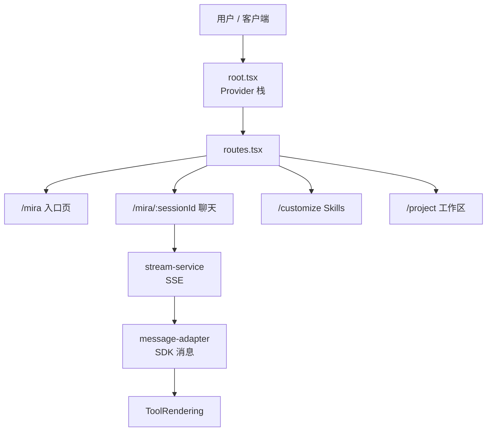
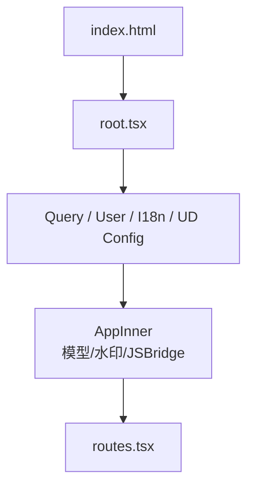
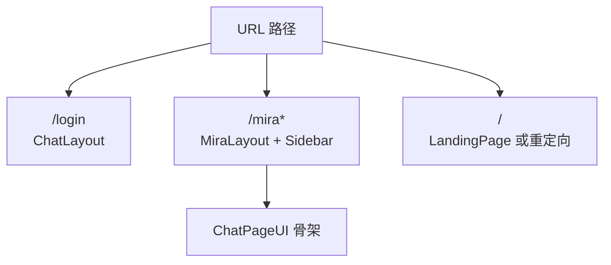
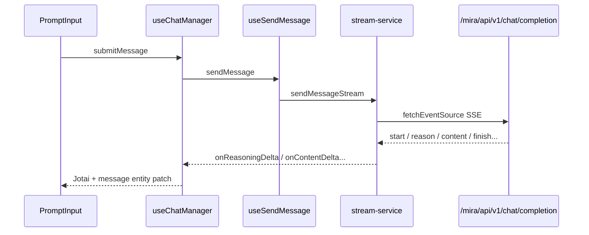
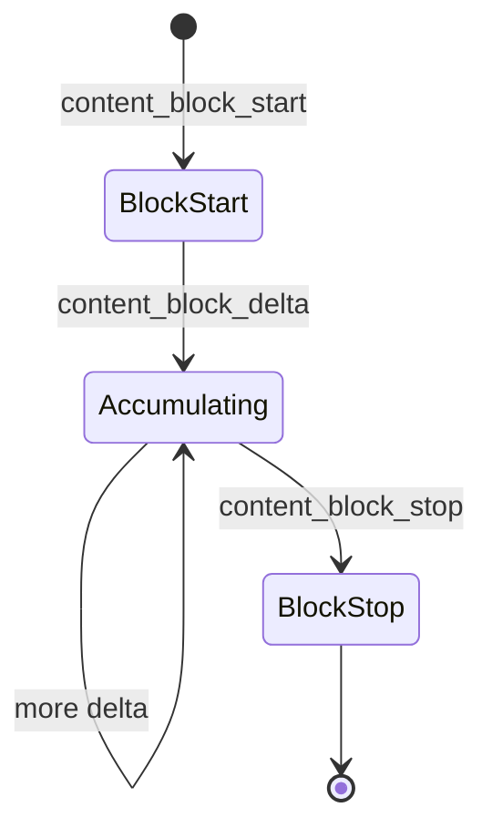

# cis-mira DeepWiki 全文导出
- 仓库: git@code.byted.org:blade/cis-mira.git
- Commit: e8f059ad72082f0d9f35b78714e30d14e6f1c9e8
- 模式: comprehensive

---

## 概览

---

相关源文件

生成本页时使用的主要源文件：

- [README.md](../../../project-repos/cis-mira/README.md)
- [package.json](../../../project-repos/cis-mira/package.json)
- [src/root.tsx](../../../project-repos/cis-mira/src/root.tsx)
- [src/routes/routes.tsx](../../../project-repos/cis-mira/src/routes/routes.tsx)
- [src/design/README.md](../../../project-repos/cis-mira/src/design/README.md)
- [index.html](../../../project-repos/cis-mira/index.html)

# 项目概览

企业里「用一个聊天框调模型」很快就不够用了：要接数据源检索、要挂 Skills 和 MCP、要在 Project 里长期维护上下文，还要在飞书、桌面客户端和浏览器侧边栏里保持同一套体验。**Mira FE** 就是把这些能力压进一个 Vite + React 18 单页应用的前端实现——对内服务 `mira.byteintl.net`，对外通过 CDN + 客户端访问 `mira.bytedance.com`。

和「薄壳调 OpenAPI」不同，这个仓库把 **流式协议解析**（`fetch-event-source` + 自研事件分支）和 **Claude Agent SDK 消息形态**（`content_block_*` 增量块）放在同一套渲染管线里；工具调用不是 JSON 折叠面板，而是 `src/claude/components/ToolRendering/` 下 15+ 个专用组件（Bash、Read、Skill、MCP App 等）。

## 能力全景

- **流式对话**：`/mira/api/v1/chat/completion` SSE；支持 reasoning、正文、数据源摘要、异步任务计数等多阶段事件（`stream-service.ts`）。
- **Agent 与模板**：首页 Agent 区 + 模板卡片；`TEMP_SESSION_ID` 在首条消息时把模型/Agent 配置迁移到真实 session（`use-chat-manager.ts`）。
- **Skills 与 Tools**：技能市场、我的技能、聊天输入栏技能菜单；与 Claude `SkillTool` 渲染联动。
- **Project 工作区**：项目级 instruction、文件、技能、MCP；发送时绑定 `project_agent`（`agent-config.ts`）。
- **任务中心**：定时任务 CRUD + 仪表盘；工具层有 `ScheduleTaskTool`。
- **多端**：Web、飞书 UA 注入客户端版本、Electron BrowserView、Chrome 扩展 Sidepanel（Cookie iframe 代理）。

Sources: [README.md:51-78](../../../project-repos/exports/README.md#L51-L78), [package.json:23-41](../../../project-repos/exports/package.json#L23-L41), [src/root.tsx:45-58](../../../project-repos/exports/src/root.tsx#L45-L58), [src/routes/routes.tsx:69-105](../../../project-repos/exports/src/routes/routes.tsx#L69-L105)

引用源码

<!-- source-snippets:start -->

#### `README.md:51-78`

> 未找到引用文件：`README.md`

#### `package.json:23-41`

> 未找到引用文件：`package.json`

#### `src/root.tsx:45-58`

> 未找到引用文件：`src/root.tsx`

#### `src/routes/routes.tsx:69-105`

> 未找到引用文件：`src/routes/routes.tsx`

<!-- source-snippets:end -->

## 技术栈（数据点）

| 维度 | 选型 |
|------|------|
| 运行时 | React 18.3、TypeScript 5.7、Vite 6.2 |
| 路由 | react-router 7.4（`createBrowserRouter`） |
| 服务端状态 | TanStack React Query 5.71 |
| 客户端状态 | Jotai 2.12 + jotai-mutative |
| UI | Universe Design React 3.28 + `@miracle-design/design-system` token |
| 流式 | `@microsoft/fetch-event-source` 2.0.1 |
| Agent 协议 | `@anthropic-ai/claude-agent-sdk` 0.1.76、MCP SDK 1.29 |
| 富文本 | Slate 0.114（模板/变量 mention） |
| 规模信号 | 约 563 个 `.ts` + 460 个 `.tsx`（仓库盘点） |

Sources: [package.json:6-12](../../../project-repos/exports/package.json#L6-L12), [package.json:54-117](../../../project-repos/exports/package.json#L54-L117), [00-repo-inventory.md:15-17](../../../project-repos/exports/00-repo-inventory.md#L15-L17)

引用源码

<!-- source-snippets:start -->

#### `package.json:6-12`

> 未找到引用文件：`package.json`

#### `package.json:54-117`

> 未找到引用文件：`package.json`

#### `00-repo-inventory.md:15-17`

> 未找到引用文件：`00-repo-inventory.md`

<!-- source-snippets:end -->

## 组件分层（设计系统）

`src/design/README.md` 把 UI 分成三层：**Base（design/ui）** → **Business Feature（design/feature）** → **路由级 Feature modules（src/features）**。路由页只组装 feature，不在页面里堆基础组件——这和「所有按钮都写在 routes 里」的仓库明显不同，也解释了为什么有独立的 `mira-design-system` Claude Skill。

Sources: [src/design/README.md:1-28](../../../project-repos/exports/src/design/README.md#L1-L28)

引用源码

<!-- source-snippets:start -->

#### `src/design/README.md:1-28`

> 未找到引用文件：`src/design/README.md`

<!-- source-snippets:end -->

## 与同类方案的定位

- **相对通用 ChatGPT 式 UI**：Mira 强绑定字节内部鉴权（JWT、`/api/signin`）、数据源 mention、OA/飞书 SDK，以及 Slardar/Tea 埋点（`index.html` 注入）。
- **相对纯 SDK Demo**：前端承担完整「后端 SSE 事件 + Claude 流式块」双协议适配，而不是只渲染 `choices[0].delta.content`。

## 阅读路线

| 目标 | 建议顺序 |
|------|----------|
| 理解全局分层 | 本页 → [系统架构与分层](system-architecture.md) |
| 跟一条聊天消息 | [SSE 流式聊天链路](streaming-chat-pipeline.md) → [消息适配与工具渲染](message-adapter-rendering.md) |
| 做 Skills/Project 功能 | [Skills、Tools 与 MCP](skills-tools-mcp.md) → [Project 工作区](project-workspace.md) |
| 做桌面/扩展 | [多端客户端](multi-platform-clients.md) |
| 发布/样式治理 | [构建、部署与质量](build-deploy-quality.md) |

## 相关页面

- [系统架构与分层](system-architecture.md) — Provider、features、API、store 如何切分
- [SSE 流式聊天链路](streaming-chat-pipeline.md) — 发消息与事件处理的主路径

## 系统架构

---

相关源文件

生成本页时使用的主要源文件：

- [src/root.tsx](../../../project-repos/cis-mira/src/root.tsx)
- [src/design/README.md](../../../project-repos/cis-mira/src/design/README.md)
- [src/api/utils.ts](../../../project-repos/cis-mira/src/api/utils.ts)
- [src/store/atoms/index.ts](../../../project-repos/cis-mira/src/store/atoms/index.ts)
- [src/store/entities/chat/index.ts](../../../project-repos/cis-mira/src/store/entities/chat/index.ts)
- [src/components/chat-layout/mira-layout.tsx](../../../project-repos/cis-mira/src/components/chat-layout/mira-layout.tsx)

# 系统架构与分层

Mira FE 不是「页面 + 若干 utils」的平铺结构，而是刻意把 **壳层（bootstrap）**、**领域 feature**、**Claude 专用渲染** 和 **数据访问** 拆开。这样做的直接收益是：流式聊天可以改 `features/stream` 而不动模板页；工具 UI 可以只在 `src/claude/` 演进而不污染设计系统组件。

## 入口与 Provider 栈

`index.html` 加载 `src/root.tsx`。`AppInner` 在挂载时并行做几件对全局有影响的事：拉模型列表（`fetchModelsAtom`）、初始化 JSBridge、按邮箱打水印、跑地理权限流程。外层再包 `QueryClientProvider`、`UserProvider`、`I18nProvider`、`ConfigProvider`，最后渲染 `RoutesEntry`。

Sources: [src/root.tsx:1-33](../../../project-repos/exports/src/root.tsx#L1-L33), [src/root.tsx:45-58](../../../project-repos/exports/src/root.tsx#L45-L58), [src/root.tsx:100-131](../../../project-repos/exports/src/root.tsx#L100-L131)

引用源码

<!-- source-snippets:start -->

#### `src/root.tsx:1-33`

> 未找到引用文件：`src/root.tsx`

#### `src/root.tsx:45-58`

> 未找到引用文件：`src/root.tsx`

#### `src/root.tsx:100-131`

> 未找到引用文件：`src/root.tsx`

<!-- source-snippets:end -->

## 四层代码地图

| 层 | 目录 | 职责 |
|----|------|------|
| 路由页 | `src/routes/` | 懒加载页面、组合 feature 组件 |
| 领域功能 | `src/features/` | stream、skill、project、task-center、i18n 等 |
| Claude 渲染 | `src/claude/` | ToolRendering、工具埋点、消息项 |
| 共享基础设施 | `src/api/`、`src/store/`、`src/lib/`、`src/components/` | HTTP、状态、协议适配、布局 |

`src/features/` 下约有 27 个子模块；与聊天强相关的是 `stream`（SSE）、`skill`、`project`、`tools`、`task-center`。

Sources: [src/design/README.md:5-28](../../../project-repos/exports/src/design/README.md#L5-L28)

引用源码

<!-- source-snippets:start -->

#### `src/design/README.md:5-28`

> 未找到引用文件：`src/design/README.md`

<!-- source-snippets:end -->

## API 访问层

顶层 `src/api/` 提供按资源划分的模块（`chat.ts`、`message.ts`、`skill.ts`、`mcp.ts` 等）。所有需要登录的请求走 `fetchWithJWT`：自动附加 `jwt-token`、`x-mira-client`、`x-mira-timezone`，公网场景还可带 `x-mira-internal-net`（与内网探测配合）。

**设计取舍**：feature 内也有 `api/` 子目录（如 `features/skill/api/skill.ts`），路径前缀统一为 `/mira/api/v1/...`，避免页面直接拼 URL。

Sources: [src/api/utils.ts:18-75](../../../project-repos/exports/src/api/utils.ts#L18-L75)

引用源码

<!-- source-snippets:start -->

#### `src/api/utils.ts:18-75`

> 未找到引用文件：`src/api/utils.ts`

<!-- source-snippets:end -->

## Store：Jotai + React Query

- **Jotai（`src/store/atoms/`）**：流式进行中标志、输入框草稿、LLM 选择、第三栏、任务中心等 **高频 UI 态**。
- **React Query entities（`src/store/entities/chat|message/`）**：会话列表、历史消息、流式 patch 的 **服务端镜像**。

流式期间大量更新走 atom + 本地 patch，避免每条 delta 都 invalidate 整页 query——这是消息列表能撑住长推理输出的关键。

Sources: [src/store/atoms/chat-stream-state.ts:1-40](../../../project-repos/exports/src/store/atoms/chat-stream-state.ts#L1-L40), [src/store/entities/message/index.ts:1-30](../../../project-repos/exports/src/store/entities/message/index.ts#L1-L30)

引用源码

<!-- source-snippets:start -->

#### `src/store/atoms/chat-stream-state.ts:1-40`

> 未找到引用文件：`src/store/atoms/chat-stream-state.ts`

#### `src/store/entities/message/index.ts:1-30`

> 未找到引用文件：`src/store/entities/message/index.ts`

<!-- source-snippets:end -->

## MiraLayout 应用壳

`MiraLayout` 包裹主聊天路由：侧栏会话列表、模型初始化、TCC 公告、按平台隐藏/展示侧栏（Electron、Flutter 与纯 Web 行为不同）。聊天页 UI 骨架在 `ChatPageUI`，与「登录轻布局」`ChatLayout` 分离。

Sources: [src/components/chat-layout/mira-layout.tsx:28-74](../../../project-repos/exports/src/components/chat-layout/mira-layout.tsx#L28-L74)

引用源码

<!-- source-snippets:start -->

#### `src/components/chat-layout/mira-layout.tsx:28-74`

> 未找到引用文件：`src/components/chat-layout/mira-layout.tsx`

<!-- source-snippets:end -->

## 相关页面

- [项目概览](overview.md) — 产品面与技术栈
- [状态管理](state-management.md) — atom 与 query 的详细分工
- [路由、布局与认证](routing-layouts-auth.md) — 路由树与 VPN loader

---

相关源文件

生成本页时使用的主要源文件：

- [src/routes/routes.tsx](../../../project-repos/cis-mira/src/routes/routes.tsx)
- [src/constants/route.ts](../../../project-repos/cis-mira/src/constants/route.ts)
- [src/components/chat-layout/mira-layout.tsx](../../../project-repos/cis-mira/src/components/chat-layout/mira-layout.tsx)
- [src/utils/auth.ts](../../../project-repos/cis-mira/src/utils/auth.ts)
- [src/contexts/user/provider.tsx](../../../project-repos/cis-mira/src/contexts/user/provider.tsx)
- [src/lib/vpn-redirect.ts](../../../project-repos/cis-mira/src/lib/vpn-redirect.ts)

# 路由、布局与认证

路由文件 `routes.tsx` 同时承担三件事：**懒加载分包**、**按客户端类型改默认跳转**、**公网域名的 VPN/内网探测**。认证则分散在路径守卫、UserProvider 和 API 层的 JWT 头里——没有单独的「auth 微前端」，但三条链路必须一起理解，否则会出现「本地 dev 正常、公网 404 到 app-vpn」这类环境差异问题。

## 路由树要点

`createDynamicRoutes()` 根据 `getIsFlutter()` 决定 `/` 是落地页还是直接 `Navigate` 到 `/mira`。主会话挂在 `MiraLayout` 下：

- `/mira` index → `RootPage`（模板/Agent 入口）
- `/mira/:sessionId` → `ChatPage`
- `/mira/search`、`/mira/template` 等同布局子路由
- `/customize/skills/*` → 技能管理与市场
- `/project/*` → 项目列表与详情
- `/task/*` → 任务中心

`CHAT_ROUTE`、`MIRA_ROUTE` 等常量集中在 `src/constants/route.ts`，避免魔法字符串散落。

Sources: [src/routes/routes.tsx:69-120](../../../project-repos/exports/src/routes/routes.tsx#L69-L120), [src/constants/route.ts:1-30](../../../project-repos/exports/src/constants/route.ts#L1-L30), [README.md:51-78](../../../project-repos/exports/README.md#L51-L78)

引用源码

<!-- source-snippets:start -->

#### `src/routes/routes.tsx:69-120`

> 未找到引用文件：`src/routes/routes.tsx`

#### `src/constants/route.ts:1-30`

> 未找到引用文件：`src/constants/route.ts`

#### `README.md:51-78`

> 未找到引用文件：`README.md`

<!-- source-snippets:end -->

## VPN 与公网白名单

`vpnRedirectLoader` 在 **非客户端** 且 **公网域名** `mira.bytedance.com` 时异步等待 `checkIsInternalNetwork()`：

- 内网用户访问 `/share/:id` 会重定向到 `/app-link/share?session_id=...`（唤起客户端）
- 外网用户若路径不在白名单，重定向 `/app-vpn`

内网构建模式 `intranet` 会关闭 `shouldRedirectToVpn()`，与 README 里 Bifrost 代理本地 dev 的场景一致。

Sources: [src/routes/routes.tsx:30-67](../../../project-repos/exports/src/routes/routes.tsx#L30-L67), [src/routes/routes.tsx:71-72](../../../project-repos/exports/src/routes/routes.tsx#L71-L72)

引用源码

<!-- source-snippets:start -->

#### `src/routes/routes.tsx:30-67`

> 未找到引用文件：`src/routes/routes.tsx`

#### `src/routes/routes.tsx:71-72`

> 未找到引用文件：`src/routes/routes.tsx`

<!-- source-snippets:end -->

## 认证链路

| 环节 | 行为 |
|------|------|
| 路径守卫 | `AUTH_REQUIRED_PATHS` 正则决定哪些路由必须先有用户态 |
| UserProvider | 并行拉用户信息、飞书 SDK、Lark 鉴权；绑定 Slardar/Tea |
| 登录页 | 未登录约 1s 后跳转 `/api/signin?originUrl=...` |
| API | `fetchWithJWT` 附带 `jwt-token`；`20001` 等码触发重新登录 |

客户端通过 `window.MIRA_CLIENT_VERSION` 识别，VPN loader 直接放行（不在 Web 里做公网拦截）。

Sources: [src/utils/auth.ts:1-19](../../../project-repos/exports/src/utils/auth.ts#L1-L19), [src/contexts/user/provider.tsx:22-80](../../../project-repos/exports/src/contexts/user/provider.tsx#L22-L80), [src/api/utils.ts:28-67](../../../project-repos/exports/src/api/utils.ts#L28-L67)

引用源码

<!-- source-snippets:start -->

#### `src/utils/auth.ts:1-19`

> 未找到引用文件：`src/utils/auth.ts`

#### `src/contexts/user/provider.tsx:22-80`

> 未找到引用文件：`src/contexts/user/provider.tsx`

#### `src/api/utils.ts:28-67`

> 未找到引用文件：`src/api/utils.ts`

<!-- source-snippets:end -->

## 布局选择

Sources: [src/components/chat-layout/chat-layout.tsx:16-30](../../../project-repos/exports/src/components/chat-layout/chat-layout.tsx#L16-L30), [src/components/chat-layout/mira-layout.tsx:28-50](../../../project-repos/exports/src/components/chat-layout/mira-layout.tsx#L28-L50)

引用源码

<!-- source-snippets:start -->

#### `src/components/chat-layout/chat-layout.tsx:16-30`

> 未找到引用文件：`src/components/chat-layout/chat-layout.tsx`

#### `src/components/chat-layout/mira-layout.tsx:28-50`

> 未找到引用文件：`src/components/chat-layout/mira-layout.tsx`

<!-- source-snippets:end -->

## 相关页面

- [系统架构与分层](system-architecture.md)
- [SSE 流式聊天链路](streaming-chat-pipeline.md) — 会话失效跳转 signin
- [多端客户端](multi-platform-clients.md) — 客户端跳过 VPN 逻辑

---

相关源文件

生成本页时使用的主要源文件：

- [src/store/atoms/chat-stream-state.ts](../../../project-repos/cis-mira/src/store/atoms/chat-stream-state.ts)
- [src/store/atoms/chat-input.ts](../../../project-repos/cis-mira/src/store/atoms/chat-input.ts)
- [src/store/entities/message/index.ts](../../../project-repos/cis-mira/src/store/entities/message/index.ts)
- [src/store/entities/chat/index.ts](../../../project-repos/cis-mira/src/store/entities/chat/index.ts)
- [src/lib/query.ts](../../../project-repos/cis-mira/src/lib/query.ts)
- [src/lib/session-config.ts](../../../project-repos/cis-mira/src/lib/session-config.ts)

# 状态管理

Mira 同时用 **Jotai** 和 **TanStack React Query**，不是重复建设：前者管「这一屏的交互态」，后者管「服务端数据的缓存与失效」。流式聊天如果全走 Query invalidate，长推理阶段会把列表打爆；所以 delta 路径优先写 atom + message entity 的局部 patch。

## 分工表

| 场景 | 机制 | 典型 atom/query |
|------|------|-----------------|
| 是否正在流式输出 | Jotai | `chat-stream-state` |
| 输入框内容、附件 | Jotai | `chat-input`、`attachments-column` |
| 当前 LLM、模型列表 | Jotai | `llm`、`fetchModelsAtom` |
| 会话列表 CRUD | React Query | `store/entities/chat` |
| 消息列表、加载更多 | React Query | `store/entities/message` |
| 按 session 的配置 | 内存 + sessionStorage | `session-config.ts` |

Sources: [src/store/atoms/index.ts:1-30](../../../project-repos/exports/src/store/atoms/index.ts#L1-L30), [src/lib/query.ts:1-25](../../../project-repos/exports/src/lib/query.ts#L1-L25)

引用源码

<!-- source-snippets:start -->

#### `src/store/atoms/index.ts:1-30`

> 未找到引用文件：`src/store/atoms/index.ts`

#### `src/lib/query.ts:1-25`

> 未找到引用文件：`src/lib/query.ts`

<!-- source-snippets:end -->

## Session 配置模型

`getSessionConfig` / `getDefaultSessionConfig` 把 agent、模型、skill 等选择绑定在 sessionId 上。`TEMP_SESSION_ID` 是首页占位会话，首条消息发送时迁移到真实 ID（见 [首页、Agent 与模板](templates-agents-home.md)）。

Sources: [src/lib/session-config.ts:1-50](../../../project-repos/exports/src/lib/session-config.ts#L1-L50)

引用源码

<!-- source-snippets:start -->

#### `src/lib/session-config.ts:1-50`

> 未找到引用文件：`src/lib/session-config.ts`

<!-- source-snippets:end -->

## Message Entity 与流式 patch

`store/entities/message` 封装 queries（拉历史）、mutations（发送后插入）、以及流式过程中的 **load-state**（是否还有更早消息）。与 `stream-service` 回调配合时，往往只更新当前 answer 消息 id 对应缓存，而不是 refetch 全列表。

Sources: [src/store/entities/message/index.ts:1-40](../../../project-repos/exports/src/store/entities/message/index.ts#L1-L40), [src/store/entities/message/load-state.ts:1-30](../../../project-repos/exports/src/store/entities/message/load-state.ts#L1-L30)

引用源码

<!-- source-snippets:start -->

#### `src/store/entities/message/index.ts:1-40`

> 未找到引用文件：`src/store/entities/message/index.ts`

#### `src/store/entities/message/load-state.ts:1-30`

> 未找到引用文件：`src/store/entities/message/load-state.ts`

<!-- source-snippets:end -->

## 相关页面

- [SSE 流式聊天链路](streaming-chat-pipeline.md)
- [系统架构与分层](system-architecture.md)

## 对话与消息

---

相关源文件

生成本页时使用的主要源文件：

- [src/hooks/use-chat-manager.ts](../../../project-repos/cis-mira/src/hooks/use-chat-manager.ts)
- [src/features/stream/hooks/use-send-message.ts](../../../project-repos/cis-mira/src/features/stream/hooks/use-send-message.ts)
- [src/features/stream/services/stream-service.ts](../../../project-repos/cis-mira/src/features/stream/services/stream-service.ts)
- [src/features/stream/hooks/use-stream-base.ts](../../../project-repos/cis-mira/src/features/stream/hooks/use-stream-base.ts)
- [src/features/stream/constants/api.ts](../../../project-repos/cis-mira/src/features/stream/constants/api.ts)
- [src/store/atoms/chat-stream-state.ts](../../../project-repos/cis-mira/src/store/atoms/chat-stream-state.ts)

# SSE 流式聊天链路

用户点发送后，前端要在 **会话 ID 可能刚从 TEMP 迁移**、**Project Agent 要写入 sessionStorage**、**SSE 要可中断续流** 三个约束下，把一条用户消息变成可增量渲染的 assistant 消息。主路径是 `useChatManager` → `useSendMessage` → `sendMessageStream` → `executeStreamRequest`（`@microsoft/fetch-event-source`）。

## 端到端序列

Sources: [src/hooks/use-chat-manager.ts:82-154](../../../project-repos/exports/src/hooks/use-chat-manager.ts#L82-L154), [src/features/stream/constants/api.ts:7-11](../../../project-repos/exports/src/features/stream/constants/api.ts#L7-L11)

引用源码

<!-- source-snippets:start -->

#### `src/hooks/use-chat-manager.ts:82-154`

> 未找到引用文件：`src/hooks/use-chat-manager.ts`

#### `src/features/stream/constants/api.ts:7-11`

> 未找到引用文件：`src/features/stream/constants/api.ts`

<!-- source-snippets:end -->

## 发送前：上下文与 Agent

`use-send-message.ts` 在请求体里组装 `meta.user_query_context`：Project 场景把 agent 归一化为 `project_agent`；还支持 geo、本地文件路径、飞书文档、数据源 mention 等。`buildRequestConfig` 合并 session 配置里的 `agent_name`、`skill_names`。

**Insight**：`PROJECT_INTERNAL_AGENT` 在 `agent-config.ts` 里被标成「不得作为真实 agent id 出现在 UI」，否则会出现幽灵选中——发送链路里对 project 的特殊分支要和这个常量一起看。

Sources: [src/features/stream/hooks/use-send-message.ts:42-125](../../../project-repos/exports/src/features/stream/hooks/use-send-message.ts#L42-L125), [src/features/stream/services/stream-service.ts:45-55](../../../project-repos/exports/src/features/stream/services/stream-service.ts#L45-L55)

引用源码

<!-- source-snippets:start -->

#### `src/features/stream/hooks/use-send-message.ts:42-125`

> 未找到引用文件：`src/features/stream/hooks/use-send-message.ts`

#### `src/features/stream/services/stream-service.ts:45-55`

> 未找到引用文件：`src/features/stream/services/stream-service.ts`

<!-- source-snippets:end -->

## stream-service：SSE 核心

- 端点：`SEND_MESSAGE_V1`、`RESUME_STREAM_MESSAGE_V1`（续流）
- `executeStreamRequest` 里对每条 SSE message 做 `JSON.parse`，失败才 `jsonrepair`——注释明确为避免无条件 repair 导致内存膨胀
- 事件类型覆盖：推理开始/增量、正文增量、数据源摘要进度、异步任务计数、`start` 事件里还有「建联」状态栏的 HACK

**Mock 模式**：`MOCK_CONFIG.ENABLED` 为 true 时从 `public/sse/messages.txt` 回放，用于本地复现崩溃或超长流（`stream-service.ts` 顶部常量块）。

Sources: [src/features/stream/services/stream-service.ts:32-41](../../../project-repos/exports/src/features/stream/services/stream-service.ts#L32-L41), [src/features/stream/services/stream-service.ts:410-452](../../../project-repos/exports/src/features/stream/services/stream-service.ts#L410-L452), [src/features/stream/services/stream-service.ts:668-673](../../../project-repos/exports/src/features/stream/services/stream-service.ts#L668-L673)

引用源码

<!-- source-snippets:start -->

#### `src/features/stream/services/stream-service.ts:32-41`

> 未找到引用文件：`src/features/stream/services/stream-service.ts`

#### `src/features/stream/services/stream-service.ts:410-452`

> 未找到引用文件：`src/features/stream/services/stream-service.ts`

#### `src/features/stream/services/stream-service.ts:668-673`

> 未找到引用文件：`src/features/stream/services/stream-service.ts`

<!-- source-snippets:end -->

## use-stream-base：Abort 与 Answer Shell

`use-stream-base` 持有 `AbortController`、与 `pre-created-answer-shell-controller` 协作，在流式过程中更新 Jotai `chat-stream-state`，并触发增量 `parseStreamingEventsIncremental`（见消息适配章节）。

会话失效：`code=20001` 时跳转 `/api/signin`（与 `api/utils.ts` 一致）。

Sources: [src/features/stream/hooks/use-stream-base.ts:67-146](../../../project-repos/exports/src/features/stream/hooks/use-stream-base.ts#L67-L146), [src/store/atoms/chat-stream-state.ts:1-25](../../../project-repos/exports/src/store/atoms/chat-stream-state.ts#L1-L25)

引用源码

<!-- source-snippets:start -->

#### `src/features/stream/hooks/use-stream-base.ts:67-146`

> 未找到引用文件：`src/features/stream/hooks/use-stream-base.ts`

#### `src/store/atoms/chat-stream-state.ts:1-25`

> 未找到引用文件：`src/store/atoms/chat-stream-state.ts`

<!-- source-snippets:end -->

## TEMP_SESSION 迁移

首页选的模型/Agent 存在 `TEMP_SESSION_ID` 对应配置里；`use-chat-manager` 在首条消息发送时把配置 **复制** 到真实 `sessionId`，并刻意不删除模板 session——否则模板入口二次使用会丢配置。

Sources: [src/hooks/use-chat-manager.ts:115-133](../../../project-repos/exports/src/hooks/use-chat-manager.ts#L115-L133), [src/lib/session-config.ts:1-40](../../../project-repos/exports/src/lib/session-config.ts#L1-L40)

引用源码

<!-- source-snippets:start -->

#### `src/hooks/use-chat-manager.ts:115-133`

> 未找到引用文件：`src/hooks/use-chat-manager.ts`

#### `src/lib/session-config.ts:1-40`

> 未找到引用文件：`src/lib/session-config.ts`

<!-- source-snippets:end -->

## 相关页面

- [消息适配与工具渲染](message-adapter-rendering.md) — SSE 之后的 SDK 块解析
- [状态管理](state-management.md) — 流式 atom 与 message entity
- [Project 工作区](project-workspace.md) — project_agent 发送分支

---

相关源文件

生成本页时使用的主要源文件：

- [src/lib/message-adapter/utils/parse-streaming-events.ts](../../../project-repos/cis-mira/src/lib/message-adapter/utils/parse-streaming-events.ts)
- [src/routes/chat-page/components/messages/manus-message-list.tsx](../../../project-repos/cis-mira/src/routes/chat-page/components/messages/manus-message-list.tsx)
- [src/claude/components/ToolRendering/ToolUseRenderer.tsx](../../../project-repos/cis-mira/src/claude/components/ToolRendering/ToolUseRenderer.tsx)
- [src/features/stream/hooks/pre-created-answer-shell-controller.ts](../../../project-repos/cis-mira/src/features/stream/hooks/pre-created-answer-shell-controller.ts)
- [src/routes/chat-page/components/messages/message-item/content-block-shared.tsx](../../../project-repos/cis-mira/src/routes/chat-page/components/messages/message-item/content-block-shared.tsx)

# 消息适配与工具渲染

后端 SSE 事件与 Claude Agent SDK 的 `content_block_start/delta/stop` 流式块是 **两套协议**。`message-adapter` 的职责是把它们收敛成统一的 `SDKMessage`，再交给 `ToolUseRenderer` 按块类型画 UI。若只读 `stream-service` 而不读适配层，会误以为「推理文字」和「tool_use JSON」来自同一字段。

## 流式块解析（v2）

`parse-streaming-events.ts` 文件头注释写清了 v2 目标：**输入输出都用 SDK 标准类型**，不展开自定义 message 形状。处理策略用 `Map` 按 `index` 缓存 partial block，在 `content_block_stop` 或完整 assistant 消息到达时落盘。

支持块类型包括 `text`、`thinking`（extended thinking）、`tool_use`（JSON 参数流式拼接）。

Sources: [src/lib/message-adapter/utils/parse-streaming-events.ts:16-53](../../../project-repos/exports/src/lib/message-adapter/utils/parse-streaming-events.ts#L16-L53), [src/lib/message-adapter/utils/parse-streaming-events.ts:170-175](../../../project-repos/exports/src/lib/message-adapter/utils/parse-streaming-events.ts#L170-L175), [src/lib/message-adapter/utils/parse-streaming-events.ts:684-687](../../../project-repos/exports/src/lib/message-adapter/utils/parse-streaming-events.ts#L684-L687)

引用源码

<!-- source-snippets:start -->

#### `src/lib/message-adapter/utils/parse-streaming-events.ts:16-53`

> 未找到引用文件：`src/lib/message-adapter/utils/parse-streaming-events.ts`

#### `src/lib/message-adapter/utils/parse-streaming-events.ts:170-175`

> 未找到引用文件：`src/lib/message-adapter/utils/parse-streaming-events.ts`

#### `src/lib/message-adapter/utils/parse-streaming-events.ts:684-687`

> 未找到引用文件：`src/lib/message-adapter/utils/parse-streaming-events.ts`

<!-- source-snippets:end -->

## 列表渲染与 ViewData 缓存

`manus-message-list.tsx` 为长列表做了 **ViewData 缓存**：非流式场景下，AgentReasoning 等大 JSON 解析后可以释放原始 content，避免数 MB 级字符串常驻内存。文件内注释把「缓存 + 释放」标成设计原则，不是可选优化。

流式过程中走 `parseStreamingEventsIncremental`，与 `use-stream-base` 联动。

Sources: [src/routes/chat-page/components/messages/manus-message-list.tsx:30-100](../../../project-repos/exports/src/routes/chat-page/components/messages/manus-message-list.tsx#L30-L100)

引用源码

<!-- source-snippets:start -->

#### `src/routes/chat-page/components/messages/manus-message-list.tsx:30-100`

> 未找到引用文件：`src/routes/chat-page/components/messages/manus-message-list.tsx`

<!-- source-snippets:end -->

## Answer Shell 单点所有权

`pre-created-answer-shell-controller.ts` 明确禁止再引入第二份 `tempAnswerMessageId` 状态。流式开始前预创建 answer 消息壳，由单一 controller 更新——否则会出现重复气泡或光标错位。

Sources: [src/features/stream/hooks/pre-created-answer-shell-controller.ts:3-26](../../../project-repos/exports/src/features/stream/hooks/pre-created-answer-shell-controller.ts#L3-L26)

引用源码

<!-- source-snippets:start -->

#### `src/features/stream/hooks/pre-created-answer-shell-controller.ts:3-26`

> 未找到引用文件：`src/features/stream/hooks/pre-created-answer-shell-controller.ts`

<!-- source-snippets:end -->

## ToolRendering 组件树

`ToolUseRenderer` 组合 `ToolLabel` + `ToolContent`，按 `tool name` 分发到 `tools/` 子目录：

- 文件类：Read、Write、Edit
- 执行类：Bash
- 产品能力：SkillTool、SkillCreateTool、ScheduleTaskTool
- MCP：`McpAppView`

`content-block-shared.tsx` 在消息项层引用 `ToolUseRenderer`，把「块级渲染」和「消息项布局」分开。

Sources: [src/claude/components/ToolRendering/ToolUseRenderer.tsx:26-69](../../../project-repos/exports/src/claude/components/ToolRendering/ToolUseRenderer.tsx#L26-L69), [src/routes/chat-page/components/messages/message-item/content-block-shared.tsx:6-20](../../../project-repos/exports/src/routes/chat-page/components/messages/message-item/content-block-shared.tsx#L6-L20)

引用源码

<!-- source-snippets:start -->

#### `src/claude/components/ToolRendering/ToolUseRenderer.tsx:26-69`

> 未找到引用文件：`src/claude/components/ToolRendering/ToolUseRenderer.tsx`

#### `src/routes/chat-page/components/messages/message-item/content-block-shared.tsx:6-20`

> 未找到引用文件：`src/routes/chat-page/components/messages/message-item/content-block-shared.tsx`

<!-- source-snippets:end -->

## 滚动引擎取舍

`platform.ts` 默认 `getPreferredScrollEngine()` 返回 `'smart'`（自研 SmartScroll），注释记录 Virtuoso 反向锚定在流式场景下的竞态——这是消息列表能跟住快速 delta 的另一个隐性依赖。

Sources: [src/lib/platform.ts:203-211](../../../project-repos/exports/src/lib/platform.ts#L203-L211)

引用源码

<!-- source-snippets:start -->

#### `src/lib/platform.ts:203-211`

> 未找到引用文件：`src/lib/platform.ts`

<!-- source-snippets:end -->

## 相关页面

- [SSE 流式聊天链路](streaming-chat-pipeline.md)
- [Skills、Tools 与 MCP](skills-tools-mcp.md) — SkillTool / McpAppView
- [状态管理](state-management.md)

## 能力扩展

---

相关源文件

生成本页时使用的主要源文件：

- [src/features/skill/api/skill.ts](../../../project-repos/cis-mira/src/features/skill/api/skill.ts)
- [src/routes/skill-management/index.tsx](../../../project-repos/cis-mira/src/routes/skill-management/index.tsx)
- [src/features/tools/components/skill-menu-dropdown.tsx](../../../project-repos/cis-mira/src/features/tools/components/skill-menu-dropdown.tsx)
- [src/api/mcp.ts](../../../project-repos/cis-mira/src/api/mcp.ts)
- [src/claude/components/ToolRendering/tools/SkillTool.tsx](../../../project-repos/cis-mira/src/claude/components/ToolRendering/tools/SkillTool.tsx)
- [src/claude/components/ToolRendering/tools/McpAppView.tsx](../../../project-repos/cis-mira/src/claude/components/ToolRendering/tools/McpAppView.tsx)

# Skills、Tools 与 MCP

Skills 在 Mira 里既是 **可运营的能力商品**（市场、分类、我的技能），也是 **聊天会话里的可选能力包**（`skill_names` 写入 completion 请求）。MCP 则走独立 API 与 `McpAppView` 工具 UI，和 Claude SDK 的 tool_use 块对齐。

## 路由与页面

`/customize/skills` 下分市场、我的技能、详情等子路由；`skill-management/index.tsx` 用 Tab 切换 Market / MySkills。聊天侧通过 `SkillMenuDropdown`、单技能开关按钮等组件把选择反映到 session 配置。

Sources: [src/routes/skill-management/index.tsx:16-40](../../../project-repos/exports/src/routes/skill-management/index.tsx#L16-L40), [src/features/skill/api/skill.ts:5-20](../../../project-repos/exports/src/features/skill/api/skill.ts#L5-L20)

引用源码

<!-- source-snippets:start -->

#### `src/routes/skill-management/index.tsx:16-40`

> 未找到引用文件：`src/routes/skill-management/index.tsx`

#### `src/features/skill/api/skill.ts:5-20`

> 未找到引用文件：`src/features/skill/api/skill.ts`

<!-- source-snippets:end -->

## API 边界

技能 REST 前缀：`/mira/api/v1/skill`（`features/skill/api/skill.ts`）。顶层 `src/api/skill.ts` 与 feature API 并存，页面应优先走 feature 封装。

发送消息时 `stream-service` 的 `buildRequestConfig` 把 `skill_names` 并入 request config，与 agent_name 同级。

Sources: [src/features/stream/services/stream-service.ts:45-55](../../../project-repos/exports/src/features/stream/services/stream-service.ts#L45-L55)

引用源码

<!-- source-snippets:start -->

#### `src/features/stream/services/stream-service.ts:45-55`

> 未找到引用文件：`src/features/stream/services/stream-service.ts`

<!-- source-snippets:end -->

## 工具渲染

| 工具 UI | 场景 |
|---------|------|
| `SkillTool` | 模型调用已注册 Skill |
| `SkillCreateTool` | 创建/更新技能类工具 |
| `McpAppView` | MCP App 扩展可视化 |

工具埋点在 `claude/utils/tool-tracking.ts`，与 Tea/Slardar 报表联动。

Sources: [src/claude/components/ToolRendering/tools/SkillTool.tsx:1-40](../../../project-repos/exports/src/claude/components/ToolRendering/tools/SkillTool.tsx#L1-L40), [src/claude/components/ToolRendering/tools/McpAppView.tsx:1-40](../../../project-repos/exports/src/claude/components/ToolRendering/tools/McpAppView.tsx#L1-L40)

引用源码

<!-- source-snippets:start -->

#### `src/claude/components/ToolRendering/tools/SkillTool.tsx:1-40`

> 未找到引用文件：`src/claude/components/ToolRendering/tools/SkillTool.tsx`

#### `src/claude/components/ToolRendering/tools/McpAppView.tsx:1-40`

> 未找到引用文件：`src/claude/components/ToolRendering/tools/McpAppView.tsx`

<!-- source-snippets:end -->

## 相关页面

- [消息适配与工具渲染](message-adapter-rendering.md)
- [首页、Agent 与模板](templates-agents-home.md) — 模板编辑里的 Skill 选择
- [Project 工作区](project-workspace.md) — 项目级技能绑定

---

相关源文件

生成本页时使用的主要源文件：

- [src/routes/project/detail.tsx](../../../project-repos/cis-mira/src/routes/project/detail.tsx)
- [src/features/project/components/project-chat-input.tsx](../../../project-repos/cis-mira/src/features/project/components/project-chat-input.tsx)
- [src/lib/agent-config.ts](../../../project-repos/cis-mira/src/lib/agent-config.ts)
- [src/features/project/api/project.ts](../../../project-repos/cis-mira/src/features/project/api/project.ts)
- [src/features/project/hooks/use-project-skills.ts](../../../project-repos/cis-mira/src/features/project/hooks/use-project-skills.ts)

# Project 工作区

Project 把「长期上下文」从单次聊天里抽出来：指令、文件、技能、MCP、数据源等模块在详情页分卡片管理，聊天输入走 `project-chat-input`，发送链路自动带上 **内部 Agent** `project_agent`（对用户不可见为可选 Agent）。

## 详情页模块

`project/detail.tsx` 组合 instruction、文件列表、技能、MCP、数据源等子模块；升级 Banner、可见性设置等运营向 UI 也在此层。

Sources: [src/routes/project/detail.tsx:17-50](../../../project-repos/exports/src/routes/project/detail.tsx#L17-L50)

引用源码

<!-- source-snippets:start -->

#### `src/routes/project/detail.tsx:17-50`

> 未找到引用文件：`src/routes/project/detail.tsx`

<!-- source-snippets:end -->

## project_agent 约束

`PROJECT_INTERNAL_AGENT = 'project_agent'` 用于发送时归一化 agent，但 **不能** 作为用户可选 agent 出现在选择器——否则 UI 会出现「选中了内部占位 Agent」的幽灵状态。注释在 `agent-config.ts` 里写得很直白，属于前后端契约的一部分。

Sources: [src/lib/agent-config.ts:17-27](../../../project-repos/exports/src/lib/agent-config.ts#L17-L27), [src/features/stream/hooks/use-send-message.ts:42-70](../../../project-repos/exports/src/features/stream/hooks/use-send-message.ts#L42-L70)

引用源码

<!-- source-snippets:start -->

#### `src/lib/agent-config.ts:17-27`

> 未找到引用文件：`src/lib/agent-config.ts`

#### `src/features/stream/hooks/use-send-message.ts:42-70`

> 未找到引用文件：`src/features/stream/hooks/use-send-message.ts`

<!-- source-snippets:end -->

## 技能与模块 Hook

`use-project-skills`、`use-project-modules`、`use-project-mutations` 把列表拉取与变更收口在 feature 层；notes 目录下有集成说明 markdown（给 PM/设计协同用，不是运行时配置）。

Sources: [src/features/project/hooks/use-project-skills.ts:1-40](../../../project-repos/exports/src/features/project/hooks/use-project-skills.ts#L1-L40), [src/features/project/api/project.ts:1-30](../../../project-repos/exports/src/features/project/api/project.ts#L1-L30)

引用源码

<!-- source-snippets:start -->

#### `src/features/project/hooks/use-project-skills.ts:1-40`

> 未找到引用文件：`src/features/project/hooks/use-project-skills.ts`

#### `src/features/project/api/project.ts:1-30`

> 未找到引用文件：`src/features/project/api/project.ts`

<!-- source-snippets:end -->

## 相关页面

- [SSE 流式聊天链路](streaming-chat-pipeline.md)
- [Skills、Tools 与 MCP](skills-tools-mcp.md)

---

相关源文件

生成本页时使用的主要源文件：

- [src/routes/root-page/mira.tsx](../../../project-repos/cis-mira/src/routes/root-page/mira.tsx)
- [src/routes/root-page/components/template-section.tsx](../../../project-repos/cis-mira/src/routes/root-page/components/template-section.tsx)
- [src/routes/create-template/index.tsx](../../../project-repos/cis-mira/src/routes/create-template/index.tsx)
- [src/lib/template-cache.ts](../../../project-repos/cis-mira/src/lib/template-cache.ts)
- [src/lib/session-config.ts](../../../project-repos/cis-mira/src/lib/session-config.ts)
- [src/hooks/use-chat-manager.ts](../../../project-repos/cis-mira/src/hooks/use-chat-manager.ts)

# 首页、Agent 与模板

`/mira` 首页是 **发起会话前的配置枢纽**：选 Agent、选模板、选数据源，再进入 `MiraChatEntryPromptInput`。模板不仅是静态文案，而是通过 Slate `EntryEditor` 支持变量与 mention；配置在首条消息前挂在 `TEMP_SESSION_ID` 上。

## 首页结构

`root-page/mira.tsx` 组装 `TemplateSection`、`AgentSection`、推荐 Prompt 轮播、数据源选择等。`auto-start-chat-from-query` 支持 URL 预填直接开聊。

Sources: [src/routes/root-page/mira.tsx:1-50](../../../project-repos/exports/src/routes/root-page/mira.tsx#L1-L50), [src/routes/root-page/components/template-section.tsx:1-40](../../../project-repos/exports/src/routes/root-page/components/template-section.tsx#L1-L40)

引用源码

<!-- source-snippets:start -->

#### `src/routes/root-page/mira.tsx:1-50`

> 未找到引用文件：`src/routes/root-page/mira.tsx`

#### `src/routes/root-page/components/template-section.tsx:1-40`

> 未找到引用文件：`src/routes/root-page/components/template-section.tsx`

<!-- source-snippets:end -->

## 模板创建与缓存

`create-template/index.tsx` 使用 `EntryEditor` + 模型配置 + `SkillMenuDropdown`。`template-cache.ts` 做本地草稿/列表缓存，减少重复拉取。

`save-template` 路由支持从已有会话反存为模板。

Sources: [src/routes/create-template/index.tsx:31-80](../../../project-repos/exports/src/routes/create-template/index.tsx#L31-L80), [src/lib/template-cache.ts:1-40](../../../project-repos/exports/src/lib/template-cache.ts#L1-L40)

引用源码

<!-- source-snippets:start -->

#### `src/routes/create-template/index.tsx:31-80`

> 未找到引用文件：`src/routes/create-template/index.tsx`

#### `src/lib/template-cache.ts:1-40`

> 未找到引用文件：`src/lib/template-cache.ts`

<!-- source-snippets:end -->

## TEMP_SESSION 迁移（关键路径）

用户在首页选的 agent/model/skills 存在临时 session 配置；`use-chat-manager` 在 `submitMessage` 时若检测到真实 session 已创建，会把配置 **复制** 过去而不删除 TEMP——否则用户回到首页再开聊会丢选择。

Sources: [src/hooks/use-chat-manager.ts:115-133](../../../project-repos/exports/src/hooks/use-chat-manager.ts#L115-L133)

引用源码

<!-- source-snippets:start -->

#### `src/hooks/use-chat-manager.ts:115-133`

> 未找到引用文件：`src/hooks/use-chat-manager.ts`

<!-- source-snippets:end -->

## 相关页面

- [项目概览](overview.md)
- [Skills、Tools 与 MCP](skills-tools-mcp.md)
- [SSE 流式聊天链路](streaming-chat-pipeline.md)

---

相关源文件

生成本页时使用的主要源文件：

- [src/routes/task-center/index.tsx](../../../project-repos/cis-mira/src/routes/task-center/index.tsx)
- [src/features/task-center/api/scheduler.ts](../../../project-repos/cis-mira/src/features/task-center/api/scheduler.ts)
- [src/features/task-center/components/task-dashboard.tsx](../../../project-repos/cis-mira/src/features/task-center/components/task-dashboard.tsx)
- [src/store/atoms/task-center.ts](../../../project-repos/cis-mira/src/store/atoms/task-center.ts)
- [src/claude/components/ToolRendering/tools/ScheduleTaskTool.tsx](../../../project-repos/cis-mira/src/claude/components/ToolRendering/tools/ScheduleTaskTool.tsx)

# 任务中心

任务中心承接 **定时/计划任务** 的产品面：用户在 `/task` 查看今日与全部任务，在 `/task/add`、`/task/edit/:taskId` 编辑调度。聊天里模型也可通过 `ScheduleTaskTool` 创建任务，形成「对话 → 任务」闭环。

## 路由

`routes.tsx` 挂载 `TASK_ROUTE_BASE` 子树：列表、新增、编辑页懒加载。Jotai `task-center` atom 保存 Tab、筛选等 UI 态。

Sources: [src/routes/task-center/index.tsx:1-40](../../../project-repos/exports/src/routes/task-center/index.tsx#L1-L40), [src/store/atoms/task-center.ts:1-25](../../../project-repos/exports/src/store/atoms/task-center.ts#L1-L25)

引用源码

<!-- source-snippets:start -->

#### `src/routes/task-center/index.tsx:1-40`

> 未找到引用文件：`src/routes/task-center/index.tsx`

#### `src/store/atoms/task-center.ts:1-25`

> 未找到引用文件：`src/store/atoms/task-center.ts`

<!-- source-snippets:end -->

## Scheduler API

`features/task-center/api/scheduler.ts` 对接后端调度接口；`api.md` 在同目录记录字段约定（给联调用）。

仪表盘组件 `task-dashboard`、今日/全部 Tab 视图在 `features/task-center/components/`。

Sources: [src/features/task-center/api/scheduler.ts:1-50](../../../project-repos/exports/src/features/task-center/api/scheduler.ts#L1-L50), [src/features/task-center/components/task-dashboard.tsx:1-40](../../../project-repos/exports/src/features/task-center/components/task-dashboard.tsx#L1-L40)

引用源码

<!-- source-snippets:start -->

#### `src/features/task-center/api/scheduler.ts:1-50`

> 未找到引用文件：`src/features/task-center/api/scheduler.ts`

#### `src/features/task-center/components/task-dashboard.tsx:1-40`

> 未找到引用文件：`src/features/task-center/components/task-dashboard.tsx`

<!-- source-snippets:end -->

## 与流式聊天交叉

`stream-service` 处理 `onCreatAsyncTask`、`onAsyncTaskCount` 等 SSE 事件，把后端异步任务进度反映到当前消息状态栏/计数器——任务中心是持久化视图，聊天页是实时反馈视图。

Sources: [src/features/stream/services/stream-service.ts:67-94](../../../project-repos/exports/src/features/stream/services/stream-service.ts#L67-L94), [src/claude/components/ToolRendering/tools/ScheduleTaskTool.tsx:1-35](../../../project-repos/exports/src/claude/components/ToolRendering/tools/ScheduleTaskTool.tsx#L1-L35)

引用源码

<!-- source-snippets:start -->

#### `src/features/stream/services/stream-service.ts:67-94`

> 未找到引用文件：`src/features/stream/services/stream-service.ts`

#### `src/claude/components/ToolRendering/tools/ScheduleTaskTool.tsx:1-35`

> 未找到引用文件：`src/claude/components/ToolRendering/tools/ScheduleTaskTool.tsx`

<!-- source-snippets:end -->

## 相关页面

- [SSE 流式聊天链路](streaming-chat-pipeline.md)
- [消息适配与工具渲染](message-adapter-rendering.md)

## 多端与工程

---

相关源文件

生成本页时使用的主要源文件：

- [src/lib/platform.ts](../../../project-repos/cis-mira/src/lib/platform.ts)
- [src/lib/jsbridge.ts](../../../project-repos/cis-mira/src/lib/jsbridge.ts)
- [electron-app/README.md](../../../project-repos/cis-mira/electron-app/README.md)
- [chrome-extension/README.md](../../../project-repos/cis-mira/chrome-extension/README.md)
- [electron-app/shared/lib/mira-client.ts](../../../project-repos/cis-mira/electron-app/shared/lib/mira-client.ts)
- [index.html](../../../project-repos/cis-mira/index.html)

# 多端客户端

同一套 Web  bundle 要跑在浏览器、飞书 WebView、Electron BrowserView 和 Chrome Sidepanel 里。**平台差异**集中在 `platform.ts` 检测、`jsbridge` 与客户端注入的全局变量（`MIRA_CLIENT_VERSION`、`IS_ELECTRON`），而不是维护四套业务代码。

## 平台检测

| 函数 | 判定依据 |
|------|----------|
| `getIsClientApp()` | `window.MIRA_CLIENT_VERSION` |
| `getIsElectron()` | `window.IS_ELECTRON` |
| `getIsFlutter()` | 客户端且非 Electron |
| `getPreferredScrollEngine()` | 默认 `'smart'` |

路由层用这些函数改默认首页、侧栏显隐、VPN loader 是否生效。

Sources: [src/lib/platform.ts:185-211](../../../project-repos/exports/src/lib/platform.ts#L185-L211)

引用源码

<!-- source-snippets:start -->

#### `src/lib/platform.ts:185-211`

> 未找到引用文件：`src/lib/platform.ts`

<!-- source-snippets:end -->

## 飞书内嵌

`index.html` 在 UA 含 feishu/lark 时注入 `MIRA_CLIENT_VERSION = '0.60.0._lark'`，与纯 Web 区分埋点和能力开关。

Sources: [index.html:11-14](../../../project-repos/exports/index.html#L11-L14)

引用源码

<!-- source-snippets:start -->

#### `index.html:11-14`

> 未找到引用文件：`index.html`

<!-- source-snippets:end -->

## Electron

`electron-app` 使用 Electron 28：主进程管 auth/cookie/session/update，BrowserView 加载线上 Mira Web。README 说明复用 `chrome-extension` 的 `MiraClient` 逻辑但 **去掉 iframe proxy**，并注入本地文件、划词翻译等 toolbar 能力。

Sources: [electron-app/README.md:130-150](../../../project-repos/exports/electron-app/README.md#L130-L150), [electron-app/shared/lib/mira-client.ts:1-40](../../../project-repos/exports/electron-app/shared/lib/mira-client.ts#L1-L40)

引用源码

<!-- source-snippets:start -->

#### `electron-app/README.md:130-150`

> 未找到引用文件：`electron-app/README.md`

#### `electron-app/shared/lib/mira-client.ts:1-40`

> 未找到引用文件：`electron-app/shared/lib/mira-client.ts`

<!-- source-snippets:end -->

## Chrome 扩展

MV3 架构：Service Worker + Sidepanel + Content Scripts。扩展域无法直接带站点 Cookie，采用 **mira.bytedance.com iframe 三层代理** 发请求；注入 `MIRA_CLIENT_VERSION = 'extension:0.0.1'`。SSE 在 `inject-iframe-proxy.js` 解析（README 有序列说明）。

Sources: [chrome-extension/README.md:46-90](../../../project-repos/exports/chrome-extension/README.md#L46-L90), [chrome-extension/README.md:150-176](../../../project-repos/exports/chrome-extension/README.md#L150-L176)

引用源码

<!-- source-snippets:start -->

#### `chrome-extension/README.md:46-90`

> 未找到引用文件：`chrome-extension/README.md`

#### `chrome-extension/README.md:150-176`

> 未找到引用文件：`chrome-extension/README.md`

<!-- source-snippets:end -->

## JSBridge

`root.tsx` 在 `AppInner` 里 `initJSBridge(emitter)`，把客户端事件接到全局 EventEmitter，供划词、下载、通知等 Native 能力回调 Web。

Sources: [src/lib/jsbridge.ts:1-50](../../../project-repos/exports/src/lib/jsbridge.ts#L1-L50), [src/root.tsx:49-53](../../../project-repos/exports/src/root.tsx#L49-L53)

引用源码

<!-- source-snippets:start -->

#### `src/lib/jsbridge.ts:1-50`

> 未找到引用文件：`src/lib/jsbridge.ts`

#### `src/root.tsx:49-53`

> 未找到引用文件：`src/root.tsx`

<!-- source-snippets:end -->

## 相关页面

- [路由、布局与认证](routing-layouts-auth.md)
- [构建、部署与质量](build-deploy-quality.md)

---

相关源文件

生成本页时使用的主要源文件：

- [vite.config.ts](../../../project-repos/cis-mira/vite.config.ts)
- [package.json](../../../project-repos/cis-mira/package.json)
- [.env.intranet](../../../project-repos/cis-mira/.env.intranet)
- [.env.cn](../../../project-repos/cis-mira/.env.cn)
- [docs/color-token-governance.md](../../../project-repos/cis-mira/docs/color-token-governance.md)
- [.claude/skills/mira-design-system/SKILL.md](../../../project-repos/cis-mira/.claude/skills/mira-design-system/SKILL.md)

# 构建、部署与质量

Mira FE 用 **Vite mode** 区分内网与多区域 CDN 构建产物；仓库内 **没有** 检出到 GitHub/GitLab CI 配置，发布流程写在 README（Deploy 平台 + SCM + TCC）。质量门禁主要靠 husky、eslint、commitlint 和颜色 token 脚本。

## 构建模式

| 脚本 | mode | 输出目录（默认） |
|------|------|------------------|
| `build:intranet` | intranet | `dist/` |
| `build:cn` / `va` / `sg` | 各区域 | `dist/{mode}` |

`vite.config.ts` 从 `STATIC_RESOURCES_CDN_DOMAIN` + `CDN_PATH_PREFIX` 拼 `base`；`viteStaticCopy` 拷贝模型图标、扩展隐私页、pdfjs cmaps 等。`sourcemap: true` 便于线上 Slardar 反解。

Sources: [package.json:6-12](../../../project-repos/exports/package.json#L6-L12), [vite.config.ts:40-74](../../../project-repos/exports/vite.config.ts#L40-L74), [vite.config.ts:169-175](../../../project-repos/exports/vite.config.ts#L169-L175)

引用源码

<!-- source-snippets:start -->

#### `package.json:6-12`

> 未找到引用文件：`package.json`

#### `vite.config.ts:40-74`

> 未找到引用文件：`vite.config.ts`

#### `vite.config.ts:169-175`

> 未找到引用文件：`vite.config.ts`

<!-- source-snippets:end -->

## 环境文件

`.env.intranet`、`.env.cn`、`.env.va`、`.env.sg` 配置各区域 CDN 域名（如内网 `goofy-cdn-tos.bytedance.net`、CN `lf-cdn-tos.bytescm.com` 等）。

Sources: [env.intranet:1-10](../../../project-repos/exports/env.intranet#L1-L10), [env.cn:1-10](../../../project-repos/exports/env.cn#L1-L10)

引用源码

<!-- source-snippets:start -->

#### `env.intranet:1-10`

> 未找到引用文件：`env.intranet`

#### `env.cn:1-10`

> 未找到引用文件：`env.cn`

<!-- source-snippets:end -->

## 发布（README）

- **内网** `mira.byteintl.net`：`master` → deploy.bytedance.net app/132865
- **公网** `mira.bytedance.com`：SCM CDN + TCC 版本；主要靠 Mira 客户端免 VPN

本地开发用 Bifrost 把线上域名代理到 `localhost:5173`，并 exclude API 路径。

Sources: [README.md:31-49](../../../project-repos/exports/README.md#L31-L49), [README.md:80-96](../../../project-repos/exports/README.md#L80-L96)

引用源码

<!-- source-snippets:start -->

#### `README.md:31-49`

> 未找到引用文件：`README.md`

#### `README.md:80-96`

> 未找到引用文件：`README.md`

<!-- source-snippets:end -->

## 质量与设计治理

- `pnpm lint`：ESLint（含 UD 插件）
- `check:color-tokens`：颜色 token 治理脚本
- `docs/color-token-governance.md` + Claude Skill `mira-design-system`：改 UI 必须跟 design token 体系

仓库 **无自动化测试目录**（盘点显示 Tests: None detected），回归依赖人工 + 内网 dogfood。

Sources: [package.json:13-18](../../../project-repos/exports/package.json#L13-L18), [docs/color-token-governance.md:1-30](../../../project-repos/exports/docs/color-token-governance.md#L1-L30), [00-repo-inventory.md:73-75](../../../project-repos/exports/00-repo-inventory.md#L73-L75)

引用源码

<!-- source-snippets:start -->

#### `package.json:13-18`

> 未找到引用文件：`package.json`

#### `docs/color-token-governance.md:1-30`

> 未找到引用文件：`docs/color-token-governance.md`

#### `00-repo-inventory.md:73-75`

> 未找到引用文件：`00-repo-inventory.md`

<!-- source-snippets:end -->

## 相关页面

- [多端客户端](multi-platform-clients.md)
- [系统架构与分层](system-architecture.md)

