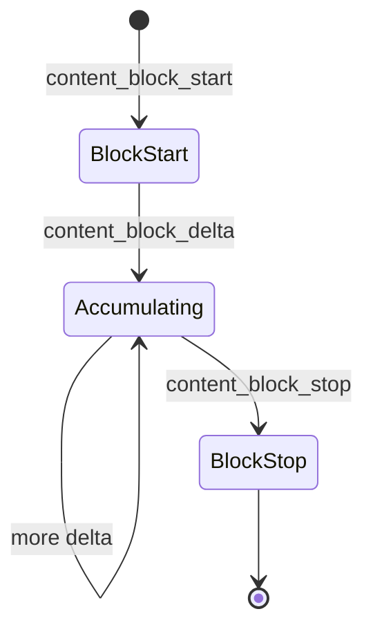

相关源文件

生成本页时使用的主要源文件：

- [src/lib/message-adapter/utils/parse-streaming-events.ts](../../../project-repos/cis-mira/src/lib/message-adapter/utils/parse-streaming-events.ts)
- [src/routes/chat-page/components/messages/manus-message-list.tsx](../../../project-repos/cis-mira/src/routes/chat-page/components/messages/manus-message-list.tsx)
- [src/claude/components/ToolRendering/ToolUseRenderer.tsx](../../../project-repos/cis-mira/src/claude/components/ToolRendering/ToolUseRenderer.tsx)
- [src/features/stream/hooks/pre-created-answer-shell-controller.ts](../../../project-repos/cis-mira/src/features/stream/hooks/pre-created-answer-shell-controller.ts)
- [src/routes/chat-page/components/messages/message-item/content-block-shared.tsx](../../../project-repos/cis-mira/src/routes/chat-page/components/messages/message-item/content-block-shared.tsx)

# 消息适配与工具渲染

后端 SSE 事件与 Claude Agent SDK 的 `content_block_start/delta/stop` 流式块是 **两套协议**。`message-adapter` 的职责是把它们收敛成统一的 `SDKMessage`，再交给 `ToolUseRenderer` 按块类型画 UI。若只读 `stream-service` 而不读适配层，会误以为「推理文字」和「tool_use JSON」来自同一字段。

## 流式块解析（v2）

`parse-streaming-events.ts` 文件头注释写清了 v2 目标：**输入输出都用 SDK 标准类型**，不展开自定义 message 形状。处理策略用 `Map` 按 `index` 缓存 partial block，在 `content_block_stop` 或完整 assistant 消息到达时落盘。

支持块类型包括 `text`、`thinking`（extended thinking）、`tool_use`（JSON 参数流式拼接）。

Sources: [src/lib/message-adapter/utils/parse-streaming-events.ts:16-53](../../../project-repos/pages/src/lib/message-adapter/utils/parse-streaming-events.ts#L16-L53), [src/lib/message-adapter/utils/parse-streaming-events.ts:170-175](../../../project-repos/pages/src/lib/message-adapter/utils/parse-streaming-events.ts#L170-L175), [src/lib/message-adapter/utils/parse-streaming-events.ts:684-687](../../../project-repos/pages/src/lib/message-adapter/utils/parse-streaming-events.ts#L684-L687)

引用源码

<!-- source-snippets:start -->

#### `src/lib/message-adapter/utils/parse-streaming-events.ts:16-53`

> 未找到引用文件：`src/lib/message-adapter/utils/parse-streaming-events.ts`

#### `src/lib/message-adapter/utils/parse-streaming-events.ts:170-175`

> 未找到引用文件：`src/lib/message-adapter/utils/parse-streaming-events.ts`

#### `src/lib/message-adapter/utils/parse-streaming-events.ts:684-687`

> 未找到引用文件：`src/lib/message-adapter/utils/parse-streaming-events.ts`

<!-- source-snippets:end -->

## 列表渲染与 ViewData 缓存

`manus-message-list.tsx` 为长列表做了 **ViewData 缓存**：非流式场景下，AgentReasoning 等大 JSON 解析后可以释放原始 content，避免数 MB 级字符串常驻内存。文件内注释把「缓存 + 释放」标成设计原则，不是可选优化。

流式过程中走 `parseStreamingEventsIncremental`，与 `use-stream-base` 联动。

Sources: [src/routes/chat-page/components/messages/manus-message-list.tsx:30-100](../../../project-repos/pages/src/routes/chat-page/components/messages/manus-message-list.tsx#L30-L100)

引用源码

<!-- source-snippets:start -->

#### `src/routes/chat-page/components/messages/manus-message-list.tsx:30-100`

> 未找到引用文件：`src/routes/chat-page/components/messages/manus-message-list.tsx`

<!-- source-snippets:end -->

## Answer Shell 单点所有权

`pre-created-answer-shell-controller.ts` 明确禁止再引入第二份 `tempAnswerMessageId` 状态。流式开始前预创建 answer 消息壳，由单一 controller 更新——否则会出现重复气泡或光标错位。

Sources: [src/features/stream/hooks/pre-created-answer-shell-controller.ts:3-26](../../../project-repos/pages/src/features/stream/hooks/pre-created-answer-shell-controller.ts#L3-L26)

引用源码

<!-- source-snippets:start -->

#### `src/features/stream/hooks/pre-created-answer-shell-controller.ts:3-26`

> 未找到引用文件：`src/features/stream/hooks/pre-created-answer-shell-controller.ts`

<!-- source-snippets:end -->

## ToolRendering 组件树

`ToolUseRenderer` 组合 `ToolLabel` + `ToolContent`，按 `tool name` 分发到 `tools/` 子目录：

- 文件类：Read、Write、Edit
- 执行类：Bash
- 产品能力：SkillTool、SkillCreateTool、ScheduleTaskTool
- MCP：`McpAppView`

`content-block-shared.tsx` 在消息项层引用 `ToolUseRenderer`，把「块级渲染」和「消息项布局」分开。

Sources: [src/claude/components/ToolRendering/ToolUseRenderer.tsx:26-69](../../../project-repos/pages/src/claude/components/ToolRendering/ToolUseRenderer.tsx#L26-L69), [src/routes/chat-page/components/messages/message-item/content-block-shared.tsx:6-20](../../../project-repos/pages/src/routes/chat-page/components/messages/message-item/content-block-shared.tsx#L6-L20)

引用源码

<!-- source-snippets:start -->

#### `src/claude/components/ToolRendering/ToolUseRenderer.tsx:26-69`

> 未找到引用文件：`src/claude/components/ToolRendering/ToolUseRenderer.tsx`

#### `src/routes/chat-page/components/messages/message-item/content-block-shared.tsx:6-20`

> 未找到引用文件：`src/routes/chat-page/components/messages/message-item/content-block-shared.tsx`

<!-- source-snippets:end -->

## 滚动引擎取舍

`platform.ts` 默认 `getPreferredScrollEngine()` 返回 `'smart'`（自研 SmartScroll），注释记录 Virtuoso 反向锚定在流式场景下的竞态——这是消息列表能跟住快速 delta 的另一个隐性依赖。

Sources: [src/lib/platform.ts:203-211](../../../project-repos/pages/src/lib/platform.ts#L203-L211)

引用源码

<!-- source-snippets:start -->

#### `src/lib/platform.ts:203-211`

> 未找到引用文件：`src/lib/platform.ts`

<!-- source-snippets:end -->

## 相关页面

- [SSE 流式聊天链路](streaming-chat-pipeline.md)
- [Skills、Tools 与 MCP](skills-tools-mcp.md) — SkillTool / McpAppView
- [状态管理](state-management.md)
