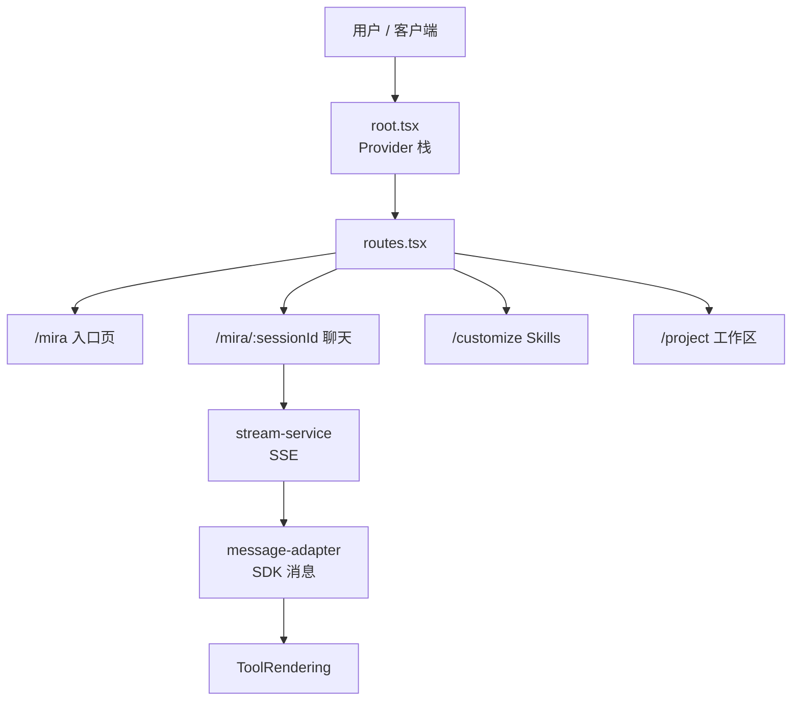

相关源文件

生成本页时使用的主要源文件：

- [README.md](../../../project-repos/cis-mira/README.md)
- [package.json](../../../project-repos/cis-mira/package.json)
- [src/root.tsx](../../../project-repos/cis-mira/src/root.tsx)
- [src/routes/routes.tsx](../../../project-repos/cis-mira/src/routes/routes.tsx)
- [src/design/README.md](../../../project-repos/cis-mira/src/design/README.md)
- [index.html](../../../project-repos/cis-mira/index.html)

# 项目概览

企业里「用一个聊天框调模型」很快就不够用了：要接数据源检索、要挂 Skills 和 MCP、要在 Project 里长期维护上下文，还要在飞书、桌面客户端和浏览器侧边栏里保持同一套体验。**Mira FE** 就是把这些能力压进一个 Vite + React 18 单页应用的前端实现——对内服务 `mira.byteintl.net`，对外通过 CDN + 客户端访问 `mira.bytedance.com`。

和「薄壳调 OpenAPI」不同，这个仓库把 **流式协议解析**（`fetch-event-source` + 自研事件分支）和 **Claude Agent SDK 消息形态**（`content_block_*` 增量块）放在同一套渲染管线里；工具调用不是 JSON 折叠面板，而是 `src/claude/components/ToolRendering/` 下 15+ 个专用组件（Bash、Read、Skill、MCP App 等）。

## 能力全景

- **流式对话**：`/mira/api/v1/chat/completion` SSE；支持 reasoning、正文、数据源摘要、异步任务计数等多阶段事件（`stream-service.ts`）。
- **Agent 与模板**：首页 Agent 区 + 模板卡片；`TEMP_SESSION_ID` 在首条消息时把模型/Agent 配置迁移到真实 session（`use-chat-manager.ts`）。
- **Skills 与 Tools**：技能市场、我的技能、聊天输入栏技能菜单；与 Claude `SkillTool` 渲染联动。
- **Project 工作区**：项目级 instruction、文件、技能、MCP；发送时绑定 `project_agent`（`agent-config.ts`）。
- **任务中心**：定时任务 CRUD + 仪表盘；工具层有 `ScheduleTaskTool`。
- **多端**：Web、飞书 UA 注入客户端版本、Electron BrowserView、Chrome 扩展 Sidepanel（Cookie iframe 代理）。

Sources: [README.md:51-78](../../../project-repos/pages/README.md#L51-L78), [package.json:23-41](../../../project-repos/pages/package.json#L23-L41), [src/root.tsx:45-58](../../../project-repos/pages/src/root.tsx#L45-L58), [src/routes/routes.tsx:69-105](../../../project-repos/pages/src/routes/routes.tsx#L69-L105)

引用源码

<!-- source-snippets:start -->

#### `README.md:51-78`

> 未找到引用文件：`README.md`

#### `package.json:23-41`

> 未找到引用文件：`package.json`

#### `src/root.tsx:45-58`

> 未找到引用文件：`src/root.tsx`

#### `src/routes/routes.tsx:69-105`

> 未找到引用文件：`src/routes/routes.tsx`

<!-- source-snippets:end -->

## 技术栈（数据点）

| 维度 | 选型 |
|------|------|
| 运行时 | React 18.3、TypeScript 5.7、Vite 6.2 |
| 路由 | react-router 7.4（`createBrowserRouter`） |
| 服务端状态 | TanStack React Query 5.71 |
| 客户端状态 | Jotai 2.12 + jotai-mutative |
| UI | Universe Design React 3.28 + `@miracle-design/design-system` token |
| 流式 | `@microsoft/fetch-event-source` 2.0.1 |
| Agent 协议 | `@anthropic-ai/claude-agent-sdk` 0.1.76、MCP SDK 1.29 |
| 富文本 | Slate 0.114（模板/变量 mention） |
| 规模信号 | 约 563 个 `.ts` + 460 个 `.tsx`（仓库盘点） |

Sources: [package.json:6-12](../../../project-repos/pages/package.json#L6-L12), [package.json:54-117](../../../project-repos/pages/package.json#L54-L117), [00-repo-inventory.md:15-17](../../../project-repos/pages/00-repo-inventory.md#L15-L17)

引用源码

<!-- source-snippets:start -->

#### `package.json:6-12`

> 未找到引用文件：`package.json`

#### `package.json:54-117`

> 未找到引用文件：`package.json`

#### `00-repo-inventory.md:15-17`

> 未找到引用文件：`00-repo-inventory.md`

<!-- source-snippets:end -->

## 组件分层（设计系统）

`src/design/README.md` 把 UI 分成三层：**Base（design/ui）** → **Business Feature（design/feature）** → **路由级 Feature modules（src/features）**。路由页只组装 feature，不在页面里堆基础组件——这和「所有按钮都写在 routes 里」的仓库明显不同，也解释了为什么有独立的 `mira-design-system` Claude Skill。

Sources: [src/design/README.md:1-28](../../../project-repos/pages/src/design/README.md#L1-L28)

引用源码

<!-- source-snippets:start -->

#### `src/design/README.md:1-28`

> 未找到引用文件：`src/design/README.md`

<!-- source-snippets:end -->

## 与同类方案的定位

- **相对通用 ChatGPT 式 UI**：Mira 强绑定字节内部鉴权（JWT、`/api/signin`）、数据源 mention、OA/飞书 SDK，以及 Slardar/Tea 埋点（`index.html` 注入）。
- **相对纯 SDK Demo**：前端承担完整「后端 SSE 事件 + Claude 流式块」双协议适配，而不是只渲染 `choices[0].delta.content`。

## 阅读路线

| 目标 | 建议顺序 |
|------|----------|
| 理解全局分层 | 本页 → [系统架构与分层](system-architecture.md) |
| 跟一条聊天消息 | [SSE 流式聊天链路](streaming-chat-pipeline.md) → [消息适配与工具渲染](message-adapter-rendering.md) |
| 做 Skills/Project 功能 | [Skills、Tools 与 MCP](skills-tools-mcp.md) → [Project 工作区](project-workspace.md) |
| 做桌面/扩展 | [多端客户端](multi-platform-clients.md) |
| 发布/样式治理 | [构建、部署与质量](build-deploy-quality.md) |

## 相关页面

- [系统架构与分层](system-architecture.md) — Provider、features、API、store 如何切分
- [SSE 流式聊天链路](streaming-chat-pipeline.md) — 发消息与事件处理的主路径
