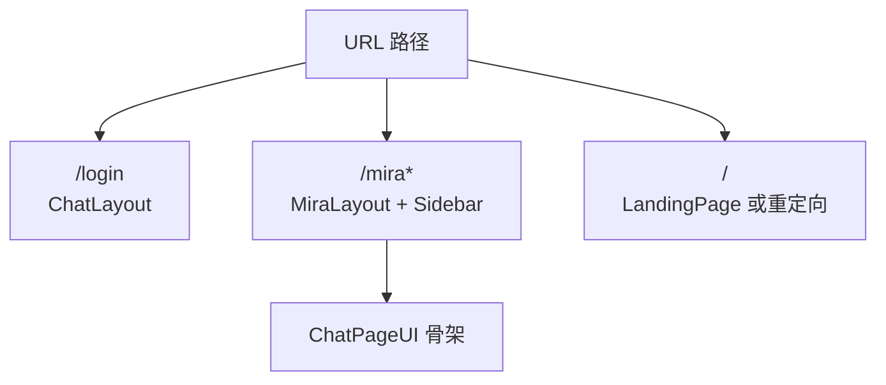

相关源文件

生成本页时使用的主要源文件：

- [src/routes/routes.tsx](../../../project-repos/cis-mira/src/routes/routes.tsx)
- [src/constants/route.ts](../../../project-repos/cis-mira/src/constants/route.ts)
- [src/components/chat-layout/mira-layout.tsx](../../../project-repos/cis-mira/src/components/chat-layout/mira-layout.tsx)
- [src/utils/auth.ts](../../../project-repos/cis-mira/src/utils/auth.ts)
- [src/contexts/user/provider.tsx](../../../project-repos/cis-mira/src/contexts/user/provider.tsx)
- [src/lib/vpn-redirect.ts](../../../project-repos/cis-mira/src/lib/vpn-redirect.ts)

# 路由、布局与认证

路由文件 `routes.tsx` 同时承担三件事：**懒加载分包**、**按客户端类型改默认跳转**、**公网域名的 VPN/内网探测**。认证则分散在路径守卫、UserProvider 和 API 层的 JWT 头里——没有单独的「auth 微前端」，但三条链路必须一起理解，否则会出现「本地 dev 正常、公网 404 到 app-vpn」这类环境差异问题。

## 路由树要点

`createDynamicRoutes()` 根据 `getIsFlutter()` 决定 `/` 是落地页还是直接 `Navigate` 到 `/mira`。主会话挂在 `MiraLayout` 下：

- `/mira` index → `RootPage`（模板/Agent 入口）
- `/mira/:sessionId` → `ChatPage`
- `/mira/search`、`/mira/template` 等同布局子路由
- `/customize/skills/*` → 技能管理与市场
- `/project/*` → 项目列表与详情
- `/task/*` → 任务中心

`CHAT_ROUTE`、`MIRA_ROUTE` 等常量集中在 `src/constants/route.ts`，避免魔法字符串散落。

Sources: [src/routes/routes.tsx:69-120](../../../project-repos/pages/src/routes/routes.tsx#L69-L120), [src/constants/route.ts:1-30](../../../project-repos/pages/src/constants/route.ts#L1-L30), [README.md:51-78](../../../project-repos/pages/README.md#L51-L78)

引用源码

<!-- source-snippets:start -->

#### `src/routes/routes.tsx:69-120`

> 未找到引用文件：`src/routes/routes.tsx`

#### `src/constants/route.ts:1-30`

> 未找到引用文件：`src/constants/route.ts`

#### `README.md:51-78`

> 未找到引用文件：`README.md`

<!-- source-snippets:end -->

## VPN 与公网白名单

`vpnRedirectLoader` 在 **非客户端** 且 **公网域名** `mira.bytedance.com` 时异步等待 `checkIsInternalNetwork()`：

- 内网用户访问 `/share/:id` 会重定向到 `/app-link/share?session_id=...`（唤起客户端）
- 外网用户若路径不在白名单，重定向 `/app-vpn`

内网构建模式 `intranet` 会关闭 `shouldRedirectToVpn()`，与 README 里 Bifrost 代理本地 dev 的场景一致。

Sources: [src/routes/routes.tsx:30-67](../../../project-repos/pages/src/routes/routes.tsx#L30-L67), [src/routes/routes.tsx:71-72](../../../project-repos/pages/src/routes/routes.tsx#L71-L72)

引用源码

<!-- source-snippets:start -->

#### `src/routes/routes.tsx:30-67`

> 未找到引用文件：`src/routes/routes.tsx`

#### `src/routes/routes.tsx:71-72`

> 未找到引用文件：`src/routes/routes.tsx`

<!-- source-snippets:end -->

## 认证链路

| 环节 | 行为 |
|------|------|
| 路径守卫 | `AUTH_REQUIRED_PATHS` 正则决定哪些路由必须先有用户态 |
| UserProvider | 并行拉用户信息、飞书 SDK、Lark 鉴权；绑定 Slardar/Tea |
| 登录页 | 未登录约 1s 后跳转 `/api/signin?originUrl=...` |
| API | `fetchWithJWT` 附带 `jwt-token`；`20001` 等码触发重新登录 |

客户端通过 `window.MIRA_CLIENT_VERSION` 识别，VPN loader 直接放行（不在 Web 里做公网拦截）。

Sources: [src/utils/auth.ts:1-19](../../../project-repos/pages/src/utils/auth.ts#L1-L19), [src/contexts/user/provider.tsx:22-80](../../../project-repos/pages/src/contexts/user/provider.tsx#L22-L80), [src/api/utils.ts:28-67](../../../project-repos/pages/src/api/utils.ts#L28-L67)

引用源码

<!-- source-snippets:start -->

#### `src/utils/auth.ts:1-19`

> 未找到引用文件：`src/utils/auth.ts`

#### `src/contexts/user/provider.tsx:22-80`

> 未找到引用文件：`src/contexts/user/provider.tsx`

#### `src/api/utils.ts:28-67`

> 未找到引用文件：`src/api/utils.ts`

<!-- source-snippets:end -->

## 布局选择

Sources: [src/components/chat-layout/chat-layout.tsx:16-30](../../../project-repos/pages/src/components/chat-layout/chat-layout.tsx#L16-L30), [src/components/chat-layout/mira-layout.tsx:28-50](../../../project-repos/pages/src/components/chat-layout/mira-layout.tsx#L28-L50)

引用源码

<!-- source-snippets:start -->

#### `src/components/chat-layout/chat-layout.tsx:16-30`

> 未找到引用文件：`src/components/chat-layout/chat-layout.tsx`

#### `src/components/chat-layout/mira-layout.tsx:28-50`

> 未找到引用文件：`src/components/chat-layout/mira-layout.tsx`

<!-- source-snippets:end -->

## 相关页面

- [系统架构与分层](system-architecture.md)
- [SSE 流式聊天链路](streaming-chat-pipeline.md) — 会话失效跳转 signin
- [多端客户端](multi-platform-clients.md) — 客户端跳过 VPN 逻辑
