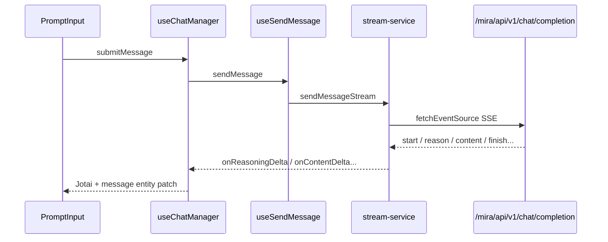

相关源文件

生成本页时使用的主要源文件：

- [src/hooks/use-chat-manager.ts](../../../project-repos/cis-mira/src/hooks/use-chat-manager.ts)
- [src/features/stream/hooks/use-send-message.ts](../../../project-repos/cis-mira/src/features/stream/hooks/use-send-message.ts)
- [src/features/stream/services/stream-service.ts](../../../project-repos/cis-mira/src/features/stream/services/stream-service.ts)
- [src/features/stream/hooks/use-stream-base.ts](../../../project-repos/cis-mira/src/features/stream/hooks/use-stream-base.ts)
- [src/features/stream/constants/api.ts](../../../project-repos/cis-mira/src/features/stream/constants/api.ts)
- [src/store/atoms/chat-stream-state.ts](../../../project-repos/cis-mira/src/store/atoms/chat-stream-state.ts)

# SSE 流式聊天链路

用户点发送后，前端要在 **会话 ID 可能刚从 TEMP 迁移**、**Project Agent 要写入 sessionStorage**、**SSE 要可中断续流** 三个约束下，把一条用户消息变成可增量渲染的 assistant 消息。主路径是 `useChatManager` → `useSendMessage` → `sendMessageStream` → `executeStreamRequest`（`@microsoft/fetch-event-source`）。

## 端到端序列

Sources: [src/hooks/use-chat-manager.ts:82-154](../../../project-repos/pages/src/hooks/use-chat-manager.ts#L82-L154), [src/features/stream/constants/api.ts:7-11](../../../project-repos/pages/src/features/stream/constants/api.ts#L7-L11)

引用源码

<!-- source-snippets:start -->

#### `src/hooks/use-chat-manager.ts:82-154`

> 未找到引用文件：`src/hooks/use-chat-manager.ts`

#### `src/features/stream/constants/api.ts:7-11`

> 未找到引用文件：`src/features/stream/constants/api.ts`

<!-- source-snippets:end -->

## 发送前：上下文与 Agent

`use-send-message.ts` 在请求体里组装 `meta.user_query_context`：Project 场景把 agent 归一化为 `project_agent`；还支持 geo、本地文件路径、飞书文档、数据源 mention 等。`buildRequestConfig` 合并 session 配置里的 `agent_name`、`skill_names`。

**Insight**：`PROJECT_INTERNAL_AGENT` 在 `agent-config.ts` 里被标成「不得作为真实 agent id 出现在 UI」，否则会出现幽灵选中——发送链路里对 project 的特殊分支要和这个常量一起看。

Sources: [src/features/stream/hooks/use-send-message.ts:42-125](../../../project-repos/pages/src/features/stream/hooks/use-send-message.ts#L42-L125), [src/features/stream/services/stream-service.ts:45-55](../../../project-repos/pages/src/features/stream/services/stream-service.ts#L45-L55)

引用源码

<!-- source-snippets:start -->

#### `src/features/stream/hooks/use-send-message.ts:42-125`

> 未找到引用文件：`src/features/stream/hooks/use-send-message.ts`

#### `src/features/stream/services/stream-service.ts:45-55`

> 未找到引用文件：`src/features/stream/services/stream-service.ts`

<!-- source-snippets:end -->

## stream-service：SSE 核心

- 端点：`SEND_MESSAGE_V1`、`RESUME_STREAM_MESSAGE_V1`（续流）
- `executeStreamRequest` 里对每条 SSE message 做 `JSON.parse`，失败才 `jsonrepair`——注释明确为避免无条件 repair 导致内存膨胀
- 事件类型覆盖：推理开始/增量、正文增量、数据源摘要进度、异步任务计数、`start` 事件里还有「建联」状态栏的 HACK

**Mock 模式**：`MOCK_CONFIG.ENABLED` 为 true 时从 `public/sse/messages.txt` 回放，用于本地复现崩溃或超长流（`stream-service.ts` 顶部常量块）。

Sources: [src/features/stream/services/stream-service.ts:32-41](../../../project-repos/pages/src/features/stream/services/stream-service.ts#L32-L41), [src/features/stream/services/stream-service.ts:410-452](../../../project-repos/pages/src/features/stream/services/stream-service.ts#L410-L452), [src/features/stream/services/stream-service.ts:668-673](../../../project-repos/pages/src/features/stream/services/stream-service.ts#L668-L673)

引用源码

<!-- source-snippets:start -->

#### `src/features/stream/services/stream-service.ts:32-41`

> 未找到引用文件：`src/features/stream/services/stream-service.ts`

#### `src/features/stream/services/stream-service.ts:410-452`

> 未找到引用文件：`src/features/stream/services/stream-service.ts`

#### `src/features/stream/services/stream-service.ts:668-673`

> 未找到引用文件：`src/features/stream/services/stream-service.ts`

<!-- source-snippets:end -->

## use-stream-base：Abort 与 Answer Shell

`use-stream-base` 持有 `AbortController`、与 `pre-created-answer-shell-controller` 协作，在流式过程中更新 Jotai `chat-stream-state`，并触发增量 `parseStreamingEventsIncremental`（见消息适配章节）。

会话失效：`code=20001` 时跳转 `/api/signin`（与 `api/utils.ts` 一致）。

Sources: [src/features/stream/hooks/use-stream-base.ts:67-146](../../../project-repos/pages/src/features/stream/hooks/use-stream-base.ts#L67-L146), [src/store/atoms/chat-stream-state.ts:1-25](../../../project-repos/pages/src/store/atoms/chat-stream-state.ts#L1-L25)

引用源码

<!-- source-snippets:start -->

#### `src/features/stream/hooks/use-stream-base.ts:67-146`

> 未找到引用文件：`src/features/stream/hooks/use-stream-base.ts`

#### `src/store/atoms/chat-stream-state.ts:1-25`

> 未找到引用文件：`src/store/atoms/chat-stream-state.ts`

<!-- source-snippets:end -->

## TEMP_SESSION 迁移

首页选的模型/Agent 存在 `TEMP_SESSION_ID` 对应配置里；`use-chat-manager` 在首条消息发送时把配置 **复制** 到真实 `sessionId`，并刻意不删除模板 session——否则模板入口二次使用会丢配置。

Sources: [src/hooks/use-chat-manager.ts:115-133](../../../project-repos/pages/src/hooks/use-chat-manager.ts#L115-L133), [src/lib/session-config.ts:1-40](../../../project-repos/pages/src/lib/session-config.ts#L1-L40)

引用源码

<!-- source-snippets:start -->

#### `src/hooks/use-chat-manager.ts:115-133`

> 未找到引用文件：`src/hooks/use-chat-manager.ts`

#### `src/lib/session-config.ts:1-40`

> 未找到引用文件：`src/lib/session-config.ts`

<!-- source-snippets:end -->

## 相关页面

- [消息适配与工具渲染](message-adapter-rendering.md) — SSE 之后的 SDK 块解析
- [状态管理](state-management.md) — 流式 atom 与 message entity
- [Project 工作区](project-workspace.md) — project_agent 发送分支
