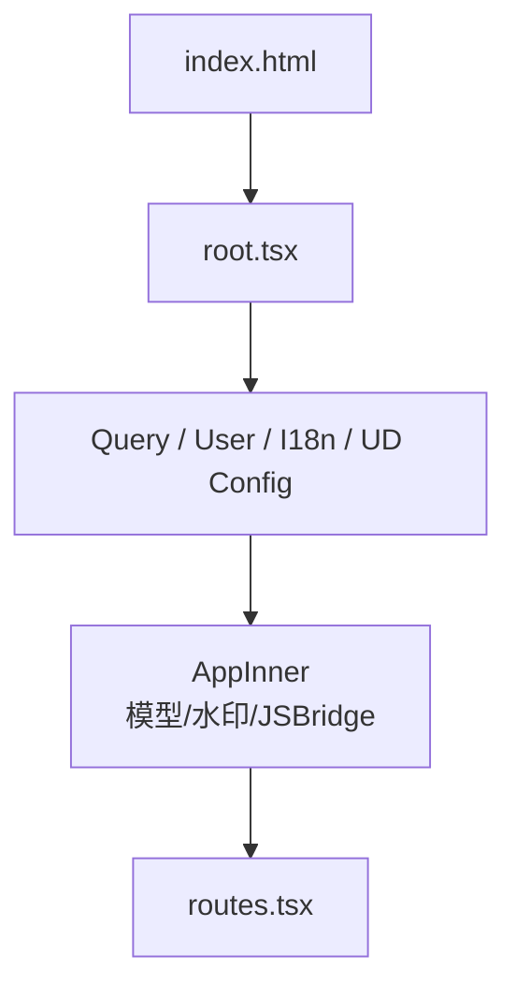

相关源文件

生成本页时使用的主要源文件：

- [src/root.tsx](../../../project-repos/cis-mira/src/root.tsx)
- [src/design/README.md](../../../project-repos/cis-mira/src/design/README.md)
- [src/api/utils.ts](../../../project-repos/cis-mira/src/api/utils.ts)
- [src/store/atoms/index.ts](../../../project-repos/cis-mira/src/store/atoms/index.ts)
- [src/store/entities/chat/index.ts](../../../project-repos/cis-mira/src/store/entities/chat/index.ts)
- [src/components/chat-layout/mira-layout.tsx](../../../project-repos/cis-mira/src/components/chat-layout/mira-layout.tsx)

# 系统架构与分层

Mira FE 不是「页面 + 若干 utils」的平铺结构，而是刻意把 **壳层（bootstrap）**、**领域 feature**、**Claude 专用渲染** 和 **数据访问** 拆开。这样做的直接收益是：流式聊天可以改 `features/stream` 而不动模板页；工具 UI 可以只在 `src/claude/` 演进而不污染设计系统组件。

## 入口与 Provider 栈

`index.html` 加载 `src/root.tsx`。`AppInner` 在挂载时并行做几件对全局有影响的事：拉模型列表（`fetchModelsAtom`）、初始化 JSBridge、按邮箱打水印、跑地理权限流程。外层再包 `QueryClientProvider`、`UserProvider`、`I18nProvider`、`ConfigProvider`，最后渲染 `RoutesEntry`。

Sources: [src/root.tsx:1-33](../../../project-repos/pages/src/root.tsx#L1-L33), [src/root.tsx:45-58](../../../project-repos/pages/src/root.tsx#L45-L58), [src/root.tsx:100-131](../../../project-repos/pages/src/root.tsx#L100-L131)

引用源码

<!-- source-snippets:start -->

#### `src/root.tsx:1-33`

> 未找到引用文件：`src/root.tsx`

#### `src/root.tsx:45-58`

> 未找到引用文件：`src/root.tsx`

#### `src/root.tsx:100-131`

> 未找到引用文件：`src/root.tsx`

<!-- source-snippets:end -->

## 四层代码地图

| 层 | 目录 | 职责 |
|----|------|------|
| 路由页 | `src/routes/` | 懒加载页面、组合 feature 组件 |
| 领域功能 | `src/features/` | stream、skill、project、task-center、i18n 等 |
| Claude 渲染 | `src/claude/` | ToolRendering、工具埋点、消息项 |
| 共享基础设施 | `src/api/`、`src/store/`、`src/lib/`、`src/components/` | HTTP、状态、协议适配、布局 |

`src/features/` 下约有 27 个子模块；与聊天强相关的是 `stream`（SSE）、`skill`、`project`、`tools`、`task-center`。

Sources: [src/design/README.md:5-28](../../../project-repos/pages/src/design/README.md#L5-L28)

引用源码

<!-- source-snippets:start -->

#### `src/design/README.md:5-28`

> 未找到引用文件：`src/design/README.md`

<!-- source-snippets:end -->

## API 访问层

顶层 `src/api/` 提供按资源划分的模块（`chat.ts`、`message.ts`、`skill.ts`、`mcp.ts` 等）。所有需要登录的请求走 `fetchWithJWT`：自动附加 `jwt-token`、`x-mira-client`、`x-mira-timezone`，公网场景还可带 `x-mira-internal-net`（与内网探测配合）。

**设计取舍**：feature 内也有 `api/` 子目录（如 `features/skill/api/skill.ts`），路径前缀统一为 `/mira/api/v1/...`，避免页面直接拼 URL。

Sources: [src/api/utils.ts:18-75](../../../project-repos/pages/src/api/utils.ts#L18-L75)

引用源码

<!-- source-snippets:start -->

#### `src/api/utils.ts:18-75`

> 未找到引用文件：`src/api/utils.ts`

<!-- source-snippets:end -->

## Store：Jotai + React Query

- **Jotai（`src/store/atoms/`）**：流式进行中标志、输入框草稿、LLM 选择、第三栏、任务中心等 **高频 UI 态**。
- **React Query entities（`src/store/entities/chat|message/`）**：会话列表、历史消息、流式 patch 的 **服务端镜像**。

流式期间大量更新走 atom + 本地 patch，避免每条 delta 都 invalidate 整页 query——这是消息列表能撑住长推理输出的关键。

Sources: [src/store/atoms/chat-stream-state.ts:1-40](../../../project-repos/pages/src/store/atoms/chat-stream-state.ts#L1-L40), [src/store/entities/message/index.ts:1-30](../../../project-repos/pages/src/store/entities/message/index.ts#L1-L30)

引用源码

<!-- source-snippets:start -->

#### `src/store/atoms/chat-stream-state.ts:1-40`

> 未找到引用文件：`src/store/atoms/chat-stream-state.ts`

#### `src/store/entities/message/index.ts:1-30`

> 未找到引用文件：`src/store/entities/message/index.ts`

<!-- source-snippets:end -->

## MiraLayout 应用壳

`MiraLayout` 包裹主聊天路由：侧栏会话列表、模型初始化、TCC 公告、按平台隐藏/展示侧栏（Electron、Flutter 与纯 Web 行为不同）。聊天页 UI 骨架在 `ChatPageUI`，与「登录轻布局」`ChatLayout` 分离。

Sources: [src/components/chat-layout/mira-layout.tsx:28-74](../../../project-repos/pages/src/components/chat-layout/mira-layout.tsx#L28-L74)

引用源码

<!-- source-snippets:start -->

#### `src/components/chat-layout/mira-layout.tsx:28-74`

> 未找到引用文件：`src/components/chat-layout/mira-layout.tsx`

<!-- source-snippets:end -->

## 相关页面

- [项目概览](overview.md) — 产品面与技术栈
- [状态管理](state-management.md) — atom 与 query 的详细分工
- [路由、布局与认证](routing-layouts-auth.md) — 路由树与 VPN loader
