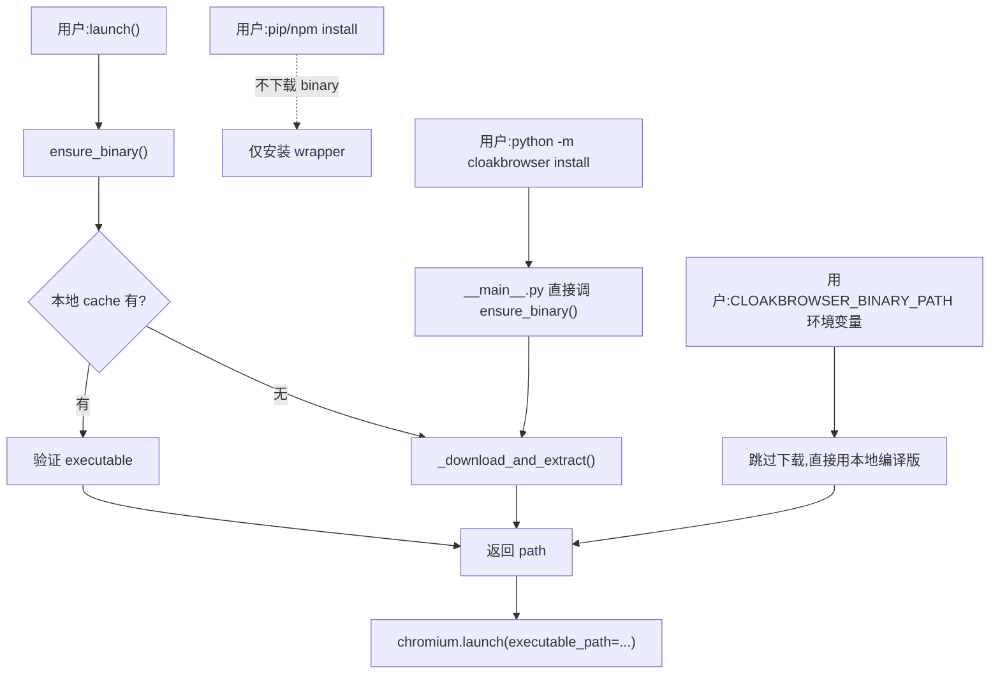
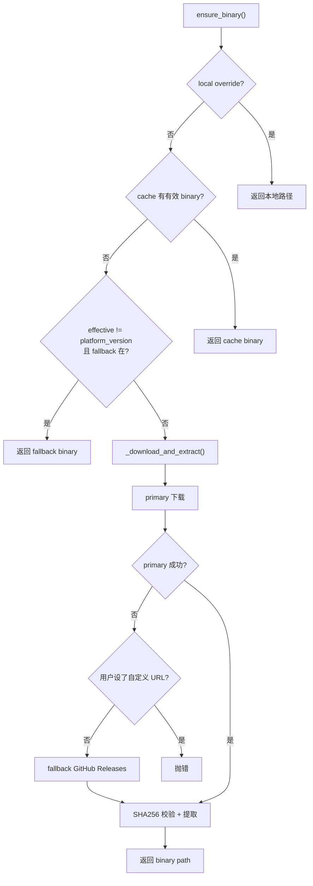

<details>
<summary>相关源文件</summary>

生成本页时使用的主要源文件:

- [cloakbrowser/download.py](../../../project-repos/cloakbrowser/cloakbrowser/download.py)
- [cloakbrowser/config.py](../../../project-repos/cloakbrowser/cloakbrowser/config.py)
- [cloakbrowser/__main__.py](../../../project-repos/cloakbrowser/cloakbrowser/__main__.py)
- [js/src/download.ts](../../../project-repos/cloakbrowser/js/src/download.ts)
- [js/src/cli.ts](../../../project-repos/cloakbrowser/js/src/cli.ts)

</details>

# 二进制生命周期

CloakBrowser 把 200MB+ 的 Chromium 二进制单独管理,不打进 PyPI/npm 包——这件事看起来普通,但实现细节里有不少"教训经验"。`download.py` 模块占 579 行,远超普通下载工具,因为它要同时解决:跨平台路径、双链路下载、SHA-256 校验、原子提取、自动更新、wrapper 自检、并发安全、macOS Gatekeeper、tar/zip 路径穿越防护。

把这些拼起来,就是"用户 `pip install cloakbrowser` 然后 `launch()` 一次就能跑"的体验背后那段不显眼但关键的工程。

## 用户视角的三种入口

二进制生命周期被三种入口触发:



`pip install` 故意不下载 binary——这是 PyPI 的礼貌(不让 200MB 卡到 pip cache)、也让用户在 Docker build 时可以选"安装 wrapper 但等运行时下载"或"build 时预下载"两种策略。`ensure_binary()` 是所有"哪里需要 binary"的统一入口。

Sources: [cloakbrowser/download.py:73-130](../../../project-repos/cloakbrowser/cloakbrowser/download.py#L73-L130)

<details class="source-snippets">
<summary>引用源码</summary>

<!-- source-snippets:start -->

#### `cloakbrowser/download.py:73-130`

```python
def ensure_binary() -> str:
    """Ensure the stealth Chromium binary is available. Download if needed.

    Returns the path to the chrome executable as a string.

    Set CLOAKBROWSER_BINARY_PATH to skip download and use a local build.
    """
    # Check for local override first
    local_override = get_local_binary_override()
    if local_override:
        path = Path(local_override)
        if not path.exists():
            raise FileNotFoundError(
                f"CLOAKBROWSER_BINARY_PATH set to '{local_override}' but file does not exist"
            )
        logger.info("Using local binary override: %s", local_override)
        return str(path)

    # Fail fast if no binary available for this platform
    check_platform_available()

    # Check for auto-updated version first, then fall back to hardcoded
    effective = get_effective_version()
    binary_path = get_binary_path(effective)

    if binary_path.exists() and _is_executable(binary_path):
        logger.debug("Binary found in cache: %s (version %s)", binary_path, effective)
        _show_welcome()
        _maybe_trigger_update_check()
        return str(binary_path)

    # Fall back to platform's hardcoded version if effective version binary doesn't exist
    platform_version = get_chromium_version()
    if effective != platform_version:
        fallback_path = get_binary_path()
        if fallback_path.exists() and _is_executable(fallback_path):
            logger.debug("Binary found in cache: %s", fallback_path)
            _maybe_trigger_update_check()
            return str(fallback_path)

    # Download platform's hardcoded version
    logger.info(
        "Stealth Chromium %s not found. Downloading for %s...",
        platform_version,
        get_platform_tag(),
    )
    _download_and_extract()

    binary_path = get_binary_path()
    if not binary_path.exists():
        raise RuntimeError(
            f"Download completed but binary not found at expected path: {binary_path}. "
            f"This may indicate a packaging issue. Please report at "
            f"https://github.com/CloakHQ/cloakbrowser/issues"
        )

    _maybe_trigger_update_check()
    return str(binary_path)
```

<!-- source-snippets:end -->
</details>

## 平台/版本解析:三层逻辑

`get_binary_path()` 看起来简单,实际上它的"哪个版本"问题有三层来源:

1. **本地覆盖**:`CLOAKBROWSER_BINARY_PATH` 环境变量,如果设了就完全跳过 cache/下载逻辑
2. **平台对应的版本**:`PLATFORM_CHROMIUM_VERSIONS` 字典,例如 `linux-x64 → "146.0.7680.177.3"`
3. **后台更新落点**:`latest_version_<platform>` marker 文件,后台拉到的新版本写在这里

`get_effective_version()` 实现这种"以平台默认为基,被 marker 覆盖"的逻辑:

```python
def get_effective_version() -> str:
    base = get_chromium_version()  # 平台对应的硬编码版本
    cache = get_cache_dir()
    for name in (f"latest_version_{get_platform_tag()}", "latest_version"):
        marker = cache / name
        if marker.exists():
            try:
                version = marker.read_text().strip()
                if version and _version_newer(version, base):
                    binary = get_binary_path(version)
                    if binary.exists():
                        return version  # 用更新的
            except (ValueError, OSError):
                pass
    return base
```

Sources: [cloakbrowser/config.py:159-179](../../../project-repos/cloakbrowser/cloakbrowser/config.py#L159-L179)

<details class="source-snippets">
<summary>引用源码</summary>

<!-- source-snippets:start -->

#### `cloakbrowser/config.py:159-179`

```python
def get_effective_version() -> str:
    """Return the best available version: auto-updated if available, else platform default.

    Reads a platform-scoped marker file from the cache directory.
    Returns the platform's hardcoded version if no update has been downloaded.
    """
    base = get_chromium_version()
    # Try platform-scoped marker first, fall back to legacy marker for upgrades from <0.3.0
    cache = get_cache_dir()
    for name in (f"latest_version_{get_platform_tag()}", "latest_version"):
        marker = cache / name
        if marker.exists():
            try:
                version = marker.read_text().strip()
                if version and _version_newer(version, base):
                    binary = get_binary_path(version)
                    if binary.exists():
                        return version
            except (ValueError, OSError):
                pass
    return base
```

<!-- source-snippets:end -->
</details>

### 平台 tag 表

`PLATFORM_CHROMIUM_VERSIONS` 在不同时期不同平台版本可能不同(因为补丁 rebase 节奏不同步):

| Platform tag | Chromium 版本(当前) |
|---|---|
| `linux-x64` | 146.0.7680.177.3 |
| `linux-arm64` | 146.0.7680.177.3 |
| `darwin-arm64` | 145.0.7632.109.2 |
| `darwin-x64` | 145.0.7632.109.2 |
| `windows-x64` | 146.0.7680.177.4 |

Sources: [cloakbrowser/config.py:20-26](../../../project-repos/cloakbrowser/cloakbrowser/config.py#L20-L26)

<details class="source-snippets">
<summary>引用源码</summary>

<!-- source-snippets:start -->

#### `cloakbrowser/config.py:20-26`

```python
PLATFORM_CHROMIUM_VERSIONS: dict[str, str] = {
    "linux-x64": "146.0.7680.177.3",
    "linux-arm64": "146.0.7680.177.3",
    "darwin-arm64": "145.0.7632.109.2",
    "darwin-x64": "145.0.7632.109.2",
    "windows-x64": "146.0.7680.177.4",
}
```

<!-- source-snippets:end -->
</details>

注意:**macOS 落后两个版本号**——补丁要重 rebase 到新 Chromium 时,macOS 的工程量(签名、bundle、Gatekeeper)更大,优先级靠后。这种差异由 `get_chromium_version()` 自动选,用户感受不到。

## 双链路下载:primary + fallback

`_download_and_extract()` 默认走两个 URL,串行 fallback:

```python
primary_url = get_download_url(version)         # cloakbrowser.dev/chromium-v{v}/...
fallback_url = get_fallback_download_url(version)  # github.com/CloakHQ/cloakbrowser/releases/download/...

try:
    _download_file(primary_url, tmp_path)
except Exception as primary_err:
    if os.environ.get("CLOAKBROWSER_DOWNLOAD_URL"):
        raise  # 用户自己指定了 URL,不要 fallback
    logger.warning("Primary download failed (%s), trying GitHub Releases...", primary_err)
    _download_file(fallback_url, tmp_path)
```

Sources: [cloakbrowser/download.py:152-163](../../../project-repos/cloakbrowser/cloakbrowser/download.py#L152-L163)

<details class="source-snippets">
<summary>引用源码</summary>

<!-- source-snippets:start -->

#### `cloakbrowser/download.py:152-163`

```python
    try:
        # Try primary, fall back to GitHub Releases (skip fallback if custom URL)
        try:
            _download_file(primary_url, tmp_path)
        except Exception as primary_err:
            if os.environ.get("CLOAKBROWSER_DOWNLOAD_URL"):
                raise
            logger.warning(
                "Primary download failed (%s), trying GitHub Releases...",
                primary_err,
            )
            _download_file(fallback_url, tmp_path)
```

<!-- source-snippets:end -->
</details>

primary 域名 `cloakbrowser.dev` 是项目自有的 CDN——速度更快,但可能停服;fallback 走 GitHub Releases,慢但稳定。**用户显式设了 `CLOAKBROWSER_DOWNLOAD_URL` 时不再 fallback**——这是给企业镜像场景的契约:"你说从这里下,失败就该报错,而不是悄悄绕到 GitHub"。



## SHA-256 校验:可关闭但默认开启

二进制下载完成后,**默认会做 SHA-256 校验**:

```python
if os.environ.get("CLOAKBROWSER_SKIP_CHECKSUM", "").lower() != "true":
    _verify_download_checksum(tmp_path, version)
```

Sources: [cloakbrowser/download.py:166-167](../../../project-repos/cloakbrowser/cloakbrowser/download.py#L166-L167)

<details class="source-snippets">
<summary>引用源码</summary>

<!-- source-snippets:start -->

#### `cloakbrowser/download.py:166-167`

```python
        if os.environ.get("CLOAKBROWSER_SKIP_CHECKSUM", "").lower() != "true":
            _verify_download_checksum(tmp_path, version)
```

<!-- source-snippets:end -->
</details>

`_fetch_checksums()` 从 release 同目录拉 `SHA256SUMS` 文件,格式是 `hash  filename` 每行一条;`_parse_checksums()` 解析后,`_verify_checksum()` 流式哈希下载文件做比对——不匹配直接抛错并提示用户上报 issue:

```python
if actual != expected_hash:
    raise RuntimeError(
        f"Checksum verification failed!\n"
        f"  Expected: {expected_hash}\n"
        f"  Got:      {actual}\n"
        f"  File may be corrupted or tampered with. ..."
    )
```

Sources: [cloakbrowser/download.py:228-242](../../../project-repos/cloakbrowser/cloakbrowser/download.py#L228-L242)

<details class="source-snippets">
<summary>引用源码</summary>

<!-- source-snippets:start -->

#### `cloakbrowser/download.py:228-242`

```python
def _verify_checksum(file_path: Path, expected_hash: str) -> None:
    """Verify SHA-256 of a file. Raises RuntimeError on mismatch."""
    sha256 = hashlib.sha256()
    with open(file_path, "rb") as f:
        for chunk in iter(lambda: f.read(8192), b""):
            sha256.update(chunk)
    actual = sha256.hexdigest().lower()
    if actual != expected_hash:
        raise RuntimeError(
            f"Checksum verification failed!\n"
            f"  Expected: {expected_hash}\n"
            f"  Got:      {actual}\n"
            f"  File may be corrupted or tampered with. "
            f"Please retry or report at https://github.com/CloakHQ/cloakbrowser/issues"
        )
```

<!-- source-snippets:end -->
</details>

注意几个 corner case 的处理:
- SHA256SUMS 不存在 → warning 但不阻塞下载("此版本无 checksum 发布")
- SHA256SUMS 存在但没对应 tarball 条目 → warning 但不阻塞
- 自定义 URL(`CLOAKBROWSER_DOWNLOAD_URL`)时,只查 primary 的 SHA256SUMS,不回退 GitHub

这种"warning 但放行"是为了不让旧版本(没发布 checksum 的)突然挂掉,同时也保证未来发布的版本能强制校验。

## 原子提取:tar 路径穿越防护

提取 tar.gz 时,`_extract_tar()` 主动检查每个成员的路径:

```python
def _extract_tar(archive_path: Path, dest_dir: Path) -> None:
    with tarfile.open(archive_path, "r:gz") as tar:
        safe_members = []
        for member in tar.getmembers():
            if member.issym() or member.islnk():
                link_target = member.linkname
                if os.path.isabs(link_target) or ".." in link_target.split("/"):
                    logger.warning("Skipping suspicious symlink: %s -> %s", member.name, link_target)
                    continue
            else:
                member_path = (dest_dir / member.name).resolve()
                if not str(member_path).startswith(str(dest_dir.resolve())):
                    raise RuntimeError(f"Archive contains path traversal: {member.name}")
            safe_members.append(member)

        tar.extractall(dest_dir, members=safe_members)
```

Sources: [cloakbrowser/download.py:313-330](../../../project-repos/cloakbrowser/cloakbrowser/download.py#L313-L330)

<details class="source-snippets">
<summary>引用源码</summary>

<!-- source-snippets:start -->

#### `cloakbrowser/download.py:313-330`

```python
def _extract_tar(archive_path: Path, dest_dir: Path) -> None:
    """Extract tar.gz archive with path traversal protection."""
    with tarfile.open(archive_path, "r:gz") as tar:
        safe_members = []
        for member in tar.getmembers():
            # Allow symlinks — macOS .app bundles require them (Framework layout)
            if member.issym() or member.islnk():
                link_target = member.linkname
                if os.path.isabs(link_target) or ".." in link_target.split("/"):
                    logger.warning("Skipping suspicious symlink: %s -> %s", member.name, link_target)
                    continue
            else:
                member_path = (dest_dir / member.name).resolve()
                if not str(member_path).startswith(str(dest_dir.resolve())):
                    raise RuntimeError(f"Archive contains path traversal: {member.name}")
            safe_members.append(member)

        tar.extractall(dest_dir, members=safe_members)
```

<!-- source-snippets:end -->
</details>

这是 CVE-2007-4559(Python `tarfile` extractall 默认允许 `..` 穿越)的标准防御。但**为什么允许 symlink?** —— 因为 macOS `.app` bundle 里的 Framework 是 symlink 结构,完全禁掉 symlink 会破坏 macOS 包。妥协方案:**只过滤目标路径异常的 symlink**(绝对路径或带 `..`),正常相对 symlink 放行。

### 单层目录扁平化

`_flatten_single_subdir()` 处理一个体验细节:很多 tar 包会把所有文件包在一个顶层目录里(例如 `fingerprint-chromium-142-custom-v2/chrome`),我们希望 `chrome` 直接出现在 cache 根。但 macOS `.app` bundle 必须保持目录结构——如果展开 `Chromium.app` 里的内容到上一层,bundle 就坏了。

```python
if len(entries) == 1 and entries[0].is_dir():
    subdir = entries[0]
    if subdir.name.endswith(".app"):
        return  # 保留 .app 不动
    for item in subdir.iterdir():
        shutil.move(str(item), str(dest_dir / item.name))
    subdir.rmdir()
```

Sources: [cloakbrowser/download.py:345-363](../../../project-repos/cloakbrowser/cloakbrowser/download.py#L345-L363)

<details class="source-snippets">
<summary>引用源码</summary>

<!-- source-snippets:start -->

#### `cloakbrowser/download.py:345-363`

```python
def _flatten_single_subdir(dest_dir: Path) -> None:
    """If extraction created a single subdirectory, move its contents up.

    Many tar archives wrap files in a top-level directory (e.g.
    fingerprint-chromium-142-custom-v2/chrome). We want chrome at dest_dir/chrome.
    """
    import shutil

    entries = list(dest_dir.iterdir())
    if len(entries) == 1 and entries[0].is_dir():
        subdir = entries[0]
        # Never flatten .app bundles — macOS needs the bundle structure
        if subdir.name.endswith(".app"):
            logger.debug("Keeping .app bundle intact: %s", subdir.name)
            return
        logger.debug("Flattening single subdirectory: %s", subdir.name)
        for item in subdir.iterdir():
            shutil.move(str(item), str(dest_dir / item.name))
        subdir.rmdir()
```

<!-- source-snippets:end -->
</details>

## macOS quarantine 清理

下载 Chromium 后 macOS 会自动给它打上 `com.apple.quarantine` xattr,启动时弹出"Apple 无法验证此应用"的 Gatekeeper 提示。`_remove_quarantine()` 用 `xattr -cr` 在提取完成后立即清掉:

```python
def _remove_quarantine(path: Path) -> None:
    try:
        subprocess.run(["xattr", "-cr", str(path)], capture_output=True, timeout=30)
    except Exception:
        logger.debug("Failed to remove quarantine attributes", exc_info=True)
```

Sources: [cloakbrowser/download.py:379-389](../../../project-repos/cloakbrowser/cloakbrowser/download.py#L379-L389)

<details class="source-snippets">
<summary>引用源码</summary>

<!-- source-snippets:start -->

#### `cloakbrowser/download.py:379-389`

```python
def _remove_quarantine(path: Path) -> None:
    """Remove macOS quarantine/provenance xattrs so Gatekeeper doesn't block the binary."""
    try:
        subprocess.run(
            ["xattr", "-cr", str(path)],
            capture_output=True,
            timeout=30,
        )
        logger.debug("Removed quarantine attributes from %s", path)
    except Exception:
        logger.debug("Failed to remove quarantine attributes", exc_info=True)
```

<!-- source-snippets:end -->
</details>

`xattr` 不存在或失败时不报错——大多数 Mac 装机都有这个工具,没有也只是多一次手动确认,不应阻塞主流程。

## 自动更新:双层后台轮询

`_maybe_trigger_update_check()` 在每次 `ensure_binary()` 末尾被调用,启动两个 daemon 线程:

```python
def _maybe_trigger_update_check() -> None:
    # Wrapper update: 每个进程一次
    if not _wrapper_update_checked:
        t = threading.Thread(target=_check_wrapper_update, daemon=True)
        t.start()

    # Binary update: 每小时一次
    if not _should_check_for_update():
        return
    t = threading.Thread(target=_check_and_download_update, daemon=True)
    t.start()
```

Sources: [cloakbrowser/download.py:567-578](../../../project-repos/cloakbrowser/cloakbrowser/download.py#L567-L578)

<details class="source-snippets">
<summary>引用源码</summary>

<!-- source-snippets:start -->

#### `cloakbrowser/download.py:567-578`

```python
def _maybe_trigger_update_check() -> None:
    """Fire-and-forget update check in a daemon thread."""
    # Wrapper update: once per process, not rate-limited
    if not _wrapper_update_checked:
        t = threading.Thread(target=_check_wrapper_update, daemon=True)
        t.start()

    # Binary update: rate-limited to once per hour
    if not _should_check_for_update():
        return
    t = threading.Thread(target=_check_and_download_update, daemon=True)
    t.start()
```

<!-- source-snippets:end -->
</details>

**Wrapper 更新检查**:hit PyPI JSON `https://pypi.org/pypi/cloakbrowser/json`,看 wrapper 版本是否新于本地,新就 warning 一句"该升级了"。`_wrapper_update_checked` 标志保证一个进程只查一次。

**Binary 更新检查**:hit GitHub Releases API,找 `chromium-v*` tag 中带本平台 tarball 的最新 release,新就在后台**下载并解压**,写 marker 文件。下次 `launch()` 时 `get_effective_version()` 就会自动选用新版本——用户感受不到任何中断。

### 限流:`.last_update_check`

后台 binary 更新检查每小时最多一次:

```python
UPDATE_CHECK_INTERVAL = 3600

def _should_check_for_update() -> bool:
    if os.environ.get("CLOAKBROWSER_AUTO_UPDATE", "").lower() == "false":
        return False
    if get_local_binary_override():
        return False
    if os.environ.get("CLOAKBROWSER_DOWNLOAD_URL"):
        return False  # 自定义 URL 用户自己管版本

    check_file = get_cache_dir() / ".last_update_check"
    if check_file.exists():
        last_check = float(check_file.read_text().strip())
        if time.time() - last_check < UPDATE_CHECK_INTERVAL:
            return False
    return True
```

Sources: [cloakbrowser/download.py:446-463](../../../project-repos/cloakbrowser/cloakbrowser/download.py#L446-L463)

<details class="source-snippets">
<summary>引用源码</summary>

<!-- source-snippets:start -->

#### `cloakbrowser/download.py:446-463`

```python
def _should_check_for_update() -> bool:
    """Check if auto-update is enabled and rate limit hasn't been hit."""
    if os.environ.get("CLOAKBROWSER_AUTO_UPDATE", "").lower() == "false":
        return False
    if get_local_binary_override():
        return False
    if os.environ.get("CLOAKBROWSER_DOWNLOAD_URL"):
        return False

    check_file = get_cache_dir() / ".last_update_check"
    if check_file.exists():
        try:
            last_check = float(check_file.read_text().strip())
            if time.time() - last_check < UPDATE_CHECK_INTERVAL:
                return False
        except (ValueError, OSError):
            pass
    return True
```

<!-- source-snippets:end -->
</details>

三个豁免条件:用户主动禁用、用户用本地 binary、用户用自定义下载 URL——这些场景都不应该被 wrapper 替用户拉新版本。

### 后台下载完成 ≠ 立即生效

后台更新拉到新 binary 后,只写 marker 文件而**不替换当前进程的 binary path**——当前进程已经在跑 Chromium,换地址毫无意义。下次 `launch()` 时,`get_effective_version()` 看到 marker 就用新的。这种"下载与生效解耦"是后台更新不打扰用户的关键。

## CLI:`python -m cloakbrowser`

[`__main__.py`](../../../project-repos/cloakbrowser/cloakbrowser/__main__.py) 提供四个子命令:

```bash
python -m cloakbrowser install      # 强制下载 binary
python -m cloakbrowser info         # 显示版本/路径/平台
python -m cloakbrowser update       # 手动检查更新
python -m cloakbrowser clear-cache  # 清空 cache
```

`info` 输出特别有用——它列出 `binary_path`、`installed`、`cache_dir`、`download_url`,以及 `CLOAKBROWSER_BINARY_PATH` override(如果设了),足以在 issue 报告里诊断"binary 找不到"类问题。

```python
def cmd_info(args: argparse.Namespace) -> None:
    info = binary_info()
    override = get_local_binary_override()

    print(f"Version:   {info['version']}")
    print(f"Platform:  {info['platform']}")
    print(f"Binary:    {info['binary_path']}")
    print(f"Installed: {info['installed']}")
    print(f"Cache:     {info['cache_dir']}")
    if override:
        print(f"Override:  {override} (CLOAKBROWSER_BINARY_PATH)")
```

Sources: [cloakbrowser/__main__.py:36-49](../../../project-repos/cloakbrowser/cloakbrowser/__main__.py#L36-L49)

<details class="source-snippets">
<summary>引用源码</summary>

<!-- source-snippets:start -->

#### `cloakbrowser/__main__.py:36-49`

```python
def cmd_info(args: argparse.Namespace) -> None:
    from .config import get_local_binary_override
    from .download import binary_info

    info = binary_info()
    override = get_local_binary_override()

    print(f"Version:   {info['version']}")
    print(f"Platform:  {info['platform']}")
    print(f"Binary:    {info['binary_path']}")
    print(f"Installed: {info['installed']}")
    print(f"Cache:     {info['cache_dir']}")
    if override:
        print(f"Override:  {override} (CLOAKBROWSER_BINARY_PATH)")
```

<!-- source-snippets:end -->
</details>

JS 端有 `js/src/cli.ts` 提供等价的 `npx cloakbrowser install` 命令,实现细节略——主要差异是 JS 端的 `console.log` 输出不能写到 stdout 的 JSON 中(下面提到的 stderr 修复)。

## 几个易踩坑的设计选择

**`_show_welcome()` 输出到 stderr 而非 stdout**。0.3.18 之前是 stdout,导致 `python script.py | jq` 这种管道场景被 wrapper 的欢迎横幅污染。修复后所有非数据输出都走 stderr,管道安全。

Sources: [cloakbrowser/download.py:54-70](../../../project-repos/cloakbrowser/cloakbrowser/download.py#L54-L70), [CHANGELOG.md:102](../../../project-repos/cloakbrowser/CHANGELOG.md:102)

<details class="source-snippets">
<summary>引用源码</summary>

<!-- source-snippets:start -->

#### `cloakbrowser/download.py:54-70`

```python
def _show_welcome() -> None:
    """Show welcome message on first launch. Uses a marker file to show only once."""
    marker = get_cache_dir() / ".welcome_shown"
    if marker.exists():
        return
    sys.stderr.write("\n")
    sys.stderr.write("  CloakBrowser — stealth Chromium for automation\n")
    sys.stderr.write("  https://github.com/CloakHQ/CloakBrowser\n")
    sys.stderr.write("\n")
    sys.stderr.write("  Donate?  https://ko-fi.com/cloakhq\n")
    sys.stderr.write("  Star us if CloakBrowser helps your project!\n")
    sys.stderr.write("\n")
    try:
        marker.parent.mkdir(parents=True, exist_ok=True)
        marker.write_text("")
    except OSError:
        pass
```

#### `CHANGELOG.md:102`

> 未找到引用文件：`CHANGELOG.md:102`

<!-- source-snippets:end -->
</details>

**`tempfile.NamedTemporaryFile(suffix=..., delete=False)` 然后手动 `unlink`**。这是 Python 临时文件的标准技法:必须 `delete=False` 让 with 退出后文件不被立刻删除,这样下载可以原子完成,再手动控制清理。Windows 上 `delete=True` 会因为文件句柄未关闭导致后续操作失败。

Sources: [cloakbrowser/download.py:148-173](../../../project-repos/cloakbrowser/cloakbrowser/download.py#L148-L173)

<details class="source-snippets">
<summary>引用源码</summary>

<!-- source-snippets:start -->

#### `cloakbrowser/download.py:148-173`

```python
    # Download to temp file first (atomic — no partial downloads in cache)
    with tempfile.NamedTemporaryFile(suffix=get_archive_ext(), delete=False) as tmp:
        tmp_path = Path(tmp.name)

    try:
        # Try primary, fall back to GitHub Releases (skip fallback if custom URL)
        try:
            _download_file(primary_url, tmp_path)
        except Exception as primary_err:
            if os.environ.get("CLOAKBROWSER_DOWNLOAD_URL"):
                raise
            logger.warning(
                "Primary download failed (%s), trying GitHub Releases...",
                primary_err,
            )
            _download_file(fallback_url, tmp_path)

        # Verify checksum before extraction
        if os.environ.get("CLOAKBROWSER_SKIP_CHECKSUM", "").lower() != "true":
            _verify_download_checksum(tmp_path, version)

        _extract_archive(tmp_path, binary_dir, binary_path)
        _show_welcome()
    finally:
        # Clean up temp file
        tmp_path.unlink(missing_ok=True)
```

<!-- source-snippets:end -->
</details>

**`get_binary_path()` 三平台分支**。Linux 是 flat `chrome` 文件,Windows 是 `chrome.exe`,macOS 是 `Chromium.app/Contents/MacOS/Chromium` bundle 路径。这种平台差异在 wrapper 内部封装,外层接口只看见一个 `binary_path` 字符串。

```python
def get_binary_path(version: str | None = None) -> Path:
    binary_dir = get_binary_dir(version)
    if platform.system() == "Darwin":
        return binary_dir / "Chromium.app" / "Contents" / "MacOS" / "Chromium"
    elif platform.system() == "Windows":
        return binary_dir / "chrome.exe"
    else:
        return binary_dir / "chrome"
```

Sources: [cloakbrowser/config.py:127-138](../../../project-repos/cloakbrowser/cloakbrowser/config.py#L127-L138)

<details class="source-snippets">
<summary>引用源码</summary>

<!-- source-snippets:start -->

#### `cloakbrowser/config.py:127-138`

```python
def get_binary_path(version: str | None = None) -> Path:
    """Return the expected path to the chrome executable."""
    binary_dir = get_binary_dir(version)

    if platform.system() == "Darwin":
        # macOS: Chromium.app bundle
        return binary_dir / "Chromium.app" / "Contents" / "MacOS" / "Chromium"
    elif platform.system() == "Windows":
        return binary_dir / "chrome.exe"
    else:
        # Linux: flat binary
        return binary_dir / "chrome"
```

<!-- source-snippets:end -->
</details>

**`check_platform_available()` 提前失败**。如果用户在不支持平台(例如 FreeBSD 或 ARM64 macOS 早于支持时)跑,会清晰报错并提示设 `CLOAKBROWSER_BINARY_PATH`,而不是先下载半天再发现不能用。

Sources: [cloakbrowser/config.py:141-156](../../../project-repos/cloakbrowser/cloakbrowser/config.py#L141-L156)

<details class="source-snippets">
<summary>引用源码</summary>

<!-- source-snippets:start -->

#### `cloakbrowser/config.py:141-156`

```python
def check_platform_available() -> None:
    """Raise a clear error if no pre-built binary exists for this platform.

    Skipped when CLOAKBROWSER_BINARY_PATH is set (user has their own build).
    """
    if get_local_binary_override():
        return

    tag = get_platform_tag()  # raises if platform unsupported entirely
    if tag not in AVAILABLE_PLATFORMS:
        available = ", ".join(sorted(AVAILABLE_PLATFORMS))
        import sys
        sys.exit(
            f"\n\033[1mCloakBrowser\033[0m — Pre-built binaries are currently only available for: {available}.\n\n"
            f"To use CloakBrowser now, set CLOAKBROWSER_BINARY_PATH to a local Chromium binary."
        )
```

<!-- source-snippets:end -->
</details>

## 环境变量速查表

| 变量 | 默认 | 作用 |
|---|---|---|
|`CLOAKBROWSER_BINARY_PATH` | — | 跳过下载,使用本地编译版 |
|`CLOAKBROWSER_CACHE_DIR` | `~/.cloakbrowser` | binary cache 目录 |
|`CLOAKBROWSER_DOWNLOAD_URL` | `https://cloakbrowser.dev` | 自定义下载基址 |
|`CLOAKBROWSER_AUTO_UPDATE` | `true` | 设 `false` 关闭后台更新 |
|`CLOAKBROWSER_SKIP_CHECKSUM` | `false` | 设 `true` 跳过 SHA-256 校验 |
|`CLOAKBROWSER_BACKEND` | `playwright` | 切换为 `patchright` 后端 |
|`CLOAKBROWSER_GEOIP_TIMEOUT_SECONDS` | `5` | GeoIP 解析超时上限 |

## 相关页面

- [系统架构](system-architecture.md) — `ensure_binary` 在 `launch()` 序列中的位置
- [部署与生态集成](deployment-and-integrations.md) — Docker 镜像中如何预下载 binary
- [测试、CI 与发布管线](testing-ci-release.md) — release 时如何同步发布 binary 与 wrapper
