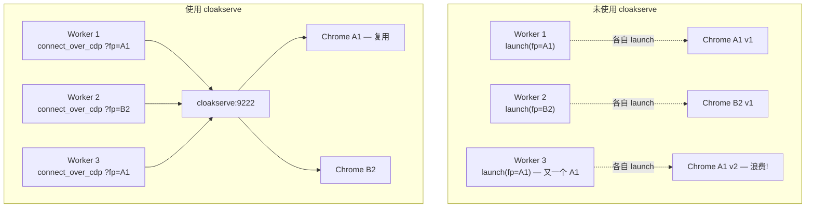
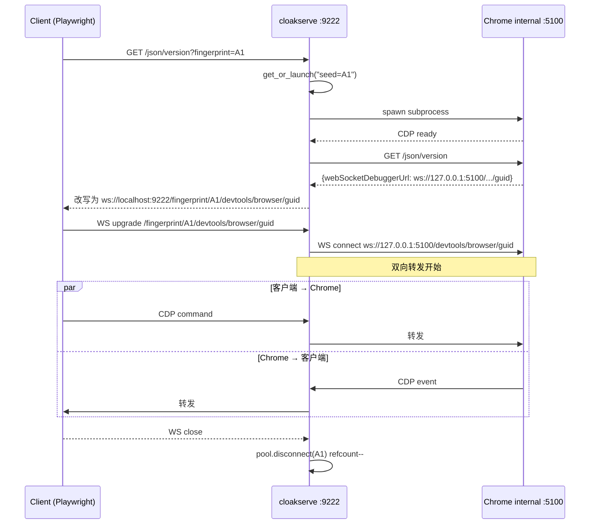

<details>
<summary>相关源文件</summary>

生成本页时使用的主要源文件:

- [bin/cloakserve](../../../project-repos/cloakbrowser/bin/cloakserve)
- [cloakbrowser/browser.py](../../../project-repos/cloakbrowser/cloakbrowser/browser.py)
- [Dockerfile](../../../project-repos/cloakbrowser/Dockerfile)

</details>

# cloakserve:CDP 多路复用器

需要同时跑十几个甚至几十个 stealth Chromium 实例,每个有不同 fingerprint、不同代理、不同时区,常见做法是每个 worker 进程各开一个 `launch()`。但这种"一对一"方式有两个问题:**首次 launch 的开销**(下载/解压 binary、启动 Playwright Node.js 子进程)在每个 worker 重复;**进程数线性扩展**(N 个 worker = N 个 Playwright 进程 + N 个 Chrome 进程)对内存与文件句柄都不友好。

`cloakserve` 解决的就是这件事:**单个端口、多个 Chrome 进程、按 fingerprint seed 路由**。一个客户端写 `playwright.chromium.connect_over_cdp("http://localhost:9222?fingerprint=A1")`,服务端如果 A1 还没起就启动一个新 Chrome 进程,如果已经在跑就复用——客户端永远只通过 `:9222` 这一个端口与服务端对话,真正的 Chrome CDP 端口由服务端内部管理。

它是个独立的 Python 脚本(`bin/cloakserve`,694 行),依赖 `aiohttp` 与 `websockets`,通过 `cloakbrowser[serve]` 可选附加件安装。Docker 镜像默认带它,容器一启动就能服务。

## 它解决的问题图



`Worker 3` 在右侧场景下复用 `Worker 1` 的 Chrome——只要它们用同一个 fingerprint seed,语义上就是"用同一份浏览器身份"。这种共享是 fingerprint 一致性的天然延伸:**同一个 seed → 同一个身份 → 同一个 Chrome 进程**。

## ChromePool:核心数据结构

`ChromePool` 维护 seed 到 Chrome 进程的映射。它有四个字典:

```python
class ChromePool:
    def __init__(self, binary, global_args, headless, data_dir, ...):
        self._processes: dict[str, ChromeProcess] = {}
        self._default: ChromeProcess | None = None
        self._locks: dict[str, asyncio.Lock] = {}
        self._next_port = BASE_CDP_PORT  # 5100
        self._connections: dict[str, int] = {}
```

Sources: [bin/cloakserve:88-111](../../../project-repos/cloakbrowser/bin/cloakserve#L88-L111)

<details class="source-snippets">
<summary>引用源码</summary>

<!-- source-snippets:start -->

#### `bin/cloakserve:88-111`

```
class ChromePool:
    def __init__(
        self,
        binary: str,
        global_args: list[str],
        headless: bool,
        data_dir: str = "/tmp/cloakserve",
        default_seed: str | None = None,
        default_locale: str | None = None,
        default_timezone: str | None = None,
    ):
        self._binary = binary
        self._global_args = global_args
        self._headless = headless
        self._data_dir = data_dir
        self._default_seed = default_seed
        self._default_locale = default_locale
        self._default_timezone = default_timezone
        self._processes: dict[str, ChromeProcess] = {}
        self._default: ChromeProcess | None = None
        self._locks: dict[str, asyncio.Lock] = {}
        self._next_port = BASE_CDP_PORT
        # Connection refcounting for status reporting
        self._connections: dict[str, int] = {}
```

<!-- source-snippets:end -->
</details>

- `_processes`:seed_key → ChromeProcess(包含 subprocess.Popen、cdp_port、user_data_dir、timezone/locale/proxy)
- `_default`:无 seed 请求的共享 Chrome
- `_locks`:每个 seed 一个 lock,避免并发请求同时拉起多个 Chrome
- `_connections`:每个 seed 的活跃 WS 连接数,用于状态报告

`BASE_CDP_PORT = 5100` 意味着内部 Chrome 从 5100、5101、5102 ... 递增分配端口。`_allocate_port()` 实际尝试 bind 检测空闲端口,跳过占用的:

```python
def _allocate_port(self) -> int:
    for _ in range(100):
        port = self._next_port
        self._next_port += 1
        try:
            with socket.socket(socket.AF_INET, socket.SOCK_STREAM) as s:
                s.bind(("127.0.0.1", port))
            return port
        except OSError:
            continue
    raise RuntimeError("No free ports available for Chrome CDP")
```

Sources: [bin/cloakserve:126-137](../../../project-repos/cloakbrowser/bin/cloakserve#L126-L137)

<details class="source-snippets">
<summary>引用源码</summary>

<!-- source-snippets:start -->

#### `bin/cloakserve:126-137`

```
    def _allocate_port(self) -> int:
        """Find a free port starting from _next_port."""
        for _ in range(100):
            port = self._next_port
            self._next_port += 1
            try:
                with socket.socket(socket.AF_INET, socket.SOCK_STREAM) as s:
                    s.bind(("127.0.0.1", port))
                return port
            except OSError:
                continue
        raise RuntimeError("No free ports available for Chrome CDP")
```

<!-- source-snippets:end -->
</details>

## get_or_launch:核心方法

`get_or_launch()` 是整个 server 的心脏:

```python
async def get_or_launch(self, seed, extra_args, timezone, locale, proxy, geoip) -> ChromeProcess:
    if seed is None and self._default_seed:
        seed = self._default_seed
    if locale is None:
        locale = self._default_locale
    if timezone is None:
        timezone = self._default_timezone

    if seed is None:
        seed_key = "__default__"
        actual_seed = str(random.randint(10000, 99999))
    else:
        if not SAFE_SEED_RE.match(seed) or seed in RESERVED_SEEDS:
            raise web.HTTPBadRequest(...)
        seed_key = seed
        actual_seed = seed

    lock = self._get_lock(seed_key)
    async with lock:
        if seed_key in self._processes:
            proc = self._processes[seed_key]
            if proc.process.poll() is None:
                if any([extra_args, timezone, locale, proxy, geoip]):
                    logger.warning("Seed %s already running ... first-launch wins")
                return proc
            await self._cleanup_process(seed_key)

        # 拉起新 Chrome ...
```

Sources: [bin/cloakserve:151-200](../../../project-repos/cloakbrowser/bin/cloakserve#L151-L200)

<details class="source-snippets">
<summary>引用源码</summary>

<!-- source-snippets:start -->

#### `bin/cloakserve:151-200`

```
    async def get_or_launch(
        self,
        seed: str | None,
        extra_args: list[str] | None = None,
        timezone: str | None = None,
        locale: str | None = None,
        proxy: str | None = None,
        geoip: bool = False,
    ) -> ChromeProcess:
        """Get existing or launch new Chrome process for a seed."""
        # Apply CLI defaults when query params don't provide values
        if seed is None and self._default_seed:
            seed = self._default_seed
        if locale is None:
            locale = self._default_locale
        if timezone is None:
            timezone = self._default_timezone

        # No seed = default shared process
        if seed is None:
            seed_key = "__default__"
            actual_seed = str(random.randint(10000, 99999))
        else:
            if not SAFE_SEED_RE.match(seed) or seed in RESERVED_SEEDS:
                raise web.HTTPBadRequest(
                    text=json.dumps({"error": "Invalid fingerprint seed"}),
                    content_type="application/json",
                )
            seed_key = seed
            actual_seed = seed

        lock = self._get_lock(seed_key)
        async with lock:
            # Check if already running (including default fast-path)
            if seed_key in self._processes:
                proc = self._processes[seed_key]
                if proc.process.poll() is None:
                    if any([extra_args, timezone, locale, proxy, geoip]):
                        logger.warning(
                            "Seed %s already running (port %d, tz=%s, locale=%s, proxy=%s) — "
                            "ignoring new params (first-launch wins)",
                            seed_key, proc.cdp_port,
                            proc.timezone, proc.locale, proc.proxy,
                        )
                    return proc
                # Dead — clean up
                await self._cleanup_process(seed_key)

            # Resolve geoip if requested
            exit_ip = None
```

<!-- source-snippets:end -->
</details>

几个关键合约:

**合约 1:无 seed 共享 default**。客户端不带 `?fingerprint=` 时,所有这种请求共享一个 Chrome,内部 seed 是启动时随机生成的 5 位数。这是面向"我只想要一个 stealth Chrome,fingerprint 不重要"的场景。

**合约 2:seed 必须匹配 `^[A-Za-z0-9_-]{1,128}$`**。`SAFE_SEED_RE` 防止 seed 中带路径字符或注入,因为 seed 会用作目录名 (`user_data_dir = data_dir/seed_key`)。0.3.28 的 #217 是这个修复——避免 seed 路径穿越漏洞。

Sources: [bin/cloakserve:65-66](../../../project-repos/cloakbrowser/bin/cloakserve#L65-L66), [CHANGELOG.md:13](../../../project-repos/cloakbrowser/CHANGELOG.md:13)

<details class="source-snippets">
<summary>引用源码</summary>

<!-- source-snippets:start -->

#### `bin/cloakserve:65-66`

```
SAFE_SEED_RE = re.compile(r"^[A-Za-z0-9_-]{1,128}$")
RESERVED_SEEDS = {"__default__"}
```

#### `CHANGELOG.md:13`

> 未找到引用文件：`CHANGELOG.md:13`

<!-- source-snippets:end -->
</details>

**合约 3:first-launch wins**。如果某个 seed 已经在跑,新请求即使带不同 timezone/proxy/extra_args 也**不会**重新启动 Chrome——会复用已有的并 warn。这是有意为之的隔离:同一个 seed 必须有一致行为,允许参数漂移会让"seed = identity"承诺失效。

**合约 4:每个 seed 一个 lock**。`async with lock:` 保证并发请求同一个 seed 时不会重复启动 Chrome。但不同 seed 的并发是放行的——A1 和 B2 可以同时 cold-start。

## Chrome 启动:复用 wrapper 的 build_args

`cloakserve` 不重新实现 stealth args 组装,而是**复用 wrapper**:

```python
from cloakbrowser.browser import build_args, maybe_resolve_geoip, _resolve_webrtc_args, _normalize_socks_string_url

# 在 get_or_launch 内:
fp_extra = [f"--fingerprint={actual_seed}"]
if extra_args:
    fp_extra.extend(extra_args)
if proxy:
    fp_extra.append(f"--proxy-server={_normalize_socks_string_url(proxy)}")

fp_extra = _resolve_webrtc_args(fp_extra, proxy)
if exit_ip and not any(a.startswith("--fingerprint-webrtc-ip") for a in (fp_extra or [])):
    fp_extra = list(fp_extra or [])
    fp_extra.append(f"--fingerprint-webrtc-ip={exit_ip}")

chrome_args = build_args(
    stealth_args=True,
    extra_args=fp_extra,
    timezone=timezone,
    locale=locale,
    headless=self._headless,
)
```

Sources: [bin/cloakserve:200-223](../../../project-repos/cloakbrowser/bin/cloakserve#L200-L223)

<details class="source-snippets">
<summary>引用源码</summary>

<!-- source-snippets:start -->

#### `bin/cloakserve:200-223`

```
            exit_ip = None
            if geoip and proxy:
                timezone, locale, exit_ip = maybe_resolve_geoip(True, proxy, timezone, locale)

            # Build Chrome args via shared logic
            fp_extra = [f"--fingerprint={actual_seed}"]
            if extra_args:
                fp_extra.extend(extra_args)
            if proxy:
                fp_extra.append(f"--proxy-server={_normalize_socks_string_url(proxy)}")

            # WebRTC IP spoofing: resolve auto, inject geoip exit IP
            fp_extra = _resolve_webrtc_args(fp_extra, proxy)
            if exit_ip and not any(a.startswith("--fingerprint-webrtc-ip") for a in (fp_extra or [])):
                fp_extra = list(fp_extra or [])
                fp_extra.append(f"--fingerprint-webrtc-ip={exit_ip}")

            chrome_args = build_args(
                stealth_args=True,
                extra_args=fp_extra,
                timezone=timezone,
                locale=locale,
                headless=self._headless,
            )
```

<!-- source-snippets:end -->
</details>

这种重用很重要——意味着 wrapper 与 cloakserve 在 stealth 行为上严格一致,bug 一处修两处生效。`build_args` 的去重、优先级、`--ignore-gpu-blocklist` 自动注入逻辑,cloakserve 也享受到。

### subprocess + CDP ready 探测

Chrome 用 `subprocess.Popen(full_args, stdout=subprocess.DEVNULL)` 启动,然后**轮询 `/json/version` endpoint 直到响应**:

```python
@staticmethod
async def _wait_for_cdp(port: int, timeout: float = 10.0) -> bool:
    deadline = time.monotonic() + timeout
    delay = 0.1
    session = aiohttp.ClientSession(timeout=aiohttp.ClientTimeout(total=1))
    try:
        while time.monotonic() < deadline:
            try:
                async with session.get(f"http://127.0.0.1:{port}/json/version") as resp:
                    if resp.status == 200:
                        return True
            except Exception:
                pass
            await asyncio.sleep(delay)
            delay = min(delay * 2, 1.0)
        return False
    finally:
        await session.close()
```

Sources: [bin/cloakserve:298-320](../../../project-repos/cloakbrowser/bin/cloakserve#L298-L320)

<details class="source-snippets">
<summary>引用源码</summary>

<!-- source-snippets:start -->

#### `bin/cloakserve:298-320`

```
    @staticmethod
    async def _wait_for_cdp(port: int, timeout: float = 10.0) -> bool:
        """Poll Chrome's /json/version until ready."""
        deadline = time.monotonic() + timeout
        delay = 0.1
        session = aiohttp.ClientSession(
            timeout=aiohttp.ClientTimeout(total=1)
        )
        try:
            while time.monotonic() < deadline:
                try:
                    async with session.get(
                        f"http://127.0.0.1:{port}/json/version"
                    ) as resp:
                        if resp.status == 200:
                            return True
                except Exception:
                    pass
                await asyncio.sleep(delay)
                delay = min(delay * 2, 1.0)
            return False
        finally:
            await session.close()
```

<!-- source-snippets:end -->
</details>

**指数退避**:0.1s → 0.2s → 0.4s → ... 上限 1s。Chrome 启动通常需要 1-3 秒,退避避免每秒打十几次空响应。10 秒超时——如果 Chrome 在这之内没起来,kill 进程并 422 报错。

## HTTP 路由:三个 endpoint

```python
app.router.add_get("/", handle_root)
app.router.add_get("/json/version", handle_json_version)
app.router.add_get("/json/list", handle_json_list)
app.router.add_get("/json", handle_json_list)
app.router.add_get("/fingerprint/{seed}/devtools/{path:.+}", handle_ws_seed)
app.router.add_get("/devtools/{path:.+}", handle_ws_default)
```

Sources: [bin/cloakserve:665-676](../../../project-repos/cloakbrowser/bin/cloakserve#L665-L676)

<details class="source-snippets">
<summary>引用源码</summary>

<!-- source-snippets:start -->

#### `bin/cloakserve:665-676`

```
    app.router.add_get("/", handle_root)
    app.router.add_get("/json/version", handle_json_version)
    app.router.add_get("/json/version/", handle_json_version)
    app.router.add_get("/json/list", handle_json_list)
    app.router.add_get("/json/list/", handle_json_list)
    app.router.add_get("/json", handle_json_list)
    app.router.add_get("/json/", handle_json_list)

    # WebSocket routes — seed-specific (must be before default to match first)
    app.router.add_get("/fingerprint/{seed}/devtools/{path:.+}", handle_ws_seed)
    # WebSocket routes — default (no seed)
    app.router.add_get("/devtools/{path:.+}", handle_ws_default)
```

<!-- source-snippets:end -->
</details>

**`/`**:健康检查,返回当前进程池状态——pid、端口、seed、连接数、timezone/locale/proxy。

**`/json/version` 与 `/json/list`**:Chrome DevTools Protocol 的发现 endpoint。Playwright 的 `connect_over_cdp` 先打这两个再建立 WS 连接。`cloakserve` 在转发 Chrome 响应时**改写 `webSocketDebuggerUrl`**:

```python
seed_key = params["seed"]
if seed_key:
    ws_path = f"fingerprint/{seed_key}/devtools/browser"
else:
    ws_path = "devtools/browser"

orig_ws = data.get("webSocketDebuggerUrl", "")
guid = orig_ws.rsplit("/", 1)[-1] if "/devtools/" in orig_ws else ""

scheme = _ws_scheme(request)
data["webSocketDebuggerUrl"] = f"{scheme}://{host}/{ws_path}/{guid}"
return web.json_response(data)
```

Sources: [bin/cloakserve:395-434](../../../project-repos/cloakbrowser/bin/cloakserve#L395-L434)

<details class="source-snippets">
<summary>引用源码</summary>

<!-- source-snippets:start -->

#### `bin/cloakserve:395-434`

```
async def handle_json_version(request: web.Request) -> web.Response:
    """Proxy /json/version with optional per-seed routing."""
    pool: ChromePool = request.app["pool"]
    params = parse_connection_params(request.query_string)

    cp = await pool.get_or_launch(
        seed=params["seed"],
        extra_args=params["extra_args"] or None,
        timezone=params["timezone"],
        locale=params["locale"],
        proxy=params["proxy"],
        geoip=params["geoip"],
    )

    try:
        async with aiohttp.ClientSession() as session:
            async with session.get(
                f"http://127.0.0.1:{cp.cdp_port}/json/version",
                timeout=aiohttp.ClientTimeout(total=5),
            ) as resp:
                data = await resp.json()
    except Exception as exc:
        logger.error("Failed to reach Chrome CDP (port %d): %s", cp.cdp_port, exc)
        return web.json_response({"error": "CDP endpoint unreachable"}, status=502)

    # Rewrite webSocketDebuggerUrl to route through our multiplexer
    host = request.headers.get("Host", f"localhost:{request.app['port']}")
    seed_key = params["seed"]
    if seed_key:
        ws_path = f"fingerprint/{seed_key}/devtools/browser"
    else:
        ws_path = "devtools/browser"

    # Extract the browser GUID from Chrome's original URL
    orig_ws = data.get("webSocketDebuggerUrl", "")
    guid = orig_ws.rsplit("/", 1)[-1] if "/devtools/" in orig_ws else ""

    scheme = _ws_scheme(request)
    data["webSocketDebuggerUrl"] = f"{scheme}://{host}/{ws_path}/{guid}"
    return web.json_response(data)
```

<!-- source-snippets:end -->
</details>

Chrome 原始的 `webSocketDebuggerUrl` 形如 `ws://127.0.0.1:5100/devtools/browser/<guid>`,这指向内部端口。cloakserve 改写成 `ws://localhost:9222/fingerprint/A1/devtools/browser/<guid>`——客户端永远只看到 `:9222`,内部端口分配对客户端透明。

`_ws_scheme()` 处理 TLS 终止反代场景:如果有 `X-Forwarded-Proto: https`,返回 `wss`。

## WebSocket 代理:双向转发

WS 路由 `/fingerprint/{seed}/devtools/{path:.+}` 进入 `handle_ws_seed`,核心是 `proxy_cdp_websocket()`:

```python
async def proxy_cdp_websocket(client_ws, target_url, label):
    async with websockets.connect(target_url, max_size=None, ping_interval=None, ping_timeout=None) as cdp_ws:
        async def client_to_cdp():
            async for msg in client_ws:
                if msg.type == aiohttp.WSMsgType.TEXT:
                    await cdp_ws.send(msg.data)
                elif msg.type == aiohttp.WSMsgType.BINARY:
                    await cdp_ws.send(msg.data)
                elif msg.type in (CLOSE, CLOSING, CLOSED):
                    break

        async def cdp_to_client():
            async for msg in cdp_ws:
                if isinstance(msg, str):
                    await client_ws.send_str(msg)
                else:
                    await client_ws.send_bytes(msg)

        c2d = asyncio.create_task(client_to_cdp(), name="c2d")
        d2c = asyncio.create_task(cdp_to_client(), name="d2c")
        done, pending = await asyncio.wait([c2d, d2c], return_when=asyncio.FIRST_COMPLETED)
        for task in pending:
            task.cancel()
```

Sources: [bin/cloakserve:483-524](../../../project-repos/cloakbrowser/bin/cloakserve#L483-L524)

<details class="source-snippets">
<summary>引用源码</summary>

<!-- source-snippets:start -->

#### `bin/cloakserve:483-524`

```
async def proxy_cdp_websocket(
    client_ws: web.WebSocketResponse,
    target_url: str,
    label: str,
) -> None:
    """Bidirectional WebSocket proxy between client and Chrome CDP."""
    try:
        async with websockets.connect(
            target_url, max_size=None, ping_interval=None, ping_timeout=None,
        ) as cdp_ws:
            logger.info("%s: connected to %s", label, target_url)

            async def client_to_cdp():
                try:
                    async for msg in client_ws:
                        if msg.type == aiohttp.WSMsgType.TEXT:
                            await cdp_ws.send(msg.data)
                        elif msg.type == aiohttp.WSMsgType.BINARY:
                            await cdp_ws.send(msg.data)
                        elif msg.type in (aiohttp.WSMsgType.CLOSE, aiohttp.WSMsgType.CLOSING, aiohttp.WSMsgType.CLOSED):
                            break
                except Exception as exc:
                    logger.debug("%s [c->cdp]: %s", label, exc)

            async def cdp_to_client():
                try:
                    async for msg in cdp_ws:
                        if isinstance(msg, str):
                            await client_ws.send_str(msg)
                        else:
                            await client_ws.send_bytes(msg)
                except Exception as exc:
                    logger.debug("%s [cdp->c]: %s", label, exc)

            c2d = asyncio.create_task(client_to_cdp(), name="c2d")
            d2c = asyncio.create_task(cdp_to_client(), name="d2c")
            done, pending = await asyncio.wait(
                [c2d, d2c], return_when=asyncio.FIRST_COMPLETED,
            )
            for task in pending:
                task.cancel()
            logger.info("%s: disconnected", label)
```

<!-- source-snippets:end -->
</details>



`max_size=None` 与 `ping_interval=None`:CDP 消息可能很大(截图、HTML),不能限大小;CDP 自己有 keepalive,WS 层不要 ping/pong 干扰。`FIRST_COMPLETED` 保证任一方向出错或断开,另一方向也立即结束。

## 查询参数:解析与路由

`parse_connection_params()` 把 URL 查询串变成 Chrome 启动参数:

```python
SPECIAL_PARAMS = {"fingerprint", "proxy", "geoip", "locale", "timezone"}

def parse_connection_params(query_string: str) -> dict:
    qs = parse_qs(query_string, keep_blank_values=False)
    result = {
        "seed": None, "timezone": None, "locale": None,
        "proxy": None, "geoip": False, "extra_args": [],
    }
    for key, values in qs.items():
        val = values[0]
        if key == "fingerprint":
            result["seed"] = val
        elif key == "timezone":
            result["timezone"] = val
        elif key == "locale":
            result["locale"] = val
        elif key == "proxy":
            result["proxy"] = val
        elif key == "geoip":
            result["geoip"] = val.lower() in ("true", "1", "yes")
        elif key not in SPECIAL_PARAMS:
            result["extra_args"].append(f"--fingerprint-{key}={val}")
    return result
```

Sources: [bin/cloakserve:328-360](../../../project-repos/cloakbrowser/bin/cloakserve#L328-L360)

<details class="source-snippets">
<summary>引用源码</summary>

<!-- source-snippets:start -->

#### `bin/cloakserve:328-360`

```
SPECIAL_PARAMS = {"fingerprint", "proxy", "geoip", "locale", "timezone"}


def parse_connection_params(query_string: str) -> dict:
    """Parse query params into connection config."""
    qs = parse_qs(query_string, keep_blank_values=False)

    result: dict = {
        "seed": None,
        "timezone": None,
        "locale": None,
        "proxy": None,
        "geoip": False,
        "extra_args": [],
    }

    for key, values in qs.items():
        val = values[0]
        if key == "fingerprint":
            result["seed"] = val
        elif key == "timezone":
            result["timezone"] = val
        elif key == "locale":
            result["locale"] = val
        elif key == "proxy":
            result["proxy"] = val
        elif key == "geoip":
            result["geoip"] = val.lower() in ("true", "1", "yes")
        elif key not in SPECIAL_PARAMS:
            # Generic fingerprint param: map to --fingerprint-{key}={val}
            result["extra_args"].append(f"--fingerprint-{key}={val}")

    return result
```

<!-- source-snippets:end -->
</details>

**特殊参数**单独处理,**其他参数**自动转 `--fingerprint-<key>=<val>`。例如 `?gpu-vendor=NVIDIA&hardware-concurrency=16` 会变成 `--fingerprint-gpu-vendor=NVIDIA --fingerprint-hardware-concurrency=16`——客户端可以直接通过 URL 控制 binary 的任何 `--fingerprint-*` flag。

例子:

```bash
curl 'http://localhost:9222/json/version?fingerprint=test123&timezone=Asia/Shanghai&locale=zh-CN&gpu-vendor=NVIDIA'
```

→ 启动一个 seed=test123、时区=上海、语言=中文、GPU 厂商=NVIDIA 的 Chrome。

## CLI 与启动入口

`parse_cli_args()` 处理命令行:

```python
config: dict = {
    "port": 9222,
    "headless": True,
    "data_dir": None,
    "default_seed": None,
    "default_locale": None,
    "default_timezone": None,
}

for arg in argv:
    if arg.startswith("--port="):
        config["port"] = int(arg.split("=", 1)[1])
    elif arg.startswith("--data-dir="):
        config["data_dir"] = arg.split("=", 1)[1]
    elif arg == "--headless=false":
        config["headless"] = False
        passthrough.append(arg)
    elif arg.startswith("--fingerprint-locale="):
        config["default_locale"] = arg.split("=", 1)[1]
    elif arg.startswith("--fingerprint-timezone="):
        config["default_timezone"] = arg.split("=", 1)[1]
    elif arg.startswith("--fingerprint="):
        config["default_seed"] = arg.split("=", 1)[1]
    else:
        passthrough.append(arg)
```

Sources: [bin/cloakserve:584-632](../../../project-repos/cloakbrowser/bin/cloakserve#L584-L632)

<details class="source-snippets">
<summary>引用源码</summary>

<!-- source-snippets:start -->

#### `bin/cloakserve:584-632`

```
def parse_cli_args(argv: list[str]) -> tuple[dict, list[str]]:
    """Parse cloakserve-specific args, return (config, passthrough_args).

    --fingerprint, --fingerprint-locale, and --fingerprint-timezone are
    extracted into config defaults so they route through build_args()
    (e.g. locale needs both --lang and --fingerprint-locale).
    Query-string params override these defaults per-connection.
    """
    config: dict = {
        "port": 9222,
        "headless": True,
        "data_dir": None,
        "default_seed": None,
        "default_locale": None,
        "default_timezone": None,
    }
    passthrough = []
    # Flags consumed by cloakserve (not passed to Chrome)
    consumed_prefixes = (
        "--port=",
        "--data-dir=",
        "--remote-debugging-port=",
        "--remote-debugging-address=",
    )

    for arg in argv:
        if arg.startswith("--port="):
            config["port"] = int(arg.split("=", 1)[1])
        elif arg.startswith("--data-dir="):
            config["data_dir"] = arg.split("=", 1)[1]
        elif arg == "--headless=false" or arg == "--headless=False":
            config["headless"] = False
            passthrough.append(arg)
        elif arg.startswith(consumed_prefixes):
            pass  # Strip these silently
        # Route through build_args() so companion flags are set correctly
        elif arg.startswith("--fingerprint-locale="):
            config["default_locale"] = arg.split("=", 1)[1]
        elif arg.startswith("--fingerprint-timezone="):
            config["default_timezone"] = arg.split("=", 1)[1]
        elif arg.startswith("--fingerprint="):
            config["default_seed"] = arg.split("=", 1)[1]
        else:
            passthrough.append(arg)

    if config["data_dir"] is None:
        config["data_dir"] = _default_data_dir()

    return config, passthrough
```

<!-- source-snippets:end -->
</details>

`--fingerprint=`、`--fingerprint-locale=`、`--fingerprint-timezone=` 设为 server 级默认值——客户端不传时使用。这些会**通过 build_args 注入**,确保 locale 的 `--lang` 与 `--fingerprint-locale` 双 flag 都设上。这是 0.3.23 修复的(CHANGELOG #130)。

### data dir 选择

```python
def _default_data_dir() -> str:
    if os.path.exists("/.dockerenv") or os.path.exists("/run/.containerenv"):
        return "/tmp/cloakserve"
    return str(Path.home() / ".cloakbrowser" / "cloakserve")
```

Sources: [bin/cloakserve:577-581](../../../project-repos/cloakbrowser/bin/cloakserve#L577-L581)

<details class="source-snippets">
<summary>引用源码</summary>

<!-- source-snippets:start -->

#### `bin/cloakserve:577-581`

```
def _default_data_dir() -> str:
    """Smart default: container → /tmp/cloakserve, bare metal → ~/.cloakbrowser/cloakserve."""
    if os.path.exists("/.dockerenv") or os.path.exists("/run/.containerenv"):
        return "/tmp/cloakserve"
    return str(Path.home() / ".cloakbrowser" / "cloakserve")
```

<!-- source-snippets:end -->
</details>

容器内用 `/tmp`,容器外用 home 目录——`/.dockerenv` 是 Docker 标准标记,`/run/.containerenv` 是 Podman 标准标记。这种"自动适应容器"的小动作让 Docker 部署不需要任何配置。

### bind 地址

```python
in_container = os.path.exists("/.dockerenv") or os.path.exists("/run/.containerenv")
host = "0.0.0.0" if in_container else "127.0.0.1"
web.run_app(app, host=host, port=port, print=None)
```

Sources: [bin/cloakserve:687-690](../../../project-repos/cloakbrowser/bin/cloakserve#L687-L690)

<details class="source-snippets">
<summary>引用源码</summary>

<!-- source-snippets:start -->

#### `bin/cloakserve:687-690`

```

    in_container = os.path.exists("/.dockerenv") or os.path.exists("/run/.containerenv")
    host = "0.0.0.0" if in_container else "127.0.0.1"
    web.run_app(app, host=host, port=port, print=None)
```

<!-- source-snippets:end -->
</details>

容器内 bind `0.0.0.0`(必须,否则宿主机访问不到);容器外 bind `127.0.0.1`(默认安全,不监听公网)。这是 0.3.28 的安全加固——之前默认 0.0.0.0 在裸金属上会暴露 CDP 到 LAN。

## 客户端使用

```python
# Python — Playwright
from playwright.sync_api import sync_playwright

pw = sync_playwright().start()
browser = pw.chromium.connect_over_cdp("http://localhost:9222?fingerprint=user_A&timezone=America/New_York")
page = browser.new_page()
page.goto("https://protected-site.com")
```

```javascript
// JS — Playwright
import { chromium } from 'playwright';
const browser = await chromium.connectOverCDP(
  'http://localhost:9222?fingerprint=user_A&timezone=America/New_York'
);
```

```bash
# Docker 部署
docker run -p 9222:9222 cloakhq/cloakbrowser cloakserve --port=9222
```

## 几个非显然的设计点

**1. 同 seed 多客户端可以并发**

```python
def connect(self, seed_key: str) -> None:
    self._connections[seed_key] = self._connections.get(seed_key, 0) + 1

def disconnect(self, seed_key: str) -> None:
    count = self._connections.get(seed_key, 0) - 1
    if count <= 0:
        self._connections.pop(seed_key, None)
    else:
        self._connections[seed_key] = count
```

Sources: [bin/cloakserve:139-150](../../../project-repos/cloakbrowser/bin/cloakserve#L139-L150)

<details class="source-snippets">
<summary>引用源码</summary>

<!-- source-snippets:start -->

#### `bin/cloakserve:139-150`

```
    def connect(self, seed_key: str) -> None:
        """Increment connection refcount for a seed."""
        self._connections[seed_key] = self._connections.get(seed_key, 0) + 1

    def disconnect(self, seed_key: str) -> None:
        """Decrement connection refcount for a seed."""
        count = self._connections.get(seed_key, 0) - 1
        if count <= 0:
            self._connections.pop(seed_key, None)
        else:
            self._connections[seed_key] = count

```

<!-- source-snippets:end -->
</details>

connection 是引用计数。两个客户端可以同时连同一个 seed 的 Chrome(它会有两个 BrowserContext),互相不干扰。

**2. WebSocket 路由顺序很重要**

```python
app.router.add_get("/fingerprint/{seed}/devtools/{path:.+}", handle_ws_seed)
app.router.add_get("/devtools/{path:.+}", handle_ws_default)
```

`/fingerprint/...` 必须**先**于 `/devtools/...` 注册,因为 aiohttp 路由器按注册顺序匹配。否则 `/fingerprint/A1/devtools/browser/guid` 会被 `handle_ws_default` 匹配走 `__default__` 池,导致错误的 Chrome 接管连接。

**3. `_safe_rmtree` 防误删**

```python
def _safe_rmtree(self, path: str) -> None:
    resolved = Path(path).resolve()
    data_resolved = Path(self._data_dir).resolve()
    if resolved == data_resolved or not resolved.is_relative_to(data_resolved):
        logger.error("Refusing to delete path outside data_dir: %s", resolved)
        return
    shutil.rmtree(path, True)
```

Sources: [bin/cloakserve:118-124](../../../project-repos/cloakbrowser/bin/cloakserve#L118-L124)

<details class="source-snippets">
<summary>引用源码</summary>

<!-- source-snippets:start -->

#### `bin/cloakserve:118-124`

```
    def _safe_rmtree(self, path: str) -> None:
        resolved = Path(path).resolve()
        data_resolved = Path(self._data_dir).resolve()
        if resolved == data_resolved or not resolved.is_relative_to(data_resolved):
            logger.error("Refusing to delete path outside data_dir: %s", resolved)
            return
        shutil.rmtree(path, True)
```

<!-- source-snippets:end -->
</details>

清理 Chrome 进程时会删它的 user_data_dir。但 `user_data_dir = self._data_dir / seed_key`,如果 `seed_key` 含 `..` 或绝对路径,可能造成根目录被删——`_safe_rmtree` 把"必须在 data_dir 之内"作为前置检查,任何外部路径都拒绝删除。

**4. 退出时 graceful shutdown**

```python
async def on_shutdown(app: web.Application) -> None:
    await app["pool"].shutdown()

app.on_shutdown.append(on_shutdown)
```

Sources: [bin/cloakserve:569-571](../../../project-repos/cloakbrowser/bin/cloakserve#L569-L571), [bin/cloakserve:680](../../../project-repos/cloakbrowser/bin/cloakserve:680)

<details class="source-snippets">
<summary>引用源码</summary>

<!-- source-snippets:start -->

#### `bin/cloakserve:569-571`

```
async def on_shutdown(app: web.Application) -> None:
    await app["pool"].shutdown()

```

#### `bin/cloakserve:680`

> 未找到引用文件：`bin/cloakserve:680`

<!-- source-snippets:end -->
</details>

aiohttp 收到 SIGTERM 时调 `pool.shutdown()`,逐个 SIGTERM Chrome 进程,5 秒不退就 SIGKILL,然后清理 user_data_dir。Docker `docker stop` 默认 SIGTERM,这套链路保证容器停止时不留僵尸 Chrome。

## 相关页面

- [系统架构](system-architecture.md) — cloakserve 在三层模型中的位置
- [启动 API:四象限对偶](launch-api.md) — wrapper 与 cloakserve 共享的 build_args 路径
- [代理、GeoIP 与 WebRTC 一致性](proxy-and-geoip.md) — cloakserve 中 proxy 参数的处理
- [部署与生态集成](deployment-and-integrations.md) — Docker 部署 cloakserve 的实操
