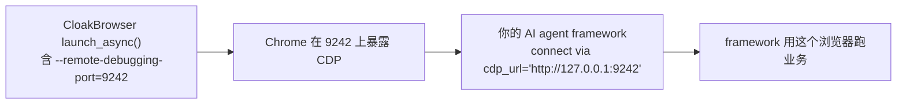

<details>
<summary>相关源文件</summary>

生成本页时使用的主要源文件:

- [Dockerfile](../../../project-repos/cloakbrowser/Dockerfile)
- [bin/docker-entrypoint.sh](../../../project-repos/cloakbrowser/bin/docker-entrypoint.sh)
- [examples/integrations/aws_lambda/lambda_handler.py](../../../project-repos/cloakbrowser/examples/integrations/aws_lambda/lambda_handler.py)
- [examples/integrations/aws_lambda/lambda-entrypoint.sh](../../../project-repos/cloakbrowser/examples/integrations/aws_lambda/lambda-entrypoint.sh)
- [examples/integrations/browser_use_example.py](../../../project-repos/cloakbrowser/examples/integrations/browser_use_example.py)
- [examples/integrations/crawl4ai_example.py](../../../project-repos/cloakbrowser/examples/integrations/crawl4ai_example.py)
- [examples/integrations/scrapling_example.py](../../../project-repos/cloakbrowser/examples/integrations/scrapling_example.py)
- [flake.nix](../../../project-repos/cloakbrowser/flake.nix)

</details>

# 部署与生态集成

CloakBrowser 把"如何反检测"做到了 binary,但"如何在你的实际架构里跑起来"是另一个问题。这一页梳理两类内容:**部署形态**(Docker、AWS Lambda、Nix、cloakserve 服务化)与**生态集成**(browser-use、Crawl4AI、Scrapling、Stagehand、LangChain、Selenium、undetected-chromedriver、Crawlee)。

所有集成的共同模式是"**CloakBrowser 负责浏览器层,你的框架负责业务层**":CloakBrowser `launch()` 出一个 stealth Chromium,然后通过 CDP `connect_over_cdp` 让 AI agent 框架接管。这种"浏览器层即插即换"的设计让 CloakBrowser 不和任何上层强耦合。

## Docker:出厂可用的反检测沙盒

`Dockerfile` 基于 `python:3.12-slim`,做了五件事:

```dockerfile
FROM python:3.12-slim

RUN apt-get update && apt-get install -y --no-install-recommends \
    libnss3 libnspr4 libatk1.0-0 ... \
    fonts-noto-color-emoji fonts-unifont fonts-freefont-ttf \
    fonts-ipafont-gothic fonts-wqy-zenhei fonts-tlwg-loma-otf \
    xvfb xdotool curl ca-certificates \
    && curl -fsSL https://deb.nodesource.com/setup_20.x | bash - \
    && apt-get install -y --no-install-recommends nodejs

COPY pyproject.toml README.md LICENSE BINARY-LICENSE.md CHANGELOG.md ./
COPY cloakbrowser/ cloakbrowser/
RUN pip install --no-cache-dir ".[serve,geoip]"

COPY js/ js/
RUN cd js && npm install && npm run build

COPY examples/ examples/

RUN python -c "from cloakbrowser import ensure_binary; ensure_binary()" \
    && rm -f ~/.cloakbrowser/.welcome_shown

COPY bin/cloaktest /usr/local/bin/cloaktest
COPY bin/cloakserve /usr/local/bin/cloakserve
RUN chmod +x /usr/local/bin/cloaktest /usr/local/bin/cloakserve

EXPOSE 9222
COPY bin/docker-entrypoint.sh /entrypoint.sh
RUN chmod +x /entrypoint.sh
ENV DISPLAY=:99
ENTRYPOINT ["/entrypoint.sh"]
CMD ["python"]
```

Sources: [Dockerfile:1-53](../../../project-repos/cloakbrowser/Dockerfile#L1-L53)

<details class="source-snippets">
<summary>引用源码</summary>

<!-- source-snippets:start -->

#### `Dockerfile:1-53`

```
FROM python:3.12-slim

# Chromium system deps + Node.js
RUN apt-get update && apt-get install -y --no-install-recommends \
    libnss3 libnspr4 libatk1.0-0 libatk-bridge2.0-0 libcups2 \
    libdbus-1-3 libdrm2 libxkbcommon0 libatspi2.0-0 libxcomposite1 \
    libxdamage1 libxfixes3 libxrandr2 libgbm1 libpango-1.0-0 \
    libcairo2 libasound2 libx11-xcb1 libfontconfig1 libx11-6 \
    libxcb1 libxext6 libxshmfence1 \
    libglib2.0-0 libgtk-3-0 libpangocairo-1.0-0 libcairo-gobject2 \
    libgdk-pixbuf-2.0-0 libxss1 libxtst6 fonts-liberation \
    fonts-noto-color-emoji fonts-unifont fonts-freefont-ttf \
    fonts-ipafont-gothic fonts-wqy-zenhei fonts-tlwg-loma-otf \
    xvfb xdotool \
    curl ca-certificates \
    && curl -fsSL https://deb.nodesource.com/setup_20.x | bash - \
    && apt-get install -y --no-install-recommends nodejs \
    && rm -rf /var/lib/apt/lists/*

WORKDIR /app

# Python wrapper
COPY pyproject.toml README.md LICENSE BINARY-LICENSE.md CHANGELOG.md ./
COPY cloakbrowser/ cloakbrowser/
RUN pip install --no-cache-dir ".[serve,geoip]"

# JS wrapper
COPY js/ js/
RUN cd js && npm install && npm run build

# Examples
COPY examples/ examples/

# Pre-download stealth Chromium binary during build (not at runtime)
# Remove welcome marker so users see it on first container run
RUN python -c "from cloakbrowser import ensure_binary; ensure_binary()" \
    && rm -f ~/.cloakbrowser/.welcome_shown

# CLI shortcuts
COPY bin/cloaktest /usr/local/bin/cloaktest
COPY bin/cloakserve /usr/local/bin/cloakserve
RUN chmod +x /usr/local/bin/cloaktest /usr/local/bin/cloakserve

EXPOSE 9222

# Xvfb entrypoint for headed mode support
COPY bin/docker-entrypoint.sh /entrypoint.sh
RUN chmod +x /entrypoint.sh

ENV DISPLAY=:99

ENTRYPOINT ["/entrypoint.sh"]
CMD ["python"]
```

<!-- source-snippets:end -->
</details>

五件事拆解:

**1. Chromium 系统依赖 + 字体包**。Chromium 的 `libnss3`、`libatk` 等 24 个共享库是 headless 也必需的;字体包(`fonts-noto-color-emoji`、`fonts-wqy-zenhei` 等)是 0.3.26 加入的——Kasada/Akamai 等高级反爬会在隐藏 canvas 上渲染 emoji 然后 hash,Linux 最小镜像缺这些字体会产生独特 hash,反而成为指纹。

**2. Node 20 + 双 wrapper 安装**。安装 Python wrapper(`pip install .[serve,geoip]`)与 JS wrapper(`cd js && npm install && npm run build`)。`[serve]` 拉 `aiohttp + websockets`(cloakserve 依赖),`[geoip]` 拉 `geoip2 + socksio`。

**3. Build-time 预下载 binary**。`RUN python -c "from cloakbrowser import ensure_binary; ensure_binary()"` 在 image 构建期下载 ~200MB Chromium,这样 container 启动时 0 延迟。`rm -f .welcome_shown` 移除欢迎横幅 marker——让真实用户看到一次欢迎提示。

**4. 把 cloaktest 与 cloakserve 拷到 PATH**。`docker run cloakhq/cloakbrowser cloaktest` 直接跑反检测体检,`cloakserve` 启动 CDP 多路复用器。

**5. Xvfb 入口脚本**。`docker-entrypoint.sh` 启动 Xvfb 虚拟显示器,然后 exec 用户命令。这让 `docker run` 内可以用 `headless=False` 模式——某些反爬(Cloudflare Turnstile managed challenge)在 headed 模式下表现更好。

```sh
#!/bin/bash
Xvfb :99 -screen 0 1920x1080x24 -nolisten tcp &
sleep 1
exec "$@"
```

Sources: [bin/docker-entrypoint.sh:1-6](../../../project-repos/cloakbrowser/bin/docker-entrypoint.sh#L1-L6)

<details class="source-snippets">
<summary>引用源码</summary>

<!-- source-snippets:start -->

#### `bin/docker-entrypoint.sh:1-6`

```bash
#!/bin/bash
# Start Xvfb for headed mode (Turnstile, CAPTCHAs), then run user command
Xvfb :99 -screen 0 1920x1080x24 -nolisten tcp &
sleep 1
exec "$@"
```

<!-- source-snippets:end -->
</details>

### 一行体验

```bash
docker run --rm cloakhq/cloakbrowser cloaktest
```

`cloaktest` 是个微脚本(3 行),内部就是跑 `examples/stealth_test.py`。这是项目对新用户的"30 秒可用证明"——不用装任何东西,docker pull 完直接看到反检测结果。

### 多架构发布

```yaml
- name: Build and push
  uses: docker/build-push-action@bcafcacb16a39f128d818304e6c9c0c18556b85f  # v7.1.0
  with:
    context: .
    platforms: linux/amd64,linux/arm64
    push: true
    tags: |
      cloakhq/cloakbrowser:${{ env.VERSION }}
      cloakhq/cloakbrowser:latest
    provenance: true
    sbom: true
```

Sources: [github/workflows/publish.yml:114-125](../../../project-repos/cloakbrowser/.github/workflows/publish.yml#L114-L125)

<details class="source-snippets">
<summary>引用源码</summary>

<!-- source-snippets:start -->

#### `github/workflows/publish.yml:114-125`

```yaml
      - name: Build and push
        id: build
        uses: docker/build-push-action@bcafcacb16a39f128d818304e6c9c0c18556b85f  # v7.1.0
        with:
          context: .
          platforms: linux/amd64,linux/arm64
          push: true
          tags: |
            cloakhq/cloakbrowser:${{ env.VERSION }}
            cloakhq/cloakbrowser:latest
          provenance: true
          sbom: true
```

<!-- source-snippets:end -->
</details>

buildx 同时构建 amd64 与 arm64 镜像——AWS Graviton、Apple Silicon、Oracle Ampere 都能直接 pull。`provenance: true` 与 `sbom: true` 启用 SLSA Level 3 build provenance + SBOM,镜像被 cosign 签名(详见 [测试、CI 与发布管线](testing-ci-release.md))。

## AWS Lambda:容器化无服务器反检测

`examples/integrations/aws_lambda/` 是个**完整可部署的 Lambda 模板**,占 ~500 行代码——比绝大多数 README 上的 "5 行 Lambda 例子" 严肃得多。

### 入口脚本:Xvfb + 双模检测

`lambda-entrypoint.sh` 解决了 Lambda 冷启动里几个隐蔽问题:

```sh
# 清理上次残留
rm -f /tmp/.X99-lock /tmp/.X11-unix/X99

Xvfb :99 -screen 0 1920x1080x24 -nolisten tcp >/tmp/Xvfb.log 2>&1 &

# 等 X11 socket
i=0
while [ ! -e /tmp/.X11-unix/X99 ] && [ "$i" -lt 200 ]; do
    i=$((i + 1))
    sleep 0.05
done
sleep 0.2

# 双模:Lambda handler vs 普通 CMD
if [ $# -eq 1 ] && \
   echo "$1" | grep -qE '^[a-zA-Z_][a-zA-Z0-9_]*(\.[a-zA-Z_][a-zA-Z0-9_]*)+$'; then
    if [ -z "${AWS_LAMBDA_RUNTIME_API}" ]; then
        exec /usr/local/bin/aws-lambda-rie /usr/local/bin/python -m awslambdaric "$@"
    else
        exec /usr/local/bin/python -m awslambdaric "$@"
    fi
fi
exec "$@"
```

Sources: [examples/integrations/aws_lambda/lambda-entrypoint.sh:1-52](../../../project-repos/cloakbrowser/examples/integrations/aws_lambda/lambda-entrypoint.sh#L1-L52)

<details class="source-snippets">
<summary>引用源码</summary>

<!-- source-snippets:start -->

#### `examples/integrations/aws_lambda/lambda-entrypoint.sh:1-52`

```bash
#!/bin/sh
# Dual-mode entrypoint for the CloakBrowser Lambda image.
#
#   1. Always start Xvfb on :99 (same as the canonical bin/docker-entrypoint.sh)
#      so headed Chromium works no matter how the container is invoked.
#   2. Detect whether the CMD looks like a Lambda handler (a single
#      `module.func`-shaped argument). If yes, route through the Lambda runtime
#      client (using the bundled aws-lambda-rie locally, or talking to the real
#      Lambda Runtime API when AWS_LAMBDA_RUNTIME_API is set in production).
#   3. Otherwise exec the CMD directly — preserving the canonical Dockerfile's
#      interaction surface (`python`, `cloakserve`, `cloaktest`, `node`, `bash`,
#      `python examples/basic.py`, etc.).
set -e

mkdir -p /tmp/.X11-unix
chmod 1777 /tmp/.X11-unix 2>/dev/null || true

# Clean any stale Xvfb state. If a previous Xvfb died and left its lock file
# behind (we observed this in cold-start storms), a new Xvfb refuses to start
# with "Server is already active for display 99". Removing both files makes
# Xvfb start cleanly every time.
rm -f /tmp/.X99-lock /tmp/.X11-unix/X99

Xvfb :99 -screen 0 1920x1080x24 -nolisten tcp >/tmp/Xvfb.log 2>&1 &

# Wait for the X11 socket to appear AND for Xvfb to be ready to serve. The
# socket file appears at bind(), but listen() and the first accept() come
# slightly later — under cold-start CPU contention this gap matters.
i=0
while [ ! -e /tmp/.X11-unix/X99 ] && [ "$i" -lt 200 ]; do
    i=$((i + 1))
    sleep 0.05
done
# Small buffer after the socket appears so Xvfb has a moment to call listen()
# and start accepting clients. Cheap insurance against the bind/listen gap.
sleep 0.2

# Lambda handler shape: exactly one arg, dotted identifier (no spaces, no slashes,
# no leading dot). `python`, `cloakserve`, `cloaktest`, `bash`, `node` all fail
# this test and pass through to plain exec.
if [ $# -eq 1 ] && \
   echo "$1" | grep -qE '^[a-zA-Z_][a-zA-Z0-9_]*(\.[a-zA-Z_][a-zA-Z0-9_]*)+$'; then
    if [ -z "${AWS_LAMBDA_RUNTIME_API}" ]; then
        # Local invocation via bundled RIE.
        exec /usr/local/bin/aws-lambda-rie /usr/local/bin/python -m awslambdaric "$@"
    else
        # Real Lambda — runtime API endpoint already provided by the platform.
        exec /usr/local/bin/python -m awslambdaric "$@"
    fi
fi

exec "$@"
```

<!-- source-snippets:end -->
</details>

注意点:

- **Stale lock cleanup**:Lambda 容器复用时,上次 Xvfb 进程可能没干净退出,留下 `/tmp/.X99-lock` 让新 Xvfb 拒绝启动("Server is already active for display 99")。每次开机先删
- **Socket 等待 + 缓冲**:socket 文件存在不等于 Xvfb 已经 listen,加 200ms 缓冲覆盖 bind→listen 的间隙
- **双模识别**:单个参数 + 形如 `module.func` → 走 awslambdaric runtime;否则 exec 原 CMD。这让同一个镜像既能跑 Lambda invoke,也能本地 `docker run -it ... bash` 调试

### handler 的工程深度

`lambda_handler.py` 不是"5 行 demo",是 ~350 行的生产级 handler。它处理:

**URL 安全验证**:

```python
def _validate_url(url: str) -> None:
    parsed = urlparse(url)
    if parsed.scheme.lower() not in ("http", "https"):
        raise ValueError(f"Only http:// and https:// URLs are supported, got: {parsed.scheme!r}")
    hostname = parsed.hostname
    if not hostname:
        raise ValueError("URL has no hostname")
    infos = socket.getaddrinfo(hostname, None, socket.AF_UNSPEC, socket.SOCK_STREAM)
    for info in infos:
        addr = ipaddress.ip_address(info[4][0])
        if not addr.is_global:
            raise ValueError("URLs targeting private/internal networks are blocked")
```

Sources: [examples/integrations/aws_lambda/lambda_handler.py:79-96](../../../project-repos/cloakbrowser/examples/integrations/aws_lambda/lambda_handler.py#L79-L96)

<details class="source-snippets">
<summary>引用源码</summary>

<!-- source-snippets:start -->

#### `examples/integrations/aws_lambda/lambda_handler.py:79-96`

```python
def _validate_url(url: str) -> None:
    """Reject non-HTTP schemes and URLs that resolve to private/internal IPs."""
    parsed = urlparse(url)
    if parsed.scheme.lower() not in ("http", "https"):
        raise ValueError(
            f"Only http:// and https:// URLs are supported, got: {parsed.scheme!r}"
        )
    hostname = parsed.hostname
    if not hostname:
        raise ValueError("URL has no hostname")
    try:
        infos = socket.getaddrinfo(hostname, None, socket.AF_UNSPEC, socket.SOCK_STREAM)
    except socket.gaierror:
        raise ValueError(f"Cannot resolve hostname: {hostname}")
    for info in infos:
        addr = ipaddress.ip_address(info[4][0])
        if not addr.is_global:
            raise ValueError("URLs targeting private/internal networks are blocked")
```

<!-- source-snippets:end -->
</details>

防 SSRF——拒绝 `http://169.254.169.254/...`(AWS metadata 服务)等内部 IP。Lambda 暴露给外部调用时,这种攻击向量必须封死。

**Smart wait**:

```python
async def _smart_wait(page, dom_stable_ms=1500, max_settle_ms=15000) -> None:
    js = f"""
    (() => {{
        if (!window.__cb_settle) {{
            window.__cb_settle = {{ len: -1, since: Date.now() }};
        }}
        const cur = document.documentElement.outerHTML.length;
        const s = window.__cb_settle;
        if (cur !== s.len) {{
            s.len = cur;
            s.since = Date.now();
            return false;
        }}
        return (Date.now() - s.since) >= {int(dom_stable_ms)};
    }})()
    """
    await page.wait_for_function(js, timeout=max_settle_ms, polling=200)
```

Sources: [examples/integrations/aws_lambda/lambda_handler.py:151-178](../../../project-repos/cloakbrowser/examples/integrations/aws_lambda/lambda_handler.py#L151-L178)

<details class="source-snippets">
<summary>引用源码</summary>

<!-- source-snippets:start -->

#### `examples/integrations/aws_lambda/lambda_handler.py:151-178`

```python
async def _smart_wait(page, dom_stable_ms: int = 1500, max_settle_ms: int = 15000) -> None:
    """Wait until the document HTML hasn't changed for `dom_stable_ms`.

    Generic stopping condition for at-scale scraping when you can't tune
    selectors per site. More robust than `networkidle` because it ignores
    network activity that doesn't mutate the DOM (analytics beacons,
    long-poll, websockets, web vitals streams).
    """
    js = f"""
    (() => {{
        if (!window.__cb_settle) {{
            window.__cb_settle = {{ len: -1, since: Date.now() }};
        }}
        const cur = document.documentElement.outerHTML.length;
        const s = window.__cb_settle;
        if (cur !== s.len) {{
            s.len = cur;
            s.since = Date.now();
            return false;
        }}
        return (Date.now() - s.since) >= {int(dom_stable_ms)};
    }})()
    """
    try:
        await page.wait_for_function(js, timeout=max_settle_ms, polling=200)
    except Exception:
        # Hit max_settle_ms cap — return what we have rather than fail the whole invoke
        logger.warning("smart_wait hit max_settle_ms=%d cap", max_settle_ms)
```

<!-- source-snippets:end -->
</details>

不依赖 `networkidle`(被 analytics beacon、long-poll、websocket 干扰)、不依赖 `domcontentloaded`(可能漏掉懒加载内容)——用"DOM HTML 长度连续 1.5 秒不变"作信号。这是 SPA 反爬场景下的标准启发式。

**重试与策略**:

```python
def _classify_error(err: Exception) -> dict | None:
    msg = str(err)
    if "ERR_CERT" in msg:
        return {"_strategy_args": ["--ignore-certificate-errors"], "goto_timeout_ms": 60000}
    if ("Timeout" in msg and "exceeded" in msg) or "ERR_CONNECTION_TIMED_OUT" in msg:
        return {"goto_timeout_ms": 90000, "max_settle_ms": 25000}
    return None
```

Sources: [examples/integrations/aws_lambda/lambda_handler.py:236-261](../../../project-repos/cloakbrowser/examples/integrations/aws_lambda/lambda_handler.py#L236-L261)

<details class="source-snippets">
<summary>引用源码</summary>

<!-- source-snippets:start -->

#### `examples/integrations/aws_lambda/lambda_handler.py:236-261`

```python
def _classify_error(err: Exception) -> dict | None:
    """Map a Playwright error to a retry-strategy override dict, or None
    if the error is unrecoverable.

    Match on str(e) because Playwright errors carry their codes inside the
    message (Error.__str__ includes ERR_CERT_AUTHORITY_INVALID etc.); there
    is no stable structured `.error_code` attribute to rely on.

    Strategies (priority order — first match wins):
      ERR_CERT_*                  -> --ignore-certificate-errors + 60s goto budget
      Timeout exceeded            -> 90s goto budget + 25s smart_wait cap
      ERR_CONNECTION_TIMED_OUT    -> same as Timeout
    Returns None for unrecoverable site issues (DNS, SSL, refused, HTTP 4xx/5xx).
    """
    msg = str(err)
    if "ERR_CERT" in msg:
        return {
            "_strategy_args": ["--ignore-certificate-errors"],
            "goto_timeout_ms": 60000,
        }
    if ("Timeout" in msg and "exceeded" in msg) or "ERR_CONNECTION_TIMED_OUT" in msg:
        return {
            "goto_timeout_ms": 90000,
            "max_settle_ms": 25000,
        }
    return None
```

<!-- source-snippets:end -->
</details>

错误分类驱动重试策略:证书错误 → 加 `--ignore-certificate-errors`、增大超时;超时 → 增大到 90s;DNS 失败/连接拒绝 → 不重试(下游问题,重试无益)。每次重试更新 `_strategy_args` 并重 launch——因为 `--ignore-certificate-errors` 是 Chrome flag,必须重启 binary 才能生效。

**冷启动 retry**:

```python
async def _launch_with_retry(event, attempts=3, backoff_s=0.3):
    for i in range(attempts):
        try:
            return await launch_context_async(**_build_launch_kwargs(event))
        except Exception as e:
            last_err = e
            logger.warning("launch attempt %d/%d failed: %s", i + 1, attempts, str(e)[:200])
            if i + 1 < attempts:
                await asyncio.sleep(backoff_s * (i + 1))
    raise last_err
```

Sources: [examples/integrations/aws_lambda/lambda_handler.py:211-233](../../../project-repos/cloakbrowser/examples/integrations/aws_lambda/lambda_handler.py#L211-L233)

<details class="source-snippets">
<summary>引用源码</summary>

<!-- source-snippets:start -->

#### `examples/integrations/aws_lambda/lambda_handler.py:211-233`

```python
async def _launch_with_retry(event: dict, attempts: int = 3, backoff_s: float = 0.3):
    """Retry launch_context_async up to `attempts` times with linear backoff.

    Lambda cold-start storms occasionally race Xvfb readiness or hit transient
    Chromium spawn failures — both surface as "Target page, context or browser
    has been closed" at launch. The failure is fast (~0.5s) so retries are
    cheap, and a retry on a now-warm container almost always succeeds.

    Pairs with the lock-cleanup + socket-poll in lambda-entrypoint.sh: the
    entrypoint catches the common case at container init; this catches the
    residual race when the first invocation hits before Xvfb is fully ready.
    """
    last_err: Exception | None = None
    for i in range(attempts):
        try:
            return await launch_context_async(**_build_launch_kwargs(event))
        except Exception as e:
            last_err = e
            logger.warning("launch attempt %d/%d failed: %s",
                           i + 1, attempts, str(e)[:200])
            if i + 1 < attempts:
                await asyncio.sleep(backoff_s * (i + 1))  # 0.3s, 0.6s
    raise last_err  # type: ignore[misc]
```

<!-- source-snippets:end -->
</details>

Lambda 冷启动里 Xvfb 与 Chromium 启动可能竞争 CPU,launch 偶尔失败("Target page, context or browser has been closed")。三次重试覆盖 99% 的冷启动 race。

## Nix Flake:可重现的开发环境

`flake.nix` 提供 Nix package + devShell,主要服务于:

1. **可重现构建**:`flake.lock` 锁定 nixpkgs 版本,任何机器 `nix build .#cloakbrowserChromium` 得到一致 Chromium 安装
2. **autoPatchelfHook**:Nix 的 `autoPatchelfHook` 自动给 binary 补上 RPATH 与 LD_LIBRARY_PATH,绕过宿主 glibc 版本差异——这对 NixOS、Alpine、Bazel build 等"非 standard libc"环境非常关键
3. **font + xdotool + xvfb-run 一并提供**:开发 shell 进去就有完整的反爬测试环境

```nix
packageInfo = {
  x86_64-linux = {
    platformTag = "linux-x64";
    version = "146.0.7680.177.3";
    hash = "sha256-WvAn+q+x/vmTPreEwJS3ZHBt4io3KizuhLwRf8SrU38=";
  };
  aarch64-linux = {
    platformTag = "linux-arm64";
    version = "146.0.7680.177.3";
    hash = "sha256-i3HOU7T9ExMnMxox+6ODXXGILRm/qr3njdD1OQvRb0U=";
  };
};
```

Sources: [flake.nix:19-30](../../../project-repos/cloakbrowser/flake.nix#L19-L30)

<details class="source-snippets">
<summary>引用源码</summary>

<!-- source-snippets:start -->

#### `flake.nix:19-30`

```
      packageInfo = {
        x86_64-linux = {
          platformTag = "linux-x64";
          version = "146.0.7680.177.3";
          hash = "sha256-WvAn+q+x/vmTPreEwJS3ZHBt4io3KizuhLwRf8SrU38=";
        };
        aarch64-linux = {
          platformTag = "linux-arm64";
          version = "146.0.7680.177.3";
          hash = "sha256-i3HOU7T9ExMnMxox+6ODXXGILRm/qr3njdD1OQvRb0U=";
        };
      };
```

<!-- source-snippets:end -->
</details>

注意 hash——Nix 强制 fetchurl 校验 SHA-256,与 wrapper 端的 `SHA256SUMS` 校验机制呼应。版本升级时这个 hash 必须更新。

### devShell 设置 CLOAKBROWSER_BINARY_PATH

```nix
devShells = forAllSystems (system:
  let
    cloakbrowserChromium = self.packages.${system}.cloakbrowserChromium;
  in
  {
    default = pkgs.mkShell {
      packages = [ cloakbrowserChromium python ... ];
      CLOAKBROWSER_BINARY_PATH = "${cloakbrowserChromium}/bin/cloakbrowser-chrome";
    };
  });
```

Sources: [flake.nix:200-235](../../../project-repos/cloakbrowser/flake.nix#L200-L235)

<details class="source-snippets">
<summary>引用源码</summary>

<!-- source-snippets:start -->

#### `flake.nix:200-235`

```
      devShells = forAllSystems (system:
        let
          pkgs = mkPkgs system;
          cloakbrowserChromium = self.packages.${system}.cloakbrowserChromium;
          python = pkgs.python312.withPackages (ps: with ps; [
            aiohttp
            geoip2
            hatchling
            httpx
            playwright
            pytest
            pytest-asyncio
            socksio
            websockets
          ]);
        in
        {
          default = pkgs.mkShell {
            packages = [
              cloakbrowserChromium
              python
              pkgs.cacert
              pkgs.curl
              pkgs.git
              pkgs.jq
              pkgs.nodejs_20
              pkgs.which
              pkgs.xdotool
              pkgs.xvfb-run
            ]
            ++ runtimeLibraries pkgs
            ++ fontPackages pkgs;

            CLOAKBROWSER_BINARY_PATH = "${cloakbrowserChromium}/bin/cloakbrowser-chrome";
          };
        });
```

<!-- source-snippets:end -->
</details>

进入 shell 后 `CLOAKBROWSER_BINARY_PATH` 已设好,wrapper 跳过下载直接用 Nix 管理的 binary——这是 Nix 与 wrapper 优雅集成的关键。

## 框架集成:CDP 桥接的标准模式

所有 `examples/integrations/` 集成几乎用同一个模式:



### browser-use(AI agent)

```python
from browser_use import Agent, BrowserSession, ChatOpenAI
from cloakbrowser import launch_async

cb_browser = await launch_async(
    headless=True,
    args=["--remote-debugging-port=9242", "--remote-debugging-address=127.0.0.1"],
)

session = BrowserSession(cdp_url="http://127.0.0.1:9242")
agent = Agent(task="...", llm=ChatOpenAI(model="gpt-4o-mini"), browser_session=session)
result = await agent.run()
```

Sources: [examples/integrations/browser_use_example.py:17-37](../../../project-repos/cloakbrowser/examples/integrations/browser_use_example.py#L17-L37)

<details class="source-snippets">
<summary>引用源码</summary>

<!-- source-snippets:start -->

#### `examples/integrations/browser_use_example.py:17-37`

```python
async def main():
    # Step 1: Launch CloakBrowser (handles binary, stealth args, fingerprints)
    cb_browser = await launch_async(
        headless=True,
        args=["--remote-debugging-port=9242", "--remote-debugging-address=127.0.0.1"],
    )

    # Step 2: Connect browser-use to the stealth browser via CDP
    session = BrowserSession(cdp_url="http://127.0.0.1:9242")

    # Step 3: Run your AI agent — it browses through CloakBrowser
    agent = Agent(
        task="Go to https://www.google.com and search for 'browser automation'",
        llm=ChatOpenAI(model="gpt-4o-mini"),
        browser_session=session,
    )

    result = await agent.run()
    print(result)

    await cb_browser.close()
```

<!-- source-snippets:end -->
</details>

### Crawl4AI(LLM-ready 爬虫)

```python
from crawl4ai import AsyncWebCrawler, BrowserConfig, CrawlerRunConfig
from cloakbrowser import launch_async

cb_browser = await launch_async(
    args=["--remote-debugging-port=9243", "--remote-debugging-address=127.0.0.1"],
)
browser_config = BrowserConfig(browser_mode="cdp", cdp_url="http://127.0.0.1:9243")
async with AsyncWebCrawler(config=browser_config) as crawler:
    result = await crawler.arun("https://example.com", config=CrawlerRunConfig())
```

Sources: [examples/integrations/crawl4ai_example.py:16-35](../../../project-repos/cloakbrowser/examples/integrations/crawl4ai_example.py#L16-L35)

<details class="source-snippets">
<summary>引用源码</summary>

<!-- source-snippets:start -->

#### `examples/integrations/crawl4ai_example.py:16-35`

```python
async def main():
    # Step 1: Launch CloakBrowser with remote debugging
    cb_browser = await launch_async(
        headless=True,
        args=["--remote-debugging-port=9243", "--remote-debugging-address=127.0.0.1"],
    )

    # Step 2: Connect Crawl4AI to the stealth browser via CDP
    browser_config = BrowserConfig(browser_mode="cdp", cdp_url="http://127.0.0.1:9243")
    run_config = CrawlerRunConfig()

    async with AsyncWebCrawler(config=browser_config) as crawler:
        result = await crawler.arun(
            "https://example.com",
            config=run_config,
        )
        print(f"Extracted {len(result.markdown)} chars of markdown")
        print(result.markdown[:500])

    await cb_browser.close()
```

<!-- source-snippets:end -->
</details>

### 模式总结

|集成|入口|connect 方式|
|---|---|---|
|browser-use|`BrowserSession(cdp_url=...)`|CDP|
|Crawl4AI|`BrowserConfig(browser_mode="cdp", cdp_url=...)`|CDP|
|Scrapling|类似 BrowserConfig|CDP|
|Stagehand|`new Stagehand({localBrowserLaunchOptions: {cdpUrl: ...}})`|CDP|
|Crawlee|`PlaywrightCrawler({browserPoolOptions: {browserPlugins: ...}})`|插件挂入 CDP|
|Selenium|RemoteWebDriver + ChromeDriver 配 CloakBrowser binary|WebDriver|
|undetected-chromedriver|`uc.Chrome(driver_executable_path=..., browser_executable_path=cloakbrowser_binary)`|WebDriver|
|LangChain WebBaseLoader|fetch 模式无法用,需要 PlaywrightLoader 改 cdp_url|CDP|

整体模式:**CloakBrowser 给 binary + stealth,其他框架给业务逻辑**。中间用 CDP/WebDriver 桥接,无需修改框架代码。

## 选型建议

| 场景 | 推荐 |
|---|---|
|本地开发,Python script|`pip install cloakbrowser` + `launch()`|
|本地开发,JS script|`npm install cloakbrowser playwright-core` + `launch()`|
|生产 + 多账号矩阵|Docker + `cloakserve` 集中部署|
|Serverless 单次抓取|Lambda 模板(`examples/integrations/aws_lambda/`)|
|可重现 NixOS / Bazel|`flake.nix` 提供的 Chromium derivation|
|嵌入 AI agent|launch_async + `--remote-debugging-port=PORT` + framework CDP url|
|嵌入 LangChain RAG|同上,WebBaseLoader 不行,要 PlaywrightLoader|
|集成已有 Selenium 测试|`browser_executable_path=cloakbrowser_binary` + chromedriver|
|集成 Stagehand AI 自动化|connect_over_cdp + `localBrowserLaunchOptions`|

## 几个非显然的部署陷阱

**1. Docker 中 `--no-sandbox` 是必需的**

Default stealth args 已经包含 `--no-sandbox`,所以一般用户不用操心。但如果 `stealth_args=False` 自定义 args 时容易漏——容器内 user namespace 默认不可用,sandbox 会让 Chrome 启动 crash。

**2. Lambda 内存至少 2GB**

Chromium 启动峰值内存 ~800MB,加 binary 加载、Lambda runtime,2GB 才能稳定运行。`INSTRUCTIONS.md` 文档明确写了这点。

**3. headed 模式必须有 Xvfb**

Cloudflare Turnstile managed challenge 在 headed 模式下表现更好,但需要 X11 显示器。Docker 镜像与 Lambda 模板都自带 Xvfb,本地裸金属需要 `xvfb-run python script.py` 或先 `Xvfb :99 -screen 0 1920x1080x24 & export DISPLAY=:99`。

**4. cloakserve 端口暴露**

`cloakserve` 默认监听 9222。在容器内绑 `0.0.0.0`,容器外绑 `127.0.0.1`——所以 `docker run -p 9222:9222` 是必需的,外部才能访问。不要在生产把 cloakserve 直接暴露公网,任何能访问 9222 的人都能控制你的浏览器。

**5. binary 启动权限**

`cloakbrowser-binary` 解压后需要 `chmod +x`,Dockerfile 在 `_extract_archive` 阶段自动处理。但 Nix 通过 `autoPatchelfHook` 处理动态链接,需要 `chmod +x` 后才能 patchelf——`installPhase` 显式 `chmod +x "$out/lib/cloakbrowser/chrome"`。

Sources: [flake.nix:139-140](../../../project-repos/cloakbrowser/flake.nix#L139-L140)

<details class="source-snippets">
<summary>引用源码</summary>

<!-- source-snippets:start -->

#### `flake.nix:139-140`

```
            chmod +x "$out/lib/cloakbrowser/chrome"
            chmod +x "$out/lib/cloakbrowser/chromedriver"
```

<!-- source-snippets:end -->
</details>

## 相关页面

- [二进制生命周期](binary-management.md) — Docker 与 Nix 如何避开 wrapper 的下载逻辑
- [cloakserve CDP 多路复用器](cloakserve-cdp-multiplexer.md) — 服务化场景的核心组件
- [测试、CI 与发布管线](testing-ci-release.md) — Docker 镜像如何被签名与证明
