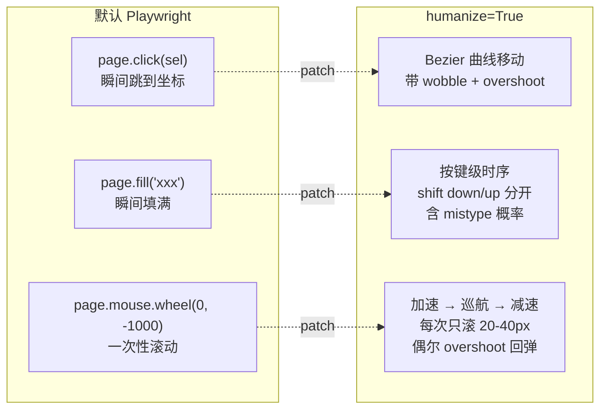
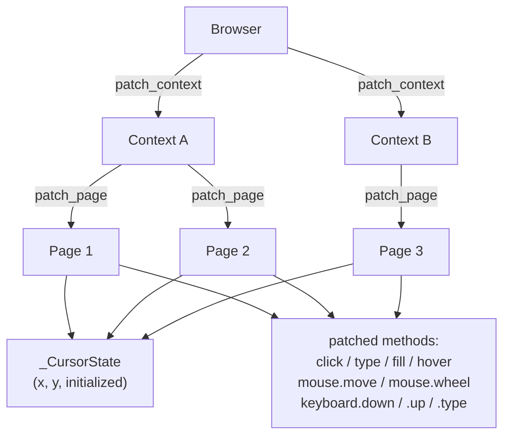
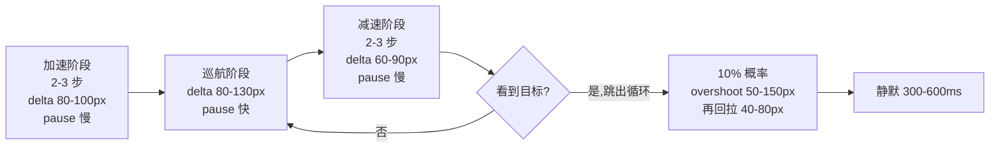

<details>
<summary>相关源文件</summary>

生成本页时使用的主要源文件:

- [cloakbrowser/human/__init__.py](../../../project-repos/cloakbrowser/cloakbrowser/human/__init__.py)
- [cloakbrowser/human/config.py](../../../project-repos/cloakbrowser/cloakbrowser/human/config.py)
- [cloakbrowser/human/mouse.py](../../../project-repos/cloakbrowser/cloakbrowser/human/mouse.py)
- [cloakbrowser/human/keyboard.py](../../../project-repos/cloakbrowser/cloakbrowser/human/keyboard.py)
- [cloakbrowser/human/scroll.py](../../../project-repos/cloakbrowser/cloakbrowser/human/scroll.py)
- [js/src/human/index.ts](../../../project-repos/cloakbrowser/js/src/human/index.ts)
- [js/src/human/config.ts](../../../project-repos/cloakbrowser/js/src/human/config.ts)

</details>

# 拟人化行为层

源码级 fingerprint 补丁让 CloakBrowser 在静态信号上通过反爬,但**行为信号**——鼠标移动轨迹、键盘按键时序、滚动节奏——是另一道独立防线。Akamai、Cloudflare、Datadome 等高级反爬都会做行为指纹分析:`page.click()` 这种瞬间从 (0,0) 跳到目标坐标的鼠标轨迹、`page.fill()` 这种"瞬间填满整个输入框"的键盘行为,会被识别为脚本。

`humanize=True` 是 CloakBrowser 的第二道防线:一组对 Playwright/Puppeteer 方法的运行时 patch,把所有"人类可见的交互"替换成时序合理、轨迹自然的版本。架构上它**不**改 binary,完全在 wrapper 层用 Python/TypeScript 实现;但为了避免被反爬通过"调用栈含 evaluate"识破,它在某些场景下会绕回 CDP Isolated World——下文详述。

## 一个直观对比



在 deviceandbrowserinfo.com 行为检测上,默认配置下 24 个行为信号全部失败;开启 `humanize=True` 后 24/24 全过。

## 三层补丁:Browser → Context → Page

`patch_browser()` 是入口,它沿对象树往下,把所有现有与未来的 page 都纳管:

```python
def patch_browser(browser: Any, cfg: HumanConfig) -> None:
    for context in browser.contexts:
        patch_context(context, cfg)

    orig_new_context = browser.new_context
    def _patched_new_context(**kwargs: Any) -> Any:
        context = orig_new_context(**kwargs)
        patch_context(context, cfg)
        return context
    browser.new_context = _patched_new_context

    orig_new_page = browser.new_page
    def _patched_new_page(**kwargs: Any) -> Any:
        page = orig_new_page(**kwargs)
        if not hasattr(page, '_original'):
            patch_page(page, cfg, _CursorState())
        return page
    browser.new_page = _patched_new_page
```

Sources: [cloakbrowser/human/__init__.py:1524-1545](../../../project-repos/cloakbrowser/cloakbrowser/human/__init__.py#L1524-L1545)

<details class="source-snippets">
<summary>引用源码</summary>

<!-- source-snippets:start -->

#### `cloakbrowser/human/__init__.py:1524-1545`

```python
def patch_browser(browser: Any, cfg: HumanConfig) -> None:
    for context in browser.contexts:
        patch_context(context, cfg)

    orig_new_context = browser.new_context

    def _patched_new_context(**kwargs: Any) -> Any:
        context = orig_new_context(**kwargs)
        patch_context(context, cfg)
        return context

    browser.new_context = _patched_new_context

    orig_new_page = browser.new_page

    def _patched_new_page(**kwargs: Any) -> Any:
        page = orig_new_page(**kwargs)
        if not hasattr(page, '_original'):
            patch_page(page, cfg, _CursorState())
        return page

    browser.new_page = _patched_new_page
```

<!-- source-snippets:end -->
</details>

三层递归一气呵成:

1. **patch_browser** 覆盖所有现有 context + 给 `browser.new_context` 挂钩
2. **patch_context** 覆盖所有现有 page + 监听 `'page'` 事件 + 给 `context.new_page` 挂钩
3. **patch_page** 给具体 Page 对象上 patch:`click`/`type`/`fill`/`hover`/`dblclick` 以及 `mouse.*` / `keyboard.*`

每个被 patch 的 page 上挂一个 `page._original` 对象——保留原始方法引用,用户可以通过 `page._original.click(sel)` 强制走原版(用于性能敏感场景)。



注意每个 Page 有自己的 `_CursorState`,但**同一 Context 内多个 page 共享一个 cursor**——这模拟人类用户:同一个浏览器窗口里切换 tab,鼠标位置保持连续。

Sources: [cloakbrowser/human/__init__.py:1507-1521](../../../project-repos/cloakbrowser/cloakbrowser/human/__init__.py#L1507-L1521)

<details class="source-snippets">
<summary>引用源码</summary>

<!-- source-snippets:start -->

#### `cloakbrowser/human/__init__.py:1507-1521`

```python
def patch_context(context: Any, cfg: HumanConfig) -> None:
    cursor = _CursorState()
    for page in context.pages:
        patch_page(page, cfg, cursor)
    context.on("page", lambda p: patch_page(p, cfg, _CursorState()) if not hasattr(p, '_original') else None)

    orig_new_page = context.new_page

    def _patched_new_page(**kwargs: Any) -> Any:
        page = orig_new_page(**kwargs)
        if not hasattr(page, '_original'):
            patch_page(page, cfg, _CursorState())
        return page

    context.new_page = _patched_new_page
```

<!-- source-snippets:end -->
</details>

## 鼠标:Bezier 曲线 + Wobble + Overshoot

`human_move()` 把"从 (start_x, start_y) 到 (end_x, end_y)"分解成多步插值:

```python
def human_move(raw, start_x, start_y, end_x, end_y, cfg):
    dist = math.hypot(end_x - start_x, end_y - start_y)
    if dist < 1:
        return

    steps = max(cfg.mouse_min_steps, min(cfg.mouse_max_steps, round(dist / cfg.mouse_steps_divisor)))
    start = Point(start_x, start_y)
    end = Point(end_x, end_y)
    cp1, cp2 = _random_control_points(start, end)

    for i in range(steps + 1):
        progress = i / steps
        eased_t = _ease_in_out(progress)
        pt = _bezier(start, cp1, cp2, end, eased_t)

        wobble_amp = math.sin(math.pi * progress) * cfg.mouse_wobble_max
        wx = pt.x + (random.random() - 0.5) * 2 * wobble_amp
        wy = pt.y + (random.random() - 0.5) * 2 * wobble_amp

        raw.move(round(wx), round(wy))

        burst_counter += 1
        if burst_counter >= burst_size and i < steps:
            sleep_ms(rand_range(cfg.mouse_burst_pause))
            burst_counter = 0

    if random.random() < cfg.mouse_overshoot_chance:
        # 超过目标一点点,再回拉
        ...
```

Sources: [cloakbrowser/human/mouse.py:58-99](../../../project-repos/cloakbrowser/cloakbrowser/human/mouse.py#L58-L99)

<details class="source-snippets">
<summary>引用源码</summary>

<!-- source-snippets:start -->

#### `cloakbrowser/human/mouse.py:58-99`

```python
def human_move(
    raw: RawMouse,
    start_x: float, start_y: float,
    end_x: float, end_y: float,
    cfg: HumanConfig,
) -> None:
    dist = math.hypot(end_x - start_x, end_y - start_y)
    if dist < 1:
        return

    steps = max(cfg.mouse_min_steps, min(cfg.mouse_max_steps, round(dist / cfg.mouse_steps_divisor)))
    start = Point(start_x, start_y)
    end = Point(end_x, end_y)
    cp1, cp2 = _random_control_points(start, end)

    burst_counter = 0
    burst_size = rand_int_range(cfg.mouse_burst_size)

    for i in range(steps + 1):
        progress = i / steps
        eased_t = _ease_in_out(progress)
        pt = _bezier(start, cp1, cp2, end, eased_t)

        wobble_amp = math.sin(math.pi * progress) * cfg.mouse_wobble_max
        wx = pt.x + (random.random() - 0.5) * 2 * wobble_amp
        wy = pt.y + (random.random() - 0.5) * 2 * wobble_amp

        raw.move(round(wx), round(wy))

        burst_counter += 1
        if burst_counter >= burst_size and i < steps:
            sleep_ms(rand_range(cfg.mouse_burst_pause))
            burst_counter = 0

    if random.random() < cfg.mouse_overshoot_chance:
        overshoot_dist = rand_range(cfg.mouse_overshoot_px)
        angle = math.atan2(end_y - start_y, end_x - start_x)
        raw.move(round(end_x + math.cos(angle) * overshoot_dist),
                 round(end_y + math.sin(angle) * overshoot_dist))
        sleep_ms(rand(30, 70))
        raw.move(round(end_x + (random.random() - 0.5) * 4),
                 round(end_y + (random.random() - 0.5) * 4))
```

<!-- source-snippets:end -->
</details>

四个让人类似真人的技法叠在一起:

| 技法 | 实现 | 模拟的人类特征 |
|---|---|---|
|**Cubic Bezier 主路径**|`_bezier(p0, cp1, cp2, p3, t)` 三次曲线,控制点位于路径两端的 25% 与 75% 处,偏移随机 -0.3~0.3 倍距离 | 真人不走直线,手会沿弧线移动 |
|**Easing**|`_ease_in_out(t)`:开始慢、中间快、结束慢的 cubic ease | 真人手部加速→匀速→减速 |
|**Wobble**|每步加 sin 包络的小随机噪声(峰值 1.5px) | 真人手部不稳,有小抖动 |
|**Overshoot**|15% 概率移动到目标外 3-6px,停顿后回到附近 | 真人鼠标常常冲过目标再修正 |

**Burst pause** 是第五个细节:每 3-5 个 step 暂停 8-18ms。这反映了真实鼠标事件流——硬件 USB 中断 + OS 调度的天然不均匀,而不是匀速的 step。

### click 不是 move 之后的瞬间点击

`human_click()` 把"点击"拆成 aim_delay + mouse_down + hold + mouse_up:

```python
def human_click(raw, is_input, cfg):
    aim_delay = rand_range(cfg.click_aim_delay_input) if is_input else rand_range(cfg.click_aim_delay_button)
    sleep_ms(aim_delay)
    hold_time = rand_range(cfg.click_hold_input) if is_input else rand_range(cfg.click_hold_button)
    raw.down()
    sleep_ms(hold_time)
    raw.up()
```

Sources: [cloakbrowser/human/mouse.py:113-119](../../../project-repos/cloakbrowser/cloakbrowser/human/mouse.py#L113-L119)

<details class="source-snippets">
<summary>引用源码</summary>

<!-- source-snippets:start -->

#### `cloakbrowser/human/mouse.py:113-119`

```python
def human_click(raw: RawMouse, is_input: bool, cfg: HumanConfig) -> None:
    aim_delay = rand_range(cfg.click_aim_delay_input) if is_input else rand_range(cfg.click_aim_delay_button)
    sleep_ms(aim_delay)
    hold_time = rand_range(cfg.click_hold_input) if is_input else rand_range(cfg.click_hold_button)
    raw.down()
    sleep_ms(hold_time)
    raw.up()
```

<!-- source-snippets:end -->
</details>

`aim_delay`:鼠标到位后停顿 60-200ms,模拟"瞄准"。`hold_time`:按下到松开间隔 40-150ms,而非瞬间。`is_input` 区分点击输入框(更短)与按钮(更长)——人类点输入框是"我要开始打字"的轻按,点按钮是"我决定要执行"的稍重按。

### 点击坐标不是中心

`click_target()` 决定点击落点:

```python
def click_target(box, is_input, cfg) -> Point:
    if is_input:
        x_frac = rand_range(cfg.click_input_x_range)  # 输入框左侧 5%-30%
        y_frac = rand(0.30, 0.70)
    else:
        x_frac = rand(0.35, 0.65)  # 按钮中心区 30%-70%
        y_frac = rand(0.35, 0.65)
    return Point(round(box["x"] + box["width"] * x_frac),
                 round(box["y"] + box["height"] * y_frac))
```

Sources: [cloakbrowser/human/mouse.py:102-110](../../../project-repos/cloakbrowser/cloakbrowser/human/mouse.py#L102-L110)

<details class="source-snippets">
<summary>引用源码</summary>

<!-- source-snippets:start -->

#### `cloakbrowser/human/mouse.py:102-110`

```python
def click_target(box: dict, is_input: bool, cfg: HumanConfig) -> Point:
    if is_input:
        x_frac = rand_range(cfg.click_input_x_range)
        y_frac = rand(0.30, 0.70)
    else:
        x_frac = rand(0.35, 0.65)
        y_frac = rand(0.35, 0.65)
    return Point(round(box["x"] + box["width"] * x_frac),
                 round(box["y"] + box["height"] * y_frac))
```

<!-- source-snippets:end -->
</details>

**输入框默认点左侧 5-30%**——真人点输入框是把光标放在前面准备打字,不会点中心;按钮则正中心区域。这种细微差异让反爬的"统计落点分布"算法很难抓——脚本通常点中心,真人不会。

## 键盘:按键级时序 + Mistype + CDP 反检测

`human_type()` 逐字符模拟键盘:

```python
def human_type(page, raw, text, cfg, cdp_session=None):
    for i, ch in enumerate(text):
        if not ch.isascii():
            sleep_ms(rand_range(cfg.key_hold))
            raw.insert_text(ch)  # 非 ASCII 走 insertText
            if i < len(text) - 1:
                _inter_char_delay(cfg)
            continue

        if random.random() < cfg.mistype_chance and ch.isalnum():
            wrong = _get_nearby_key(ch)
            _type_normal_char(raw, wrong, cfg)
            sleep_ms(rand_range(cfg.mistype_delay_notice))
            raw.down("Backspace")
            sleep_ms(rand_range(cfg.key_hold))
            raw.up("Backspace")
            sleep_ms(rand_range(cfg.mistype_delay_correct))

        if ch.isupper() and ch.isalpha():
            _type_shifted_char(page, raw, ch, cfg)
        elif ch in SHIFT_SYMBOLS:
            _type_shift_symbol(page, raw, ch, cfg, cdp_session)
        else:
            _type_normal_char(raw, ch, cfg)

        if i < len(text) - 1:
            _inter_char_delay(cfg)
```

Sources: [cloakbrowser/human/keyboard.py:66-105](../../../project-repos/cloakbrowser/cloakbrowser/human/keyboard.py#L66-L105)

<details class="source-snippets">
<summary>引用源码</summary>

<!-- source-snippets:start -->

#### `cloakbrowser/human/keyboard.py:66-105`

```python
def human_type(
    page: Any, raw: RawKeyboard, text: str, cfg: HumanConfig,
    cdp_session: Any = None,
) -> None:
    """Type text with human-like per-character timing.

    Args:
        cdp_session: If provided, shift symbols use CDP Input.dispatchKeyEvent
            producing isTrusted=true events with no evaluate stack trace.
            If None, falls back to page.evaluate (detectable).
    """
    for i, ch in enumerate(text):
        # Non-ASCII characters (Cyrillic, CJK, emoji) — use insertText
        if not ch.isascii():
            sleep_ms(rand_range(cfg.key_hold))
            raw.insert_text(ch)
            if i < len(text) - 1:
                _inter_char_delay(cfg)
            continue

        # Mistype chance — only for ASCII alphanumeric
        if random.random() < cfg.mistype_chance and ch.isalnum():
            wrong = _get_nearby_key(ch)
            _type_normal_char(raw, wrong, cfg)
            sleep_ms(rand_range(cfg.mistype_delay_notice))
            raw.down("Backspace")
            sleep_ms(rand_range(cfg.key_hold))
            raw.up("Backspace")
            sleep_ms(rand_range(cfg.mistype_delay_correct))

        if ch.isupper() and ch.isalpha():
            _type_shifted_char(page, raw, ch, cfg)
        elif ch in SHIFT_SYMBOLS:
            _type_shift_symbol(page, raw, ch, cfg, cdp_session)
        else:
            _type_normal_char(raw, ch, cfg)

        if i < len(text) - 1:
            _inter_char_delay(cfg)

```

<!-- source-snippets:end -->
</details>

四类字符不同处理:

|字符类型|处理|
|---|---|
|普通 ASCII|`down → hold(15-35ms) → up`|
|大写字母|`Shift down → wait → key down → hold → key up → wait → Shift up`|
|Shift 符号 `!@#$%^&*...`|与大写类似,但走 CDP `Input.dispatchKeyEvent`(详见下)|
|非 ASCII(中文/俄文/emoji)|`raw.insert_text(ch)` 直接 CDP `Input.insertText`|

### Mistype:2% 概率的错敲与回退

`mistype_chance=0.02` 意味着平均每 50 个字符敲错 1 次。错敲不是随便挑字符,而是查表选邻近键:

```python
NEARBY_KEYS = {
    'a': 'sqwz', 'b': 'vghn', 'c': 'xdfv', 'd': 'sfecx', 'e': 'wrsdf',
    # ...
}
```

Sources: [cloakbrowser/human/keyboard.py:25-34](../../../project-repos/cloakbrowser/cloakbrowser/human/keyboard.py#L25-L34)

<details class="source-snippets">
<summary>引用源码</summary>

<!-- source-snippets:start -->

#### `cloakbrowser/human/keyboard.py:25-34`

```python
NEARBY_KEYS = {
    'a': 'sqwz', 'b': 'vghn', 'c': 'xdfv', 'd': 'sfecx', 'e': 'wrsdf',
    'f': 'dgrtcv', 'g': 'fhtyb', 'h': 'gjybn', 'i': 'ujko', 'j': 'hkunm',
    'k': 'jloi', 'l': 'kop', 'm': 'njk', 'n': 'bhjm', 'o': 'iklp',
    'p': 'ol', 'q': 'wa', 'r': 'edft', 's': 'awedxz', 't': 'rfgy',
    'u': 'yhji', 'v': 'cfgb', 'w': 'qase', 'x': 'zsdc', 'y': 'tghu',
    'z': 'asx',
    '1': '2q', '2': '13qw', '3': '24we', '4': '35er', '5': '46rt',
    '6': '57ty', '7': '68yu', '8': '79ui', '9': '80io', '0': '9p',
}
```

<!-- source-snippets:end -->
</details>

错敲流程:
1. 敲一个邻近字符
2. 停 100-300ms("意识到错了")
3. 按 Backspace
4. 停 50-150ms("准备纠正")
5. 敲正确字符

这套行为序列**几乎无法被脚本伪造**——绝大多数自动化框架不会让自己看起来"在打错字",反爬训练数据里"输入伴随回删"是强人类信号。

### Shift 符号的 CDP 反检测

最微妙的部分是 `_type_shift_symbol()`。问题:Playwright 的 `keyboard.type("@")` 会通过 evaluate 调用 `el.dispatchEvent(new KeyboardEvent(...))`,而 `Error.stack` 会包含 `at eval (eval at evaluate...)` 字样——反爬通过 `console.trace()` 或全局 error 监听就能看到。

解法:`_type_shift_symbol()` 接收一个可选的 `cdp_session`,如果有,就走 CDP `Input.dispatchKeyEvent`:

```python
if cdp_session is not None:
    code = _SHIFT_SYMBOL_CODES.get(ch, '')
    key_code = _SHIFT_SYMBOL_KEYCODES.get(ch, 0)

    raw.down("Shift")
    sleep_ms(rand_range(cfg.shift_down_delay))

    cdp_session.send("Input.dispatchKeyEvent", {
        "type": "keyDown",
        "modifiers": 8,  # Shift modifier flag
        "key": ch,
        "code": code,
        "windowsVirtualKeyCode": key_code,
        "text": ch,
        "unmodifiedText": ch,
    })
    sleep_ms(rand_range(cfg.key_hold))
    cdp_session.send("Input.dispatchKeyEvent", { ... })

    sleep_ms(rand_range(cfg.shift_up_delay))
    raw.up("Shift")
```

Sources: [cloakbrowser/human/keyboard.py:136-164](../../../project-repos/cloakbrowser/cloakbrowser/human/keyboard.py#L136-L164)

<details class="source-snippets">
<summary>引用源码</summary>

<!-- source-snippets:start -->

#### `cloakbrowser/human/keyboard.py:136-164`

```python
    if cdp_session is not None:
        # --- Stealth path: CDP Input.dispatchKeyEvent ---
        code = _SHIFT_SYMBOL_CODES.get(ch, '')
        key_code = _SHIFT_SYMBOL_KEYCODES.get(ch, 0)

        raw.down("Shift")
        sleep_ms(rand_range(cfg.shift_down_delay))

        cdp_session.send("Input.dispatchKeyEvent", {
            "type": "keyDown",
            "modifiers": 8,  # Shift modifier flag
            "key": ch,
            "code": code,
            "windowsVirtualKeyCode": key_code,
            "text": ch,
            "unmodifiedText": ch,
        })
        sleep_ms(rand_range(cfg.key_hold))

        cdp_session.send("Input.dispatchKeyEvent", {
            "type": "keyUp",
            "modifiers": 8,
            "key": ch,
            "code": code,
            "windowsVirtualKeyCode": key_code,
        })

        sleep_ms(rand_range(cfg.shift_up_delay))
        raw.up("Shift")
```

<!-- source-snippets:end -->
</details>

CDP `Input.dispatchKeyEvent` 产生的事件 `isTrusted=true`,没有 evaluate 调用栈,与真实键盘输入无法区分。完整的 `_SHIFT_SYMBOL_CODES` 和 `_SHIFT_SYMBOL_KEYCODES` 表里都是 Windows VK 代码——`!` → 49(Digit1)、`@` → 50(Digit2)……这些数字是 Windows 物理键到 Chromium event 的标准映射。

## 滚动:加速 → 巡航 → 减速 + 偶尔 overshoot

`human_scroll_into_view()` 把"滚动到元素"分成三个相位:

```python
total_clicks = max(3, math.ceil(abs_distance / avg_delta))
accel_steps = rand_int_range(cfg.scroll_accel_steps)  # 2-3
decel_steps = rand_int_range(cfg.scroll_decel_steps)  # 2-3

for i in range(total_clicks):
    if i < accel_steps:
        delta = rand(80, 100)
        pause = rand_range(cfg.scroll_pause_slow)
    elif i >= total_clicks - decel_steps:
        delta = rand(60, 90)
        pause = rand_range(cfg.scroll_pause_slow)
    else:
        delta = rand_range(cfg.scroll_delta_base)
        pause = rand_range(cfg.scroll_pause_fast)

    delta *= 1 + (random.random() - 0.5) * 2 * cfg.scroll_delta_variance
    delta = round(delta) * direction

    _smooth_wheel(raw, delta, cfg)
    sleep_ms(pause)

    if i % 3 == 2 or i == total_clicks - 1:
        box = get_box()
        if box and _is_in_viewport(box, viewport_height, cfg):
            break
```

Sources: [cloakbrowser/human/scroll.py:96-122](../../../project-repos/cloakbrowser/cloakbrowser/human/scroll.py#L96-L122)

<details class="source-snippets">
<summary>引用源码</summary>

<!-- source-snippets:start -->

#### `cloakbrowser/human/scroll.py:96-122`

```python
    # Scroll loop: accelerate → cruise → decelerate
    scrolled = 0
    for i in range(total_clicks):
        if i < accel_steps:
            delta = rand(80, 100)
            pause = rand_range(cfg.scroll_pause_slow)
        elif i >= total_clicks - decel_steps:
            delta = rand(60, 90)
            pause = rand_range(cfg.scroll_pause_slow)
        else:
            delta = rand_range(cfg.scroll_delta_base)
            pause = rand_range(cfg.scroll_pause_fast)

        delta *= 1 + (random.random() - 0.5) * 2 * cfg.scroll_delta_variance
        delta = round(delta) * direction

        _smooth_wheel(raw, delta, cfg)
        scrolled += abs(delta)
        sleep_ms(pause)

        # Check visibility every 3 steps
        if i % 3 == 2 or i == total_clicks - 1:
            box = get_box()
            if box and _is_in_viewport(box, viewport_height, cfg):
                break
        if scrolled >= abs_distance * 1.1:
            break
```

<!-- source-snippets:end -->
</details>



`_smooth_wheel()` 把每一次"逻辑滚动"再拆成 20-40px 的小 wheel 事件,每个事件间 8-20ms 间隔——这模拟了**鼠标滚轮硬件的惯性触发**而非软件的离散事件。每 3 步检查一次目标是否可见,可见就提前退出,避免过度滚动。

## HumanConfig:40+ 参数的预设与覆盖

```python
@dataclass
class HumanConfig:
    typing_delay: float = 70
    typing_delay_spread: float = 40
    typing_pause_chance: float = 0.1
    typing_pause_range: Range = (400, 1000)
    shift_down_delay: Range = (30, 70)
    shift_up_delay: Range = (20, 50)
    key_hold: Range = (15, 35)

    mistype_chance: float = 0.02
    mistype_delay_notice: Range = (100, 300)
    mistype_delay_correct: Range = (50, 150)

    field_switch_delay: Range = (800, 1500)

    mouse_steps_divisor: float = 8
    mouse_min_steps: int = 25
    mouse_max_steps: int = 80
    mouse_wobble_max: float = 1.5
    mouse_overshoot_chance: float = 0.15
    # ... 40+ 参数
```

Sources: [cloakbrowser/human/config.py:72-131](../../../project-repos/cloakbrowser/cloakbrowser/human/config.py#L72-L131)

<details class="source-snippets">
<summary>引用源码</summary>

<!-- source-snippets:start -->

#### `cloakbrowser/human/config.py:72-131`

```python
class HumanConfig:
    """All tunable parameters for human-like behavior."""

    # Keyboard
    typing_delay: float = 70
    typing_delay_spread: float = 40
    typing_pause_chance: float = 0.1
    typing_pause_range: Range = (400, 1000)
    shift_down_delay: Range = (30, 70)
    shift_up_delay: Range = (20, 50)
    key_hold: Range = (15, 35)
    
    # Mistype (typo simulation)
    mistype_chance: float = 0.02
    mistype_delay_notice: Range = (100, 300)
    mistype_delay_correct: Range = (50, 150)

    field_switch_delay: Range = (800, 1500)

    # Mouse — movement
    mouse_steps_divisor: float = 8
    mouse_min_steps: int = 25
    mouse_max_steps: int = 80
    mouse_wobble_max: float = 1.5
    mouse_overshoot_chance: float = 0.15
    mouse_overshoot_px: Range = (3, 6)
    mouse_burst_size: Range = (3, 5)
    mouse_burst_pause: Range = (8, 18)

    # Mouse — clicks
    click_aim_delay_input: Range = (60, 140)
    click_aim_delay_button: Range = (80, 200)
    click_hold_input: Range = (40, 100)
    click_hold_button: Range = (60, 150)
    click_input_x_range: Range = (0.05, 0.30)

    # Mouse — idle
    idle_drift_px: float = 3
    idle_pause_range: Range = (300, 1000)

    # Scroll
    scroll_delta_base: Range = (80, 130)
    scroll_delta_variance: float = 0.2
    scroll_pause_fast: Range = (30, 80)
    scroll_pause_slow: Range = (80, 200)
    scroll_accel_steps: Range = (2, 3)
    scroll_decel_steps: Range = (2, 3)
    scroll_overshoot_chance: float = 0.1
    scroll_overshoot_px: Range = (50, 150)
    scroll_settle_delay: Range = (300, 600)
    scroll_target_zone: Range = (0.20, 0.80)
    scroll_pre_move_delay: Range = (100, 300)

    # Initial cursor position (as if coming from the address bar area)
    initial_cursor_x: Range = (400, 700)
    initial_cursor_y: Range = (45, 60)

    # Idle micro-movements between actions (opt-in, adds latency)
    idle_between_actions: bool = False
    idle_between_duration: Range = (0.3, 0.8)
```

<!-- source-snippets:end -->
</details>

两个预设:

|预设|目标|关键差异|
|---|---|---|
|`default` | 普通速度 | typing_delay=70, mouse_overshoot_chance=0.15 |
|`careful` | 谨慎模式 | typing_delay=100, mouse_overshoot_chance=0.10, idle_between_actions=True |

`careful` 在每个动作之间加上 0.4-1.0 秒的 idle micro-movement(鼠标在原地微抖),适合面对极敏感反爬的场景——但代价是慢 1.5-2 倍。

### 三种覆盖路径

1. **预设级**:`launch(humanize=True, human_preset="careful")`
2. **配置级**:`launch(humanize=True, human_config={"mistype_chance": 0.05, "typing_delay": 100})`
3. **方法级**:`page.click(sel, human_config={"click_hold_button": (100, 200)})` ——这是 0.3.27 加的 per-call override

`merge_config()` 在 [`human/config.py:204-220`](../../../project-repos/cloakbrowser/cloakbrowser/human/config.py#L204-L220) 实现配置合并,不修改 base,返回新实例。这意味着同一个 page 可以对每个 selector 使用不同时序——例如让某个输入框输入更慢,或对某个按钮 click 更长按。

## CDP Isolated World:patch 内部的反检测

`humanize` 是 wrapper 层补丁,理论上也会留下"我是 patched 实现"的痕迹——尤其当 patch 调用 `page.evaluate(...)` 检查元素时,evaluate 本身就是反爬可以检测的信号。

解法:`_SyncIsolatedWorld` / `_AsyncIsolatedWorld`,用 CDP 创建一个 isolated execution context,所有 DOM 查询走它:

```python
class _SyncIsolatedWorld:
    def _create_world(self) -> int:
        cdp = self._ensure_cdp()
        tree = cdp.send("Page.getFrameTree")
        frame_id = tree["frameTree"]["frame"]["id"]
        result = cdp.send("Page.createIsolatedWorld", {
            "frameId": frame_id,
            "worldName": "",
            "grantUniveralAccess": True,
        })
        self._context_id = result["executionContextId"]
        return self._context_id

    def evaluate(self, expression: str) -> Any:
        if self._context_id is None:
            self._create_world()

        for attempt in range(2):
            try:
                result = self._cdp.send("Runtime.evaluate", {
                    "expression": expression,
                    "contextId": self._context_id,
                    "returnByValue": True,
                })
                # ...
```

Sources: [cloakbrowser/human/__init__.py:47-106](../../../project-repos/cloakbrowser/cloakbrowser/human/__init__.py#L47-L106)

<details class="source-snippets">
<summary>引用源码</summary>

<!-- source-snippets:start -->

#### `cloakbrowser/human/__init__.py:47-106`

```python
class _SyncIsolatedWorld:
    """Manages a CDP isolated execution context for DOM reads (sync).

    Produces clean Error.stack traces (no 'eval at evaluate :302:')
    and is invisible to querySelector monkey-patches in the main world.
    Context ID is invalidated on navigation and auto-recreated on next call.
    """

    __slots__ = ("_page", "_cdp", "_context_id")

    def __init__(self, page: Any):
        self._page = page
        self._cdp: Any = None
        self._context_id: Optional[int] = None

    def _ensure_cdp(self) -> Any:
        if self._cdp is None:
            self._cdp = self._page.context.new_cdp_session(self._page)
        return self._cdp

    def _create_world(self) -> int:
        cdp = self._ensure_cdp()
        tree = cdp.send("Page.getFrameTree")
        frame_id = tree["frameTree"]["frame"]["id"]
        result = cdp.send("Page.createIsolatedWorld", {
            "frameId": frame_id,
            "worldName": "",
            "grantUniveralAccess": True,
        })
        self._context_id = result["executionContextId"]
        return self._context_id

    def evaluate(self, expression: str) -> Any:
        """Evaluate JS in isolated world. Auto-recreates on stale context."""
        if self._context_id is None:
            self._create_world()

        for attempt in range(2):
            try:
                result = self._cdp.send("Runtime.evaluate", {
                    "expression": expression,
                    "contextId": self._context_id,
                    "returnByValue": True,
                })
                if "exceptionDetails" in result:
                    if attempt == 0:
                        self._create_world()
                        continue
                    return None
                return result.get("result", {}).get("value")
            except Exception:
                if attempt == 0:
                    self._context_id = None
                    try:
                        self._create_world()
                    except Exception:
                        return None
                    continue
                return None
        return None
```

<!-- source-snippets:end -->
</details>

Isolated world 的两个核心优势:

1. **Error.stack 干净**:不会出现 `eval at evaluate` 字样,而主世界的 evaluate 会留下这个痕迹
2. **对主世界 monkey-patch 免疫**:某些反爬会 hook `document.querySelector`,记录所有 selector 调用。isolated world 看不到主世界的 patch,反爬也看不到 isolated world 的查询

`invalidate()` 在每次导航后被调用——context ID 会因为 navigation 失效,wrapper 必须重新创建。`_human_goto()` 在 `originals.goto()` 之后立即 `stealth.invalidate()`。

Sources: [cloakbrowser/human/__init__.py:861-866](../../../project-repos/cloakbrowser/cloakbrowser/human/__init__.py#L861-L866)

<details class="source-snippets">
<summary>引用源码</summary>

<!-- source-snippets:start -->

#### `cloakbrowser/human/__init__.py:861-866`

```python
    def _human_goto(url: str, **kwargs: Any) -> Any:
        response = originals.goto(url, **kwargs)
        # Invalidate isolated world after navigation (context ID becomes stale)
        if stealth is not None:
            stealth.invalidate()
        return response
```

<!-- source-snippets:end -->
</details>

## Locator API 的元类补丁

Playwright 的 `page.locator(sel).click()` 走的不是 page.click 路径,而是 Locator 类的方法。要让 Locator 也走 humanize,需要 monkey-patch Locator 类本身——这是 `_patch_locator_class_sync()` 干的事。代码 230 行(L336-L566),核心思路:

- 拿到 `Locator` 类(从 `page.locator(...)` 实例的 `__class__` 反射)
- 给类上的 `click` / `type` / `fill` / `hover` 等方法做 patch
- patch 同样支持 `human_config={}` 参数透传

注意这是**类级 patch**,不是实例级,所以一次 patch 影响所有 Locator 实例——这是有意为之,因为 `page.locator()` 每次返回新实例,实例级 patch 会丢失。

Sources: [cloakbrowser/human/__init__.py:336-566](../../../project-repos/cloakbrowser/cloakbrowser/human/__init__.py#L336-L566)

<details class="source-snippets">
<summary>引用源码</summary>

<!-- source-snippets:start -->

#### `cloakbrowser/human/__init__.py:336-566`

```python
def _patch_locator_class_sync():
    """Patch all Locator interaction methods to go through humanized page methods."""
    global _locator_sync_patched
    if _locator_sync_patched:
        return
    _locator_sync_patched = True

    from playwright.sync_api._generated import Locator

    _orig_fill = Locator.fill
    _orig_click = Locator.click
    _orig_type = Locator.type
    _orig_dblclick = Locator.dblclick
    _orig_hover = Locator.hover
    _orig_check = Locator.check
    _orig_uncheck = Locator.uncheck
    _orig_set_checked = Locator.set_checked
    _orig_select_option = Locator.select_option
    _orig_press = Locator.press
    _orig_press_sequentially = Locator.press_sequentially
    _orig_tap = Locator.tap
    _orig_drag_to = Locator.drag_to
    _orig_clear = Locator.clear
    _orig_scroll_into_view = getattr(Locator, 'scroll_into_view_if_needed', None)

    def _get_selector(self):
        return self._impl_obj._selector

    def _is_humanized(self):
        return hasattr(self.page, '_original')

    def _get_cfg(self):
        return getattr(self.page, '_human_cfg', None)

    # Forward only options the page-level humanized methods understand
    # (timeout, human_config). Other Locator-specific kwargs (force, trial,
    # noWaitAfter, ...) are silently dropped — the humanized path doesn't
    # consult them.
    def _forward_kwargs(kwargs):
        out = {}
        if "timeout" in kwargs:
            out["timeout"] = kwargs["timeout"]
        if "human_config" in kwargs:
            out["human_config"] = kwargs["human_config"]
        return out

    def _humanized_fill(self, value, **kwargs):
        if _is_humanized(self):
            self.page.fill(_get_selector(self), value, **_forward_kwargs(kwargs))
        else:
            _orig_fill(self, value, **kwargs)

    def _humanized_click(self, **kwargs):
        if _is_humanized(self):
            self.page.click(_get_selector(self), **_forward_kwargs(kwargs))
        else:
            _orig_click(self, **kwargs)

    def _humanized_type(self, text, **kwargs):
        if _is_humanized(self):
            self.page.type(_get_selector(self), text, **_forward_kwargs(kwargs))
        else:
            _orig_type(self, text, **kwargs)

    def _humanized_dblclick(self, **kwargs):
        if _is_humanized(self):
            self.page.dblclick(_get_selector(self), **_forward_kwargs(kwargs))
        else:
            _orig_dblclick(self, **kwargs)

    def _humanized_hover(self, **kwargs):
        if _is_humanized(self):
            self.page.hover(_get_selector(self), **_forward_kwargs(kwargs))
        else:
            _orig_hover(self, **kwargs)

    def _humanized_scroll_into_view_if_needed(self, **kwargs):
        if _is_humanized(self):
            page = self.page
            cfg = _get_cfg(self)
            cursor = getattr(page, '_human_cursor', None)
            raw = getattr(page, '_human_raw_mouse', None)
            call_cfg = merge_config(cfg, kwargs.get("human_config")) if cfg else None
            if call_cfg is None or cursor is None or raw is None:
                if _orig_scroll_into_view is not None:
                    native_kwargs = {k: v for k, v in kwargs.items() if k != "human_config"}
                    return _orig_scroll_into_view(self, **native_kwargs)
                return
            timeout = kwargs.get("timeout", 30000)
            try:
                _, nx, ny = human_scroll_into_view(
                    page, raw,
                    lambda: self.bounding_box(timeout=timeout),
                    cursor.x, cursor.y, call_cfg,
                )
                cursor.x = nx
                cursor.y = ny
            except Exception:
                if _orig_scroll_into_view is not None:
                    native_kwargs = {k: v for k, v in kwargs.items() if k != "human_config"}
                    _orig_scroll_into_view(self, **native_kwargs)
        elif _orig_scroll_into_view is not None:
            _orig_scroll_into_view(self, **kwargs)

    def _humanized_check(self, **kwargs):
        if _is_humanized(self):
            cfg = _get_cfg(self)
            if cfg and cfg.idle_between_actions:
                raw = type("_R", (), {"move": self.page._original.mouse_move})()
                human_idle(raw, rand(cfg.idle_between_duration[0], cfg.idle_between_duration[1]), 0, 0, cfg)
            checked = self.is_checked()
            if not checked:
                self.page.click(_get_selector(self))
        else:
            _orig_check(self, **kwargs)

    def _humanized_uncheck(self, **kwargs):
        if _is_humanized(self):
            cfg = _get_cfg(self)
            if cfg and cfg.idle_between_actions:
... snippet truncated ...
```

<!-- source-snippets:end -->
</details>

## ElementHandle 的特例

`page.query_selector()` 返回 ElementHandle 对象,这个对象的 `.click()` / `.type()` 走的是底层 protocol 调用,**完全绕过** page.click / Locator.click。`_patch_single_element_handle_sync()` 处理每个 ElementHandle 实例。

但 0.3.24 之前 Python 端 ElementHandle 不支持 humanize——CHANGELOG 显示 PR #133 由 @evelaa123 补齐。这是个"为什么不要用 ElementHandle"的最佳例证:**Locator 是 Playwright 推荐的新 API,ElementHandle 是老 API,patch 起来麻烦,生态支持也滞后**。README 直接给出建议:"Always use `page.click(selector)`, `page.type(selector, text)`, `page.hover(selector)`, or `page.locator(selector).*`"。

Sources: [cloakbrowser/human/__init__.py:1035-1294](../../../project-repos/cloakbrowser/cloakbrowser/human/__init__.py#L1035-L1294), [README.md:557-562](../../../project-repos/cloakbrowser/README.md#L557-L562)

<details class="source-snippets">
<summary>引用源码</summary>

<!-- source-snippets:start -->

#### `cloakbrowser/human/__init__.py:1035-1294`

```python
def _patch_single_element_handle_sync(
    el: Any, page: Any, cfg: HumanConfig, cursor: _CursorState,
    raw_mouse: RawMouse, raw_keyboard: RawKeyboard, originals: Any,
    stealth: Any, cdp_session: Any,
) -> None:
    """Patch all interaction methods on a sync Playwright ElementHandle."""
    if getattr(el, '_human_patched', False):
        return
    el._human_patched = True

    # Save originals
    _orig_click = el.click
    _orig_dblclick = el.dblclick
    _orig_hover = el.hover
    _orig_type = el.type
    _orig_fill = el.fill
    _orig_press = el.press
    _orig_select_option = el.select_option
    _orig_check = el.check
    _orig_uncheck = el.uncheck
    _orig_set_checked = getattr(el, 'set_checked', None)
    _orig_tap = el.tap
    _orig_focus = el.focus
    _orig_scroll_into_view = getattr(el, 'scroll_into_view_if_needed', None)

    # Nested selectors
    _orig_qs = el.query_selector
    _orig_qsa = el.query_selector_all
    _orig_wfs = el.wait_for_selector

    def _patched_qs(selector: str, **kwargs: Any) -> Any:
        child = _orig_qs(selector, **kwargs)
        if child is not None:
            _patch_single_element_handle_sync(
                child, page, cfg, cursor, raw_mouse, raw_keyboard, originals, stealth, cdp_session
            )
        return child

    def _patched_qsa(selector: str, **kwargs: Any) -> Any:
        children = _orig_qsa(selector, **kwargs)
        for child in children:
            _patch_single_element_handle_sync(
                child, page, cfg, cursor, raw_mouse, raw_keyboard, originals, stealth, cdp_session
            )
        return children

    def _patched_wfs(selector: str, **kwargs: Any) -> Any:
        child = _orig_wfs(selector, **kwargs)
        if child is not None:
            _patch_single_element_handle_sync(
                child, page, cfg, cursor, raw_mouse, raw_keyboard, originals, stealth, cdp_session
            )
        return child

    el.query_selector = _patched_qs
    el.query_selector_all = _patched_qsa
    el.wait_for_selector = _patched_wfs

    # Helper: move cursor to element. Accepts optional ``call_cfg`` so per-call
    # ``human_config`` overrides on type/fill carry through to mouse timing.
    # Also scrolls into view first so off-screen elements don't silently fall
    # back to the unpatched native method (#129, #172 follow-up).
    def _move_to_element(call_cfg: HumanConfig = cfg):
        if not cursor.initialized:
            cursor.x = rand(call_cfg.initial_cursor_x[0], call_cfg.initial_cursor_x[1])
            cursor.y = rand(call_cfg.initial_cursor_y[0], call_cfg.initial_cursor_y[1])
            originals.mouse_move(cursor.x, cursor.y)
            cursor.initialized = True

        # Scroll into view first — best-effort. If the element can't be located
        # we fall through to bounding_box() below which returns None and lets
        # the caller fall back to the original Playwright method.
        try:
            _, nx, ny = human_scroll_into_view(
                page, raw_mouse, lambda: el.bounding_box(),
                cursor.x, cursor.y, call_cfg,
            )
            cursor.x = nx
            cursor.y = ny
        except Exception:
            pass

        box = el.bounding_box()
        if not box:
            return None

        is_inp = _is_input_element_handle_sync(el)
        target = click_target(box, is_inp, call_cfg)

        if call_cfg.idle_between_actions:
            human_idle(raw_mouse, rand(call_cfg.idle_between_duration[0], call_cfg.idle_between_duration[1]), cursor.x, cursor.y, call_cfg)

        human_move(raw_mouse, cursor.x, cursor.y, target.x, target.y, call_cfg)
        cursor.x = target.x
        cursor.y = target.y
        return {'box': box, 'is_inp': is_inp}

    # --- el.click() ---
    def _human_el_click(**kwargs: Any) -> None:
        call_cfg = merge_config(cfg, kwargs.get("human_config"))
        info = _move_to_element(call_cfg)
        if info is None:
            return _orig_click(**kwargs)
        human_click(raw_mouse, info['is_inp'], call_cfg)

    # --- el.dblclick() ---
    def _human_el_dblclick(**kwargs: Any) -> None:
        call_cfg = merge_config(cfg, kwargs.get("human_config"))
        info = _move_to_element(call_cfg)
        if info is None:
            return _orig_dblclick(**kwargs)
        raw_mouse.down(click_count=2)
        sleep_ms(rand(30, 60))
        raw_mouse.up(click_count=2)

    # --- el.hover() ---
    def _human_el_hover(**kwargs: Any) -> None:
        call_cfg = merge_config(cfg, kwargs.get("human_config"))
        info = _move_to_element(call_cfg)
        if info is None:
... snippet truncated ...
```

#### `README.md:557-562`

```markdown

> **Note (Playwright):** Always use `page.click(selector)`, `page.type(selector, text)`, `page.hover(selector)`, or `page.locator(selector).*` — these go through the full humanize pipeline. Avoid `page.query_selector()` — `ElementHandle` objects bypass all patches, so mouse movement teleports, keyboard events fire without timing, and scroll has no human curve.
>
> **Note (Puppeteer):** Both selector-based methods (`page.click()`, `page.type()`) and ElementHandle methods (`el.click()`, `el.type()`) are fully humanized. `page.$()`, `page.$$()`, and `page.waitForSelector()` return patched handles automatically.

> Contributed by [@evelaa123](https://github.com/evelaa123) — full Playwright and Puppeteer API coverage.
```

<!-- source-snippets:end -->
</details>

## 双 SDK 差异

| 维度 | Python | JS |
|---|---|---|
|sync API|有 (`patch_browser`)|无 |
|async API|有 (`patch_browser_async`)|默认就是 async |
|Locator/ElementHandle 覆盖|是|是 |
|iframe 覆盖|`_patch_frames_*`|`_patch_frames_*` |
|Puppeteer 兼容|无|`js/src/human-puppeteer/`(单独实现) |
|CDP Isolated World|`new_cdp_session`|同|

JS 的 `human-puppeteer/` 是独立的实现:Puppeteer API 与 Playwright 完全不同,`page.click` 签名、`ElementHandle` 行为都需要单独适配。这是 0.3.23 的工作量(@evelaa123 全量贡献),让 Puppeteer 用户也能享受 humanize。

Sources: [js/src/human-puppeteer/index.ts:1-30](../../../project-repos/cloakbrowser/js/src/human-puppeteer/index.ts#L1-L30)

<details class="source-snippets">
<summary>引用源码</summary>

<!-- source-snippets:start -->

#### `js/src/human-puppeteer/index.ts:1-30`

```typescript
/**
 * Human-like behavioral layer for cloakbrowser — Puppeteer edition.
 *
 * Mirrors Playwright humanize architecture, adapted for Puppeteer API.
 *
 * Patches ALL native Puppeteer interaction surfaces:
 *
 * PAGE-LEVEL:
 *   click (with clickCount support for dblclick), hover, type,
 *   select, focus, tap, goto
 *
 * MOUSE:
 *   move, click (with clickCount support for dblclick), wheel,
 *   dragAndDrop
 *
 * KEYBOARD:
 *   type, down, up, press, sendCharacter
 *
 * FRAME-LEVEL:
 *   click, hover, type, select, focus, tap
 *   + $, $$, waitForSelector (return patched ElementHandles)
 *
 * ELEMENTHANDLE-LEVEL (Puppeteer-specific, no Playwright equivalent):
 *   click (with clickCount), hover, type, press, tap, select,
 *   focus, drop, dragAndDrop
 *   + $, $$, waitForSelector (nested elements are also patched)
 *
 * BROWSER-LEVEL:
 *   newPage, createBrowserContext / createIncognitoBrowserContext,
 *   targetcreated event
```

<!-- source-snippets:end -->
</details>

## 几个"读源码才能知道"的细节

**1. 初始光标位置在地址栏附近**

```python
initial_cursor_x: Range = (400, 700)
initial_cursor_y: Range = (45, 60)
```

Sources: [cloakbrowser/human/config.py:125-127](../../../project-repos/cloakbrowser/cloakbrowser/human/config.py#L125-L127)

<details class="source-snippets">
<summary>引用源码</summary>

<!-- source-snippets:start -->

#### `cloakbrowser/human/config.py:125-127`

```python
    # Initial cursor position (as if coming from the address bar area)
    initial_cursor_x: Range = (400, 700)
    initial_cursor_y: Range = (45, 60)
```

<!-- source-snippets:end -->
</details>

不是 (0, 0) 或屏幕中心——而是地址栏的位置(顶部 45-60px,横坐标 400-700px)。模拟"用户刚输完 URL 按下回车"的鼠标位置。

**2. `goto` 也被 patch 了**

不是为了让导航变慢,而是为了在导航后 `stealth.invalidate()`——清掉 isolated world context ID。如果不 patch,humanize 在新页面会用旧 context ID 失败。

**3. iframe 也支持**

`_patch_frames_sync()` 会给每个 frame 单独 patch,frame_locator 也走 humanize。这意味着登录 iframe 里的输入框也能用 `humanize=True` 触发 Bezier + 按键级输入。

**4. 自动添加 `--disable-blink-features=AutomationControlled` 不再需要**

0.3.21 移除了这个 flag。原因:binary 内部已经从 C++ 源码层面处理 `navigator.webdriver`,wrapper 不需要在 Chrome flag 上做兜底。这种"binary 进化让 wrapper 简化"是项目的良性循环。

Sources: [CHANGELOG.md:67-72](../../../project-repos/cloakbrowser/CHANGELOG.md#L67-L72)

<details class="source-snippets">
<summary>引用源码</summary>

<!-- source-snippets:start -->

#### `CHANGELOG.md:67-72`

```markdown

- **[wrapper]** Remove dead `--disable-blink-features=AutomationControlled` flag -- binary patch 009 already handles `navigator.webdriver` at source level
- **[wrapper]** Remove hardcoded GPU vendor/renderer flags -- binary auto-generates diverse, realistic GPU profiles from the fingerprint seed. Each seed gets a unique GPU instead of every user sharing the same one
- **[wrapper]** Allow `viewport=None` to disable viewport emulation in both Python and JS wrappers (thanks [@kitiho](https://github.com/kitiho), #107)
- **[wrapper]** Enable `geoip=True` in stealth test example to fix FingerprintJS detection
- **[meta]** Remove npm self-upgrade step in CI -- Node 22 ships with compatible npm
```

<!-- source-snippets:end -->
</details>

## 相关页面

- [启动 API:四象限对偶](launch-api.md) — `humanize=True` 在 launch 中的开关
- [系统架构](system-architecture.md) — 拟人化层在三层架构中的位置
- [测试、CI 与发布管线](testing-ci-release.md) — humanize 的视觉/单元测试 (`test_human_visual.py`、`humanize.test.ts`)
