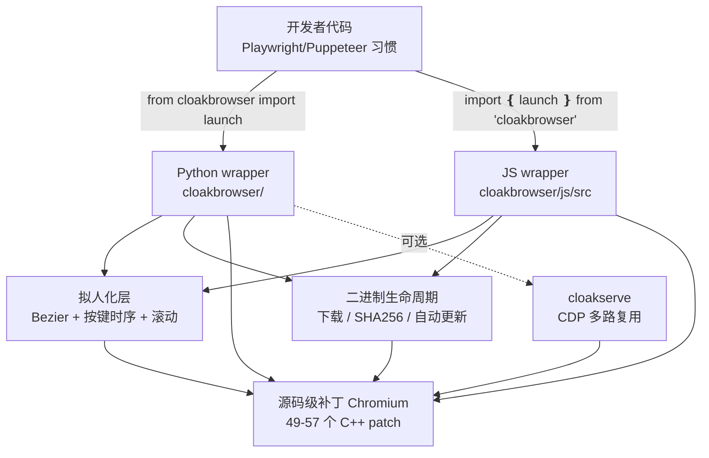

<details>
<summary>相关源文件</summary>

生成本页时使用的主要源文件:

- [README.md](../../../project-repos/cloakbrowser/README.md)
- [pyproject.toml](../../../project-repos/cloakbrowser/pyproject.toml)
- [CHANGELOG.md](../../../project-repos/cloakbrowser/CHANGELOG.md)
- [cloakbrowser/__init__.py](../../../project-repos/cloakbrowser/cloakbrowser/__init__.py)
- [cloakbrowser/config.py](../../../project-repos/cloakbrowser/cloakbrowser/config.py)
- [js/src/index.ts](../../../project-repos/cloakbrowser/js/src/index.ts)
- [bin/cloakserve](../../../project-repos/cloakbrowser/bin/cloakserve)
- [Dockerfile](../../../project-repos/cloakbrowser/Dockerfile)

</details>

# 项目概览

主流的反检测工具——`playwright-stealth`、`undetected-chromedriver`、`puppeteer-extra-plugin-stealth`——都在做同一件错事:**在 Chromium 启动之后,通过 JavaScript 注入或命令行 flag 来掩盖自动化痕迹**。这种"补丁打在表面"的方法面临两个无解的死循环:其一,每次 Chrome 大版本升级,补丁内部依赖的 API 形状就可能改变,导致 stealth 失效;其二,反爬团队反向工程这些开源补丁本身,把"是否带有 stealth 注入"也变成了一种检测特征。

CloakBrowser 选择从另一头切入:**在 Chromium 的 C++ 源码层面打补丁,然后编译出一份自己的二进制**。`navigator.webdriver`、canvas 指纹、WebGL renderer、音频 fingerprint、字体枚举、屏幕属性、WebRTC ICE candidate……这些在主流 stealth 里需要 JS hook 才能改写的字段,在 CloakBrowser 二进制里就是真实的 C++ 行为——反爬代码看到一个正常的 Chrome,因为它"就是"一个正常的 Chrome,只是 GPU 厂商串、canvas 噪声等数值被换掉了。

到 0.3.28 版本(2026-05-11),Linux x64 的二进制累计了 **57 个 C++ 补丁**,Windows x64 也升级到了相同水平。Python wrapper 是 `pip install cloakbrowser`,JavaScript wrapper 是 `npm install cloakbrowser`,两边的 launch API 在写法上完全是 Playwright/Puppeteer 的复制品——换 import 就能跑。

## 它解决了什么真实痛点

|场景| 主流 stealth 工具 | CloakBrowser |
|---|---|---|
|**reCAPTCHA v3 评分**| 0.1-0.7,经常被判机器人 | **0.9**,服务端验证为人类 |
|**Cloudflare Turnstile**| 时通时不通 | **稳定通过** non-interactive + managed |
|**Chrome 大版本升级**| 注入脚本经常失效 | 重新 rebase 补丁到新版本即可 |
|**`navigator.webdriver`**| `true`(或被脚本改成 `false`,但仍可探测) | **`false`**(C++ 源头改) |
|**TLS/JA3 指纹**| 与 Chrome 不匹配 | **与真实 Chrome 完全一致** |

最关键的是,它不是 CAPTCHA 求解服务——目标是**让 CAPTCHA 根本不出现**。代码里看不到任何"反向解 hCaptcha"逻辑,代理也是"自带"(BYO proxy);用户的工作就是写常规的 Playwright 脚本,然后享受不被拦截的体验。

## 核心创新:四层堆叠

**第一层:源码级 Chromium 补丁(二进制内)**。
49 → 57 个 C++ 补丁覆盖 canvas、WebGL、audio、font、GPU、screen、WebRTC、网络计时、CDP input 行为模拟等等。补丁清单与 Chromium 版本严格绑定——0.3.26 把 Windows 升到 146.0.7680.177.4 时,所有补丁都要从 145.0.7632.x 重 rebase。详见 [`CHANGELOG.md`](../../../project-repos/cloakbrowser/CHANGELOG.md) 中标记 `[binary]` 的条目。

**第二层:wrapper 层的反检测协调**。
Python 主 wrapper [`cloakbrowser/browser.py`](../../../project-repos/cloakbrowser/cloakbrowser/browser.py) 与 JS 等价物 [`js/src/playwright.ts`](../../../project-repos/cloakbrowser/js/src/playwright.ts) 做的事远不止"加几个 flag":它把 timezone/locale 通过 `--fingerprint-timezone`/`--lang` 这两个 binary flag 而非 Playwright 的 CDP emulation 来设;它在 SOCKS5 代理与 HTTP 代理之间分流——HTTP 走 Playwright dict,SOCKS5 必须绕过 Playwright 直接用 `--proxy-server` arg;它通过 `ignore_default_args=["--enable-automation", "--enable-unsafe-swiftshader"]` 主动屏蔽 Playwright 的两个自动化泄漏点。

**第三层:拟人化行为 (`humanize=True`)**。
[`cloakbrowser/human/`](../../../project-repos/cloakbrowser/cloakbrowser/human/) 提供一组"打补丁"函数,把 `page.click`、`page.type`、`page.mouse.move`、`page.locator(...).fill` 等等替换成 Bezier 曲线鼠标、按键级别时序、加速→巡航→减速三段式滚动。两个预设——`default`(普通速度)与 `careful`(更慢、更谨慎),也可以通过 `human_config={...}` 逐参数覆盖。在 deviceandbrowserinfo.com 的 24/24 行为信号测试中通过率从 0 提升到全 pass。

**第四层:`cloakserve` CDP 多路复用器**。
[`bin/cloakserve`](../../../project-repos/cloakbrowser/bin/cloakserve) 在一个端口上代理多份 Chrome,每个 fingerprint seed 各起一个 Chrome 进程,通过 URL `?fingerprint=12345&timezone=...` 选定;客户端用 `playwright.chromium.connect_over_cdp(...)` 接入。这是为多账号、多 profile 场景设计的——一个进程负担不起几十个浏览器,但一个 CDP 端口可以代理几十份。



上图勾画了项目的总体结构:开发者既可以直接以 wrapper 接入(走左侧主路径),也可以通过 `cloakserve` 接入一个多路复用的 CDP 端点(右侧);所有调用最终都落到那份打了补丁的 Chromium 二进制上。拟人化层是 wrapper 内可选的"行为补丁"。

## 能力全景

**跨语言对偶**:Python 与 JS 两边的 API 一一对应——`launch` / `launchContext` / `launchPersistentContext`,各自有同名异步版。`launch_async` 是 Python 端的异步;JS 端所有函数本身就是 async。Puppeteer 入口在 `cloakbrowser/puppeteer`,共享同一个二进制。

**自动二进制管理**:`pip install` 不携带 200MB 的 Chromium,而是首次 `launch()` 时按平台从 `https://cloakbrowser.dev/chromium-v<version>/` 下载,失败回退到 GitHub Releases;下载后用 `SHA256SUMS` 校验。环境变量 `CLOAKBROWSER_BINARY_PATH` 可指向本地编译的二进制,跳过这一切。

**代理 + GeoIP 联动**:把 `proxy="http://..."` 和 `geoip=True` 组合一起后,wrapper 通过代理 IP 自动解析时区与地区,通过 `--fingerprint-webrtc-ip=<exit_ip>` 把 WebRTC ICE candidate 改写为代理出口 IP——这是"代理 IP 与 WebRTC 报告 IP 不匹配"这一典型代理检测向量的根治方案。

**集成生态**:`examples/integrations/` 下提供了 browser-use、Crawl4AI、Crawlee、Scrapling、Stagehand、Selenium、undetected-chromedriver、AWS Lambda、LangChain Loader 等的接入样例;`Dockerfile` 出厂自带 Python+JS 双 wrapper、Xvfb headed 支持、`cloaktest`/`cloakserve` 命令。

**自动更新与签名**:`download.py:_maybe_trigger_update_check()` 在后台轮询 GitHub Releases,发现新的 `chromium-v<version>` tag 就预下载;PyPI/npm 包通过 OIDC trusted publishing 发布(无明文 token);Docker 镜像由 cosign 无密钥签名 + actions/attest-build-provenance 出具 SLSA Level 3 证明。

## 在同类方案中的定位

CloakBrowser 不是孤立的工程项目,可以在反检测浏览器赛道上和几个方案对位看:

|工具|引擎|补丁层级|API|Playwright 兼容|维护活跃度|
|---|---|---|---|---|---|
|Playwright(原生)| Chromium | 无 | 原生 | ✅ | ✅|
|`playwright-stealth`| Chromium | JS 注入 | 原生 | ✅ | 停滞|
|`undetected-chromedriver`| Chrome | flag 调整 | Selenium | ❌ | 停滞|
|Camoufox | Firefox | C++ 源码 | 自定义 | ❌ | 不稳定|
|**CloakBrowser**| **Chromium** | **C++ 源码** | **原生** | ✅ | **活跃**|

它的不可替代性在于一个**取交集**的窗口:既要 Chromium 引擎(份额最大),又要源码级补丁(可持续),又要原生 Playwright API(零迁移成本),又要活跃维护(几周一次发布)——这四点同时满足的,目前只有它。

## 技术栈速览

- **Python wrapper**:依赖 `playwright>=1.40`、`httpx>=0.24`,Python 3.9-3.13;`hatchling` 构建。可选附加件:`[geoip]`、`[patchright]`、`[serve]`、`[dev]`
- **JS wrapper**:TypeScript 编写,peer 依赖 `playwright-core>=1.53.0` 或 `puppeteer-core`;npm 通过 OIDC + provenance 发布
- **Chromium 二进制**:由 CloakHQ 自维护补丁集编译,平台覆盖 `linux-x64`、`linux-arm64`、`darwin-arm64`、`darwin-x64`、`windows-x64`;当前 Chromium 基线为 146.0.7680.177.x(macOS 滞后在 145.0.7632.109.2)
- **Docker 镜像**:`cloakhq/cloakbrowser`,基于 `python:3.12-slim`,自带 Xvfb、emoji 字体、`cloakserve`/`cloaktest` 命令,buildx 多架构(amd64+arm64),cosign 签名
- **测试**:Python `pytest` + `pytest-asyncio`,JS `vitest`;CI 在每次 push 跑非 `slow` 标签子集

```text
cloakbrowser/
├── cloakbrowser/                       # Python wrapper
│   ├── __init__.py                     # 公开 API: launch / ensure_binary / 等
│   ├── browser.py                      # 核心 launch 实现 (四象限对偶)
│   ├── config.py                       # 平台检测 / stealth args / 下载 URL
│   ├── download.py                     # 二进制生命周期 (下载 + 校验 + 自动更新)
│   ├── geoip.py                        # 代理 IP → 时区/语言/exit IP 解析
│   ├── __main__.py                     # `python -m cloakbrowser` CLI
│   └── human/                          # 拟人化行为层
│       ├── __init__.py                 # patch_browser / patch_context / patch_page
│       ├── config.py                   # HumanConfig + default/careful 预设
│       ├── mouse.py / mouse_async.py   # Bezier 鼠标
│       ├── keyboard.py / keyboard_async.py  # 按键级时序 + CDP 反检测
│       └── scroll.py / scroll_async.py # 加速 → 巡航 → 减速
├── js/                                 # JavaScript/TypeScript wrapper
│   └── src/
│       ├── index.ts                    # 公开导出
│       ├── playwright.ts               # launch / launchContext / 持久化 context
│       ├── puppeteer.ts                # Puppeteer 入口 (共享 binary)
│       ├── config.ts / args.ts         # 与 Python 端镜像
│       ├── download.ts                 # 二进制下载
│       ├── geoip.ts / proxy.ts         # 代理与 GeoIP
│       ├── human/                      # Playwright 拟人化
│       └── human-puppeteer/            # Puppeteer 拟人化
├── bin/
│   ├── cloakserve                      # CDP 多路复用器 (Python aiohttp)
│   ├── cloaktest                       # 一键反检测体检
│   └── docker-entrypoint.sh            # Xvfb 启动入口
├── examples/                           # 集成示例
│   ├── basic.py / persistent_context.py / stealth_test.py / 等
│   └── integrations/                   # 与 browser-use/Crawl4AI/Lambda 等的集成
├── tests/                              # pytest 套件
├── js/tests/                           # vitest 套件
├── Dockerfile                          # python:3.12-slim + Xvfb + 双 wrapper
├── flake.nix                           # Nix flake 入口
└── .github/workflows/                  # CI / Publish / Attest-release
```

## 阅读路线

不同读者目标对应不同的入口:

- **快速上手 + API 速查** → 先看 [启动 API 四象限对偶](launch-api.md),知道 `launch` 系列四个函数怎么挑就够开始干活
- **想理解为何 C++ 补丁能做到主流 stealth 做不到的事** → [隐身引擎与指纹系统](stealth-engine.md)
- **关心代理 + 反检测组合(SOCKS5、WebRTC、GeoIP 联动)** → [代理、GeoIP 与 WebRTC 一致性](proxy-and-geoip.md)
- **想做多账号矩阵 / 服务化** → [cloakserve CDP 多路复用器](cloakserve-cdp-multiplexer.md) + [部署与生态集成](deployment-and-integrations.md)
- **关心源码组织、跨语言对偶** → [系统架构](system-architecture.md) + [Python 与 JS 双 SDK 对偶](python-vs-js-sdk.md)
- **想给项目贡献代码** → [测试、CI 与发布管线](testing-ci-release.md) + [二进制生命周期](binary-management.md)

## 源信息

- 仓库:[https://github.com/CloakHQ/cloakbrowser](https://github.com/CloakHQ/cloakbrowser)
- 分析时的 commit hash:`6f4f92e7c762507056ed053078fb7e4854448c4b`
- 分支:`main`
- 最新发布:0.3.28(2026-05-11),Chromium 基线 146.0.7680.177.x

## 相关页面

- [系统架构](system-architecture.md) — wrapper / binary / cloakserve 三层模型与调用链
- [隐身引擎与指纹系统](stealth-engine.md) — C++ 补丁与 fingerprint flag 体系
- [启动 API:四象限对偶](launch-api.md) — `launch` 四象限语义与扩展点
