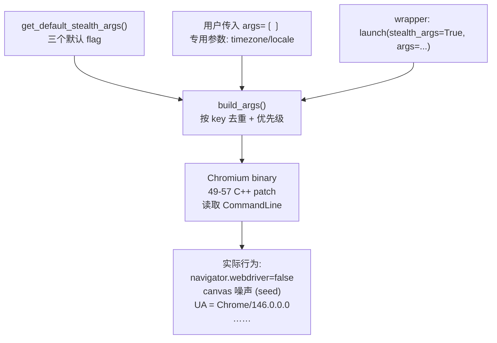
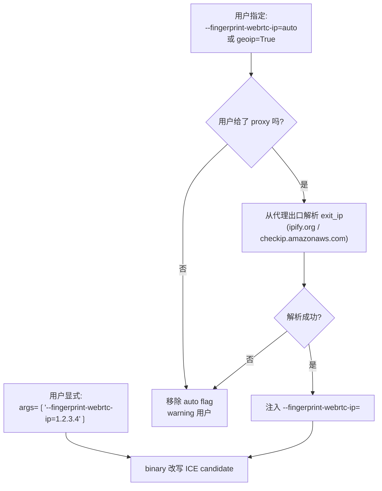

<details>
<summary>相关源文件</summary>

生成本页时使用的主要源文件:

- [cloakbrowser/config.py](../../../project-repos/cloakbrowser/cloakbrowser/config.py)
- [cloakbrowser/browser.py](../../../project-repos/cloakbrowser/cloakbrowser/browser.py)
- [js/src/config.ts](../../../project-repos/cloakbrowser/js/src/config.ts)
- [js/src/args.ts](../../../project-repos/cloakbrowser/js/src/args.ts)
- [README.md](../../../project-repos/cloakbrowser/README.md)
- [CHANGELOG.md](../../../project-repos/cloakbrowser/CHANGELOG.md)

</details>

# 隐身引擎与指纹系统

主流反检测工具的核心问题是把 stealth 当成了一组"补丁脚本"。CloakBrowser 把它当成了一组**编译期决策**。最直接的证据是 [`config.py:get_default_stealth_args()`](../../../project-repos/cloakbrowser/cloakbrowser/config.py#L40-L61) 的体积:**一共只有 22 行,默认 args 列表里只有 3 个 flag**——`--no-sandbox`、`--fingerprint=<随机种子>`、`--fingerprint-platform=<macos|windows>`。

这是反直觉的:其他 stealth 工具会塞几十个 flag、注入上千行 JS。CloakBrowser 默认就这三个。**为什么够?** 因为 `navigator.webdriver`、canvas 噪声、WebGL renderer 串、屏幕属性、硬件并发数、设备内存、UA、字体枚举、GPU vendor……这些字段都在 Chromium 源码里被改写了。wrapper 只负责告诉 binary"该用哪个 seed、伪装成哪个平台",剩下的由编译进去的 49→57 个 C++ patch 在运行时完成。

## 三种参与方:不能弄混的责任

理解这层架构的关键,是分清三种参与方:**Chromium 上游代码**、**CloakBrowser 的 C++ patch**、**wrapper 的命令行 flag**。

|参与方|角色|示例|
|---|---|---|
|**Chromium 上游**| 浏览器主体行为 | navigator.webdriver 的赋值逻辑、Canvas 2D 渲染 |
|**CloakBrowser C++ patch**| 拦截、改写、随机化上游行为 | 强制 `navigator.webdriver=false`、给 canvas 加确定性噪声 |
|**wrapper flag**| 给 patch 传参数 | `--fingerprint=12345` 决定噪声的种子 |

补丁是编译进 binary 的逻辑,flag 是运行期给逻辑传参。这意味着**没有 flag 的纯 binary 已经是 stealth 的**——0.3.4 起,binary 在启动时如果没收到 `--fingerprint`,会自己生成一个随机 seed。wrapper 只是把这个机制做得更显式、可重复。

Sources: [CHANGELOG.md:195-201](../../../project-repos/cloakbrowser/CHANGELOG.md#L195-L201)

<details class="source-snippets">
<summary>引用源码</summary>

<!-- source-snippets:start -->

#### `CHANGELOG.md:195-201`

```markdown
Binary v14: auto-spoof restored with seed, wrapper simplified to match.

- **[binary]** Restore full auto-spoof when `--fingerprint=seed` is set — all randomized properties now derive from the seed consistently
- **[binary]** Auto-inject random fingerprint seed at startup if none provided. Binary is stealthy with zero flags
- **[binary]** 26 source-level C++ patches (up from 25)
- **[wrapper]** Simplify default stealth args — remove flags the binary now auto-generates. Wrapper still sets platform profile on Linux and `--no-sandbox`
- **[wrapper]** Fix timezone in `launch_context()` — use Playwright's per-context timezone instead of binary flag, fixing mismatch when creating new browser contexts with geoip
```

<!-- source-snippets:end -->
</details>



下文按"默认 args"、"build_args 合并逻辑"、"完整 fingerprint flag 体系"三个角度展开。

## 默认 stealth args:一个种子定终身

`get_default_stealth_args()` 的实现非常克制:

```python
def get_default_stealth_args() -> list[str]:
    seed = random.randint(10000, 99999)
    system = platform.system()

    base = [
        "--no-sandbox",
        f"--fingerprint={seed}",
    ]

    if system == "Darwin":
        return base + ["--fingerprint-platform=macos"]
    return base + ["--fingerprint-platform=windows"]
```

Sources: [cloakbrowser/config.py:40-61](../../../project-repos/cloakbrowser/cloakbrowser/config.py#L40-L61)

<details class="source-snippets">
<summary>引用源码</summary>

<!-- source-snippets:start -->

#### `cloakbrowser/config.py:40-61`

```python
def get_default_stealth_args() -> list[str]:
    """Build stealth args with a random fingerprint seed per launch.

    On macOS, skips platform/GPU spoofing — runs as a native Mac browser.
    Spoofing Windows on Mac creates detectable mismatches (fonts, GPU, etc.).
    """
    seed = random.randint(10000, 99999)
    system = platform.system()

    base = [
        "--no-sandbox",
        f"--fingerprint={seed}",
    ]

    if system == "Darwin":
        # Tell the fingerprint patches we're on macOS so GPU/UA match natively
        return base + ["--fingerprint-platform=macos"]

    # Linux/Windows: Windows fingerprint profile
    # Hardware concurrency, device memory, screen, window size, and GPU are
    # auto-generated by the binary from the seed (v14+).
    return base + ["--fingerprint-platform=windows"]
```

<!-- source-snippets:end -->
</details>

三件事:**随机化、平台决策、容器兼容**。

**随机化**:每次 `launch()` 都生成一个新的 5 位 seed。同一个 seed 决定了 canvas 噪声、WebGL 厂商、硬件并发、设备内存、屏幕尺寸、GPU 型号——这些值在 binary v14 起完全由 seed 派生。这意味着两个 launch 一定看上去像两台不同的电脑;同样,固定 seed(`args=["--fingerprint=12345"]`)就能让两次会话像同一台电脑——这对 reCAPTCHA v3 这类基于"返回访客"判断的评分系统是关键能力。

**平台决策**:macOS 下不伪装平台,因为 Mac binary 本身就报告 macOS,加上原生 Apple GPU——伪装成 Windows 反而暴露 GPU 与 OS 不匹配。Linux 与 Windows 一律伪装成 Windows desktop,因为这是最常见的客户端环境,匿名度最高。

**`--no-sandbox`**:Docker、CI、Lambda 等环境里 Chromium 默认无法启动(没有合适的 user namespace),`--no-sandbox` 是这些场景的必需品。它确实降低浏览器进程隔离强度,但对 stealth 没有副作用。

### JS 端镜像实现

JS 端的 `getDefaultStealthArgs()` 在 [`js/src/config.ts`](../../../project-repos/cloakbrowser/js/src/config.ts#L208-L226) 与 Python 完全等价。两者通过 CHANGELOG 中明确的"双 SDK 同步"原则维持一致——一次改动,两边都要改。

Sources: [js/src/config.ts:208-226](../../../project-repos/cloakbrowser/js/src/config.ts#L208-L226)

<details class="source-snippets">
<summary>引用源码</summary>

<!-- source-snippets:start -->

#### `js/src/config.ts:208-226`

```typescript
export function getDefaultStealthArgs(): string[] {
  const seed = Math.floor(Math.random() * 90000) + 10000; // 10000-99999
  const isMac = process.platform === "darwin";

  const base = [
    "--no-sandbox",
    `--fingerprint=${seed}`,
  ];

  if (isMac) {
    // macOS: run as native Mac browser — GPU/UA match natively
    return [...base, "--fingerprint-platform=macos"];
  }

  // Linux/Windows: spoof as Windows desktop
  // Hardware concurrency, device memory, screen, window size, and GPU are
  // auto-generated by the binary from the seed (v14+).
  return [...base, "--fingerprint-platform=windows"];
}
```

<!-- source-snippets:end -->
</details>

## build_args:三层优先级与去重

`build_args()` 是 stealth 引擎中最容易被低估的函数。它处理"用户传入 args 与 stealth 默认 args 重叠时怎么办"这一棘手问题。

### 优先级:stealth 默认 < 用户 args < 专用参数

```python
def build_args(stealth_args, extra_args, timezone, locale, headless) -> list[str]:
    seen: dict[str, str] = {}

    if stealth_args:
        for arg in get_default_stealth_args():
            seen[arg.split("=", 1)[0]] = arg

    if not headless or platform.system() == "Windows":
        seen["--ignore-gpu-blocklist"] = "--ignore-gpu-blocklist"

    if extra_args:
        for arg in extra_args:
            key = arg.split("=", 1)[0]
            seen[key] = arg

    if timezone:
        seen["--fingerprint-timezone"] = f"--fingerprint-timezone={timezone}"
    if locale:
        for key in ("--lang", "--fingerprint-locale"):
            seen[key] = f"{key}={locale}"

    return list(seen.values())
```

Sources: [cloakbrowser/browser.py:954-1003](../../../project-repos/cloakbrowser/cloakbrowser/browser.py#L954-L1003)

<details class="source-snippets">
<summary>引用源码</summary>

<!-- source-snippets:start -->

#### `cloakbrowser/browser.py:954-1003`

```python
def build_args(
    stealth_args: bool,
    extra_args: list[str] | None,
    timezone: str | None = None,
    locale: str | None = None,
    headless: bool = True,
) -> list[str]:
    """Combine stealth args with user-provided args and locale flags.

    Deduplicates by flag key (everything before '=').
    Priority: stealth defaults < user args < dedicated params (timezone/locale).
    """
    seen: dict[str, str] = {}

    if stealth_args:
        for arg in get_default_stealth_args():
            seen[arg.split("=", 1)[0]] = arg

    # GPU blocklist bypass:
    # - Headed mode (all platforms): Chromium blocks WebGL on software GPUs
    #   in Docker/Xvfb. Flag lets SwiftShader serve WebGL. See issue #56.
    # - Windows (all modes): Chromium's GPU blocklist blocks WebGPU for the
    #   Microsoft Basic Render Driver. Dawn's adapter_blocklist bypass alone
    #   isn't enough — need this flag too. Linux doesn't need it.
    import platform as _platform
    if not headless or _platform.system() == "Windows":
        seen["--ignore-gpu-blocklist"] = "--ignore-gpu-blocklist"

    if extra_args:
        for arg in extra_args:
            key = arg.split("=", 1)[0]
            if key in seen:
                logger.debug("Arg override: %s -> %s", seen[key], arg)
            seen[key] = arg

    # Timezone/locale flags are independent of stealth_args — always inject when set
    if timezone:
        key = "--fingerprint-timezone"
        flag = f"{key}={timezone}"
        if key in seen:
            logger.debug("Arg override: %s -> %s", seen[key], flag)
        seen[key] = flag
    if locale:
        for key in ("--lang", "--fingerprint-locale"):
            flag = f"{key}={locale}"
            if key in seen:
                logger.debug("Arg override: %s -> %s", seen[key], flag)
            seen[key] = flag

    return list(seen.values())
```

<!-- source-snippets:end -->
</details>

合约非常清晰:

|来源|何时填入|是否会被后续覆盖|
|---|---|---|
|stealth 默认|`stealth_args=True`(默认)|是,被用户 args 与专用参数覆盖|
|`--ignore-gpu-blocklist`|headed 或 Windows 自动注入|是|
|用户 `extra_args`|无条件填入|是,被专用参数覆盖|
|`timezone` 参数|`timezone is not None` 时|否,最高优先级|
|`locale` 参数|`locale is not None` 时,同时设两个 key|否|

### 为什么 locale 要设两个 flag

注意 `locale` 一次性设 `--lang=...` **和** `--fingerprint-locale=...` 两个 flag。这背后是一个隐含的反检测规则:

- `--lang` 是 Chromium 上游的 flag,影响 `navigator.language` 与 HTTP `Accept-Language` 头
- `--fingerprint-locale` 是 CloakBrowser patch 的 flag,影响进一步的 locale 相关字段(Intl API、ICU 行为等)

两个 flag 同时设,才能让"我说自己是 en-US"在多个 vector 上一致。任何一边漏设,fingerprinter 都会看到不一致——例如 `navigator.language === "en-US"` 但 ICU date format 仍是 zh-CN,就会被立即识别为脚本伪造。

Sources: [README.md:626-627](../../../project-repos/cloakbrowser/README.md#L626-L627)

<details class="source-snippets">
<summary>引用源码</summary>

<!-- source-snippets:start -->

#### `README.md:626-627`

```markdown
| `--fingerprint-timezone` | Timezone (e.g. `America/New_York`) |
| `--fingerprint-locale` | Locale (e.g. `en-US`) |
```

<!-- source-snippets:end -->
</details>

### `--ignore-gpu-blocklist` 的两个触发条件

这个 flag 在两个非显然场景下被自动注入:

1. **headed 模式**:headed Docker/Xvfb 里 Chromium 视环境为软件 GPU,会按 blocklist 阻断 WebGL。强行 ignore blocklist 让 SwiftShader 接管,WebGL 才能工作
2. **Windows 任何模式**:Microsoft Basic Render Driver 在 Windows GPU blocklist 中被列为禁止 WebGPU,即使有 Dawn 的 adapter blocklist bypass 也不够,需要这个上游 flag 兜底

Linux headless 不需要——那里没有真正的 GPU,但也不走 blocklist 路径,binary 内部的 SwiftShader 路径直接工作。

Sources: [cloakbrowser/browser.py:973-980](../../../project-repos/cloakbrowser/cloakbrowser/browser.py#L973-L980)

<details class="source-snippets">
<summary>引用源码</summary>

<!-- source-snippets:start -->

#### `cloakbrowser/browser.py:973-980`

```python
    # - Headed mode (all platforms): Chromium blocks WebGL on software GPUs
    #   in Docker/Xvfb. Flag lets SwiftShader serve WebGL. See issue #56.
    # - Windows (all modes): Chromium's GPU blocklist blocks WebGPU for the
    #   Microsoft Basic Render Driver. Dawn's adapter_blocklist bypass alone
    #   isn't enough — need this flag too. Linux doesn't need it.
    import platform as _platform
    if not headless or _platform.system() == "Windows":
        seen["--ignore-gpu-blocklist"] = "--ignore-gpu-blocklist"
```

<!-- source-snippets:end -->
</details>

## ignore_default_args:屏蔽 Playwright 自带的泄漏点

光靠 `build_args` 构建好 stealth args 不够,因为 Playwright 在 `chromium.launch` 时还会自己添加一组默认 args,其中两个对 stealth 有破坏性:

```python
IGNORE_DEFAULT_ARGS = ["--enable-automation", "--enable-unsafe-swiftshader"]
```

Sources: [cloakbrowser/config.py:28-34](../../../project-repos/cloakbrowser/cloakbrowser/config.py#L28-L34)

<details class="source-snippets">
<summary>引用源码</summary>

<!-- source-snippets:start -->

#### `cloakbrowser/config.py:28-34`

```python
# ---------------------------------------------------------------------------
# Playwright default args to suppress — these leak automation signals.
# --enable-automation: exposes navigator.webdriver = true
# --enable-unsafe-swiftshader: forces software WebGL rendering via SwiftShader,
#   producing a distinctive renderer string that no real user browser has
# ---------------------------------------------------------------------------
IGNORE_DEFAULT_ARGS = ["--enable-automation", "--enable-unsafe-swiftshader"]
```

<!-- source-snippets:end -->
</details>

- `--enable-automation`:Playwright 默认开启,这个 flag 直接让 `navigator.webdriver = true`——这是反爬检测最简单的探针。屏蔽掉后,binary 内部的 patch 把 `navigator.webdriver` 强制设为 `false`
- `--enable-unsafe-swiftshader`:Playwright 在 Linux/Docker 默认开启,会让 Chromium 用 SwiftShader 软件渲染 WebGL,产生一个独特的 renderer 字符串"Google Inc. (Google) (SwiftShader)",反爬一眼识破。屏蔽后,binary 用自己的 GPU 伪造逻辑生成符合 seed 的 vendor/renderer 字符串

注意是 `ignore_default_args=` 而不是 `--disable-blink-features=AutomationControlled` 之类的 hack:**告诉 Playwright "你别加这两个",而不是先让它加再用 patch 抵消**。前者干净,后者有时序漏洞。

## 完整的 fingerprint flag 体系

虽然默认 args 只有三个,binary 实际支持大约二十多个 `--fingerprint-*` flag。这些**默认不设**,但用户可以通过 `args=[...]` 传入做精细控制。下表是 README 中列出的主要项与它们的作用面:

| Flag | 控制的字段 | 默认行为 |
|---|---|---|
| `--fingerprint=<seed>` | 主种子,影响所有派生字段 | 启动时随机 5 位 |
| `--fingerprint-platform=<macos\|windows\|linux>` | `navigator.platform`、UA OS、GPU 池 | wrapper 按 OS 决定 |
| `--fingerprint-gpu-vendor` | WebGL `UNMASKED_VENDOR_WEBGL` | 从 seed + platform 派生 |
| `--fingerprint-gpu-renderer` | WebGL `UNMASKED_RENDERER_WEBGL` | 从 seed + platform 派生 |
| `--fingerprint-hardware-concurrency` | `navigator.hardwareConcurrency` | 默认 8 |
| `--fingerprint-device-memory` | `navigator.deviceMemory`(GB) | 默认 8 |
| `--fingerprint-screen-width` | 屏幕宽 | Win/Linux 1920,macOS 1440 |
| `--fingerprint-screen-height` | 屏幕高 | Win/Linux 1080,macOS 900 |
| `--fingerprint-brand` | 浏览器品牌 | Chrome,可设 Edge/Opera/Vivaldi |
| `--fingerprint-brand-version` | UA + Client Hints 版本 | binary 内置 |
| `--fingerprint-timezone` | 时区(IANA) | wrapper 通过 `timezone=` 参数设 |
| `--fingerprint-locale` | locale | wrapper 通过 `locale=` 参数设 |
| `--fingerprint-storage-quota` | `storage.estimate()` 配额(MB) | 自动归一化,约 500MB |
| `--fingerprint-webrtc-ip` | WebRTC ICE candidate IP | 关闭,可设 `auto` 或具体 IP |
| `--fingerprint-noise=false` | 关闭 noise 注入,保留种子 | 默认开启 |
| `--enable-blink-features=FakeShadowRoot` | 允许访问 closed shadow DOM | 关闭 |

Sources: [README.md:611-635](../../../project-repos/cloakbrowser/README.md#L611-L635)

<details class="source-snippets">
<summary>引用源码</summary>

<!-- source-snippets:start -->

#### `README.md:611-635`

```markdown

Supported by the binary but **not set by default** — pass via `args` to customize:

| Flag | Controls |
|------|----------|
| `--fingerprint-gpu-vendor` | WebGL `UNMASKED_VENDOR_WEBGL` (auto-generated from seed + platform) |
| `--fingerprint-gpu-renderer` | WebGL `UNMASKED_RENDERER_WEBGL` (auto-generated from seed + platform) |
| `--fingerprint-hardware-concurrency` | `navigator.hardwareConcurrency` (auto-generated: `8`) |
| `--fingerprint-device-memory` | `navigator.deviceMemory` in GB (auto-generated: `8`) |
| `--fingerprint-screen-width` | Screen width (auto-generated: `1920` Win/Linux, `1440` macOS) |
| `--fingerprint-screen-height` | Screen height (auto-generated: `1080` Win/Linux, `900` macOS) |
| `--fingerprint-brand` | Browser brand: `Chrome`, `Edge`, `Opera`, `Vivaldi` |
| `--fingerprint-brand-version` | Brand version (UA + Client Hints) |
| `--fingerprint-platform-version` | Client Hints platform version |
| `--fingerprint-location` | Geolocation coordinates |
| `--fingerprint-timezone` | Timezone (e.g. `America/New_York`) |
| `--fingerprint-locale` | Locale (e.g. `en-US`) |
| `--fingerprint-storage-quota` | Override storage quota in MB — affects `storage.estimate()`, `storageBuckets`, and legacy webkit APIs. Auto-normalized when `--fingerprint` is set |
| `--fingerprint-taskbar-height` | Override taskbar height (binary defaults: Win=48, Mac=95, Linux=0) |
| `--fingerprint-fonts-dir` | Path to directory containing target-platform fonts (see [Font Setup on Linux](#font-setup-on-linux)) |
| `--fingerprint-webrtc-ip` | WebRTC ICE candidate IP replacement. Use `auto` to resolve from proxy exit IP (makes an HTTP call through the proxy), or pass an explicit IP. Auto-injected when `geoip=True` |
| `--fingerprint-noise=false` | Disable noise injection (canvas, WebGL, audio, client rects) while keeping the deterministic fingerprint seed active |
| `--enable-blink-features=FakeShadowRoot` | Access closed shadow DOM elements |

> **Note:** All stealth tests were verified with the default fingerprint config above. Changing these flags may affect detection results — test your configuration before using in production.
```

<!-- source-snippets:end -->
</details>

### 一个微妙的取舍:storage quota

`--fingerprint-storage-quota` 体现了反检测的本质矛盾。默认情况下,binary 把 storage quota 归一化到一个低值(~500MB)——这是为了让 **FingerprintJS 通过**。FingerprintJS 会拒绝那些 quota 看起来像非匿名模式的 profile。

但反过来,**BrowserScan 的 `notPrivate` 检查**会因 quota 低而判定为匿名模式,扣 10 分。两个 fingerprinter 对同一个值有相反的期望。

CloakBrowser 选择默认偏向 FingerprintJS(更常见),但暴露 `--fingerprint-storage-quota=5000` 让用户在面对 BrowserScan 时主动覆盖。这种"显式取舍而非偷偷搞定"是这个项目典型的工程哲学。

Sources: [README.md:380-389](../../../project-repos/cloakbrowser/README.md#L380-L389)

<details class="source-snippets">
<summary>引用源码</summary>

<!-- source-snippets:start -->

#### `README.md:380-389`

````markdown
**Storage quota and detection tradeoff:** By default, the binary normalizes storage quota to pass FingerprintJS, which blocks persistent contexts that report non-incognito quota values. This means detection services that penalize incognito mode (like BrowserScan's `notPrivate` check, -10 points) will still flag it. If your target site penalizes incognito but doesn't use FingerprintJS, set a higher quota to appear as a regular profile:

```python
ctx = launch_persistent_context("./my-profile", args=["--fingerprint-storage-quota=5000"])
```

| Quota setting | FingerprintJS | BrowserScan `notPrivate` |
|---|---|---|
| Default (auto, ~500MB) | PASS | -10 (flagged as incognito) |
| `--fingerprint-storage-quota=5000` | May trigger detection | PASS (appears non-incognito) |
````

<!-- source-snippets:end -->
</details>

## WebRTC IP 一致性:一个有趣的双重路径

WebRTC ICE candidate 一旦泄漏真实 IP,代理的隐藏就形同虚设。CloakBrowser 提供了两条路径解决这个问题:



`_resolve_webrtc_args()` 处理 `auto` 关键字的解析时刻在 wrapper 层而非 Chrome 层——Chrome 不认识 `auto`,只能传具体 IP。`maybe_resolve_geoip()` 在做 GeoIP 查询时**免费**返回 exit IP(从 ipify 等服务回包里直接读出),`launch()` 把这个 IP 复用为 WebRTC IP——也就是说,`geoip=True` 一次 HTTP 调用同时解决了"时区、语言、WebRTC IP"三件事。

Sources: [cloakbrowser/browser.py:913-951](../../../project-repos/cloakbrowser/cloakbrowser/browser.py#L913-L951)

<details class="source-snippets">
<summary>引用源码</summary>

<!-- source-snippets:start -->

#### `cloakbrowser/browser.py:913-951`

```python
def _resolve_webrtc_args(
    args: list[str] | None,
    proxy: str | ProxySettings | None,
) -> list[str] | None:
    """Replace --fingerprint-webrtc-ip=auto with the resolved proxy exit IP.

    Returns args unchanged if no ``auto`` value is present.
    """
    if not args:
        return args
    idx = None
    for i, a in enumerate(args):
        if a == "--fingerprint-webrtc-ip=auto":
            idx = i
            break
    if idx is None:
        return args
    proxy_url = _extract_proxy_url(proxy)
    if not proxy_url:
        logger.warning("--fingerprint-webrtc-ip=auto requires a proxy; removing flag")
        args = list(args)
        del args[idx]
        return args
    try:
        from .geoip import resolve_proxy_exit_ip
        exit_ip = resolve_proxy_exit_ip(proxy_url)
    except Exception:
        logger.warning("Failed to resolve proxy exit IP for WebRTC spoofing; removing --fingerprint-webrtc-ip=auto")
        args = list(args)
        del args[idx]
        return args
    if exit_ip:
        args = list(args)
        args[idx] = f"--fingerprint-webrtc-ip={exit_ip}"
    else:
        logger.warning("Could not resolve proxy exit IP for WebRTC spoofing; removing --fingerprint-webrtc-ip=auto")
        args = list(args)
        del args[idx]
    return args
```

<!-- source-snippets:end -->
</details>

## 几个"读源码才能看到"的细节

**1. random seed 上下界是 10000-99999。** 不是 0-99999,因为前导零会让 fingerprint 在某些字符串比较场景里被截短或被识别为脚本生成。

**2. macOS 不需要 `--fingerprint-platform=mac` 之类的 flag。** binary 在 Mac 上编译时就知道自己是 Mac,GPU 池、UA 都是原生 Apple 的。给它加 `windows` 反而破坏一致性。

**3. `--enable-automation` 是 Playwright 显式加的,Puppeteer 没加。** 但 Puppeteer 有自己的泄漏点(`HeadlessChrome` UA 等),binary patch 一并处理。

**4. `--fingerprint-noise=false` 的存在很微妙。** 它保留 seed 派生的"静态"字段(GPU 串、硬件并发),但关掉每次 canvas/WebGL 调用时的随机噪声。某些反爬期望"同一会话内 canvas 输出确定",noise 反而会暴露。这个 flag 是给老练用户的。

Sources: [CHANGELOG.md:88-99](../../../project-repos/cloakbrowser/CHANGELOG.md#L88-L99)

<details class="source-snippets">
<summary>引用源码</summary>

<!-- source-snippets:start -->

#### `CHANGELOG.md:88-99`

```markdown

- **[binary]** Upgrade Linux x64 build to 145.0.7632.159.8 — 42 source-level C++ patches (up from 33)
- **[binary]** 9 new fingerprint patches covering additional browser APIs and cross-platform consistency
- **[binary]** New `--fingerprint-noise` flag — disable noise injection while keeping deterministic fingerprint seed active
- **[binary]** Improved fingerprint noise reliability and determinism across all patched APIs
- **[binary]** Expanded platform-aware fingerprint spoofing for more realistic cross-platform profiles
- **[binary]** Font rendering and detection accuracy improvements for Windows profiles
- **[binary]** Removed experimental patches that caused compatibility issues with certain anti-bot systems
- **[binary]** Docker/VNC environment compatibility improvements
- **[wrapper]** Fix Playwright cleanup — `pw.stop()` now runs even if `browser.close()` raises or is cancelled (fixes #60, thanks [@dgtlmoon](https://github.com/dgtlmoon))
- **[meta]** Pin GitHub Actions to commit SHAs, add Dependabot for automated dependency updates

```

<!-- source-snippets:end -->
</details>

## 相关页面

- [启动 API:四象限对偶](launch-api.md) — stealth args 如何在各个 launch 函数中流动
- [代理、GeoIP 与 WebRTC 一致性](proxy-and-geoip.md) — exit IP 复用与 WebRTC 改写的完整链路
- [系统架构](system-architecture.md) — wrapper 层与 binary 层的责任边界
