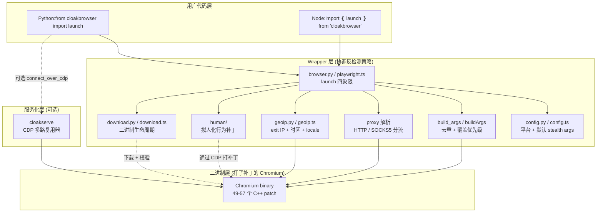
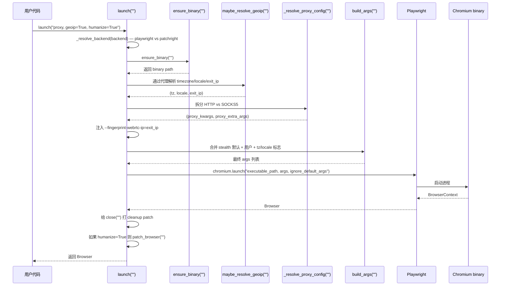
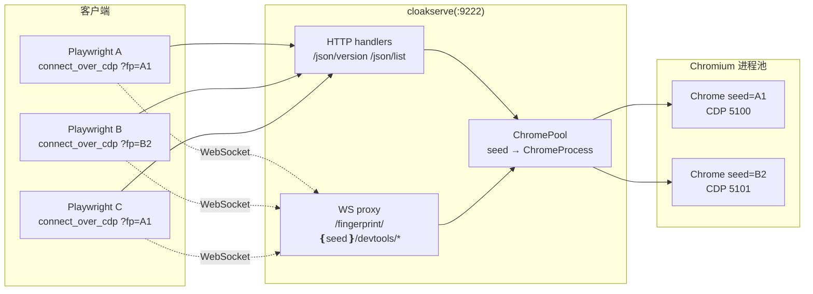

<details>
<summary>相关源文件</summary>

生成本页时使用的主要源文件:

- [cloakbrowser/__init__.py](../../../project-repos/cloakbrowser/cloakbrowser/__init__.py)
- [cloakbrowser/browser.py](../../../project-repos/cloakbrowser/cloakbrowser/browser.py)
- [cloakbrowser/config.py](../../../project-repos/cloakbrowser/cloakbrowser/config.py)
- [cloakbrowser/download.py](../../../project-repos/cloakbrowser/cloakbrowser/download.py)
- [js/src/index.ts](../../../project-repos/cloakbrowser/js/src/index.ts)
- [js/src/playwright.ts](../../../project-repos/cloakbrowser/js/src/playwright.ts)
- [bin/cloakserve](../../../project-repos/cloakbrowser/bin/cloakserve)

</details>

# 系统架构

CloakBrowser 的核心架构是一个**三明治**:上层是两份 wrapper(Python 与 JS),中间是一份打了源码补丁的 Chromium 二进制,下层是用于多路复用与服务化的 `cloakserve`。这一层结构看似简单,但每一层都承担一项不可分割的责任——把责任放错层,就会暴露反检测信号。

举一个具体的例子:Playwright 自身可以通过 `context.timezone_id` 给 BrowserContext 设时区,机制是 CDP `Emulation.setTimezoneOverride`——但 CDP emulation 本身可以被 fingerprinter 检测到。CloakBrowser 把这件事下沉到二进制,通过 `--fingerprint-timezone` flag(读 CommandLine,进程级生效);wrapper 层为此必须显式拦截用户的 `timezone` 参数,翻译成 binary flag,而不是透传给 Playwright。这种"上层不能信任下层默认行为"的关系,贯穿整个架构。

## 三层职责图



这张图揭示了关键的设计选择:**所有的反检测决策都在 wrapper 层做完,落到 binary 时只剩一条命令行**。下文逐层拆解每一层的责任边界。

## Wrapper 层:协调反检测策略

Python 的公共入口在 [`cloakbrowser/__init__.py`](../../../project-repos/cloakbrowser/cloakbrowser/__init__.py),它把 `launch`、`launch_async`、`launch_context`、`launch_context_async`、`launch_persistent_context`、`launch_persistent_context_async` 这 6 个对偶函数,加上 `ensure_binary`、`build_args`、`maybe_resolve_geoip`、`HumanConfig` 等工具,统一暴露给用户。`HumanConfig` 与 `resolve_human_config` 用了 `__getattr__` 惰性导入——只有用户真的访问到 `humanize` 相关 API 时,`human/` 子包才会被加载,避免给不需要拟人化的用户带来导入开销。

Sources: [cloakbrowser/__init__.py:14-50](../../../project-repos/cloakbrowser/cloakbrowser/__init__.py#L14-L50)

<details class="source-snippets">
<summary>引用源码</summary>

<!-- source-snippets:start -->

#### `cloakbrowser/__init__.py:14-50`

```python
from .browser import launch, launch_async, launch_context, launch_context_async, launch_persistent_context, launch_persistent_context_async, ProxySettings, build_args, maybe_resolve_geoip
from .config import CHROMIUM_VERSION, get_default_stealth_args
from .download import binary_info, check_for_update, clear_cache, ensure_binary
from ._version import __version__

# Human-like behavioral layer (optional)
def __getattr__(name):
    if name == "HumanConfig":
        from .human.config import HumanConfig
        globals()["HumanConfig"] = HumanConfig
        return HumanConfig
    if name == "resolve_human_config":
        from .human.config import resolve_config
        globals()["resolve_human_config"] = resolve_config
        return resolve_config
    raise AttributeError(f"module 'cloakbrowser' has no attribute {name}")

__all__ = [
    "launch",
    "launch_async",
    "launch_context",
    "launch_context_async",
    "launch_persistent_context",
    "launch_persistent_context_async",
    "ensure_binary",
    "clear_cache",
    "binary_info",
    "check_for_update",
    "CHROMIUM_VERSION",
    "get_default_stealth_args",
    "build_args",
    "maybe_resolve_geoip",
    "ProxySettings",
    "HumanConfig",
    "resolve_human_config",
    "__version__",
]
```

<!-- source-snippets:end -->
</details>

JS 端的入口 [`js/src/index.ts`](../../../project-repos/cloakbrowser/js/src/index.ts) 选择了不同策略——直接把 `launch`、`launchContext`、`launchPersistentContext` 从 `./playwright.js` re-export,Puppeteer 入口则通过 package.json 的 `exports` 字段映射到 `./dist/puppeteer.js`。Python 是单一公共模块,JS 是子路径导入(`cloakbrowser` vs `cloakbrowser/puppeteer`),两边的分发哲学不同但结果一致:用户用最熟悉的 import 就能获得对应后端的 stealth 替代。

Sources: [js/src/index.ts:18-29](../../../project-repos/cloakbrowser/js/src/index.ts#L18-L29)

<details class="source-snippets">
<summary>引用源码</summary>

<!-- source-snippets:start -->

#### `js/src/index.ts:18-29`

```typescript
// Launch functions (Playwright API)
export { launch, launchContext, launchPersistentContext } from "./playwright.js";

// Binary management
export { ensureBinary, clearCache, binaryInfo, checkForUpdate } from "./download.js";

// Config
export { CHROMIUM_VERSION, getDefaultStealthArgs } from "./config.js";

// Types
export type { LaunchOptions, LaunchContextOptions, LaunchPersistentContextOptions, BinaryInfo } from "./types.js";
```

<!-- source-snippets:end -->
</details>

### launch() 内部的执行序列

`launch()` 是理解整个 wrapper 的最佳切入点。看 Python 版的核心 25 行:

```python
sync_playwright = _import_sync_playwright(_resolve_backend(backend))
binary_path = ensure_binary()
timezone, locale, exit_ip = maybe_resolve_geoip(geoip, proxy, timezone, locale)
proxy_kwargs, proxy_extra_args = _resolve_proxy_config(proxy)
args = _resolve_webrtc_args(args, proxy)
if exit_ip and not (args and any(a.startswith("--fingerprint-webrtc-ip") for a in args)):
    args = list(args or [])
    args.append(f"--fingerprint-webrtc-ip={exit_ip}")
chrome_args = build_args(stealth_args, (args or []) + proxy_extra_args, timezone=timezone, locale=locale, headless=headless)

pw = sync_playwright().start()
browser = pw.chromium.launch(
    executable_path=binary_path,
    headless=headless,
    args=chrome_args,
    ignore_default_args=IGNORE_DEFAULT_ARGS,
    **proxy_kwargs,
    **kwargs,
)
```

Sources: [cloakbrowser/browser.py:106-127](../../../project-repos/cloakbrowser/cloakbrowser/browser.py#L106-L127)

<details class="source-snippets">
<summary>引用源码</summary>

<!-- source-snippets:start -->

#### `cloakbrowser/browser.py:106-127`

```python
    sync_playwright = _import_sync_playwright(_resolve_backend(backend))

    binary_path = ensure_binary()
    timezone, locale, exit_ip = maybe_resolve_geoip(geoip, proxy, timezone, locale)
    proxy_kwargs, proxy_extra_args = _resolve_proxy_config(proxy)
    args = _resolve_webrtc_args(args, proxy)
    if exit_ip and not (args and any(a.startswith("--fingerprint-webrtc-ip") for a in args)):
        args = list(args or [])
        args.append(f"--fingerprint-webrtc-ip={exit_ip}")
    chrome_args = build_args(stealth_args, (args or []) + proxy_extra_args, timezone=timezone, locale=locale, headless=headless)

    logger.debug("Launching stealth Chromium (headless=%s, args=%d)", headless, len(chrome_args))

    pw = sync_playwright().start()
    browser = pw.chromium.launch(
        executable_path=binary_path,
        headless=headless,
        args=chrome_args,
        ignore_default_args=IGNORE_DEFAULT_ARGS,
        **proxy_kwargs,
        **kwargs,
    )
```

<!-- source-snippets:end -->
</details>



序列里有两个不显眼但关键的步骤。第一个是给 `browser.close` 包了一层 cleanup:`pw.stop()` 必须被调用,否则 Playwright 后台进程会泄漏。第二个是 `ignore_default_args=IGNORE_DEFAULT_ARGS`——这个常量在 [`config.py`](../../../project-repos/cloakbrowser/cloakbrowser/config.py) 中是 `["--enable-automation", "--enable-unsafe-swiftshader"]`——Playwright 默认会加这两个,前者直接让 `navigator.webdriver=true`,后者强制 SwiftShader 软渲染 WebGL 留下可识别 renderer 字符串。屏蔽掉这两个,再加上 binary 自己的补丁,才能让"我是真 Chrome"的伪装闭环。

Sources: [cloakbrowser/browser.py:128-138](../../../project-repos/cloakbrowser/cloakbrowser/browser.py#L128-L138), [cloakbrowser/config.py:28-34](../../../project-repos/cloakbrowser/cloakbrowser/config.py#L28-L34)

<details class="source-snippets">
<summary>引用源码</summary>

<!-- source-snippets:start -->

#### `cloakbrowser/browser.py:128-138`

```python

    # Patch close() to also stop the Playwright instance
    _original_close = browser.close

    def _close_with_cleanup() -> None:
        try:
            _original_close()
        finally:
            pw.stop()

    browser.close = _close_with_cleanup
```

#### `cloakbrowser/config.py:28-34`

```python
# ---------------------------------------------------------------------------
# Playwright default args to suppress — these leak automation signals.
# --enable-automation: exposes navigator.webdriver = true
# --enable-unsafe-swiftshader: forces software WebGL rendering via SwiftShader,
#   producing a distinctive renderer string that no real user browser has
# ---------------------------------------------------------------------------
IGNORE_DEFAULT_ARGS = ["--enable-automation", "--enable-unsafe-swiftshader"]
```

<!-- source-snippets:end -->
</details>

## 二进制层:被 wrapper 严格约束的输入接口

Chromium 二进制的"接口"不是函数调用,而是命令行 flag。对 wrapper 而言,可以理解为一个超大的"参数对象",而 `build_args()` 就是把多个来源的参数合并成最终参数对象的函数。

`build_args` 实现了三个不显然的合约:

**合约 1:用 flag key 去重**。`--fingerprint=12345` 与 `--fingerprint=99999` 的 key 都是 `--fingerprint`,后者覆盖前者。用 `seen: dict[str, str]` 以 `arg.split("=", 1)[0]` 为键存储,而不是简单地 list extend。

**合约 2:优先级是 stealth 默认 < 用户 args < 专用参数(timezone/locale)**。stealth 默认先填,用户 args 覆盖,然后 wrapper 的 `timezone=` `locale=` 参数最后强制覆盖。这意味着如果用户写 `args=["--fingerprint-timezone=Foo"]` 同时又写 `timezone="America/New_York"`,后者赢。

**合约 3:headed 模式 + Windows 自动注入 `--ignore-gpu-blocklist`**。Chromium 的 GPU blocklist 会在 headed Docker/Xvfb 环境下阻断 WebGL,在 Windows 上则阻断 Basic Render Driver 的 WebGPU——这两个场景下必须让 SwiftShader 服务 WebGL,blocklist 必须被绕过。

Sources: [cloakbrowser/browser.py:954-1003](../../../project-repos/cloakbrowser/cloakbrowser/browser.py#L954-L1003)

<details class="source-snippets">
<summary>引用源码</summary>

<!-- source-snippets:start -->

#### `cloakbrowser/browser.py:954-1003`

```python
def build_args(
    stealth_args: bool,
    extra_args: list[str] | None,
    timezone: str | None = None,
    locale: str | None = None,
    headless: bool = True,
) -> list[str]:
    """Combine stealth args with user-provided args and locale flags.

    Deduplicates by flag key (everything before '=').
    Priority: stealth defaults < user args < dedicated params (timezone/locale).
    """
    seen: dict[str, str] = {}

    if stealth_args:
        for arg in get_default_stealth_args():
            seen[arg.split("=", 1)[0]] = arg

    # GPU blocklist bypass:
    # - Headed mode (all platforms): Chromium blocks WebGL on software GPUs
    #   in Docker/Xvfb. Flag lets SwiftShader serve WebGL. See issue #56.
    # - Windows (all modes): Chromium's GPU blocklist blocks WebGPU for the
    #   Microsoft Basic Render Driver. Dawn's adapter_blocklist bypass alone
    #   isn't enough — need this flag too. Linux doesn't need it.
    import platform as _platform
    if not headless or _platform.system() == "Windows":
        seen["--ignore-gpu-blocklist"] = "--ignore-gpu-blocklist"

    if extra_args:
        for arg in extra_args:
            key = arg.split("=", 1)[0]
            if key in seen:
                logger.debug("Arg override: %s -> %s", seen[key], arg)
            seen[key] = arg

    # Timezone/locale flags are independent of stealth_args — always inject when set
    if timezone:
        key = "--fingerprint-timezone"
        flag = f"{key}={timezone}"
        if key in seen:
            logger.debug("Arg override: %s -> %s", seen[key], flag)
        seen[key] = flag
    if locale:
        for key in ("--lang", "--fingerprint-locale"):
            flag = f"{key}={locale}"
            if key in seen:
                logger.debug("Arg override: %s -> %s", seen[key], flag)
            seen[key] = flag

    return list(seen.values())
```

<!-- source-snippets:end -->
</details>

## cloakserve 层:服务化与多路复用

[`bin/cloakserve`](../../../project-repos/cloakbrowser/bin/cloakserve) 是一个独立的 aiohttp 服务器,把"如何启动 Chromium"这件事从客户端进程剥离出来。它的核心数据结构是 `ChromePool`,维护着一个 `seed -> ChromeProcess` 的字典:每个不同的 `fingerprint` seed 对应一个独立的 Chrome 子进程,各有自己的 CDP 端口与 user data dir;请求带 `?fingerprint=12345&timezone=America/New_York&locale=en-US&proxy=...&geoip=true` 的查询串,服务端拉起或复用一个匹配的 Chrome。



注意上图中 `C1` 与 `C3` 复用同一个 `seed=A1` 的 Chrome 实例——`cloakserve` 的连接计数 `_connections[seed_key]` 帮助跟踪 Chrome 的引用,实现"首次连接拉起、最后断开清理"的语义。这一层放大了 wrapper 的能力,但不替代它——客户端依然可以直接用本地 wrapper。

Sources: [bin/cloakserve:88-150](../../../project-repos/cloakbrowser/bin/cloakserve#L88-L150)

<details class="source-snippets">
<summary>引用源码</summary>

<!-- source-snippets:start -->

#### `bin/cloakserve:88-150`

```
class ChromePool:
    def __init__(
        self,
        binary: str,
        global_args: list[str],
        headless: bool,
        data_dir: str = "/tmp/cloakserve",
        default_seed: str | None = None,
        default_locale: str | None = None,
        default_timezone: str | None = None,
    ):
        self._binary = binary
        self._global_args = global_args
        self._headless = headless
        self._data_dir = data_dir
        self._default_seed = default_seed
        self._default_locale = default_locale
        self._default_timezone = default_timezone
        self._processes: dict[str, ChromeProcess] = {}
        self._default: ChromeProcess | None = None
        self._locks: dict[str, asyncio.Lock] = {}
        self._next_port = BASE_CDP_PORT
        # Connection refcounting for status reporting
        self._connections: dict[str, int] = {}

    def _get_lock(self, seed: str) -> asyncio.Lock:
        if seed not in self._locks:
            self._locks[seed] = asyncio.Lock()
        return self._locks[seed]

    def _safe_rmtree(self, path: str) -> None:
        resolved = Path(path).resolve()
        data_resolved = Path(self._data_dir).resolve()
        if resolved == data_resolved or not resolved.is_relative_to(data_resolved):
            logger.error("Refusing to delete path outside data_dir: %s", resolved)
            return
        shutil.rmtree(path, True)

    def _allocate_port(self) -> int:
        """Find a free port starting from _next_port."""
        for _ in range(100):
            port = self._next_port
            self._next_port += 1
            try:
                with socket.socket(socket.AF_INET, socket.SOCK_STREAM) as s:
                    s.bind(("127.0.0.1", port))
                return port
            except OSError:
                continue
        raise RuntimeError("No free ports available for Chrome CDP")

    def connect(self, seed_key: str) -> None:
        """Increment connection refcount for a seed."""
        self._connections[seed_key] = self._connections.get(seed_key, 0) + 1

    def disconnect(self, seed_key: str) -> None:
        """Decrement connection refcount for a seed."""
        count = self._connections.get(seed_key, 0) - 1
        if count <= 0:
            self._connections.pop(seed_key, None)
        else:
            self._connections[seed_key] = count

```

<!-- source-snippets:end -->
</details>

## 跨语言对偶的实现细节

Python 端 `cloakbrowser/` 和 JS 端 `js/src/` 不是简单的 API 复制——某些差异是平台特性强制的:

| 关注点 | Python 实现 | JS 实现 | 差异原因 |
|---|---|---|---|
| 异步函数 | 显式 `launch_async` | `launch` 本身就是 async | JS 没有 sync API |
| 路径分隔 | `pathlib.Path` | `node:path` | OS 抽象 |
| 平台 tag | `Linux x86_64 → linux-x64` | `process.platform + arch` | 系统信息接口不同 |
| 二进制可执行权限 | `os.chmod(..., S_IXUSR\|...)` | 提取 zip 时保留权限 | 平台 API |
| Puppeteer 适配 | 不支持 | `js/src/puppeteer.ts`:HTTP 代理需 `page.authenticate()` | Puppeteer 设计差异 |
| 拟人化 CDP 反检测 | `new_cdp_session` + Isolated World | 同 | 协议层一致 |

最有趣的差异在 Puppeteer 端:Puppeteer 不支持 inline 凭证的 HTTP 代理(只支持 `--proxy-server=host:port` + `page.authenticate({username, password})`),所以 `js/src/puppeteer.ts` 需要 monkey-patch `browser.newPage`,每次 newPage 后自动调用 `page.authenticate(auth)`。Playwright 没有这个限制,所以 `js/src/playwright.ts` 直接把 proxy dict 传给 `chromium.launch`。

Sources: [js/src/puppeteer.ts:43-88](../../../project-repos/cloakbrowser/js/src/puppeteer.ts#L43-L88)

<details class="source-snippets">
<summary>引用源码</summary>

<!-- source-snippets:start -->

#### `js/src/puppeteer.ts:43-88`

```typescript
  // HTTP: Chrome does NOT support inline credentials — strip them and
  // use page.authenticate() for Proxy-Authorization headers instead.
  let proxyAuth: { username: string; password: string } | undefined;
  if (options.proxy) {
    if (isSocksProxy(options.proxy)) {
      // SOCKS5: pass full URL with credentials to Chrome directly
      const { proxyArgs } = resolveProxyConfig(options.proxy);
      args.push(...proxyArgs);
    } else if (typeof options.proxy === "string") {
      const { server, username, password } = parseProxyUrl(options.proxy);
      args.push(`--proxy-server=${server}`);
      if (username) {
        proxyAuth = { username, password: password ?? "" };
      }
    } else {
      const parsed = parseProxyUrl(options.proxy.server);
      args.push(`--proxy-server=${parsed.server}`);
      if (options.proxy.bypass) {
        args.push(`--proxy-bypass-list=${options.proxy.bypass}`);
      }
      const username = options.proxy.username ?? parsed.username;
      const password = options.proxy.password ?? parsed.password;
      if (username) {
        proxyAuth = { username, password: password ?? "" };
      }
    }
  }

  const browser = await puppeteer.default.launch({
    executablePath: binaryPath,
    headless: options.headless ?? true,
    args,
    ignoreDefaultArgs: IGNORE_DEFAULT_ARGS,
    ...options.launchOptions,
  });

  // Monkey-patch newPage() to auto-authenticate proxy credentials
  if (proxyAuth) {
    const origNewPage = browser.newPage.bind(browser);
    const auth = proxyAuth;
    browser.newPage = async (...pageArgs: Parameters<typeof origNewPage>) => {
      const page = await origNewPage(...pageArgs);
      await page.authenticate(auth);
      return page;
    };
  }
```

<!-- source-snippets:end -->
</details>

## 后端选择:Playwright vs Patchright

`launch()` 接受 `backend="playwright"` 或 `backend="patchright"` 参数(也可以用环境变量 `CLOAKBROWSER_BACKEND` 设置)。`patchright` 是 Playwright 的另一个 stealth fork,它在 CDP 层做了 stealth 处理。

从 0.3.9 起,**默认后端从 patchright 改回了 playwright**。原因写在 CHANGELOG 里:`patchright` 破坏了 proxy auth 与 `add_init_script`(#27),而由于 CloakBrowser 在 binary 层级处理 stealth,patchright 的 CDP 层 stealth 是冗余的。`backend="patchright"` 留作可选——在某些 reCAPTCHA v3 Enterprise 场景,CDP 层的额外抑制能再降低被检测概率。

Sources: [cloakbrowser/browser.py:718-751](../../../project-repos/cloakbrowser/cloakbrowser/browser.py#L718-L751), [CHANGELOG.md:170](../../../project-repos/cloakbrowser/CHANGELOG.md:170)

<details class="source-snippets">
<summary>引用源码</summary>

<!-- source-snippets:start -->

#### `cloakbrowser/browser.py:718-751`

```python
def _resolve_backend(backend: str | None) -> str:
    """Resolve backend: param > env var > default ('playwright')."""
    b = backend or os.environ.get("CLOAKBROWSER_BACKEND", "playwright")
    if b not in ("playwright", "patchright"):
        raise ValueError(f"Unknown backend '{b}'. Use 'playwright' or 'patchright'.")
    return b


def _import_sync_playwright(backend: str):
    """Import sync_playwright from the resolved backend."""
    if backend == "patchright":
        try:
            from patchright.sync_api import sync_playwright
        except ModuleNotFoundError:
            raise ModuleNotFoundError(
                "patchright is not installed. Install it with: pip install cloakbrowser[patchright]"
            ) from None
        return sync_playwright
    from playwright.sync_api import sync_playwright
    return sync_playwright


def _import_async_playwright(backend: str):
    """Import async_playwright from the resolved backend."""
    if backend == "patchright":
        try:
            from patchright.async_api import async_playwright
        except ModuleNotFoundError:
            raise ModuleNotFoundError(
                "patchright is not installed. Install it with: pip install cloakbrowser[patchright]"
            ) from None
        return async_playwright
    from playwright.async_api import async_playwright
    return async_playwright
```

#### `CHANGELOG.md:170`

> 未找到引用文件：`CHANGELOG.md:170`

<!-- source-snippets:end -->
</details>

## 关键设计决策回顾

一个工程项目的真正"架构"不在文件层级,而在那些"如果不知道就会犯错"的隐藏约束:

1. **timezone/locale 必须走 binary flag**——任何走 Playwright `context.timezone_id` 或 `context.locale` 的实现都会被 CDP detection 抓到。`launch_persistent_context` 与 `launch_context` 在内部主动拦截这两个参数,显式翻译成 `--fingerprint-timezone=...` 与 `--lang=...`,并在 JS 端通过 `filterStealthCtxOptions` 警告并丢弃用户在 `contextOptions` 里写的 `locale`/`timezoneId`
2. **SOCKS5 必须绕过 Playwright**——Playwright 的 proxy dict 拒绝 SOCKS5 + 凭证,所以 SOCKS5 走 `--proxy-server=` Chrome arg,详见 [代理、GeoIP 与 WebRTC 一致性](proxy-and-geoip.md)
3. **`pw.stop()` 必须在 close 时调用**——否则 Playwright 子进程泄漏,在 Lambda/容器场景表现为内存爬升
4. **GeoIP 在 `launch` 与 `launch_context` 都要主动解析,但只在外层一次**——`launch_context` 内部传 `geoip=False` 给嵌套的 `launch`,避免双倍 HTTP 调用
5. **`--fingerprint-webrtc-ip=auto` 在 wrapper 层就要替换为真实 IP**——传给 Chrome 之前 wrapper 必须解析,因为 Chrome 不认识 `auto`
6. **macOS 与其他平台的指纹策略不同**——`get_default_stealth_args()` 在 macOS 上设 `--fingerprint-platform=macos`,让 Mac binary 报告为原生 Mac 浏览器;Linux/Windows 上则报告为 Windows desktop(更通用的指纹)

Sources: [cloakbrowser/config.py:40-61](../../../project-repos/cloakbrowser/cloakbrowser/config.py#L40-L61)

<details class="source-snippets">
<summary>引用源码</summary>

<!-- source-snippets:start -->

#### `cloakbrowser/config.py:40-61`

```python
def get_default_stealth_args() -> list[str]:
    """Build stealth args with a random fingerprint seed per launch.

    On macOS, skips platform/GPU spoofing — runs as a native Mac browser.
    Spoofing Windows on Mac creates detectable mismatches (fonts, GPU, etc.).
    """
    seed = random.randint(10000, 99999)
    system = platform.system()

    base = [
        "--no-sandbox",
        f"--fingerprint={seed}",
    ]

    if system == "Darwin":
        # Tell the fingerprint patches we're on macOS so GPU/UA match natively
        return base + ["--fingerprint-platform=macos"]

    # Linux/Windows: Windows fingerprint profile
    # Hardware concurrency, device memory, screen, window size, and GPU are
    # auto-generated by the binary from the seed (v14+).
    return base + ["--fingerprint-platform=windows"]
```

<!-- source-snippets:end -->
</details>

## 相关页面

- [隐身引擎与指纹系统](stealth-engine.md) — `build_args` 与 fingerprint flag 体系的深入
- [启动 API:四象限对偶](launch-api.md) — 6 个对偶函数的具体语义
- [Python 与 JS 双 SDK 对偶](python-vs-js-sdk.md) — 跨语言映射与差异
- [cloakserve CDP 多路复用器](cloakserve-cdp-multiplexer.md) — 服务化层的内部机制
