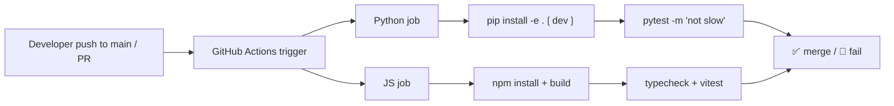
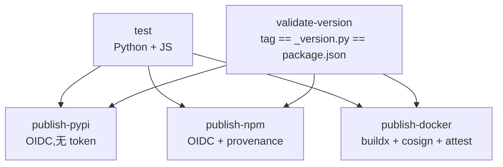
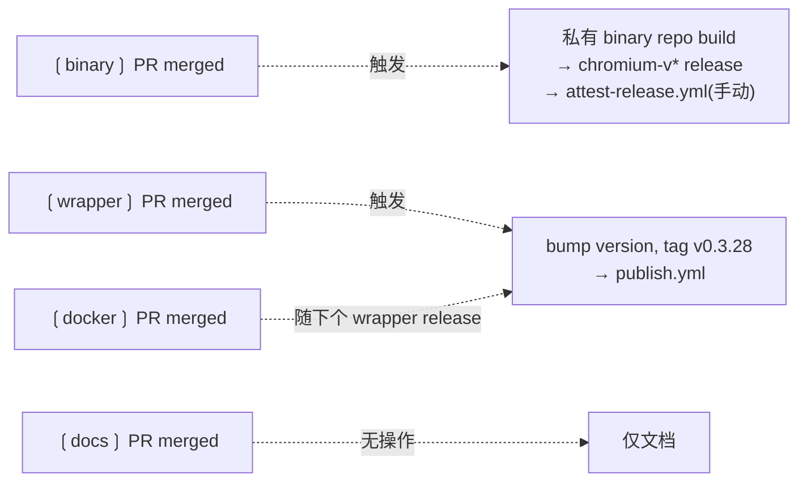

<details>
<summary>相关源文件</summary>

生成本页时使用的主要源文件:

- [.github/workflows/ci.yml](../../../project-repos/cloakbrowser/.github/workflows/ci.yml)
- [.github/workflows/publish.yml](../../../project-repos/cloakbrowser/.github/workflows/publish.yml)
- [.github/workflows/attest-release.yml](../../../project-repos/cloakbrowser/.github/workflows/attest-release.yml)
- [tests/conftest.py](../../../project-repos/cloakbrowser/tests/conftest.py)
- [tests/test_stealth.py](../../../project-repos/cloakbrowser/tests/test_stealth.py)
- [tests/test_launch.py](../../../project-repos/cloakbrowser/tests/test_launch.py)
- [js/tests/stealth.test.ts](../../../project-repos/cloakbrowser/js/tests/stealth.test.ts)
- [pyproject.toml](../../../project-repos/cloakbrowser/pyproject.toml)

</details>

# 测试、CI 与发布管线

CloakBrowser 的发布有一个反直觉的合约:**Chromium binary 与 wrapper 包独立发布**。Chromium binary 由 CloakHQ 私有的补丁仓库编译,作为 GitHub Release 资产发布;wrapper 包(`cloakbrowser` Python + JS)从这个公开仓库发布到 PyPI 与 npm。CI 管线必须协调这两条线,同时保证供应链安全可证明。

这一页讲三件事:**测试策略**(单元 + 集成 + stealth 在线测试)、**CI 工作流**(三个 workflow 的协作)、**发布机制**(双语言版本同步 + OIDC + cosign + SLSA 证明)。

## 测试结构

```
cloakbrowser/
├── tests/                  # Python — 29 个文件
│   ├── conftest.py
│   ├── test_backend.py     # Patchright 后端切换
│   ├── test_build_args.py  # build_args 合并与去重
│   ├── test_cloakserve.py  # cloakserve 路由与池管理
│   ├── test_config.py      # 平台/路径/版本解析
│   ├── test_extract.py     # tar/zip 提取 + 路径穿越
│   ├── test_geoip.py       # GeoIP 解析(单元)
│   ├── test_human_visual.{mjs,py}    # 拟人化视觉测试
│   ├── test_humanize_unit.{mjs,py}   # 拟人化单元测试
│   ├── test_lambda_security.py       # Lambda handler 安全
│   ├── test_launch.py
│   ├── test_launch_context.py
│   ├── test_persistent_context.py
│   ├── test_proxy.py
│   ├── test_stealth.py     # 在线 stealth 测试 (slow)
│   ├── test_stealth_reproduction_110.py
│   ├── test_stealth_unit.py
│   └── test_update.py
└── js/tests/               # JS — 9 个文件
    ├── config.test.ts
    ├── geoip.test.ts
    ├── humanize.test.ts
    ├── launch.test.ts
    ├── proxy.test.ts
    ├── puppeteer.test.ts
    ├── stealth.puppeteer.test.ts
    ├── stealth.test.ts
    └── update.test.ts
```

Sources: [00-repo-inventory.md:51-81](../00-repo-inventory.md#L51-L81)

<details class="source-snippets">
<summary>引用源码</summary>

<!-- source-snippets:start -->

#### `00-repo-inventory.md:51-81`

```markdown

- `js/tests/config.test.ts`
- `js/tests/geoip.test.ts`
- `js/tests/humanize.test.ts`
- `js/tests/launch.test.ts`
- `js/tests/proxy.test.ts`
- `js/tests/puppeteer.test.ts`
- `js/tests/stealth.puppeteer.test.ts`
- `js/tests/stealth.test.ts`
- `js/tests/update.test.ts`
- `tests/__init__.py`
- `tests/conftest.py`
- `tests/test_backend.py`
- `tests/test_build_args.py`
- `tests/test_cloakserve.py`
- `tests/test_config.py`
- `tests/test_extract.py`
- `tests/test_geoip.py`
- `tests/test_human_visual.mjs`
- `tests/test_human_visual.py`
- `tests/test_humanize_unit.mjs`
- `tests/test_humanize_unit.py`
- `tests/test_lambda_security.py`
- `tests/test_launch.py`
- `tests/test_launch_context.py`
- `tests/test_persistent_context.py`
- `tests/test_proxy.py`
- `tests/test_stealth.py`
- `tests/test_stealth_reproduction_110.py`
- `tests/test_stealth_unit.py`
- `tests/test_update.py`
```

<!-- source-snippets:end -->
</details>

### slow marker:在线 stealth 测试单独标记

```toml
[tool.pytest.ini_options]
testpaths = ["tests"]
asyncio_mode = "auto"
markers = ["slow: marks tests that hit live detection sites (deselect with '-m \"not slow\"')"]
```

Sources: [pyproject.toml:74-77](../../../project-repos/cloakbrowser/pyproject.toml#L74-L77)

<details class="source-snippets">
<summary>引用源码</summary>

<!-- source-snippets:start -->

#### `pyproject.toml:74-77`

```toml
[tool.pytest.ini_options]
testpaths = ["tests"]
asyncio_mode = "auto"
markers = ["slow: marks tests that hit live detection sites (deselect with '-m \"not slow\"')"]
```

<!-- source-snippets:end -->
</details>

`@pytest.mark.slow` 标记那些**真的去 ping bot.incolumitas.com、deviceandbrowserinfo.com 等真实检测站**的测试——这些测试结果取决于外部服务状态,不适合在每次 push 跑。CI 默认 `-m "not slow"` 跳过它们。

这套区分让开发者本地可以单独跑 `pytest -m slow` 做端到端 stealth 验证,而 PR 流程只跑快速可重复的单元测试。

### tests/conftest.py:一行修复一个隐患

```python
@pytest.fixture(autouse=True)
def _clean_backend_env(monkeypatch):
    """Ensure CLOAKBROWSER_BACKEND doesn't leak into tests from the host environment."""
    monkeypatch.delenv("CLOAKBROWSER_BACKEND", raising=False)
```

Sources: [tests/conftest.py:1-11](../../../project-repos/cloakbrowser/tests/conftest.py#L1-L11)

<details class="source-snippets">
<summary>引用源码</summary>

<!-- source-snippets:start -->

#### `tests/conftest.py:1-11`

```python
"""Shared test fixtures."""

import os

import pytest


@pytest.fixture(autouse=True)
def _clean_backend_env(monkeypatch):
    """Ensure CLOAKBROWSER_BACKEND doesn't leak into tests from the host environment."""
    monkeypatch.delenv("CLOAKBROWSER_BACKEND", raising=False)
```

<!-- source-snippets:end -->
</details>

`autouse=True` 意味着所有测试自动应用。开发者本机可能设了 `CLOAKBROWSER_BACKEND=patchright`,如果泄漏到测试,`test_backend.py` 验证默认 backend 是 `playwright` 就会失败。这一行 fixture 杜绝了"在我机器上过,CI 也过,但 colleague 机器上挂"的最常见问题。

## test_stealth.py:在线反检测验证

```python
class TestWebDriverDetection:
    def test_navigator_webdriver_false(self, page):
        page.goto("https://example.com")
        assert page.evaluate("navigator.webdriver") is False

    def test_no_headless_chrome_ua(self, page):
        page.goto("https://example.com")
        ua = page.evaluate("navigator.userAgent")
        assert "HeadlessChrome" not in ua
        assert "Chrome/" in ua

    def test_window_chrome_exists(self, page):
        page.goto("https://example.com")
        assert page.evaluate("typeof window.chrome") == "object"

    def test_plugins_present(self, page):
        page.goto("https://example.com")
        count = page.evaluate("navigator.plugins.length")
        assert count >= 5

    def test_cdp_not_detected(self, page):
        page.goto("https://example.com")
        has_cdp = page.evaluate("""
            () => {
                try {
                    const keys = Object.keys(window);
                    return keys.some(k => k.startsWith('cdc_') || k.startsWith('__webdriver'));
                } catch(e) {
                    return false;
                }
            }
        """)
        assert has_cdp is False
```

Sources: [tests/test_stealth.py:32-79](../../../project-repos/cloakbrowser/tests/test_stealth.py#L32-L79)

<details class="source-snippets">
<summary>引用源码</summary>

<!-- source-snippets:start -->

#### `tests/test_stealth.py:32-79`

```python
class TestWebDriverDetection:
    """Tests for WebDriver/automation detection signals."""

    def test_navigator_webdriver_false(self, page):
        """navigator.webdriver must be false."""
        page.goto("https://example.com")
        assert page.evaluate("navigator.webdriver") is False

    def test_no_headless_chrome_ua(self, page):
        """User agent must not contain 'HeadlessChrome'."""
        page.goto("https://example.com")
        ua = page.evaluate("navigator.userAgent")
        assert "HeadlessChrome" not in ua
        assert "Chrome/" in ua

    def test_window_chrome_exists(self, page):
        """window.chrome must be an object (not undefined)."""
        page.goto("https://example.com")
        assert page.evaluate("typeof window.chrome") == "object"

    def test_plugins_present(self, page):
        """Must have browser plugins (real Chrome has 5)."""
        page.goto("https://example.com")
        count = page.evaluate("navigator.plugins.length")
        assert count >= 5, f"Expected 5+ plugins (real Chrome), got {count}"

    def test_languages_present(self, page):
        """navigator.languages must be populated."""
        page.goto("https://example.com")
        langs = page.evaluate("navigator.languages")
        assert len(langs) >= 1

    def test_cdp_not_detected(self, page):
        """Chrome DevTools Protocol should not be detectable."""
        page.goto("https://example.com")
        # Common CDP detection: check for Runtime.evaluate artifacts
        has_cdp = page.evaluate("""
            () => {
                try {
                    // Check common CDP leak: window.cdc_
                    const keys = Object.keys(window);
                    return keys.some(k => k.startsWith('cdc_') || k.startsWith('__webdriver'));
                } catch(e) {
                    return false;
                }
            }
        """)
        assert has_cdp is False
```

<!-- source-snippets:end -->
</details>

这些都是反检测的"核心信号"——`navigator.webdriver`、UA、`window.chrome`、`navigator.plugins.length`、`window` 上的 CDP 探针(`cdc_*`、`__webdriver`)。如果 binary 的 C++ patch 在某次升级回归,这套测试立即报警。

注意 `@pytest.fixture(scope="module")` 的 browser fixture——整个文件共享一个 browser,只在 module 级别开关。这避免每个测试反复 launch(~3s),整套测试跑得快。

### 模块级 vs 函数级 fixture

```python
@pytest.fixture(scope="module")
def browser():
    b = launch(headless=True, proxy=PROXY)
    yield b
    b.close()

@pytest.fixture
def page(browser):  # function scope
    p = browser.new_page()
    yield p
    p.close()
```

Sources: [tests/test_stealth.py:16-29](../../../project-repos/cloakbrowser/tests/test_stealth.py#L16-L29)

<details class="source-snippets">
<summary>引用源码</summary>

<!-- source-snippets:start -->

#### `tests/test_stealth.py:16-29`

```python
@pytest.fixture(scope="module")
def browser():
    """Shared browser instance for stealth tests."""
    b = launch(headless=True, proxy=PROXY)
    yield b
    b.close()


@pytest.fixture
def page(browser):
    """Fresh page for each test."""
    p = browser.new_page()
    yield p
    p.close()
```

<!-- source-snippets:end -->
</details>

`page` 是函数级——每个测试拿到一个干净的 page,避免上个测试残留 DOM/cookies。这种"共享 browser,独立 page"是 Playwright 测试的标准模式,执行时间最优。

## JS 端测试:vitest + 全面 mock

JS 端的 `js/tests/stealth.test.ts` 是**纯 mock**测试,**不启动 browser**:

```typescript
import { describe, it, expect, vi, beforeEach } from "vitest";

function buildMockPage(overrides: Record<string, any> = {}): any {
    const mainFrameObj = overrides.mainFrameReturn ?? {
        childFrames: vi.fn(() => []),
        click: vi.fn(async () => {}),
        // ...
    };
    // ...
}
```

Sources: [js/tests/stealth.test.ts:1-60](../../../project-repos/cloakbrowser/js/tests/stealth.test.ts#L1-L60)

<details class="source-snippets">
<summary>引用源码</summary>

<!-- source-snippets:start -->

#### `js/tests/stealth.test.ts:1-60`

```typescript
/**
 * Unit tests for stealth / anti-detection fixes (issue #110).
 *
 * Covers:
 *   - StealthEval — CDP isolated-world lifecycle (evaluate, invalidate, retry)
 *   - isInputElement / isSelectorFocused — stealth DOM queries with fallback
 *   - typeShiftSymbol — CDP Input.dispatchKeyEvent path vs evaluate fallback
 *   - humanType integration — shift symbols routed via CDP
 *   - Navigation invalidation (goto → stealth.invalidate)
 *   - patchPage stealth infrastructure wiring
 *   - SHIFT_SYMBOL_CODES / SHIFT_SYMBOL_KEYCODES completeness
 *
 * All tests are fast, mock-based, and do NOT require a browser.
 */

import { describe, it, expect, vi, beforeEach } from "vitest";
import { resolveConfig, rand, randRange, sleep } from "../src/human/config.js";
import { humanType } from "../src/human/keyboard.js";
import { humanMove, humanClick, clickTarget, humanIdle } from "../src/human/mouse.js";

// =========================================================================
// Helper: build mock page / raw objects
// =========================================================================

function buildMockPage(overrides: Record<string, any> = {}): any {
  const mainFrameObj = overrides.mainFrameReturn ?? {
    childFrames: vi.fn(() => []),
    click: vi.fn(async () => {}),
    dblclick: vi.fn(async () => {}),
    hover: vi.fn(async () => {}),
    type: vi.fn(async () => {}),
    fill: vi.fn(async () => {}),
    check: vi.fn(async () => {}),
    uncheck: vi.fn(async () => {}),
    selectOption: vi.fn(async () => {}),
    press: vi.fn(async () => {}),
    clear: vi.fn(async () => {}),
    dragAndDrop: vi.fn(async () => {}),
    locator: vi.fn(() => ({
      boundingBox: vi.fn(async () => ({ x: 0, y: 0, width: 100, height: 30 })),
      first: vi.fn(function (this: any) { return this; }),
    })),
  };

  const makeLocator = () => {
    const loc: any = {
      boundingBox: vi.fn(async () => ({ x: 100, y: 100, width: 200, height: 30 })),
      scrollIntoViewIfNeeded: vi.fn(async () => {}),
      isChecked: overrides.isChecked ?? vi.fn(async () => false),
    };
    loc.first = vi.fn(() => loc);
    return loc;
  };

  const page: any = {
    evaluate: overrides.evaluate ?? vi.fn(async () => false),
    addInitScript: vi.fn(async () => {}),
    mouse: {
      move: vi.fn(async () => {}),
      down: vi.fn(async () => {}),
```

<!-- source-snippets:end -->
</details>

JS 端的策略是"**单元化所有可单元的部分**",依赖完整 mock 注入 + spy 验证调用模式。这让 CI JS job 不需要真的运行 Chromium——`vitest run` 几秒搞定。stealth.test.ts 验证的不是"真实反检测能否过",而是"代码路径是否正确触发 CDP isolated world、是否正确选择 stealth 路径 vs fallback"。

JS 端有专门的 `stealth.puppeteer.test.ts` 测 Puppeteer 拟人化适配——0.3.23 加入,@evelaa123 贡献。

### 双语言测试对偶

|测试类别|Python|JS|
|---|---|---|
|单元(无 browser)|`test_*_unit.py`、`test_build_args.py`、`test_config.py`|`*.test.ts` 全部|
|集成(launch browser)|`test_launch.py`、`test_persistent_context.py` 等|无(JS 不在 CI 跑 browser 测试)|
|在线反检测|`test_stealth.py` (slow)|无|
|路径穿越/安全|`test_extract.py`、`test_lambda_security.py`|无|

Python 端因为 binary 是项目核心,集成测试不可避免;JS 端的 wrapper 完全镜像 Python 行为,所以单元 + Python 端集成已足够。这种"职责互补"的测试分工节省了 CI 时间。

## CI 工作流:ci.yml — 每次 push

```yaml
name: CI
on:
  push:
    branches: [main]
  pull_request:
    branches: [main]

jobs:
  python:
    runs-on: ubuntu-latest
    steps:
      - uses: actions/checkout@de0fac2e...  # v6.0.2 (pinned by SHA)
      - uses: actions/setup-python@a309ff8b...  # v6.2.0
        with:
          python-version: "3.12"
      - name: Install dependencies
        run: pip install -e ".[dev]" pytest pytest-asyncio
      - name: Run tests
        run: pytest tests/ -v -m "not slow"

  javascript:
    runs-on: ubuntu-latest
    steps:
      - uses: actions/checkout@de0fac2e...
      - uses: actions/setup-node@48b55a01...
        with:
          node-version: 20
      - name: Install and build
        run: cd js && npm install && npm run build
      - name: Typecheck
        run: cd js && npm run typecheck
      - name: Run tests
        run: cd js && npm test
```

Sources: [github/workflows/ci.yml:1-34](../../../project-repos/cloakbrowser/.github/workflows/ci.yml#L1-L34)

<details class="source-snippets">
<summary>引用源码</summary>

<!-- source-snippets:start -->

#### `github/workflows/ci.yml:1-34`

```yaml
name: CI

on:
  push:
    branches: [main]
  pull_request:
    branches: [main]

jobs:
  python:
    runs-on: ubuntu-latest
    steps:
      - uses: actions/checkout@de0fac2e4500dabe0009e67214ff5f5447ce83dd  # v6.0.2
      - uses: actions/setup-python@a309ff8b426b58ec0e2a45f0f869d46889d02405  # v6.2.0
        with:
          python-version: "3.12"
      - name: Install dependencies
        run: pip install -e ".[dev]" pytest pytest-asyncio
      - name: Run tests
        run: pytest tests/ -v -m "not slow"

  javascript:
    runs-on: ubuntu-latest
    steps:
      - uses: actions/checkout@de0fac2e4500dabe0009e67214ff5f5447ce83dd  # v6.0.2
      - uses: actions/setup-node@48b55a011bda9f5d6aeb4c2d9c7362e8dae4041e  # v6.4.0
        with:
          node-version: 20
      - name: Install and build
        run: cd js && npm install && npm run build
      - name: Typecheck
        run: cd js && npm run typecheck
      - name: Run tests
        run: cd js && npm test
```

<!-- source-snippets:end -->
</details>

两个并行 job,一个测 Python 一个测 JS。CI 在 5-10 分钟内反馈,够快不阻塞迭代。

### Action 全部 pin 到 SHA

```yaml
- uses: actions/checkout@de0fac2e4500dabe0009e67214ff5f5447ce83dd  # v6.0.2
- uses: actions/setup-python@a309ff8b426b58ec0e2a45f0f869d46889d02405  # v6.2.0
```

不是 `actions/checkout@v6` 这种 tag 引用,而是 commit SHA。这是 0.3.19 引入的供应链安全加固——tag 可以被仓库 owner 移动指向恶意 commit,SHA 不可变。配合 Dependabot 自动 PR 提示新版本,既不失维护性又保安全。



## publish.yml — tag 触发的双语言 + Docker 发布

```yaml
name: Publish

on:
  push:
    tags:
      - 'v*'
  workflow_dispatch:
    inputs:
      job:
        description: 'Job to run (leave empty to run all)'
        ...

concurrency:
  group: publish
  cancel-in-progress: false
```

Sources: [github/workflows/publish.yml:1-22](../../../project-repos/cloakbrowser/.github/workflows/publish.yml#L1-L22)

<details class="source-snippets">
<summary>引用源码</summary>

<!-- source-snippets:start -->

#### `github/workflows/publish.yml:1-22`

```yaml
name: Publish

on:
  push:
    tags:
      - 'v*'
  workflow_dispatch:
    inputs:
      job:
        description: 'Job to run (leave empty to run all)'
        required: false
        type: choice
        options:
          - ''
          - publish-pypi
          - publish-npm
          - publish-docker

concurrency:
  group: publish
  cancel-in-progress: false

```

<!-- source-snippets:end -->
</details>

`concurrency: group: publish` 意味着同一时间只有一个 publish 在跑——并发发布 = 灾难。`cancel-in-progress: false` 意味着新发布不会取消旧的,而是排队——一旦发布开始就让它跑完。

### 五个 job,依赖关系



`validate-version` job:

```yaml
- name: Check tag matches package versions
  run: |
    TAG="${GITHUB_REF_NAME#v}"
    PY=$(python -c 'import re; print(re.search(r"__version__\s*=\s*[\"'\'']([^\"'\'']+)", open("cloakbrowser/_version.py").read()).group(1))')
    JS=$(python -c 'import json; print(json.load(open("js/package.json"))["version"])')
    echo "Tag: $TAG | Python: $PY | npm: $JS"
    [ "$TAG" = "$PY" ] || { echo "ERROR: tag v$TAG != _version.py $PY"; exit 1; }
    [ "$TAG" = "$JS" ] || { echo "ERROR: tag v$TAG != package.json $JS"; exit 1; }
```

Sources: [github/workflows/publish.yml:41-56](../../../project-repos/cloakbrowser/.github/workflows/publish.yml#L41-L56)

<details class="source-snippets">
<summary>引用源码</summary>

<!-- source-snippets:start -->

#### `github/workflows/publish.yml:41-56`

```yaml
  validate-version:
    if: startsWith(github.ref, 'refs/tags/')
    runs-on: ubuntu-latest
    steps:
      - uses: actions/checkout@de0fac2e4500dabe0009e67214ff5f5447ce83dd  # v6.0.2
      - uses: actions/setup-python@a309ff8b426b58ec0e2a45f0f869d46889d02405  # v6.2.0
        with:
          python-version: "3.12"
      - name: Check tag matches package versions
        run: |
          TAG="${GITHUB_REF_NAME#v}"
          PY=$(python -c 'import re; print(re.search(r"__version__\s*=\s*[\"'\'']([^\"'\'']+)", open("cloakbrowser/_version.py").read()).group(1))')
          JS=$(python -c 'import json; print(json.load(open("js/package.json"))["version"])')
          echo "Tag: $TAG | Python: $PY | npm: $JS"
          [ "$TAG" = "$PY" ] || { echo "ERROR: tag v$TAG != _version.py $PY"; exit 1; }
          [ "$TAG" = "$JS" ] || { echo "ERROR: tag v$TAG != package.json $JS"; exit 1; }
```

<!-- source-snippets:end -->
</details>

**三个版本号必须严格相等**才能发布:git tag、Python `_version.py`、JS `package.json` 的 `version`。Python 用 dynamic version 通过 `hatch.version.path = "cloakbrowser/_version.py"`(`pyproject.toml`)实现,但 JS 的 `package.json` 没有等价机制,所以发版前必须手动同步。这个 validate 防止"忘了改一边"。

## OIDC trusted publishing:无 secret 发布

```yaml
publish-pypi:
  permissions:
    id-token: write  # OIDC trusted publishing — no PYPI_TOKEN needed
  steps:
    - uses: pypa/gh-action-pypi-publish@cef221092ed1bacb1cc03d23a2d87d1d172e277b  # v1
```

Sources: [github/workflows/publish.yml:58-74](../../../project-repos/cloakbrowser/.github/workflows/publish.yml#L58-L74)

<details class="source-snippets">
<summary>引用源码</summary>

<!-- source-snippets:start -->

#### `github/workflows/publish.yml:58-74`

```yaml
  publish-pypi:
    needs: [test, validate-version]
    if: always() && needs.test.result == 'success' && (needs.validate-version.result == 'success' || needs.validate-version.result == 'skipped')
    runs-on: ubuntu-latest
    permissions:
      id-token: write  # OIDC trusted publishing — no PYPI_TOKEN needed
    steps:
      - uses: actions/checkout@de0fac2e4500dabe0009e67214ff5f5447ce83dd  # v6.0.2
      - uses: actions/setup-python@a309ff8b426b58ec0e2a45f0f869d46889d02405  # v6.2.0
        with:
          python-version: "3.12"
      - name: Build
        run: |
          pip install build
          python -m build
      - name: Publish to PyPI
        uses: pypa/gh-action-pypi-publish@cef221092ed1bacb1cc03d23a2d87d1d172e277b  # v1
```

<!-- source-snippets:end -->
</details>

**没有 `PYPI_TOKEN` secret**。PyPI 用 OIDC trusted publishing——PyPI 信任 `CloakHQ/cloakbrowser` 仓库的 GitHub Actions,工作流通过 `id-token: write` 拿到 OIDC token 直接换取上传凭证。token 短期、单次使用,没有长期 secret 可被盗。

npm 同样:

```yaml
publish-npm:
  permissions:
    id-token: write  # OIDC trusted publishing + provenance
  steps:
    - run: cd js && npm publish --provenance --access public
```

Sources: [github/workflows/publish.yml:76-91](../../../project-repos/cloakbrowser/.github/workflows/publish.yml#L76-L91)

<details class="source-snippets">
<summary>引用源码</summary>

<!-- source-snippets:start -->

#### `github/workflows/publish.yml:76-91`

```yaml
  publish-npm:
    needs: [test, validate-version]
    if: always() && needs.test.result == 'success' && (needs.validate-version.result == 'success' || needs.validate-version.result == 'skipped')
    runs-on: ubuntu-latest
    permissions:
      id-token: write  # OIDC trusted publishing + provenance — no NPM_TOKEN needed
    steps:
      - uses: actions/checkout@de0fac2e4500dabe0009e67214ff5f5447ce83dd  # v6.0.2
      - uses: actions/setup-node@48b55a011bda9f5d6aeb4c2d9c7362e8dae4041e  # v6.4.0
        with:
          node-version: 24  # npm 11.11.0 native — no upgrade needed (Node 22.22.2 has broken npm)
          registry-url: 'https://registry.npmjs.org'
      - name: Build
        run: cd js && npm ci && npm run build
      - name: Publish to npm
        run: cd js && npm publish --provenance --access public
```

<!-- source-snippets:end -->
</details>

`--provenance` 让 npm 把 build provenance 与包一起发布。`npm view cloakbrowser` 时可以看到 provenance 链接,验证"这个包确实是从 CloakHQ/cloakbrowser 的 commit X build 出来的"。

## Docker 发布:多架构 + 签名 + provenance

```yaml
publish-docker:
  permissions:
    id-token: write
    contents: read
    attestations: write
    packages: write
  steps:
    - uses: docker/setup-qemu-action@ce360397...
    - uses: docker/setup-buildx-action@4d04d5d9...
    - uses: docker/login-action@4907a6dd...
      with:
        username: ${{ secrets.DOCKER_USER }}
        password: ${{ secrets.DOCKER_PAT }}
    - name: Build and push
      id: build
      uses: docker/build-push-action@bcafcacb...
      with:
        context: .
        platforms: linux/amd64,linux/arm64
        push: true
        tags: |
          cloakhq/cloakbrowser:${{ env.VERSION }}
          cloakhq/cloakbrowser:latest
        provenance: true
        sbom: true
    - uses: sigstore/cosign-installer@6f9f1778...
    - name: Sign image
      run: cosign sign --yes cloakhq/cloakbrowser@${{ steps.build.outputs.digest }}
    - name: Attest build provenance
      uses: actions/attest-build-provenance@a2bbfa25...
      with:
        subject-name: index.docker.io/cloakhq/cloakbrowser
        subject-digest: ${{ steps.build.outputs.digest }}
        push-to-registry: true
```

Sources: [github/workflows/publish.yml:93-134](../../../project-repos/cloakbrowser/.github/workflows/publish.yml#L93-L134)

<details class="source-snippets">
<summary>引用源码</summary>

<!-- source-snippets:start -->

#### `github/workflows/publish.yml:93-134`

```yaml
  publish-docker:
    needs: [test, validate-version]
    if: always() && needs.test.result == 'success' && (needs.validate-version.result == 'success' || needs.validate-version.result == 'skipped')
    runs-on: ubuntu-latest
    permissions:
      id-token: write      # Cosign keyless signing + attestations
      contents: read
      attestations: write
      packages: write
    steps:
      - uses: actions/checkout@de0fac2e4500dabe0009e67214ff5f5447ce83dd  # v6.0.2
      - name: Extract version
        run: |
          VERSION=$(python -c 'import re; print(re.search(r"__version__\s*=\s*[\"'\'']([^\"'\'']+)", open("cloakbrowser/_version.py").read()).group(1))')
          echo "VERSION=$VERSION" >> $GITHUB_ENV
      - uses: docker/setup-qemu-action@ce360397dd3f832beb865e1373c09c0e9f86d70a  # v4.0.0
      - uses: docker/setup-buildx-action@4d04d5d9486b7bd6fa91e7baf45bbb4f8b9deedd  # v4.0.0
      - uses: docker/login-action@4907a6ddec9925e35a0a9e82d7399ccc52663121  # v4.1.0
        with:
          username: ${{ secrets.DOCKER_USER }}
          password: ${{ secrets.DOCKER_PAT }}
      - name: Build and push
        id: build
        uses: docker/build-push-action@bcafcacb16a39f128d818304e6c9c0c18556b85f  # v7.1.0
        with:
          context: .
          platforms: linux/amd64,linux/arm64
          push: true
          tags: |
            cloakhq/cloakbrowser:${{ env.VERSION }}
            cloakhq/cloakbrowser:latest
          provenance: true
          sbom: true
      - uses: sigstore/cosign-installer@6f9f17788090df1f26f669e9d70d6ae9567deba6  # v4.1.2
      - name: Sign image
        run: cosign sign --yes cloakhq/cloakbrowser@${{ steps.build.outputs.digest }}
      - name: Attest build provenance
        uses: actions/attest-build-provenance@a2bbfa25375fe432b6a289bc6b6cd05ecd0c4c32  # v4.1.0
        with:
          subject-name: index.docker.io/cloakhq/cloakbrowser
          subject-digest: ${{ steps.build.outputs.digest }}
          push-to-registry: true
```

<!-- source-snippets:end -->
</details>

四层供应链证明叠加:

1. **多架构 buildx**:`linux/amd64,linux/arm64` 一次产出两架构 manifest
2. **provenance + sbom**:`docker/build-push-action` 自带 SLSA build provenance 与 Software Bill of Materials
3. **cosign 无密钥签名**:Sigstore 透明日志记录"这个 image digest 是 CloakHQ/cloakbrowser GitHub Actions 签的",`cosign verify` 可验证
4. **attest-build-provenance push-to-registry**:SLSA Level 3 build provenance 推到 Docker Hub registry,通过 OCI artifact attachment 关联到 image

用户可以这样验证:

```bash
# 验证签名
cosign verify cloakhq/cloakbrowser@sha256:... \
  --certificate-identity 'https://github.com/CloakHQ/cloakbrowser/.github/workflows/publish.yml@refs/tags/v0.3.28' \
  --certificate-oidc-issuer 'https://token.actions.githubusercontent.com'

# 验证 provenance
gh attestation verify cloakhq/cloakbrowser:0.3.28 --owner CloakHQ
```

## attest-release.yml — Chromium binary 的事后证明

```yaml
name: Attest Release Binary

on:
  workflow_dispatch:
    inputs:
      tag:
        description: 'Release tag (e.g. chromium-v145.0.7632.159.2)'
        required: true

jobs:
  attest:
    permissions:
      id-token: write
      attestations: write
      contents: write
    steps:
      - name: Download release binaries
        run: gh release download "$RELEASE_TAG" --repo CloakHQ/cloakbrowser --pattern "cloakbrowser-*.tar.gz" --pattern "cloakbrowser-*.zip"

      - name: Attest build provenance
        uses: actions/attest-build-provenance@a2bbfa25...
        with:
          subject-path: |
            cloakbrowser-*.tar.gz
            cloakbrowser-*.zip
```

Sources: [github/workflows/attest-release.yml:1-29](../../../project-repos/cloakbrowser/.github/workflows/attest-release.yml#L1-L29)

<details class="source-snippets">
<summary>引用源码</summary>

<!-- source-snippets:start -->

#### `github/workflows/attest-release.yml:1-29`

```yaml
name: Attest Release Binary

on:
  workflow_dispatch:
    inputs:
      tag:
        description: 'Release tag (e.g. chromium-v145.0.7632.159.2)'
        required: true

jobs:
  attest:
    runs-on: ubuntu-latest
    permissions:
      id-token: write      # Sigstore OIDC
      attestations: write  # GitHub attestation API
      contents: write      # Download release assets
    steps:
      - name: Download release binaries
        run: gh release download "$RELEASE_TAG" --repo CloakHQ/cloakbrowser --pattern "cloakbrowser-*.tar.gz" --pattern "cloakbrowser-*.zip"
        env:
          GH_TOKEN: ${{ github.token }}
          RELEASE_TAG: ${{ github.event.inputs.tag }}

      - name: Attest build provenance
        uses: actions/attest-build-provenance@a2bbfa25375fe432b6a289bc6b6cd05ecd0c4c32  # v4.1.0
        with:
          subject-path: |
            cloakbrowser-*.tar.gz
            cloakbrowser-*.zip
```

<!-- source-snippets:end -->
</details>

这个 workflow 不在 push 触发,**只通过 manual `workflow_dispatch`** 跑。原因:Chromium binary 是在 CloakHQ 私有补丁仓库 build 完后,以 GitHub Release 形式发布到这个公开仓库;attest-release 在 release 发布后手动触发,给 release 资产打 provenance attestation。

**为什么是事后而不是 build-time?** —— 因为 build 在私有仓库进行,公开仓库的 GitHub Actions 拿不到 build 过程。事后 attest 至少能证明"这些 tar.gz/zip 是 CloakHQ 在某个时间签的"。这是供应链证明在"build 与 publish 解耦"场景下的折衷方案。

## CHANGELOG 标签:发布纪律的载体

CHANGELOG 每条都打 `[wrapper]`、`[binary]`、`[docker]`、`[docs]`、`[meta]` 标签。这不是装饰,而是**发布纪律**:

- **`[binary]` 变更触发 chromium-v* tag 与 attest-release**
- **`[wrapper]` 变更触发 v* tag 与完整 publish workflow**
- **`[docker]` 单独的 docker 镜像更新**
- **`[docs]` / `[meta]` 不触发发布**



读 CHANGELOG 可以快速判断"这次升级需要换 binary 吗?"——`[binary]` 条目意味着用户的 `~/.cloakbrowser` 缓存会被自动后台更新替换,wrapper 版本不变可以不动。

## 几个非显然的实践细节

**1. Patchright 测试隔离**

`test_backend.py` 验证默认 backend 是 `playwright`、`CLOAKBROWSER_BACKEND=patchright` 切换有效——但 patchright 不是 dev 必备依赖。`pip install -e .[dev]` 只装 pytest + pytest-asyncio,不装 patchright。`test_backend.py` 用 mock 或 `pytest.importorskip("patchright")` 处理这个分裂。

**2. Lambda 安全测试是独立模块**

`test_lambda_security.py` 单独存在,验证 `_validate_url` 防 SSRF、handler 不响应私有 IP 等。Lambda 是出厂模板,如果模板有 SSRF 用户会直接复制踩坑——所以测试要单独覆盖。

**3. test_human_visual.{py,mjs}**

`.mjs` 后缀的同名 Python 测试是 JS 端的对偶——用同一个浏览器、同一个 fixture,验证两端 humanize 视觉行为一致(都画 Bezier 曲线、都做 overshoot)。这种"双端共享测试 fixture"在 stealth 项目里很罕见,需要专门的执行 runner。

**4. CI Node 版本踩坑**

`publish.yml` 的 `publish-npm` job 用 `node-version: 24`,因为 Node 22.22.2 ship 了一个有 bug 的 npm,会破坏 publish。0.3.23 的 CHANGELOG 写了这点:"Use Node 24 in CI publish workflow to work around broken npm in Node 22.22.2"。这是 CI 工程中常见的"版本兼容性陷阱",写在 workflow 注释里防止后人不小心改回 22。

Sources: [github/workflows/publish.yml:86](../../../project-repos/cloakbrowser/github/workflows/publish.yml:86), [CHANGELOG.md:60](../../../project-repos/cloakbrowser/CHANGELOG.md:60)

<details class="source-snippets">
<summary>引用源码</summary>

<!-- source-snippets:start -->

#### `github/workflows/publish.yml:86`

> 未找到引用文件：`github/workflows/publish.yml:86`

#### `CHANGELOG.md:60`

> 未找到引用文件：`CHANGELOG.md:60`

<!-- source-snippets:end -->
</details>

**5. 测试代理隔离**

`tests/test_stealth.py` 通过环境变量 `CLOAKBROWSER_TEST_PROXY` 接受可选代理——某些反检测站对裸 IP 已经熟悉,需要代理才能拿到真实测试结果。CI 不设这个变量,本地开发可以设。这种"测试可选增强"让本地反检测验证更接近生产环境。

## 相关页面

- [系统架构](system-architecture.md) — wrapper 与 binary 在发布管线中的分工
- [二进制生命周期](binary-management.md) — binary release 如何被 wrapper 端的自动更新机制消费
- [部署与生态集成](deployment-and-integrations.md) — Docker 镜像如何被 cosign 签名 + provenance 证明
- [Python 与 JS 双 SDK 对偶](python-vs-js-sdk.md) — 版本同步与并行发布的细节
