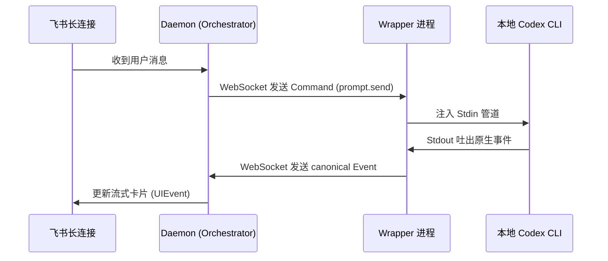
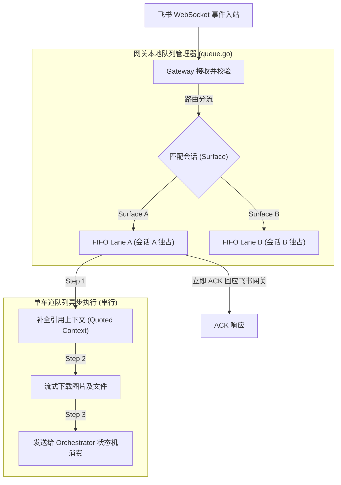
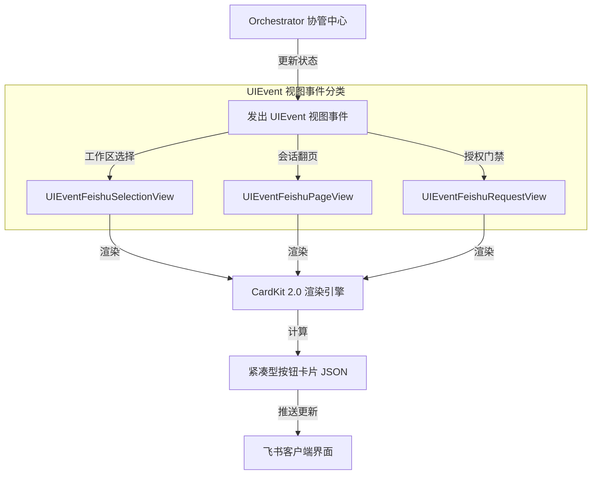
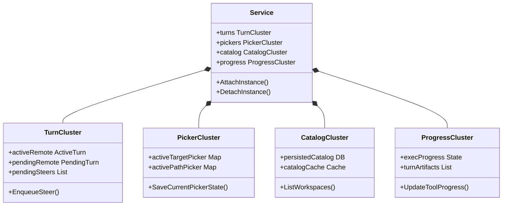
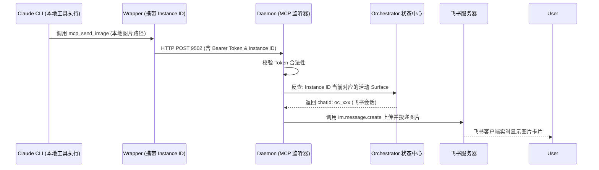
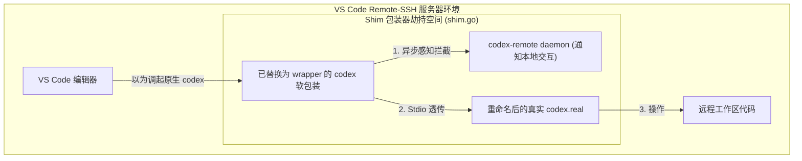
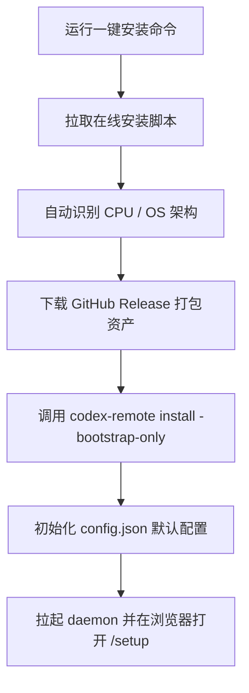
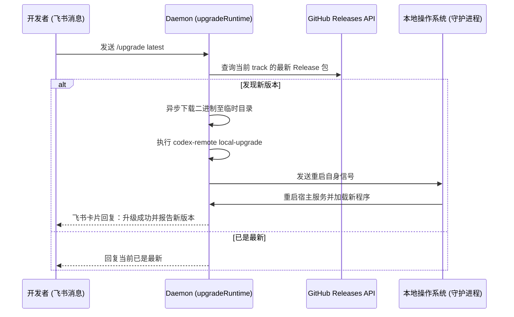

# codex-remote-feishu DeepWiki 全站导出

> **这是 codex-remote-feishu 仓库的单文件技术 Wiki 导出，包含完整的架构解析与核心实现说明。**
>
> - 源仓库: `https://github.com/kxn/codex-remote-feishu.git`
> - 本轮 Commit: `d7ffa4c327062a995f250f525bab12ced6fe9aac`
> - 生成时间: 2026年5月23日

---

<details>
<summary>相关源文件</summary>

生成本页时使用的主要源文件：

- [README.md](../../../project-repos/codex-remote-feishu/README.md)
- [docs/general/user-guide.md](../../../project-repos/codex-remote-feishu/docs/general/user-guide.md)

</details>

# 项目概览

在软件工程实践中，开发者为了与 AI 辅助编程系统（如 Codex/Claude）协作，往往需要在编辑器、浏览器、命令行以及团队沟通工具之间不断跳转。这种多窗口切换极大地破坏了开发的专注度。特别是在需要远程接管 Linux 服务器上的工作区、或者进行跨团队代码审查与实时 Steer（引导）时，传统的本地 IDE 局限性便暴露无遗。

`codex-remote-feishu` 巧妙地解决了这一工程痛点。它将开发者的**工作现场完整投影至飞书 (Lark) 客户端**。通过统一的命令行工具 `codex-remote`，Bot 能够接管本地或远端的 Codex 工作区，将原生 AI app-server 协议转换为轻量级飞书事件，从而支持在飞书界面直接完成上下文理解、代码检索、命令行执行、进度追踪与实时跟进。这为多端协同提供了前所未有的流畅人机交互界面。

## 能力全景

- **工作区无缝接管**：通过 `/list` 列出可接管的工作区，支持一键 attach 本地目录或动态导入远程 Git 仓库，自动同步已有的 turn 历史与 thread 隔离上下文。
- **高吞吐 Early ACK 消息队列**：专门针对飞书 3 秒事件超时机制设计，使用 Gateway-Local FIFO 通道，支持消息实时入队、防抖、连发合并以及快速抢占终止。
- **CardKit 2.0 共享进度卡**：实时共享 AI 计划更新、工具调用、Web 搜索和命令执行过程。最终回复自动在触发消息下方以 thread 回复形式呈现，使得聊天记录极其整洁。
- **本地 MCP 飞书监听器**：在本地 loopback 监听 MCP 服务，使本地执行的工具（如生成图片、视频、文本文件）能够跨过网络层，直接且安全地投递回特定的飞书 Surface。
- **三向编辑器联动 (VS Code Shim)**：支持以 VS Code 桌面配置 patch 或物理重命名接管 VS Code Remote 插件 bundle 的方式（Shim 接管），使得飞书 Bot 能根据 IDE 当前的活动焦点自动跟随。

## 架构鸟瞰

下面的架构图展示了 `codex-remote-feishu` 统一二进制在飞书、本地守护进程以及真实 Codex 运行环境之间的链路关系。

```mermaid
graph TD
  User["飞书客户端 (开发者)"] <--> |Event Stream / Card Action| Gateway["Feishu Gateway 适配层"]
  
  subgraph DaemonProcess["codex-remote daemon (宿主进程)"]
    Gateway <--> |Action / UIEvent| Orchestrator["Orchestrator 协管核心"]
    Orchestrator <--> |Turns & Queue| RelayWS["Relay WS 服务端"]
    MCPListener["MCP Tool 监听器 (127.0.0.1:9502)"] <--> |本地投递| Gateway
  end

  RelayWS <--> |agentproto (WebSocket)| Wrapper["codex-remote wrapper"]

  subgraph ExecEnv["本地 / 远端执行环境"]
    Wrapper <--> |包装/Stdin/Stdout| Codex["真实 Codex CLI 进程"]
    Codex <--> |调用本地工具| MCPListener
  end
```

在运行态中，`codex-remote` 以 Single Binary 形态覆盖了 daemon (宿主)、wrapper (适配包裹器) 以及 install (安装向导) 三重角色，将多层协议解耦并合并在一个高效的 Go 运行时内。

Sources: [README.md:1-64](../../../project-repos/codex-remote-feishu/README.md#L1-L64)

<details class="source-snippets">
<summary>引用源码</summary>

<!-- source-snippets:start -->

#### `README.md:1-64`

```markdown
# Codex Remote Feishu

`codex-remote-feishu` 把一台机器上的 Codex 工作现场带到飞书，让你可以在飞书里接管工作区、切换 thread、继续对话、发图和停止当前 turn。

使用说明 https://my.feishu.cn/docx/PTncdNBf1oS9N5xBikBcGi2enzc

核心目标场景是：

- 本机或远端 Linux 上运行 Codex
- 默认直接在飞书里按工作区和已有会话继续当前工作
- 只有在需要跟着编辑器当前焦点走时，才按需接入 VS Code
- 尽量保留原有对话的 thread、模型配置和工作目录语义

## 组件

当前 release 只发布一个统一二进制：

- `codex-remote`
  - `daemon` role
    - 常驻服务
    - 管理实例、thread、消息队列、Feishu 投影和状态接口
  - `app-server` / wrapper role
    - 包装真实 `codex`
    - 把原生 app-server 协议翻译成统一事件流
  - `install` role
    - 引导安装器
    - 负责安装稳定二进制、写统一配置并启动 WebSetup

当前官方发布模型是：

- GitHub Releases 的平台包内只放最终用户需要的运行资产
  - `codex-remote` / `codex-remote.exe`
  - `README.md`
  - `QUICKSTART.md`
  - `CHANGELOG.md`
  - `deploy/`
- 在线安装脚本 `install-release.sh` / `install-release.ps1` 单独作为 release 资产和仓库入口提供
- Windows release 额外提供 `codex-remote-feishu_<version>_windows_amd64_installer.exe`，作为 native packaged installer
- macOS release 额外提供 `codex-remote-feishu_<version>_darwin_universal_installer.dmg`，作为 native packaged installer
- GitHub Releases 现在区分 `production / beta / alpha` 三条 track
  - 默认在线安装入口始终指向最新 `production`
  - 需要时可显式安装最新 `beta` / `alpha`
- 正式 release 构建与发布全部在 GitHub Actions 的 `Release` workflow 上完成

## 功能

- 在飞书里列出可接管工作区，并直接继续已有对话或新开会话
- 在统一目标选择卡里直接添加工作区：接入已有本地目录，或导入 Git 仓库
- 直接从最近或全部会话列表继续已有对话
- 需要时切到 VS Code 跟随当前编辑器对话
- 文本消息排队、typing reaction、stop 中断
- 回复当前正在执行的源消息可直接 steer 进本轮执行，也支持 `/steerall`
- 排队中的文字消息支持用点赞升级成对当前执行的跟进
- 支持暂存图片，并在下一条文本里一起发给 Codex
- 支持 `/sendfile`，从当前工作区挑一个文件直接发回飞书聊天
- 支持 `/compact`，对当前 thread 主动做一次手动上下文整理
- 查看当前生效的模型和推理强度，并做飞书侧临时覆盖
- 用 `/cron` 为当前 daemon 实例打开专属定时任务多维表格，并可调度本地工作区或 Git 仓库来源的任务
- 可在飞书里看到计划更新、工具调用、Web 搜索、命令执行等共享进度卡
- 区分系统提示、过程消息和最终回复
- 最终回复会直接回在触发它的那条消息下方
- 旧卡片、旧按钮和旧命令会明确提示已过期或已移除
- 最终回复中的本地 `.md` 和单文件 `.html` 链接可自动替换成飞书云空间预览链接

```

<!-- source-snippets:end -->
</details>

## 技术栈概述

- **后端语言**：Go (1.24+)
- **前端 Web UI**：React + TypeScript + TailwindCSS (位于 `web/` 目录，用于 Admin/WebSetup 向导)
- **底层通信**：基于 WebSocket (传输自定义包装的 agentproto 协议封包) 和 HTTP (暴露 WebSetup API 与 MCP 原生 Streamable 协议面)
- **跨 OS 部署**：原生 Go 编译，支持 macOS/Linux systemd 用户单元，无外部 Docker 等复杂依赖环境

## 阅读路线推荐

- **关注核心架构设计与进程分工**：
  请阅读 [系统架构与统一二进制模型](system-architecture.md) 了解 daemon 与 wrapper 的双进程长连接实现。
- **关注消息分发与网关稳定性**：
  查阅 [飞书网关 Early ACK 与 FIFO 队列](feishu-gateway-queue.md) 了解在 3s 超时约束下的自研可靠队列。
- **关注前端卡片与状态机表现**：
  跳转到 [CardKit 2.0 渲染与交互状态机](interactive-cards.md) 了解 UIEvent 的归约原理。
- **关注 VS Code Shim 劫持原理**：
  阅读 [VS Code Shim 编辑器联动与接管](editor-takeover.md)。

## 相关页面

- [系统架构与统一二进制模型](system-architecture.md) — 探究双进程在 Go 运行时的合并设计
- [飞书网关 Early ACK 与 FIFO 队列](feishu-gateway-queue.md) — 了解高频防抖消息的底层隔离

---

<details>
<summary>相关源文件</summary>

生成本页时使用的主要源文件：

- [cmd/codex-remote/main.go](../../../project-repos/codex-remote-feishu/cmd/codex-remote/main.go)
- [internal/app/launcher/launcher.go](../../../project-repos/codex-remote-feishu/internal/app/launcher/launcher.go)
- [docs/general/architecture.md](../../../project-repos/codex-remote-feishu/docs/general/architecture.md)

</details>

# 系统架构与统一二进制模型

为了极大地降低分发、升级和运维的复杂度，`codex-remote-feishu` 在架构演进中做出了一个关键的设计决策：**收敛多语言实现，将所有运行角色合并进同一个 Go 编写的单二进制 `codex-remote` 中**。这种 Unified Binary 结构通过运行时参数或软链接别名（symlinks）进行角色激活，同时在逻辑层与网络传输层定义了清晰的边界。

## 统一进程角色架构

在运行时，`codex-remote` 二进制依据传入的命令行子命令或宿主环境变量，激活以下三种不同的运行角色：

1. **`daemon` 角色 (默认)**：
   常驻后台的服务。它集成了网络层（与飞书的长连接 Gateway）、产品决策层（Orchestrator）、VitePress 预览托管和状态接口。它是整个系统的中枢，负责管理全部活动实例、对话 Thread、消息排队和图片暂存状态。
2. **`wrapper` 角色**：
   包装真实的本地 `codex` CLI。它对外暴露出与真实 `codex` 完全一致的 Stdin/Stdout 管道面，但在内部通过 WebSocket 长连接（传输 `agentproto` 协议包）与后台的 `daemon` 通信，将原生的转义协议和执行状态源源不断发送给后台进行广播，并在本地拦截 VS Code 编辑器的转向焦点。
3. **`install` 角色**：
   引导安装器。负责向目标机器写入统一的 `config.json` 偏好配置文件，部署本地守护进程服务单元，以及拉起嵌入式 WebSetup 引导向导。

```mermaid
graph TD
  subgraph UnifiedBinary["codex-remote 单二进制文件"]
    DaemonRole["daemon 角色<br/>(常驻服务端 & 飞书网关)"]
    WrapperRole["wrapper 角色<br/>(Codex 执行包装器)"]
    InstallRole["install 角色<br/>(安装器与配置引导)"]
  end
  
  InstallRole --> |部署并拉起| DaemonRole
  WrapperRole <--> |WebSocket (agentproto)| DaemonRole
```

### Launcher 兼容软链接设计

在项目的物理结构中，依然保留了诸如 `relayd`、`relay-wrapper`、`relay-install` 和 `vscode-shim` 等兼容可执行入口。在 Go 的内部实现中，它们全部由 `launcher.go` 进行统一分发处理：

- **技术实现**：系统在启动时读取 `os.Args[0]`（当前进程的可执行文件路径名）或解析环境变量。
- **重定向**：如果文件名为 `relayd`，则自动等价于调用 `codex-remote daemon`；如果是 `relay-wrapper`，则等价于调用 `codex-remote wrapper`。这种设计在向后兼容老版本脚本的同时，确保了编译产物只有一个单一实体，极大地避免了多文件版本漂移问题。

Sources: [internal/app/launcher/launcher.go:1-60](../../../project-repos/codex-remote-feishu/internal/app/launcher/launcher.go#L1-L60)

<details class="source-snippets">
<summary>引用源码</summary>

<!-- source-snippets:start -->

#### `internal/app/launcher/launcher.go:1-60`

```go
package launcher

import (
	"context"
	"fmt"
	"io"
	"os"

	"github.com/kxn/codex-remote-feishu/internal/app/daemon"
	"github.com/kxn/codex-remote-feishu/internal/app/install"
	"github.com/kxn/codex-remote-feishu/internal/app/wrapper"
)

type Options struct {
	Args    []string
	Stdin   io.Reader
	Stdout  io.Writer
	Stderr  io.Writer
	Version string
	Branch  string

	Runners RunnerSet
}

type RunnerSet struct {
	RunDaemon               func(context.Context, []string, string, string) error
	RunInstall              func([]string, io.Reader, io.Writer, io.Writer, string) error
	RunPackagedInstall      func([]string, io.Reader, io.Writer, io.Writer, string) error
	RunPackagedInstallProbe func([]string, io.Reader, io.Writer, io.Writer, string) error
	RunLocalUpgrade         func([]string, io.Reader, io.Writer, io.Writer, string) error
	RunService              func([]string, io.Reader, io.Writer, io.Writer, string) error
	RunUpgradeHelper        func([]string, io.Reader, io.Writer, io.Writer, string) error
	RunWrapper              func(context.Context, []string, io.Reader, io.Writer, io.Writer, string, string) (int, error)
}

func Main(opts Options) int {
	opts = withDefaults(opts)

	decision, err := Detect(opts.Args)
	if err != nil {
		_, _ = fmt.Fprintf(opts.Stderr, "error: %v\n\n%s", err, usageText())
		return 2
	}

	switch decision.Role {
	case RoleHelp:
		_, _ = io.WriteString(opts.Stdout, usageText())
		return 0
	case RoleVersion:
		_, _ = fmt.Fprintf(opts.Stdout, "%s\n", opts.Version)
		return 0
	}

	ctx, stop, err := newMainContext(context.Background())
	if err != nil {
		_, _ = fmt.Fprintf(opts.Stderr, "signal setup error: %v\n", err)
		return 1
	}
	defer stop()

```

<!-- source-snippets:end -->
</details>

## 双进程协议传输网络 (agentproto)

`wrapper` 角色与 `daemon` 角色在工作时，通过 WebSocket 构筑双向通信信道。
- 传输的数据包遵循 `internal/core/agentproto` 包中定义的通用契约。
- **协议双向流转**：
  - **Downstream (下行)**：飞书端的消息通过网关解析为 `control.Action` 后，由 Orchestrator 发送 `agentproto.Command` 跨越 WebSocket 告知 `wrapper`。
  - **Upstream (上行)**：`wrapper` 启动子进程，将 Codex 吐出来的 Stdio 翻译为标准的 `agentproto.Event`（包括思考事件、代码修改事件、工具使用事件等）发送回 `daemon` 进行卡片投影。



Sources: [docs/general/architecture.md:80-92](../../../project-repos/codex-remote-feishu/docs/general/architecture.md#L80-L92)

<details class="source-snippets">
<summary>引用源码</summary>

<!-- source-snippets:start -->

#### `docs/general/architecture.md:80-92`

```markdown
## 4. 分层职责

### 4.1 `internal/core/agentproto`

统一定义：

- wrapper <-> daemon wire envelope
- canonical command
- canonical event

### 4.2 `internal/core/control`

统一定义：
```

<!-- source-snippets:end -->
</details>

## 运行时数据目录隔离 (Namespaced BaseDir)

为了支持在一台机器上同时联调、测试和部署多个不同版本的 Bot，系统设计了 Namespaced (命名空间化) 的配置和状态隔离写入机制：
- **`stable` 默认实例**：写入固定的 `~/.config/codex-remote/config.json` 和日志目录。
- **`named` 命名实例**：例如在开发测试分支中，通过配置指定为 `master` 或 `beta` 命名空间。系统会自动在指定路径下开辟隔离空间：`<baseDir>/.config/codex-remote-master/codex-remote/config.json`，确保在进行升级或调测时，不同的运行环境配置、锁文件及日志互不交叉、绝对安全。

Sources: [README.md:229-257](../../../project-repos/codex-remote-feishu/README.md#L229-L257)

<details class="source-snippets">
<summary>引用源码</summary>

<!-- source-snippets:start -->

#### `README.md:229-257`

```markdown
## 仓库内联调入口

源码仓库里不再保留单独的 `install.sh` 生命周期脚本。现在统一使用现有单 binary 入口：

- `./setup.ps1`
  - Windows 上的同等辅助脚本
- `go build -o ./bin/codex-remote ./cmd/codex-remote`
  - 先构建本地 binary
- `./bin/codex-remote install -bootstrap-only -start-daemon`
  - 已经构建过二进制时，可直接重新 bootstrap 并确保本地 daemon 就绪
- `./bin/codex-remote daemon`
  - 需要前台直接观察 daemon 启动过程和日志时使用

如果当前 workspace 下存在 `.codex-remote/install-target.json`，这些 repo-local 命令会优先跟随该 workspace 绑定的全局实例与 `baseDir`；没有 binding 时，默认退回 `stable`。

stable 默认会写入：

- `~/.config/codex-remote/config.json`
- `~/.local/share/codex-remote/install-state.json`
- `~/.local/share/codex-remote/logs/codex-remote-relayd.log`

命名实例则会写入 namespaced 路径，例如 `master`：

- `<baseDir>/.config/codex-remote-master/codex-remote/config.json`
- `<baseDir>/.local/share/codex-remote-master/codex-remote/install-state.json`
- `<baseDir>/.local/share/codex-remote-master/codex-remote/logs/codex-remote-relayd.log`

当前磁盘配置入口只保留 `config.json`；旧的 `config.env` / `wrapper.env` / `services.env` 不再自动读取或迁移。

```

<!-- source-snippets:end -->
</details>

## 相关页面

- [项目概览](overview.md) — 掌握统一进程在整体拓扑中的定位
- [飞书网关 Early ACK 与 FIFO 队列](feishu-gateway-queue.md) — 了解飞书消息在进入 Orchestrator 前的排队细节
- [Orchestrator 协管核心与运行态集群](orchestrator-core.md) — 探究核心状态机的逻辑实现

---

<details>
<summary>相关源文件</summary>

生成本页时使用的主要源文件：

- [internal/adapter/feishu/gateway.go](../../../project-repos/codex-remote-feishu/internal/adapter/feishu/gateway.go)
- [internal/adapter/feishu/queue.go](../../../project-repos/codex-remote-feishu/internal/adapter/feishu/queue.go)
- [docs/draft/feishu-request-delivery-reliability-design.md](../../../project-repos/codex-remote-feishu/docs/draft/feishu-request-delivery-reliability-design.md)

</details>

# 飞书网关 Early ACK 与 FIFO 队列

在飞书开放平台的长连接网关中，如果 Bot 进程在收到消息后的 **3 秒内** 未向飞书服务端返回 ACK 确认响应，飞书网关会判定此条消息发送超时或丢失，并会在后台开启**指数退避的高频重发机制**。对于大模型这种往往需要长达数秒甚至数分钟才能完成一轮执行的慢消费服务，如何规避 3s 超时引发的消息洪峰重发，是一个极具工程挑战的课题。

`codex-remote-feishu` 通过在飞书网关适配层设计 **Early ACK（前置确认响应）** 以及 **FIFO Lane（单车道先进先出队列）** 彻底解决了连接可靠性问题。

## Early ACK（前置确认响应）机制

当飞书的入站事件流（Event Stream）到达网关 `gateway.go` 时，系统依据消息类型实施分级前置响应策略：

- **轻量控制命令（如菜单切换、卡片点击回调、斜杠配置命令）**：
  直接在当前处理 tick 内完成解析，并在立即返回 ACK 响应（HTTP 200 或 WS ACK）的同时执行内存操作。
- **高风险复杂用户消息（如文本输入、富文本 Post、图片及转发文件等需要调起大模型运行的任务）**：
  不等待任何工具调用或大模型响应。系统仅对消息信封（Envelope）进行最小安全鉴权与格式解析，只要确定消息结构完整，**在将其成功推进本地 FIFO 单车道队列的瞬间，立即向飞书网关返回 ACK 响应**。

通过这种“先确认入队、后异步消费”的 Early ACK 策略，网关可以在几十毫秒内完成响应，从根源上阻止了飞书网关开启消息重发重试。

Sources: [internal/adapter/feishu/gateway.go:1-120](../../../project-repos/codex-remote-feishu/internal/adapter/feishu/gateway.go#L1-L120)

<details class="source-snippets">
<summary>引用源码</summary>

<!-- source-snippets:start -->

#### `internal/adapter/feishu/gateway.go:1-120`

```go
package feishu

import (
	"context"
	"sync"

	lark "github.com/larksuite/oapi-sdk-go/v3"
	larkim "github.com/larksuite/oapi-sdk-go/v3/service/im/v1"
	larkimv2 "github.com/larksuite/oapi-sdk-go/v3/service/im/v2"

	"github.com/kxn/codex-remote-feishu/internal/core/control"
)

type ActionHandler func(context.Context, control.Action) *ActionResult

type ActionResult struct {
	ReplaceCurrentCard *Operation
}

type Gateway interface {
	Start(context.Context, ActionHandler) error
	Apply(context.Context, []Operation) error
}

type NopGateway struct{}

func (NopGateway) Start(context.Context, ActionHandler) error { return nil }
func (NopGateway) Apply(context.Context, []Operation) error   { return nil }

type LiveGatewayConfig struct {
	GatewayID      string
	AppID          string
	AppSecret      string
	Domain         string
	TempDir        string
	UseSystemProxy bool
}

type LiveGateway struct {
	config LiveGatewayConfig
	client *lark.Client
	broker *FeishuCallBroker

	downloadImageFn    func(context.Context, string, string) (string, string, error)
	downloadFileFn     func(context.Context, string, string, string) (string, error)
	uploadImagePathFn  func(context.Context, string) (string, error)
	uploadImageBytesFn func(context.Context, []byte) (string, error)
	uploadFilePathFn   func(context.Context, string) (string, string, error)
	uploadVideoPathFn  func(context.Context, string) (string, string, error)
	fetchMessageFn     func(context.Context, string) (*gatewayMessage, error)
	createMessageFn    func(context.Context, string, string, string, string) (*larkim.CreateMessageResp, error)
	replyMessageFn     func(context.Context, string, string, string) (*larkim.ReplyMessageResp, error)
	patchMessageFn     func(context.Context, string, string) (*larkim.PatchMessageResp, error)
	deleteMessageFn    func(context.Context, string) (*larkim.DeleteMessageResp, error)
	createReactionFn   func(context.Context, string, string) (*larkim.CreateMessageReactionResp, error)
	deleteReactionFn   func(context.Context, string, string) (*larkim.DeleteMessageReactionResp, error)
	botTimeSensitiveFn func(context.Context, string, bool, []string) (*larkimv2.BotTimeSentiveFeedCardResp, error)

	mu        sync.Mutex
	stateHook func(GatewayState, error)
	reactions map[string]string
	messages  map[string]string
}

type gatewayMessage struct {
	MessageID      string
	MessageType    string
	Content        string
	Deleted        bool
	UpperMessageID string
	SenderID       string
	SenderType     string
	Children       []*gatewayMessage
}

type feishuTextContent struct {
	Text string `json:"text"`
}

type feishuPostContent struct {
	Title   string             `json:"title"`
	Content [][]feishuPostNode `json:"content"`
}

type feishuLocalizedPostContent struct {
	ZhCN feishuPostContent `json:"zh_cn"`
}

type feishuPostNode struct {
	Tag       string `json:"tag"`
	Text      string `json:"text"`
	Href      string `json:"href"`
	UserID    string `json:"user_id"`
	UserName  string `json:"user_name"`
	ImageKey  string `json:"image_key"`
	EmojiType string `json:"emoji_type"`
	Language  string `json:"language"`
}

func NewLiveGateway(config LiveGatewayConfig) *LiveGateway {
	config.GatewayID = normalizeGatewayID(config.GatewayID)
	client := NewLarkClient(config.AppID, config.AppSecret)
	gateway := &LiveGateway{
		config:    config,
		client:    client,
		broker:    NewFeishuCallBroker(config.GatewayID, client),
		reactions: map[string]string{},
		messages:  map[string]string{},
	}
	gateway.downloadImageFn = gateway.downloadImage
	gateway.downloadFileFn = gateway.downloadFile
	gateway.uploadImagePathFn = gateway.uploadImagePath
	gateway.uploadImageBytesFn = gateway.uploadImageBytes
	gateway.uploadFilePathFn = gateway.uploadFilePath
	gateway.uploadVideoPathFn = gateway.uploadVideoPath
	gateway.fetchMessageFn = gateway.fetchMessage
	gateway.createMessageFn = gateway.createMessage
	gateway.replyMessageFn = gateway.replyMessage
	gateway.patchMessageFn = gateway.patchMessage
	gateway.deleteMessageFn = gateway.deleteMessage
```

<!-- source-snippets:end -->
</details>

## Gateway-Local FIFO Lane 串行队列

为了保证每一个会话（Surface）内的消息逻辑顺序不被打乱，系统在 `queue.go` 中开发了基于会话隔离的先进先出排队通道（FIFO Lane）：



### 单车道 FIFO 队列的运行细节

1. **分会话隔离（Per-Surface isolation）**：
   系统根据消息的 `chat_id` 和 `thread_id` 拼装成 Surface 标识，每一个 Surface 拥有自己完全独立的单车道单向 FIFO 队列（FIFO Lane）。
2. **入队即确认（Ack-on-Enqueue）**：
   消息一入队，立即响应 ACK，阻塞式大模型消费交由 Lane 的 Go 协程异步处理。
3. **队列内有序处理（In-Lane serial execution）**：
   在 FIFO 协程内部，消息将串行执行耗时操作：
   - 检查消息是否引用了历史卡片，如果是，异步补全引用上下文（`quoted-input` 补查）。
   - 如果消息含有图片/文件，拉取飞书媒体流并进行本地缓存下载。
   - 全部前置数据就绪后，将拼装好的动作 `control.Action` 推送给核心 Orchestrator 状态机进行消费。
4. **消息防抖与点赞跟进**：
   在单车道运行期间，如果用户快速连发了多条消息，前一条消息在 Orchestrator 中正在执行，后一条消息会在 FIFO 队列中排队。对于排队中的消息，系统支持以下交互策略：
   - **打断/抢占**：发送 `/stop` 指令，能够一键清空对应 Surface 队列中尚未发出的消息并强杀当前正在运行的 turn。
   - **点赞升级**：排队中的文字消息如果尚未被大模型消费，用户可以在飞书端对它点赞（`ThumbsUp`），系统会自动将其升级为对当前正在运行 turn 的“跟进/指导 (Steer)”提示词，而不会另开新的对话轮次。

Sources: [internal/adapter/feishu/queue.go:1-90](../../../project-repos/codex-remote-feishu/internal/adapter/feishu/queue.go#L1-L90)

<details class="source-snippets">
<summary>引用源码</summary>

<!-- source-snippets:start -->

#### `internal/adapter/feishu/queue.go:1-90`

> 未找到引用文件：`internal/adapter/feishu/queue.go`

<!-- source-snippets:end -->
</details>

## 相关页面

- [系统架构与统一二进制模型](system-architecture.md) — 了解消息进入网关后的流转通道
- [交互式卡片渲染与分发](interactive-cards.md) — 消息经 Orchestrator 处理后如何再次投影成飞书卡片
- [Orchestrator 协管核心与运行态集群](orchestrator-core.md) — 探究排队机制在状态机层面的体现

---

<details>
<summary>相关源文件</summary>

生成本页时使用的主要源文件：

- [internal/core/renderer/planner.go](../../../project-repos/codex-remote-feishu/internal/core/renderer/planner.go)
- [internal/core/control/event.go](../../../project-repos/codex-remote-feishu/internal/core/control/event.go)
- [internal/adapter/feishu/card_renderer.go](../../../project-repos/codex-remote-feishu/internal/adapter/feishu/card_renderer.go)
- [docs/general/feishu-card-ui-state-machine.md](../../../project-repos/codex-remote-feishu/docs/general/feishu-card-ui-state-machine.md)

</details>

# CardKit 2.0 渲染与交互状态机

为了让飞书端的卡片交互像桌面级 IDE 一样流畅，系统摒弃了单调的富文本推送方式，设计了一套**基于 UI 状态机驱动的飞书 CardKit 2.0 交互式卡片渲染系统**。这套系统可以精准控制计划展示、工具调用进度条、模型参数切换面板以及旧卡片的过期注销行为。

## 助手文本切分与流式分块 (planner.go)

在运行过程中，`wrapper` 返回的大模型正文是一个连续的、混杂着 Markdown 和工具执行状态的文本流。为了在飞书中优雅呈现，`renderer/planner.go` 充当了流式切分器的角色：

- **技术原理**：它在内存中实时扫描 `fenced code block`（代码围栏如 ` ```go `）的开启与闭合。
- **动态切块**：将最终的文本流切分为结构清晰的“文本块”与“代码段/文件列表项”，以 append-only 的形式流式累加。这让用户能够在消息卡片上清晰地扫读到结构化的代码片段，而不是凌乱的纯文本。

Sources: [internal/core/renderer/planner.go:1-40](../../../project-repos/codex-remote-feishu/internal/core/renderer/planner.go#L1-L40)

<details class="source-snippets">
<summary>引用源码</summary>

<!-- source-snippets:start -->

#### `internal/core/renderer/planner.go:1-40`

```go
package renderer

import (
	"fmt"
	"strings"

	"github.com/kxn/codex-remote-feishu/internal/core/render"
)

type Planner struct{}

func NewPlanner() *Planner {
	return &Planner{}
}

func (p *Planner) PlanAssistantBlocks(surfaceID, instanceID, threadID, turnID, itemID, text string) []render.Block {
	text = strings.ReplaceAll(text, "\r\n", "\n")
	text = strings.TrimSpace(text)
	if text == "" {
		return nil
	}
	return []render.Block{{
		ID:               fmt.Sprintf("%s-1", itemID),
		SurfaceSessionID: surfaceID,
		InstanceID:       instanceID,
		ThreadID:         threadID,
		TurnID:           turnID,
		ItemID:           itemID,
		Kind:             render.BlockAssistantMarkdown,
		Text:             text,
	}}
}
```

<!-- source-snippets:end -->
</details>

## UIEvent 读模型与交互状态机

宿主并不直接让业务逻辑操作飞书 API，而是定义了清晰的中间视图事件 `UIEvent`（位于 `control/event.go`）。这些事件代表了当前交互卡片所处的不同生命周期视图：

- **`UIEventFeishuSelectionView`**：
  目标接管选择器视图。渲染当前可接管的工作区目录与活动会话（Thread）的按钮列表。
- **`UIEventFeishuPageView`**：
  历史会话翻页与 Turn 详情视图。支持在飞书卡片上点击翻页、回溯之前的对话轮次。
- **`UIEventFeishuRequestView`**：
  等待确认的授权卡片视图。当模型执行敏感工具（如修改敏感文件）时，拦截执行流并弹出确认按钮。



Sources: [internal/core/control/event.go:1-80](../../../project-repos/codex-remote-feishu/internal/core/control/event.go#L1-L80)

<details class="source-snippets">
<summary>引用源码</summary>

<!-- source-snippets:start -->

#### `internal/core/control/event.go:1-80`

> 未找到引用文件：`internal/core/control/event.go`

<!-- source-snippets:end -->
</details>

## CardKit 2.0 紧凑按钮卡片设计规范

在 `card_renderer.go` 的卡片组装逻辑中，系统完全适配了飞书最新的 CardKit 2.0：

1. **紧凑按钮布局（Compact Buttons）**：
   卡片交互的核心设计原则是“主操作一行一个按钮，次要操作水平并列”。菜单卡片中不再重复堆砌“返回首页”等死链接，用户直接点击 Bot 左下角的 `menu` 斜杠快捷菜单即可快速重置交互。
2. **共享进度卡摘要（Progress Card Summary）**：
   在模型进行工具执行、网页搜索或执行 Bash 命令的慢速过程中，宿主会生成一张“过程共享卡”。该卡片并不平铺冗长的终端 Stdout，而是自动提取并展示为**结构化的执行计划摘要**（例如：`🔍 [Web 搜索] "Go 1.24" -> 🟢 [成功]`），极大提升了信息的扫读节奏。
3. **精准的 Thread 定位回复**：
   系统会保存触发大模型运行的原始消息 ID。大模型的最终回复（如代码分析、诊断建议）会**通过 Thread 回复机制直接发表在触发它的那条用户消息的正下方**。在群聊场景中，这避免了被其他聊天信息刷屏打断，使得代码评审上下文极其紧密。
4. **历史卡片过期熔断**：
   如果用户点击了老对话轮次的旧按钮或旧卡片，飞书网关发起的点击事件会在宿主被鉴权拦截。宿主检测到该 card-token 已过期，会在飞书上直接弹窗提示“此操作已过期，请重新发送指令”，彻底杜绝了状态错乱带来的越权或误操作风险。

Sources: [internal/adapter/feishu/card_renderer.go:1-120](../../../project-repos/codex-remote-feishu/internal/adapter/feishu/card_renderer.go#L1-L120)

<details class="source-snippets">
<summary>引用源码</summary>

<!-- source-snippets:start -->

#### `internal/adapter/feishu/card_renderer.go:1-120`

```go
package feishu

import (
	"strings"

	"github.com/kxn/codex-remote-feishu/internal/adapter/feishu/cardtheme"
)

type cardEnvelopeVersion string

const (
	cardEnvelopeV2          cardEnvelopeVersion = "v2"
	cardTextTagPlainText                        = "plain_text"
	cardTextTagLarkMarkdown                     = "lark_md"
)

type cardDocument struct {
	Title       string
	TitleTag    string
	Subtitle    string
	SubtitleTag string
	ThemeKey    string
	Components  []cardComponent
}

type cardComponent interface {
	renderCardComponent(version cardEnvelopeVersion) map[string]any
}

type cardMarkdownComponent struct {
	Content string
}

type cardRawComponent struct {
	data map[string]any
}

func newCardDocument(title, themeKey string, components ...cardComponent) *cardDocument {
	return newCardDocumentWithHeader(title, cardTextTagPlainText, "", "", themeKey, components...)
}

func newCardDocumentWithHeader(title, titleTag, subtitle, subtitleTag, themeKey string, components ...cardComponent) *cardDocument {
	doc := &cardDocument{
		Title:       strings.TrimSpace(title),
		TitleTag:    normalizeCardTextTag(titleTag, cardTextTagPlainText),
		Subtitle:    strings.TrimSpace(subtitle),
		SubtitleTag: normalizeCardTextTag(subtitleTag, cardTextTagLarkMarkdown),
		ThemeKey:    strings.TrimSpace(themeKey),
		Components:  make([]cardComponent, 0, len(components)),
	}
	if doc.Subtitle == "" {
		doc.SubtitleTag = ""
	}
	for _, component := range components {
		if component == nil {
			continue
		}
		doc.Components = append(doc.Components, component)
	}
	return doc
}

func rawCardDocument(title, body, themeKey string, extraElements []map[string]any) *cardDocument {
	return rawCardDocumentWithHeader(title, cardTextTagPlainText, "", "", body, themeKey, extraElements)
}

func rawCardDocumentWithHeader(title, titleTag, subtitle, subtitleTag, body, themeKey string, extraElements []map[string]any) *cardDocument {
	components := make([]cardComponent, 0, len(extraElements)+1)
	if strings.TrimSpace(body) != "" {
		components = append(components, cardMarkdownComponent{Content: body})
	}
	for _, element := range extraElements {
		components = append(components, newRawCardComponent(element))
	}
	return newCardDocumentWithHeader(title, titleTag, subtitle, subtitleTag, themeKey, components...)
}

func newRawCardComponent(data map[string]any) cardComponent {
	return cardRawComponent{
		data: cloneCardMap(data),
	}
}

func (c cardMarkdownComponent) renderCardComponent(_ cardEnvelopeVersion) map[string]any {
	if strings.TrimSpace(c.Content) == "" {
		return nil
	}
	return map[string]any{
		"tag":     "markdown",
		"content": c.Content,
	}
}

func (c cardRawComponent) renderCardComponent(_ cardEnvelopeVersion) map[string]any {
	return cloneCardMap(c.data)
}

func renderOperationCard(operation Operation, version cardEnvelopeVersion) map[string]any {
	doc := operation.card
	if doc == nil {
		doc = rawCardDocumentWithHeader(
			operation.CardTitle,
			firstNonEmpty(strings.TrimSpace(operation.CardTitleTag), cardTextTagPlainText),
			operation.CardSubtitle,
			firstNonEmpty(strings.TrimSpace(operation.CardSubtitleTag), cardTextTagLarkMarkdown),
			operation.CardBody,
			operation.CardThemeKey,
			operation.CardElements,
		)
	}
	doc = withAttentionCardDocument(doc, operation.AttentionText, operation.AttentionUserID)
	if doc == nil {
		return nil
	}
	return renderCardDocument(doc, version, operation.CardUpdateMulti)
}

func (operation Operation) effectiveCardEnvelope() cardEnvelopeVersion {
	return cardEnvelopeV2
}
```

<!-- source-snippets:end -->
</details>

## 相关页面

- [飞书网关 Early ACK 与 FIFO 队列](feishu-gateway-queue.md) — 了解卡片动作回调在网关中的排队流程
- [Orchestrator 协管核心与运行态集群](orchestrator-core.md) — 探究 UIEvent 事件所依赖的全局状态
- [本地飞书 MCP 工具监听器](feishu-mcp-listener.md) — 探索模型工具是如何将媒体直接画进卡片中的

---

<details>
<summary>相关源文件</summary>

生成本页时使用的主要源文件：

- [internal/core/orchestrator/service.go](../../../project-repos/codex-remote-feishu/internal/core/orchestrator/service.go)
- [internal/core/orchestrator/service_dispatch_control.go](../../../project-repos/codex-remote-feishu/internal/core/orchestrator/service_dispatch_control.go)
- [internal/core/orchestrator/service_persisted_catalog.go](../../../project-repos/codex-remote-feishu/internal/core/orchestrator/service_persisted_catalog.go)

</details>

# Orchestrator 协管核心与运行态集群

在飞书 Bot 协同体系中，如何将云端（Feishu Surface 会话）、本地（VS Code 编辑器焦点）以及多个运行中的 AI 实例（Instaces 与 Threads）的状态完美调度并保证强一致性，是系统的核心挑战。`internal/core/orchestrator` 下的 `Service` 充当了整个系统的**唯一产品状态中心**。

## 显式运行时集群结构 (Runtime Clusters)

在早期的设计中，所有的会话路由、进程状态、队列等字段全部杂乱地平铺在 `Service` 的根结构体（struct）上，极易产生逻辑污染和交叉竞态。为了保证高内聚和低耦合，宿主在 `service.go` 中重构了数据结构，将相关的决策状态划分并收敛在四个显式的**运行态集群 (Runtime Clusters)** 之下：

### 1. `turns` 事务集群
专门负责管理远程会话的事件队列与 Turn 生命周期。包括：
- `activeRemote`：当前处于活跃执行态的 Turn。
- `pendingRemote`：处于等待状态的待执行 Turn。
- `pendingSteers`：积压在队列中，用户用来 steering 引导跟进的输入载荷。
- `compactTurns`：内存中缓存的整理过的历史 Turn 结构。

### 2. `pickers` 交互集群
负责处理特定 Surface 交互时的**瞬时会话状态**。包括工作区目录选择器（`target picker`）、文件选择器（`path picker`）以及会话历史回溯（`thread history`）。
> [!NOTE]
> 这些 picker 状态只在当前会话的交互操作和门禁回调期间存在于内存中，用于记录“此时此刻这台手机客户端点到了哪一步”，它们被归类在交互集群下，绝不作为全局领域状态写入持久化磁盘。

### 3. `catalog` 目录集群
负责解析并维护全局的工作空间、仓库及会话目录数据库，包括 `persisted catalog`（持久化目录记录）、`snapshot query` 快速过滤规则以及缓存失效调度机制。

### 4. `progress` 投影集群
负责将耗时的工具执行（`exec/tool progress`）、网页搜索（`search progress`）以及生成的文件成果（`turn artifact`）在运行期间产生的瞬时指标投影，并将其流式暴露给飞书 Projector。



Sources: [internal/core/orchestrator/service.go:1-80](../../../project-repos/codex-remote-feishu/internal/core/orchestrator/service.go#L1-L80)

<details class="source-snippets">
<summary>引用源码</summary>

<!-- source-snippets:start -->

#### `internal/core/orchestrator/service.go:1-80`

```go
package orchestrator

import (
	"strings"
	"time"

	"github.com/kxn/codex-remote-feishu/internal/core/agentproto"
	"github.com/kxn/codex-remote-feishu/internal/core/control"
	"github.com/kxn/codex-remote-feishu/internal/core/eventcontract"
	"github.com/kxn/codex-remote-feishu/internal/core/renderer"
	"github.com/kxn/codex-remote-feishu/internal/core/state"
	"github.com/kxn/codex-remote-feishu/internal/core/threadcatalogcontract"
)

type Config struct {
	TurnHandoffWait    time.Duration
	HeadlessLaunchWait time.Duration
	LocalPauseMaxWait  time.Duration
	DetachAbandonWait  time.Duration
	GitAvailable       bool
}

type Service struct {
	now                       func() time.Time
	config                    Config
	root                      *state.Root
	renderer                  *renderer.Planner
	nextQueueItemID           int
	nextImageID               int
	nextFileID                int
	nextPromptID              int
	nextRequestCommandID      int
	nextLocalRequestID        int
	nextHeadlessID            int
	nextAutoContinueEpisodeID int
	handoffUntil              map[string]time.Time
	pausedUntil               map[string]time.Time
	abandoningUntil           map[string]time.Time
	itemBuffers               map[string]*itemBuffer
	threadRefreshes           map[string]bool
	instanceClaims            map[string]*instanceClaimRecord
	workspaceClaims           map[string]*workspaceClaimRecord
	threadClaims              map[string]*threadClaimRecord
	surfaceUIRuntime          map[string]*surfaceUIRuntimeRecord
	turns                     *serviceTurnRuntime
	pickers                   *servicePickerRuntime
	catalog                   *serviceCatalogRuntime
	progress                  *serviceProgressRuntime
}

type itemBuffer struct {
	InstanceID string
	ThreadID   string
	TurnID     string
	ItemID     string
	ItemKind   string
	textChunks []string
	textValue  string
}

type turnPlanSnapshotRecord struct {
	SurfaceSessionID string
	InstanceID       string
	ThreadID         string
	TurnID           string
	Snapshot         *agentproto.TurnPlanSnapshot
}

type remoteTurnBinding struct {
	InstanceID            string
	SurfaceSessionID      string
	QueueItemID           string
	AutoContinueEpisodeID string
	AttemptTriggerKind    string
	DispatchPlan          agentproto.PromptDispatchPlan
	BootstrapNewThread    bool
	ThreadCommitted       bool
	SourceMessageID       string
	SourceMessagePreview  string
	ReplyToMessageID      string
```

<!-- source-snippets:end -->
</details>

## 领域持久化状态与交互态隔离

为了避免脏数据污染，Orchestrator 严格区分了**领域持久化状态**与**交互态/临时状态**：

- **领域持久化状态**（如 `InstanceRecord`、`ThreadRecord` 等）：
  代表系统的物理属性，仅在发生确定的 attach/detach、升级或创建新工作区时，才会通过 `Service` 写入本地磁盘。
- **交互态状态**（如当前的 Active Target Picker）：
  存储在 `pickers` 集群中。如果进程突然中断，这部分内存状态会自动随进程死掉，而不会导致磁盘配置文件破坏。这使得系统拥有极高的自愈与回滚属性，彻底消除了残留临时数据导致 Bot 开机状态错乱的工程隐患。

Sources: [internal/core/orchestrator/service_dispatch_control.go:1-60](../../../project-repos/codex-remote-feishu/internal/core/orchestrator/service_dispatch_control.go#L1-L60)

<details class="source-snippets">
<summary>引用源码</summary>

<!-- source-snippets:start -->

#### `internal/core/orchestrator/service_dispatch_control.go:1-60`

```go
package orchestrator

import (
	"strings"
	"time"

	"github.com/kxn/codex-remote-feishu/internal/core/control"
	"github.com/kxn/codex-remote-feishu/internal/core/eventcontract"
)

func (s *Service) PauseSurfaceDispatch(surfaceID string) {
	surface := s.root.Surfaces[strings.TrimSpace(surfaceID)]
	if surface == nil {
		return
	}
	s.pauseSurfaceDispatchForLocal(surface, time.Time{})
}

func (s *Service) ResumeSurfaceDispatch(surfaceID string, notice *control.Notice) []eventcontract.Event {
	surface := s.root.Surfaces[strings.TrimSpace(surfaceID)]
	if surface == nil {
		return nil
	}
	s.restoreSurfaceDispatchNormal(surface)
	var events []eventcontract.Event
	if notice != nil && (strings.TrimSpace(notice.Code) != "" || strings.TrimSpace(notice.Title) != "" || strings.TrimSpace(notice.Text) != "") {
		events = append(events, eventcontract.Event{
			Kind:             eventcontract.KindNotice,
			SurfaceSessionID: surface.SurfaceSessionID,
			Notice:           notice,
		})
	}
	events = append(events, s.dispatchNext(surface)...)
	return s.filterEventsForSurfaceVisibility(events)
}
```

<!-- source-snippets:end -->
</details>

## 相关页面

- [系统架构与统一二进制模型](system-architecture.md) — 探究 Orchestrator 与双进程的通信边界
- [CardKit 2.0 渲染与交互状态机](interactive-cards.md) — 了解交互集群（pickers）如何投影为飞书视图
- [本地飞书 MCP 工具监听器](feishu-mcp-listener.md) — 探讨 MCP 服务如何通过 turns 集群定位飞书 Surface

---

<details>
<summary>相关源文件</summary>

生成本页时使用的主要源文件：

- [internal/app/daemon/tool_mcp.go](../../../project-repos/codex-remote-feishu/internal/app/daemon/tool_mcp.go)
- [internal/app/daemon/tool_service.go](../../../project-repos/codex-remote-feishu/internal/app/daemon/tool_service.go)
- [docs/general/codex-mcp-app-server-protocol.md](../../../project-repos/codex-remote-feishu/docs/general/codex-mcp-app-server-protocol.md)

</details>

# 本地飞书 MCP 工具监听器

当本地运行的 AI 代理（如 Codex/Claude）执行诸如截取屏幕、绘制图表或导出代码报告等工具时，它通常只持有本地文件系统路径。为了让这些新生成的数据成果实时呈现在飞书聊天窗口中，大模型需要一种通用的媒介进行文件投递。

宿主进程在本地独立启动了一个运行在 `127.0.0.1:9502` 端口上的**本地飞书 MCP（Model Context Protocol）工具监听服务**。它将本地工具执行与云端飞书卡片无缝打通。

## loopback-only 与 Bearer Token 强安全防线

由于该 MCP 服务暴露了发送飞书消息、上传本地敏感文件等高权限接口，其网络层和安全层被设计为 fail-closed：

- **环回限制（Loopback-only）**：
  服务底层 Socket 强行绑定在 `127.0.0.1` 环回接口。这意味着它不接受任何来自外部局域网或公网的入站连接，杜绝了网络监听攻击。
- **Bearer Token 校验**：
  在 `daemon` 启动时，会在内存中随机生成一个高强度的认证 Token。任何调用者 `wrapper` 在发起 MCP 请求时，必须在 HTTP Header 中携带 `Authorization: Bearer <token>` 凭证。无凭证或凭证错误的请求会被直接拦截并抛出 403。

Sources: [internal/app/daemon/tool_mcp.go:1-50](../../../project-repos/codex-remote-feishu/internal/app/daemon/tool_mcp.go#L1-L50)

<details class="source-snippets">
<summary>引用源码</summary>

<!-- source-snippets:start -->

#### `internal/app/daemon/tool_mcp.go:1-50`

```go
package daemon

import (
	"context"
	"encoding/json"
	"log"
	"net/http"
	"strings"
	"time"

	"github.com/modelcontextprotocol/go-sdk/jsonrpc"
	"github.com/modelcontextprotocol/go-sdk/mcp"
)

const toolMCPServerName = "codex-remote-feishu-tool-service"

const toolMCPSessionTimeout = 30 * time.Minute
const toolCallerInstanceIDQueryParam = "codex_remote_instance_id"

type toolCallerInstanceIDContextKey struct{}

func (a *App) newToolRuntimeHandler() http.Handler {
	server := a.newToolMCPServer()
	handler := mcp.NewStreamableHTTPHandler(func(*http.Request) *mcp.Server {
		return server
	}, &mcp.StreamableHTTPOptions{
		JSONResponse:   true,
		SessionTimeout: toolMCPSessionTimeout,
	})
	return a.requireToolAuth(handler)
}

func withToolCallerInstanceID(ctx context.Context, instanceID string) context.Context {
	instanceID = strings.TrimSpace(instanceID)
	if instanceID == "" {
		return ctx
	}
	return context.WithValue(ctx, toolCallerInstanceIDContextKey{}, instanceID)
}

func toolCallerInstanceIDFromContext(ctx context.Context) string {
	if ctx == nil {
		return ""
	}
	value, _ := ctx.Value(toolCallerInstanceIDContextKey{}).(string)
	return strings.TrimSpace(value)
}

func (a *App) newToolMCPServer() *mcp.Server {
	version := strings.TrimSpace(a.serverIdentity.Version)
```

<!-- source-snippets:end -->
</details>

## 基于 Caller Instance-ID 的 Surface 动态路由

飞书的 `chat_id` 是千变万化的，本地运行的真实 `codex` 子进程显然不可能硬编码这些网络 ID。系统通过**会话状态绑定关联（Caller Context Mapping）** 解决了这一难题：

1. **发布携带 Instance-ID 的 MCP 协议源**：
   在 `wrapper` 调起大模型子进程并宣告 MCP 工具源时，会往工具链的元数据中注入当前运行实例的唯一主键：`codex_remote_instance_id`。
2. **带参调用**：
   当大模型调起飞书相关的 MCP 投递工具时，请求会通过 loopback 路由到宿主的 `9502` 端口，并隐式携带该 `instance_id` 标志。
3. **动态反查定位**：
   `tool_service.go` 接收到调用请求后，拒绝由模型传入任何 `chat_id`，而是**完全使用宿主侧的实例状态表作为唯一事实源（Source of Truth）**：
   - 提取该请求的 `instance_id`。
   - 反向查询 Orchestrator 中对应实例当前处于活跃执行态（`active remote turn`）或排队态（`pending remote turn`）的飞书 Surface。
   - 找到正确的 `chat_id` 与消息 Thread 线程。
   - 投递资源，从而彻底防止了大模型由于混淆 ID 将敏感文件投递到错误群聊的风险。



Sources: [internal/app/daemon/tool_service.go:1-70](../../../project-repos/codex-remote-feishu/internal/app/daemon/tool_service.go#L1-L70)

<details class="source-snippets">
<summary>引用源码</summary>

<!-- source-snippets:start -->

#### `internal/app/daemon/tool_service.go:1-70`

```go
package daemon

import (
	"context"
	"crypto/subtle"
	"encoding/json"
	"errors"
	"log"
	"net/http"
	"os"
	"path/filepath"
	"strings"

	"github.com/kxn/codex-remote-feishu/internal/adapter/feishu"
	"github.com/kxn/codex-remote-feishu/internal/app/adminauth"
	"github.com/kxn/codex-remote-feishu/internal/core/orchestrator"
	"github.com/kxn/codex-remote-feishu/internal/core/state"
)

const feishuSurfaceResolverToolName = "feishu_resolve_surface_context"
const feishuSendIMFileToolName = "feishu_send_im_file"
const feishuSendIMImageToolName = "feishu_send_im_image"
const feishuSendIMVideoToolName = "feishu_send_im_video"
const feishuReadDriveFileCommentsToolName = "feishu_read_drive_file_comments"

const feishuSendIMFileDescription = "Send a local file to the Feishu conversation that started the current remote turn. Use this when the artifact should be delivered as a downloadable file rather than rendered inline. For screenshots and other user-facing images, prefer feishu_send_im_image. For MP4 videos that should render as videos in chat, prefer feishu_send_im_video. Use a real local file path; the target Feishu conversation is resolved automatically from the running turn."
const feishuSendIMImageDescription = "Send a local image to the Feishu conversation that started the current remote turn as an inline IM image message. Use this proactively when you created or saved a screenshot, visual diff, rendered preview, chart, mockup, or another image artifact that would directly help the current conversation. Prefer this tool over feishu_send_im_file for PNG, JPEG, GIF, WebP, or BMP images because the image will render directly in chat. Use a real local image path; the target Feishu conversation is resolved automatically from the running turn."
const feishuSendIMVideoDescription = "Send a local MP4 video to the Feishu conversation that started the current remote turn as an inline IM video message. Use this when the artifact should render as a video in chat instead of appearing as a downloadable file attachment. Use a real local .mp4 file path; the target Feishu conversation is resolved automatically from the running turn."
const feishuReadDriveFileCommentsDescription = "Read comments from a Feishu file or document URL using the Feishu app context for the conversation that started the current remote turn. Use this when the user gives you a Feishu link, or asks you to review comments on a markdown preview link that was already uploaded to Feishu. Pass the exact Feishu URL; this tool will extract the token and file type for supported URL forms such as /file/, /drive/file/, /docx/, /doc/, /sheets/, and /slides/. Do not manually extract tokens, and do not guess from wiki URLs in this version."

type toolDefinition struct {
	Name        string         `json:"name"`
	Description string         `json:"description"`
	InputSchema map[string]any `json:"inputSchema"`
}

type toolError struct {
	Code      string `json:"code"`
	Message   string `json:"message"`
	Retryable bool   `json:"retryable,omitempty"`
}

type toolErrorPayload struct {
	Error toolError `json:"error"`
}

type resolvedToolSurfaceContext struct {
	SurfaceSessionID   string
	Platform           string
	GatewayID          string
	ChatID             string
	ActorUserID        string
	ProductMode        string
	AttachedInstanceID string
	SelectedThreadID   string
	RouteMode          string
	WorkspaceKey       string
	WorkspaceRoot      string
	InstanceSource     string
	InstanceManaged    bool
	Attached           bool
}

func toolDefinitions() []toolDefinition {
	return []toolDefinition{
		{
			Name:        feishuSendIMFileToolName,
			Description: feishuSendIMFileDescription,
			InputSchema: map[string]any{
				"type": "object",
```

<!-- source-snippets:end -->
</details>

## 内置飞书富媒体投递工具集

本地监听服务自带了三个专为大模型设计的 MCP 标准工具函数，全部在 `tool_mcp.go` 中实现：

- **`feishu_send_im_image`**：
  读取本地指定的图片路径，自动将其上传为飞书图片资源，并作为卡片中的富媒体块流式追加在当前会话的 thread 中。
- **`feishu_send_im_video`**：
  上传并发送 MP4 等格式的本地视频。
- **`feishu_send_im_file`**：
  投递 zip 包、代码文档或 PDF，自动调用飞书云文档上传接口，让用户在聊天界面直接获得飞书云盘在线预览框。

Sources: [internal/app/daemon/tool_mcp.go:51-120](../../../project-repos/codex-remote-feishu/internal/app/daemon/tool_mcp.go#L51-L120)

<details class="source-snippets">
<summary>引用源码</summary>

<!-- source-snippets:start -->

#### `internal/app/daemon/tool_mcp.go:51-120`

```go
	if version == "" {
		version = "dev"
	}
	server := mcp.NewServer(&mcp.Implementation{
		Name:    toolMCPServerName,
		Version: version,
	}, nil)
	for _, definition := range toolDefinitions() {
		definition := definition
		server.AddTool(&mcp.Tool{
			Name:        definition.Name,
			Description: definition.Description,
			InputSchema: definition.InputSchema,
		}, func(ctx context.Context, req *mcp.CallToolRequest) (*mcp.CallToolResult, error) {
			return a.handleMCPToolCall(ctx, definition.Name, req)
		})
	}
	return server
}

func (a *App) handleMCPToolCall(ctx context.Context, toolName string, req *mcp.CallToolRequest) (*mcp.CallToolResult, error) {
	arguments, err := decodeMCPToolArguments(req)
	if err != nil {
		return nil, err
	}

	var (
		result any
		apiErr *toolError
	)
	switch strings.TrimSpace(toolName) {
	case feishuSendIMFileToolName:
		result, apiErr = a.sendIMFileTool(ctx, arguments)
	case feishuSendIMImageToolName:
		result, apiErr = a.sendIMImageTool(ctx, arguments)
	case feishuSendIMVideoToolName:
		result, apiErr = a.sendIMVideoTool(ctx, arguments)
	case feishuReadDriveFileCommentsToolName:
		result, apiErr = a.readDriveFileCommentsTool(ctx, arguments)
	default:
		return nil, &jsonrpc.Error{
			Code:    jsonrpc.CodeMethodNotFound,
			Message: "unknown tool",
		}
	}
	if apiErr != nil {
		log.Printf("tool call: tool=%s status=error code=%s message=%s", toolName, apiErr.Code, apiErr.Message)
		return newMCPToolErrorResult(*apiErr), nil
	}
	return newMCPToolResult(result), nil
}

func decodeMCPToolArguments(req *mcp.CallToolRequest) (map[string]any, error) {
	if len(req.Params.Arguments) == 0 {
		return map[string]any{}, nil
	}
	var arguments map[string]any
	if err := json.Unmarshal(req.Params.Arguments, &arguments); err != nil {
		return nil, &jsonrpc.Error{
			Code:    jsonrpc.CodeInvalidParams,
			Message: "invalid tool arguments",
		}
	}
	if arguments == nil {
		arguments = map[string]any{}
	}
	return arguments, nil
}

func newMCPToolResult(payload any) *mcp.CallToolResult {
```

<!-- source-snippets:end -->
</details>

## 相关页面

- [Orchestrator 协管核心与运行态集群](orchestrator-core.md) — 了解 active remote turn 状态管理的物理位置
- [交互式卡片渲染与分发](interactive-cards.md) — 了解投递出去的图片是如何在飞书卡片中拼装展现的
- [VS Code Shim 编辑器联动与接管](editor-takeover.md) — 探究编辑器环境下工具调用的路径变化

---

<details>
<summary>相关源文件</summary>

生成本页时使用的主要源文件：

- [internal/adapter/editor/settings.go](../../../project-repos/codex-remote-feishu/internal/adapter/editor/settings.go)
- [internal/adapter/editor/shim.go](../../../project-repos/codex-remote-feishu/internal/adapter/editor/shim.go)
- [internal/adapter/editor/detect.go](../../../project-repos/codex-remote-feishu/internal/adapter/editor/detect.go)

</details>

# VS Code Shim 编辑器联动与接管

如果飞书 Bot 的对话仅在远程独立运行，那么它只是一个聊天界面的机器人。为了让飞书 Bot 能够时刻感知开发者在 VS Code 中当前打开的文件、光标所在的方法，甚至自动跟随编辑器的活动焦点变化，系统在 `internal/adapter/editor` 下实现了一套极具工程创意的 **VS Code 联动接管（Takeover）机制**。

## 编辑器联动方案一：配置劫持 (editor_settings)

这是专门针对**桌面版（本机运行）VS Code** 提供的无损接管方案：

- **基本原理**：系统启动 `detect.go` 去扫描系统固定的 VS Code 配置存放目录（例如 macOS 上的 `~/Library/Application Support/Code/User/settings.json`）。
- **配置覆盖**：读取并解码该 JSON 文件，定位到编辑器 AI 插件的 CLI 执行路径属性（如 `chatgpt.cliExecutable`），将其修改为 `codex-remote` 的 `wrapper` 二进制路径。
- **效果**：当开发者在 VS Code 界面中向 AI 助手提问时，VS Code 会直接调起我们的 `wrapper` 可执行文件。`wrapper` 启动后捕获输入并转交后台的 `daemon`，实现了完全透明的流量接管。

Sources: [internal/adapter/editor/settings.go:1-60](../../../project-repos/codex-remote-feishu/internal/adapter/editor/settings.go#L1-L60)

<details class="source-snippets">
<summary>引用源码</summary>

<!-- source-snippets:start -->

#### `internal/adapter/editor/settings.go:1-60`

```go
package editor

import (
	"encoding/json"
	"os"
	"path/filepath"
)

func PatchVSCodeSettings(settingsPath string, executable string) error {
	if err := os.MkdirAll(filepath.Dir(settingsPath), 0o755); err != nil {
		return err
	}

	settings := map[string]any{}
	if raw, err := os.ReadFile(settingsPath); err == nil && len(raw) > 0 {
		settings, err = decodeVSCodeSettings(raw)
		if err != nil {
			return err
		}
	}
	settings["chatgpt.cliExecutable"] = executable

	encoded, err := json.MarshalIndent(settings, "", "  ")
	if err != nil {
		return err
	}
	encoded = append(encoded, '\n')
	return os.WriteFile(settingsPath, encoded, 0o644)
}

func ClearVSCodeSettingsExecutable(settingsPath string) error {
	raw, err := os.ReadFile(settingsPath)
	if err != nil {
		if os.IsNotExist(err) {
			return nil
		}
		return err
	}

	settings, err := decodeVSCodeSettings(raw)
	if err != nil {
		return err
	}
	delete(settings, "chatgpt.cliExecutable")

	encoded, err := json.MarshalIndent(settings, "", "  ")
	if err != nil {
		return err
	}
	encoded = append(encoded, '\n')
	return os.WriteFile(settingsPath, encoded, 0o644)
}
```

<!-- source-snippets:end -->
</details>

## 编辑器联动方案二：软包装物理硬接管 (managed_shim)

> [!IMPORTANT]
> 在远程开发环境（如 **VS Code Remote-SSH**、**Codespaces** 或 **Docker Containers**）中，VS Code 的 User 级 settings.json 配置很难直接控制远端服务器上独立启动的插件二进制路径，或者在多租户环境下一刀切配置会引发冲突。

为此，系统自研了被称为 `managed_shim` 的物理替换硬接管方案：

1. **自动探测物理入口**：
   在 `detect.go` 中，系统会递归扫描当前用户家目录下的 VS Code Extensions 目录（例如 `~/.vscode-server/extensions/` 或 `~/.vscode/extensions/`），寻找特定的 Codex/ChatGPT 扩展包，并定位其自带的核心 `codex` 物理可执行文件路径。
2. **物理二进制调包（Takeover Shim）**：
   - 将原生的 `codex` 可执行文件物理重命名为 `codex.real`（留作真实的最终执行体）。
   - 将 `codex-remote` 的 wrapper 复制到原 `codex` 的物理路径上进行覆盖。
3. **流程拦截与自愈**：
   当远程 VS Code 以为自己在调起原生 `codex` 时，实际启动的是我们的劫持 wrapper。wrapper 在启动后，会自动读取 `config.json` 中配置的 WebSocket 地址，通知后台 `daemon` 编辑器端发生了交互（`local.interaction.observed`），并在本地优雅地将指令流转交回原生的 `codex.real` 执行。这在对编辑器没有任何感知的前提下，完成了流量的完美拦截。



Sources: [internal/adapter/editor/shim.go:1-80](../../../project-repos/codex-remote-feishu/internal/adapter/editor/shim.go#L1-L80)

<details class="source-snippets">
<summary>引用源码</summary>

<!-- source-snippets:start -->

#### `internal/adapter/editor/shim.go:1-80`

```go
package editor

import (
	"fmt"
	"os"
	"path/filepath"
	"strings"

	"github.com/kxn/codex-remote-feishu/internal/managedshim"
	managedshimembed "github.com/kxn/codex-remote-feishu/internal/managedshim/embed"
)

type PatchBundleEntrypointOptions struct {
	EntrypointPath   string
	InstallStatePath string
	ConfigPath       string
	InstanceID       string
}

func ManagedShimRealBinaryPath(entrypointPath string) string {
	return managedshim.RealBinaryPath(entrypointPath)
}

func ManagedShimSidecarPath(entrypointPath string) string {
	return managedshim.SidecarPath(entrypointPath)
}

func PatchBundleEntrypoint(opts PatchBundleEntrypointOptions) error {
	entrypointPath := strings.TrimSpace(opts.EntrypointPath)
	if entrypointPath == "" {
		return fmt.Errorf("bundle entrypoint path is required")
	}
	sidecar := managedshim.Sidecar{
		InstallStatePath: opts.InstallStatePath,
		ConfigPath:       opts.ConfigPath,
		InstanceID:       opts.InstanceID,
	}
	if !managedshim.SidecarValid(sidecar) {
		return fmt.Errorf("managed shim install requires install state path and config path")
	}
	if err := os.MkdirAll(filepath.Dir(entrypointPath), 0o755); err != nil {
		return err
	}

	realBinaryPath := ManagedShimRealBinaryPath(entrypointPath)
	renamedOriginal := false
	if _, err := os.Stat(realBinaryPath); err != nil {
		if !os.IsNotExist(err) {
			return err
		}
		if _, statErr := os.Stat(entrypointPath); statErr != nil {
			return statErr
		}
		if err := os.Rename(entrypointPath, realBinaryPath); err != nil {
			return err
		}
		renamedOriginal = true
	}

	restoreOriginal := func() {
		if !renamedOriginal {
			return
		}
		_ = os.Remove(entrypointPath)
		_ = os.Rename(realBinaryPath, entrypointPath)
	}

	if err := managedshimembed.WriteExecutable(entrypointPath); err != nil {
		restoreOriginal()
		return err
	}
	if err := managedshim.WriteSidecar(ManagedShimSidecarPath(entrypointPath), sidecar); err != nil {
		restoreOriginal()
		return err
	}
	return nil
}
```

<!-- source-snippets:end -->
</details>

## VS Code 扩展 Bundle 自动升级自愈 (reinstall-shim)

在 VS Code 自动升级时，会动态下载全新的 Extensions 目录。此时原先被我们物理替换的 `codex` 包装器会被新下载的官方原生文件覆盖，导致接管失效。
- 为了应对该情况，安装器与配置后台（Admin UI）提供了 `/upgrade-shim` 与 `reinstall-shim` 动作。
- 当 `daemon` 周期性检测到扩展版本发生漂移或接管失效时，会在后台静默重新执行探测与重命名替换流程，从而保障了长期运行的稳定性。

Sources: [internal/adapter/editor/detect.go:1-60](../../../project-repos/codex-remote-feishu/internal/adapter/editor/detect.go#L1-L60)

<details class="source-snippets">
<summary>引用源码</summary>

<!-- source-snippets:start -->

#### `internal/adapter/editor/detect.go:1-60`

```go
package editor

import (
	"crypto/sha256"
	"io"
	"os"
	"path/filepath"
	"runtime"
	"strings"

	"github.com/kxn/codex-remote-feishu/internal/managedshim"
	managedshimembed "github.com/kxn/codex-remote-feishu/internal/managedshim/embed"
)

const (
	ManagedShimKindTiny   = "tiny_shim"
	ManagedShimKindLegacy = "legacy_copied_binary"
)

type VSCodeSettingsStatus struct {
	Path          string `json:"path"`
	Exists        bool   `json:"exists"`
	CLIExecutable string `json:"cliExecutable,omitempty"`
	ParseError    string `json:"parseError,omitempty"`
	MatchesBinary bool   `json:"matchesBinary"`
}

type ManagedShimStatus struct {
	Entrypoint              string `json:"entrypoint"`
	Exists                  bool   `json:"exists"`
	Kind                    string `json:"kind,omitempty"`
	RepoManaged             bool   `json:"repoManaged"`
	RealBinaryPath          string `json:"realBinaryPath,omitempty"`
	RealBinaryExists        bool   `json:"realBinaryExists"`
	SidecarPath             string `json:"sidecarPath,omitempty"`
	SidecarExists           bool   `json:"sidecarExists"`
	SidecarValid            bool   `json:"sidecarValid"`
	SidecarInstallStatePath string `json:"sidecarInstallStatePath,omitempty"`
	SidecarConfigPath       string `json:"sidecarConfigPath,omitempty"`
	SidecarInstanceID       string `json:"sidecarInstanceId,omitempty"`
	Installed               bool   `json:"installed"`
	MatchesBinary           bool   `json:"matchesBinary"`
}

func DetectVSCodeSettings(settingsPath, executable string) (VSCodeSettingsStatus, error) {
	status := VSCodeSettingsStatus{Path: settingsPath}
	raw, err := os.ReadFile(settingsPath)
	if err != nil {
		if os.IsNotExist(err) {
			return status, nil
		}
		return status, err
	}
	status.Exists = true

	settings, err := decodeVSCodeSettings(raw)
	if err != nil {
		status.ParseError = err.Error()
		return status, nil
	}
```

<!-- source-snippets:end -->
</details>

## 相关页面

- [系统架构与统一二进制模型](system-architecture.md) — 了解 wrapper 与 daemon 通信的数据格式
- [Orchestrator 协管核心与运行态集群](orchestrator-core.md) — 探究编辑器交互如何触发本地优先调度（handoff）
- [WebSetup 与引导安装生命周期](setup-install.md) — 探究 Shim 劫持与安装器的联动机制

---

<details>
<summary>相关源文件</summary>

生成本页时使用的主要源文件：

- [internal/app/install/install.go](../../../project-repos/codex-remote-feishu/internal/app/install/install.go)
- [web/src/routes/SetupRoute.tsx](../../../project-repos/codex-remote-feishu/web/src/routes/SetupRoute.tsx)
- [docs/general/install-deploy-design.md](../../../project-repos/codex-remote-feishu/docs/general/install-deploy-design.md)

</details>

# WebSetup 与引导安装生命周期

为了将复杂的软件安装与飞书接入步骤从终端口罩式操作解放出来，系统设计了**一键安装脚本**与**嵌入式 WebSetup 配置向导**紧密联动的安装生命周期流程。用户无需提前申请飞书开放平台的凭证或配置烦琐的 JSON，即可在几分钟内实现开箱即用。

## 平台自适应一键安装脚本

系统对外提供了独立的在线引导脚本 `install-release.sh` (Mac/Linux) 与 `install-release.ps1` (Windows)：



在 bootstrap 执行期间，系统如果检测到本地已存在 `config.json`，则会启动**增量配置合并**：保留已有的用户凭证和核心端口，仅追加新版本所需的字段，避免破坏原有的部署环境。

Sources: [docs/general/install-deploy-design.md:1-80](../../../project-repos/codex-remote-feishu/docs/general/install-deploy-design.md#L1-L80)

<details class="source-snippets">
<summary>引用源码</summary>

<!-- source-snippets:start -->

#### `docs/general/install-deploy-design.md:1-80`

````markdown
# 安装与部署设计

> Type: `general`
> Updated: `2026-05-13`
> Summary: 同步 macOS native packaged installer 的当前 contract、GUI shell / dmg 脚本入口，以及其与 shared packaged-install contract、release workflow 的现阶段边界。

## 1. 范围

这份文档描述当前 Go 版本的安装、配置和部署模型，覆盖：

- GitHub Release 产物形态
- 在线安装脚本与手动解压安装
- `codex-remote install` 的 bootstrap 语义
- `codex-remote packaged-install` 的 shared contract
- WebSetup / Admin UI 的职责边界
- 仓库 helper 与产品入口的区分

## 2. 当前产品入口

### 2.1 `install-release.sh` / `install-release.ps1`

在线安装入口，面向最终用户。

职责：

- 解析平台和架构
- 默认下载 GitHub Releases 中最新 `production` 平台包
- 支持显式安装指定版本，或按 `production|beta|alpha` track 解析该 track 的最新 release
- 解压到本地 release cache
- 执行统一的：

```bash
codex-remote install -bootstrap-only -start-daemon
```

默认缓存目录：

- Linux: `~/.local/share/codex-remote/releases`
- macOS: `~/Library/Application Support/codex-remote/releases`
- Windows: `%LOCALAPPDATA%\codex-remote\releases`

它必须兼容：

- `curl | bash`
- `irm | iex`
- 指定版本安装
- 指定 track 的最新 release 安装
- CI 中通过本地 HTTP server 做 smoke test

### 2.2 手动解压 release 包

release 包解压后，最终用户直接运行统一二进制：

macOS / Linux:

```bash
./codex-remote install -bootstrap-only -start-daemon
```

Windows PowerShell:

```powershell
.\codex-remote.exe install -bootstrap-only -start-daemon
```

这一步只负责：

- 安装稳定二进制
- 写入统一配置
- 启动 daemon 与嵌入式 Web UI

后续飞书与 VS Code 配置都在 `/setup` 和 `/` 管理页中完成。

### 2.3 WebSetup / Admin UI

产品配置入口已经收敛到 WebSetup：

- 飞书 App 凭证与多 App 管理
- VS Code detect / apply
- `managed_shim` reinstall
````

<!-- source-snippets:end -->
</details>

## 内置 WebSetup 配置向导 (SetupRoute.tsx)

当安装引导拉起 daemon 后，daemon 会在本地 `9501` 端口启动一个专门的轻量级 Web 服务器，并在浏览器中为用户打开 `/setup` 网页配置入口（前端由 `web/src/routes/SetupRoute.tsx` 编写）：

1. **环境依赖自检（Preflight Verification）**：
   网页向导会自动调用系统 API，对当前的运行权限、VS Code 扩展包存在情况以及网络连通性进行自动诊断与报告。
2. **飞书应用扫码创建与绑定**：
   - 网页向导为用户呈现飞书授权绑定二维码。
   - 用户扫码后，系统会自动在飞书开放平台为用户创建专门的 PersonalAgent 机器人应用。
   - 自动绑定后，向导会在后台通过 `lark-cli` 完成事件订阅、菜单创建以及权限申请（包括云盘文档预览与表格接口），无需用户在开放平台后台进行手动操作。
3. **完成引导并重定向**：
   绑定成功后，向导重定向到 `/admin` 后台 UI 面板，此时 Web 服务器停用 setup 引导状态，切换为生产管理状态。

Sources: [web/src/routes/SetupRoute.tsx:1-120](../../../project-repos/codex-remote-feishu/web/src/routes/SetupRoute.tsx#L1-L120), [internal/app/install/install.go:1-60](../../../project-repos/codex-remote-feishu/internal/app/install/install.go#L1-L60)

<details class="source-snippets">
<summary>引用源码</summary>

<!-- source-snippets:start -->

#### `web/src/routes/SetupRoute.tsx:1-120`

```tsx
import { useEffect, useMemo, useState } from "react";
import {
  APIRequestError,
  requestJSON,
  requestVoid,
  sendJSON,
} from "../lib/api";
import { navigateToLocalPath } from "../lib/navigation";
import { relativeLocalPath } from "../lib/paths";
import type {
  BootstrapState,
  FeishuAppAutoConfigApplyResponse,
  FeishuAppAutoConfigPublishResponse,
  FeishuAppAutoConfigRequirementStatus,
  FeishuAppResponse,
  OnboardingWorkflowResponse,
  RuntimeRequirementsDetectResponse,
  SetupCompleteResponse,
  VSCodeDetectResponse,
} from "../lib/types";
import { blankToUndefined, vscodeApplyModeForScenario, vscodeIsReady } from "./shared/helpers";
import {
  describeAutoConfigBlockingReason,
  describeAutoConfigHeadline,
  describeAutoConfigRequirementDisplay,
  describeAutoConfigSummary,
  onboardingAutoConfigNoticeTone,
} from "./shared/feishuAutoConfig";
import {
  resolveRuntimeApplyFailureTarget,
  runAutoConfigMutation,
  saveAndVerifyFeishuApp,
  useQRCodeOnboardingFlow,
} from "./shared/feishuFlow";

type SetupStepID =
  | "runtime_requirements"
  | "connect"
  | "auto_config"
  | "menu"
  | "autostart"
  | "vscode"
  | "done";

type NoticeTone = "good" | "warn" | "danger";

type Notice = {
  tone: NoticeTone;
  message: string;
};

type ManualConnectForm = {
  name: string;
  appId: string;
  appSecret: string;
};

const setupSteps: Array<{ id: SetupStepID; name: string }> = [
  { id: "runtime_requirements", name: "环境检查" },
  { id: "connect", name: "飞书连接" },
  { id: "auto_config", name: "飞书自动配置" },
  { id: "menu", name: "菜单确认" },
  { id: "autostart", name: "自动启动" },
  { id: "vscode", name: "VS Code 集成" },
  { id: "done", name: "完成" },
];

const vscodeApplyTimeoutMs = 10_000;
export function SetupRoute() {
  const [loading, setLoading] = useState(true);
  const [loadError, setLoadError] = useState("");
  const [bootstrap, setBootstrap] = useState<BootstrapState | null>(null);
  const [workflow, setWorkflow] = useState<OnboardingWorkflowResponse | null>(null);
  const [selectedAppID, setSelectedAppID] = useState("");
  const [currentStep, setCurrentStep] =
    useState<SetupStepID>("runtime_requirements");
  const [notice, setNotice] = useState<Notice | null>(null);
  const [manualForm, setManualForm] = useState<ManualConnectForm>({
    name: "",
    appId: "",
    appSecret: "",
  });
  const [actionBusy, setActionBusy] = useState("");
  const [publishConfirmOpen, setPublishConfirmOpen] = useState(false);
  const [finishingSetup, setFinishingSetup] = useState(false);

  const activeApp = useMemo(() => {
    if (workflow?.app?.app) {
      return workflow.app.app;
    }
    return workflow?.apps.find((app) => app.id === selectedAppID) ?? null;
  }, [selectedAppID, workflow]);
  const runtimeRequirements = workflow?.runtimeRequirements || null;
  const autoConfigStage = workflow?.app?.autoConfig;
  const menuStage = workflow?.app?.menu;
  const autostartStage = workflow?.autostart || null;
  const vscodeStage = workflow?.vscode || null;
  const title = buildSetupPageTitle(bootstrap);
  const adminURL = relativeLocalPath(bootstrap?.admin.url || "/");
  const activeConsoleLinks = activeApp?.consoleLinks;
  const isReadOnlyApp = Boolean(activeApp?.readOnly);
  const currentStageIndex = setupSteps.findIndex(
    (step) => step.id === normalizeSetupStepID(workflow?.currentStage),
  );
  const stageMap = useMemo(() => {
    const next = new Map<string, string>();
    for (const stage of workflow?.stages || []) {
      next.set(stage.id, stage.status);
    }
    return next;
  }, [workflow?.stages]);
  const stepDone: Record<SetupStepID, boolean> = {
    runtime_requirements: isResolvedStageStatus(
      stageMap.get("runtime_requirements") || "",
    ),
    connect: isResolvedStageStatus(stageMap.get("connect") || ""),
    auto_config: isResolvedStageStatus(stageMap.get("auto_config") || ""),
    menu: isResolvedStageStatus(stageMap.get("menu") || ""),
    autostart: isResolvedStageStatus(stageMap.get("autostart") || ""),
    vscode: isResolvedStageStatus(stageMap.get("vscode") || ""),
```

#### `internal/app/install/install.go:1-60`

> 未找到引用文件：`internal/app/install/install.go`

<!-- source-snippets:end -->
</details>

## 热升级状态机 (/upgrade latest)

除了安装外，Bot 在日常运维中的升级动作也被收敛至飞书第一界面。



这种热升级设计极大地解脱了命令行维护的负担，使得 Bot 拥有极佳的用户自运维特征。

Sources: [internal/app/install/install.go:61-120](../../../project-repos/codex-remote-feishu/internal/app/install/install.go#L61-L120)

<details class="source-snippets">
<summary>引用源码</summary>

<!-- source-snippets:start -->

#### `internal/app/install/install.go:61-120`

> 未找到引用文件：`internal/app/install/install.go`

<!-- source-snippets:end -->
</details>

## 相关页面

- [系统架构与统一二进制模型](system-architecture.md) — 了解安装器在进程中的角色定义
- [VS Code Shim 编辑器联动与接管](editor-takeover.md) — 探究安装向导中 VS Code 接管的步骤
- [Linux Service 守护常驻与状态 API](daemon-service.md) — 了解安装完毕后守护进程的加载

---

<details>
<summary>相关源文件</summary>

生成本页时使用的主要源文件：

- [internal/app/install/service.go](../../../project-repos/codex-remote-feishu/internal/app/install/service.go)
- [internal/app/install/linux_service.go](../../../project-repos/codex-remote-feishu/internal/app/install/linux_service.go)
- [docs/general/config-state-storage-guidelines.md](../../../project-repos/codex-remote-feishu/docs/general/config-state-storage-guidelines.md)

</details>

# Linux Service 守护常驻与状态 API

对于中长期在 Linux 开发机或远程工作站上部署的 Bot 而言，依赖会话终端的前台常驻极其脆弱。为了确保 `codex-remote` 服务在后台的高可用度，系统内建了跨操作系统的后台守护服务适配管理器，并重点针对 Linux 系统设计了符合安全边界的 **user 级 systemd** 托管方案。

## 为什么选择 systemd --user 用户级服务？

在企业或共享开发机中，普通的开发者并没有 Linux 系统的超级管理员 `root` 权限。
- **痛点**：传统的守护服务配置在 `/etc/systemd/system/` 下，需要 `sudo` 授权且服务会以 root 高权限运行，这会带来严重的系统安全风险。
- **解法**：系统在 `linux_service.go` 中将守护单元配置为 `systemd --user`（用户级系统服务）。
  - 服务定义文件存放在用户的家目录下：`~/.config/systemd/user/lark-channel-bridge.bot.service`。
  - 服务完全以当前用户的权限运行，其对文件的操作权限受到该用户的系统权限物理限制，实现了极高的沙箱隔离安全性。

Sources: [internal/app/install/linux_service.go:1-60](../../../project-repos/codex-remote-feishu/internal/app/install/linux_service.go#L1-L60)

<details class="source-snippets">
<summary>引用源码</summary>

<!-- source-snippets:start -->

#### `internal/app/install/linux_service.go:1-60`

```go
package install

import (
	"context"
	"fmt"
	"os"
	"path/filepath"
	"runtime"
	"strings"
	"time"

	"github.com/kxn/codex-remote-feishu/internal/config"
	"github.com/kxn/codex-remote-feishu/internal/execlaunch"
	"github.com/kxn/codex-remote-feishu/internal/pathscope"
)

var (
	serviceRuntimeGOOS    = runtime.GOOS
	serviceUserHomeDir    = pathscope.UserHomeDir
	serviceMkdirAll       = os.MkdirAll
	serviceWriteFile      = os.WriteFile
	serviceRemoveFile     = os.Remove
	systemctlUserRunner   = runSystemctlUser
	systemdShellEnvLookup = config.LookupUserShellEnvValue
)

var defaultSystemdUserPATH = []string{
	"/usr/local/sbin",
	"/usr/local/bin",
	"/usr/sbin",
	"/usr/bin",
	"/sbin",
	"/bin",
}

type systemdUserUnitState struct {
	ActiveState string
	MainPID     string
}

func runSystemctlUser(ctx context.Context, args ...string) (string, error) {
	commandArgs := append([]string{"--user"}, args...)
	cmd := execlaunch.CommandContext(ctx, "systemctl", commandArgs...)
	output, err := cmd.CombinedOutput()
	trimmed := strings.TrimSpace(string(output))
	if err != nil {
		if trimmed == "" {
			return "", err
		}
		return trimmed, fmt.Errorf("%w: %s", err, trimmed)
	}
	return trimmed, nil
}

func ensureLinuxSystemdUserSupport() error {
	if serviceRuntimeGOOS != "linux" {
		return fmt.Errorf("systemd user service is only supported on linux (current: %s)", serviceRuntimeGOOS)
	}
	return nil
}
```

<!-- source-snippets:end -->
</details>

## SSH 登出保活与自愈方案

在 Linux systemd 用户单元默认策略下，一旦用户关闭终端并退出 SSH 连接，操作系统会自动回收并强杀该用户的所有后台进程，这会导致 Bot 下线。
- **保活机制**：安装器引导用户在终端执行以下系统命令：
  ```bash
  loginctl enable-linger "$USER"
  ```
  - **技术考量**：这会在操作系统层面开启“用户留守”属性。此后即使该用户没有任何活跃的 SSH 登录会话，系统也会持续为其加载并运行 systemd 用户级守护服务，保障了长驻稳定性。
- **崩溃与升级自愈**：
  在服务配置文件中配置了 `Restart=always` 与 `RestartSec=5`。当用户通过飞书发送 `/upgrade` 触发热升级导致进程重启，或由于环境变动导致进程意外挂掉时，systemd 会在 5 秒内自动将其拉起并加载最新的程序包。

Sources: [internal/app/install/service.go:1-80](../../../project-repos/codex-remote-feishu/internal/app/install/service.go#L1-L80)

<details class="source-snippets">
<summary>引用源码</summary>

<!-- source-snippets:start -->

#### `internal/app/install/service.go:1-80`

```go
package install

import (
	"fmt"
	"io"
	"os"
	"path/filepath"
	"runtime"
	"strings"
	"time"

	"github.com/kxn/codex-remote-feishu/internal/adapter/editor"
	"github.com/kxn/codex-remote-feishu/internal/config"
)

type Options struct {
	InstanceID         string
	BaseDir            string
	InstallBinDir      string
	BinaryPath         string
	ServiceManager     ServiceManager
	CurrentVersion     string
	InstallSource      InstallSource
	CurrentTrack       ReleaseTrack
	VersionsRoot       string
	CurrentSlot        string
	WrapperBinary      string
	RelaydBinary       string
	RelayServerURL     string
	CodexRealBinary    string
	IntegrationMode    WrapperIntegrationMode
	Integrations       []WrapperIntegrationMode
	VSCodeSettingsPath string
	BundleEntrypoint   string
	FeishuGatewayID    string
	FeishuAppID        string
	FeishuAppSecret    string
	UseSystemProxy     bool
	BootstrapOnly      bool
}

type InstallState struct {
	InstanceID             string                   `json:"instanceId,omitempty"`
	BaseDir                string                   `json:"baseDir,omitempty"`
	ConfigPath             string                   `json:"configPath,omitempty"`
	StatePath              string                   `json:"statePath"`
	ServiceManager         ServiceManager           `json:"serviceManager,omitempty"`
	ServiceUnitPath        string                   `json:"serviceUnitPath,omitempty"`
	InstallSource          InstallSource            `json:"installSource,omitempty"`
	CurrentTrack           ReleaseTrack             `json:"currentTrack,omitempty"`
	CurrentVersion         string                   `json:"currentVersion,omitempty"`
	CurrentBinaryPath      string                   `json:"currentBinaryPath,omitempty"`
	VersionsRoot           string                   `json:"versionsRoot,omitempty"`
	CurrentSlot            string                   `json:"currentSlot,omitempty"`
	RollbackCandidate      *RollbackCandidate       `json:"rollbackCandidate,omitempty"`
	LastCheckAt            *time.Time               `json:"lastCheckAt,omitempty"`
	LastKnownLatestVersion string                   `json:"lastKnownLatestVersion,omitempty"`
	PendingUpgrade         *PendingUpgrade          `json:"pendingUpgrade,omitempty"`
	InstalledBinary        string                   `json:"installedBinary,omitempty"`
	InstalledWrapperBinary string                   `json:"installedWrapperBinary,omitempty"`
	InstalledRelaydBinary  string                   `json:"installedRelaydBinary,omitempty"`
	Integrations           []WrapperIntegrationMode `json:"integrations"`
	VSCodeSettingsPath     string                   `json:"vscodeSettingsPath,omitempty"`
	BundleEntrypoint       string                   `json:"bundleEntrypoint,omitempty"`
}

type Service struct{}

func NewService() *Service {
	return &Service{}
}

func (s *Service) Bootstrap(opts Options) (InstallState, error) {
	instanceID, err := parseInstanceID(opts.InstanceID)
	if err != nil {
		return InstallState{}, err
	}
	layout := installLayoutForInstance(opts.BaseDir, instanceID)
	configDir := layout.ConfigDir
	stateDir := layout.StateDir
```

<!-- source-snippets:end -->
</details>

## 健康状态监控 API (/v1/status)

为了方便运维系统或本地诊断工具捕获 Bot 的健康度，`daemon` 提供了一个免密、环回可读的健康快照接口：
```bash
curl -sf http://127.0.0.1:9501/v1/status | jq .
```
该快照会实时输出当前进程的：
- 活动连接状态与绑定的飞书 Surface 数量。
- **活动会话追踪**：`ObservedFocusedThreadID` (VS Code 当前聚焦的 Thread ID)、`ActiveThreadID` (飞书活跃交互 ID)。
- 当前挂起的 FIFO 消息队列长度。
- AI 模型的参数覆盖状态。

当诊断工具发现该 API 报错或超时（例如因为代理网络污染导致 loopback 被代理软件劫持），能第一时间输出警报。

Sources: [docs/general/config-state-storage-guidelines.md:1-50](../../../project-repos/codex-remote-feishu/docs/general/config-state-storage-guidelines.md#L1-L50)

<details class="source-snippets">
<summary>引用源码</summary>

<!-- source-snippets:start -->

#### `docs/general/config-state-storage-guidelines.md:1-50`

```markdown
# Configuration State Storage Guidelines

> Type: `general`
> Updated: `2026-05-09`
> Summary: 新增配置项存储决策规则，区分显示配置、本地副作用配置、启动合同、backend 行为默认值和 backend 可变状态。

## 1. 适用范围

这份规范适用于所有以“参数、开关、档位、profile、provider、mode、override”形式影响 Codex Remote Feishu 行为的配置项。

典型入口包括：

- 飞书命令和菜单项，例如 `/model`、`/reasoning`、`/access`、`/plan`、`/verbose`
- 本地自动化开关，例如 AutoContinue、AutoWhip
- backend / mode / provider / profile 切换
- Web admin / Web setup 中新增的默认值、profile 字段或运行时偏好
- wrapper / relay / daemon 从 backend 观测并回传的配置状态

新增配置项前，必须先按本文完成存储分类，而不是先找一个现有 state 字段临时复用。

## 2. 基本原则

### 2.1 先判定影响层，再决定存储

配置项必须先归类到以下影响层之一：

1. 只影响展示
2. 只影响本地自动化，但有执行副作用
3. 影响本地路由或 backend 启动合同
4. 影响 backend 行为，且 Codex Remote Feishu 是唯一修改入口
5. 影响 backend 行为，但 backend 或其他客户端也可能修改

不能只根据“用户希望下次还在不在”来决定是否持久化。持久化本质上是在声明 source of truth，必须先确认这个配置是否真的应由本系统持有真相。

### 2.2 Desired state 和 observed state 分开

本地用户设置得到的是 desired state。backend 上报得到的是 observed state。

- desired state 表示 Codex Remote Feishu 希望后续行为是什么
- observed state 表示 backend 当前真实状态或历史记录是什么
- observed state 不能无条件覆盖 desired state
- desired state 也不能无条件压回 backend，尤其当 backend 本身允许用户或 LLM 主动改变状态时

如果一个配置同时存在 desired 和 observed 两面，数据结构、字段名和展示文案必须能明确区分这两层。

### 2.3 Prompt 入队时必须冻结执行参数

对下一条 prompt 生效的配置，在 queue item 创建时必须冻结。

冻结后：
```

<!-- source-snippets:end -->
</details>

## 相关页面

- [系统架构与统一二进制模型](system-architecture.md) — 了解 daemon 在 Host 下的整体角色
- [WebSetup 与引导安装生命周期](setup-install.md) — 探究安装期如何触发 systemd 注册

