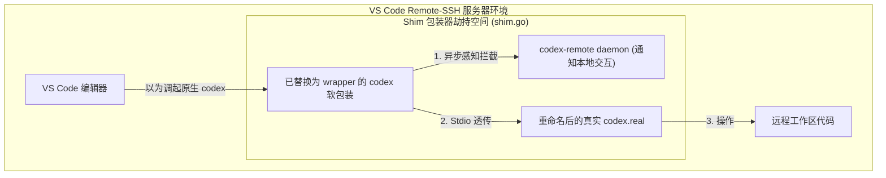

<details>
<summary>相关源文件</summary>

生成本页时使用的主要源文件：

- [internal/adapter/editor/settings.go](../../../project-repos/codex-remote-feishu/internal/adapter/editor/settings.go)
- [internal/adapter/editor/shim.go](../../../project-repos/codex-remote-feishu/internal/adapter/editor/shim.go)
- [internal/adapter/editor/detect.go](../../../project-repos/codex-remote-feishu/internal/adapter/editor/detect.go)

</details>

# VS Code Shim 编辑器联动与接管

如果飞书 Bot 的对话仅在远程独立运行，那么它只是一个聊天界面的机器人。为了让飞书 Bot 能够时刻感知开发者在 VS Code 中当前打开的文件、光标所在的方法，甚至自动跟随编辑器的活动焦点变化，系统在 `internal/adapter/editor` 下实现了一套极具工程创意的 **VS Code 联动接管（Takeover）机制**。

## 编辑器联动方案一：配置劫持 (editor_settings)

这是专门针对**桌面版（本机运行）VS Code** 提供的无损接管方案：

- **基本原理**：系统启动 `detect.go` 去扫描系统固定的 VS Code 配置存放目录（例如 macOS 上的 `~/Library/Application Support/Code/User/settings.json`）。
- **配置覆盖**：读取并解码该 JSON 文件，定位到编辑器 AI 插件的 CLI 执行路径属性（如 `chatgpt.cliExecutable`），将其修改为 `codex-remote` 的 `wrapper` 二进制路径。
- **效果**：当开发者在 VS Code 界面中向 AI 助手提问时，VS Code 会直接调起我们的 `wrapper` 可执行文件。`wrapper` 启动后捕获输入并转交后台的 `daemon`，实现了完全透明的流量接管。

Sources: [internal/adapter/editor/settings.go:1-60](../../../project-repos/codex-remote-feishu/internal/adapter/editor/settings.go#L1-L60)

<details class="source-snippets">
<summary>引用源码</summary>

<!-- source-snippets:start -->

#### `internal/adapter/editor/settings.go:1-60`

```go
package editor

import (
	"encoding/json"
	"os"
	"path/filepath"
)

func PatchVSCodeSettings(settingsPath string, executable string) error {
	if err := os.MkdirAll(filepath.Dir(settingsPath), 0o755); err != nil {
		return err
	}

	settings := map[string]any{}
	if raw, err := os.ReadFile(settingsPath); err == nil && len(raw) > 0 {
		settings, err = decodeVSCodeSettings(raw)
		if err != nil {
			return err
		}
	}
	settings["chatgpt.cliExecutable"] = executable

	encoded, err := json.MarshalIndent(settings, "", "  ")
	if err != nil {
		return err
	}
	encoded = append(encoded, '\n')
	return os.WriteFile(settingsPath, encoded, 0o644)
}

func ClearVSCodeSettingsExecutable(settingsPath string) error {
	raw, err := os.ReadFile(settingsPath)
	if err != nil {
		if os.IsNotExist(err) {
			return nil
		}
		return err
	}

	settings, err := decodeVSCodeSettings(raw)
	if err != nil {
		return err
	}
	delete(settings, "chatgpt.cliExecutable")

	encoded, err := json.MarshalIndent(settings, "", "  ")
	if err != nil {
		return err
	}
	encoded = append(encoded, '\n')
	return os.WriteFile(settingsPath, encoded, 0o644)
}
```

<!-- source-snippets:end -->
</details>

## 编辑器联动方案二：软包装物理硬接管 (managed_shim)

> [!IMPORTANT]
> 在远程开发环境（如 **VS Code Remote-SSH**、**Codespaces** 或 **Docker Containers**）中，VS Code 的 User 级 settings.json 配置很难直接控制远端服务器上独立启动的插件二进制路径，或者在多租户环境下一刀切配置会引发冲突。

为此，系统自研了被称为 `managed_shim` 的物理替换硬接管方案：

1. **自动探测物理入口**：
   在 `detect.go` 中，系统会递归扫描当前用户家目录下的 VS Code Extensions 目录（例如 `~/.vscode-server/extensions/` 或 `~/.vscode/extensions/`），寻找特定的 Codex/ChatGPT 扩展包，并定位其自带的核心 `codex` 物理可执行文件路径。
2. **物理二进制调包（Takeover Shim）**：
   - 将原生的 `codex` 可执行文件物理重命名为 `codex.real`（留作真实的最终执行体）。
   - 将 `codex-remote` 的 wrapper 复制到原 `codex` 的物理路径上进行覆盖。
3. **流程拦截与自愈**：
   当远程 VS Code 以为自己在调起原生 `codex` 时，实际启动的是我们的劫持 wrapper。wrapper 在启动后，会自动读取 `config.json` 中配置的 WebSocket 地址，通知后台 `daemon` 编辑器端发生了交互（`local.interaction.observed`），并在本地优雅地将指令流转交回原生的 `codex.real` 执行。这在对编辑器没有任何感知的前提下，完成了流量的完美拦截。



Sources: [internal/adapter/editor/shim.go:1-80](../../../project-repos/codex-remote-feishu/internal/adapter/editor/shim.go#L1-L80)

<details class="source-snippets">
<summary>引用源码</summary>

<!-- source-snippets:start -->

#### `internal/adapter/editor/shim.go:1-80`

```go
package editor

import (
	"fmt"
	"os"
	"path/filepath"
	"strings"

	"github.com/kxn/codex-remote-feishu/internal/managedshim"
	managedshimembed "github.com/kxn/codex-remote-feishu/internal/managedshim/embed"
)

type PatchBundleEntrypointOptions struct {
	EntrypointPath   string
	InstallStatePath string
	ConfigPath       string
	InstanceID       string
}

func ManagedShimRealBinaryPath(entrypointPath string) string {
	return managedshim.RealBinaryPath(entrypointPath)
}

func ManagedShimSidecarPath(entrypointPath string) string {
	return managedshim.SidecarPath(entrypointPath)
}

func PatchBundleEntrypoint(opts PatchBundleEntrypointOptions) error {
	entrypointPath := strings.TrimSpace(opts.EntrypointPath)
	if entrypointPath == "" {
		return fmt.Errorf("bundle entrypoint path is required")
	}
	sidecar := managedshim.Sidecar{
		InstallStatePath: opts.InstallStatePath,
		ConfigPath:       opts.ConfigPath,
		InstanceID:       opts.InstanceID,
	}
	if !managedshim.SidecarValid(sidecar) {
		return fmt.Errorf("managed shim install requires install state path and config path")
	}
	if err := os.MkdirAll(filepath.Dir(entrypointPath), 0o755); err != nil {
		return err
	}

	realBinaryPath := ManagedShimRealBinaryPath(entrypointPath)
	renamedOriginal := false
	if _, err := os.Stat(realBinaryPath); err != nil {
		if !os.IsNotExist(err) {
			return err
		}
		if _, statErr := os.Stat(entrypointPath); statErr != nil {
			return statErr
		}
		if err := os.Rename(entrypointPath, realBinaryPath); err != nil {
			return err
		}
		renamedOriginal = true
	}

	restoreOriginal := func() {
		if !renamedOriginal {
			return
		}
		_ = os.Remove(entrypointPath)
		_ = os.Rename(realBinaryPath, entrypointPath)
	}

	if err := managedshimembed.WriteExecutable(entrypointPath); err != nil {
		restoreOriginal()
		return err
	}
	if err := managedshim.WriteSidecar(ManagedShimSidecarPath(entrypointPath), sidecar); err != nil {
		restoreOriginal()
		return err
	}
	return nil
}
```

<!-- source-snippets:end -->
</details>

## VS Code 扩展 Bundle 自动升级自愈 (reinstall-shim)

在 VS Code 自动升级时，会动态下载全新的 Extensions 目录。此时原先被我们物理替换的 `codex` 包装器会被新下载的官方原生文件覆盖，导致接管失效。
- 为了应对该情况，安装器与配置后台（Admin UI）提供了 `/upgrade-shim` 与 `reinstall-shim` 动作。
- 当 `daemon` 周期性检测到扩展版本发生漂移或接管失效时，会在后台静默重新执行探测与重命名替换流程，从而保障了长期运行的稳定性。

Sources: [internal/adapter/editor/detect.go:1-60](../../../project-repos/codex-remote-feishu/internal/adapter/editor/detect.go#L1-L60)

<details class="source-snippets">
<summary>引用源码</summary>

<!-- source-snippets:start -->

#### `internal/adapter/editor/detect.go:1-60`

```go
package editor

import (
	"crypto/sha256"
	"io"
	"os"
	"path/filepath"
	"runtime"
	"strings"

	"github.com/kxn/codex-remote-feishu/internal/managedshim"
	managedshimembed "github.com/kxn/codex-remote-feishu/internal/managedshim/embed"
)

const (
	ManagedShimKindTiny   = "tiny_shim"
	ManagedShimKindLegacy = "legacy_copied_binary"
)

type VSCodeSettingsStatus struct {
	Path          string `json:"path"`
	Exists        bool   `json:"exists"`
	CLIExecutable string `json:"cliExecutable,omitempty"`
	ParseError    string `json:"parseError,omitempty"`
	MatchesBinary bool   `json:"matchesBinary"`
}

type ManagedShimStatus struct {
	Entrypoint              string `json:"entrypoint"`
	Exists                  bool   `json:"exists"`
	Kind                    string `json:"kind,omitempty"`
	RepoManaged             bool   `json:"repoManaged"`
	RealBinaryPath          string `json:"realBinaryPath,omitempty"`
	RealBinaryExists        bool   `json:"realBinaryExists"`
	SidecarPath             string `json:"sidecarPath,omitempty"`
	SidecarExists           bool   `json:"sidecarExists"`
	SidecarValid            bool   `json:"sidecarValid"`
	SidecarInstallStatePath string `json:"sidecarInstallStatePath,omitempty"`
	SidecarConfigPath       string `json:"sidecarConfigPath,omitempty"`
	SidecarInstanceID       string `json:"sidecarInstanceId,omitempty"`
	Installed               bool   `json:"installed"`
	MatchesBinary           bool   `json:"matchesBinary"`
}

func DetectVSCodeSettings(settingsPath, executable string) (VSCodeSettingsStatus, error) {
	status := VSCodeSettingsStatus{Path: settingsPath}
	raw, err := os.ReadFile(settingsPath)
	if err != nil {
		if os.IsNotExist(err) {
			return status, nil
		}
		return status, err
	}
	status.Exists = true

	settings, err := decodeVSCodeSettings(raw)
	if err != nil {
		status.ParseError = err.Error()
		return status, nil
	}
```

<!-- source-snippets:end -->
</details>

## 相关页面

- [系统架构与统一二进制模型](system-architecture.md) — 了解 wrapper 与 daemon 通信的数据格式
- [Orchestrator 协管核心与运行态集群](orchestrator-core.md) — 探究编辑器交互如何触发本地优先调度（handoff）
- [WebSetup 与引导安装生命周期](setup-install.md) — 探究 Shim 劫持与安装器的联动机制
