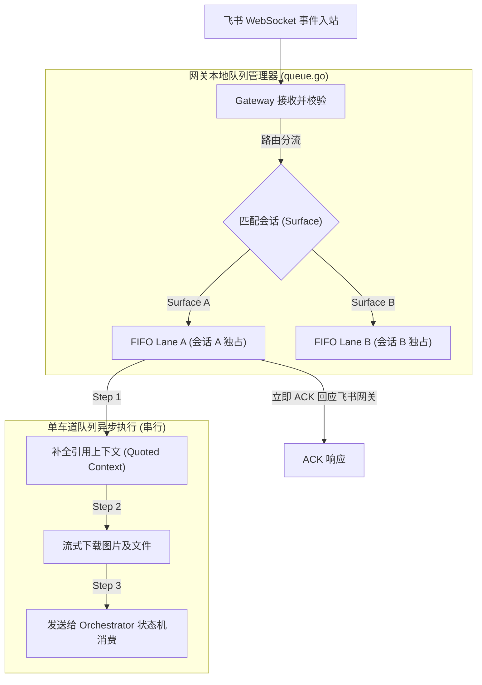

<details>
<summary>相关源文件</summary>

生成本页时使用的主要源文件：

- [internal/adapter/feishu/gateway.go](../../../project-repos/codex-remote-feishu/internal/adapter/feishu/gateway.go)
- [internal/adapter/feishu/queue.go](../../../project-repos/codex-remote-feishu/internal/adapter/feishu/queue.go)
- [docs/draft/feishu-request-delivery-reliability-design.md](../../../project-repos/codex-remote-feishu/docs/draft/feishu-request-delivery-reliability-design.md)

</details>

# 飞书网关 Early ACK 与 FIFO 队列

在飞书开放平台的长连接网关中，如果 Bot 进程在收到消息后的 **3 秒内** 未向飞书服务端返回 ACK 确认响应，飞书网关会判定此条消息发送超时或丢失，并会在后台开启**指数退避的高频重发机制**。对于大模型这种往往需要长达数秒甚至数分钟才能完成一轮执行的慢消费服务，如何规避 3s 超时引发的消息洪峰重发，是一个极具工程挑战的课题。

`codex-remote-feishu` 通过在飞书网关适配层设计 **Early ACK（前置确认响应）** 以及 **FIFO Lane（单车道先进先出队列）** 彻底解决了连接可靠性问题。

## Early ACK（前置确认响应）机制

当飞书的入站事件流（Event Stream）到达网关 `gateway.go` 时，系统依据消息类型实施分级前置响应策略：

- **轻量控制命令（如菜单切换、卡片点击回调、斜杠配置命令）**：
  直接在当前处理 tick 内完成解析，并在立即返回 ACK 响应（HTTP 200 或 WS ACK）的同时执行内存操作。
- **高风险复杂用户消息（如文本输入、富文本 Post、图片及转发文件等需要调起大模型运行的任务）**：
  不等待任何工具调用或大模型响应。系统仅对消息信封（Envelope）进行最小安全鉴权与格式解析，只要确定消息结构完整，**在将其成功推进本地 FIFO 单车道队列的瞬间，立即向飞书网关返回 ACK 响应**。

通过这种“先确认入队、后异步消费”的 Early ACK 策略，网关可以在几十毫秒内完成响应，从根源上阻止了飞书网关开启消息重发重试。

Sources: [internal/adapter/feishu/gateway.go:1-120](../../../project-repos/codex-remote-feishu/internal/adapter/feishu/gateway.go#L1-L120)

<details class="source-snippets">
<summary>引用源码</summary>

<!-- source-snippets:start -->

#### `internal/adapter/feishu/gateway.go:1-120`

```go
package feishu

import (
	"context"
	"sync"

	lark "github.com/larksuite/oapi-sdk-go/v3"
	larkim "github.com/larksuite/oapi-sdk-go/v3/service/im/v1"
	larkimv2 "github.com/larksuite/oapi-sdk-go/v3/service/im/v2"

	"github.com/kxn/codex-remote-feishu/internal/core/control"
)

type ActionHandler func(context.Context, control.Action) *ActionResult

type ActionResult struct {
	ReplaceCurrentCard *Operation
}

type Gateway interface {
	Start(context.Context, ActionHandler) error
	Apply(context.Context, []Operation) error
}

type NopGateway struct{}

func (NopGateway) Start(context.Context, ActionHandler) error { return nil }
func (NopGateway) Apply(context.Context, []Operation) error   { return nil }

type LiveGatewayConfig struct {
	GatewayID      string
	AppID          string
	AppSecret      string
	Domain         string
	TempDir        string
	UseSystemProxy bool
}

type LiveGateway struct {
	config LiveGatewayConfig
	client *lark.Client
	broker *FeishuCallBroker

	downloadImageFn    func(context.Context, string, string) (string, string, error)
	downloadFileFn     func(context.Context, string, string, string) (string, error)
	uploadImagePathFn  func(context.Context, string) (string, error)
	uploadImageBytesFn func(context.Context, []byte) (string, error)
	uploadFilePathFn   func(context.Context, string) (string, string, error)
	uploadVideoPathFn  func(context.Context, string) (string, string, error)
	fetchMessageFn     func(context.Context, string) (*gatewayMessage, error)
	createMessageFn    func(context.Context, string, string, string, string) (*larkim.CreateMessageResp, error)
	replyMessageFn     func(context.Context, string, string, string) (*larkim.ReplyMessageResp, error)
	patchMessageFn     func(context.Context, string, string) (*larkim.PatchMessageResp, error)
	deleteMessageFn    func(context.Context, string) (*larkim.DeleteMessageResp, error)
	createReactionFn   func(context.Context, string, string) (*larkim.CreateMessageReactionResp, error)
	deleteReactionFn   func(context.Context, string, string) (*larkim.DeleteMessageReactionResp, error)
	botTimeSensitiveFn func(context.Context, string, bool, []string) (*larkimv2.BotTimeSentiveFeedCardResp, error)

	mu        sync.Mutex
	stateHook func(GatewayState, error)
	reactions map[string]string
	messages  map[string]string
}

type gatewayMessage struct {
	MessageID      string
	MessageType    string
	Content        string
	Deleted        bool
	UpperMessageID string
	SenderID       string
	SenderType     string
	Children       []*gatewayMessage
}

type feishuTextContent struct {
	Text string `json:"text"`
}

type feishuPostContent struct {
	Title   string             `json:"title"`
	Content [][]feishuPostNode `json:"content"`
}

type feishuLocalizedPostContent struct {
	ZhCN feishuPostContent `json:"zh_cn"`
}

type feishuPostNode struct {
	Tag       string `json:"tag"`
	Text      string `json:"text"`
	Href      string `json:"href"`
	UserID    string `json:"user_id"`
	UserName  string `json:"user_name"`
	ImageKey  string `json:"image_key"`
	EmojiType string `json:"emoji_type"`
	Language  string `json:"language"`
}

func NewLiveGateway(config LiveGatewayConfig) *LiveGateway {
	config.GatewayID = normalizeGatewayID(config.GatewayID)
	client := NewLarkClient(config.AppID, config.AppSecret)
	gateway := &LiveGateway{
		config:    config,
		client:    client,
		broker:    NewFeishuCallBroker(config.GatewayID, client),
		reactions: map[string]string{},
		messages:  map[string]string{},
	}
	gateway.downloadImageFn = gateway.downloadImage
	gateway.downloadFileFn = gateway.downloadFile
	gateway.uploadImagePathFn = gateway.uploadImagePath
	gateway.uploadImageBytesFn = gateway.uploadImageBytes
	gateway.uploadFilePathFn = gateway.uploadFilePath
	gateway.uploadVideoPathFn = gateway.uploadVideoPath
	gateway.fetchMessageFn = gateway.fetchMessage
	gateway.createMessageFn = gateway.createMessage
	gateway.replyMessageFn = gateway.replyMessage
	gateway.patchMessageFn = gateway.patchMessage
	gateway.deleteMessageFn = gateway.deleteMessage
```

<!-- source-snippets:end -->
</details>

## Gateway-Local FIFO Lane 串行队列

为了保证每一个会话（Surface）内的消息逻辑顺序不被打乱，系统在 `queue.go` 中开发了基于会话隔离的先进先出排队通道（FIFO Lane）：



### 单车道 FIFO 队列的运行细节

1. **分会话隔离（Per-Surface isolation）**：
   系统根据消息的 `chat_id` 和 `thread_id` 拼装成 Surface 标识，每一个 Surface 拥有自己完全独立的单车道单向 FIFO 队列（FIFO Lane）。
2. **入队即确认（Ack-on-Enqueue）**：
   消息一入队，立即响应 ACK，阻塞式大模型消费交由 Lane 的 Go 协程异步处理。
3. **队列内有序处理（In-Lane serial execution）**：
   在 FIFO 协程内部，消息将串行执行耗时操作：
   - 检查消息是否引用了历史卡片，如果是，异步补全引用上下文（`quoted-input` 补查）。
   - 如果消息含有图片/文件，拉取飞书媒体流并进行本地缓存下载。
   - 全部前置数据就绪后，将拼装好的动作 `control.Action` 推送给核心 Orchestrator 状态机进行消费。
4. **消息防抖与点赞跟进**：
   在单车道运行期间，如果用户快速连发了多条消息，前一条消息在 Orchestrator 中正在执行，后一条消息会在 FIFO 队列中排队。对于排队中的消息，系统支持以下交互策略：
   - **打断/抢占**：发送 `/stop` 指令，能够一键清空对应 Surface 队列中尚未发出的消息并强杀当前正在运行的 turn。
   - **点赞升级**：排队中的文字消息如果尚未被大模型消费，用户可以在飞书端对它点赞（`ThumbsUp`），系统会自动将其升级为对当前正在运行 turn 的“跟进/指导 (Steer)”提示词，而不会另开新的对话轮次。

Sources: [internal/adapter/feishu/queue.go:1-90](../../../project-repos/codex-remote-feishu/internal/adapter/feishu/queue.go#L1-L90)

<details class="source-snippets">
<summary>引用源码</summary>

<!-- source-snippets:start -->

#### `internal/adapter/feishu/queue.go:1-90`

> 未找到引用文件：`internal/adapter/feishu/queue.go`

<!-- source-snippets:end -->
</details>

## 相关页面

- [系统架构与统一二进制模型](system-architecture.md) — 了解消息进入网关后的流转通道
- [交互式卡片渲染与分发](interactive-cards.md) — 消息经 Orchestrator 处理后如何再次投影成飞书卡片
- [Orchestrator 协管核心与运行态集群](orchestrator-core.md) — 探究排队机制在状态机层面的体现
