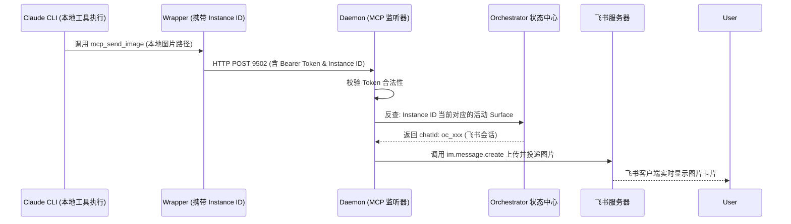

<details>
<summary>相关源文件</summary>

生成本页时使用的主要源文件：

- [internal/app/daemon/tool_mcp.go](../../../project-repos/codex-remote-feishu/internal/app/daemon/tool_mcp.go)
- [internal/app/daemon/tool_service.go](../../../project-repos/codex-remote-feishu/internal/app/daemon/tool_service.go)
- [docs/general/codex-mcp-app-server-protocol.md](../../../project-repos/codex-remote-feishu/docs/general/codex-mcp-app-server-protocol.md)

</details>

# 本地飞书 MCP 工具监听器

当本地运行的 AI 代理（如 Codex/Claude）执行诸如截取屏幕、绘制图表或导出代码报告等工具时，它通常只持有本地文件系统路径。为了让这些新生成的数据成果实时呈现在飞书聊天窗口中，大模型需要一种通用的媒介进行文件投递。

宿主进程在本地独立启动了一个运行在 `127.0.0.1:9502` 端口上的**本地飞书 MCP（Model Context Protocol）工具监听服务**。它将本地工具执行与云端飞书卡片无缝打通。

## loopback-only 与 Bearer Token 强安全防线

由于该 MCP 服务暴露了发送飞书消息、上传本地敏感文件等高权限接口，其网络层和安全层被设计为 fail-closed：

- **环回限制（Loopback-only）**：
  服务底层 Socket 强行绑定在 `127.0.0.1` 环回接口。这意味着它不接受任何来自外部局域网或公网的入站连接，杜绝了网络监听攻击。
- **Bearer Token 校验**：
  在 `daemon` 启动时，会在内存中随机生成一个高强度的认证 Token。任何调用者 `wrapper` 在发起 MCP 请求时，必须在 HTTP Header 中携带 `Authorization: Bearer <token>` 凭证。无凭证或凭证错误的请求会被直接拦截并抛出 403。

Sources: [internal/app/daemon/tool_mcp.go:1-50](../../../project-repos/codex-remote-feishu/internal/app/daemon/tool_mcp.go#L1-L50)

<details class="source-snippets">
<summary>引用源码</summary>

<!-- source-snippets:start -->

#### `internal/app/daemon/tool_mcp.go:1-50`

```go
package daemon

import (
	"context"
	"encoding/json"
	"log"
	"net/http"
	"strings"
	"time"

	"github.com/modelcontextprotocol/go-sdk/jsonrpc"
	"github.com/modelcontextprotocol/go-sdk/mcp"
)

const toolMCPServerName = "codex-remote-feishu-tool-service"

const toolMCPSessionTimeout = 30 * time.Minute
const toolCallerInstanceIDQueryParam = "codex_remote_instance_id"

type toolCallerInstanceIDContextKey struct{}

func (a *App) newToolRuntimeHandler() http.Handler {
	server := a.newToolMCPServer()
	handler := mcp.NewStreamableHTTPHandler(func(*http.Request) *mcp.Server {
		return server
	}, &mcp.StreamableHTTPOptions{
		JSONResponse:   true,
		SessionTimeout: toolMCPSessionTimeout,
	})
	return a.requireToolAuth(handler)
}

func withToolCallerInstanceID(ctx context.Context, instanceID string) context.Context {
	instanceID = strings.TrimSpace(instanceID)
	if instanceID == "" {
		return ctx
	}
	return context.WithValue(ctx, toolCallerInstanceIDContextKey{}, instanceID)
}

func toolCallerInstanceIDFromContext(ctx context.Context) string {
	if ctx == nil {
		return ""
	}
	value, _ := ctx.Value(toolCallerInstanceIDContextKey{}).(string)
	return strings.TrimSpace(value)
}

func (a *App) newToolMCPServer() *mcp.Server {
	version := strings.TrimSpace(a.serverIdentity.Version)
```

<!-- source-snippets:end -->
</details>

## 基于 Caller Instance-ID 的 Surface 动态路由

飞书的 `chat_id` 是千变万化的，本地运行的真实 `codex` 子进程显然不可能硬编码这些网络 ID。系统通过**会话状态绑定关联（Caller Context Mapping）** 解决了这一难题：

1. **发布携带 Instance-ID 的 MCP 协议源**：
   在 `wrapper` 调起大模型子进程并宣告 MCP 工具源时，会往工具链的元数据中注入当前运行实例的唯一主键：`codex_remote_instance_id`。
2. **带参调用**：
   当大模型调起飞书相关的 MCP 投递工具时，请求会通过 loopback 路由到宿主的 `9502` 端口，并隐式携带该 `instance_id` 标志。
3. **动态反查定位**：
   `tool_service.go` 接收到调用请求后，拒绝由模型传入任何 `chat_id`，而是**完全使用宿主侧的实例状态表作为唯一事实源（Source of Truth）**：
   - 提取该请求的 `instance_id`。
   - 反向查询 Orchestrator 中对应实例当前处于活跃执行态（`active remote turn`）或排队态（`pending remote turn`）的飞书 Surface。
   - 找到正确的 `chat_id` 与消息 Thread 线程。
   - 投递资源，从而彻底防止了大模型由于混淆 ID 将敏感文件投递到错误群聊的风险。



Sources: [internal/app/daemon/tool_service.go:1-70](../../../project-repos/codex-remote-feishu/internal/app/daemon/tool_service.go#L1-L70)

<details class="source-snippets">
<summary>引用源码</summary>

<!-- source-snippets:start -->

#### `internal/app/daemon/tool_service.go:1-70`

```go
package daemon

import (
	"context"
	"crypto/subtle"
	"encoding/json"
	"errors"
	"log"
	"net/http"
	"os"
	"path/filepath"
	"strings"

	"github.com/kxn/codex-remote-feishu/internal/adapter/feishu"
	"github.com/kxn/codex-remote-feishu/internal/app/adminauth"
	"github.com/kxn/codex-remote-feishu/internal/core/orchestrator"
	"github.com/kxn/codex-remote-feishu/internal/core/state"
)

const feishuSurfaceResolverToolName = "feishu_resolve_surface_context"
const feishuSendIMFileToolName = "feishu_send_im_file"
const feishuSendIMImageToolName = "feishu_send_im_image"
const feishuSendIMVideoToolName = "feishu_send_im_video"
const feishuReadDriveFileCommentsToolName = "feishu_read_drive_file_comments"

const feishuSendIMFileDescription = "Send a local file to the Feishu conversation that started the current remote turn. Use this when the artifact should be delivered as a downloadable file rather than rendered inline. For screenshots and other user-facing images, prefer feishu_send_im_image. For MP4 videos that should render as videos in chat, prefer feishu_send_im_video. Use a real local file path; the target Feishu conversation is resolved automatically from the running turn."
const feishuSendIMImageDescription = "Send a local image to the Feishu conversation that started the current remote turn as an inline IM image message. Use this proactively when you created or saved a screenshot, visual diff, rendered preview, chart, mockup, or another image artifact that would directly help the current conversation. Prefer this tool over feishu_send_im_file for PNG, JPEG, GIF, WebP, or BMP images because the image will render directly in chat. Use a real local image path; the target Feishu conversation is resolved automatically from the running turn."
const feishuSendIMVideoDescription = "Send a local MP4 video to the Feishu conversation that started the current remote turn as an inline IM video message. Use this when the artifact should render as a video in chat instead of appearing as a downloadable file attachment. Use a real local .mp4 file path; the target Feishu conversation is resolved automatically from the running turn."
const feishuReadDriveFileCommentsDescription = "Read comments from a Feishu file or document URL using the Feishu app context for the conversation that started the current remote turn. Use this when the user gives you a Feishu link, or asks you to review comments on a markdown preview link that was already uploaded to Feishu. Pass the exact Feishu URL; this tool will extract the token and file type for supported URL forms such as /file/, /drive/file/, /docx/, /doc/, /sheets/, and /slides/. Do not manually extract tokens, and do not guess from wiki URLs in this version."

type toolDefinition struct {
	Name        string         `json:"name"`
	Description string         `json:"description"`
	InputSchema map[string]any `json:"inputSchema"`
}

type toolError struct {
	Code      string `json:"code"`
	Message   string `json:"message"`
	Retryable bool   `json:"retryable,omitempty"`
}

type toolErrorPayload struct {
	Error toolError `json:"error"`
}

type resolvedToolSurfaceContext struct {
	SurfaceSessionID   string
	Platform           string
	GatewayID          string
	ChatID             string
	ActorUserID        string
	ProductMode        string
	AttachedInstanceID string
	SelectedThreadID   string
	RouteMode          string
	WorkspaceKey       string
	WorkspaceRoot      string
	InstanceSource     string
	InstanceManaged    bool
	Attached           bool
}

func toolDefinitions() []toolDefinition {
	return []toolDefinition{
		{
			Name:        feishuSendIMFileToolName,
			Description: feishuSendIMFileDescription,
			InputSchema: map[string]any{
				"type": "object",
```

<!-- source-snippets:end -->
</details>

## 内置飞书富媒体投递工具集

本地监听服务自带了三个专为大模型设计的 MCP 标准工具函数，全部在 `tool_mcp.go` 中实现：

- **`feishu_send_im_image`**：
  读取本地指定的图片路径，自动将其上传为飞书图片资源，并作为卡片中的富媒体块流式追加在当前会话的 thread 中。
- **`feishu_send_im_video`**：
  上传并发送 MP4 等格式的本地视频。
- **`feishu_send_im_file`**：
  投递 zip 包、代码文档或 PDF，自动调用飞书云文档上传接口，让用户在聊天界面直接获得飞书云盘在线预览框。

Sources: [internal/app/daemon/tool_mcp.go:51-120](../../../project-repos/codex-remote-feishu/internal/app/daemon/tool_mcp.go#L51-L120)

<details class="source-snippets">
<summary>引用源码</summary>

<!-- source-snippets:start -->

#### `internal/app/daemon/tool_mcp.go:51-120`

```go
	if version == "" {
		version = "dev"
	}
	server := mcp.NewServer(&mcp.Implementation{
		Name:    toolMCPServerName,
		Version: version,
	}, nil)
	for _, definition := range toolDefinitions() {
		definition := definition
		server.AddTool(&mcp.Tool{
			Name:        definition.Name,
			Description: definition.Description,
			InputSchema: definition.InputSchema,
		}, func(ctx context.Context, req *mcp.CallToolRequest) (*mcp.CallToolResult, error) {
			return a.handleMCPToolCall(ctx, definition.Name, req)
		})
	}
	return server
}

func (a *App) handleMCPToolCall(ctx context.Context, toolName string, req *mcp.CallToolRequest) (*mcp.CallToolResult, error) {
	arguments, err := decodeMCPToolArguments(req)
	if err != nil {
		return nil, err
	}

	var (
		result any
		apiErr *toolError
	)
	switch strings.TrimSpace(toolName) {
	case feishuSendIMFileToolName:
		result, apiErr = a.sendIMFileTool(ctx, arguments)
	case feishuSendIMImageToolName:
		result, apiErr = a.sendIMImageTool(ctx, arguments)
	case feishuSendIMVideoToolName:
		result, apiErr = a.sendIMVideoTool(ctx, arguments)
	case feishuReadDriveFileCommentsToolName:
		result, apiErr = a.readDriveFileCommentsTool(ctx, arguments)
	default:
		return nil, &jsonrpc.Error{
			Code:    jsonrpc.CodeMethodNotFound,
			Message: "unknown tool",
		}
	}
	if apiErr != nil {
		log.Printf("tool call: tool=%s status=error code=%s message=%s", toolName, apiErr.Code, apiErr.Message)
		return newMCPToolErrorResult(*apiErr), nil
	}
	return newMCPToolResult(result), nil
}

func decodeMCPToolArguments(req *mcp.CallToolRequest) (map[string]any, error) {
	if len(req.Params.Arguments) == 0 {
		return map[string]any{}, nil
	}
	var arguments map[string]any
	if err := json.Unmarshal(req.Params.Arguments, &arguments); err != nil {
		return nil, &jsonrpc.Error{
			Code:    jsonrpc.CodeInvalidParams,
			Message: "invalid tool arguments",
		}
	}
	if arguments == nil {
		arguments = map[string]any{}
	}
	return arguments, nil
}

func newMCPToolResult(payload any) *mcp.CallToolResult {
```

<!-- source-snippets:end -->
</details>

## 相关页面

- [Orchestrator 协管核心与运行态集群](orchestrator-core.md) — 了解 active remote turn 状态管理的物理位置
- [交互式卡片渲染与分发](interactive-cards.md) — 了解投递出去的图片是如何在飞书卡片中拼装展现的
- [VS Code Shim 编辑器联动与接管](editor-takeover.md) — 探究编辑器环境下工具调用的路径变化
