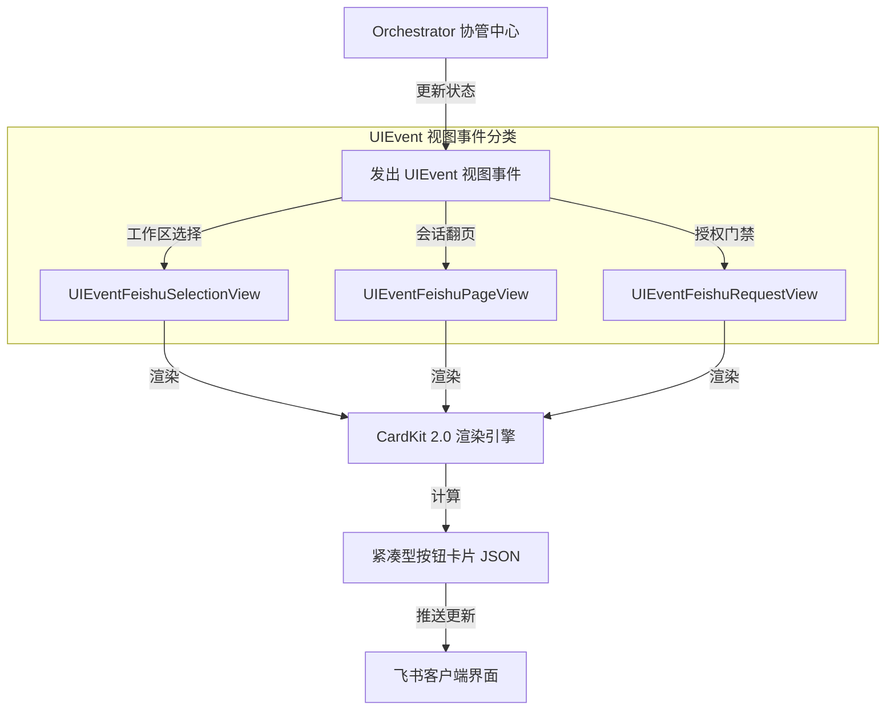

<details>
<summary>相关源文件</summary>

生成本页时使用的主要源文件：

- [internal/core/renderer/planner.go](../../../project-repos/codex-remote-feishu/internal/core/renderer/planner.go)
- [internal/core/control/event.go](../../../project-repos/codex-remote-feishu/internal/core/control/event.go)
- [internal/adapter/feishu/card_renderer.go](../../../project-repos/codex-remote-feishu/internal/adapter/feishu/card_renderer.go)
- [docs/general/feishu-card-ui-state-machine.md](../../../project-repos/codex-remote-feishu/docs/general/feishu-card-ui-state-machine.md)

</details>

# CardKit 2.0 渲染与交互状态机

为了让飞书端的卡片交互像桌面级 IDE 一样流畅，系统摒弃了单调的富文本推送方式，设计了一套**基于 UI 状态机驱动的飞书 CardKit 2.0 交互式卡片渲染系统**。这套系统可以精准控制计划展示、工具调用进度条、模型参数切换面板以及旧卡片的过期注销行为。

## 助手文本切分与流式分块 (planner.go)

在运行过程中，`wrapper` 返回的大模型正文是一个连续的、混杂着 Markdown 和工具执行状态的文本流。为了在飞书中优雅呈现，`renderer/planner.go` 充当了流式切分器的角色：

- **技术原理**：它在内存中实时扫描 `fenced code block`（代码围栏如 ` ```go `）的开启与闭合。
- **动态切块**：将最终的文本流切分为结构清晰的“文本块”与“代码段/文件列表项”，以 append-only 的形式流式累加。这让用户能够在消息卡片上清晰地扫读到结构化的代码片段，而不是凌乱的纯文本。

Sources: [internal/core/renderer/planner.go:1-40](../../../project-repos/codex-remote-feishu/internal/core/renderer/planner.go#L1-L40)

<details class="source-snippets">
<summary>引用源码</summary>

<!-- source-snippets:start -->

#### `internal/core/renderer/planner.go:1-40`

```go
package renderer

import (
	"fmt"
	"strings"

	"github.com/kxn/codex-remote-feishu/internal/core/render"
)

type Planner struct{}

func NewPlanner() *Planner {
	return &Planner{}
}

func (p *Planner) PlanAssistantBlocks(surfaceID, instanceID, threadID, turnID, itemID, text string) []render.Block {
	text = strings.ReplaceAll(text, "\r\n", "\n")
	text = strings.TrimSpace(text)
	if text == "" {
		return nil
	}
	return []render.Block{{
		ID:               fmt.Sprintf("%s-1", itemID),
		SurfaceSessionID: surfaceID,
		InstanceID:       instanceID,
		ThreadID:         threadID,
		TurnID:           turnID,
		ItemID:           itemID,
		Kind:             render.BlockAssistantMarkdown,
		Text:             text,
	}}
}
```

<!-- source-snippets:end -->
</details>

## UIEvent 读模型与交互状态机

宿主并不直接让业务逻辑操作飞书 API，而是定义了清晰的中间视图事件 `UIEvent`（位于 `control/event.go`）。这些事件代表了当前交互卡片所处的不同生命周期视图：

- **`UIEventFeishuSelectionView`**：
  目标接管选择器视图。渲染当前可接管的工作区目录与活动会话（Thread）的按钮列表。
- **`UIEventFeishuPageView`**：
  历史会话翻页与 Turn 详情视图。支持在飞书卡片上点击翻页、回溯之前的对话轮次。
- **`UIEventFeishuRequestView`**：
  等待确认的授权卡片视图。当模型执行敏感工具（如修改敏感文件）时，拦截执行流并弹出确认按钮。



Sources: [internal/core/control/event.go:1-80](../../../project-repos/codex-remote-feishu/internal/core/control/event.go#L1-L80)

<details class="source-snippets">
<summary>引用源码</summary>

<!-- source-snippets:start -->

#### `internal/core/control/event.go:1-80`

> 未找到引用文件：`internal/core/control/event.go`

<!-- source-snippets:end -->
</details>

## CardKit 2.0 紧凑按钮卡片设计规范

在 `card_renderer.go` 的卡片组装逻辑中，系统完全适配了飞书最新的 CardKit 2.0：

1. **紧凑按钮布局（Compact Buttons）**：
   卡片交互的核心设计原则是“主操作一行一个按钮，次要操作水平并列”。菜单卡片中不再重复堆砌“返回首页”等死链接，用户直接点击 Bot 左下角的 `menu` 斜杠快捷菜单即可快速重置交互。
2. **共享进度卡摘要（Progress Card Summary）**：
   在模型进行工具执行、网页搜索或执行 Bash 命令的慢速过程中，宿主会生成一张“过程共享卡”。该卡片并不平铺冗长的终端 Stdout，而是自动提取并展示为**结构化的执行计划摘要**（例如：`🔍 [Web 搜索] "Go 1.24" -> 🟢 [成功]`），极大提升了信息的扫读节奏。
3. **精准的 Thread 定位回复**：
   系统会保存触发大模型运行的原始消息 ID。大模型的最终回复（如代码分析、诊断建议）会**通过 Thread 回复机制直接发表在触发它的那条用户消息的正下方**。在群聊场景中，这避免了被其他聊天信息刷屏打断，使得代码评审上下文极其紧密。
4. **历史卡片过期熔断**：
   如果用户点击了老对话轮次的旧按钮或旧卡片，飞书网关发起的点击事件会在宿主被鉴权拦截。宿主检测到该 card-token 已过期，会在飞书上直接弹窗提示“此操作已过期，请重新发送指令”，彻底杜绝了状态错乱带来的越权或误操作风险。

Sources: [internal/adapter/feishu/card_renderer.go:1-120](../../../project-repos/codex-remote-feishu/internal/adapter/feishu/card_renderer.go#L1-L120)

<details class="source-snippets">
<summary>引用源码</summary>

<!-- source-snippets:start -->

#### `internal/adapter/feishu/card_renderer.go:1-120`

```go
package feishu

import (
	"strings"

	"github.com/kxn/codex-remote-feishu/internal/adapter/feishu/cardtheme"
)

type cardEnvelopeVersion string

const (
	cardEnvelopeV2          cardEnvelopeVersion = "v2"
	cardTextTagPlainText                        = "plain_text"
	cardTextTagLarkMarkdown                     = "lark_md"
)

type cardDocument struct {
	Title       string
	TitleTag    string
	Subtitle    string
	SubtitleTag string
	ThemeKey    string
	Components  []cardComponent
}

type cardComponent interface {
	renderCardComponent(version cardEnvelopeVersion) map[string]any
}

type cardMarkdownComponent struct {
	Content string
}

type cardRawComponent struct {
	data map[string]any
}

func newCardDocument(title, themeKey string, components ...cardComponent) *cardDocument {
	return newCardDocumentWithHeader(title, cardTextTagPlainText, "", "", themeKey, components...)
}

func newCardDocumentWithHeader(title, titleTag, subtitle, subtitleTag, themeKey string, components ...cardComponent) *cardDocument {
	doc := &cardDocument{
		Title:       strings.TrimSpace(title),
		TitleTag:    normalizeCardTextTag(titleTag, cardTextTagPlainText),
		Subtitle:    strings.TrimSpace(subtitle),
		SubtitleTag: normalizeCardTextTag(subtitleTag, cardTextTagLarkMarkdown),
		ThemeKey:    strings.TrimSpace(themeKey),
		Components:  make([]cardComponent, 0, len(components)),
	}
	if doc.Subtitle == "" {
		doc.SubtitleTag = ""
	}
	for _, component := range components {
		if component == nil {
			continue
		}
		doc.Components = append(doc.Components, component)
	}
	return doc
}

func rawCardDocument(title, body, themeKey string, extraElements []map[string]any) *cardDocument {
	return rawCardDocumentWithHeader(title, cardTextTagPlainText, "", "", body, themeKey, extraElements)
}

func rawCardDocumentWithHeader(title, titleTag, subtitle, subtitleTag, body, themeKey string, extraElements []map[string]any) *cardDocument {
	components := make([]cardComponent, 0, len(extraElements)+1)
	if strings.TrimSpace(body) != "" {
		components = append(components, cardMarkdownComponent{Content: body})
	}
	for _, element := range extraElements {
		components = append(components, newRawCardComponent(element))
	}
	return newCardDocumentWithHeader(title, titleTag, subtitle, subtitleTag, themeKey, components...)
}

func newRawCardComponent(data map[string]any) cardComponent {
	return cardRawComponent{
		data: cloneCardMap(data),
	}
}

func (c cardMarkdownComponent) renderCardComponent(_ cardEnvelopeVersion) map[string]any {
	if strings.TrimSpace(c.Content) == "" {
		return nil
	}
	return map[string]any{
		"tag":     "markdown",
		"content": c.Content,
	}
}

func (c cardRawComponent) renderCardComponent(_ cardEnvelopeVersion) map[string]any {
	return cloneCardMap(c.data)
}

func renderOperationCard(operation Operation, version cardEnvelopeVersion) map[string]any {
	doc := operation.card
	if doc == nil {
		doc = rawCardDocumentWithHeader(
			operation.CardTitle,
			firstNonEmpty(strings.TrimSpace(operation.CardTitleTag), cardTextTagPlainText),
			operation.CardSubtitle,
			firstNonEmpty(strings.TrimSpace(operation.CardSubtitleTag), cardTextTagLarkMarkdown),
			operation.CardBody,
			operation.CardThemeKey,
			operation.CardElements,
		)
	}
	doc = withAttentionCardDocument(doc, operation.AttentionText, operation.AttentionUserID)
	if doc == nil {
		return nil
	}
	return renderCardDocument(doc, version, operation.CardUpdateMulti)
}

func (operation Operation) effectiveCardEnvelope() cardEnvelopeVersion {
	return cardEnvelopeV2
}
```

<!-- source-snippets:end -->
</details>

## 相关页面

- [飞书网关 Early ACK 与 FIFO 队列](feishu-gateway-queue.md) — 了解卡片动作回调在网关中的排队流程
- [Orchestrator 协管核心与运行态集群](orchestrator-core.md) — 探究 UIEvent 事件所依赖的全局状态
- [本地飞书 MCP 工具监听器](feishu-mcp-listener.md) — 探索模型工具是如何将媒体直接画进卡片中的
