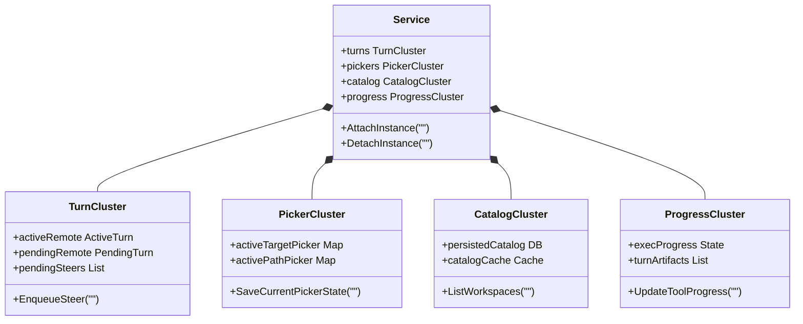

<details>
<summary>相关源文件</summary>

生成本页时使用的主要源文件：

- [internal/core/orchestrator/service.go](../../../project-repos/codex-remote-feishu/internal/core/orchestrator/service.go)
- [internal/core/orchestrator/service_dispatch_control.go](../../../project-repos/codex-remote-feishu/internal/core/orchestrator/service_dispatch_control.go)
- [internal/core/orchestrator/service_persisted_catalog.go](../../../project-repos/codex-remote-feishu/internal/core/orchestrator/service_persisted_catalog.go)

</details>

# Orchestrator 协管核心与运行态集群

在飞书 Bot 协同体系中，如何将云端（Feishu Surface 会话）、本地（VS Code 编辑器焦点）以及多个运行中的 AI 实例（Instaces 与 Threads）的状态完美调度并保证强一致性，是系统的核心挑战。`internal/core/orchestrator` 下的 `Service` 充当了整个系统的**唯一产品状态中心**。

## 显式运行时集群结构 (Runtime Clusters)

在早期的设计中，所有的会话路由、进程状态、队列等字段全部杂乱地平铺在 `Service` 的根结构体（struct）上，极易产生逻辑污染和交叉竞态。为了保证高内聚和低耦合，宿主在 `service.go` 中重构了数据结构，将相关的决策状态划分并收敛在四个显式的**运行态集群 (Runtime Clusters)** 之下：

### 1. `turns` 事务集群
专门负责管理远程会话的事件队列与 Turn 生命周期。包括：
- `activeRemote`：当前处于活跃执行态的 Turn。
- `pendingRemote`：处于等待状态的待执行 Turn。
- `pendingSteers`：积压在队列中，用户用来 steering 引导跟进的输入载荷。
- `compactTurns`：内存中缓存的整理过的历史 Turn 结构。

### 2. `pickers` 交互集群
负责处理特定 Surface 交互时的**瞬时会话状态**。包括工作区目录选择器（`target picker`）、文件选择器（`path picker`）以及会话历史回溯（`thread history`）。
> [!NOTE]
> 这些 picker 状态只在当前会话的交互操作和门禁回调期间存在于内存中，用于记录“此时此刻这台手机客户端点到了哪一步”，它们被归类在交互集群下，绝不作为全局领域状态写入持久化磁盘。

### 3. `catalog` 目录集群
负责解析并维护全局的工作空间、仓库及会话目录数据库，包括 `persisted catalog`（持久化目录记录）、`snapshot query` 快速过滤规则以及缓存失效调度机制。

### 4. `progress` 投影集群
负责将耗时的工具执行（`exec/tool progress`）、网页搜索（`search progress`）以及生成的文件成果（`turn artifact`）在运行期间产生的瞬时指标投影，并将其流式暴露给飞书 Projector。



Sources: [internal/core/orchestrator/service.go:1-80](../../../project-repos/codex-remote-feishu/internal/core/orchestrator/service.go#L1-L80)

<details class="source-snippets">
<summary>引用源码</summary>

<!-- source-snippets:start -->

#### `internal/core/orchestrator/service.go:1-80`

```go
package orchestrator

import (
	"strings"
	"time"

	"github.com/kxn/codex-remote-feishu/internal/core/agentproto"
	"github.com/kxn/codex-remote-feishu/internal/core/control"
	"github.com/kxn/codex-remote-feishu/internal/core/eventcontract"
	"github.com/kxn/codex-remote-feishu/internal/core/renderer"
	"github.com/kxn/codex-remote-feishu/internal/core/state"
	"github.com/kxn/codex-remote-feishu/internal/core/threadcatalogcontract"
)

type Config struct {
	TurnHandoffWait    time.Duration
	HeadlessLaunchWait time.Duration
	LocalPauseMaxWait  time.Duration
	DetachAbandonWait  time.Duration
	GitAvailable       bool
}

type Service struct {
	now                       func() time.Time
	config                    Config
	root                      *state.Root
	renderer                  *renderer.Planner
	nextQueueItemID           int
	nextImageID               int
	nextFileID                int
	nextPromptID              int
	nextRequestCommandID      int
	nextLocalRequestID        int
	nextHeadlessID            int
	nextAutoContinueEpisodeID int
	handoffUntil              map[string]time.Time
	pausedUntil               map[string]time.Time
	abandoningUntil           map[string]time.Time
	itemBuffers               map[string]*itemBuffer
	threadRefreshes           map[string]bool
	instanceClaims            map[string]*instanceClaimRecord
	workspaceClaims           map[string]*workspaceClaimRecord
	threadClaims              map[string]*threadClaimRecord
	surfaceUIRuntime          map[string]*surfaceUIRuntimeRecord
	turns                     *serviceTurnRuntime
	pickers                   *servicePickerRuntime
	catalog                   *serviceCatalogRuntime
	progress                  *serviceProgressRuntime
}

type itemBuffer struct {
	InstanceID string
	ThreadID   string
	TurnID     string
	ItemID     string
	ItemKind   string
	textChunks []string
	textValue  string
}

type turnPlanSnapshotRecord struct {
	SurfaceSessionID string
	InstanceID       string
	ThreadID         string
	TurnID           string
	Snapshot         *agentproto.TurnPlanSnapshot
}

type remoteTurnBinding struct {
	InstanceID            string
	SurfaceSessionID      string
	QueueItemID           string
	AutoContinueEpisodeID string
	AttemptTriggerKind    string
	DispatchPlan          agentproto.PromptDispatchPlan
	BootstrapNewThread    bool
	ThreadCommitted       bool
	SourceMessageID       string
	SourceMessagePreview  string
	ReplyToMessageID      string
```

<!-- source-snippets:end -->
</details>

## 领域持久化状态与交互态隔离

为了避免脏数据污染，Orchestrator 严格区分了**领域持久化状态**与**交互态/临时状态**：

- **领域持久化状态**（如 `InstanceRecord`、`ThreadRecord` 等）：
  代表系统的物理属性，仅在发生确定的 attach/detach、升级或创建新工作区时，才会通过 `Service` 写入本地磁盘。
- **交互态状态**（如当前的 Active Target Picker）：
  存储在 `pickers` 集群中。如果进程突然中断，这部分内存状态会自动随进程死掉，而不会导致磁盘配置文件破坏。这使得系统拥有极高的自愈与回滚属性，彻底消除了残留临时数据导致 Bot 开机状态错乱的工程隐患。

Sources: [internal/core/orchestrator/service_dispatch_control.go:1-60](../../../project-repos/codex-remote-feishu/internal/core/orchestrator/service_dispatch_control.go#L1-L60)

<details class="source-snippets">
<summary>引用源码</summary>

<!-- source-snippets:start -->

#### `internal/core/orchestrator/service_dispatch_control.go:1-60`

```go
package orchestrator

import (
	"strings"
	"time"

	"github.com/kxn/codex-remote-feishu/internal/core/control"
	"github.com/kxn/codex-remote-feishu/internal/core/eventcontract"
)

func (s *Service) PauseSurfaceDispatch(surfaceID string) {
	surface := s.root.Surfaces[strings.TrimSpace(surfaceID)]
	if surface == nil {
		return
	}
	s.pauseSurfaceDispatchForLocal(surface, time.Time{})
}

func (s *Service) ResumeSurfaceDispatch(surfaceID string, notice *control.Notice) []eventcontract.Event {
	surface := s.root.Surfaces[strings.TrimSpace(surfaceID)]
	if surface == nil {
		return nil
	}
	s.restoreSurfaceDispatchNormal(surface)
	var events []eventcontract.Event
	if notice != nil && (strings.TrimSpace(notice.Code) != "" || strings.TrimSpace(notice.Title) != "" || strings.TrimSpace(notice.Text) != "") {
		events = append(events, eventcontract.Event{
			Kind:             eventcontract.KindNotice,
			SurfaceSessionID: surface.SurfaceSessionID,
			Notice:           notice,
		})
	}
	events = append(events, s.dispatchNext(surface)...)
	return s.filterEventsForSurfaceVisibility(events)
}
```

<!-- source-snippets:end -->
</details>

## 相关页面

- [系统架构与统一二进制模型](system-architecture.md) — 探究 Orchestrator 与双进程的通信边界
- [CardKit 2.0 渲染与交互状态机](interactive-cards.md) — 了解交互集群（pickers）如何投影为飞书视图
- [本地飞书 MCP 工具监听器](feishu-mcp-listener.md) — 探讨 MCP 服务如何通过 turns 集群定位飞书 Surface
