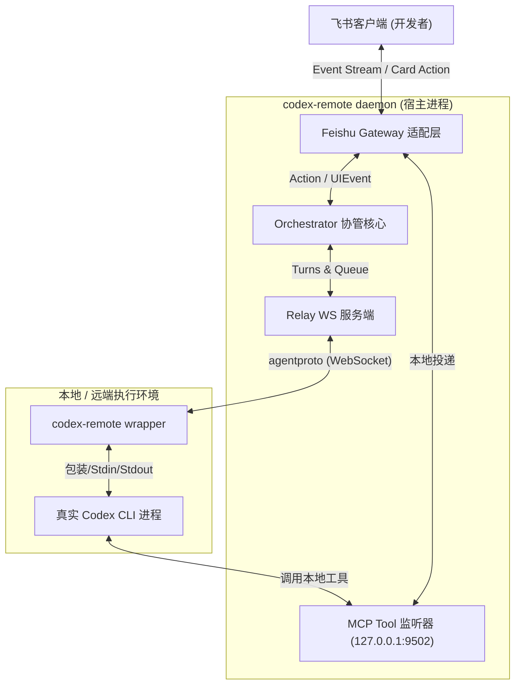

<details>
<summary>相关源文件</summary>

生成本页时使用的主要源文件：

- [README.md](../../../project-repos/codex-remote-feishu/README.md)
- [docs/general/user-guide.md](../../../project-repos/codex-remote-feishu/docs/general/user-guide.md)

</details>

# 项目概览

在软件工程实践中，开发者为了与 AI 辅助编程系统（如 Codex/Claude）协作，往往需要在编辑器、浏览器、命令行以及团队沟通工具之间不断跳转。这种多窗口切换极大地破坏了开发的专注度。特别是在需要远程接管 Linux 服务器上的工作区、或者进行跨团队代码审查与实时 Steer（引导）时，传统的本地 IDE 局限性便暴露无遗。

`codex-remote-feishu` 巧妙地解决了这一工程痛点。它将开发者的**工作现场完整投影至飞书 (Lark) 客户端**。通过统一的命令行工具 `codex-remote`，Bot 能够接管本地或远端的 Codex 工作区，将原生 AI app-server 协议转换为轻量级飞书事件，从而支持在飞书界面直接完成上下文理解、代码检索、命令行执行、进度追踪与实时跟进。这为多端协同提供了前所未有的流畅人机交互界面。

## 能力全景

- **工作区无缝接管**：通过 `/list` 列出可接管的工作区，支持一键 attach 本地目录或动态导入远程 Git 仓库，自动同步已有的 turn 历史与 thread 隔离上下文。
- **高吞吐 Early ACK 消息队列**：专门针对飞书 3 秒事件超时机制设计，使用 Gateway-Local FIFO 通道，支持消息实时入队、防抖、连发合并以及快速抢占终止。
- **CardKit 2.0 共享进度卡**：实时共享 AI 计划更新、工具调用、Web 搜索和命令执行过程。最终回复自动在触发消息下方以 thread 回复形式呈现，使得聊天记录极其整洁。
- **本地 MCP 飞书监听器**：在本地 loopback 监听 MCP 服务，使本地执行的工具（如生成图片、视频、文本文件）能够跨过网络层，直接且安全地投递回特定的飞书 Surface。
- **三向编辑器联动 (VS Code Shim)**：支持以 VS Code 桌面配置 patch 或物理重命名接管 VS Code Remote 插件 bundle 的方式（Shim 接管），使得飞书 Bot 能根据 IDE 当前的活动焦点自动跟随。

## 架构鸟瞰

下面的架构图展示了 `codex-remote-feishu` 统一二进制在飞书、本地守护进程以及真实 Codex 运行环境之间的链路关系。



在运行态中，`codex-remote` 以 Single Binary 形态覆盖了 daemon (宿主)、wrapper (适配包裹器) 以及 install (安装向导) 三重角色，将多层协议解耦并合并在一个高效的 Go 运行时内。

Sources: [README.md:1-64](../../../project-repos/codex-remote-feishu/README.md#L1-L64)

<details class="source-snippets">
<summary>引用源码</summary>

<!-- source-snippets:start -->

#### `README.md:1-64`

```markdown
# Codex Remote Feishu

`codex-remote-feishu` 把一台机器上的 Codex 工作现场带到飞书，让你可以在飞书里接管工作区、切换 thread、继续对话、发图和停止当前 turn。

使用说明 https://my.feishu.cn/docx/PTncdNBf1oS9N5xBikBcGi2enzc

核心目标场景是：

- 本机或远端 Linux 上运行 Codex
- 默认直接在飞书里按工作区和已有会话继续当前工作
- 只有在需要跟着编辑器当前焦点走时，才按需接入 VS Code
- 尽量保留原有对话的 thread、模型配置和工作目录语义

## 组件

当前 release 只发布一个统一二进制：

- `codex-remote`
  - `daemon` role
    - 常驻服务
    - 管理实例、thread、消息队列、Feishu 投影和状态接口
  - `app-server` / wrapper role
    - 包装真实 `codex`
    - 把原生 app-server 协议翻译成统一事件流
  - `install` role
    - 引导安装器
    - 负责安装稳定二进制、写统一配置并启动 WebSetup

当前官方发布模型是：

- GitHub Releases 的平台包内只放最终用户需要的运行资产
  - `codex-remote` / `codex-remote.exe`
  - `README.md`
  - `QUICKSTART.md`
  - `CHANGELOG.md`
  - `deploy/`
- 在线安装脚本 `install-release.sh` / `install-release.ps1` 单独作为 release 资产和仓库入口提供
- Windows release 额外提供 `codex-remote-feishu_<version>_windows_amd64_installer.exe`，作为 native packaged installer
- macOS release 额外提供 `codex-remote-feishu_<version>_darwin_universal_installer.dmg`，作为 native packaged installer
- GitHub Releases 现在区分 `production / beta / alpha` 三条 track
  - 默认在线安装入口始终指向最新 `production`
  - 需要时可显式安装最新 `beta` / `alpha`
- 正式 release 构建与发布全部在 GitHub Actions 的 `Release` workflow 上完成

## 功能

- 在飞书里列出可接管工作区，并直接继续已有对话或新开会话
- 在统一目标选择卡里直接添加工作区：接入已有本地目录，或导入 Git 仓库
- 直接从最近或全部会话列表继续已有对话
- 需要时切到 VS Code 跟随当前编辑器对话
- 文本消息排队、typing reaction、stop 中断
- 回复当前正在执行的源消息可直接 steer 进本轮执行，也支持 `/steerall`
- 排队中的文字消息支持用点赞升级成对当前执行的跟进
- 支持暂存图片，并在下一条文本里一起发给 Codex
- 支持 `/sendfile`，从当前工作区挑一个文件直接发回飞书聊天
- 支持 `/compact`，对当前 thread 主动做一次手动上下文整理
- 查看当前生效的模型和推理强度，并做飞书侧临时覆盖
- 用 `/cron` 为当前 daemon 实例打开专属定时任务多维表格，并可调度本地工作区或 Git 仓库来源的任务
- 可在飞书里看到计划更新、工具调用、Web 搜索、命令执行等共享进度卡
- 区分系统提示、过程消息和最终回复
- 最终回复会直接回在触发它的那条消息下方
- 旧卡片、旧按钮和旧命令会明确提示已过期或已移除
- 最终回复中的本地 `.md` 和单文件 `.html` 链接可自动替换成飞书云空间预览链接

```

<!-- source-snippets:end -->
</details>

## 技术栈概述

- **后端语言**：Go (1.24+)
- **前端 Web UI**：React + TypeScript + TailwindCSS (位于 `web/` 目录，用于 Admin/WebSetup 向导)
- **底层通信**：基于 WebSocket (传输自定义包装的 agentproto 协议封包) 和 HTTP (暴露 WebSetup API 与 MCP 原生 Streamable 协议面)
- **跨 OS 部署**：原生 Go 编译，支持 macOS/Linux systemd 用户单元，无外部 Docker 等复杂依赖环境

## 阅读路线推荐

- **关注核心架构设计与进程分工**：
  请阅读 [系统架构与统一二进制模型](system-architecture.md) 了解 daemon 与 wrapper 的双进程长连接实现。
- **关注消息分发与网关稳定性**：
  查阅 [飞书网关 Early ACK 与 FIFO 队列](feishu-gateway-queue.md) 了解在 3s 超时约束下的自研可靠队列。
- **关注前端卡片与状态机表现**：
  跳转到 [CardKit 2.0 渲染与交互状态机](interactive-cards.md) 了解 UIEvent 的归约原理。
- **关注 VS Code Shim 劫持原理**：
  阅读 [VS Code Shim 编辑器联动与接管](editor-takeover.md)。

## 相关页面

- [系统架构与统一二进制模型](system-architecture.md) — 探究双进程在 Go 运行时的合并设计
- [飞书网关 Early ACK 与 FIFO 队列](feishu-gateway-queue.md) — 了解高频防抖消息的底层隔离
