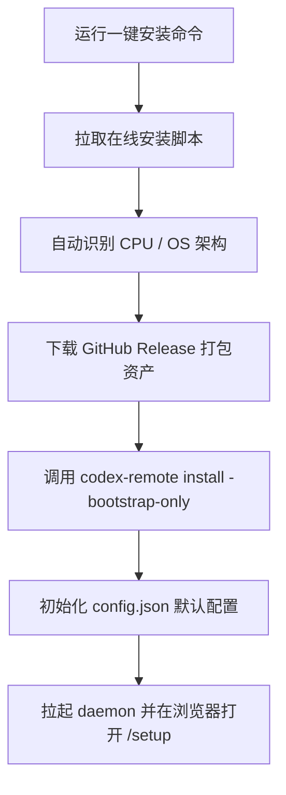
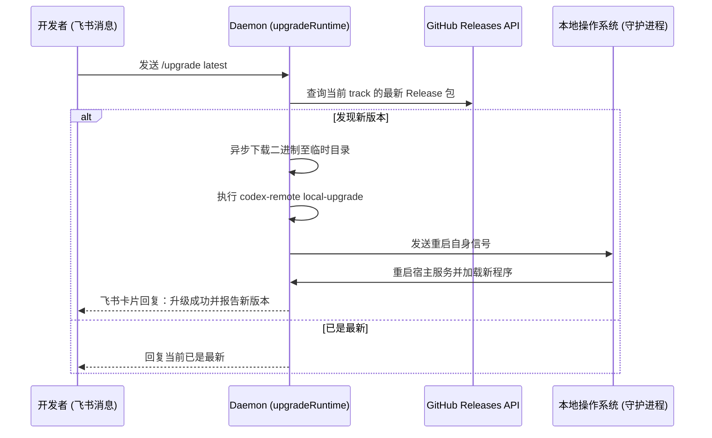

<details>
<summary>相关源文件</summary>

生成本页时使用的主要源文件：

- [internal/app/install/install.go](../../../project-repos/codex-remote-feishu/internal/app/install/install.go)
- [web/src/routes/SetupRoute.tsx](../../../project-repos/codex-remote-feishu/web/src/routes/SetupRoute.tsx)
- [docs/general/install-deploy-design.md](../../../project-repos/codex-remote-feishu/docs/general/install-deploy-design.md)

</details>

# WebSetup 与引导安装生命周期

为了将复杂的软件安装与飞书接入步骤从终端口罩式操作解放出来，系统设计了**一键安装脚本**与**嵌入式 WebSetup 配置向导**紧密联动的安装生命周期流程。用户无需提前申请飞书开放平台的凭证或配置烦琐的 JSON，即可在几分钟内实现开箱即用。

## 平台自适应一键安装脚本

系统对外提供了独立的在线引导脚本 `install-release.sh` (Mac/Linux) 与 `install-release.ps1` (Windows)：



在 bootstrap 执行期间，系统如果检测到本地已存在 `config.json`，则会启动**增量配置合并**：保留已有的用户凭证和核心端口，仅追加新版本所需的字段，避免破坏原有的部署环境。

Sources: [docs/general/install-deploy-design.md:1-80](../../../project-repos/codex-remote-feishu/docs/general/install-deploy-design.md#L1-L80)

<details class="source-snippets">
<summary>引用源码</summary>

<!-- source-snippets:start -->

#### `docs/general/install-deploy-design.md:1-80`

````markdown
# 安装与部署设计

> Type: `general`
> Updated: `2026-05-13`
> Summary: 同步 macOS native packaged installer 的当前 contract、GUI shell / dmg 脚本入口，以及其与 shared packaged-install contract、release workflow 的现阶段边界。

## 1. 范围

这份文档描述当前 Go 版本的安装、配置和部署模型，覆盖：

- GitHub Release 产物形态
- 在线安装脚本与手动解压安装
- `codex-remote install` 的 bootstrap 语义
- `codex-remote packaged-install` 的 shared contract
- WebSetup / Admin UI 的职责边界
- 仓库 helper 与产品入口的区分

## 2. 当前产品入口

### 2.1 `install-release.sh` / `install-release.ps1`

在线安装入口，面向最终用户。

职责：

- 解析平台和架构
- 默认下载 GitHub Releases 中最新 `production` 平台包
- 支持显式安装指定版本，或按 `production|beta|alpha` track 解析该 track 的最新 release
- 解压到本地 release cache
- 执行统一的：

```bash
codex-remote install -bootstrap-only -start-daemon
```

默认缓存目录：

- Linux: `~/.local/share/codex-remote/releases`
- macOS: `~/Library/Application Support/codex-remote/releases`
- Windows: `%LOCALAPPDATA%\codex-remote\releases`

它必须兼容：

- `curl | bash`
- `irm | iex`
- 指定版本安装
- 指定 track 的最新 release 安装
- CI 中通过本地 HTTP server 做 smoke test

### 2.2 手动解压 release 包

release 包解压后，最终用户直接运行统一二进制：

macOS / Linux:

```bash
./codex-remote install -bootstrap-only -start-daemon
```

Windows PowerShell:

```powershell
.\codex-remote.exe install -bootstrap-only -start-daemon
```

这一步只负责：

- 安装稳定二进制
- 写入统一配置
- 启动 daemon 与嵌入式 Web UI

后续飞书与 VS Code 配置都在 `/setup` 和 `/` 管理页中完成。

### 2.3 WebSetup / Admin UI

产品配置入口已经收敛到 WebSetup：

- 飞书 App 凭证与多 App 管理
- VS Code detect / apply
- `managed_shim` reinstall
````

<!-- source-snippets:end -->
</details>

## 内置 WebSetup 配置向导 (SetupRoute.tsx)

当安装引导拉起 daemon 后，daemon 会在本地 `9501` 端口启动一个专门的轻量级 Web 服务器，并在浏览器中为用户打开 `/setup` 网页配置入口（前端由 `web/src/routes/SetupRoute.tsx` 编写）：

1. **环境依赖自检（Preflight Verification）**：
   网页向导会自动调用系统 API，对当前的运行权限、VS Code 扩展包存在情况以及网络连通性进行自动诊断与报告。
2. **飞书应用扫码创建与绑定**：
   - 网页向导为用户呈现飞书授权绑定二维码。
   - 用户扫码后，系统会自动在飞书开放平台为用户创建专门的 PersonalAgent 机器人应用。
   - 自动绑定后，向导会在后台通过 `lark-cli` 完成事件订阅、菜单创建以及权限申请（包括云盘文档预览与表格接口），无需用户在开放平台后台进行手动操作。
3. **完成引导并重定向**：
   绑定成功后，向导重定向到 `/admin` 后台 UI 面板，此时 Web 服务器停用 setup 引导状态，切换为生产管理状态。

Sources: [web/src/routes/SetupRoute.tsx:1-120](../../../project-repos/codex-remote-feishu/web/src/routes/SetupRoute.tsx#L1-L120), [internal/app/install/install.go:1-60](../../../project-repos/codex-remote-feishu/internal/app/install/install.go#L1-L60)

<details class="source-snippets">
<summary>引用源码</summary>

<!-- source-snippets:start -->

#### `web/src/routes/SetupRoute.tsx:1-120`

```tsx
import { useEffect, useMemo, useState } from "react";
import {
  APIRequestError,
  requestJSON,
  requestVoid,
  sendJSON,
} from "../lib/api";
import { navigateToLocalPath } from "../lib/navigation";
import { relativeLocalPath } from "../lib/paths";
import type {
  BootstrapState,
  FeishuAppAutoConfigApplyResponse,
  FeishuAppAutoConfigPublishResponse,
  FeishuAppAutoConfigRequirementStatus,
  FeishuAppResponse,
  OnboardingWorkflowResponse,
  RuntimeRequirementsDetectResponse,
  SetupCompleteResponse,
  VSCodeDetectResponse,
} from "../lib/types";
import { blankToUndefined, vscodeApplyModeForScenario, vscodeIsReady } from "./shared/helpers";
import {
  describeAutoConfigBlockingReason,
  describeAutoConfigHeadline,
  describeAutoConfigRequirementDisplay,
  describeAutoConfigSummary,
  onboardingAutoConfigNoticeTone,
} from "./shared/feishuAutoConfig";
import {
  resolveRuntimeApplyFailureTarget,
  runAutoConfigMutation,
  saveAndVerifyFeishuApp,
  useQRCodeOnboardingFlow,
} from "./shared/feishuFlow";

type SetupStepID =
  | "runtime_requirements"
  | "connect"
  | "auto_config"
  | "menu"
  | "autostart"
  | "vscode"
  | "done";

type NoticeTone = "good" | "warn" | "danger";

type Notice = {
  tone: NoticeTone;
  message: string;
};

type ManualConnectForm = {
  name: string;
  appId: string;
  appSecret: string;
};

const setupSteps: Array<{ id: SetupStepID; name: string }> = [
  { id: "runtime_requirements", name: "环境检查" },
  { id: "connect", name: "飞书连接" },
  { id: "auto_config", name: "飞书自动配置" },
  { id: "menu", name: "菜单确认" },
  { id: "autostart", name: "自动启动" },
  { id: "vscode", name: "VS Code 集成" },
  { id: "done", name: "完成" },
];

const vscodeApplyTimeoutMs = 10_000;
export function SetupRoute() {
  const [loading, setLoading] = useState(true);
  const [loadError, setLoadError] = useState("");
  const [bootstrap, setBootstrap] = useState<BootstrapState | null>(null);
  const [workflow, setWorkflow] = useState<OnboardingWorkflowResponse | null>(null);
  const [selectedAppID, setSelectedAppID] = useState("");
  const [currentStep, setCurrentStep] =
    useState<SetupStepID>("runtime_requirements");
  const [notice, setNotice] = useState<Notice | null>(null);
  const [manualForm, setManualForm] = useState<ManualConnectForm>({
    name: "",
    appId: "",
    appSecret: "",
  });
  const [actionBusy, setActionBusy] = useState("");
  const [publishConfirmOpen, setPublishConfirmOpen] = useState(false);
  const [finishingSetup, setFinishingSetup] = useState(false);

  const activeApp = useMemo(() => {
    if (workflow?.app?.app) {
      return workflow.app.app;
    }
    return workflow?.apps.find((app) => app.id === selectedAppID) ?? null;
  }, [selectedAppID, workflow]);
  const runtimeRequirements = workflow?.runtimeRequirements || null;
  const autoConfigStage = workflow?.app?.autoConfig;
  const menuStage = workflow?.app?.menu;
  const autostartStage = workflow?.autostart || null;
  const vscodeStage = workflow?.vscode || null;
  const title = buildSetupPageTitle(bootstrap);
  const adminURL = relativeLocalPath(bootstrap?.admin.url || "/");
  const activeConsoleLinks = activeApp?.consoleLinks;
  const isReadOnlyApp = Boolean(activeApp?.readOnly);
  const currentStageIndex = setupSteps.findIndex(
    (step) => step.id === normalizeSetupStepID(workflow?.currentStage),
  );
  const stageMap = useMemo(() => {
    const next = new Map<string, string>();
    for (const stage of workflow?.stages || []) {
      next.set(stage.id, stage.status);
    }
    return next;
  }, [workflow?.stages]);
  const stepDone: Record<SetupStepID, boolean> = {
    runtime_requirements: isResolvedStageStatus(
      stageMap.get("runtime_requirements") || "",
    ),
    connect: isResolvedStageStatus(stageMap.get("connect") || ""),
    auto_config: isResolvedStageStatus(stageMap.get("auto_config") || ""),
    menu: isResolvedStageStatus(stageMap.get("menu") || ""),
    autostart: isResolvedStageStatus(stageMap.get("autostart") || ""),
    vscode: isResolvedStageStatus(stageMap.get("vscode") || ""),
```

#### `internal/app/install/install.go:1-60`

> 未找到引用文件：`internal/app/install/install.go`

<!-- source-snippets:end -->
</details>

## 热升级状态机 (/upgrade latest)

除了安装外，Bot 在日常运维中的升级动作也被收敛至飞书第一界面。



这种热升级设计极大地解脱了命令行维护的负担，使得 Bot 拥有极佳的用户自运维特征。

Sources: [internal/app/install/install.go:61-120](../../../project-repos/codex-remote-feishu/internal/app/install/install.go#L61-L120)

<details class="source-snippets">
<summary>引用源码</summary>

<!-- source-snippets:start -->

#### `internal/app/install/install.go:61-120`

> 未找到引用文件：`internal/app/install/install.go`

<!-- source-snippets:end -->
</details>

## 相关页面

- [系统架构与统一二进制模型](system-architecture.md) — 了解安装器在进程中的角色定义
- [VS Code Shim 编辑器联动与接管](editor-takeover.md) — 探究安装向导中 VS Code 接管的步骤
- [Linux Service 守护常驻与状态 API](daemon-service.md) — 了解安装完毕后守护进程的加载
