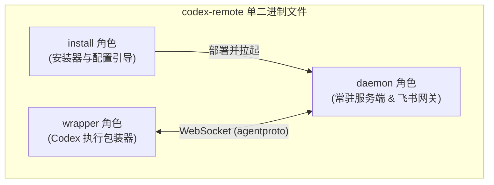
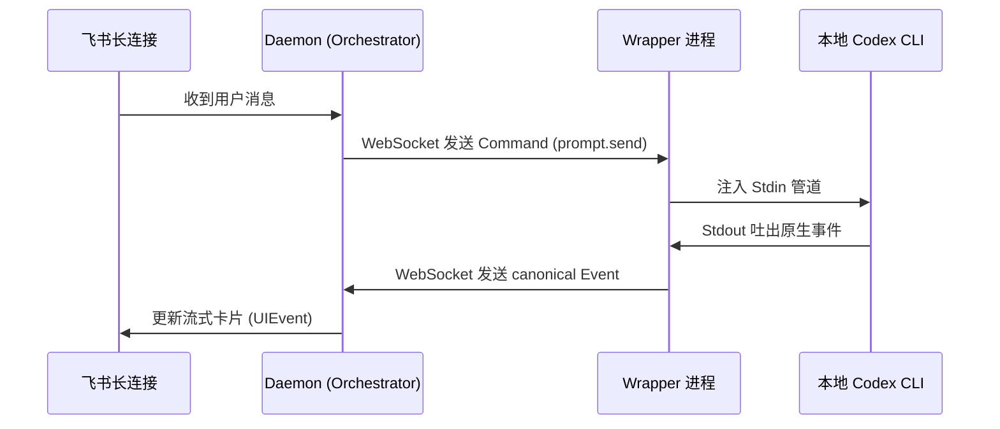

<details>
<summary>相关源文件</summary>

生成本页时使用的主要源文件：

- [cmd/codex-remote/main.go](../../../project-repos/codex-remote-feishu/cmd/codex-remote/main.go)
- [internal/app/launcher/launcher.go](../../../project-repos/codex-remote-feishu/internal/app/launcher/launcher.go)
- [docs/general/architecture.md](../../../project-repos/codex-remote-feishu/docs/general/architecture.md)

</details>

# 系统架构与统一二进制模型

为了极大地降低分发、升级和运维的复杂度，`codex-remote-feishu` 在架构演进中做出了一个关键的设计决策：**收敛多语言实现，将所有运行角色合并进同一个 Go 编写的单二进制 `codex-remote` 中**。这种 Unified Binary 结构通过运行时参数或软链接别名（symlinks）进行角色激活，同时在逻辑层与网络传输层定义了清晰的边界。

## 统一进程角色架构

在运行时，`codex-remote` 二进制依据传入的命令行子命令或宿主环境变量，激活以下三种不同的运行角色：

1. **`daemon` 角色 (默认)**：
   常驻后台的服务。它集成了网络层（与飞书的长连接 Gateway）、产品决策层（Orchestrator）、VitePress 预览托管和状态接口。它是整个系统的中枢，负责管理全部活动实例、对话 Thread、消息排队和图片暂存状态。
2. **`wrapper` 角色**：
   包装真实的本地 `codex` CLI。它对外暴露出与真实 `codex` 完全一致的 Stdin/Stdout 管道面，但在内部通过 WebSocket 长连接（传输 `agentproto` 协议包）与后台的 `daemon` 通信，将原生的转义协议和执行状态源源不断发送给后台进行广播，并在本地拦截 VS Code 编辑器的转向焦点。
3. **`install` 角色**：
   引导安装器。负责向目标机器写入统一的 `config.json` 偏好配置文件，部署本地守护进程服务单元，以及拉起嵌入式 WebSetup 引导向导。



### Launcher 兼容软链接设计

在项目的物理结构中，依然保留了诸如 `relayd`、`relay-wrapper`、`relay-install` 和 `vscode-shim` 等兼容可执行入口。在 Go 的内部实现中，它们全部由 `launcher.go` 进行统一分发处理：

- **技术实现**：系统在启动时读取 `os.Args[0]`（当前进程的可执行文件路径名）或解析环境变量。
- **重定向**：如果文件名为 `relayd`，则自动等价于调用 `codex-remote daemon`；如果是 `relay-wrapper`，则等价于调用 `codex-remote wrapper`。这种设计在向后兼容老版本脚本的同时，确保了编译产物只有一个单一实体，极大地避免了多文件版本漂移问题。

Sources: [internal/app/launcher/launcher.go:1-60](../../../project-repos/codex-remote-feishu/internal/app/launcher/launcher.go#L1-L60)

<details class="source-snippets">
<summary>引用源码</summary>

<!-- source-snippets:start -->

#### `internal/app/launcher/launcher.go:1-60`

```go
package launcher

import (
	"context"
	"fmt"
	"io"
	"os"

	"github.com/kxn/codex-remote-feishu/internal/app/daemon"
	"github.com/kxn/codex-remote-feishu/internal/app/install"
	"github.com/kxn/codex-remote-feishu/internal/app/wrapper"
)

type Options struct {
	Args    []string
	Stdin   io.Reader
	Stdout  io.Writer
	Stderr  io.Writer
	Version string
	Branch  string

	Runners RunnerSet
}

type RunnerSet struct {
	RunDaemon               func(context.Context, []string, string, string) error
	RunInstall              func([]string, io.Reader, io.Writer, io.Writer, string) error
	RunPackagedInstall      func([]string, io.Reader, io.Writer, io.Writer, string) error
	RunPackagedInstallProbe func([]string, io.Reader, io.Writer, io.Writer, string) error
	RunLocalUpgrade         func([]string, io.Reader, io.Writer, io.Writer, string) error
	RunService              func([]string, io.Reader, io.Writer, io.Writer, string) error
	RunUpgradeHelper        func([]string, io.Reader, io.Writer, io.Writer, string) error
	RunWrapper              func(context.Context, []string, io.Reader, io.Writer, io.Writer, string, string) (int, error)
}

func Main(opts Options) int {
	opts = withDefaults(opts)

	decision, err := Detect(opts.Args)
	if err != nil {
		_, _ = fmt.Fprintf(opts.Stderr, "error: %v\n\n%s", err, usageText())
		return 2
	}

	switch decision.Role {
	case RoleHelp:
		_, _ = io.WriteString(opts.Stdout, usageText())
		return 0
	case RoleVersion:
		_, _ = fmt.Fprintf(opts.Stdout, "%s\n", opts.Version)
		return 0
	}

	ctx, stop, err := newMainContext(context.Background())
	if err != nil {
		_, _ = fmt.Fprintf(opts.Stderr, "signal setup error: %v\n", err)
		return 1
	}
	defer stop()

```

<!-- source-snippets:end -->
</details>

## 双进程协议传输网络 (agentproto)

`wrapper` 角色与 `daemon` 角色在工作时，通过 WebSocket 构筑双向通信信道。
- 传输的数据包遵循 `internal/core/agentproto` 包中定义的通用契约。
- **协议双向流转**：
  - **Downstream (下行)**：飞书端的消息通过网关解析为 `control.Action` 后，由 Orchestrator 发送 `agentproto.Command` 跨越 WebSocket 告知 `wrapper`。
  - **Upstream (上行)**：`wrapper` 启动子进程，将 Codex 吐出来的 Stdio 翻译为标准的 `agentproto.Event`（包括思考事件、代码修改事件、工具使用事件等）发送回 `daemon` 进行卡片投影。



Sources: [docs/general/architecture.md:80-92](../../../project-repos/codex-remote-feishu/docs/general/architecture.md#L80-L92)

<details class="source-snippets">
<summary>引用源码</summary>

<!-- source-snippets:start -->

#### `docs/general/architecture.md:80-92`

```markdown
## 4. 分层职责

### 4.1 `internal/core/agentproto`

统一定义：

- wrapper <-> daemon wire envelope
- canonical command
- canonical event

### 4.2 `internal/core/control`

统一定义：
```

<!-- source-snippets:end -->
</details>

## 运行时数据目录隔离 (Namespaced BaseDir)

为了支持在一台机器上同时联调、测试和部署多个不同版本的 Bot，系统设计了 Namespaced (命名空间化) 的配置和状态隔离写入机制：
- **`stable` 默认实例**：写入固定的 `~/.config/codex-remote/config.json` 和日志目录。
- **`named` 命名实例**：例如在开发测试分支中，通过配置指定为 `master` 或 `beta` 命名空间。系统会自动在指定路径下开辟隔离空间：`<baseDir>/.config/codex-remote-master/codex-remote/config.json`，确保在进行升级或调测时，不同的运行环境配置、锁文件及日志互不交叉、绝对安全。

Sources: [README.md:229-257](../../../project-repos/codex-remote-feishu/README.md#L229-L257)

<details class="source-snippets">
<summary>引用源码</summary>

<!-- source-snippets:start -->

#### `README.md:229-257`

```markdown
## 仓库内联调入口

源码仓库里不再保留单独的 `install.sh` 生命周期脚本。现在统一使用现有单 binary 入口：

- `./setup.ps1`
  - Windows 上的同等辅助脚本
- `go build -o ./bin/codex-remote ./cmd/codex-remote`
  - 先构建本地 binary
- `./bin/codex-remote install -bootstrap-only -start-daemon`
  - 已经构建过二进制时，可直接重新 bootstrap 并确保本地 daemon 就绪
- `./bin/codex-remote daemon`
  - 需要前台直接观察 daemon 启动过程和日志时使用

如果当前 workspace 下存在 `.codex-remote/install-target.json`，这些 repo-local 命令会优先跟随该 workspace 绑定的全局实例与 `baseDir`；没有 binding 时，默认退回 `stable`。

stable 默认会写入：

- `~/.config/codex-remote/config.json`
- `~/.local/share/codex-remote/install-state.json`
- `~/.local/share/codex-remote/logs/codex-remote-relayd.log`

命名实例则会写入 namespaced 路径，例如 `master`：

- `<baseDir>/.config/codex-remote-master/codex-remote/config.json`
- `<baseDir>/.local/share/codex-remote-master/codex-remote/install-state.json`
- `<baseDir>/.local/share/codex-remote-master/codex-remote/logs/codex-remote-relayd.log`

当前磁盘配置入口只保留 `config.json`；旧的 `config.env` / `wrapper.env` / `services.env` 不再自动读取或迁移。

```

<!-- source-snippets:end -->
</details>

## 相关页面

- [项目概览](overview.md) — 掌握统一进程在整体拓扑中的定位
- [飞书网关 Early ACK 与 FIFO 队列](feishu-gateway-queue.md) — 了解飞书消息在进入 Orchestrator 前的排队细节
- [Orchestrator 协管核心与运行态集群](orchestrator-core.md) — 探究核心状态机的逻辑实现
