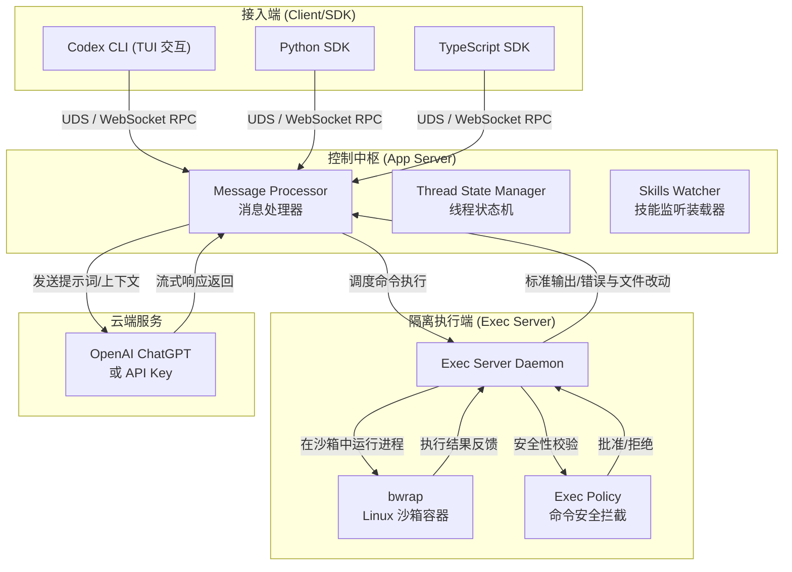

相关源文件

生成本页时使用的主要源文件：

- [README.md](../../../project-repos/codex/README.md)
- [package.json](../../../project-repos/codex/package.json)
- [codex-rs/README.md](../../../project-repos/codex/codex-rs/README.md)

# 项目概览

在软件开发高度智能化的今天，诸如 Claude Code 或 GitHub Copilot CLI 等 AI 终端代理已成趋势。然而，传统的 AI 代理通常直接运行在宿主机的常规环境中，一旦 AI 生成了破坏性的 Shell 命令或包含潜在漏洞的代码并自动执行，将会对开发者的主机安全造成不可逆的威胁。

**Codex CLI 的诞生彻底改写了这一安全隐患。** 它将云端大模型的极速智能推理与本地端基于 Linux Namespace 的硬隔离沙箱（Exec Server）完美融合，在保证 AI 代理能自由读写代码、运行测试、安装依赖的同时，实现宿主机环境与执行环境的绝对隔离。它不仅是一个供开发者在终端使用的智能助手，更是一套成熟的、高度安全的智能体本地执行体系。

---

## 能力全景

*   **双进程隔离运行**：AI 的控制逻辑（App Server）与受信任的代码执行层（Exec Server）拆分为独立运行的系统进程，阻断恶意命令直接劫持控制中枢。
*   **Linux Namespace 硬沙箱**：基于内核级 `bwrap` 工具对执行环境进行网络、挂载点和进程空间的全面虚拟隔离，确保沙箱内操作无法外溢。
*   **动态策略控制防线**：内置 `execpolicy` 防火墙，在命令下发前根据细粒度白名单及规则库拦截高危行为，由用户决定是否越权放行。
*   **多语言集成 SDK**：同时支持 Python 与 TypeScript 两套主流开发包，开发者能像调用常规 API 一样无缝编排 Codex Agent 的执行周期。
*   **即插即用的技能系统**：支持直接通过 `SKILL.md` 定义复杂工作流，利用 Model Context Protocol (MCP) 动态热加载外部工具链。

---

## 架构鸟瞰

Codex CLI 采用客户端-服务端分层模型，其拓扑结构如下：

该系统主要由三部分构成：最外层是以 TUI 交互和 SDK 组成的接入端；核心控制层是 App Server，作为与云端大模型对话并调度本地环境的中央控制室；最底层的 Exec Server 则运行于隔离的 Linux Namespace 沙箱中，安全地代行所有编译、文件修改及命令测试任务。

---

## 技术栈概述

*   **系统语言**：采用 Rust 语言作为后端（`codex-rs`）的核心开发语言，利用其卓越的零成本抽象和内存安全特性构建沙箱和 RPC 协议。
*   **通信总线**：在控制层与执行层、客户端之间利用本地 Unix Domain Socket (UDS) 和高并发 WebSocket 承载自定义二进制 RPC 数据流。
*   **沙箱技术**：底层高度依赖 Linux 平台下的 `bubblewrap` (bwrap) 挂载与特权限制技术，并提供 Nix 确定性构建链。
*   **编译体系**：全栈使用 Bazel（基于 `MODULE.bazel`）作为统一构建工具，控制多语言、多平台组件的交叉编译与静态门禁。

---

## 阅读路线推荐

对于不同目标的读者，我们推荐以下深度探索路径：
1.  **了解底层通信与多进程模型**：请首先阅读 [系统架构](system-architecture.md)，掌握 UDS 通信总线的机制。
2.  **关心代理安全与沙箱逃逸防护**：推荐直接阅读 [执行服务端与沙箱安全](exec-server-sandbox.md)，理解 bubblewrap 和策略控制器的实现。
3.  **想要接入或扩展 Codex 开发包**：请查看 [命令行与多语言 SDK](client-and-sdks.md) 以及 [技能与插件机制](skills-plugins-system.md)。

---

Sources: [README.md:1-72](../../../project-repos/codex/README.md#L1-L72), [codex-rs/README.md:1-120](../../../project-repos/codex/codex-rs/README.md#L1-L120)

## 相关页面

- [系统架构](system-architecture.md) — 控制层与隔离执行层的多进程通信拓扑
- [执行服务端与沙箱安全](exec-server-sandbox.md) — 探究基于内核 Namespace 与 execpolicy 的拦截安全防线
