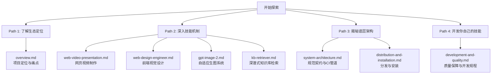

# 🌟 Garden Skills DeepWiki

欢迎来到 **Garden Skills** 技术维基。

这里是为 AI Agent（如 Claude Code, Cursor, Codex, Gemini 等）量身定制的“专业技能卡（Agent Skills）”的集中演练场与分发中心。我们不满足于给大模型喂一段简陋的 Prompt，而是希望赋予它真正的“工作流专家”灵魂——通过设计精密的方法论、内容驱动的决策树、规范的文件契约以及自动化的质量管道，让 AI 拥有如高级前端工程师、电影感视频导演、多模式生图专家、以及深潜式检索助手般的专业操作能力。

> [!NOTE]
> 本 Wiki 包含 Garden Skills 的底层系统架构、核心技能深度解析、自动化运维以及详尽的本地开发指南。通过本文档，你将深刻理解如何驯服 AI，让其在复杂环境中输出稳定、惊艳的工程杰作。

---

## 🗺️ 深度阅读路径

为了帮助你快速建立对整个技能生态的系统认知，我们规划了以下四条阅读路径：



### 1. 🌐 项目概览与痛点
如果你想知道我们为什么要大费周章地为 Agent 编写 `SKILL.md`，以及它如何解决传统 Prompt 极易漂移、缺乏一致性的硬伤，请先阅读：
* [项目定位与痛点](file:///Users/bytedance/workspace/deepwiki/garden-skills/pages/overview.md)：剖析 Agent 运作的核心原理，探讨如何通过结构化方法论消除 AI 味。

### 2. 🏗️ 系统架构与规范契约
这里是整个仓库的骨架。我们用一套极简的零依赖 ESM Node.js 脚本、严格的 YAML Frontmatter、多分支的 CI 自动化发布工作流，搭建起了一座健壮的 Agent 技能兵工厂：
* [系统架构与组织设计](file:///Users/bytedance/workspace/deepwiki/garden-skills/pages/system-architecture.md)：了解 monorepo 目录规范、基于 Tag 的单技能独立发布与 README 动态渲染原理。
* [分发与安装机制](file:///Users/bytedance/workspace/deepwiki/garden-skills/pages/distribution-and-installation.md)：揭示如何使用 `npx skills add` 或一键 zip 下载，将技能无缝注入各种 Agent 运行时环境。

### 3. 🧠 核心技能深度解析
这里是整个项目最精彩的部分。我们把四大核心技能的方法论、决策树、代码红线做到了极致：
* [Web 视频制作技能 (web-video-presentation)](file:///Users/bytedance/workspace/deepwiki/garden-skills/pages/web-video-presentation.md)：如何用 16:9 固定舞台、口播节拍游标与 Pluggable TTS 旁白渲染，将一篇文章自动演化为惊艳网页。
* [前端设计工程技能 (web-design-engineer)](file:///Users/bytedance/workspace/deepwiki/garden-skills/pages/web-design-engineer.md)：“Stunning”而非仅是功能性。通过六步法、25款设计风格配方与“反 AI 味”黑名单来驯服 AI。
* [GPT 图像生成与编辑技能 (gpt-image-2)](file:///Users/bytedance/workspace/deepwiki/garden-skills/pages/gpt-image-2.md)：Mode A/B/C 三种运行时环境自适应，自带 70+ 个结构化 Prompt 模板与智能二次编辑流。
* [本地知识库检索技能 (kb-retriever)](file:///Users/bytedance/workspace/deepwiki/garden-skills/pages/kb-retriever.md)：解决大文件检索 Token 爆炸的杀手锏。多级索引导航与“先学习、后处理”的文件分析控制。

### 4. 🛠️ 开发与质量保障
你也可以成为技能的共同建造者。我们为你准备了完整的本地测试与发布方案：
* [开发与质量保障指南](file:///Users/bytedance/workspace/deepwiki/garden-skills/pages/development-and-quality.md)：教你如何编写符合标准的技能描述，如何利用本地 `validate` 校验工具，以及发布前的测试验证。

---

## 🧩 核心技能一览

| 技能名称 | 目录路径 | 目标受众 (AI) | 核心特点 |
| :--- | :--- | :--- | :--- |
| **web-video-presentation** | `skills/web-video-presentation/` | 演示/动画/多媒体制作 Agent | 视频节奏驱动、Vite+React 舞台、TTS 自动生成 |
| **web-design-engineer** | `skills/web-design-engineer/` | 前端/交互/设计 Agent | 风格配方索引、反 AI 味规范、Checkpoint 机制 |
| **gpt-image-2** | `skills/gpt-image-2/` | 图像生成与编辑 Agent | 三模式探测（Mode A/B/C）、结构化 JSON 提示词 |
| **kb-retriever** | `skills/kb-retriever/` | 文档/信息/研发助手 Agent | 多层树状索引、大文件专用 pdf/excel 分析流程 |

---

## 🚀 极简参与指南

若要开始本地开发或体验这些技能，请按照以下规程进行：

1. **克隆并验证**
   ```bash
   git clone https://github.com/ConardLi/garden-skills.git
   cd garden-skills
   npm run list      # 显示当前注册的技能与 manifest 状态
   npm run validate  # 运行与 CI 完全一致的质量自检（无依赖，速度极快）
   ```

2. **了解贡献流程**
   在修改或添加技能前，请务必细读 [开发与质量保障指南](file:///Users/bytedance/workspace/deepwiki/garden-skills/pages/development-and-quality.md)。我们用严格的 lint 规则、双源自检和发布流来保护生产环境。
