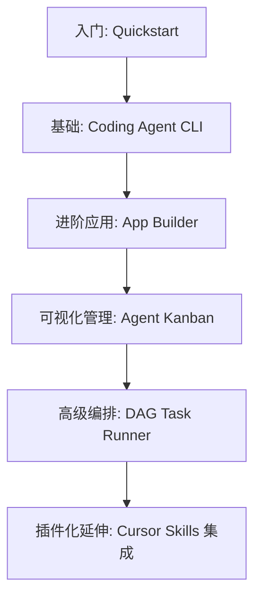
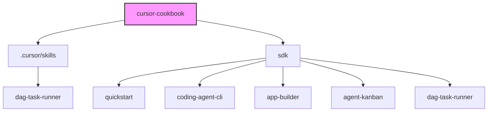
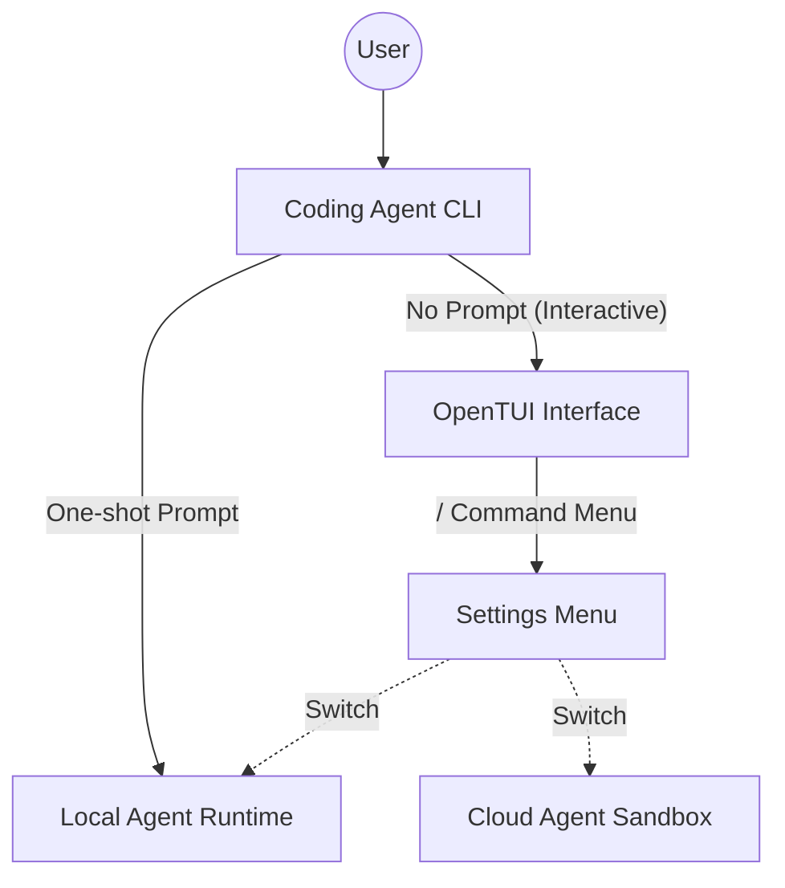
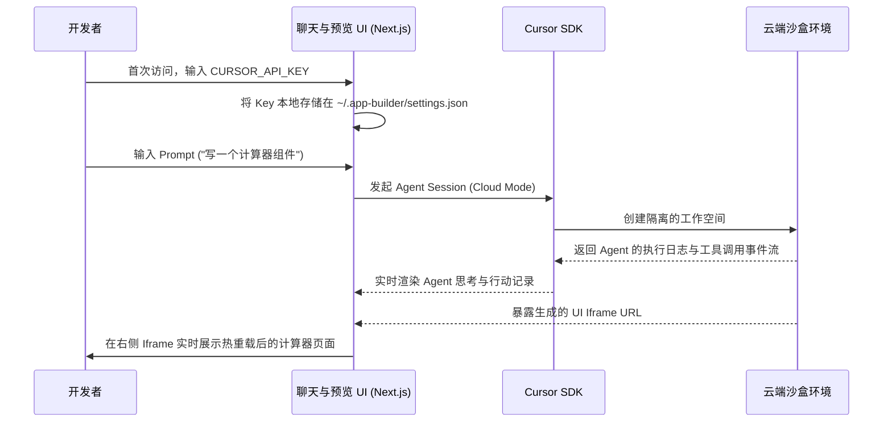
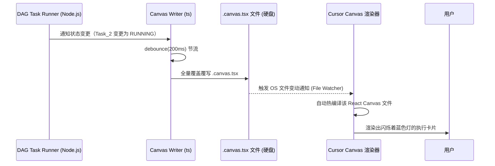

# Cursor Cookbook DeepWiki
# Cursor Cookbook DeepWiki

> **Cursor 官方提供的用于学习、测试与集成 Cursor SDK 及相关工具链的实战示例集合**

## 目录导航

| 分区 | 页面 | 重要性 | 内容简介 |
|------|------|--------|----------|
| 概览 | [项目概览](pages/overview.md) | high | 定位、核心示例与学习路线 |
| 概览 | [仓库结构与运行模式](pages/repository-structure.md) | medium | Monorepo 结构与 Cursor SDK 工作模式（Local/Cloud） |
| 核心功能与示例 | [CLI 与基础接入](pages/coding-agent-cli.md) | high | Node.js/Bun 环境下的基础 Agent 接入示例 |
| 核心功能与示例 | [App Builder 原型构建器](pages/app-builder.md) | high | 利用 Cursor Agent 在沙盒环境中快速构建 React 应用预览 |
| 核心功能与示例 | [Agent Kanban 看板](pages/agent-kanban.md) | high | 云端 Agent 任务状态管理与可视化前端 |
| 复杂流编排 | [DAG 任务流运行器](pages/dag-task-runner.md) | high | 基于拓扑排序的子智能体并发任务编排 |
| 复杂流编排 | [Canvas 动态渲染集成](pages/canvas-rendering.md) | medium | 如何将 Agent 状态流式写入 Cursor Canvas 实时展示 |
| 扩展与定制 | [Cursor 技能封装](pages/cursor-skills.md) | high | 以 dag-task-runner 为例的本地 Skill 封装与分发机制 |

## 仓库快照

```text
cursor-cookbook/
├── .cursor/
│   └── skills/
│       └── dag-task-runner/     # 可复制的 Cursor 技能实例
├── sdk/
│   ├── quickstart/              # 极简 SDK 入门示例
│   ├── app-builder/             # AI 驱动的原型生成器
│   ├── agent-kanban/            # 智能体任务看板
│   ├── coding-agent-cli/        # 终端中的 Cursor Agent 客户端
│   └── dag-task-runner/         # DAG 并发任务运行器
└── README.md
```

## 核心入口

| 模块 | 入口文件 | 作用 |
|------|----------|------|
| Quickstart | `sdk/quickstart/package.json` | 基础 Node.js 示例，演示创建 Agent、提示词与流式返回 |
| DAG Task Runner | `sdk/dag-task-runner/src/run_dag.ts` | DAG 任务并发调度、上下文注入与状态更新的核心生命周期 |
| Kanban App | `sdk/agent-kanban/src/components/agent-kanban-app.tsx` | Agent Kanban 核心前端组件，实现任务流转与 Artifact 预览 |
| Canvas Writer | `.cursor/skills/dag-task-runner/scripts/canvas_writer.ts` | 拦截 Agent 事件，生成 `.canvas.tsx` 供 Cursor IDE 实时预览 |

## 快速导航

- **如何将 Cursor SDK 接入我的代码？** → 阅读 [CLI 与基础接入](pages/coding-agent-cli.md)
- **如何并发执行复杂的长任务？** → 阅读 [DAG 任务流运行器](pages/dag-task-runner.md)
- **想在可视化看板里管理 Agent？** → 阅读 [Agent Kanban 看板](pages/agent-kanban.md)

---
*Source: `https://github.com/cursor/cookbook.git` @ `2f326663d3be5a3a86a4d11b679dbe8355259a36`*


---

<details>
<summary>相关源文件</summary>

生成本页时使用的主要源文件：

- [README.md](../../README.md)

</details>

# 项目概览

Cursor Cookbook 是官方提供的一个代码示例集合仓库，旨在帮助开发者快速理解、集成并熟练使用 Cursor SDK 及其关联工具链。在这个仓库中，不仅包含了极简的快速开始脚本，还包含了一些相对复杂的企业级/高阶使用场景参考实现，例如带有可视化前端的 Kanban、基于 DAG 的并行任务编排工具。

## 核心定位

该仓库的核心定位是 **“赋能开发者基于 Cursor SDK 构建自有工具”**：
1. **SDK 最佳实践**：向开发者展示如何正确初始化 SDK、发送 Prompts、处理并发。
2. **场景化示例**：证明 Cursor Agent 能够做到什么程度——不仅是在 IDE 内交互，还可以脱离 IDE 在终端、Web 页面，甚至是多智能体拓扑网络中运行。
3. **生态集成**：展示如何通过 Cursor Skills（如 `.cursor/skills`）进行能力的共享与分发，并在 Canvas 等 IDE 自有资产中进行状态的动态回写展示。

## 典型使用场景与示例分布

该仓库的内容完全按目录组织在 `sdk/` 之下，独立成多个可单独运行的项目：

| 示例项目 | 复杂度 | 核心受众与解决的问题 |
|---------|-------|--------------------|
| **Quickstart** | Low | 刚接触 SDK 的开发者，只需了解如何跑通一个基本的回话并捕获 stdout 的文本流。 |
| **Coding Agent CLI** | Medium | 习惯终端的高级用户，想将 Cursor Agent 当作一个类似 `git` 或 `npm` 的终端命令工具来使用。 |
| **App Builder** | High | 想要做低代码/No-code 产品的开发者，该应用在沙盒环境里帮你 Scaffold（脚手架化）一个可直接预览的 React 应用。 |
| **Agent Kanban** | High | 需要监控后台多个运行中 Agent 状态的管理员，使用该看板可以通过 UI 面板实时掌握 Agent 动态与 Artifacts 产物。 |
| **DAG Task Runner** | Very High | 面对极大、极复杂的任务，将其拆解成 JSON 定义的拓扑排序任务网，分配给多个 Sub-agents 并行处理，大幅提高解决速度。 |

## 学习与阅读路线建议

对于首次浏览该源码库的开发者，推荐的学习路径如下：



通过沿着这条路线阅读源码，你可以从最简单的**一问一答（One-shot prompt）**过渡到**流式事件处理**，再深入理解到**复杂前端交互**，最后掌握**多智能体（Multi-agent）并发与重型状态机编排**的精髓。

## 相关页面

- [仓库结构与运行模式](repository-structure.md)
- [CLI 与基础接入](coding-agent-cli.md)


---

<details>
<summary>相关源文件</summary>

生成本页时使用的主要源文件：

- [sdk/quickstart/package.json](../../sdk/quickstart/package.json)
- [sdk/app-builder/package.json](../../sdk/app-builder/package.json)
- [sdk/agent-kanban/package.json](../../sdk/agent-kanban/package.json)
- [sdk/coding-agent-cli/package.json](../../sdk/coding-agent-cli/package.json)
- [sdk/dag-task-runner/package.json](../../sdk/dag-task-runner/package.json)

</details>

# 仓库结构与运行模式

Cursor Cookbook 的代码结构被设计得相对扁平且完全解耦。尽管所有代码都在同一个仓库下，但它们通常不是以强依赖的 Monorepo（比如依赖于 Lerna 或 Rush）形式呈现，而是采用类似 Workspace 的轻量组织。每个 `sdk/` 目录下的子文件夹都是一个完全独立的全栈/后端项目。

## 目录结构分析

从代码树上看，它主要分为三块区域：



### 1. SDK 示例区 (`sdk/`)
这是仓库的核心。里面的每一个目录都对应一个完整的场景示例：
- 每个目录自带自己的 `package.json`（或 `pnpm-workspace.yaml`），意味着它们可以被独立拉取、安装依赖并启动。
- 依赖项主要围绕 `@cursor/sdk`（Cursor 的核心 SDK 包）进行。
- 技术栈主要基于 **Node.js 22+**、**TypeScript**，部分项目使用了 **Bun 1.3+**（如 `coding-agent-cli` 因为使用了特定的 FFI 特性）以及 **Next.js** / **React**（用于前端展示）。

### 2. Skills 沉淀区 (`.cursor/skills/`)
在这里存放的并不是示例应用的源码本身，而是用于演示**如何将 SDK 产物封装成 Cursor 技能**。
- 以 `dag-task-runner` 为例，`sdk/dag-task-runner` 中的源码包含了一个能够同步生成 `.cursor/skills` 文件的脚本，让开发者可以在真实开发流中一键 Copy 该技能。

## SDK 运行模式：Local vs Cloud

在 Cookbook 提供的几乎所有示例中，底层的 Cursor Agent 都有两种主要的执行环境，这在源码实现（例如 `quickstart` 或 `coding-agent-cli`）中有着明显的体现。

### Local Mode (本地模式)
默认情况下，许多基于 CLI 或终端的工具（例如 Quickstart 和 Coding Agent CLI 的一发式 Prompt）会在 Local 环境运行。
- **机制**：通过 `process.cwd()` 等机制，Agent 拥有和终端完全一致的工作目录。
- **优势**：文件读写权限直接可控，对本地硬盘毫无阻碍，能够极快地进行代码分析与重构。
- **安全边界**：由操作者的终端权限决定。

### Cloud Mode (云端沙盒模式)
类似于 App Builder 这种用于“原型构建”的工具，通常会启用 Cloud 模式。
- **机制**：在 Cursor 提供的沙盒/云端容器里运行 Agent，这意味着所有的脚手架、文件生成都在隔离环境中发生。
- **优势**：非常适合用来试验新框架、尝试那些会大范围覆盖文件的“破坏性”修改，不会弄脏你现有的本地仓库。
- **表现**：通常配合诸如 Kanban 等前端系统来展示云端返回的 Artifacts，随后用户可以选择将哪些产出通过 HTTP 流保存或合并回本地。

## 依赖管理与构建

尽管是各个独立的项目，但整个仓库采用 `pnpm` 进行了统一的顶层管理（可通过多个 `pnpm-workspace.yaml` 看出依赖组织形式）。

| 环境要求 | 推荐版本 |
|---------|---------|
| Node.js | >= 22.0 |
| Bun | >= 1.3 (用于 CLI) |
| Package Manager | pnpm |

## 相关页面

- [项目概览](overview.md)
- [CLI 与基础接入](coding-agent-cli.md)


---

<details>
<summary>相关源文件</summary>

生成本页时使用的主要源文件：

- [sdk/quickstart/README.md](../../sdk/quickstart/README.md)
- [sdk/coding-agent-cli/README.md](../../sdk/coding-agent-cli/README.md)

</details>

# CLI 与基础接入

这一章节将 `Quickstart` 和 `Coding Agent CLI` 两个项目放在一起，主要探讨如何在纯命令行的环境（Node.js 或 Bun）中快速初始化 Cursor SDK，并通过终端体验 Agent 的能力。

## 极简入门：Quickstart

`sdk/quickstart` 是整个 Cookbook 中最基础的例子，目的是剥离所有的干扰项（没有复杂的前端，也没有繁重的状态管理），仅用最少的代码向你证明：如何将 Agent 的思考过程打印到控制台。

### 核心执行逻辑

1. **环境准备**：需要配置好环境变量 `CURSOR_API_KEY`。
2. **初始化 Client**：实例化 SDK 提供的核心入口对象。
3. **单发（One-Shot）提问**：代码内部硬编码（Hard-coded）好一个 Prompt 字符串发给服务端。
4. **流式打印（Streaming）**：捕获服务端返回的 Token 流，并直接通过 `process.stdout.write` 等手段输出到终端。
5. **结束等待**：等待任务标志为 FINISH 后结束进程。

从这个极简的示例中，开发者可以迅速了解 `@cursor/sdk` 的基础包结构与基础的生命周期。

## 进阶：Coding Agent CLI 工具

当你掌握了基础后，便可以直接看 `sdk/coding-agent-cli`。这是一个基于 **Bun** 编写的交互式终端应用。



### 为何使用 Bun？

在这个项目中，之所以强制要求使用 Bun >= 1.3，是因为它引入了一个复杂的终端交互界面（TUI）。该 TUI 使用了原生的底层渲染库（OpenTUI），而这种底层渲染能力需要借助 `bun:ffi`（外部函数接口）才能高性能地暴露给 JavaScript 层。

### 主要功能特性

1. **一发式命令 (One-shot Mode)**：
   运行 `bun run dev -- "解释一下这个项目的结构"`。默认情况下，它会在**本地运行环境 (Local Execution)** 启动一个 Agent 并让它分析你当前 `pwd` 的工作目录。
   
2. **交互式图形界面 (Interactive TUI)**：
   如果不带任何 Prompt 直接执行 `bun run dev`，会弹出一个完整的类图形化终端。
   - 输入 `/` 可以呼出命令菜单。
   - 在菜单中，你可以动态切换 Agent 运行在本地还是云端沙盒（Local vs Cloud）。
   - 你可以选择底层使用的模型（Model Selection）。
   - 可以重置 Session（会话）。

## 核心设计与权衡

- **即插即用**：这展示了将 Cursor 的强大理解能力无缝带入 `Terminal` 甚至服务器 `CI` 中的可行性。
- **状态维护**：在交互式 TUI 中，CLI 负责维护对话的上下文状态（Conversation State），因为每次提问都可能依赖于前一步终端报错或代码分析的结果。

## 相关页面

- [仓库结构与运行模式](repository-structure.md)
- [DAG 任务流运行器](dag-task-runner.md)


---

<details>
<summary>相关源文件</summary>

生成本页时使用的主要源文件：

- [sdk/app-builder/README.md](../../sdk/app-builder/README.md)

</details>

# App Builder 原型构建器

`sdk/app-builder` 展示了 Cursor SDK 在“云端沙盒”和“可视化迭代”方向的强大潜力。这是一个带有前端交互界面（React/Next.js）的小型 Web 平台，主要目的是演示如何在一个应用里实现端到端的“原型脚手架”生成流程。

## 什么是端到端原型迭代循环？

App Builder 解决的核心痛点是：当你脑海里只有一个想法时，如何利用 AI 快速验证，并且**不污染你的本地磁盘**。

这个应用在内部演示了以下生命周期循环：



## 核心技术点与实现重点

### 1. 隔离的云端环境
这是该示例与本地 CLI 的最大区别。SDK 会请求在云端创建一个全新的沙盒工作空间。Agent 会在这个沙盒内部执行诸如 `npm install`、创建 `React` 组件等操作。

### 2. 多会话状态管理
一个真实的 App Builder 不能仅仅只能问一个问题就结束。
- 它展示了如何在代码层面管理多个**应用构建对话（App-building Conversations）**。
- SDK 支持暂停、恢复或从上一个节点接力生成。这要求前端应用设计一套可靠的机制来绑定 Session ID 和 Agent ID。

### 3. 流式 UI 与 Iframe 热重载
- **Agent 事件流 (Event Stream)**：SDK 不仅仅返回最终的代码。它会吐出 Agent 正在使用的各种工具（例如正在写入 `App.tsx`，正在运行 `npm run build`）。前端需要拦截这些事件，并使用诸如“进度条”或“终端回显”的方式反馈给用户。
- **Iframe 实时预览**：沙盒内部通常会跑起一个类似 Vercel 预览地址的服务，前端只需要拿到这个 URL 然后塞进 Iframe 标签中即可。当 Agent 修改了代码并触发了沙盒内的 HMR（热更新）时，前端的用户就能立刻看到页面变化。

## 安全性警告与局限

正如 README 中明确指出的：
> "This app is intended as a local Cursor SDK demo. Do not deploy it as a shared public service without adding authentication, per-user storage, and stronger secret handling."

目前这套 App Builder 的设计仅限于在开发者的**本地启动（`localhost:3000`）**作为演示。它会将核心机密（`CURSOR_API_KEY`）以明文形式缓存在系统的 `~/.app-builder/settings.json` 中。
如果你想将这套逻辑作为商业化产品（SaaS）对外提供服务，你必须自己补充完整的认证鉴权（Auth）体系、每个用户隔离的持久化存储引擎，以及极其严格的密钥管理（Secret Management）。

## 相关页面

- [Agent Kanban 看板](agent-kanban.md)


---

<details>
<summary>相关源文件</summary>

生成本页时使用的主要源文件：

- [sdk/agent-kanban/README.md](../../sdk/agent-kanban/README.md)
- [sdk/agent-kanban/src/components/agent-kanban-app.tsx](../../sdk/agent-kanban/src/components/agent-kanban-app.tsx)
- [sdk/agent-kanban/src/app/api/agents/route.ts](../../sdk/agent-kanban/src/app/api/agents/route.ts)

</details>

# Agent Kanban 看板

`sdk/agent-kanban` 是 Cursor Cookbook 提供的一个非常具备实用价值的进阶示例。在现代的多智能体（Multi-agent）编排场景中，开发者往往需要让几十甚至几百个 Agent 跑在后台。对于这种场景，一个能够直观、全局统揽任务状态的 Kanban UI 显得尤为重要。

## 核心产品功能

这个 Kanban Board 的目标是**将云端执行的代码 Agent 具象化**，它提供了以下核心功能：
1. **列表拉取与视图分组**：查询所有当前账户下的 Cursor Cloud Agents，并允许用户按照“状态（Status）”或“代码仓库（Repository）”将其分组排列在不同的 Kanban 列中。
2. **预览 Artifacts（生成产物）**：点击某个具体的 Agent 卡片，可以快速预览它生成的代码文件或资源文件，而无需进入深度的 IDE。
3. **新建任务分发**：支持直接在看板页面上选择一个绑定的代码仓库，输入一段 Prompt 指令，从而生成（Spawn）一个新的云端 Agent 投入运行。

## 前端组件与架构设计

根据 `src/components/agent-kanban-app.tsx` 展现出的架构逻辑，该看板采用了 React 经典的组件树与状态管理方案。

### 关键组件树设计

```mermaid
graph TD
    App[AgentKanbanApp (主容器)]
    Sidebar[Sidebar栏 - 控制过滤与GroupBy]
    Board[Kanban面板区]
    
    App --> Sidebar
    App --> Board
    
    Board --> Col1[BoardColumn: PENDING]
    Board --> Col2[BoardColumn: RUNNING]
    Board --> Col3[BoardColumn: FINISHED]
    
    Col1 --> AgentCardPreview[Agent 状态卡片]
    Col2 --> AgentCardPreview
    Col3 --> AgentCardPreview
    
    App --> CreateDialog[CreateAgentDialog - 新建任务弹窗]
    AgentCardPreview --> ArtifactTile[生成产物预览切片]
```

### 状态流转机制

1. **轮询与刷新 (Polling / Refresh)**：
   看板需要在运行时保持实时性，因此底层会有定期的心跳或用户手动触发的 `handleRefresh` 方法，调用后端的 `/api/agents` 接口以获取最新的 Agent 状态。
2. **状态映射字典**：
   系统会将 SDK 返回的抽象状态映射成对前端友好的徽章与颜色（例如 PENDING 灰色，RUNNING 蓝色跑马灯，ERROR 红色警告，FINISHED 绿色打勾），并通过 `StatusBadge` 组件进行渲染。

## 后端 API 与路由设计

在 `src/app/api/` 目录下暴露了一系列 RESTful 路由。这些路由充当了前端 React UI 与 Cursor 官方服务器之间的桥梁层（BFF 架构）：

| 路由地址 | HTTP 方法 | 作用说明 |
|---------|----------|---------|
| `/api/agents` | GET | 返回当前所有 Cloud Agent 及其当前元数据列表。 |
| `/api/agents` | POST | 接收 `repo` 和 `prompt` 参数，通过 SDK 创建一个新的 Agent 任务下发到云端。 |
| `/api/agents/[id]/artifacts` | GET | 获取特定 Agent 完成后产生的文件变更和生成的静态资产。 |
| `/api/repositories` | GET | 获取当前关联的 GitHub 仓库列表，用于作为新建任务时下拉框的选项源。 |
| `/api/session` | POST/DELETE | 用于校验及存储 API Key 等授权敏感信息，管理生命周期。 |

通过这种隔离设计，前端页面不会直接将用户的 API Key 暴露给外部，而是通过内部 API Route 进行鉴权透传。

## 相关页面

- [App Builder 原型构建器](app-builder.md)


---

<details>
<summary>相关源文件</summary>

生成本页时使用的主要源文件：

- [sdk/dag-task-runner/README.md](../../sdk/dag-task-runner/README.md)
- [.cursor/skills/dag-task-runner/scripts/dag.ts](../../.cursor/skills/dag-task-runner/scripts/dag.ts)
- [.cursor/skills/dag-task-runner/scripts/run_dag.ts](../../.cursor/skills/dag-task-runner/scripts/run_dag.ts)

</details>

# DAG 任务流运行器

`dag-task-runner` 是 Cursor Cookbook 中最具代表性的高阶用法之一。它向开发者展示了如何面对极其庞杂的需求（例如“从头写一个具有后端的 Todo 命令行工具”）时，利用 **“分而治之”** 与 **有向无环图 (Directed Acyclic Graph, DAG)** 的原理对大型任务进行有效编排。

## 为什么需要 DAG 编排？

通常让单个 Agent 从零写完一个复杂的工程极易遇到问题：
1. **上下文窗口溢出**。
2. **逻辑迷失**：它可能会在写到后端逻辑时突然忘记了前端的路由约定。
3. **响应时间过长**。

将大任务拆解为细分的**层级任务流**（例如第一层做技术选型研究，第二层做设计，第三层并行写各模块代码，最后一层写测试），可以极大提高成功率与生成速度。

## 系统架构与工作流

```mermaid
flowchart TD
    A[输入: DAG JSON 定义] --> B[dag.ts 解析与校验]
    B --> C{是否成环?}
    C -- 是 --> Error[抛出异常拒绝执行]
    C -- 否 --> D[计算 Rank 拓扑层级 (Kahn算法)]
    
    D --> E[Rank 1 并发执行]
    D --> F[Rank 2 等待前置依赖]
    
    E -->|成功 (带输出结果)| G[合并为 Upstream Context]
    G --> F
    
    F --> H[子任务 Agent 生成]
    H --> I[实时状态推送 (Canvas Writer)]
```

### 1. 任务定义与解析 (`dag.ts`)
开发者需要手写或由另一个 Agent 生成一份结构化的 DAG JSON 文件（参考 `examples/example_dag.json`）。该文件明确指出每个任务节点的 `id`、前置依赖数组 `depends_on` 以及对应的复杂程度 `complexity`。
`dag.ts` 会先通过深度优先或卡恩算法（Kahn's Algorithm）进行环检测，如果发现相互依赖的死结则立刻报错。之后，它会将所有节点划分为多个 Rank 集合。

### 2. 并行调度与上下文拼接 (`run_dag.ts`)
- 同一个 Rank 内的节点之间彼此无依赖，因此 `run_dag.ts` 会直接采用 `Promise.all` 发起无锁并行执行。
- 重点在于 **上下文拼接 (Stitching Upstream Context)**。当一个处于 Rank 2 的子任务启动时，Runner 会将它所有父节点在 Rank 1 产生的文本产物截取前 2,000 个字符进行拼接，自动作为前置 Context 塞入这个子 Agent 的 Prompt 中。这样下游 Agent 就不需要再次花费 Token 重复去阅读先决环境了。

### 3. 容错与优雅降级机制
为了防止单个跑偏的 Agent 阻塞整条流水线，Runner 具备完备的安全退出设计：
- **`TimeoutError` 处理**：单个任务被分配了超时时钟（默认 20 分钟），或者空闲数据流超时（如 5 分钟未吐出有效字符）。一旦触发，该任务节点被标记为 `ERROR`。
- **自动 Skip**：当一个任务失败时，所有依赖于该任务的下游节点会被标记为 `SKIP` 并跳过，而与它无关的分支网络仍会正常运行。
- **信号捕获**：注册了 `SIGINT` / `SIGTERM` 钩子，保证在用户按下 `Ctrl+C` 时可以正确释放流与未完成の Agent 会话。

## 模型路由映射 (Complexity to Model)

为了优化费用和速度，工具支持根据每个节点声明的 `complexity` 来自动分发给不同的底层大模型进行处理：
- `HIGH` → `gpt-5.3-codex` （适用于底层核心算法逻辑生成）
- `MED` → `composer-2` （适用于普通组件搭建）
- `LOW` → `auto-low` （适用于写单测或注释，或者做信息搜集汇总）

你可以在运行时通过传入 `--models-file` 动态覆盖这些映射。

## 相关页面

- [Canvas 动态渲染集成](canvas-rendering.md)
- [Cursor 技能封装](cursor-skills.md)


---

<details>
<summary>相关源文件</summary>

生成本页时使用的主要源文件：

- [sdk/dag-task-runner/README.md](../../sdk/dag-task-runner/README.md)
- [.cursor/skills/dag-task-runner/scripts/canvas_writer.ts](../../.cursor/skills/dag-task-runner/scripts/canvas_writer.ts)

</details>

# Canvas 动态渲染集成

在执行极其复杂的 [DAG 任务流编排](dag-task-runner.md)时，仅仅在终端看到一行行的标准输出（stdout）滚动是缺乏直观感受的。用户很难看出哪个节点被阻塞，哪些节点正在并发，以及当前进行到了整个架构图的哪一部分。

基于此痛点，Cursor Cookbook 展现了通过 **“黑客式热重载”（Hackish Hot-Reloading）** 机制，将 Agent 流转状态写入 Cursor 特有功能 Canvas 的高阶技巧。

## 工作原理：文件 IO 触发热更新

整个动态渲染的本质非常精妙：它并不依赖于 Cursor IDE 暴露出复杂的 Websocket 接口，而是完全基于 Cursor IDE 对本地文件的文件系统监听机制。



## `canvas_writer.ts` 深度解析

这个文件是专门为更新画布 UI 而生的，它内部包含了两大核心逻辑结构：

### 1. 状态聚合器与写入器
- `CanvasWriter` 是一个核心类，它维护着内部的 `RunState`，包括当前执行经过的总时长、任务字典 `TaskState` 等等。
- 它暴露了如 `tick` 等方法供主进程调用。
- 为了防止每收到 Agent 吐出的一个 Token 就进行磁盘读写（这会瞬间卡死 IDE 的热重载），所有的写入操作都被套用了一个 **Debounce 防抖** 函数（默认 200ms）。每 200 毫秒的截断口才将最新的快照写入磁盘。

### 2. React 源码生成函数 (`renderCanvasSource`)
这是整个模块中最关键的部分。它本质上是一个 **“写代码的代码”**（Code Generator）。
它会将当前 `RunState` 中的一切状态序列化，然后硬编码生成一大坨包含 React 语法的 `tsx` 字符串，最后 `fs.writeFileSync` 到硬盘上。这坨生成的 `tsx` 字符串长得非常像前端组件库：
- **`DAGGraph`**：生成用于展示拓扑节点的树状结构。
- **`statusGlyphColor`** / **`pillToneFor`**：计算卡片的边框与徽标颜色，例如 PENDING 是灰色，RUNNING 是动态呼吸色，FINISHED 是绿色。
- **`TaskList`**：生成具体任务卡片的详细内容列表。
- **`trailing` 方法**：这非常有趣，为了防止 Token 过长把卡片撑爆，它专门处理并保留了流文本最后的 N 个字符，并且渲染出一个类似 Terminal 控制台的效果。

### 滚动坐标保持
热更新带来的副作用是每次文件改写，IDE 内置的组件也会被重刷。在 `saveScrollY` 和 `restoreScrollY` 函数中，可以看到为了解决屏幕每次跳跃的闪烁问题，代码在组件卸载（unmount）与挂载（mount）的钩子中注入了对全局 window `scrollY` 的读写，达到了无缝接替的神奇效果。

## 相关页面

- [DAG 任务流运行器](dag-task-runner.md)


---

<details>
<summary>相关源文件</summary>

生成本页时使用的主要源文件：

- [.cursor/skills/dag-task-runner/SKILL.md](../../.cursor/skills/dag-task-runner/SKILL.md)
- [.cursor/skills/dag-task-runner/scripts/sync-copyable-skill.sh](../../.cursor/skills/dag-task-runner/scripts/sync-copyable-skill.sh)

</details>

# Cursor 技能封装

在 Cursor 中，“技能” (Skill) 指的是一种可以被 Agent 理解、调用并且在各个项目之间跨库共享的能力模块。在 Cookbook 中，它以极其规范的 `.cursor/skills` 目录结构形式给出了分发、同步和引用的最佳实践，特别是 `dag-task-runner` 技能的设计。

## 本地 Skill 的结构与规范

任何一份希望被 Cursor Agent 解析的复杂高级技能，都需要遵循特定的结构。
通过分析 `dag-task-runner` 技能的内部文件，可以总结出标准的 Skill 包形态：

```text
.cursor/skills/<skill-name>/
├── SKILL.md                 # 必须。向 Agent 宣讲的核心 Markdown 指令册。
├── examples/                # 用于向 Agent 演示的样例，如示例的 dag.json。
└── scripts/                 # (可选) 当技能需要调用复杂的脚本或二进制程序时。
    ├── package.json
    ├── run_dag.ts
    └── ...
```

### 深入解读 `SKILL.md`

`SKILL.md` 就是人类开发者写给 Agent 的**大一统 Prompt 声明**。在这个文件中，你可以看到几个核心段落的设计：

1. **基本描述与触发词（Trigger）**：
   在文件最前面通常有一段声明，告诉当前这个阅读到此文件的语言模型：*“你现在拥有了切分 DAG 任务流的能力。当用户让你执行一个庞大任务或者提到 DAG 时，你应该调用我。”*
2. **处理流程（Workflow）**：
   列出 Agent 需要严格遵守的标准操作流程（SOP）。例如，在 DAG 技能中，模型必须首先起草一个 `dag.json`，让用户确认。确认无误后，再执行某个特定的终端命令启动底层脚本。
3. **命令参考（Command Reference）**：
   明确告知 Agent 可以调用 `scripts/` 下的哪些工具，必须传什么参数（比如 `--dag`, `--canvas-path`）。
4. **回滚与排错指南**：
   预判 Agent 执行脚本时可能遇到的异常。比如提醒它 *“如果你发现没有安装依赖包，请先到 scripts 目录下执行 npm install”*。

这种结构是目前规范且不易产生幻觉的（Hallucination-free）最强上下文注入手段。

## 代码复用与打包发布：`sync-copyable-skill.sh`

Cookbook 在设计上考虑到了一个工程难题：**开发态代码与发布态技能同步问题**。

`dag-task-runner` 的真实开发代码实际上是在 `sdk/dag-task-runner/src` 里的。当开发者在这里修改了核心逻辑并希望将其打包分发为 Cursor Skill 给普通用户复制时，并不需要人肉粘贴。

`sync-copyable-skill.sh` 这个 Bash 脚本扮演了构建器的作用：
- 它首先擦除掉历史的 `.cursor/skills/dag-task-runner` 目录（但不删掉它原本的 SKILL.md）。
- 它将 `sdk/dag-task-runner` 内所有相关的源码、配置全部无情地 `cp` 拷贝到技能包下的 `scripts` 文件夹。
- 特意去除了庞大且没有必要分发的 `node_modules` 目录。
  
这样就保证了 SDK 源码库作为 “Single Source of Truth”，而技能目录则始终作为一个可移植的 “发行版 Artifact”。想要将这份能力带到别的仓库的用户，只需要一键复制整个 `.cursor/skills/dag-task-runner` 文件夹粘贴到自己的根目录下即可使用。

## 相关页面

- [DAG 任务流运行器](dag-task-runner.md)


---

