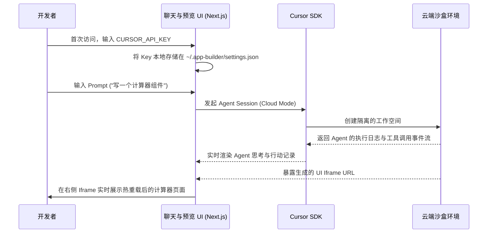

相关源文件

生成本页时使用的主要源文件：

- [sdk/app-builder/README.md](../../sdk/app-builder/README.md)

# App Builder 原型构建器

`sdk/app-builder` 展示了 Cursor SDK 在“云端沙盒”和“可视化迭代”方向的强大潜力。这是一个带有前端交互界面（React/Next.js）的小型 Web 平台，主要目的是演示如何在一个应用里实现端到端的“原型脚手架”生成流程。

## 什么是端到端原型迭代循环？

App Builder 解决的核心痛点是：当你脑海里只有一个想法时，如何利用 AI 快速验证，并且**不污染你的本地磁盘**。

这个应用在内部演示了以下生命周期循环：

## 核心技术点与实现重点

### 1. 隔离的云端环境
这是该示例与本地 CLI 的最大区别。SDK 会请求在云端创建一个全新的沙盒工作空间。Agent 会在这个沙盒内部执行诸如 `npm install`、创建 `React` 组件等操作。

### 2. 多会话状态管理
一个真实的 App Builder 不能仅仅只能问一个问题就结束。
- 它展示了如何在代码层面管理多个**应用构建对话（App-building Conversations）**。
- SDK 支持暂停、恢复或从上一个节点接力生成。这要求前端应用设计一套可靠的机制来绑定 Session ID 和 Agent ID。

### 3. 流式 UI 与 Iframe 热重载
- **Agent 事件流 (Event Stream)**：SDK 不仅仅返回最终的代码。它会吐出 Agent 正在使用的各种工具（例如正在写入 `App.tsx`，正在运行 `npm run build`）。前端需要拦截这些事件，并使用诸如“进度条”或“终端回显”的方式反馈给用户。
- **Iframe 实时预览**：沙盒内部通常会跑起一个类似 Vercel 预览地址的服务，前端只需要拿到这个 URL 然后塞进 Iframe 标签中即可。当 Agent 修改了代码并触发了沙盒内的 HMR（热更新）时，前端的用户就能立刻看到页面变化。

## 安全性警告与局限

正如 README 中明确指出的：
> "This app is intended as a local Cursor SDK demo. Do not deploy it as a shared public service without adding authentication, per-user storage, and stronger secret handling."

目前这套 App Builder 的设计仅限于在开发者的**本地启动（`localhost:3000`）**作为演示。它会将核心机密（`CURSOR_API_KEY`）以明文形式缓存在系统的 `~/.app-builder/settings.json` 中。
如果你想将这套逻辑作为商业化产品（SaaS）对外提供服务，你必须自己补充完整的认证鉴权（Auth）体系、每个用户隔离的持久化存储引擎，以及极其严格的密钥管理（Secret Management）。

## 相关页面

- [Agent Kanban 看板](agent-kanban.md)
