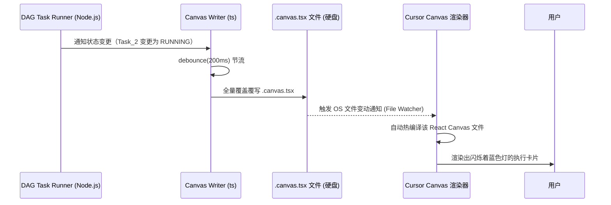

相关源文件

生成本页时使用的主要源文件：

- [sdk/dag-task-runner/README.md](../../sdk/dag-task-runner/README.md)
- [.cursor/skills/dag-task-runner/scripts/canvas_writer.ts](../../.cursor/skills/dag-task-runner/scripts/canvas_writer.ts)

# Canvas 动态渲染集成

在执行极其复杂的 [DAG 任务流编排](dag-task-runner.md)时，仅仅在终端看到一行行的标准输出（stdout）滚动是缺乏直观感受的。用户很难看出哪个节点被阻塞，哪些节点正在并发，以及当前进行到了整个架构图的哪一部分。

基于此痛点，Cursor Cookbook 展现了通过 **“黑客式热重载”（Hackish Hot-Reloading）** 机制，将 Agent 流转状态写入 Cursor 特有功能 Canvas 的高阶技巧。

## 工作原理：文件 IO 触发热更新

整个动态渲染的本质非常精妙：它并不依赖于 Cursor IDE 暴露出复杂的 Websocket 接口，而是完全基于 Cursor IDE 对本地文件的文件系统监听机制。

## `canvas_writer.ts` 深度解析

这个文件是专门为更新画布 UI 而生的，它内部包含了两大核心逻辑结构：

### 1. 状态聚合器与写入器
- `CanvasWriter` 是一个核心类，它维护着内部的 `RunState`，包括当前执行经过的总时长、任务字典 `TaskState` 等等。
- 它暴露了如 `tick` 等方法供主进程调用。
- 为了防止每收到 Agent 吐出的一个 Token 就进行磁盘读写（这会瞬间卡死 IDE 的热重载），所有的写入操作都被套用了一个 **Debounce 防抖** 函数（默认 200ms）。每 200 毫秒的截断口才将最新的快照写入磁盘。

### 2. React 源码生成函数 (`renderCanvasSource`)
这是整个模块中最关键的部分。它本质上是一个 **“写代码的代码”**（Code Generator）。
它会将当前 `RunState` 中的一切状态序列化，然后硬编码生成一大坨包含 React 语法的 `tsx` 字符串，最后 `fs.writeFileSync` 到硬盘上。这坨生成的 `tsx` 字符串长得非常像前端组件库：
- **`DAGGraph`**：生成用于展示拓扑节点的树状结构。
- **`statusGlyphColor`** / **`pillToneFor`**：计算卡片的边框与徽标颜色，例如 PENDING 是灰色，RUNNING 是动态呼吸色，FINISHED 是绿色。
- **`TaskList`**：生成具体任务卡片的详细内容列表。
- **`trailing` 方法**：这非常有趣，为了防止 Token 过长把卡片撑爆，它专门处理并保留了流文本最后的 N 个字符，并且渲染出一个类似 Terminal 控制台的效果。

### 滚动坐标保持
热更新带来的副作用是每次文件改写，IDE 内置的组件也会被重刷。在 `saveScrollY` 和 `restoreScrollY` 函数中，可以看到为了解决屏幕每次跳跃的闪烁问题，代码在组件卸载（unmount）与挂载（mount）的钩子中注入了对全局 window `scrollY` 的读写，达到了无缝接替的神奇效果。

## 相关页面

- [DAG 任务流运行器](dag-task-runner.md)
