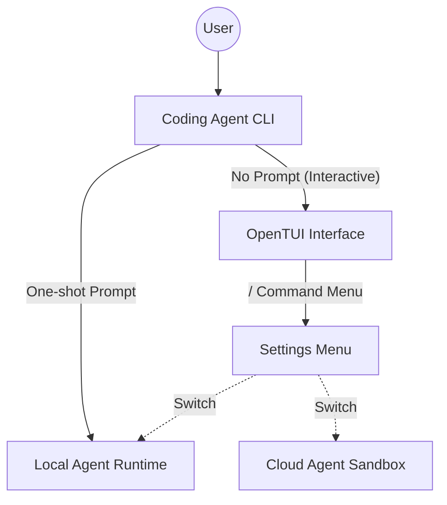

相关源文件

生成本页时使用的主要源文件：

- [sdk/quickstart/README.md](../../sdk/quickstart/README.md)
- [sdk/coding-agent-cli/README.md](../../sdk/coding-agent-cli/README.md)

# CLI 与基础接入

这一章节将 `Quickstart` 和 `Coding Agent CLI` 两个项目放在一起，主要探讨如何在纯命令行的环境（Node.js 或 Bun）中快速初始化 Cursor SDK，并通过终端体验 Agent 的能力。

## 极简入门：Quickstart

`sdk/quickstart` 是整个 Cookbook 中最基础的例子，目的是剥离所有的干扰项（没有复杂的前端，也没有繁重的状态管理），仅用最少的代码向你证明：如何将 Agent 的思考过程打印到控制台。

### 核心执行逻辑

1. **环境准备**：需要配置好环境变量 `CURSOR_API_KEY`。
2. **初始化 Client**：实例化 SDK 提供的核心入口对象。
3. **单发（One-Shot）提问**：代码内部硬编码（Hard-coded）好一个 Prompt 字符串发给服务端。
4. **流式打印（Streaming）**：捕获服务端返回的 Token 流，并直接通过 `process.stdout.write` 等手段输出到终端。
5. **结束等待**：等待任务标志为 FINISH 后结束进程。

从这个极简的示例中，开发者可以迅速了解 `@cursor/sdk` 的基础包结构与基础的生命周期。

## 进阶：Coding Agent CLI 工具

当你掌握了基础后，便可以直接看 `sdk/coding-agent-cli`。这是一个基于 **Bun** 编写的交互式终端应用。

### 为何使用 Bun？

在这个项目中，之所以强制要求使用 Bun >= 1.3，是因为它引入了一个复杂的终端交互界面（TUI）。该 TUI 使用了原生的底层渲染库（OpenTUI），而这种底层渲染能力需要借助 `bun:ffi`（外部函数接口）才能高性能地暴露给 JavaScript 层。

### 主要功能特性

1. **一发式命令 (One-shot Mode)**：
   运行 `bun run dev -- "解释一下这个项目的结构"`。默认情况下，它会在**本地运行环境 (Local Execution)** 启动一个 Agent 并让它分析你当前 `pwd` 的工作目录。
   
2. **交互式图形界面 (Interactive TUI)**：
   如果不带任何 Prompt 直接执行 `bun run dev`，会弹出一个完整的类图形化终端。
   - 输入 `/` 可以呼出命令菜单。
   - 在菜单中，你可以动态切换 Agent 运行在本地还是云端沙盒（Local vs Cloud）。
   - 你可以选择底层使用的模型（Model Selection）。
   - 可以重置 Session（会话）。

## 核心设计与权衡

- **即插即用**：这展示了将 Cursor 的强大理解能力无缝带入 `Terminal` 甚至服务器 `CI` 中的可行性。
- **状态维护**：在交互式 TUI 中，CLI 负责维护对话的上下文状态（Conversation State），因为每次提问都可能依赖于前一步终端报错或代码分析的结果。

## 相关页面

- [仓库结构与运行模式](repository-structure.md)
- [DAG 任务流运行器](dag-task-runner.md)
