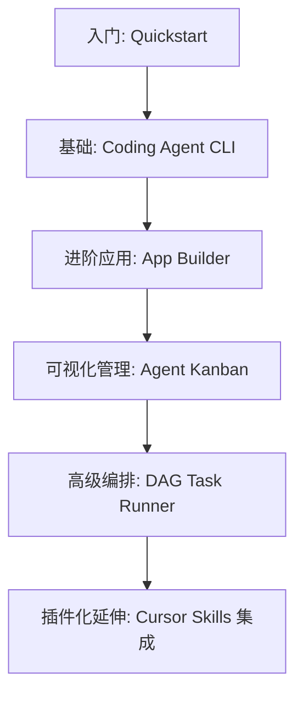

相关源文件

生成本页时使用的主要源文件：

- [README.md](../../README.md)

# 项目概览

Cursor Cookbook 是官方提供的一个代码示例集合仓库，旨在帮助开发者快速理解、集成并熟练使用 Cursor SDK 及其关联工具链。在这个仓库中，不仅包含了极简的快速开始脚本，还包含了一些相对复杂的企业级/高阶使用场景参考实现，例如带有可视化前端的 Kanban、基于 DAG 的并行任务编排工具。

## 核心定位

该仓库的核心定位是 **“赋能开发者基于 Cursor SDK 构建自有工具”**：
1. **SDK 最佳实践**：向开发者展示如何正确初始化 SDK、发送 Prompts、处理并发。
2. **场景化示例**：证明 Cursor Agent 能够做到什么程度——不仅是在 IDE 内交互，还可以脱离 IDE 在终端、Web 页面，甚至是多智能体拓扑网络中运行。
3. **生态集成**：展示如何通过 Cursor Skills（如 `.cursor/skills`）进行能力的共享与分发，并在 Canvas 等 IDE 自有资产中进行状态的动态回写展示。

## 典型使用场景与示例分布

该仓库的内容完全按目录组织在 `sdk/` 之下，独立成多个可单独运行的项目：

| 示例项目 | 复杂度 | 核心受众与解决的问题 |
|---------|-------|--------------------|
| **Quickstart** | Low | 刚接触 SDK 的开发者，只需了解如何跑通一个基本的回话并捕获 stdout 的文本流。 |
| **Coding Agent CLI** | Medium | 习惯终端的高级用户，想将 Cursor Agent 当作一个类似 `git` 或 `npm` 的终端命令工具来使用。 |
| **App Builder** | High | 想要做低代码/No-code 产品的开发者，该应用在沙盒环境里帮你 Scaffold（脚手架化）一个可直接预览的 React 应用。 |
| **Agent Kanban** | High | 需要监控后台多个运行中 Agent 状态的管理员，使用该看板可以通过 UI 面板实时掌握 Agent 动态与 Artifacts 产物。 |
| **DAG Task Runner** | Very High | 面对极大、极复杂的任务，将其拆解成 JSON 定义的拓扑排序任务网，分配给多个 Sub-agents 并行处理，大幅提高解决速度。 |

## 学习与阅读路线建议

对于首次浏览该源码库的开发者，推荐的学习路径如下：

通过沿着这条路线阅读源码，你可以从最简单的**一问一答（One-shot prompt）**过渡到**流式事件处理**，再深入理解到**复杂前端交互**，最后掌握**多智能体（Multi-agent）并发与重型状态机编排**的精髓。

## 相关页面

- [仓库结构与运行模式](repository-structure.md)
- [CLI 与基础接入](coding-agent-cli.md)
