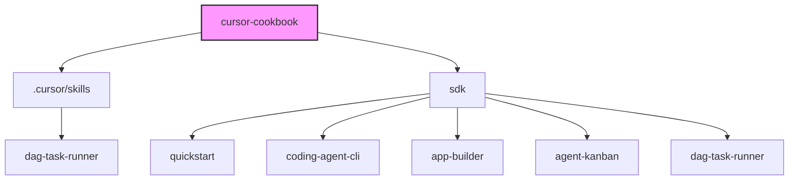

相关源文件

生成本页时使用的主要源文件：

- [sdk/quickstart/package.json](../../sdk/quickstart/package.json)
- [sdk/app-builder/package.json](../../sdk/app-builder/package.json)
- [sdk/agent-kanban/package.json](../../sdk/agent-kanban/package.json)
- [sdk/coding-agent-cli/package.json](../../sdk/coding-agent-cli/package.json)
- [sdk/dag-task-runner/package.json](../../sdk/dag-task-runner/package.json)

# 仓库结构与运行模式

Cursor Cookbook 的代码结构被设计得相对扁平且完全解耦。尽管所有代码都在同一个仓库下，但它们通常不是以强依赖的 Monorepo（比如依赖于 Lerna 或 Rush）形式呈现，而是采用类似 Workspace 的轻量组织。每个 `sdk/` 目录下的子文件夹都是一个完全独立的全栈/后端项目。

## 目录结构分析

从代码树上看，它主要分为三块区域：

### 1. SDK 示例区 (`sdk/`)
这是仓库的核心。里面的每一个目录都对应一个完整的场景示例：
- 每个目录自带自己的 `package.json`（或 `pnpm-workspace.yaml`），意味着它们可以被独立拉取、安装依赖并启动。
- 依赖项主要围绕 `@cursor/sdk`（Cursor 的核心 SDK 包）进行。
- 技术栈主要基于 **Node.js 22+**、**TypeScript**，部分项目使用了 **Bun 1.3+**（如 `coding-agent-cli` 因为使用了特定的 FFI 特性）以及 **Next.js** / **React**（用于前端展示）。

### 2. Skills 沉淀区 (`.cursor/skills/`)
在这里存放的并不是示例应用的源码本身，而是用于演示**如何将 SDK 产物封装成 Cursor 技能**。
- 以 `dag-task-runner` 为例，`sdk/dag-task-runner` 中的源码包含了一个能够同步生成 `.cursor/skills` 文件的脚本，让开发者可以在真实开发流中一键 Copy 该技能。

## SDK 运行模式：Local vs Cloud

在 Cookbook 提供的几乎所有示例中，底层的 Cursor Agent 都有两种主要的执行环境，这在源码实现（例如 `quickstart` 或 `coding-agent-cli`）中有着明显的体现。

### Local Mode (本地模式)
默认情况下，许多基于 CLI 或终端的工具（例如 Quickstart 和 Coding Agent CLI 的一发式 Prompt）会在 Local 环境运行。
- **机制**：通过 `process.cwd()` 等机制，Agent 拥有和终端完全一致的工作目录。
- **优势**：文件读写权限直接可控，对本地硬盘毫无阻碍，能够极快地进行代码分析与重构。
- **安全边界**：由操作者的终端权限决定。

### Cloud Mode (云端沙盒模式)
类似于 App Builder 这种用于“原型构建”的工具，通常会启用 Cloud 模式。
- **机制**：在 Cursor 提供的沙盒/云端容器里运行 Agent，这意味着所有的脚手架、文件生成都在隔离环境中发生。
- **优势**：非常适合用来试验新框架、尝试那些会大范围覆盖文件的“破坏性”修改，不会弄脏你现有的本地仓库。
- **表现**：通常配合诸如 Kanban 等前端系统来展示云端返回的 Artifacts，随后用户可以选择将哪些产出通过 HTTP 流保存或合并回本地。

## 依赖管理与构建

尽管是各个独立的项目，但整个仓库采用 `pnpm` 进行了统一的顶层管理（可通过多个 `pnpm-workspace.yaml` 看出依赖组织形式）。

| 环境要求 | 推荐版本 |
|---------|---------|
| Node.js | >= 22.0 |
| Bun | >= 1.3 (用于 CLI) |
| Package Manager | pnpm |

## 相关页面

- [项目概览](overview.md)
- [CLI 与基础接入](coding-agent-cli.md)
