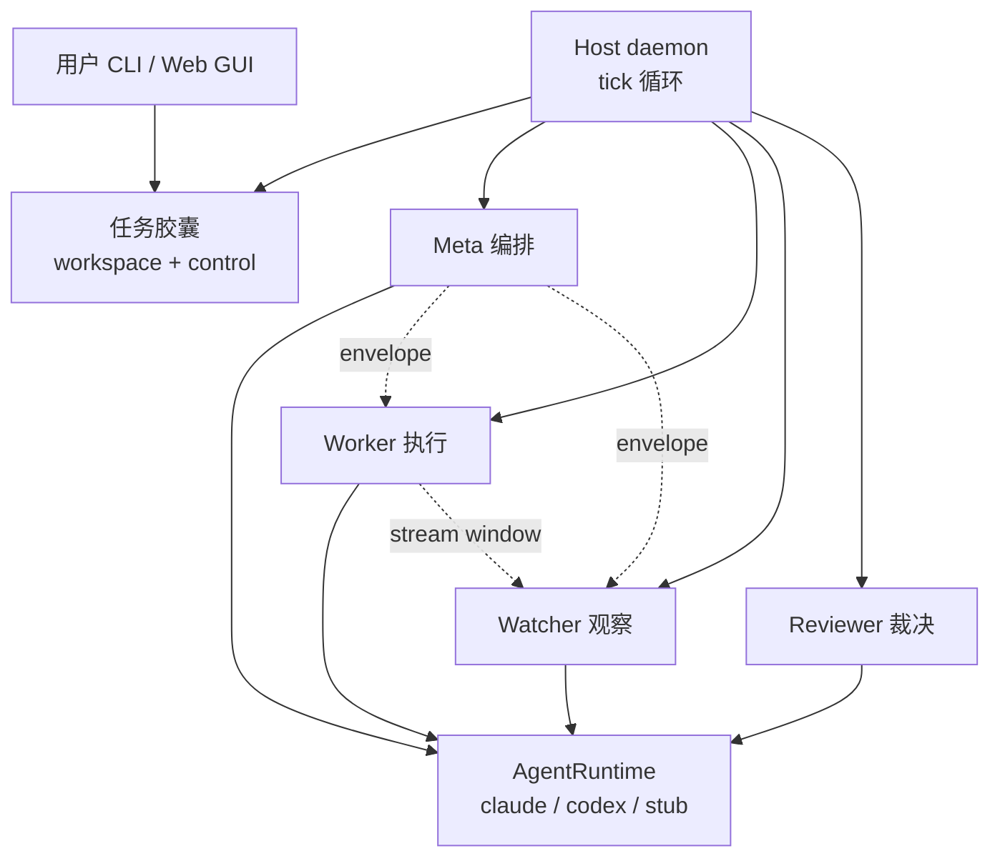
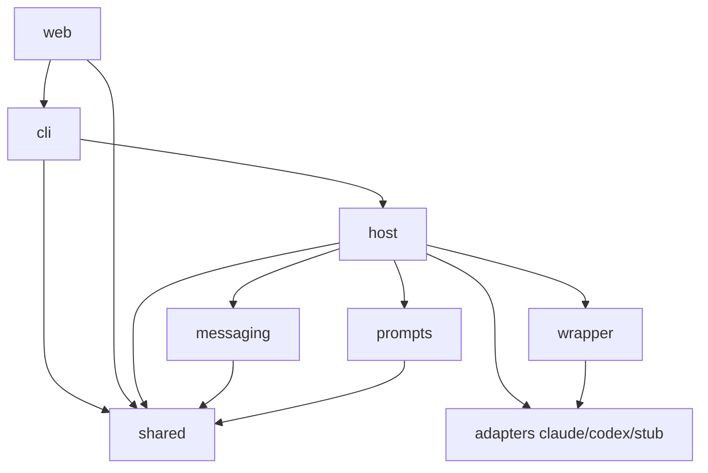
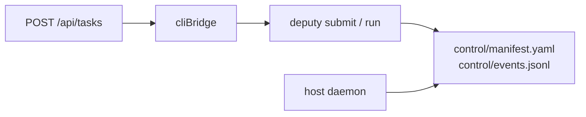
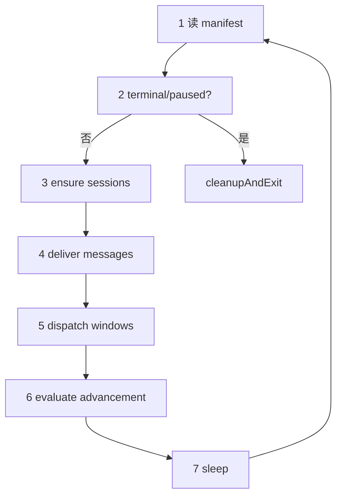
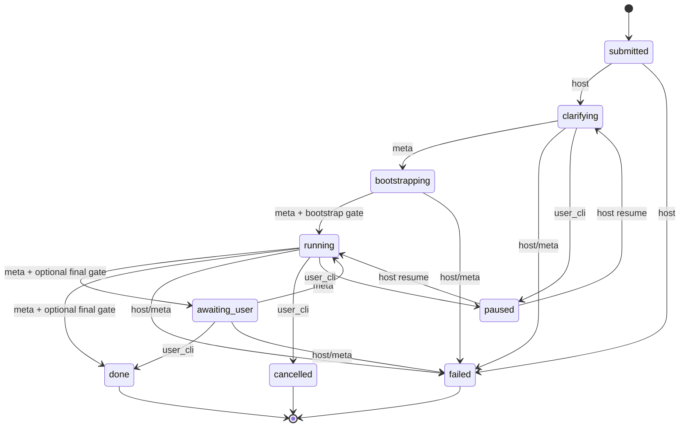
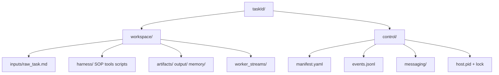
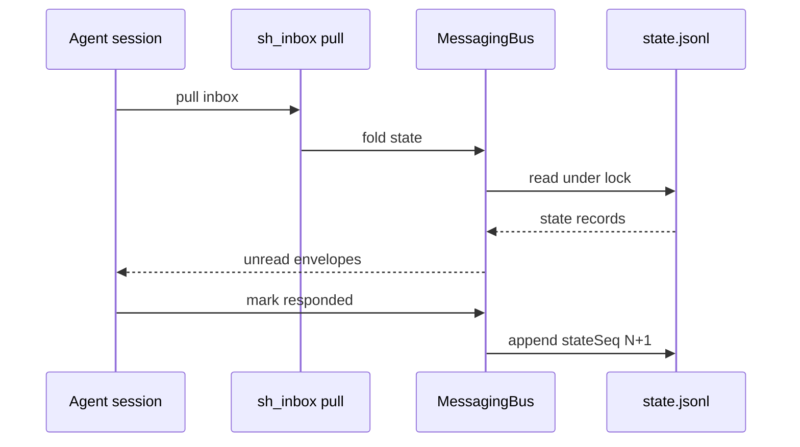
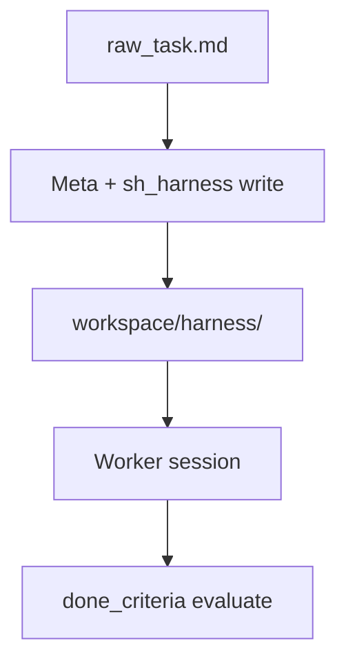
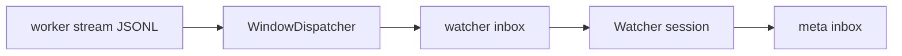
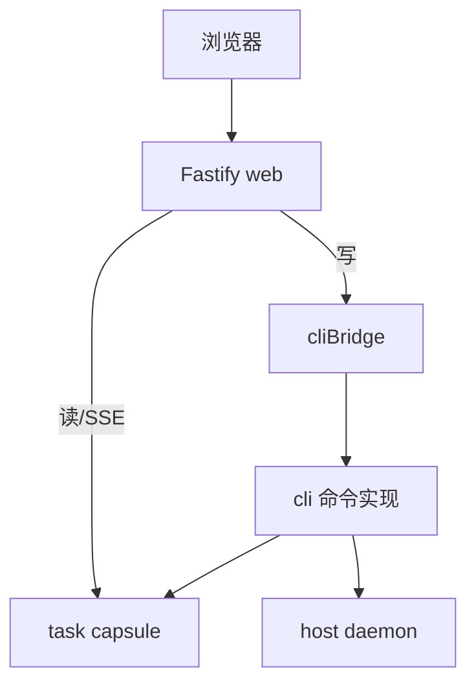

# Deputy Agent — Full Wiki Export

- Source: https://github.com/SomeoneKong/deputy-agent
- Commit: `d6127c4f23c17e9dc58a5e4431778a96744aa783`
- Mode: comprehensive

## Table of Contents

### 概览
- [项目概览](#overview)

### 架构与运行时
- [系统架构与模块地图](#system-architecture)
- [Host 守护进程与 Tick 循环](#host-daemon-runtime)
- [四角色协作与阶段机](#agent-roles-stage-machine)

### 数据与通信
- [任务胶囊与磁盘格式](#task-capsule-data)
- [消息总线与 Envelope](#messaging-bus)

### Provider 与工具
- [Provider 适配层](#provider-adapters)
- [Host 工具与 Harness](#host-tools-harness)
- [Watcher 流水线与完成判据](#watcher-done-criteria)

### 入口与运维
- [CLI 与 Web GUI](#cli-web-gui)
- [局限性与质量现状](#limitations-quality)

---

<details>
<summary>相关源文件</summary>

生成本页时使用的主要源文件：

- [README.md](../../../project-repos/deputy-agent/README.md)
- [package.json](../../../project-repos/deputy-agent/package.json)
- [docs/ARCHITECTURE.md](../../../project-repos/deputy-agent/docs/ARCHITECTURE.md)
- [docs/LIMITATIONS.md](../../../project-repos/deputy-agent/docs/LIMITATIONS.md)

</details>

# 项目概览

白领知识工作里有一类任务：写调研报告、整理材料、跑完一套 SOP——往往需要数小时到数天，中间只需要在几个检查点和你对齐。交互式 coding agent 擅长短回合改代码，却不擅长「交稿后自己跑完」；固定 workflow 又无法为每个任务定制方法论。**Deputy 的核心赌注是：每个任务应拥有专属的 harness（SOP、工具清单、完成判据），并由一个长期在线的 Meta 角色生成与仲裁，Worker 只负责在 workspace 里执行。**

这不是 peer 多 Agent 群聊，而是 **master–worker + 审计双翼**：Meta 规划与阶段推进，Worker 动手，Watcher 按时间窗口观察 Worker 输出流，Reviewer 在阶段门禁给出 verdict。四个角色从不直接互调，只通过三通道 inbox 交换 envelope——这让崩溃恢复、并发 CLI 操作、跨进程一致性的设计都落在可审计的 JSONL 上，而不是内存里的回调链。

## 能力全景

- **长时无人值守**：目标运行窗口约 1 小时–2 天；Host 以默认 1s tick 持续调度，只在 `awaiting_user` 等检查点需要你介入。
- **通用（非 coding）导向**：README 明确面向日常知识工作，而非 IDE 内补全或 repo 级 refactor。
- **按需 harness**：进入 `bootstrapping` 后 Meta 在 `workspace/harness/` 写入 SOP、脚本、`done_criteria.yaml` 等，而非全局固定 playbook。
- **内置审查链**：进入 `running` 前须通过 `bootstrap_self_review`；Worker 声明完成后的 `final_review` 门禁同样 fail-closed。
- **文件系统级任务记忆**：Worker 多 session 状态、消息、事件流全部落盘；**跨任务记忆在 0.1.0 未实现**。
- **按角色选 Provider**：`manifest.roleBindings` 可为 meta/worker/watcher/reviewer 分别绑定 Claude 或 Codex；Host 在会话启动前解析为 `(runtime, model, isolation)` 三元组。

## 架构鸟瞰

Host 是单任务单实例 daemon；CLI 与 Web GUI 只是两种写入口，最终都改同一份 capsule。



**关键设计决策**：Provider 只出现在 `wrapper/adapters`；Host 与 CLI 从不直连 SDK。换模型或加 stub 测试时，上层 orchestration 代码不动。

## 技术栈与规模

| 维度 | 事实 |
|------|------|
| 语言 | TypeScript（ESM，`"type": "module"`） |
| 运行时 | Node.js >= 22 |
| Agent 内核 | `@anthropic-ai/claude-agent-sdk` ^0.3.148；Codex 走独立 adapter |
| Web | Fastify 5 + 静态前端（marked、DOMPurify） |
| 校验 | Zod 4、AJV 8 |
| 源文件规模 | 约 174 个 tracked 文件，117 个 `.ts`（inventory 统计） |
| 自动化测试 | **开源导出包未附带 test runner**（仅 `typecheck` / `build` / `check`） |

## 与同类方案的差异

- **对比短回合 coding agent**：Deputy 优化的是阶段机 + 磁盘协作 + Reviewer 门禁，不是单次 prompt 的 tool loop。
- **对比固定 LangGraph workflow**：harness 按任务生成；阶段迁移由 Meta 通过 `sh_stage__advance` 驱动，而非编译期写死的图。
- **对比纯 CLI wrapper**：有完整 Web GUI（SSE 流式观察）、message bus 恢复语义、done criteria 无 LLM 评估层。

## 阅读路线

| 你的目标 | 建议顺序 |
|----------|----------|
| 理解整体模块边界 | 本页 → [系统架构](system-architecture.md) |
| 搞清任务如何跑完 | [Host 守护进程](host-daemon-runtime.md) → [四角色与阶段机](agent-roles-stage-machine.md) |
| 对接 Provider / 换模型 | [Provider 适配层](provider-adapters.md) → [局限性与质量](limitations-quality.md) |
| 本地部署与操作 | [CLI 与 Web GUI](cli-web-gui.md) → [任务胶囊](task-capsule-data.md) |

Sources: [README.md:5-35](../../../project-repos/deputy-agent/README.md#L5-L35), [docs/ARCHITECTURE.md:74-99](../../../project-repos/deputy-agent/docs/ARCHITECTURE.md#L74-L99)

<details class="source-snippets">
<summary>引用源码</summary>

<!-- source-snippets:start -->

#### `README.md:5-35`

```markdown
> Deputy — a self-supervising master–worker agent framework that auto-scaffolds a
> task-tailored harness for long, autonomous delivery.

Deputy is a TypeScript framework for long-running, autonomous tasks. You hand it a task
description; it generates a task-tailored harness and drives the work through a structured
lifecycle to completion, syncing with you only at key checkpoints.

It uses a **master–worker** design rather than a peer multi-agent system: a master (the Meta
role) plans, prepares the harness, and arbitrates outcomes, while a worker executes the task —
with a Watcher (live observation) and a Reviewer (verdicts at stage gates) acting as review
agents that audit and correct the worker. At heart it is a master–worker (2-agent)
architecture. Deputy is exposed both as a command-line tool and as a local Web GUI, and is
multi-provider: Claude and Codex are supported behind a common adapter layer.

## Highlights

- **Long, unattended tasks.** Built for jobs that run roughly **1 hour to ~2 days** without a
  human in the loop, not short interactive turns.
- **General (non-coding) focus.** Aimed at everyday white-collar / knowledge work; it is
  deliberately *not* specialized for coding.
- **On-demand harness.** A task-tailored harness (methodology / SOP / tools / completion
  checks) is auto-generated per task, instead of one fixed harness for everything.
- **Built-in review.** A master (the Meta role) drives a Worker, while a Watcher (live
  observation of the worker's output) and a Reviewer (verdicts at stage gates) audit and
  correct the work.
- **File-system, task-level memory.** Agents coordinate through workspace files and messages;
  the worker's multi-session state persists on disk.
- **Per-role provider/model.** Each role can run on a different provider and model — e.g. a
  cheaper model for the Worker.
- **Built on Claude Code / Codex.** Uses the Claude Code and Codex CLI agent kernels, in
  TypeScript.
```

#### `docs/ARCHITECTURE.md:74-99`

```markdown
## Runtime model (summary)

A task is a directory — the *capsule* — with a `workspace/` half (where work happens) and a
`control/` half (orchestration state). The authoritative state is `control/manifest.yaml`;
every orchestration-level event is appended to `control/events.jsonl`.

The host is a **single-instance daemon** (guarded by `control/host.pid.lock`) running a tick
loop. On each tick it reads the manifest and, depending on the current stage, ensures the
right agent sessions are online, delivers unread messages, dispatches the worker's output
windows to the watcher, and evaluates whether the task should advance. It exits when the
task reaches a terminal or paused stage.

Four agent roles cooperate (full detail in [RUNTIME.md](RUNTIME.md)):

- **meta** — long-lived orchestrator: clarifies the task, prepares the per-task harness,
  starts/stops the worker, arbitrates worker outcomes, and decides when the task is done or
  needs the user.
- **worker** — the executor that performs the task inside `workspace/`.
- **watcher** — observes windows of the worker's output stream and reports observations back
  to meta; can trigger context compaction when its own context grows large.
- **reviewer** — a one-shot session that produces a verdict at review points.

Agents never call each other directly; they exchange **envelopes** over three inbox
**channels** (`meta`, `worker`, `watcher`), each with a per-channel kind whitelist. Delivery
state is derived by folding the message-bus state stream, which makes it recoverable across
host restarts. See [DATA_FORMATS.md](DATA_FORMATS.md) for the envelope schema.
```

<!-- source-snippets:end -->
</details>

## 相关页面

- [系统架构与模块地图](system-architecture.md) — `src/` 十一块职责与依赖方向
- [Host 守护进程与 Tick 循环](host-daemon-runtime.md) — 单实例锁与七步 tick
- [四角色协作与阶段机](agent-roles-stage-machine.md) — 九阶段与 Reviewer 门禁

---

<details>
<summary>相关源文件</summary>

生成本页时使用的主要源文件：

- [docs/ARCHITECTURE.md](../../../project-repos/deputy-agent/docs/ARCHITECTURE.md)
- [src/index.ts](../../../project-repos/deputy-agent/src/index.ts)
- [package.json](../../../project-repos/deputy-agent/package.json)
- [README.md](../../../project-repos/deputy-agent/README.md)

</details>

# 系统架构与模块地图

Deputy 的代码组织围绕一个原则：**所有「智能」在 Provider 会话里，所有「秩序」在 Host + 磁盘状态里。** `src/shared` 定义胶囊布局与 manifest 状态机；`src/host` 是唯一会同时碰 manifest、message bus、AgentRuntime 和 host tools 的层；`src/wrapper` 把 Claude/Codex 差异折叠成统一事件流；CLI 与 Web 只是特权写者，不持有会话。

## 子系统职责表

| 目录 | 职责 | 典型消费者 |
|------|------|------------|
| `src/shared` | 路径布局、`manifest.yaml`、原子写、文件锁、ID、JSONL 工具 | Host、CLI、Web readService |
| `src/wrapper` | `AgentRuntime`、`RuntimeCapabilities`、HostToolRegistry | Host daemon |
| `src/wrapper/adapters` | `claude` / `codex` / `stub` 具体实现 | 生产与测试 |
| `src/messaging` | Envelope schema、三通道 bus、`state.jsonl` | Host、agent tools |
| `src/prompts` | 角色 system prompt、first message、en/zh 模板 | Host 启动 session 时 |
| `src/host` | Tick 循环、阶段机、recovery、watchdog、done_criteria | 每任务 daemon |
| `src/host/tools` | Meta/Worker/Watcher/Reviewer 可调用的 `sh_*` 工具 | 注册进 runtime |
| `src/host/watcher` | Worker 输出流窗口化与 dispatch | Tick 第 5 步 |
| `src/cli` | 参数解析、`deputy.config.json`、spawn host | 用户 / Web cliBridge |
| `src/web` | Loopback HTTP、SSE、静态 UI | 浏览器 |

官方 ARCHITECTURE 文档用一张 ASCII 图把 CLI/Web、capsule、Host、四角色、Runtime 串起来；DeepWiki 用 Mermaid 强调**数据权威在 control/，工作在 workspace/**。

## 依赖方向



**Insight**：Web 写操作不 duplicate 业务逻辑——`routes.ts` 通过 `cliBridge` 调用与 CLI 相同的 in-process 命令，保证「GUI 点的按钮」与「终端敲的命令」走同一套校验与锁。

## 双入口、单胶囊



Neither CLI nor Web 订阅 Provider 事件；它们读 `events.jsonl`、conversation、stream 文件，或通过 SSE 间接 watch 磁盘。

## 构建与入口

`package.json` 仅三条脚本：`typecheck`（全量 tsc）、`build`（`tsconfig.build.json` + 拷贝 web static）、`check`（二者串联）。无 `test` script——质量门禁目前止于类型检查与编译。

推荐运行路径：`npm run build` 后 `node dist/cli/bin.js web`（默认 `127.0.0.1:4319`）。

Sources: [docs/ARCHITECTURE.md:27-42](../../../project-repos/deputy-agent/docs/ARCHITECTURE.md#L27-L42), [README.md:94-110](../../../project-repos/deputy-agent/README.md#L94-L110), [package.json:10-13](../../../project-repos/deputy-agent/package.json#L10-L13)

<details class="source-snippets">
<summary>引用源码</summary>

<!-- source-snippets:start -->

#### `docs/ARCHITECTURE.md:27-42`

```markdown
## Subsystem map

| Directory | Responsibility |
| --- | --- |
| `src/shared` | Task-capsule path layout, the `manifest.yaml` task state machine, atomic file writes, locks, ids, time/JSONL helpers, and `status.md` rendering. |
| `src/wrapper` | The provider-neutral surface: the `AgentRuntime` interface and the capability model (`RuntimeCapabilities`). |
| `src/wrapper/adapters` | Concrete provider implementations — `claude` and `codex` — plus a `stub` runtime for offline/non-provider runs. |
| `src/wrapper/types` | Type contracts shared across the wrapper: runtime, capability, session, events, isolation, tool-bridge. |
| `src/messaging` | The message bus: envelope schema, per-channel inboxes, the message-bus state stream, cross-process concurrency, and recovery. |
| `src/prompts` | Assembles system prompts and first-user messages for each role, with localized literals (en/zh) and per-prompt language fallback. |
| `src/host` | The daemon: the tick loop, agent-session orchestration, the stage machine, recovery, watchdogs, and retry. |
| `src/host/tools` | Host-provided tools the agents call (messaging, agent control, harness edits, stage transitions, reviewer verdicts). |
| `src/host/watcher` | Slices the worker's output stream into windows and dispatches them to the observer role. |
| `src/host/done_criteria` | Declarative completion checks (`done_criteria.yaml`) evaluated when a worker session ends. |
| `src/cli` | CLI entry, argument parsing, `deputy.config.json` loading, and launching the daemon (foreground or detached). |
| `src/web` | The local Web GUI backend — a loopback-only HTTP server with SSE streaming. |
```

#### `README.md:94-110`

````markdown
## Project layout

```
src/
  shared/      task capsule layout, manifest (state machine), atomic IO, ids, paths
  wrapper/     provider-neutral AgentRuntime interface + capability model
    adapters/  claude / codex adapters, plus a stub for offline use
    types/     runtime / capability / session / event type contracts
  messaging/   envelope schema + per-channel inbox bus (message passing)
  prompts/     prompt asset assembly for the agent roles
  host/        the daemon: tick loop, agent orchestration, stage machine
    tools/     host-provided tools the agents call
    watcher/   worker-stream windowing + dispatch to the observer role
    done_criteria/  declarative completion checks gating task completion
  cli/         CLI entry, argument parsing, config, daemon launch
  web/         loopback-only HTTP + SSE Web GUI backend
```
````

#### `package.json:10-13`

```json
  "scripts": {
    "typecheck": "tsc -p tsconfig.json",
    "build": "tsc -p tsconfig.build.json && node scripts/copy-web-static.mjs",
    "check": "npm run typecheck && npm run build"
```

<!-- source-snippets:end -->
</details>

## 相关页面

- [项目概览](overview.md) — 产品定位与能力全景
- [Host 守护进程与 Tick 循环](host-daemon-runtime.md) — `src/host` 运行时行为
- [任务胶囊与磁盘格式](task-capsule-data.md) — `shared` 定义的 on-disk 契约

---

<details>
<summary>相关源文件</summary>

生成本页时使用的主要源文件：

- [src/host/daemon.ts](../../../project-repos/deputy-agent/src/host/daemon.ts)
- [src/host/main_loop.ts](../../../project-repos/deputy-agent/src/host/main_loop.ts)
- [docs/RUNTIME.md](../../../project-repos/deputy-agent/docs/RUNTIME.md)
- [src/host/watchdog.ts](../../../project-repos/deputy-agent/src/host/watchdog.ts)

</details>

# Host 守护进程与 Tick 循环

每个任务 capsule 最多运行 **一个** Host 进程。它持有 `control/host.pid.lock` 咨询锁，写 `control/host.pid`，跑完 startup recovery 后进入 **while tick**——读 manifest、按阶段保活会话、投递 inbox、dispatch watcher 窗口、协调 worker 生命周期，直到阶段变为 terminal 或 `paused`。

Tick 本身**不直接改 stage**（`submitted→clarifying` 等少数 host-autonomous 迁移除外）；阶段推进由 Meta 的 `sh_stage__advance` 或用户 CLI 触发。Tick 负责的是「在当前 stage 下，该在线的人是否在线、该读的信是否 inject 进 session」。

## 单实例与退出码

| 退出码 | 含义 |
|--------|------|
| 0 | `done` / `paused` / `awaiting_user` 正常收束 |
| 1 | `failed` 或 Meta 永久启动失败 |
| 2 | manifest 读失败或 Host 自身 fatal |
| 6 | 已有 Host 持有 `host.pid.lock` |
| 130 | SIGINT |

第二实例启动会立即以 code 6 退出——这是刻意设计：避免两个 Host 同时 inject、重复启动 Worker。

## 每 Tick 七步

RUNTIME 文档把循环拆成可操作的七步（默认 sleep 1000ms）：



**Step 4** 对每个相关 inbox 折叠 wake cursor 之后的未读 envelope，inject 到目标 session。**Step 5** 仅在 `running`：WindowDispatcher 按默认 180s 单调时钟窗口切 Worker JSONL 流。**Step 6** 处理 Worker 首次自动启动、退出后的 `worker_session_end`、以及 Meta idle 时的 completion reminder——**Host 不会自动重启 Worker**。

## Worker 生命周期所有权

`daemon.ts` 文件头注释写得很直白：Worker 退出 → enqueue `worker_session_end` → **等待 Meta 仲裁**（新开 Worker、停任务、推进 stage 或发指令）。这与许多 auto-retry agent loop 相反——续跑是 Meta 的业务决策，不是 Host 的隐式重试。

Watchdog 三类 trip 同样 **close 但不 restart**：

| 范围 | 条件 | 默认阈值 |
|------|------|----------|
| Worker | `no_progress`（久无 tool_use） | 30 min |
| Worker | `tool_loop`（连续相同 tool 调用） | 5 次 |
| Reviewer | 会话总时长 | 30 min |
| Meta push | 单次 inject/await | 60 min |

Meta push 超时**不关闭 Meta**（只有 Meta 能结束 Meta session），但累计多次会走 `META_START_FAILURE_LIMIT` 强制 `failed`。

## 前台 vs 分离模式

- **Foreground**：CLI `--foreground`，日志走 CLI stdout/stderr。
- **Detached**：CLI spawn 子进程，stdout/stderr 重定向到 `control/host.log`，语义与 foreground 相同。

## 与 Provider 的接点

每个 tick 内，`RoleResolver` 把 manifest 里的 `roleBindings` 解析成具体 `AgentRuntime`；`registerHostTools` 按角色过滤工具名后 `startSession`。可选能力（compact、contextUsage、resumeSession）必须先查 `capabilities` 再调用——Host 不会在运行时才发现 adapter 不支持。

Sources: [docs/RUNTIME.md:9-38](../../../project-repos/deputy-agent/docs/RUNTIME.md#L9-L38), [src/host/daemon.ts:1-37](../../../project-repos/deputy-agent/src/host/daemon.ts#L1-L37), [src/host/daemon.ts:130-137](../../../project-repos/deputy-agent/src/host/daemon.ts#L130-L137)

<details class="source-snippets">
<summary>引用源码</summary>

<!-- source-snippets:start -->

#### `docs/RUNTIME.md:9-38`

```markdown
## Host daemon

The host is a **single-instance daemon**. On startup it acquires an OS advisory file lock on
`control/host.pid.lock` (see [Concurrency & recovery](#concurrency--recovery)); if another live
host already holds it, the new process exits immediately with a single-instance exit code.
After acquiring the lock it writes `control/host.pid` (`{ pid, startedAt }`), runs startup
recovery, then enters the tick loop.

The daemon runs either in the **foreground** (inside the CLI process, with `--foreground`; host
logs go to the CLI's stdout/stderr) or **detached** (the CLI spawns it as a background child
that detaches from the launching shell's session, with stdout/stderr redirected to
`control/host.log`). Both paths run the same loop with identical semantics.

Each tick reads the manifest and dispatches by the current stage:

| Step | Action |
| --- | --- |
| 1. Read manifest | Load `control/manifest.yaml`. A read failure is fatal (exit code 2). |
| 2. Terminal / paused check | If the stage is terminal (`done` / `failed` / `cancelled`) or `paused`, clean up sessions and exit. |
| 3. Ensure sessions | Start / keep online the agent sessions required by the stage (meta always; watcher in `running`). |
| 4. Deliver messages | Fold each relevant inbox for unread envelopes after a per-channel wake cursor and inject them into the target session. |
| 5. Dispatch windows | In `running`, slice the worker's output stream into windows and enqueue them to the watcher inbox. |
| 6. Evaluate advancement | Reconcile worker lifecycle (first start / restart after a worker exit) and post worker-exit reminders to meta. |
| 7. Sleep | Wait the tick interval (default 1000 ms), then loop. |

Stage transitions themselves are made by the agents (meta) or the host, not by the loop body;
the loop only steers sessions and message flow. When the stage becomes terminal or `paused`,
`cleanupAndExit` closes any held sessions, writes their paired session-ended records, appends a
`host_stopping` event, removes `control/host.pid`, and returns an exit code derived from the
stage. The daemon does not auto-restart the worker after it exits (see below).
```

#### `src/host/daemon.ts:1-37`

```typescript
/**
 * Host daemon orchestrator (assembles the tick main loop).
 *
 * Wires the host subsystem mechanisms into a complete daemon:
 *  - single-instance lock (acquireSingleInstanceLock)
 *  - startup recovery (runStartupRecovery)
 *  - tick while loop: readManifestSnapshot → terminal / paused → cleanupAndExit; otherwise
 *    dispatchByStage → start/stop Meta / Worker / Watcher sessions per TickAction (via wrapper +
 *    prompt assembly + registering host tools) + wake-cursor inject + worker reconcile (first auto
 *    start + Meta explicit start) + Watcher window dispatch
 *  - exit codes + append host_stopping + remove host.pid
 *  - permanent Meta failure: N consecutive start failures → force failed
 *
 * Provides the concrete HostAgentControl (tool deps): requestWorkerStart / stopWorker /
 * triggerReviewer / workerSessionSeqResolver / active-handle getters. The orchestration layer
 * enqueues a worker_interrupt_softkill_failed host_event when interrupt_worker soft-kill fails; on
 * success it enqueues worker_session_end.
 *
 * Decision ownership: the daemon does not self-restart workers (worker exit → worker_session_end,
 * awaiting Meta arbitration).
 *
 * Watchdog integration (three session-level kinds; pure-function detection in src/host/watchdog.ts):
 *  - Worker session: no_progress (idle past threshold since last tool_use) + tool_loop (N consecutive
 *    identical (toolName, hash(input))) — startWorker's subscribe listener accumulates
 *    WorkerWatchdogState, monitorActiveWorker calls checkWorkerWatchdog each tick; trip → the unified
 *    action (forceAbort close + derive watchdog_* exitReason + worker_session_end + watchdog_triggered
 *    + host_event). The host does not self-restart.
 *  - Reviewer session timeout: inside agent_control.triggerReviewer (with injected now + thresholds).
 *  - Meta push: driveMetaWake / ensureMetaOnline wraps Meta inject with withTimeout; on timeout it
 *    does not close Meta (only Meta can exit Meta), emits host_event + watchdog_triggered, and after
 *    M consecutive → metaStartFailures +1 (feeding the META_START_FAILURE_LIMIT force-failed path).
 *  - tool-level / API-level watchdogs are not re-implemented here (already handled by the Claude
 *    adapter toolBridge / wrapper RuntimeError + retry).
 *
 * Time is injectable (DaemonConfig.now / watchdogThresholds) for fake-clock testing.
 *
 * The daemon uses an injected AgentRuntime (a real provider adapter in production, a stub in tests).
```

#### `src/host/daemon.ts:130-137`

```typescript
/** Host process exit codes. */
export const HostExitCode = {
  Ok: 0, // done / paused / awaiting_user yield
  GeneralError: 1, // failed terminal / permanent Meta failure
  Fatal: 2, // manifest read failure / host's own fatal error
  SingleInstance: 6, // host.pid.lock conflict
  Sigint: 130,
} as const;
```

<!-- source-snippets:end -->
</details>

## 相关页面

- [四角色协作与阶段机](agent-roles-stage-machine.md) — 各 stage 应有哪些 session 在线
- [消息总线与 Envelope](messaging-bus.md) — Step 4 的 inbox 语义
- [Provider 适配层](provider-adapters.md) — Session 事件流与 inject

---

<details>
<summary>相关源文件</summary>

生成本页时使用的主要源文件：

- [src/host/stage_machine.ts](../../../project-repos/deputy-agent/src/host/stage_machine.ts)
- [src/shared/manifest.ts](../../../project-repos/deputy-agent/src/shared/manifest.ts)
- [docs/RUNTIME.md](../../../project-repos/deputy-agent/docs/RUNTIME.md)
- [docs/ARCHITECTURE.md](../../../project-repos/deputy-agent/docs/ARCHITECTURE.md)

</details>

# 四角色协作与阶段机

Deputy 的「多 Agent」不是四个对等 LLM 互相 @，而是 **一条有审计的流水线**：Meta 持有阶段推进权与 harness 写权限；Worker 只在 workspace 动手；Watcher 读 Worker 流的时间片；Reviewer 在门禁点一次性给 verdict。角色间零 direct call，全靠 message bus 上的 typed envelope。

## 四角色一览

| 角色 | 生命周期 | 核心职责 |
|------|----------|----------|
| **meta** | 长活，从 `submitted`/`clarifying` 到 terminal/paused | 澄清任务、写 harness、启停 Worker、阶段迁移、判定何时找用户 |
| **worker** | 每次 attempt 一 session；首次进 `running` Host 自动启一次 | 在 workspace 执行任务 |
| **watcher** | `running` 期间长活 | 消费 `worker_stream_window`，向 meta 报告观察；可触发 context compaction |
| **reviewer** | 按需 one-shot | 产出 `reviewer_verdict`（bootstrap / final 两阶段） |

**Insight**：只有 meta 能结束 meta session——Host 对 Meta 的 watchdog 超时不会 force-close Meta，避免 orchestrator 被底层误杀。

## 九阶段状态机

`manifest.stage` 是单一真相源；`stageHistory` 记录每次进入时间戳。



进行中阶段：`submitted`、`clarifying`、`bootstrapping`、`running`、`awaiting_user`。  
终端：`done`、`failed`、`cancelled`。`paused` 记录 `pausedFrom` 以便 resume 回到原 in-progress stage。

## 迁移触发器三类

`stage_machine.ts` 用 `TransitionTrigger` 区分：

- **`host`**：`submitted→clarifying`、resume、force `failed`
- **`meta_tool`**：大部分 in-progress 前进/回退（经 `sh_stage__advance`）
- **`user_cli`**：`pause`、`cancel`、`awaiting_user→done`

每次写入走 manifest 锁 + **CAS**：`expectedFromStage` 不匹配则 `StageCasMismatch`——并发 cancel/pause 不会被静默覆盖。

## Reviewer 两道门禁（fail-closed）

1. **bootstrap_self_review**：任意非 `running` → `running` 前，任务生命周期内须出现过 `reviewerPhase=bootstrap_self_review` 的 `reviewer_verdict`（`verdict_missing` 也算「审过」）。
2. **final_review**：存在 `worker_completion_claim` 时，`running→{awaiting_user,done}` 要求之后有 `reviewerPhase=final_review` 且 composite key 严格大于最新 claim。

**Bus 未初始化时两道门都 fail-closed**——不会「无消息总线也放行 running」。

## 各 stage 在线角色

| Stage | 活跃角色 |
|-------|----------|
| `submitted` | —（Host 立刻推 `clarifying`） |
| `clarifying` / `bootstrapping` | meta |
| `running` | meta + worker + watcher（reviewer 按需） |
| `awaiting_user` | meta |

Sources: [src/host/stage_machine.ts:54-110](../../../project-repos/deputy-agent/src/host/stage_machine.ts#L54-L110), [src/host/stage_machine.ts:120-133](../../../project-repos/deputy-agent/src/host/stage_machine.ts#L120-L133), [docs/RUNTIME.md:82-96](../../../project-repos/deputy-agent/docs/RUNTIME.md#L82-L96)

<details class="source-snippets">
<summary>引用源码</summary>

<!-- source-snippets:start -->

#### `src/host/stage_machine.ts:54-110`

```typescript
export function checkTransitionAllowed(from: Stage, to: Stage, trigger: TransitionTrigger): string | null {
  if (to === "submitted") return "submitted is unreachable initial stage";

  if (trigger === "meta_tool") {
    // Meta cannot transition to paused (a user privilege)
    if (to === "paused") return "paused is a user privilege; Meta cannot request it";
    // Meta main path + reset: source must be an in-progress stage
    if (!isInProgress(from)) return `cannot transition from ${from} via meta_tool`;
    switch (from) {
      case "clarifying":
        if (to === "bootstrapping" || isInProgress(to) || to === "failed" || to === "cancelled") return null;
        return `illegal meta_tool transition ${from} → ${to}`;
      case "bootstrapping":
        if (to === "running" || isInProgress(to) || to === "failed" || to === "cancelled") return null;
        return `illegal meta_tool transition ${from} → ${to}`;
      case "running":
        if (to === "awaiting_user" || to === "done" || isInProgress(to) || to === "failed" || to === "cancelled")
          return null;
        return `illegal meta_tool transition ${from} → ${to}`;
      case "awaiting_user":
        if (to === "running" || to === "done" || isInProgress(to) || to === "failed" || to === "cancelled")
          return null;
        return `illegal meta_tool transition ${from} → ${to}`;
      case "submitted":
        // submitted → clarifying is host-autonomous, not via meta_tool
        return `cannot transition from submitted via meta_tool`;
      default:
        return `illegal meta_tool transition ${from} → ${to}`;
    }
  }

  if (trigger === "user_cli") {
    // User CLI: done (awaiting_user→done) / cancel (any in-progress + paused → cancelled)
    if (to === "done") {
      if (from === "awaiting_user") return null;
      return `user_cli done only from awaiting_user (found ${from})`;
    }
    if (to === "cancelled") {
      if (isInProgress(from) || from === "paused") return null;
      return `user_cli cancel rejected from terminal stage ${from}`;
    }
    if (to === "paused") {
      if (isInProgress(from)) return null;
      return `user_cli pause only from in-progress stage (found ${from})`;
    }
    // resume: paused → origin (origin can be any in-progress stage clarifying/bootstrapping/running/awaiting_user)
    if (from === "paused" && isInProgress(to)) return null;
    return `illegal user_cli transition ${from} → ${to}`;
  }

  // trigger === "host"
  if (from === "submitted" && to === "clarifying") return null;
  if (from === "paused" && isInProgress(to)) return null; // resume to origin
  if (isInProgress(from) && to === "paused") return null;
  if (isInProgress(from) && to === "failed") return null; // host forces failed
  return `illegal host transition ${from} → ${to}`;
}
```

#### `src/host/stage_machine.ts:120-133`

```typescript
/**
 * bootstrap_self_review gate: the task lifecycle must have had a non-failed reviewer_verdict
 * envelope with extras.reviewerPhase === "bootstrap_self_review" (verdict_missing counts —
 * verdict=null still means it was reviewed). Fails closed if the bus is uninitialized.
 */
async function checkBootstrapGate(bus: MessagingBus | null): Promise<GateResult> {
  if (bus === null) return { passed: false, reason: "messaging bus not initialized (fail-closed)" };
  const seen = await bus.hasEnvelopeWithExtrasAfter({
    kind: "reviewer_verdict",
    extrasMatch: { reviewerPhase: "bootstrap_self_review" },
  });
  if (!seen) return { passed: false, reason: "no bootstrap_self_review reviewer_verdict found" };
  return { passed: true, reason: null };
}
```

#### `docs/RUNTIME.md:82-96`

```markdown
## Stage machine

The manifest's `stage` field is the source of truth. There are nine stages:

| Stage | Class | Active roles |
| --- | --- | --- |
| `submitted` | in-progress | — (host transitions it to `clarifying`) |
| `clarifying` | in-progress | meta |
| `bootstrapping` | in-progress | meta |
| `running` | in-progress | meta, worker, watcher (reviewer on demand) |
| `awaiting_user` | in-progress | meta |
| `done` | terminal | — |
| `failed` | terminal | — |
| `cancelled` | terminal | — |
| `paused` | (neither) | — |
```

<!-- source-snippets:end -->
</details>

## 相关页面

- [Host 守护进程与 Tick 循环](host-daemon-runtime.md) — 谁负责保活这些 session
- [Host 工具与 Harness](host-tools-harness.md) — Meta 如何 `sh_stage__advance`
- [消息总线与 Envelope](messaging-bus.md) — verdict / claim 如何在 bus 上锚定

---

<details>
<summary>相关源文件</summary>

生成本页时使用的主要源文件：

- [src/shared/capsule.ts](../../../project-repos/deputy-agent/src/shared/capsule.ts)
- [src/shared/manifest.ts](../../../project-repos/deputy-agent/src/shared/manifest.ts)
- [src/shared/paths.ts](../../../project-repos/deputy-agent/src/shared/paths.ts)
- [docs/DATA_FORMATS.md](../../../project-repos/deputy-agent/docs/DATA_FORMATS.md)

</details>

# 任务胶囊与磁盘格式

Deputy 把「一个长任务」物化为磁盘上的 **task capsule**：`<tasksRoot>/<taskId>/` 下分成 **workspace/**（可交付物与输入）和 **control/**（编排权威状态）。没有中心数据库——CLI、Web、Host 三个进程靠文件锁与 append-only JSONL 达成一致。这对 crash 恢复友好，也让你可以用 `git`/`rsync` 直接备份任务。

## 创建时目录树

`createTaskCapsule` 用 `mkdir(..., { recursive: false })` 创建 task 根目录，**EEXIST 即冲突**（避免 TOCTOU 双提交）。随后一次性 mkdir 约 20 个子目录：



初始 manifest 写入 `schemaVersion: "1.0"`、`stage: "submitted"`、`roleBindings`（若 submit 时指定 per-role provider）。`raw_task.md` 只存正文，来源元数据进 conversation 首行。

## manifest.yaml：状态机真相

`ManifestIO` 在 TS 层暴露 camelCase，磁盘 YAML 用 snake_case——转换在 IO 内完成，调用方只见统一类型。

核心字段：

| 字段 | 含义 |
|------|------|
| `taskId` / `title` | 标识与展示名 |
| `stage` | 当前九阶段之一 |
| `stageHistory` | 每次进入 stage 的时间戳 |
| `pausedFrom` | pause 前的 in-progress stage |
| `lastError` | 结构化错误（kind + message + details） |
| `roleBindings` | 可选的 per-role `provider` / `model` |

写入串行化：`manifest.yaml.lock` + 原子 rename。授权写者只有 Host 与特权 CLI 路径；Web 写经 cliBridge 间接获得同样保证。

## 其它 control 面文件

- **`events.jsonl`**：编排级事件（stage_transition、session_started、watchdog_triggered…）
- **`status.md`**：由 Host 在 stage 变更时重渲染的人类可读摘要（可读可现算）
- **`messaging/`**：`state.jsonl` + `payloads/` 存 envelope 与投递状态
- **各角色 stream JSONL**：Provider adapter 写入，Watcher 增量读取

## workspace/harness 的意义

Harness 不是 repo 内置静态配置，而是 Meta 在 `bootstrapping` 阶段生成的 **任务专属** SOP、工具说明、本地 skills/mcp 占位目录、以及 `done_criteria.yaml`。Worker 被限制在 harness 声明的方法论内操作——这是 Deputy「通用白领任务」而非「裸 CLI agent」的关键。

Sources: [src/shared/capsule.ts:30-74](../../../project-repos/deputy-agent/src/shared/capsule.ts#L30-L74), [src/shared/manifest.ts:32-108](../../../project-repos/deputy-agent/src/shared/manifest.ts#L32-L108), [docs/ARCHITECTURE.md:158-167](../../../project-repos/deputy-agent/docs/ARCHITECTURE.md#L158-L167)

<details class="source-snippets">
<summary>引用源码</summary>

<!-- source-snippets:start -->

#### `src/shared/capsule.ts:30-74`

```typescript
export async function createTaskCapsule(input: CreateTaskCapsuleInput): Promise<TaskCapsulePaths> {
  const paths = buildTaskCapsulePaths(input.tasksRoot, input.taskId); // invalid task_id throws PathEscapeError
  const now = input.nowIso ?? nowIso8601Us();
  const title = input.title ?? "";

  // Create task_root with recursive:false so EEXIST acts as conflict detection (avoids TOCTOU).
  await mkdir(paths.tasksRoot, { recursive: true });
  try {
    await mkdir(paths.taskRoot, { recursive: false });
  } catch (err) {
    if ((err as NodeJS.ErrnoException).code === "EEXIST") {
      throw new TaskCapsuleConflict(`task capsule already exists at ${paths.taskRoot}`, {
        details: { taskId: input.taskId, path: paths.taskRoot },
      });
    }
    throw err;
  }

  const dirs = [
    paths.workspace,
    paths.inputsDir,
    paths.clarifyDir,
    paths.harnessDir,
    paths.harnessSopDir,
    paths.harnessToolsDir,
    paths.harnessSkillsLocalDir,
    paths.harnessMcpServersLocalDir,
    paths.harnessScriptsDir,
    paths.memoryDir,
    paths.artifactsDir,
    paths.outputDir,
    paths.workerStreamsDir,
    paths.control,
    paths.messagingDir,
    paths.messagingPayloads,
    paths.controlStreamsDir,
    paths.metaStreamsDir,
    paths.watcherStreamsDir,
    paths.reviewerStreamsDir,
    paths.workerMetaDir,
    paths.agentPromptsDir,
    paths.uploadsDir,
    paths.workerLogsDir,
  ];
  for (const d of dirs) await mkdir(d, { recursive: true });
```

#### `src/shared/manifest.ts:32-108`

```typescript
export const MANIFEST_SCHEMA_VERSION = "1.0";

export type Stage =
  | "submitted"
  | "clarifying"
  | "bootstrapping"
  | "running"
  | "awaiting_user"
  | "done"
  | "failed"
  | "cancelled"
  | "paused";

/** Runtime list of all valid stages (runtime mirror of the Stage type; used by the CLI and validation). */
export const STAGES_ALL: ReadonlyArray<Stage> = [
  "submitted",
  "clarifying",
  "bootstrapping",
  "running",
  "awaiting_user",
  "done",
  "failed",
  "cancelled",
  "paused",
];

export type StageInProgress = Extract<
  Stage,
  "submitted" | "clarifying" | "bootstrapping" | "running" | "awaiting_user"
>;

const IN_PROGRESS_STAGES: ReadonlySet<string> = new Set<StageInProgress>([
  "submitted",
  "clarifying",
  "bootstrapping",
  "running",
  "awaiting_user",
]);

export interface StageHistoryEntry {
  readonly stage: Stage;
  readonly enteredAt: Iso8601Us;
}

export interface LastError {
  readonly errorKind: string;
  readonly message: string;
  readonly at: Iso8601Us;
  readonly details?: Readonly<Record<string, unknown>>;
}

/** Per-role execution binding: the provider chosen at submit. `model` is currently always absent (the host picks a default model per provider); reserved for future use. */
export interface RoleBinding {
  readonly provider: ProviderId;
  readonly model?: string;
}

/** AgentRole to execution binding; only roles the user explicitly selected are listed. Unlisted roles fall back through the host's resolution chain. */
export type RoleBindingMap = Partial<Record<AgentRole, RoleBinding>>;

/** Known role / provider sets for roleBindings (used by load validation; sourced from the wrapper's ALL_AGENT_ROLES / ALL_PROVIDER_IDS). */
const KNOWN_ROLES: ReadonlySet<string> = new Set<string>(ALL_AGENT_ROLES);
const KNOWN_PROVIDERS: ReadonlySet<string> = new Set<string>(ALL_PROVIDER_IDS);

export interface Manifest {
  readonly schemaVersion: typeof MANIFEST_SCHEMA_VERSION;
  readonly taskId: TaskId;
  title: string;
  readonly createdAt: Iso8601Us;
  updatedAt: Iso8601Us;
  readonly rawTaskPath: string;
  stage: Stage;
  stageHistory: ReadonlyArray<StageHistoryEntry>;
  pausedFrom: StageInProgress | null;
  lastError: LastError | null;
  readonly roleBindings?: RoleBindingMap;
}
```

#### `docs/ARCHITECTURE.md:158-167`

```markdown
| Term | Meaning |
| --- | --- |
| **task capsule** | The per-task directory (`workspace/` + `control/`) holding all state for one task. |
| **manifest** | `control/manifest.yaml` — the authoritative task record, including the current `stage`. |
| **stage** | The task's lifecycle state (one of the nine stages above). |
| **harness** | The per-task `workspace/harness/` content meta prepares — SOP, tools, scripts, and `done_criteria.yaml`. |
| **role** | One of the four agent roles: meta / worker / watcher / reviewer. |
| **envelope** | A typed message on a channel, with a `kind` and optional structured `extras` + a body. |
| **channel** | An inbox — `meta`, `worker`, or `watcher` — with a per-channel kind whitelist. |
| **done criteria** | Declarative checks in `done_criteria.yaml` evaluated (no LLM) when a worker session ends. |
```

<!-- source-snippets:end -->
</details>

## 相关页面

- [消息总线与 Envelope](messaging-bus.md) — `control/messaging/` 细节
- [Watcher 流水线与完成判据](watcher-done-criteria.md) — `done_criteria.yaml` 评估时机
- [CLI 与 Web GUI](cli-web-gui.md) — 谁创建/读取 capsule

---

<details>
<summary>相关源文件</summary>

生成本页时使用的主要源文件：

- [src/messaging/bus.ts](../../../project-repos/deputy-agent/src/messaging/bus.ts)
- [src/messaging/envelope.ts](../../../project-repos/deputy-agent/src/messaging/envelope.ts)
- [src/messaging/state.ts](../../../project-repos/deputy-agent/src/messaging/state.ts)
- [docs/DATA_FORMATS.md](../../../project-repos/deputy-agent/docs/DATA_FORMATS.md)

</details>

# 消息总线与 Envelope

Agent 之间不传 RPC，只传 **带 kind 的 envelope**。Channel 是 inbox 名字，每个 channel 有 **kind 白名单**——enqueue 时校验，非法组合直接拒绝。这让「Worker 能否给 Meta 发 completion claim」变成 schema 层规则，而不是 prompt 里靠自觉。

## 三通道与白名单

| Channel | 允许的 kind（节选） |
|---------|---------------------|
| `meta` | `user_feedback`、`worker_session_end`、`watcher_observation`、`reviewer_verdict`、`host_event`… |
| `worker` | `meta_instruction`、`meta_interrupt` |
| `watcher` | `meta_instruction`、`worker_stream_window` |

完整列表见 DATA_FORMATS / RUNTIME 文档；Host tools（如 `sh_msg__declare_done_to_meta`）最终都落到 `bus.enqueue`。

## 投递状态不在 envelope 上

**Insight**：`read` / `responded` 不写在 envelope 实体里，而是由 **`state.jsonl` 折叠** 得出。每次 mutating 操作：

1. 拿 `messaging/.lock`
2. 刷新缓存、分配单调 `stateSeq`
3. append + fsync
4. 更新内存缓存（缓存非真相）

读 API 在锁内 fold 全量 state，锁外组装 snapshot。Host 重启后 re-fold 即可恢复「谁已读、谁已回复」——这对长任务 daemon 至关重要。



## enqueue 与 recovery

`bus.ts` 头注释强调 cross-process consistency：payload 存 `payloads/`，损坏时抛 `MessagingPayloadCorrupted` 等 typed error。Recovery 模块在 Host startup 时与 manifest/events 一并协调（见 `src/messaging/recovery.ts`）。

Stage 机的 Reviewer 门禁用 bus 查询 API：`hasEnvelopeWithExtrasAfter`、`findLatestEnvelopeAnchorOfKind`——把「是否审过 bootstrap」变成可验证的历史存在性，而非 Meta 口头声称。

Sources: [src/messaging/bus.ts:1-12](../../../project-repos/deputy-agent/src/messaging/bus.ts#L1-L12), [docs/RUNTIME.md:155-174](../../../project-repos/deputy-agent/docs/RUNTIME.md#L155-L174), [src/host/stage_machine.ts:125-133](../../../project-repos/deputy-agent/src/host/stage_machine.ts#L125-L133)

<details class="source-snippets">
<summary>引用源码</summary>

<!-- source-snippets:start -->

#### `src/messaging/bus.ts:1-12`

```typescript
/**
 * Message bus implementation.
 *
 * Cross-process consistency: every state-mutating operation runs inside
 * `messaging/.lock`: refresh -> assign stateSeq -> append + fsync -> update the
 * in-memory cache. Read APIs also fold the full state under the lock and
 * assemble the returned snapshot outside it. The in-memory state is only a
 * cache; the source of truth is always state.jsonl + payloads/.
 *
 * stateSeq: folded under the lock as current max -> nextSeq = max + 1; no
 * separate persisted counter.
 */
```

#### `docs/RUNTIME.md:155-174`

```markdown
## Message bus

Agents communicate over three inbox **channels**, each with a per-channel **kind whitelist**:

| Channel | Allowed envelope kinds |
| --- | --- |
| `meta` | `user_feedback`, `user_upload`, `user_clarify_answer`, `worker_escalation`, `worker_notification`, `worker_completion_claim`, `worker_session_end`, `watcher_observation`, `reviewer_verdict`, `host_event` |
| `worker` | `meta_instruction`, `meta_interrupt` |
| `watcher` | `meta_instruction`, `worker_stream_window` |

Enqueuing an envelope with a kind not in its channel's whitelist is rejected. The envelope
schema (payload layout, `extras` per kind) is in [DATA_FORMATS.md](DATA_FORMATS.md).

Delivery state — whether an envelope has been **read** or **responded** — is **not** stored on
the envelope. It is derived by folding the message-bus **state stream** (`state.jsonl`): every
mutating operation appends a state record under a bus lock, assigns a monotonic `stateSeq`, and
updates only an in-memory cache. Read APIs fold the full state under the lock. Because read /
responded state lives entirely in the appended stream rather than on the envelope, delivery
state is reconstructable by re-folding after a restart, making it recoverable across host
restarts.
```

#### `src/host/stage_machine.ts:125-133`

```typescript
async function checkBootstrapGate(bus: MessagingBus | null): Promise<GateResult> {
  if (bus === null) return { passed: false, reason: "messaging bus not initialized (fail-closed)" };
  const seen = await bus.hasEnvelopeWithExtrasAfter({
    kind: "reviewer_verdict",
    extrasMatch: { reviewerPhase: "bootstrap_self_review" },
  });
  if (!seen) return { passed: false, reason: "no bootstrap_self_review reviewer_verdict found" };
  return { passed: true, reason: null };
}
```

<!-- source-snippets:end -->
</details>

## 相关页面

- [四角色协作与阶段机](agent-roles-stage-machine.md) — verdict / claim 与阶段门禁
- [Host 工具与 Harness](host-tools-harness.md) — `sh_inbox__*` / `sh_msg__*`
- [Host 守护进程与 Tick 循环](host-daemon-runtime.md) — wake cursor inject

---

<details>
<summary>相关源文件</summary>

生成本页时使用的主要源文件：

- [src/wrapper/types/runtime.ts](../../../project-repos/deputy-agent/src/wrapper/types/runtime.ts)
- [src/wrapper/types/capability.ts](../../../project-repos/deputy-agent/src/wrapper/types/capability.ts)
- [src/wrapper/adapters/claude/runtime.ts](../../../project-repos/deputy-agent/src/wrapper/adapters/claude/runtime.ts)
- [docs/PROVIDERS.md](../../../project-repos/deputy-agent/docs/PROVIDERS.md)

</details>

# Provider 适配层

Host 只认识 **`AgentRuntime`**：六个必选方法（`startSession`、`inject`、`abortTurn`、`closeSession`、`status`、`subscribe`）加上按 capability 可选的 `compact`、`contextUsage`、`resumeSession`、`isolationSelfCheck`。Claude Agent SDK 与 Codex app-server 的细节全部封在 `src/wrapper/adapters/*`，上层 tick 循环与 stage 机零 `#ifdef provider`。

## 接口形状

```typescript
// 概念摘录 — 见 runtime.ts
interface AgentRuntime {
  readonly providerId: ProviderId;
  readonly capabilities: RuntimeCapabilities;
  startSession(req: SessionRequest): Promise<SessionHandle>;
  inject(handle, input): Promise<InjectAck>;
  // ...
  compact?(handle, hint?): Promise<CompactOutcome>;  // 仅当 capability 为 true
}
```

`SessionRequest` 携带 model selector、thinking 配置、path guards、host tool registry 等；adapter 负责把统一请求翻译成 SDK 调用，并把原始事件 **normalize** 成 `SessionEvent` 联合类型（turn、tool、compact…）。

## 已实现的 adapter

| Provider | 目录 | 用途 |
|----------|------|------|
| `claude` | `adapters/claude/` | 生产默认；preflight hook 做 tool  enforcement |
| `codex` | `adapters/codex/` | 可选；OS sandbox `writableRoots` 约束写路径 |
| `stub` | `adapters/stub.ts` | 离线/测试，无真实 LLM |

`ProviderId` 类型还列出 `opencode`、`pi`，但 **无 runtime 实现**——绑定会沿 fallback 链警告，强制构建则 not-implemented 错误。

## 能力矩阵差异（可观测行为）

LIMITATIONS 文档列了几条会改变 Host 行为的差异：

| 能力点 | Claude | Codex | 对 Host 的影响 |
|--------|--------|-------|----------------|
| compact 摘要可观察 | 是 | 否 | Watcher compaction 模式 strict vs lenient |
| 自定义 compact 指令 | 是 | 否 | Codex 下忽略 custom summary instruction |
| Tool enforcement | preflight hook | sandbox 路径 | Meta 写 harness 时 Codex 降级为 prompt 约束 |
| Session resume | 不支持 fromProviderId | 支持 | Worker 多 attempt 恢复策略不同 |
| 禁用 auto-retry | 不支持 | 支持 | Claude 上 disable 请求 fail-fast |

Host 在调用可选成员前 **必须** 读 `capabilities`——adapter 通过「成员是否存在」表达支持，而不是运行时抛 vague error。

## 事件流与 Host tools

Adapter 把 tool call 桥接到 `HostToolRegistry`（`createHostToolRegistry`）。Worker 调 `sh_msg__notify_meta` 时，实际是 runtime 收到 tool_use → Host handler → messaging bus enqueue——Provider 侧只见 JSON schema 定义的 host tool。

Sources: [src/wrapper/types/runtime.ts:1-38](../../../project-repos/deputy-agent/src/wrapper/types/runtime.ts#L1-L38), [docs/LIMITATIONS.md:18-53](../../../project-repos/deputy-agent/docs/LIMITATIONS.md#L18-L53), [docs/ARCHITECTURE.md:145-154](../../../project-repos/deputy-agent/docs/ARCHITECTURE.md#L145-L154)

<details class="source-snippets">
<summary>引用源码</summary>

<!-- source-snippets:start -->

#### `src/wrapper/types/runtime.ts:1-38`

```typescript
/**
 * The top-level AgentRuntime interface: the stable surface the wrapper exposes to the host.
 * Each provider implements one.
 *
 * Optional members (compact / contextUsage / resumeSession / isolationSelfCheck) are present only
 * when the matching capability is true; the host must check the capability before calling them.
 */
import type { ProviderId, Unsubscribe } from "./common.js";
import type { CompactHint, CompactOutcome, RuntimeCapabilities } from "./capability.js";
import type { ContextUsage, SessionEvent } from "./events.js";
import type { IsolationSelfCheckResult } from "./isolation.js";
import type {
  CloseOptions,
  InjectAck,
  InjectInput,
  SessionCloseResult,
  SessionHandle,
  SessionRequest,
  SessionResumeTarget,
  SessionStatus,
} from "./session.js";

export interface AgentRuntime {
  readonly providerId: ProviderId;
  readonly capabilities: RuntimeCapabilities;

  startSession(req: SessionRequest): Promise<SessionHandle>;
  inject(handle: SessionHandle, input: InjectInput): Promise<InjectAck>;
  abortTurn(handle: SessionHandle, reason?: string): Promise<void>;
  closeSession(handle: SessionHandle, options?: CloseOptions): Promise<SessionCloseResult>;
  status(handle: SessionHandle): SessionStatus;
  subscribe(handle: SessionHandle, listener: (event: SessionEvent) => void): Unsubscribe;

  compact?(handle: SessionHandle, hint?: CompactHint): Promise<CompactOutcome>;
  contextUsage?(handle: SessionHandle): Promise<ContextUsage>;
  resumeSession?(handle: SessionHandle, target: SessionResumeTarget): Promise<void>;
  isolationSelfCheck?(handle: SessionHandle): Promise<IsolationSelfCheckResult>;
}
```

#### `docs/LIMITATIONS.md:18-53`

```markdown
## Providers

- **Only `claude` and `codex` are implemented.** The `ProviderId` type also lists `opencode`
  and `pi`, and they appear in `ALL_PROVIDER_IDS`, but no runtime adapter exists for them
  (the adapter set is `claude`, `codex`, and a `stub`). Binding a role to `opencode` or `pi`
  via `deputy.config.json` falls back along the role-binding priority chain with a warning; if
  a binding forces an unimplemented provider's runtime to be built, it raises a clear
  not-implemented error rather than starting.

- **Provider capabilities differ, and the difference is observable.** Each provider publishes
  a `RuntimeCapabilities` matrix and the host checks it before using an optional member. Some
  capabilities present on one provider are absent on another, so a role's behavior depends on
  the provider it is bound to:
  - *Context-compaction summary observation* — Claude reports `compact.canObserveSummary:
    true`; Codex reports `false`. When the watcher is bound to a provider that cannot observe
    the summary, the watcher compaction mode falls back to `lenient` (the host manages the
    summary itself) instead of the default `strict`.
  - *Custom compaction instructions* — Claude accepts custom summary instructions
    (`acceptsCustomInstructions: true`); Codex does not (`false`), so such instructions are
    not applied under Codex.
  - *Tool enforcement* — Claude enforces tools via a preflight hook and can disable high-risk
    built-ins; Codex has no preflight-hook path and bounds writes via an OS sandbox
    (`writableRoots`) instead. As a result, when Codex acts as meta, the harness write
    protection that Claude enforces via a hook is not enforced and degrades to a prompt-level
    constraint.
  - *Session resume* — Codex can resume from a provider session id (`fromProviderId: true`);
    Claude cannot (`false`). Neither adapter resumes from a file or forks at an entry.
  - *Auto-retry disable* — Codex can disable auto-retry; the Claude adapter reports
    `canDisable: false`, so a request to disable auto-retry under Claude fails fast with
    `not_supported`.

- **Some Codex capabilities are reported as unavailable pending verification.** The Codex
  adapter attaches `warn` diagnostic hints (e.g. isolation transport, OAuth provisioning,
  built-in tool control) and conservatively reports the corresponding capabilities as `false`
  rather than claiming support. The Claude adapter similarly attaches a
  `claude_ts_api_unverified` hint covering its TS SDK surface.
```

#### `docs/ARCHITECTURE.md:145-154`

```markdown
## Provider adapter layer (summary)

The host talks only to an `AgentRuntime`: start / inject / abort / close a session, query
its status, and subscribe to its normalized events — plus optional members (`compact`,
`contextUsage`, `resumeSession`, `isolationSelfCheck`) that exist only when the matching
capability is declared. Each provider publishes a `RuntimeCapabilities` matrix; the host
checks a capability before calling its optional member rather than discovering a gap at
runtime. Roles are bound to providers per task and resolved to a concrete
`(runtime, model, isolation)` triple before any session starts. Full surface in
[PROVIDERS.md](PROVIDERS.md).
```

<!-- source-snippets:end -->
</details>

## 相关页面

- [Host 守护进程与 Tick 循环](host-daemon-runtime.md) — RoleResolver 与会话启动
- [局限性与质量现状](limitations-quality.md) — 0.1.0 对 Claude 调优、Codex 弱表现
- [Host 工具与 Harness](host-tools-harness.md) — 工具如何注册进 runtime

---

<details>
<summary>相关源文件</summary>

生成本页时使用的主要源文件：

- [src/host/tools/registry.ts](../../../project-repos/deputy-agent/src/host/tools/registry.ts)
- [src/host/tools/stage.ts](../../../project-repos/deputy-agent/src/host/tools/stage.ts)
- [src/host/tools/harness.ts](../../../project-repos/deputy-agent/src/host/tools/harness.ts)
- [src/prompts/assets/roles/meta.en.md](../../../project-repos/deputy-agent/src/prompts/assets/roles/meta.en.md)

</details>

# Host 工具与 Harness

Provider 内置的 bash/read/write 不够表达 Deputy 的领域语义——于是 Host 向每个 session 注册一组 **`sh_*` host tools**，把「推进阶段」「写 harness 文件」「启停 Worker」「拉 inbox」变成 LLM 可调用的 typed API。工具名全局唯一；**按角色静态授权**，Meta 拿不到 Worker 的 `declare_done`，Worker 拿不到 `stage__advance`。

## 工具清单与角色矩阵

`registry.ts` 中 `TOOL_SCOPES` 与 `buildHostTools` 保持同步，共 **19** 个工具：

| 工具名 | 角色 |
|--------|------|
| `sh_stage__advance` | meta |
| `sh_harness__write_worker` / `write_watcher` / `read` | meta（read 含 watcher） |
| `sh_agent__start_worker` / `stop_worker` / `trigger_reviewer` | meta |
| `sh_msg__send_to_worker` / `interrupt_worker` / `send_to_watcher` / `send_to_user` | meta |
| `sh_msg__escalate_to_meta` / `notify_meta` / `declare_done_to_meta` | worker |
| `sh_msg__observe_to_meta` | watcher |
| `sh_inbox__pull` | meta, worker, watcher |
| `sh_inbox__mark_responded` | meta, worker |
| `sh_inbox__inspect_worker_status` | meta |
| `sh_reviewer__submit_verdict` | reviewer |

Host 在 `startSession` 前用 `toolNamesForRole(role)` 过滤 registry，再交给 adapter 暴露给模型。

## Harness：任务级方法论包

Meta 在 `bootstrapping` 通过 harness 工具写入：

- SOP 文档（`harness/sop/`）
- Worker/Watcher 专用说明
- 本地 tools/skills/mcp 占位目录
- **`done_criteria.yaml`** — Worker session 结束时 Host **无 LLM** 评估

这与「一个 repo 一套 AGENTS.md」相反——**每个 taskId 一份 harness**，由 Meta 读 `raw_task.md` 后生成。Worker prompt 会引用 harness 路径，形成闭循环。



## stage advance 工具

`sh_stage__advance` 是 Meta 驱动状态机的唯一正规入口（除 host-autonomous 与用户 CLI）。Handler 调用 `handleStageAdvance`：先 `checkTransitionAllowed`，再跑 bootstrap/final Reviewer gate，最后 `manifestIO.applyStageTransition` + append `events.jsonl` + 重渲染 `status.md`。

CAS 失败返回给 Meta 的是可读 rejection reason——模型可以在并发 user cancel 后调整策略。

Sources: [src/host/tools/registry.ts:26-81](../../../project-repos/deputy-agent/src/host/tools/registry.ts#L26-L81), [src/host/stage_machine.ts:17-18](../../../project-repos/deputy-agent/src/host/stage_machine.ts#L17-L18), [docs/ARCHITECTURE.md:88-90](../../../project-repos/deputy-agent/docs/ARCHITECTURE.md#L88-L90)

<details class="source-snippets">
<summary>引用源码</summary>

<!-- source-snippets:start -->

#### `src/host/tools/registry.ts:26-81`

```typescript
/** Construct all host tool definitions (order-independent; names are globally unique). */
export function buildHostTools(deps: HostToolDeps): ReadonlyArray<HostTool> {
  return [
    makeStageAdvanceTool(deps),
    makeWriteWorkerTool(deps),
    makeWriteWatcherTool(deps),
    makeReadHarnessTool(deps),
    makeStartWorkerTool(deps),
    makeStopWorkerTool(deps),
    makeTriggerReviewerTool(deps),
    makeSendToWorkerTool(deps),
    makeInterruptWorkerTool(deps),
    makeSendToWatcherTool(deps),
    makeSendToUserTool(deps),
    makeEscalateToMetaTool(deps),
    makeNotifyMetaTool(deps),
    makeDeclareDoneToMetaTool(deps),
    makeObserveToMetaTool(deps),
    makeInboxPullTool(deps),
    makeInboxMarkRespondedTool(deps),
    makeInspectWorkerStatusTool(deps),
    makeSubmitVerdictTool(deps),
  ];
}

/** Register all host tools into the registry. Duplicate registration throws HostToolRegistryError from registry.register. */
export function registerHostTools(registry: HostToolRegistry, deps: HostToolDeps): void {
  for (const tool of buildHostTools(deps)) {
    registry.register(tool);
  }
}

/**
 * Role -> available tool-name set. The source of truth is each tool's scope; this derives from scope without
 * depending on registered instances, using a static name + scope table kept in sync with buildHostTools.
 */
const TOOL_SCOPES: ReadonlyArray<{ name: string; scope: ReadonlyArray<AgentRole> }> = [
  { name: "sh_stage__advance", scope: ["meta"] },
  { name: "sh_harness__write_worker", scope: ["meta"] },
  { name: "sh_harness__write_watcher", scope: ["meta"] },
  { name: "sh_harness__read", scope: ["meta", "watcher"] },
  { name: "sh_agent__start_worker", scope: ["meta"] },
  { name: "sh_agent__stop_worker", scope: ["meta"] },
  { name: "sh_agent__trigger_reviewer", scope: ["meta"] },
  { name: "sh_msg__send_to_worker", scope: ["meta"] },
  { name: "sh_msg__interrupt_worker", scope: ["meta"] },
  { name: "sh_msg__send_to_watcher", scope: ["meta"] },
  { name: "sh_msg__send_to_user", scope: ["meta"] },
  { name: "sh_msg__escalate_to_meta", scope: ["worker"] },
  { name: "sh_msg__notify_meta", scope: ["worker"] },
  { name: "sh_msg__declare_done_to_meta", scope: ["worker"] },
  { name: "sh_msg__observe_to_meta", scope: ["watcher"] },
  { name: "sh_inbox__pull", scope: ["meta", "worker", "watcher"] },
  { name: "sh_inbox__mark_responded", scope: ["meta", "worker"] },
  { name: "sh_inbox__inspect_worker_status", scope: ["meta"] },
  { name: "sh_reviewer__submit_verdict", scope: ["reviewer"] },
```

#### `src/host/stage_machine.ts:17-18`

```typescript
 * `handleStageAdvance` is the host-side entry called by the sh_stage__advance tool handler.
 */
```

#### `docs/ARCHITECTURE.md:88-90`

```markdown
- **meta** — long-lived orchestrator: clarifies the task, prepares the per-task harness,
  starts/stops the worker, arbitrates worker outcomes, and decides when the task is done or
  needs the user.
```

<!-- source-snippets:end -->
</details>

## 相关页面

- [四角色协作与阶段机](agent-roles-stage-machine.md) — 谁该调用哪些工具
- [Watcher 流水线与完成判据](watcher-done-criteria.md) — done_criteria 评估链
- [Provider 适配层](provider-adapters.md) — HostToolRegistry 如何桥接 SDK

---

<details>
<summary>相关源文件</summary>

生成本页时使用的主要源文件：

- [src/host/watcher/dispatcher.ts](../../../project-repos/deputy-agent/src/host/watcher/dispatcher.ts)
- [src/host/done_criteria/evaluate.ts](../../../project-repos/deputy-agent/src/host/done_criteria/evaluate.ts)
- [src/host/done_criteria/checks.ts](../../../project-repos/deputy-agent/src/host/done_criteria/checks.ts)
- [docs/RUNTIME.md](../../../project-repos/deputy-agent/docs/RUNTIME.md)

</details>

# Watcher 流水线与完成判据

Worker 在 Provider 会话里可能连续运行数小时，Meta 不可能逐 token 盯 stream。**Watcher** 把 Worker 输出 JSONL 按 **固定时间窗口**（默认 180s，从 session 开始的单调时钟）切片，预处理成可读摘要，以 `worker_stream_window` envelope 投递。Meta 则通过 inbox 异步收到「这一段 Worker 做了什么」——这是 master–worker 架构里审计层的核心机制。

## WindowDispatcher 行为

每 tick（仅 `running`）：

1. `OffsetTracker` 记录已读 byte offset 与下一窗口 due time
2. 追上所有 due 窗口：增量读 stream，跳过半行/trailing corrupt line（fail-soft）
3. 非空窗口 → enqueue watcher channel；空窗口只 advance state
4. Worker session 结束 → catch-up backlog + **final window**

Dispatcher **只 enqueue**；真正 inject watcher session 在 tick Step 4。读失败 degrade 为向 meta 发 `host_event`，不 crash Host。



## Watcher context compaction

Watcher 长活 + 多窗口 inject 会撑大 context。Host 在 watcher idle 且 `contextUsage` 超过默认 **500k tokens** 时后台跑 compaction：调用 runtime 的 `compact`（若 capability 允许），再 re-inject 角色 prompt。有 retry cap，耗尽则本 session 放弃 compaction——tick 不被阻塞。

Claude 与 Codex 在「能否观察 compact 摘要」上 capability 不同，Host 会切换 watcher compact 模式 **strict / lenient**（见 LIMITATIONS）。

## done_criteria：无 LLM 的收束检查

Worker session **结束**时（非 stage=done），Host 调用 `evaluateOutcome` 读取 `workspace/harness/done_criteria.yaml`：

- 声明式 checks（文件存在、脚本退出码、渲染模板等）
- **不调用 LLM** 判定「任务精神上是否完成」
- 结果写入 outcome 摘要，供 Meta 与 Reviewer 人类可读链路使用

这与 Meta/Reviewer 的语义判断分层：**机器可验证** vs **阶段门禁 verdict**。

| 层 | 谁 | 做什么 |
|----|-----|--------|
| done_criteria | Host 脚本/规则 | Worker 单次 session 结束时的客观检查 |
| reviewer_verdict | Reviewer LLM | bootstrap / final 阶段 pass-fail |
| Meta |  orchestrator | 综合 claim + criteria + 用户意图决定 stage |

Sources: [docs/RUNTIME.md:176-199](../../../project-repos/deputy-agent/docs/RUNTIME.md#L176-L199), [src/host/daemon.ts:125-125](../../../project-repos/deputy-agent/src/host/daemon.ts#L125-L125), [docs/ARCHITECTURE.md:166-167](../../../project-repos/deputy-agent/docs/ARCHITECTURE.md#L166-L167)

<details class="source-snippets">
<summary>引用源码</summary>

<!-- source-snippets:start -->

#### `docs/RUNTIME.md:176-199`

```markdown
## Watcher pipeline

While the task is `running`, the worker's output stream (a JSONL file written by the provider
adapter) is sliced into time windows and dispatched to the watcher.

A `WindowDispatcher` holds a per-worker-session in-memory `OffsetTracker` recording the byte
offset read so far and the next window's due time (a fixed window, default 180 s, measured from
session start on a monotonic clock). On each tick it catches up all due windows: for each
window it reads the stream increment from the last offset, preprocesses and renders it, and — if
the window is non-empty — enqueues a `worker_stream_window` envelope to the watcher inbox and
appends a `worker_stream_window_dispatched` event. Empty windows advance state without
dispatching. When the worker session ends, the dispatcher catches up the backlog and emits one
final window.

The dispatcher only enqueues envelopes; the physical inject into the watcher session happens via
the tick loop's delivery step. Incremental reads exclude a trailing half-written line (advanced
on the next read) and skip a corrupt interior line (with its bytes still counted in the offset
so it is not re-read). Read / enqueue failures are fail-soft; a degraded final window surfaces a
`host_event` to the meta inbox.

Independently, when the watcher is idle and its reported context usage exceeds a token threshold
(default 500,000), the host runs a context-**compaction** flow in the background: it compacts
the watcher's context and re-injects the role, without blocking the tick. The flow is bounded by
a retry cap; once exhausted it gives up for that watcher session.
```

#### `src/host/daemon.ts:125-125`

```typescript
import { evaluateOutcome, renderOutcomeSummary, ScriptProcessRegistry } from "./done_criteria/index.js";
```

#### `docs/ARCHITECTURE.md:166-167`

```markdown
| **channel** | An inbox — `meta`, `worker`, or `watcher` — with a per-channel kind whitelist. |
| **done criteria** | Declarative checks in `done_criteria.yaml` evaluated (no LLM) when a worker session ends. |
```

<!-- source-snippets:end -->
</details>

## 相关页面

- [Host 守护进程与 Tick 循环](host-daemon-runtime.md) — tick 第 5 步 dispatch
- [Host 工具与 Harness](host-tools-harness.md) — harness 中的 done_criteria 由谁写入
- [任务胶囊与磁盘格式](task-capsule-data.md) — stream 与 harness 路径

---

<details>
<summary>相关源文件</summary>

生成本页时使用的主要源文件：

- [src/web/routes.ts](../../../project-repos/deputy-agent/src/web/routes.ts)
- [src/web/cliBridge.ts](../../../project-repos/deputy-agent/src/web/cliBridge.ts)
- [src/web/security.ts](../../../project-repos/deputy-agent/src/web/security.ts)
- [docs/WEB.md](../../../project-repos/deputy-agent/docs/WEB.md)
- [docs/USAGE.md](../../../project-repos/deputy-agent/docs/USAGE.md)

</details>

# CLI 与 Web GUI

Deputy 刻意提供 **两个等价入口**：终端 `deputy` 子命令适合脚本与 headless；**Web GUI 是 README 推荐的主路径**——提交任务、看 live stream、在检查点 `answer`/`feedback`，都在一个 loopback 页面完成。二者共享同一套 capsule 与 Host 语义，不是「Web 版简化功能」。

## CLI 命令面

USAGE 文档分组：

- **写命令**：`submit`、`run`、`answer`、`feedback`、`upload`、`pause`、`resume`、`done`、`cancel`、`rename`、`delete`
- **读命令**：`list`、`status`、`inspect`
- **服务**：`web` 启动 GUI

典型流程：

```bash
npm run build
node dist/cli/bin.js web          # 推荐：浏览器驱动全生命周期
# 或
node dist/cli/bin.js submit "…"   # 脚本化
node dist/cli/bin.js run <taskId> # 确保 host 运行
```

`run` 在 host lock 已占用时会拒绝——避免双 Host。`delete` 要求 host 已停。

## Web 架构

Fastify 应用注册 `/api/*`：

| 类型 | 示例 | 实现 |
|------|------|------|
| 健康 | `GET /api/health` | 内联 |
| 任务读 | `GET /api/tasks/:id` | readService 读 manifest + status.md |
| 任务写 | `POST …/feedback` 等 | **cliBridge** 调 in-process CLI |
| 流 | SSE detail/list stream | fs.watch + 2s reconcile + heartbeat |

`routes.ts` 注释明确：**写端点 = cliBridge → CommandResult**；读端点纯 filesystem；流端点长连接 SSE。



## 安全模型（0.1.0）

- 绑定 **loopback**（默认 `127.0.0.1:4319`），非 loopback 地址 fail-fast
- **无认证**；写与 SSE 做 Origin 校验
- 不适合多用户、公网暴露部署

Web 层另有 **单进程写 mutex**：并发 HTTP 写串行化；跨进程安全仍靠 capsule 文件锁。

## 配置

`deputy.config.json`（项目根）定义 tasks 根目录、默认 provider、角色绑定默认值等——CLI 与 Web 共用 loader。详见 USAGE / DATA_FORMATS。

Sources: [README.md:68-84](../../../project-repos/deputy-agent/README.md#L68-L84), [src/web/routes.ts:1-7](../../../project-repos/deputy-agent/src/web/routes.ts#L1-L7), [docs/LIMITATIONS.md:55-72](../../../project-repos/deputy-agent/docs/LIMITATIONS.md#L55-L72)

<details class="source-snippets">
<summary>引用源码</summary>

<!-- source-snippets:start -->

#### `README.md:68-84`

````markdown
After building, the **recommended** way to use Deputy is the local Web GUI:

```bash
node dist/cli/bin.js web    # then open the printed URL (default http://127.0.0.1:4319)
```

The Web GUI is the easiest way to submit a task and watch live progress, the conversation,
and the agent output streams, and to drive the whole task lifecycle from one place.

The CLI exposes the same operations and is better suited to scripting / headless use:

```bash
node dist/cli/bin.js submit "Write a report on X"
node dist/cli/bin.js list
node dist/cli/bin.js status <taskId>
```

````

#### `src/web/routes.ts:1-7`

```typescript
/**
 * HTTP endpoint registration. All /api/* are protected by the two-layer validation (added in app.ts's onRequest hook).
 *
 * Write endpoints: delegate to cliBridge's in-process CLI invocation → consume CommandResult → JSON;
 *   CliError is mapped to an HTTP status by exitCode via sendError.
 * Read-only endpoints: pure filesystem reads (readService).
 * Streaming endpoints: long-lived SSE connections.
```

#### `docs/LIMITATIONS.md:55-72`

```markdown
## Web GUI

- **Loopback-only and single-process.** The server binds to a loopback host (default
  `127.0.0.1:4319`) and fails fast if asked to bind a non-loopback address. It has no
  authentication and applies an Origin check on writes and streams. It is not intended for
  multi-user, remote, or exposed deployment.

- **Writes are serialized through an in-process mutex.** All state-changing actions run one at
  a time through a single in-process write chain in the web backend. There is no cross-process
  scheduling at this layer; concurrency safety across processes comes from the underlying
  per-file locks.

- **Live updates use filesystem watching with periodic reconciliation.** SSE streams are
  driven by `fs.watch` plus a debounce, with a periodic (2s) reconcile pass and heartbeat as
  the fallback. This is a pragmatic, not push-exact, mechanism: updates can arrive on the
  reconcile interval rather than instantly, and on a read/watch error the stream emits a `lag`
  event and the frontend re-hydrates via REST. The composite task-submit endpoint reports
  partial success (per-file upload failures are aggregated into a `failed` list).
```

<!-- source-snippets:end -->
</details>

## 相关页面

- [任务胶囊与磁盘格式](task-capsule-data.md) — CLI submit 创建什么
- [Host 守护进程与 Tick 循环](host-daemon-runtime.md) — `run` / Web 如何 spawn host
- [局限性与质量现状](limitations-quality.md) — Web SSE 非 push-exact

---

<details>
<summary>相关源文件</summary>

生成本页时使用的主要源文件：

- [docs/LIMITATIONS.md](../../../project-repos/deputy-agent/docs/LIMITATIONS.md)
- [package.json](../../../project-repos/deputy-agent/package.json)
- [README.md](../../../project-repos/deputy-agent/README.md)

</details>

# 局限性与质量现状

Deputy 0.1.0 在 README 里被作者定位为 **reference implementation**——更高层设计 spec 不在本仓库，当前 TypeScript 近乎编译产物。读 DeepWiki 时要把「架构意图」与「shipped 代码边界」分开：下面每条都来自 LIMITATIONS 与 manifest/脚本的可观测事实。

## 成熟度与范围

- **非作者心中的 production-grade**；.harness 与 prompt 主要按 **Claude** 调优，Codex/GPT 表现较弱。
- **仅任务级记忆**：workspace 文件 + Worker 多 session 持久化；**跨任务经验复用、外部 know-how 注入** 在 0.1.0 未实现。
- **通用白领任务导向**，不是 coding agent 替代品——没有 repo index、PR、IDE LSP 一等公民集成。

## Provider 缺口

- 仅 **claude / codex / stub** 有 adapter；`opencode`、`pi` 在类型里占位但无实现。
- Capability 差异会改变 Watcher compaction、Meta harness 写保护、session resume 等**可观测行为**（详见 [Provider 适配层](provider-adapters.md)）。
- Codex adapter 对部分能力保守报 `false` 并附 `warn` diagnostic；Claude adapter 亦有 `claude_ts_api_unverified` 提示——Host 据此 fail-fast 而非假装支持。

## Host 与 Web 运维约束

- **每任务单 Host**；`host.pid.lock` 冲突即退出 code 6。
- 部分 CLI 操作要求 Host 未运行（如 `delete`）。
- Web：**loopback only**、无 auth、SSE 为 fs.watch + 2s reconcile，可能出现 `lag` 事件需 REST 重 hydrate；multipart submit 可 **partial success**（部分 upload 失败列入 `failed`）。

## 质量门禁

`package.json` scripts：

```json
"typecheck": "tsc -p tsconfig.json",
"build": "tsc -p tsconfig.build.json && node scripts/copy-web-static.mjs",
"check": "npm run typecheck && npm run build"
```

**无 jest/vitest/playwright**——开源导出包不含自动化测试目录。CI workflow 在本 inventory 中 **未检测到**。贡献者需依赖类型系统、手工跑 Web/CLI、以及作者内部测试（未公开）。

## 版本与演进风险

README 警告：因代码来自更高层 spec 的编译输出，**未来版本可能大幅变动**——fork 并期望 upstream merge 需心理预期。0.1.0 亦明确 cross-task memory 等为后续方向。

Sources: [docs/LIMITATIONS.md:6-16](../../../project-repos/deputy-agent/docs/LIMITATIONS.md#L6-L16), [docs/LIMITATIONS.md:84-87](../../../project-repos/deputy-agent/docs/LIMITATIONS.md#L84-L87), [README.md:37-51](../../../project-repos/deputy-agent/README.md#L37-L51)

<details class="source-snippets">
<summary>引用源码</summary>

<!-- source-snippets:start -->

#### `docs/LIMITATIONS.md:6-16`

```markdown
## Scope and maturity

- **0.1.0 reference implementation.** This is a reference implementation; by the author's
  quality bar it is not yet production-grade and benefits from further polishing.
- **Tuned primarily for Claude.** Harness behavior is model-dependent; the system is tuned
  mainly for Claude, and Codex / GPT models currently perform less well (see *Providers* below
  for the concrete capability differences).
- **Task-level memory only.** Agents coordinate through workspace files and the worker's
  multi-session state persists on disk, but reuse of experience across tasks, and injection of
  external know-how / tools beyond what the harness bundles, are not implemented in this
  release.
```

#### `docs/LIMITATIONS.md:84-87`

```markdown
## Testing

- **No automated tests are included in this open-source export.** The package defines only
  `typecheck`, `build`, and `check` scripts; no test runner or test suite is shipped here.
```

#### `README.md:37-51`

```markdown
## Project status

This is the **0.1.0** release, and a *reference implementation* of a higher-level design: the
open-source TypeScript here is essentially the compiled output of that higher-level spec. The
spec and many of the detailed design principles are not part of this repository.

- Because the published code is a compiled artifact, **future versions may change
  substantially** — keep this in mind if you fork and intend to merge later releases.
- Behavior is currently tuned primarily for **Claude**; **Codex / GPT models perform less
  well** today, since harness behavior is model-dependent.
- It is **not yet production-grade** by the author's quality bar and needs further polishing,
  though it may already exceed the tuning of some shipped products.
- Cross-task memory and external know-how injection are **not implemented in 0.1.0** (only
  task-level, file-system memory exists today). See
  [docs/LIMITATIONS.md](docs/LIMITATIONS.md).
```

<!-- source-snippets:end -->
</details>

## 相关页面

- [项目概览](overview.md) — 产品承诺 vs 0.1.0 边界
- [Provider 适配层](provider-adapters.md) — capability 差异表
- [CLI 与 Web GUI](cli-web-gui.md) — loopback 与 SSE 限制
