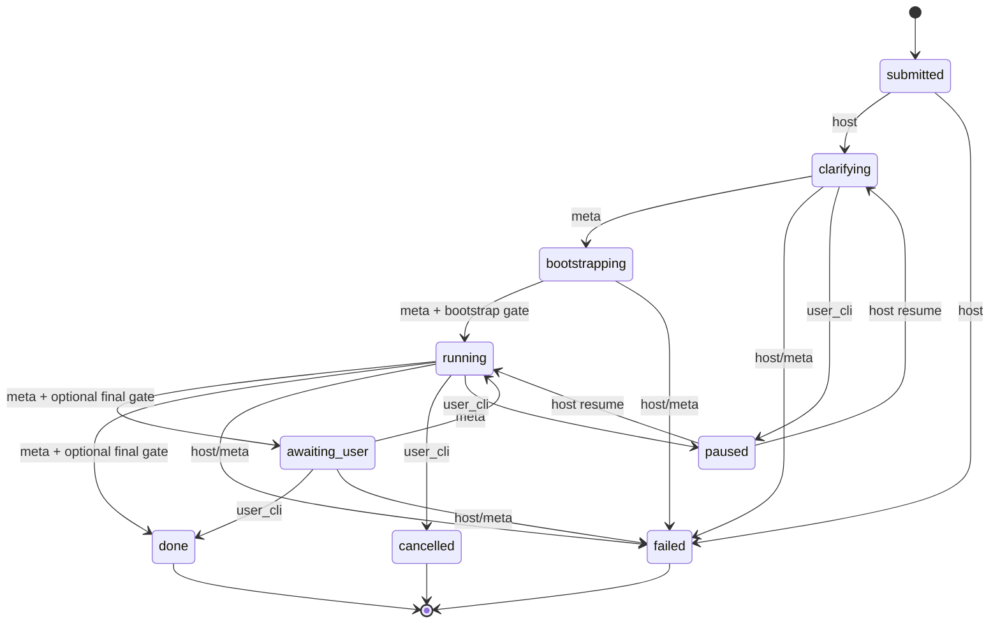

<details>
<summary>相关源文件</summary>

生成本页时使用的主要源文件：

- [src/host/stage_machine.ts](../../../project-repos/deputy-agent/src/host/stage_machine.ts)
- [src/shared/manifest.ts](../../../project-repos/deputy-agent/src/shared/manifest.ts)
- [docs/RUNTIME.md](../../../project-repos/deputy-agent/docs/RUNTIME.md)
- [docs/ARCHITECTURE.md](../../../project-repos/deputy-agent/docs/ARCHITECTURE.md)

</details>

# 四角色协作与阶段机

Deputy 的「多 Agent」不是四个对等 LLM 互相 @，而是 **一条有审计的流水线**：Meta 持有阶段推进权与 harness 写权限；Worker 只在 workspace 动手；Watcher 读 Worker 流的时间片；Reviewer 在门禁点一次性给 verdict。角色间零 direct call，全靠 message bus 上的 typed envelope。

## 四角色一览

| 角色 | 生命周期 | 核心职责 |
|------|----------|----------|
| **meta** | 长活，从 `submitted`/`clarifying` 到 terminal/paused | 澄清任务、写 harness、启停 Worker、阶段迁移、判定何时找用户 |
| **worker** | 每次 attempt 一 session；首次进 `running` Host 自动启一次 | 在 workspace 执行任务 |
| **watcher** | `running` 期间长活 | 消费 `worker_stream_window`，向 meta 报告观察；可触发 context compaction |
| **reviewer** | 按需 one-shot | 产出 `reviewer_verdict`（bootstrap / final 两阶段） |

**Insight**：只有 meta 能结束 meta session——Host 对 Meta 的 watchdog 超时不会 force-close Meta，避免 orchestrator 被底层误杀。

## 九阶段状态机

`manifest.stage` 是单一真相源；`stageHistory` 记录每次进入时间戳。



进行中阶段：`submitted`、`clarifying`、`bootstrapping`、`running`、`awaiting_user`。  
终端：`done`、`failed`、`cancelled`。`paused` 记录 `pausedFrom` 以便 resume 回到原 in-progress stage。

## 迁移触发器三类

`stage_machine.ts` 用 `TransitionTrigger` 区分：

- **`host`**：`submitted→clarifying`、resume、force `failed`
- **`meta_tool`**：大部分 in-progress 前进/回退（经 `sh_stage__advance`）
- **`user_cli`**：`pause`、`cancel`、`awaiting_user→done`

每次写入走 manifest 锁 + **CAS**：`expectedFromStage` 不匹配则 `StageCasMismatch`——并发 cancel/pause 不会被静默覆盖。

## Reviewer 两道门禁（fail-closed）

1. **bootstrap_self_review**：任意非 `running` → `running` 前，任务生命周期内须出现过 `reviewerPhase=bootstrap_self_review` 的 `reviewer_verdict`（`verdict_missing` 也算「审过」）。
2. **final_review**：存在 `worker_completion_claim` 时，`running→{awaiting_user,done}` 要求之后有 `reviewerPhase=final_review` 且 composite key 严格大于最新 claim。

**Bus 未初始化时两道门都 fail-closed**——不会「无消息总线也放行 running」。

## 各 stage 在线角色

| Stage | 活跃角色 |
|-------|----------|
| `submitted` | —（Host 立刻推 `clarifying`） |
| `clarifying` / `bootstrapping` | meta |
| `running` | meta + worker + watcher（reviewer 按需） |
| `awaiting_user` | meta |

Sources: [src/host/stage_machine.ts:54-110](../../../project-repos/deputy-agent/src/host/stage_machine.ts#L54-L110), [src/host/stage_machine.ts:120-133](../../../project-repos/deputy-agent/src/host/stage_machine.ts#L120-L133), [docs/RUNTIME.md:82-96](../../../project-repos/deputy-agent/docs/RUNTIME.md#L82-L96)

<details class="source-snippets">
<summary>引用源码</summary>

<!-- source-snippets:start -->

#### `src/host/stage_machine.ts:54-110`

```typescript
export function checkTransitionAllowed(from: Stage, to: Stage, trigger: TransitionTrigger): string | null {
  if (to === "submitted") return "submitted is unreachable initial stage";

  if (trigger === "meta_tool") {
    // Meta cannot transition to paused (a user privilege)
    if (to === "paused") return "paused is a user privilege; Meta cannot request it";
    // Meta main path + reset: source must be an in-progress stage
    if (!isInProgress(from)) return `cannot transition from ${from} via meta_tool`;
    switch (from) {
      case "clarifying":
        if (to === "bootstrapping" || isInProgress(to) || to === "failed" || to === "cancelled") return null;
        return `illegal meta_tool transition ${from} → ${to}`;
      case "bootstrapping":
        if (to === "running" || isInProgress(to) || to === "failed" || to === "cancelled") return null;
        return `illegal meta_tool transition ${from} → ${to}`;
      case "running":
        if (to === "awaiting_user" || to === "done" || isInProgress(to) || to === "failed" || to === "cancelled")
          return null;
        return `illegal meta_tool transition ${from} → ${to}`;
      case "awaiting_user":
        if (to === "running" || to === "done" || isInProgress(to) || to === "failed" || to === "cancelled")
          return null;
        return `illegal meta_tool transition ${from} → ${to}`;
      case "submitted":
        // submitted → clarifying is host-autonomous, not via meta_tool
        return `cannot transition from submitted via meta_tool`;
      default:
        return `illegal meta_tool transition ${from} → ${to}`;
    }
  }

  if (trigger === "user_cli") {
    // User CLI: done (awaiting_user→done) / cancel (any in-progress + paused → cancelled)
    if (to === "done") {
      if (from === "awaiting_user") return null;
      return `user_cli done only from awaiting_user (found ${from})`;
    }
    if (to === "cancelled") {
      if (isInProgress(from) || from === "paused") return null;
      return `user_cli cancel rejected from terminal stage ${from}`;
    }
    if (to === "paused") {
      if (isInProgress(from)) return null;
      return `user_cli pause only from in-progress stage (found ${from})`;
    }
    // resume: paused → origin (origin can be any in-progress stage clarifying/bootstrapping/running/awaiting_user)
    if (from === "paused" && isInProgress(to)) return null;
    return `illegal user_cli transition ${from} → ${to}`;
  }

  // trigger === "host"
  if (from === "submitted" && to === "clarifying") return null;
  if (from === "paused" && isInProgress(to)) return null; // resume to origin
  if (isInProgress(from) && to === "paused") return null;
  if (isInProgress(from) && to === "failed") return null; // host forces failed
  return `illegal host transition ${from} → ${to}`;
}
```

#### `src/host/stage_machine.ts:120-133`

```typescript
/**
 * bootstrap_self_review gate: the task lifecycle must have had a non-failed reviewer_verdict
 * envelope with extras.reviewerPhase === "bootstrap_self_review" (verdict_missing counts —
 * verdict=null still means it was reviewed). Fails closed if the bus is uninitialized.
 */
async function checkBootstrapGate(bus: MessagingBus | null): Promise<GateResult> {
  if (bus === null) return { passed: false, reason: "messaging bus not initialized (fail-closed)" };
  const seen = await bus.hasEnvelopeWithExtrasAfter({
    kind: "reviewer_verdict",
    extrasMatch: { reviewerPhase: "bootstrap_self_review" },
  });
  if (!seen) return { passed: false, reason: "no bootstrap_self_review reviewer_verdict found" };
  return { passed: true, reason: null };
}
```

#### `docs/RUNTIME.md:82-96`

```markdown
## Stage machine

The manifest's `stage` field is the source of truth. There are nine stages:

| Stage | Class | Active roles |
| --- | --- | --- |
| `submitted` | in-progress | — (host transitions it to `clarifying`) |
| `clarifying` | in-progress | meta |
| `bootstrapping` | in-progress | meta |
| `running` | in-progress | meta, worker, watcher (reviewer on demand) |
| `awaiting_user` | in-progress | meta |
| `done` | terminal | — |
| `failed` | terminal | — |
| `cancelled` | terminal | — |
| `paused` | (neither) | — |
```

<!-- source-snippets:end -->
</details>

## 相关页面

- [Host 守护进程与 Tick 循环](host-daemon-runtime.md) — 谁负责保活这些 session
- [Host 工具与 Harness](host-tools-harness.md) — Meta 如何 `sh_stage__advance`
- [消息总线与 Envelope](messaging-bus.md) — verdict / claim 如何在 bus 上锚定
