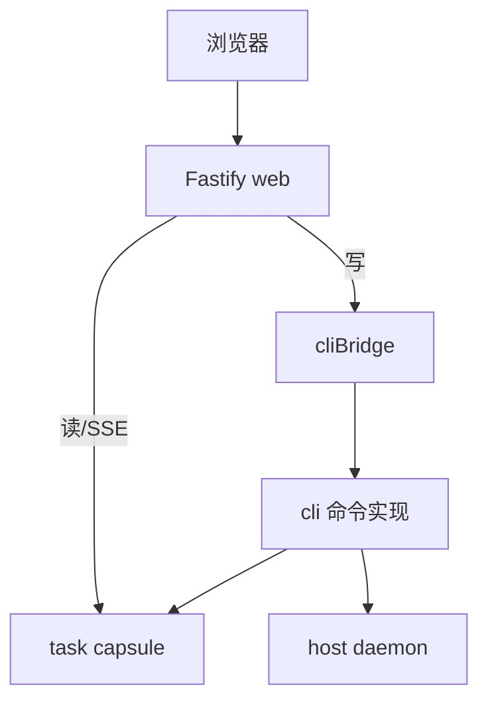

<details>
<summary>相关源文件</summary>

生成本页时使用的主要源文件：

- [src/web/routes.ts](../../../project-repos/deputy-agent/src/web/routes.ts)
- [src/web/cliBridge.ts](../../../project-repos/deputy-agent/src/web/cliBridge.ts)
- [src/web/security.ts](../../../project-repos/deputy-agent/src/web/security.ts)
- [docs/WEB.md](../../../project-repos/deputy-agent/docs/WEB.md)
- [docs/USAGE.md](../../../project-repos/deputy-agent/docs/USAGE.md)

</details>

# CLI 与 Web GUI

Deputy 刻意提供 **两个等价入口**：终端 `deputy` 子命令适合脚本与 headless；**Web GUI 是 README 推荐的主路径**——提交任务、看 live stream、在检查点 `answer`/`feedback`，都在一个 loopback 页面完成。二者共享同一套 capsule 与 Host 语义，不是「Web 版简化功能」。

## CLI 命令面

USAGE 文档分组：

- **写命令**：`submit`、`run`、`answer`、`feedback`、`upload`、`pause`、`resume`、`done`、`cancel`、`rename`、`delete`
- **读命令**：`list`、`status`、`inspect`
- **服务**：`web` 启动 GUI

典型流程：

```bash
npm run build
node dist/cli/bin.js web          # 推荐：浏览器驱动全生命周期
# 或
node dist/cli/bin.js submit "…"   # 脚本化
node dist/cli/bin.js run <taskId> # 确保 host 运行
```

`run` 在 host lock 已占用时会拒绝——避免双 Host。`delete` 要求 host 已停。

## Web 架构

Fastify 应用注册 `/api/*`：

| 类型 | 示例 | 实现 |
|------|------|------|
| 健康 | `GET /api/health` | 内联 |
| 任务读 | `GET /api/tasks/:id` | readService 读 manifest + status.md |
| 任务写 | `POST …/feedback` 等 | **cliBridge** 调 in-process CLI |
| 流 | SSE detail/list stream | fs.watch + 2s reconcile + heartbeat |

`routes.ts` 注释明确：**写端点 = cliBridge → CommandResult**；读端点纯 filesystem；流端点长连接 SSE。



## 安全模型（0.1.0）

- 绑定 **loopback**（默认 `127.0.0.1:4319`），非 loopback 地址 fail-fast
- **无认证**；写与 SSE 做 Origin 校验
- 不适合多用户、公网暴露部署

Web 层另有 **单进程写 mutex**：并发 HTTP 写串行化；跨进程安全仍靠 capsule 文件锁。

## 配置

`deputy.config.json`（项目根）定义 tasks 根目录、默认 provider、角色绑定默认值等——CLI 与 Web 共用 loader。详见 USAGE / DATA_FORMATS。

Sources: [README.md:68-84](../../../project-repos/deputy-agent/README.md#L68-L84), [src/web/routes.ts:1-7](../../../project-repos/deputy-agent/src/web/routes.ts#L1-L7), [docs/LIMITATIONS.md:55-72](../../../project-repos/deputy-agent/docs/LIMITATIONS.md#L55-L72)

<details class="source-snippets">
<summary>引用源码</summary>

<!-- source-snippets:start -->

#### `README.md:68-84`

````markdown
After building, the **recommended** way to use Deputy is the local Web GUI:

```bash
node dist/cli/bin.js web    # then open the printed URL (default http://127.0.0.1:4319)
```

The Web GUI is the easiest way to submit a task and watch live progress, the conversation,
and the agent output streams, and to drive the whole task lifecycle from one place.

The CLI exposes the same operations and is better suited to scripting / headless use:

```bash
node dist/cli/bin.js submit "Write a report on X"
node dist/cli/bin.js list
node dist/cli/bin.js status <taskId>
```

````

#### `src/web/routes.ts:1-7`

```typescript
/**
 * HTTP endpoint registration. All /api/* are protected by the two-layer validation (added in app.ts's onRequest hook).
 *
 * Write endpoints: delegate to cliBridge's in-process CLI invocation → consume CommandResult → JSON;
 *   CliError is mapped to an HTTP status by exitCode via sendError.
 * Read-only endpoints: pure filesystem reads (readService).
 * Streaming endpoints: long-lived SSE connections.
```

#### `docs/LIMITATIONS.md:55-72`

```markdown
## Web GUI

- **Loopback-only and single-process.** The server binds to a loopback host (default
  `127.0.0.1:4319`) and fails fast if asked to bind a non-loopback address. It has no
  authentication and applies an Origin check on writes and streams. It is not intended for
  multi-user, remote, or exposed deployment.

- **Writes are serialized through an in-process mutex.** All state-changing actions run one at
  a time through a single in-process write chain in the web backend. There is no cross-process
  scheduling at this layer; concurrency safety across processes comes from the underlying
  per-file locks.

- **Live updates use filesystem watching with periodic reconciliation.** SSE streams are
  driven by `fs.watch` plus a debounce, with a periodic (2s) reconcile pass and heartbeat as
  the fallback. This is a pragmatic, not push-exact, mechanism: updates can arrive on the
  reconcile interval rather than instantly, and on a read/watch error the stream emits a `lag`
  event and the frontend re-hydrates via REST. The composite task-submit endpoint reports
  partial success (per-file upload failures are aggregated into a `failed` list).
```

<!-- source-snippets:end -->
</details>

## 相关页面

- [任务胶囊与磁盘格式](task-capsule-data.md) — CLI submit 创建什么
- [Host 守护进程与 Tick 循环](host-daemon-runtime.md) — `run` / Web 如何 spawn host
- [局限性与质量现状](limitations-quality.md) — Web SSE 非 push-exact
