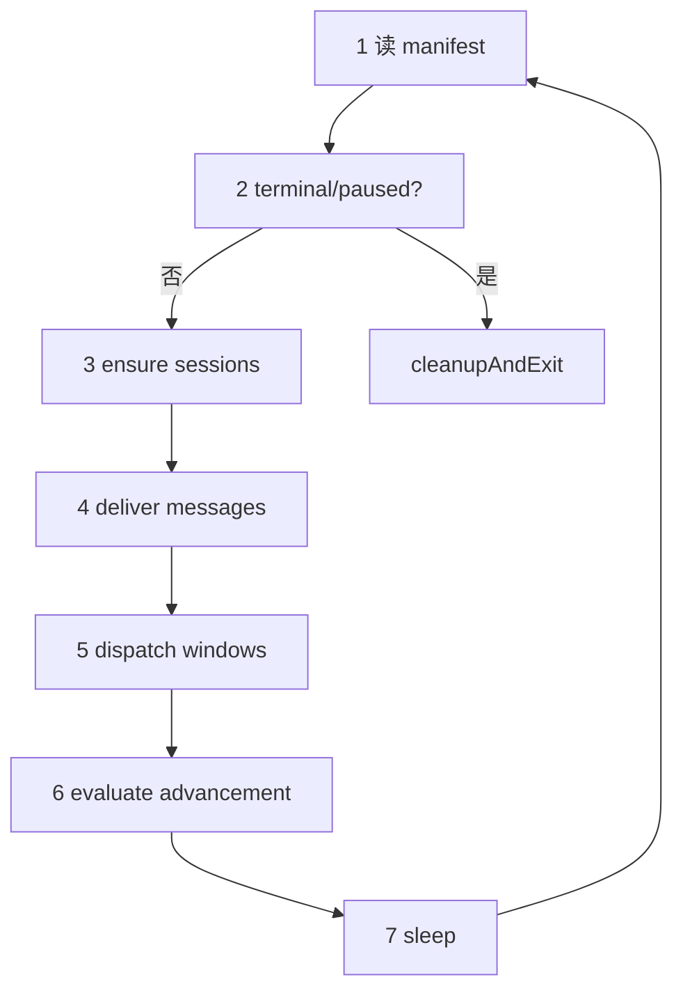

<details>
<summary>相关源文件</summary>

生成本页时使用的主要源文件：

- [src/host/daemon.ts](../../../project-repos/deputy-agent/src/host/daemon.ts)
- [src/host/main_loop.ts](../../../project-repos/deputy-agent/src/host/main_loop.ts)
- [docs/RUNTIME.md](../../../project-repos/deputy-agent/docs/RUNTIME.md)
- [src/host/watchdog.ts](../../../project-repos/deputy-agent/src/host/watchdog.ts)

</details>

# Host 守护进程与 Tick 循环

每个任务 capsule 最多运行 **一个** Host 进程。它持有 `control/host.pid.lock` 咨询锁，写 `control/host.pid`，跑完 startup recovery 后进入 **while tick**——读 manifest、按阶段保活会话、投递 inbox、dispatch watcher 窗口、协调 worker 生命周期，直到阶段变为 terminal 或 `paused`。

Tick 本身**不直接改 stage**（`submitted→clarifying` 等少数 host-autonomous 迁移除外）；阶段推进由 Meta 的 `sh_stage__advance` 或用户 CLI 触发。Tick 负责的是「在当前 stage 下，该在线的人是否在线、该读的信是否 inject 进 session」。

## 单实例与退出码

| 退出码 | 含义 |
|--------|------|
| 0 | `done` / `paused` / `awaiting_user` 正常收束 |
| 1 | `failed` 或 Meta 永久启动失败 |
| 2 | manifest 读失败或 Host 自身 fatal |
| 6 | 已有 Host 持有 `host.pid.lock` |
| 130 | SIGINT |

第二实例启动会立即以 code 6 退出——这是刻意设计：避免两个 Host 同时 inject、重复启动 Worker。

## 每 Tick 七步

RUNTIME 文档把循环拆成可操作的七步（默认 sleep 1000ms）：



**Step 4** 对每个相关 inbox 折叠 wake cursor 之后的未读 envelope，inject 到目标 session。**Step 5** 仅在 `running`：WindowDispatcher 按默认 180s 单调时钟窗口切 Worker JSONL 流。**Step 6** 处理 Worker 首次自动启动、退出后的 `worker_session_end`、以及 Meta idle 时的 completion reminder——**Host 不会自动重启 Worker**。

## Worker 生命周期所有权

`daemon.ts` 文件头注释写得很直白：Worker 退出 → enqueue `worker_session_end` → **等待 Meta 仲裁**（新开 Worker、停任务、推进 stage 或发指令）。这与许多 auto-retry agent loop 相反——续跑是 Meta 的业务决策，不是 Host 的隐式重试。

Watchdog 三类 trip 同样 **close 但不 restart**：

| 范围 | 条件 | 默认阈值 |
|------|------|----------|
| Worker | `no_progress`（久无 tool_use） | 30 min |
| Worker | `tool_loop`（连续相同 tool 调用） | 5 次 |
| Reviewer | 会话总时长 | 30 min |
| Meta push | 单次 inject/await | 60 min |

Meta push 超时**不关闭 Meta**（只有 Meta 能结束 Meta session），但累计多次会走 `META_START_FAILURE_LIMIT` 强制 `failed`。

## 前台 vs 分离模式

- **Foreground**：CLI `--foreground`，日志走 CLI stdout/stderr。
- **Detached**：CLI spawn 子进程，stdout/stderr 重定向到 `control/host.log`，语义与 foreground 相同。

## 与 Provider 的接点

每个 tick 内，`RoleResolver` 把 manifest 里的 `roleBindings` 解析成具体 `AgentRuntime`；`registerHostTools` 按角色过滤工具名后 `startSession`。可选能力（compact、contextUsage、resumeSession）必须先查 `capabilities` 再调用——Host 不会在运行时才发现 adapter 不支持。

Sources: [docs/RUNTIME.md:9-38](../../../project-repos/deputy-agent/docs/RUNTIME.md#L9-L38), [src/host/daemon.ts:1-37](../../../project-repos/deputy-agent/src/host/daemon.ts#L1-L37), [src/host/daemon.ts:130-137](../../../project-repos/deputy-agent/src/host/daemon.ts#L130-L137)

<details class="source-snippets">
<summary>引用源码</summary>

<!-- source-snippets:start -->

#### `docs/RUNTIME.md:9-38`

```markdown
## Host daemon

The host is a **single-instance daemon**. On startup it acquires an OS advisory file lock on
`control/host.pid.lock` (see [Concurrency & recovery](#concurrency--recovery)); if another live
host already holds it, the new process exits immediately with a single-instance exit code.
After acquiring the lock it writes `control/host.pid` (`{ pid, startedAt }`), runs startup
recovery, then enters the tick loop.

The daemon runs either in the **foreground** (inside the CLI process, with `--foreground`; host
logs go to the CLI's stdout/stderr) or **detached** (the CLI spawns it as a background child
that detaches from the launching shell's session, with stdout/stderr redirected to
`control/host.log`). Both paths run the same loop with identical semantics.

Each tick reads the manifest and dispatches by the current stage:

| Step | Action |
| --- | --- |
| 1. Read manifest | Load `control/manifest.yaml`. A read failure is fatal (exit code 2). |
| 2. Terminal / paused check | If the stage is terminal (`done` / `failed` / `cancelled`) or `paused`, clean up sessions and exit. |
| 3. Ensure sessions | Start / keep online the agent sessions required by the stage (meta always; watcher in `running`). |
| 4. Deliver messages | Fold each relevant inbox for unread envelopes after a per-channel wake cursor and inject them into the target session. |
| 5. Dispatch windows | In `running`, slice the worker's output stream into windows and enqueue them to the watcher inbox. |
| 6. Evaluate advancement | Reconcile worker lifecycle (first start / restart after a worker exit) and post worker-exit reminders to meta. |
| 7. Sleep | Wait the tick interval (default 1000 ms), then loop. |

Stage transitions themselves are made by the agents (meta) or the host, not by the loop body;
the loop only steers sessions and message flow. When the stage becomes terminal or `paused`,
`cleanupAndExit` closes any held sessions, writes their paired session-ended records, appends a
`host_stopping` event, removes `control/host.pid`, and returns an exit code derived from the
stage. The daemon does not auto-restart the worker after it exits (see below).
```

#### `src/host/daemon.ts:1-37`

```typescript
/**
 * Host daemon orchestrator (assembles the tick main loop).
 *
 * Wires the host subsystem mechanisms into a complete daemon:
 *  - single-instance lock (acquireSingleInstanceLock)
 *  - startup recovery (runStartupRecovery)
 *  - tick while loop: readManifestSnapshot → terminal / paused → cleanupAndExit; otherwise
 *    dispatchByStage → start/stop Meta / Worker / Watcher sessions per TickAction (via wrapper +
 *    prompt assembly + registering host tools) + wake-cursor inject + worker reconcile (first auto
 *    start + Meta explicit start) + Watcher window dispatch
 *  - exit codes + append host_stopping + remove host.pid
 *  - permanent Meta failure: N consecutive start failures → force failed
 *
 * Provides the concrete HostAgentControl (tool deps): requestWorkerStart / stopWorker /
 * triggerReviewer / workerSessionSeqResolver / active-handle getters. The orchestration layer
 * enqueues a worker_interrupt_softkill_failed host_event when interrupt_worker soft-kill fails; on
 * success it enqueues worker_session_end.
 *
 * Decision ownership: the daemon does not self-restart workers (worker exit → worker_session_end,
 * awaiting Meta arbitration).
 *
 * Watchdog integration (three session-level kinds; pure-function detection in src/host/watchdog.ts):
 *  - Worker session: no_progress (idle past threshold since last tool_use) + tool_loop (N consecutive
 *    identical (toolName, hash(input))) — startWorker's subscribe listener accumulates
 *    WorkerWatchdogState, monitorActiveWorker calls checkWorkerWatchdog each tick; trip → the unified
 *    action (forceAbort close + derive watchdog_* exitReason + worker_session_end + watchdog_triggered
 *    + host_event). The host does not self-restart.
 *  - Reviewer session timeout: inside agent_control.triggerReviewer (with injected now + thresholds).
 *  - Meta push: driveMetaWake / ensureMetaOnline wraps Meta inject with withTimeout; on timeout it
 *    does not close Meta (only Meta can exit Meta), emits host_event + watchdog_triggered, and after
 *    M consecutive → metaStartFailures +1 (feeding the META_START_FAILURE_LIMIT force-failed path).
 *  - tool-level / API-level watchdogs are not re-implemented here (already handled by the Claude
 *    adapter toolBridge / wrapper RuntimeError + retry).
 *
 * Time is injectable (DaemonConfig.now / watchdogThresholds) for fake-clock testing.
 *
 * The daemon uses an injected AgentRuntime (a real provider adapter in production, a stub in tests).
```

#### `src/host/daemon.ts:130-137`

```typescript
/** Host process exit codes. */
export const HostExitCode = {
  Ok: 0, // done / paused / awaiting_user yield
  GeneralError: 1, // failed terminal / permanent Meta failure
  Fatal: 2, // manifest read failure / host's own fatal error
  SingleInstance: 6, // host.pid.lock conflict
  Sigint: 130,
} as const;
```

<!-- source-snippets:end -->
</details>

## 相关页面

- [四角色协作与阶段机](agent-roles-stage-machine.md) — 各 stage 应有哪些 session 在线
- [消息总线与 Envelope](messaging-bus.md) — Step 4 的 inbox 语义
- [Provider 适配层](provider-adapters.md) — Session 事件流与 inject
