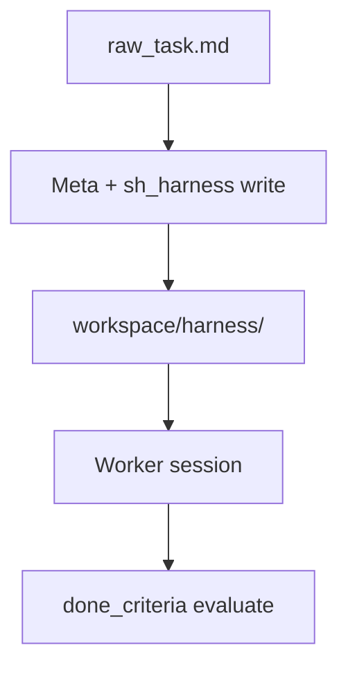

<details>
<summary>相关源文件</summary>

生成本页时使用的主要源文件：

- [src/host/tools/registry.ts](../../../project-repos/deputy-agent/src/host/tools/registry.ts)
- [src/host/tools/stage.ts](../../../project-repos/deputy-agent/src/host/tools/stage.ts)
- [src/host/tools/harness.ts](../../../project-repos/deputy-agent/src/host/tools/harness.ts)
- [src/prompts/assets/roles/meta.en.md](../../../project-repos/deputy-agent/src/prompts/assets/roles/meta.en.md)

</details>

# Host 工具与 Harness

Provider 内置的 bash/read/write 不够表达 Deputy 的领域语义——于是 Host 向每个 session 注册一组 **`sh_*` host tools**，把「推进阶段」「写 harness 文件」「启停 Worker」「拉 inbox」变成 LLM 可调用的 typed API。工具名全局唯一；**按角色静态授权**，Meta 拿不到 Worker 的 `declare_done`，Worker 拿不到 `stage__advance`。

## 工具清单与角色矩阵

`registry.ts` 中 `TOOL_SCOPES` 与 `buildHostTools` 保持同步，共 **19** 个工具：

| 工具名 | 角色 |
|--------|------|
| `sh_stage__advance` | meta |
| `sh_harness__write_worker` / `write_watcher` / `read` | meta（read 含 watcher） |
| `sh_agent__start_worker` / `stop_worker` / `trigger_reviewer` | meta |
| `sh_msg__send_to_worker` / `interrupt_worker` / `send_to_watcher` / `send_to_user` | meta |
| `sh_msg__escalate_to_meta` / `notify_meta` / `declare_done_to_meta` | worker |
| `sh_msg__observe_to_meta` | watcher |
| `sh_inbox__pull` | meta, worker, watcher |
| `sh_inbox__mark_responded` | meta, worker |
| `sh_inbox__inspect_worker_status` | meta |
| `sh_reviewer__submit_verdict` | reviewer |

Host 在 `startSession` 前用 `toolNamesForRole(role)` 过滤 registry，再交给 adapter 暴露给模型。

## Harness：任务级方法论包

Meta 在 `bootstrapping` 通过 harness 工具写入：

- SOP 文档（`harness/sop/`）
- Worker/Watcher 专用说明
- 本地 tools/skills/mcp 占位目录
- **`done_criteria.yaml`** — Worker session 结束时 Host **无 LLM** 评估

这与「一个 repo 一套 AGENTS.md」相反——**每个 taskId 一份 harness**，由 Meta 读 `raw_task.md` 后生成。Worker prompt 会引用 harness 路径，形成闭循环。



## stage advance 工具

`sh_stage__advance` 是 Meta 驱动状态机的唯一正规入口（除 host-autonomous 与用户 CLI）。Handler 调用 `handleStageAdvance`：先 `checkTransitionAllowed`，再跑 bootstrap/final Reviewer gate，最后 `manifestIO.applyStageTransition` + append `events.jsonl` + 重渲染 `status.md`。

CAS 失败返回给 Meta 的是可读 rejection reason——模型可以在并发 user cancel 后调整策略。

Sources: [src/host/tools/registry.ts:26-81](../../../project-repos/deputy-agent/src/host/tools/registry.ts#L26-L81), [src/host/stage_machine.ts:17-18](../../../project-repos/deputy-agent/src/host/stage_machine.ts#L17-L18), [docs/ARCHITECTURE.md:88-90](../../../project-repos/deputy-agent/docs/ARCHITECTURE.md#L88-L90)

<details class="source-snippets">
<summary>引用源码</summary>

<!-- source-snippets:start -->

#### `src/host/tools/registry.ts:26-81`

```typescript
/** Construct all host tool definitions (order-independent; names are globally unique). */
export function buildHostTools(deps: HostToolDeps): ReadonlyArray<HostTool> {
  return [
    makeStageAdvanceTool(deps),
    makeWriteWorkerTool(deps),
    makeWriteWatcherTool(deps),
    makeReadHarnessTool(deps),
    makeStartWorkerTool(deps),
    makeStopWorkerTool(deps),
    makeTriggerReviewerTool(deps),
    makeSendToWorkerTool(deps),
    makeInterruptWorkerTool(deps),
    makeSendToWatcherTool(deps),
    makeSendToUserTool(deps),
    makeEscalateToMetaTool(deps),
    makeNotifyMetaTool(deps),
    makeDeclareDoneToMetaTool(deps),
    makeObserveToMetaTool(deps),
    makeInboxPullTool(deps),
    makeInboxMarkRespondedTool(deps),
    makeInspectWorkerStatusTool(deps),
    makeSubmitVerdictTool(deps),
  ];
}

/** Register all host tools into the registry. Duplicate registration throws HostToolRegistryError from registry.register. */
export function registerHostTools(registry: HostToolRegistry, deps: HostToolDeps): void {
  for (const tool of buildHostTools(deps)) {
    registry.register(tool);
  }
}

/**
 * Role -> available tool-name set. The source of truth is each tool's scope; this derives from scope without
 * depending on registered instances, using a static name + scope table kept in sync with buildHostTools.
 */
const TOOL_SCOPES: ReadonlyArray<{ name: string; scope: ReadonlyArray<AgentRole> }> = [
  { name: "sh_stage__advance", scope: ["meta"] },
  { name: "sh_harness__write_worker", scope: ["meta"] },
  { name: "sh_harness__write_watcher", scope: ["meta"] },
  { name: "sh_harness__read", scope: ["meta", "watcher"] },
  { name: "sh_agent__start_worker", scope: ["meta"] },
  { name: "sh_agent__stop_worker", scope: ["meta"] },
  { name: "sh_agent__trigger_reviewer", scope: ["meta"] },
  { name: "sh_msg__send_to_worker", scope: ["meta"] },
  { name: "sh_msg__interrupt_worker", scope: ["meta"] },
  { name: "sh_msg__send_to_watcher", scope: ["meta"] },
  { name: "sh_msg__send_to_user", scope: ["meta"] },
  { name: "sh_msg__escalate_to_meta", scope: ["worker"] },
  { name: "sh_msg__notify_meta", scope: ["worker"] },
  { name: "sh_msg__declare_done_to_meta", scope: ["worker"] },
  { name: "sh_msg__observe_to_meta", scope: ["watcher"] },
  { name: "sh_inbox__pull", scope: ["meta", "worker", "watcher"] },
  { name: "sh_inbox__mark_responded", scope: ["meta", "worker"] },
  { name: "sh_inbox__inspect_worker_status", scope: ["meta"] },
  { name: "sh_reviewer__submit_verdict", scope: ["reviewer"] },
```

#### `src/host/stage_machine.ts:17-18`

```typescript
 * `handleStageAdvance` is the host-side entry called by the sh_stage__advance tool handler.
 */
```

#### `docs/ARCHITECTURE.md:88-90`

```markdown
- **meta** — long-lived orchestrator: clarifies the task, prepares the per-task harness,
  starts/stops the worker, arbitrates worker outcomes, and decides when the task is done or
  needs the user.
```

<!-- source-snippets:end -->
</details>

## 相关页面

- [四角色协作与阶段机](agent-roles-stage-machine.md) — 谁该调用哪些工具
- [Watcher 流水线与完成判据](watcher-done-criteria.md) — done_criteria 评估链
- [Provider 适配层](provider-adapters.md) — HostToolRegistry 如何桥接 SDK
