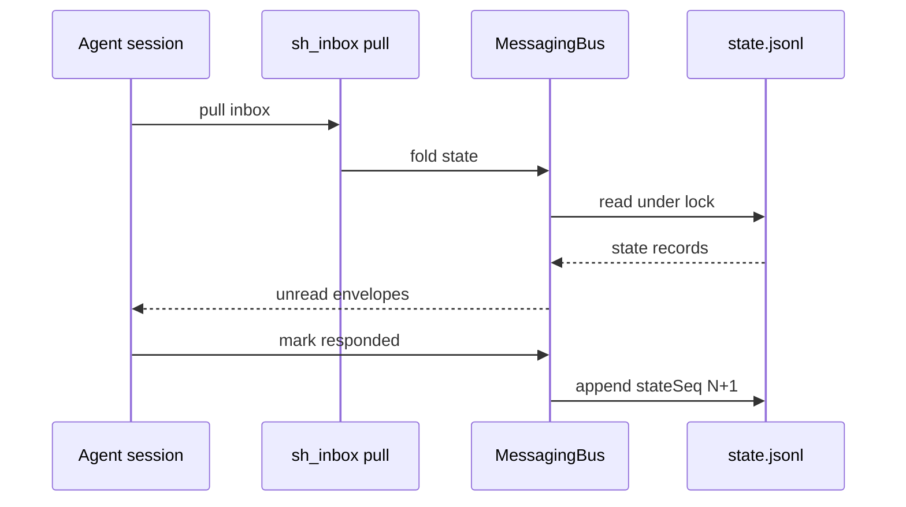

<details>
<summary>相关源文件</summary>

生成本页时使用的主要源文件：

- [src/messaging/bus.ts](../../../project-repos/deputy-agent/src/messaging/bus.ts)
- [src/messaging/envelope.ts](../../../project-repos/deputy-agent/src/messaging/envelope.ts)
- [src/messaging/state.ts](../../../project-repos/deputy-agent/src/messaging/state.ts)
- [docs/DATA_FORMATS.md](../../../project-repos/deputy-agent/docs/DATA_FORMATS.md)

</details>

# 消息总线与 Envelope

Agent 之间不传 RPC，只传 **带 kind 的 envelope**。Channel 是 inbox 名字，每个 channel 有 **kind 白名单**——enqueue 时校验，非法组合直接拒绝。这让「Worker 能否给 Meta 发 completion claim」变成 schema 层规则，而不是 prompt 里靠自觉。

## 三通道与白名单

| Channel | 允许的 kind（节选） |
|---------|---------------------|
| `meta` | `user_feedback`、`worker_session_end`、`watcher_observation`、`reviewer_verdict`、`host_event`… |
| `worker` | `meta_instruction`、`meta_interrupt` |
| `watcher` | `meta_instruction`、`worker_stream_window` |

完整列表见 DATA_FORMATS / RUNTIME 文档；Host tools（如 `sh_msg__declare_done_to_meta`）最终都落到 `bus.enqueue`。

## 投递状态不在 envelope 上

**Insight**：`read` / `responded` 不写在 envelope 实体里，而是由 **`state.jsonl` 折叠** 得出。每次 mutating 操作：

1. 拿 `messaging/.lock`
2. 刷新缓存、分配单调 `stateSeq`
3. append + fsync
4. 更新内存缓存（缓存非真相）

读 API 在锁内 fold 全量 state，锁外组装 snapshot。Host 重启后 re-fold 即可恢复「谁已读、谁已回复」——这对长任务 daemon 至关重要。



## enqueue 与 recovery

`bus.ts` 头注释强调 cross-process consistency：payload 存 `payloads/`，损坏时抛 `MessagingPayloadCorrupted` 等 typed error。Recovery 模块在 Host startup 时与 manifest/events 一并协调（见 `src/messaging/recovery.ts`）。

Stage 机的 Reviewer 门禁用 bus 查询 API：`hasEnvelopeWithExtrasAfter`、`findLatestEnvelopeAnchorOfKind`——把「是否审过 bootstrap」变成可验证的历史存在性，而非 Meta 口头声称。

Sources: [src/messaging/bus.ts:1-12](../../../project-repos/deputy-agent/src/messaging/bus.ts#L1-L12), [docs/RUNTIME.md:155-174](../../../project-repos/deputy-agent/docs/RUNTIME.md#L155-L174), [src/host/stage_machine.ts:125-133](../../../project-repos/deputy-agent/src/host/stage_machine.ts#L125-L133)

<details class="source-snippets">
<summary>引用源码</summary>

<!-- source-snippets:start -->

#### `src/messaging/bus.ts:1-12`

```typescript
/**
 * Message bus implementation.
 *
 * Cross-process consistency: every state-mutating operation runs inside
 * `messaging/.lock`: refresh -> assign stateSeq -> append + fsync -> update the
 * in-memory cache. Read APIs also fold the full state under the lock and
 * assemble the returned snapshot outside it. The in-memory state is only a
 * cache; the source of truth is always state.jsonl + payloads/.
 *
 * stateSeq: folded under the lock as current max -> nextSeq = max + 1; no
 * separate persisted counter.
 */
```

#### `docs/RUNTIME.md:155-174`

```markdown
## Message bus

Agents communicate over three inbox **channels**, each with a per-channel **kind whitelist**:

| Channel | Allowed envelope kinds |
| --- | --- |
| `meta` | `user_feedback`, `user_upload`, `user_clarify_answer`, `worker_escalation`, `worker_notification`, `worker_completion_claim`, `worker_session_end`, `watcher_observation`, `reviewer_verdict`, `host_event` |
| `worker` | `meta_instruction`, `meta_interrupt` |
| `watcher` | `meta_instruction`, `worker_stream_window` |

Enqueuing an envelope with a kind not in its channel's whitelist is rejected. The envelope
schema (payload layout, `extras` per kind) is in [DATA_FORMATS.md](DATA_FORMATS.md).

Delivery state — whether an envelope has been **read** or **responded** — is **not** stored on
the envelope. It is derived by folding the message-bus **state stream** (`state.jsonl`): every
mutating operation appends a state record under a bus lock, assigns a monotonic `stateSeq`, and
updates only an in-memory cache. Read APIs fold the full state under the lock. Because read /
responded state lives entirely in the appended stream rather than on the envelope, delivery
state is reconstructable by re-folding after a restart, making it recoverable across host
restarts.
```

#### `src/host/stage_machine.ts:125-133`

```typescript
async function checkBootstrapGate(bus: MessagingBus | null): Promise<GateResult> {
  if (bus === null) return { passed: false, reason: "messaging bus not initialized (fail-closed)" };
  const seen = await bus.hasEnvelopeWithExtrasAfter({
    kind: "reviewer_verdict",
    extrasMatch: { reviewerPhase: "bootstrap_self_review" },
  });
  if (!seen) return { passed: false, reason: "no bootstrap_self_review reviewer_verdict found" };
  return { passed: true, reason: null };
}
```

<!-- source-snippets:end -->
</details>

## 相关页面

- [四角色协作与阶段机](agent-roles-stage-machine.md) — verdict / claim 与阶段门禁
- [Host 工具与 Harness](host-tools-harness.md) — `sh_inbox__*` / `sh_msg__*`
- [Host 守护进程与 Tick 循环](host-daemon-runtime.md) — wake cursor inject
