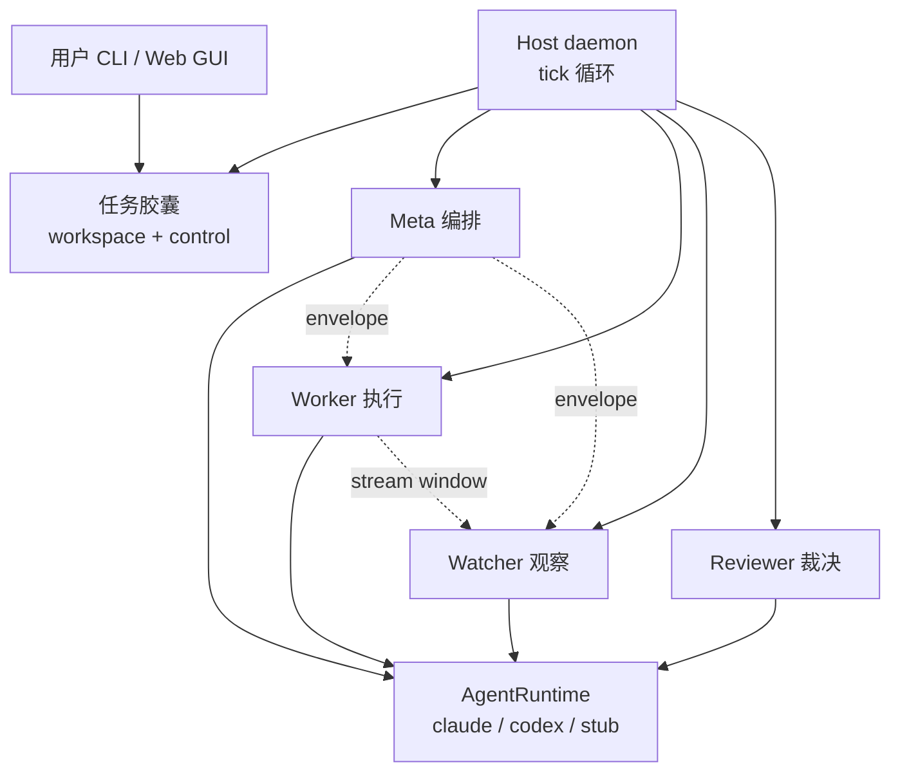

<details>
<summary>相关源文件</summary>

生成本页时使用的主要源文件：

- [README.md](../../../project-repos/deputy-agent/README.md)
- [package.json](../../../project-repos/deputy-agent/package.json)
- [docs/ARCHITECTURE.md](../../../project-repos/deputy-agent/docs/ARCHITECTURE.md)
- [docs/LIMITATIONS.md](../../../project-repos/deputy-agent/docs/LIMITATIONS.md)

</details>

# 项目概览

白领知识工作里有一类任务：写调研报告、整理材料、跑完一套 SOP——往往需要数小时到数天，中间只需要在几个检查点和你对齐。交互式 coding agent 擅长短回合改代码，却不擅长「交稿后自己跑完」；固定 workflow 又无法为每个任务定制方法论。**Deputy 的核心赌注是：每个任务应拥有专属的 harness（SOP、工具清单、完成判据），并由一个长期在线的 Meta 角色生成与仲裁，Worker 只负责在 workspace 里执行。**

这不是 peer 多 Agent 群聊，而是 **master–worker + 审计双翼**：Meta 规划与阶段推进，Worker 动手，Watcher 按时间窗口观察 Worker 输出流，Reviewer 在阶段门禁给出 verdict。四个角色从不直接互调，只通过三通道 inbox 交换 envelope——这让崩溃恢复、并发 CLI 操作、跨进程一致性的设计都落在可审计的 JSONL 上，而不是内存里的回调链。

## 能力全景

- **长时无人值守**：目标运行窗口约 1 小时–2 天；Host 以默认 1s tick 持续调度，只在 `awaiting_user` 等检查点需要你介入。
- **通用（非 coding）导向**：README 明确面向日常知识工作，而非 IDE 内补全或 repo 级 refactor。
- **按需 harness**：进入 `bootstrapping` 后 Meta 在 `workspace/harness/` 写入 SOP、脚本、`done_criteria.yaml` 等，而非全局固定 playbook。
- **内置审查链**：进入 `running` 前须通过 `bootstrap_self_review`；Worker 声明完成后的 `final_review` 门禁同样 fail-closed。
- **文件系统级任务记忆**：Worker 多 session 状态、消息、事件流全部落盘；**跨任务记忆在 0.1.0 未实现**。
- **按角色选 Provider**：`manifest.roleBindings` 可为 meta/worker/watcher/reviewer 分别绑定 Claude 或 Codex；Host 在会话启动前解析为 `(runtime, model, isolation)` 三元组。

## 架构鸟瞰

Host 是单任务单实例 daemon；CLI 与 Web GUI 只是两种写入口，最终都改同一份 capsule。



**关键设计决策**：Provider 只出现在 `wrapper/adapters`；Host 与 CLI 从不直连 SDK。换模型或加 stub 测试时，上层 orchestration 代码不动。

## 技术栈与规模

| 维度 | 事实 |
|------|------|
| 语言 | TypeScript（ESM，`"type": "module"`） |
| 运行时 | Node.js >= 22 |
| Agent 内核 | `@anthropic-ai/claude-agent-sdk` ^0.3.148；Codex 走独立 adapter |
| Web | Fastify 5 + 静态前端（marked、DOMPurify） |
| 校验 | Zod 4、AJV 8 |
| 源文件规模 | 约 174 个 tracked 文件，117 个 `.ts`（inventory 统计） |
| 自动化测试 | **开源导出包未附带 test runner**（仅 `typecheck` / `build` / `check`） |

## 与同类方案的差异

- **对比短回合 coding agent**：Deputy 优化的是阶段机 + 磁盘协作 + Reviewer 门禁，不是单次 prompt 的 tool loop。
- **对比固定 LangGraph workflow**：harness 按任务生成；阶段迁移由 Meta 通过 `sh_stage__advance` 驱动，而非编译期写死的图。
- **对比纯 CLI wrapper**：有完整 Web GUI（SSE 流式观察）、message bus 恢复语义、done criteria 无 LLM 评估层。

## 阅读路线

| 你的目标 | 建议顺序 |
|----------|----------|
| 理解整体模块边界 | 本页 → [系统架构](system-architecture.md) |
| 搞清任务如何跑完 | [Host 守护进程](host-daemon-runtime.md) → [四角色与阶段机](agent-roles-stage-machine.md) |
| 对接 Provider / 换模型 | [Provider 适配层](provider-adapters.md) → [局限性与质量](limitations-quality.md) |
| 本地部署与操作 | [CLI 与 Web GUI](cli-web-gui.md) → [任务胶囊](task-capsule-data.md) |

Sources: [README.md:5-35](../../../project-repos/deputy-agent/README.md#L5-L35), [docs/ARCHITECTURE.md:74-99](../../../project-repos/deputy-agent/docs/ARCHITECTURE.md#L74-L99)

<details class="source-snippets">
<summary>引用源码</summary>

<!-- source-snippets:start -->

#### `README.md:5-35`

```markdown
> Deputy — a self-supervising master–worker agent framework that auto-scaffolds a
> task-tailored harness for long, autonomous delivery.

Deputy is a TypeScript framework for long-running, autonomous tasks. You hand it a task
description; it generates a task-tailored harness and drives the work through a structured
lifecycle to completion, syncing with you only at key checkpoints.

It uses a **master–worker** design rather than a peer multi-agent system: a master (the Meta
role) plans, prepares the harness, and arbitrates outcomes, while a worker executes the task —
with a Watcher (live observation) and a Reviewer (verdicts at stage gates) acting as review
agents that audit and correct the worker. At heart it is a master–worker (2-agent)
architecture. Deputy is exposed both as a command-line tool and as a local Web GUI, and is
multi-provider: Claude and Codex are supported behind a common adapter layer.

## Highlights

- **Long, unattended tasks.** Built for jobs that run roughly **1 hour to ~2 days** without a
  human in the loop, not short interactive turns.
- **General (non-coding) focus.** Aimed at everyday white-collar / knowledge work; it is
  deliberately *not* specialized for coding.
- **On-demand harness.** A task-tailored harness (methodology / SOP / tools / completion
  checks) is auto-generated per task, instead of one fixed harness for everything.
- **Built-in review.** A master (the Meta role) drives a Worker, while a Watcher (live
  observation of the worker's output) and a Reviewer (verdicts at stage gates) audit and
  correct the work.
- **File-system, task-level memory.** Agents coordinate through workspace files and messages;
  the worker's multi-session state persists on disk.
- **Per-role provider/model.** Each role can run on a different provider and model — e.g. a
  cheaper model for the Worker.
- **Built on Claude Code / Codex.** Uses the Claude Code and Codex CLI agent kernels, in
  TypeScript.
```

#### `docs/ARCHITECTURE.md:74-99`

```markdown
## Runtime model (summary)

A task is a directory — the *capsule* — with a `workspace/` half (where work happens) and a
`control/` half (orchestration state). The authoritative state is `control/manifest.yaml`;
every orchestration-level event is appended to `control/events.jsonl`.

The host is a **single-instance daemon** (guarded by `control/host.pid.lock`) running a tick
loop. On each tick it reads the manifest and, depending on the current stage, ensures the
right agent sessions are online, delivers unread messages, dispatches the worker's output
windows to the watcher, and evaluates whether the task should advance. It exits when the
task reaches a terminal or paused stage.

Four agent roles cooperate (full detail in [RUNTIME.md](RUNTIME.md)):

- **meta** — long-lived orchestrator: clarifies the task, prepares the per-task harness,
  starts/stops the worker, arbitrates worker outcomes, and decides when the task is done or
  needs the user.
- **worker** — the executor that performs the task inside `workspace/`.
- **watcher** — observes windows of the worker's output stream and reports observations back
  to meta; can trigger context compaction when its own context grows large.
- **reviewer** — a one-shot session that produces a verdict at review points.

Agents never call each other directly; they exchange **envelopes** over three inbox
**channels** (`meta`, `worker`, `watcher`), each with a per-channel kind whitelist. Delivery
state is derived by folding the message-bus state stream, which makes it recoverable across
host restarts. See [DATA_FORMATS.md](DATA_FORMATS.md) for the envelope schema.
```

<!-- source-snippets:end -->
</details>

## 相关页面

- [系统架构与模块地图](system-architecture.md) — `src/` 十一块职责与依赖方向
- [Host 守护进程与 Tick 循环](host-daemon-runtime.md) — 单实例锁与七步 tick
- [四角色协作与阶段机](agent-roles-stage-machine.md) — 九阶段与 Reviewer 门禁
