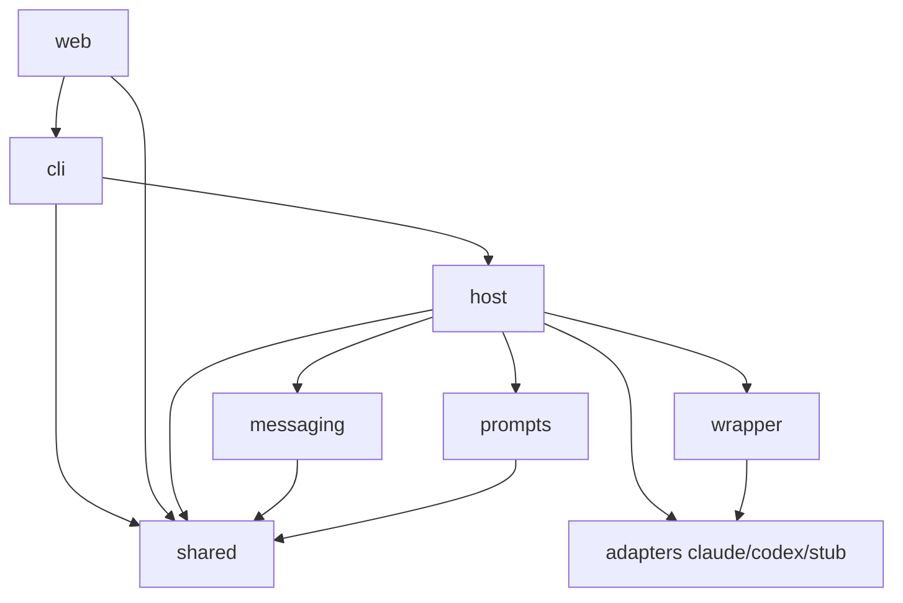
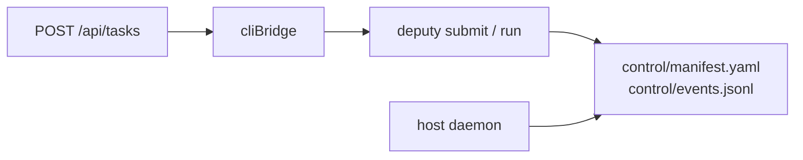

<details>
<summary>相关源文件</summary>

生成本页时使用的主要源文件：

- [docs/ARCHITECTURE.md](../../../project-repos/deputy-agent/docs/ARCHITECTURE.md)
- [src/index.ts](../../../project-repos/deputy-agent/src/index.ts)
- [package.json](../../../project-repos/deputy-agent/package.json)
- [README.md](../../../project-repos/deputy-agent/README.md)

</details>

# 系统架构与模块地图

Deputy 的代码组织围绕一个原则：**所有「智能」在 Provider 会话里，所有「秩序」在 Host + 磁盘状态里。** `src/shared` 定义胶囊布局与 manifest 状态机；`src/host` 是唯一会同时碰 manifest、message bus、AgentRuntime 和 host tools 的层；`src/wrapper` 把 Claude/Codex 差异折叠成统一事件流；CLI 与 Web 只是特权写者，不持有会话。

## 子系统职责表

| 目录 | 职责 | 典型消费者 |
|------|------|------------|
| `src/shared` | 路径布局、`manifest.yaml`、原子写、文件锁、ID、JSONL 工具 | Host、CLI、Web readService |
| `src/wrapper` | `AgentRuntime`、`RuntimeCapabilities`、HostToolRegistry | Host daemon |
| `src/wrapper/adapters` | `claude` / `codex` / `stub` 具体实现 | 生产与测试 |
| `src/messaging` | Envelope schema、三通道 bus、`state.jsonl` | Host、agent tools |
| `src/prompts` | 角色 system prompt、first message、en/zh 模板 | Host 启动 session 时 |
| `src/host` | Tick 循环、阶段机、recovery、watchdog、done_criteria | 每任务 daemon |
| `src/host/tools` | Meta/Worker/Watcher/Reviewer 可调用的 `sh_*` 工具 | 注册进 runtime |
| `src/host/watcher` | Worker 输出流窗口化与 dispatch | Tick 第 5 步 |
| `src/cli` | 参数解析、`deputy.config.json`、spawn host | 用户 / Web cliBridge |
| `src/web` | Loopback HTTP、SSE、静态 UI | 浏览器 |

官方 ARCHITECTURE 文档用一张 ASCII 图把 CLI/Web、capsule、Host、四角色、Runtime 串起来；DeepWiki 用 Mermaid 强调**数据权威在 control/，工作在 workspace/**。

## 依赖方向



**Insight**：Web 写操作不 duplicate 业务逻辑——`routes.ts` 通过 `cliBridge` 调用与 CLI 相同的 in-process 命令，保证「GUI 点的按钮」与「终端敲的命令」走同一套校验与锁。

## 双入口、单胶囊



Neither CLI nor Web 订阅 Provider 事件；它们读 `events.jsonl`、conversation、stream 文件，或通过 SSE 间接 watch 磁盘。

## 构建与入口

`package.json` 仅三条脚本：`typecheck`（全量 tsc）、`build`（`tsconfig.build.json` + 拷贝 web static）、`check`（二者串联）。无 `test` script——质量门禁目前止于类型检查与编译。

推荐运行路径：`npm run build` 后 `node dist/cli/bin.js web`（默认 `127.0.0.1:4319`）。

Sources: [docs/ARCHITECTURE.md:27-42](../../../project-repos/deputy-agent/docs/ARCHITECTURE.md#L27-L42), [README.md:94-110](../../../project-repos/deputy-agent/README.md#L94-L110), [package.json:10-13](../../../project-repos/deputy-agent/package.json#L10-L13)

<details class="source-snippets">
<summary>引用源码</summary>

<!-- source-snippets:start -->

#### `docs/ARCHITECTURE.md:27-42`

```markdown
## Subsystem map

| Directory | Responsibility |
| --- | --- |
| `src/shared` | Task-capsule path layout, the `manifest.yaml` task state machine, atomic file writes, locks, ids, time/JSONL helpers, and `status.md` rendering. |
| `src/wrapper` | The provider-neutral surface: the `AgentRuntime` interface and the capability model (`RuntimeCapabilities`). |
| `src/wrapper/adapters` | Concrete provider implementations — `claude` and `codex` — plus a `stub` runtime for offline/non-provider runs. |
| `src/wrapper/types` | Type contracts shared across the wrapper: runtime, capability, session, events, isolation, tool-bridge. |
| `src/messaging` | The message bus: envelope schema, per-channel inboxes, the message-bus state stream, cross-process concurrency, and recovery. |
| `src/prompts` | Assembles system prompts and first-user messages for each role, with localized literals (en/zh) and per-prompt language fallback. |
| `src/host` | The daemon: the tick loop, agent-session orchestration, the stage machine, recovery, watchdogs, and retry. |
| `src/host/tools` | Host-provided tools the agents call (messaging, agent control, harness edits, stage transitions, reviewer verdicts). |
| `src/host/watcher` | Slices the worker's output stream into windows and dispatches them to the observer role. |
| `src/host/done_criteria` | Declarative completion checks (`done_criteria.yaml`) evaluated when a worker session ends. |
| `src/cli` | CLI entry, argument parsing, `deputy.config.json` loading, and launching the daemon (foreground or detached). |
| `src/web` | The local Web GUI backend — a loopback-only HTTP server with SSE streaming. |
```

#### `README.md:94-110`

````markdown
## Project layout

```
src/
  shared/      task capsule layout, manifest (state machine), atomic IO, ids, paths
  wrapper/     provider-neutral AgentRuntime interface + capability model
    adapters/  claude / codex adapters, plus a stub for offline use
    types/     runtime / capability / session / event type contracts
  messaging/   envelope schema + per-channel inbox bus (message passing)
  prompts/     prompt asset assembly for the agent roles
  host/        the daemon: tick loop, agent orchestration, stage machine
    tools/     host-provided tools the agents call
    watcher/   worker-stream windowing + dispatch to the observer role
    done_criteria/  declarative completion checks gating task completion
  cli/         CLI entry, argument parsing, config, daemon launch
  web/         loopback-only HTTP + SSE Web GUI backend
```
````

#### `package.json:10-13`

```json
  "scripts": {
    "typecheck": "tsc -p tsconfig.json",
    "build": "tsc -p tsconfig.build.json && node scripts/copy-web-static.mjs",
    "check": "npm run typecheck && npm run build"
```

<!-- source-snippets:end -->
</details>

## 相关页面

- [项目概览](overview.md) — 产品定位与能力全景
- [Host 守护进程与 Tick 循环](host-daemon-runtime.md) — `src/host` 运行时行为
- [任务胶囊与磁盘格式](task-capsule-data.md) — `shared` 定义的 on-disk 契约
