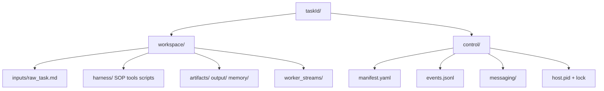

<details>
<summary>相关源文件</summary>

生成本页时使用的主要源文件：

- [src/shared/capsule.ts](../../../project-repos/deputy-agent/src/shared/capsule.ts)
- [src/shared/manifest.ts](../../../project-repos/deputy-agent/src/shared/manifest.ts)
- [src/shared/paths.ts](../../../project-repos/deputy-agent/src/shared/paths.ts)
- [docs/DATA_FORMATS.md](../../../project-repos/deputy-agent/docs/DATA_FORMATS.md)

</details>

# 任务胶囊与磁盘格式

Deputy 把「一个长任务」物化为磁盘上的 **task capsule**：`<tasksRoot>/<taskId>/` 下分成 **workspace/**（可交付物与输入）和 **control/**（编排权威状态）。没有中心数据库——CLI、Web、Host 三个进程靠文件锁与 append-only JSONL 达成一致。这对 crash 恢复友好，也让你可以用 `git`/`rsync` 直接备份任务。

## 创建时目录树

`createTaskCapsule` 用 `mkdir(..., { recursive: false })` 创建 task 根目录，**EEXIST 即冲突**（避免 TOCTOU 双提交）。随后一次性 mkdir 约 20 个子目录：



初始 manifest 写入 `schemaVersion: "1.0"`、`stage: "submitted"`、`roleBindings`（若 submit 时指定 per-role provider）。`raw_task.md` 只存正文，来源元数据进 conversation 首行。

## manifest.yaml：状态机真相

`ManifestIO` 在 TS 层暴露 camelCase，磁盘 YAML 用 snake_case——转换在 IO 内完成，调用方只见统一类型。

核心字段：

| 字段 | 含义 |
|------|------|
| `taskId` / `title` | 标识与展示名 |
| `stage` | 当前九阶段之一 |
| `stageHistory` | 每次进入 stage 的时间戳 |
| `pausedFrom` | pause 前的 in-progress stage |
| `lastError` | 结构化错误（kind + message + details） |
| `roleBindings` | 可选的 per-role `provider` / `model` |

写入串行化：`manifest.yaml.lock` + 原子 rename。授权写者只有 Host 与特权 CLI 路径；Web 写经 cliBridge 间接获得同样保证。

## 其它 control 面文件

- **`events.jsonl`**：编排级事件（stage_transition、session_started、watchdog_triggered…）
- **`status.md`**：由 Host 在 stage 变更时重渲染的人类可读摘要（可读可现算）
- **`messaging/`**：`state.jsonl` + `payloads/` 存 envelope 与投递状态
- **各角色 stream JSONL**：Provider adapter 写入，Watcher 增量读取

## workspace/harness 的意义

Harness 不是 repo 内置静态配置，而是 Meta 在 `bootstrapping` 阶段生成的 **任务专属** SOP、工具说明、本地 skills/mcp 占位目录、以及 `done_criteria.yaml`。Worker 被限制在 harness 声明的方法论内操作——这是 Deputy「通用白领任务」而非「裸 CLI agent」的关键。

Sources: [src/shared/capsule.ts:30-74](../../../project-repos/deputy-agent/src/shared/capsule.ts#L30-L74), [src/shared/manifest.ts:32-108](../../../project-repos/deputy-agent/src/shared/manifest.ts#L32-L108), [docs/ARCHITECTURE.md:158-167](../../../project-repos/deputy-agent/docs/ARCHITECTURE.md#L158-L167)

<details class="source-snippets">
<summary>引用源码</summary>

<!-- source-snippets:start -->

#### `src/shared/capsule.ts:30-74`

```typescript
export async function createTaskCapsule(input: CreateTaskCapsuleInput): Promise<TaskCapsulePaths> {
  const paths = buildTaskCapsulePaths(input.tasksRoot, input.taskId); // invalid task_id throws PathEscapeError
  const now = input.nowIso ?? nowIso8601Us();
  const title = input.title ?? "";

  // Create task_root with recursive:false so EEXIST acts as conflict detection (avoids TOCTOU).
  await mkdir(paths.tasksRoot, { recursive: true });
  try {
    await mkdir(paths.taskRoot, { recursive: false });
  } catch (err) {
    if ((err as NodeJS.ErrnoException).code === "EEXIST") {
      throw new TaskCapsuleConflict(`task capsule already exists at ${paths.taskRoot}`, {
        details: { taskId: input.taskId, path: paths.taskRoot },
      });
    }
    throw err;
  }

  const dirs = [
    paths.workspace,
    paths.inputsDir,
    paths.clarifyDir,
    paths.harnessDir,
    paths.harnessSopDir,
    paths.harnessToolsDir,
    paths.harnessSkillsLocalDir,
    paths.harnessMcpServersLocalDir,
    paths.harnessScriptsDir,
    paths.memoryDir,
    paths.artifactsDir,
    paths.outputDir,
    paths.workerStreamsDir,
    paths.control,
    paths.messagingDir,
    paths.messagingPayloads,
    paths.controlStreamsDir,
    paths.metaStreamsDir,
    paths.watcherStreamsDir,
    paths.reviewerStreamsDir,
    paths.workerMetaDir,
    paths.agentPromptsDir,
    paths.uploadsDir,
    paths.workerLogsDir,
  ];
  for (const d of dirs) await mkdir(d, { recursive: true });
```

#### `src/shared/manifest.ts:32-108`

```typescript
export const MANIFEST_SCHEMA_VERSION = "1.0";

export type Stage =
  | "submitted"
  | "clarifying"
  | "bootstrapping"
  | "running"
  | "awaiting_user"
  | "done"
  | "failed"
  | "cancelled"
  | "paused";

/** Runtime list of all valid stages (runtime mirror of the Stage type; used by the CLI and validation). */
export const STAGES_ALL: ReadonlyArray<Stage> = [
  "submitted",
  "clarifying",
  "bootstrapping",
  "running",
  "awaiting_user",
  "done",
  "failed",
  "cancelled",
  "paused",
];

export type StageInProgress = Extract<
  Stage,
  "submitted" | "clarifying" | "bootstrapping" | "running" | "awaiting_user"
>;

const IN_PROGRESS_STAGES: ReadonlySet<string> = new Set<StageInProgress>([
  "submitted",
  "clarifying",
  "bootstrapping",
  "running",
  "awaiting_user",
]);

export interface StageHistoryEntry {
  readonly stage: Stage;
  readonly enteredAt: Iso8601Us;
}

export interface LastError {
  readonly errorKind: string;
  readonly message: string;
  readonly at: Iso8601Us;
  readonly details?: Readonly<Record<string, unknown>>;
}

/** Per-role execution binding: the provider chosen at submit. `model` is currently always absent (the host picks a default model per provider); reserved for future use. */
export interface RoleBinding {
  readonly provider: ProviderId;
  readonly model?: string;
}

/** AgentRole to execution binding; only roles the user explicitly selected are listed. Unlisted roles fall back through the host's resolution chain. */
export type RoleBindingMap = Partial<Record<AgentRole, RoleBinding>>;

/** Known role / provider sets for roleBindings (used by load validation; sourced from the wrapper's ALL_AGENT_ROLES / ALL_PROVIDER_IDS). */
const KNOWN_ROLES: ReadonlySet<string> = new Set<string>(ALL_AGENT_ROLES);
const KNOWN_PROVIDERS: ReadonlySet<string> = new Set<string>(ALL_PROVIDER_IDS);

export interface Manifest {
  readonly schemaVersion: typeof MANIFEST_SCHEMA_VERSION;
  readonly taskId: TaskId;
  title: string;
  readonly createdAt: Iso8601Us;
  updatedAt: Iso8601Us;
  readonly rawTaskPath: string;
  stage: Stage;
  stageHistory: ReadonlyArray<StageHistoryEntry>;
  pausedFrom: StageInProgress | null;
  lastError: LastError | null;
  readonly roleBindings?: RoleBindingMap;
}
```

#### `docs/ARCHITECTURE.md:158-167`

```markdown
| Term | Meaning |
| --- | --- |
| **task capsule** | The per-task directory (`workspace/` + `control/`) holding all state for one task. |
| **manifest** | `control/manifest.yaml` — the authoritative task record, including the current `stage`. |
| **stage** | The task's lifecycle state (one of the nine stages above). |
| **harness** | The per-task `workspace/harness/` content meta prepares — SOP, tools, scripts, and `done_criteria.yaml`. |
| **role** | One of the four agent roles: meta / worker / watcher / reviewer. |
| **envelope** | A typed message on a channel, with a `kind` and optional structured `extras` + a body. |
| **channel** | An inbox — `meta`, `worker`, or `watcher` — with a per-channel kind whitelist. |
| **done criteria** | Declarative checks in `done_criteria.yaml` evaluated (no LLM) when a worker session ends. |
```

<!-- source-snippets:end -->
</details>

## 相关页面

- [消息总线与 Envelope](messaging-bus.md) — `control/messaging/` 细节
- [Watcher 流水线与完成判据](watcher-done-criteria.md) — `done_criteria.yaml` 评估时机
- [CLI 与 Web GUI](cli-web-gui.md) — 谁创建/读取 capsule
