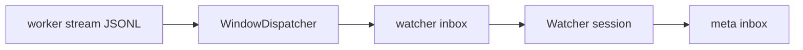

<details>
<summary>相关源文件</summary>

生成本页时使用的主要源文件：

- [src/host/watcher/dispatcher.ts](../../../project-repos/deputy-agent/src/host/watcher/dispatcher.ts)
- [src/host/done_criteria/evaluate.ts](../../../project-repos/deputy-agent/src/host/done_criteria/evaluate.ts)
- [src/host/done_criteria/checks.ts](../../../project-repos/deputy-agent/src/host/done_criteria/checks.ts)
- [docs/RUNTIME.md](../../../project-repos/deputy-agent/docs/RUNTIME.md)

</details>

# Watcher 流水线与完成判据

Worker 在 Provider 会话里可能连续运行数小时，Meta 不可能逐 token 盯 stream。**Watcher** 把 Worker 输出 JSONL 按 **固定时间窗口**（默认 180s，从 session 开始的单调时钟）切片，预处理成可读摘要，以 `worker_stream_window` envelope 投递。Meta 则通过 inbox 异步收到「这一段 Worker 做了什么」——这是 master–worker 架构里审计层的核心机制。

## WindowDispatcher 行为

每 tick（仅 `running`）：

1. `OffsetTracker` 记录已读 byte offset 与下一窗口 due time
2. 追上所有 due 窗口：增量读 stream，跳过半行/trailing corrupt line（fail-soft）
3. 非空窗口 → enqueue watcher channel；空窗口只 advance state
4. Worker session 结束 → catch-up backlog + **final window**

Dispatcher **只 enqueue**；真正 inject watcher session 在 tick Step 4。读失败 degrade 为向 meta 发 `host_event`，不 crash Host。



## Watcher context compaction

Watcher 长活 + 多窗口 inject 会撑大 context。Host 在 watcher idle 且 `contextUsage` 超过默认 **500k tokens** 时后台跑 compaction：调用 runtime 的 `compact`（若 capability 允许），再 re-inject 角色 prompt。有 retry cap，耗尽则本 session 放弃 compaction——tick 不被阻塞。

Claude 与 Codex 在「能否观察 compact 摘要」上 capability 不同，Host 会切换 watcher compact 模式 **strict / lenient**（见 LIMITATIONS）。

## done_criteria：无 LLM 的收束检查

Worker session **结束**时（非 stage=done），Host 调用 `evaluateOutcome` 读取 `workspace/harness/done_criteria.yaml`：

- 声明式 checks（文件存在、脚本退出码、渲染模板等）
- **不调用 LLM** 判定「任务精神上是否完成」
- 结果写入 outcome 摘要，供 Meta 与 Reviewer 人类可读链路使用

这与 Meta/Reviewer 的语义判断分层：**机器可验证** vs **阶段门禁 verdict**。

| 层 | 谁 | 做什么 |
|----|-----|--------|
| done_criteria | Host 脚本/规则 | Worker 单次 session 结束时的客观检查 |
| reviewer_verdict | Reviewer LLM | bootstrap / final 阶段 pass-fail |
| Meta |  orchestrator | 综合 claim + criteria + 用户意图决定 stage |

Sources: [docs/RUNTIME.md:176-199](../../../project-repos/deputy-agent/docs/RUNTIME.md#L176-L199), [src/host/daemon.ts:125-125](../../../project-repos/deputy-agent/src/host/daemon.ts#L125-L125), [docs/ARCHITECTURE.md:166-167](../../../project-repos/deputy-agent/docs/ARCHITECTURE.md#L166-L167)

<details class="source-snippets">
<summary>引用源码</summary>

<!-- source-snippets:start -->

#### `docs/RUNTIME.md:176-199`

```markdown
## Watcher pipeline

While the task is `running`, the worker's output stream (a JSONL file written by the provider
adapter) is sliced into time windows and dispatched to the watcher.

A `WindowDispatcher` holds a per-worker-session in-memory `OffsetTracker` recording the byte
offset read so far and the next window's due time (a fixed window, default 180 s, measured from
session start on a monotonic clock). On each tick it catches up all due windows: for each
window it reads the stream increment from the last offset, preprocesses and renders it, and — if
the window is non-empty — enqueues a `worker_stream_window` envelope to the watcher inbox and
appends a `worker_stream_window_dispatched` event. Empty windows advance state without
dispatching. When the worker session ends, the dispatcher catches up the backlog and emits one
final window.

The dispatcher only enqueues envelopes; the physical inject into the watcher session happens via
the tick loop's delivery step. Incremental reads exclude a trailing half-written line (advanced
on the next read) and skip a corrupt interior line (with its bytes still counted in the offset
so it is not re-read). Read / enqueue failures are fail-soft; a degraded final window surfaces a
`host_event` to the meta inbox.

Independently, when the watcher is idle and its reported context usage exceeds a token threshold
(default 500,000), the host runs a context-**compaction** flow in the background: it compacts
the watcher's context and re-injects the role, without blocking the tick. The flow is bounded by
a retry cap; once exhausted it gives up for that watcher session.
```

#### `src/host/daemon.ts:125-125`

```typescript
import { evaluateOutcome, renderOutcomeSummary, ScriptProcessRegistry } from "./done_criteria/index.js";
```

#### `docs/ARCHITECTURE.md:166-167`

```markdown
| **channel** | An inbox — `meta`, `worker`, or `watcher` — with a per-channel kind whitelist. |
| **done criteria** | Declarative checks in `done_criteria.yaml` evaluated (no LLM) when a worker session ends. |
```

<!-- source-snippets:end -->
</details>

## 相关页面

- [Host 守护进程与 Tick 循环](host-daemon-runtime.md) — tick 第 5 步 dispatch
- [Host 工具与 Harness](host-tools-harness.md) — harness 中的 done_criteria 由谁写入
- [任务胶囊与磁盘格式](task-capsule-data.md) — stream 与 harness 路径
