# easy-agent DeepWiki - Full Wiki

Generated: 2026-04-30T12:44:41.392Z
Source: https://github.com/ConardLi/easy-agent
Branch: main
Commit: c24463e07dd136d41f6ab28edb33a3eaf0b209c1
Language: zh-CN

## 目录
- [项目概览](#项目概览)
- [系统架构](#系统架构)
- [CLI 与终端 UI](#cli-与终端-ui)
- [QueryEngine 与 Agentic Loop](#queryengine-与-agentic-loop)
- [模型通信与 Streaming](#模型通信与-streaming)
- [工具系统与权限模型](#工具系统与权限模型)
- [MCP 集成](#mcp-集成)
- [Skills 系统](#skills-系统)
- [上下文、记忆与压缩](#上下文、记忆与压缩)
- [会话持久化与任务系统](#会话持久化与任务系统)
- [Sandbox 与安全边界](#sandbox-与安全边界)
- [测试、构建与路线图](#测试、构建与路线图)

---

<details>
<summary>相关源文件</summary>

生成本页时使用的主要源文件：

- [README.md](../../../project-repos/easy-agent/README.md)
- [README.zh-CN.md](../../../project-repos/easy-agent/README.zh-CN.md)
- [package.json](../../../project-repos/easy-agent/package.json)
- [tsconfig.json](../../../project-repos/easy-agent/tsconfig.json)

</details>

# 项目概览

Easy Agent 是一个终端原生的本地 coding agent 复刻项目，目标是用 TypeScript 与 Node.js 重建 Claude Code 风格的工作流，而不是只提供单文件 demo 或 prompt wrapper。README 明确说它处于基础实现活跃开发阶段，并已经覆盖 CLI、streaming、工具执行、终端 UI、会话编排等基础层。  
Sources: [README.md:3-7](../../../project-repos/easy-agent/README.md#L3-L7), [README.md:23-29](../../../project-repos/easy-agent/README.md#L23-L29)

<details class="source-snippets">
<summary>引用源码</summary>

<!-- source-snippets:start -->

#### `README.md:3-7`

```markdown
An open-source, terminal-native project to fully recreate the Claude Code experience from the ground up.

Easy Agent is a long-horizon engineering project focused on rebuilding a complete local agentic coding system in TypeScript and Node.js. The goal is not to publish isolated demos, but to incrementally construct a production-style coding agent with a clean architecture, strong safety boundaries, multi-turn orchestration, local tool execution, and the extensibility required for a full Claude Code-class developer experience.

This repository is the open-source implementation track of that effort. Full documentation will be added over time. For now, this README focuses on the project itself: what it aims to become, how it is structured, and where implementation currently stands.
```

#### `README.md:23-29`

```markdown
## Project Status

**Current stage:** foundational implementation in active development

The project already has meaningful groundwork across the CLI, streaming communication, tool execution, terminal UI, and session orchestration layers. At the same time, many advanced systems in the full recreation plan are still under active development.

Easy Agent should currently be understood as a serious open-source rebuild in progress rather than a finished end-user product.
```

<!-- source-snippets:end -->
</details>

## 定位与边界

项目定位可以概括为：**面向真实工程系统的本地 Agentic Coding CLI**。它强调五层架构、持久化、上下文压缩、MCP、Skills、Sandbox、任务系统等长期能力，但 README 也明确指出当前不是面向终端用户完全交付的成品。  
Sources: [README.md:11-22](../../../project-repos/easy-agent/README.md#L11-L22), [README.zh-CN.md:23-29](../../../project-repos/easy-agent/README.zh-CN.md#L23-L29)

<details class="source-snippets">
<summary>引用源码</summary>

<!-- source-snippets:start -->

#### `README.md:11-22`

```markdown
## Vision

Easy Agent aims to become a serious open-source recreation of a modern local coding agent system.

Core goals:

- Fully recreate the Claude Code-style workflow in an open-source codebase
- Keep the architecture layered, explicit, and extensible
- Prioritize real engineering systems over toy examples
- Evolve incrementally toward a complete local Agent CLI
- Preserve a stable path toward persistence, compaction, MCP, skills, sandboxing, sub-agents, multi-agent collaboration, and multi-provider support

```

#### `README.zh-CN.md:23-29`

```markdown
## 当前状态

**当前阶段：** 基础实现已经建立，项目正在持续推进

当前项目已经在 CLI、流式通信、工具执行、终端 UI、会话编排等方向完成了较有价值的基础建设。但完整复刻目标中的许多高级系统仍在持续开发中。

因此，当前的 Easy Agent 更适合被理解为一个正在稳步推进的开源复刻工程，而不是已经面向终端用户完全交付的成品。
```

<!-- source-snippets:end -->
</details>

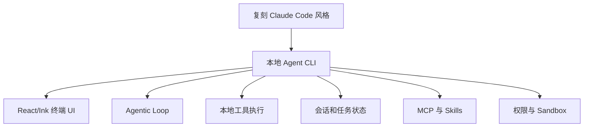

Sources: [README.md:31-60](../../../project-repos/easy-agent/README.md#L31-L60), [README.md:83-121](../../../project-repos/easy-agent/README.md#L83-L121)

<details class="source-snippets">
<summary>引用源码</summary>

<!-- source-snippets:start -->

#### `README.md:31-60`

````markdown
## Architecture

Easy Agent is being built around a five-layer architecture:

```text
+---------------------------------------------------+
| 1. Interaction Layer                              |
|    Terminal UI, input handling, rendering         |
+---------------------------------------------------+
| 2. Orchestration Layer                            |
|    Multi-turn session flow, usage, commands       |
+---------------------------------------------------+
| 3. Core Agentic Loop                              |
|    Reason -> tool call -> observe -> continue     |
+---------------------------------------------------+
| 4. Tooling Layer                                  |
|    File, shell, search, and local actions         |
+---------------------------------------------------+
| 5. Model Communication Layer                      |
|    Streaming API communication with LLMs          |
+---------------------------------------------------+
```

This separation makes the system easier to evolve:

- the **communication layer** handles model I/O
- the **tool layer** exposes actionable capabilities
- the **agentic loop** drives single-turn autonomous execution
- the **orchestration layer** manages multi-turn state and control flow
- the **interaction layer** turns the runtime into a usable terminal product
````

#### `README.md:83-121`

```markdown
## Roadmap and Progress

The project follows a 30-phase roadmap designed to recreate the full Claude Code-style system progressively.

| Phase | Area | Core Code | Status |
|---|---|---|---:|
| 0 | Project scaffold | `planned in step series` | ✅ Done |
| 1 | LLM communication layer | [`step/step1.js`](./step/step1.js) | ✅ Done |
| 2 | React/Ink terminal UI | [`step/step2.js`](./step/step2.js) | ✅ Done |
| 3 | Tool interface and first tool | [`step/step3.js`](./step/step3.js) | ✅ Done |
| 4 | Core agentic loop | [`step/step4.js`](./step/step4.js) | ✅ Done |
| 5 | Complete core toolset | [`step/step5.js`](./step/step5.js) | ✅ Done |
| 6 | System prompt and context engineering | [`step/step6.js`](./step/step6.js) | ✅ Done |
| 7 | Permission control system | [`step/step7.js`](./step/step7.js) | ✅ Done |
| 8 | QueryEngine multi-turn orchestration | [`step/step8.js`](./step/step8.js) | ✅ Done |
| 9 | Session persistence and restore | [`step/step9.js`](./step/step9.js) | ✅ Done |
| 10 | Project memory system | [`step/step10.js`](./step/step10.js) | ✅ Done |
| 11 | Context compaction | [`step/step11.js`](./step/step11.js) | ✅ Done |
| 12 | Fine-grained token budget management | [`step/step12.js`](./step/step12.js) | ✅ Done |
| 13 | Plan mode | [`step/step13.js`](./step/step13.js) | ✅ Done |
| 14 | TodoWrite session task tracking | [`step/step14.js`](./step/step14.js) | ✅ Done |
| 15 | Task management system (V2) | [`step/step15.js`](./step/step15.js) | ✅ Done |
| 16 | MCP protocol support | [`step/step16.js`](./step/step16.js) | ✅ Done |
| 17 | Skills system | [`step/step17.js`](./step/step17.js) | ✅ Done |
| 18 | Sandbox | [`step/step18.js`](./step/step18.js) | ✅ Done |
| 19 | Sub-agents | `planned` | ⏳ Not started |
| 20 | Custom agent system | `planned` | ⏳ Not started |
| 21 | Multi-agent collaboration | `planned` | ⏳ Not started |
| 22 | Hooks lifecycle system | `planned` | ⏳ Not started |
| 23 | Terminal UI upgrades | `planned in step series` | 🚧 Partial |
| 24 | Configuration system improvements | `planned in step series` | 🚧 Partial |
| 25 | File history and rollback | `planned` | ⏳ Not started |
| 26 | Error handling and resilience | `planned in step series` | 🚧 Partial |
| 27 | Pipe mode / non-interactive execution | `planned` | ⏳ Not started |
| 28 | Auto mode | `planned in step series` | 🚧 Partial |
| 29 | Multi-provider support | `planned in step series` | ⏳ Not started |
| 30 | Packaging, publishing, and documentation | `planned in step series` | 🚧 Partial |

The [`easy-agent/step/`](./step/) directory contains tutorial-friendly milestone code, so each completed chapter is directly learnable and reproducible from a focused single file.
```

<!-- source-snippets:end -->
</details>

## 技术栈与运行方式

仓库是 ESM TypeScript 项目，`bin.agent` 指向编译后的 `dist/entrypoint/cli.js`，开发入口是 `tsx src/entrypoint/cli.ts`，构建命令是 `tsc`。依赖显示它基于 Anthropic SDK、MCP SDK、React/Ink、dotenv、proper-lockfile、yaml 和 ignore。  
Sources: [package.json:2-20](../../../project-repos/easy-agent/package.json#L2-L20), [package.json:29-46](../../../project-repos/easy-agent/package.json#L29-L46)

<details class="source-snippets">
<summary>引用源码</summary>

<!-- source-snippets:start -->

#### `package.json:2-20`

```json
  "name": "easy-agent",
  "version": "0.1.0",
  "description": "A terminal-native agentic coding system",
  "type": "module",
  "main": "dist/entrypoint/cli.js",
  "bin": {
    "agent": "dist/entrypoint/cli.js"
  },
  "scripts": {
    "dev": "tsx src/entrypoint/cli.ts",
    "build": "tsc",
    "start": "node dist/entrypoint/cli.js",
    "test:streaming": "tsx src/scripts/test-streaming.ts",
    "test:tasks": "tsx src/scripts/test-tasks.ts",
    "test:mcp": "tsx src/scripts/test-mcp.ts",
    "test:skills": "tsx src/scripts/test-skills.ts",
    "test:sandbox": "tsx src/scripts/test-sandbox.ts",
    "smoke:sandbox": "tsx src/scripts/smoke-sandbox.ts",
    "smoke:bash-sandbox": "tsx src/scripts/smoke-bash-sandbox.ts"
```

#### `package.json:29-46`

```json
  "devDependencies": {
    "@types/node": "^25.5.2",
    "@types/proper-lockfile": "^4.1.4",
    "@types/react": "^19.2.14",
    "tsx": "^4.21.0",
    "typescript": "^6.0.2"
  },
  "dependencies": {
    "@anthropic-ai/sdk": "^0.85.0",
    "@modelcontextprotocol/sdk": "^1.29.0",
    "chalk": "^5.6.2",
    "dotenv": "^17.4.1",
    "ignore": "^7.0.5",
    "ink": "^7.0.0",
    "proper-lockfile": "^4.1.2",
    "react": "^19.2.4",
    "yaml": "^2.8.3"
  }
```

<!-- source-snippets:end -->
</details>

TypeScript 配置使用 `NodeNext` 模块系统、`ES2022` target、`strict: true`、React JSX、声明文件和 sourcemap 输出。  
Sources: [tsconfig.json:2-20](../../../project-repos/easy-agent/tsconfig.json#L2-L20)

<details class="source-snippets">
<summary>引用源码</summary>

<!-- source-snippets:start -->

#### `tsconfig.json:2-20`

```json
  "compilerOptions": {
    "target": "ES2022",
    "module": "NodeNext",
    "moduleResolution": "NodeNext",
    "outDir": "dist",
    "rootDir": "src",
    "strict": true,
    "jsx": "react-jsx",
    "esModuleInterop": true,
    "allowSyntheticDefaultImports": true,
    "resolveJsonModule": true,
    "skipLibCheck": true,
    "types": ["node"],
    "declaration": true,
    "declarationMap": true,
    "sourceMap": true
  },
  "include": ["src/**/*.ts", "src/**/*.tsx"],
  "exclude": ["node_modules", "dist"]
```

<!-- source-snippets:end -->
</details>

| 维度 | 证据 | 说明 |
|------|------|------|
| 语言 | `package.json` + `tsconfig.json` | TypeScript、ESM、NodeNext |
| UI | `ink`, `react` | 终端 React 渲染 |
| 模型通信 | `@anthropic-ai/sdk` | Anthropic-compatible Messages API |
| 扩展 | `@modelcontextprotocol/sdk`, `yaml`, `ignore` | MCP 与 Skills |
| 本地状态 | `proper-lockfile` | Task V2 并发写保护 |

Sources: [package.json:36-46](../../../project-repos/easy-agent/package.json#L36-L46), [tsconfig.json:2-20](../../../project-repos/easy-agent/tsconfig.json#L2-L20)

<details class="source-snippets">
<summary>引用源码</summary>

<!-- source-snippets:start -->

#### `package.json:36-46`

```json
  "dependencies": {
    "@anthropic-ai/sdk": "^0.85.0",
    "@modelcontextprotocol/sdk": "^1.29.0",
    "chalk": "^5.6.2",
    "dotenv": "^17.4.1",
    "ignore": "^7.0.5",
    "ink": "^7.0.0",
    "proper-lockfile": "^4.1.2",
    "react": "^19.2.4",
    "yaml": "^2.8.3"
  }
```

#### `tsconfig.json:2-20`

```json
  "compilerOptions": {
    "target": "ES2022",
    "module": "NodeNext",
    "moduleResolution": "NodeNext",
    "outDir": "dist",
    "rootDir": "src",
    "strict": true,
    "jsx": "react-jsx",
    "esModuleInterop": true,
    "allowSyntheticDefaultImports": true,
    "resolveJsonModule": true,
    "skipLibCheck": true,
    "types": ["node"],
    "declaration": true,
    "declarationMap": true,
    "sourceMap": true
  },
  "include": ["src/**/*.ts", "src/**/*.tsx"],
  "exclude": ["node_modules", "dist"]
```

<!-- source-snippets:end -->
</details>

## 仓库组织

README 给出的主结构与当前源文件一致：`entrypoint` 负责 CLI bootstrap，`ui` 负责 Ink 终端界面，`core` 放 agentic loop 与 query orchestration，`tools` 放本地工具和注册系统，`services/api` 放模型客户端与 streaming wrapper，`context/session/state/sandbox` 分别承载上下文、持久化、状态和安全边界。  
Sources: [README.md:62-80](../../../project-repos/easy-agent/README.md#L62-L80), [README.zh-CN.md:62-80](../../../project-repos/easy-agent/README.zh-CN.md#L62-L80)

<details class="source-snippets">
<summary>引用源码</summary>

<!-- source-snippets:start -->

#### `README.md:62-80`

````markdown
## Repository Layout

```text
easy-agent/
├── src/
│   ├── entrypoint/      # CLI bootstrap
│   ├── ui/              # React/Ink terminal interface
│   ├── core/            # agentic loop and query orchestration
│   ├── tools/           # local tools and tool registry
│   ├── services/api/    # model client and streaming wrapper
│   ├── permissions/     # permission and safety controls
│   ├── context/         # system prompt and context management
│   ├── session/         # session persistence and history
│   ├── types/           # shared domain types
│   └── utils/           # env, config, logging, helpers
├── package.json
├── tsconfig.json
├── README.md
└── README.zh-CN.md
````

#### `README.zh-CN.md:62-80`

````markdown
## 仓库结构

```text
easy-agent/
├── src/
│   ├── entrypoint/      # CLI 启动入口
│   ├── ui/              # React/Ink 终端界面
│   ├── core/            # agentic loop 与 query orchestration
│   ├── tools/           # 本地工具与工具注册系统
│   ├── services/api/    # 模型客户端与 streaming 包装
│   ├── permissions/     # 权限与安全控制
│   ├── context/         # system prompt 与上下文管理
│   ├── session/         # 会话持久化与历史
│   ├── types/           # 共享领域类型
│   └── utils/           # env、config、log、辅助函数
├── package.json
├── tsconfig.json
├── README.md
└── README.zh-CN.md
````

<!-- source-snippets:end -->
</details>

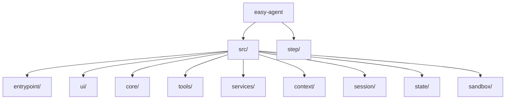

Sources: [README.md:62-80](../../../project-repos/easy-agent/README.md#L62-L80), [README.md:121-121](../../../project-repos/easy-agent/README.md#L121-L121)

<details class="source-snippets">
<summary>引用源码</summary>

<!-- source-snippets:start -->

#### `README.md:62-80`

````markdown
## Repository Layout

```text
easy-agent/
├── src/
│   ├── entrypoint/      # CLI bootstrap
│   ├── ui/              # React/Ink terminal interface
│   ├── core/            # agentic loop and query orchestration
│   ├── tools/           # local tools and tool registry
│   ├── services/api/    # model client and streaming wrapper
│   ├── permissions/     # permission and safety controls
│   ├── context/         # system prompt and context management
│   ├── session/         # session persistence and history
│   ├── types/           # shared domain types
│   └── utils/           # env, config, logging, helpers
├── package.json
├── tsconfig.json
├── README.md
└── README.zh-CN.md
````

#### `README.md:121-121`

```markdown
The [`easy-agent/step/`](./step/) directory contains tutorial-friendly milestone code, so each completed chapter is directly learnable and reproducible from a focused single file.
```

<!-- source-snippets:end -->
</details>

## 路线图状态

README 的路线图列出 30 个阶段，其中 1-18 已完成，19-22 等高级能力仍未开始，UI 升级、配置、错误处理、auto mode、发布文档等属于部分完成或待推进项。`step/` 目录保存教程化里程碑代码，便于把正式 `src/` 实现和单文件教学版本对照阅读。  
Sources: [README.md:83-121](../../../project-repos/easy-agent/README.md#L83-L121), [README.zh-CN.md:83-121](../../../project-repos/easy-agent/README.zh-CN.md#L83-L121)

<details class="source-snippets">
<summary>引用源码</summary>

<!-- source-snippets:start -->

#### `README.md:83-121`

```markdown
## Roadmap and Progress

The project follows a 30-phase roadmap designed to recreate the full Claude Code-style system progressively.

| Phase | Area | Core Code | Status |
|---|---|---|---:|
| 0 | Project scaffold | `planned in step series` | ✅ Done |
| 1 | LLM communication layer | [`step/step1.js`](./step/step1.js) | ✅ Done |
| 2 | React/Ink terminal UI | [`step/step2.js`](./step/step2.js) | ✅ Done |
| 3 | Tool interface and first tool | [`step/step3.js`](./step/step3.js) | ✅ Done |
| 4 | Core agentic loop | [`step/step4.js`](./step/step4.js) | ✅ Done |
| 5 | Complete core toolset | [`step/step5.js`](./step/step5.js) | ✅ Done |
| 6 | System prompt and context engineering | [`step/step6.js`](./step/step6.js) | ✅ Done |
| 7 | Permission control system | [`step/step7.js`](./step/step7.js) | ✅ Done |
| 8 | QueryEngine multi-turn orchestration | [`step/step8.js`](./step/step8.js) | ✅ Done |
| 9 | Session persistence and restore | [`step/step9.js`](./step/step9.js) | ✅ Done |
| 10 | Project memory system | [`step/step10.js`](./step/step10.js) | ✅ Done |
| 11 | Context compaction | [`step/step11.js`](./step/step11.js) | ✅ Done |
| 12 | Fine-grained token budget management | [`step/step12.js`](./step/step12.js) | ✅ Done |
| 13 | Plan mode | [`step/step13.js`](./step/step13.js) | ✅ Done |
| 14 | TodoWrite session task tracking | [`step/step14.js`](./step/step14.js) | ✅ Done |
| 15 | Task management system (V2) | [`step/step15.js`](./step/step15.js) | ✅ Done |
| 16 | MCP protocol support | [`step/step16.js`](./step/step16.js) | ✅ Done |
| 17 | Skills system | [`step/step17.js`](./step/step17.js) | ✅ Done |
| 18 | Sandbox | [`step/step18.js`](./step/step18.js) | ✅ Done |
| 19 | Sub-agents | `planned` | ⏳ Not started |
| 20 | Custom agent system | `planned` | ⏳ Not started |
| 21 | Multi-agent collaboration | `planned` | ⏳ Not started |
| 22 | Hooks lifecycle system | `planned` | ⏳ Not started |
| 23 | Terminal UI upgrades | `planned in step series` | 🚧 Partial |
| 24 | Configuration system improvements | `planned in step series` | 🚧 Partial |
| 25 | File history and rollback | `planned` | ⏳ Not started |
| 26 | Error handling and resilience | `planned in step series` | 🚧 Partial |
| 27 | Pipe mode / non-interactive execution | `planned` | ⏳ Not started |
| 28 | Auto mode | `planned in step series` | 🚧 Partial |
| 29 | Multi-provider support | `planned in step series` | ⏳ Not started |
| 30 | Packaging, publishing, and documentation | `planned in step series` | 🚧 Partial |

The [`easy-agent/step/`](./step/) directory contains tutorial-friendly milestone code, so each completed chapter is directly learnable and reproducible from a focused single file.
```

#### `README.zh-CN.md:83-121`

```markdown
## 路线图与当前进度

项目遵循一个 30 阶段路线图，以渐进方式完整复刻 Claude Code 风格系统。

| 阶段 | 模块 | 核心代码 | 状态 |
|---|---|---|---:|
| 0 | 项目脚手架 | `planned in step series` | ✅ 已完成 |
| 1 | LLM 通信层 | [`step/step1.js`](./step/step1.js) | ✅ 已完成 |
| 2 | React/Ink 终端 UI | [`step/step2.js`](./step/step2.js) | ✅ 已完成 |
| 3 | Tool 接口与第一个工具 | [`step/step3.js`](./step/step3.js) | ✅ 已完成 |
| 4 | 核心 Agentic Loop | [`step/step4.js`](./step/step4.js) | ✅ 已完成 |
| 5 | 完整核心工具集 | [`step/step5.js`](./step/step5.js) | ✅ 已完成 |
| 6 | System Prompt 与上下文工程 | [`step/step6.js`](./step/step6.js) | ✅ 已完成 |
| 7 | 权限控制系统 | [`step/step7.js`](./step/step7.js) | ✅ 已完成 |
| 8 | QueryEngine 多轮编排 | [`step/step8.js`](./step/step8.js) | ✅ 已完成 |
| 9 | 会话持久化与恢复 | [`step/step9.js`](./step/step9.js) | ✅ 已完成 |
| 10 | 项目记忆系统 | [`step/step10.js`](./step/step10.js) | ✅ 已完成 |
| 11 | 上下文压缩 | [`step/step11.js`](./step/step11.js) | ✅ 已完成 |
| 12 | Token 预算精细管理 | [`step/step12.js`](./step/step12.js) | ✅ 已完成 |
| 13 | Plan Mode | [`step/step13.js`](./step/step13.js) | ✅ 已完成 |
| 14 | TodoWrite 会话任务跟踪 | [`step/step14.js`](./step/step14.js) | ✅ 已完成 |
| 15 | 任务管理系统（V2） | [`step/step15.js`](./step/step15.js) | ✅ 已完成 |
| 16 | MCP 协议支持 | [`step/step16.js`](./step/step16.js) | ✅ 已完成 |
| 17 | Skills 系统 | [`step/step17.js`](./step/step17.js) | ✅ 已完成 |
| 18 | Sandbox | [`step/step18.js`](./step/step18.js) | ✅ 已完成 |
| 19 | Sub-Agent | `planned` | ⏳ 未开始 |
| 20 | 自定义 Agent 系统 | `planned` | ⏳ 未开始 |
| 21 | 多 Agent 协作 | `planned` | ⏳ 未开始 |
| 22 | Hooks 生命周期系统 | `planned` | ⏳ 未开始 |
| 23 | 终端 UI 升级 | `planned in step series` | 🚧 部分完成 |
| 24 | 配置系统完善 | `planned in step series` | 🚧 部分完成 |
| 25 | 文件历史与回滚 | `planned` | ⏳ 未开始 |
| 26 | 错误处理与韧性 | `planned in step series` | 🚧 部分完成 |
| 27 | 管道模式 / 非交互执行 | `planned` | ⏳ 未开始 |
| 28 | Auto Mode | `planned in step series` | 🚧 部分完成 |
| 29 | 多 Provider 支持 | `planned in step series` | ⏳ 未开始 |
| 30 | 打包发布与文档 | `planned in step series` | 🚧 部分完成 |

[`easy-agent/step/`](./step/) 目录中已经补充了教程化的里程碑核心代码，意味着每个已完成章节都可以直接对照学习、逐步复刻。
```

<!-- source-snippets:end -->
</details>

## 阅读路线

| 目标 | 建议路径 |
|------|----------|
| 快速看全局 | [系统架构](system-architecture.md) |
| 追核心 turn | [QueryEngine 与 Agentic Loop](query-engine-agentic-loop.md) |
| 看模型通信 | [模型通信与 Streaming](model-streaming.md) |
| 看工具和权限 | [工具系统与权限模型](tools-permissions.md) |
| 看扩展能力 | [MCP 集成](mcp-integration.md)、[Skills 系统](skills-system.md) |
| 看持久状态 | [上下文、记忆与压缩](context-memory-compaction.md)、[会话持久化与任务系统](sessions-tasks.md) |
| 看安全质量 | [Sandbox 与安全边界](sandbox-security.md)、[测试、构建与路线图](testing-and-roadmap.md) |

## 相关页面

- [系统架构](system-architecture.md)
- [QueryEngine 与 Agentic Loop](query-engine-agentic-loop.md)
- [测试、构建与路线图](testing-and-roadmap.md)

---

<details>
<summary>相关源文件</summary>

生成本页时使用的主要源文件：

- [README.md](../../../project-repos/easy-agent/README.md)
- [src/entrypoint/cli.ts](../../../project-repos/easy-agent/src/entrypoint/cli.ts)
- [src/ui/App.tsx](../../../project-repos/easy-agent/src/ui/App.tsx)
- [src/core/queryEngine.ts](../../../project-repos/easy-agent/src/core/queryEngine.ts)
- [src/core/agenticLoop.ts](../../../project-repos/easy-agent/src/core/agenticLoop.ts)
- [src/tools/index.ts](../../../project-repos/easy-agent/src/tools/index.ts)
- [src/services/api/streaming.ts](../../../project-repos/easy-agent/src/services/api/streaming.ts)
- [src/context/systemPrompt.ts](../../../project-repos/easy-agent/src/context/systemPrompt.ts)

</details>

# 系统架构

README 把 Easy Agent 描述为五层架构：交互层、编排层、核心 Agentic Loop、工具层、模型通信层。当前 `src/` 实现基本按这个方向落地：CLI 只负责启动和装配，Ink UI 负责终端交互，`QueryEngine` 负责多轮状态和命令，`agenticLoop` 负责单轮推理到工具执行的闭环。  
Sources: [README.md:31-60](../../../project-repos/easy-agent/README.md#L31-L60), [src/entrypoint/cli.ts:105-133](../../../project-repos/easy-agent/src/entrypoint/cli.ts#L105-L133), [src/core/queryEngine.ts:75-102](../../../project-repos/easy-agent/src/core/queryEngine.ts#L75-L102), [src/core/agenticLoop.ts:239-409](../../../project-repos/easy-agent/src/core/agenticLoop.ts#L239-L409)

<details class="source-snippets">
<summary>引用源码</summary>

<!-- source-snippets:start -->

#### `README.md:31-60`

````markdown
## Architecture

Easy Agent is being built around a five-layer architecture:

```text
+---------------------------------------------------+
| 1. Interaction Layer                              |
|    Terminal UI, input handling, rendering         |
+---------------------------------------------------+
| 2. Orchestration Layer                            |
|    Multi-turn session flow, usage, commands       |
+---------------------------------------------------+
| 3. Core Agentic Loop                              |
|    Reason -> tool call -> observe -> continue     |
+---------------------------------------------------+
| 4. Tooling Layer                                  |
|    File, shell, search, and local actions         |
+---------------------------------------------------+
| 5. Model Communication Layer                      |
|    Streaming API communication with LLMs          |
+---------------------------------------------------+
```

This separation makes the system easier to evolve:

- the **communication layer** handles model I/O
- the **tool layer** exposes actionable capabilities
- the **agentic loop** drives single-turn autonomous execution
- the **orchestration layer** manages multi-turn state and control flow
- the **interaction layer** turns the runtime into a usable terminal product
````

#### `src/entrypoint/cli.ts:105-133`

```typescript
  const React = await import("react");
  const { render } = await import("ink");
  const { App } = await import("../ui/App.js");
  const { DEFAULT_MODEL } = await import("../services/api/client.js");
  const { bootstrapMcp } = await import("../services/mcp/bootstrap.js");

  const resolvedModel = model ?? DEFAULT_MODEL;

  // Kick off MCP server connections IN THE BACKGROUND. The bootstrap
  // function seeds `pending` registry entries synchronously, then connects
  // each server in parallel — a slow `npx -y @mcp/server-foo` cold-start
  // (which can take 10–30s on first run while npm downloads the package)
  // would otherwise leave the terminal black, because we wouldn't render
  // the UI until it returned.
  //
  // Trade-off: if the user submits a query before MCP tools land, the
  // model just doesn't see them yet. They'll appear on the next turn.
  // This matches Claude Code's behavior — its `prefetchAllMcpResources`
  // runs inside `useManageMCPConnections` (a React useEffect), so the
  // REPL is interactive from frame 1 too.
  void bootstrapMcp(process.cwd()).catch((error) => {
    console.error(`[easy-agent] MCP bootstrap failed: ${(error as Error).message}`);
  });

  const { waitUntilExit } = render(
    React.createElement(App, { model: resolvedModel, permissionMode, resumeSessionId, shouldResume }),
    { exitOnCtrlC: false },
  );
  await waitUntilExit();
```

#### `src/core/queryEngine.ts:75-102`

```typescript
export class QueryEngine {
  private messages: MessageParam[];
  private totalUsage: Usage;
  private readonly defaultModel: string;
  private sessionModelOverride: string | null = null;
  private readonly toolContext: ToolContext;
  private currentPermissionMode: PermissionMode;
  private prePlanMode: PermissionMode | null = null;
  private readonly permissionSettings?: PermissionSettings;
  private readonly sessionPermissionRules: PermissionRuleSet;
  private readonly onPermissionRequest?: (request: PermissionRequest) => Promise&lt;PermissionDecision&gt;;
  private abortController: AbortController | null = null;
  private usageAnchorIndex: number = -1;
  private lastCallUsage: Usage = { input_tokens: 0, output_tokens: 0 };
  private modeChangeCallback?: (mode: PermissionMode, previousMode: PermissionMode) => void;
  private needsPlanModeExitAttachment = false;

  constructor(options: QueryEngineOptions) {
    this.messages = [...(options.initialMessages ?? [])];
    this.totalUsage = { ...(options.initialUsage ?? createEmptyUsage()) };
    this.usageAnchorIndex = this.messages.length > 0 ? this.messages.length - 1 : -1;
    this.defaultModel = options.model;
    this.toolContext = options.toolContext;
    this.currentPermissionMode = options.permissionMode ?? "default";
    this.permissionSettings = options.permissionSettings;
    this.sessionPermissionRules = options.sessionPermissionRules ?? { allow: [], deny: [] };
    this.onPermissionRequest = options.onPermissionRequest;
  }
```

#### `src/core/agenticLoop.ts:239-409`

```typescript
export async function* query(
  params: QueryParams,
): AsyncGenerator&lt;AgenticLoopEvent, AgenticLoopResult&gt; {
  const maxTurns = params.maxTurns ?? MAX_TOOL_TURNS;
  let state: LoopState = {
    messages: [...params.messages],
    turnCount: 0,
    aborted: false,
  };
  const totalUsage: Usage = {
    input_tokens: 0,
    output_tokens: 0,
  };
  let lastCallUsage: Usage = {
    input_tokens: 0,
    output_tokens: 0,
  };

  while (state.turnCount < maxTurns) {
    if (params.abortSignal?.aborted) {
      const abortedState = { ...state, aborted: true };
      yield { type: "turn_complete", reason: "aborted", turnCount: state.turnCount };
      return { state: abortedState, usage: totalUsage, lastCallUsage, reason: "aborted" };
    }

    const nextTurnCount = state.turnCount + 1;

    // Token budget check before API call (skip first turn — let the API decide)
    if (state.turnCount > 0) {
      const estimatedTokens = tokenCountWithEstimation(state.messages, {
        usage: lastCallUsage.input_tokens > 0 ? lastCallUsage : undefined,
        usageAnchorIndex: lastCallUsage.input_tokens > 0 ? state.messages.length - 1 : undefined,
        systemPrompt: params.systemPrompt,
      });
      const warningState = calculateTokenWarningState(estimatedTokens, params.model);

      if (warningState.state !== "normal") {
        yield { type: "token_warning", warning: warningState };
      }

      if (warningState.state === "blocking") {
        yield {
          type: "error",
          error: new Error(
            `Context window limit reached (${estimatedTokens} tokens estimated, blocking limit ${warningState.blockingLimit}, window ${warningState.contextWindow}). ` +
            `Use /compact to free space.`,
          ),
        };
        yield { type: "turn_complete", reason: "blocking_limit", turnCount: nextTurnCount };
        return { state: { ...state, turnCount: nextTurnCount }, usage: totalUsage, lastCallUsage, reason: "blocking_limit" };
      }
    }

    const currentTools = params.getTools ? params.getTools() : params.tools;
    const stream = streamMessage({
      messages: [...state.messages],
      model: params.model,
      system: params.systemPrompt,
      tools: currentTools && currentTools.length > 0 ? currentTools : undefined,
      signal: params.abortSignal,
    });

    let assistantContent: ContentBlock[] = [];
    let stopReason = "";

    while (true) {
      const { value, done } = await stream.next();
      if (done) {
        const streamResult = value;
        if (!streamResult) {
          yield { type: "turn_complete", reason: "model_error", turnCount: nextTurnCount };
          return {
            state: { ...state, turnCount: nextTurnCount },
            usage: totalUsage,
            lastCallUsage,
            reason: "model_error",
          };
        }

        lastCallUsage = { ...streamResult.usage };
        totalUsage.input_tokens += streamResult.usage.input_tokens;
        totalUsage.output_tokens += streamResult.usage.output_tokens;
        totalUsage.cache_creation_input_tokens =
          (totalUsage.cache_creation_input_tokens ?? 0) + (streamResult.usage.cache_creation_input_tokens ?? 0);
        totalUsage.cache_read_input_tokens =
          (totalUsage.cache_read_input_tokens ?? 0) + (streamResult.usage.cache_read_input_tokens ?? 0);
        assistantContent = streamResult.assistantMessage.content as ContentBlock[];
        stopReason = streamResult.stopReason;
        break;
      }

      switch (value.type) {
        case "text":
          yield value;
          break;
        case "tool_use_start":
          yield value;
          break;
        case "error":
          yield { type: "error", error: value.error };
          yield { type: "turn_complete", reason: "model_error", turnCount: nextTurnCount };
          return {
            state: { ...state, turnCount: nextTurnCount },
            usage: totalUsage,
            lastCallUsage,
            reason: "model_error",
          };
      }
    }

    const assistantMessage: MessageParam = {
      role: "assistant",
      content: assistantContent as any,
    };
    const messagesWithAssistant = [...state.messages, assistantMessage];
    state = {
      messages: messagesWithAssistant,
      turnCount: nextTurnCount,
      aborted: false,
    };
... snippet truncated ...
```

<!-- source-snippets:end -->
</details>

## 分层视图

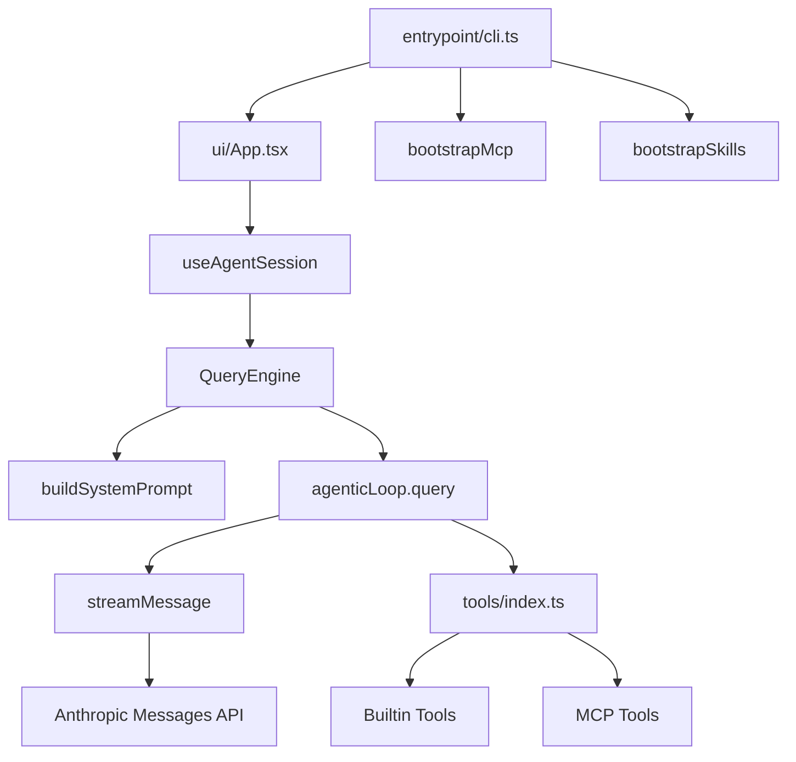

Sources: [src/entrypoint/cli.ts:69-77](../../../project-repos/easy-agent/src/entrypoint/cli.ts#L69-L77), [src/entrypoint/cli.ts:105-130](../../../project-repos/easy-agent/src/entrypoint/cli.ts#L105-L130), [src/ui/App.tsx:25-109](../../../project-repos/easy-agent/src/ui/App.tsx#L25-L109), [src/core/queryEngine.ts:288-384](../../../project-repos/easy-agent/src/core/queryEngine.ts#L288-L384), [src/core/agenticLoop.ts:292-399](../../../project-repos/easy-agent/src/core/agenticLoop.ts#L292-L399)

<details class="source-snippets">
<summary>引用源码</summary>

<!-- source-snippets:start -->

#### `src/entrypoint/cli.ts:69-77`

```typescript
  // Skills must load BEFORE we render anything (live REPL or
  // --dump-system-prompt), because `buildSystemPrompt` reads the
  // skill registry to inject the &lt;system-reminder&gt; discovery block.
  // If we bootstrap after the dump branch, the dump shows an empty
  // skills section and users assume the feature is broken.
  const { bootstrapSkills } = await import("../services/skills/bootstrap.js");
  await bootstrapSkills(process.cwd()).catch((error) => {
    console.error(`[easy-agent] skills bootstrap failed: ${(error as Error).message}`);
  });
```

#### `src/entrypoint/cli.ts:105-130`

```typescript
  const React = await import("react");
  const { render } = await import("ink");
  const { App } = await import("../ui/App.js");
  const { DEFAULT_MODEL } = await import("../services/api/client.js");
  const { bootstrapMcp } = await import("../services/mcp/bootstrap.js");

  const resolvedModel = model ?? DEFAULT_MODEL;

  // Kick off MCP server connections IN THE BACKGROUND. The bootstrap
  // function seeds `pending` registry entries synchronously, then connects
  // each server in parallel — a slow `npx -y @mcp/server-foo` cold-start
  // (which can take 10–30s on first run while npm downloads the package)
  // would otherwise leave the terminal black, because we wouldn't render
  // the UI until it returned.
  //
  // Trade-off: if the user submits a query before MCP tools land, the
  // model just doesn't see them yet. They'll appear on the next turn.
  // This matches Claude Code's behavior — its `prefetchAllMcpResources`
  // runs inside `useManageMCPConnections` (a React useEffect), so the
  // REPL is interactive from frame 1 too.
  void bootstrapMcp(process.cwd()).catch((error) => {
    console.error(`[easy-agent] MCP bootstrap failed: ${(error as Error).message}`);
  });

  const { waitUntilExit } = render(
    React.createElement(App, { model: resolvedModel, permissionMode, resumeSessionId, shouldResume }),
```

#### `src/ui/App.tsx:25-109`

```tsx
export function App({ model, permissionMode, shouldResume, resumeSessionId }: AppProps): React.ReactNode {
  const { exit } = useApp();
  const { state, actions } = useAgentSession({ model, onExit: exit, permissionMode, shouldResume, resumeSessionId });
  const isPlanExitActive = Boolean(state.permissionPrompt?.isPlanExit);

  // Surface the current in-progress item's activeForm via the global
  // StatusBar spinner. This mirrors source code behavior (Spinner.tsx:
  // `leaderVerb = currentTodo?.activeForm ?? randomVerb`) and keeps the
  // entire app at exactly ONE animation source — adding per-row spinners
  // caused severe flicker because every additional setInterval forces
  // another full terminal repaint cycle on top of streaming text.
  //
  // In task mode we read from the Task graph; in todo mode we keep the
  // V1 source. Either way, the spinner label comes from exactly one
  // place at a time.
  const inProgressTodo = state.todos.find((t) => t.status === "in_progress");
  const inProgressTask = state.tasks.find((t) => t.status === "in_progress");
  const effectiveSpinnerLabel = state.taskMode === "task"
    ? (inProgressTask?.activeForm ?? inProgressTask?.subject ?? state.spinnerLabel)
    : (inProgressTodo?.activeForm ?? state.spinnerLabel);
  // Pull skill `/<name>` commands from the live registry on every render
  // so newly activated conditional skills (e.g. test-reviewer after the
  // model reads a *.test.ts file) appear in the suggestion list without
  // the user having to restart. Computing inline is fine — the registry
  // is an in-memory Map and we only render on existing state changes.
  const skillCommands: CommandSuggestion[] = React.useMemo(
    () =>
      getAllUserInvocableSkills().map((skill) => ({
        name: `/${skill.name}`,
        description:
          skill.description.length > 80
            ? `${skill.description.slice(0, 77)}…`
            : skill.description,
      })),
    // Re-derive whenever the message log grows — that's our cheap proxy
    // for "something happened that may have activated a skill". The list
    // is tiny so the cost is negligible.
    [state.messages.length, state.toolCalls.length],
  );

  const { inputValue, commandSuggestions, modeSuggestions, taskModeSuggestions } = usePromptInput({
    isLoading: state.isLoading,
    hasPermissionPrompt: Boolean(state.permissionPrompt) && !isPlanExitActive,
    isPlanExitPrompt: false,
    permissionMode: state.permissionMode,
    taskMode: state.taskMode,
    extraCommands: skillCommands,
    onSubmit: actions.submit,
    onExit: exit,
    onInterrupt: actions.interrupt,
    onPermissionDecision: actions.resolvePermission,
  });

  return (
    &lt;Box flexDirection="column" paddingX={1}&gt;
      &lt;Box marginBottom={1}&gt;
        &lt;Text bold color="cyan"&gt;Easy Agent&lt;/Text&gt;
        &lt;Text dimColor&gt; ({state.currentModel})&lt;/Text&gt;
      &lt;/Box&gt;
      &lt;Text dimColor&gt;Type a message to start. Ctrl+C to interrupt, Ctrl+D to exit.&lt;/Text&gt;

      &lt;ConversationView messages={state.messages} /&gt;
      {state.taskMode === "task"
        ? &lt;TaskList tasks={state.tasks} /&gt;
        : &lt;TodoList todos={state.todos} /&gt;}
      &lt;ToolCallList toolCalls={state.toolCalls} /&gt;
      &lt;SystemPanel notice={state.systemNotice} /&gt;
      &lt;StatusBar
        isLoading={state.isLoading}
        spinnerLabel={effectiveSpinnerLabel}
        streamingText={state.streamingText}
        lastUsage={state.lastUsage}
        permissionPrompt={state.permissionPrompt}
        permissionMode={state.permissionMode}
        onPlanDecision={actions.resolvePermission}
      />
      &lt;InputPrompt isLoading={state.isLoading || Boolean(state.permissionPrompt)} inputValue={inputValue} /&gt;
      &lt;CommandSuggestions items={commandSuggestions} /&gt;
      &lt;ModeSelector items={modeSuggestions} /&gt;
      &lt;ModeSelector
        items={taskModeSuggestions}
        title={`select task system (↑↓ navigate, Enter confirm, 1-${taskModeSuggestions.length || 2} shortcut)`}
      />
    &lt;/Box&gt;
  );
```

#### `src/core/queryEngine.ts:288-384`

```typescript
    const previewSystemParts = await buildSystemPrompt({
      cwd: this.toolContext.cwd,
      userQuery: trimmed,
    });
    const previewSystemPrompt = renderSystemPrompt(previewSystemParts);

    // Only run compaction when there's meaningful conversation history
    if (this.messages.length > 0) {
      // Micro-compact old tool results first
      const microResult = await compactMessages(this.messages, undefined, {
        usage: this.lastCallUsage,
        usageAnchorIndex: this.usageAnchorIndex,
        systemPrompt: previewSystemPrompt,
      });
      if (microResult.didMicroCompact || microResult.didCompact) {
        this.messages = [...microResult.messages];
        this.invalidateUsageAnchor();
        yield { type: "messages_updated", messages: [...this.messages] };
        yield {
          type: "compacted",
          summary: microResult.summary,
          trigger: microResult.didCompact ? "auto" : "micro",
        };
      }

      // Auto-compact with circuit breaker if still over threshold
      const { result: autoResult, didAutoCompact } = await autoCompactIfNeeded(
        this.messages,
        this.getActiveModel(),
        {
          usage: this.lastCallUsage,
          usageAnchorIndex: this.usageAnchorIndex,
          systemPrompt: previewSystemPrompt,
        },
      );
      if (didAutoCompact) {
        this.messages = [...autoResult.messages];
        this.invalidateUsageAnchor();
        yield { type: "messages_updated", messages: [...this.messages] };
        yield { type: "compacted", summary: autoResult.summary, trigger: "auto" };
      }

      // Emit token warning if approaching limits
      const estimatedTokens = tokenCountWithEstimation(this.messages, {
        usage: this.lastCallUsage,
        usageAnchorIndex: this.usageAnchorIndex,
        systemPrompt: previewSystemPrompt,
      });
      const warningState = calculateTokenWarningState(estimatedTokens, this.getActiveModel());
      if (warningState.state !== "normal") {
        yield { type: "token_warning", warning: warningState };
      }
    }

    // Inject plan mode attachments as user messages (before user input)
    if (this.currentPermissionMode === "plan") {
      const planAttachment = getPlanModeAttachment(this.messages, getPlanFilePath());
      if (planAttachment) {
        this.messages = [...this.messages, planAttachment];
      }
    } else if (this.needsPlanModeExitAttachment) {
      this.needsPlanModeExitAttachment = false;
      const exists = await checkPlanExists();
      const exitAttachment = getPlanModeExitAttachment(getPlanFilePath(), exists);
      this.messages = [...this.messages, exitAttachment];
    }

    const userMessage: MessageParam = { role: "user", content: trimmed };
    this.messages = [...this.messages, userMessage];
    yield { type: "messages_updated", messages: [...this.messages] };

    const abortController = new AbortController();
    this.abortController = abortController;

    try {
      const systemParts = previewSystemParts;
      const systemPrompt = renderSystemPrompt(systemParts);
      const enrichedToolContext: ToolContext = {
        ...this.toolContext,
        abortSignal: abortController.signal,
        setPermissionMode: (mode: string) => this.setPermissionMode(mode as PermissionMode),
        getPermissionMode: () => this.currentPermissionMode,
        addSessionAllowRules: (rules: string[]) => this.addSessionAllowRules(rules),
      };

      const loop = query({
        messages: [...this.messages],
        systemPrompt,
        getTools: () => getToolsApiParams(this.currentPermissionMode),
        model: this.getActiveModel(),
        abortSignal: abortController.signal,
        toolContext: enrichedToolContext,
        permissionMode: this.currentPermissionMode,
        permissionSettings: this.permissionSettings,
        sessionPermissionRules: this.sessionPermissionRules,
        onPermissionRequest: this.onPermissionRequest,
      });
```

#### `src/core/agenticLoop.ts:292-399`

```typescript
    const currentTools = params.getTools ? params.getTools() : params.tools;
    const stream = streamMessage({
      messages: [...state.messages],
      model: params.model,
      system: params.systemPrompt,
      tools: currentTools && currentTools.length > 0 ? currentTools : undefined,
      signal: params.abortSignal,
    });

    let assistantContent: ContentBlock[] = [];
    let stopReason = "";

    while (true) {
      const { value, done } = await stream.next();
      if (done) {
        const streamResult = value;
        if (!streamResult) {
          yield { type: "turn_complete", reason: "model_error", turnCount: nextTurnCount };
          return {
            state: { ...state, turnCount: nextTurnCount },
            usage: totalUsage,
            lastCallUsage,
            reason: "model_error",
          };
        }

        lastCallUsage = { ...streamResult.usage };
        totalUsage.input_tokens += streamResult.usage.input_tokens;
        totalUsage.output_tokens += streamResult.usage.output_tokens;
        totalUsage.cache_creation_input_tokens =
          (totalUsage.cache_creation_input_tokens ?? 0) + (streamResult.usage.cache_creation_input_tokens ?? 0);
        totalUsage.cache_read_input_tokens =
          (totalUsage.cache_read_input_tokens ?? 0) + (streamResult.usage.cache_read_input_tokens ?? 0);
        assistantContent = streamResult.assistantMessage.content as ContentBlock[];
        stopReason = streamResult.stopReason;
        break;
      }

      switch (value.type) {
        case "text":
          yield value;
          break;
        case "tool_use_start":
          yield value;
          break;
        case "error":
          yield { type: "error", error: value.error };
          yield { type: "turn_complete", reason: "model_error", turnCount: nextTurnCount };
          return {
            state: { ...state, turnCount: nextTurnCount },
            usage: totalUsage,
            lastCallUsage,
            reason: "model_error",
          };
      }
    }

    const assistantMessage: MessageParam = {
      role: "assistant",
      content: assistantContent as any,
    };
    const messagesWithAssistant = [...state.messages, assistantMessage];
    state = {
      messages: messagesWithAssistant,
      turnCount: nextTurnCount,
      aborted: false,
    };
    yield { type: "assistant_message", message: assistantMessage };

    if (stopReason !== "tool_use") {
      yield { type: "turn_complete", reason: "completed", turnCount: state.turnCount };
      return { state, usage: totalUsage, lastCallUsage, reason: "completed" };
    }

    const { toolResultsMessage, executions, permissionRequests } = await runTools(
      assistantContent,
      {
        ...params.toolContext,
        abortSignal: params.abortSignal,
      },
      {
        permissionMode: params.permissionMode,
        permissionSettings: params.permissionSettings,
        sessionPermissionRules: params.sessionPermissionRules,
        onPermissionRequest: params.onPermissionRequest,
      },
    );

    for (const request of permissionRequests) {
      yield { type: "permission_request", request };
    }

    for (const execution of executions) {
      yield {
        type: "tool_use_done",
        id: execution.toolUseId,
        name: execution.toolName,
        input: execution.toolInput,
        result: execution.result,
      };
    }

    state = {
      messages: [...state.messages, toolResultsMessage],
      turnCount: state.turnCount,
      aborted: false,
    };
    yield { type: "tool_result_message", message: toolResultsMessage };
```

<!-- source-snippets:end -->
</details>

## 启动装配

CLI 入口先加载环境变量，再处理 `--version`、`--help`、`--model`、`--resume`、`--plan`、`--auto`、`--permission-mode` 和 `--dump-system-prompt`。Skills 在渲染 system prompt 之前启动，因为 system prompt 会读取 skill registry；MCP 则以 fire-and-forget 的方式后台连接，避免慢 server 启动阻塞首帧 UI。  
Sources: [src/entrypoint/cli.ts:1-20](../../../project-repos/easy-agent/src/entrypoint/cli.ts#L1-L20), [src/entrypoint/cli.ts:22-67](../../../project-repos/easy-agent/src/entrypoint/cli.ts#L22-L67), [src/entrypoint/cli.ts:69-77](../../../project-repos/easy-agent/src/entrypoint/cli.ts#L69-L77), [src/entrypoint/cli.ts:113-127](../../../project-repos/easy-agent/src/entrypoint/cli.ts#L113-L127)

<details class="source-snippets">
<summary>引用源码</summary>

<!-- source-snippets:start -->

#### `src/entrypoint/cli.ts:1-20`

```typescript
#!/usr/bin/env node
import { loadEnv } from "../utils/loadEnv.js";
loadEnv();
import { buildSystemPrompt, renderSystemPrompt } from "../context/systemPrompt.js";
import type { PermissionMode } from "../permissions/permissions.js";

const VERSION = "0.1.0";

function parsePermissionMode(argv: string[]): PermissionMode | undefined {
  if (argv.includes("--auto")) return "auto";
  if (argv.includes("--plan")) return "plan";

  const modeIndex = argv.indexOf("--permission-mode");
  const value = modeIndex !== -1 ? argv[modeIndex + 1] : undefined;
  if (value === "default" || value === "plan" || value === "auto") {
    return value;
  }

  return undefined;
}
```

#### `src/entrypoint/cli.ts:22-67`

```typescript
async function main(): Promise&lt;void&gt; {
  if (process.argv.includes("--version") || process.argv.includes("-v")) {
    console.log("easy-agent v" + VERSION);
    process.exit(0);
  }

  if (process.argv.includes("--help") || process.argv.includes("-h")) {
    console.log(
easy-agent v${VERSION} — Terminal-native agentic coding system

Usage:
  agent [options]

Options:
  -v, --version               Print version and exit
  -h, --help                  Show this help message
  --model &lt;model&gt;             Override the LLM model
  --resume [session-id]       Resume the latest or a specific session
  --plan                      Start in plan mode (read-only tools only)
  --auto                      Start in auto mode (allow all tools)
  --permission-mode &lt;mode&gt;    Permission mode: default | plan | auto
  --dump-system-prompt        Print the assembled system prompt and exit

Commands (in REPL):
  /help                       Show available commands
  /clear                      Clear conversation history
  /mode [default|plan|auto]   Inspect or switch permission mode
  /tasks [task|todo|reset]    Switch task system or reset the task graph
  /mcp [tools|reconnect &lt;n&gt;]  Inspect or reconnect MCP servers
  /skills                     List loaded skills (user + project scope)
  /&lt;skill-name&gt; [args]        Invoke a skill by name
  /history                    Show session history
  /compact                    Compact conversation context
  /exit, /quit, /bye          Exit the REPL
);
    process.exit(0);
  }

  const modelIndex = process.argv.indexOf("--model");
  const model = modelIndex !== -1 ? process.argv[modelIndex + 1] : undefined;
  const dumpSystemPrompt = process.argv.includes("--dump-system-prompt");
  const permissionMode = parsePermissionMode(process.argv);
  const resumeIndex = process.argv.indexOf("--resume");
  const resumeValue = resumeIndex !== -1 ? process.argv[resumeIndex + 1] : undefined;
  const resumeSessionId = resumeIndex !== -1 && resumeValue && !resumeValue.startsWith("--") ? resumeValue : null;
  const shouldResume = resumeIndex !== -1;
```

#### `src/entrypoint/cli.ts:69-77`

```typescript
  // Skills must load BEFORE we render anything (live REPL or
  // --dump-system-prompt), because `buildSystemPrompt` reads the
  // skill registry to inject the &lt;system-reminder&gt; discovery block.
  // If we bootstrap after the dump branch, the dump shows an empty
  // skills section and users assume the feature is broken.
  const { bootstrapSkills } = await import("../services/skills/bootstrap.js");
  await bootstrapSkills(process.cwd()).catch((error) => {
    console.error(`[easy-agent] skills bootstrap failed: ${(error as Error).message}`);
  });
```

#### `src/entrypoint/cli.ts:113-127`

```typescript
  // Kick off MCP server connections IN THE BACKGROUND. The bootstrap
  // function seeds `pending` registry entries synchronously, then connects
  // each server in parallel — a slow `npx -y @mcp/server-foo` cold-start
  // (which can take 10–30s on first run while npm downloads the package)
  // would otherwise leave the terminal black, because we wouldn't render
  // the UI until it returned.
  //
  // Trade-off: if the user submits a query before MCP tools land, the
  // model just doesn't see them yet. They'll appear on the next turn.
  // This matches Claude Code's behavior — its `prefetchAllMcpResources`
  // runs inside `useManageMCPConnections` (a React useEffect), so the
  // REPL is interactive from frame 1 too.
  void bootstrapMcp(process.cwd()).catch((error) => {
    console.error(`[easy-agent] MCP bootstrap failed: ${(error as Error).message}`);
  });
```

<!-- source-snippets:end -->
</details>

| 启动步骤 | 代码位置 | 目的 |
|----------|----------|------|
| `loadEnv()` | `src/entrypoint/cli.ts` | 加载 API 相关环境变量 |
| `bootstrapSkills()` | `src/entrypoint/cli.ts` | 让 system prompt 能看到 skills |
| sandbox availability check | `src/entrypoint/cli.ts` | 用户启用 sandbox 但运行时不可用时警告 |
| `bootstrapMcp()` | `src/entrypoint/cli.ts` | 后台连接 MCP server 并注册工具 |
| `render(<App />)` | `src/entrypoint/cli.ts` | 挂载 Ink UI |

Sources: [src/entrypoint/cli.ts:1-3](../../../project-repos/easy-agent/src/entrypoint/cli.ts#L1-L3), [src/entrypoint/cli.ts:69-95](../../../project-repos/easy-agent/src/entrypoint/cli.ts#L69-L95), [src/entrypoint/cli.ts:105-133](../../../project-repos/easy-agent/src/entrypoint/cli.ts#L105-L133)

<details class="source-snippets">
<summary>引用源码</summary>

<!-- source-snippets:start -->

#### `src/entrypoint/cli.ts:1-3`

```typescript
#!/usr/bin/env node
import { loadEnv } from "../utils/loadEnv.js";
loadEnv();
```

#### `src/entrypoint/cli.ts:69-95`

```typescript
  // Skills must load BEFORE we render anything (live REPL or
  // --dump-system-prompt), because `buildSystemPrompt` reads the
  // skill registry to inject the &lt;system-reminder&gt; discovery block.
  // If we bootstrap after the dump branch, the dump shows an empty
  // skills section and users assume the feature is broken.
  const { bootstrapSkills } = await import("../services/skills/bootstrap.js");
  await bootstrapSkills(process.cwd()).catch((error) => {
    console.error(`[easy-agent] skills bootstrap failed: ${(error as Error).message}`);
  });

  // Sandbox availability: if the user opted in via settings.json but
  // the host can't run sandbox-exec, surface the reason loudly. Silent
  // fall-back is a security footgun — users assume protection that
  // isn't there. Mirrors source code's `getSandboxUnavailableReason`.
  try {
    const { loadSandboxSettings, getSandboxUnavailableReason } = await import(
      "../sandbox/index.js"
    );
    const sandboxSettings = await loadSandboxSettings(process.cwd());
    const reason = getSandboxUnavailableReason(sandboxSettings.enabled);
    if (reason) {
      console.warn(`[easy-agent] ⚠ ${reason} Bash commands will run unsandboxed.`);
    }
  } catch {
    // Settings parse errors are surfaced by the permission loader; we
    // don't double-report here.
  }
```

#### `src/entrypoint/cli.ts:105-133`

```typescript
  const React = await import("react");
  const { render } = await import("ink");
  const { App } = await import("../ui/App.js");
  const { DEFAULT_MODEL } = await import("../services/api/client.js");
  const { bootstrapMcp } = await import("../services/mcp/bootstrap.js");

  const resolvedModel = model ?? DEFAULT_MODEL;

  // Kick off MCP server connections IN THE BACKGROUND. The bootstrap
  // function seeds `pending` registry entries synchronously, then connects
  // each server in parallel — a slow `npx -y @mcp/server-foo` cold-start
  // (which can take 10–30s on first run while npm downloads the package)
  // would otherwise leave the terminal black, because we wouldn't render
  // the UI until it returned.
  //
  // Trade-off: if the user submits a query before MCP tools land, the
  // model just doesn't see them yet. They'll appear on the next turn.
  // This matches Claude Code's behavior — its `prefetchAllMcpResources`
  // runs inside `useManageMCPConnections` (a React useEffect), so the
  // REPL is interactive from frame 1 too.
  void bootstrapMcp(process.cwd()).catch((error) => {
    console.error(`[easy-agent] MCP bootstrap failed: ${(error as Error).message}`);
  });

  const { waitUntilExit } = render(
    React.createElement(App, { model: resolvedModel, permissionMode, resumeSessionId, shouldResume }),
    { exitOnCtrlC: false },
  );
  await waitUntilExit();
```

<!-- source-snippets:end -->
</details>

## 编排与核心循环边界

`QueryEngine` 的状态包括 message history、usage、默认模型、会话内模型 override、当前权限模式、session allow rules、AbortController 和 token usage anchor。它会在每个用户提交前重建 system prompt，必要时执行 micro/full compaction，再调用 `agenticLoop.query()`。  
Sources: [src/core/queryEngine.ts:75-102](../../../project-repos/easy-agent/src/core/queryEngine.ts#L75-L102), [src/core/queryEngine.ts:284-340](../../../project-repos/easy-agent/src/core/queryEngine.ts#L284-L340), [src/core/queryEngine.ts:359-384](../../../project-repos/easy-agent/src/core/queryEngine.ts#L359-L384)

<details class="source-snippets">
<summary>引用源码</summary>

<!-- source-snippets:start -->

#### `src/core/queryEngine.ts:75-102`

```typescript
export class QueryEngine {
  private messages: MessageParam[];
  private totalUsage: Usage;
  private readonly defaultModel: string;
  private sessionModelOverride: string | null = null;
  private readonly toolContext: ToolContext;
  private currentPermissionMode: PermissionMode;
  private prePlanMode: PermissionMode | null = null;
  private readonly permissionSettings?: PermissionSettings;
  private readonly sessionPermissionRules: PermissionRuleSet;
  private readonly onPermissionRequest?: (request: PermissionRequest) => Promise&lt;PermissionDecision&gt;;
  private abortController: AbortController | null = null;
  private usageAnchorIndex: number = -1;
  private lastCallUsage: Usage = { input_tokens: 0, output_tokens: 0 };
  private modeChangeCallback?: (mode: PermissionMode, previousMode: PermissionMode) => void;
  private needsPlanModeExitAttachment = false;

  constructor(options: QueryEngineOptions) {
    this.messages = [...(options.initialMessages ?? [])];
    this.totalUsage = { ...(options.initialUsage ?? createEmptyUsage()) };
    this.usageAnchorIndex = this.messages.length > 0 ? this.messages.length - 1 : -1;
    this.defaultModel = options.model;
    this.toolContext = options.toolContext;
    this.currentPermissionMode = options.permissionMode ?? "default";
    this.permissionSettings = options.permissionSettings;
    this.sessionPermissionRules = options.sessionPermissionRules ?? { allow: [], deny: [] };
    this.onPermissionRequest = options.onPermissionRequest;
  }
```

#### `src/core/queryEngine.ts:284-340`

```typescript
  private async *submitInternal(
    trimmed: string,
  ): AsyncGenerator&lt;QueryEngineEvent, { handled: boolean; reason?: LoopTerminationReason }&gt; {

    const previewSystemParts = await buildSystemPrompt({
      cwd: this.toolContext.cwd,
      userQuery: trimmed,
    });
    const previewSystemPrompt = renderSystemPrompt(previewSystemParts);

    // Only run compaction when there's meaningful conversation history
    if (this.messages.length > 0) {
      // Micro-compact old tool results first
      const microResult = await compactMessages(this.messages, undefined, {
        usage: this.lastCallUsage,
        usageAnchorIndex: this.usageAnchorIndex,
        systemPrompt: previewSystemPrompt,
      });
      if (microResult.didMicroCompact || microResult.didCompact) {
        this.messages = [...microResult.messages];
        this.invalidateUsageAnchor();
        yield { type: "messages_updated", messages: [...this.messages] };
        yield {
          type: "compacted",
          summary: microResult.summary,
          trigger: microResult.didCompact ? "auto" : "micro",
        };
      }

      // Auto-compact with circuit breaker if still over threshold
      const { result: autoResult, didAutoCompact } = await autoCompactIfNeeded(
        this.messages,
        this.getActiveModel(),
        {
          usage: this.lastCallUsage,
          usageAnchorIndex: this.usageAnchorIndex,
          systemPrompt: previewSystemPrompt,
        },
      );
      if (didAutoCompact) {
        this.messages = [...autoResult.messages];
        this.invalidateUsageAnchor();
        yield { type: "messages_updated", messages: [...this.messages] };
        yield { type: "compacted", summary: autoResult.summary, trigger: "auto" };
      }

      // Emit token warning if approaching limits
      const estimatedTokens = tokenCountWithEstimation(this.messages, {
        usage: this.lastCallUsage,
        usageAnchorIndex: this.usageAnchorIndex,
        systemPrompt: previewSystemPrompt,
      });
      const warningState = calculateTokenWarningState(estimatedTokens, this.getActiveModel());
      if (warningState.state !== "normal") {
        yield { type: "token_warning", warning: warningState };
      }
    }
```

#### `src/core/queryEngine.ts:359-384`

```typescript
    const abortController = new AbortController();
    this.abortController = abortController;

    try {
      const systemParts = previewSystemParts;
      const systemPrompt = renderSystemPrompt(systemParts);
      const enrichedToolContext: ToolContext = {
        ...this.toolContext,
        abortSignal: abortController.signal,
        setPermissionMode: (mode: string) => this.setPermissionMode(mode as PermissionMode),
        getPermissionMode: () => this.currentPermissionMode,
        addSessionAllowRules: (rules: string[]) => this.addSessionAllowRules(rules),
      };

      const loop = query({
        messages: [...this.messages],
        systemPrompt,
        getTools: () => getToolsApiParams(this.currentPermissionMode),
        model: this.getActiveModel(),
        abortSignal: abortController.signal,
        toolContext: enrichedToolContext,
        permissionMode: this.currentPermissionMode,
        permissionSettings: this.permissionSettings,
        sessionPermissionRules: this.sessionPermissionRules,
        onPermissionRequest: this.onPermissionRequest,
      });
```

<!-- source-snippets:end -->
</details>

`agenticLoop.query()` 是更低层的单轮循环：它用当前 messages 和 tools 发起 streaming 请求，收到 assistant message 后根据 stop reason 判断是否需要执行工具。如果 stop reason 是 `tool_use`，它执行 `runTools()`，把 tool_result 作为 user message 追加回去，然后继续下一轮。  
Sources: [src/core/agenticLoop.ts:239-299](../../../project-repos/easy-agent/src/core/agenticLoop.ts#L239-L299), [src/core/agenticLoop.ts:349-399](../../../project-repos/easy-agent/src/core/agenticLoop.ts#L349-L399)

<details class="source-snippets">
<summary>引用源码</summary>

<!-- source-snippets:start -->

#### `src/core/agenticLoop.ts:239-299`

```typescript
export async function* query(
  params: QueryParams,
): AsyncGenerator&lt;AgenticLoopEvent, AgenticLoopResult&gt; {
  const maxTurns = params.maxTurns ?? MAX_TOOL_TURNS;
  let state: LoopState = {
    messages: [...params.messages],
    turnCount: 0,
    aborted: false,
  };
  const totalUsage: Usage = {
    input_tokens: 0,
    output_tokens: 0,
  };
  let lastCallUsage: Usage = {
    input_tokens: 0,
    output_tokens: 0,
  };

  while (state.turnCount < maxTurns) {
    if (params.abortSignal?.aborted) {
      const abortedState = { ...state, aborted: true };
      yield { type: "turn_complete", reason: "aborted", turnCount: state.turnCount };
      return { state: abortedState, usage: totalUsage, lastCallUsage, reason: "aborted" };
    }

    const nextTurnCount = state.turnCount + 1;

    // Token budget check before API call (skip first turn — let the API decide)
    if (state.turnCount > 0) {
      const estimatedTokens = tokenCountWithEstimation(state.messages, {
        usage: lastCallUsage.input_tokens > 0 ? lastCallUsage : undefined,
        usageAnchorIndex: lastCallUsage.input_tokens > 0 ? state.messages.length - 1 : undefined,
        systemPrompt: params.systemPrompt,
      });
      const warningState = calculateTokenWarningState(estimatedTokens, params.model);

      if (warningState.state !== "normal") {
        yield { type: "token_warning", warning: warningState };
      }

      if (warningState.state === "blocking") {
        yield {
          type: "error",
          error: new Error(
            `Context window limit reached (${estimatedTokens} tokens estimated, blocking limit ${warningState.blockingLimit}, window ${warningState.contextWindow}). ` +
            `Use /compact to free space.`,
          ),
        };
        yield { type: "turn_complete", reason: "blocking_limit", turnCount: nextTurnCount };
        return { state: { ...state, turnCount: nextTurnCount }, usage: totalUsage, lastCallUsage, reason: "blocking_limit" };
      }
    }

    const currentTools = params.getTools ? params.getTools() : params.tools;
    const stream = streamMessage({
      messages: [...state.messages],
      model: params.model,
      system: params.systemPrompt,
      tools: currentTools && currentTools.length > 0 ? currentTools : undefined,
      signal: params.abortSignal,
    });
```

#### `src/core/agenticLoop.ts:349-399`

```typescript
    const assistantMessage: MessageParam = {
      role: "assistant",
      content: assistantContent as any,
    };
    const messagesWithAssistant = [...state.messages, assistantMessage];
    state = {
      messages: messagesWithAssistant,
      turnCount: nextTurnCount,
      aborted: false,
    };
    yield { type: "assistant_message", message: assistantMessage };

    if (stopReason !== "tool_use") {
      yield { type: "turn_complete", reason: "completed", turnCount: state.turnCount };
      return { state, usage: totalUsage, lastCallUsage, reason: "completed" };
    }

    const { toolResultsMessage, executions, permissionRequests } = await runTools(
      assistantContent,
      {
        ...params.toolContext,
        abortSignal: params.abortSignal,
      },
      {
        permissionMode: params.permissionMode,
        permissionSettings: params.permissionSettings,
        sessionPermissionRules: params.sessionPermissionRules,
        onPermissionRequest: params.onPermissionRequest,
      },
    );

    for (const request of permissionRequests) {
      yield { type: "permission_request", request };
    }

    for (const execution of executions) {
      yield {
        type: "tool_use_done",
        id: execution.toolUseId,
        name: execution.toolName,
        input: execution.toolInput,
        result: execution.result,
      };
    }

    state = {
      messages: [...state.messages, toolResultsMessage],
      turnCount: state.turnCount,
      aborted: false,
    };
    yield { type: "tool_result_message", message: toolResultsMessage };
```

<!-- source-snippets:end -->
</details>

```mermaid
sequenceDiagram
  participant U as User
  participant UI as Ink UI
  participant QE as QueryEngine
  participant Loop as AgenticLoop
  participant API as streamMessage
  participant Tools as Tool Registry

  U->>UI: input
  UI->>QE: submitMessage()
  QE->>QE: build prompt / compact
  QE->>Loop: query(messages, tools)
  Loop->>API: stream request
  API-->>Loop: text/tool_use events
  Loop->>Tools: runTools()
  Tools-->>Loop: tool_result
  Loop-->>QE: assistant/tool events
  QE-->>UI: state events
```

Sources: [src/ui/hooks/useAgentSession.ts:474-536](../../../project-repos/easy-agent/src/ui/hooks/useAgentSession.ts#L474-L536), [src/core/queryEngine.ts:373-421](../../../project-repos/easy-agent/src/core/queryEngine.ts#L373-L421), [src/core/agenticLoop.ts:292-399](../../../project-repos/easy-agent/src/core/agenticLoop.ts#L292-L399)

<details class="source-snippets">
<summary>引用源码</summary>

<!-- source-snippets:start -->

#### `src/ui/hooks/useAgentSession.ts:474-536`

```typescript
  const submit = useCallback(async (text: string): Promise&lt;SubmitResult&gt; => {
    if (!text.trim()) {
      return { handled: false };
    }

    const trimmed = text.trim();
    if (trimmed === "/exit" || trimmed === "/quit" || trimmed === "/bye") {
      onExit();
      return { handled: true };
    }

    if (!engineRef.current) {
      setSystemNotice({
        tone: "error",
        title: "QueryEngine is not ready",
        body: "Please wait for initialization to finish.",
      });
      return { handled: true };
    }

    const isSlashCommand = trimmed.startsWith("/");
    // Slash commands fall into two categories that need different UX:
    //   1. *System* commands (/help, /cost, /model, /skills, /mcp, …) —
    //      synchronous, never call the LLM, just print a notice.
    //   2. *Skill* commands (/&lt;skill-name&gt; [args]) — expand into a real
    //      user prompt and engage the full agentic loop, exactly like a
    //      typed chat message.
    // Without this distinction every `/` input was treated as case (1):
    // no spinner, no streaming, no transcript entry — which made skill
    // invocations feel broken even though events were flowing through
    // the engine. Detect skill commands by peeking at the registry here
    // and treat them as LLM-triggering input below.
    const skillCommandName = isSlashCommand
      ? trimmed.slice(1).split(/\s+/, 1)[0]?.toLowerCase() ?? ""
      : "";
    const isSkillCommand =
      isSlashCommand && !!skillCommandName && !!findSkill(skillCommandName);
    const isLlmTriggering = !isSlashCommand || isSkillCommand;

    cancelPendingText();
    setStreamingText("");
    setToolCalls([]);
    setSystemNotice(null);
    if (isLlmTriggering) {
      setLastUsage(null);
      // Persist what the user actually typed (`/hello-world Easy Agent`)
      // rather than the expanded SKILL.md body. The expanded prompt is
      // an internal/wire-only artifact — keeping the transcript clean
      // means /resume replays the same UX the user originally saw.
      await appendTranscriptEntry(toolContext.cwd, sessionIdRef.current, {
        type: "message",
        timestamp: new Date().toISOString(),
        role: "user",
        message: { role: "user", content: trimmed },
      });
    }
    setPermissionPrompt(null);
    const needsLoading = isLlmTriggering || trimmed.startsWith("/compact");
    setIsLoading(needsLoading);
    setSpinnerLabel(trimmed.startsWith("/compact") ? "Compacting" : "Thinking");

    try {
      const run = engineRef.current.submitMessage(trimmed);
```

#### `src/core/queryEngine.ts:373-421`

```typescript
      const loop = query({
        messages: [...this.messages],
        systemPrompt,
        getTools: () => getToolsApiParams(this.currentPermissionMode),
        model: this.getActiveModel(),
        abortSignal: abortController.signal,
        toolContext: enrichedToolContext,
        permissionMode: this.currentPermissionMode,
        permissionSettings: this.permissionSettings,
        sessionPermissionRules: this.sessionPermissionRules,
        onPermissionRequest: this.onPermissionRequest,
      });

      while (true) {
        const { value, done } = await loop.next();
        if (done) {
          this.messages = [...value.state.messages];
          this.totalUsage = {
            input_tokens: this.totalUsage.input_tokens + value.usage.input_tokens,
            output_tokens: this.totalUsage.output_tokens + value.usage.output_tokens,
            cache_creation_input_tokens:
              (this.totalUsage.cache_creation_input_tokens ?? 0) + (value.usage.cache_creation_input_tokens ?? 0),
            cache_read_input_tokens:
              (this.totalUsage.cache_read_input_tokens ?? 0) + (value.usage.cache_read_input_tokens ?? 0),
          };
          this.lastCallUsage = { ...value.lastCallUsage };
          this.usageAnchorIndex = this.messages.length > 0 ? this.messages.length - 1 : -1;
          yield { type: "messages_updated", messages: [...this.messages] };
          yield {
            type: "usage_updated",
            totalUsage: { ...this.totalUsage },
            turnUsage: { ...value.usage },
            lastCallUsage: { ...this.lastCallUsage },
          };
          return { handled: true, reason: value.reason };
        }

        yield value;

        switch (value.type) {
          case "assistant_message":
          case "tool_result_message":
            this.messages = [...this.messages, value.message];
            yield { type: "messages_updated", messages: [...this.messages] };
            break;
          default:
            break;
        }
      }
```

#### `src/core/agenticLoop.ts:292-399`

```typescript
    const currentTools = params.getTools ? params.getTools() : params.tools;
    const stream = streamMessage({
      messages: [...state.messages],
      model: params.model,
      system: params.systemPrompt,
      tools: currentTools && currentTools.length > 0 ? currentTools : undefined,
      signal: params.abortSignal,
    });

    let assistantContent: ContentBlock[] = [];
    let stopReason = "";

    while (true) {
      const { value, done } = await stream.next();
      if (done) {
        const streamResult = value;
        if (!streamResult) {
          yield { type: "turn_complete", reason: "model_error", turnCount: nextTurnCount };
          return {
            state: { ...state, turnCount: nextTurnCount },
            usage: totalUsage,
            lastCallUsage,
            reason: "model_error",
          };
        }

        lastCallUsage = { ...streamResult.usage };
        totalUsage.input_tokens += streamResult.usage.input_tokens;
        totalUsage.output_tokens += streamResult.usage.output_tokens;
        totalUsage.cache_creation_input_tokens =
          (totalUsage.cache_creation_input_tokens ?? 0) + (streamResult.usage.cache_creation_input_tokens ?? 0);
        totalUsage.cache_read_input_tokens =
          (totalUsage.cache_read_input_tokens ?? 0) + (streamResult.usage.cache_read_input_tokens ?? 0);
        assistantContent = streamResult.assistantMessage.content as ContentBlock[];
        stopReason = streamResult.stopReason;
        break;
      }

      switch (value.type) {
        case "text":
          yield value;
          break;
        case "tool_use_start":
          yield value;
          break;
        case "error":
          yield { type: "error", error: value.error };
          yield { type: "turn_complete", reason: "model_error", turnCount: nextTurnCount };
          return {
            state: { ...state, turnCount: nextTurnCount },
            usage: totalUsage,
            lastCallUsage,
            reason: "model_error",
          };
      }
    }

    const assistantMessage: MessageParam = {
      role: "assistant",
      content: assistantContent as any,
    };
    const messagesWithAssistant = [...state.messages, assistantMessage];
    state = {
      messages: messagesWithAssistant,
      turnCount: nextTurnCount,
      aborted: false,
    };
    yield { type: "assistant_message", message: assistantMessage };

    if (stopReason !== "tool_use") {
      yield { type: "turn_complete", reason: "completed", turnCount: state.turnCount };
      return { state, usage: totalUsage, lastCallUsage, reason: "completed" };
    }

    const { toolResultsMessage, executions, permissionRequests } = await runTools(
      assistantContent,
      {
        ...params.toolContext,
        abortSignal: params.abortSignal,
      },
      {
        permissionMode: params.permissionMode,
        permissionSettings: params.permissionSettings,
        sessionPermissionRules: params.sessionPermissionRules,
        onPermissionRequest: params.onPermissionRequest,
      },
    );

    for (const request of permissionRequests) {
      yield { type: "permission_request", request };
    }

    for (const execution of executions) {
      yield {
        type: "tool_use_done",
        id: execution.toolUseId,
        name: execution.toolName,
        input: execution.toolInput,
        result: execution.result,
      };
    }

    state = {
      messages: [...state.messages, toolResultsMessage],
      turnCount: state.turnCount,
      aborted: false,
    };
    yield { type: "tool_result_message", message: toolResultsMessage };
```

<!-- source-snippets:end -->
</details>

## 工具与扩展边界

工具注册表由两部分组成：编译期内置工具数组和运行时 MCP 工具数组。`getAllTools()` 会合并两者并过滤 `isEnabled()`，`getToolsApiParams()` 会根据 plan mode 隐藏 `EnterPlanMode` 或 `ExitPlanMode`，但其他工具的模式限制交给权限层执行。  
Sources: [src/tools/index.ts:30-65](../../../project-repos/easy-agent/src/tools/index.ts#L30-L65), [src/tools/index.ts:71-90](../../../project-repos/easy-agent/src/tools/index.ts#L71-L90)

<details class="source-snippets">
<summary>引用源码</summary>

<!-- source-snippets:start -->

#### `src/tools/index.ts:30-65`

```typescript
const BUILTIN_TOOLS: Tool[] = [
  fileReadTool,
  fileWriteTool,
  fileEditTool,
  globTool,
  grepTool,
  bashTool,
  memoryWriteTool,
  todoWriteTool,
  taskCreateTool,
  taskUpdateTool,
  taskGetTool,
  taskListTool,
  enterPlanModeTool,
  exitPlanModeTool,
  skillTool,
];

let mcpTools: Tool[] = [];

/**
 * Replace the registry of MCP-provided tools. Called once at startup after
 * connecting to all MCP servers, and again after `/mcp reconnect`.
 */
export function registerMcpTools(tools: Tool[]): void {
  mcpTools = [...tools];
}

/** Drop the MCP-provided tools — used before re-registering after reconnect. */
export function clearMcpTools(): void {
  mcpTools = [];
}

export function getAllTools(): Tool[] {
  return [...BUILTIN_TOOLS, ...mcpTools].filter((tool) => tool.isEnabled());
}
```

#### `src/tools/index.ts:71-90`

```typescript
/**
 * Get tool API params with mode-aware Enter/Exit visibility.
 *
 * The model always sees all tools (Write, Edit, Bash, etc.) regardless
 * of mode. Enforcement happens in checkPermission at execution time.
 * Only the plan mode transition tools are toggled:
 * - In plan mode: hide EnterPlanMode, show ExitPlanMode
 * - Outside plan mode: show EnterPlanMode, hide ExitPlanMode
 *
 * MCP tools are always included; their visibility-in-plan is handled by
 * `checkPermission()` reading `tool.isReadOnly()` (which maps to MCP's
 * `annotations.readOnlyHint`).
 */
export function getToolsApiParams(mode?: PermissionMode): Anthropic.Tool[] {
  const tools = getAllTools();
  if (mode === "plan") {
    return tools.filter((t) => t.name !== "EnterPlanMode").map(toolToApiParam);
  }
  return tools.filter((t) => t.name !== "ExitPlanMode").map(toolToApiParam);
}
```

<!-- source-snippets:end -->
</details>

System prompt 动态部分会合并环境、Git 状态、`AGENT.md`、项目 memory、session instructions 和 skills reminder。因此架构上，`context/` 是每轮 prompt 的上下文聚合层，而不是只存静态 prompt 文本。  
Sources: [src/context/systemPrompt.ts:45-72](../../../project-repos/easy-agent/src/context/systemPrompt.ts#L45-L72), [src/context/systemPrompt.ts:95-140](../../../project-repos/easy-agent/src/context/systemPrompt.ts#L95-L140)

<details class="source-snippets">
<summary>引用源码</summary>

<!-- source-snippets:start -->

#### `src/context/systemPrompt.ts:45-72`

```typescript
async function getGitContext(cwd: string): Promise&lt;Pick&lt;RuntimeEnvironmentContext, "gitBranch" | "gitStatus" | "gitRecentCommit"&gt;&gt; {
  try {
    const [branchResult, statusResult, logResult] = await Promise.all([
      execFileAsync("git", ["rev-parse", "--abbrev-ref", "HEAD"], { cwd, maxBuffer: 32 * 1024 }),
      execFileAsync("git", ["status", "--short"], { cwd, maxBuffer: 64 * 1024 }),
      execFileAsync("git", ["log", "-1", "--pretty=format:%h %s"], { cwd, maxBuffer: 32 * 1024 }),
    ]);

    const status = statusResult.stdout.trim();
    return {
      gitBranch: branchResult.stdout.trim(),
      gitStatus: status || "clean",
      gitRecentCommit: logResult.stdout.trim() || undefined,
    };
  } catch {
    return {};
  }
}

export async function getRuntimeEnvironmentContext(cwd: string): Promise&lt;RuntimeEnvironmentContext&gt; {
  const git = await getGitContext(cwd);
  return {
    cwd,
    date: new Date().toISOString(),
    os:       os.platform() + " " + os.release() + " (" + os.arch() + ")",
    ...git,
  };
}
```

#### `src/context/systemPrompt.ts:95-140`

```typescript
export async function buildSystemPrompt(options: BuildSystemPromptOptions): Promise&lt;string[]&gt; {
  const ignoreMemory = options.userQuery ? shouldIgnoreMemory(options.userQuery) : false;
  const memoryDir = await ensureMemoryDirExists(options.cwd);
  const [environmentContext, agentMdContext, memoryEntrypoint] = await Promise.all([
    getRuntimeEnvironmentContext(options.cwd),
    loadAgentMdContext(options.cwd),
    ignoreMemory ? Promise.resolve(null) : readMemoryEntrypoint(options.cwd),
  ]);

  const staticSections = [
    SYSTEM_PROMPT_STATIC_START,
    ...getStaticPromptSections(),
    SYSTEM_PROMPT_STATIC_END,
  ];

  const memorySections = [
    ...formatMemorySystemLocation(memoryDir),
    ...buildMemoryPromptInstructions(),
    ...buildMemoryTypeGuidance(),
    ...buildMemoryExclusionGuidance(),
    ...buildMemoryAccessGuidance(),
    ...buildMemoryValidationGuidance(),
    ...buildMemoryPersistenceBoundaryGuidance(),
    ignoreMemory ? "Memory is disabled for this turn because the user asked not to use it." : "",
    memoryEntrypoint ? `Memory index:\n${memoryEntrypoint}` : "",
  ].filter(Boolean);

  // Skill discovery listing — see skills/budget.ts for the budget logic.
  // Wrapped as a &lt;system-reminder&gt; block (not a top-level instruction) so the
  // model treats it as ambient context that may or may not apply this turn.
  // Conditional skills (frontmatter `paths`) only appear here AFTER they've
  // been promoted in by activateConditionalSkillsForPaths(); see
  // skills/conditional.ts.
  const skillsReminder = formatSkillsSystemReminder(getModelVisibleSkills());

  const dynamicSections = [
    SYSTEM_PROMPT_DYNAMIC_START,
    formatEnvironmentContext(environmentContext),
    agentMdContext ? "Project memory (AGENT.md):\n" + agentMdContext : "",
    memorySections.length > 0 ? memorySections.join("\n\n") : "",
    options.additionalInstructions ? "Session instructions:\n" + options.additionalInstructions : "",
    skillsReminder,
    SYSTEM_PROMPT_DYNAMIC_END,
  ].filter(Boolean);

  return [...staticSections, ...dynamicSections];
```

<!-- source-snippets:end -->
</details>

## 关键设计取舍

| 取舍 | 当前实现 |
|------|----------|
| CLI 首帧响应 | MCP 后台启动，registry 先 seed pending |
| 工具权限 | 模型可见工具和执行权限分离，执行时由 `checkPermission()` 判定 |
| Skills | 启动时加载，system prompt 只注入预算内 discovery block |
| 上下文 | 每 turn 重建动态 prompt，并在 token 风险前执行压缩 |
| UI | streaming 文本和工具卡片由 hook 事件驱动，避免核心层依赖 React |

Sources: [src/entrypoint/cli.ts:113-127](../../../project-repos/easy-agent/src/entrypoint/cli.ts#L113-L127), [src/tools/index.ts:71-90](../../../project-repos/easy-agent/src/tools/index.ts#L71-L90), [src/context/systemPrompt.ts:122-137](../../../project-repos/easy-agent/src/context/systemPrompt.ts#L122-L137), [src/core/queryEngine.ts:294-340](../../../project-repos/easy-agent/src/core/queryEngine.ts#L294-L340), [src/ui/hooks/useAgentSession.ts:551-679](../../../project-repos/easy-agent/src/ui/hooks/useAgentSession.ts#L551-L679)

<details class="source-snippets">
<summary>引用源码</summary>

<!-- source-snippets:start -->

#### `src/entrypoint/cli.ts:113-127`

```typescript
  // Kick off MCP server connections IN THE BACKGROUND. The bootstrap
  // function seeds `pending` registry entries synchronously, then connects
  // each server in parallel — a slow `npx -y @mcp/server-foo` cold-start
  // (which can take 10–30s on first run while npm downloads the package)
  // would otherwise leave the terminal black, because we wouldn't render
  // the UI until it returned.
  //
  // Trade-off: if the user submits a query before MCP tools land, the
  // model just doesn't see them yet. They'll appear on the next turn.
  // This matches Claude Code's behavior — its `prefetchAllMcpResources`
  // runs inside `useManageMCPConnections` (a React useEffect), so the
  // REPL is interactive from frame 1 too.
  void bootstrapMcp(process.cwd()).catch((error) => {
    console.error(`[easy-agent] MCP bootstrap failed: ${(error as Error).message}`);
  });
```

#### `src/tools/index.ts:71-90`

```typescript
/**
 * Get tool API params with mode-aware Enter/Exit visibility.
 *
 * The model always sees all tools (Write, Edit, Bash, etc.) regardless
 * of mode. Enforcement happens in checkPermission at execution time.
 * Only the plan mode transition tools are toggled:
 * - In plan mode: hide EnterPlanMode, show ExitPlanMode
 * - Outside plan mode: show EnterPlanMode, hide ExitPlanMode
 *
 * MCP tools are always included; their visibility-in-plan is handled by
 * `checkPermission()` reading `tool.isReadOnly()` (which maps to MCP's
 * `annotations.readOnlyHint`).
 */
export function getToolsApiParams(mode?: PermissionMode): Anthropic.Tool[] {
  const tools = getAllTools();
  if (mode === "plan") {
    return tools.filter((t) => t.name !== "EnterPlanMode").map(toolToApiParam);
  }
  return tools.filter((t) => t.name !== "ExitPlanMode").map(toolToApiParam);
}
```

#### `src/context/systemPrompt.ts:122-137`

```typescript
  // Skill discovery listing — see skills/budget.ts for the budget logic.
  // Wrapped as a &lt;system-reminder&gt; block (not a top-level instruction) so the
  // model treats it as ambient context that may or may not apply this turn.
  // Conditional skills (frontmatter `paths`) only appear here AFTER they've
  // been promoted in by activateConditionalSkillsForPaths(); see
  // skills/conditional.ts.
  const skillsReminder = formatSkillsSystemReminder(getModelVisibleSkills());

  const dynamicSections = [
    SYSTEM_PROMPT_DYNAMIC_START,
    formatEnvironmentContext(environmentContext),
    agentMdContext ? "Project memory (AGENT.md):\n" + agentMdContext : "",
    memorySections.length > 0 ? memorySections.join("\n\n") : "",
    options.additionalInstructions ? "Session instructions:\n" + options.additionalInstructions : "",
    skillsReminder,
    SYSTEM_PROMPT_DYNAMIC_END,
```

#### `src/core/queryEngine.ts:294-340`

```typescript
    // Only run compaction when there's meaningful conversation history
    if (this.messages.length > 0) {
      // Micro-compact old tool results first
      const microResult = await compactMessages(this.messages, undefined, {
        usage: this.lastCallUsage,
        usageAnchorIndex: this.usageAnchorIndex,
        systemPrompt: previewSystemPrompt,
      });
      if (microResult.didMicroCompact || microResult.didCompact) {
        this.messages = [...microResult.messages];
        this.invalidateUsageAnchor();
        yield { type: "messages_updated", messages: [...this.messages] };
        yield {
          type: "compacted",
          summary: microResult.summary,
          trigger: microResult.didCompact ? "auto" : "micro",
        };
      }

      // Auto-compact with circuit breaker if still over threshold
      const { result: autoResult, didAutoCompact } = await autoCompactIfNeeded(
        this.messages,
        this.getActiveModel(),
        {
          usage: this.lastCallUsage,
          usageAnchorIndex: this.usageAnchorIndex,
          systemPrompt: previewSystemPrompt,
        },
      );
      if (didAutoCompact) {
        this.messages = [...autoResult.messages];
        this.invalidateUsageAnchor();
        yield { type: "messages_updated", messages: [...this.messages] };
        yield { type: "compacted", summary: autoResult.summary, trigger: "auto" };
      }

      // Emit token warning if approaching limits
      const estimatedTokens = tokenCountWithEstimation(this.messages, {
        usage: this.lastCallUsage,
        usageAnchorIndex: this.usageAnchorIndex,
        systemPrompt: previewSystemPrompt,
      });
      const warningState = calculateTokenWarningState(estimatedTokens, this.getActiveModel());
      if (warningState.state !== "normal") {
        yield { type: "token_warning", warning: warningState };
      }
    }
```

#### `src/ui/hooks/useAgentSession.ts:551-679`

```typescript
        switch (value.type) {
          case "text":
            // Coalesce rapid SSE chunks into a 30ms window. Without this
            // every chunk forces a full Ink frame repaint, and combined
            // with the TodoList / ToolCallList above it the terminal
            // flickers and refuses to scroll.
            pendingTextRef.current += value.text;
            if (!flushTimerRef.current) {
              flushTimerRef.current = setTimeout(flushPendingText, 30);
            }
            break;
          case "tool_use_start":
            setToolCalls((prev) => [...prev, { id: value.id, name: value.name }]);
            await appendTranscriptEntry(toolContext.cwd, sessionIdRef.current, {
              type: "tool_event",
              timestamp: new Date().toISOString(),
              name: value.name,
              phase: "start",
            });
            break;
          case "permission_request":
            setSpinnerLabel("Waiting for permission");
            setPermissionPrompt({
              toolName: value.request.toolName,
              summary: value.request.summary,
              risk: value.request.risk,
              ruleHint: value.request.ruleHint,
            });
            break;
          case "tool_use_done": {
            const isPlanFileWrite =
              (value.name === "Write" || value.name === "Edit") &&
              value.result.content.includes(getPlansDirectory());
            const inputPreview = formatToolInputPreview(value.input);
            // Strip the model-only &lt;sandbox_violations&gt; tag from the
            // user-visible error message. The tag stays in the tool
            // result that goes back to the model (so it can interpret
            // sandbox denials), but humans see clean stderr only.
            const rawErrorMessage = value.result.isError ? value.result.content : undefined;
            const errorMessage = rawErrorMessage
              ? removeSandboxViolationTags(rawErrorMessage)
              : undefined;
            setToolCalls((prev) =>
              markToolCallComplete(prev, value.id, {
                resultLength: value.result.content.length,
                isError: value.result.isError,
                displayName: isPlanFileWrite ? "Updated plan" : undefined,
                displayHint: isPlanFileWrite ? "/plan to preview" : undefined,
                inputPreview,
                errorMessage,
              }),
            );
            await appendTranscriptEntry(toolContext.cwd, sessionIdRef.current, {
              type: "tool_event",
              timestamp: new Date().toISOString(),
              name: value.name,
              phase: "done",
              resultLength: value.result.content.length,
              isError: value.result.isError,
            });
            break;
          }
          case "assistant_message":
            // The full assistant text is committed to `messages` and will
            // render via ConversationView. Drop any unflushed pending
            // chunk so it can't overwrite the cleared streaming line.
            cancelPendingText();
            setStreamingText("");
            await appendTranscriptEntry(toolContext.cwd, sessionIdRef.current, {
              type: "message",
              timestamp: new Date().toISOString(),
              role: "assistant",
              message: value.message,
            });
            break;
          case "tool_result_message":
            setSpinnerLabel("Thinking");
            setPermissionPrompt(null);
            // Tool results are now committed to `messages` — the cards
            // will render inline in ConversationView from here on, so we
            // drop the live in-flight cards to avoid duplication and, more
            // importantly, to keep the final assistant text rendered
            // BELOW its tool calls (not above them).
            setToolCalls([]);
            await appendTranscriptEntry(toolContext.cwd, sessionIdRef.current, {
              type: "message",
              timestamp: new Date().toISOString(),
              role: "user",
              message: value.message,
            });
            break;
          case "messages_updated":
            setMessages(value.messages);
            break;
          case "usage_updated":
            {
              const engineMessages = engineRef.current?.getState().messages ?? [];
              const usageAnchorIndex = engineMessages.length > 0 ? engineMessages.length - 1 : -1;
              const snapshot = buildTokenBudgetSnapshot(engineMessages, {
                usage: value.lastCallUsage,
                usageAnchorIndex,
              });
              const contextPercent = Math.round((snapshot.estimatedConversationTokens / snapshot.contextWindow) * 100);
              const turnInput = value.turnUsage.input_tokens
                + (value.turnUsage.cache_creation_input_tokens ?? 0)
                + (value.turnUsage.cache_read_input_tokens ?? 0);
              const totalInput = value.totalUsage.input_tokens
                + (value.totalUsage.cache_creation_input_tokens ?? 0)
                + (value.totalUsage.cache_read_input_tokens ?? 0);
              setLastUsage({
                input: turnInput,
                output: value.turnUsage.output_tokens,
                contextTokens: snapshot.estimatedConversationTokens,
                contextPercent,
              });
              setTotalUsage({
                input: totalInput,
                output: value.totalUsage.output_tokens,
                contextTokens: snapshot.estimatedConversationTokens,
                contextPercent,
... snippet truncated ...
```

<!-- source-snippets:end -->
</details>

## 相关页面

- [CLI 与终端 UI](cli-and-ui.md)
- [QueryEngine 与 Agentic Loop](query-engine-agentic-loop.md)
- [工具系统与权限模型](tools-permissions.md)

---

<details>
<summary>相关源文件</summary>

生成本页时使用的主要源文件：

- [src/entrypoint/cli.ts](../../../project-repos/easy-agent/src/entrypoint/cli.ts)
- [src/ui/App.tsx](../../../project-repos/easy-agent/src/ui/App.tsx)
- [src/ui/hooks/useAgentSession.ts](../../../project-repos/easy-agent/src/ui/hooks/useAgentSession.ts)
- [src/ui/hooks/usePromptInput.ts](../../../project-repos/easy-agent/src/ui/hooks/usePromptInput.ts)
- [src/ui/components/ConversationView.tsx](../../../project-repos/easy-agent/src/ui/components/ConversationView.tsx)
- [src/ui/components/StatusBar.tsx](../../../project-repos/easy-agent/src/ui/components/StatusBar.tsx)
- [src/ui/components/TaskList.tsx](../../../project-repos/easy-agent/src/ui/components/TaskList.tsx)
- [src/ui/components/TodoList.tsx](../../../project-repos/easy-agent/src/ui/components/TodoList.tsx)

</details>

# CLI 与终端 UI

Easy Agent 的用户界面是一个 Ink 应用。CLI 入口只做参数解析、运行时装配和 `render(<App />)`，具体交互状态全部落在 `App` 和 `useAgentSession` 中。  
Sources: [src/entrypoint/cli.ts:22-67](../../../project-repos/easy-agent/src/entrypoint/cli.ts#L22-L67), [src/entrypoint/cli.ts:105-133](../../../project-repos/easy-agent/src/entrypoint/cli.ts#L105-L133), [src/ui/App.tsx:25-109](../../../project-repos/easy-agent/src/ui/App.tsx#L25-L109)

<details class="source-snippets">
<summary>引用源码</summary>

<!-- source-snippets:start -->

#### `src/entrypoint/cli.ts:22-67`

```typescript
async function main(): Promise&lt;void&gt; {
  if (process.argv.includes("--version") || process.argv.includes("-v")) {
    console.log("easy-agent v" + VERSION);
    process.exit(0);
  }

  if (process.argv.includes("--help") || process.argv.includes("-h")) {
    console.log(
easy-agent v${VERSION} — Terminal-native agentic coding system

Usage:
  agent [options]

Options:
  -v, --version               Print version and exit
  -h, --help                  Show this help message
  --model &lt;model&gt;             Override the LLM model
  --resume [session-id]       Resume the latest or a specific session
  --plan                      Start in plan mode (read-only tools only)
  --auto                      Start in auto mode (allow all tools)
  --permission-mode &lt;mode&gt;    Permission mode: default | plan | auto
  --dump-system-prompt        Print the assembled system prompt and exit

Commands (in REPL):
  /help                       Show available commands
  /clear                      Clear conversation history
  /mode [default|plan|auto]   Inspect or switch permission mode
  /tasks [task|todo|reset]    Switch task system or reset the task graph
  /mcp [tools|reconnect &lt;n&gt;]  Inspect or reconnect MCP servers
  /skills                     List loaded skills (user + project scope)
  /&lt;skill-name&gt; [args]        Invoke a skill by name
  /history                    Show session history
  /compact                    Compact conversation context
  /exit, /quit, /bye          Exit the REPL
);
    process.exit(0);
  }

  const modelIndex = process.argv.indexOf("--model");
  const model = modelIndex !== -1 ? process.argv[modelIndex + 1] : undefined;
  const dumpSystemPrompt = process.argv.includes("--dump-system-prompt");
  const permissionMode = parsePermissionMode(process.argv);
  const resumeIndex = process.argv.indexOf("--resume");
  const resumeValue = resumeIndex !== -1 ? process.argv[resumeIndex + 1] : undefined;
  const resumeSessionId = resumeIndex !== -1 && resumeValue && !resumeValue.startsWith("--") ? resumeValue : null;
  const shouldResume = resumeIndex !== -1;
```

#### `src/entrypoint/cli.ts:105-133`

```typescript
  const React = await import("react");
  const { render } = await import("ink");
  const { App } = await import("../ui/App.js");
  const { DEFAULT_MODEL } = await import("../services/api/client.js");
  const { bootstrapMcp } = await import("../services/mcp/bootstrap.js");

  const resolvedModel = model ?? DEFAULT_MODEL;

  // Kick off MCP server connections IN THE BACKGROUND. The bootstrap
  // function seeds `pending` registry entries synchronously, then connects
  // each server in parallel — a slow `npx -y @mcp/server-foo` cold-start
  // (which can take 10–30s on first run while npm downloads the package)
  // would otherwise leave the terminal black, because we wouldn't render
  // the UI until it returned.
  //
  // Trade-off: if the user submits a query before MCP tools land, the
  // model just doesn't see them yet. They'll appear on the next turn.
  // This matches Claude Code's behavior — its `prefetchAllMcpResources`
  // runs inside `useManageMCPConnections` (a React useEffect), so the
  // REPL is interactive from frame 1 too.
  void bootstrapMcp(process.cwd()).catch((error) => {
    console.error(`[easy-agent] MCP bootstrap failed: ${(error as Error).message}`);
  });

  const { waitUntilExit } = render(
    React.createElement(App, { model: resolvedModel, permissionMode, resumeSessionId, shouldResume }),
    { exitOnCtrlC: false },
  );
  await waitUntilExit();
```

#### `src/ui/App.tsx:25-109`

```tsx
export function App({ model, permissionMode, shouldResume, resumeSessionId }: AppProps): React.ReactNode {
  const { exit } = useApp();
  const { state, actions } = useAgentSession({ model, onExit: exit, permissionMode, shouldResume, resumeSessionId });
  const isPlanExitActive = Boolean(state.permissionPrompt?.isPlanExit);

  // Surface the current in-progress item's activeForm via the global
  // StatusBar spinner. This mirrors source code behavior (Spinner.tsx:
  // `leaderVerb = currentTodo?.activeForm ?? randomVerb`) and keeps the
  // entire app at exactly ONE animation source — adding per-row spinners
  // caused severe flicker because every additional setInterval forces
  // another full terminal repaint cycle on top of streaming text.
  //
  // In task mode we read from the Task graph; in todo mode we keep the
  // V1 source. Either way, the spinner label comes from exactly one
  // place at a time.
  const inProgressTodo = state.todos.find((t) => t.status === "in_progress");
  const inProgressTask = state.tasks.find((t) => t.status === "in_progress");
  const effectiveSpinnerLabel = state.taskMode === "task"
    ? (inProgressTask?.activeForm ?? inProgressTask?.subject ?? state.spinnerLabel)
    : (inProgressTodo?.activeForm ?? state.spinnerLabel);
  // Pull skill `/<name>` commands from the live registry on every render
  // so newly activated conditional skills (e.g. test-reviewer after the
  // model reads a *.test.ts file) appear in the suggestion list without
  // the user having to restart. Computing inline is fine — the registry
  // is an in-memory Map and we only render on existing state changes.
  const skillCommands: CommandSuggestion[] = React.useMemo(
    () =>
      getAllUserInvocableSkills().map((skill) => ({
        name: `/${skill.name}`,
        description:
          skill.description.length > 80
            ? `${skill.description.slice(0, 77)}…`
            : skill.description,
      })),
    // Re-derive whenever the message log grows — that's our cheap proxy
    // for "something happened that may have activated a skill". The list
    // is tiny so the cost is negligible.
    [state.messages.length, state.toolCalls.length],
  );

  const { inputValue, commandSuggestions, modeSuggestions, taskModeSuggestions } = usePromptInput({
    isLoading: state.isLoading,
    hasPermissionPrompt: Boolean(state.permissionPrompt) && !isPlanExitActive,
    isPlanExitPrompt: false,
    permissionMode: state.permissionMode,
    taskMode: state.taskMode,
    extraCommands: skillCommands,
    onSubmit: actions.submit,
    onExit: exit,
    onInterrupt: actions.interrupt,
    onPermissionDecision: actions.resolvePermission,
  });

  return (
    &lt;Box flexDirection="column" paddingX={1}&gt;
      &lt;Box marginBottom={1}&gt;
        &lt;Text bold color="cyan"&gt;Easy Agent&lt;/Text&gt;
        &lt;Text dimColor&gt; ({state.currentModel})&lt;/Text&gt;
      &lt;/Box&gt;
      &lt;Text dimColor&gt;Type a message to start. Ctrl+C to interrupt, Ctrl+D to exit.&lt;/Text&gt;

      &lt;ConversationView messages={state.messages} /&gt;
      {state.taskMode === "task"
        ? &lt;TaskList tasks={state.tasks} /&gt;
        : &lt;TodoList todos={state.todos} /&gt;}
      &lt;ToolCallList toolCalls={state.toolCalls} /&gt;
      &lt;SystemPanel notice={state.systemNotice} /&gt;
      &lt;StatusBar
        isLoading={state.isLoading}
        spinnerLabel={effectiveSpinnerLabel}
        streamingText={state.streamingText}
        lastUsage={state.lastUsage}
        permissionPrompt={state.permissionPrompt}
        permissionMode={state.permissionMode}
        onPlanDecision={actions.resolvePermission}
      />
      &lt;InputPrompt isLoading={state.isLoading || Boolean(state.permissionPrompt)} inputValue={inputValue} /&gt;
      &lt;CommandSuggestions items={commandSuggestions} /&gt;
      &lt;ModeSelector items={modeSuggestions} /&gt;
      &lt;ModeSelector
        items={taskModeSuggestions}
        title={`select task system (↑↓ navigate, Enter confirm, 1-${taskModeSuggestions.length || 2} shortcut)`}
      />
    &lt;/Box&gt;
  );
```

<!-- source-snippets:end -->
</details>

## CLI 参数与 REPL 命令

`cli.ts` 支持版本、帮助、模型覆盖、会话恢复、plan/auto permission mode、显式 permission mode、system prompt dump。帮助文本还列出 REPL 命令：`/mode`、`/tasks`、`/mcp`、`/skills`、`/<skill-name>`、`/history`、`/compact` 等。  
Sources: [src/entrypoint/cli.ts:28-56](../../../project-repos/easy-agent/src/entrypoint/cli.ts#L28-L56), [src/entrypoint/cli.ts:60-67](../../../project-repos/easy-agent/src/entrypoint/cli.ts#L60-L67)

<details class="source-snippets">
<summary>引用源码</summary>

<!-- source-snippets:start -->

#### `src/entrypoint/cli.ts:28-56`

```typescript
  if (process.argv.includes("--help") || process.argv.includes("-h")) {
    console.log(
easy-agent v${VERSION} — Terminal-native agentic coding system

Usage:
  agent [options]

Options:
  -v, --version               Print version and exit
  -h, --help                  Show this help message
  --model &lt;model&gt;             Override the LLM model
  --resume [session-id]       Resume the latest or a specific session
  --plan                      Start in plan mode (read-only tools only)
  --auto                      Start in auto mode (allow all tools)
  --permission-mode &lt;mode&gt;    Permission mode: default | plan | auto
  --dump-system-prompt        Print the assembled system prompt and exit

Commands (in REPL):
  /help                       Show available commands
  /clear                      Clear conversation history
  /mode [default|plan|auto]   Inspect or switch permission mode
  /tasks [task|todo|reset]    Switch task system or reset the task graph
  /mcp [tools|reconnect &lt;n&gt;]  Inspect or reconnect MCP servers
  /skills                     List loaded skills (user + project scope)
  /&lt;skill-name&gt; [args]        Invoke a skill by name
  /history                    Show session history
  /compact                    Compact conversation context
  /exit, /quit, /bye          Exit the REPL
);
```

#### `src/entrypoint/cli.ts:60-67`

```typescript
  const modelIndex = process.argv.indexOf("--model");
  const model = modelIndex !== -1 ? process.argv[modelIndex + 1] : undefined;
  const dumpSystemPrompt = process.argv.includes("--dump-system-prompt");
  const permissionMode = parsePermissionMode(process.argv);
  const resumeIndex = process.argv.indexOf("--resume");
  const resumeValue = resumeIndex !== -1 ? process.argv[resumeIndex + 1] : undefined;
  const resumeSessionId = resumeIndex !== -1 && resumeValue && !resumeValue.startsWith("--") ? resumeValue : null;
  const shouldResume = resumeIndex !== -1;
```

<!-- source-snippets:end -->
</details>

| 输入 | 行为 |
|------|------|
| `--model <model>` | 覆盖默认模型 |
| `--resume [session-id]` | 恢复最近或指定 session |
| `--plan` / `--auto` | 初始 permission mode |
| `--dump-system-prompt` | 构建并打印 system prompt 后退出 |
| `/mcp` | 查看 MCP server 状态和工具 |
| `/skills` | 查看 user/project skills |
| `/compact` | 手动压缩上下文 |

Sources: [src/entrypoint/cli.ts:35-55](../../../project-repos/easy-agent/src/entrypoint/cli.ts#L35-L55), [src/core/queryEngine.ts:440-629](../../../project-repos/easy-agent/src/core/queryEngine.ts#L440-L629)

<details class="source-snippets">
<summary>引用源码</summary>

<!-- source-snippets:start -->

#### `src/entrypoint/cli.ts:35-55`

```typescript
Options:
  -v, --version               Print version and exit
  -h, --help                  Show this help message
  --model &lt;model&gt;             Override the LLM model
  --resume [session-id]       Resume the latest or a specific session
  --plan                      Start in plan mode (read-only tools only)
  --auto                      Start in auto mode (allow all tools)
  --permission-mode &lt;mode&gt;    Permission mode: default | plan | auto
  --dump-system-prompt        Print the assembled system prompt and exit

Commands (in REPL):
  /help                       Show available commands
  /clear                      Clear conversation history
  /mode [default|plan|auto]   Inspect or switch permission mode
  /tasks [task|todo|reset]    Switch task system or reset the task graph
  /mcp [tools|reconnect &lt;n&gt;]  Inspect or reconnect MCP servers
  /skills                     List loaded skills (user + project scope)
  /&lt;skill-name&gt; [args]        Invoke a skill by name
  /history                    Show session history
  /compact                    Compact conversation context
  /exit, /quit, /bye          Exit the REPL
```

#### `src/core/queryEngine.ts:440-629`

```typescript
  private async *handleCommand(command: string): AsyncGenerator&lt;QueryEngineEvent, { handled: boolean }&gt; {
    const [name, ...args] = command.slice(1).split(/\s+/).filter(Boolean);

    switch (name) {
      case "help":
        yield {
          type: "command",
          kind: "info",
          message: "Commands: /help /clear /cost /model [name|default] /mode [default|plan|auto] /tasks [task|todo|reset] /mcp [tools &lt;name&gt;|reconnect &lt;name&gt;] /skills /history /compact /&lt;skill-name&gt; [args] /exit /quit /bye",
        };
        return { handled: true };
      case "mcp":
        return yield* this.handleMcpCommand(args);
      case "skills":
        return yield* this.handleSkillsCommand();
      case "mode": {
        const nextMode = args[0]?.trim();
        if (!nextMode) {
          yield {
            type: "command",
            kind: "info",
            message: `Current mode: ${this.currentPermissionMode}` +
              (this.prePlanMode ? ` (will restore to ${this.prePlanMode} on plan exit)` : ""),
          };
          return { handled: true };
        }
        if (nextMode !== "default" && nextMode !== "plan" && nextMode !== "auto") {
          yield { type: "command", kind: "error", message: `Invalid mode: ${nextMode}. Must be default, plan, or auto.` };
          return { handled: true };
        }
        const previous = this.currentPermissionMode;
        this.setPermissionMode(nextMode as PermissionMode);
        yield { type: "mode_changed", mode: this.currentPermissionMode, previousMode: previous };
        yield {
          type: "command",
          kind: "info",
          message: `Mode changed: ${previous} → ${this.currentPermissionMode}`,
        };
        return { handled: true };
      }
      case "tasks": {
        const arg = args[0]?.trim();
        const current = getTaskMode();
        if (!arg) {
          yield {
            type: "command",
            kind: "info",
            message: [
              "Task system status",
              `- Active: ${current} (${current === "task" ? "persistent graph (Task V2)" : "session memory (TodoWrite V1)"})`,
              "- Usage: /tasks task      Use persistent Task V2 tools (default)",
              "- Usage: /tasks todo      Use in-memory TodoWrite V1",
              "- Usage: /tasks reset     Delete every task in the current task list",
            ].join("\n"),
          };
          return { handled: true };
        }
        if (arg === "reset") {
          const taskListId = getTaskListId(this.toolContext.sessionId ?? "default");
          try {
            await resetTaskList(taskListId);
            yield { type: "command", kind: "info", message: `Task list '${taskListId}' has been reset.` };
          } catch (error) {
            const msg = error instanceof Error ? error.message : String(error);
            yield { type: "command", kind: "error", message: `Failed to reset task list: ${msg}` };
          }
          return { handled: true };
        }
        if (arg !== "task" && arg !== "todo") {
          yield {
            type: "command",
            kind: "error",
            message: `Invalid task mode: ${arg}. Must be task, todo, or reset.`,
          };
          return { handled: true };
        }
        if (arg === current) {
          yield {
            type: "command",
            kind: "info",
            message: `Task system is already '${current}'.`,
          };
          return { handled: true };
        }
        setTaskMode(arg);
        yield { type: "task_mode_changed", mode: arg, previousMode: current };
        yield {
          type: "command",
          kind: "info",
          message: `Task system changed: ${current} → ${arg}.`,
        };
        return { handled: true };
      }
      case "clear":
        this.messages = [];
        yield { type: "session_cleared" };
        yield { type: "messages_updated", messages: [] };
        yield { type: "command", kind: "info", message: "Conversation cleared." };
        return { handled: true };
      case "cost":
        yield {
          type: "command",
          kind: "info",
          message: `Session usage\n- Input tokens: ${this.totalUsage.input_tokens}\n- Output tokens: ${this.totalUsage.output_tokens}\n- Total tokens: ${this.totalUsage.input_tokens + this.totalUsage.output_tokens}`,
        };
        return { handled: true };
      case "model": {
        const nextModel = args.join(" ").trim();

        if (!nextModel) {
          yield {
            type: "command",
            kind: "info",
            message: [
              "Model status",
              `- Active model: ${this.getActiveModel()}`,
              `- Source: ${this.getModelSource()}`,
              `- Default model: ${this.defaultModel}`,
              this.sessionModelOverride ? `- Session override: ${this.sessionModelOverride}` : "- Session override: none",
              "- Usage: /model &lt;name&gt; to override for this session",
... snippet truncated ...
```

<!-- source-snippets:end -->
</details>

## App 组件树

`App` 从 `useAgentSession` 取 state/actions，并组合多个显示组件。任务展示在 Task V2 和 TodoWrite V1 间切换，工具调用既有实时 `ToolCallList`，也会在消息提交后由 `ConversationView` 内联渲染。  
Sources: [src/ui/App.tsx:25-44](../../../project-repos/easy-agent/src/ui/App.tsx#L25-L44), [src/ui/App.tsx:65-109](../../../project-repos/easy-agent/src/ui/App.tsx#L65-L109)

<details class="source-snippets">
<summary>引用源码</summary>

<!-- source-snippets:start -->

#### `src/ui/App.tsx:25-44`

```tsx
export function App({ model, permissionMode, shouldResume, resumeSessionId }: AppProps): React.ReactNode {
  const { exit } = useApp();
  const { state, actions } = useAgentSession({ model, onExit: exit, permissionMode, shouldResume, resumeSessionId });
  const isPlanExitActive = Boolean(state.permissionPrompt?.isPlanExit);

  // Surface the current in-progress item's activeForm via the global
  // StatusBar spinner. This mirrors source code behavior (Spinner.tsx:
  // `leaderVerb = currentTodo?.activeForm ?? randomVerb`) and keeps the
  // entire app at exactly ONE animation source — adding per-row spinners
  // caused severe flicker because every additional setInterval forces
  // another full terminal repaint cycle on top of streaming text.
  //
  // In task mode we read from the Task graph; in todo mode we keep the
  // V1 source. Either way, the spinner label comes from exactly one
  // place at a time.
  const inProgressTodo = state.todos.find((t) => t.status === "in_progress");
  const inProgressTask = state.tasks.find((t) => t.status === "in_progress");
  const effectiveSpinnerLabel = state.taskMode === "task"
    ? (inProgressTask?.activeForm ?? inProgressTask?.subject ?? state.spinnerLabel)
    : (inProgressTodo?.activeForm ?? state.spinnerLabel);
```

#### `src/ui/App.tsx:65-109`

```tsx
  const { inputValue, commandSuggestions, modeSuggestions, taskModeSuggestions } = usePromptInput({
    isLoading: state.isLoading,
    hasPermissionPrompt: Boolean(state.permissionPrompt) && !isPlanExitActive,
    isPlanExitPrompt: false,
    permissionMode: state.permissionMode,
    taskMode: state.taskMode,
    extraCommands: skillCommands,
    onSubmit: actions.submit,
    onExit: exit,
    onInterrupt: actions.interrupt,
    onPermissionDecision: actions.resolvePermission,
  });

  return (
    &lt;Box flexDirection="column" paddingX={1}&gt;
      &lt;Box marginBottom={1}&gt;
        &lt;Text bold color="cyan"&gt;Easy Agent&lt;/Text&gt;
        &lt;Text dimColor&gt; ({state.currentModel})&lt;/Text&gt;
      &lt;/Box&gt;
      &lt;Text dimColor&gt;Type a message to start. Ctrl+C to interrupt, Ctrl+D to exit.&lt;/Text&gt;

      &lt;ConversationView messages={state.messages} /&gt;
      {state.taskMode === "task"
        ? &lt;TaskList tasks={state.tasks} /&gt;
        : &lt;TodoList todos={state.todos} /&gt;}
      &lt;ToolCallList toolCalls={state.toolCalls} /&gt;
      &lt;SystemPanel notice={state.systemNotice} /&gt;
      &lt;StatusBar
        isLoading={state.isLoading}
        spinnerLabel={effectiveSpinnerLabel}
        streamingText={state.streamingText}
        lastUsage={state.lastUsage}
        permissionPrompt={state.permissionPrompt}
        permissionMode={state.permissionMode}
        onPlanDecision={actions.resolvePermission}
      />
      &lt;InputPrompt isLoading={state.isLoading || Boolean(state.permissionPrompt)} inputValue={inputValue} /&gt;
      &lt;CommandSuggestions items={commandSuggestions} /&gt;
      &lt;ModeSelector items={modeSuggestions} /&gt;
      &lt;ModeSelector
        items={taskModeSuggestions}
        title={`select task system (↑↓ navigate, Enter confirm, 1-${taskModeSuggestions.length || 2} shortcut)`}
      />
    &lt;/Box&gt;
  );
```

<!-- source-snippets:end -->
</details>

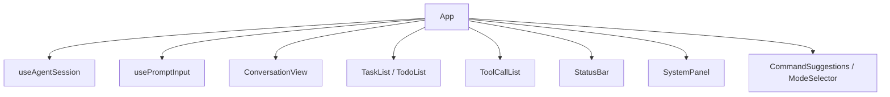

Sources: [src/ui/App.tsx:1-16](../../../project-repos/easy-agent/src/ui/App.tsx#L1-L16), [src/ui/App.tsx:78-108](../../../project-repos/easy-agent/src/ui/App.tsx#L78-L108)

<details class="source-snippets">
<summary>引用源码</summary>

<!-- source-snippets:start -->

#### `src/ui/App.tsx:1-16`

```tsx
import React from "react";
import { Box, Text, useApp } from "ink";
import type { PermissionMode } from "../permissions/permissions.js";
import { CommandSuggestions } from "./components/CommandSuggestions.js";
import { ConversationView } from "./components/ConversationView.js";
import { InputPrompt } from "./components/InputPrompt.js";
import { ModeSelector } from "./components/ModeSelector.js";
import { StatusBar } from "./components/StatusBar.js";
import { SystemPanel } from "./components/SystemPanel.js";
import { TaskList } from "./components/TaskList.js";
import { TodoList } from "./components/TodoList.js";
import { ToolCallList } from "./components/ToolCallList.js";
import { usePromptInput } from "./hooks/usePromptInput.js";
import { useAgentSession } from "./hooks/useAgentSession.js";
import { getAllUserInvocableSkills } from "../services/skills/registry.js";
import type { CommandSuggestion } from "./types.js";
```

#### `src/ui/App.tsx:78-108`

```tsx
  return (
    &lt;Box flexDirection="column" paddingX={1}&gt;
      &lt;Box marginBottom={1}&gt;
        &lt;Text bold color="cyan"&gt;Easy Agent&lt;/Text&gt;
        &lt;Text dimColor&gt; ({state.currentModel})&lt;/Text&gt;
      &lt;/Box&gt;
      &lt;Text dimColor&gt;Type a message to start. Ctrl+C to interrupt, Ctrl+D to exit.&lt;/Text&gt;

      &lt;ConversationView messages={state.messages} /&gt;
      {state.taskMode === "task"
        ? &lt;TaskList tasks={state.tasks} /&gt;
        : &lt;TodoList todos={state.todos} /&gt;}
      &lt;ToolCallList toolCalls={state.toolCalls} /&gt;
      &lt;SystemPanel notice={state.systemNotice} /&gt;
      &lt;StatusBar
        isLoading={state.isLoading}
        spinnerLabel={effectiveSpinnerLabel}
        streamingText={state.streamingText}
        lastUsage={state.lastUsage}
        permissionPrompt={state.permissionPrompt}
        permissionMode={state.permissionMode}
        onPlanDecision={actions.resolvePermission}
      />
      &lt;InputPrompt isLoading={state.isLoading || Boolean(state.permissionPrompt)} inputValue={inputValue} /&gt;
      &lt;CommandSuggestions items={commandSuggestions} /&gt;
      &lt;ModeSelector items={modeSuggestions} /&gt;
      &lt;ModeSelector
        items={taskModeSuggestions}
        title={`select task system (↑↓ navigate, Enter confirm, 1-${taskModeSuggestions.length || 2} shortcut)`}
      />
    &lt;/Box&gt;
```

<!-- source-snippets:end -->
</details>

## 会话 Hook

`useAgentSession` 初始化 permission settings 和 `QueryEngine`，创建或恢复 session，订阅 Todo/Task store，处理流式事件、工具卡片、permission prompt、usage、compaction、model/mode/task mode 变化，并把结果写入 transcript。  
Sources: [src/ui/hooks/useAgentSession.ts:168-238](../../../project-repos/easy-agent/src/ui/hooks/useAgentSession.ts#L168-L238), [src/ui/hooks/useAgentSession.ts:290-397](../../../project-repos/easy-agent/src/ui/hooks/useAgentSession.ts#L290-L397), [src/ui/hooks/useAgentSession.ts:474-679](../../../project-repos/easy-agent/src/ui/hooks/useAgentSession.ts#L474-L679)

<details class="source-snippets">
<summary>引用源码</summary>

<!-- source-snippets:start -->

#### `src/ui/hooks/useAgentSession.ts:168-238`

```typescript
export function useAgentSession({
  model,
  onExit,
  permissionMode,
  shouldResume,
  resumeSessionId,
}: UseAgentSessionOptions) {
  const [messages, setMessages] = useState&lt;MessageParam[]&gt;([]);
  const [isLoading, setIsLoading] = useState(false);
  const [spinnerLabel, setSpinnerLabel] = useState("Thinking");
  const [streamingText, setStreamingText] = useState("");
  const [toolCalls, setToolCalls] = useState&lt;ToolCallInfo[]&gt;([]);
  const [lastUsage, setLastUsage] = useState&lt;UsageSummary | null&gt;(null);
  const [totalUsage, setTotalUsage] = useState&lt;UsageSummary | null&gt;(null);
  const [systemNotice, setSystemNotice] = useState&lt;SystemNotice | null&gt;(null);
  const [permissionPrompt, setPermissionPrompt] = useState&lt;PermissionPromptState | null&gt;(null);
  const [permissionSettings, setPermissionSettings] = useState&lt;PermissionSettings | null&gt;(null);
  const [currentModel, setCurrentModel] = useState(model);
  const [activePermissionMode, setActivePermissionMode] = useState&lt;string&gt;(permissionMode ?? "default");
  const [todos, setTodosState] = useState&lt;TodoItem[]&gt;([]);
  const [tasks, setTasksState] = useState&lt;Task[]&gt;([]);
  const [taskMode, setTaskModeState] = useState&lt;TaskMode&gt;(getTaskMode());

  const permissionResolverRef = useRef&lt;((decision: PermissionDecision) =&gt; void) | null>(null);
  const pendingClearContextRef = useRef(false);
  const pendingFeedbackRef = useRef&lt;string | null&gt;(null);
  const sessionRulesRef = useRef&lt;PermissionRuleSet&gt;({ allow: [], deny: [] });
  const engineRef = useRef&lt;QueryEngine | null&gt;(null);
  const sessionIdRef = useRef&lt;string&gt;(createSessionId());

  // Streaming-text throttling. SSE chunks can arrive at >100 Hz from fast
  // models, and every setStreamingText forces Ink to repaint the whole
  // frame — combined with the TodoList / ToolCallList that sit above it,
  // the unbatched updates caused visible flicker and "untouchable" terminal
  // scrolling. We coalesce chunks into a 30ms window (≈33 fps) — fast
  // enough to look live, slow enough to keep the UI usable.
  const pendingTextRef = useRef&lt;string&gt;("");
  const flushTimerRef = useRef&lt;ReturnType&lt;typeof setTimeout&gt; | null&gt;(null);
  const flushPendingText = useCallback(() => {
    flushTimerRef.current = null;
    if (pendingTextRef.current) {
      const chunk = pendingTextRef.current;
      pendingTextRef.current = "";
      setStreamingText((prev) => prev + chunk);
    }
  }, []);
  const cancelPendingText = useCallback(() => {
    if (flushTimerRef.current) {
      clearTimeout(flushTimerRef.current);
      flushTimerRef.current = null;
    }
    pendingTextRef.current = "";
  }, []);

  // Always release the timer on unmount so we don't leak across hot reloads.
  useEffect(() => () => cancelPendingText(), [cancelPendingText]);
  // `sessionId` is exposed as a live getter so tools always see the
  // current sessionIdRef value. This matters during /resume — the ref is
  // mutated *after* this hook has memoized the toolContext, and a baked-in
  // value would silently route TodoWrite writes to the old (orphan) key
  // while the UI subscriber filters on the new sessionId, leaving the
  // todo panel permanently empty.
  const toolContext = useMemo&lt;ToolContext&gt;(
    () => ({
      cwd: process.cwd(),
      get sessionId() {
        return sessionIdRef.current;
      },
    }),
    [],
  );
```

#### `src/ui/hooks/useAgentSession.ts:290-397`

```typescript
  useEffect(() => {
    void loadPermissionSettings(process.cwd())
      .then(setPermissionSettings)
      .catch((error: unknown) => {
        setSystemNotice({
          tone: "error",
          title: "Permission settings error",
          body: error instanceof Error ? error.message : String(error),
        });
      });
  }, []);

  useEffect(() => {
    if (!permissionSettings) return;

    let cancelled = false;

    const initialize = async () => {
      try {
        let initialMessages: MessageParam[] = [];
        let initialUsage = { input_tokens: 0, output_tokens: 0 };

        if (shouldResume) {
          const restored = await restoreSession(toolContext.cwd, resumeSessionId ?? undefined);
          if (cancelled) return;
          sessionIdRef.current = restored.summary.sessionId;
          initialMessages = restored.messages;
          initialUsage = restored.summary.totalUsage;
          setMessages(restored.messages);
          setTotalUsage({
            input: restored.summary.totalUsage.input_tokens,
            output: restored.summary.totalUsage.output_tokens,
          });
          setSystemNotice({
            tone: "info",
            title: "Session restored",
            body: `Resumed session ${restored.summary.sessionId} with ${restored.summary.messageCount} messages.`,
          });
        } else {
          const startedAt = new Date().toISOString();
          await initSessionStorage({
            sessionId: sessionIdRef.current,
            cwd: toolContext.cwd,
            startedAt,
            updatedAt: startedAt,
            model,
          });
        }

        const engine = new QueryEngine({
          model,
          toolContext,
          initialMessages,
          initialUsage,
          permissionMode: permissionMode ?? permissionSettings.mode,
          permissionSettings,
          sessionPermissionRules: sessionRulesRef.current,
          onPermissionRequest: async (request: PermissionRequest) => {
            const isPlanExit = request.toolName === "ExitPlanMode";
            setSpinnerLabel(isPlanExit ? "Waiting for plan approval" : "Waiting for permission");

            let planContent: string | undefined;
            let planFilePath: string | undefined;
            if (isPlanExit) {
              planContent = (await readPlan()) ?? undefined;
              planFilePath = getPlanFilePath();
            }

            setPermissionPrompt({
              toolName: request.toolName,
              summary: request.summary,
              risk: request.risk,
              ruleHint: request.ruleHint,
              isPlanExit,
              planContent,
              planFilePath,
            });
            return new Promise&lt;PermissionDecision&gt;((resolve) => {
              permissionResolverRef.current = resolve;
            });
          },
        });
        engine.onModeChange((newMode, previousMode) => {
          setActivePermissionMode(newMode);
          const label = newMode === "plan" ? "Entered plan mode" : "Exited plan mode";
          const body = newMode === "plan"
            ? "Only read-only tools are available. Explore the codebase and write your plan."
            : `Returned to ${newMode} mode. Full tool access restored.`;
          setSystemNotice({ tone: "info", title: label, body });
        });
        engineRef.current = engine;
        setCurrentModel(model);
      } catch (error: unknown) {
        if (cancelled) return;
        setSystemNotice({
          tone: "error",
          title: "Session restore error",
          body: error instanceof Error ? error.message : String(error),
        });
      }
    };

    void initialize();

    return () => {
      cancelled = true;
    };
  }, [model, permissionMode, permissionSettings, resumeSessionId, shouldResume, toolContext]);
```

#### `src/ui/hooks/useAgentSession.ts:474-679`

```typescript
  const submit = useCallback(async (text: string): Promise&lt;SubmitResult&gt; => {
    if (!text.trim()) {
      return { handled: false };
    }

    const trimmed = text.trim();
    if (trimmed === "/exit" || trimmed === "/quit" || trimmed === "/bye") {
      onExit();
      return { handled: true };
    }

    if (!engineRef.current) {
      setSystemNotice({
        tone: "error",
        title: "QueryEngine is not ready",
        body: "Please wait for initialization to finish.",
      });
      return { handled: true };
    }

    const isSlashCommand = trimmed.startsWith("/");
    // Slash commands fall into two categories that need different UX:
    //   1. *System* commands (/help, /cost, /model, /skills, /mcp, …) —
    //      synchronous, never call the LLM, just print a notice.
    //   2. *Skill* commands (/&lt;skill-name&gt; [args]) — expand into a real
    //      user prompt and engage the full agentic loop, exactly like a
    //      typed chat message.
    // Without this distinction every `/` input was treated as case (1):
    // no spinner, no streaming, no transcript entry — which made skill
    // invocations feel broken even though events were flowing through
    // the engine. Detect skill commands by peeking at the registry here
    // and treat them as LLM-triggering input below.
    const skillCommandName = isSlashCommand
      ? trimmed.slice(1).split(/\s+/, 1)[0]?.toLowerCase() ?? ""
      : "";
    const isSkillCommand =
      isSlashCommand && !!skillCommandName && !!findSkill(skillCommandName);
    const isLlmTriggering = !isSlashCommand || isSkillCommand;

    cancelPendingText();
    setStreamingText("");
    setToolCalls([]);
    setSystemNotice(null);
    if (isLlmTriggering) {
      setLastUsage(null);
      // Persist what the user actually typed (`/hello-world Easy Agent`)
      // rather than the expanded SKILL.md body. The expanded prompt is
      // an internal/wire-only artifact — keeping the transcript clean
      // means /resume replays the same UX the user originally saw.
      await appendTranscriptEntry(toolContext.cwd, sessionIdRef.current, {
        type: "message",
        timestamp: new Date().toISOString(),
        role: "user",
        message: { role: "user", content: trimmed },
      });
    }
    setPermissionPrompt(null);
    const needsLoading = isLlmTriggering || trimmed.startsWith("/compact");
    setIsLoading(needsLoading);
    setSpinnerLabel(trimmed.startsWith("/compact") ? "Compacting" : "Thinking");

    try {
      const run = engineRef.current.submitMessage(trimmed);

      while (true) {
        const { value, done } = await run.next();
        if (done) {
          if (value.reason === "aborted" && !pendingClearContextRef.current) {
            setSystemNotice({
              tone: "info",
              title: "Interrupted",
              body: "Use /exit, /quit, /bye, or Ctrl+D to exit.",
            });
          }
          break;
        }

        switch (value.type) {
          case "text":
            // Coalesce rapid SSE chunks into a 30ms window. Without this
            // every chunk forces a full Ink frame repaint, and combined
            // with the TodoList / ToolCallList above it the terminal
            // flickers and refuses to scroll.
            pendingTextRef.current += value.text;
            if (!flushTimerRef.current) {
              flushTimerRef.current = setTimeout(flushPendingText, 30);
            }
            break;
          case "tool_use_start":
            setToolCalls((prev) => [...prev, { id: value.id, name: value.name }]);
            await appendTranscriptEntry(toolContext.cwd, sessionIdRef.current, {
              type: "tool_event",
              timestamp: new Date().toISOString(),
              name: value.name,
              phase: "start",
            });
            break;
          case "permission_request":
            setSpinnerLabel("Waiting for permission");
            setPermissionPrompt({
              toolName: value.request.toolName,
              summary: value.request.summary,
              risk: value.request.risk,
              ruleHint: value.request.ruleHint,
            });
            break;
          case "tool_use_done": {
            const isPlanFileWrite =
              (value.name === "Write" || value.name === "Edit") &&
              value.result.content.includes(getPlansDirectory());
            const inputPreview = formatToolInputPreview(value.input);
            // Strip the model-only &lt;sandbox_violations&gt; tag from the
            // user-visible error message. The tag stays in the tool
            // result that goes back to the model (so it can interpret
            // sandbox denials), but humans see clean stderr only.
            const rawErrorMessage = value.result.isError ? value.result.content : undefined;
            const errorMessage = rawErrorMessage
              ? removeSandboxViolationTags(rawErrorMessage)
              : undefined;
            setToolCalls((prev) =>
... snippet truncated ...
```

<!-- source-snippets:end -->
</details>

它对 streaming text 做 30ms 合并，避免高频 SSE chunks 触发 Ink 全树重绘。这个优化和 Task/Todo 列表的静态渲染策略配合，降低终端闪烁和滚动问题。  
Sources: [src/ui/hooks/useAgentSession.ts:198-223](../../../project-repos/easy-agent/src/ui/hooks/useAgentSession.ts#L198-L223), [src/ui/hooks/useAgentSession.ts:551-560](../../../project-repos/easy-agent/src/ui/hooks/useAgentSession.ts#L551-L560), [src/ui/components/TaskList.tsx:9-17](../../../project-repos/easy-agent/src/ui/components/TaskList.tsx#L9-L17), [src/ui/components/TodoList.tsx:9-17](../../../project-repos/easy-agent/src/ui/components/TodoList.tsx#L9-L17)

<details class="source-snippets">
<summary>引用源码</summary>

<!-- source-snippets:start -->

#### `src/ui/hooks/useAgentSession.ts:198-223`

```typescript
  // Streaming-text throttling. SSE chunks can arrive at >100 Hz from fast
  // models, and every setStreamingText forces Ink to repaint the whole
  // frame — combined with the TodoList / ToolCallList that sit above it,
  // the unbatched updates caused visible flicker and "untouchable" terminal
  // scrolling. We coalesce chunks into a 30ms window (≈33 fps) — fast
  // enough to look live, slow enough to keep the UI usable.
  const pendingTextRef = useRef&lt;string&gt;("");
  const flushTimerRef = useRef&lt;ReturnType&lt;typeof setTimeout&gt; | null&gt;(null);
  const flushPendingText = useCallback(() => {
    flushTimerRef.current = null;
    if (pendingTextRef.current) {
      const chunk = pendingTextRef.current;
      pendingTextRef.current = "";
      setStreamingText((prev) => prev + chunk);
    }
  }, []);
  const cancelPendingText = useCallback(() => {
    if (flushTimerRef.current) {
      clearTimeout(flushTimerRef.current);
      flushTimerRef.current = null;
    }
    pendingTextRef.current = "";
  }, []);

  // Always release the timer on unmount so we don't leak across hot reloads.
  useEffect(() => () => cancelPendingText(), [cancelPendingText]);
```

#### `src/ui/hooks/useAgentSession.ts:551-560`

```typescript
        switch (value.type) {
          case "text":
            // Coalesce rapid SSE chunks into a 30ms window. Without this
            // every chunk forces a full Ink frame repaint, and combined
            // with the TodoList / ToolCallList above it the terminal
            // flickers and refuses to scroll.
            pendingTextRef.current += value.text;
            if (!flushTimerRef.current) {
              flushTimerRef.current = setTimeout(flushPendingText, 30);
            }
```

#### `src/ui/components/TaskList.tsx:9-17`

```tsx
 * Rendering rules, same as TodoList:
 *   - every row is STATIC (no per-row spinner) — the live "active task"
 *     verb is rendered once by the global StatusBar spinner via
 *     `effectiveSpinnerLabel` in App.tsx. Adding a setInterval per row
 *     multiplies terminal repaints and reintroduces the flicker we
 *     fought in stage 14.
 *   - React.memo with a structural comparator prevents siblings of
 *     streamingText from forcing re-renders through us.
 */
```

#### `src/ui/components/TodoList.tsx:9-17`

```tsx
 * **不要在每行放独立的 Spinner**：在终端里每多一个 setInterval 就多一份
 * 80ms 的全树重绘压力，叠加 streamingText 高频更新会出现严重闪屏并导致
 * 终端无法滚动。源码做法是：
 *   - TodoList 行全部静态
 *   - 当前 in_progress 的 `activeForm` 由 **全局 StatusBar 的 spinner**
 *     接管（"leaderVerb = currentTodo?.activeForm ?? randomVerb"）
 *
 * `React.memo` + 自定义比较器进一步避免无关 setState 触发的重渲染。
 */
```

<!-- source-snippets:end -->
</details>

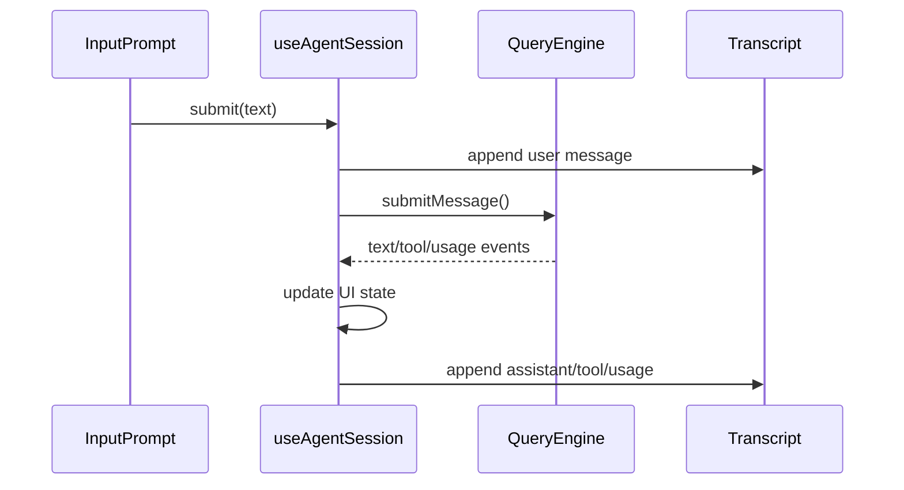

Sources: [src/ui/hooks/useAgentSession.ts:474-536](../../../project-repos/easy-agent/src/ui/hooks/useAgentSession.ts#L474-L536), [src/ui/hooks/useAgentSession.ts:551-679](../../../project-repos/easy-agent/src/ui/hooks/useAgentSession.ts#L551-L679)

<details class="source-snippets">
<summary>引用源码</summary>

<!-- source-snippets:start -->

#### `src/ui/hooks/useAgentSession.ts:474-536`

```typescript
  const submit = useCallback(async (text: string): Promise&lt;SubmitResult&gt; => {
    if (!text.trim()) {
      return { handled: false };
    }

    const trimmed = text.trim();
    if (trimmed === "/exit" || trimmed === "/quit" || trimmed === "/bye") {
      onExit();
      return { handled: true };
    }

    if (!engineRef.current) {
      setSystemNotice({
        tone: "error",
        title: "QueryEngine is not ready",
        body: "Please wait for initialization to finish.",
      });
      return { handled: true };
    }

    const isSlashCommand = trimmed.startsWith("/");
    // Slash commands fall into two categories that need different UX:
    //   1. *System* commands (/help, /cost, /model, /skills, /mcp, …) —
    //      synchronous, never call the LLM, just print a notice.
    //   2. *Skill* commands (/&lt;skill-name&gt; [args]) — expand into a real
    //      user prompt and engage the full agentic loop, exactly like a
    //      typed chat message.
    // Without this distinction every `/` input was treated as case (1):
    // no spinner, no streaming, no transcript entry — which made skill
    // invocations feel broken even though events were flowing through
    // the engine. Detect skill commands by peeking at the registry here
    // and treat them as LLM-triggering input below.
    const skillCommandName = isSlashCommand
      ? trimmed.slice(1).split(/\s+/, 1)[0]?.toLowerCase() ?? ""
      : "";
    const isSkillCommand =
      isSlashCommand && !!skillCommandName && !!findSkill(skillCommandName);
    const isLlmTriggering = !isSlashCommand || isSkillCommand;

    cancelPendingText();
    setStreamingText("");
    setToolCalls([]);
    setSystemNotice(null);
    if (isLlmTriggering) {
      setLastUsage(null);
      // Persist what the user actually typed (`/hello-world Easy Agent`)
      // rather than the expanded SKILL.md body. The expanded prompt is
      // an internal/wire-only artifact — keeping the transcript clean
      // means /resume replays the same UX the user originally saw.
      await appendTranscriptEntry(toolContext.cwd, sessionIdRef.current, {
        type: "message",
        timestamp: new Date().toISOString(),
        role: "user",
        message: { role: "user", content: trimmed },
      });
    }
    setPermissionPrompt(null);
    const needsLoading = isLlmTriggering || trimmed.startsWith("/compact");
    setIsLoading(needsLoading);
    setSpinnerLabel(trimmed.startsWith("/compact") ? "Compacting" : "Thinking");

    try {
      const run = engineRef.current.submitMessage(trimmed);
```

#### `src/ui/hooks/useAgentSession.ts:551-679`

```typescript
        switch (value.type) {
          case "text":
            // Coalesce rapid SSE chunks into a 30ms window. Without this
            // every chunk forces a full Ink frame repaint, and combined
            // with the TodoList / ToolCallList above it the terminal
            // flickers and refuses to scroll.
            pendingTextRef.current += value.text;
            if (!flushTimerRef.current) {
              flushTimerRef.current = setTimeout(flushPendingText, 30);
            }
            break;
          case "tool_use_start":
            setToolCalls((prev) => [...prev, { id: value.id, name: value.name }]);
            await appendTranscriptEntry(toolContext.cwd, sessionIdRef.current, {
              type: "tool_event",
              timestamp: new Date().toISOString(),
              name: value.name,
              phase: "start",
            });
            break;
          case "permission_request":
            setSpinnerLabel("Waiting for permission");
            setPermissionPrompt({
              toolName: value.request.toolName,
              summary: value.request.summary,
              risk: value.request.risk,
              ruleHint: value.request.ruleHint,
            });
            break;
          case "tool_use_done": {
            const isPlanFileWrite =
              (value.name === "Write" || value.name === "Edit") &&
              value.result.content.includes(getPlansDirectory());
            const inputPreview = formatToolInputPreview(value.input);
            // Strip the model-only &lt;sandbox_violations&gt; tag from the
            // user-visible error message. The tag stays in the tool
            // result that goes back to the model (so it can interpret
            // sandbox denials), but humans see clean stderr only.
            const rawErrorMessage = value.result.isError ? value.result.content : undefined;
            const errorMessage = rawErrorMessage
              ? removeSandboxViolationTags(rawErrorMessage)
              : undefined;
            setToolCalls((prev) =>
              markToolCallComplete(prev, value.id, {
                resultLength: value.result.content.length,
                isError: value.result.isError,
                displayName: isPlanFileWrite ? "Updated plan" : undefined,
                displayHint: isPlanFileWrite ? "/plan to preview" : undefined,
                inputPreview,
                errorMessage,
              }),
            );
            await appendTranscriptEntry(toolContext.cwd, sessionIdRef.current, {
              type: "tool_event",
              timestamp: new Date().toISOString(),
              name: value.name,
              phase: "done",
              resultLength: value.result.content.length,
              isError: value.result.isError,
            });
            break;
          }
          case "assistant_message":
            // The full assistant text is committed to `messages` and will
            // render via ConversationView. Drop any unflushed pending
            // chunk so it can't overwrite the cleared streaming line.
            cancelPendingText();
            setStreamingText("");
            await appendTranscriptEntry(toolContext.cwd, sessionIdRef.current, {
              type: "message",
              timestamp: new Date().toISOString(),
              role: "assistant",
              message: value.message,
            });
            break;
          case "tool_result_message":
            setSpinnerLabel("Thinking");
            setPermissionPrompt(null);
            // Tool results are now committed to `messages` — the cards
            // will render inline in ConversationView from here on, so we
            // drop the live in-flight cards to avoid duplication and, more
            // importantly, to keep the final assistant text rendered
            // BELOW its tool calls (not above them).
            setToolCalls([]);
            await appendTranscriptEntry(toolContext.cwd, sessionIdRef.current, {
              type: "message",
              timestamp: new Date().toISOString(),
              role: "user",
              message: value.message,
            });
            break;
          case "messages_updated":
            setMessages(value.messages);
            break;
          case "usage_updated":
            {
              const engineMessages = engineRef.current?.getState().messages ?? [];
              const usageAnchorIndex = engineMessages.length > 0 ? engineMessages.length - 1 : -1;
              const snapshot = buildTokenBudgetSnapshot(engineMessages, {
                usage: value.lastCallUsage,
                usageAnchorIndex,
              });
              const contextPercent = Math.round((snapshot.estimatedConversationTokens / snapshot.contextWindow) * 100);
              const turnInput = value.turnUsage.input_tokens
                + (value.turnUsage.cache_creation_input_tokens ?? 0)
                + (value.turnUsage.cache_read_input_tokens ?? 0);
              const totalInput = value.totalUsage.input_tokens
                + (value.totalUsage.cache_creation_input_tokens ?? 0)
                + (value.totalUsage.cache_read_input_tokens ?? 0);
              setLastUsage({
                input: turnInput,
                output: value.turnUsage.output_tokens,
                contextTokens: snapshot.estimatedConversationTokens,
                contextPercent,
              });
              setTotalUsage({
                input: totalInput,
                output: value.totalUsage.output_tokens,
                contextTokens: snapshot.estimatedConversationTokens,
                contextPercent,
... snippet truncated ...
```

<!-- source-snippets:end -->
</details>

## 输入建议与权限交互

`usePromptInput` 处理 Ctrl+C、Ctrl+D、permission prompt 快捷键、命令建议、mode selector、task mode selector 和普通文本输入。命令建议由内置命令加动态 skills 命令合并，并按输入前缀过滤到最多 8 个。  
Sources: [src/ui/hooks/usePromptInput.ts:43-66](../../../project-repos/easy-agent/src/ui/hooks/usePromptInput.ts#L43-L66), [src/ui/hooks/usePromptInput.ts:91-120](../../../project-repos/easy-agent/src/ui/hooks/usePromptInput.ts#L91-L120), [src/ui/hooks/usePromptInput.ts:240-258](../../../project-repos/easy-agent/src/ui/hooks/usePromptInput.ts#L240-L258)

<details class="source-snippets">
<summary>引用源码</summary>

<!-- source-snippets:start -->

#### `src/ui/hooks/usePromptInput.ts:43-66`

```typescript
const BUILTIN_COMMANDS: CommandSuggestion[] = [
  { name: "/help", description: "Show available commands" },
  { name: "/clear", description: "Clear conversation history" },
  { name: "/cost", description: "Show session token usage" },
  { name: "/model", description: "Inspect current model or override it for this session" },
  { name: "/mode", description: "Inspect or switch permission mode (default/plan/auto)" },
  { name: "/tasks", description: "Switch task tracking system (task=persistent V2, todo=session V1)" },
  { name: "/mcp", description: "Inspect / reconnect MCP servers" },
  { name: "/skills", description: "List loaded skills (user + project scope)" },
  { name: "/history", description: "Show saved sessions for this project" },
  { name: "/compact", description: "Compact the conversation context" },
  { name: "/exit", description: "Exit the session" },
];

const MODE_OPTIONS: { mode: PermissionMode; description: string }[] = [
  { mode: "default", description: "Confirm destructive operations" },
  { mode: "plan", description: "Read-only exploration, then plan" },
  { mode: "auto", description: "Auto-approve all operations" },
];

const TASK_MODE_OPTIONS: { mode: TaskMode; description: string }[] = [
  { mode: "task", description: "Persistent task graph (Task V2) — default" },
  { mode: "todo", description: "Session-memory todo list (TodoWrite V1)" },
];
```

#### `src/ui/hooks/usePromptInput.ts:91-120`

```typescript
  useInput((input, key) => {
    if (key.ctrl && input === "c") {
      onInterrupt();
      return;
    }
    if (key.ctrl && input === "d") {
      onExit();
      return;
    }

    if (hasPermissionPrompt) {
      const normalized = input.toLowerCase();
      if (isPlanExitPrompt) {
        if (normalized === "y") {
          onPermissionDecision("allow_clear_context");
        } else if (normalized === "k") {
          onPermissionDecision("allow_once");
        } else if (normalized === "n") {
          onPermissionDecision("deny");
        }
      } else {
        if (normalized === "y") {
          onPermissionDecision("allow_once");
        } else if (normalized === "n") {
          onPermissionDecision("deny");
        } else if (normalized === "a") {
          onPermissionDecision("allow_always");
        }
      }
      return;
```

#### `src/ui/hooks/usePromptInput.ts:240-258`

```typescript
  const filteredCommands = useMemo(() => {
    if (!inputValue.startsWith("/")) {
      return [];
    }
    const keyword = inputValue.trim().toLowerCase();
    // Built-ins first, then dynamic skill commands. We de-dupe by name so
    // a project-level skill that shadows a built-in (unlikely but possible
    // once users start naming their own skills) doesn't appear twice.
    const seen = new Set&lt;string&gt;();
    const merged: CommandSuggestion[] = [];
    for (const cmd of [...BUILTIN_COMMANDS, ...(extraCommands ?? [])]) {
      if (seen.has(cmd.name)) continue;
      seen.add(cmd.name);
      merged.push(cmd);
    }
    return merged.filter((item) => item.name.startsWith(keyword)).slice(0, 8);
  }, [inputValue, extraCommands]);

  const showCommandSuggestions = filteredCommands.length > 0 && !showModeSelector && !showTaskModeSelector;
```

<!-- source-snippets:end -->
</details>

Permission prompt 的普通确认键是 `y/n/a`；plan exit 分支使用 `y/k/n`，对应清上下文执行、保留上下文执行、拒绝。  
Sources: [src/ui/hooks/usePromptInput.ts:101-120](../../../project-repos/easy-agent/src/ui/hooks/usePromptInput.ts#L101-L120), [src/ui/hooks/useAgentSession.ts:432-472](../../../project-repos/easy-agent/src/ui/hooks/useAgentSession.ts#L432-L472)

<details class="source-snippets">
<summary>引用源码</summary>

<!-- source-snippets:start -->

#### `src/ui/hooks/usePromptInput.ts:101-120`

```typescript
    if (hasPermissionPrompt) {
      const normalized = input.toLowerCase();
      if (isPlanExitPrompt) {
        if (normalized === "y") {
          onPermissionDecision("allow_clear_context");
        } else if (normalized === "k") {
          onPermissionDecision("allow_once");
        } else if (normalized === "n") {
          onPermissionDecision("deny");
        }
      } else {
        if (normalized === "y") {
          onPermissionDecision("allow_once");
        } else if (normalized === "n") {
          onPermissionDecision("deny");
        } else if (normalized === "a") {
          onPermissionDecision("allow_always");
        }
      }
      return;
```

#### `src/ui/hooks/useAgentSession.ts:432-472`

```typescript
  const resolvePermission = useCallback((decision: PermissionDecision, feedback?: string) => {
    if (!permissionResolverRef.current) return false;

    const autoAcceptRules = ["Write", "Edit", "Bash(npm *)","Bash(npx *)"];

    if (decision === "allow_clear_context") {
      pendingClearContextRef.current = true;
      sessionRulesRef.current.allow.push(...autoAcceptRules);
      permissionResolverRef.current("allow_once");
      // Abort the loop immediately after ExitPlanMode runs,
      // so the model doesn't start implementing in the same loop.
      // The clear-context flow will submit a fresh "Implement" message.
      engineRef.current?.interrupt();
    } else if (decision === "allow_accept_edits") {
      sessionRulesRef.current.allow.push(...autoAcceptRules);
      permissionResolverRef.current("allow_once");
    } else if (decision === "deny" && feedback) {
      pendingFeedbackRef.current = feedback;
      permissionResolverRef.current("deny");
    } else {
      permissionResolverRef.current(decision);
    }

    permissionResolverRef.current = null;
    setPermissionPrompt(null);

    if (decision === "deny" && feedback) {
      setSystemNotice({ tone: "info", title: "Plan rejected with feedback", body: `Feedback: ${feedback}` });
    } else if (decision === "deny") {
      setSystemNotice({ tone: "error", title: "Permission denied", body: "Permission denied." });
    } else if (decision === "allow_clear_context") {
      setSystemNotice({ tone: "info", title: "Plan approved", body: "Plan approved. Edits auto-accepted. Context will be cleared for implementation." });
    } else if (decision === "allow_accept_edits") {
      setSystemNotice({ tone: "info", title: "Plan approved", body: "Plan approved. Edits auto-accepted. Continuing with current context." });
    } else if (decision === "allow_always") {
      setSystemNotice({ tone: "info", title: "Permission granted", body: "Permission granted and remembered for this session." });
    } else {
      setSystemNotice({ tone: "info", title: "Permission granted", body: "Permission granted." });
    }
    return true;
  }, []);
```

<!-- source-snippets:end -->
</details>

## 消息和工具卡片渲染

`ConversationView` 会隐藏内部消息：compact boundary、resume 续聊提示、plan attachment、plan exit attachment、skill invocation body。slash skill 的可见 marker 会被渲染成命令气泡，而真实 `SKILL.md` body 不直接展示。  
Sources: [src/ui/components/ConversationView.tsx:15-29](../../../project-repos/easy-agent/src/ui/components/ConversationView.tsx#L15-L29), [src/ui/components/ConversationView.tsx:31-51](../../../project-repos/easy-agent/src/ui/components/ConversationView.tsx#L31-L51), [src/ui/components/ConversationView.tsx:141-167](../../../project-repos/easy-agent/src/ui/components/ConversationView.tsx#L141-L167)

<details class="source-snippets">
<summary>引用源码</summary>

<!-- source-snippets:start -->

#### `src/ui/components/ConversationView.tsx:15-29`

```tsx
function isInternalMessage(message: MessageParam): boolean {
  const content = typeof message.content === "string" ? message.content : "";
  if (content.startsWith("[CompactBoundary]")) return true;
  if (content.startsWith("This session is being continued from a previous conversation")) return true;
  if (content.startsWith("[plan_mode_attachment]")) return true;
  if (content.startsWith("[plan_mode_exit]")) return true;
  // `/<skill-name>` invocations expand into TWO user messages (mirroring
  // source's processSlashCommand pattern): a visible "command bubble"
  // marker (handled by extractCommandMarker below) and a hidden body
  // tagged with this prefix. The model receives the body as the real
  // prompt, but the user already sees the bubble + the assistant's
  // streaming reply, so the raw SKILL.md dump would just be noise here.
  if (content.startsWith("[skill_invocation:")) return true;
  return false;
}
```

#### `src/ui/components/ConversationView.tsx:31-51`

```tsx
/**
 * Detect a slash-command marker user message and pull the
 * `<command-name>` + `<command-args>` tags out for rendering. Returns null
 * for plain user text. The format mirrors source's `formatCommandInputTags`
 * in claude-code-source-code/src/utils/messages.ts so we stay
 * source-compatible (matters once we add /resume).
 */
function extractCommandMarker(
  message: MessageParam,
): { name: string; args: string } | null {
  if (typeof message.content !== "string") return null;
  const text = message.content;
  if (!text.includes("&lt;command-name&gt;")) return null;
  const nameMatch = text.match(/&lt;command-name&gt;([^&lt;]*)<\/command-name&gt;/);
  if (!nameMatch) return null;
  const argsMatch = text.match(/&lt;command-args&gt;([^&lt;]*)<\/command-args&gt;/);
  return {
    name: nameMatch[1] ?? "",
    args: (argsMatch?.[1] ?? "").trim(),
  };
}
```

#### `src/ui/components/ConversationView.tsx:141-167`

```tsx
        if (message.role === "user") {
          if (typeof message.content === "string") {
            // Slash-command marker (`<command-name>/skill</command-name>` …):
            // render as a styled "❯ /name args" command bubble. Mirrors
            // source's UserCommandMessage component so users see the same
            // breadcrumb whether the command was a built-in or a skill.
            const marker = extractCommandMarker(message);
            if (marker) {
              const display = `/${marker.name.replace(/^\//, "")}` +
                (marker.args ? ` ${marker.args}` : "");
              return (
                &lt;Box key={`u${index}`} marginTop={1}>
                  &lt;Text color="cyan" dimColor&gt;{"❯ "}&lt;/Text&gt;
                  &lt;Text color="cyan"&gt;{display}&lt;/Text&gt;
                &lt;/Box&gt;
              );
            }
            return (
              &lt;Box key={`u${index}`} marginTop={1}>
                &lt;Text color="green" bold&gt;{"❯ "}&lt;/Text&gt;
                &lt;Text&gt;{message.content}&lt;/Text&gt;
              &lt;/Box&gt;
            );
          }
          // Array content = tool_result blocks — already rendered inline
          // alongside their parent tool_use above.
          return null;
```

<!-- source-snippets:end -->
</details>

工具结果按 `tool_use_id` 建索引，再回填到 assistant 的 `tool_use` block 下，避免 live tool card 和历史内联 card 顺序不一致。  
Sources: [src/ui/components/ConversationView.tsx:53-82](../../../project-repos/easy-agent/src/ui/components/ConversationView.tsx#L53-L82), [src/ui/components/ConversationView.tsx:181-221](../../../project-repos/easy-agent/src/ui/components/ConversationView.tsx#L181-L221)

<details class="source-snippets">
<summary>引用源码</summary>

<!-- source-snippets:start -->

#### `src/ui/components/ConversationView.tsx:53-82`

```tsx
/**
 * Scan the message history once and index every tool_result by the id of
 * its parent tool_use. The assistant's tool_use blocks are then rendered
 * inline (see below) with their matching result pulled from this map.
 */
function buildToolResultMap(messages: MessageParam[]): Map&lt;string, ToolResultInfo&gt; {
  const map = new Map&lt;string, ToolResultInfo&gt;();
  for (const msg of messages) {
    if (msg.role !== "user" || !Array.isArray(msg.content)) continue;
    for (const block of msg.content as Array<{
      type?: string;
      tool_use_id?: string;
      content?: unknown;
      is_error?: boolean;
    }>) {
      if (block?.type !== "tool_result" || typeof block.tool_use_id !== "string") continue;
      let text = "";
      if (typeof block.content === "string") {
        text = block.content;
      } else if (Array.isArray(block.content)) {
        text = (block.content as Array&lt;{ type?: string; text?: string }&gt;)
          .filter((b) => b?.type === "text" && typeof b.text === "string")
          .map((b) => b.text as string)
          .join("");
      }
      map.set(block.tool_use_id, { content: text, isError: block.is_error === true });
    }
  }
  return map;
}
```

#### `src/ui/components/ConversationView.tsx:181-221`

```tsx
          if (Array.isArray(message.content)) {
            const blocks = message.content as Array<{
              type?: string;
              text?: string;
              id?: string;
              name?: string;
              input?: Record&lt;string, unknown&gt;;
            }>;
            const items: React.ReactNode[] = [];
            blocks.forEach((block, j) => {
              if (block?.type === "text" && block.text) {
                items.push(
                  &lt;Box key={`t${j}`}>
                    &lt;Text color="magenta"&gt;{"\u258E "}&lt;/Text&gt;
                    &lt;Text&gt;{block.text}&lt;/Text&gt;
                  &lt;/Box&gt;,
                );
                return;
              }
              if (block?.type === "tool_use" && typeof block.id === "string" && typeof block.name === "string") {
                const result = toolResults.get(block.id);
                // Pending tool calls (no result yet) are handled by the
                // live ToolCallList; we only render inline once the result
                // has been committed to the message history.
                if (!result) return;
                items.push(
                  &lt;InlineToolCard
                    key={`tu${j}`}
                    name={block.name}
                    input={block.input}
                    result={result}
                  />,
                );
              }
            });
            if (items.length === 0) return null;
            return (
              &lt;Box key={`a${index}`} flexDirection="column">
                {items}
              &lt;/Box&gt;
            );
```

<!-- source-snippets:end -->
</details>

## 状态栏

`StatusBar` 展示当前 permission mode、plan approval dialog、普通权限确认、spinner、streaming text、最近一轮 tokens 和估算 context 百分比。plan exit 的富交互由 `PlanApprovalDialog` 承载。  
Sources: [src/ui/components/StatusBar.tsx:18-89](../../../project-repos/easy-agent/src/ui/components/StatusBar.tsx#L18-L89)

<details class="source-snippets">
<summary>引用源码</summary>

<!-- source-snippets:start -->

#### `src/ui/components/StatusBar.tsx:18-89`

```tsx
export function StatusBar({
  isLoading,
  spinnerLabel,
  streamingText,
  lastUsage,
  permissionPrompt,
  permissionMode,
  onPlanDecision,
}: StatusBarProps): React.ReactNode {
  return (
    <>
      &lt;Box&gt;
        &lt;Text dimColor&gt;{"  mode: "}{permissionMode}&lt;/Text&gt;
      &lt;/Box&gt;

      {permissionPrompt && permissionPrompt.isPlanExit && onPlanDecision && (
        &lt;PlanApprovalDialog
          planContent={permissionPrompt.planContent}
          planFilePath={permissionPrompt.planFilePath}
          summary={permissionPrompt.summary}
          onDecision={onPlanDecision}
        />
      )}

      {permissionPrompt && !permissionPrompt.isPlanExit && (
        &lt;Box marginTop={1} flexDirection="column" borderStyle="round" borderColor="yellow" paddingX={1}&gt;
          &lt;Text color="yellow"&gt;{"⚠ Permission required: "}{permissionPrompt.toolName}&lt;/Text&gt;
          &lt;Text dimColor&gt;{"  args: "}{permissionPrompt.summary}&lt;/Text&gt;
          &lt;Text dimColor&gt;{"  risk: "}{permissionPrompt.risk}&lt;/Text&gt;
          &lt;Text dimColor&gt;{"  always allow rule: "}{permissionPrompt.ruleHint}&lt;/Text&gt;
          &lt;Text color="cyan"&gt;{"  [y] allow once   [n] deny   [a] always allow (session)"}&lt;/Text&gt;
        &lt;/Box&gt;
      )}

      {isLoading && !streamingText && !permissionPrompt && (
        &lt;Box marginTop={1}&gt;
          &lt;Spinner label={spinnerLabel} /&gt;
        &lt;/Box&gt;
      )}

      {isLoading && streamingText && !permissionPrompt && (
        &lt;Box marginTop={0}&gt;
          &lt;Text color="magenta"&gt;{"\u258E "}&lt;/Text&gt;
          &lt;Text&gt;{streamingText}&lt;/Text&gt;
        &lt;/Box&gt;
      )}

      {lastUsage && !isLoading && (
        &lt;Box flexDirection="column"&gt;
          &lt;Text dimColor&gt;
            {"  tokens: "}
            {lastUsage.input + lastUsage.output}
            {" total ("}
            {lastUsage.input}
            {" in / "}
            {lastUsage.output}
            {" out)"}
          &lt;/Text&gt;
          {typeof lastUsage.contextTokens === "number" && typeof lastUsage.contextPercent === "number" && (
            &lt;Text dimColor&gt;
              {"  context: ~"}
              {lastUsage.contextTokens}
              {" tokens ("}
              {lastUsage.contextPercent}
              {"% of max window)"}
            &lt;/Text&gt;
          )}
        &lt;/Box&gt;
      )}
    &lt;/&gt;
  );
}
```

<!-- source-snippets:end -->
</details>

## 相关页面

- [系统架构](system-architecture.md)
- [会话持久化与任务系统](sessions-tasks.md)
- [Skills 系统](skills-system.md)

---

<details>
<summary>相关源文件</summary>

生成本页时使用的主要源文件：

- [src/core/queryEngine.ts](../../../project-repos/easy-agent/src/core/queryEngine.ts)
- [src/core/agenticLoop.ts](../../../project-repos/easy-agent/src/core/agenticLoop.ts)
- [src/tools/index.ts](../../../project-repos/easy-agent/src/tools/index.ts)
- [src/permissions/permissions.ts](../../../project-repos/easy-agent/src/permissions/permissions.ts)
- [src/context/planAttachments.ts](../../../project-repos/easy-agent/src/context/planAttachments.ts)
- [src/tools/enterPlanModeTool.ts](../../../project-repos/easy-agent/src/tools/enterPlanModeTool.ts)
- [src/tools/exitPlanModeTool.ts](../../../project-repos/easy-agent/src/tools/exitPlanModeTool.ts)

</details>

# QueryEngine 与 Agentic Loop

`QueryEngine` 是多轮会话控制器，`agenticLoop.query()` 是单次 agent turn 的执行引擎。前者负责用户输入、命令、上下文压缩、权限模式、usage 累加和 abort；后者负责 streaming、stop reason 判断、工具执行和 tool_result 回灌。  
Sources: [src/core/queryEngine.ts:75-102](../../../project-repos/easy-agent/src/core/queryEngine.ts#L75-L102), [src/core/queryEngine.ts:170-219](../../../project-repos/easy-agent/src/core/queryEngine.ts#L170-L219), [src/core/agenticLoop.ts:239-409](../../../project-repos/easy-agent/src/core/agenticLoop.ts#L239-L409)

<details class="source-snippets">
<summary>引用源码</summary>

<!-- source-snippets:start -->

#### `src/core/queryEngine.ts:75-102`

```typescript
export class QueryEngine {
  private messages: MessageParam[];
  private totalUsage: Usage;
  private readonly defaultModel: string;
  private sessionModelOverride: string | null = null;
  private readonly toolContext: ToolContext;
  private currentPermissionMode: PermissionMode;
  private prePlanMode: PermissionMode | null = null;
  private readonly permissionSettings?: PermissionSettings;
  private readonly sessionPermissionRules: PermissionRuleSet;
  private readonly onPermissionRequest?: (request: PermissionRequest) => Promise&lt;PermissionDecision&gt;;
  private abortController: AbortController | null = null;
  private usageAnchorIndex: number = -1;
  private lastCallUsage: Usage = { input_tokens: 0, output_tokens: 0 };
  private modeChangeCallback?: (mode: PermissionMode, previousMode: PermissionMode) => void;
  private needsPlanModeExitAttachment = false;

  constructor(options: QueryEngineOptions) {
    this.messages = [...(options.initialMessages ?? [])];
    this.totalUsage = { ...(options.initialUsage ?? createEmptyUsage()) };
    this.usageAnchorIndex = this.messages.length > 0 ? this.messages.length - 1 : -1;
    this.defaultModel = options.model;
    this.toolContext = options.toolContext;
    this.currentPermissionMode = options.permissionMode ?? "default";
    this.permissionSettings = options.permissionSettings;
    this.sessionPermissionRules = options.sessionPermissionRules ?? { allow: [], deny: [] };
    this.onPermissionRequest = options.onPermissionRequest;
  }
```

#### `src/core/queryEngine.ts:170-219`

```typescript
  async *submitMessage(
    input: string,
  ): AsyncGenerator&lt;QueryEngineEvent, { handled: boolean; reason?: LoopTerminationReason }&gt; {
    const trimmed = input.trim();
    if (!trimmed) {
      return { handled: false };
    }

    if (trimmed.startsWith("/")) {
      // User-invoked skill: `/skill-name [args]`. Resolve the skill against
      // the registry; if it matches, expand into the source's two-message
      // pattern and submit normally. Falls through to handleCommand() for
      // /help, /mcp, /clear, etc. when no skill matches.
      //
      // Source reference (claude-code-source-code/src/utils/processUserInput
      // /processSlashCommand.tsx ~ line 1237 `getMessagesForPromptSlashCommand`):
      //
      //   const messages = [
      //     createUserMessage({ content: metadata }),                  // visible bubble
      //     createUserMessage({ content: skillBody, isMeta: true }),   // hidden, model-only
      //     ...
      //   ]
      //
      // The metadata message wraps `<command-name>/foo</command-name>` +
      // `<command-message>foo</command-message>` + `<command-args>...</...>`
      // tags. The UI's `UserCommandMessage` extracts those tags and renders
      // a styled "❯ /foo args" command bubble that stays in the transcript
      // forever (unlike a transient SystemNotice). The body message is
      // marked `isMeta: true` so the UI hides it from the human view while
      // the model still receives it as a regular user prompt.
      //
      // We don't have an `isMeta` field on `MessageParam`, so we use a
      // string-prefix sentinel ("[skill_invocation:&lt;name&gt;]\n") for the body
      // and the source's exact XML format for the marker — both matched in
      // ConversationView.
      const skillExpansion = this.tryExpandSkillCommand(trimmed);
      if (skillExpansion) {
        const markerMessage: MessageParam = {
          role: "user",
          content: skillExpansion.markerContent,
        };
        this.messages = [...this.messages, markerMessage];
        yield { type: "messages_updated", messages: [...this.messages] };
        return yield* this.submitInternal(skillExpansion.bodyText);
      }
      return yield* this.handleCommand(trimmed);
    }

    return yield* this.submitInternal(trimmed);
  }
```

#### `src/core/agenticLoop.ts:239-409`

```typescript
export async function* query(
  params: QueryParams,
): AsyncGenerator&lt;AgenticLoopEvent, AgenticLoopResult&gt; {
  const maxTurns = params.maxTurns ?? MAX_TOOL_TURNS;
  let state: LoopState = {
    messages: [...params.messages],
    turnCount: 0,
    aborted: false,
  };
  const totalUsage: Usage = {
    input_tokens: 0,
    output_tokens: 0,
  };
  let lastCallUsage: Usage = {
    input_tokens: 0,
    output_tokens: 0,
  };

  while (state.turnCount < maxTurns) {
    if (params.abortSignal?.aborted) {
      const abortedState = { ...state, aborted: true };
      yield { type: "turn_complete", reason: "aborted", turnCount: state.turnCount };
      return { state: abortedState, usage: totalUsage, lastCallUsage, reason: "aborted" };
    }

    const nextTurnCount = state.turnCount + 1;

    // Token budget check before API call (skip first turn — let the API decide)
    if (state.turnCount > 0) {
      const estimatedTokens = tokenCountWithEstimation(state.messages, {
        usage: lastCallUsage.input_tokens > 0 ? lastCallUsage : undefined,
        usageAnchorIndex: lastCallUsage.input_tokens > 0 ? state.messages.length - 1 : undefined,
        systemPrompt: params.systemPrompt,
      });
      const warningState = calculateTokenWarningState(estimatedTokens, params.model);

      if (warningState.state !== "normal") {
        yield { type: "token_warning", warning: warningState };
      }

      if (warningState.state === "blocking") {
        yield {
          type: "error",
          error: new Error(
            `Context window limit reached (${estimatedTokens} tokens estimated, blocking limit ${warningState.blockingLimit}, window ${warningState.contextWindow}). ` +
            `Use /compact to free space.`,
          ),
        };
        yield { type: "turn_complete", reason: "blocking_limit", turnCount: nextTurnCount };
        return { state: { ...state, turnCount: nextTurnCount }, usage: totalUsage, lastCallUsage, reason: "blocking_limit" };
      }
    }

    const currentTools = params.getTools ? params.getTools() : params.tools;
    const stream = streamMessage({
      messages: [...state.messages],
      model: params.model,
      system: params.systemPrompt,
      tools: currentTools && currentTools.length > 0 ? currentTools : undefined,
      signal: params.abortSignal,
    });

    let assistantContent: ContentBlock[] = [];
    let stopReason = "";

    while (true) {
      const { value, done } = await stream.next();
      if (done) {
        const streamResult = value;
        if (!streamResult) {
          yield { type: "turn_complete", reason: "model_error", turnCount: nextTurnCount };
          return {
            state: { ...state, turnCount: nextTurnCount },
            usage: totalUsage,
            lastCallUsage,
            reason: "model_error",
          };
        }

        lastCallUsage = { ...streamResult.usage };
        totalUsage.input_tokens += streamResult.usage.input_tokens;
        totalUsage.output_tokens += streamResult.usage.output_tokens;
        totalUsage.cache_creation_input_tokens =
          (totalUsage.cache_creation_input_tokens ?? 0) + (streamResult.usage.cache_creation_input_tokens ?? 0);
        totalUsage.cache_read_input_tokens =
          (totalUsage.cache_read_input_tokens ?? 0) + (streamResult.usage.cache_read_input_tokens ?? 0);
        assistantContent = streamResult.assistantMessage.content as ContentBlock[];
        stopReason = streamResult.stopReason;
        break;
      }

      switch (value.type) {
        case "text":
          yield value;
          break;
        case "tool_use_start":
          yield value;
          break;
        case "error":
          yield { type: "error", error: value.error };
          yield { type: "turn_complete", reason: "model_error", turnCount: nextTurnCount };
          return {
            state: { ...state, turnCount: nextTurnCount },
            usage: totalUsage,
            lastCallUsage,
            reason: "model_error",
          };
      }
    }

    const assistantMessage: MessageParam = {
      role: "assistant",
      content: assistantContent as any,
    };
    const messagesWithAssistant = [...state.messages, assistantMessage];
    state = {
      messages: messagesWithAssistant,
      turnCount: nextTurnCount,
      aborted: false,
    };
... snippet truncated ...
```

<!-- source-snippets:end -->
</details>

## QueryEngine 状态

`QueryEngine` 内部持有 message history、累计 usage、默认模型、会话内模型 override、当前 permission mode、进入 plan mode 前的 mode、permission settings、session rules、AbortController 和 usage anchor。  
Sources: [src/core/queryEngine.ts:75-91](../../../project-repos/easy-agent/src/core/queryEngine.ts#L75-L91), [src/core/queryEngine.ts:92-102](../../../project-repos/easy-agent/src/core/queryEngine.ts#L92-L102)

<details class="source-snippets">
<summary>引用源码</summary>

<!-- source-snippets:start -->

#### `src/core/queryEngine.ts:75-91`

```typescript
export class QueryEngine {
  private messages: MessageParam[];
  private totalUsage: Usage;
  private readonly defaultModel: string;
  private sessionModelOverride: string | null = null;
  private readonly toolContext: ToolContext;
  private currentPermissionMode: PermissionMode;
  private prePlanMode: PermissionMode | null = null;
  private readonly permissionSettings?: PermissionSettings;
  private readonly sessionPermissionRules: PermissionRuleSet;
  private readonly onPermissionRequest?: (request: PermissionRequest) => Promise&lt;PermissionDecision&gt;;
  private abortController: AbortController | null = null;
  private usageAnchorIndex: number = -1;
  private lastCallUsage: Usage = { input_tokens: 0, output_tokens: 0 };
  private modeChangeCallback?: (mode: PermissionMode, previousMode: PermissionMode) => void;
  private needsPlanModeExitAttachment = false;

```

#### `src/core/queryEngine.ts:92-102`

```typescript
  constructor(options: QueryEngineOptions) {
    this.messages = [...(options.initialMessages ?? [])];
    this.totalUsage = { ...(options.initialUsage ?? createEmptyUsage()) };
    this.usageAnchorIndex = this.messages.length > 0 ? this.messages.length - 1 : -1;
    this.defaultModel = options.model;
    this.toolContext = options.toolContext;
    this.currentPermissionMode = options.permissionMode ?? "default";
    this.permissionSettings = options.permissionSettings;
    this.sessionPermissionRules = options.sessionPermissionRules ?? { allow: [], deny: [] };
    this.onPermissionRequest = options.onPermissionRequest;
  }
```

<!-- source-snippets:end -->
</details>

| 状态 | 用途 |
|------|------|
| `messages` | 传给模型的 conversation history |
| `totalUsage` / `lastCallUsage` | 计费显示、token budget 估算 |
| `currentPermissionMode` | default / plan / auto 执行策略 |
| `sessionPermissionRules` | 本 session 用户授权的 allow/deny 规则 |
| `abortController` | Ctrl+C 中断正在进行的 turn |
| `needsPlanModeExitAttachment` | 离开 plan mode 后注入一次性说明 |

Sources: [src/core/queryEngine.ts:75-102](../../../project-repos/easy-agent/src/core/queryEngine.ts#L75-L102), [src/core/queryEngine.ts:113-129](../../../project-repos/easy-agent/src/core/queryEngine.ts#L113-L129), [src/core/queryEngine.ts:161-168](../../../project-repos/easy-agent/src/core/queryEngine.ts#L161-L168)

<details class="source-snippets">
<summary>引用源码</summary>

<!-- source-snippets:start -->

#### `src/core/queryEngine.ts:75-102`

```typescript
export class QueryEngine {
  private messages: MessageParam[];
  private totalUsage: Usage;
  private readonly defaultModel: string;
  private sessionModelOverride: string | null = null;
  private readonly toolContext: ToolContext;
  private currentPermissionMode: PermissionMode;
  private prePlanMode: PermissionMode | null = null;
  private readonly permissionSettings?: PermissionSettings;
  private readonly sessionPermissionRules: PermissionRuleSet;
  private readonly onPermissionRequest?: (request: PermissionRequest) => Promise&lt;PermissionDecision&gt;;
  private abortController: AbortController | null = null;
  private usageAnchorIndex: number = -1;
  private lastCallUsage: Usage = { input_tokens: 0, output_tokens: 0 };
  private modeChangeCallback?: (mode: PermissionMode, previousMode: PermissionMode) => void;
  private needsPlanModeExitAttachment = false;

  constructor(options: QueryEngineOptions) {
    this.messages = [...(options.initialMessages ?? [])];
    this.totalUsage = { ...(options.initialUsage ?? createEmptyUsage()) };
    this.usageAnchorIndex = this.messages.length > 0 ? this.messages.length - 1 : -1;
    this.defaultModel = options.model;
    this.toolContext = options.toolContext;
    this.currentPermissionMode = options.permissionMode ?? "default";
    this.permissionSettings = options.permissionSettings;
    this.sessionPermissionRules = options.sessionPermissionRules ?? { allow: [], deny: [] };
    this.onPermissionRequest = options.onPermissionRequest;
  }
```

#### `src/core/queryEngine.ts:113-129`

```typescript
  private setPermissionMode(mode: PermissionMode): void {
    const previous = this.currentPermissionMode;
    if (mode === "plan" && previous !== "plan") {
      this.prePlanMode = previous;
      this.needsPlanModeExitAttachment = false;
    }
    if (mode !== "plan" && previous === "plan" && this.prePlanMode !== null) {
      this.currentPermissionMode = this.prePlanMode;
      this.prePlanMode = null;
      this.needsPlanModeExitAttachment = true;
    } else {
      this.currentPermissionMode = mode;
    }
    if (this.currentPermissionMode !== previous) {
      this.modeChangeCallback?.(this.currentPermissionMode, previous);
    }
  }
```

#### `src/core/queryEngine.ts:161-168`

```typescript
  interrupt(): boolean {
    if (!this.abortController) {
      return false;
    }
    this.abortController.abort();
    this.abortController = null;
    return true;
  }
```

<!-- source-snippets:end -->
</details>

## 输入分流

`submitMessage()` 对空输入直接忽略；以 `/` 开头的输入先尝试 skill slash command 展开，匹配成功后写入可见 marker message，再把隐藏的 skill body 当作真实 prompt 重新进入普通提交；否则进入内置命令处理。普通文本则进入 `submitInternal()`。  
Sources: [src/core/queryEngine.ts:170-219](../../../project-repos/easy-agent/src/core/queryEngine.ts#L170-L219), [src/core/queryEngine.ts:221-277](../../../project-repos/easy-agent/src/core/queryEngine.ts#L221-L277)

<details class="source-snippets">
<summary>引用源码</summary>

<!-- source-snippets:start -->

#### `src/core/queryEngine.ts:170-219`

```typescript
  async *submitMessage(
    input: string,
  ): AsyncGenerator&lt;QueryEngineEvent, { handled: boolean; reason?: LoopTerminationReason }&gt; {
    const trimmed = input.trim();
    if (!trimmed) {
      return { handled: false };
    }

    if (trimmed.startsWith("/")) {
      // User-invoked skill: `/skill-name [args]`. Resolve the skill against
      // the registry; if it matches, expand into the source's two-message
      // pattern and submit normally. Falls through to handleCommand() for
      // /help, /mcp, /clear, etc. when no skill matches.
      //
      // Source reference (claude-code-source-code/src/utils/processUserInput
      // /processSlashCommand.tsx ~ line 1237 `getMessagesForPromptSlashCommand`):
      //
      //   const messages = [
      //     createUserMessage({ content: metadata }),                  // visible bubble
      //     createUserMessage({ content: skillBody, isMeta: true }),   // hidden, model-only
      //     ...
      //   ]
      //
      // The metadata message wraps `<command-name>/foo</command-name>` +
      // `<command-message>foo</command-message>` + `<command-args>...</...>`
      // tags. The UI's `UserCommandMessage` extracts those tags and renders
      // a styled "❯ /foo args" command bubble that stays in the transcript
      // forever (unlike a transient SystemNotice). The body message is
      // marked `isMeta: true` so the UI hides it from the human view while
      // the model still receives it as a regular user prompt.
      //
      // We don't have an `isMeta` field on `MessageParam`, so we use a
      // string-prefix sentinel ("[skill_invocation:&lt;name&gt;]\n") for the body
      // and the source's exact XML format for the marker — both matched in
      // ConversationView.
      const skillExpansion = this.tryExpandSkillCommand(trimmed);
      if (skillExpansion) {
        const markerMessage: MessageParam = {
          role: "user",
          content: skillExpansion.markerContent,
        };
        this.messages = [...this.messages, markerMessage];
        yield { type: "messages_updated", messages: [...this.messages] };
        return yield* this.submitInternal(skillExpansion.bodyText);
      }
      return yield* this.handleCommand(trimmed);
    }

    return yield* this.submitInternal(trimmed);
  }
```

#### `src/core/queryEngine.ts:221-277`

```typescript
  /**
   * Expand `/skill-name [args]` into the two-message pattern source uses:
   *   - `markerContent` — short XML block consumed by the UI to render a
   *     styled "❯ /skill-name args" command bubble in the transcript.
   *   - `bodyText` — the substituted SKILL.md body that becomes the actual
   *     prompt for the model. Prefixed with `[skill_invocation:<name>]\n`
   *     so the conversation view filters it out (the marker bubble already
   *     tells the user what they ran; rendering the SKILL.md body as a
   *     giant user dump is exactly the UX bug we're fixing).
   *
   * Returns null when the input doesn't match any loaded skill — the caller
   * falls back to the generic /command dispatcher in that case.
   */
  private tryExpandSkillCommand(
    input: string,
  ): { skill: Skill; markerContent: string; bodyText: string } | null {
    const match = input.match(/^\/([a-zA-Z0-9_-]+)(?:\s+(.*))?$/);
    if (!match) return null;
    const [, name, rawArgs] = match;
    const skill = findSkill(name);
    if (!skill) return null;

    const args = rawArgs?.trim() ?? "";
    const dir = skill.baseDir.split(/[\\/]/).join("/");
    const sessionId = this.toolContext.sessionId ?? "unknown-session";

    // Inject allowed-tools into session-allow rules now (the user just
    // explicitly asked for this skill to run — no need to re-prompt for
    // each tool call inside it). Same effect as the SkillTool's
    // contextModifier when the model invokes a skill.
    if (skill.frontmatter.allowedTools.length > 0) {
      this.addSessionAllowRules(skill.frontmatter.allowedTools);
    }

    const body = skill.body
      .replaceAll("${CLAUDE_SKILL_DIR}", dir)
      .replaceAll("${CLAUDE_SESSION_ID}", sessionId)
      .replaceAll("$ARGUMENTS", args);

    // Match `formatCommandInputTags` from source/utils/messages.ts:577.
    // ConversationView's command-bubble renderer parses these exact tags;
    // changing the format here also requires updating extractCommandTag().
    const markerLines = [
      `<command-message>${skill.name}</command-message>`,
      `<command-name>/${skill.name}</command-name>`,
    ];
    if (args) {
      markerLines.push(`<command-args>${args}</command-args>`);
    }
    const markerContent = markerLines.join("\n");

    const header =
      `[skill_invocation:${skill.name}]\n` +
      `Run skill "${skill.name}" with the following instructions. ` +
      `Base directory for this skill: ${dir}.\n\n`;
    return { skill, markerContent, bodyText: header + body };
  }
```

<!-- source-snippets:end -->
</details>

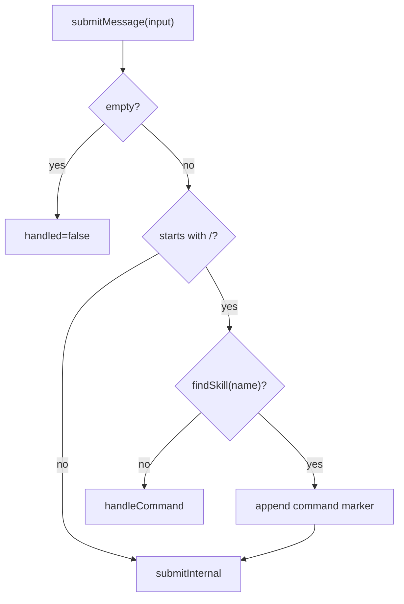

Sources: [src/core/queryEngine.ts:170-219](../../../project-repos/easy-agent/src/core/queryEngine.ts#L170-L219), [src/core/queryEngine.ts:234-277](../../../project-repos/easy-agent/src/core/queryEngine.ts#L234-L277), [src/core/queryEngine.ts:440-629](../../../project-repos/easy-agent/src/core/queryEngine.ts#L440-L629)

<details class="source-snippets">
<summary>引用源码</summary>

<!-- source-snippets:start -->

#### `src/core/queryEngine.ts:170-219`

```typescript
  async *submitMessage(
    input: string,
  ): AsyncGenerator&lt;QueryEngineEvent, { handled: boolean; reason?: LoopTerminationReason }&gt; {
    const trimmed = input.trim();
    if (!trimmed) {
      return { handled: false };
    }

    if (trimmed.startsWith("/")) {
      // User-invoked skill: `/skill-name [args]`. Resolve the skill against
      // the registry; if it matches, expand into the source's two-message
      // pattern and submit normally. Falls through to handleCommand() for
      // /help, /mcp, /clear, etc. when no skill matches.
      //
      // Source reference (claude-code-source-code/src/utils/processUserInput
      // /processSlashCommand.tsx ~ line 1237 `getMessagesForPromptSlashCommand`):
      //
      //   const messages = [
      //     createUserMessage({ content: metadata }),                  // visible bubble
      //     createUserMessage({ content: skillBody, isMeta: true }),   // hidden, model-only
      //     ...
      //   ]
      //
      // The metadata message wraps `<command-name>/foo</command-name>` +
      // `<command-message>foo</command-message>` + `<command-args>...</...>`
      // tags. The UI's `UserCommandMessage` extracts those tags and renders
      // a styled "❯ /foo args" command bubble that stays in the transcript
      // forever (unlike a transient SystemNotice). The body message is
      // marked `isMeta: true` so the UI hides it from the human view while
      // the model still receives it as a regular user prompt.
      //
      // We don't have an `isMeta` field on `MessageParam`, so we use a
      // string-prefix sentinel ("[skill_invocation:&lt;name&gt;]\n") for the body
      // and the source's exact XML format for the marker — both matched in
      // ConversationView.
      const skillExpansion = this.tryExpandSkillCommand(trimmed);
      if (skillExpansion) {
        const markerMessage: MessageParam = {
          role: "user",
          content: skillExpansion.markerContent,
        };
        this.messages = [...this.messages, markerMessage];
        yield { type: "messages_updated", messages: [...this.messages] };
        return yield* this.submitInternal(skillExpansion.bodyText);
      }
      return yield* this.handleCommand(trimmed);
    }

    return yield* this.submitInternal(trimmed);
  }
```

#### `src/core/queryEngine.ts:234-277`

```typescript
  private tryExpandSkillCommand(
    input: string,
  ): { skill: Skill; markerContent: string; bodyText: string } | null {
    const match = input.match(/^\/([a-zA-Z0-9_-]+)(?:\s+(.*))?$/);
    if (!match) return null;
    const [, name, rawArgs] = match;
    const skill = findSkill(name);
    if (!skill) return null;

    const args = rawArgs?.trim() ?? "";
    const dir = skill.baseDir.split(/[\\/]/).join("/");
    const sessionId = this.toolContext.sessionId ?? "unknown-session";

    // Inject allowed-tools into session-allow rules now (the user just
    // explicitly asked for this skill to run — no need to re-prompt for
    // each tool call inside it). Same effect as the SkillTool's
    // contextModifier when the model invokes a skill.
    if (skill.frontmatter.allowedTools.length > 0) {
      this.addSessionAllowRules(skill.frontmatter.allowedTools);
    }

    const body = skill.body
      .replaceAll("${CLAUDE_SKILL_DIR}", dir)
      .replaceAll("${CLAUDE_SESSION_ID}", sessionId)
      .replaceAll("$ARGUMENTS", args);

    // Match `formatCommandInputTags` from source/utils/messages.ts:577.
    // ConversationView's command-bubble renderer parses these exact tags;
    // changing the format here also requires updating extractCommandTag().
    const markerLines = [
      `<command-message>${skill.name}</command-message>`,
      `<command-name>/${skill.name}</command-name>`,
    ];
    if (args) {
      markerLines.push(`<command-args>${args}</command-args>`);
    }
    const markerContent = markerLines.join("\n");

    const header =
      `[skill_invocation:${skill.name}]\n` +
      `Run skill "${skill.name}" with the following instructions. ` +
      `Base directory for this skill: ${dir}.\n\n`;
    return { skill, markerContent, bodyText: header + body };
  }
```

#### `src/core/queryEngine.ts:440-629`

```typescript
  private async *handleCommand(command: string): AsyncGenerator&lt;QueryEngineEvent, { handled: boolean }&gt; {
    const [name, ...args] = command.slice(1).split(/\s+/).filter(Boolean);

    switch (name) {
      case "help":
        yield {
          type: "command",
          kind: "info",
          message: "Commands: /help /clear /cost /model [name|default] /mode [default|plan|auto] /tasks [task|todo|reset] /mcp [tools &lt;name&gt;|reconnect &lt;name&gt;] /skills /history /compact /&lt;skill-name&gt; [args] /exit /quit /bye",
        };
        return { handled: true };
      case "mcp":
        return yield* this.handleMcpCommand(args);
      case "skills":
        return yield* this.handleSkillsCommand();
      case "mode": {
        const nextMode = args[0]?.trim();
        if (!nextMode) {
          yield {
            type: "command",
            kind: "info",
            message: `Current mode: ${this.currentPermissionMode}` +
              (this.prePlanMode ? ` (will restore to ${this.prePlanMode} on plan exit)` : ""),
          };
          return { handled: true };
        }
        if (nextMode !== "default" && nextMode !== "plan" && nextMode !== "auto") {
          yield { type: "command", kind: "error", message: `Invalid mode: ${nextMode}. Must be default, plan, or auto.` };
          return { handled: true };
        }
        const previous = this.currentPermissionMode;
        this.setPermissionMode(nextMode as PermissionMode);
        yield { type: "mode_changed", mode: this.currentPermissionMode, previousMode: previous };
        yield {
          type: "command",
          kind: "info",
          message: `Mode changed: ${previous} → ${this.currentPermissionMode}`,
        };
        return { handled: true };
      }
      case "tasks": {
        const arg = args[0]?.trim();
        const current = getTaskMode();
        if (!arg) {
          yield {
            type: "command",
            kind: "info",
            message: [
              "Task system status",
              `- Active: ${current} (${current === "task" ? "persistent graph (Task V2)" : "session memory (TodoWrite V1)"})`,
              "- Usage: /tasks task      Use persistent Task V2 tools (default)",
              "- Usage: /tasks todo      Use in-memory TodoWrite V1",
              "- Usage: /tasks reset     Delete every task in the current task list",
            ].join("\n"),
          };
          return { handled: true };
        }
        if (arg === "reset") {
          const taskListId = getTaskListId(this.toolContext.sessionId ?? "default");
          try {
            await resetTaskList(taskListId);
            yield { type: "command", kind: "info", message: `Task list '${taskListId}' has been reset.` };
          } catch (error) {
            const msg = error instanceof Error ? error.message : String(error);
            yield { type: "command", kind: "error", message: `Failed to reset task list: ${msg}` };
          }
          return { handled: true };
        }
        if (arg !== "task" && arg !== "todo") {
          yield {
            type: "command",
            kind: "error",
            message: `Invalid task mode: ${arg}. Must be task, todo, or reset.`,
          };
          return { handled: true };
        }
        if (arg === current) {
          yield {
            type: "command",
            kind: "info",
            message: `Task system is already '${current}'.`,
          };
          return { handled: true };
        }
        setTaskMode(arg);
        yield { type: "task_mode_changed", mode: arg, previousMode: current };
        yield {
          type: "command",
          kind: "info",
          message: `Task system changed: ${current} → ${arg}.`,
        };
        return { handled: true };
      }
      case "clear":
        this.messages = [];
        yield { type: "session_cleared" };
        yield { type: "messages_updated", messages: [] };
        yield { type: "command", kind: "info", message: "Conversation cleared." };
        return { handled: true };
      case "cost":
        yield {
          type: "command",
          kind: "info",
          message: `Session usage\n- Input tokens: ${this.totalUsage.input_tokens}\n- Output tokens: ${this.totalUsage.output_tokens}\n- Total tokens: ${this.totalUsage.input_tokens + this.totalUsage.output_tokens}`,
        };
        return { handled: true };
      case "model": {
        const nextModel = args.join(" ").trim();

        if (!nextModel) {
          yield {
            type: "command",
            kind: "info",
            message: [
              "Model status",
              `- Active model: ${this.getActiveModel()}`,
              `- Source: ${this.getModelSource()}`,
              `- Default model: ${this.defaultModel}`,
              this.sessionModelOverride ? `- Session override: ${this.sessionModelOverride}` : "- Session override: none",
              "- Usage: /model &lt;name&gt; to override for this session",
... snippet truncated ...
```

<!-- source-snippets:end -->
</details>

## Turn 前处理

进入模型调用前，`submitInternal()` 先构建预览 system prompt；如果已有历史，先执行 micro compaction，再按 token budget 触发 auto compaction 和 warning。之后根据当前 mode 注入 plan mode attachment 或 plan exit attachment，再追加用户消息。  
Sources: [src/core/queryEngine.ts:288-340](../../../project-repos/easy-agent/src/core/queryEngine.ts#L288-L340), [src/core/queryEngine.ts:342-357](../../../project-repos/easy-agent/src/core/queryEngine.ts#L342-L357)

<details class="source-snippets">
<summary>引用源码</summary>

<!-- source-snippets:start -->

#### `src/core/queryEngine.ts:288-340`

```typescript
    const previewSystemParts = await buildSystemPrompt({
      cwd: this.toolContext.cwd,
      userQuery: trimmed,
    });
    const previewSystemPrompt = renderSystemPrompt(previewSystemParts);

    // Only run compaction when there's meaningful conversation history
    if (this.messages.length > 0) {
      // Micro-compact old tool results first
      const microResult = await compactMessages(this.messages, undefined, {
        usage: this.lastCallUsage,
        usageAnchorIndex: this.usageAnchorIndex,
        systemPrompt: previewSystemPrompt,
      });
      if (microResult.didMicroCompact || microResult.didCompact) {
        this.messages = [...microResult.messages];
        this.invalidateUsageAnchor();
        yield { type: "messages_updated", messages: [...this.messages] };
        yield {
          type: "compacted",
          summary: microResult.summary,
          trigger: microResult.didCompact ? "auto" : "micro",
        };
      }

      // Auto-compact with circuit breaker if still over threshold
      const { result: autoResult, didAutoCompact } = await autoCompactIfNeeded(
        this.messages,
        this.getActiveModel(),
        {
          usage: this.lastCallUsage,
          usageAnchorIndex: this.usageAnchorIndex,
          systemPrompt: previewSystemPrompt,
        },
      );
      if (didAutoCompact) {
        this.messages = [...autoResult.messages];
        this.invalidateUsageAnchor();
        yield { type: "messages_updated", messages: [...this.messages] };
        yield { type: "compacted", summary: autoResult.summary, trigger: "auto" };
      }

      // Emit token warning if approaching limits
      const estimatedTokens = tokenCountWithEstimation(this.messages, {
        usage: this.lastCallUsage,
        usageAnchorIndex: this.usageAnchorIndex,
        systemPrompt: previewSystemPrompt,
      });
      const warningState = calculateTokenWarningState(estimatedTokens, this.getActiveModel());
      if (warningState.state !== "normal") {
        yield { type: "token_warning", warning: warningState };
      }
    }
```

#### `src/core/queryEngine.ts:342-357`

```typescript
    // Inject plan mode attachments as user messages (before user input)
    if (this.currentPermissionMode === "plan") {
      const planAttachment = getPlanModeAttachment(this.messages, getPlanFilePath());
      if (planAttachment) {
        this.messages = [...this.messages, planAttachment];
      }
    } else if (this.needsPlanModeExitAttachment) {
      this.needsPlanModeExitAttachment = false;
      const exists = await checkPlanExists();
      const exitAttachment = getPlanModeExitAttachment(getPlanFilePath(), exists);
      this.messages = [...this.messages, exitAttachment];
    }

    const userMessage: MessageParam = { role: "user", content: trimmed };
    this.messages = [...this.messages, userMessage];
    yield { type: "messages_updated", messages: [...this.messages] };
```

<!-- source-snippets:end -->
</details>

Plan mode attachment 是 user message，不是 system prompt 文本；第一次进入 plan mode 注入完整说明，后续每 5 个 human turn 以完整/简短提醒交替注入。  
Sources: [src/context/planAttachments.ts:1-19](../../../project-repos/easy-agent/src/context/planAttachments.ts#L1-L19), [src/context/planAttachments.ts:23-70](../../../project-repos/easy-agent/src/context/planAttachments.ts#L23-L70), [src/context/planAttachments.ts:129-168](../../../project-repos/easy-agent/src/context/planAttachments.ts#L129-L168)

<details class="source-snippets">
<summary>引用源码</summary>

<!-- source-snippets:start -->

#### `src/context/planAttachments.ts:1-19`

```typescript
/**
 * Plan mode attachments — user-message injection for plan mode state.
 *
 * Claude Code injects plan mode instructions as user messages (attachments)
 * rather than system prompt text. This module replicates that pattern with:
 *
 * - Throttled reminders: injected every N human turns, alternating full/sparse
 * - Exit attachment: one-shot message after leaving plan mode
 *
 * Attachments are tagged with a marker so we can detect them when counting.
 */

import type { MessageParam } from "@anthropic-ai/sdk/resources/messages.js";

export const PLAN_ATTACHMENT_MARKER = "[plan_mode_attachment]";
const PLAN_EXIT_MARKER = "[plan_mode_exit]";

const TURNS_BETWEEN_ATTACHMENTS = 5;
const FULL_REMINDER_EVERY_N = 5;
```

#### `src/context/planAttachments.ts:23-70`

```typescript
function buildFullPlanModeText(planFilePath: string): string {
  return [
    PLAN_ATTACHMENT_MARKER,
    "",
    "PLAN MODE ACTIVE — You are currently in plan mode.",
    "",
    "Workflow:",
    "1. EXPLORE: Use Read, Grep, Glob, and read-only Bash commands (ls, cat, git status, etc.) to understand the codebase.",
    "2. PLAN: Write a detailed implementation plan to the plan file using the structure below.",
    "3. EXIT: Call ExitPlanMode with a summary and any allowedPrompts for auto-approved commands.",
    "",
    "Plan file structure (write to the plan file using this format):",
    "",
    "## Context",
    "Begin with a Context section: what is the problem, what does the user need, what is the expected outcome.",
    "",
    "## Recommended approach",
    "Describe your recommended approach concisely but with enough detail to be executable.",
    "",
    "## Critical files",
    "List the paths of critical files that will be created or modified.",
    "",
    "## Reuse",
    "Identify existing functions, utilities, or patterns in the codebase that should be reused, with paths.",
    "",
    "## Verification",
    "Describe how to test and verify the implementation end-to-end.",
    "",
    "Rules:",
    "- Do NOT use Edit or destructive Bash commands.",
    "- Do NOT use Write on any file except the plan file below.",
    "- Do NOT ask the user for approval via text — use ExitPlanMode when ready.",
    "- You MUST end your turn by either continuing exploration or calling ExitPlanMode.",
    "",
    `Plan file: ${planFilePath}`,
  ].join("\n");
}

// ─── Sparse reminder ───────────────────────────────────────────────

function buildSparsePlanModeText(planFilePath: string): string {
  return [
    PLAN_ATTACHMENT_MARKER,
    "",
    "Reminder: You are still in PLAN MODE. Only read-only tools are allowed.",
    `Write your plan to: ${planFilePath}`,
    "Call ExitPlanMode when your plan is ready.",
  ].join("\n");
```

#### `src/context/planAttachments.ts:129-168`

```typescript
/**
 * Returns a plan mode reminder message if it's time for one,
 * or null if the throttle says to skip this turn.
 */
export function getPlanModeAttachment(
  messages: readonly MessageParam[],
  planFilePath: string,
): MessageParam | null {
  const turnsSince = countHumanTurnsSinceLastAttachment(messages);

  // First message in plan mode always gets a full attachment
  const hasAnyAttachment = messages.some(
    (m) => m.role === "user" && typeof m.content === "string" && m.content.includes(PLAN_ATTACHMENT_MARKER),
  );
  if (!hasAnyAttachment) {
    return { role: "user", content: buildFullPlanModeText(planFilePath) };
  }

  if (turnsSince < TURNS_BETWEEN_ATTACHMENTS) {
    return null;
  }

  const attachmentCount = countPlanAttachmentsSinceLastExit(messages) + 1;
  const isFull = attachmentCount % FULL_REMINDER_EVERY_N === 1;

  const text = isFull
    ? buildFullPlanModeText(planFilePath)
    : buildSparsePlanModeText(planFilePath);

  return { role: "user", content: text };
}

/**
 * Returns a one-shot exit attachment, or null if not needed.
 */
export function getPlanModeExitAttachment(
  planFilePath: string,
  planExists: boolean,
): MessageParam {
  return { role: "user", content: buildPlanModeExitText(planFilePath, planExists) };
```

<!-- source-snippets:end -->
</details>

## 核心 Agentic Loop

`agenticLoop.query()` 的外层 while 最多执行 `MAX_TOOL_TURNS = 50` 次。每轮先检查 abort 和 token blocking limit，然后调用 `streamMessage()`。如果模型 stop reason 不是 `tool_use`，turn 完成；如果是 `tool_use`，就执行工具并把 tool_result message 追加到 history，继续下一轮。  
Sources: [src/core/agenticLoop.ts:26-33](../../../project-repos/easy-agent/src/core/agenticLoop.ts#L26-L33), [src/core/agenticLoop.ts:257-299](../../../project-repos/easy-agent/src/core/agenticLoop.ts#L257-L299), [src/core/agenticLoop.ts:349-409](../../../project-repos/easy-agent/src/core/agenticLoop.ts#L349-L409)

<details class="source-snippets">
<summary>引用源码</summary>

<!-- source-snippets:start -->

#### `src/core/agenticLoop.ts:26-33`

```typescript
export const MAX_TOOL_TURNS = 50;

export type LoopTerminationReason =
  | "completed"
  | "aborted"
  | "model_error"
  | "max_turns"
  | "blocking_limit";
```

#### `src/core/agenticLoop.ts:257-299`

```typescript
  while (state.turnCount < maxTurns) {
    if (params.abortSignal?.aborted) {
      const abortedState = { ...state, aborted: true };
      yield { type: "turn_complete", reason: "aborted", turnCount: state.turnCount };
      return { state: abortedState, usage: totalUsage, lastCallUsage, reason: "aborted" };
    }

    const nextTurnCount = state.turnCount + 1;

    // Token budget check before API call (skip first turn — let the API decide)
    if (state.turnCount > 0) {
      const estimatedTokens = tokenCountWithEstimation(state.messages, {
        usage: lastCallUsage.input_tokens > 0 ? lastCallUsage : undefined,
        usageAnchorIndex: lastCallUsage.input_tokens > 0 ? state.messages.length - 1 : undefined,
        systemPrompt: params.systemPrompt,
      });
      const warningState = calculateTokenWarningState(estimatedTokens, params.model);

      if (warningState.state !== "normal") {
        yield { type: "token_warning", warning: warningState };
      }

      if (warningState.state === "blocking") {
        yield {
          type: "error",
          error: new Error(
            `Context window limit reached (${estimatedTokens} tokens estimated, blocking limit ${warningState.blockingLimit}, window ${warningState.contextWindow}). ` +
            `Use /compact to free space.`,
          ),
        };
        yield { type: "turn_complete", reason: "blocking_limit", turnCount: nextTurnCount };
        return { state: { ...state, turnCount: nextTurnCount }, usage: totalUsage, lastCallUsage, reason: "blocking_limit" };
      }
    }

    const currentTools = params.getTools ? params.getTools() : params.tools;
    const stream = streamMessage({
      messages: [...state.messages],
      model: params.model,
      system: params.systemPrompt,
      tools: currentTools && currentTools.length > 0 ? currentTools : undefined,
      signal: params.abortSignal,
    });
```

#### `src/core/agenticLoop.ts:349-409`

```typescript
    const assistantMessage: MessageParam = {
      role: "assistant",
      content: assistantContent as any,
    };
    const messagesWithAssistant = [...state.messages, assistantMessage];
    state = {
      messages: messagesWithAssistant,
      turnCount: nextTurnCount,
      aborted: false,
    };
    yield { type: "assistant_message", message: assistantMessage };

    if (stopReason !== "tool_use") {
      yield { type: "turn_complete", reason: "completed", turnCount: state.turnCount };
      return { state, usage: totalUsage, lastCallUsage, reason: "completed" };
    }

    const { toolResultsMessage, executions, permissionRequests } = await runTools(
      assistantContent,
      {
        ...params.toolContext,
        abortSignal: params.abortSignal,
      },
      {
        permissionMode: params.permissionMode,
        permissionSettings: params.permissionSettings,
        sessionPermissionRules: params.sessionPermissionRules,
        onPermissionRequest: params.onPermissionRequest,
      },
    );

    for (const request of permissionRequests) {
      yield { type: "permission_request", request };
    }

    for (const execution of executions) {
      yield {
        type: "tool_use_done",
        id: execution.toolUseId,
        name: execution.toolName,
        input: execution.toolInput,
        result: execution.result,
      };
    }

    state = {
      messages: [...state.messages, toolResultsMessage],
      turnCount: state.turnCount,
      aborted: false,
    };
    yield { type: "tool_result_message", message: toolResultsMessage };
  }

  yield { type: "turn_complete", reason: "max_turns", turnCount: state.turnCount };
  return {
    state,
    usage: totalUsage,
    lastCallUsage,
    reason: "max_turns",
  };
}
```

<!-- source-snippets:end -->
</details>

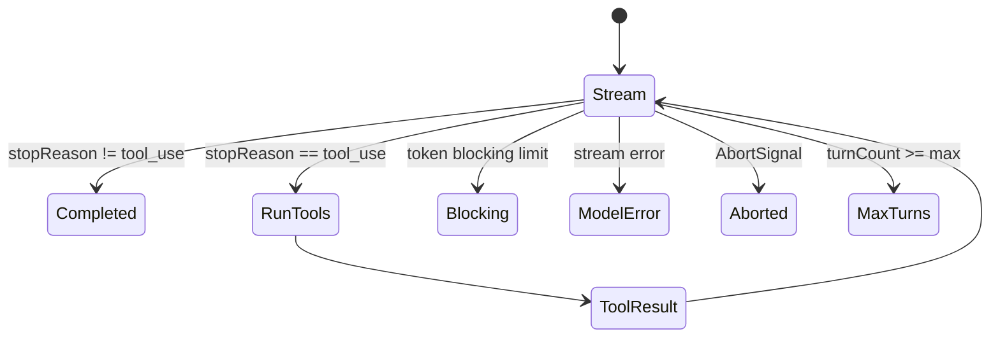

Sources: [src/core/agenticLoop.ts:257-299](../../../project-repos/easy-agent/src/core/agenticLoop.ts#L257-L299), [src/core/agenticLoop.ts:330-409](../../../project-repos/easy-agent/src/core/agenticLoop.ts#L330-L409)

<details class="source-snippets">
<summary>引用源码</summary>

<!-- source-snippets:start -->

#### `src/core/agenticLoop.ts:257-299`

```typescript
  while (state.turnCount < maxTurns) {
    if (params.abortSignal?.aborted) {
      const abortedState = { ...state, aborted: true };
      yield { type: "turn_complete", reason: "aborted", turnCount: state.turnCount };
      return { state: abortedState, usage: totalUsage, lastCallUsage, reason: "aborted" };
    }

    const nextTurnCount = state.turnCount + 1;

    // Token budget check before API call (skip first turn — let the API decide)
    if (state.turnCount > 0) {
      const estimatedTokens = tokenCountWithEstimation(state.messages, {
        usage: lastCallUsage.input_tokens > 0 ? lastCallUsage : undefined,
        usageAnchorIndex: lastCallUsage.input_tokens > 0 ? state.messages.length - 1 : undefined,
        systemPrompt: params.systemPrompt,
      });
      const warningState = calculateTokenWarningState(estimatedTokens, params.model);

      if (warningState.state !== "normal") {
        yield { type: "token_warning", warning: warningState };
      }

      if (warningState.state === "blocking") {
        yield {
          type: "error",
          error: new Error(
            `Context window limit reached (${estimatedTokens} tokens estimated, blocking limit ${warningState.blockingLimit}, window ${warningState.contextWindow}). ` +
            `Use /compact to free space.`,
          ),
        };
        yield { type: "turn_complete", reason: "blocking_limit", turnCount: nextTurnCount };
        return { state: { ...state, turnCount: nextTurnCount }, usage: totalUsage, lastCallUsage, reason: "blocking_limit" };
      }
    }

    const currentTools = params.getTools ? params.getTools() : params.tools;
    const stream = streamMessage({
      messages: [...state.messages],
      model: params.model,
      system: params.systemPrompt,
      tools: currentTools && currentTools.length > 0 ? currentTools : undefined,
      signal: params.abortSignal,
    });
```

#### `src/core/agenticLoop.ts:330-409`

```typescript
      switch (value.type) {
        case "text":
          yield value;
          break;
        case "tool_use_start":
          yield value;
          break;
        case "error":
          yield { type: "error", error: value.error };
          yield { type: "turn_complete", reason: "model_error", turnCount: nextTurnCount };
          return {
            state: { ...state, turnCount: nextTurnCount },
            usage: totalUsage,
            lastCallUsage,
            reason: "model_error",
          };
      }
    }

    const assistantMessage: MessageParam = {
      role: "assistant",
      content: assistantContent as any,
    };
    const messagesWithAssistant = [...state.messages, assistantMessage];
    state = {
      messages: messagesWithAssistant,
      turnCount: nextTurnCount,
      aborted: false,
    };
    yield { type: "assistant_message", message: assistantMessage };

    if (stopReason !== "tool_use") {
      yield { type: "turn_complete", reason: "completed", turnCount: state.turnCount };
      return { state, usage: totalUsage, lastCallUsage, reason: "completed" };
    }

    const { toolResultsMessage, executions, permissionRequests } = await runTools(
      assistantContent,
      {
        ...params.toolContext,
        abortSignal: params.abortSignal,
      },
      {
        permissionMode: params.permissionMode,
        permissionSettings: params.permissionSettings,
        sessionPermissionRules: params.sessionPermissionRules,
        onPermissionRequest: params.onPermissionRequest,
      },
    );

    for (const request of permissionRequests) {
      yield { type: "permission_request", request };
    }

    for (const execution of executions) {
      yield {
        type: "tool_use_done",
        id: execution.toolUseId,
        name: execution.toolName,
        input: execution.toolInput,
        result: execution.result,
      };
    }

    state = {
      messages: [...state.messages, toolResultsMessage],
      turnCount: state.turnCount,
      aborted: false,
    };
    yield { type: "tool_result_message", message: toolResultsMessage };
  }

  yield { type: "turn_complete", reason: "max_turns", turnCount: state.turnCount };
  return {
    state,
    usage: totalUsage,
    lastCallUsage,
    reason: "max_turns",
  };
}
```

<!-- source-snippets:end -->
</details>

## 工具执行与权限

`runTools()` 从 assistant content blocks 中筛出 `tool_use`，通过 tool registry 查找工具，执行前调用 `checkPermission()`。deny 会直接生成 error tool_result；ask 会触发 `onPermissionRequest()`，用户拒绝同样生成 error tool_result，`allow_always` 会把 ruleHint 加入 session allow rules。  
Sources: [src/core/agenticLoop.ts:95-145](../../../project-repos/easy-agent/src/core/agenticLoop.ts#L95-L145), [src/core/agenticLoop.ts:147-189](../../../project-repos/easy-agent/src/core/agenticLoop.ts#L147-L189)

<details class="source-snippets">
<summary>引用源码</summary>

<!-- source-snippets:start -->

#### `src/core/agenticLoop.ts:95-145`

```typescript
export async function runTools(
  contentBlocks: ContentBlock[],
  context: ToolContext,
  options: RunToolsOptions = {},
): Promise<{
  toolResultsMessage: MessageParam;
  executions: ToolExecutionResult[];
  permissionRequests: PermissionRequest[];
}> {
  const toolUseBlocks = contentBlocks.filter(
    (block): block is ToolUseBlock => block.type === "tool_use",
  );

  const toolResults: Array<{
    type: "tool_result";
    tool_use_id: string;
    content: string;
    is_error?: boolean;
  }> = [];
  const executions: ToolExecutionResult[] = [];
  const permissionRequests: PermissionRequest[] = [];

  for (const block of toolUseBlocks) {
    const toolInput = (block.input as Record&lt;string, unknown&gt;) ?? {};
    const tool = findToolByName(block.name);
    if (!tool) {
      const result: ToolResult = {
        content: `Error: Unknown tool "${block.name}"`,
        isError: true,
      };
      toolResults.push({
        type: "tool_result",
        tool_use_id: block.id,
        content: result.content,
        is_error: true,
      });
      executions.push({ toolUseId: block.id, toolName: block.name, toolInput, result });
      continue;
    }

    try {
      // Read live permission mode from tool context (updated by Enter/ExitPlanMode)
      const liveMode = context.getPermissionMode?.() as PermissionMode | undefined;
      const permission = await checkPermission({
        tool,
        input: toolInput,
        cwd: context.cwd,
        mode: liveMode ?? options.permissionMode,
        settings: options.permissionSettings,
        sessionRules: options.sessionPermissionRules,
      });
```

#### `src/core/agenticLoop.ts:147-189`

```typescript
      if (permission.behavior === "deny") {
        const result: ToolResult = {
          content: `Permission denied for ${block.name}: ${permission.reason}`,
          isError: true,
        };
        toolResults.push({
          type: "tool_result",
          tool_use_id: block.id,
          content: result.content,
          is_error: true,
        });
        executions.push({ toolUseId: block.id, toolName: block.name, toolInput, result });
        continue;
      }

      if (permission.behavior === "ask") {
        permissionRequests.push(permission.request);
        const decision = options.onPermissionRequest
          ? await options.onPermissionRequest(permission.request)
          : "deny";

        if (decision === "deny") {
          const result: ToolResult = {
            content: `Permission denied for ${block.name}: user rejected the request`,
            isError: true,
          };
          toolResults.push({
            type: "tool_result",
            tool_use_id: block.id,
            content: result.content,
            is_error: true,
          });
          executions.push({ toolUseId: block.id, toolName: block.name, toolInput, result });
          continue;
        }

        if (decision === "allow_always") {
          const allowRules = options.sessionPermissionRules?.allow;
          if (allowRules && !allowRules.includes(permission.request.ruleHint)) {
            allowRules.push(permission.request.ruleHint);
          }
        }
      }
```

<!-- source-snippets:end -->
</details>

工具调用成功后，结果会按工具自己的 `maxResultSizeChars` 截断；非错误工具调用还会把 Read/Write/Edit/Glob 涉及的路径交给 conditional skill activation。  
Sources: [src/core/agenticLoop.ts:191-213](../../../project-repos/easy-agent/src/core/agenticLoop.ts#L191-L213), [src/tools/Tool.ts:91-107](../../../project-repos/easy-agent/src/tools/Tool.ts#L91-L107)

<details class="source-snippets">
<summary>引用源码</summary>

<!-- source-snippets:start -->

#### `src/core/agenticLoop.ts:191-213`

```typescript
      const rawResult = await tool.call(toolInput, context);
      const result: ToolResult = {
        ...rawResult,
        content: truncateToolResult(rawResult.content, tool.maxResultSizeChars),
      };
      toolResults.push({
        type: "tool_result",
        tool_use_id: block.id,
        content: result.content,
        ...(result.isError && { is_error: true }),
      });
      executions.push({ toolUseId: block.id, toolName: block.name, toolInput, result });

      // Promote any conditional skills whose `paths` patterns match the
      // file the model just touched. The activation is sticky for the
      // remainder of the session — the new skill will appear in the next
      // system prompt rebuild (next user submit).
      if (!result.isError) {
        const filePaths = extractToolFilePaths(block.name, toolInput);
        if (filePaths.length > 0) {
          activateConditionalSkillsForPaths(filePaths, context.cwd);
        }
      }
```

#### `src/tools/Tool.ts:91-107`

```typescript
/** Truncate tool result content to the specified max size. */
export function truncateToolResult(content: string, maxChars?: number): string {
  const limit = maxChars ?? DEFAULT_MAX_RESULT_SIZE_CHARS;
  if (content.length <= limit) return content;
  const truncated = content.slice(0, limit);
  return `${truncated}\n\n[Output truncated: ${content.length} chars total, showing first ${limit}]`;
}

// ─── Helpers ───────────────────────────────────────────────────────

/** Convert a Tool to the Anthropic API `tools` parameter format. */
export function toolToApiParam(tool: Tool): Anthropic.Tool {
  return {
    name: tool.name,
    description: tool.description,
    input_schema: tool.inputSchema,
  };
```

<!-- source-snippets:end -->
</details>

## Plan Mode 进出

`EnterPlanMode` 会创建 plans 目录、设置 session permission mode 为 `plan`，并返回探索、写计划、退出的操作说明。`ExitPlanMode` 只允许在 plan mode 中调用，会读取或写入 plan 文件，把 `allowedPrompts` 转换为 session allow rules，然后恢复 default mode 并返回批准后的 plan 内容。  
Sources: [src/tools/enterPlanModeTool.ts:34-80](../../../project-repos/easy-agent/src/tools/enterPlanModeTool.ts#L34-L80), [src/tools/exitPlanModeTool.ts:69-128](../../../project-repos/easy-agent/src/tools/exitPlanModeTool.ts#L69-L128)

<details class="source-snippets">
<summary>引用源码</summary>

<!-- source-snippets:start -->

#### `src/tools/enterPlanModeTool.ts:34-80`

```typescript
  async call(input: Record&lt;string, unknown&gt;, context: ToolContext): Promise&lt;ToolResult&gt; {
    const currentMode = context.getPermissionMode?.();
    if (currentMode === "plan") {
      return { content: "Already in plan mode.", isError: true };
    }

    await ensurePlansDirectory();
    const planPath = getPlanFilePath();

    context.setPermissionMode?.("plan");

    return {
      content: [
        "PLAN MODE ACTIVE — You are now in plan mode.",
        "",
        "Workflow:",
        "1. EXPLORE: Use Read, Grep, Glob, and read-only Bash commands (ls, cat, git status, etc.) to understand the codebase.",
        "2. PLAN: Write a detailed implementation plan to the plan file using the structure below.",
        "3. EXIT: Call ExitPlanMode with a summary and any allowedPrompts for auto-approved commands.",
        "",
        "Plan file structure (write to the plan file using this format):",
        "",
        "## Context",
        "Begin with a Context section: what is the problem, what does the user need, what is the expected outcome.",
        "",
        "## Recommended approach",
        "Describe your recommended approach concisely but with enough detail to be executable.",
        "",
        "## Critical files",
        "List the paths of critical files that will be created or modified.",
        "",
        "## Reuse",
        "Identify existing functions, utilities, or patterns in the codebase that should be reused, with paths.",
        "",
        "## Verification",
        "Describe how to test and verify the implementation end-to-end.",
        "",
        "Rules:",
        "- Do NOT use Edit or destructive Bash commands.",
        "- Do NOT use Write on any file except the plan file below.",
        "- Do NOT ask the user for approval via text — use ExitPlanMode when ready.",
        "- You MUST end your turn by either continuing exploration or calling ExitPlanMode.",
        "",
        `Plan file: ${planPath}`,
      ].join("\n"),
    };
  },
```

#### `src/tools/exitPlanModeTool.ts:69-128`

```typescript
  async call(input: Record&lt;string, unknown&gt;, context: ToolContext): Promise&lt;ToolResult&gt; {
    const currentMode = context.getPermissionMode?.();
    if (currentMode !== "plan") {
      return { content: "Not currently in plan mode. ExitPlanMode can only be called while in plan mode.", isError: true };
    }

    const planPath = getPlanFilePath();
    const summary = (input.summary as string) || "No summary provided.";
    const allowedPrompts = (input.allowedPrompts as AllowedPrompt[]) ?? [];
    const inputPlan = typeof input.plan === "string" ? input.plan : undefined;

    // If user edited the plan, write it to disk
    let planWasEdited = false;
    if (inputPlan !== undefined) {
      await ensurePlansDirectory();
      await fs.writeFile(planPath, inputPlan, "utf-8");
      planWasEdited = true;
    }

    const planContent = await readPlan();

    // Convert allowedPrompts to session-level allow rules
    if (allowedPrompts.length > 0) {
      const rules = buildAllowRulesFromPrompts(allowedPrompts);
      context.addSessionAllowRules?.(rules);
    }

    // Restore to pre-plan mode
    context.setPermissionMode?.("default");

    // Build structured tool result
    const lines = [
      "Plan approved by user. Full tool access restored.",
      "",
      "IMPORTANT: Immediately begin implementing the plan below.",
      "Do NOT summarize the plan or ask for confirmation — start writing code NOW.",
      "",
      `Plan file: ${planPath}`,
      "",
    ];

    if (planContent) {
      const header = planWasEdited
        ? "## Approved Plan (edited by user)"
        : "## Approved Plan";
      lines.push(header, "", planContent);
    } else {
      lines.push("(No plan content found on disk)");
    }

    if (allowedPrompts.length > 0) {
      lines.push(
        "",
        "Auto-approved commands for this session:",
        ...allowedPrompts.map((p) => `- ${p.tool}: ${p.prompt}`),
      );
    }

    return { content: lines.join("\n") };
  },
```

<!-- source-snippets:end -->
</details>

`QueryEngine` 记录进入 plan 前的 mode；离开 plan 时恢复之前的 mode，并设置 `needsPlanModeExitAttachment`，让下一次普通提交知道已经恢复全工具权限。  
Sources: [src/core/queryEngine.ts:113-129](../../../project-repos/easy-agent/src/core/queryEngine.ts#L113-L129), [src/core/queryEngine.ts:342-353](../../../project-repos/easy-agent/src/core/queryEngine.ts#L342-L353)

<details class="source-snippets">
<summary>引用源码</summary>

<!-- source-snippets:start -->

#### `src/core/queryEngine.ts:113-129`

```typescript
  private setPermissionMode(mode: PermissionMode): void {
    const previous = this.currentPermissionMode;
    if (mode === "plan" && previous !== "plan") {
      this.prePlanMode = previous;
      this.needsPlanModeExitAttachment = false;
    }
    if (mode !== "plan" && previous === "plan" && this.prePlanMode !== null) {
      this.currentPermissionMode = this.prePlanMode;
      this.prePlanMode = null;
      this.needsPlanModeExitAttachment = true;
    } else {
      this.currentPermissionMode = mode;
    }
    if (this.currentPermissionMode !== previous) {
      this.modeChangeCallback?.(this.currentPermissionMode, previous);
    }
  }
```

#### `src/core/queryEngine.ts:342-353`

```typescript
    // Inject plan mode attachments as user messages (before user input)
    if (this.currentPermissionMode === "plan") {
      const planAttachment = getPlanModeAttachment(this.messages, getPlanFilePath());
      if (planAttachment) {
        this.messages = [...this.messages, planAttachment];
      }
    } else if (this.needsPlanModeExitAttachment) {
      this.needsPlanModeExitAttachment = false;
      const exists = await checkPlanExists();
      const exitAttachment = getPlanModeExitAttachment(getPlanFilePath(), exists);
      this.messages = [...this.messages, exitAttachment];
    }
```

<!-- source-snippets:end -->
</details>

## Slash Command 表面

内置命令覆盖帮助、MCP、Skills、mode、tasks、clear、cost、model、history、compact。它们通过 `QueryEngineEvent` 传给 UI，不直接进模型，除非是 skill slash command 被展开成真实 user prompt。  
Sources: [src/core/queryEngine.ts:440-629](../../../project-repos/easy-agent/src/core/queryEngine.ts#L440-L629), [src/core/queryEngine.ts:631-760](../../../project-repos/easy-agent/src/core/queryEngine.ts#L631-L760)

<details class="source-snippets">
<summary>引用源码</summary>

<!-- source-snippets:start -->

#### `src/core/queryEngine.ts:440-629`

```typescript
  private async *handleCommand(command: string): AsyncGenerator&lt;QueryEngineEvent, { handled: boolean }&gt; {
    const [name, ...args] = command.slice(1).split(/\s+/).filter(Boolean);

    switch (name) {
      case "help":
        yield {
          type: "command",
          kind: "info",
          message: "Commands: /help /clear /cost /model [name|default] /mode [default|plan|auto] /tasks [task|todo|reset] /mcp [tools &lt;name&gt;|reconnect &lt;name&gt;] /skills /history /compact /&lt;skill-name&gt; [args] /exit /quit /bye",
        };
        return { handled: true };
      case "mcp":
        return yield* this.handleMcpCommand(args);
      case "skills":
        return yield* this.handleSkillsCommand();
      case "mode": {
        const nextMode = args[0]?.trim();
        if (!nextMode) {
          yield {
            type: "command",
            kind: "info",
            message: `Current mode: ${this.currentPermissionMode}` +
              (this.prePlanMode ? ` (will restore to ${this.prePlanMode} on plan exit)` : ""),
          };
          return { handled: true };
        }
        if (nextMode !== "default" && nextMode !== "plan" && nextMode !== "auto") {
          yield { type: "command", kind: "error", message: `Invalid mode: ${nextMode}. Must be default, plan, or auto.` };
          return { handled: true };
        }
        const previous = this.currentPermissionMode;
        this.setPermissionMode(nextMode as PermissionMode);
        yield { type: "mode_changed", mode: this.currentPermissionMode, previousMode: previous };
        yield {
          type: "command",
          kind: "info",
          message: `Mode changed: ${previous} → ${this.currentPermissionMode}`,
        };
        return { handled: true };
      }
      case "tasks": {
        const arg = args[0]?.trim();
        const current = getTaskMode();
        if (!arg) {
          yield {
            type: "command",
            kind: "info",
            message: [
              "Task system status",
              `- Active: ${current} (${current === "task" ? "persistent graph (Task V2)" : "session memory (TodoWrite V1)"})`,
              "- Usage: /tasks task      Use persistent Task V2 tools (default)",
              "- Usage: /tasks todo      Use in-memory TodoWrite V1",
              "- Usage: /tasks reset     Delete every task in the current task list",
            ].join("\n"),
          };
          return { handled: true };
        }
        if (arg === "reset") {
          const taskListId = getTaskListId(this.toolContext.sessionId ?? "default");
          try {
            await resetTaskList(taskListId);
            yield { type: "command", kind: "info", message: `Task list '${taskListId}' has been reset.` };
          } catch (error) {
            const msg = error instanceof Error ? error.message : String(error);
            yield { type: "command", kind: "error", message: `Failed to reset task list: ${msg}` };
          }
          return { handled: true };
        }
        if (arg !== "task" && arg !== "todo") {
          yield {
            type: "command",
            kind: "error",
            message: `Invalid task mode: ${arg}. Must be task, todo, or reset.`,
          };
          return { handled: true };
        }
        if (arg === current) {
          yield {
            type: "command",
            kind: "info",
            message: `Task system is already '${current}'.`,
          };
          return { handled: true };
        }
        setTaskMode(arg);
        yield { type: "task_mode_changed", mode: arg, previousMode: current };
        yield {
          type: "command",
          kind: "info",
          message: `Task system changed: ${current} → ${arg}.`,
        };
        return { handled: true };
      }
      case "clear":
        this.messages = [];
        yield { type: "session_cleared" };
        yield { type: "messages_updated", messages: [] };
        yield { type: "command", kind: "info", message: "Conversation cleared." };
        return { handled: true };
      case "cost":
        yield {
          type: "command",
          kind: "info",
          message: `Session usage\n- Input tokens: ${this.totalUsage.input_tokens}\n- Output tokens: ${this.totalUsage.output_tokens}\n- Total tokens: ${this.totalUsage.input_tokens + this.totalUsage.output_tokens}`,
        };
        return { handled: true };
      case "model": {
        const nextModel = args.join(" ").trim();

        if (!nextModel) {
          yield {
            type: "command",
            kind: "info",
            message: [
              "Model status",
              `- Active model: ${this.getActiveModel()}`,
              `- Source: ${this.getModelSource()}`,
              `- Default model: ${this.defaultModel}`,
              this.sessionModelOverride ? `- Session override: ${this.sessionModelOverride}` : "- Session override: none",
              "- Usage: /model &lt;name&gt; to override for this session",
... snippet truncated ...
```

#### `src/core/queryEngine.ts:631-760`

```typescript
  /**
   * Handle `/skills` — read-only listing of every skill the loader picked
   * up at startup, split by visibility (model-visible vs hidden vs
   * conditionally-latent). No subcommands yet — `/skills reload` is
   * deferred to a later stage; users can restart the CLI to pick up
   * SKILL.md edits.
   */
  private async *handleSkillsCommand(): AsyncGenerator&lt;QueryEngineEvent, { handled: boolean }&gt; {
    const all = getAllUserInvocableSkills();
    if (all.length === 0) {
      yield {
        type: "command",
        kind: "info",
        message:
          "Skills (0 loaded)\n\n" +
          "No skills found. Add a directory containing SKILL.md to:\n" +
          "  ~/.easy-agent/skills/&lt;name&gt;/SKILL.md   (user-wide)\n" +
          "  .easy-agent/skills/&lt;name&gt;/SKILL.md     (project-only)",
      };
      return { handled: true };
    }
    const lines = [`Skills (${all.length} loaded)`, ""];
    for (const skill of all) {
      const flags: string[] = [skill.source];
      if (skill.frontmatter.disableModelInvocation) flags.push("hidden-from-model");
      if (skill.frontmatter.paths) flags.push(`conditional: ${skill.frontmatter.paths.join(",")}`);
      if (skill.frontmatter.allowedTools.length > 0) {
        flags.push(`allowed-tools: ${skill.frontmatter.allowedTools.join(",")}`);
      }
      lines.push(`  /${skill.name}    ${skill.description}`);
      lines.push(`        [${flags.join("] [")}]`);
    }
    lines.push("", "Invoke a skill with /&lt;name&gt; [args], or let the model call it via the Skill tool.");
    yield { type: "command", kind: "info", message: lines.join("\n") };
    return { handled: true };
  }

  /**
   * Handle the `/mcp` slash command family.
   *
   *   /mcp                       — list every configured server + status + tool count
   *   /mcp tools &lt;name&gt;          — show all tools exposed by one server
   *   /mcp reconnect &lt;name&gt;      — drop cache + retry connection
   *
   * The output is rendered as a system notice (info/error tone), never sent
   * to the model. Mirrors the source's `mcp.tsx` panel content but stripped
   * to a text-only listing — Easy Agent doesn't need a full TUI panel for it.
   */
  private async *handleMcpCommand(args: string[]): AsyncGenerator&lt;QueryEngineEvent, { handled: boolean }&gt; {
    const describeTransport = (config: import("../types/mcp.js").ScopedMcpServerConfig): string => {
      if (config.type === "http") return `http: ${config.url}`;
      if (config.type === "sse") return `sse: ${config.url}`;
      return `stdio: ${config.command} ${(config.args ?? []).join(" ")}`.trim();
    };

    const [sub, ...rest] = args;

    if (!sub) {
      const entries = getMcpRegistry();
      if (entries.length === 0) {
        yield {
          type: "command",
          kind: "info",
          message:
            "MCP Servers (0 configured)\n\n" +
            "No MCP servers configured. Add them under \"mcpServers\" in:\n" +
            "  ~/.easy-agent/settings.json   (user-wide)\n" +
            "  .easy-agent/settings.json      (project-only)",
        };
        return { handled: true };
      }
      const lines = [`MCP Servers (${entries.length} configured)`, ""];
      for (const { connection, tools } of entries) {
        const transport = describeTransport(connection.config);
        if (connection.type === "connected") {
          lines.push(`  ✓ ${connection.name}    connected   ${tools.length} tool(s)   (${transport})`);
        } else if (connection.type === "failed") {
          lines.push(`  ✗ ${connection.name}    failed      ${connection.error}`);
        } else if (connection.type === "pending") {
          const elapsedSec = Math.floor((Date.now() - connection.startedAt) / 1000);
          lines.push(`  … ${connection.name}    connecting  (${elapsedSec}s elapsed; ${transport})`);
        } else {
          lines.push(`  - ${connection.name}    disabled`);
        }
      }
      lines.push("", "Subcommands: /mcp tools &lt;name&gt; | /mcp reconnect &lt;name&gt;");
      yield { type: "command", kind: "info", message: lines.join("\n") };
      return { handled: true };
    }

    if (sub === "tools") {
      const target = rest[0];
      if (!target) {
        yield { type: "command", kind: "error", message: "Usage: /mcp tools &lt;serverName&gt;" };
        return { handled: true };
      }
      const entry = getMcpRegistryEntry(target);
      if (!entry) {
        yield { type: "command", kind: "error", message: `MCP server '${target}' is not configured.` };
        return { handled: true };
      }
      if (entry.connection.type !== "connected") {
        yield {
          type: "command",
          kind: "error",
          message: `MCP server '${target}' is ${entry.connection.type}; cannot list tools.`,
        };
        return { handled: true };
      }
      if (entry.tools.length === 0) {
        yield {
          type: "command",
          kind: "info",
          message: `MCP server '${target}' exposes no tools (server may not declare the 'tools' capability).`,
        };
        return { handled: true };
      }
      const lines = [`MCP tools from '${target}' (${entry.tools.length})`, ""];
      for (const tool of entry.tools) {
        const ro = tool.isReadOnly() ? "[ro]" : "    ";
... snippet truncated ...
```

<!-- source-snippets:end -->
</details>

## 相关页面

- [模型通信与 Streaming](model-streaming.md)
- [工具系统与权限模型](tools-permissions.md)
- [上下文、记忆与压缩](context-memory-compaction.md)

---

<details>
<summary>相关源文件</summary>

生成本页时使用的主要源文件：

- [src/services/api/client.ts](../../../project-repos/easy-agent/src/services/api/client.ts)
- [src/services/api/streaming.ts](../../../project-repos/easy-agent/src/services/api/streaming.ts)
- [src/types/message.ts](../../../project-repos/easy-agent/src/types/message.ts)
- [src/utils/loadEnv.ts](../../../project-repos/easy-agent/src/utils/loadEnv.ts)
- [src/utils/streamDebug.ts](../../../project-repos/easy-agent/src/utils/streamDebug.ts)
- [src/scripts/test-streaming.ts](../../../project-repos/easy-agent/src/scripts/test-streaming.ts)

</details>

# 模型通信与 Streaming

模型通信层封装 Anthropic-compatible Messages API。`client.ts` 负责默认模型、max tokens 和 SDK client 单例；`streaming.ts` 负责把 SDK streaming 事件转换为内部 `StreamEvent`，并组装最终 assistant message、usage 和 stop reason。  
Sources: [src/services/api/client.ts:1-22](../../../project-repos/easy-agent/src/services/api/client.ts#L1-L22), [src/services/api/client.ts:26-52](../../../project-repos/easy-agent/src/services/api/client.ts#L26-L52), [src/services/api/streaming.ts:1-9](../../../project-repos/easy-agent/src/services/api/streaming.ts#L1-L9), [src/services/api/streaming.ts:63-90](../../../project-repos/easy-agent/src/services/api/streaming.ts#L63-L90)

<details class="source-snippets">
<summary>引用源码</summary>

<!-- source-snippets:start -->

#### `src/services/api/client.ts:1-22`

```typescript
/**
 * API Client — Creates and manages the Anthropic API client instance.
 *
 * Mirrors the pattern in claude-code-source-code/src/services/api/client.ts:
 * - Reads API key from environment
 * - Configurable model and max tokens
 * - Single shared client instance (lazy init)
 *
 * We keep this intentionally simple — no Bedrock/Vertex/OAuth,
 * just direct Anthropic API via SDK.
 */

import Anthropic from "@anthropic-ai/sdk";

// ─── Default Configuration ─────────────────────────────────────────

export const DEFAULT_MODEL = process.env.ANTHROPIC_MODEL || "claude-sonnet-4-20250514";
export const CAPPED_DEFAULT_MAX_TOKENS = 8_000;
export const ESCALATED_MAX_TOKENS = 64_000;
export const COMPACT_MAX_OUTPUT_TOKENS = 20_000;
export const MAX_OUTPUT_TOKENS_RECOVERY_LIMIT = 3;
export const DEFAULT_MAX_TOKENS = CAPPED_DEFAULT_MAX_TOKENS;
```

#### `src/services/api/client.ts:26-52`

```typescript
let clientInstance: Anthropic | null = null;

/**
 * Get or create the Anthropic client instance.
 *
 * The SDK automatically reads `ANTHROPIC_AUTH_TOKEN` from the environment.
 * Optionally pass `apiKey` to override.
 */
export function getAnthropicClient(options?: {
  apiKey?: string;
  baseURL?: string;
}): Anthropic {
  if (clientInstance && !options) {
    return clientInstance;
  }

  const client = new Anthropic({
    apiKey: options?.apiKey ?? process.env.ANTHROPIC_AUTH_TOKEN,
    baseURL: options?.baseURL ?? process.env.ANTHROPIC_BASE_URL,
  });

  if (!options) {
    clientInstance = client;
  }

  return client;
}
```

#### `src/services/api/streaming.ts:1-9`

```typescript
/**
 * Streaming — AsyncGenerator wrapper over the Anthropic streaming API.
 *
 * Reference: claude-code-source-code/src/services/api/claude.ts
 * The original iterates `for await (const part of stream)` and switches
 * on `part.type` (message_start, content_block_start, content_block_delta,
 * content_block_stop, message_delta, message_stop). We replicate that
 * pattern but yield our own simplified StreamEvent union.
 */
```

#### `src/services/api/streaming.ts:63-90`

```typescript
export async function* streamMessage(
  params: StreamRequestParams,
): AsyncGenerator&lt;StreamEvent, StreamResult&gt; {
  const client = getAnthropicClient();
  const model = params.model ?? DEFAULT_MODEL;
  const maxTokens = params.maxTokens ?? DEFAULT_MAX_TOKENS;

  // Build the API request
  const requestParams: Anthropic.MessageCreateParamsStreaming = {
    model,
    max_tokens: maxTokens,
    messages: params.messages,
    stream: true,
    ...(params.system && { system: params.system }),
    ...(params.tools && params.tools.length > 0 && { tools: params.tools }),
  };

  // Initiate the stream
  const stream = client.messages.stream(requestParams, {
    signal: params.signal,
  });

  // State accumulators — mirrors the pattern in claude.ts.
  //
  // IMPORTANT: tool_use input JSON must be tracked *per content-block index*.
  // A single shared string breaks as soon as two tool_use blocks overlap —
  // e.g. provider emits `content_block_start` for block 1 before the
  // `content_block_stop` of block 0. In that case the shared buffer gets
```

<!-- source-snippets:end -->
</details>

## 环境加载

CLI 启动时先调用 `loadEnv()`。它按低到高优先级合并 `~/.claude.json`、`~/.claude/settings.json` 和当前工作目录 `.env`，其中 `.env` 使用 `dotenv.config({ override: true })` 覆盖前者。  
Sources: [src/entrypoint/cli.ts:1-3](../../../project-repos/easy-agent/src/entrypoint/cli.ts#L1-L3), [src/utils/loadEnv.ts:1-14](../../../project-repos/easy-agent/src/utils/loadEnv.ts#L1-L14), [src/utils/loadEnv.ts:37-50](../../../project-repos/easy-agent/src/utils/loadEnv.ts#L37-L50)

<details class="source-snippets">
<summary>引用源码</summary>

<!-- source-snippets:start -->

#### `src/entrypoint/cli.ts:1-3`

```typescript
#!/usr/bin/env node
import { loadEnv } from "../utils/loadEnv.js";
loadEnv();
```

#### `src/utils/loadEnv.ts:1-14`

```typescript
/**
 * loadEnv — Multi-source environment variable loader.
 *
 * Loads env vars from multiple sources with increasing priority
 * (later sources override earlier ones):
 *
 *   1. ~/.claude.json        → global config `env` field
 *   2. ~/.claude/settings.json → user settings `env` field
 *   3. .env (cwd)            → project-local dotenv file
 *
 * This mirrors how claude-code-source-code handles env loading
 * via Object.assign (higher priority overwrites lower), while
 * keeping the simplicity of dotenv for project-local overrides.
 */
```

#### `src/utils/loadEnv.ts:37-50`

```typescript
export function loadEnv(): void {
  const home = process.env.HOME || "~";

  // 1. ~/.claude.json (lowest priority)
  const globalConfigEnv = readJsonEnv(path.join(home, ".claude.json"));
  Object.assign(process.env, globalConfigEnv);

  // 2. ~/.claude/settings.json
  const settingsEnv = readJsonEnv(path.join(home, ".claude", "settings.json"));
  Object.assign(process.env, settingsEnv);

  // 3. .env file (highest priority — project-local overrides everything)
  dotenv.config({ override: true });
}
```

<!-- source-snippets:end -->
</details>

客户端默认读取这些环境变量：

| 变量 | 用途 |
|------|------|
| `ANTHROPIC_MODEL` | 覆盖默认模型 |
| `ANTHROPIC_AUTH_TOKEN` | API token |
| `ANTHROPIC_BASE_URL` | Anthropic-compatible endpoint |
| `EASY_AGENT_DEBUG_STREAM` | 打开 streaming raw event 日志 |

Sources: [src/services/api/client.ts:17-22](../../../project-repos/easy-agent/src/services/api/client.ts#L17-L22), [src/services/api/client.ts:34-45](../../../project-repos/easy-agent/src/services/api/client.ts#L34-L45), [src/utils/streamDebug.ts:1-20](../../../project-repos/easy-agent/src/utils/streamDebug.ts#L1-L20)

<details class="source-snippets">
<summary>引用源码</summary>

<!-- source-snippets:start -->

#### `src/services/api/client.ts:17-22`

```typescript
export const DEFAULT_MODEL = process.env.ANTHROPIC_MODEL || "claude-sonnet-4-20250514";
export const CAPPED_DEFAULT_MAX_TOKENS = 8_000;
export const ESCALATED_MAX_TOKENS = 64_000;
export const COMPACT_MAX_OUTPUT_TOKENS = 20_000;
export const MAX_OUTPUT_TOKENS_RECOVERY_LIMIT = 3;
export const DEFAULT_MAX_TOKENS = CAPPED_DEFAULT_MAX_TOKENS;
```

#### `src/services/api/client.ts:34-45`

```typescript
export function getAnthropicClient(options?: {
  apiKey?: string;
  baseURL?: string;
}): Anthropic {
  if (clientInstance && !options) {
    return clientInstance;
  }

  const client = new Anthropic({
    apiKey: options?.apiKey ?? process.env.ANTHROPIC_AUTH_TOKEN,
    baseURL: options?.baseURL ?? process.env.ANTHROPIC_BASE_URL,
  });
```

#### `src/utils/streamDebug.ts:1-20`

```typescript
/**
 * Stream debug logger.
 *
 * Opt-in via the `EASY_AGENT_DEBUG_STREAM=1` environment variable.
 * When enabled, every raw SSE event — plus request / assembled / error
 * markers — is appended as a single-line JSON record to
 * `~/.easy-agent/stream-debug.log`.
 *
 * This is invaluable when debugging Anthropic-compatible endpoints
 * (MiniMax, LiteLLM, OpenAI → Anthropic shims, etc.) whose streaming
 * translation often mis-handles tool_use or thinking blocks.
 *
 * Keep this file dependency-free and side-effect-safe: logging must
 * never throw or affect the stream itself.
 */

import { appendFileSync, mkdirSync } from "node:fs";
import { getEasyAgentHome, getStreamDebugLogPath } from "./paths.js";

const DEBUG_STREAM = process.env.EASY_AGENT_DEBUG_STREAM === "1";
```

<!-- source-snippets:end -->
</details>

## Streaming 事件模型

内部消息类型接近 Anthropic content block：text、tool_use、tool_result、thinking。Stream event 包括 text delta、tool_use_start、tool_use_input、message_start、message_done 和 error。  
Sources: [src/types/message.ts:10-45](../../../project-repos/easy-agent/src/types/message.ts#L10-L45), [src/types/message.ts:70-111](../../../project-repos/easy-agent/src/types/message.ts#L70-L111)

<details class="source-snippets">
<summary>引用源码</summary>

<!-- source-snippets:start -->

#### `src/types/message.ts:10-45`

```typescript
export interface TextBlock {
  type: "text";
  text: string;
}

export interface ToolUseBlock {
  type: "tool_use";
  id: string;
  name: string;
  input: Record&lt;string, unknown&gt;;
}

export interface ToolResultBlock {
  type: "tool_result";
  tool_use_id: string;
  content: string | ContentBlock[];
  is_error?: boolean;
}

/**
 * Extended-thinking content block, as streamed by Anthropic (and
 * Anthropic-compatible endpoints like MiniMax) when a model returns
 * internal reasoning.  The `signature` field is required by the API
 * when we echo the message back on the next turn.
 */
export interface ThinkingBlock {
  type: "thinking";
  thinking: string;
  signature?: string;
}

export type ContentBlock =
  | TextBlock
  | ToolUseBlock
  | ToolResultBlock
  | ThinkingBlock;
```

#### `src/types/message.ts:70-111`

```typescript
// ─── Stream Event Types ────────────────────────────────────────────

export interface StreamTextEvent {
  type: "text";
  text: string;
}

export interface StreamToolUseStartEvent {
  type: "tool_use_start";
  id: string;
  name: string;
}

export interface StreamToolUseInputEvent {
  type: "tool_use_input";
  id: string;
  partial_json: string;
}

export interface StreamMessageStartEvent {
  type: "message_start";
  messageId: string;
}

export interface StreamMessageDoneEvent {
  type: "message_done";
  stopReason: string;
  usage: Usage;
}

export interface StreamErrorEvent {
  type: "error";
  error: Error;
}

export type StreamEvent =
  | StreamTextEvent
  | StreamToolUseStartEvent
  | StreamToolUseInputEvent
  | StreamMessageStartEvent
  | StreamMessageDoneEvent
  | StreamErrorEvent;
```

<!-- source-snippets:end -->
</details>

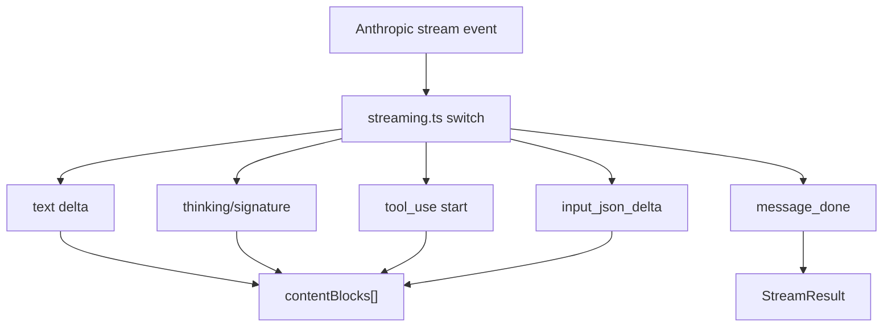

Sources: [src/services/api/streaming.ts:109-156](../../../project-repos/easy-agent/src/services/api/streaming.ts#L109-L156), [src/services/api/streaming.ts:158-253](../../../project-repos/easy-agent/src/services/api/streaming.ts#L158-L253), [src/services/api/streaming.ts:282-290](../../../project-repos/easy-agent/src/services/api/streaming.ts#L282-L290)

<details class="source-snippets">
<summary>引用源码</summary>

<!-- source-snippets:start -->

#### `src/services/api/streaming.ts:109-156`

```typescript
    for await (const event of stream) {
      writeStreamDebug("event", event);
      switch (event.type) {
        // ── Message lifecycle ──────────────────────────────
        case "message_start": {
          messageId = event.message.id;
          // Capture initial usage (input token count + cache tokens)
          if (event.message.usage) {
            usage.input_tokens = event.message.usage.input_tokens;
            usage.output_tokens = event.message.usage.output_tokens;
            const u = event.message.usage as unknown as Record&lt;string, unknown&gt;;
            if (typeof u.cache_creation_input_tokens === "number") {
              usage.cache_creation_input_tokens = u.cache_creation_input_tokens;
            }
            if (typeof u.cache_read_input_tokens === "number") {
              usage.cache_read_input_tokens = u.cache_read_input_tokens;
            }
          }
          yield { type: "message_start", messageId };
          break;
        }

        case "message_delta": {
          // Final usage update + stop reason
          if (event.usage) {
            usage.output_tokens = event.usage.output_tokens;
            // Some providers (e.g. MiniMax) report input_tokens in message_delta
            // rather than message_start — pick it up as a fallback.
            const du = event.usage as unknown as Record&lt;string, unknown&gt;;
            if (typeof du.input_tokens === "number" && du.input_tokens > 0) {
              usage.input_tokens = du.input_tokens;
            }
            if (typeof du.cache_creation_input_tokens === "number") {
              usage.cache_creation_input_tokens = du.cache_creation_input_tokens;
            }
            if (typeof du.cache_read_input_tokens === "number") {
              usage.cache_read_input_tokens = du.cache_read_input_tokens;
            }
          }
          stopReason = event.delta.stop_reason ?? "";
          break;
        }

        case "message_stop": {
          // Stream complete — yield the final done event
          yield { type: "message_done", stopReason, usage };
          break;
        }
```

#### `src/services/api/streaming.ts:158-253`

```typescript
        // ── Content block lifecycle ────────────────────────
        case "content_block_start": {
          const index = event.index;

          if (event.content_block.type === "text") {
            contentBlocks[index] = {
              type: "text",
              text: "",
            };
          } else if (event.content_block.type === "thinking") {
            // Preserve thinking blocks so we can echo them (with their
            // signature) back to the model on the next turn. Some providers
            // (e.g. MiniMax) and Anthropic's extended-thinking mode will
            // behave erratically — duplicating tool calls or emitting empty
            // inputs — if the prior turn's thinking is missing from history.
            const tb = event.content_block as { thinking?: string };
            contentBlocks[index] = {
              type: "thinking",
              thinking: tb.thinking ?? "",
            };
          } else if (event.content_block.type === "tool_use") {
            const block = event.content_block;
            // Some providers pre-populate the full input object on start
            // instead of streaming it via input_json_delta. Preserve whatever
            // is already there so we don't overwrite a valid non-empty input
            // with `{}` at content_block_stop.
            const seedInput =
              block.input && typeof block.input === "object"
                ? (block.input as Record&lt;string, unknown&gt;)
                : {};
            contentBlocks[index] = {
              type: "tool_use",
              id: block.id,
              name: block.name,
              input: seedInput,
            };
            toolInputJsonByIndex.set(index, "");
            yield { type: "tool_use_start", id: block.id, name: block.name };
          }
          break;
        }

        case "content_block_delta": {
          const delta = event.delta;
          const index = event.index;

          if (delta.type === "text_delta") {
            // Accumulate text
            const block = contentBlocks[index] as TextBlock;
            block.text += delta.text;
            yield { type: "text", text: delta.text };
          } else if ((delta as { type: string }).type === "thinking_delta") {
            const block = contentBlocks[index] as ThinkingBlock | undefined;
            if (block && block.type === "thinking") {
              block.thinking += (delta as unknown as { thinking: string }).thinking ?? "";
            }
          } else if ((delta as { type: string }).type === "signature_delta") {
            const block = contentBlocks[index] as ThinkingBlock | undefined;
            if (block && block.type === "thinking") {
              const sig = (delta as unknown as { signature: string }).signature;
              block.signature = (block.signature ?? "") + (sig ?? "");
            }
          } else if (delta.type === "input_json_delta") {
            // Accumulate tool input JSON **per block index** — blocks may
            // overlap on some providers, so we must never share one buffer.
            const prev = toolInputJsonByIndex.get(index) ?? "";
            toolInputJsonByIndex.set(index, prev + delta.partial_json);
            const idBlock = contentBlocks[index];
            if (idBlock && idBlock.type === "tool_use") {
              yield {
                   type: "tool_use_input",
                id: (idBlock as ToolUseBlock).id,
                partial_json: delta.partial_json,
              };
            }
          }
          break;
        }

        case "content_block_stop": {
          const index = event.index;
          const block = contentBlocks[index];
          const accumulated = toolInputJsonByIndex.get(index);
          if (block && block.type === "tool_use" && accumulated) {
            try {
              block.input = JSON.parse(accumulated);
            } catch {
              // Keep the raw string so callers can surface it for debugging
              // rather than silently pretending the call had no input.
              block.input = { _raw: accumulated };
            }
          }
          toolInputJsonByIndex.delete(index);
          break;
        }
      }
```

#### `src/services/api/streaming.ts:282-290`

```typescript
  // Return the fully assembled assistant message
  return {
    assistantMessage: {
      role: "assistant",
      content: contentBlocks.filter((block): block is ContentBlock => Boolean(block)),
    },
    usage,
    stopReason,
  };
```

<!-- source-snippets:end -->
</details>

## Tool Input 组装

`streamMessage()` 用 `toolInputJsonByIndex` 为每个 content block index 保存独立 JSON buffer，避免多个 `tool_use` block 交错 streaming 时共用字符串导致输入错配或丢失。`content_block_stop` 时尝试 JSON.parse，失败则保留 `_raw` 便于调试。  
Sources: [src/services/api/streaming.ts:85-94](../../../project-repos/easy-agent/src/services/api/streaming.ts#L85-L94), [src/services/api/streaming.ts:178-195](../../../project-repos/easy-agent/src/services/api/streaming.ts#L178-L195), [src/services/api/streaming.ts:220-250](../../../project-repos/easy-agent/src/services/api/streaming.ts#L220-L250)

<details class="source-snippets">
<summary>引用源码</summary>

<!-- source-snippets:start -->

#### `src/services/api/streaming.ts:85-94`

```typescript
  // State accumulators — mirrors the pattern in claude.ts.
  //
  // IMPORTANT: tool_use input JSON must be tracked *per content-block index*.
  // A single shared string breaks as soon as two tool_use blocks overlap —
  // e.g. provider emits `content_block_start` for block 1 before the
  // `content_block_stop` of block 0. In that case the shared buffer gets
  // reset / cross-populated and tools end up with empty or swapped inputs.
  const contentBlocks: ContentBlock[] = [];
  const toolInputJsonByIndex = new Map&lt;number, string&gt;();
  let messageId = "";
```

#### `src/services/api/streaming.ts:178-195`

```typescript
          } else if (event.content_block.type === "tool_use") {
            const block = event.content_block;
            // Some providers pre-populate the full input object on start
            // instead of streaming it via input_json_delta. Preserve whatever
            // is already there so we don't overwrite a valid non-empty input
            // with `{}` at content_block_stop.
            const seedInput =
              block.input && typeof block.input === "object"
                ? (block.input as Record&lt;string, unknown&gt;)
                : {};
            contentBlocks[index] = {
              type: "tool_use",
              id: block.id,
              name: block.name,
              input: seedInput,
            };
            toolInputJsonByIndex.set(index, "");
            yield { type: "tool_use_start", id: block.id, name: block.name };
```

#### `src/services/api/streaming.ts:220-250`

```typescript
          } else if (delta.type === "input_json_delta") {
            // Accumulate tool input JSON **per block index** — blocks may
            // overlap on some providers, so we must never share one buffer.
            const prev = toolInputJsonByIndex.get(index) ?? "";
            toolInputJsonByIndex.set(index, prev + delta.partial_json);
            const idBlock = contentBlocks[index];
            if (idBlock && idBlock.type === "tool_use") {
              yield {
                   type: "tool_use_input",
                id: (idBlock as ToolUseBlock).id,
                partial_json: delta.partial_json,
              };
            }
          }
          break;
        }

        case "content_block_stop": {
          const index = event.index;
          const block = contentBlocks[index];
          const accumulated = toolInputJsonByIndex.get(index);
          if (block && block.type === "tool_use" && accumulated) {
            try {
              block.input = JSON.parse(accumulated);
            } catch {
              // Keep the raw string so callers can surface it for debugging
              // rather than silently pretending the call had no input.
              block.input = { _raw: accumulated };
            }
          }
          toolInputJsonByIndex.delete(index);
```

<!-- source-snippets:end -->
</details>

## Thinking Block 保留

当 provider 返回 `thinking` 或 `signature_delta`，实现会把 thinking block 和 signature 保留进 content history。注释说明这是为了兼容 extended-thinking 和 Anthropic-compatible endpoint，否则后续 turn 可能重复 tool call 或产生空输入。  
Sources: [src/services/api/streaming.ts:167-177](../../../project-repos/easy-agent/src/services/api/streaming.ts#L167-L177), [src/services/api/streaming.ts:209-219](../../../project-repos/easy-agent/src/services/api/streaming.ts#L209-L219)

<details class="source-snippets">
<summary>引用源码</summary>

<!-- source-snippets:start -->

#### `src/services/api/streaming.ts:167-177`

```typescript
          } else if (event.content_block.type === "thinking") {
            // Preserve thinking blocks so we can echo them (with their
            // signature) back to the model on the next turn. Some providers
            // (e.g. MiniMax) and Anthropic's extended-thinking mode will
            // behave erratically — duplicating tool calls or emitting empty
            // inputs — if the prior turn's thinking is missing from history.
            const tb = event.content_block as { thinking?: string };
            contentBlocks[index] = {
              type: "thinking",
              thinking: tb.thinking ?? "",
            };
```

#### `src/services/api/streaming.ts:209-219`

```typescript
          } else if ((delta as { type: string }).type === "thinking_delta") {
            const block = contentBlocks[index] as ThinkingBlock | undefined;
            if (block && block.type === "thinking") {
              block.thinking += (delta as unknown as { thinking: string }).thinking ?? "";
            }
          } else if ((delta as { type: string }).type === "signature_delta") {
            const block = contentBlocks[index] as ThinkingBlock | undefined;
            if (block && block.type === "thinking") {
              const sig = (delta as unknown as { signature: string }).signature;
              block.signature = (block.signature ?? "") + (sig ?? "");
            }
```

<!-- source-snippets:end -->
</details>

## 非 streaming 调用

`createMessage()` 提供一次性调用，主要供内部任务使用，例如上下文压缩生成 summary。它接受和 streaming 类似的参数，但不带 AbortSignal，并把 response content 映射回内部 content block。  
Sources: [src/services/api/streaming.ts:293-346](../../../project-repos/easy-agent/src/services/api/streaming.ts#L293-L346), [src/context/compaction.ts:203-232](../../../project-repos/easy-agent/src/context/compaction.ts#L203-L232)

<details class="source-snippets">
<summary>引用源码</summary>

<!-- source-snippets:start -->

#### `src/services/api/streaming.ts:293-346`

```typescript
// ─── Convenience: Non-streaming single-shot ────────────────────────

/**
 * Simple non-streaming call for quick one-off requests.
 * Useful for internal tasks (compaction, classification) where
 * we don't need incremental output.
 */
export async function createMessage(
  params: Omit&lt;StreamRequestParams, "signal"&gt;,
): Promise&lt;{ content: ContentBlock[]; usage: Usage; stopReason: string }&gt; {
  const client = getAnthropicClient();
  const model = params.model ?? DEFAULT_MODEL;
  const maxTokens = params.maxTokens ?? DEFAULT_MAX_TOKENS;

  const response = await client.messages.create({
    model,
    max_tokens: maxTokens,
    messages: params.messages,
    ...(params.system && { system: params.system }),
    ...(params.tools && params.tools.length > 0 && { tools: params.tools }),
  });

  const contentBlocks: ContentBlock[] = response.content.map((block) => {
    if (block.type === "text") {
      return { type: "text" as const, text: block.text };
    } else if (block.type === "tool_use") {
      return {
        type: "tool_use" as const,
        id: block.id,
        name: block.name,
        input: block.input as Record&lt;string, unknown&gt;,
      };
    }
    return { type: "text" as const, text: "" };
  });

  const usageResult: Usage = {
    input_tokens: response.usage.input_tokens,
    output_tokens: response.usage.output_tokens,
  };
  const ru = response.usage as unknown as Record&lt;string, unknown&gt;;
  if (typeof ru.cache_creation_input_tokens === "number") {
    usageResult.cache_creation_input_tokens = ru.cache_creation_input_tokens;
  }
  if (typeof ru.cache_read_input_tokens === "number") {
    usageResult.cache_read_input_tokens = ru.cache_read_input_tokens;
  }

  return {
    content: contentBlocks,
    usage: usageResult,
    stopReason: response.stop_reason ?? "end_turn",
  };
}
```

#### `src/context/compaction.ts:203-232`

```typescript
async function summarizeMessages(messages: MessageParam[], focus?: string): Promise&lt;string&gt; {
  const extraInstruction = focus ? `\n\n## Compact Instructions\n${focus}` : "";
  debugLog("compact", "summary_request", { messageCount: messages.length, focus: focus ?? null });

  const response = await createMessage({
    model: process.env.ANTHROPIC_MODEL,
    maxTokens: 8000,
    system: NO_TOOLS_PREAMBLE + BASE_COMPACT_PROMPT + extraInstruction,
    messages: [
      {
        role: "user",
        content: `Conversation to summarize:\n${JSON.stringify(messages, null, 2)}`,
      },
    ],
  });

  const text = response.content
    .filter((block) => block.type === "text")
    .map((block) => block.text)
    .join("\n")
    .trim();

  debugLog("compact", "summary_response", {
    stopReason: response.stopReason,
    inputTokens: response.usage.input_tokens,
    outputTokens: response.usage.output_tokens,
    summaryLength: text.length,
  });

  return text;
```

<!-- source-snippets:end -->
</details>

## Debug 日志

`writeStreamDebug()` 在 `EASY_AGENT_DEBUG_STREAM=1` 时向 `~/.easy-agent/stream-debug.log` 追加 JSONL，记录 request、raw event、assembled 和 error。日志函数吞掉自身错误，避免调试日志影响模型通信。  
Sources: [src/utils/streamDebug.ts:1-15](../../../project-repos/easy-agent/src/utils/streamDebug.ts#L1-L15), [src/utils/streamDebug.ts:20-47](../../../project-repos/easy-agent/src/utils/streamDebug.ts#L20-L47), [src/services/api/streaming.ts:102-110](../../../project-repos/easy-agent/src/services/api/streaming.ts#L102-L110), [src/services/api/streaming.ts:264-280](../../../project-repos/easy-agent/src/services/api/streaming.ts#L264-L280)

<details class="source-snippets">
<summary>引用源码</summary>

<!-- source-snippets:start -->

#### `src/utils/streamDebug.ts:1-15`

```typescript
/**
 * Stream debug logger.
 *
 * Opt-in via the `EASY_AGENT_DEBUG_STREAM=1` environment variable.
 * When enabled, every raw SSE event — plus request / assembled / error
 * markers — is appended as a single-line JSON record to
 * `~/.easy-agent/stream-debug.log`.
 *
 * This is invaluable when debugging Anthropic-compatible endpoints
 * (MiniMax, LiteLLM, OpenAI → Anthropic shims, etc.) whose streaming
 * translation often mis-handles tool_use or thinking blocks.
 *
 * Keep this file dependency-free and side-effect-safe: logging must
 * never throw or affect the stream itself.
 */
```

#### `src/utils/streamDebug.ts:20-47`

```typescript
const DEBUG_STREAM = process.env.EASY_AGENT_DEBUG_STREAM === "1";

let cachedLogPath: string | null = null;

function resolveLogPath(): string {
  if (cachedLogPath) return cachedLogPath;
  try {
    mkdirSync(getEasyAgentHome(), { recursive: true });
  } catch {
    /* ignore — appendFileSync will surface any real failure */
  }
  cachedLogPath = getStreamDebugLogPath();
  return cachedLogPath;
}

/**
 * Append a single JSON record to the debug log. Safe to call when
 * debug mode is off — it becomes a no-op.
 */
export function writeStreamDebug(kind: string, payload: unknown): void {
  if (!DEBUG_STREAM) return;
  try {
    const line = JSON.stringify({ ts: new Date().toISOString(), kind, payload }) + "\n";
    appendFileSync(resolveLogPath(), line);
  } catch {
    /* swallow — logging must never break the stream */
  }
}
```

#### `src/services/api/streaming.ts:102-110`

```typescript
  writeStreamDebug("request", {
    model,
    messageCount: params.messages.length,
    toolNames: params.tools?.map((t) => t.name),
  });

  try {
    for await (const event of stream) {
      writeStreamDebug("event", event);
```

#### `src/services/api/streaming.ts:264-280`

```typescript
  writeStreamDebug("assembled", {
    stopReason,
    blockCount: contentBlocks.filter(Boolean).length,
    blocks: contentBlocks.filter(Boolean).map((b) => {
      if (b.type === "tool_use") {
        return { type: "tool_use", id: b.id, name: b.name, input: b.input };
      }
      if (b.type === "thinking") {
        return {
          type: "thinking",
          length: (b as ThinkingBlock).thinking.length,
          hasSignature: Boolean((b as ThinkingBlock).signature),
        };
      }
      return { type: "text", length: (b as TextBlock).text.length };
    }),
  });
```

<!-- source-snippets:end -->
</details>

## 验证脚本

`src/scripts/test-streaming.ts` 是手动 smoke 脚本：检查 `ANTHROPIC_AUTH_TOKEN`，发起中文 prompt，逐字输出 text delta，并打印 stop reason、usage 和 content block 类型。  
Sources: [src/scripts/test-streaming.ts:5-14](../../../project-repos/easy-agent/src/scripts/test-streaming.ts#L5-L14), [src/scripts/test-streaming.ts:20-41](../../../project-repos/easy-agent/src/scripts/test-streaming.ts#L20-L41), [src/scripts/test-streaming.ts:43-100](../../../project-repos/easy-agent/src/scripts/test-streaming.ts#L43-L100)

<details class="source-snippets">
<summary>引用源码</summary>

<!-- source-snippets:start -->

#### `src/scripts/test-streaming.ts:5-14`

```typescript
 * Phase 1 verification script — Test LLM API streaming communication.
 *
 * Usage:
 *   ANTHROPIC_AUTH_TOKEN=sk-ant-... npx tsx src/scripts/test-streaming.ts
 *
 * Verifies:
 *   1. API connection works
 *   2. Streaming output displays character-by-character
 *   3. Token usage is correctly reported
 */
```

#### `src/scripts/test-streaming.ts:20-41`

```typescript
async function main(): Promise&lt;void&gt; {
  // ── Pre-flight check ──────────────────────────────────────────
  if (!process.env.ANTHROPIC_AUTH_TOKEN) {
    console.error(
      "\x1b[31m✗ ANTHROPIC_AUTH_TOKEN is not set.\x1b[0m\n" +
      "  Export it first:\n" +
      "  export ANTHROPIC_AUTH_TOKEN=sk-ant-...\n"
    );
    process.exit(1);
  }

  const userMessage = "用一句话介绍你自己，然后用三句话解释什么是 Agentic Loop。";

  console.log(`\x1b[90m── Model: ${DEFAULT_MODEL}\x1b[0m`);
  console.log(`\x1b[90m── User:  ${userMessage}\x1b[0m\n`);
  console.log("\x1b[36m▎ Assistant:\x1b[0m");

  // ── Stream the response ───────────────────────────────────────
  const generator = streamMessage({
    messages: [{ role: "user", content: userMessage }],
    system: "You are a helpful assistant. Reply concisely in Chinese.",
  });
```

#### `src/scripts/test-streaming.ts:43-100`

```typescript
  let result;
  while (true) {
    const { value, done } = await generator.next();
    if (done) {
      result = value; // StreamResult from the generator return
      break;
    }

    const event = value as StreamEvent;

    switch (event.type) {
      case "text":
        // Write text deltas directly to stdout — the "typewriter effect"
        process.stdout.write(event.text);
        break;

      case "message_start":
        // Could show a spinner here later
        break;

      case "message_done":
        // Newline after streaming text
        console.log("\n");
        console.log("\x1b[90m── Stream complete ──\x1b[0m");
        console.log(`   Stop reason:   ${event.stopReason}`);
        console.log(`   Input tokens:  ${event.usage.input_tokens}`);
        console.log(`   Output tokens: ${event.usage.output_tokens}`);
        break;

      case "error":
        console.error(`\n\x1b[31m✗ Stream error: ${event.error.message}\x1b[0m`);
        process.exit(1);
    }
  }

  // ── Also show the return value ────────────────────────────────
  if (result) {
    console.log(`\n\x1b[90m── Assembled result ──\x1b[0m`);
    console.log(`   Stop reason:   ${result.stopReason}`);
    console.log(`   Total input:   ${result.usage.input_tokens} tokens`);
    console.log(`   Total output:  ${result.usage.output_tokens} tokens`);
    console.log(
      `   Content blocks: ${result.assistantMessage.content.length}`,
    );

    // Show block types
    if (Array.isArray(result.assistantMessage.content)) {
      for (const block of result.assistantMessage.content) {
        if (block.type === "text") {
          console.log(`   [text] ${block.text.slice(0, 80)}...`);
        } else if (block.type === "tool_use") {
          console.log(`   [tool_use] ${block.name}(${JSON.stringify(block.input)})`);
        }
      }
    }
  }

  console.log("\n\x1b[32m✓ Phase 1 verification passed!\x1b[0m");
```

<!-- source-snippets:end -->
</details>

## 相关页面

- [QueryEngine 与 Agentic Loop](query-engine-agentic-loop.md)
- [测试、构建与路线图](testing-and-roadmap.md)
- [上下文、记忆与压缩](context-memory-compaction.md)

---

<details>
<summary>相关源文件</summary>

生成本页时使用的主要源文件：

- [src/tools/Tool.ts](../../../project-repos/easy-agent/src/tools/Tool.ts)
- [src/tools/index.ts](../../../project-repos/easy-agent/src/tools/index.ts)
- [src/tools/fileReadTool.ts](../../../project-repos/easy-agent/src/tools/fileReadTool.ts)
- [src/tools/fileWriteTool.ts](../../../project-repos/easy-agent/src/tools/fileWriteTool.ts)
- [src/tools/fileEditTool.ts](../../../project-repos/easy-agent/src/tools/fileEditTool.ts)
- [src/tools/bashTool.ts](../../../project-repos/easy-agent/src/tools/bashTool.ts)
- [src/tools/pathUtils.ts](../../../project-repos/easy-agent/src/tools/pathUtils.ts)
- [src/permissions/permissions.ts](../../../project-repos/easy-agent/src/permissions/permissions.ts)

</details>

# 工具系统与权限模型

工具系统的核心是 `Tool` 接口：每个工具有唯一 `name`、给模型看的 `description`、Anthropic tool schema、可选 result size 上限、`call()`、`isReadOnly()` 和 `isEnabled()`。工具结果是模型可读的 text，并可标记 `isError`。  
Sources: [src/tools/Tool.ts:18-46](../../../project-repos/easy-agent/src/tools/Tool.ts#L18-L46), [src/tools/Tool.ts:56-89](../../../project-repos/easy-agent/src/tools/Tool.ts#L56-L89)

<details class="source-snippets">
<summary>引用源码</summary>

<!-- source-snippets:start -->

#### `src/tools/Tool.ts:18-46`

```typescript
/** Runtime context passed to every tool invocation. */
export interface ToolContext {
  /** Current working directory */
  cwd: string;
  /** Abort signal for cancellation */
  abortSignal?: AbortSignal;
  /** Callback to switch permission mode at runtime (set by QueryEngine). */
  setPermissionMode?: (mode: string) => void;
  /** Callback to get the current permission mode. */
  getPermissionMode?: () => string;
  /** Callback to add session-level allow rules (for allowedPrompts on plan exit). */
  addSessionAllowRules?: (rules: string[]) => void;
  /**
   * Current session id. Used by session-scoped tools (e.g. TodoWrite) to
   * key their in-memory state — mirrors source code's
   * `agentId ?? getSessionId()` lookup pattern in `appState.todos[todoKey]`.
   */
  sessionId?: string;
}

// ─── Tool Result ───────────────────────────────────────────────────

/** The return value of a tool's `call()` method. */
export interface ToolResult {
  /** Human-readable text output sent back to the model. */
  content: string;
  /** Whether this call produced an error. */
  isError?: boolean;
}
```

#### `src/tools/Tool.ts:56-89`

```typescript
export const DEFAULT_MAX_RESULT_SIZE_CHARS = 100_000;

export interface Tool {
  /** Unique tool name, sent to the API and used for lookup. */
  readonly name: string;

  /** Human-readable description shown to the model. */
  readonly description: string;

  /**
   * JSON Schema describing the tool's input parameters.
   * This is sent directly to the Anthropic API as `input_schema`.
   */
  readonly inputSchema: Anthropic.Tool["input_schema"];

  /**
   * Maximum character count for the tool result content.
   * Results exceeding this limit will be truncated.
   * Defaults to DEFAULT_MAX_RESULT_SIZE_CHARS (100K).
   */
  readonly maxResultSizeChars?: number;

  /**
   * Execute the tool with the given input.
   * The model provides `input` as a parsed JSON object.
   */
  call(input: Record&lt;string, unknown&gt;, context: ToolContext): Promise&lt;ToolResult&gt;;

  /** Whether this tool only reads data (no side effects). */
  isReadOnly(): boolean;

  /** Whether this tool is available in the current environment. */
  isEnabled(): boolean;
}
```

<!-- source-snippets:end -->
</details>

## 注册表

内置工具数组包含文件读写编辑、Glob/Grep、Bash、MemoryWrite、TodoWrite、Task V2 工具、Plan Mode 工具和 Skill 工具。MCP 工具通过 `registerMcpTools()` 单独注入，最终由 `getAllTools()` 合并。  
Sources: [src/tools/index.ts:13-28](../../../project-repos/easy-agent/src/tools/index.ts#L13-L28), [src/tools/index.ts:30-65](../../../project-repos/easy-agent/src/tools/index.ts#L30-L65)

<details class="source-snippets">
<summary>引用源码</summary>

<!-- source-snippets:start -->

#### `src/tools/index.ts:13-28`

```typescript
import { bashTool } from "./bashTool.js";
import { fileEditTool } from "./fileEditTool.js";
import { fileReadTool } from "./fileReadTool.js";
import { fileWriteTool } from "./fileWriteTool.js";
import { globTool } from "./globTool.js";
import { grepTool } from "./grepTool.js";
import { memoryWriteTool } from "./memoryWriteTool.js";
import { enterPlanModeTool } from "./enterPlanModeTool.js";
import { exitPlanModeTool } from "./exitPlanModeTool.js";
import { todoWriteTool } from "./todoWriteTool.js";
import { taskCreateTool } from "./taskCreateTool.js";
import { taskUpdateTool } from "./taskUpdateTool.js";
import { taskGetTool } from "./taskGetTool.js";
import { taskListTool } from "./taskListTool.js";
import { skillTool } from "./skillTool.js";
import type { PermissionMode } from "../permissions/permissions.js";
```

#### `src/tools/index.ts:30-65`

```typescript
const BUILTIN_TOOLS: Tool[] = [
  fileReadTool,
  fileWriteTool,
  fileEditTool,
  globTool,
  grepTool,
  bashTool,
  memoryWriteTool,
  todoWriteTool,
  taskCreateTool,
  taskUpdateTool,
  taskGetTool,
  taskListTool,
  enterPlanModeTool,
  exitPlanModeTool,
  skillTool,
];

let mcpTools: Tool[] = [];

/**
 * Replace the registry of MCP-provided tools. Called once at startup after
 * connecting to all MCP servers, and again after `/mcp reconnect`.
 */
export function registerMcpTools(tools: Tool[]): void {
  mcpTools = [...tools];
}

/** Drop the MCP-provided tools — used before re-registering after reconnect. */
export function clearMcpTools(): void {
  mcpTools = [];
}

export function getAllTools(): Tool[] {
  return [...BUILTIN_TOOLS, ...mcpTools].filter((tool) => tool.isEnabled());
}
```

<!-- source-snippets:end -->
</details>

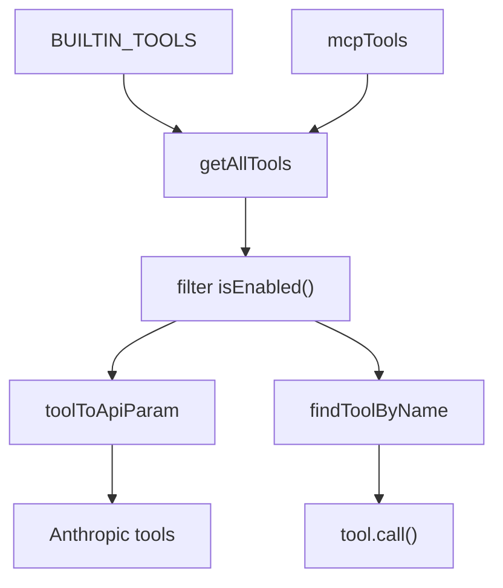

Sources: [src/tools/index.ts:30-90](../../../project-repos/easy-agent/src/tools/index.ts#L30-L90), [src/tools/Tool.ts:101-107](../../../project-repos/easy-agent/src/tools/Tool.ts#L101-L107)

<details class="source-snippets">
<summary>引用源码</summary>

<!-- source-snippets:start -->

#### `src/tools/index.ts:30-90`

```typescript
const BUILTIN_TOOLS: Tool[] = [
  fileReadTool,
  fileWriteTool,
  fileEditTool,
  globTool,
  grepTool,
  bashTool,
  memoryWriteTool,
  todoWriteTool,
  taskCreateTool,
  taskUpdateTool,
  taskGetTool,
  taskListTool,
  enterPlanModeTool,
  exitPlanModeTool,
  skillTool,
];

let mcpTools: Tool[] = [];

/**
 * Replace the registry of MCP-provided tools. Called once at startup after
 * connecting to all MCP servers, and again after `/mcp reconnect`.
 */
export function registerMcpTools(tools: Tool[]): void {
  mcpTools = [...tools];
}

/** Drop the MCP-provided tools — used before re-registering after reconnect. */
export function clearMcpTools(): void {
  mcpTools = [];
}

export function getAllTools(): Tool[] {
  return [...BUILTIN_TOOLS, ...mcpTools].filter((tool) => tool.isEnabled());
}

export function findToolByName(name: string): Tool | undefined {
  return [...BUILTIN_TOOLS, ...mcpTools].find((tool) => tool.name === name);
}

/**
 * Get tool API params with mode-aware Enter/Exit visibility.
 *
 * The model always sees all tools (Write, Edit, Bash, etc.) regardless
 * of mode. Enforcement happens in checkPermission at execution time.
 * Only the plan mode transition tools are toggled:
 * - In plan mode: hide EnterPlanMode, show ExitPlanMode
 * - Outside plan mode: show EnterPlanMode, hide ExitPlanMode
 *
 * MCP tools are always included; their visibility-in-plan is handled by
 * `checkPermission()` reading `tool.isReadOnly()` (which maps to MCP's
 * `annotations.readOnlyHint`).
 */
export function getToolsApiParams(mode?: PermissionMode): Anthropic.Tool[] {
  const tools = getAllTools();
  if (mode === "plan") {
    return tools.filter((t) => t.name !== "EnterPlanMode").map(toolToApiParam);
  }
  return tools.filter((t) => t.name !== "ExitPlanMode").map(toolToApiParam);
}
```

#### `src/tools/Tool.ts:101-107`

```typescript
/** Convert a Tool to the Anthropic API `tools` parameter format. */
export function toolToApiParam(tool: Tool): Anthropic.Tool {
  return {
    name: tool.name,
    description: tool.description,
    input_schema: tool.inputSchema,
  };
```

<!-- source-snippets:end -->
</details>

## 路径边界

文件类工具通过 `resolveWorkspacePath()` 解析路径，只允许访问当前 cwd 和 `~/.easy-agent`。这意味着默认情况下模型不能随意读写工作区外的路径，除非路径落在这两个允许根下。  
Sources: [src/tools/pathUtils.ts:4-10](../../../project-repos/easy-agent/src/tools/pathUtils.ts#L4-L10), [src/tools/pathUtils.ts:18-40](../../../project-repos/easy-agent/src/tools/pathUtils.ts#L18-L40)

<details class="source-snippets">
<summary>引用源码</summary>

<!-- source-snippets:start -->

#### `src/tools/pathUtils.ts:4-10`

```typescript
export function getToolAllowedRoots(cwd: string): string[] {
  return [path.resolve(cwd), path.resolve(getEasyAgentHome())];
}

export function describeAllowedRoots(cwd: string): string {
  return getToolAllowedRoots(cwd).join(", ");
}
```

#### `src/tools/pathUtils.ts:18-40`

```typescript
export function resolveSafePath(filePath: string, cwd: string): string {
  return path.resolve(cwd, expandHome(filePath));
}

export function ensureInsideAllowedRoots(resolvedPath: string, cwd: string): void {
  const normalizedPath = path.resolve(resolvedPath);
  for (const root of getToolAllowedRoots(cwd)) {
    const relative = path.relative(root, normalizedPath);
    if (relative === "" || relative === ".") return;
    if (!relative.startsWith("..") && !path.isAbsolute(relative)) {
      return;
    }
  }
  throw new Error(
    `Path is outside the allowed roots: ${resolvedPath}. Allowed roots: ${describeAllowedRoots(cwd)}`,
  );
}

export function resolveWorkspacePath(filePath: string, cwd: string): string {
  const resolvedPath = resolveSafePath(filePath, cwd);
  ensureInsideAllowedRoots(resolvedPath, cwd);
  return resolvedPath;
}
```

<!-- source-snippets:end -->
</details>

| 工具 | 关键行为 |
|------|----------|
| `Read` | 可读文件或目录，支持 offset/limit，并输出行号 |
| `Write` | 创建或覆盖文件，自动创建父目录 |
| `Edit` | 唯一 old_string 匹配替换，先检查 0/多次匹配 |
| `Glob` | 优先用 `rg --files`，fallback 到 `find` |
| `Grep` | 优先用 `rg -n --hidden`，fallback 到 `grep -RIn` |
| `Bash` | shell 执行，支持 timeout、abort、sandbox 包装和输出截断 |

Sources: [src/tools/fileReadTool.ts:25-105](../../../project-repos/easy-agent/src/tools/fileReadTool.ts#L25-L105), [src/tools/fileWriteTool.ts:11-68](../../../project-repos/easy-agent/src/tools/fileWriteTool.ts#L11-L68), [src/tools/fileEditTool.ts:39-103](../../../project-repos/easy-agent/src/tools/fileEditTool.ts#L39-L103), [src/tools/globTool.ts:22-81](../../../project-repos/easy-agent/src/tools/globTool.ts#L22-L81), [src/tools/grepTool.ts:23-85](../../../project-repos/easy-agent/src/tools/grepTool.ts#L23-L85), [src/tools/bashTool.ts:94-216](../../../project-repos/easy-agent/src/tools/bashTool.ts#L94-L216)

<details class="source-snippets">
<summary>引用源码</summary>

<!-- source-snippets:start -->

#### `src/tools/fileReadTool.ts:25-105`

```typescript
export const fileReadTool: Tool = {
  name: "Read",
  description:
    "Read the contents of a file at the specified path. " +
    "Use offset and limit to read specific line ranges for large files. " +
    "Output includes line numbers in cat -n format.",
  inputSchema: {
    type: "object" as const,
    properties: {
      file_path: {
        type: "string",
        description: "The absolute or relative path to the file to read",
      },
      offset: {
        type: "number",
        description: "The 1-indexed line number to start reading from (default: 1)",
      },
      limit: {
        type: "number",
        description: "The number of lines to read. If not provided, reads the entire file",
      },
    },
    required: ["file_path"],
  },
  async call(rawInput: Record&lt;string, unknown&gt;, context: ToolContext): Promise&lt;ToolResult&gt; {
    const input = rawInput as unknown as FileReadInput;
    if (!input.file_path) {
      return { content: "Error: file_path is required", isError: true };
    }

    let resolvedPath: string;
    try {
      resolvedPath = resolveWorkspacePath(input.file_path, context.cwd);
    } catch (error: unknown) {
      return {
        content: error instanceof Error ? `Error: ${error.message}` : `Error: ${String(error)}`,
        isError: true,
      };
    }

    const offset = input.offset ?? 1;
    const limit = input.limit;

    try {
      const stat = await fs.stat(resolvedPath);
      if (stat.isDirectory()) {
        const entries = await fs.readdir(resolvedPath);
        return { content: `Directory listing for ${input.file_path}:\n${entries.join("\n")}` };
      }

      const raw = await fs.readFile(resolvedPath, "utf-8");
      const allLines = raw.split("\n");
      const startIdx = Math.max(0, offset - 1);
      const endIdx = limit ? startIdx + limit : allLines.length;
      const selectedLines = allLines.slice(startIdx, endIdx);
      const numbered = addLineNumbers(selectedLines.join("\n"), startIdx + 1);
      const numLines = selectedLines.length;
      const rangeInfo =
        startIdx > 0 || endIdx < allLines.length
          ? ` (lines ${startIdx + 1}-${startIdx + numLines} of ${allLines.length})`
          : ` (${allLines.length} lines)`;

      return { content: `${resolvedPath}${rangeInfo}\n${numbered}` };
    } catch (error: unknown) {
      const err = error as NodeJS.ErrnoException;
      if (err.code === "ENOENT") {
        return { content: `Error: File not found: ${input.file_path}`, isError: true };
      }
      if (err.code === "EACCES") {
        return { content: `Error: Permission denied: ${input.file_path}`, isError: true };
      }
      return { content: `Error reading file: ${err.message}`, isError: true };
    }
  },
  isReadOnly(): boolean {
    return true;
  },
  isEnabled(): boolean {
    return true;
  },
};
```

#### `src/tools/fileWriteTool.ts:11-68`

```typescript
export const fileWriteTool: Tool = {
  name: "Write",
  description: "Create a file or overwrite an existing file with the provided content.",
  inputSchema: {
    type: "object" as const,
    properties: {
      file_path: { type: "string", description: "File path to write" },
      content: { type: "string", description: "Full file content to write" },
    },
    required: ["file_path", "content"],
  },
  async call(rawInput: Record&lt;string, unknown&gt;, context: ToolContext): Promise&lt;ToolResult&gt; {
    const input = rawInput as unknown as FileWriteInput;
    if (!input.file_path) {
      return { content: "Error: file_path is required", isError: true };
    }
    if (typeof input.content !== "string") {
      return { content: "Error: content must be a string", isError: true };
    }

    let resolvedPath: string;
    try {
      resolvedPath = resolveWorkspacePath(input.file_path, context.cwd);
    } catch (error: unknown) {
      return {
        content: error instanceof Error ? `Error: ${error.message}` : `Error: ${String(error)}`,
        isError: true,
      };
    }

    try {
      let existed = true;
      try {
        await fs.access(resolvedPath);
      } catch {
        existed = false;
      }

      await fs.mkdir(path.dirname(resolvedPath), { recursive: true });
      await fs.writeFile(resolvedPath, input.content, "utf-8");

      return {
        content: `${existed ? "Updated" : "Created"} file: ${resolvedPath} (${input.content.length} chars)`,
      };
    } catch (error: unknown) {
      return {
        content: `Error writing file: ${error instanceof Error ? error.message : String(error)}`,
        isError: true,
      };
    }
  },
  isReadOnly(): boolean {
    return false;
  },
  isEnabled(): boolean {
    return true;
  },
};
```

#### `src/tools/fileEditTool.ts:39-103`

```typescript
export const fileEditTool: Tool = {
  name: "Edit",
  description: "Find a unique string in a file, replace it, and write the updated content back.",
  inputSchema: {
    type: "object" as const,
    properties: {
      file_path: { type: "string", description: "File path to edit" },
      old_string: { type: "string", description: "Existing text to replace; must match uniquely" },
      new_string: { type: "string", description: "Replacement text" },
    },
    required: ["file_path", "old_string", "new_string"],
  },
  async call(rawInput: Record&lt;string, unknown&gt;, context: ToolContext): Promise&lt;ToolResult&gt; {
    const input = rawInput as unknown as FileEditInput;
    if (!input.file_path || typeof input.old_string !== "string" || typeof input.new_string !== "string") {
      return { content: "Error: file_path, old_string, and new_string are required", isError: true };
    }

    const oldString = normalizeQuotes(input.old_string);
    const newString = normalizeQuotes(input.new_string);

    if (!oldString) {
      return { content: "Error: old_string must not be empty", isError: true };
    }

    let resolvedPath: string;
    try {
      resolvedPath = resolveWorkspacePath(input.file_path, context.cwd);
    } catch (error: unknown) {
      return {
        content: error instanceof Error ? `Error: ${error.message}` : `Error: ${String(error)}`,
        isError: true,
      };
    }

    try {
      const original = await fs.readFile(resolvedPath, "utf-8");
      const occurrences = countOccurrences(original, oldString);
      if (occurrences === 0) {
        return { content: `Error: old_string not found in ${resolvedPath}`, isError: true };
      }
      if (occurrences > 1) {
        return { content: `Error: old_string matched ${occurrences} times; Edit requires a unique match`, isError: true };
      }

      const updated = original.replace(oldString, newString);
      await fs.writeFile(resolvedPath, updated, "utf-8");

      return {
        content: `Updated file: ${resolvedPath}\n${buildEditPreview(oldString, newString)}`,
      };
    } catch (error: unknown) {
      return {
        content: `Error editing file: ${error instanceof Error ? error.message : String(error)}`,
        isError: true,
      };
    }
  },
  isReadOnly(): boolean {
    return false;
  },
  isEnabled(): boolean {
    return true;
  },
};
```

#### `src/tools/globTool.ts:22-81`

```typescript
export const globTool: Tool = {
  name: "Glob",
  description: "Find files by glob pattern. Prefer this over Bash for file discovery.",
  inputSchema: {
    type: "object" as const,
    properties: {
      pattern: { type: "string", description: "Glob pattern to match, e.g. **/*.ts" },
      path: { type: "string", description: "Base directory to search from" },
    },
    required: ["pattern"],
  },
  async call(rawInput: Record&lt;string, unknown&gt;, context: ToolContext): Promise&lt;ToolResult&gt; {
    const input = rawInput as unknown as GlobInput;
    if (!input.pattern) {
      return { content: "Error: pattern is required", isError: true };
    }

    let basePath: string;
    try {
      basePath = resolveWorkspacePath(input.path ?? ".", context.cwd);
    } catch (error: unknown) {
      return {
        content: error instanceof Error ? `Error: ${error.message}` : `Error: ${String(error)}`,
        isError: true,
      };
    }

    try {
      if (await hasCommand("rg")) {
        const { stdout } = await execFileAsync("rg", ["--files", "--hidden", "-g", input.pattern], {
          cwd: basePath,
          maxBuffer: 1024 * 1024,
        });
        const output = stdout.trim();
        return {
          content: output ? `Matched files under ${basePath}:\n${output}` : `No files matched ${input.pattern}`,
        };
      }

      const { stdout } = await execFileAsync("find", [basePath, "-path", `*${input.pattern.replace(/\*\*/g, "*")}`], {
        maxBuffer: 1024 * 1024,
      });
      const output = stdout.trim();
      return {
        content: output ? `Matched files under ${basePath}:\n${output}` : `No files matched ${input.pattern}`,
      };
    } catch (error: unknown) {
      return {
        content: `Error running glob search: ${error instanceof Error ? error.message : String(error)}`,
        isError: true,
      };
    }
  },
  isReadOnly(): boolean {
    return true;
  },
  isEnabled(): boolean {
    return true;
  },
};
```

#### `src/tools/grepTool.ts:23-85`

```typescript
export const grepTool: Tool = {
  name: "Grep",
  description: "Search file contents by regex pattern. Prefer this over Bash for code search.",
  inputSchema: {
    type: "object" as const,
    properties: {
      pattern: { type: "string", description: "Regex pattern to search for" },
      path: { type: "string", description: "Directory or file path to search within" },
      include: { type: "string", description: "Optional glob filter, e.g. *.ts" },
    },
    required: ["pattern"],
  },
  async call(rawInput: Record&lt;string, unknown&gt;, context: ToolContext): Promise&lt;ToolResult&gt; {
    const input = rawInput as unknown as GrepInput;
    if (!input.pattern) {
      return { content: "Error: pattern is required", isError: true };
    }

    let targetPath: string;
    try {
      targetPath = resolveWorkspacePath(input.path ?? ".", context.cwd);
    } catch (error: unknown) {
      return {
        content: error instanceof Error ? `Error: ${error.message}` : `Error: ${String(error)}`,
        isError: true,
      };
    }

    try {
      if (await hasCommand("rg")) {
        const args = ["-n", "--hidden"];
        if (input.include) {
          args.push("-g", input.include);
        }
        args.push(input.pattern, targetPath);
        const { stdout } = await execFileAsync("rg", args, { maxBuffer: 1024 * 1024 });
        const output = stdout.trim();
        return {
          content: output ? output : `No matches found for pattern: ${input.pattern}`,
        };
      }

      const grepArgs = ["-RIn", input.pattern, targetPath];
      const { stdout } = await execFileAsync("grep", grepArgs, { maxBuffer: 1024 * 1024 });
      const output = stdout.trim();
      return {
        content: output ? output : `No matches found for pattern: ${input.pattern}`,
      };
    } catch (error: unknown) {
      const message = error instanceof Error ? error.message : String(error);
      if (message.includes("code 1")) {
        return { content: `No matches found for pattern: ${input.pattern}` };
      }
      return { content: `Error running grep search: ${message}`, isError: true };
    }
  },
  isReadOnly(): boolean {
    return true;
  },
  isEnabled(): boolean {
    return true;
  },
};
```

#### `src/tools/bashTool.ts:94-216`

```typescript
export const bashTool: Tool = {
  name: "Bash",
  description: "Execute a shell command in the current working directory and return stdout/stderr.",
  inputSchema: {
    type: "object" as const,
    properties: {
      command: { type: "string", description: "Shell command to execute" },
      timeout: { type: "number", description: "Timeout in milliseconds (default 120000)" },
      dangerouslyDisableSandbox: {
        type: "boolean",
        description:
          "If true, run this command OUTSIDE the sandbox even when sandboxing is enabled. Only use this when the command genuinely needs unrestricted access (e.g. installing system packages, running docker, accessing devices). Most commands should run inside the sandbox.",
      },
    },
    required: ["command"],
  },
  async call(rawInput: Record&lt;string, unknown&gt;, context: ToolContext): Promise&lt;ToolResult&gt; {
    const input = rawInput as unknown as BashInput;
    if (!input.command) {
      return { content: "Error: command is required", isError: true };
    }

    const timeoutMs = typeof input.timeout === "number" ? input.timeout : DEFAULT_TIMEOUT_MS;

    // Decide sandbox wrapping. We swallow load errors and proceed with
    // sandboxing OFF — settings.json being unparseable shouldn't block
    // command execution; the permission system already surfaces those
    // errors loudly elsewhere.
    let sandboxSettings: ResolvedSandboxSettings | null = null;
    try {
      sandboxSettings = await loadSandboxSettings(context.cwd);
    } catch {
      sandboxSettings = null;
    }

    const willSandbox = sandboxSettings
      ? shouldUseSandbox(
          {
            command: input.command,
            dangerouslyDisableSandbox: input.dangerouslyDisableSandbox,
          },
          sandboxSettings,
        )
      : false;

    let executedCommand = input.command;
    if (willSandbox && sandboxSettings) {
      const profile = await buildProfileForCwd(context.cwd, sandboxSettings);
      const wrap = wrapWithSandbox(input.command, profile);
      executedCommand = wrap.wrappedCommand;
    }

    return await new Promise&lt;ToolResult&gt;((resolve) => {
      const child = spawn(process.env.SHELL || "bash", ["-lc", executedCommand], {
        cwd: context.cwd,
        env: process.env,
      });

      let stdout = "";
      let stderr = "";
      let settled = false;

      const finish = (result: ToolResult) => {
        if (settled) return;
        settled = true;
        resolve(result);
      };

      const timeoutId = setTimeout(() => {
        child.kill("SIGTERM");
        finish({ content: `Command timed out after ${timeoutMs}ms`, isError: true });
      }, timeoutMs);

      const onAbort = () => {
        child.kill("SIGTERM");
        clearTimeout(timeoutId);
        finish({ content: "Command aborted", isError: true });
      };

      context.abortSignal?.addEventListener("abort", onAbort, { once: true });

      child.stdout.on("data", (chunk: Buffer | string) => {
        stdout += chunk.toString();
      });
      child.stderr.on("data", (chunk: Buffer | string) => {
        stderr += chunk.toString();
      });
      child.on("error", (error) => {
        clearTimeout(timeoutId);
        finish({ content: `Failed to start command: ${error.message}`, isError: true });
      });
      child.on("close", (code) => {
        clearTimeout(timeoutId);
        context.abortSignal?.removeEventListener("abort", onAbort);

        // Tag stderr with &lt;sandbox_violations&gt;...&lt;/sandbox_violations&gt;
        // when the failure smells like a sandbox denial. The model uses
        // this signal to decide whether to retry, ask for permission,
        // or back off. The UI strips the tag before rendering.
        const annotatedStderr = willSandbox
          ? annotateStderrWithSandboxFailures(stderr, code)
          : stderr;

        const output = [
          `Command: ${input.command}`,
          `Read-only: ${isReadOnlyCommand(input.command)}`,
          `Sandbox: ${willSandbox ? "enabled" : "disabled"}`,
          `Exit code: ${code ?? -1}`,
          stdout ? `\nSTDOUT:\n${truncateOutput(stdout)}` : "",
          annotatedStderr ? `\nSTDERR:\n${truncateOutput(annotatedStderr)}` : "",
        ].filter(Boolean).join("\n");

        finish({ content: output, isError: (code ?? 1) !== 0 });
      });
    });
  },
  isReadOnly(): boolean {
    return false;
  },
  isEnabled(): boolean {
... snippet truncated ...
```

<!-- source-snippets:end -->
</details>

## Bash 工具

`Bash` 用当前 shell 执行命令，默认 timeout 120 秒，输出截断到 30K 字符。它会在调用前读取 sandbox settings，如果应启用 sandbox，就构建 profile 并把原始命令包装成 `sandbox-exec` 命令。工具结果会明确输出原命令、是否 read-only、sandbox 是否启用、exit code、stdout 和 stderr。  
Sources: [src/tools/bashTool.ts:48-92](../../../project-repos/easy-agent/src/tools/bashTool.ts#L48-L92), [src/tools/bashTool.ts:110-145](../../../project-repos/easy-agent/src/tools/bashTool.ts#L110-L145), [src/tools/bashTool.ts:146-207](../../../project-repos/easy-agent/src/tools/bashTool.ts#L146-L207)

<details class="source-snippets">
<summary>引用源码</summary>

<!-- source-snippets:start -->

#### `src/tools/bashTool.ts:48-92`

```typescript
const DEFAULT_TIMEOUT_MS = 120_000;
const MAX_OUTPUT_CHARS = 30_000;
const READ_ONLY_COMMANDS = new Set([
  "ls",
  "cat",
  "grep",
  "rg",
  "find",
  "fd",
  "pwd",
  "which",
  "git status",
  "git log",
  "git diff",
  "git show",
  "head",
  "tail",
  "wc",
  "sed",
]);

function truncateOutput(value: string): string {
  if (value.length <= MAX_OUTPUT_CHARS) return value;
  return `${value.slice(0, MAX_OUTPUT_CHARS)}\n...[truncated ${value.length - MAX_OUTPUT_CHARS} chars]`;
}

function splitCommandSegments(command: string): string[] {
  return command
    .split(/&&|\|\||\|/)
    .map((segment) => segment.trim())
    .filter(Boolean);
}

export function isReadOnlyCommand(command: string): boolean {
  const segments = splitCommandSegments(command);
  if (segments.length === 0) return false;
  return segments.every((segment) => {
    const normalized = segment.replace(/\s+/g, " ").trim();
    if (READ_ONLY_COMMANDS.has(normalized)) return true;
    const firstTwo = normalized.split(" ").slice(0, 2).join(" ");
    if (READ_ONLY_COMMANDS.has(firstTwo)) return true;
    const first = normalized.split(" ")[0];
    return READ_ONLY_COMMANDS.has(first);
  });
}
```

#### `src/tools/bashTool.ts:110-145`

```typescript
  async call(rawInput: Record&lt;string, unknown&gt;, context: ToolContext): Promise&lt;ToolResult&gt; {
    const input = rawInput as unknown as BashInput;
    if (!input.command) {
      return { content: "Error: command is required", isError: true };
    }

    const timeoutMs = typeof input.timeout === "number" ? input.timeout : DEFAULT_TIMEOUT_MS;

    // Decide sandbox wrapping. We swallow load errors and proceed with
    // sandboxing OFF — settings.json being unparseable shouldn't block
    // command execution; the permission system already surfaces those
    // errors loudly elsewhere.
    let sandboxSettings: ResolvedSandboxSettings | null = null;
    try {
      sandboxSettings = await loadSandboxSettings(context.cwd);
    } catch {
      sandboxSettings = null;
    }

    const willSandbox = sandboxSettings
      ? shouldUseSandbox(
          {
            command: input.command,
            dangerouslyDisableSandbox: input.dangerouslyDisableSandbox,
          },
          sandboxSettings,
        )
      : false;

    let executedCommand = input.command;
    if (willSandbox && sandboxSettings) {
      const profile = await buildProfileForCwd(context.cwd, sandboxSettings);
      const wrap = wrapWithSandbox(input.command, profile);
      executedCommand = wrap.wrappedCommand;
    }

```

#### `src/tools/bashTool.ts:146-207`

```typescript
    return await new Promise&lt;ToolResult&gt;((resolve) => {
      const child = spawn(process.env.SHELL || "bash", ["-lc", executedCommand], {
        cwd: context.cwd,
        env: process.env,
      });

      let stdout = "";
      let stderr = "";
      let settled = false;

      const finish = (result: ToolResult) => {
        if (settled) return;
        settled = true;
        resolve(result);
      };

      const timeoutId = setTimeout(() => {
        child.kill("SIGTERM");
        finish({ content: `Command timed out after ${timeoutMs}ms`, isError: true });
      }, timeoutMs);

      const onAbort = () => {
        child.kill("SIGTERM");
        clearTimeout(timeoutId);
        finish({ content: "Command aborted", isError: true });
      };

      context.abortSignal?.addEventListener("abort", onAbort, { once: true });

      child.stdout.on("data", (chunk: Buffer | string) => {
        stdout += chunk.toString();
      });
      child.stderr.on("data", (chunk: Buffer | string) => {
        stderr += chunk.toString();
      });
      child.on("error", (error) => {
        clearTimeout(timeoutId);
        finish({ content: `Failed to start command: ${error.message}`, isError: true });
      });
      child.on("close", (code) => {
        clearTimeout(timeoutId);
        context.abortSignal?.removeEventListener("abort", onAbort);

        // Tag stderr with &lt;sandbox_violations&gt;...&lt;/sandbox_violations&gt;
        // when the failure smells like a sandbox denial. The model uses
        // this signal to decide whether to retry, ask for permission,
        // or back off. The UI strips the tag before rendering.
        const annotatedStderr = willSandbox
          ? annotateStderrWithSandboxFailures(stderr, code)
          : stderr;

        const output = [
          `Command: ${input.command}`,
          `Read-only: ${isReadOnlyCommand(input.command)}`,
          `Sandbox: ${willSandbox ? "enabled" : "disabled"}`,
          `Exit code: ${code ?? -1}`,
          stdout ? `\nSTDOUT:\n${truncateOutput(stdout)}` : "",
          annotatedStderr ? `\nSTDERR:\n${truncateOutput(annotatedStderr)}` : "",
        ].filter(Boolean).join("\n");

        finish({ content: output, isError: (code ?? 1) !== 0 });
      });
```

<!-- source-snippets:end -->
</details>

```mermaid
sequenceDiagram
  participant Loop as runTools
  participant Perm as checkPermission
  participant Bash as BashTool
  participant Sandbox as sandbox/*
  participant Shell as shell

  Loop->>Perm: check Bash input
  Perm-->>Loop: allow / ask / deny
  Loop->>Bash: call(command)
  Bash->>Sandbox: load settings + wrap if needed
  Bash->>Shell: spawn shell -lc
  Shell-->>Bash: stdout/stderr/code
  Bash-->>Loop: ToolResult
```

Sources: [src/core/agenticLoop.ts:135-191](../../../project-repos/easy-agent/src/core/agenticLoop.ts#L135-L191), [src/tools/bashTool.ts:118-207](../../../project-repos/easy-agent/src/tools/bashTool.ts#L118-L207)

<details class="source-snippets">
<summary>引用源码</summary>

<!-- source-snippets:start -->

#### `src/core/agenticLoop.ts:135-191`

```typescript
    try {
      // Read live permission mode from tool context (updated by Enter/ExitPlanMode)
      const liveMode = context.getPermissionMode?.() as PermissionMode | undefined;
      const permission = await checkPermission({
        tool,
        input: toolInput,
        cwd: context.cwd,
        mode: liveMode ?? options.permissionMode,
        settings: options.permissionSettings,
        sessionRules: options.sessionPermissionRules,
      });

      if (permission.behavior === "deny") {
        const result: ToolResult = {
          content: `Permission denied for ${block.name}: ${permission.reason}`,
          isError: true,
        };
        toolResults.push({
          type: "tool_result",
          tool_use_id: block.id,
          content: result.content,
          is_error: true,
        });
        executions.push({ toolUseId: block.id, toolName: block.name, toolInput, result });
        continue;
      }

      if (permission.behavior === "ask") {
        permissionRequests.push(permission.request);
        const decision = options.onPermissionRequest
          ? await options.onPermissionRequest(permission.request)
          : "deny";

        if (decision === "deny") {
          const result: ToolResult = {
            content: `Permission denied for ${block.name}: user rejected the request`,
            isError: true,
          };
          toolResults.push({
            type: "tool_result",
            tool_use_id: block.id,
            content: result.content,
            is_error: true,
          });
          executions.push({ toolUseId: block.id, toolName: block.name, toolInput, result });
          continue;
        }

        if (decision === "allow_always") {
          const allowRules = options.sessionPermissionRules?.allow;
          if (allowRules && !allowRules.includes(permission.request.ruleHint)) {
            allowRules.push(permission.request.ruleHint);
          }
        }
      }

      const rawResult = await tool.call(toolInput, context);
```

#### `src/tools/bashTool.ts:118-207`

```typescript
    // Decide sandbox wrapping. We swallow load errors and proceed with
    // sandboxing OFF — settings.json being unparseable shouldn't block
    // command execution; the permission system already surfaces those
    // errors loudly elsewhere.
    let sandboxSettings: ResolvedSandboxSettings | null = null;
    try {
      sandboxSettings = await loadSandboxSettings(context.cwd);
    } catch {
      sandboxSettings = null;
    }

    const willSandbox = sandboxSettings
      ? shouldUseSandbox(
          {
            command: input.command,
            dangerouslyDisableSandbox: input.dangerouslyDisableSandbox,
          },
          sandboxSettings,
        )
      : false;

    let executedCommand = input.command;
    if (willSandbox && sandboxSettings) {
      const profile = await buildProfileForCwd(context.cwd, sandboxSettings);
      const wrap = wrapWithSandbox(input.command, profile);
      executedCommand = wrap.wrappedCommand;
    }

    return await new Promise&lt;ToolResult&gt;((resolve) => {
      const child = spawn(process.env.SHELL || "bash", ["-lc", executedCommand], {
        cwd: context.cwd,
        env: process.env,
      });

      let stdout = "";
      let stderr = "";
      let settled = false;

      const finish = (result: ToolResult) => {
        if (settled) return;
        settled = true;
        resolve(result);
      };

      const timeoutId = setTimeout(() => {
        child.kill("SIGTERM");
        finish({ content: `Command timed out after ${timeoutMs}ms`, isError: true });
      }, timeoutMs);

      const onAbort = () => {
        child.kill("SIGTERM");
        clearTimeout(timeoutId);
        finish({ content: "Command aborted", isError: true });
      };

      context.abortSignal?.addEventListener("abort", onAbort, { once: true });

      child.stdout.on("data", (chunk: Buffer | string) => {
        stdout += chunk.toString();
      });
      child.stderr.on("data", (chunk: Buffer | string) => {
        stderr += chunk.toString();
      });
      child.on("error", (error) => {
        clearTimeout(timeoutId);
        finish({ content: `Failed to start command: ${error.message}`, isError: true });
      });
      child.on("close", (code) => {
        clearTimeout(timeoutId);
        context.abortSignal?.removeEventListener("abort", onAbort);

        // Tag stderr with &lt;sandbox_violations&gt;...&lt;/sandbox_violations&gt;
        // when the failure smells like a sandbox denial. The model uses
        // this signal to decide whether to retry, ask for permission,
        // or back off. The UI strips the tag before rendering.
        const annotatedStderr = willSandbox
          ? annotateStderrWithSandboxFailures(stderr, code)
          : stderr;

        const output = [
          `Command: ${input.command}`,
          `Read-only: ${isReadOnlyCommand(input.command)}`,
          `Sandbox: ${willSandbox ? "enabled" : "disabled"}`,
          `Exit code: ${code ?? -1}`,
          stdout ? `\nSTDOUT:\n${truncateOutput(stdout)}` : "",
          annotatedStderr ? `\nSTDERR:\n${truncateOutput(annotatedStderr)}` : "",
        ].filter(Boolean).join("\n");

        finish({ content: output, isError: (code ?? 1) !== 0 });
      });
```

<!-- source-snippets:end -->
</details>

## 权限设置加载

权限设置从 user/project 两个 `settings.json` 路径读取。allow/deny 数组会合并，mode 由 project 覆盖 user，默认是 `default`。权限 JSON parse error 会抛错，避免用户以为配置生效但实际被静默忽略。  
Sources: [src/permissions/permissions.ts:49-59](../../../project-repos/easy-agent/src/permissions/permissions.ts#L49-L59), [src/permissions/permissions.ts:88-127](../../../project-repos/easy-agent/src/permissions/permissions.ts#L88-L127)

<details class="source-snippets">
<summary>引用源码</summary>

<!-- source-snippets:start -->

#### `src/permissions/permissions.ts:49-59`

```typescript
interface RawSettings {
  allow?: unknown;
  deny?: unknown;
  mode?: unknown;
}

const DEFAULT_PERMISSION_SETTINGS: PermissionSettings = {
  allow: [],
  deny: [],
  mode: "default",
};
```

#### `src/permissions/permissions.ts:88-127`

```typescript
async function readPermissionsFromSettings(filePath: string): Promise&lt;Partial&lt;PermissionSettings&gt;&gt; {
  // We THROW on parse errors here (matching the old behavior) so that a
  // syntactically broken settings.json doesn't silently grant fewer
  // permissions than the user thinks they configured. The MCP loader
  // chooses the opposite policy (warn + skip) because partial MCP
  // server configs are still useful — partial permission rules aren't.
  const result = await readJsonSettingsFile&lt;RawSettings&gt;(filePath);
  if (result.parseError) {
    throw new Error(`Invalid JSON in permissions settings: ${filePath}`);
  }
  if (!result.raw) return {};
  return {
    allow: normalizeRuleList(result.raw.allow),
    deny: normalizeRuleList(result.raw.deny),
    ...(normalizeMode(result.raw.mode) ? { mode: normalizeMode(result.raw.mode) } : {}),
  };
}

export async function loadPermissionSettings(cwd: string): Promise&lt;PermissionSettings&gt; {
  const { user: userSettingsPath, project: projectSettingsPath } = getSettingsPaths(cwd);

  const [userSettings, projectSettings] = await Promise.all([
    readPermissionsFromSettings(userSettingsPath),
    readPermissionsFromSettings(projectSettingsPath),
  ]);

  return {
    allow: [
      ...DEFAULT_PERMISSION_SETTINGS.allow,
      ...(userSettings.allow ?? []),
      ...(projectSettings.allow ?? []),
    ],
    deny: [
      ...DEFAULT_PERMISSION_SETTINGS.deny,
      ...(userSettings.deny ?? []),
      ...(projectSettings.deny ?? []),
    ],
    mode: projectSettings.mode ?? userSettings.mode ?? DEFAULT_PERMISSION_SETTINGS.mode,
  };
}
```

<!-- source-snippets:end -->
</details>

## 权限规则匹配

规则支持裸工具名、`Tool(pattern)` 和 MCP wildcard。`Bash(pattern)` 匹配 command，`Skill(pattern)` 匹配 skill name；`mcp__server__*` 可匹配某个 server 暴露的全部 MCP 工具。  
Sources: [src/permissions/permissions.ts:146-185](../../../project-repos/easy-agent/src/permissions/permissions.ts#L146-L185)

<details class="source-snippets">
<summary>引用源码</summary>

<!-- source-snippets:start -->

#### `src/permissions/permissions.ts:146-185`

```typescript
export function matchesPermissionRule(rule: string, toolName: string, input: Record&lt;string, unknown&gt;): boolean {
  const normalizedRule = rule.trim();
  if (!normalizedRule) return false;
  if (normalizedRule === toolName) return true;

  // Wildcard match for MCP tool names: `mcp__github__*` matches every tool
  // exposed by the github MCP server. Source code uses fully qualified
  // `mcp__server__tool` names for permission rule matching to avoid
  // collisions with builtin tool names — we follow the same convention
  // and additionally support a trailing `*` for whole-server allow/deny.
  if (normalizedRule.startsWith("mcp__") && normalizedRule.includes("*")) {
    return wildcardToRegExp(normalizedRule).test(toolName);
  }

  const match = normalizedRule.match(/^([A-Za-z]+)\((.*)\)$/);
  if (!match) return false;

  const [, ruleToolName, pattern] = match;
  if (ruleToolName !== toolName) return false;

  if (toolName === "Bash") {
    const command = extractBashCommand(input);
    return wildcardToRegExp(pattern.trim()).test(command);
  }

  // Skill rules: `Skill(my-skill)` exact, `Skill(review:*)` prefix-glob.
  // The argument is the skill `name` (NOT the dirname or any args). Mirrors
  // source code's `ruleMatches()` for the SkillTool branch.
  if (toolName === "Skill") {
    const skillName = extractSkillName(input);
    if (!skillName) return false;
    const trimmedPattern = pattern.trim();
    if (trimmedPattern.includes("*")) {
      return wildcardToRegExp(trimmedPattern).test(skillName);
    }
    return trimmedPattern === skillName;
  }

  return false;
}
```

<!-- source-snippets:end -->
</details>

## 决策树

`checkPermission()` 的顺序很重要：auto mode 全允许；Todo/Task planning-only 工具全模式允许；plan mode 只允许 Read/Grep/Glob、read-only Bash、Plan transition 和写 plan 文件；普通模式下 read-only 工具直接允许；显式 deny/allow 再判定；最后 Bash 可通过 sandbox auto-allow，否则危险 Bash 或普通 side-effect tool 需要 ask。  
Sources: [src/permissions/permissions.ts:325-356](../../../project-repos/easy-agent/src/permissions/permissions.ts#L325-L356), [src/permissions/permissions.ts:358-382](../../../project-repos/easy-agent/src/permissions/permissions.ts#L358-L382), [src/permissions/permissions.ts:384-443](../../../project-repos/easy-agent/src/permissions/permissions.ts#L384-L443)

<details class="source-snippets">
<summary>引用源码</summary>

<!-- source-snippets:start -->

#### `src/permissions/permissions.ts:325-356`

```typescript
export async function checkPermission(params: PermissionCheckParams): Promise&lt;PermissionResponse&gt; {
  const settings = params.settings ?? (await loadPermissionSettings(params.cwd));
  const mode = params.mode ?? settings.mode;
  const sessionRules = params.sessionRules ?? { allow: [], deny: [] };
  const request: PermissionRequest = {
    toolName: params.tool.name,
    input: params.input,
    summary: summarizePermissionRequest(params.tool.name, params.input),
    risk: getRiskLabel(params.tool, params.input),
    ruleHint: buildPermissionRuleHint(params.tool.name, params.input),
  };

  if (mode === "auto") {
    return { behavior: "allow", reason: "auto mode allows all operations", request };
  }

  // TodoWrite and the Task V2 tools only mutate planning state — either
  // the in-memory todo list or the ~/.easy-agent/tasks directory — with
  // no filesystem or shell side effects on the user's workspace. They
  // never need user approval in any mode. This mirrors source code's
  // `shouldDefer: true` + `checkPermissions: () => allow` combo and
  // keeps these tools usable inside Plan Mode so the model can draft
  // and iterate on the plan itself.
  if (
    params.tool.name === "TodoWrite" ||
    params.tool.name === "TaskCreate" ||
    params.tool.name === "TaskUpdate" ||
    params.tool.name === "TaskGet" ||
    params.tool.name === "TaskList"
  ) {
    return { behavior: "allow", reason: `${params.tool.name} writes planning-only state`, request };
  }
```

#### `src/permissions/permissions.ts:358-382`

```typescript
  // Plan mode: allow read-only tools, plan mode tools, plan file writes; deny everything else
  if (mode === "plan") {
    if (PLAN_ALLOWED_TOOLS.has(params.tool.name)) {
      return { behavior: "allow", reason: "read-only tool allowed in plan mode", request };
    }
    if (params.tool.name === "EnterPlanMode" || params.tool.name === "ExitPlanMode") {
      return { behavior: "ask", reason: "plan mode transition requires confirmation", request };
    }
    if (params.tool.name === "Bash") {
      const command = extractBashCommand(params.input);
      if (isReadOnlyCommand(command)) {
        return { behavior: "allow", reason: "read-only shell command allowed in plan mode", request };
      }
      return { behavior: "deny", reason: "plan mode blocks non-read-only Bash commands", request };
    }
    // Allow writing to the plan file
    if (params.tool.name === "Write") {
      const filePath = typeof params.input.file_path === "string" ? params.input.file_path : "";
      const planPath = getPlanFilePath();
      if (filePath && path.resolve(filePath) === path.resolve(planPath)) {
        return { behavior: "allow", reason: "writing to plan file is allowed in plan mode", request };
      }
    }
    return { behavior: "deny", reason: `plan mode blocks ${params.tool.name}`, request };
  }
```

#### `src/permissions/permissions.ts:384-443`

```typescript
  // EnterPlanMode always requires user approval
  if (params.tool.name === "EnterPlanMode") {
    return { behavior: "ask", reason: "entering plan mode requires confirmation", request };
  }

  if (params.tool.name === "Bash") {
    const command = extractBashCommand(params.input);
    if (isReadOnlyCommand(command)) {
      return { behavior: "allow", reason: "read-only shell command", request };
    }
  } else if (params.tool.isReadOnly()) {
    return { behavior: "allow", reason: "read-only tool", request };
  }

  if (matchesAnyRule(sessionRules.deny, params.tool.name, params.input) || matchesAnyRule(settings.deny, params.tool.name, params.input)) {
    return { behavior: "deny", reason: "matched deny rule", request };
  }

  if (matchesAnyRule(sessionRules.allow, params.tool.name, params.input) || matchesAnyRule(settings.allow, params.tool.name, params.input)) {
    return { behavior: "allow", reason: "matched allow rule", request };
  }

  // Sandbox auto-allow gate. If the user has the sandbox on AND policy
  // says "auto-allow when sandboxed", we skip the confirmation dialog
  // for Bash — but only after running per-subcommand deny checks. The
  // sandbox is the ultimate safety net; explicit deny rules still apply.
  if (params.tool.name === "Bash") {
    const command = extractBashCommand(params.input);
    let sandboxSettings;
    try {
      sandboxSettings = await loadSandboxSettings(params.cwd);
    } catch {
      sandboxSettings = null;
    }
    if (
      sandboxSettings?.enabled &&
      sandboxSettings.autoAllowBashIfSandboxed &&
      shouldUseSandbox(
        {
          command,
          dangerouslyDisableSandbox:
            params.input.dangerouslyDisableSandbox === true,
        },
        sandboxSettings,
      )
    ) {
      const decision = checkSandboxAutoAllow(
        command,
        { allow: settings.allow, deny: settings.deny },
        sessionRules,
      );
      return { behavior: decision.behavior, reason: decision.reason, request };
    }
  }

  if (params.tool.name === "Bash" && isDangerousBashCommand(extractBashCommand(params.input))) {
    return { behavior: "ask", reason: "dangerous shell command requires confirmation", request };
  }

  return { behavior: "ask", reason: "operation requires confirmation", request };
```

<!-- source-snippets:end -->
</details>

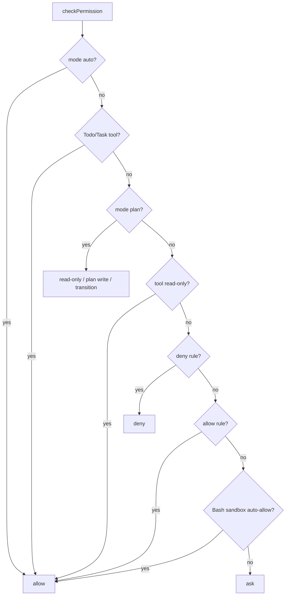

Sources: [src/permissions/permissions.ts:325-443](../../../project-repos/easy-agent/src/permissions/permissions.ts#L325-L443)

<details class="source-snippets">
<summary>引用源码</summary>

<!-- source-snippets:start -->

#### `src/permissions/permissions.ts:325-443`

```typescript
export async function checkPermission(params: PermissionCheckParams): Promise&lt;PermissionResponse&gt; {
  const settings = params.settings ?? (await loadPermissionSettings(params.cwd));
  const mode = params.mode ?? settings.mode;
  const sessionRules = params.sessionRules ?? { allow: [], deny: [] };
  const request: PermissionRequest = {
    toolName: params.tool.name,
    input: params.input,
    summary: summarizePermissionRequest(params.tool.name, params.input),
    risk: getRiskLabel(params.tool, params.input),
    ruleHint: buildPermissionRuleHint(params.tool.name, params.input),
  };

  if (mode === "auto") {
    return { behavior: "allow", reason: "auto mode allows all operations", request };
  }

  // TodoWrite and the Task V2 tools only mutate planning state — either
  // the in-memory todo list or the ~/.easy-agent/tasks directory — with
  // no filesystem or shell side effects on the user's workspace. They
  // never need user approval in any mode. This mirrors source code's
  // `shouldDefer: true` + `checkPermissions: () => allow` combo and
  // keeps these tools usable inside Plan Mode so the model can draft
  // and iterate on the plan itself.
  if (
    params.tool.name === "TodoWrite" ||
    params.tool.name === "TaskCreate" ||
    params.tool.name === "TaskUpdate" ||
    params.tool.name === "TaskGet" ||
    params.tool.name === "TaskList"
  ) {
    return { behavior: "allow", reason: `${params.tool.name} writes planning-only state`, request };
  }

  // Plan mode: allow read-only tools, plan mode tools, plan file writes; deny everything else
  if (mode === "plan") {
    if (PLAN_ALLOWED_TOOLS.has(params.tool.name)) {
      return { behavior: "allow", reason: "read-only tool allowed in plan mode", request };
    }
    if (params.tool.name === "EnterPlanMode" || params.tool.name === "ExitPlanMode") {
      return { behavior: "ask", reason: "plan mode transition requires confirmation", request };
    }
    if (params.tool.name === "Bash") {
      const command = extractBashCommand(params.input);
      if (isReadOnlyCommand(command)) {
        return { behavior: "allow", reason: "read-only shell command allowed in plan mode", request };
      }
      return { behavior: "deny", reason: "plan mode blocks non-read-only Bash commands", request };
    }
    // Allow writing to the plan file
    if (params.tool.name === "Write") {
      const filePath = typeof params.input.file_path === "string" ? params.input.file_path : "";
      const planPath = getPlanFilePath();
      if (filePath && path.resolve(filePath) === path.resolve(planPath)) {
        return { behavior: "allow", reason: "writing to plan file is allowed in plan mode", request };
      }
    }
    return { behavior: "deny", reason: `plan mode blocks ${params.tool.name}`, request };
  }

  // EnterPlanMode always requires user approval
  if (params.tool.name === "EnterPlanMode") {
    return { behavior: "ask", reason: "entering plan mode requires confirmation", request };
  }

  if (params.tool.name === "Bash") {
    const command = extractBashCommand(params.input);
    if (isReadOnlyCommand(command)) {
      return { behavior: "allow", reason: "read-only shell command", request };
    }
  } else if (params.tool.isReadOnly()) {
    return { behavior: "allow", reason: "read-only tool", request };
  }

  if (matchesAnyRule(sessionRules.deny, params.tool.name, params.input) || matchesAnyRule(settings.deny, params.tool.name, params.input)) {
    return { behavior: "deny", reason: "matched deny rule", request };
  }

  if (matchesAnyRule(sessionRules.allow, params.tool.name, params.input) || matchesAnyRule(settings.allow, params.tool.name, params.input)) {
    return { behavior: "allow", reason: "matched allow rule", request };
  }

  // Sandbox auto-allow gate. If the user has the sandbox on AND policy
  // says "auto-allow when sandboxed", we skip the confirmation dialog
  // for Bash — but only after running per-subcommand deny checks. The
  // sandbox is the ultimate safety net; explicit deny rules still apply.
  if (params.tool.name === "Bash") {
    const command = extractBashCommand(params.input);
    let sandboxSettings;
    try {
      sandboxSettings = await loadSandboxSettings(params.cwd);
    } catch {
      sandboxSettings = null;
    }
    if (
      sandboxSettings?.enabled &&
      sandboxSettings.autoAllowBashIfSandboxed &&
      shouldUseSandbox(
        {
          command,
          dangerouslyDisableSandbox:
            params.input.dangerouslyDisableSandbox === true,
        },
        sandboxSettings,
      )
    ) {
      const decision = checkSandboxAutoAllow(
        command,
        { allow: settings.allow, deny: settings.deny },
        sessionRules,
      );
      return { behavior: decision.behavior, reason: decision.reason, request };
    }
  }

  if (params.tool.name === "Bash" && isDangerousBashCommand(extractBashCommand(params.input))) {
    return { behavior: "ask", reason: "dangerous shell command requires confirmation", request };
  }

  return { behavior: "ask", reason: "operation requires confirmation", request };
```

<!-- source-snippets:end -->
</details>

## 相关页面

- [Sandbox 与安全边界](sandbox-security.md)
- [MCP 集成](mcp-integration.md)
- [QueryEngine 与 Agentic Loop](query-engine-agentic-loop.md)

---

<details>
<summary>相关源文件</summary>

生成本页时使用的主要源文件：

- [src/services/mcp/config.ts](../../../project-repos/easy-agent/src/services/mcp/config.ts)
- [src/services/mcp/bootstrap.ts](../../../project-repos/easy-agent/src/services/mcp/bootstrap.ts)
- [src/services/mcp/client.ts](../../../project-repos/easy-agent/src/services/mcp/client.ts)
- [src/services/mcp/fetchTools.ts](../../../project-repos/easy-agent/src/services/mcp/fetchTools.ts)
- [src/services/mcp/registry.ts](../../../project-repos/easy-agent/src/services/mcp/registry.ts)
- [src/services/mcp/mcpStringUtils.ts](../../../project-repos/easy-agent/src/services/mcp/mcpStringUtils.ts)
- [src/services/mcp/normalization.ts](../../../project-repos/easy-agent/src/services/mcp/normalization.ts)
- [src/types/mcp.ts](../../../project-repos/easy-agent/src/types/mcp.ts)
- [src/scripts/test-mcp.ts](../../../project-repos/easy-agent/src/scripts/test-mcp.ts)

</details>

# MCP 集成

MCP 子系统把 user/project `settings.json` 中的 `mcpServers` 读入、校验并连接，然后把每个 MCP tool 适配成本地 `Tool`。这些工具最终和内置工具一起进入 `tools/index.ts` 的全局工具注册表。  
Sources: [src/services/mcp/config.ts:1-14](../../../project-repos/easy-agent/src/services/mcp/config.ts#L1-L14), [src/services/mcp/bootstrap.ts:1-15](../../../project-repos/easy-agent/src/services/mcp/bootstrap.ts#L1-L15), [src/services/mcp/fetchTools.ts:1-18](../../../project-repos/easy-agent/src/services/mcp/fetchTools.ts#L1-L18), [src/tools/index.ts:48-65](../../../project-repos/easy-agent/src/tools/index.ts#L48-L65)

<details class="source-snippets">
<summary>引用源码</summary>

<!-- source-snippets:start -->

#### `src/services/mcp/config.ts:1-14`

```typescript
/**
 * MCP configuration loading.
 *
 * Reference: claude-code-source-code/src/services/mcp/config.ts (1500+ lines).
 *
 * The source supports user/project/local/enterprise/managed/dynamic/claudeai
 * scopes plus per-server policy filtering. Easy Agent only needs two scopes:
 *   1. user:    ~/.easy-agent/settings.json
 *   2. project: &lt;cwd&gt;/.easy-agent/settings.json
 * with project overriding user (same as existing permission settings).
 *
 * The `mcpServers` field lives inside the existing settings.json so users
 * don't have to learn a second config file.
 */
```

#### `src/services/mcp/bootstrap.ts:1-15`

```typescript
/**
 * MCP startup orchestration.
 *
 * Called once from the CLI entrypoint before the React UI mounts. This is
 * the equivalent of the source's `prefetchAllMcpResources` /
 * `getMcpToolsCommandsAndResources` (client.ts:2228+) — minus the React
 * Hook lifecycle, since Easy Agent doesn't yet need live reconnection.
 *
 * Flow:
 *   1. Load + validate `mcpServers` from settings.json
 *   2. Spawn every server in parallel (Promise.allSettled)
 *   3. For each connected server, fetch its tools/list
 *   4. Register the flat tool array into the global registry
 *   5. Install a SIGINT/SIGTERM cleanup hook so child procs don't leak
 */
```

#### `src/services/mcp/fetchTools.ts:1-18`

```typescript
/**
 * MCP tool discovery + adapter to the local Tool interface.
 *
 * Reference: claude-code-source-code/src/services/mcp/client.ts:1745-2000
 * (`fetchToolsForClient`).
 *
 * What this does, in three steps:
 *   1. Ask the server `tools/list` (skipped if it didn't declare the
 *      `tools` capability)
 *   2. For each MCP tool, build a local `Tool` whose `call()` forwards to
 *      `client.request({ method: 'tools/call' })`
 *   3. Stamp the local Tool with a `mcp__<server>__<tool>` name so the
 *      Anthropic API + permission system can route it back here unambiguously
 *
 * The source's adapter is ~250 lines because it juggles progress events,
 * URL elicitation retries, image persistence, structured content, and
 * session-expired retries. We keep just the data path.
 */
```

#### `src/tools/index.ts:48-65`

```typescript
let mcpTools: Tool[] = [];

/**
 * Replace the registry of MCP-provided tools. Called once at startup after
 * connecting to all MCP servers, and again after `/mcp reconnect`.
 */
export function registerMcpTools(tools: Tool[]): void {
  mcpTools = [...tools];
}

/** Drop the MCP-provided tools — used before re-registering after reconnect. */
export function clearMcpTools(): void {
  mcpTools = [];
}

export function getAllTools(): Tool[] {
  return [...BUILTIN_TOOLS, ...mcpTools].filter((tool) => tool.isEnabled());
}
```

<!-- source-snippets:end -->
</details>

## 配置模型

Easy Agent 支持三种 MCP transport：`stdio`、`http`、`sse`。stdio 的 `type` 可省略；HTTP/SSE 使用 `url` 和可选 static headers；OAuth、WebSocket、IDE transport 等在当前阶段明确不实现。  
Sources: [src/types/mcp.ts:1-12](../../../project-repos/easy-agent/src/types/mcp.ts#L1-L12), [src/types/mcp.ts:18-60](../../../project-repos/easy-agent/src/types/mcp.ts#L18-L60)

<details class="source-snippets">
<summary>引用源码</summary>

<!-- source-snippets:start -->

#### `src/types/mcp.ts:1-12`

```typescript
/**
 * MCP (Model Context Protocol) types — Stage 16.
 *
 * Reference: claude-code-source-code/src/services/mcp/types.ts
 *
 * The source supports 8 transport types (stdio/sse/http/ws/sse-ide/ws-ide/sdk/
 * claudeai-proxy). Easy Agent supports the three that cover the public MCP
 * ecosystem: `stdio` (local subprocess), `http` (Streamable HTTP), and `sse`
 * (legacy SSE-only servers). WebSocket / IDE / SDK / Claude.ai proxy stay
 * out of scope (§16.9). OAuth is also deferred — remote servers can still
 * pass static `headers` (e.g. a bearer token) for simple authenticated use.
 */
```

#### `src/types/mcp.ts:18-60`

```typescript
/**
 * stdio MCP server configuration. The `type` field is optional for backwards
 * compatibility with the de-facto standard `mcpServers` shape used by the
 * MCP ecosystem (Claude Desktop, Cursor, etc.) — when missing, we treat the
 * config as stdio.
 */
export interface McpStdioServerConfig {
  type?: "stdio";
  command: string;
  args?: string[];
  env?: Record&lt;string, string&gt;;
}

/**
 * Streamable HTTP MCP server (the recommended remote transport).
 *
 * Equivalent to source's `McpHTTPServerConfigSchema`. We intentionally don't
 * accept the source's `oauth` / `headersHelper` fields — for Easy Agent §16,
 * `headers` (a static string→string map) is enough to support bearer-token
 * APIs like `Authorization: Bearer <token>`.
 */
export interface McpHTTPServerConfig {
  type: "http";
  url: string;
  headers?: Record&lt;string, string&gt;;
}

/**
 * Legacy SSE MCP server. Many older MCP servers (and most of the public
 * `@modelcontextprotocol/server-*` packages from before Streamable HTTP
 * landed) speak this. The transport opens one long-lived GET that streams
 * server→client messages and POSTs each client→server JSON-RPC envelope.
 */
export interface McpSSEServerConfig {
  type: "sse";
  url: string;
  headers?: Record&lt;string, string&gt;;
}

export type McpServerConfig =
  | McpStdioServerConfig
  | McpHTTPServerConfig
  | McpSSEServerConfig;
```

<!-- source-snippets:end -->
</details>

配置从 `~/.easy-agent/settings.json` 和 `<cwd>/.easy-agent/settings.json` 读取，project 同名 server 覆盖 user。每个 server 独立校验，失败项被丢弃并记录 warning，但不会让整个 CLI 启动失败。  
Sources: [src/services/mcp/config.ts:136-188](../../../project-repos/easy-agent/src/services/mcp/config.ts#L136-L188)

<details class="source-snippets">
<summary>引用源码</summary>

<!-- source-snippets:start -->

#### `src/services/mcp/config.ts:136-188`

```typescript
function extractScopedServers(
  raw: RawSettings | null,
  scope: "user" | "project",
  filePath: string,
  errors: string[],
): Record&lt;string, ScopedMcpServerConfig&gt; {
  if (!raw || raw.mcpServers === undefined) return {};
  if (typeof raw.mcpServers !== "object" || raw.mcpServers === null || Array.isArray(raw.mcpServers)) {
    errors.push(`${filePath}: 'mcpServers' must be an object`);
    return {};
  }
  const out: Record&lt;string, ScopedMcpServerConfig&gt; = {};
  for (const [name, rawConfig] of Object.entries(raw.mcpServers as Record&lt;string, unknown&gt;)) {
    const result = validateServerConfig(name, rawConfig, scope);
    if (!result.ok) {
      errors.push(result.error);
      continue;
    }
    out[name] = { ...result.value, scope };
  }
  return out;
}

/**
 * Load MCP server configurations from user + project settings.
 *
 * Project overrides user on name conflicts. Servers that fail schema
 * validation are dropped with a warning — never throws (mirrors the source's
 * "best-effort" loading approach so a single malformed entry can't take the
 * whole CLI down).
 */
export async function loadMcpConfigs(cwd: string): Promise&lt;McpConfigLoadResult&gt; {
  const { user: userPath, project: projectPath } = getSettingsPaths(cwd);

  const errors: string[] = [];
  const [userFile, projectFile] = await Promise.all([
    readJsonSettingsFile&lt;RawSettings&gt;(userPath),
    readJsonSettingsFile&lt;RawSettings&gt;(projectPath),
  ]);
  if (userFile.parseError) errors.push(userFile.parseError);
  if (projectFile.parseError) errors.push(projectFile.parseError);

  const userServers = extractScopedServers(userFile.raw, "user", userPath, errors);
  const projectServers = extractScopedServers(projectFile.raw, "project", projectPath, errors);

  // Project overrides user — Object.assign right-wins
  const servers: Record&lt;string, ScopedMcpServerConfig&gt; = { ...userServers, ...projectServers };

  for (const error of errors) {
    logWarn(`[mcp] config: ${error}`);
  }
  return { servers, errors };
}
```

<!-- source-snippets:end -->
</details>

## 启动流程

`bootstrapMcp()` 先加载配置并注册 cleanup hook，然后清空 registry。关键点是它会在任何 IO 之前把每个 server 注册成 `pending`，让 `/mcp` 在慢启动期间也能显示真实意图状态；随后并行连接各 server，成功后拉取工具并刷新全局工具注册表。  
Sources: [src/services/mcp/bootstrap.ts:41-80](../../../project-repos/easy-agent/src/services/mcp/bootstrap.ts#L41-L80), [src/services/mcp/bootstrap.ts:99-121](../../../project-repos/easy-agent/src/services/mcp/bootstrap.ts#L99-L121)

<details class="source-snippets">
<summary>引用源码</summary>

<!-- source-snippets:start -->

#### `src/services/mcp/bootstrap.ts:41-80`

```typescript
/**
 * Asynchronously bring up every configured MCP server WITHOUT blocking
 * the caller longer than necessary.
 *
 * Behavior contract:
 *   - On entry: every configured server is immediately registered as
 *     `{ type: 'pending' }` so `/mcp` shows accurate state from t=0.
 *   - Each server connects in parallel via `Promise.allSettled`, and the
 *     registry entry is REPLACED atomically when the connection resolves
 *     (or fails / times out via the per-server timeout in client.ts).
 *   - Whenever the registry changes, the global Tool registry is refreshed
 *     so `getAllTools()` includes any newly available MCP tools on the
 *     next call.
 *   - The returned promise only resolves after EVERY server has reached
 *     a terminal state; it's safe to ignore (`void bootstrapMcp(...)`)
 *     when you want non-blocking startup — just like Claude Code's
 *     `prefetchAllMcpResources` running inside a useEffect.
 */
export async function bootstrapMcp(cwd: string): Promise&lt;McpBootstrapResult&gt; {
  const { servers, errors: configErrors } = await loadMcpConfigs(cwd);
  registerMcpProcessCleanup();
  clearMcpRegistry();

  // Seed `pending` placeholders BEFORE any IO. This is the key change that
  // lets the UI render immediately and `/mcp` show "connecting" servers
  // instead of "0 configured" during a cold `npx -y` install.
  const startedAt = Date.now();
  for (const [name, config] of Object.entries(servers)) {
    const placeholder: PendingMcpServer = { name, type: "pending", config, startedAt };
    setMcpRegistryEntry(name, placeholder, []);
  }
  refreshGlobalToolRegistry();

  // Now connect each server in parallel. Each one independently updates
  // the registry as it resolves, so MCP tools become available
  // incrementally — slow servers don't block fast ones.
  const tasks = Object.entries(servers).map(([name, config]) =>
    connectAndRegister(name, config),
  );
  const settled = await Promise.allSettled(tasks);
```

#### `src/services/mcp/bootstrap.ts:99-121`

```typescript
async function connectAndRegister(
  name: string,
  config: PendingMcpServer["config"],
): Promise&lt;{ connection: McpServerConnection; toolCount: number }&gt; {
  const connection = await connectToServer(name, config);
  let tools: Awaited&lt;ReturnType&lt;typeof fetchToolsForConnection&gt;&gt; = [];
  if (connection.type === "connected") {
    try {
      tools = await fetchToolsForConnection(connection);
    } catch (error) {
      debugLog("mcp", `[${name}] tools/list failed after connect: ${(error as Error).message}`);
    }
  }
  setMcpRegistryEntry(name, connection, tools);
  refreshGlobalToolRegistry();
  return { connection, toolCount: tools.length };
}

/** Flatten every registered MCP server's tools and push them to the global Tool registry. */
function refreshGlobalToolRegistry(): void {
  const allTools = getMcpRegistry().flatMap((entry) => entry.tools);
  registerMcpTools(allTools);
}
```

<!-- source-snippets:end -->
</details>

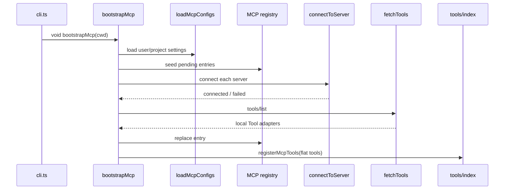

Sources: [src/entrypoint/cli.ts:113-127](../../../project-repos/easy-agent/src/entrypoint/cli.ts#L113-L127), [src/services/mcp/bootstrap.ts:59-121](../../../project-repos/easy-agent/src/services/mcp/bootstrap.ts#L59-L121)

<details class="source-snippets">
<summary>引用源码</summary>

<!-- source-snippets:start -->

#### `src/entrypoint/cli.ts:113-127`

```typescript
  // Kick off MCP server connections IN THE BACKGROUND. The bootstrap
  // function seeds `pending` registry entries synchronously, then connects
  // each server in parallel — a slow `npx -y @mcp/server-foo` cold-start
  // (which can take 10–30s on first run while npm downloads the package)
  // would otherwise leave the terminal black, because we wouldn't render
  // the UI until it returned.
  //
  // Trade-off: if the user submits a query before MCP tools land, the
  // model just doesn't see them yet. They'll appear on the next turn.
  // This matches Claude Code's behavior — its `prefetchAllMcpResources`
  // runs inside `useManageMCPConnections` (a React useEffect), so the
  // REPL is interactive from frame 1 too.
  void bootstrapMcp(process.cwd()).catch((error) => {
    console.error(`[easy-agent] MCP bootstrap failed: ${(error as Error).message}`);
  });
```

#### `src/services/mcp/bootstrap.ts:59-121`

```typescript
export async function bootstrapMcp(cwd: string): Promise&lt;McpBootstrapResult&gt; {
  const { servers, errors: configErrors } = await loadMcpConfigs(cwd);
  registerMcpProcessCleanup();
  clearMcpRegistry();

  // Seed `pending` placeholders BEFORE any IO. This is the key change that
  // lets the UI render immediately and `/mcp` show "connecting" servers
  // instead of "0 configured" during a cold `npx -y` install.
  const startedAt = Date.now();
  for (const [name, config] of Object.entries(servers)) {
    const placeholder: PendingMcpServer = { name, type: "pending", config, startedAt };
    setMcpRegistryEntry(name, placeholder, []);
  }
  refreshGlobalToolRegistry();

  // Now connect each server in parallel. Each one independently updates
  // the registry as it resolves, so MCP tools become available
  // incrementally — slow servers don't block fast ones.
  const tasks = Object.entries(servers).map(([name, config]) =>
    connectAndRegister(name, config),
  );
  const settled = await Promise.allSettled(tasks);

  const connections: McpServerConnection[] = [];
  let toolCount = 0;
  for (let i = 0; i < settled.length; i++) {
    const res = settled[i];
    const name = Object.keys(servers)[i];
    if (res.status === "fulfilled") {
      connections.push(res.value.connection);
      toolCount += res.value.toolCount;
    } else {
      const failed = getMcpRegistryEntry(name)?.connection;
      if (failed) connections.push(failed);
    }
  }

  return { connections, toolCount, configErrors };
}

async function connectAndRegister(
  name: string,
  config: PendingMcpServer["config"],
): Promise&lt;{ connection: McpServerConnection; toolCount: number }&gt; {
  const connection = await connectToServer(name, config);
  let tools: Awaited&lt;ReturnType&lt;typeof fetchToolsForConnection&gt;&gt; = [];
  if (connection.type === "connected") {
    try {
      tools = await fetchToolsForConnection(connection);
    } catch (error) {
      debugLog("mcp", `[${name}] tools/list failed after connect: ${(error as Error).message}`);
    }
  }
  setMcpRegistryEntry(name, connection, tools);
  refreshGlobalToolRegistry();
  return { connection, toolCount: tools.length };
}

/** Flatten every registered MCP server's tools and push them to the global Tool registry. */
function refreshGlobalToolRegistry(): void {
  const allTools = getMcpRegistry().flatMap((entry) => entry.tools);
  registerMcpTools(allTools);
}
```

<!-- source-snippets:end -->
</details>

## 连接层

`connectToServer()` 用 server name + transport-specific config 作为 cache key，同一配置的并发连接共享 promise。stdio transport 会继承父进程 env 并叠加 server env，stderr 被 pipe 缓冲；HTTP transport 设置 User-Agent 和 headers；SSE transport 分别给 POST 和长连接 GET 设置 headers。连接有默认 30 秒超时。  
Sources: [src/services/mcp/client.ts:36-72](../../../project-repos/easy-agent/src/services/mcp/client.ts#L36-L72), [src/services/mcp/client.ts:131-157](../../../project-repos/easy-agent/src/services/mcp/client.ts#L131-L157), [src/services/mcp/client.ts:182-271](../../../project-repos/easy-agent/src/services/mcp/client.ts#L182-L271), [src/services/mcp/client.ts:310-335](../../../project-repos/easy-agent/src/services/mcp/client.ts#L310-L335)

<details class="source-snippets">
<summary>引用源码</summary>

<!-- source-snippets:start -->

#### `src/services/mcp/client.ts:36-72`

```typescript
const CONNECT_TIMEOUT_MS = 30_000;

function getConnectTimeoutMs(): number {
  const env = parseInt(process.env.MCP_CONNECT_TIMEOUT || "", 10);
  return Number.isFinite(env) && env > 0 ? env : CONNECT_TIMEOUT_MS;
}

// ─── Connection cache ────────────────────────────────────────────────

/**
 * Cache key includes the full config so a `/mcp reconnect` after editing
 * settings.json picks up the new command/args. Same as the source's
 * `getServerCacheKey(name, JSON.stringify(config))` pattern.
 */
function getCacheKey(name: string, config: ScopedMcpServerConfig): string {
  // Stringify the entire transport-specific config so that *any* edit
  // (command, args, env, url, headers, type-switch) yields a fresh cache
  // entry on next `connectToServer`. Order matters for stable hashing —
  // we list the fields explicitly per transport rather than JSON-stringify
  // the whole object to avoid spuriously busting the cache when scope
  // metadata (which doesn't affect the connection) changes.
  if (config.type === "http" || config.type === "sse") {
    return ${name}:${JSON.stringify({
      type: config.type,
      url: config.url,
      headers: config.headers,
    })};
  }
  return ${name}:${JSON.stringify({
    type: "stdio",
    command: config.command,
    args: config.args,
    env: config.env,
  })};
}

const connectionCache = new Map&lt;string, Promise&lt;McpServerConnection&gt;&gt;();
```

#### `src/services/mcp/client.ts:131-157`

```typescript
/**
 * Connect to a single MCP server. Cached per (name + config) — concurrent
 * callers share the same in-flight Promise. Failures are also cached briefly
 * but are dropped from `activeConnections`, so a follow-up `/mcp reconnect`
 * still triggers a real retry by clearing the cache key first.
 */
export function connectToServer(
  name: string,
  config: ScopedMcpServerConfig,
): Promise&lt;McpServerConnection&gt; {
  const key = getCacheKey(name, config);
  const cached = connectionCache.get(key);
  if (cached) return cached;

  const promise = doConnect(name, config);
  connectionCache.set(key, promise);

  // If the connection ultimately resolves to a `connected` server, register
  // it for shutdown cleanup. Failed/disabled placeholders don't need cleanup.
  void promise.then((conn) => {
    if (conn.type === "connected") {
      activeConnections.set(name, conn);
    }
  });

  return promise;
}
```

#### `src/services/mcp/client.ts:182-271`

```typescript
function createStdioTransport(
  name: string,
  config: import("../../types/mcp.js").McpStdioServerConfig & { scope: string },
): TransportBundle {
  const transport = new StdioClientTransport({
    command: config.command,
    args: config.args ?? [],
    env: {
      // Inherit parent env first, then layer per-server overrides.
      ...(process.env as Record&lt;string, string&gt;),
      ...(config.env ?? {}),
    },
    stderr: "pipe", // keep server stderr off our terminal UI
  });

  let stderrBuf = "";
  if (transport.stderr) {
    transport.stderr.on("data", (chunk: Buffer) => {
      if (stderrBuf.length < 64 * 1024) {
        stderrBuf += chunk.toString();
      }
    });
  }

  return {
    transport,
    describe: `stdio: ${config.command} ${(config.args ?? []).join(" ")}`.trim(),
    collectStderrTail: () => stderrBuf,
    preCleanup: async () => {
      const pid: number | undefined = (transport as { pid?: number }).pid;
      await escalatedKill(name, pid);
    },
  };
}

function createHttpTransport(config: McpHTTPServerConfig & { scope: string }): TransportBundle {
  // Match the source's StreamableHTTPClientTransport options: requestInit
  // (headers + UA) flows into every POST. We DO NOT pass an authProvider;
  // OAuth is §16.9 deferred. If the server returns 401 we surface it as a
  // connection failure with the response body so users can fix their token.
  const transport = new StreamableHTTPClientTransport(new URL(config.url), {
    requestInit: {
      headers: {
        "User-Agent": "easy-agent/0.1.0",
        ...(config.headers ?? {}),
      },
    },
  });
  return {
    transport,
    describe: `http: ${config.url}`,
    collectStderrTail: () => "",
    preCleanup: async () => { /* http: client.close() handles it */ },
  };
}

function createSseTransport(config: McpSSEServerConfig & { scope: string }): TransportBundle {
  // SSE has TWO request paths and headers must be supplied to BOTH:
  //   1. requestInit  → POSTs (every JSON-RPC envelope sent client→server)
  //   2. eventSourceInit → the long-lived GET that streams server→client
  //
  // The source code (client.ts:644-672) is explicit that the eventSourceInit
  // fetch must NOT inherit any timeout wrapper, otherwise the SSE stream
  // dies after 60s. We don't have a timeout wrapper to begin with, so we
  // just ensure both header sets are present.
  const headers = {
    "User-Agent": "easy-agent/0.1.0",
    ...(config.headers ?? {}),
  };
  const transport = new SSEClientTransport(new URL(config.url), {
    requestInit: { headers },
    eventSourceInit: {
      fetch: (url, init) =>
        fetch(url, {
          ...init,
          headers: {
            ...(init?.headers as Record&lt;string, string&gt; | undefined),
            ...headers,
            Accept: "text/event-stream",
          },
        }),
    },
  });
  return {
    transport,
    describe: `sse: ${config.url}`,
    collectStderrTail: () => "",
    preCleanup: async () => { /* sse: client.close() handles it */ },
  };
}
```

#### `src/services/mcp/client.ts:310-335`

```typescript
  const connectPromise = client.connect(bundle.transport);
  const timeoutMs = getConnectTimeoutMs();

  let timeoutHandle: ReturnType&lt;typeof setTimeout&gt; | undefined;
  const timeoutPromise = new Promise&lt;never&gt;((_resolve, reject) => {
    timeoutHandle = setTimeout(() => {
      reject(new Error(`MCP server '${name}' connection timed out after ${timeoutMs}ms`));
    }, timeoutMs);
  });

  try {
    await Promise.race([connectPromise, timeoutPromise]);
  } catch (error) {
    if (timeoutHandle) clearTimeout(timeoutHandle);
    const errMsg = (error as Error).message;
    const stderrTail = bundle.collectStderrTail();
    const detail = stderrTail ? `${errMsg} (stderr: ${stderrTail.slice(0, 200).trim()})` : errMsg;
    logWarn(`MCP server '${name}' failed to connect: ${detail}`);
    try {
      await bundle.transport.close();
    } catch {
      /* best-effort */
    }
    return { name, type: "failed", config, error: detail };
  }
  if (timeoutHandle) clearTimeout(timeoutHandle);
```

<!-- source-snippets:end -->
</details>

连接成功后会读取 server capabilities 和 server version，并返回带 cleanup 的 `ConnectedMcpServer`。cleanup 对 stdio 会先做 SIGINT/SIGTERM/SIGKILL 分级清理，然后关闭 SDK client。  
Sources: [src/services/mcp/client.ts:337-367](../../../project-repos/easy-agent/src/services/mcp/client.ts#L337-L367), [src/services/mcp/client.ts:83-127](../../../project-repos/easy-agent/src/services/mcp/client.ts#L83-L127)

<details class="source-snippets">
<summary>引用源码</summary>

<!-- source-snippets:start -->

#### `src/services/mcp/client.ts:337-367`

```typescript
  const capabilities = client.getServerCapabilities();
  const serverVersion = client.getServerVersion();
  debugLog(
    "mcp",
    [${name}] connected via ${bundle.describe} (server=${serverVersion?.name ?? "?"} v${serverVersion?.version ?? "?"} caps=${JSON.stringify({
      tools: !!capabilities?.tools,
      resources: !!capabilities?.resources,
      prompts: !!capabilities?.prompts,
    })}),
  );

  const cleanup = async (): Promise&lt;void&gt; => {
    activeConnections.delete(name);
    await bundle.preCleanup();
    try {
      await client.close();
    } catch (error) {
      debugLog("mcp", `[${name}] client.close error: ${(error as Error).message}`);
    }
  };

  return {
    name,
    type: "connected",
    client,
    capabilities,
    serverInfo: serverVersion ? { name: serverVersion.name ?? name, version: serverVersion.version ?? "?" } : undefined,
    config,
    cleanup,
  };
}
```

#### `src/services/mcp/client.ts:83-127`

```typescript
/**
 * Stdio cleanup escalation: SIGINT (100ms) → SIGTERM (400ms) → SIGKILL.
 * Total cap ~500ms so CLI exit isn't held up by a misbehaving server.
 *
 * Direct port of source code's escalation strategy
 * (client.ts:1431-1559) but flattened — no need for the resolved/timer
 * juggling because we await inline.
 */
async function escalatedKill(name: string, pid: number | undefined): Promise&lt;void&gt; {
  if (!pid) return;
  const aliveCheck = (): boolean => {
    try {
      // signal 0 = "is the process still alive?"
      process.kill(pid, 0);
      return true;
    } catch {
      return false;
    }
  };

  try {
    process.kill(pid, "SIGINT");
  } catch (error) {
    debugLog("mcp", `[${name}] SIGINT failed: ${(error as Error).message}`);
    return;
  }
  await sleep(100);
  if (!aliveCheck()) return;

  debugLog("mcp", `[${name}] SIGINT didn't exit; sending SIGTERM`);
  try {
    process.kill(pid, "SIGTERM");
  } catch {
    return;
  }
  await sleep(400);
  if (!aliveCheck()) return;

  debugLog("mcp", `[${name}] SIGTERM didn't exit; sending SIGKILL`);
  try {
    process.kill(pid, "SIGKILL");
  } catch {
    /* already dead */
  }
}
```

<!-- source-snippets:end -->
</details>

## 工具适配

`fetchToolsForConnection()` 只在 server 声明 `tools` capability 时调用 `tools/list`。每个 MCP tool 会变成本地 `Tool`：name 形如 `mcp__<server>__<tool>`，description 最多 2048 字符，input schema 透传，`annotations.readOnlyHint` 映射到 `isReadOnly()`。  
Sources: [src/services/mcp/fetchTools.ts:34-40](../../../project-repos/easy-agent/src/services/mcp/fetchTools.ts#L34-L40), [src/services/mcp/fetchTools.ts:73-127](../../../project-repos/easy-agent/src/services/mcp/fetchTools.ts#L73-L127), [src/services/mcp/fetchTools.ts:129-165](../../../project-repos/easy-agent/src/services/mcp/fetchTools.ts#L129-L165)

<details class="source-snippets">
<summary>引用源码</summary>

<!-- source-snippets:start -->

#### `src/services/mcp/fetchTools.ts:34-40`

```typescript
/**
 * MCP tool descriptions can blow up to 60 KB on OpenAPI-derived servers.
 * Cap at 2048 chars to keep the system prompt sane (same value as source).
 */
const MAX_MCP_DESCRIPTION_LENGTH = 2048;

/** Map MCP `CallToolResult.content[]` blocks to a single string for our Tool result. */
```

#### `src/services/mcp/fetchTools.ts:73-127`

```typescript
/**
 * Build a local `Tool` from a single MCP tool descriptor.
 *
 * Key field mappings (mirroring the source code):
 *   tool.annotations.readOnlyHint  → isReadOnly()       (gates Plan-mode visibility)
 *   tool.annotations.destructiveHint → (used by source for risk labels — not yet here)
 *   tool.inputSchema               → inputSchema        (passed through to API)
 *   tool.description (≤2048 chars) → description
 */
function buildToolAdapter(connection: ConnectedMcpServer, mcpTool: McpTool): Tool {
  const fullName = buildMcpToolName(connection.name, mcpTool.name);
  const description = truncateDescription(mcpTool.description);
  const isReadOnly = mcpTool.annotations?.readOnlyHint ?? false;

  // The MCP SDK ships JSON Schema, which is the same shape Anthropic's API
  // expects. We `as` it to satisfy the local typedef but it's effectively
  // identical at runtime.
  const inputSchema = (mcpTool.inputSchema ?? {
    type: "object",
    properties: {},
  }) as Tool["inputSchema"];

  return {
    name: fullName,
    description,
    inputSchema,
    isReadOnly: () => isReadOnly,
    isEnabled: () => true,
    async call(rawInput: Record&lt;string, unknown&gt;, _context: ToolContext): Promise&lt;ToolResult&gt; {
      try {
        const result = await connection.client.request(
          {
            method: "tools/call",
            params: {
              name: mcpTool.name, // server expects its OWN name, not the prefixed alias
              arguments: rawInput,
            },
          },
          CallToolResultSchema,
        );
        const content = stringifyMcpContent(result.content as CallToolResult["content"]);
        return {
          content,
          isError: result.isError === true,
        };
      } catch (error) {
        const message = error instanceof Error ? error.message : String(error);
        return {
          content: `MCP tool '${fullName}' failed: ${message}`,
          isError: true,
        };
      }
    },
  };
}
```

#### `src/services/mcp/fetchTools.ts:129-165`

```typescript
/**
 * Pull the tool list from a connected MCP server and adapt each entry into
 * our local Tool interface. Returns `[]` if the server doesn't declare the
 * `tools` capability or if the request fails (logged).
 */
export async function fetchToolsForConnection(
  connection: ConnectedMcpServer,
): Promise&lt;Tool[]&gt; {
  if (!connection.capabilities?.tools) {
    debugLog("mcp", `[${connection.name}] no 'tools' capability declared, skipping tools/list`);
    return [];
  }

  let result: ListToolsResult;
  try {
    result = (await connection.client.request(
      { method: "tools/list" },
      ListToolsResultSchema,
    )) as ListToolsResult;
  } catch (error) {
    logWarn(`MCP server '${connection.name}' tools/list failed: ${(error as Error).message}`);
    return [];
  }

  const tools: Tool[] = [];
  for (const mcpTool of result.tools) {
    try {
      tools.push(buildToolAdapter(connection, mcpTool));
    } catch (error) {
      logWarn(
        `MCP tool '${connection.name}.${mcpTool.name}' failed schema adaptation: ${(error as Error).message}`,
      );
    }
  }
  debugLog("mcp", `[${connection.name}] discovered ${tools.length} tool(s)`);
  return tools;
}
```

<!-- source-snippets:end -->
</details>

MCP tool 调用时，本地工具会把 prefixed name 还原成 server 自己的 tool name 发给 `tools/call`；返回内容统一 stringify 成文本。图片当前只转成占位描述，resource 优先使用 text。  
Sources: [src/services/mcp/fetchTools.ts:40-65](../../../project-repos/easy-agent/src/services/mcp/fetchTools.ts#L40-L65), [src/services/mcp/fetchTools.ts:101-124](../../../project-repos/easy-agent/src/services/mcp/fetchTools.ts#L101-L124)

<details class="source-snippets">
<summary>引用源码</summary>

<!-- source-snippets:start -->

#### `src/services/mcp/fetchTools.ts:40-65`

```typescript
/** Map MCP `CallToolResult.content[]` blocks to a single string for our Tool result. */
function stringifyMcpContent(content: CallToolResult["content"]): string {
  if (!Array.isArray(content)) return "";
  const parts: string[] = [];
  for (const block of content) {
    switch (block.type) {
      case "text":
        parts.push(block.text);
        break;
      case "image":
        // Source code resizes + persists the image to disk and returns a
        // path. For Stage 16 we just acknowledge it — image-aware tools
        // can be added later when we wire MCP into the model's vision input.
        parts.push(`[image: ${block.mimeType ?? "?"}, ${(block.data ?? "").length} base64 chars]`);
        break;
      case "resource": {
        const r = block.resource as { uri?: string; text?: string };
        parts.push(r?.text ?? `[resource: ${r?.uri ?? "<no uri>"}]`);
        break;
      }
      default:
        parts.push(`[${(block as { type?: string }).type ?? "unknown"} block]`);
    }
  }
  return parts.join("\n");
}
```

#### `src/services/mcp/fetchTools.ts:101-124`

```typescript
    async call(rawInput: Record&lt;string, unknown&gt;, _context: ToolContext): Promise&lt;ToolResult&gt; {
      try {
        const result = await connection.client.request(
          {
            method: "tools/call",
            params: {
              name: mcpTool.name, // server expects its OWN name, not the prefixed alias
              arguments: rawInput,
            },
          },
          CallToolResultSchema,
        );
        const content = stringifyMcpContent(result.content as CallToolResult["content"]);
        return {
          content,
          isError: result.isError === true,
        };
      } catch (error) {
        const message = error instanceof Error ? error.message : String(error);
        return {
          content: `MCP tool '${fullName}' failed: ${message}`,
          isError: true,
        };
      }
```

<!-- source-snippets:end -->
</details>

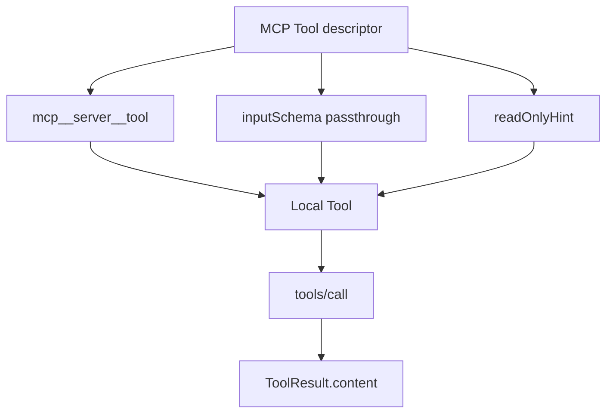

Sources: [src/services/mcp/mcpStringUtils.ts:13-36](../../../project-repos/easy-agent/src/services/mcp/mcpStringUtils.ts#L13-L36), [src/services/mcp/normalization.ts:12-14](../../../project-repos/easy-agent/src/services/mcp/normalization.ts#L12-L14), [src/services/mcp/fetchTools.ts:73-127](../../../project-repos/easy-agent/src/services/mcp/fetchTools.ts#L73-L127)

<details class="source-snippets">
<summary>引用源码</summary>

<!-- source-snippets:start -->

#### `src/services/mcp/mcpStringUtils.ts:13-36`

```typescript
/** Build the fully qualified MCP tool name. */
export function buildMcpToolName(serverName: string, toolName: string): string {
  return `mcp__${normalizeNameForMCP(serverName)}__${normalizeNameForMCP(toolName)}`;
}

/** Cheap predicate: does this look like an MCP-prefixed tool name? */
export function isMcpToolName(name: string): boolean {
  return name.startsWith("mcp__");
}

/**
 * Parse an MCP tool name back into server / tool components.
 * Returns null if the string isn't `mcp__server__tool`-shaped.
 */
export function parseMcpToolName(
  fullName: string,
): { serverName: string; toolName: string } | null {
  const parts = fullName.split("__");
  if (parts.length < 3 || parts[0] !== "mcp" || !parts[1]) return null;
  return {
    serverName: parts[1],
    toolName: parts.slice(2).join("__"),
  };
}
```

#### `src/services/mcp/normalization.ts:12-14`

```typescript
export function normalizeNameForMCP(name: string): string {
  return name.replace(/[^a-zA-Z0-9_-]/g, "_");
}
```

#### `src/services/mcp/fetchTools.ts:73-127`

```typescript
/**
 * Build a local `Tool` from a single MCP tool descriptor.
 *
 * Key field mappings (mirroring the source code):
 *   tool.annotations.readOnlyHint  → isReadOnly()       (gates Plan-mode visibility)
 *   tool.annotations.destructiveHint → (used by source for risk labels — not yet here)
 *   tool.inputSchema               → inputSchema        (passed through to API)
 *   tool.description (≤2048 chars) → description
 */
function buildToolAdapter(connection: ConnectedMcpServer, mcpTool: McpTool): Tool {
  const fullName = buildMcpToolName(connection.name, mcpTool.name);
  const description = truncateDescription(mcpTool.description);
  const isReadOnly = mcpTool.annotations?.readOnlyHint ?? false;

  // The MCP SDK ships JSON Schema, which is the same shape Anthropic's API
  // expects. We `as` it to satisfy the local typedef but it's effectively
  // identical at runtime.
  const inputSchema = (mcpTool.inputSchema ?? {
    type: "object",
    properties: {},
  }) as Tool["inputSchema"];

  return {
    name: fullName,
    description,
    inputSchema,
    isReadOnly: () => isReadOnly,
    isEnabled: () => true,
    async call(rawInput: Record&lt;string, unknown&gt;, _context: ToolContext): Promise&lt;ToolResult&gt; {
      try {
        const result = await connection.client.request(
          {
            method: "tools/call",
            params: {
              name: mcpTool.name, // server expects its OWN name, not the prefixed alias
              arguments: rawInput,
            },
          },
          CallToolResultSchema,
        );
        const content = stringifyMcpContent(result.content as CallToolResult["content"]);
        return {
          content,
          isError: result.isError === true,
        };
      } catch (error) {
        const message = error instanceof Error ? error.message : String(error);
        return {
          content: `MCP tool '${fullName}' failed: ${message}`,
          isError: true,
        };
      }
    },
  };
}
```

<!-- source-snippets:end -->
</details>

## `/mcp` 命令表面

`QueryEngine` 的 `/mcp` 命令可以列出所有 server 的 connected/failed/pending/disabled 状态，展示某个 server 的工具，或者 reconnect 单个 server。Reconnect 会清 cache、删 registry entry、重新连接、重新拉取工具并刷新全局 tool registry。  
Sources: [src/core/queryEngine.ts:668-760](../../../project-repos/easy-agent/src/core/queryEngine.ts#L668-L760), [src/core/queryEngine.ts:760-811](../../../project-repos/easy-agent/src/core/queryEngine.ts#L760-L811), [src/services/mcp/bootstrap.ts:123-141](../../../project-repos/easy-agent/src/services/mcp/bootstrap.ts#L123-L141)

<details class="source-snippets">
<summary>引用源码</summary>

<!-- source-snippets:start -->

#### `src/core/queryEngine.ts:668-760`

```typescript
  /**
   * Handle the `/mcp` slash command family.
   *
   *   /mcp                       — list every configured server + status + tool count
   *   /mcp tools &lt;name&gt;          — show all tools exposed by one server
   *   /mcp reconnect &lt;name&gt;      — drop cache + retry connection
   *
   * The output is rendered as a system notice (info/error tone), never sent
   * to the model. Mirrors the source's `mcp.tsx` panel content but stripped
   * to a text-only listing — Easy Agent doesn't need a full TUI panel for it.
   */
  private async *handleMcpCommand(args: string[]): AsyncGenerator&lt;QueryEngineEvent, { handled: boolean }&gt; {
    const describeTransport = (config: import("../types/mcp.js").ScopedMcpServerConfig): string => {
      if (config.type === "http") return `http: ${config.url}`;
      if (config.type === "sse") return `sse: ${config.url}`;
      return `stdio: ${config.command} ${(config.args ?? []).join(" ")}`.trim();
    };

    const [sub, ...rest] = args;

    if (!sub) {
      const entries = getMcpRegistry();
      if (entries.length === 0) {
        yield {
          type: "command",
          kind: "info",
          message:
            "MCP Servers (0 configured)\n\n" +
            "No MCP servers configured. Add them under \"mcpServers\" in:\n" +
            "  ~/.easy-agent/settings.json   (user-wide)\n" +
            "  .easy-agent/settings.json      (project-only)",
        };
        return { handled: true };
      }
      const lines = [`MCP Servers (${entries.length} configured)`, ""];
      for (const { connection, tools } of entries) {
        const transport = describeTransport(connection.config);
        if (connection.type === "connected") {
          lines.push(`  ✓ ${connection.name}    connected   ${tools.length} tool(s)   (${transport})`);
        } else if (connection.type === "failed") {
          lines.push(`  ✗ ${connection.name}    failed      ${connection.error}`);
        } else if (connection.type === "pending") {
          const elapsedSec = Math.floor((Date.now() - connection.startedAt) / 1000);
          lines.push(`  … ${connection.name}    connecting  (${elapsedSec}s elapsed; ${transport})`);
        } else {
          lines.push(`  - ${connection.name}    disabled`);
        }
      }
      lines.push("", "Subcommands: /mcp tools &lt;name&gt; | /mcp reconnect &lt;name&gt;");
      yield { type: "command", kind: "info", message: lines.join("\n") };
      return { handled: true };
    }

    if (sub === "tools") {
      const target = rest[0];
      if (!target) {
        yield { type: "command", kind: "error", message: "Usage: /mcp tools &lt;serverName&gt;" };
        return { handled: true };
      }
      const entry = getMcpRegistryEntry(target);
      if (!entry) {
        yield { type: "command", kind: "error", message: `MCP server '${target}' is not configured.` };
        return { handled: true };
      }
      if (entry.connection.type !== "connected") {
        yield {
          type: "command",
          kind: "error",
          message: `MCP server '${target}' is ${entry.connection.type}; cannot list tools.`,
        };
        return { handled: true };
      }
      if (entry.tools.length === 0) {
        yield {
          type: "command",
          kind: "info",
          message: `MCP server '${target}' exposes no tools (server may not declare the 'tools' capability).`,
        };
        return { handled: true };
      }
      const lines = [`MCP tools from '${target}' (${entry.tools.length})`, ""];
      for (const tool of entry.tools) {
        const ro = tool.isReadOnly() ? "[ro]" : "    ";
        const desc = tool.description.replace(/\s+/g, " ").trim();
        const truncated = desc.length > 100 ? `${desc.slice(0, 100)}…` : desc;
        lines.push(`  ${ro} ${tool.name}`);
        if (truncated) lines.push(`        ${truncated}`);
      }
      yield { type: "command", kind: "info", message: lines.join("\n") };
      return { handled: true };
    }

    if (sub === "reconnect") {
```

#### `src/core/queryEngine.ts:760-811`

```typescript
    if (sub === "reconnect") {
      const target = rest[0];
      if (!target) {
        yield { type: "command", kind: "error", message: "Usage: /mcp reconnect &lt;serverName&gt;" };
        return { handled: true };
      }
      const entry = getMcpRegistryEntry(target);
      if (!entry) {
        yield { type: "command", kind: "error", message: `MCP server '${target}' is not configured.` };
        return { handled: true };
      }
      try {
        const next = await reconnectMcpServer(target);
        if (!next) {
          yield { type: "command", kind: "error", message: `MCP server '${target}' was removed before reconnect completed.` };
          return { handled: true };
        }
        if (next.type === "connected") {
          const newEntry = getMcpRegistryEntry(target);
          yield {
            type: "command",
            kind: "info",
            message: `MCP server '${target}' reconnected (${newEntry?.tools.length ?? 0} tool(s)).`,
          };
        } else if (next.type === "failed") {
          yield {
            type: "command",
            kind: "error",
            message: `MCP server '${target}' reconnect failed: ${next.error}`,
          };
        } else {
          yield {
            type: "command",
            kind: "info",
            message: `MCP server '${target}' is currently disabled.`,
          };
        }
      } catch (error) {
        yield {
          type: "command",
          kind: "error",
          message: `MCP server '${target}' reconnect threw: ${(error as Error).message}`,
        };
      }
      return { handled: true };
    }

    yield {
      type: "command",
      kind: "error",
      message: `Unknown /mcp subcommand: ${sub}. Try /mcp, /mcp tools <name>, or /mcp reconnect <name>.`,
    };
```

#### `src/services/mcp/bootstrap.ts:123-141`

```typescript
/**
 * Reconnect a single MCP server. Returns the new connection state. Used by
 * `/mcp reconnect <name>`.
 */
export async function reconnectMcpServer(name: string): Promise&lt;McpServerConnection | null&gt; {
  const entry = getMcpRegistryEntry(name);
  if (!entry) return null;

  await clearServerCache(name, entry.connection.config);
  deleteMcpRegistryEntry(name);
  refreshGlobalToolRegistry();

  const connection = await connectToServer(name, entry.connection.config);
  const tools = connection.type === "connected" ? await fetchToolsForConnection(connection) : [];
  setMcpRegistryEntry(name, connection, tools);
  refreshGlobalToolRegistry();

  return connection;
}
```

<!-- source-snippets:end -->
</details>

## 验证脚本覆盖

`test-mcp.ts` 覆盖 name normalization、配置校验、inline stdio server 端到端连接、tools/list、tools/call、registry、reconnect、cleanup，以及 pending 到 connected 的非阻塞启动窗口。  
Sources: [src/scripts/test-mcp.ts:1-22](../../../project-repos/easy-agent/src/scripts/test-mcp.ts#L1-L22), [src/scripts/test-mcp.ts:72-142](../../../project-repos/easy-agent/src/scripts/test-mcp.ts#L72-L142), [src/scripts/test-mcp.ts:144-287](../../../project-repos/easy-agent/src/scripts/test-mcp.ts#L144-L287), [src/scripts/test-mcp.ts:289-338](../../../project-repos/easy-agent/src/scripts/test-mcp.ts#L289-L338)

<details class="source-snippets">
<summary>引用源码</summary>

<!-- source-snippets:start -->

#### `src/scripts/test-mcp.ts:1-22`

```typescript
#!/usr/bin/env tsx
/**
 * Stage 16 verification — Smoke test the MCP integration end-to-end.
 *
 * What it covers:
 *   1. normalize / build / parse MCP tool names
 *   2. Schema validation rejects bad configs
 *   3. Connect to a real stdio MCP server (a tiny inline server we ship here)
 *   4. tools/list discovery
 *   5. tools/call execution
 *   6. /mcp registry surface
 *   7. Reconnect drops + re-establishes the connection
 *   8. Cleanup terminates the child process
 *
 * Run: npm run test:mcp
 *
 * Usage of an inline server:
 *   We can't depend on `npx -y @modelcontextprotocol/server-filesystem` in
 *   this script (offline / npm sandbox quirks). Instead we spawn a tiny
 *   self-contained MCP server using the SDK's Server + StdioServerTransport
 *   so the smoke test is hermetic.
 */
```

#### `src/scripts/test-mcp.ts:72-142`

```typescript
// ─── 1. Pure name utilities ──────────────────────────────────────────
function testNormalization() {
  console.log("── 1. Name normalization ──");
  if (normalizeNameForMCP("my.db") === "my_db") pass("normalize 'my.db' → 'my_db'");
  else fail("normalize 'my.db' should be 'my_db'");

  if (normalizeNameForMCP("foo-bar_baz") === "foo-bar_baz") pass("normalize keeps [a-z0-9_-]");
  else fail("normalize stripped legal chars");

  const tn = buildMcpToolName("my.server", "do.thing");
  if (tn === "mcp__my_server__do_thing") pass(`buildMcpToolName → ${tn}`);
  else fail(`buildMcpToolName produced wrong shape: ${tn}`);

  if (isMcpToolName(tn)) pass("isMcpToolName recognizes mcp__ prefix");
  else fail("isMcpToolName false negative");

  const parsed = parseMcpToolName(tn);
  if (parsed && parsed.serverName === "my_server" && parsed.toolName === "do_thing") {
    pass(`parseMcpToolName → ${JSON.stringify(parsed)}`);
  } else {
    fail(`parseMcpToolName returned ${JSON.stringify(parsed)}`);
  }
}

// ─── 2. Config validation ────────────────────────────────────────────
async function testConfigValidation() {
  console.log("\n── 2. Config validation ──");
  const fakeHome = await resetMcpStateForTest();
  const tmp = await fs.mkdtemp(path.join(os.tmpdir(), "easy-agent-mcp-cfg-"));
  await fs.mkdir(path.join(tmp, ".easy-agent"), { recursive: true });
  await fs.writeFile(
    path.join(tmp, ".easy-agent", "settings.json"),
    JSON.stringify({
      mcpServers: {
        "good-stdio": { command: "echo", args: ["hello"] },
        "good-http": { type: "http", url: "https://example.com/mcp" },
        "good-sse": { type: "sse", url: "http://localhost:3000/sse" },
        "bad-no-command": { args: ["x"] },
        "bad-bad-url": { type: "http", url: "not a url" },
        "bad-bad-type": { type: "ws", url: "wss://x" },
      },
    }),
  );
  const result = await loadMcpConfigs(tmp);
  const good = result.servers["good-stdio"];
  if (good && good.type !== "http" && good.type !== "sse" && good.command === "echo") pass("good-stdio validated");
  else fail("good-stdio missing");

  const http = result.servers["good-http"];
  if (http?.type === "http" && http.url === "https://example.com/mcp") pass("good-http validated");
  else fail("good-http missing");

  const sse = result.servers["good-sse"];
  if (sse?.type === "sse" && sse.url === "http://localhost:3000/sse") pass("good-sse validated");
  else fail("good-sse missing");

  if (!result.servers["bad-no-command"]) pass("bad-no-command rejected");
  else fail("bad-no-command should have been rejected");

  if (!result.servers["bad-bad-url"]) pass("bad-bad-url rejected (invalid URL)");
  else fail("bad-bad-url should have been rejected");

  if (!result.servers["bad-bad-type"]) pass("bad-bad-type rejected (ws not supported)");
  else fail("bad-bad-type should have been rejected");

  if (result.errors.length === 3) pass(`emitted ${result.errors.length} errors`);
  else fail(`expected 3 errors, got ${result.errors.length}: ${JSON.stringify(result.errors)}`);

  await fs.rm(tmp, { recursive: true, force: true });
  await fs.rm(fakeHome, { recursive: true, force: true });
}
```

#### `src/scripts/test-mcp.ts:144-287`

```typescript
// ─── 3. End-to-end with an inline MCP server ─────────────────────────
/**
 * Write a tiny standalone MCP server JS file. We spawn it with `node` so the
 * test doesn't depend on any external npm package being installed.
 *
 * The inline server exposes one tool: `echo` that returns its `message` arg.
 */
async function writeInlineServer(opts: { startupDelayMs?: number } = {}): Promise&lt;string&gt; {
  const tmpDir = await fs.mkdtemp(path.join(os.tmpdir(), "easy-agent-mcp-srv-"));
  const serverPath = path.join(tmpDir, "server.mjs");
  // Resolve the SDK's package path from the test process so the spawned
  // child can `import` it via an absolute path. Avoids any cwd assumption.
  const sdkPkg = path.dirname(
    new URL(import.meta.resolve("@modelcontextprotocol/sdk/server/index.js")).pathname,
  );
  const startupDelayMs = opts.startupDelayMs ?? 0;
  const serverJs = 
${startupDelayMs > 0 ? `await new Promise((r) => setTimeout(r, ${startupDelayMs}));` : ""}
import { Server } from "${sdkPkg}/index.js";
import { StdioServerTransport } from "${sdkPkg}/stdio.js";
import {
  CallToolRequestSchema,
  ListToolsRequestSchema,
} from "${sdkPkg.replace("/server", "")}/types.js";

const server = new Server(
  { name: "inline-test", version: "0.0.1" },
  { capabilities: { tools: {} } },
);

server.setRequestHandler(ListToolsRequestSchema, async () => ({
  tools: [
    {
      name: "echo",
      description: "Echo back the message argument.",
      inputSchema: {
        type: "object",
        properties: { message: { type: "string" } },
        required: ["message"],
      },
      annotations: { readOnlyHint: true, title: "Echo Tool" },
    },
  ],
}));

server.setRequestHandler(CallToolRequestSchema, async (req) => {
  if (req.params.name === "echo") {
    return {
      content: [{ type: "text", text: String(req.params.arguments?.message ?? "") }],
    };
  }
  return { content: [{ type: "text", text: "unknown tool" }], isError: true };
});

const transport = new StdioServerTransport();
await server.connect(transport);
;
  await fs.writeFile(serverPath, serverJs);
  return serverPath;
}

async function testEndToEnd(): Promise&lt;void&gt; {
  console.log("\n── 3. End-to-end (inline stdio server) ──");
  const fakeHome = await resetMcpStateForTest();

  const serverPath = await writeInlineServer();
  const tmpCwd = await fs.mkdtemp(path.join(os.tmpdir(), "easy-agent-mcp-e2e-"));
  await fs.mkdir(path.join(tmpCwd, ".easy-agent"), { recursive: true });
  await fs.writeFile(
    path.join(tmpCwd, ".easy-agent", "settings.json"),
    JSON.stringify({
      mcpServers: {
        inline: { command: "node", args: [serverPath] },
        "missing-cmd": { command: "this-binary-definitely-does-not-exist-xyz" },
      },
    }),
  );

  const result = await bootstrapMcp(tmpCwd);
  if (result.connections.length === 2) pass(`bootstrap returned ${result.connections.length} connections`);
  else fail(`expected 2 connections, got ${result.connections.length}`);

  const inline = result.connections.find((c) => c.name === "inline");
  if (inline?.type === "connected") pass("inline server connected");
  else fail(`inline should be connected, got ${inline?.type}`);

  const missing = result.connections.find((c) => c.name === "missing-cmd");
  if (missing?.type === "failed") pass(`missing-cmd correctly marked failed (${missing.error.slice(0, 60)}...)`);
  else fail(`missing-cmd should be failed, got ${missing?.type}`);

  if (result.toolCount === 1) pass(`discovered ${result.toolCount} tool`);
  else fail(`expected 1 tool, got ${result.toolCount}`);

  // Tool is registered globally
  const toolName = buildMcpToolName("inline", "echo");
  const tool = findToolByName(toolName);
  if (tool) pass(`global registry has '${toolName}'`);
  else fail(`global registry missing '${toolName}'`);

  if (tool?.isReadOnly()) pass("annotations.readOnlyHint → tool.isReadOnly() === true");
  else fail("readOnlyHint mapping failed");

  // Call the tool through the local Tool interface
  if (tool) {
    const callResult = await tool.call({ message: "hello mcp" }, ctx);
    if (!callResult.isError && callResult.content === "hello mcp") {
      pass("tool.call() roundtripped 'hello mcp'");
    } else {
      fail(`tool.call() returned ${JSON.stringify(callResult)}`);
    }
  }

  // /mcp registry view
  const reg = getMcpRegistry();
  if (reg.length === 2) pass(`registry has ${reg.length} entries`);
  else fail(`expected 2 registry entries, got ${reg.length}`);

  // Reconnect
  const reconnected = await reconnectMcpServer("inline");
  if (reconnected?.type === "connected") pass("reconnect succeeded");
... snippet truncated ...
```

#### `src/scripts/test-mcp.ts:289-338`

```typescript
// ─── 4. Non-blocking bootstrap (pending → connected race) ───────────
async function testNonBlockingBootstrap(): Promise&lt;void&gt; {
  console.log("\n── 4. Non-blocking bootstrap ──");
  const fakeHome = await resetMcpStateForTest();
  // 500ms server startup delay — gives us a wide-open window to observe the
  // pending → connected transition. Without it the inline node spawn races
  // ahead of any reasonable polling interval.
  const serverPath = await writeInlineServer({ startupDelayMs: 500 });
  const tmpCwd = await fs.mkdtemp(path.join(os.tmpdir(), "easy-agent-mcp-nb-"));
  await fs.mkdir(path.join(tmpCwd, ".easy-agent"), { recursive: true });
  await fs.writeFile(
    path.join(tmpCwd, ".easy-agent", "settings.json"),
    JSON.stringify({
      mcpServers: { inline: { command: "node", args: [serverPath] } },
    }),
  );

  // Don't await — kick off bootstrap in background, exactly like cli.ts does.
  const bootstrapPromise = bootstrapMcp(tmpCwd);

  // Poll the registry until the seed-pending step lands (or until we time
  // out). The seed runs after `loadMcpConfigs` resolves an fs.readFile, so
  // we can't observe it on the very next microtask — but we DEFINITELY
  // should see it well before the 500ms server-startup delay completes.
  let pendingSeen = false;
  const pollDeadline = Date.now() + 400; // must beat 500ms server delay
  while (Date.now() < pollDeadline) {
    await new Promise((r) => setImmediate(r));
    const entry = getMcpRegistryEntry("inline");
    if (entry?.connection.type === "pending") { pendingSeen = true; break; }
    if (entry?.connection.type === "connected") break; // missed the window
  }
  if (pendingSeen) pass("registry seeded with 'pending' before connect resolves");
  else fail("never observed 'pending' state — bootstrap might be blocking");

  // Now wait for connection to actually finish
  await bootstrapPromise;

  const lateEntry = getMcpRegistryEntry("inline");
  if (lateEntry?.connection.type === "connected") pass("placeholder replaced with 'connected'");
  else fail(`expected connected, got ${lateEntry?.connection.type}`);

  // Cleanup
  for (const { connection } of getMcpRegistry()) {
    if (connection.type === "connected") await connection.cleanup();
  }
  await fs.rm(tmpCwd, { recursive: true, force: true });
  await fs.rm(path.dirname(serverPath), { recursive: true, force: true });
  await fs.rm(fakeHome, { recursive: true, force: true });
}
```

<!-- source-snippets:end -->
</details>

## 相关页面

- [工具系统与权限模型](tools-permissions.md)
- [Skills 系统](skills-system.md)
- [测试、构建与路线图](testing-and-roadmap.md)

---

<details>
<summary>相关源文件</summary>

生成本页时使用的主要源文件：

- [src/services/skills/bootstrap.ts](../../../project-repos/easy-agent/src/services/skills/bootstrap.ts)
- [src/services/skills/loadSkillsDir.ts](../../../project-repos/easy-agent/src/services/skills/loadSkillsDir.ts)
- [src/services/skills/parseFrontmatter.ts](../../../project-repos/easy-agent/src/services/skills/parseFrontmatter.ts)
- [src/services/skills/registry.ts](../../../project-repos/easy-agent/src/services/skills/registry.ts)
- [src/services/skills/budget.ts](../../../project-repos/easy-agent/src/services/skills/budget.ts)
- [src/services/skills/conditional.ts](../../../project-repos/easy-agent/src/services/skills/conditional.ts)
- [src/tools/skillTool.ts](../../../project-repos/easy-agent/src/tools/skillTool.ts)
- [src/types/types.ts](../../../project-repos/easy-agent/src/types/types.ts)
- [src/scripts/test-skills.ts](../../../project-repos/easy-agent/src/scripts/test-skills.ts)

</details>

# Skills 系统

Skills 是 Markdown + YAML frontmatter 定义的声明式工作流。Easy Agent 从 user/project 两个 scope 加载 `<skill-name>/SKILL.md`，把可见技能注入 system prompt，并同时支持模型通过 `Skill` 工具调用、用户通过 `/<skill-name>` slash command 调用。  
Sources: [src/types/types.ts:1-12](../../../project-repos/easy-agent/src/types/types.ts#L1-L12), [src/services/skills/loadSkillsDir.ts:1-14](../../../project-repos/easy-agent/src/services/skills/loadSkillsDir.ts#L1-L14), [src/tools/skillTool.ts:1-20](../../../project-repos/easy-agent/src/tools/skillTool.ts#L1-L20), [src/core/queryEngine.ts:178-215](../../../project-repos/easy-agent/src/core/queryEngine.ts#L178-L215)

<details class="source-snippets">
<summary>引用源码</summary>

<!-- source-snippets:start -->

#### `src/types/types.ts:1-12`

```typescript
/**
 * Skill type definitions.
 *
 * A "Skill" is a Markdown file with YAML frontmatter describing a reusable
 * workflow. Compared to a Tool (TypeScript code), a Skill is a *declarative*
 * unit: prompt + permission config. The Skill body becomes a UserMessage at
 * invocation time, instructing the model how to perform a complex task.
 *
 * Stage 17 supports a subset of the source-code frontmatter fields. The full
 * field list (model/effort/context=fork/agent/hooks/shell/...) is parsed but
 * ignored for now — see DEVELOPMENT-PLAN §17.6.1 for the deferral rationale.
 */
```

#### `src/services/skills/loadSkillsDir.ts:1-14`

```typescript
/**
 * Disk skill loader — discovers `<skillsDir>/<skill-name>/SKILL.md` files
 * across the user-global and project-local scopes, parses each one, and
 * dedupes via realpath() so symlink trees don't load the same skill twice.
 *
 * Scopes (precedence: project > user):
 *   1. ~/.easy-agent/skills/             (per-user)
 *   2. &lt;cwd&gt;/.easy-agent/skills/         (per-project)
 *
 * Reference: claude-code-source-code/src/skills/loadSkillsDir.ts
 *   - We mirror getFileIdentity() with `realpath()` for symlink dedupe.
 *   - We DROP the legacy `.md` flat files and the bundled / mcp / remote
 *     loaders — see DEVELOPMENT-PLAN §17.6.1 for the deferral rationale.
 */
```

#### `src/tools/skillTool.ts:1-20`

```typescript
/**
 * SkillTool — the "Skill" tool exposed to the model.
 *
 * Loads a SKILL.md from the registry, performs `$ARGUMENTS` /
 * `${CLAUDE_SKILL_DIR}` / `${CLAUDE_SESSION_ID}` substitution, and returns
 * the resulting prompt as the tool result. The model then reads the result
 * (just like any other tool output) and continues the conversation
 * following the skill's instructions.
 *
 * Side effect: the skill's `allowed-tools` whitelist is appended to the
 * session-allow rules via `context.addSessionAllowRules`, so any tool
 * calls the skill makes during this session don't trigger another permission
 * prompt. Mirrors the source's `contextModifier.alwaysAllowRules` injection.
 *
 * Out of scope for stage 17 (will surface as errors):
 *   - `context: fork`            — needs sub-agent (stage 20+)
 *   - `disable-model-invocation` — model calling a hidden skill is rejected
 *
 * Reference: claude-code-source-code/src/tools/SkillTool/SkillTool.ts
 */
```

#### `src/core/queryEngine.ts:178-215`

```typescript
    if (trimmed.startsWith("/")) {
      // User-invoked skill: `/skill-name [args]`. Resolve the skill against
      // the registry; if it matches, expand into the source's two-message
      // pattern and submit normally. Falls through to handleCommand() for
      // /help, /mcp, /clear, etc. when no skill matches.
      //
      // Source reference (claude-code-source-code/src/utils/processUserInput
      // /processSlashCommand.tsx ~ line 1237 `getMessagesForPromptSlashCommand`):
      //
      //   const messages = [
      //     createUserMessage({ content: metadata }),                  // visible bubble
      //     createUserMessage({ content: skillBody, isMeta: true }),   // hidden, model-only
      //     ...
      //   ]
      //
      // The metadata message wraps `<command-name>/foo</command-name>` +
      // `<command-message>foo</command-message>` + `<command-args>...</...>`
      // tags. The UI's `UserCommandMessage` extracts those tags and renders
      // a styled "❯ /foo args" command bubble that stays in the transcript
      // forever (unlike a transient SystemNotice). The body message is
      // marked `isMeta: true` so the UI hides it from the human view while
      // the model still receives it as a regular user prompt.
      //
      // We don't have an `isMeta` field on `MessageParam`, so we use a
      // string-prefix sentinel ("[skill_invocation:&lt;name&gt;]\n") for the body
      // and the source's exact XML format for the marker — both matched in
      // ConversationView.
      const skillExpansion = this.tryExpandSkillCommand(trimmed);
      if (skillExpansion) {
        const markerMessage: MessageParam = {
          role: "user",
          content: skillExpansion.markerContent,
        };
        this.messages = [...this.messages, markerMessage];
        yield { type: "messages_updated", messages: [...this.messages] };
        return yield* this.submitInternal(skillExpansion.bodyText);
      }
      return yield* this.handleCommand(trimmed);
```

<!-- source-snippets:end -->
</details>

## 加载路径与优先级

当前支持两个目录：`~/.easy-agent/skills/` 和 `<cwd>/.easy-agent/skills/`。加载时用 `realpath()` 去重，project scope 后加载，因此同名 skill 会覆盖 user scope。  
Sources: [src/services/skills/loadSkillsDir.ts:29-39](../../../project-repos/easy-agent/src/services/skills/loadSkillsDir.ts#L29-L39), [src/services/skills/loadSkillsDir.ts:116-147](../../../project-repos/easy-agent/src/services/skills/loadSkillsDir.ts#L116-L147)

<details class="source-snippets">
<summary>引用源码</summary>

<!-- source-snippets:start -->

#### `src/services/skills/loadSkillsDir.ts:29-39`

```typescript
const SKILL_FILE = "SKILL.md";

/** ~/.easy-agent/skills */
export function getUserSkillsDir(): string {
  return getEasyAgentPath("skills");
}

/** &lt;cwd&gt;/.easy-agent/skills */
export function getProjectSkillsDir(cwd: string): string {
  return path.join(getProjectEasyAgentDir(cwd), "skills");
}
```

#### `src/services/skills/loadSkillsDir.ts:116-147`

```typescript
/**
 * Load every skill from user + project scopes, applying:
 *   1. realpath() dedupe (same SKILL.md reachable via two symlinks → one entry)
 *   2. name dedupe with project > user precedence
 *
 * The project scope is loaded second so its entries naturally overwrite
 * user-scope entries with the same `name` in the final Map.
 */
export async function loadAllSkills(cwd: string): Promise&lt;LoadAllSkillsResult&gt; {
  const userDir = getUserSkillsDir();
  const projectDir = getProjectSkillsDir(cwd);

  const [userResult, projectResult] = await Promise.all([
    loadFromOneDir(userDir, "user"),
    loadFromOneDir(projectDir, "project"),
  ]);

  const seenRealPaths = new Set&lt;string&gt;();
  const byName = new Map&lt;string, Skill&gt;();

  for (const skill of [...userResult.skills, ...projectResult.skills]) {
    if (seenRealPaths.has(skill.filePath)) continue; // symlink loop
    seenRealPaths.add(skill.filePath);
    // Project source loaded after user, so this assignment wins on collision.
    byName.set(skill.name, skill);
  }

  return {
    skills: [...byName.values()],
    warnings: [...userResult.warnings, ...projectResult.warnings],
  };
}
```

<!-- source-snippets:end -->
</details>

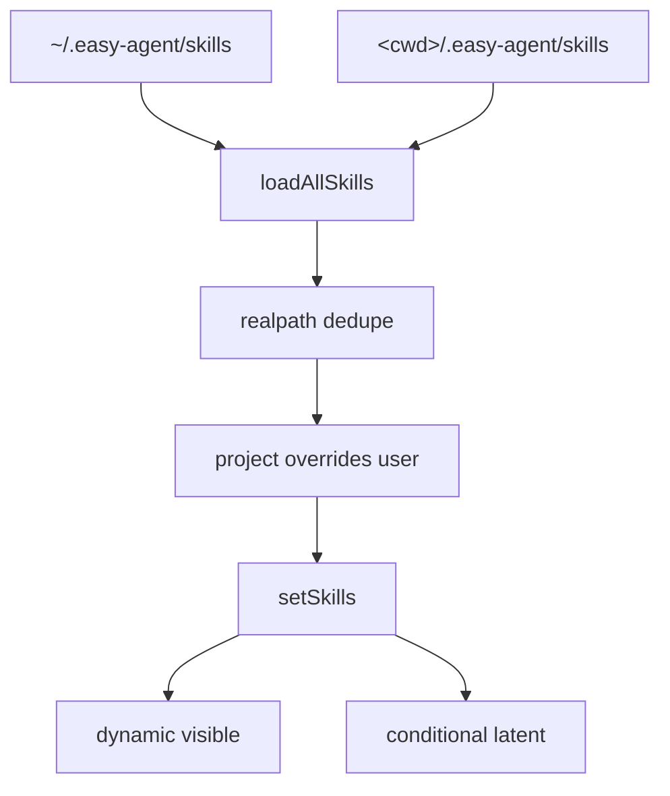

Sources: [src/services/skills/loadSkillsDir.ts:53-109](../../../project-repos/easy-agent/src/services/skills/loadSkillsDir.ts#L53-L109), [src/services/skills/loadSkillsDir.ts:124-147](../../../project-repos/easy-agent/src/services/skills/loadSkillsDir.ts#L124-L147), [src/services/skills/registry.ts:31-42](../../../project-repos/easy-agent/src/services/skills/registry.ts#L31-L42)

<details class="source-snippets">
<summary>引用源码</summary>

<!-- source-snippets:start -->

#### `src/services/skills/loadSkillsDir.ts:53-109`

```typescript
async function loadFromOneDir(dir: string, source: SkillSource): Promise&lt;LoadedFromDir&gt; {
  let entries: string[];
  try {
    const dirents = await fs.readdir(dir, { withFileTypes: true });
    entries = dirents.filter((d) => d.isDirectory()).map((d) => d.name);
  } catch (error: unknown) {
    const err = error as NodeJS.ErrnoException;
    if (err?.code === "ENOENT") return { skills: [], warnings: [] };
    return { skills: [], warnings: [`Failed to read ${dir}: ${(error as Error).message}`] };
  }

  const out: Skill[] = [];
  const warnings: string[] = [];

  for (const dirName of entries) {
    const skillDir = path.join(dir, dirName);
    const filePath = path.join(skillDir, SKILL_FILE);

    let raw: string;
    try {
      raw = await fs.readFile(filePath, "utf-8");
    } catch (error: unknown) {
      const err = error as NodeJS.ErrnoException;
      if (err?.code !== "ENOENT") {
        warnings.push(`[skills] Skipping ${skillDir}: ${(error as Error).message}`);
      }
      continue;
    }

    const split = splitFrontmatter(raw);
    if (split.parseError) {
      warnings.push(`[skills] Skipping ${dirName}: invalid frontmatter (${split.parseError})`);
      continue;
    }
    const frontmatter = normalizeFrontmatter(split.raw, split.body);

    // Resolve to canonical paths for symlink dedupe (handled by caller).
    const realFile = await fs.realpath(filePath).catch(() => filePath);
    const realDir = await fs.realpath(skillDir).catch(() => skillDir);

    const name = frontmatter.name ?? dirName;
    const description = frontmatter.description ?? extractFallbackDescription(split.body) ?? name;

    out.push({
      name,
      description,
      whenToUse: frontmatter.when_to_use,
      body: split.body,
      filePath: realFile,
      baseDir: realDir,
      source,
      frontmatter,
    });
  }

  return { skills: out, warnings };
}
```

#### `src/services/skills/loadSkillsDir.ts:124-147`

```typescript
export async function loadAllSkills(cwd: string): Promise&lt;LoadAllSkillsResult&gt; {
  const userDir = getUserSkillsDir();
  const projectDir = getProjectSkillsDir(cwd);

  const [userResult, projectResult] = await Promise.all([
    loadFromOneDir(userDir, "user"),
    loadFromOneDir(projectDir, "project"),
  ]);

  const seenRealPaths = new Set&lt;string&gt;();
  const byName = new Map&lt;string, Skill&gt;();

  for (const skill of [...userResult.skills, ...projectResult.skills]) {
    if (seenRealPaths.has(skill.filePath)) continue; // symlink loop
    seenRealPaths.add(skill.filePath);
    // Project source loaded after user, so this assignment wins on collision.
    byName.set(skill.name, skill);
  }

  return {
    skills: [...byName.values()],
    warnings: [...userResult.warnings, ...projectResult.warnings],
  };
}
```

#### `src/services/skills/registry.ts:31-42`

```typescript
export function setSkills(skills: Skill[]): void {
  dynamic.clear();
  conditional.clear();
  for (const skill of skills) {
    if (skill.frontmatter.paths && skill.frontmatter.paths.length > 0) {
      conditional.set(skill.name, skill);
    } else {
      dynamic.set(skill.name, skill);
    }
  }
  initialized = true;
}
```

<!-- source-snippets:end -->
</details>

## Frontmatter 解析

`splitFrontmatter()` 用 YAML parser 解析 `--- ... ---` 块；无 frontmatter 时返回空对象和原 body；YAML 非 mapping 或 parse error 会带 `parseError`，由 loader 警告并跳过。`normalizeFrontmatter()` 归一化 `name`、`description`、`when_to_use`、`allowed-tools`、`argument-hint`、`disable-model-invocation`、`paths` 和 `context: fork`。  
Sources: [src/services/skills/parseFrontmatter.ts:26-57](../../../project-repos/easy-agent/src/services/skills/parseFrontmatter.ts#L26-L57), [src/services/skills/parseFrontmatter.ts:61-146](../../../project-repos/easy-agent/src/services/skills/parseFrontmatter.ts#L61-L146)

<details class="source-snippets">
<summary>引用源码</summary>

<!-- source-snippets:start -->

#### `src/services/skills/parseFrontmatter.ts:26-57`

```typescript
const FRONTMATTER_RE = /^---\r?\n([\s\S]*?)\r?\n---\r?\n?([\s\S]*)$/;

/**
 * Split + parse a SKILL.md document.
 *
 * - Returns `{ raw: {}, body: <whole input> }` when no frontmatter is found.
 * - Never throws — invalid YAML is reported via `parseError` so the loader
 *   can log a warning and skip the skill rather than crashing startup.
 */
export function splitFrontmatter(content: string): FrontmatterSplit {
  const match = content.match(FRONTMATTER_RE);
  if (!match) {
    return { raw: {}, body: content };
  }

  const [, yamlText, body] = match;
  try {
    const parsed = parseYaml(yamlText) as unknown;
    if (parsed && typeof parsed === "object" && !Array.isArray(parsed)) {
      return { raw: parsed as Record&lt;string, unknown&gt;, body };
    }
    // Frontmatter that isn't an object (e.g. `---\nfoo\n---`) is a config
    // bug, not a usable skill. Treat as parse failure so the user notices.
    return { raw: {}, body, parseError: "Frontmatter must be a YAML mapping (key: value)" };
  } catch (error: unknown) {
    return {
      raw: {},
      body,
      parseError: (error as Error).message,
    };
  }
}
```

#### `src/services/skills/parseFrontmatter.ts:61-146`

```typescript
function asString(value: unknown): string | undefined {
  if (typeof value === "string") {
    const trimmed = value.trim();
    return trimmed.length > 0 ? trimmed : undefined;
  }
  if (typeof value === "number" || typeof value === "boolean") {
    return String(value);
  }
  return undefined;
}

function asStringArray(value: unknown): string[] {
  if (Array.isArray(value)) {
    return value
      .map((item) => (typeof item === "string" ? item.trim() : undefined))
      .filter((item): item is string => Boolean(item));
  }
  if (typeof value === "string") {
    // CSV-style: "Read, Grep, Glob" or single value
    return value
      .split(",")
      .map((s) => s.trim())
      .filter(Boolean);
  }
  return [];
}

function asBoolean(value: unknown): boolean {
  if (typeof value === "boolean") return value;
  if (typeof value === "string") {
    const v = value.trim().toLowerCase();
    return v === "true" || v === "yes" || v === "1";
  }
  return false;
}

/**
 * Extract the first non-empty paragraph from a markdown body. Used as a
 * fallback when the SKILL.md frontmatter has no `description`. Strips
 * leading H1/H2 headings so we don't show "# Code Review" as the desc.
 */
export function extractFallbackDescription(body: string): string {
  const lines = body.split(/\r?\n/);
  const buf: string[] = [];
  for (const raw of lines) {
    const line = raw.trim();
    if (!line) {
      if (buf.length > 0) break;
      continue;
    }
    // Skip leading headings — they're redundant with the skill name.
    if (buf.length === 0 && line.startsWith("#")) continue;
    buf.push(line);
  }
  return buf.join(" ").replace(/\s+/g, " ").trim();
}

/**
 * Normalize a raw YAML map into a `SkillFrontmatter`. Caller passes the
 * skill name (= dir name) so we can default-populate the `name` field, and
 * the markdown body so we can derive a fallback description.
 *
 * Unknown / deferred fields (model, effort, hooks, agent, shell, …) are
 * preserved untouched in `frontmatter.raw` so future stages can read them
 * without re-parsing the file.
 */
export function normalizeFrontmatter(
  raw: Record&lt;string, unknown&gt;,
  body: string,
): SkillFrontmatter {
  const allowedTools = asStringArray(raw["allowed-tools"] ?? raw["allowedTools"]);
  const paths = asStringArray(raw["paths"]);
  return {
    name: asString(raw["name"]),
    description: asString(raw["description"]),
    when_to_use: asString(raw["when_to_use"] ?? raw["whenToUse"]),
    allowedTools,
    argumentHint: asString(raw["argument-hint"] ?? raw["argumentHint"]),
    disableModelInvocation: asBoolean(
      raw["disable-model-invocation"] ?? raw["disableModelInvocation"],
    ),
    paths: paths.length > 0 ? paths : undefined,
    hasForkContext: asString(raw["context"]) === "fork",
    raw,
  };
}
```

<!-- source-snippets:end -->
</details>

| 字段 | 行为 |
|------|------|
| `name` | 默认目录名，可覆盖 |
| `description` | 缺失时从正文首段提取 |
| `when_to_use` | 追加到 discovery 描述 |
| `allowed-tools` | 调用 skill 后加入 session allow rules |
| `disable-model-invocation` | 对模型隐藏，但用户仍可 slash 调用 |
| `paths` | 条件 skill，路径命中后才对模型可见 |
| `context: fork` | 当前阶段在 SkillTool 中拒绝，需未来 sub-agent |

Sources: [src/services/skills/loadSkillsDir.ts:82-105](../../../project-repos/easy-agent/src/services/skills/loadSkillsDir.ts#L82-L105), [src/services/skills/parseFrontmatter.ts:97-146](../../../project-repos/easy-agent/src/services/skills/parseFrontmatter.ts#L97-L146), [src/tools/skillTool.ts:108-123](../../../project-repos/easy-agent/src/tools/skillTool.ts#L108-L123)

<details class="source-snippets">
<summary>引用源码</summary>

<!-- source-snippets:start -->

#### `src/services/skills/loadSkillsDir.ts:82-105`

```typescript
    const split = splitFrontmatter(raw);
    if (split.parseError) {
      warnings.push(`[skills] Skipping ${dirName}: invalid frontmatter (${split.parseError})`);
      continue;
    }
    const frontmatter = normalizeFrontmatter(split.raw, split.body);

    // Resolve to canonical paths for symlink dedupe (handled by caller).
    const realFile = await fs.realpath(filePath).catch(() => filePath);
    const realDir = await fs.realpath(skillDir).catch(() => skillDir);

    const name = frontmatter.name ?? dirName;
    const description = frontmatter.description ?? extractFallbackDescription(split.body) ?? name;

    out.push({
      name,
      description,
      whenToUse: frontmatter.when_to_use,
      body: split.body,
      filePath: realFile,
      baseDir: realDir,
      source,
      frontmatter,
    });
```

#### `src/services/skills/parseFrontmatter.ts:97-146`

```typescript
/**
 * Extract the first non-empty paragraph from a markdown body. Used as a
 * fallback when the SKILL.md frontmatter has no `description`. Strips
 * leading H1/H2 headings so we don't show "# Code Review" as the desc.
 */
export function extractFallbackDescription(body: string): string {
  const lines = body.split(/\r?\n/);
  const buf: string[] = [];
  for (const raw of lines) {
    const line = raw.trim();
    if (!line) {
      if (buf.length > 0) break;
      continue;
    }
    // Skip leading headings — they're redundant with the skill name.
    if (buf.length === 0 && line.startsWith("#")) continue;
    buf.push(line);
  }
  return buf.join(" ").replace(/\s+/g, " ").trim();
}

/**
 * Normalize a raw YAML map into a `SkillFrontmatter`. Caller passes the
 * skill name (= dir name) so we can default-populate the `name` field, and
 * the markdown body so we can derive a fallback description.
 *
 * Unknown / deferred fields (model, effort, hooks, agent, shell, …) are
 * preserved untouched in `frontmatter.raw` so future stages can read them
 * without re-parsing the file.
 */
export function normalizeFrontmatter(
  raw: Record&lt;string, unknown&gt;,
  body: string,
): SkillFrontmatter {
  const allowedTools = asStringArray(raw["allowed-tools"] ?? raw["allowedTools"]);
  const paths = asStringArray(raw["paths"]);
  return {
    name: asString(raw["name"]),
    description: asString(raw["description"]),
    when_to_use: asString(raw["when_to_use"] ?? raw["whenToUse"]),
    allowedTools,
    argumentHint: asString(raw["argument-hint"] ?? raw["argumentHint"]),
    disableModelInvocation: asBoolean(
      raw["disable-model-invocation"] ?? raw["disableModelInvocation"],
    ),
    paths: paths.length > 0 ? paths : undefined,
    hasForkContext: asString(raw["context"]) === "fork",
    raw,
  };
}
```

#### `src/tools/skillTool.ts:108-123`

```typescript
    if (skill.frontmatter.disableModelInvocation) {
      return {
        content: `Error: skill "${name}" has disable-model-invocation: true and can only be invoked by the user via /${name}.`,
        isError: true,
      };
    }

    if (skill.frontmatter.hasForkContext) {
      return {
        content:
          `Error: skill "${name}" declares context: fork, which requires sub-agent execution. ` +
          "This is not implemented in Easy Agent's stage 17. Remove `context: fork` from " +
          "the SKILL.md frontmatter to run it inline, or wait for the AgentTool stage.",
        isError: true,
      };
    }
```

<!-- source-snippets:end -->
</details>

## Registry 分层

registry 分成 `dynamic` 和 `conditional` 两个 Map。`getModelVisibleSkills()` 只返回 dynamic 且未设置 `disable-model-invocation` 的技能；`getAllUserInvocableSkills()` 会返回 dynamic + conditional，包括 hidden skills，这解释了为什么用户 slash command 可以调用模型不可见技能。  
Sources: [src/services/skills/registry.ts:1-18](../../../project-repos/easy-agent/src/services/skills/registry.ts#L1-L18), [src/services/skills/registry.ts:31-70](../../../project-repos/easy-agent/src/services/skills/registry.ts#L31-L70)

<details class="source-snippets">
<summary>引用源码</summary>

<!-- source-snippets:start -->

#### `src/services/skills/registry.ts:1-18`

```typescript
/**
 * Skill registry — central in-memory state for loaded skills.
 *
 * Two maps mirror the source code's split between always-on skills and
 * conditionally-activated ones (paths frontmatter):
 *
 *   - `dynamic`     : visible to the model right now. Initial set comes from
 *                     loadAllSkills(); conditional skills are promoted in
 *                     when their paths match touched files.
 *   - `conditional` : declared with `paths` but not yet activated.
 *
 * Two sources of skills (user / project) are merged at load time with
 * project overriding user when names collide. After load the source
 * doesn't matter for execution — it only affects the discovery listing.
 *
 * Reference: claude-code-source-code/src/skills/loadSkillsDir.ts
 * (`getSkillDirCommands` + `activateConditionalSkillsForPaths`).
 */
```

#### `src/services/skills/registry.ts:31-70`

```typescript
export function setSkills(skills: Skill[]): void {
  dynamic.clear();
  conditional.clear();
  for (const skill of skills) {
    if (skill.frontmatter.paths && skill.frontmatter.paths.length > 0) {
      conditional.set(skill.name, skill);
    } else {
      dynamic.set(skill.name, skill);
    }
  }
  initialized = true;
}

/** Has bootstrapSkills() ever been called? Useful for warning suppression. */
export function isSkillsInitialized(): boolean {
  return initialized;
}

/**
 * Skills currently visible to the model — used to build the discovery
 * listing in the system prompt. EXCLUDES `disable-model-invocation` skills.
 */
export function getModelVisibleSkills(): Skill[] {
  return [...dynamic.values()].filter((s) => !s.frontmatter.disableModelInvocation);
}

/**
 * All skills that the user could invoke via `/<name>`, INCLUDING
 * disable-model-invocation ones (the flag only hides from the AI listing,
 * the user can still trigger them) and conditional ones (so users aren't
 * surprised by "command not found" before the file path matches).
 */
export function getAllUserInvocableSkills(): Skill[] {
  return [...dynamic.values(), ...conditional.values()];
}

/** Look up by name across both maps; returns undefined if not loaded. */
export function findSkill(name: string): Skill | undefined {
  return dynamic.get(name) ?? conditional.get(name);
}
```

<!-- source-snippets:end -->
</details>

## System Prompt 预算

Skills discovery block 被包在 `<system-reminder>` 中。预算默认 8000 字符，可由 `EASY_AGENT_SKILL_CHAR_BUDGET` 覆盖；格式化有三档降级：完整描述、均分压缩描述、只列名称。  
Sources: [src/services/skills/budget.ts:1-17](../../../project-repos/easy-agent/src/services/skills/budget.ts#L1-L17), [src/services/skills/budget.ts:25-37](../../../project-repos/easy-agent/src/services/skills/budget.ts#L25-L37), [src/services/skills/budget.ts:58-114](../../../project-repos/easy-agent/src/services/skills/budget.ts#L58-L114), [src/context/systemPrompt.ts:122-137](../../../project-repos/easy-agent/src/context/systemPrompt.ts#L122-L137)

<details class="source-snippets">
<summary>引用源码</summary>

<!-- source-snippets:start -->

#### `src/services/skills/budget.ts:1-17`

```typescript
/**
 * Skill discovery listing — formats the `name + description` of every
 * available skill into a single text block, subject to a character budget
 * so we don't bloat the system prompt on long-skill collections.
 *
 * Reference: claude-code-source-code/src/tools/SkillTool/prompt.ts
 *   - SKILL_BUDGET_CONTEXT_PERCENT = 0.01  (1% of context window)
 *   - MAX_LISTING_DESC_CHARS = 250         (per-skill description cap)
 *   - Three-tier degradation: full → truncated descriptions → names-only
 *
 * Where ours differs from the source:
 *   - No "bundled skill never truncates" privilege (we have no bundled
 *     skills in stage 17 — see DEVELOPMENT-PLAN §17.6.1).
 *   - The budget is in CHARACTERS, not tokens. The source's
 *     `contextWindowTokens × 4 × 1%` heuristic assumes ~4 chars/token, so
 *     our default 8000 chars ≈ 2000 tokens for a 200K-token model.
 */
```

#### `src/services/skills/budget.ts:25-37`

```typescript
/**
 * Compute the character budget. Honours the `EASY_AGENT_SKILL_CHAR_BUDGET`
 * env var so power users can shrink it on smaller-context models without
 * editing source.
 */
export function getSkillCharBudget(): number {
  const envValue = process.env["EASY_AGENT_SKILL_CHAR_BUDGET"];
  if (envValue) {
    const parsed = Number.parseInt(envValue, 10);
    if (Number.isFinite(parsed) && parsed > 0) return parsed;
  }
  return DEFAULT_BUDGET_CHARS;
}
```

#### `src/services/skills/budget.ts:58-114`

```typescript
/**
 * Render the discovery listing under the given char budget.
 *
 * Tier 1: every skill with full description (capped at 250 chars each).
 * Tier 2: shrink each description equally to fit (≥ 20 chars each).
 * Tier 3: name-only fallback.
 *
 * Returns an empty string when there are no skills, so callers can
 * unconditionally concatenate it without producing trailing whitespace.
 */
export function formatSkillsWithinBudget(
  skills: Skill[],
  budget: number = getSkillCharBudget(),
): string {
  if (skills.length === 0) return "";

  const tier1 = skills.map((s) => buildLine(s, MAX_LISTING_DESC_CHARS));
  const tier1Total = tier1.reduce((acc, line) => acc + line.length + 1, 0);
  if (tier1Total <= budget) return tier1.join("\n");

  // Tier 2: distribute remaining budget evenly across skills. We reserve
  // the prefix length (`- name: `) per line, then split what's left.
  const prefixCost = skills.reduce((acc, s) => acc + `- ${s.name}: `.length + 1, 0);
  const descBudget = budget - prefixCost;
  if (descBudget >= skills.length * MIN_DESC_CHARS_PER_SKILL) {
    const perDesc = Math.max(MIN_DESC_CHARS_PER_SKILL, Math.floor(descBudget / skills.length));
    const tier2 = skills.map((s) => buildLine(s, perDesc));
    const tier2Total = tier2.reduce((acc, line) => acc + line.length + 1, 0);
    if (tier2Total <= budget) return tier2.join("\n");
  }

  // Tier 3: names only. No further degradation — at this point we either
  // fit the names or we accept overshoot (unavoidable, the model gets to
  // see the full set). Mirrors source code's "names_only" final tier.
  return skills.map(buildNameOnly).join("\n");
}

/**
 * Build the system-reminder block to inject into every system prompt.
 *
 * Wrapping in `<system-reminder>` tags matches the convention used elsewhere
 * in Claude Code for "ambient" context that should influence the model's
 * planning without being treated as a user instruction.
 */
export function formatSkillsSystemReminder(skills: Skill[]): string {
  if (skills.length === 0) return "";
  const listing = formatSkillsWithinBudget(skills);
  if (!listing) return "";
  return [
    "&lt;system-reminder&gt;",
    "Available skills you can invoke via the `Skill` tool. Each line is `- <name>: <description>`.",
    "Call `Skill(skill=\"<name>\", args=\"<optional args>\")` when the user's request matches one of these.",
    "",
    listing,
    "&lt;/system-reminder&gt;",
  ].join("\n");
}
```

#### `src/context/systemPrompt.ts:122-137`

```typescript
  // Skill discovery listing — see skills/budget.ts for the budget logic.
  // Wrapped as a &lt;system-reminder&gt; block (not a top-level instruction) so the
  // model treats it as ambient context that may or may not apply this turn.
  // Conditional skills (frontmatter `paths`) only appear here AFTER they've
  // been promoted in by activateConditionalSkillsForPaths(); see
  // skills/conditional.ts.
  const skillsReminder = formatSkillsSystemReminder(getModelVisibleSkills());

  const dynamicSections = [
    SYSTEM_PROMPT_DYNAMIC_START,
    formatEnvironmentContext(environmentContext),
    agentMdContext ? "Project memory (AGENT.md):\n" + agentMdContext : "",
    memorySections.length > 0 ? memorySections.join("\n\n") : "",
    options.additionalInstructions ? "Session instructions:\n" + options.additionalInstructions : "",
    skillsReminder,
    SYSTEM_PROMPT_DYNAMIC_END,
```

<!-- source-snippets:end -->
</details>

## 条件激活

条件 skills 使用 `paths` frontmatter 和 `ignore` 包的 gitignore 语义匹配。工具调用成功后，`agenticLoop` 会从 Read/Write/Edit/Glob 的输入里提取文件路径，命中后把 skill 从 conditional map 提升到 dynamic map，且激活在当前进程内是单向且 sticky 的。  
Sources: [src/services/skills/conditional.ts:1-15](../../../project-repos/easy-agent/src/services/skills/conditional.ts#L1-L15), [src/services/skills/conditional.ts:32-65](../../../project-repos/easy-agent/src/services/skills/conditional.ts#L32-L65), [src/services/skills/conditional.ts:67-98](../../../project-repos/easy-agent/src/services/skills/conditional.ts#L67-L98), [src/core/agenticLoop.ts:204-213](../../../project-repos/easy-agent/src/core/agenticLoop.ts#L204-L213)

<details class="source-snippets">
<summary>引用源码</summary>

<!-- source-snippets:start -->

#### `src/services/skills/conditional.ts:1-15`

```typescript
/**
 * Conditional skill activation — promotes skills declared with a `paths`
 * frontmatter into the visible skill set when their patterns match a file
 * the agent just touched (Read / Write / Edit / Glob).
 *
 * Reference: claude-code-source-code/src/skills/loadSkillsDir.ts
 *   `activateConditionalSkillsForPaths` — uses gitignore-style matching
 *   via the `ignore` package; we follow the same library + semantics so
 *   patterns authored against Claude Code work unmodified.
 *
 * Activation is one-way and sticky for the lifetime of the process: once a
 * skill activates, it stays in the visible set until restart. This avoids
 * flicker (skill appearing then disappearing as the model navigates files)
 * which would just confuse the model.
 */
```

#### `src/services/skills/conditional.ts:32-65`

```typescript
export function activateConditionalSkillsForPaths(
  filePaths: string[],
  cwd: string,
): string[] {
  if (filePaths.length === 0) return [];
  const candidates = listConditionalSkills();
  if (candidates.length === 0) return [];

  const relativePaths = filePaths
    .map((p) => {
      const abs = path.isAbsolute(p) ? p : path.resolve(cwd, p);
      const rel = path.relative(cwd, abs);
      // The `ignore` package can't match absolute paths or '..' paths.
      // Drop those — conditional skills are intended for in-repo files.
      if (!rel || rel.startsWith("..") || path.isAbsolute(rel)) return null;
      return rel.split(path.sep).join("/");
    })
    .filter((p): p is string => Boolean(p));

  if (relativePaths.length === 0) return [];

  const activated: string[] = [];
  for (const skill of candidates) {
    const patterns = skill.frontmatter.paths;
    if (!patterns || patterns.length === 0) continue;
    const matcher = ignore().add(patterns);
    if (relativePaths.some((p) => matcher.ignores(p))) {
      if (activateConditional(skill.name)) {
        activated.push(skill.name);
      }
    }
  }
  return activated;
}
```

#### `src/services/skills/conditional.ts:67-98`

```typescript
/**
 * Best-effort extractor: pull file-path-shaped fields out of an arbitrary
 * tool input object. We keep this conservative — only well-known fields
 * from Read / Write / Edit / Glob — to avoid false positives that would
 * activate skills against irrelevant inputs.
 */
export function extractToolFilePaths(
  toolName: string,
  input: Record&lt;string, unknown&gt;,
): string[] {
  const paths: string[] = [];
  switch (toolName) {
    case "Read":
    case "Write":
    case "Edit": {
      const fp = input["file_path"];
      if (typeof fp === "string") paths.push(fp);
      break;
    }
    case "Glob": {
      // Glob's `pattern` isn't a file path per se, but the `path` field
      // (the search root) often is, and conditional skills authored for
      // a directory subtree should still trigger.
      const root = input["path"];
      if (typeof root === "string") paths.push(root);
      break;
    }
    default:
      break;
  }
  return paths;
}
```

#### `src/core/agenticLoop.ts:204-213`

```typescript
      // Promote any conditional skills whose `paths` patterns match the
      // file the model just touched. The activation is sticky for the
      // remainder of the session — the new skill will appear in the next
      // system prompt rebuild (next user submit).
      if (!result.isError) {
        const filePaths = extractToolFilePaths(block.name, toolInput);
        if (filePaths.length > 0) {
          activateConditionalSkillsForPaths(filePaths, context.cwd);
        }
      }
```

<!-- source-snippets:end -->
</details>

## Skill 工具与用户 slash 调用

`Skill` 工具会校验 skill name，查 registry，拒绝 hidden-from-model 和 `context: fork`，再替换 `${CLAUDE_SKILL_DIR}`、`${CLAUDE_SESSION_ID}`、`$ARGUMENTS`，把 skill body 作为工具结果返回给模型继续执行。  
Sources: [src/tools/skillTool.ts:31-64](../../../project-repos/easy-agent/src/tools/skillTool.ts#L31-L64), [src/tools/skillTool.ts:90-141](../../../project-repos/easy-agent/src/tools/skillTool.ts#L90-L141)

<details class="source-snippets">
<summary>引用源码</summary>

<!-- source-snippets:start -->

#### `src/tools/skillTool.ts:31-64`

```typescript
const SKILL_NAME_RE = /^[a-zA-Z0-9_-]+$/;

function readInput(input: Record&lt;string, unknown&gt;): SkillInput {
  const skill = typeof input["skill"] === "string" ? input["skill"].trim() : "";
  const args = typeof input["args"] === "string" ? input["args"] : "";
  return { skill, args };
}

/**
 * Apply the three substitution variables documented in DEVELOPMENT-PLAN
 * §17.4. Order matters slightly: we substitute `${CLAUDE_SKILL_DIR}` and
 * `${CLAUDE_SESSION_ID}` BEFORE `$ARGUMENTS` so a literal `$ARGUMENTS`
 * inside an environment variable reference would still work — though in
 * practice that case should never appear.
 */
function substituteVariables(
  body: string,
  skill: Skill,
  args: string,
  sessionId: string,
): string {
  // Posix-style separator on all platforms; matches source `posixifyPath`.
  const dir = skill.baseDir.split(/[\\/]/).join("/");
  return body
    .replaceAll("${CLAUDE_SKILL_DIR}", dir)
    .replaceAll("${CLAUDE_SESSION_ID}", sessionId)
    .replaceAll("$ARGUMENTS", args);
}

function buildPromptText(skill: Skill, args: string, sessionId: string): string {
  const dir = skill.baseDir.split(/[\\/]/).join("/");
  const header = `Base directory for this skill: ${dir}\n\n`;
  return header + substituteVariables(skill.body, skill, args, sessionId);
}
```

#### `src/tools/skillTool.ts:90-141`

```typescript
  async call(input: Record&lt;string, unknown&gt;, context: ToolContext): Promise&lt;ToolResult&gt; {
    const { skill: name, args } = readInput(input);

    if (!name || !SKILL_NAME_RE.test(name)) {
      return {
        content: `Error: invalid skill name. Must match /^[a-zA-Z0-9_-]+$/. Got: ${JSON.stringify(name)}`,
        isError: true,
      };
    }

    const skill = findSkill(name);
    if (!skill) {
      return {
        content: `Error: skill "${name}" not found. Run with --dump-system-prompt to see the available list.`,
        isError: true,
      };
    }

    if (skill.frontmatter.disableModelInvocation) {
      return {
        content: `Error: skill "${name}" has disable-model-invocation: true and can only be invoked by the user via /${name}.`,
        isError: true,
      };
    }

    if (skill.frontmatter.hasForkContext) {
      return {
        content:
          `Error: skill "${name}" declares context: fork, which requires sub-agent execution. ` +
          "This is not implemented in Easy Agent's stage 17. Remove `context: fork` from " +
          "the SKILL.md frontmatter to run it inline, or wait for the AgentTool stage.",
        isError: true,
      };
    }

    // Inject the skill's allowedTools into session-allow rules so subsequent
    // tool calls during this skill don't interrupt the user with permission
    // prompts. We use the same `<ToolName>` rule format as elsewhere.
    if (skill.frontmatter.allowedTools.length > 0 && context.addSessionAllowRules) {
      context.addSessionAllowRules(skill.frontmatter.allowedTools);
    }

    const sessionId = context.sessionId ?? "unknown-session";
    const promptText = buildPromptText(skill, args ?? "", sessionId);

    return {
      content:
        `Loaded skill "${skill.name}" (${skill.source}). ` +
        `Follow the instructions below — they ARE your next steps for this turn.\n\n` +
        promptText,
    };
  },
```

<!-- source-snippets:end -->
</details>

用户 slash 调用走另一条链：`QueryEngine.tryExpandSkillCommand()` 生成可见 command marker 和隐藏 body message；`ConversationView` 隐藏 body，只渲染 command 气泡。  
Sources: [src/core/queryEngine.ts:178-215](../../../project-repos/easy-agent/src/core/queryEngine.ts#L178-L215), [src/core/queryEngine.ts:221-277](../../../project-repos/easy-agent/src/core/queryEngine.ts#L221-L277), [src/ui/components/ConversationView.tsx:15-29](../../../project-repos/easy-agent/src/ui/components/ConversationView.tsx#L15-L29), [src/ui/components/ConversationView.tsx:141-157](../../../project-repos/easy-agent/src/ui/components/ConversationView.tsx#L141-L157)

<details class="source-snippets">
<summary>引用源码</summary>

<!-- source-snippets:start -->

#### `src/core/queryEngine.ts:178-215`

```typescript
    if (trimmed.startsWith("/")) {
      // User-invoked skill: `/skill-name [args]`. Resolve the skill against
      // the registry; if it matches, expand into the source's two-message
      // pattern and submit normally. Falls through to handleCommand() for
      // /help, /mcp, /clear, etc. when no skill matches.
      //
      // Source reference (claude-code-source-code/src/utils/processUserInput
      // /processSlashCommand.tsx ~ line 1237 `getMessagesForPromptSlashCommand`):
      //
      //   const messages = [
      //     createUserMessage({ content: metadata }),                  // visible bubble
      //     createUserMessage({ content: skillBody, isMeta: true }),   // hidden, model-only
      //     ...
      //   ]
      //
      // The metadata message wraps `<command-name>/foo</command-name>` +
      // `<command-message>foo</command-message>` + `<command-args>...</...>`
      // tags. The UI's `UserCommandMessage` extracts those tags and renders
      // a styled "❯ /foo args" command bubble that stays in the transcript
      // forever (unlike a transient SystemNotice). The body message is
      // marked `isMeta: true` so the UI hides it from the human view while
      // the model still receives it as a regular user prompt.
      //
      // We don't have an `isMeta` field on `MessageParam`, so we use a
      // string-prefix sentinel ("[skill_invocation:&lt;name&gt;]\n") for the body
      // and the source's exact XML format for the marker — both matched in
      // ConversationView.
      const skillExpansion = this.tryExpandSkillCommand(trimmed);
      if (skillExpansion) {
        const markerMessage: MessageParam = {
          role: "user",
          content: skillExpansion.markerContent,
        };
        this.messages = [...this.messages, markerMessage];
        yield { type: "messages_updated", messages: [...this.messages] };
        return yield* this.submitInternal(skillExpansion.bodyText);
      }
      return yield* this.handleCommand(trimmed);
```

#### `src/core/queryEngine.ts:221-277`

```typescript
  /**
   * Expand `/skill-name [args]` into the two-message pattern source uses:
   *   - `markerContent` — short XML block consumed by the UI to render a
   *     styled "❯ /skill-name args" command bubble in the transcript.
   *   - `bodyText` — the substituted SKILL.md body that becomes the actual
   *     prompt for the model. Prefixed with `[skill_invocation:<name>]\n`
   *     so the conversation view filters it out (the marker bubble already
   *     tells the user what they ran; rendering the SKILL.md body as a
   *     giant user dump is exactly the UX bug we're fixing).
   *
   * Returns null when the input doesn't match any loaded skill — the caller
   * falls back to the generic /command dispatcher in that case.
   */
  private tryExpandSkillCommand(
    input: string,
  ): { skill: Skill; markerContent: string; bodyText: string } | null {
    const match = input.match(/^\/([a-zA-Z0-9_-]+)(?:\s+(.*))?$/);
    if (!match) return null;
    const [, name, rawArgs] = match;
    const skill = findSkill(name);
    if (!skill) return null;

    const args = rawArgs?.trim() ?? "";
    const dir = skill.baseDir.split(/[\\/]/).join("/");
    const sessionId = this.toolContext.sessionId ?? "unknown-session";

    // Inject allowed-tools into session-allow rules now (the user just
    // explicitly asked for this skill to run — no need to re-prompt for
    // each tool call inside it). Same effect as the SkillTool's
    // contextModifier when the model invokes a skill.
    if (skill.frontmatter.allowedTools.length > 0) {
      this.addSessionAllowRules(skill.frontmatter.allowedTools);
    }

    const body = skill.body
      .replaceAll("${CLAUDE_SKILL_DIR}", dir)
      .replaceAll("${CLAUDE_SESSION_ID}", sessionId)
      .replaceAll("$ARGUMENTS", args);

    // Match `formatCommandInputTags` from source/utils/messages.ts:577.
    // ConversationView's command-bubble renderer parses these exact tags;
    // changing the format here also requires updating extractCommandTag().
    const markerLines = [
      `<command-message>${skill.name}</command-message>`,
      `<command-name>/${skill.name}</command-name>`,
    ];
    if (args) {
      markerLines.push(`<command-args>${args}</command-args>`);
    }
    const markerContent = markerLines.join("\n");

    const header =
      `[skill_invocation:${skill.name}]\n` +
      `Run skill "${skill.name}" with the following instructions. ` +
      `Base directory for this skill: ${dir}.\n\n`;
    return { skill, markerContent, bodyText: header + body };
  }
```

#### `src/ui/components/ConversationView.tsx:15-29`

```tsx
function isInternalMessage(message: MessageParam): boolean {
  const content = typeof message.content === "string" ? message.content : "";
  if (content.startsWith("[CompactBoundary]")) return true;
  if (content.startsWith("This session is being continued from a previous conversation")) return true;
  if (content.startsWith("[plan_mode_attachment]")) return true;
  if (content.startsWith("[plan_mode_exit]")) return true;
  // `/<skill-name>` invocations expand into TWO user messages (mirroring
  // source's processSlashCommand pattern): a visible "command bubble"
  // marker (handled by extractCommandMarker below) and a hidden body
  // tagged with this prefix. The model receives the body as the real
  // prompt, but the user already sees the bubble + the assistant's
  // streaming reply, so the raw SKILL.md dump would just be noise here.
  if (content.startsWith("[skill_invocation:")) return true;
  return false;
}
```

#### `src/ui/components/ConversationView.tsx:141-157`

```tsx
        if (message.role === "user") {
          if (typeof message.content === "string") {
            // Slash-command marker (`<command-name>/skill</command-name>` …):
            // render as a styled "❯ /name args" command bubble. Mirrors
            // source's UserCommandMessage component so users see the same
            // breadcrumb whether the command was a built-in or a skill.
            const marker = extractCommandMarker(message);
            if (marker) {
              const display = `/${marker.name.replace(/^\//, "")}` +
                (marker.args ? ` ${marker.args}` : "");
              return (
                &lt;Box key={`u${index}`} marginTop={1}>
                  &lt;Text color="cyan" dimColor&gt;{"❯ "}&lt;/Text&gt;
                  &lt;Text color="cyan"&gt;{display}&lt;/Text&gt;
                &lt;/Box&gt;
              );
            }
```

<!-- source-snippets:end -->
</details>

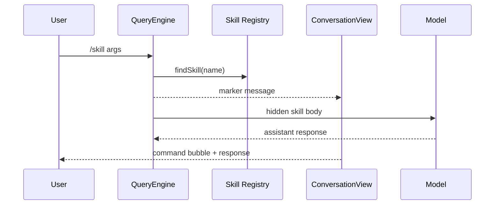

Sources: [src/core/queryEngine.ts:234-277](../../../project-repos/easy-agent/src/core/queryEngine.ts#L234-L277), [src/ui/components/ConversationView.tsx:31-51](../../../project-repos/easy-agent/src/ui/components/ConversationView.tsx#L31-L51), [src/ui/components/ConversationView.tsx:141-157](../../../project-repos/easy-agent/src/ui/components/ConversationView.tsx#L141-L157)

<details class="source-snippets">
<summary>引用源码</summary>

<!-- source-snippets:start -->

#### `src/core/queryEngine.ts:234-277`

```typescript
  private tryExpandSkillCommand(
    input: string,
  ): { skill: Skill; markerContent: string; bodyText: string } | null {
    const match = input.match(/^\/([a-zA-Z0-9_-]+)(?:\s+(.*))?$/);
    if (!match) return null;
    const [, name, rawArgs] = match;
    const skill = findSkill(name);
    if (!skill) return null;

    const args = rawArgs?.trim() ?? "";
    const dir = skill.baseDir.split(/[\\/]/).join("/");
    const sessionId = this.toolContext.sessionId ?? "unknown-session";

    // Inject allowed-tools into session-allow rules now (the user just
    // explicitly asked for this skill to run — no need to re-prompt for
    // each tool call inside it). Same effect as the SkillTool's
    // contextModifier when the model invokes a skill.
    if (skill.frontmatter.allowedTools.length > 0) {
      this.addSessionAllowRules(skill.frontmatter.allowedTools);
    }

    const body = skill.body
      .replaceAll("${CLAUDE_SKILL_DIR}", dir)
      .replaceAll("${CLAUDE_SESSION_ID}", sessionId)
      .replaceAll("$ARGUMENTS", args);

    // Match `formatCommandInputTags` from source/utils/messages.ts:577.
    // ConversationView's command-bubble renderer parses these exact tags;
    // changing the format here also requires updating extractCommandTag().
    const markerLines = [
      `<command-message>${skill.name}</command-message>`,
      `<command-name>/${skill.name}</command-name>`,
    ];
    if (args) {
      markerLines.push(`<command-args>${args}</command-args>`);
    }
    const markerContent = markerLines.join("\n");

    const header =
      `[skill_invocation:${skill.name}]\n` +
      `Run skill "${skill.name}" with the following instructions. ` +
      `Base directory for this skill: ${dir}.\n\n`;
    return { skill, markerContent, bodyText: header + body };
  }
```

#### `src/ui/components/ConversationView.tsx:31-51`

```tsx
/**
 * Detect a slash-command marker user message and pull the
 * `<command-name>` + `<command-args>` tags out for rendering. Returns null
 * for plain user text. The format mirrors source's `formatCommandInputTags`
 * in claude-code-source-code/src/utils/messages.ts so we stay
 * source-compatible (matters once we add /resume).
 */
function extractCommandMarker(
  message: MessageParam,
): { name: string; args: string } | null {
  if (typeof message.content !== "string") return null;
  const text = message.content;
  if (!text.includes("&lt;command-name&gt;")) return null;
  const nameMatch = text.match(/&lt;command-name&gt;([^&lt;]*)<\/command-name&gt;/);
  if (!nameMatch) return null;
  const argsMatch = text.match(/&lt;command-args&gt;([^&lt;]*)<\/command-args&gt;/);
  return {
    name: nameMatch[1] ?? "",
    args: (argsMatch?.[1] ?? "").trim(),
  };
}
```

#### `src/ui/components/ConversationView.tsx:141-157`

```tsx
        if (message.role === "user") {
          if (typeof message.content === "string") {
            // Slash-command marker (`<command-name>/skill</command-name>` …):
            // render as a styled "❯ /name args" command bubble. Mirrors
            // source's UserCommandMessage component so users see the same
            // breadcrumb whether the command was a built-in or a skill.
            const marker = extractCommandMarker(message);
            if (marker) {
              const display = `/${marker.name.replace(/^\//, "")}` +
                (marker.args ? ` ${marker.args}` : "");
              return (
                &lt;Box key={`u${index}`} marginTop={1}>
                  &lt;Text color="cyan" dimColor&gt;{"❯ "}&lt;/Text&gt;
                  &lt;Text color="cyan"&gt;{display}&lt;/Text&gt;
                &lt;/Box&gt;
              );
            }
```

<!-- source-snippets:end -->
</details>

## 源仓库技能包检测

本次分析的 `easy-agent` 源仓库没有 `skills/**/SKILL.md`、`.easy-agent/skills/**/SKILL.md` 或类似技能包目录，因此 DeepWiki 输出不包含 `skills/` 翻译副本。仓库内 `src/scripts/test-skills.ts` 会在运行时创建或期待工作目录下的示例 skills，但它们不是当前 git tracked source tree 的一部分。  
Sources: [src/scripts/test-skills.ts:1-14](../../../project-repos/easy-agent/src/scripts/test-skills.ts#L1-L14), [src/scripts/test-skills.ts:40-84](../../../project-repos/easy-agent/src/scripts/test-skills.ts#L40-L84)

<details class="source-snippets">
<summary>引用源码</summary>

<!-- source-snippets:start -->

#### `src/scripts/test-skills.ts:1-14`

```typescript
#!/usr/bin/env tsx
/**
 * Stage 17 verification script — exercise the Skills subsystem WITHOUT
 * touching the LLM. Lets you validate the file loader, frontmatter
 * parser, registry split (dynamic vs conditional), budget formatter,
 * conditional activation, and SkillTool execution end-to-end against
 * the example skills under `<cwd>/.easy-agent/skills/`.
 *
 * Usage:
 *   cd easy-agent
 *   npx tsx src/scripts/test-skills.ts
 *
 * Exits non-zero if any assertion fails — convenient for CI / manual checks.
 */
```

#### `src/scripts/test-skills.ts:40-84`

```typescript
async function main(): Promise&lt;void&gt; {
  console.log(`\n[1] bootstrapSkills(${cwd})`);
  const result = await bootstrapSkills(cwd);
  console.log(
    `    loaded ${result.skillCount} unconditional + ${result.conditionalCount} conditional skill(s); ${result.warnings.length} warning(s).`,
  );

  console.log("\n[2] Registry split");
  const allUserInvocable = getAllUserInvocableSkills();
  const visibleToModel = getModelVisibleSkills();
  const conditional = listConditionalSkills();
  console.log(`    user-invocable: ${allUserInvocable.map((s) => s.name).join(", ")}`);
  console.log(`    model-visible:  ${visibleToModel.map((s) => s.name).join(", ")}`);
  console.log(`    conditional:    ${conditional.map((s) => s.name).join(", ")}`);

  assert(findSkill("hello-world"), "hello-world skill loaded");
  assert(findSkill("test-reviewer"), "test-reviewer skill loaded (conditional)");
  assert(findSkill("secret-handshake"), "secret-handshake skill loaded (hidden)");

  assert(
    !visibleToModel.some((s) => s.name === "secret-handshake"),
    "secret-handshake is HIDDEN from the model listing (disable-model-invocation: true)",
  );
  assert(
    !visibleToModel.some((s) => s.name === "test-reviewer"),
    "test-reviewer is HIDDEN from the initial model listing (paths gates it)",
  );
  assert(
    visibleToModel.some((s) => s.name === "hello-world"),
    "hello-world IS visible to the model",
  );

  console.log("\n[3] system-reminder formatting (initial)");
  const reminder = formatSkillsSystemReminder(visibleToModel);
  console.log(reminder.split("\n").map((l) => `    ${l}`).join("\n"));
  assert(reminder.includes("hello-world"), "system-reminder mentions hello-world");
  assert(!reminder.includes("test-reviewer"), "system-reminder does NOT mention test-reviewer initially");
  assert(!reminder.includes("secret-handshake"), "system-reminder does NOT mention secret-handshake");

  console.log("\n[4] Conditional activation via file path match");
  const activated = activateConditionalSkillsForPaths(["src/foo.test.ts"], cwd);
  console.log(`    activated: ${activated.join(", ") || "(none)"}`);
  assert(activated.includes("test-reviewer"), "test-reviewer activated by *.test.ts path");
  const reminderAfter = formatSkillsSystemReminder(getModelVisibleSkills());
  assert(reminderAfter.includes("test-reviewer"), "test-reviewer NOW appears in the system-reminder");
```

<!-- source-snippets:end -->
</details>

## 相关页面

- [CLI 与终端 UI](cli-and-ui.md)
- [MCP 集成](mcp-integration.md)
- [上下文、记忆与压缩](context-memory-compaction.md)

---

<details>
<summary>相关源文件</summary>

生成本页时使用的主要源文件：

- [src/context/systemPrompt.ts](../../../project-repos/easy-agent/src/context/systemPrompt.ts)
- [src/context/claudeMd.ts](../../../project-repos/easy-agent/src/context/claudeMd.ts)
- [src/context/memory/memdir.ts](../../../project-repos/easy-agent/src/context/memory/memdir.ts)
- [src/context/memory/memoryTypes.ts](../../../project-repos/easy-agent/src/context/memory/memoryTypes.ts)
- [src/context/autoCompact.ts](../../../project-repos/easy-agent/src/context/autoCompact.ts)
- [src/context/compaction.ts](../../../project-repos/easy-agent/src/context/compaction.ts)
- [src/context/planAttachments.ts](../../../project-repos/easy-agent/src/context/planAttachments.ts)
- [src/utils/tokens.ts](../../../project-repos/easy-agent/src/utils/tokens.ts)

</details>

# 上下文、记忆与压缩

上下文层每个 turn 都会组装 system prompt，并在用户消息进入 agentic loop 前检查 token budget。它还提供 AGENT.md 加载、项目 memory、manual/auto/micro compaction 和 plan mode attachment。  
Sources: [src/context/systemPrompt.ts:95-140](../../../project-repos/easy-agent/src/context/systemPrompt.ts#L95-L140), [src/core/queryEngine.ts:288-357](../../../project-repos/easy-agent/src/core/queryEngine.ts#L288-L357), [src/context/compaction.ts:235-318](../../../project-repos/easy-agent/src/context/compaction.ts#L235-L318)

<details class="source-snippets">
<summary>引用源码</summary>

<!-- source-snippets:start -->

#### `src/context/systemPrompt.ts:95-140`

```typescript
export async function buildSystemPrompt(options: BuildSystemPromptOptions): Promise&lt;string[]&gt; {
  const ignoreMemory = options.userQuery ? shouldIgnoreMemory(options.userQuery) : false;
  const memoryDir = await ensureMemoryDirExists(options.cwd);
  const [environmentContext, agentMdContext, memoryEntrypoint] = await Promise.all([
    getRuntimeEnvironmentContext(options.cwd),
    loadAgentMdContext(options.cwd),
    ignoreMemory ? Promise.resolve(null) : readMemoryEntrypoint(options.cwd),
  ]);

  const staticSections = [
    SYSTEM_PROMPT_STATIC_START,
    ...getStaticPromptSections(),
    SYSTEM_PROMPT_STATIC_END,
  ];

  const memorySections = [
    ...formatMemorySystemLocation(memoryDir),
    ...buildMemoryPromptInstructions(),
    ...buildMemoryTypeGuidance(),
    ...buildMemoryExclusionGuidance(),
    ...buildMemoryAccessGuidance(),
    ...buildMemoryValidationGuidance(),
    ...buildMemoryPersistenceBoundaryGuidance(),
    ignoreMemory ? "Memory is disabled for this turn because the user asked not to use it." : "",
    memoryEntrypoint ? `Memory index:\n${memoryEntrypoint}` : "",
  ].filter(Boolean);

  // Skill discovery listing — see skills/budget.ts for the budget logic.
  // Wrapped as a &lt;system-reminder&gt; block (not a top-level instruction) so the
  // model treats it as ambient context that may or may not apply this turn.
  // Conditional skills (frontmatter `paths`) only appear here AFTER they've
  // been promoted in by activateConditionalSkillsForPaths(); see
  // skills/conditional.ts.
  const skillsReminder = formatSkillsSystemReminder(getModelVisibleSkills());

  const dynamicSections = [
    SYSTEM_PROMPT_DYNAMIC_START,
    formatEnvironmentContext(environmentContext),
    agentMdContext ? "Project memory (AGENT.md):\n" + agentMdContext : "",
    memorySections.length > 0 ? memorySections.join("\n\n") : "",
    options.additionalInstructions ? "Session instructions:\n" + options.additionalInstructions : "",
    skillsReminder,
    SYSTEM_PROMPT_DYNAMIC_END,
  ].filter(Boolean);

  return [...staticSections, ...dynamicSections];
```

#### `src/core/queryEngine.ts:288-357`

```typescript
    const previewSystemParts = await buildSystemPrompt({
      cwd: this.toolContext.cwd,
      userQuery: trimmed,
    });
    const previewSystemPrompt = renderSystemPrompt(previewSystemParts);

    // Only run compaction when there's meaningful conversation history
    if (this.messages.length > 0) {
      // Micro-compact old tool results first
      const microResult = await compactMessages(this.messages, undefined, {
        usage: this.lastCallUsage,
        usageAnchorIndex: this.usageAnchorIndex,
        systemPrompt: previewSystemPrompt,
      });
      if (microResult.didMicroCompact || microResult.didCompact) {
        this.messages = [...microResult.messages];
        this.invalidateUsageAnchor();
        yield { type: "messages_updated", messages: [...this.messages] };
        yield {
          type: "compacted",
          summary: microResult.summary,
          trigger: microResult.didCompact ? "auto" : "micro",
        };
      }

      // Auto-compact with circuit breaker if still over threshold
      const { result: autoResult, didAutoCompact } = await autoCompactIfNeeded(
        this.messages,
        this.getActiveModel(),
        {
          usage: this.lastCallUsage,
          usageAnchorIndex: this.usageAnchorIndex,
          systemPrompt: previewSystemPrompt,
        },
      );
      if (didAutoCompact) {
        this.messages = [...autoResult.messages];
        this.invalidateUsageAnchor();
        yield { type: "messages_updated", messages: [...this.messages] };
        yield { type: "compacted", summary: autoResult.summary, trigger: "auto" };
      }

      // Emit token warning if approaching limits
      const estimatedTokens = tokenCountWithEstimation(this.messages, {
        usage: this.lastCallUsage,
        usageAnchorIndex: this.usageAnchorIndex,
        systemPrompt: previewSystemPrompt,
      });
      const warningState = calculateTokenWarningState(estimatedTokens, this.getActiveModel());
      if (warningState.state !== "normal") {
        yield { type: "token_warning", warning: warningState };
      }
    }

    // Inject plan mode attachments as user messages (before user input)
    if (this.currentPermissionMode === "plan") {
      const planAttachment = getPlanModeAttachment(this.messages, getPlanFilePath());
      if (planAttachment) {
        this.messages = [...this.messages, planAttachment];
      }
    } else if (this.needsPlanModeExitAttachment) {
      this.needsPlanModeExitAttachment = false;
      const exists = await checkPlanExists();
      const exitAttachment = getPlanModeExitAttachment(getPlanFilePath(), exists);
      this.messages = [...this.messages, exitAttachment];
    }

    const userMessage: MessageParam = { role: "user", content: trimmed };
    this.messages = [...this.messages, userMessage];
    yield { type: "messages_updated", messages: [...this.messages] };
```

#### `src/context/compaction.ts:235-318`

```typescript
export async function compactMessages(
  messages: MessageParam[],
  focus?: string,
  options: CompactionCheckOptions = {},
): Promise&lt;CompactionResult&gt; {
  const microcompactResult = microCompactMessages(messages);
  const microCompacted = microcompactResult.messages;
  const microChanged = JSON.stringify(microCompacted) !== JSON.stringify(messages);

  const budget = buildTokenBudgetSnapshot(microCompacted, {
    usage: options.usage,
    usageAnchorIndex: options.usageAnchorIndex,
    systemPrompt: options.systemPrompt,
  });

  debugLog("compact", "budget_check", {
    originalMessageCount: messages.length,
    microMessageCount: microCompacted.length,
    didMicroCompact: microChanged,
    compactedToolIds: microcompactResult.compactedToolIds,
    usageAnchorIndex: options.usageAnchorIndex ?? null,
    estimatedConversationTokens: budget.estimatedConversationTokens,
    autoCompactThreshold: budget.autoCompactThreshold,
    manualCompactThreshold: budget.manualCompactThreshold,
  });

  if (!options.force && budget.estimatedConversationTokens < budget.autoCompactThreshold) {
    debugLog("compact", "skip_full_compact", {
      reason: "below_auto_threshold",
      estimatedConversationTokens: budget.estimatedConversationTokens,
      autoCompactThreshold: budget.autoCompactThreshold,
    });

    return {
      messages: microChanged
        ? [
            ...microCompacted,
            makeCompactBoundary({
              compactType: "micro",
              originalMessageCount: messages.length,
              compactedToolIds: microcompactResult.compactedToolIds,
            }),
          ]
        : microCompacted,
      didCompact: false,
      didMicroCompact: microChanged,
    };
  }

  const summary = await summarizeMessages(microCompacted, focus);
  const desiredTailCount = 8;
  const tailStart = microCompacted.length <= desiredTailCount
    ? microCompacted.length               // short conversation: summary covers everything, no tail
    : findPreservedTailStart(microCompacted, desiredTailCount);
  const tail = microCompacted.slice(tailStart);
  const compacted: MessageParam[] = [
    {
      role: "user",
      content: `This session is being continued from a previous conversation that ran out of context. The summary below covers the earlier portion of the conversation.\n\n${summary}${tail.length > 0 ? "\n\nRecent messages are preserved verbatim." : ""}`,
    },
    makeCompactBoundary({
      compactType: focus ? "manual" : "auto",
      reason: focus,
      originalMessageCount: microCompacted.length,
      compactedToolIds: microcompactResult.compactedToolIds,
    }),
    ...tail,
  ];

  debugLog("compact", "full_compact_applied", {
    focus: focus ?? null,
    tailStart,
    preservedTailCount: tail.length,
    originalMessageCount: messages.length,
    compactedMessageCount: compacted.length,
  });

  return {
    messages: compacted,
    summary,
    didCompact: true,
    didMicroCompact: microChanged,
  };
}
```

<!-- source-snippets:end -->
</details>

## System Prompt 组成

静态部分是 Easy Agent 的操作原则；动态部分包括 runtime 环境、Git branch/status/recent commit、AGENT.md 内容、memory 位置和索引、session instructions、skills reminder。静态和动态部分分别用 `<SYSTEM_STATIC_CONTEXT>` 与 `<SYSTEM_DYNAMIC_CONTEXT>` 包裹。  
Sources: [src/context/systemPrompt.ts:12-16](../../../project-repos/easy-agent/src/context/systemPrompt.ts#L12-L16), [src/context/systemPrompt.ts:32-43](../../../project-repos/easy-agent/src/context/systemPrompt.ts#L32-L43), [src/context/systemPrompt.ts:45-72](../../../project-repos/easy-agent/src/context/systemPrompt.ts#L45-L72), [src/context/systemPrompt.ts:95-145](../../../project-repos/easy-agent/src/context/systemPrompt.ts#L95-L145)

<details class="source-snippets">
<summary>引用源码</summary>

<!-- source-snippets:start -->

#### `src/context/systemPrompt.ts:12-16`

```typescript
export const SYSTEM_PROMPT_STATIC_START = "&lt;SYSTEM_STATIC_CONTEXT&gt;";
export const SYSTEM_PROMPT_STATIC_END = "&lt;/SYSTEM_STATIC_CONTEXT&gt;";
export const SYSTEM_PROMPT_DYNAMIC_START = "&lt;SYSTEM_DYNAMIC_CONTEXT&gt;";
export const SYSTEM_PROMPT_DYNAMIC_END = "&lt;/SYSTEM_DYNAMIC_CONTEXT&gt;";

```

#### `src/context/systemPrompt.ts:32-43`

```typescript
function getStaticPromptSections(): string[] {
  return [
    "You are Easy Agent, a terminal-native local coding assistant running inside the user's workspace.",
    "Operate directly, be concise, and prefer taking concrete actions with tools when useful.",
    "When solving coding tasks, first understand the relevant files, then make focused changes, then verify with the least expensive effective command.",
    "Prefer specialized tools over shell when possible: use Read for reading files, Edit for precise changes, Write for full file creation or overwrite, Grep for content search, Glob for file discovery, and Bash only when shell execution is actually needed.",
    "Treat the current working directory as the primary workspace boundary. The Easy Agent system directory at ~/.easy-agent is also available for memory and session storage; do not assume other outside paths are available.",
    "When editing code, preserve existing behavior unless the user explicitly asks for a behavior change.",
    "If a command or edit fails, explain the failure briefly and choose the next best action based on the observed result.",
    "Keep answers structured and practical. Summarize what you changed or found, and avoid unnecessary narration.",
  ];
}
```

#### `src/context/systemPrompt.ts:45-72`

```typescript
async function getGitContext(cwd: string): Promise&lt;Pick&lt;RuntimeEnvironmentContext, "gitBranch" | "gitStatus" | "gitRecentCommit"&gt;&gt; {
  try {
    const [branchResult, statusResult, logResult] = await Promise.all([
      execFileAsync("git", ["rev-parse", "--abbrev-ref", "HEAD"], { cwd, maxBuffer: 32 * 1024 }),
      execFileAsync("git", ["status", "--short"], { cwd, maxBuffer: 64 * 1024 }),
      execFileAsync("git", ["log", "-1", "--pretty=format:%h %s"], { cwd, maxBuffer: 32 * 1024 }),
    ]);

    const status = statusResult.stdout.trim();
    return {
      gitBranch: branchResult.stdout.trim(),
      gitStatus: status || "clean",
      gitRecentCommit: logResult.stdout.trim() || undefined,
    };
  } catch {
    return {};
  }
}

export async function getRuntimeEnvironmentContext(cwd: string): Promise&lt;RuntimeEnvironmentContext&gt; {
  const git = await getGitContext(cwd);
  return {
    cwd,
    date: new Date().toISOString(),
    os:       os.platform() + " " + os.release() + " (" + os.arch() + ")",
    ...git,
  };
}
```

#### `src/context/systemPrompt.ts:95-145`

```typescript
export async function buildSystemPrompt(options: BuildSystemPromptOptions): Promise&lt;string[]&gt; {
  const ignoreMemory = options.userQuery ? shouldIgnoreMemory(options.userQuery) : false;
  const memoryDir = await ensureMemoryDirExists(options.cwd);
  const [environmentContext, agentMdContext, memoryEntrypoint] = await Promise.all([
    getRuntimeEnvironmentContext(options.cwd),
    loadAgentMdContext(options.cwd),
    ignoreMemory ? Promise.resolve(null) : readMemoryEntrypoint(options.cwd),
  ]);

  const staticSections = [
    SYSTEM_PROMPT_STATIC_START,
    ...getStaticPromptSections(),
    SYSTEM_PROMPT_STATIC_END,
  ];

  const memorySections = [
    ...formatMemorySystemLocation(memoryDir),
    ...buildMemoryPromptInstructions(),
    ...buildMemoryTypeGuidance(),
    ...buildMemoryExclusionGuidance(),
    ...buildMemoryAccessGuidance(),
    ...buildMemoryValidationGuidance(),
    ...buildMemoryPersistenceBoundaryGuidance(),
    ignoreMemory ? "Memory is disabled for this turn because the user asked not to use it." : "",
    memoryEntrypoint ? `Memory index:\n${memoryEntrypoint}` : "",
  ].filter(Boolean);

  // Skill discovery listing — see skills/budget.ts for the budget logic.
  // Wrapped as a &lt;system-reminder&gt; block (not a top-level instruction) so the
  // model treats it as ambient context that may or may not apply this turn.
  // Conditional skills (frontmatter `paths`) only appear here AFTER they've
  // been promoted in by activateConditionalSkillsForPaths(); see
  // skills/conditional.ts.
  const skillsReminder = formatSkillsSystemReminder(getModelVisibleSkills());

  const dynamicSections = [
    SYSTEM_PROMPT_DYNAMIC_START,
    formatEnvironmentContext(environmentContext),
    agentMdContext ? "Project memory (AGENT.md):\n" + agentMdContext : "",
    memorySections.length > 0 ? memorySections.join("\n\n") : "",
    options.additionalInstructions ? "Session instructions:\n" + options.additionalInstructions : "",
    skillsReminder,
    SYSTEM_PROMPT_DYNAMIC_END,
  ].filter(Boolean);

  return [...staticSections, ...dynamicSections];
}

export function renderSystemPrompt(parts: string[]): string {
  return parts.join("\n\n");
}
```

<!-- source-snippets:end -->
</details>

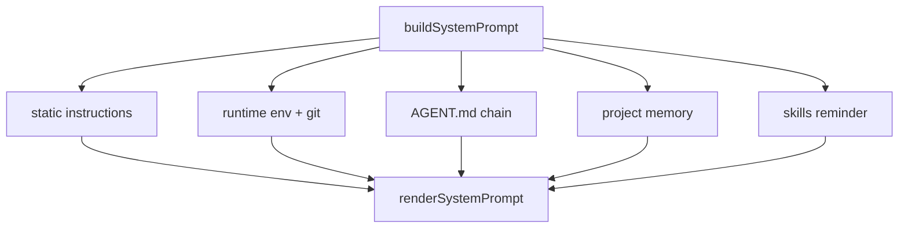

Sources: [src/context/systemPrompt.ts:95-145](../../../project-repos/easy-agent/src/context/systemPrompt.ts#L95-L145)

<details class="source-snippets">
<summary>引用源码</summary>

<!-- source-snippets:start -->

#### `src/context/systemPrompt.ts:95-145`

```typescript
export async function buildSystemPrompt(options: BuildSystemPromptOptions): Promise&lt;string[]&gt; {
  const ignoreMemory = options.userQuery ? shouldIgnoreMemory(options.userQuery) : false;
  const memoryDir = await ensureMemoryDirExists(options.cwd);
  const [environmentContext, agentMdContext, memoryEntrypoint] = await Promise.all([
    getRuntimeEnvironmentContext(options.cwd),
    loadAgentMdContext(options.cwd),
    ignoreMemory ? Promise.resolve(null) : readMemoryEntrypoint(options.cwd),
  ]);

  const staticSections = [
    SYSTEM_PROMPT_STATIC_START,
    ...getStaticPromptSections(),
    SYSTEM_PROMPT_STATIC_END,
  ];

  const memorySections = [
    ...formatMemorySystemLocation(memoryDir),
    ...buildMemoryPromptInstructions(),
    ...buildMemoryTypeGuidance(),
    ...buildMemoryExclusionGuidance(),
    ...buildMemoryAccessGuidance(),
    ...buildMemoryValidationGuidance(),
    ...buildMemoryPersistenceBoundaryGuidance(),
    ignoreMemory ? "Memory is disabled for this turn because the user asked not to use it." : "",
    memoryEntrypoint ? `Memory index:\n${memoryEntrypoint}` : "",
  ].filter(Boolean);

  // Skill discovery listing — see skills/budget.ts for the budget logic.
  // Wrapped as a &lt;system-reminder&gt; block (not a top-level instruction) so the
  // model treats it as ambient context that may or may not apply this turn.
  // Conditional skills (frontmatter `paths`) only appear here AFTER they've
  // been promoted in by activateConditionalSkillsForPaths(); see
  // skills/conditional.ts.
  const skillsReminder = formatSkillsSystemReminder(getModelVisibleSkills());

  const dynamicSections = [
    SYSTEM_PROMPT_DYNAMIC_START,
    formatEnvironmentContext(environmentContext),
    agentMdContext ? "Project memory (AGENT.md):\n" + agentMdContext : "",
    memorySections.length > 0 ? memorySections.join("\n\n") : "",
    options.additionalInstructions ? "Session instructions:\n" + options.additionalInstructions : "",
    skillsReminder,
    SYSTEM_PROMPT_DYNAMIC_END,
  ].filter(Boolean);

  return [...staticSections, ...dynamicSections];
}

export function renderSystemPrompt(parts: string[]): string {
  return parts.join("\n\n");
}
```

<!-- source-snippets:end -->
</details>

## AGENT.md 链式加载

`claudeMd.ts` 会读取全局 `~/.easy-agent/AGENT.md` 和 cwd 到根目录链路上的每个 `AGENT.md`，去掉 HTML 注释后按 source path 拼成上下文。  
Sources: [src/context/claudeMd.ts:5-20](../../../project-repos/easy-agent/src/context/claudeMd.ts#L5-L20), [src/context/claudeMd.ts:23-60](../../../project-repos/easy-agent/src/context/claudeMd.ts#L23-L60)

<details class="source-snippets">
<summary>引用源码</summary>

<!-- source-snippets:start -->

#### `src/context/claudeMd.ts:5-20`

```typescript
const AGENT_MD_NAME = "AGENT.md";

function stripHtmlComments(content: string): string {
  return content.replace(/<!--[\s\S]*?-->/g, "").trim();
}

async function readIfExists(filePath: string): Promise&lt;string | null&gt; {
  try {
    const stat = await fs.stat(filePath);
    if (!stat.isFile()) return null;
    const raw = await fs.readFile(filePath, "utf-8");
    const stripped = stripHtmlComments(raw).trim();
    return stripped || null;
  } catch {
    return null;
  }
```

#### `src/context/claudeMd.ts:23-60`

```typescript
function getDirectoryChain(cwd: string): string[] {
  const resolved = path.resolve(cwd);
  const chain: string[] = [];
  let current = resolved;

  while (true) {
    chain.push(current);
    const parent = path.dirname(current);
    if (parent === current) break;
    current = parent;
  }

  return chain.reverse();
}

export async function getAgentMdFiles(cwd: string): Promise&lt;string[]&gt; {
  const files: string[] = [getGlobalAgentMdPath()];
  for (const dir of getDirectoryChain(cwd)) {
    files.push(path.join(dir, AGENT_MD_NAME));
  }
  return files;
}

export async function loadAgentMdContext(cwd: string): Promise&lt;string&gt; {
  const files = await getAgentMdFiles(cwd);
  const loaded = await Promise.all(
    files.map(async (filePath) => {
      const content = await readIfExists(filePath);
      return content ? { filePath, content } : null;
    }),
  );

  const sections = loaded
    .filter((entry): entry is { filePath: string; content: string } => entry !== null)
    .map((entry) => "# Source: " + entry.filePath + "\n" + entry.content);

  return sections.join("\n\n");
}
```

<!-- source-snippets:end -->
</details>

## 项目记忆目录

memory 目录基于 canonical git root 计算项目 key：仓库目录 slug + git root 的 sha256 前 16 位。记忆存放在 `~/.easy-agent/projects/<projectKey>/memory/`，入口文件是 `MEMORY.md`，会被创建并限制行数/字节数。  
Sources: [src/context/memory/memdir.ts:24-36](../../../project-repos/easy-agent/src/context/memory/memdir.ts#L24-L36), [src/context/memory/memdir.ts:46-92](../../../project-repos/easy-agent/src/context/memory/memdir.ts#L46-L92), [src/context/memory/memdir.ts:123-166](../../../project-repos/easy-agent/src/context/memory/memdir.ts#L123-L166)

<details class="source-snippets">
<summary>引用源码</summary>

<!-- source-snippets:start -->

#### `src/context/memory/memdir.ts:24-36`

```typescript
export interface ProjectPathInfo {
  gitRoot: string;
  projectKey: string;
  projectDir: string;
}

function sanitizeSlug(input: string): string {
  return input
    .toLowerCase()
    .replace(/[^a-z0-9._-]+/g, "-")
    .replace(/^-+|-+$/g, "")
    .slice(0, 80) || "project";
}
```

#### `src/context/memory/memdir.ts:46-92`

```typescript
async function findCanonicalGitRoot(cwd: string): Promise&lt;string&gt; {
  let current = path.resolve(cwd);

  while (true) {
    try {
      await fs.stat(path.join(current, ".git"));
      return current;
    } catch {
      // keep walking upward
    }

    const parent = path.dirname(current);
    if (parent === current) {
      return path.resolve(cwd);
    }
    current = parent;
  }
}

export async function getProjectPathInfo(cwd: string): Promise&lt;ProjectPathInfo&gt; {
  const gitRoot = await findCanonicalGitRoot(cwd);
  const slugBase = sanitizeSlug(path.basename(gitRoot));
  const suffix = crypto.createHash("sha256").update(gitRoot).digest("hex").slice(0, 16);
  const projectKey = `${slugBase}-${suffix}`;
  return {
    gitRoot,
    projectKey,
    projectDir: path.join(getProjectsRoot(), projectKey),
  };
}

export async function getProjectMemoryDir(cwd: string): Promise&lt;string&gt; {
  const { projectDir } = await getProjectPathInfo(cwd);
  return path.join(projectDir, "memory");
}

export async function ensureMemoryDirExists(cwd: string): Promise&lt;string&gt; {
  const memoryDir = await getProjectMemoryDir(cwd);
  await fs.mkdir(memoryDir, { recursive: true });
  const entrypoint = path.join(memoryDir, MEMORY_ENTRYPOINT);
  try {
    await fs.access(entrypoint);
  } catch {
    await fs.writeFile(entrypoint, "# Project Memory\n\n", "utf-8");
  }
  return memoryDir;
}
```

#### `src/context/memory/memdir.ts:123-166`

```typescript
function truncateEntrypoint(raw: string): { content: string; warning?: string } {
  let content = raw;
  let lineTruncated = false;
  let byteTruncated = false;

  const lines = content.split(/\r?\n/);
  if (lines.length > MAX_ENTRYPOINT_LINES) {
    content = lines.slice(0, MAX_ENTRYPOINT_LINES).join("\n");
    lineTruncated = true;
  }

  while (Buffer.byteLength(content, "utf-8") > MAX_ENTRYPOINT_BYTES && content.length > 0) {
    content = content.slice(0, -1);
    byteTruncated = true;
  }

  const warning = lineTruncated || byteTruncated
    ? `> WARNING: MEMORY.md was truncated${lineTruncated ? " by line limit" : ""}${lineTruncated && byteTruncated ? " and" : ""}${byteTruncated ? " by byte limit" : ""}.`
    : undefined;

  return { content: content.trim(), ...(warning ? { warning } : {}) };
}

function buildPointerLine(entry: MemoryEntry): string {
  return `- [${normalizeLine(entry.title)}](${entry.fileName}) — ${normalizeLine(entry.hook)}`;
}

export function formatMemorySystemLocation(memoryDir: string): string[] {
  const entrypointPath = path.join(memoryDir, MEMORY_ENTRYPOINT);
  return [
    `You have a persistent, file-based project memory system at \`${memoryDir}\`.`,
    `The memory index file is \`${entrypointPath}\`.`,
    `The index points to topic memory files stored under \`${memoryDir}\` (including subdirectories).`,
    "Before creating a new memory, inspect existing topic files and update the best match when possible.",
  ];
}

export async function readMemoryEntrypoint(cwd: string): Promise&lt;string | null&gt; {
  const memoryDir = await ensureMemoryDirExists(cwd);
  const entrypoint = path.join(memoryDir, MEMORY_ENTRYPOINT);
  const raw = await fs.readFile(entrypoint, "utf-8");
  const truncated = truncateEntrypoint(raw);
  return [truncated.content, truncated.warning].filter(Boolean).join("\n\n") || null;
}
```

<!-- source-snippets:end -->
</details>

记忆类型有 `user`、`feedback`、`project`、`reference`。代码中的 guidance 明确要求：只有对未来对话有用且不能从当前 repo 派生的信息才保存；保存前要查现有 memory，避免把 memory 当活动日志。  
Sources: [src/context/memory/memoryTypes.ts:1-20](../../../project-repos/easy-agent/src/context/memory/memoryTypes.ts#L1-L20), [src/context/memory/memoryTypes.ts:22-86](../../../project-repos/easy-agent/src/context/memory/memoryTypes.ts#L22-L86), [src/context/memory/memdir.ts:320-330](../../../project-repos/easy-agent/src/context/memory/memdir.ts#L320-L330)

<details class="source-snippets">
<summary>引用源码</summary>

<!-- source-snippets:start -->

#### `src/context/memory/memoryTypes.ts:1-20`

```typescript
export const MEMORY_TYPES = ["user", "feedback", "project", "reference"] as const;

export type MemoryType = (typeof MEMORY_TYPES)[number];

export interface MemoryFrontmatter {
  name: string;
  description: string;
  type: MemoryType;
}

export interface MemoryEntry {
  fileName: string;
  filePath: string;
  title: string;
  hook: string;
}

export function isMemoryType(value: unknown): value is MemoryType {
  return typeof value === "string" && MEMORY_TYPES.includes(value as MemoryType);
}
```

#### `src/context/memory/memoryTypes.ts:22-86`

```typescript
export function buildMemoryTypeGuidance(): string[] {
  return [
    "## Types of memory",
    "",
    "You can store four kinds of durable project memory:",
    "",
    "- user: stable details about the user's role, preferences, strengths, or goals that should change how you collaborate.",
    "  - Save when: you learn something durable about how to explain, prioritize, or tailor work for this user.",
    "  - Use when: the same technical answer should be framed differently for this specific user.",
    "",
    "- feedback: guidance from the user about what to do, avoid, keep doing, or how to judge success.",
    "  - Save when: the user corrects your approach or confirms a non-obvious approach was right.",
    "  - Use when: choosing how to execute similar work in future conversations.",
    "  - Structure: lead with the rule, then include Why and How to apply when possible.",
    "",
    "- project: non-derivable context about goals, constraints, incidents, deadlines, ownership, or ongoing initiatives.",
    "  - Save when: you learn who is doing what, why it matters, or by when.",
    "  - Use when: this context should change your recommendations or prioritization.",
    "  - Structure: lead with the fact or decision, then include Why and How to apply when possible.",
    "",
    "- reference: pointers to external systems, dashboards, trackers, or documents that matter for future work.",
    "  - Save when: you learn where up-to-date information lives outside the repository.",
    "  - Use when: the user references that external system or the work clearly depends on it.",
  ];
}

export function buildMemoryAccessGuidance(): string[] {
  return [
    "## When to access memory",
    "- Access memory when it seems relevant or the user references prior work or prior conversations.",
    "- Use the MEMORY.md index as a map. If an indexed memory file looks relevant, proactively read that file before relying on it instead of waiting for the system to inline it for you.",
    "- You MUST access memory when the user explicitly asks you to check, recall, or remember.",
    "- If the user says to ignore memory, proceed as if project memory were empty. Do not apply, cite, compare against, or mention remembered content.",
  ];
}

export function buildMemoryValidationGuidance(): string[] {
  return [
    "## Before relying on memory",
    "Project memory stores only facts that cannot be derived reliably from the current repo state.",
    "Memory is context about what was true when it was written, not proof that it is still true now.",
    "Before relying on a memory that names a file path, check that the file still exists.",
    "Before relying on a memory that names a function, flag, or symbol, grep or read the current code to confirm it still exists.",
    "If the user is about to act on a remembered fact, verify it first. If memory conflicts with the current repo state, trust the current state and update or remove the stale memory later.",
  ];
}

export function buildMemoryExclusionGuidance(): string[] {
  return [
    "## What not to save in memory",
    "- Do not save code structure, file contents, architecture, or conventions that can be re-read from the workspace.",
    "- Do not save git history, recent diffs, or who-changed-what when git is the authoritative source.",
    "- Do not save debugging recipes or fix steps that are already reflected in the code or commits.",
    "- Do not save ephemeral task status, temporary plans, or current-conversation working notes.",
    "- Do not turn memory into an activity log. If the user asks you to remember a summary, keep only the surprising, non-obvious, future-useful part.",
  ];
}

export function buildMemoryPersistenceBoundaryGuidance(): string[] {
  return [
    "## Memory versus other persistence",
    "Use memory for information that should help in future conversations, not just this one.",
    "If information is only about the current task plan or in-progress execution state, keep it in the conversation or task tracking instead of memory.",
  ];
}
```

#### `src/context/memory/memdir.ts:320-330`

```typescript
export function buildMemoryPromptInstructions(): string[] {
  return [
    "Use memory only for information that will be useful in future conversations and cannot be derived directly from the current repo state.",
    "Supported memory types: user, feedback, project, reference.",
    "When saving a memory, write one markdown file with frontmatter: name, description, type.",
    `After writing or updating a memory file, update ${MEMORY_ENTRYPOINT} with a one-line pointer in the form: - [Title](file.md) — one-line hook.`,
    `${MEMORY_ENTRYPOINT} is an index, not a place to store full memory content.`,
    `Keep ${MEMORY_ENTRYPOINT} under ${MAX_ENTRYPOINT_LINES} lines and ${MAX_ENTRYPOINT_BYTES} bytes.`,
    "Before creating a new memory, inspect existing topic memory files and update the best match when possible.",
  ];
}
```

<!-- source-snippets:end -->
</details>

## MemoryWrite 工具

`MemoryWrite` 会校验 name、description、type、content，调用 `writeProjectMemory()` 写入 topic markdown，并重写 `MEMORY.md` 指针索引。若发现相同或相似 memory，会更新现有文件而不是新建。  
Sources: [src/tools/memoryWriteTool.ts:5-60](../../../project-repos/easy-agent/src/tools/memoryWriteTool.ts#L5-L60), [src/context/memory/memdir.ts:246-313](../../../project-repos/easy-agent/src/context/memory/memdir.ts#L246-L313)

<details class="source-snippets">
<summary>引用源码</summary>

<!-- source-snippets:start -->

#### `src/tools/memoryWriteTool.ts:5-60`

```typescript
export const memoryWriteTool: Tool = {
  name: "MemoryWrite",
  description:
    "Save durable project memory for future conversations. Only store information that cannot be derived directly from the current repository state.",
  inputSchema: {
    type: "object",
    properties: {
      name: { type: "string", description: "Short memory title." },
      description: { type: "string", description: "One-line hook used in MEMORY.md." },
      type: {
        type: "string",
        enum: ["user", "feedback", "project", "reference"],
        description: "Memory type.",
      },
      content: { type: "string", description: "Full markdown memory content." },
      file_name: { type: "string", description: "Optional target file name." },
    },
    required: ["name", "description", "type", "content"],
    additionalProperties: false,
  },
  async call(input, context): Promise&lt;ToolResult&gt; {
    const name = typeof input.name === "string" ? input.name.trim() : "";
    const description = typeof input.description === "string" ? input.description.trim() : "";
    const type = input.type;
    const content = typeof input.content === "string" ? input.content.trim() : "";
    const fileName = typeof input.file_name === "string" ? input.file_name.trim() : undefined;

    if (!name || !description || !content || !isMemoryType(type)) {
      return {
        content: "Error: name, description, content, and a valid memory type are required.",
        isError: true,
      };
    }

    const result = await writeProjectMemory({
      cwd: context.cwd,
      name,
      description,
      type,
      content,
      ...(fileName ? { fileName } : {}),
    });

    return {
      content: result.updatedExisting
        ? `Updated ${type} memory in ${result.fileName}.`
        : `Saved ${type} memory to ${result.fileName}.`,
    };
  },
  isReadOnly() {
    return false;
  },
  isEnabled() {
    return true;
  },
};
```

#### `src/context/memory/memdir.ts:246-313`

```typescript
function slugifyMemoryFileName(name: string): string {
  return sanitizeSlug(name).replace(/\.+/g, "-") + ".md";
}

async function rewriteEntrypoint(memoryDir: string, entries: MemoryEntry[]): Promise&lt;void&gt; {
  const entrypointPath = path.join(memoryDir, MEMORY_ENTRYPOINT);
  const unique = new Map&lt;string, string&gt;();
  for (const entry of entries) {
    unique.set(entry.fileName, buildPointerLine(entry));
  }

  const bodyLines = ["# Project Memory", "", ...[...unique.values()]];
  const truncated = truncateEntrypoint(bodyLines.join("\n"));
  const finalText = [truncated.content, truncated.warning].filter(Boolean).join("\n\n") + "\n";
  await fs.writeFile(entrypointPath, finalText, "utf-8");
}

async function findExistingMemoryFile(cwd: string, name: string, description: string): Promise&lt;string | null&gt; {
  const docs = await listMemoryFiles(cwd);
  const normalizedName = normalizeLine(name).toLowerCase();
  const normalizedDescription = normalizeLine(description).toLowerCase();

  const exact = docs.find((doc) => doc.frontmatter.name.toLowerCase() === normalizedName);
  if (exact) return exact.fileName;

  const similar = docs.find((doc) => {
    const existing = `${doc.frontmatter.name} ${doc.frontmatter.description}`.toLowerCase();
    return existing.includes(normalizedName) || existing.includes(normalizedDescription);
  });

  return similar?.fileName ?? null;
}

export async function writeProjectMemory(input: {
  cwd: string;
  name: string;
  description: string;
  type: MemoryType;
  content: string;
  fileName?: string;
}): Promise&lt;{ filePath: string; fileName: string; updatedExisting: boolean }&gt; {
  const memoryDir = await ensureMemoryDirExists(input.cwd);
  const existingFileName = input.fileName ?? (await findExistingMemoryFile(input.cwd, input.name, input.description));
  const fileName = existingFileName ?? slugifyMemoryFileName(input.name);
  const filePath = path.join(memoryDir, fileName);

  const body = [
    "---",
    `name: ${normalizeLine(input.name)}`,
    `description: ${normalizeLine(input.description)}`,
    `type: ${input.type}`,
    "---",
    "",
    input.content.trim(),
    "",
  ].join("\n");

  await fs.writeFile(filePath, body, "utf-8");
  const docs = await listMemoryFiles(input.cwd);
  await rewriteEntrypoint(memoryDir, docs.map((doc) => ({
    fileName: doc.fileName,
    filePath: doc.filePath,
    title: doc.frontmatter.name,
    hook: doc.frontmatter.description,
  })));

  return { filePath, fileName, updatedExisting: Boolean(existingFileName) };
}
```

<!-- source-snippets:end -->
</details>

## Token 预算估算

`tokens.ts` 用启发式估算 message 和 content block token：文本按 4 chars/token，JSON 按 2 chars/token，tool block 有固定 overhead，binary block 固定 2000。模型 context window 默认 200K，并为 summary output 预留最多 20K。  
Sources: [src/utils/tokens.ts:4-23](../../../project-repos/easy-agent/src/utils/tokens.ts#L4-L23), [src/utils/tokens.ts:43-55](../../../project-repos/easy-agent/src/utils/tokens.ts#L43-L55), [src/utils/tokens.ts:57-124](../../../project-repos/easy-agent/src/utils/tokens.ts#L57-L124)

<details class="source-snippets">
<summary>引用源码</summary>

<!-- source-snippets:start -->

#### `src/utils/tokens.ts:4-23`

```typescript
export const MODEL_CONTEXT_WINDOW_DEFAULT = 200_000;
export const MAX_OUTPUT_TOKENS_FOR_SUMMARY = 20_000;
export const AUTOCOMPACT_BUFFER_TOKENS = 13_000;
export const WARNING_THRESHOLD_BUFFER_TOKENS = 20_000;
export const MANUAL_COMPACT_BUFFER_TOKENS = 3_000;

const TEXT_CHARS_PER_TOKEN = 4;
const JSON_CHARS_PER_TOKEN = 2;
const MESSAGE_OVERHEAD_TOKENS = 12;
const TOOL_BLOCK_OVERHEAD_TOKENS = 24;
const FIXED_BINARY_BLOCK_TOKENS = 2_000;

const MODEL_CONTEXT_WINDOWS: Record&lt;string, number&gt; = {
  "claude-opus-4-20250514": 200_000,
  "claude-sonnet-4-20250514": 200_000,
  "claude-haiku-3-20250307": 200_000,
  "claude-3-5-sonnet-20241022": 200_000,
  "claude-3-5-haiku-20241022": 200_000,
  "claude-3-opus-20240229": 200_000,
};
```

#### `src/utils/tokens.ts:43-55`

```typescript
export function getEffectiveContextWindowSize(model: string): number {
  const contextWindow = getContextWindowForModel(model);
  const reserved = Math.min(MAX_OUTPUT_TOKENS_FOR_SUMMARY, Math.floor(contextWindow * 0.2));
  return contextWindow - reserved;
}

function roughTokenCountEstimation(content: string, charsPerToken = TEXT_CHARS_PER_TOKEN): number {
  return Math.max(1, Math.round(content.length / charsPerToken));
}

function estimateUnknownObjectTokens(value: unknown): number {
  return roughTokenCountEstimation(JSON.stringify(value ?? ""), JSON_CHARS_PER_TOKEN);
}
```

#### `src/utils/tokens.ts:57-124`

```typescript
function estimateContentBlockTokens(content: MessageParam["content"]): number {
  if (typeof content === "string") {
    return roughTokenCountEstimation(content);
  }

  if (!Array.isArray(content)) {
    return 0;
  }

  return content.reduce((total, block) => {
    switch (block.type) {
      case "text":
        return total + roughTokenCountEstimation(block.text);
      case "tool_use":
        return (
          total +
          TOOL_BLOCK_OVERHEAD_TOKENS +
          roughTokenCountEstimation(block.name) +
          estimateUnknownObjectTokens(block.input)
        );
      case "tool_result": {
        const serialized = typeof block.content === "string" ? block.content : JSON.stringify(block.content);
        return total + TOOL_BLOCK_OVERHEAD_TOKENS + roughTokenCountEstimation(serialized, JSON_CHARS_PER_TOKEN);
      }
      case "image":
      case "document":
        return total + FIXED_BINARY_BLOCK_TOKENS;
      default:
        return total + estimateUnknownObjectTokens(block);
    }
  }, 0);
}

export function estimateMessageTokens(message: MessageParam): number {
  return MESSAGE_OVERHEAD_TOKENS + estimateContentBlockTokens(message.content);
}

export function roughTokenCountEstimationForMessages(messages: readonly MessageParam[]): number {
  const rawEstimate = messages.reduce((sum, message) => sum + estimateMessageTokens(message), 0);
  return Math.ceil((rawEstimate * 4) / 3);
}

export function estimateSystemPromptTokens(systemPrompt: string): number {
  return roughTokenCountEstimation(systemPrompt) + MESSAGE_OVERHEAD_TOKENS;
}

export function getTokenCountFromUsage(usage: Usage): number {
  return (
    usage.input_tokens +
    (usage.cache_creation_input_tokens ?? 0) +
    (usage.cache_read_input_tokens ?? 0) +
    usage.output_tokens
  );
}

export function tokenCountWithEstimation(
  messages: readonly MessageParam[],
  options?: { usage?: Usage; usageAnchorIndex?: number; systemPrompt?: string },
): number {
  const systemPromptTokens = options?.systemPrompt ? estimateSystemPromptTokens(options.systemPrompt) : 0;

  if (options?.usage && options.usageAnchorIndex !== undefined && options.usageAnchorIndex >= 0) {
    const suffix = messages.slice(options.usageAnchorIndex + 1);
    return getTokenCountFromUsage(options.usage) + roughTokenCountEstimationForMessages(suffix) + systemPromptTokens;
  }

  return roughTokenCountEstimationForMessages(messages) + systemPromptTokens;
}
```

<!-- source-snippets:end -->
</details>

## Auto Compact

`autoCompact.ts` 定义 warning/error/blocking 三类阈值：warning buffer、auto compact buffer、manual compact buffer 会按有效 context window 缩放。连续 auto compact 失败达到 3 次后触发 circuit breaker，避免无限重试。  
Sources: [src/context/autoCompact.ts:14-24](../../../project-repos/easy-agent/src/context/autoCompact.ts#L14-L24), [src/context/autoCompact.ts:32-80](../../../project-repos/easy-agent/src/context/autoCompact.ts#L32-L80), [src/context/autoCompact.ts:82-144](../../../project-repos/easy-agent/src/context/autoCompact.ts#L82-L144)

<details class="source-snippets">
<summary>引用源码</summary>

<!-- source-snippets:start -->

#### `src/context/autoCompact.ts:14-24`

```typescript
export const MAX_CONSECUTIVE_AUTOCOMPACT_FAILURES = 3;

export type TokenWarningState = "normal" | "warning" | "error" | "blocking";

export interface TokenWarningResult {
  state: TokenWarningState;
  estimatedTokens: number;
  threshold: number;
  blockingLimit: number;
  contextWindow: number;
}
```

#### `src/context/autoCompact.ts:32-80`

```typescript
function scaleBuffer(buffer: number, effectiveWindow: number): number {
  // For large windows (>=200K), use the original fixed buffer.
  // For smaller windows, scale proportionally so ratios stay sensible.
  const referenceWindow = 180_000; // effectiveContextWindow at 200K
  if (effectiveWindow >= referenceWindow) return buffer;
  return Math.round(buffer * (effectiveWindow / referenceWindow));
}

export function getAutoCompactThreshold(model: string): number {
  const effective = getEffectiveContextWindowSize(model);
  return Math.max(0, effective - scaleBuffer(AUTOCOMPACT_BUFFER_TOKENS, effective));
}

export function getBlockingLimit(model: string): number {
  const effective = getEffectiveContextWindowSize(model);
  return Math.max(0, effective - scaleBuffer(MANUAL_COMPACT_BUFFER_TOKENS, effective));
}

export function calculateTokenWarningState(
  estimatedTokens: number,
  model: string,
): TokenWarningResult {
  const contextWindow = getContextWindowForModel(model);
  const effective = getEffectiveContextWindowSize(model);
  const blockingLimit = getBlockingLimit(model);
  const autoCompactThreshold = getAutoCompactThreshold(model);
  const warningThreshold = Math.max(0, effective - scaleBuffer(WARNING_THRESHOLD_BUFFER_TOKENS, effective));

  let state: TokenWarningState = "normal";
  if (estimatedTokens >= blockingLimit) {
    state = "blocking";
  } else if (estimatedTokens >= autoCompactThreshold) {
    state = "error";
  } else if (estimatedTokens >= warningThreshold) {
    state = "warning";
  }

  return {
    state,
    estimatedTokens,
    threshold: autoCompactThreshold,
    blockingLimit,
    contextWindow,
  };
}

export function isAtBlockingLimit(estimatedTokens: number, model: string): boolean {
  return estimatedTokens >= getBlockingLimit(model);
}
```

#### `src/context/autoCompact.ts:82-144`

```typescript
export function shouldAutoCompact(
  estimatedTokens: number,
  model: string,
  querySource?: string,
): boolean {
  if (querySource === "compact" || querySource === "session_memory") {
    return false;
  }
  if (consecutiveAutoCompactFailures >= MAX_CONSECUTIVE_AUTOCOMPACT_FAILURES) {
    debugLog("autoCompact", "circuit_breaker", {
      consecutiveFailures: consecutiveAutoCompactFailures,
    });
    return false;
  }
  return estimatedTokens >= getAutoCompactThreshold(model);
}

export async function autoCompactIfNeeded(
  messages: MessageParam[],
  model: string,
  options: {
    usage?: Usage;
    usageAnchorIndex?: number;
    systemPrompt?: string;
    querySource?: string;
  },
): Promise&lt;{ result: CompactionResult; didAutoCompact: boolean }&gt; {
  const estimatedTokens = tokenCountWithEstimation(messages, options);

  if (!shouldAutoCompact(estimatedTokens, model, options.querySource)) {
    return {
      result: { messages, didCompact: false, didMicroCompact: false },
      didAutoCompact: false,
    };
  }

  debugLog("autoCompact", "triggering", {
    estimatedTokens,
    threshold: getAutoCompactThreshold(model),
    consecutiveFailures: consecutiveAutoCompactFailures,
  });

  try {
    const result = await compactMessages(messages, undefined, {
      usage: options.usage,
      usageAnchorIndex: options.usageAnchorIndex,
      systemPrompt: options.systemPrompt,
      force: true,
    });
    consecutiveAutoCompactFailures = 0;
    return { result, didAutoCompact: result.didCompact };
  } catch (error) {
    consecutiveAutoCompactFailures++;
    debugLog("autoCompact", "failure", {
      error: error instanceof Error ? error.message : String(error),
      consecutiveFailures: consecutiveAutoCompactFailures,
    });
    return {
      result: { messages, didCompact: false, didMicroCompact: false },
      didAutoCompact: false,
    };
  }
}
```

<!-- source-snippets:end -->
</details>

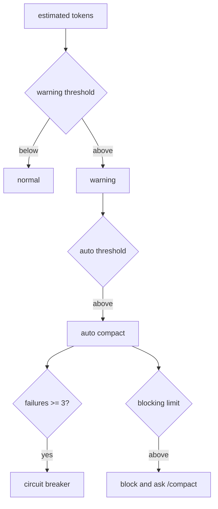

Sources: [src/context/autoCompact.ts:50-97](../../../project-repos/easy-agent/src/context/autoCompact.ts#L50-L97), [src/context/autoCompact.ts:99-144](../../../project-repos/easy-agent/src/context/autoCompact.ts#L99-L144)

<details class="source-snippets">
<summary>引用源码</summary>

<!-- source-snippets:start -->

#### `src/context/autoCompact.ts:50-97`

```typescript
export function calculateTokenWarningState(
  estimatedTokens: number,
  model: string,
): TokenWarningResult {
  const contextWindow = getContextWindowForModel(model);
  const effective = getEffectiveContextWindowSize(model);
  const blockingLimit = getBlockingLimit(model);
  const autoCompactThreshold = getAutoCompactThreshold(model);
  const warningThreshold = Math.max(0, effective - scaleBuffer(WARNING_THRESHOLD_BUFFER_TOKENS, effective));

  let state: TokenWarningState = "normal";
  if (estimatedTokens >= blockingLimit) {
    state = "blocking";
  } else if (estimatedTokens >= autoCompactThreshold) {
    state = "error";
  } else if (estimatedTokens >= warningThreshold) {
    state = "warning";
  }

  return {
    state,
    estimatedTokens,
    threshold: autoCompactThreshold,
    blockingLimit,
    contextWindow,
  };
}

export function isAtBlockingLimit(estimatedTokens: number, model: string): boolean {
  return estimatedTokens >= getBlockingLimit(model);
}

export function shouldAutoCompact(
  estimatedTokens: number,
  model: string,
  querySource?: string,
): boolean {
  if (querySource === "compact" || querySource === "session_memory") {
    return false;
  }
  if (consecutiveAutoCompactFailures >= MAX_CONSECUTIVE_AUTOCOMPACT_FAILURES) {
    debugLog("autoCompact", "circuit_breaker", {
      consecutiveFailures: consecutiveAutoCompactFailures,
    });
    return false;
  }
  return estimatedTokens >= getAutoCompactThreshold(model);
}
```

#### `src/context/autoCompact.ts:99-144`

```typescript
export async function autoCompactIfNeeded(
  messages: MessageParam[],
  model: string,
  options: {
    usage?: Usage;
    usageAnchorIndex?: number;
    systemPrompt?: string;
    querySource?: string;
  },
): Promise&lt;{ result: CompactionResult; didAutoCompact: boolean }&gt; {
  const estimatedTokens = tokenCountWithEstimation(messages, options);

  if (!shouldAutoCompact(estimatedTokens, model, options.querySource)) {
    return {
      result: { messages, didCompact: false, didMicroCompact: false },
      didAutoCompact: false,
    };
  }

  debugLog("autoCompact", "triggering", {
    estimatedTokens,
    threshold: getAutoCompactThreshold(model),
    consecutiveFailures: consecutiveAutoCompactFailures,
  });

  try {
    const result = await compactMessages(messages, undefined, {
      usage: options.usage,
      usageAnchorIndex: options.usageAnchorIndex,
      systemPrompt: options.systemPrompt,
      force: true,
    });
    consecutiveAutoCompactFailures = 0;
    return { result, didAutoCompact: result.didCompact };
  } catch (error) {
    consecutiveAutoCompactFailures++;
    debugLog("autoCompact", "failure", {
      error: error instanceof Error ? error.message : String(error),
      consecutiveFailures: consecutiveAutoCompactFailures,
    });
    return {
      result: { messages, didCompact: false, didMicroCompact: false },
      didAutoCompact: false,
    };
  }
}
```

<!-- source-snippets:end -->
</details>

## Micro 与 Full Compaction

`compactMessages()` 先 micro-compact：对旧的 Read/Grep/Glob/Bash/Edit/Write tool_result 清内容或用 placeholder 替换 binary 内容，只保留最近 8 条消息。若估算 token 仍低于 auto 阈值，就只返回 micro 结果；否则调用 `createMessage()` 生成 summary，保留最近尾部消息并插入 `[CompactBoundary]`。  
Sources: [src/context/compaction.ts:7-18](../../../project-repos/easy-agent/src/context/compaction.ts#L7-L18), [src/context/compaction.ts:98-160](../../../project-repos/easy-agent/src/context/compaction.ts#L98-L160), [src/context/compaction.ts:235-318](../../../project-repos/easy-agent/src/context/compaction.ts#L235-L318)

<details class="source-snippets">
<summary>引用源码</summary>

<!-- source-snippets:start -->

#### `src/context/compaction.ts:7-18`

```typescript
export const OLD_TOOL_RESULT_PLACEHOLDER = "[Old tool result content cleared]";
const MICROCOMPACT_MIN_MESSAGES = 10;
const MICROCOMPACT_KEEP_RECENT_MESSAGES = 8;
const COMPACTABLE_TOOLS = new Set(["Read", "Grep", "Glob", "Bash", "Edit", "Write"]);

const NO_TOOLS_PREAMBLE = CRITICAL: Respond with TEXT ONLY. Do NOT call any tools.

- Do NOT use Read, Bash, Grep, Glob, Edit, Write, or ANY other tool.
- You already have all the context you need in the conversation above.
- Tool calls will be REJECTED and will waste your only turn — you will fail the task.
- Your entire response must be plain text: an &lt;analysis&gt; block followed by a <summary> block.
;
```

#### `src/context/compaction.ts:98-160`

```typescript
function microCompactToolResultContent(content: unknown): string | null {
  if (Array.isArray(content)) {
    const hasOnlyBinary = content.every(
      (b: any) => b.type === "image" || b.type === "document",
    );
    if (hasOnlyBinary) return "[image]";
  }
  return null;
}

function microCompactMessage(message: MessageParam): { message: MessageParam; compactedToolIds: string[] } {
  if (!isContentBlocks(message.content)) {
    return { message, compactedToolIds: [] };
  }

  const compactedToolIds: string[] = [];
  const nextContent = message.content.map((block) => {
    if (block.type !== "tool_result") {
      return block;
    }

    const binaryReplacement = microCompactToolResultContent(block.content);
    if (binaryReplacement) {
      compactedToolIds.push(block.tool_use_id);
      return { ...block, content: binaryReplacement };
    }

    if (typeof block.content !== "string") {
      return block;
    }

    const toolName = block.content.match(/^([A-Za-z0-9_-]+):/)?.[1] ?? null;
    if (!toolName || !COMPACTABLE_TOOLS.has(toolName)) {
      return block;
    }

    compactedToolIds.push(block.tool_use_id);
    return { ...block, content: OLD_TOOL_RESULT_PLACEHOLDER };
  });

  return {
    message: { ...message, content: nextContent },
    compactedToolIds,
  };
}

export function microCompactMessages(messages: MessageParam[]): { messages: MessageParam[]; compactedToolIds: string[] } {
  if (messages.length < MICROCOMPACT_MIN_MESSAGES) {
    return { messages, compactedToolIds: [] };
  }

  const compactedToolIds: string[] = [];
  const nextMessages = messages.map((message, index) => {
    if (index >= messages.length - MICROCOMPACT_KEEP_RECENT_MESSAGES) {
      return message;
    }

    const result = microCompactMessage(message);
    compactedToolIds.push(...result.compactedToolIds);
    return result.message;
  });

  return { messages: nextMessages, compactedToolIds };
```

#### `src/context/compaction.ts:235-318`

```typescript
export async function compactMessages(
  messages: MessageParam[],
  focus?: string,
  options: CompactionCheckOptions = {},
): Promise&lt;CompactionResult&gt; {
  const microcompactResult = microCompactMessages(messages);
  const microCompacted = microcompactResult.messages;
  const microChanged = JSON.stringify(microCompacted) !== JSON.stringify(messages);

  const budget = buildTokenBudgetSnapshot(microCompacted, {
    usage: options.usage,
    usageAnchorIndex: options.usageAnchorIndex,
    systemPrompt: options.systemPrompt,
  });

  debugLog("compact", "budget_check", {
    originalMessageCount: messages.length,
    microMessageCount: microCompacted.length,
    didMicroCompact: microChanged,
    compactedToolIds: microcompactResult.compactedToolIds,
    usageAnchorIndex: options.usageAnchorIndex ?? null,
    estimatedConversationTokens: budget.estimatedConversationTokens,
    autoCompactThreshold: budget.autoCompactThreshold,
    manualCompactThreshold: budget.manualCompactThreshold,
  });

  if (!options.force && budget.estimatedConversationTokens < budget.autoCompactThreshold) {
    debugLog("compact", "skip_full_compact", {
      reason: "below_auto_threshold",
      estimatedConversationTokens: budget.estimatedConversationTokens,
      autoCompactThreshold: budget.autoCompactThreshold,
    });

    return {
      messages: microChanged
        ? [
            ...microCompacted,
            makeCompactBoundary({
              compactType: "micro",
              originalMessageCount: messages.length,
              compactedToolIds: microcompactResult.compactedToolIds,
            }),
          ]
        : microCompacted,
      didCompact: false,
      didMicroCompact: microChanged,
    };
  }

  const summary = await summarizeMessages(microCompacted, focus);
  const desiredTailCount = 8;
  const tailStart = microCompacted.length <= desiredTailCount
    ? microCompacted.length               // short conversation: summary covers everything, no tail
    : findPreservedTailStart(microCompacted, desiredTailCount);
  const tail = microCompacted.slice(tailStart);
  const compacted: MessageParam[] = [
    {
      role: "user",
      content: `This session is being continued from a previous conversation that ran out of context. The summary below covers the earlier portion of the conversation.\n\n${summary}${tail.length > 0 ? "\n\nRecent messages are preserved verbatim." : ""}`,
    },
    makeCompactBoundary({
      compactType: focus ? "manual" : "auto",
      reason: focus,
      originalMessageCount: microCompacted.length,
      compactedToolIds: microcompactResult.compactedToolIds,
    }),
    ...tail,
  ];

  debugLog("compact", "full_compact_applied", {
    focus: focus ?? null,
    tailStart,
    preservedTailCount: tail.length,
    originalMessageCount: messages.length,
    compactedMessageCount: compacted.length,
  });

  return {
    messages: compacted,
    summary,
    didCompact: true,
    didMicroCompact: microChanged,
  };
}
```

<!-- source-snippets:end -->
</details>

## Plan Attachment

Plan mode 的说明不是一段永久 system prompt，而是按节流规则注入 user message。第一次进入 plan mode 注入完整流程，后续按 turn 计数插入 sparse/full reminder；退出 plan mode 时注入一次 `[plan_mode_exit]`。  
Sources: [src/context/planAttachments.ts:1-19](../../../project-repos/easy-agent/src/context/planAttachments.ts#L1-L19), [src/context/planAttachments.ts:23-88](../../../project-repos/easy-agent/src/context/planAttachments.ts#L23-L88), [src/context/planAttachments.ts:129-168](../../../project-repos/easy-agent/src/context/planAttachments.ts#L129-L168)

<details class="source-snippets">
<summary>引用源码</summary>

<!-- source-snippets:start -->

#### `src/context/planAttachments.ts:1-19`

```typescript
/**
 * Plan mode attachments — user-message injection for plan mode state.
 *
 * Claude Code injects plan mode instructions as user messages (attachments)
 * rather than system prompt text. This module replicates that pattern with:
 *
 * - Throttled reminders: injected every N human turns, alternating full/sparse
 * - Exit attachment: one-shot message after leaving plan mode
 *
 * Attachments are tagged with a marker so we can detect them when counting.
 */

import type { MessageParam } from "@anthropic-ai/sdk/resources/messages.js";

export const PLAN_ATTACHMENT_MARKER = "[plan_mode_attachment]";
const PLAN_EXIT_MARKER = "[plan_mode_exit]";

const TURNS_BETWEEN_ATTACHMENTS = 5;
const FULL_REMINDER_EVERY_N = 5;
```

#### `src/context/planAttachments.ts:23-88`

```typescript
function buildFullPlanModeText(planFilePath: string): string {
  return [
    PLAN_ATTACHMENT_MARKER,
    "",
    "PLAN MODE ACTIVE — You are currently in plan mode.",
    "",
    "Workflow:",
    "1. EXPLORE: Use Read, Grep, Glob, and read-only Bash commands (ls, cat, git status, etc.) to understand the codebase.",
    "2. PLAN: Write a detailed implementation plan to the plan file using the structure below.",
    "3. EXIT: Call ExitPlanMode with a summary and any allowedPrompts for auto-approved commands.",
    "",
    "Plan file structure (write to the plan file using this format):",
    "",
    "## Context",
    "Begin with a Context section: what is the problem, what does the user need, what is the expected outcome.",
    "",
    "## Recommended approach",
    "Describe your recommended approach concisely but with enough detail to be executable.",
    "",
    "## Critical files",
    "List the paths of critical files that will be created or modified.",
    "",
    "## Reuse",
    "Identify existing functions, utilities, or patterns in the codebase that should be reused, with paths.",
    "",
    "## Verification",
    "Describe how to test and verify the implementation end-to-end.",
    "",
    "Rules:",
    "- Do NOT use Edit or destructive Bash commands.",
    "- Do NOT use Write on any file except the plan file below.",
    "- Do NOT ask the user for approval via text — use ExitPlanMode when ready.",
    "- You MUST end your turn by either continuing exploration or calling ExitPlanMode.",
    "",
    `Plan file: ${planFilePath}`,
  ].join("\n");
}

// ─── Sparse reminder ───────────────────────────────────────────────

function buildSparsePlanModeText(planFilePath: string): string {
  return [
    PLAN_ATTACHMENT_MARKER,
    "",
    "Reminder: You are still in PLAN MODE. Only read-only tools are allowed.",
    `Write your plan to: ${planFilePath}`,
    "Call ExitPlanMode when your plan is ready.",
  ].join("\n");
}

// ─── Exit attachment ───────────────────────────────────────────────

function buildPlanModeExitText(planFilePath: string, planExists: boolean): string {
  const lines = [
    PLAN_EXIT_MARKER,
    "",
    "You have exited plan mode. Full tool access is now restored.",
  ];
  if (planExists) {
    lines.push(
      `Your approved plan is at: ${planFilePath}`,
      "Proceed with implementing the plan. You may now use Edit, Write, Bash, and all other tools.",
    );
  }
  return lines.join("\n");
}
```

#### `src/context/planAttachments.ts:129-168`

```typescript
/**
 * Returns a plan mode reminder message if it's time for one,
 * or null if the throttle says to skip this turn.
 */
export function getPlanModeAttachment(
  messages: readonly MessageParam[],
  planFilePath: string,
): MessageParam | null {
  const turnsSince = countHumanTurnsSinceLastAttachment(messages);

  // First message in plan mode always gets a full attachment
  const hasAnyAttachment = messages.some(
    (m) => m.role === "user" && typeof m.content === "string" && m.content.includes(PLAN_ATTACHMENT_MARKER),
  );
  if (!hasAnyAttachment) {
    return { role: "user", content: buildFullPlanModeText(planFilePath) };
  }

  if (turnsSince < TURNS_BETWEEN_ATTACHMENTS) {
    return null;
  }

  const attachmentCount = countPlanAttachmentsSinceLastExit(messages) + 1;
  const isFull = attachmentCount % FULL_REMINDER_EVERY_N === 1;

  const text = isFull
    ? buildFullPlanModeText(planFilePath)
    : buildSparsePlanModeText(planFilePath);

  return { role: "user", content: text };
}

/**
 * Returns a one-shot exit attachment, or null if not needed.
 */
export function getPlanModeExitAttachment(
  planFilePath: string,
  planExists: boolean,
): MessageParam {
  return { role: "user", content: buildPlanModeExitText(planFilePath, planExists) };
```

<!-- source-snippets:end -->
</details>

## 相关页面

- [QueryEngine 与 Agentic Loop](query-engine-agentic-loop.md)
- [会话持久化与任务系统](sessions-tasks.md)
- [Skills 系统](skills-system.md)

---

<details>
<summary>相关源文件</summary>

生成本页时使用的主要源文件：

- [src/session/storage.ts](../../../project-repos/easy-agent/src/session/storage.ts)
- [src/session/history.ts](../../../project-repos/easy-agent/src/session/history.ts)
- [src/state/todoStore.ts](../../../project-repos/easy-agent/src/state/todoStore.ts)
- [src/state/taskStore.ts](../../../project-repos/easy-agent/src/state/taskStore.ts)
- [src/state/taskModeStore.ts](../../../project-repos/easy-agent/src/state/taskModeStore.ts)
- [src/types/todo.ts](../../../project-repos/easy-agent/src/types/todo.ts)
- [src/types/task.ts](../../../project-repos/easy-agent/src/types/task.ts)
- [src/tools/todoWriteTool.ts](../../../project-repos/easy-agent/src/tools/todoWriteTool.ts)
- [src/tools/taskCreateTool.ts](../../../project-repos/easy-agent/src/tools/taskCreateTool.ts)
- [src/tools/taskUpdateTool.ts](../../../project-repos/easy-agent/src/tools/taskUpdateTool.ts)
- [src/tools/taskListTool.ts](../../../project-repos/easy-agent/src/tools/taskListTool.ts)
- [src/ui/hooks/useAgentSession.ts](../../../project-repos/easy-agent/src/ui/hooks/useAgentSession.ts)

</details>

# 会话持久化与任务系统

Easy Agent 把对话 transcript、会话恢复、临时 todo 和持久 task graph 分成三层：JSONL 会话日志负责 `/resume`，TodoWrite V1 负责进程内轻量进度展示，Task V2 负责跨重启保存的任务图。  
Sources: [src/session/storage.ts:37-43](../../../project-repos/easy-agent/src/session/storage.ts#L37-L43), [src/state/todoStore.ts:1-10](../../../project-repos/easy-agent/src/state/todoStore.ts#L1-L10), [src/state/taskStore.ts:1-24](../../../project-repos/easy-agent/src/state/taskStore.ts#L1-L24)

<details class="source-snippets">
<summary>引用源码</summary>

<!-- source-snippets:start -->

#### `src/session/storage.ts:37-43`

```typescript
export type TranscriptEntry =
  | { type: "session_meta"; sessionId: string; cwd: string; startedAt: string; model: string }
  | { type: "message"; timestamp: string; role: "user" | "assistant"; message: MessageParam }
  | { type: "tool_event"; timestamp: string; name: string; phase: "start" | "done"; resultLength?: number; isError?: boolean }
  | { type: "usage"; timestamp: string; turn: Usage; total: Usage }
  | { type: "system"; timestamp: string; level: "info" | "error"; message: string }
  | { type: "compaction"; timestamp: string; trigger: "auto" | "manual" };
```

#### `src/state/todoStore.ts:1-10`

```typescript
/**
 * TodoStore — V1 会话级任务清单的内存存储。
 *
 * 对应 Claude Code 源码中 `appState.todos[todoKey]` 的简化版本：
 *   - 按 sessionId 隔离（与源码用 `agentId ?? sessionId` 作 key 等价）
 *   - 全量替换语义（每次 TodoWrite 都覆盖该 session 的列表）
 *   - 通过 listener 通知订阅者（UI 可在此驱动 React 重渲染）
 *
 * 这是个 V1 的**会话内**存储——进程退出即丢失，跨会话不持续。
 * V2 (阶段 15) 会换成磁盘任务图。
```

#### `src/state/taskStore.ts:1-24`

```typescript
/**
 * Task V2 store — persistent task graph on disk.
 *
 * Replicates `claude-code-source-code/src/utils/tasks.ts`, dropping the
 * multi-agent pieces (teammate mailbox, claim-with-busy-check, team name
 * resolution) since Easy Agent is single-agent in stage 15.
 *
 * Layout (per task list):
 *
 *   ~/.easy-agent/tasks/&lt;taskListId&gt;/
 *     1.json
 *     2.json
 *     .highwatermark   <-- max id ever assigned, survives deletes/reset
 *     .lock            <-- proper-lockfile target for list-level ops
 *
 * One file per task gives us:
 *   - atomic per-task writes without reading the whole list
 *   - human-editable state (user can delete/move a single .json)
 *   - per-task locks so independent updates don't serialize
 *
 * `proper-lockfile` is used for list-level critical sections
 * (createTask, resetTaskList) to ensure id allocation and reset are
 * serialized across the process. Per-task updates use per-file locks.
 */
```

<!-- source-snippets:end -->
</details>

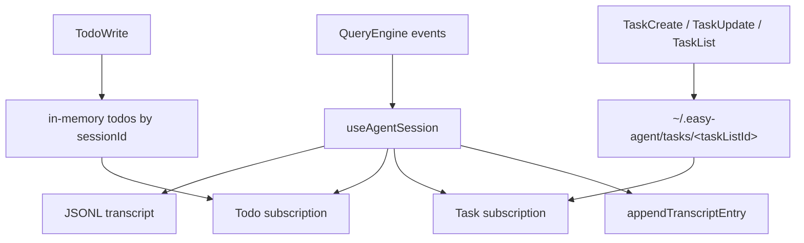

Sources: [src/ui/hooks/useAgentSession.ts:240-288](../../../project-repos/easy-agent/src/ui/hooks/useAgentSession.ts#L240-L288), [src/session/storage.ts:221-226](../../../project-repos/easy-agent/src/session/storage.ts#L221-L226), [src/tools/todoWriteTool.ts:112-149](../../../project-repos/easy-agent/src/tools/todoWriteTool.ts#L112-L149), [src/state/taskStore.ts:47-99](../../../project-repos/easy-agent/src/state/taskStore.ts#L47-L99)

<details class="source-snippets">
<summary>引用源码</summary>

<!-- source-snippets:start -->

#### `src/ui/hooks/useAgentSession.ts:240-288`

```typescript
  // Subscribe to TodoWrite updates. The store is global (mirrors source's
  // `appState.todos` map), so we filter by our own sessionId. When the
  // session is restored or cleared we also re-pull the snapshot.
  useEffect(() => {
    setTodosState(getTodos(sessionIdRef.current));
    const unsubscribe = subscribeTodos((sid, next) => {
      if (sid === sessionIdRef.current) {
        setTodosState(next);
      }
    });
    return unsubscribe;
  }, []);

  // Subscribe to Task V2 updates. Tasks live on disk, so on mount we do
  // one full listTasks to populate the initial view, then refresh every
  // time the store fires a change event for our task list id. Each
  // mutation already runs through the lock budget on the writer side,
  // so the reader doesn't need its own synchronization.
  useEffect(() => {
    let cancelled = false;
    const refresh = async () => {
      const taskListId = getTaskListId(sessionIdRef.current);
      try {
        const list = await listTasks(taskListId);
        if (!cancelled) setTasksState(list);
      } catch {
        // Ignore transient read errors — a future mutation will trigger
        // another refresh that can succeed.
      }
    };
    void refresh();
    const unsubscribe = subscribeTasks((taskListId) => {
      if (taskListId === getTaskListId(sessionIdRef.current)) {
        void refresh();
      }
    });
    return () => {
      cancelled = true;
      unsubscribe();
    };
  }, []);

  // Mirror the global task-mode store into local state so React re-renders
  // when the user flips `/tasks task|todo`. The global store is still the
  // source of truth — tools and permissions.ts read from it directly.
  useEffect(() => {
    setTaskModeState(getTaskMode());
    return subscribeTaskMode((mode) => setTaskModeState(mode));
  }, []);
```

#### `src/session/storage.ts:221-226`

```typescript
export async function appendTranscriptEntry(cwd: string, sessionId: string, entry: TranscriptEntry): Promise&lt;void&gt; {
  const paths = await getSessionPaths(cwd, sessionId);
  await ensureSessionDir(paths);
  await fs.appendFile(paths.transcriptPath, `${JSON.stringify(entry)}\n`, "utf-8");
  await fs.writeFile(paths.latestPath, `${sessionId}\n`, "utf-8");
}
```

#### `src/tools/todoWriteTool.ts:112-149`

```typescript
  async call(input: Record&lt;string, unknown&gt;, context: ToolContext): Promise&lt;ToolResult&gt; {
    const parsed = parseTodos(input);
    if (!Array.isArray(parsed)) {
      return { content: `Error: ${parsed.error}`, isError: true };
    }

    const sessionId = context.sessionId ?? "default";

    // Mirror source code: when every todo is `completed`, store an empty
    // list. The "all done" auto-clear keeps the UI from accumulating stale
    // checkmarks across long sessions.
    const allDone = parsed.length > 0 && parsed.every((t) => t.status === "completed");
    const newStored = allDone ? [] : parsed;
    setTodos(sessionId, newStored);

    // Result text matches source verbatim so the model gets the same
    // post-call nudge it expects from real Claude Code behavior.
    return {
      content:
        "Todos have been modified successfully. " +
        "Ensure that you continue to use the todo list to track your progress. " +
        "Please proceed with the current tasks if applicable",
    };
  },

  isReadOnly() {
    // Writes to in-memory session state — not the filesystem, but it does
    // mutate session-visible state, so we report it as non-read-only.
    // The permission layer special-cases this tool to always allow.
    return false;
  },

  isEnabled() {
    // Mirrors source's `!isTodoV2Enabled()` guard: TodoWrite V1 and the
    // Task V2 tools are mutually exclusive. The runtime toggle lives in
    // taskModeStore and is flipped by `/tasks task|todo`.
    return isTodoModeEnabled();
  },
```

#### `src/state/taskStore.ts:47-99`

```typescript
// ─── Path helpers ──────────────────────────────────────────────────

/**
 * File-path sanitization. We restrict taskListId / taskId components to
 * the character class `[A-Za-z0-9_-]` — anything else becomes `-`. This
 * blocks `../` traversal and arbitrary symlink targets the model might
 * dream up when it sees the raw session id.
 */
export function sanitizePathComponent(input: string): string {
  return input.replace(/[^A-Za-z0-9_-]/g, "-");
}

/**
 * Resolve a sessionId to the corresponding task-list id.
 *
 * Single-agent keeps this 1-to-1. The function exists mostly as a seam
 * for future multi-agent work (leader team name, teammate context) —
 * callers shouldn't assume sessionId itself is safe to use as a path.
 */
export function getTaskListId(sessionId: string): string {
  return sessionId || "default";
}

export function getTasksDir(taskListId: string): string {
  return path.join(getTasksRoot(), sanitizePathComponent(taskListId));
}

export function getTaskPath(taskListId: string, taskId: string): string {
  return path.join(getTasksDir(taskListId), `${sanitizePathComponent(taskId)}.json`);
}

async function ensureTasksDir(taskListId: string): Promise&lt;void&gt; {
  await mkdir(getTasksDir(taskListId), { recursive: true });
}

/**
 * Ensure the list-level lock file exists.
 *
 * `proper-lockfile` refuses to lock a path that doesn't exist, so we
 * touch an empty sentinel file first. The `wx` flag makes the creation
 * idempotent across concurrent callers — the second writer's EEXIST is
 * benign and swallowed.
 */
async function ensureTaskListLockFile(taskListId: string): Promise&lt;string&gt; {
  await ensureTasksDir(taskListId);
  const lockPath = path.join(getTasksDir(taskListId), LOCK_FILE);
  try {
    await writeFile(lockPath, "", { flag: "wx" });
  } catch {
    // Already exists — fine.
  }
  return lockPath;
}
```

<!-- source-snippets:end -->
</details>

## Transcript 模型

`TranscriptEntry` 是 append-only JSONL 事件流，覆盖 session metadata、user/assistant message、tool start/done、usage、system notice 和 compaction marker。会话路径由项目 key 决定，具体文件是 `<sessionId>.jsonl`，同目录还有 `latest` 指针。  
Sources: [src/session/storage.ts:12-43](../../../project-repos/easy-agent/src/session/storage.ts#L12-L43), [src/session/storage.ts:181-218](../../../project-repos/easy-agent/src/session/storage.ts#L181-L218)

<details class="source-snippets">
<summary>引用源码</summary>

<!-- source-snippets:start -->

#### `src/session/storage.ts:12-43`

```typescript
export interface SessionPaths {
  rootDir: string;
  projectDir: string;
  transcriptPath: string;
  latestPath: string;
}

export interface SessionMetadata {
  sessionId: string;
  cwd: string;
  startedAt: string;
  updatedAt: string;
  model: string;
}

export interface SessionSummary {
  sessionId: string;
  cwd: string;
  startedAt: string;
  updatedAt: string;
  model: string;
  messageCount: number;
  totalUsage: Usage;
}

export type TranscriptEntry =
  | { type: "session_meta"; sessionId: string; cwd: string; startedAt: string; model: string }
  | { type: "message"; timestamp: string; role: "user" | "assistant"; message: MessageParam }
  | { type: "tool_event"; timestamp: string; name: string; phase: "start" | "done"; resultLength?: number; isError?: boolean }
  | { type: "usage"; timestamp: string; turn: Usage; total: Usage }
  | { type: "system"; timestamp: string; level: "info" | "error"; message: string }
  | { type: "compaction"; timestamp: string; trigger: "auto" | "manual" };
```

#### `src/session/storage.ts:181-218`

```typescript
export function createSessionId(): string {
  return crypto.randomUUID();
}

export async function getProjectHash(cwd: string): Promise&lt;string&gt; {
  const info = await getProjectPathInfo(cwd);
  return info.projectKey;
}

export async function getSessionPaths(cwd: string, sessionId: string): Promise&lt;SessionPaths&gt; {
  const info = await getProjectPathInfo(cwd);
  return {
    rootDir: getEasyAgentHome(),
    projectDir: info.projectDir,
    transcriptPath: path.join(info.projectDir, `${sessionId}.jsonl`),
    latestPath: path.join(info.projectDir, "latest"),
  };
}

async function ensureSessionDir(paths: SessionPaths): Promise&lt;void&gt; {
  await fs.mkdir(paths.projectDir, { recursive: true });
}

export async function initSessionStorage(metadata: SessionMetadata): Promise&lt;SessionPaths&gt; {
  const paths = await getSessionPaths(metadata.cwd, metadata.sessionId);
  await ensureSessionDir(paths);

  const metaEntry: TranscriptEntry = {
    type: "session_meta",
    sessionId: metadata.sessionId,
    cwd: metadata.cwd,
    startedAt: metadata.startedAt,
    model: metadata.model,
  };

  await fs.writeFile(paths.transcriptPath, `${JSON.stringify(metaEntry)}\n`, { flag: "a" });
  await fs.writeFile(paths.latestPath, `${metadata.sessionId}\n`, "utf-8");
  return paths;
```

<!-- source-snippets:end -->
</details>

初始化会话时写入 `session_meta` 并更新 `latest`；每次追加事件也会重写 `latest`，所以 `/resume` 默认恢复最近一次活跃会话。  
Sources: [src/session/storage.ts:204-226](../../../project-repos/easy-agent/src/session/storage.ts#L204-L226), [src/session/storage.ts:238-247](../../../project-repos/easy-agent/src/session/storage.ts#L238-L247)

<details class="source-snippets">
<summary>引用源码</summary>

<!-- source-snippets:start -->

#### `src/session/storage.ts:204-226`

```typescript
export async function initSessionStorage(metadata: SessionMetadata): Promise&lt;SessionPaths&gt; {
  const paths = await getSessionPaths(metadata.cwd, metadata.sessionId);
  await ensureSessionDir(paths);

  const metaEntry: TranscriptEntry = {
    type: "session_meta",
    sessionId: metadata.sessionId,
    cwd: metadata.cwd,
    startedAt: metadata.startedAt,
    model: metadata.model,
  };

  await fs.writeFile(paths.transcriptPath, `${JSON.stringify(metaEntry)}\n`, { flag: "a" });
  await fs.writeFile(paths.latestPath, `${metadata.sessionId}\n`, "utf-8");
  return paths;
}

export async function appendTranscriptEntry(cwd: string, sessionId: string, entry: TranscriptEntry): Promise&lt;void&gt; {
  const paths = await getSessionPaths(cwd, sessionId);
  await ensureSessionDir(paths);
  await fs.appendFile(paths.transcriptPath, `${JSON.stringify(entry)}\n`, "utf-8");
  await fs.writeFile(paths.latestPath, `${sessionId}\n`, "utf-8");
}
```

#### `src/session/storage.ts:238-247`

```typescript
export async function getLatestSessionId(cwd: string): Promise&lt;string | null&gt; {
  const { latestPath } = await getSessionPaths(cwd, "placeholder");
  try {
    const value = (await fs.readFile(latestPath, "utf-8")).trim();
    return value || null;
  } catch (error: unknown) {
    const err = error as NodeJS.ErrnoException;
    if (err?.code === "ENOENT") return null;
    throw error;
  }
```

<!-- source-snippets:end -->
</details>

## 恢复语义

`restoreSession()` 先解析 JSONL，再定位最后一个 `compaction` marker，只把 marker 之后的 message 还原进模型上下文。它仍然从完整 transcript 中取最新 usage，用于 UI 的累计用量展示。  
Sources: [src/session/storage.ts:250-296](../../../project-repos/easy-agent/src/session/storage.ts#L250-L296)

<details class="source-snippets">
<summary>引用源码</summary>

<!-- source-snippets:start -->

#### `src/session/storage.ts:250-296`

```typescript
export async function restoreSession(cwd: string, sessionId?: string): Promise&lt;RestoredSession&gt; {
  const resolvedSessionId = sessionId ?? (await getLatestSessionId(cwd));
  if (!resolvedSessionId) {
    throw new Error("No saved session found for this project.");
  }

  const { transcriptPath } = await getSessionPaths(cwd, resolvedSessionId);
  const entries = await readTranscriptEntries(transcriptPath);
  if (entries.length === 0) {
    throw new Error(`Session ${resolvedSessionId} is empty or unreadable.`);
  }

  const meta = entries.find((entry): entry is Extract&lt;TranscriptEntry, { type: "session_meta" }&gt; => entry.type === "session_meta");
  if (!meta) {
    throw new Error(`Session ${resolvedSessionId} is missing session metadata.`);
  }

  // Find the last compaction marker; only use messages after it
  let startIndex = 0;
  for (let i = entries.length - 1; i >= 0; i--) {
    if (entries[i]!.type === "compaction") {
      startIndex = i + 1;
      break;
    }
  }
  const messages = entries
    .slice(startIndex)
    .filter((entry): entry is Extract&lt;TranscriptEntry, { type: "message" }&gt; => entry.type === "message")
    .map((entry) => entry.message);

  const latestUsage = [...entries]
    .reverse()
    .find((entry): entry is Extract&lt;TranscriptEntry, { type: "usage" }&gt; => entry.type === "usage");

  return {
    summary: {
      sessionId: meta.sessionId,
      cwd: meta.cwd,
      startedAt: meta.startedAt,
      updatedAt: getLastUpdatedAt(entries, meta.startedAt),
      model: meta.model,
      messageCount: messages.length,
      totalUsage: latestUsage?.total ?? createEmptyUsage(),
    },
    messages,
  };
}
```

<!-- source-snippets:end -->
</details>

`/history` 不是直接打印文件名，而是通过 `listProjectSessions()` 汇总最近 20 个 session，展示更新时间、消息数、token usage 和模型名。  
Sources: [src/session/storage.ts:319-362](../../../project-repos/easy-agent/src/session/storage.ts#L319-L362), [src/session/history.ts:1-29](../../../project-repos/easy-agent/src/session/history.ts#L1-L29), [src/core/queryEngine.ts:597-603](../../../project-repos/easy-agent/src/core/queryEngine.ts#L597-L603)

<details class="source-snippets">
<summary>引用源码</summary>

<!-- source-snippets:start -->

#### `src/session/storage.ts:319-362`

```typescript
export async function listProjectSessions(cwd: string, limit = MAX_SESSIONS): Promise&lt;SessionSummary[]&gt; {
  const projectDir = (await getSessionPaths(cwd, "placeholder")).projectDir;
  let entries: Dirent[];

  try {
    entries = await fs.readdir(projectDir, { withFileTypes: true });
  } catch (error: unknown) {
    const err = error as NodeJS.ErrnoException;
    if (err?.code === "ENOENT") return [];
    throw error;
  }

  const sessionFiles = entries
    .filter((entry) => entry.isFile() && entry.name.endsWith(".jsonl"))
    .map((entry) => path.join(projectDir, entry.name));

  const sessions = await Promise.all(
    sessionFiles.map(async (filePath) => {
      const transcriptEntries = await readTranscriptEntries(filePath);
      const meta = transcriptEntries.find((entry): entry is Extract&lt;TranscriptEntry, { type: "session_meta" }&gt; => entry.type === "session_meta");
      if (!meta) return null;

      const messages = transcriptEntries.filter((entry) => entry.type === "message");
      const latestUsage = [...transcriptEntries]
        .reverse()
        .find((entry): entry is Extract&lt;TranscriptEntry, { type: "usage" }&gt; => entry.type === "usage");

      return {
        sessionId: meta.sessionId,
        cwd: meta.cwd,
        startedAt: meta.startedAt,
        updatedAt: getLastUpdatedAt(transcriptEntries, meta.startedAt),
        model: meta.model,
        messageCount: messages.length,
        totalUsage: latestUsage?.total ?? createEmptyUsage(),
      } satisfies SessionSummary;
    }),
  );

  return sessions
    .filter((session): session is SessionSummary => session !== null)
    .sort((a, b) => b.updatedAt.localeCompare(a.updatedAt))
    .slice(0, limit);
}
```

#### `src/session/history.ts:1-29`

```typescript
import { listProjectSessions, type SessionSummary } from "./storage.js";

function formatSessionUsage(summary: SessionSummary): string {
  const total = summary.totalUsage.input_tokens + summary.totalUsage.output_tokens;
  return `${summary.totalUsage.input_tokens} in / ${summary.totalUsage.output_tokens} out / ${total} total`;
}

export async function formatProjectSessionHistory(cwd: string): Promise&lt;string&gt; {
  const sessions = await listProjectSessions(cwd);
  if (sessions.length === 0) {
    return "No saved sessions found for this project.";
  }

  const lines = ["Recent sessions:"];
  for (const session of sessions) {
    lines.push(
      [
        `- ${session.sessionId}`,
        `  Updated: ${session.updatedAt}`,
        `  Started: ${session.startedAt}`,
        `  Messages: ${session.messageCount}`,
        `  Usage: ${formatSessionUsage(session)}`,
        `  Model: ${session.model}`,
      ].join("\n"),
    );
  }

  return lines.join("\n");
}
```

#### `src/core/queryEngine.ts:597-603`

```typescript
      case "history":
        yield {
          type: "command",
          kind: "info",
          message: await formatProjectSessionHistory(this.toolContext.cwd),
        };
        return { handled: true };
```

<!-- source-snippets:end -->
</details>

## UI 写入点

UI hook 对 LLM 触发型输入写入用户原始文本，包括 skill slash invocation 的原始命令；工具开始和结束写入 `tool_event`；assistant message、tool_result message、usage、system notice 和 error 都分别追加 transcript entry。  
Sources: [src/ui/hooks/useAgentSession.ts:506-528](../../../project-repos/easy-agent/src/ui/hooks/useAgentSession.ts#L506-L528), [src/ui/hooks/useAgentSession.ts:551-640](../../../project-repos/easy-agent/src/ui/hooks/useAgentSession.ts#L551-L640), [src/ui/hooks/useAgentSession.ts:645-687](../../../project-repos/easy-agent/src/ui/hooks/useAgentSession.ts#L645-L687), [src/ui/hooks/useAgentSession.ts:773-785](../../../project-repos/easy-agent/src/ui/hooks/useAgentSession.ts#L773-L785)

<details class="source-snippets">
<summary>引用源码</summary>

<!-- source-snippets:start -->

#### `src/ui/hooks/useAgentSession.ts:506-528`

```typescript
    const skillCommandName = isSlashCommand
      ? trimmed.slice(1).split(/\s+/, 1)[0]?.toLowerCase() ?? ""
      : "";
    const isSkillCommand =
      isSlashCommand && !!skillCommandName && !!findSkill(skillCommandName);
    const isLlmTriggering = !isSlashCommand || isSkillCommand;

    cancelPendingText();
    setStreamingText("");
    setToolCalls([]);
    setSystemNotice(null);
    if (isLlmTriggering) {
      setLastUsage(null);
      // Persist what the user actually typed (`/hello-world Easy Agent`)
      // rather than the expanded SKILL.md body. The expanded prompt is
      // an internal/wire-only artifact — keeping the transcript clean
      // means /resume replays the same UX the user originally saw.
      await appendTranscriptEntry(toolContext.cwd, sessionIdRef.current, {
        type: "message",
        timestamp: new Date().toISOString(),
        role: "user",
        message: { role: "user", content: trimmed },
      });
```

#### `src/ui/hooks/useAgentSession.ts:551-640`

```typescript
        switch (value.type) {
          case "text":
            // Coalesce rapid SSE chunks into a 30ms window. Without this
            // every chunk forces a full Ink frame repaint, and combined
            // with the TodoList / ToolCallList above it the terminal
            // flickers and refuses to scroll.
            pendingTextRef.current += value.text;
            if (!flushTimerRef.current) {
              flushTimerRef.current = setTimeout(flushPendingText, 30);
            }
            break;
          case "tool_use_start":
            setToolCalls((prev) => [...prev, { id: value.id, name: value.name }]);
            await appendTranscriptEntry(toolContext.cwd, sessionIdRef.current, {
              type: "tool_event",
              timestamp: new Date().toISOString(),
              name: value.name,
              phase: "start",
            });
            break;
          case "permission_request":
            setSpinnerLabel("Waiting for permission");
            setPermissionPrompt({
              toolName: value.request.toolName,
              summary: value.request.summary,
              risk: value.request.risk,
              ruleHint: value.request.ruleHint,
            });
            break;
          case "tool_use_done": {
            const isPlanFileWrite =
              (value.name === "Write" || value.name === "Edit") &&
              value.result.content.includes(getPlansDirectory());
            const inputPreview = formatToolInputPreview(value.input);
            // Strip the model-only &lt;sandbox_violations&gt; tag from the
            // user-visible error message. The tag stays in the tool
            // result that goes back to the model (so it can interpret
            // sandbox denials), but humans see clean stderr only.
            const rawErrorMessage = value.result.isError ? value.result.content : undefined;
            const errorMessage = rawErrorMessage
              ? removeSandboxViolationTags(rawErrorMessage)
              : undefined;
            setToolCalls((prev) =>
              markToolCallComplete(prev, value.id, {
                resultLength: value.result.content.length,
                isError: value.result.isError,
                displayName: isPlanFileWrite ? "Updated plan" : undefined,
                displayHint: isPlanFileWrite ? "/plan to preview" : undefined,
                inputPreview,
                errorMessage,
              }),
            );
            await appendTranscriptEntry(toolContext.cwd, sessionIdRef.current, {
              type: "tool_event",
              timestamp: new Date().toISOString(),
              name: value.name,
              phase: "done",
              resultLength: value.result.content.length,
              isError: value.result.isError,
            });
            break;
          }
          case "assistant_message":
            // The full assistant text is committed to `messages` and will
            // render via ConversationView. Drop any unflushed pending
            // chunk so it can't overwrite the cleared streaming line.
            cancelPendingText();
            setStreamingText("");
            await appendTranscriptEntry(toolContext.cwd, sessionIdRef.current, {
              type: "message",
              timestamp: new Date().toISOString(),
              role: "assistant",
              message: value.message,
            });
            break;
          case "tool_result_message":
            setSpinnerLabel("Thinking");
            setPermissionPrompt(null);
            // Tool results are now committed to `messages` — the cards
            // will render inline in ConversationView from here on, so we
            // drop the live in-flight cards to avoid duplication and, more
            // importantly, to keep the final assistant text rendered
            // BELOW its tool calls (not above them).
            setToolCalls([]);
            await appendTranscriptEntry(toolContext.cwd, sessionIdRef.current, {
              type: "message",
              timestamp: new Date().toISOString(),
              role: "user",
              message: value.message,
            });
```

#### `src/ui/hooks/useAgentSession.ts:645-687`

```typescript
          case "usage_updated":
            {
              const engineMessages = engineRef.current?.getState().messages ?? [];
              const usageAnchorIndex = engineMessages.length > 0 ? engineMessages.length - 1 : -1;
              const snapshot = buildTokenBudgetSnapshot(engineMessages, {
                usage: value.lastCallUsage,
                usageAnchorIndex,
              });
              const contextPercent = Math.round((snapshot.estimatedConversationTokens / snapshot.contextWindow) * 100);
              const turnInput = value.turnUsage.input_tokens
                + (value.turnUsage.cache_creation_input_tokens ?? 0)
                + (value.turnUsage.cache_read_input_tokens ?? 0);
              const totalInput = value.totalUsage.input_tokens
                + (value.totalUsage.cache_creation_input_tokens ?? 0)
                + (value.totalUsage.cache_read_input_tokens ?? 0);
              setLastUsage({
                input: turnInput,
                output: value.turnUsage.output_tokens,
                contextTokens: snapshot.estimatedConversationTokens,
                contextPercent,
              });
              setTotalUsage({
                input: totalInput,
                output: value.totalUsage.output_tokens,
                contextTokens: snapshot.estimatedConversationTokens,
                contextPercent,
              });
            }
            await appendTranscriptEntry(toolContext.cwd, sessionIdRef.current, {
              type: "usage",
              timestamp: new Date().toISOString(),
              turn: value.turnUsage,
              total: value.totalUsage,
            });
            break;
          case "command":
            setSystemNotice(buildCommandNotice(value.message, value.kind));
            await appendTranscriptEntry(toolContext.cwd, sessionIdRef.current, {
              type: "system",
              timestamp: new Date().toISOString(),
              level: value.kind,
              message: value.message,
            });
```

#### `src/ui/hooks/useAgentSession.ts:773-785`

```typescript
          case "error":
            setSystemNotice({
              tone: "error",
              title: "Agent error",
              body: value.error.message,
            });
            await appendTranscriptEntry(toolContext.cwd, sessionIdRef.current, {
              type: "system",
              timestamp: new Date().toISOString(),
              level: "error",
              message: value.error.message,
            });
            break;
```

<!-- source-snippets:end -->
</details>

非 micro compaction 会走 `appendCompactionSnapshot()`：先写一个 compaction marker，再把压缩后的 message snapshot 追加到 transcript。恢复时只读取 marker 之后的 message，避免旧上下文和 summary 同时进入模型。  
Sources: [src/session/storage.ts:267-278](../../../project-repos/easy-agent/src/session/storage.ts#L267-L278), [src/session/storage.ts:298-317](../../../project-repos/easy-agent/src/session/storage.ts#L298-L317), [src/ui/hooks/useAgentSession.ts:689-715](../../../project-repos/easy-agent/src/ui/hooks/useAgentSession.ts#L689-L715)

<details class="source-snippets">
<summary>引用源码</summary>

<!-- source-snippets:start -->

#### `src/session/storage.ts:267-278`

```typescript
  // Find the last compaction marker; only use messages after it
  let startIndex = 0;
  for (let i = entries.length - 1; i >= 0; i--) {
    if (entries[i]!.type === "compaction") {
      startIndex = i + 1;
      break;
    }
  }
  const messages = entries
    .slice(startIndex)
    .filter((entry): entry is Extract&lt;TranscriptEntry, { type: "message" }&gt; => entry.type === "message")
    .map((entry) => entry.message);
```

#### `src/session/storage.ts:298-317`

```typescript
export async function appendCompactionSnapshot(
  cwd: string,
  sessionId: string,
  trigger: "auto" | "manual",
  messages: MessageParam[],
): Promise&lt;void&gt; {
  const paths = await getSessionPaths(cwd, sessionId);
  await ensureSessionDir(paths);
  const lines: string[] = [];
  lines.push(JSON.stringify({ type: "compaction", timestamp: new Date().toISOString(), trigger }));
  for (const msg of messages) {
    lines.push(JSON.stringify({
      type: "message",
      timestamp: new Date().toISOString(),
      role: msg.role,
      message: msg,
    }));
  }
  await fs.appendFile(paths.transcriptPath, lines.join("\n") + "\n", "utf-8");
}
```

#### `src/ui/hooks/useAgentSession.ts:689-715`

```typescript
          case "compacted": {
            const compactTitle = value.trigger === "micro"
              ? "Context micro-compacted"
              : value.trigger === "auto"
                ? "Context auto-compacted"
                : "Conversation compacted";
            const compactBody = value.trigger === "micro"
              ? "Old tool results cleared to save context space."
              : "Conversation history has been summarized to free up context window.";
            setSystemNotice({ tone: "info", title: compactTitle, body: compactBody });
            if (value.trigger !== "micro") {
              const compactedMessages = engineRef.current?.getState().messages ?? [];
              await appendCompactionSnapshot(
                toolContext.cwd,
                sessionIdRef.current,
                value.trigger as "auto" | "manual",
                compactedMessages,
              );
            } else {
              await appendTranscriptEntry(toolContext.cwd, sessionIdRef.current, {
                type: "system",
                timestamp: new Date().toISOString(),
                level: "info",
                message: `compaction:${value.trigger}`,
              });
            }
            break;
```

<!-- source-snippets:end -->
</details>

## TodoWrite V1

Todo V1 是按 sessionId 隔离的内存 Map。它只有 `content`、`status`、`activeForm` 三个字段，没有 id、依赖、owner，也不跨进程持久化。  
Sources: [src/types/todo.ts:1-20](../../../project-repos/easy-agent/src/types/todo.ts#L1-L20), [src/state/todoStore.ts:13-49](../../../project-repos/easy-agent/src/state/todoStore.ts#L13-L49)

<details class="source-snippets">
<summary>引用源码</summary>

<!-- source-snippets:start -->

#### `src/types/todo.ts:1-20`

```typescript
/**
 * TodoItem — V1 会话级任务清单的数据结构。
 *
 * 严格对齐 Claude Code 源码 `src/utils/todo/types.ts`：
 *   - 三种状态：pending / in_progress / completed
 *   - 没有 `id` 字段（content 自身即标识）
 *   - 同时要求 `content`（祈使句）和 `activeForm`（现在进行时）
 *     —— 后者是 spinner 文案的关键字段
 */

export type TodoStatus = "pending" | "in_progress" | "completed";

export interface TodoItem {
  /** 祈使句任务描述，如 "Run the tests"。 */
  content: string;
  /** 任务状态。 */
  status: TodoStatus;
  /** 现在进行时形式，in_progress 时给 spinner 显示，如 "Running the tests"。 */
  activeForm: string;
}
```

#### `src/state/todoStore.ts:13-49`

```typescript
import type { TodoItem } from "../types/todo.js";

type Listener = (sessionId: string, todos: TodoItem[]) => void;

const todosBySession = new Map&lt;string, TodoItem[]&gt;();
const listeners = new Set&lt;Listener&gt;();

/** 读取某 session 当前的 todos（不存在则返回空数组）。 */
export function getTodos(sessionId: string): TodoItem[] {
  return todosBySession.get(sessionId) ?? [];
}

/** 全量替换某 session 的 todos，并通知所有订阅者。 */
export function setTodos(sessionId: string, todos: TodoItem[]): void {
  todosBySession.set(sessionId, todos);
  for (const listener of listeners) {
    listener(sessionId, todos);
  }
}

/**
 * 订阅 todos 变化。返回的函数用于取消订阅。
 *
 * 注意：所有 session 的更新都会推送到 listener，订阅方要自己按
 * sessionId 过滤——这与源码 AppState 的"全局 store + 本地过滤"一致。
 */
export function subscribeTodos(listener: Listener): () => void {
  listeners.add(listener);
  return () => {
    listeners.delete(listener);
  };
}

/** 测试/重置用：清空某 session 的 todos。 */
export function clearTodos(sessionId: string): void {
  setTodos(sessionId, []);
}
```

<!-- source-snippets:end -->
</details>

`TodoWrite` 输入是完整 todo 列表，每次调用都会全量替换当前 session 的状态；如果所有 todo 都是 `completed`，它存空数组，避免 UI 长期堆积已完成项。该工具只在 `todo` 模式启用。  
Sources: [src/tools/todoWriteTool.ts:1-18](../../../project-repos/easy-agent/src/tools/todoWriteTool.ts#L1-L18), [src/tools/todoWriteTool.ts:68-149](../../../project-repos/easy-agent/src/tools/todoWriteTool.ts#L68-L149)

<details class="source-snippets">
<summary>引用源码</summary>

<!-- source-snippets:start -->

#### `src/tools/todoWriteTool.ts:1-18`

```typescript
/**
 * TodoWriteTool — V1 会话级任务清单工具。
 *
 * 严格参照 Claude Code 源码 `tools/TodoWriteTool/TodoWriteTool.ts` 的语义：
 *
 *   1. 输入只有一个 `todos: TodoItem[]`，每次**全量替换**之前的列表
 *   2. allDone（全部 completed）→ 存为空数组，"用完即归零"
 *   3. 状态写入按 sessionId 隔离的内存 store（对应源码的
 *      `appState.todos[agentId ?? sessionId]`）
 *   4. tool result 文本与源码一致："Todos have been modified successfully..."
 *   5. 权限层面：源码用 `shouldDefer: true` + `checkPermissions: allow`
 *      ——本仓库在 `permissions.ts` 里把 TodoWrite 写成全模式 allow
 *
 * V1 的三个内生限制（待 V2 解决）：
 *   - 仅会话内（进程退出即失）
 *   - 平铺列表，无依赖关系
 *   - 单 agent，无 owner / claim
 */
```

#### `src/tools/todoWriteTool.ts:68-149`

```typescript
export const todoWriteTool: Tool = {
  name: TODO_WRITE_TOOL_NAME,

  description:
    "Update the todo list for the current session. To be used proactively and often to track progress and pending tasks. " +
    "Make sure that at least one task is in_progress at all times. " +
    "Always provide both content (imperative) and activeForm (present continuous) for each task.",

  inputSchema: {
    type: "object" as const,
    properties: {
      todos: {
        type: "array",
        description: "The full updated todo list. Each call REPLACES the entire list.",
        items: {
          type: "object",
          properties: {
            content: {
              type: "string",
              minLength: 1,
              description: "Imperative task description, e.g. 'Run the tests'.",
            },
            status: {
              type: "string",
              enum: ["pending", "in_progress", "completed"],
              description:
                "Task status. Exactly ONE task should be in_progress at any time.",
            },
            activeForm: {
              type: "string",
              minLength: 1,
              description:
                "Present continuous form shown in the spinner while the task runs, e.g. 'Running the tests'.",
            },
          },
          required: ["content", "status", "activeForm"],
          additionalProperties: false,
        },
      },
    },
    required: ["todos"],
    additionalProperties: false,
  },

  async call(input: Record&lt;string, unknown&gt;, context: ToolContext): Promise&lt;ToolResult&gt; {
    const parsed = parseTodos(input);
    if (!Array.isArray(parsed)) {
      return { content: `Error: ${parsed.error}`, isError: true };
    }

    const sessionId = context.sessionId ?? "default";

    // Mirror source code: when every todo is `completed`, store an empty
    // list. The "all done" auto-clear keeps the UI from accumulating stale
    // checkmarks across long sessions.
    const allDone = parsed.length > 0 && parsed.every((t) => t.status === "completed");
    const newStored = allDone ? [] : parsed;
    setTodos(sessionId, newStored);

    // Result text matches source verbatim so the model gets the same
    // post-call nudge it expects from real Claude Code behavior.
    return {
      content:
        "Todos have been modified successfully. " +
        "Ensure that you continue to use the todo list to track your progress. " +
        "Please proceed with the current tasks if applicable",
    };
  },

  isReadOnly() {
    // Writes to in-memory session state — not the filesystem, but it does
    // mutate session-visible state, so we report it as non-read-only.
    // The permission layer special-cases this tool to always allow.
    return false;
  },

  isEnabled() {
    // Mirrors source's `!isTodoV2Enabled()` guard: TodoWrite V1 and the
    // Task V2 tools are mutually exclusive. The runtime toggle lives in
    // taskModeStore and is flipped by `/tasks task|todo`.
    return isTodoModeEnabled();
  },
```

<!-- source-snippets:end -->
</details>

## Task V2 持久任务图

Task V2 默认启用，任务被写到 `~/.easy-agent/tasks/<taskListId>/` 下，每个任务一个 JSON 文件，并用 `.highwatermark` 保存历史最大 id，用 `.lock` 做列表级互斥。这个布局让任务跨重启保存，并避免 reset/delete 后复用旧 id。  
Sources: [src/state/taskModeStore.ts:1-17](../../../project-repos/easy-agent/src/state/taskModeStore.ts#L1-L17), [src/state/taskStore.ts:1-24](../../../project-repos/easy-agent/src/state/taskStore.ts#L1-L24), [src/state/taskStore.ts:47-99](../../../project-repos/easy-agent/src/state/taskStore.ts#L47-L99), [src/state/taskStore.ts:101-145](../../../project-repos/easy-agent/src/state/taskStore.ts#L101-L145)

<details class="source-snippets">
<summary>引用源码</summary>

<!-- source-snippets:start -->

#### `src/state/taskModeStore.ts:1-17`

```typescript
/**
 * Task-tracking mode — runtime toggle between Task V2 and TodoWrite V1.
 *
 * Claude Code uses an env var (`CLAUDE_CODE_ENABLE_TASKS`) read at boot
 * time. We deliberately lift that into a REPL command (`/tasks task|todo`)
 * so the user can flip modes inside a live session without restarting.
 *
 * `"task"` is the default (persistent task graph). `"todo"` falls back
 * to the V1 session-memory list. The selection is process-global: all
 * tool `isEnabled()` checks read from here.
 */

export type TaskMode = "task" | "todo";

const DEFAULT_TASK_MODE: TaskMode = "task";

let currentMode: TaskMode = DEFAULT_TASK_MODE;
```

#### `src/state/taskStore.ts:1-24`

```typescript
/**
 * Task V2 store — persistent task graph on disk.
 *
 * Replicates `claude-code-source-code/src/utils/tasks.ts`, dropping the
 * multi-agent pieces (teammate mailbox, claim-with-busy-check, team name
 * resolution) since Easy Agent is single-agent in stage 15.
 *
 * Layout (per task list):
 *
 *   ~/.easy-agent/tasks/&lt;taskListId&gt;/
 *     1.json
 *     2.json
 *     .highwatermark   <-- max id ever assigned, survives deletes/reset
 *     .lock            <-- proper-lockfile target for list-level ops
 *
 * One file per task gives us:
 *   - atomic per-task writes without reading the whole list
 *   - human-editable state (user can delete/move a single .json)
 *   - per-task locks so independent updates don't serialize
 *
 * `proper-lockfile` is used for list-level critical sections
 * (createTask, resetTaskList) to ensure id allocation and reset are
 * serialized across the process. Per-task updates use per-file locks.
 */
```

#### `src/state/taskStore.ts:47-99`

```typescript
// ─── Path helpers ──────────────────────────────────────────────────

/**
 * File-path sanitization. We restrict taskListId / taskId components to
 * the character class `[A-Za-z0-9_-]` — anything else becomes `-`. This
 * blocks `../` traversal and arbitrary symlink targets the model might
 * dream up when it sees the raw session id.
 */
export function sanitizePathComponent(input: string): string {
  return input.replace(/[^A-Za-z0-9_-]/g, "-");
}

/**
 * Resolve a sessionId to the corresponding task-list id.
 *
 * Single-agent keeps this 1-to-1. The function exists mostly as a seam
 * for future multi-agent work (leader team name, teammate context) —
 * callers shouldn't assume sessionId itself is safe to use as a path.
 */
export function getTaskListId(sessionId: string): string {
  return sessionId || "default";
}

export function getTasksDir(taskListId: string): string {
  return path.join(getTasksRoot(), sanitizePathComponent(taskListId));
}

export function getTaskPath(taskListId: string, taskId: string): string {
  return path.join(getTasksDir(taskListId), `${sanitizePathComponent(taskId)}.json`);
}

async function ensureTasksDir(taskListId: string): Promise&lt;void&gt; {
  await mkdir(getTasksDir(taskListId), { recursive: true });
}

/**
 * Ensure the list-level lock file exists.
 *
 * `proper-lockfile` refuses to lock a path that doesn't exist, so we
 * touch an empty sentinel file first. The `wx` flag makes the creation
 * idempotent across concurrent callers — the second writer's EEXIST is
 * benign and swallowed.
 */
async function ensureTaskListLockFile(taskListId: string): Promise&lt;string&gt; {
  await ensureTasksDir(taskListId);
  const lockPath = path.join(getTasksDir(taskListId), LOCK_FILE);
  try {
    await writeFile(lockPath, "", { flag: "wx" });
  } catch {
    // Already exists — fine.
  }
  return lockPath;
}
```

#### `src/state/taskStore.ts:101-145`

```typescript
// ─── High water mark ───────────────────────────────────────────────

function getHighWaterMarkPath(taskListId: string): string {
  return path.join(getTasksDir(taskListId), HIGH_WATER_MARK_FILE);
}

async function readHighWaterMark(taskListId: string): Promise&lt;number&gt; {
  try {
    const content = (await readFile(getHighWaterMarkPath(taskListId), "utf-8")).trim();
    const value = parseInt(content, 10);
    return Number.isNaN(value) ? 0 : value;
  } catch {
    return 0;
  }
}

async function writeHighWaterMark(taskListId: string, value: number): Promise&lt;void&gt; {
  await writeFile(getHighWaterMarkPath(taskListId), String(value));
}

async function findHighestTaskIdFromFiles(taskListId: string): Promise&lt;number&gt; {
  let files: string[];
  try {
    files = await readdir(getTasksDir(taskListId));
  } catch {
    return 0;
  }
  let highest = 0;
  for (const file of files) {
    if (!file.endsWith(".json")) continue;
    const parsed = parseInt(file.replace(".json", ""), 10);
    if (!Number.isNaN(parsed) && parsed > highest) {
      highest = parsed;
    }
  }
  return highest;
}

async function findHighestTaskId(taskListId: string): Promise&lt;number&gt; {
  const [fromFiles, fromMark] = await Promise.all([
    findHighestTaskIdFromFiles(taskListId),
    readHighWaterMark(taskListId),
  ]);
  return Math.max(fromFiles, fromMark);
}
```

<!-- source-snippets:end -->
</details>

Task schema 用递增字符串 id，包含 `subject`、`description`、可选 `activeForm`、`owner`、`status`、`blocks`、`blockedBy` 和 `metadata`。`owner` 与 metadata 为后续多 agent/扩展保留，当前单 agent 流程不会依赖它们。  
Sources: [src/types/task.ts:1-36](../../../project-repos/easy-agent/src/types/task.ts#L1-L36)

<details class="source-snippets">
<summary>引用源码</summary>

<!-- source-snippets:start -->

#### `src/types/task.ts:1-36`

```typescript
/**
 * Task V2 data model.
 *
 * Mirrors `claude-code-source-code/src/utils/tasks.ts::TaskSchema`:
 *   - id is an incrementing numeric string ("1", "2", ...), stable across
 *     restarts thanks to the high water mark file.
 *   - `blocks` / `blockedBy` store task ids, maintained bidirectionally by
 *     the store so the model only has to set one side.
 *   - `owner` is kept in the schema for forward-compat with multi-agent
 *     (stage 24+). Single-agent never writes it.
 *   - `metadata` is a free-form bag for tool-specific state (e.g. hooks,
 *     verification flags). Nothing in V2 depends on it.
 */

export const TASK_STATUSES = ["pending", "in_progress", "completed"] as const;
export type TaskStatus = (typeof TASK_STATUSES)[number];

export interface Task {
  /** Incrementing numeric id as string. */
  id: string;
  /** Imperative one-liner, e.g. "Run the tests". */
  subject: string;
  /** Detailed description of the work. */
  description: string;
  /** Present-continuous form shown in the spinner when in_progress. */
  activeForm?: string;
  /** Agent id that owns the task. Multi-agent hook; single-agent leaves empty. */
  owner?: string;
  status: TaskStatus;
  /** Task ids this task blocks (downstream). */
  blocks: string[];
  /** Task ids that block this task (upstream). */
  blockedBy: string[];
  /** Arbitrary tool-specific metadata. */
  metadata?: Record&lt;string, unknown&gt;;
}
```

<!-- source-snippets:end -->
</details>

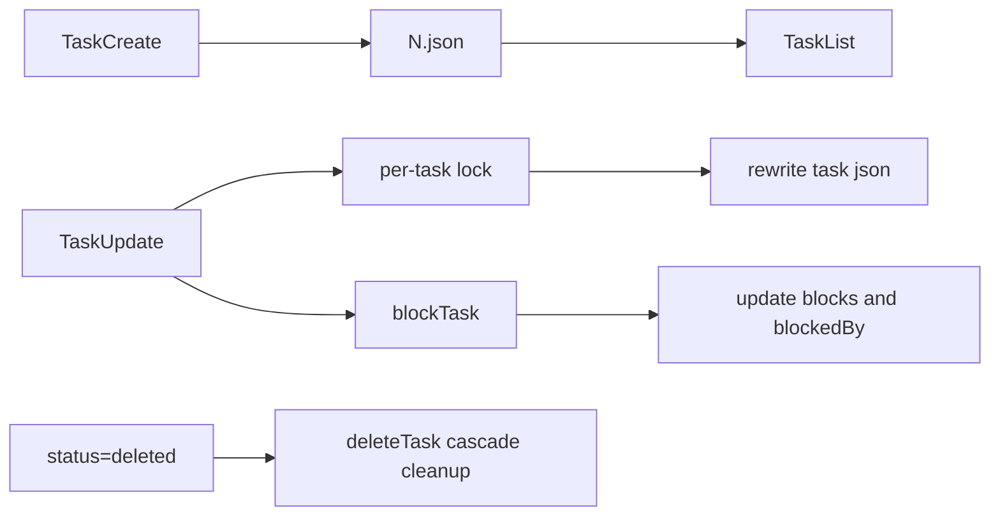

Sources: [src/tools/taskCreateTool.ts:25-93](../../../project-repos/easy-agent/src/tools/taskCreateTool.ts#L25-L93), [src/tools/taskUpdateTool.ts:63-200](../../../project-repos/easy-agent/src/tools/taskUpdateTool.ts#L63-L200), [src/state/taskStore.ts:210-411](../../../project-repos/easy-agent/src/state/taskStore.ts#L210-L411)

<details class="source-snippets">
<summary>引用源码</summary>

<!-- source-snippets:start -->

#### `src/tools/taskCreateTool.ts:25-93`

```typescript
export const taskCreateTool: Tool = {
  name: TOOL_NAME,

  description:
    "Create a structured task for the current session's persistent task graph. " +
    "Tasks survive restarts and /clear, and support dependencies via blocks/blockedBy. " +
    "Use proactively for 3+ step work, multi-step plans, and any task list the user would want to see across sessions.",

  inputSchema: {
    type: "object" as const,
    properties: {
      subject: {
        type: "string",
        minLength: 1,
        description: "Imperative one-line title, e.g. 'Fix login bug'.",
      },
      description: {
        type: "string",
        minLength: 1,
        description: "What needs to be done. One or two paragraphs is fine.",
      },
      activeForm: {
        type: "string",
        description:
          "Present-continuous form shown in the spinner when the task is in_progress, e.g. 'Fixing login bug'. If omitted, the subject is used.",
      },
      metadata: {
        type: "object",
        additionalProperties: true,
        description: "Free-form metadata attached to the task.",
      },
    },
    required: ["subject", "description"],
    additionalProperties: false,
  },

  async call(input: Record&lt;string, unknown&gt;, context: ToolContext): Promise&lt;ToolResult&gt; {
    const subject = pickString(input, "subject")?.trim();
    const description = pickString(input, "description")?.trim();
    const activeForm = pickString(input, "activeForm")?.trim();
    const metadata = input.metadata && typeof input.metadata === "object" && !Array.isArray(input.metadata)
      ? (input.metadata as Record&lt;string, unknown&gt;)
      : undefined;

    if (!subject) return { content: "Error: `subject` must be a non-empty string.", isError: true };
    if (!description) return { content: "Error: `description` must be a non-empty string.", isError: true };

    const taskListId = getTaskListId(context.sessionId ?? "default");
    const id = await createTask(taskListId, {
      subject,
      description,
      activeForm: activeForm || undefined,
      status: "pending",
      blocks: [],
      blockedBy: [],
      metadata,
    });

    return { content: `Task #${id} created: ${subject}` };
  },

  isReadOnly() {
    return false;
  },

  isEnabled() {
    return isTaskModeEnabled();
  },
};
```

#### `src/tools/taskUpdateTool.ts:63-200`

```typescript
export const taskUpdateTool: Tool = {
  name: TOOL_NAME,

  description:
    "Update a task in the persistent task graph. Use this to mark progress " +
    "(pending → in_progress → completed), edit fields, add dependencies, or delete " +
    "tasks by setting status to 'deleted'. Always read the task's latest state with TaskGet before editing.",

  inputSchema: {
    type: "object" as const,
    properties: {
      taskId: { type: "string", minLength: 1, description: "The id of the task to update." },
      subject: { type: "string", description: "New subject (imperative form)." },
      description: { type: "string", description: "New description." },
      activeForm: {
        type: "string",
        description: "Present-continuous form shown in the spinner while the task is in_progress.",
      },
      status: {
        type: "string",
        enum: ["pending", "in_progress", "completed", "deleted"],
        description: "New status. 'deleted' removes the task and cleans up references.",
      },
      addBlocks: {
        type: "array",
        items: { type: "string" },
        description: "Task ids that this task blocks (downstream dependencies).",
      },
      addBlockedBy: {
        type: "array",
        items: { type: "string" },
        description: "Task ids that block this task (upstream dependencies).",
      },
      metadata: {
        type: "object",
        additionalProperties: true,
        description: "Metadata keys to merge. Set a key to null to delete it.",
      },
    },
    required: ["taskId"],
    additionalProperties: false,
  },

  async call(input: Record&lt;string, unknown&gt;, context: ToolContext): Promise&lt;ToolResult&gt; {
    const taskId = pickString(input, "taskId")?.trim();
    if (!taskId) return { content: "Error: `taskId` is required.", isError: true };

    const taskListId = getTaskListId(context.sessionId ?? "default");
    const existing = await getTask(taskListId, taskId);
    if (!existing) return { content: `Task #${taskId} not found`, isError: true };

    // Short-circuit status="deleted": run the cascading delete and
    // return immediately. Any other updates in the same call are
    // ignored — deleting a task means the edits are moot anyway.
    const rawStatus = pickString(input, "status");
    if (rawStatus !== undefined && !UPDATE_STATUSES.has(rawStatus)) {
      return { content: `Error: invalid status '${rawStatus}'.`, isError: true };
    }
    const statusValue = rawStatus as UpdateStatus | undefined;

    if (statusValue === "deleted") {
      const ok = await deleteTask(taskListId, taskId);
      return ok
        ? { content: `Task #${taskId} deleted.` }
        : { content: `Failed to delete task #${taskId}.`, isError: true };
    }

    const updates: Partial&lt;Omit&lt;Task, "id"&gt;&gt; = {};
    const updatedFields: string[] = [];

    const subject = pickString(input, "subject");
    if (subject !== undefined && subject !== existing.subject) {
      updates.subject = subject;
      updatedFields.push("subject");
    }
    const description = pickString(input, "description");
    if (description !== undefined && description !== existing.description) {
      updates.description = description;
      updatedFields.push("description");
    }
    const activeForm = pickString(input, "activeForm");
    if (activeForm !== undefined && activeForm !== existing.activeForm) {
      updates.activeForm = activeForm;
      updatedFields.push("activeForm");
    }
    if (statusValue !== undefined && statusValue !== existing.status) {
      updates.status = statusValue;
      updatedFields.push("status");
    }
    if (input.metadata && typeof input.metadata === "object" && !Array.isArray(input.metadata)) {
      updates.metadata = mergeMetadata(existing.metadata, input.metadata as Record&lt;string, unknown&gt;);
      updatedFields.push("metadata");
    }

    if (Object.keys(updates).length > 0) {
      await updateTask(taskListId, taskId, updates);
    }

    // Dependency wires run AFTER the main update so both sides of each
    // block/blockedBy pair see the freshest state. blockTask maintains
    // both directions so the graph stays consistent even if the model
    // only names one side.
    const addBlocks = pickStringArray(input, "addBlocks");
    if (addBlocks && addBlocks.length > 0) {
      let changed = false;
      for (const downstreamId of addBlocks) {
        if (existing.blocks.includes(downstreamId)) continue;
        const ok = await blockTask(taskListId, taskId, downstreamId);
        if (ok) changed = true;
      }
      if (changed) updatedFields.push("blocks");
    }

    const addBlockedBy = pickStringArray(input, "addBlockedBy");
    if (addBlockedBy && addBlockedBy.length > 0) {
      let changed = false;
      for (const upstreamId of addBlockedBy) {
        if (existing.blockedBy.includes(upstreamId)) continue;
        const ok = await blockTask(taskListId, upstreamId, taskId);
        if (ok) changed = true;
... snippet truncated ...
```

#### `src/state/taskStore.ts:210-411`

```typescript
export async function createTask(
  taskListId: string,
  data: Omit&lt;Task, "id"&gt;,
): Promise&lt;string&gt; {
  const lockPath = await ensureTaskListLockFile(taskListId);
  const release = await lockfile.lock(lockPath, LOCK_OPTIONS);
  try {
    const highest = await findHighestTaskId(taskListId);
    const id = String(highest + 1);
    const task: Task = { id, ...data };
    await writeFile(getTaskPath(taskListId, id), JSON.stringify(task, null, 2));
    notifyTasksUpdated(taskListId);
    return id;
  } finally {
    await release();
  }
}

export async function getTask(taskListId: string, taskId: string): Promise&lt;Task | null&gt; {
  try {
    const content = await readFile(getTaskPath(taskListId, taskId), "utf-8");
    return parseTask(JSON.parse(content));
  } catch (error: unknown) {
    const err = error as NodeJS.ErrnoException;
    if (err?.code === "ENOENT") return null;
    return null;
  }
}

export async function listTasks(taskListId: string): Promise&lt;Task[]&gt; {
  let files: string[];
  try {
    files = await readdir(getTasksDir(taskListId));
  } catch {
    return [];
  }
  const ids = files.filter((f) => f.endsWith(".json") && !f.startsWith(".")).map((f) => f.replace(".json", ""));
  const tasks = await Promise.all(ids.map((id) => getTask(taskListId, id)));
  return tasks.filter((t): t is Task => t !== null);
}

/**
 * Internal update primitive — caller must already hold the per-task lock.
 * Used by deleteTask's cascade to avoid acquiring a lock we already own.
 */
async function updateTaskUnsafe(
  taskListId: string,
  taskId: string,
  updates: Partial&lt;Omit&lt;Task, "id"&gt;&gt;,
): Promise&lt;Task | null&gt; {
  const existing = await getTask(taskListId, taskId);
  if (!existing) return null;
  const updated: Task = { ...existing, ...updates, id: taskId };
  await writeFile(getTaskPath(taskListId, taskId), JSON.stringify(updated, null, 2));
  notifyTasksUpdated(taskListId);
  return updated;
}

/**
 * Update a task. Per-task lock isolates concurrent updates to different
 * tasks — only concurrent updates to the SAME task serialize.
 */
export async function updateTask(
  taskListId: string,
  taskId: string,
  updates: Partial&lt;Omit&lt;Task, "id"&gt;&gt;,
): Promise&lt;Task | null&gt; {
  // Check existence BEFORE locking: proper-lockfile throws if the target
  // path doesn't exist, and we want a clean null return for the benign
  // "task was already deleted" case.
  const pre = await getTask(taskListId, taskId);
  if (!pre) return null;

  const release = await lockfile.lock(getTaskPath(taskListId, taskId), LOCK_OPTIONS);
  try {
    return await updateTaskUnsafe(taskListId, taskId, updates);
  } finally {
    await release();
  }
}

/**
 * Delete a task. Records the id in the high water mark first so we
 * never reassign it to a new task after reset, then cascades the blocks
 * / blockedBy references in siblings.
 */
export async function deleteTask(taskListId: string, taskId: string): Promise&lt;boolean&gt; {
  const numericId = parseInt(taskId, 10);
  if (!Number.isNaN(numericId)) {
    const mark = await readHighWaterMark(taskListId);
    if (numericId > mark) {
      await writeHighWaterMark(taskListId, numericId);
    }
  }

  try {
    await unlink(getTaskPath(taskListId, taskId));
  } catch (error: unknown) {
    const err = error as NodeJS.ErrnoException;
    if (err?.code === "ENOENT") return false;
    throw error;
  }

  // Cascade: remove references to the deleted task in every sibling.
  const siblings = await listTasks(taskListId);
  for (const sibling of siblings) {
    const newBlocks = sibling.blocks.filter((id) => id !== taskId);
    const newBlockedBy = sibling.blockedBy.filter((id) => id !== taskId);
    if (
      newBlocks.length !== sibling.blocks.length ||
      newBlockedBy.length !== sibling.blockedBy.length
    ) {
      await updateTask(taskListId, sibling.id, {
        blocks: newBlocks,
        blockedBy: newBlockedBy,
      });
    }
  }

  notifyTasksUpdated(taskListId);
... snippet truncated ...
```

<!-- source-snippets:end -->
</details>

## 任务工具行为

`TaskCreate` 创建 `pending` 任务并返回分配 id；`TaskUpdate` 支持字段编辑、状态迁移、metadata merge、`addBlocks`、`addBlockedBy`，并把 `status: "deleted"` 折叠为级联删除；`TaskList` 会过滤已经 completed 的上游 blocker，只报告仍未解除的阻塞。  
Sources: [src/tools/taskCreateTool.ts:61-84](../../../project-repos/easy-agent/src/tools/taskCreateTool.ts#L61-L84), [src/tools/taskUpdateTool.ts:106-200](../../../project-repos/easy-agent/src/tools/taskUpdateTool.ts#L106-L200), [src/tools/taskListTool.ts:31-63](../../../project-repos/easy-agent/src/tools/taskListTool.ts#L31-L63)

<details class="source-snippets">
<summary>引用源码</summary>

<!-- source-snippets:start -->

#### `src/tools/taskCreateTool.ts:61-84`

```typescript
  async call(input: Record&lt;string, unknown&gt;, context: ToolContext): Promise&lt;ToolResult&gt; {
    const subject = pickString(input, "subject")?.trim();
    const description = pickString(input, "description")?.trim();
    const activeForm = pickString(input, "activeForm")?.trim();
    const metadata = input.metadata && typeof input.metadata === "object" && !Array.isArray(input.metadata)
      ? (input.metadata as Record&lt;string, unknown&gt;)
      : undefined;

    if (!subject) return { content: "Error: `subject` must be a non-empty string.", isError: true };
    if (!description) return { content: "Error: `description` must be a non-empty string.", isError: true };

    const taskListId = getTaskListId(context.sessionId ?? "default");
    const id = await createTask(taskListId, {
      subject,
      description,
      activeForm: activeForm || undefined,
      status: "pending",
      blocks: [],
      blockedBy: [],
      metadata,
    });

    return { content: `Task #${id} created: ${subject}` };
  },
```

#### `src/tools/taskUpdateTool.ts:106-200`

```typescript
  async call(input: Record&lt;string, unknown&gt;, context: ToolContext): Promise&lt;ToolResult&gt; {
    const taskId = pickString(input, "taskId")?.trim();
    if (!taskId) return { content: "Error: `taskId` is required.", isError: true };

    const taskListId = getTaskListId(context.sessionId ?? "default");
    const existing = await getTask(taskListId, taskId);
    if (!existing) return { content: `Task #${taskId} not found`, isError: true };

    // Short-circuit status="deleted": run the cascading delete and
    // return immediately. Any other updates in the same call are
    // ignored — deleting a task means the edits are moot anyway.
    const rawStatus = pickString(input, "status");
    if (rawStatus !== undefined && !UPDATE_STATUSES.has(rawStatus)) {
      return { content: `Error: invalid status '${rawStatus}'.`, isError: true };
    }
    const statusValue = rawStatus as UpdateStatus | undefined;

    if (statusValue === "deleted") {
      const ok = await deleteTask(taskListId, taskId);
      return ok
        ? { content: `Task #${taskId} deleted.` }
        : { content: `Failed to delete task #${taskId}.`, isError: true };
    }

    const updates: Partial&lt;Omit&lt;Task, "id"&gt;&gt; = {};
    const updatedFields: string[] = [];

    const subject = pickString(input, "subject");
    if (subject !== undefined && subject !== existing.subject) {
      updates.subject = subject;
      updatedFields.push("subject");
    }
    const description = pickString(input, "description");
    if (description !== undefined && description !== existing.description) {
      updates.description = description;
      updatedFields.push("description");
    }
    const activeForm = pickString(input, "activeForm");
    if (activeForm !== undefined && activeForm !== existing.activeForm) {
      updates.activeForm = activeForm;
      updatedFields.push("activeForm");
    }
    if (statusValue !== undefined && statusValue !== existing.status) {
      updates.status = statusValue;
      updatedFields.push("status");
    }
    if (input.metadata && typeof input.metadata === "object" && !Array.isArray(input.metadata)) {
      updates.metadata = mergeMetadata(existing.metadata, input.metadata as Record&lt;string, unknown&gt;);
      updatedFields.push("metadata");
    }

    if (Object.keys(updates).length > 0) {
      await updateTask(taskListId, taskId, updates);
    }

    // Dependency wires run AFTER the main update so both sides of each
    // block/blockedBy pair see the freshest state. blockTask maintains
    // both directions so the graph stays consistent even if the model
    // only names one side.
    const addBlocks = pickStringArray(input, "addBlocks");
    if (addBlocks && addBlocks.length > 0) {
      let changed = false;
      for (const downstreamId of addBlocks) {
        if (existing.blocks.includes(downstreamId)) continue;
        const ok = await blockTask(taskListId, taskId, downstreamId);
        if (ok) changed = true;
      }
      if (changed) updatedFields.push("blocks");
    }

    const addBlockedBy = pickStringArray(input, "addBlockedBy");
    if (addBlockedBy && addBlockedBy.length > 0) {
      let changed = false;
      for (const upstreamId of addBlockedBy) {
        if (existing.blockedBy.includes(upstreamId)) continue;
        const ok = await blockTask(taskListId, upstreamId, taskId);
        if (ok) changed = true;
      }
      if (changed) updatedFields.push("blockedBy");
    }

    if (updatedFields.length === 0) {
      return { content: `Task #${taskId} unchanged.` };
    }
    return { content: `Updated task #${taskId}: ${updatedFields.join(", ")}` };
  },

  isReadOnly() {
    return false;
  },

  isEnabled() {
    return isTaskModeEnabled();
  },
};
```

#### `src/tools/taskListTool.ts:31-63`

```typescript
  async call(_input: Record&lt;string, unknown&gt;, context: ToolContext): Promise&lt;ToolResult&gt; {
    const taskListId = getTaskListId(context.sessionId ?? "default");
    const allTasks = await listTasks(taskListId);
    if (allTasks.length === 0) {
      return { content: "No tasks found" };
    }

    // Completed upstream tasks no longer block anyone, so trim them out
    // of the reported blockedBy list. Matches source TaskListTool.
    const resolvedIds = new Set(allTasks.filter((t) => t.status === "completed").map((t) => t.id));

    const lines = allTasks
      .slice()
      .sort((a, b) => Number(a.id) - Number(b.id))
      .map((task) => {
        const openBlockers = task.blockedBy.filter((id) => !resolvedIds.has(id));
        const blocked = openBlockers.length > 0
          ? ` [blocked by ${openBlockers.map((id) => `#${id}`).join(", ")}]`
          : "";
        return `#${task.id} [${task.status}] ${task.subject}${blocked}`;
      });

    return { content: lines.join("\n") };
  },

  isReadOnly() {
    return true;
  },

  isEnabled() {
    return isTaskModeEnabled();
  },
};
```

<!-- source-snippets:end -->
</details>

store 层保证依赖是双向维护的：`blockTask(from, to)` 会同时更新 `from.blocks` 和 `to.blockedBy`；删除任务后会遍历 sibling 清理所有引用；`isReady()` 只把 pending 且所有 blocker 已 completed 的任务视为可执行。  
Sources: [src/state/taskStore.ts:291-357](../../../project-repos/easy-agent/src/state/taskStore.ts#L291-L357), [src/state/taskStore.ts:400-411](../../../project-repos/easy-agent/src/state/taskStore.ts#L400-L411)

<details class="source-snippets">
<summary>引用源码</summary>

<!-- source-snippets:start -->

#### `src/state/taskStore.ts:291-357`

```typescript
/**
 * Delete a task. Records the id in the high water mark first so we
 * never reassign it to a new task after reset, then cascades the blocks
 * / blockedBy references in siblings.
 */
export async function deleteTask(taskListId: string, taskId: string): Promise&lt;boolean&gt; {
  const numericId = parseInt(taskId, 10);
  if (!Number.isNaN(numericId)) {
    const mark = await readHighWaterMark(taskListId);
    if (numericId > mark) {
      await writeHighWaterMark(taskListId, numericId);
    }
  }

  try {
    await unlink(getTaskPath(taskListId, taskId));
  } catch (error: unknown) {
    const err = error as NodeJS.ErrnoException;
    if (err?.code === "ENOENT") return false;
    throw error;
  }

  // Cascade: remove references to the deleted task in every sibling.
  const siblings = await listTasks(taskListId);
  for (const sibling of siblings) {
    const newBlocks = sibling.blocks.filter((id) => id !== taskId);
    const newBlockedBy = sibling.blockedBy.filter((id) => id !== taskId);
    if (
      newBlocks.length !== sibling.blocks.length ||
      newBlockedBy.length !== sibling.blockedBy.length
    ) {
      await updateTask(taskListId, sibling.id, {
        blocks: newBlocks,
        blockedBy: newBlockedBy,
      });
    }
  }

  notifyTasksUpdated(taskListId);
  return true;
}

/**
 * Bidirectional dependency link: `from` blocks `to`.
 *
 * Writing only one side would leave the graph inconsistent if the model
 * read the other side later, so we always update both. Duplicate entries
 * are a no-op.
 */
export async function blockTask(
  taskListId: string,
  fromTaskId: string,
  toTaskId: string,
): Promise&lt;boolean&gt; {
  const [from, to] = await Promise.all([
    getTask(taskListId, fromTaskId),
    getTask(taskListId, toTaskId),
  ]);
  if (!from || !to) return false;

  if (!from.blocks.includes(toTaskId)) {
    await updateTask(taskListId, fromTaskId, { blocks: [...from.blocks, toTaskId] });
  }
  if (!to.blockedBy.includes(fromTaskId)) {
    await updateTask(taskListId, toTaskId, { blockedBy: [...to.blockedBy, fromTaskId] });
  }
  return true;
```

#### `src/state/taskStore.ts:400-411`

```typescript
// ─── Derived helpers ───────────────────────────────────────────────

/**
 * A task is "ready" when it's pending, unowned (single-agent), and all
 * upstream blockers are completed. This is the predicate the model uses
 * to pick its next TaskList entry.
 */
export function isReady(task: Task, tasks: readonly Task[]): boolean {
  if (task.status !== "pending") return false;
  const unresolved = new Set(tasks.filter((t) => t.status !== "completed").map((t) => t.id));
  return task.blockedBy.every((id) => !unresolved.has(id));
}
```

<!-- source-snippets:end -->
</details>

## 模式切换

`taskModeStore` 是进程级 source of truth，`/tasks task|todo|reset` 通过 `QueryEngine` 切换模式或清空当前 task list。工具的 `isEnabled()` 读取该全局状态，因此 TodoWrite V1 和 Task V2 工具不会同时暴露。  
Sources: [src/state/taskModeStore.ts:22-51](../../../project-repos/easy-agent/src/state/taskModeStore.ts#L22-L51), [src/core/queryEngine.ts:480-531](../../../project-repos/easy-agent/src/core/queryEngine.ts#L480-L531), [src/tools/todoWriteTool.ts:144-149](../../../project-repos/easy-agent/src/tools/todoWriteTool.ts#L144-L149), [src/tools/taskCreateTool.ts:86-92](../../../project-repos/easy-agent/src/tools/taskCreateTool.ts#L86-L92)

<details class="source-snippets">
<summary>引用源码</summary>

<!-- source-snippets:start -->

#### `src/state/taskModeStore.ts:22-51`

```typescript
export function getTaskMode(): TaskMode {
  return currentMode;
}

export function setTaskMode(mode: TaskMode): void {
  if (mode === currentMode) return;
  currentMode = mode;
  for (const listener of listeners) {
    try {
      listener(mode);
    } catch {
      // Never let a subscriber break the switch.
    }
  }
}

export function subscribeTaskMode(listener: Listener): () => void {
  listeners.add(listener);
  return () => {
    listeners.delete(listener);
  };
}

export function isTaskModeEnabled(): boolean {
  return currentMode === "task";
}

export function isTodoModeEnabled(): boolean {
  return currentMode === "todo";
}
```

#### `src/core/queryEngine.ts:480-531`

```typescript
      case "tasks": {
        const arg = args[0]?.trim();
        const current = getTaskMode();
        if (!arg) {
          yield {
            type: "command",
            kind: "info",
            message: [
              "Task system status",
              `- Active: ${current} (${current === "task" ? "persistent graph (Task V2)" : "session memory (TodoWrite V1)"})`,
              "- Usage: /tasks task      Use persistent Task V2 tools (default)",
              "- Usage: /tasks todo      Use in-memory TodoWrite V1",
              "- Usage: /tasks reset     Delete every task in the current task list",
            ].join("\n"),
          };
          return { handled: true };
        }
        if (arg === "reset") {
          const taskListId = getTaskListId(this.toolContext.sessionId ?? "default");
          try {
            await resetTaskList(taskListId);
            yield { type: "command", kind: "info", message: `Task list '${taskListId}' has been reset.` };
          } catch (error) {
            const msg = error instanceof Error ? error.message : String(error);
            yield { type: "command", kind: "error", message: `Failed to reset task list: ${msg}` };
          }
          return { handled: true };
        }
        if (arg !== "task" && arg !== "todo") {
          yield {
            type: "command",
            kind: "error",
            message: `Invalid task mode: ${arg}. Must be task, todo, or reset.`,
          };
          return { handled: true };
        }
        if (arg === current) {
          yield {
            type: "command",
            kind: "info",
            message: `Task system is already '${current}'.`,
          };
          return { handled: true };
        }
        setTaskMode(arg);
        yield { type: "task_mode_changed", mode: arg, previousMode: current };
        yield {
          type: "command",
          kind: "info",
          message: `Task system changed: ${current} → ${arg}.`,
        };
        return { handled: true };
```

#### `src/tools/todoWriteTool.ts:144-149`

```typescript
  isEnabled() {
    // Mirrors source's `!isTodoV2Enabled()` guard: TodoWrite V1 and the
    // Task V2 tools are mutually exclusive. The runtime toggle lives in
    // taskModeStore and is flipped by `/tasks task|todo`.
    return isTodoModeEnabled();
  },
```

#### `src/tools/taskCreateTool.ts:86-92`

```typescript
  isReadOnly() {
    return false;
  },

  isEnabled() {
    return isTaskModeEnabled();
  },
```

<!-- source-snippets:end -->
</details>

## UI 同步

`useAgentSession` 订阅 todo store、task store 和 task mode store。Todo 是同步内存快照；Task V2 是磁盘状态，UI mount 时先 `listTasks()`，之后每次 mutation 触发 refresh。toolContext 暴露 live `sessionId` getter，避免 `/resume` 后工具仍写到旧 session。  
Sources: [src/ui/hooks/useAgentSession.ts:224-288](../../../project-repos/easy-agent/src/ui/hooks/useAgentSession.ts#L224-L288)

<details class="source-snippets">
<summary>引用源码</summary>

<!-- source-snippets:start -->

#### `src/ui/hooks/useAgentSession.ts:224-288`

```typescript
  // `sessionId` is exposed as a live getter so tools always see the
  // current sessionIdRef value. This matters during /resume — the ref is
  // mutated *after* this hook has memoized the toolContext, and a baked-in
  // value would silently route TodoWrite writes to the old (orphan) key
  // while the UI subscriber filters on the new sessionId, leaving the
  // todo panel permanently empty.
  const toolContext = useMemo&lt;ToolContext&gt;(
    () => ({
      cwd: process.cwd(),
      get sessionId() {
        return sessionIdRef.current;
      },
    }),
    [],
  );

  // Subscribe to TodoWrite updates. The store is global (mirrors source's
  // `appState.todos` map), so we filter by our own sessionId. When the
  // session is restored or cleared we also re-pull the snapshot.
  useEffect(() => {
    setTodosState(getTodos(sessionIdRef.current));
    const unsubscribe = subscribeTodos((sid, next) => {
      if (sid === sessionIdRef.current) {
        setTodosState(next);
      }
    });
    return unsubscribe;
  }, []);

  // Subscribe to Task V2 updates. Tasks live on disk, so on mount we do
  // one full listTasks to populate the initial view, then refresh every
  // time the store fires a change event for our task list id. Each
  // mutation already runs through the lock budget on the writer side,
  // so the reader doesn't need its own synchronization.
  useEffect(() => {
    let cancelled = false;
    const refresh = async () => {
      const taskListId = getTaskListId(sessionIdRef.current);
      try {
        const list = await listTasks(taskListId);
        if (!cancelled) setTasksState(list);
      } catch {
        // Ignore transient read errors — a future mutation will trigger
        // another refresh that can succeed.
      }
    };
    void refresh();
    const unsubscribe = subscribeTasks((taskListId) => {
      if (taskListId === getTaskListId(sessionIdRef.current)) {
        void refresh();
      }
    });
    return () => {
      cancelled = true;
      unsubscribe();
    };
  }, []);

  // Mirror the global task-mode store into local state so React re-renders
  // when the user flips `/tasks task|todo`. The global store is still the
  // source of truth — tools and permissions.ts read from it directly.
  useEffect(() => {
    setTaskModeState(getTaskMode());
    return subscribeTaskMode((mode) => setTaskModeState(mode));
  }, []);
```

<!-- source-snippets:end -->
</details>

## 相关页面

- [CLI 与终端 UI](cli-and-ui.md)
- [上下文、记忆与压缩](context-memory-compaction.md)
- [测试、构建与路线图](testing-and-roadmap.md)

---

<details>
<summary>相关源文件</summary>

生成本页时使用的主要源文件：

- [src/sandbox/types.ts](../../../project-repos/easy-agent/src/sandbox/types.ts)
- [src/sandbox/settings.ts](../../../project-repos/easy-agent/src/sandbox/settings.ts)
- [src/sandbox/availability.ts](../../../project-repos/easy-agent/src/sandbox/availability.ts)
- [src/sandbox/shouldUseSandbox.ts](../../../project-repos/easy-agent/src/sandbox/shouldUseSandbox.ts)
- [src/sandbox/buildProfile.ts](../../../project-repos/easy-agent/src/sandbox/buildProfile.ts)
- [src/sandbox/macosProfile.ts](../../../project-repos/easy-agent/src/sandbox/macosProfile.ts)
- [src/sandbox/wrapWithSandbox.ts](../../../project-repos/easy-agent/src/sandbox/wrapWithSandbox.ts)
- [src/sandbox/violations.ts](../../../project-repos/easy-agent/src/sandbox/violations.ts)
- [src/tools/bashTool.ts](../../../project-repos/easy-agent/src/tools/bashTool.ts)
- [src/scripts/test-sandbox.ts](../../../project-repos/easy-agent/src/scripts/test-sandbox.ts)
- [src/scripts/smoke-sandbox.ts](../../../project-repos/easy-agent/src/scripts/smoke-sandbox.ts)
- [src/scripts/smoke-bash-sandbox.ts](../../../project-repos/easy-agent/src/scripts/smoke-bash-sandbox.ts)

</details>

# Sandbox 与安全边界

Sandbox 子系统只为 Bash 命令提供 macOS `sandbox-exec` 包装。它不是默认开启的全局隔离层，而是由 settings、host availability、每次 Bash 输入和权限规则共同决定是否包裹命令。  
Sources: [src/sandbox/types.ts:34-58](../../../project-repos/easy-agent/src/sandbox/types.ts#L34-L58), [src/sandbox/settings.ts:96-168](../../../project-repos/easy-agent/src/sandbox/settings.ts#L96-L168), [src/sandbox/shouldUseSandbox.ts:78-95](../../../project-repos/easy-agent/src/sandbox/shouldUseSandbox.ts#L78-L95)

<details class="source-snippets">
<summary>引用源码</summary>

<!-- source-snippets:start -->

#### `src/sandbox/types.ts:34-58`

```typescript
export interface SandboxSettings {
  /** Master switch. Default false — we DON'T sandbox by default; users opt in. */
  enabled?: boolean;
  /**
   * If true and sandboxing is on, Bash commands skip the user-confirmation
   * dialog when no explicit deny/ask rule matches. The sandbox is the
   * safety net. Default true (matches source code).
   */
  autoAllowBashIfSandboxed?: boolean;
  /**
   * If true, the model can pass `dangerouslyDisableSandbox: true` to escape
   * the sandbox for one command. If false, that flag is ignored — the
   * sandbox always wraps Bash. Default true (matches source code).
   */
  allowUnsandboxedCommands?: boolean;
  /**
   * Wildcard prefixes for commands that should NEVER be sandboxed. Used
   * for things like `docker:*` and `make:*` that need raw filesystem
   * access. NOT a security boundary — it's a UX escape hatch.
   * See source code's `shouldUseSandbox.ts:18` NOTE comment.
   */
  excludedCommands?: string[];
  filesystem?: SandboxFilesystemSettings;
  network?: SandboxNetworkSettings;
}
```

#### `src/sandbox/settings.ts:96-168`

```typescript
export interface ResolvedSandboxSettings {
  enabled: boolean;
  autoAllowBashIfSandboxed: boolean;
  allowUnsandboxedCommands: boolean;
  excludedCommands: string[];
  filesystem: Required&lt;SandboxFilesystemSettings&gt;;
  network: Required&lt;SandboxNetworkSettings&gt;;
}

export const DEFAULT_RESOLVED_SANDBOX_SETTINGS: ResolvedSandboxSettings = {
  enabled: false,
  autoAllowBashIfSandboxed: true,
  allowUnsandboxedCommands: true,
  excludedCommands: [],
  filesystem: { allowWrite: [], denyWrite: [], allowRead: [], denyRead: [] },
  network: { allowedDomains: [], deniedDomains: [] },
};

export function resolveSandboxSettings(
  user: SandboxSettings,
  project: SandboxSettings,
): ResolvedSandboxSettings {
  return {
    enabled: project.enabled ?? user.enabled ?? false,
    autoAllowBashIfSandboxed:
      project.autoAllowBashIfSandboxed ?? user.autoAllowBashIfSandboxed ?? true,
    allowUnsandboxedCommands:
      project.allowUnsandboxedCommands ?? user.allowUnsandboxedCommands ?? true,
    excludedCommands: mergeStringArrays(
      user.excludedCommands,
      project.excludedCommands,
    ),
    filesystem: {
      allowWrite: mergeStringArrays(
        user.filesystem?.allowWrite,
        project.filesystem?.allowWrite,
      ),
      denyWrite: mergeStringArrays(
        user.filesystem?.denyWrite,
        project.filesystem?.denyWrite,
      ),
      allowRead: mergeStringArrays(
        user.filesystem?.allowRead,
        project.filesystem?.allowRead,
      ),
      denyRead: mergeStringArrays(
        user.filesystem?.denyRead,
        project.filesystem?.denyRead,
      ),
    },
    network: {
      allowedDomains: mergeStringArrays(
        user.network?.allowedDomains,
        project.network?.allowedDomains,
      ),
      deniedDomains: mergeStringArrays(
        user.network?.deniedDomains,
        project.network?.deniedDomains,
      ),
    },
  };
}

export async function loadSandboxSettings(
  cwd: string,
): Promise&lt;ResolvedSandboxSettings&gt; {
  const { user, project } = getSettingsPaths(cwd);
  const [userSandbox, projectSandbox] = await Promise.all([
    readSandboxFromFile(user),
    readSandboxFromFile(project),
  ]);
  return resolveSandboxSettings(userSandbox, projectSandbox);
}
```

#### `src/sandbox/shouldUseSandbox.ts:78-95`

```typescript
export function shouldUseSandbox(
  input: ShouldUseSandboxInput,
  settings: ResolvedSandboxSettings,
): boolean {
  if (!settings.enabled) return false;
  if (!isSandboxRuntimeReady()) return false;
  if (
    input.dangerouslyDisableSandbox === true &&
    settings.allowUnsandboxedCommands
  ) {
    return false;
  }
  if (!input.command) return false;
  if (containsExcludedCommand(input.command, settings.excludedCommands)) {
    return false;
  }
  return true;
}
```

<!-- source-snippets:end -->
</details>

```mermaid
flowchart TD
  Bash["Bash tool call"] --> Settings["load sandbox settings"]
  Settings --> Decide["shouldUseSandbox"]
  Decide -->|false| Raw["spawn original command"]
  Decide -->|true| Profile["buildSandboxProfile"]
  Profile --> SBPL["compileMacosProfile"]
  SBPL --> Wrap["sandbox-exec -p ... /bin/bash -lc ..."]
  Wrap --> Spawn["spawn wrapped command"]
  Spawn --> Annotate["annotate sandbox violation"]
```

Sources: [src/tools/bashTool.ts:118-207](../../../project-repos/easy-agent/src/tools/bashTool.ts#L118-L207), [src/sandbox/buildProfile.ts:125-206](../../../project-repos/easy-agent/src/sandbox/buildProfile.ts#L125-L206), [src/sandbox/macosProfile.ts:47-76](../../../project-repos/easy-agent/src/sandbox/macosProfile.ts#L47-L76), [src/sandbox/wrapWithSandbox.ts:31-45](../../../project-repos/easy-agent/src/sandbox/wrapWithSandbox.ts#L31-L45)

<details class="source-snippets">
<summary>引用源码</summary>

<!-- source-snippets:start -->

#### `src/tools/bashTool.ts:118-207`

```typescript
    // Decide sandbox wrapping. We swallow load errors and proceed with
    // sandboxing OFF — settings.json being unparseable shouldn't block
    // command execution; the permission system already surfaces those
    // errors loudly elsewhere.
    let sandboxSettings: ResolvedSandboxSettings | null = null;
    try {
      sandboxSettings = await loadSandboxSettings(context.cwd);
    } catch {
      sandboxSettings = null;
    }

    const willSandbox = sandboxSettings
      ? shouldUseSandbox(
          {
            command: input.command,
            dangerouslyDisableSandbox: input.dangerouslyDisableSandbox,
          },
          sandboxSettings,
        )
      : false;

    let executedCommand = input.command;
    if (willSandbox && sandboxSettings) {
      const profile = await buildProfileForCwd(context.cwd, sandboxSettings);
      const wrap = wrapWithSandbox(input.command, profile);
      executedCommand = wrap.wrappedCommand;
    }

    return await new Promise&lt;ToolResult&gt;((resolve) => {
      const child = spawn(process.env.SHELL || "bash", ["-lc", executedCommand], {
        cwd: context.cwd,
        env: process.env,
      });

      let stdout = "";
      let stderr = "";
      let settled = false;

      const finish = (result: ToolResult) => {
        if (settled) return;
        settled = true;
        resolve(result);
      };

      const timeoutId = setTimeout(() => {
        child.kill("SIGTERM");
        finish({ content: `Command timed out after ${timeoutMs}ms`, isError: true });
      }, timeoutMs);

      const onAbort = () => {
        child.kill("SIGTERM");
        clearTimeout(timeoutId);
        finish({ content: "Command aborted", isError: true });
      };

      context.abortSignal?.addEventListener("abort", onAbort, { once: true });

      child.stdout.on("data", (chunk: Buffer | string) => {
        stdout += chunk.toString();
      });
      child.stderr.on("data", (chunk: Buffer | string) => {
        stderr += chunk.toString();
      });
      child.on("error", (error) => {
        clearTimeout(timeoutId);
        finish({ content: `Failed to start command: ${error.message}`, isError: true });
      });
      child.on("close", (code) => {
        clearTimeout(timeoutId);
        context.abortSignal?.removeEventListener("abort", onAbort);

        // Tag stderr with &lt;sandbox_violations&gt;...&lt;/sandbox_violations&gt;
        // when the failure smells like a sandbox denial. The model uses
        // this signal to decide whether to retry, ask for permission,
        // or back off. The UI strips the tag before rendering.
        const annotatedStderr = willSandbox
          ? annotateStderrWithSandboxFailures(stderr, code)
          : stderr;

        const output = [
          `Command: ${input.command}`,
          `Read-only: ${isReadOnlyCommand(input.command)}`,
          `Sandbox: ${willSandbox ? "enabled" : "disabled"}`,
          `Exit code: ${code ?? -1}`,
          stdout ? `\nSTDOUT:\n${truncateOutput(stdout)}` : "",
          annotatedStderr ? `\nSTDERR:\n${truncateOutput(annotatedStderr)}` : "",
        ].filter(Boolean).join("\n");

        finish({ content: output, isError: (code ?? 1) !== 0 });
      });
```

#### `src/sandbox/buildProfile.ts:125-206`

```typescript
export function buildSandboxProfile(params: {
  cwd: string;
  settings: ResolvedSandboxSettings;
  permissions: PermissionRules;
}): SandboxProfile {
  const { cwd, settings, permissions } = params;

  // 1. Filesystem writable seed: always cwd + tmpdir.
  const allowWrite = new Set&lt;string&gt;([
    canonicalize(path.resolve(cwd)),
    canonicalize(os.tmpdir()),
    canonicalize(path.join(os.tmpdir(), "easy-agent")),
  ]);

  const denyWrite = new Set&lt;string&gt;(SYSTEM_DENY_PATHS_RAW.map(canonicalize));
  for (const p of getCriticalDenyPaths(cwd)) denyWrite.add(canonicalize(p));

  const allowRead = new Set&lt;string&gt;();
  const denyRead = new Set&lt;string&gt;();

  // 2. Filesystem from sandbox.filesystem.* settings (verbatim).
  for (const p of settings.filesystem.allowWrite) {
    allowWrite.add(canonicalize(resolveRulePath(p, cwd)));
  }
  for (const p of settings.filesystem.denyWrite) {
    denyWrite.add(canonicalize(resolveRulePath(p, cwd)));
  }
  for (const p of settings.filesystem.allowRead) {
    allowRead.add(canonicalize(resolveRulePath(p, cwd)));
  }
  for (const p of settings.filesystem.denyRead) {
    denyRead.add(canonicalize(resolveRulePath(p, cwd)));
  }

  // 3. Network from sandbox.network.*
  const allowedDomains = new Set&lt;string&gt;(settings.network.allowedDomains);
  const deniedDomains = new Set&lt;string&gt;(settings.network.deniedDomains);

  // 4. The unified abstraction: derive sandbox config from permission
  //    rules. Each rule contributes to BOTH the permission system
  //    (already loaded elsewhere) AND the sandbox profile (here).
  for (const rule of permissions.allow) {
    const parsed = parseRule(rule);
    if (!parsed) continue;
    if (parsed.toolName === "WebFetch" && parsed.ruleContent.startsWith("domain:")) {
      allowedDomains.add(parsed.ruleContent.slice("domain:".length));
    } else if (parsed.toolName === "Edit" || parsed.toolName === "Write") {
      const p = canonicalize(stripGlobSuffix(resolveRulePath(parsed.ruleContent, cwd)));
      allowWrite.add(p);
    } else if (parsed.toolName === "Read") {
      const p = canonicalize(stripGlobSuffix(resolveRulePath(parsed.ruleContent, cwd)));
      allowRead.add(p);
    }
  }

  for (const rule of permissions.deny) {
    const parsed = parseRule(rule);
    if (!parsed) continue;
    if (parsed.toolName === "WebFetch" && parsed.ruleContent.startsWith("domain:")) {
      deniedDomains.add(parsed.ruleContent.slice("domain:".length));
    } else if (parsed.toolName === "Edit" || parsed.toolName === "Write") {
      const p = canonicalize(stripGlobSuffix(resolveRulePath(parsed.ruleContent, cwd)));
      denyWrite.add(p);
    } else if (parsed.toolName === "Read") {
      const p = canonicalize(stripGlobSuffix(resolveRulePath(parsed.ruleContent, cwd)));
      denyRead.add(p);
    }
  }

  return {
    filesystem: {
      allowWrite: Array.from(allowWrite),
      denyWrite: Array.from(denyWrite),
      allowRead: Array.from(allowRead),
      denyRead: Array.from(denyRead),
    },
    network: {
      allowedDomains: Array.from(allowedDomains),
      deniedDomains: Array.from(deniedDomains),
    },
  };
}
```

#### `src/sandbox/macosProfile.ts:47-76`

```typescript
export function compileMacosProfile(profile: SandboxProfile): string {
  const writableSubpaths = profile.filesystem.allowWrite.map(subpath).join(" ");
  const denyWriteSubpaths = profile.filesystem.denyWrite.map(subpath).join(" ");

  const networkAllowAll = profile.network.allowedDomains.length > 0;

  // SBPL evaluates rules in source order; later rules override earlier
  // ones. So we emit `(allow file-write*)` for our writable list FIRST,
  // then `(deny file-write*)` for the critical paths, so the deny wins
  // even if a writable path overlaps a critical path (e.g. user adds
  // cwd to allowWrite but settings.json lives inside cwd — we must
  // still deny writes to settings.json).
  const lines = [
    "(version 1)",
    "(deny default)",
    "(allow process*)",
    "(allow signal)",
    "(allow mach-lookup)",
    "(allow ipc-posix-shm)",
    "(allow sysctl-read)",
    "(allow file-read*)",
    writableSubpaths ? `(allow file-write* ${writableSubpaths})` : "",
    denyWriteSubpaths ? `(deny file-write* ${denyWriteSubpaths})` : "",
    networkAllowAll
      ? "(allow network*)"
      : "(deny network-outbound) (allow network-bind (local ip)) (allow network* (local ip))",
  ].filter(Boolean);

  return lines.join("\n");
}
```

#### `src/sandbox/wrapWithSandbox.ts:31-45`

```typescript
export function wrapWithSandbox(
  command: string,
  profile: SandboxProfile,
): WrapWithSandboxResult {
  const sbpl = compileMacosProfile(profile);
  const wrappedCommand = [
    "/usr/bin/sandbox-exec",
    "-p",
    shellQuoteSingle(sbpl),
    "/bin/bash",
    "-lc",
    shellQuoteSingle(command),
  ].join(" ");
  return { wrappedCommand, profile: sbpl };
}
```

<!-- source-snippets:end -->
</details>

## 两层类型

代码区分 `SandboxSettings` 和 `SandboxProfile`。前者是用户写在 settings.json 里的原始配置，后者是运行时喂给 sandbox-exec 的具体 profile，会混合 settings、权限规则和硬编码安全默认值。  
Sources: [src/sandbox/types.ts:1-20](../../../project-repos/easy-agent/src/sandbox/types.ts#L1-L20), [src/sandbox/types.ts:22-75](../../../project-repos/easy-agent/src/sandbox/types.ts#L22-L75)

<details class="source-snippets">
<summary>引用源码</summary>

<!-- source-snippets:start -->

#### `src/sandbox/types.ts:1-20`

```typescript
/**
 * Type definitions for the sandbox subsystem.
 *
 * Two concept layers, intentionally separated:
 *
 *   1. SandboxSettings  — what the user writes in settings.json. Strings
 *                         and bools, no derivation logic. Loader returns
 *                         this verbatim.
 *
 *   2. SandboxProfile   — what the runtime feeds into sandbox-exec. Built
 *                         by `buildProfile.ts` by mixing SandboxSettings
 *                         with the permission rules (Edit/WebFetch) and
 *                         a hardcoded set of always-deny paths. The
 *                         macOS sbpl compiler reads this, NOT the raw
 *                         settings.
 *
 * Reference: `claude-code-source-code/src/utils/sandbox/sandbox-adapter.ts`
 *   - SandboxSettings  ≈ SettingsJson["sandbox"]
 *   - SandboxProfile   ≈ SandboxRuntimeConfig (the @anthropic-ai/sandbox-runtime input)
 */
```

#### `src/sandbox/types.ts:22-75`

```typescript
export interface SandboxFilesystemSettings {
  allowWrite?: string[];
  denyWrite?: string[];
  allowRead?: string[];
  denyRead?: string[];
}

export interface SandboxNetworkSettings {
  allowedDomains?: string[];
  deniedDomains?: string[];
}

export interface SandboxSettings {
  /** Master switch. Default false — we DON'T sandbox by default; users opt in. */
  enabled?: boolean;
  /**
   * If true and sandboxing is on, Bash commands skip the user-confirmation
   * dialog when no explicit deny/ask rule matches. The sandbox is the
   * safety net. Default true (matches source code).
   */
  autoAllowBashIfSandboxed?: boolean;
  /**
   * If true, the model can pass `dangerouslyDisableSandbox: true` to escape
   * the sandbox for one command. If false, that flag is ignored — the
   * sandbox always wraps Bash. Default true (matches source code).
   */
  allowUnsandboxedCommands?: boolean;
  /**
   * Wildcard prefixes for commands that should NEVER be sandboxed. Used
   * for things like `docker:*` and `make:*` that need raw filesystem
   * access. NOT a security boundary — it's a UX escape hatch.
   * See source code's `shouldUseSandbox.ts:18` NOTE comment.
   */
  excludedCommands?: string[];
  filesystem?: SandboxFilesystemSettings;
  network?: SandboxNetworkSettings;
}

/**
 * Concrete profile to feed into sandbox-exec. All paths are absolute.
 * The macOS profile compiler converts this into sbpl.
 */
export interface SandboxProfile {
  filesystem: {
    allowWrite: string[];
    denyWrite: string[];
    allowRead: string[];
    denyRead: string[];
  };
  network: {
    allowedDomains: string[];
    deniedDomains: string[];
  };
}
```

<!-- source-snippets:end -->
</details>

settings 默认值偏保守地要求用户显式 opt-in：`enabled=false`。但开启后，默认允许 sandboxed Bash 自动通过权限检查，并允许模型用 `dangerouslyDisableSandbox` 单次逃逸，除非用户把 `allowUnsandboxedCommands` 关掉。  
Sources: [src/sandbox/settings.ts:1-15](../../../project-repos/easy-agent/src/sandbox/settings.ts#L1-L15), [src/sandbox/settings.ts:105-168](../../../project-repos/easy-agent/src/sandbox/settings.ts#L105-L168), [src/sandbox/types.ts:34-55](../../../project-repos/easy-agent/src/sandbox/types.ts#L34-L55)

<details class="source-snippets">
<summary>引用源码</summary>

<!-- source-snippets:start -->

#### `src/sandbox/settings.ts:1-15`

```typescript
/**
 * Load + merge sandbox settings from user (~/.easy-agent/settings.json)
 * and project (&lt;cwd&gt;/.easy-agent/settings.json) scopes.
 *
 * Project overrides user (matches the existing permissions/MCP loaders
 * — see `src/permissions/permissions.ts:loadPermissionSettings`).
 *
 * Defaults:
 *   - enabled: false                      → opt-in feature
 *   - autoAllowBashIfSandboxed: true      → matches source code
 *   - allowUnsandboxedCommands: true      → matches source code
 *
 * Returns a fully-populated SandboxSettings — every field has a value,
 * so callers don't need to repeat default-checking.
 */
```

#### `src/sandbox/settings.ts:105-168`

```typescript
export const DEFAULT_RESOLVED_SANDBOX_SETTINGS: ResolvedSandboxSettings = {
  enabled: false,
  autoAllowBashIfSandboxed: true,
  allowUnsandboxedCommands: true,
  excludedCommands: [],
  filesystem: { allowWrite: [], denyWrite: [], allowRead: [], denyRead: [] },
  network: { allowedDomains: [], deniedDomains: [] },
};

export function resolveSandboxSettings(
  user: SandboxSettings,
  project: SandboxSettings,
): ResolvedSandboxSettings {
  return {
    enabled: project.enabled ?? user.enabled ?? false,
    autoAllowBashIfSandboxed:
      project.autoAllowBashIfSandboxed ?? user.autoAllowBashIfSandboxed ?? true,
    allowUnsandboxedCommands:
      project.allowUnsandboxedCommands ?? user.allowUnsandboxedCommands ?? true,
    excludedCommands: mergeStringArrays(
      user.excludedCommands,
      project.excludedCommands,
    ),
    filesystem: {
      allowWrite: mergeStringArrays(
        user.filesystem?.allowWrite,
        project.filesystem?.allowWrite,
      ),
      denyWrite: mergeStringArrays(
        user.filesystem?.denyWrite,
        project.filesystem?.denyWrite,
      ),
      allowRead: mergeStringArrays(
        user.filesystem?.allowRead,
        project.filesystem?.allowRead,
      ),
      denyRead: mergeStringArrays(
        user.filesystem?.denyRead,
        project.filesystem?.denyRead,
      ),
    },
    network: {
      allowedDomains: mergeStringArrays(
        user.network?.allowedDomains,
        project.network?.allowedDomains,
      ),
      deniedDomains: mergeStringArrays(
        user.network?.deniedDomains,
        project.network?.deniedDomains,
      ),
    },
  };
}

export async function loadSandboxSettings(
  cwd: string,
): Promise&lt;ResolvedSandboxSettings&gt; {
  const { user, project } = getSettingsPaths(cwd);
  const [userSandbox, projectSandbox] = await Promise.all([
    readSandboxFromFile(user),
    readSandboxFromFile(project),
  ]);
  return resolveSandboxSettings(userSandbox, projectSandbox);
}
```

#### `src/sandbox/types.ts:34-55`

```typescript
export interface SandboxSettings {
  /** Master switch. Default false — we DON'T sandbox by default; users opt in. */
  enabled?: boolean;
  /**
   * If true and sandboxing is on, Bash commands skip the user-confirmation
   * dialog when no explicit deny/ask rule matches. The sandbox is the
   * safety net. Default true (matches source code).
   */
  autoAllowBashIfSandboxed?: boolean;
  /**
   * If true, the model can pass `dangerouslyDisableSandbox: true` to escape
   * the sandbox for one command. If false, that flag is ignored — the
   * sandbox always wraps Bash. Default true (matches source code).
   */
  allowUnsandboxedCommands?: boolean;
  /**
   * Wildcard prefixes for commands that should NEVER be sandboxed. Used
   * for things like `docker:*` and `make:*` that need raw filesystem
   * access. NOT a security boundary — it's a UX escape hatch.
   * See source code's `shouldUseSandbox.ts:18` NOTE comment.
   */
  excludedCommands?: string[];
```

<!-- source-snippets:end -->
</details>

## 可用性检查

Easy Agent 只实现 macOS backend。`availability.ts` 会检查 `process.platform === "darwin"` 和 `sandbox-exec` 是否存在；如果 settings 开启但 runtime 不可用，CLI startup 会暴露原因，而不是静默降级。  
Sources: [src/sandbox/availability.ts:1-16](../../../project-repos/easy-agent/src/sandbox/availability.ts#L1-L16), [src/sandbox/availability.ts:23-82](../../../project-repos/easy-agent/src/sandbox/availability.ts#L23-L82), [src/entrypoint/cli.ts:79-95](../../../project-repos/easy-agent/src/entrypoint/cli.ts#L79-L95)

<details class="source-snippets">
<summary>引用源码</summary>

<!-- source-snippets:start -->

#### `src/sandbox/availability.ts:1-16`

```typescript
/**
 * Detect whether the sandbox can actually run on the current host.
 *
 * Why this exists (security footgun, mirroring source code's
 * `getSandboxUnavailableReason`):
 *
 *   The user opts in by writing `sandbox.enabled: true` in settings.json.
 *   If the host can't run sandbox-exec — e.g. they're on Windows or
 *   Linux, or sandbox-exec was removed by some MDM tool — and we
 *   silently fall back to "no sandbox", the user thinks they're
 *   protected and they aren't. So we surface the reason loudly at
 *   startup and let the user decide.
 *
 * Easy-agent only ships the macOS backend (see DEVELOPMENT-PLAN
 * stage 18.6). Linux/WSL is explicitly out of scope for the tutorial.
 */
```

#### `src/sandbox/availability.ts:23-82`

```typescript
export function isPlatformSupported(): boolean {
  return process.platform === "darwin";
}

function isSandboxExecAvailable(): boolean {
  // `which sandbox-exec` is fast (~5ms) and avoids spawning the binary
  // itself. We synchronously check once at startup; if the user ever
  // installs/removes sandbox-exec mid-session they need to restart.
  try {
    execFileSync("/usr/bin/which", ["sandbox-exec"], {
      stdio: ["ignore", "ignore", "ignore"],
    });
    return true;
  } catch {
    return false;
  }
}

/**
 * Returns a reason string if the user enabled the sandbox but it
 * cannot run; returns undefined otherwise. Caller should print this
 * once at CLI startup, NOT on every Bash command (it would spam).
 *
 * Result is cached after the first call — sandbox availability does
 * not change during a process lifetime.
 */
export function getSandboxUnavailableReason(
  enabledInSettings: boolean,
): string | undefined {
  if (!enabledInSettings) return undefined;

  if (cachedReason !== undefined) return cachedReason || undefined;
  if (cachedSupported === true) return undefined;

  if (!isPlatformSupported()) {
    cachedSupported = false;
    cachedReason = `sandbox.enabled is true but ${process.platform} is not supported (easy-agent only sandboxes on macOS).`;
    return cachedReason;
  }

  if (!isSandboxExecAvailable()) {
    cachedSupported = false;
    cachedReason = "sandbox.enabled is true but /usr/bin/sandbox-exec is not available on this Mac.";
    return cachedReason;
  }

  cachedSupported = true;
  cachedReason = "";
  return undefined;
}

/**
 * "Can the sandbox actually run right now?" — fast, cached, no I/O after
 * the first call. Used by `shouldUseSandbox()` on every Bash invocation.
 */
export function isSandboxRuntimeReady(): boolean {
  if (cachedSupported !== undefined) return cachedSupported;
  cachedSupported = isPlatformSupported() && isSandboxExecAvailable();
  return cachedSupported;
}
```

#### `src/entrypoint/cli.ts:79-95`

```typescript
  // Sandbox availability: if the user opted in via settings.json but
  // the host can't run sandbox-exec, surface the reason loudly. Silent
  // fall-back is a security footgun — users assume protection that
  // isn't there. Mirrors source code's `getSandboxUnavailableReason`.
  try {
    const { loadSandboxSettings, getSandboxUnavailableReason } = await import(
      "../sandbox/index.js"
    );
    const sandboxSettings = await loadSandboxSettings(process.cwd());
    const reason = getSandboxUnavailableReason(sandboxSettings.enabled);
    if (reason) {
      console.warn(`[easy-agent] ⚠ ${reason} Bash commands will run unsandboxed.`);
    }
  } catch {
    // Settings parse errors are surfaced by the permission loader; we
    // don't double-report here.
  }
```

<!-- source-snippets:end -->
</details>

## shouldUseSandbox 决策

`shouldUseSandbox()` 的决策顺序是：settings 必须 enabled，runtime 必须 ready，单次 `dangerouslyDisableSandbox` 只有在用户 policy 允许时才生效，命令为空不启用，命中 `excludedCommands` 也不启用。  
Sources: [src/sandbox/shouldUseSandbox.ts:1-19](../../../project-repos/easy-agent/src/sandbox/shouldUseSandbox.ts#L1-L19), [src/sandbox/shouldUseSandbox.ts:78-95](../../../project-repos/easy-agent/src/sandbox/shouldUseSandbox.ts#L78-L95)

<details class="source-snippets">
<summary>引用源码</summary>

<!-- source-snippets:start -->

#### `src/sandbox/shouldUseSandbox.ts:1-19`

```typescript
/**
 * Gate that decides whether a given Bash invocation should be wrapped
 * in sandbox-exec. Mirrors source code's `shouldUseSandbox.ts`.
 *
 * Inputs that flip the decision:
 *
 *   1. Master switch: `sandbox.enabled` in settings + platform supports
 *      sandbox-exec (only macOS in easy-agent).
 *
 *   2. Per-call escape: the model passed `dangerouslyDisableSandbox: true`
 *      AND the user allows that via `sandbox.allowUnsandboxedCommands`
 *      (default true). If the user policy denies model escapes, the flag
 *      is silently ignored and the command is sandboxed anyway.
 *
 *   3. UX escape hatch: `sandbox.excludedCommands` patterns. If the
 *      command (or any subcommand) starts with one of these prefixes,
 *      we skip the sandbox. NOT a security boundary — it's for commands
 *      like `docker:*` and `make:*` that need raw FS access.
 */
```

#### `src/sandbox/shouldUseSandbox.ts:78-95`

```typescript
export function shouldUseSandbox(
  input: ShouldUseSandboxInput,
  settings: ResolvedSandboxSettings,
): boolean {
  if (!settings.enabled) return false;
  if (!isSandboxRuntimeReady()) return false;
  if (
    input.dangerouslyDisableSandbox === true &&
    settings.allowUnsandboxedCommands
  ) {
    return false;
  }
  if (!input.command) return false;
  if (containsExcludedCommand(input.command, settings.excludedCommands)) {
    return false;
  }
  return true;
}
```

<!-- source-snippets:end -->
</details>

`excludedCommands` 支持精确前缀、`docker:*` 这类前缀通配和一般 `*` 通配。它会拆分 compound command 的子命令，任一子命令命中就跳过 sandbox；源码注释也明确这只是 UX escape hatch，不是安全边界。  
Sources: [src/sandbox/shouldUseSandbox.ts:30-76](../../../project-repos/easy-agent/src/sandbox/shouldUseSandbox.ts#L30-L76)

<details class="source-snippets">
<summary>引用源码</summary>

<!-- source-snippets:start -->

#### `src/sandbox/shouldUseSandbox.ts:30-76`

```typescript
export function matchesExcludedPattern(
  command: string,
  pattern: string,
): boolean {
  const trimmedPattern = pattern.trim();
  if (!trimmedPattern) return false;

  if (trimmedPattern.endsWith(":*")) {
    const prefix = trimmedPattern.slice(0, -2);
    return command === prefix || command.startsWith(`${prefix} `);
  }

  if (trimmedPattern.includes("*")) {
    const re = new RegExp(
      `^${trimmedPattern.split("*").map((part) => part.replace(/[.+?^${}()|[\]\\]/g, "\\$&")).join(".*")}$`,
    );
    return re.test(command);
  }

  return command === trimmedPattern || command.startsWith(`${trimmedPattern} `);
}

export function containsExcludedCommand(
  command: string,
  excluded: string[],
): boolean {
  if (excluded.length === 0) return false;
  // Compound commands escape exclusion only if EVERY subcommand
  // is itself excluded — otherwise a malicious head like
  // `docker ps && curl evil.com` would skip sandbox even though
  // curl should be sandboxed. (Source code's logic is per-subcommand
  // OR — they treat excludedCommands as "any subcommand matches"
  // because excludedCommands is UX, not security; we follow that.)
  let subcommands: string[];
  try {
    subcommands = splitCommand(command);
  } catch {
    subcommands = [command.trim()];
  }
  if (subcommands.length === 0) subcommands = [command.trim()];
  for (const sub of subcommands) {
    for (const pattern of excluded) {
      if (matchesExcludedPattern(sub, pattern)) return true;
    }
  }
  return false;
}
```

<!-- source-snippets:end -->
</details>

## Profile 构建

profile 的写权限默认允许 cwd、系统 tmpdir 和 `tmp/easy-agent`。同时会强制 deny 系统路径、用户/项目 settings、skills 目录和 AGENT.md，防止 sandboxed 命令改写自身运行配置或技能内容。  
Sources: [src/sandbox/buildProfile.ts:94-123](../../../project-repos/easy-agent/src/sandbox/buildProfile.ts#L94-L123), [src/sandbox/buildProfile.ts:125-145](../../../project-repos/easy-agent/src/sandbox/buildProfile.ts#L125-L145)

<details class="source-snippets">
<summary>引用源码</summary>

<!-- source-snippets:start -->

#### `src/sandbox/buildProfile.ts:94-123`

```typescript
/**
 * Hard-coded paths that ALWAYS deny-write, regardless of user settings.
 * These are the "self-modification" attack surfaces — if a sandboxed
 * command can rewrite settings.json or the skill files, the model can
 * exfiltrate by editing its own runtime config and waiting for the
 * next session.
 *
 * Mirrors source code's settingsPaths + .claude/skills/.claude/commands
 * forced-deny block in `convertToSandboxRuntimeConfig` (lines 230–256).
 */
function getCriticalDenyPaths(cwd: string): string[] {
  const denies = [
    getUserSettingsPath(),
    getProjectSettingsPath(cwd),
    path.join(getProjectEasyAgentDir(cwd), "skills"),
    getEasyAgentPath("skills"),
    path.join(cwd, "AGENT.md"),
    getEasyAgentPath("AGENT.md"),
  ];
  return Array.from(new Set(denies));
}

// System paths we always deny writes to. We deliberately do NOT
// include `/var` or `/private/var` here even though they're "system":
// macOS's tmpdir lives inside /private/var/folders/.../T, and a broad
// `/private/var` deny rule would override our tmpdir allow (SBPL is
// last-match-wins). The remaining paths (`/etc`, `/usr`, plus their
// `/private/...` realpath siblings) are SIP-protected anyway, so the
// explicit deny here is mostly defense-in-depth + documentation.
const SYSTEM_DENY_PATHS_RAW = ["/etc", "/usr", "/private/etc"];
```

#### `src/sandbox/buildProfile.ts:125-145`

```typescript
export function buildSandboxProfile(params: {
  cwd: string;
  settings: ResolvedSandboxSettings;
  permissions: PermissionRules;
}): SandboxProfile {
  const { cwd, settings, permissions } = params;

  // 1. Filesystem writable seed: always cwd + tmpdir.
  const allowWrite = new Set&lt;string&gt;([
    canonicalize(path.resolve(cwd)),
    canonicalize(os.tmpdir()),
    canonicalize(path.join(os.tmpdir(), "easy-agent")),
  ]);

  const denyWrite = new Set&lt;string&gt;(SYSTEM_DENY_PATHS_RAW.map(canonicalize));
  for (const p of getCriticalDenyPaths(cwd)) denyWrite.add(canonicalize(p));

  const allowRead = new Set&lt;string&gt;();
  const denyRead = new Set&lt;string&gt;();

  // 2. Filesystem from sandbox.filesystem.* settings (verbatim).
```

<!-- source-snippets:end -->
</details>

权限规则也会参与 profile 派生：`WebFetch(domain:github.com)` 会加入 sandbox network allowlist；`Edit(path)` 与 `Write(path)` 会加入 writable allowlist；deny 规则则加入 denylist。这样权限系统和 sandbox runtime 使用同一份用户意图。  
Sources: [src/sandbox/buildProfile.ts:1-22](../../../project-repos/easy-agent/src/sandbox/buildProfile.ts#L1-L22), [src/sandbox/buildProfile.ts:147-206](../../../project-repos/easy-agent/src/sandbox/buildProfile.ts#L147-L206)

<details class="source-snippets">
<summary>引用源码</summary>

<!-- source-snippets:start -->

#### `src/sandbox/buildProfile.ts:1-22`

```typescript
/**
 * Compose a SandboxProfile from three input sources:
 *
 *   1. Resolved sandbox settings  (sandbox.filesystem.*, sandbox.network.*)
 *   2. Permission rules           (Edit(/path), WebFetch(domain:host), ...)
 *   3. Hardcoded defaults         (cwd + tmpdir writable; system + .easy-agent
 *                                  internals denied)
 *
 * Why mixing (1) and (2) matters — this is the "unified abstraction"
 * design point from source code:
 *
 *   When the user writes `WebFetch(domain:github.com)` in their
 *   permissions.allow list, we want both effects in one place:
 *     - WebFetch tool gets github.com as a permitted host
 *     - The sandbox network whitelist also gets github.com, so a
 *       sandboxed `curl github.com` works
 *   No double-config. The same goes for `Edit(/path)` rules adding
 *   to the writable filesystem allowlist.
 *
 * Reference: `claude-code-source-code/src/utils/sandbox/sandbox-adapter.ts`
 *   in `convertToSandboxRuntimeConfig()`.
 */
```

#### `src/sandbox/buildProfile.ts:147-206`

```typescript
    allowWrite.add(canonicalize(resolveRulePath(p, cwd)));
  }
  for (const p of settings.filesystem.denyWrite) {
    denyWrite.add(canonicalize(resolveRulePath(p, cwd)));
  }
  for (const p of settings.filesystem.allowRead) {
    allowRead.add(canonicalize(resolveRulePath(p, cwd)));
  }
  for (const p of settings.filesystem.denyRead) {
    denyRead.add(canonicalize(resolveRulePath(p, cwd)));
  }

  // 3. Network from sandbox.network.*
  const allowedDomains = new Set&lt;string&gt;(settings.network.allowedDomains);
  const deniedDomains = new Set&lt;string&gt;(settings.network.deniedDomains);

  // 4. The unified abstraction: derive sandbox config from permission
  //    rules. Each rule contributes to BOTH the permission system
  //    (already loaded elsewhere) AND the sandbox profile (here).
  for (const rule of permissions.allow) {
    const parsed = parseRule(rule);
    if (!parsed) continue;
    if (parsed.toolName === "WebFetch" && parsed.ruleContent.startsWith("domain:")) {
      allowedDomains.add(parsed.ruleContent.slice("domain:".length));
    } else if (parsed.toolName === "Edit" || parsed.toolName === "Write") {
      const p = canonicalize(stripGlobSuffix(resolveRulePath(parsed.ruleContent, cwd)));
      allowWrite.add(p);
    } else if (parsed.toolName === "Read") {
      const p = canonicalize(stripGlobSuffix(resolveRulePath(parsed.ruleContent, cwd)));
      allowRead.add(p);
    }
  }

  for (const rule of permissions.deny) {
    const parsed = parseRule(rule);
    if (!parsed) continue;
    if (parsed.toolName === "WebFetch" && parsed.ruleContent.startsWith("domain:")) {
      deniedDomains.add(parsed.ruleContent.slice("domain:".length));
    } else if (parsed.toolName === "Edit" || parsed.toolName === "Write") {
      const p = canonicalize(stripGlobSuffix(resolveRulePath(parsed.ruleContent, cwd)));
      denyWrite.add(p);
    } else if (parsed.toolName === "Read") {
      const p = canonicalize(stripGlobSuffix(resolveRulePath(parsed.ruleContent, cwd)));
      denyRead.add(p);
    }
  }

  return {
    filesystem: {
      allowWrite: Array.from(allowWrite),
      denyWrite: Array.from(denyWrite),
      allowRead: Array.from(allowRead),
      denyRead: Array.from(denyRead),
    },
    network: {
      allowedDomains: Array.from(allowedDomains),
      deniedDomains: Array.from(deniedDomains),
    },
  };
}
```

<!-- source-snippets:end -->
</details>

```mermaid
flowchart LR
  UserSettings["sandbox settings"] --> Profile["SandboxProfile"]
  ProjectSettings["project settings"] --> Profile
  PermissionAllow["permissions.allow"] --> Profile
  PermissionDeny["permissions.deny"] --> Profile
  Defaults["cwd/tmp allow + critical deny"] --> Profile
  Profile --> SBPL["SBPL"]
```

Sources: [src/sandbox/settings.ts:114-168](../../../project-repos/easy-agent/src/sandbox/settings.ts#L114-L168), [src/sandbox/buildProfile.ts:125-206](../../../project-repos/easy-agent/src/sandbox/buildProfile.ts#L125-L206)

<details class="source-snippets">
<summary>引用源码</summary>

<!-- source-snippets:start -->

#### `src/sandbox/settings.ts:114-168`

```typescript
export function resolveSandboxSettings(
  user: SandboxSettings,
  project: SandboxSettings,
): ResolvedSandboxSettings {
  return {
    enabled: project.enabled ?? user.enabled ?? false,
    autoAllowBashIfSandboxed:
      project.autoAllowBashIfSandboxed ?? user.autoAllowBashIfSandboxed ?? true,
    allowUnsandboxedCommands:
      project.allowUnsandboxedCommands ?? user.allowUnsandboxedCommands ?? true,
    excludedCommands: mergeStringArrays(
      user.excludedCommands,
      project.excludedCommands,
    ),
    filesystem: {
      allowWrite: mergeStringArrays(
        user.filesystem?.allowWrite,
        project.filesystem?.allowWrite,
      ),
      denyWrite: mergeStringArrays(
        user.filesystem?.denyWrite,
        project.filesystem?.denyWrite,
      ),
      allowRead: mergeStringArrays(
        user.filesystem?.allowRead,
        project.filesystem?.allowRead,
      ),
      denyRead: mergeStringArrays(
        user.filesystem?.denyRead,
        project.filesystem?.denyRead,
      ),
    },
    network: {
      allowedDomains: mergeStringArrays(
        user.network?.allowedDomains,
        project.network?.allowedDomains,
      ),
      deniedDomains: mergeStringArrays(
        user.network?.deniedDomains,
        project.network?.deniedDomains,
      ),
    },
  };
}

export async function loadSandboxSettings(
  cwd: string,
): Promise&lt;ResolvedSandboxSettings&gt; {
  const { user, project } = getSettingsPaths(cwd);
  const [userSandbox, projectSandbox] = await Promise.all([
    readSandboxFromFile(user),
    readSandboxFromFile(project),
  ]);
  return resolveSandboxSettings(userSandbox, projectSandbox);
}
```

#### `src/sandbox/buildProfile.ts:125-206`

```typescript
export function buildSandboxProfile(params: {
  cwd: string;
  settings: ResolvedSandboxSettings;
  permissions: PermissionRules;
}): SandboxProfile {
  const { cwd, settings, permissions } = params;

  // 1. Filesystem writable seed: always cwd + tmpdir.
  const allowWrite = new Set&lt;string&gt;([
    canonicalize(path.resolve(cwd)),
    canonicalize(os.tmpdir()),
    canonicalize(path.join(os.tmpdir(), "easy-agent")),
  ]);

  const denyWrite = new Set&lt;string&gt;(SYSTEM_DENY_PATHS_RAW.map(canonicalize));
  for (const p of getCriticalDenyPaths(cwd)) denyWrite.add(canonicalize(p));

  const allowRead = new Set&lt;string&gt;();
  const denyRead = new Set&lt;string&gt;();

  // 2. Filesystem from sandbox.filesystem.* settings (verbatim).
  for (const p of settings.filesystem.allowWrite) {
    allowWrite.add(canonicalize(resolveRulePath(p, cwd)));
  }
  for (const p of settings.filesystem.denyWrite) {
    denyWrite.add(canonicalize(resolveRulePath(p, cwd)));
  }
  for (const p of settings.filesystem.allowRead) {
    allowRead.add(canonicalize(resolveRulePath(p, cwd)));
  }
  for (const p of settings.filesystem.denyRead) {
    denyRead.add(canonicalize(resolveRulePath(p, cwd)));
  }

  // 3. Network from sandbox.network.*
  const allowedDomains = new Set&lt;string&gt;(settings.network.allowedDomains);
  const deniedDomains = new Set&lt;string&gt;(settings.network.deniedDomains);

  // 4. The unified abstraction: derive sandbox config from permission
  //    rules. Each rule contributes to BOTH the permission system
  //    (already loaded elsewhere) AND the sandbox profile (here).
  for (const rule of permissions.allow) {
    const parsed = parseRule(rule);
    if (!parsed) continue;
    if (parsed.toolName === "WebFetch" && parsed.ruleContent.startsWith("domain:")) {
      allowedDomains.add(parsed.ruleContent.slice("domain:".length));
    } else if (parsed.toolName === "Edit" || parsed.toolName === "Write") {
      const p = canonicalize(stripGlobSuffix(resolveRulePath(parsed.ruleContent, cwd)));
      allowWrite.add(p);
    } else if (parsed.toolName === "Read") {
      const p = canonicalize(stripGlobSuffix(resolveRulePath(parsed.ruleContent, cwd)));
      allowRead.add(p);
    }
  }

  for (const rule of permissions.deny) {
    const parsed = parseRule(rule);
    if (!parsed) continue;
    if (parsed.toolName === "WebFetch" && parsed.ruleContent.startsWith("domain:")) {
      deniedDomains.add(parsed.ruleContent.slice("domain:".length));
    } else if (parsed.toolName === "Edit" || parsed.toolName === "Write") {
      const p = canonicalize(stripGlobSuffix(resolveRulePath(parsed.ruleContent, cwd)));
      denyWrite.add(p);
    } else if (parsed.toolName === "Read") {
      const p = canonicalize(stripGlobSuffix(resolveRulePath(parsed.ruleContent, cwd)));
      denyRead.add(p);
    }
  }

  return {
    filesystem: {
      allowWrite: Array.from(allowWrite),
      denyWrite: Array.from(denyWrite),
      allowRead: Array.from(allowRead),
      denyRead: Array.from(denyRead),
    },
    network: {
      allowedDomains: Array.from(allowedDomains),
      deniedDomains: Array.from(deniedDomains),
    },
  };
}
```

<!-- source-snippets:end -->
</details>

## macOS SBPL 编译限制

`compileMacosProfile()` 生成默认 deny 的 SBPL，但本教程版有两个重要限制：文件读默认全放行，网络规则只做到 allowedDomains 非空时放开 network。注释说明生产级实现需要更复杂的读限制和代理型网络控制。  
Sources: [src/sandbox/macosProfile.ts:1-34](../../../project-repos/easy-agent/src/sandbox/macosProfile.ts#L1-L34), [src/sandbox/macosProfile.ts:47-76](../../../project-repos/easy-agent/src/sandbox/macosProfile.ts#L47-L76)

<details class="source-snippets">
<summary>引用源码</summary>

<!-- source-snippets:start -->

#### `src/sandbox/macosProfile.ts:1-34`

```typescript
/**
 * Compile a SandboxProfile into macOS Seatbelt Policy Language (SBPL).
 *
 * SBPL is a tiny Scheme-like DSL consumed by `sandbox-exec -p '...'`.
 * The profile we emit follows this layout:
 *
 *   (version 1)
 *   (deny default)                       ; deny everything by default
 *   (allow process-fork process-exec)    ; the bash subprocess needs to spawn
 *   (allow file-read*)                   ; we don't restrict reads in this version
 *   (allow file-write*  (subpath ...))   ; cwd, tmp, +allowWrite
 *   (deny  file-write*  (subpath ...))   ; system paths, settings, skills
 *   (allow network-outbound (remote ip)) ; allowed networking
 *   (allow signal mach-lookup ...)       ; misc UNIX/macOS ops
 *
 * Notable differences from production sandbox-runtime:
 *
 *   - We allow ALL file reads. The tutorial focuses on "prevent write
 *     escape" + "prevent network egress", which already demonstrates
 *     the architecture. Adding read restrictions doubles the SBPL
 *     complexity for marginal teaching value. Source code DOES restrict
 *     reads (denyRead) but it's optional in their model too.
 *
 *   - We allow `network-outbound` only by IP. SBPL's hostname filter
 *     is unreliable (relies on getaddrinfo at policy-eval time which
 *     is not what the sandboxed process actually resolves). For the
 *     teaching version we allow any outbound connection when the
 *     allowed-domains list is non-empty, and document this as a
 *     known limitation. Production uses an HTTPS proxy + connect-only
 *     policy, which is far beyond tutorial scope.
 *
 *   - We use `subpath` for both files and directories. Paths are
 *     escaped with double-quote string literals.
 */
```

#### `src/sandbox/macosProfile.ts:47-76`

```typescript
export function compileMacosProfile(profile: SandboxProfile): string {
  const writableSubpaths = profile.filesystem.allowWrite.map(subpath).join(" ");
  const denyWriteSubpaths = profile.filesystem.denyWrite.map(subpath).join(" ");

  const networkAllowAll = profile.network.allowedDomains.length > 0;

  // SBPL evaluates rules in source order; later rules override earlier
  // ones. So we emit `(allow file-write*)` for our writable list FIRST,
  // then `(deny file-write*)` for the critical paths, so the deny wins
  // even if a writable path overlaps a critical path (e.g. user adds
  // cwd to allowWrite but settings.json lives inside cwd — we must
  // still deny writes to settings.json).
  const lines = [
    "(version 1)",
    "(deny default)",
    "(allow process*)",
    "(allow signal)",
    "(allow mach-lookup)",
    "(allow ipc-posix-shm)",
    "(allow sysctl-read)",
    "(allow file-read*)",
    writableSubpaths ? `(allow file-write* ${writableSubpaths})` : "",
    denyWriteSubpaths ? `(deny file-write* ${denyWriteSubpaths})` : "",
    networkAllowAll
      ? "(allow network*)"
      : "(deny network-outbound) (allow network-bind (local ip)) (allow network* (local ip))",
  ].filter(Boolean);

  return lines.join("\n");
}
```

<!-- source-snippets:end -->
</details>

SBPL 规则按顺序生效，代码先 emit write allow，再 emit write deny，让关键 deny path 在重叠时覆盖 allow path。  
Sources: [src/sandbox/macosProfile.ts:53-73](../../../project-repos/easy-agent/src/sandbox/macosProfile.ts#L53-L73)

<details class="source-snippets">
<summary>引用源码</summary>

<!-- source-snippets:start -->

#### `src/sandbox/macosProfile.ts:53-73`

```typescript
  // SBPL evaluates rules in source order; later rules override earlier
  // ones. So we emit `(allow file-write*)` for our writable list FIRST,
  // then `(deny file-write*)` for the critical paths, so the deny wins
  // even if a writable path overlaps a critical path (e.g. user adds
  // cwd to allowWrite but settings.json lives inside cwd — we must
  // still deny writes to settings.json).
  const lines = [
    "(version 1)",
    "(deny default)",
    "(allow process*)",
    "(allow signal)",
    "(allow mach-lookup)",
    "(allow ipc-posix-shm)",
    "(allow sysctl-read)",
    "(allow file-read*)",
    writableSubpaths ? `(allow file-write* ${writableSubpaths})` : "",
    denyWriteSubpaths ? `(deny file-write* ${denyWriteSubpaths})` : "",
    networkAllowAll
      ? "(allow network*)"
      : "(deny network-outbound) (allow network-bind (local ip)) (allow network* (local ip))",
  ].filter(Boolean);
```

<!-- source-snippets:end -->
</details>

## Bash 工具接入点

Bash 工具每次调用都会重新加载 sandbox settings，并动态 import permission settings 来构造 profile。这样用户在会话中批准新的权限规则后，下一条 Bash 命令就能使用更新后的 sandbox profile。  
Sources: [src/tools/bashTool.ts:24-46](../../../project-repos/easy-agent/src/tools/bashTool.ts#L24-L46), [src/tools/bashTool.ts:118-145](../../../project-repos/easy-agent/src/tools/bashTool.ts#L118-L145)

<details class="source-snippets">
<summary>引用源码</summary>

<!-- source-snippets:start -->

#### `src/tools/bashTool.ts:24-46`

```typescript
/**
 * Build the SandboxProfile to feed to wrapWithSandbox(). We re-load
 * sandbox settings + permission rules on every call so that the user
 * approving a permission rule mid-session takes effect on the next
 * Bash command — no restart required (matches source code's
 * settingsChangeDetector + refreshConfig pattern).
 */
async function buildProfileForCwd(
  cwd: string,
  settings: ResolvedSandboxSettings,
) {
  // Dynamic import: bashTool ⇄ permissions form a static-import cycle
  // (permissions wants `isReadOnlyCommand` from us). We break it here
  // — this path only runs when sandboxing is on, so the extra import
  // cost is negligible.
  const { loadPermissionSettings } = await import("../permissions/permissions.js");
  const permissionSettings = await loadPermissionSettings(cwd);
  return buildSandboxProfile({
    cwd,
    settings,
    permissions: { allow: permissionSettings.allow, deny: permissionSettings.deny },
  });
}
```

#### `src/tools/bashTool.ts:118-145`

```typescript
    // Decide sandbox wrapping. We swallow load errors and proceed with
    // sandboxing OFF — settings.json being unparseable shouldn't block
    // command execution; the permission system already surfaces those
    // errors loudly elsewhere.
    let sandboxSettings: ResolvedSandboxSettings | null = null;
    try {
      sandboxSettings = await loadSandboxSettings(context.cwd);
    } catch {
      sandboxSettings = null;
    }

    const willSandbox = sandboxSettings
      ? shouldUseSandbox(
          {
            command: input.command,
            dangerouslyDisableSandbox: input.dangerouslyDisableSandbox,
          },
          sandboxSettings,
        )
      : false;

    let executedCommand = input.command;
    if (willSandbox && sandboxSettings) {
      const profile = await buildProfileForCwd(context.cwd, sandboxSettings);
      const wrap = wrapWithSandbox(input.command, profile);
      executedCommand = wrap.wrappedCommand;
    }

```

<!-- source-snippets:end -->
</details>

最终执行字符串形态是 `/usr/bin/sandbox-exec -p '<sbpl>' /bin/bash -lc '<original command>'`，用户命令用 POSIX 单引号规则内联转义，不通过临时文件传递。  
Sources: [src/sandbox/wrapWithSandbox.ts:1-15](../../../project-repos/easy-agent/src/sandbox/wrapWithSandbox.ts#L1-L15), [src/sandbox/wrapWithSandbox.ts:20-45](../../../project-repos/easy-agent/src/sandbox/wrapWithSandbox.ts#L20-L45)

<details class="source-snippets">
<summary>引用源码</summary>

<!-- source-snippets:start -->

#### `src/sandbox/wrapWithSandbox.ts:1-15`

```typescript
/**
 * Build the final command string that BashTool hands to spawn().
 *
 * Shape:
 *
 *   /usr/bin/sandbox-exec -p '&lt;sbpl&gt;' /bin/bash -lc '&lt;original command&gt;'
 *
 * The shell-quote step is deliberately strict: every single quote
 * inside the user command becomes `'\''` so the outer single-quoted
 * string remains intact. This is the canonical POSIX-shell escape.
 *
 * We do NOT pass the user command via /tmp file — it would leave a
 * residue if the process is killed mid-execution. Inline-quoted is
 * cheaper and self-cleaning.
 */
```

#### `src/sandbox/wrapWithSandbox.ts:20-45`

```typescript
function shellQuoteSingle(value: string): string {
  return `'${value.replace(/'/g, "'\\''")}'`;
}

export interface WrapWithSandboxResult {
  /** The final command-line that should run via spawn(shell, ['-lc', ...]). */
  wrappedCommand: string;
  /** The compiled sbpl profile, kept around so callers can log it. */
  profile: string;
}

export function wrapWithSandbox(
  command: string,
  profile: SandboxProfile,
): WrapWithSandboxResult {
  const sbpl = compileMacosProfile(profile);
  const wrappedCommand = [
    "/usr/bin/sandbox-exec",
    "-p",
    shellQuoteSingle(sbpl),
    "/bin/bash",
    "-lc",
    shellQuoteSingle(command),
  ].join(" ");
  return { wrappedCommand, profile: sbpl };
}
```

<!-- source-snippets:end -->
</details>

## 违规反馈

macOS sandbox denial 通常写到系统日志，不直接出现在子进程 stderr。Easy Agent 用启发式扫描 stderr 中的 `Operation not permitted`、`sandbox-exec:`、`EPERM`、`EACCES` 等信号，并给模型侧追加 `<sandbox_violations>` 标签。UI 渲染前会去掉该标签。  
Sources: [src/sandbox/violations.ts:1-29](../../../project-repos/easy-agent/src/sandbox/violations.ts#L1-L29), [src/sandbox/violations.ts:31-76](../../../project-repos/easy-agent/src/sandbox/violations.ts#L31-L76), [src/tools/bashTool.ts:185-207](../../../project-repos/easy-agent/src/tools/bashTool.ts#L185-L207), [src/ui/hooks/useAgentSession.ts:580-602](../../../project-repos/easy-agent/src/ui/hooks/useAgentSession.ts#L580-L602)

<details class="source-snippets">
<summary>引用源码</summary>

<!-- source-snippets:start -->

#### `src/sandbox/violations.ts:1-29`

```typescript
/**
 * Sandbox-violation feedback link.
 *
 * macOS sandbox-exec writes denial events to syslog (visible via
 * `log show --predicate 'sender == "Sandbox"'`), NOT to the spawned
 * process's stderr. So we cannot extract violations from stderr the
 * way source code's `@anthropic-ai/sandbox-runtime` does (it taps the
 * `log stream` API directly).
 *
 * Easy-agent's tutorial-grade implementation does the simplest thing
 * that still gives the model a recoverable signal:
 *
 *   1. After the sandboxed process exits, we scan stderr for the
 *      classic deny indicators (EPERM, EACCES, "Operation not
 *      permitted", "sandbox-exec:"), and if we see any of them, we
 *      ATTRIBUTE the failure to the sandbox.
 *
 *   2. We append a `<sandbox_violations>...</sandbox_violations>`
 *      block to stderr. The model sees it and knows "this wasn't a
 *      command bug, this was the sandbox enforcing policy" — it can
 *      decide to ask for permission, change approach, or give up.
 *
 *   3. The UI strips the tag before showing stderr to the human, so
 *      they see clean output.
 *
 * If the user wants the rich production behavior (full violation
 * list with paths/domains), they'd need to subscribe to `log stream`
 * — explicitly out of scope for stage 18 (see DEVELOPMENT-PLAN 18.6).
 */
```

#### `src/sandbox/violations.ts:31-76`

```typescript
const SANDBOX_VIOLATION_INDICATORS = [
  "Operation not permitted",
  "operation not permitted",
  "sandbox-exec:",
  "deny file-write",
  "deny network-outbound",
  "EPERM",
  "EACCES",
];

const VIOLATION_TAG_RE = /&lt;sandbox_violations&gt;[\s\S]*?&lt;\/sandbox_violations&gt;/g;

export function looksLikeSandboxViolation(stderr: string): boolean {
  if (!stderr) return false;
  return SANDBOX_VIOLATION_INDICATORS.some((indicator) => stderr.includes(indicator));
}

/**
 * Wraps stderr in a sandbox_violations tag IF we believe a sandbox
 * denial caused the failure. Returns the stderr unchanged otherwise.
 */
export function annotateStderrWithSandboxFailures(
  stderr: string,
  exitCode: number | null,
): string {
  if (!stderr) return stderr;
  if (exitCode === 0 || exitCode === null) return stderr;
  if (!looksLikeSandboxViolation(stderr)) return stderr;
  if (VIOLATION_TAG_RE.test(stderr)) {
    VIOLATION_TAG_RE.lastIndex = 0;
    return stderr;
  }
  return `${stderr}\n<sandbox_violations>\nThe command appears to have been blocked by the sandbox. The error indicators above (e.g. "Operation not permitted") are typical of file-write or network policy violations.\n</sandbox_violations>`;
}

/** UI-side: strip the tag before showing stderr to the human. */
export function removeSandboxViolationTags(text: string): string {
  return text.replace(VIOLATION_TAG_RE, "").trim();
}

/** Returns true if the stderr carries a sandbox-violations tag. */
export function hasSandboxViolationTag(text: string): boolean {
  if (!text) return false;
  const re = /&lt;sandbox_violations&gt;/;
  return re.test(text);
}
```

#### `src/tools/bashTool.ts:185-207`

```typescript
      child.on("close", (code) => {
        clearTimeout(timeoutId);
        context.abortSignal?.removeEventListener("abort", onAbort);

        // Tag stderr with &lt;sandbox_violations&gt;...&lt;/sandbox_violations&gt;
        // when the failure smells like a sandbox denial. The model uses
        // this signal to decide whether to retry, ask for permission,
        // or back off. The UI strips the tag before rendering.
        const annotatedStderr = willSandbox
          ? annotateStderrWithSandboxFailures(stderr, code)
          : stderr;

        const output = [
          `Command: ${input.command}`,
          `Read-only: ${isReadOnlyCommand(input.command)}`,
          `Sandbox: ${willSandbox ? "enabled" : "disabled"}`,
          `Exit code: ${code ?? -1}`,
          stdout ? `\nSTDOUT:\n${truncateOutput(stdout)}` : "",
          annotatedStderr ? `\nSTDERR:\n${truncateOutput(annotatedStderr)}` : "",
        ].filter(Boolean).join("\n");

        finish({ content: output, isError: (code ?? 1) !== 0 });
      });
```

#### `src/ui/hooks/useAgentSession.ts:580-602`

```typescript
          case "tool_use_done": {
            const isPlanFileWrite =
              (value.name === "Write" || value.name === "Edit") &&
              value.result.content.includes(getPlansDirectory());
            const inputPreview = formatToolInputPreview(value.input);
            // Strip the model-only &lt;sandbox_violations&gt; tag from the
            // user-visible error message. The tag stays in the tool
            // result that goes back to the model (so it can interpret
            // sandbox denials), but humans see clean stderr only.
            const rawErrorMessage = value.result.isError ? value.result.content : undefined;
            const errorMessage = rawErrorMessage
              ? removeSandboxViolationTags(rawErrorMessage)
              : undefined;
            setToolCalls((prev) =>
              markToolCallComplete(prev, value.id, {
                resultLength: value.result.content.length,
                isError: value.result.isError,
                displayName: isPlanFileWrite ? "Updated plan" : undefined,
                displayHint: isPlanFileWrite ? "/plan to preview" : undefined,
                inputPreview,
                errorMessage,
              }),
            );
```

<!-- source-snippets:end -->
</details>

## 验证覆盖

`test:sandbox` 不依赖真实 LLM，也尽量避免直接运行 sandbox-exec；它覆盖命令拆分、settings merge、excluded matcher、shouldUseSandbox、profile 派生、SBPL 输出、wrapper 形态和 violation tag。两个 smoke 脚本则用于实际 sandbox 行为和 Bash 工具集成验证。  
Sources: [src/scripts/test-sandbox.ts:1-14](../../../project-repos/easy-agent/src/scripts/test-sandbox.ts#L1-L14), [src/scripts/test-sandbox.ts:69-119](../../../project-repos/easy-agent/src/scripts/test-sandbox.ts#L69-L119), [src/scripts/test-sandbox.ts:177-347](../../../project-repos/easy-agent/src/scripts/test-sandbox.ts#L177-L347), [src/scripts/smoke-sandbox.ts:1-14](../../../project-repos/easy-agent/src/scripts/smoke-sandbox.ts#L1-L14), [src/scripts/smoke-bash-sandbox.ts:1-12](../../../project-repos/easy-agent/src/scripts/smoke-bash-sandbox.ts#L1-L12)

<details class="source-snippets">
<summary>引用源码</summary>

<!-- source-snippets:start -->

#### `src/scripts/test-sandbox.ts:1-14`

```typescript
#!/usr/bin/env tsx
/**
 * Stage 18 verification script — exercise the sandbox subsystem WITHOUT
 * touching the LLM or actually running sandbox-exec. Each section
 * isolates a unit (split, settings merge, profile build, sbpl compile,
 * shouldUseSandbox decision, violation tag handling, auto-allow flow)
 * so a failure points directly at the offending piece.
 *
 * Usage:
 *   cd easy-agent
 *   npm run test:sandbox
 *
 * Exits non-zero if any assertion fails.
 */
```

#### `src/scripts/test-sandbox.ts:69-119`

```typescript
async function main(): Promise&lt;void&gt; {
  section("[1] splitCommand — compound bash splitter");
  assertEqual(splitCommand("ls"), ["ls"], "single command");
  assertEqual(splitCommand("echo a && rm -rf /"), ["echo a", "rm -rf /"], "&& splits");
  assertEqual(splitCommand("a || b"), ["a", "b"], "|| splits");
  assertEqual(splitCommand("a; b; c"), ["a", "b", "c"], "; splits");
  assertEqual(splitCommand("ls | grep foo"), ["ls", "grep foo"], "pipe splits");
  assertEqual(splitCommand("sleep 5 & echo done"), ["sleep 5", "echo done"], "background & splits");
  assertEqual(
    splitCommand('echo "a && b" && echo c'),
    ['echo "a && b"', "echo c"],
    "respects double-quoted operators",
  );
  assertEqual(
    splitCommand("echo 'a && b' && echo c"),
    ["echo 'a && b'", "echo c"],
    "respects single-quoted operators",
  );

  section("[2] resolveSandboxSettings — user/project merge");
  const merged = resolveSandboxSettings(
    {
      enabled: true,
      autoAllowBashIfSandboxed: false,
      excludedCommands: ["docker:*"],
      filesystem: { allowWrite: ["/user/path"] },
    },
    {
      enabled: undefined,
      excludedCommands: ["make:*"],
      filesystem: { allowWrite: ["/project/path"] },
    },
  );
  assertEqual(merged.enabled, true, "user enabled wins when project unset");
  assertEqual(merged.autoAllowBashIfSandboxed, false, "user override survives merge");
  assertEqual(
    merged.excludedCommands,
    ["docker:*", "make:*"],
    "excludedCommands concatenate (user first, then project)",
  );
  assertEqual(
    merged.filesystem.allowWrite.sort(),
    ["/project/path", "/user/path"].sort(),
    "filesystem.allowWrite concatenates",
  );

  const projectOverrides = resolveSandboxSettings(
    { enabled: true },
    { enabled: false },
  );
  assertEqual(projectOverrides.enabled, false, "project enabled overrides user enabled");
```

#### `src/scripts/test-sandbox.ts:177-347`

```typescript
  section("[5] buildSandboxProfile — unified abstraction");
  const cwd = process.cwd();
  const profile = buildSandboxProfile({
    cwd,
    settings: makeSettings({
      filesystem: {
        allowWrite: ["/explicit/allow"],
        denyWrite: ["/explicit/deny"],
        allowRead: [],
        denyRead: [],
      },
      network: { allowedDomains: ["explicit.example"], deniedDomains: [] },
    }),
    permissions: {
      allow: [
        "WebFetch(domain:github.com)",
        "Edit(/repo/src/**)",
      ],
      deny: ["WebFetch(domain:evil.com)", "Edit(/system/critical)"],
    },
  });

  assert(
    profile.network.allowedDomains.includes("github.com"),
    "WebFetch(domain:github.com) → allowedDomains contains github.com",
  );
  assert(
    profile.network.allowedDomains.includes("explicit.example"),
    "settings.network.allowedDomains preserved",
  );
  assert(
    profile.network.deniedDomains.includes("evil.com"),
    "WebFetch(domain:evil.com) deny → deniedDomains contains evil.com",
  );
  assert(
    profile.filesystem.allowWrite.some((p) => p === "/repo/src"),
    "Edit(/repo/src/**) → allowWrite contains /repo/src (glob suffix stripped)",
  );
  assert(
    profile.filesystem.allowWrite.includes("/explicit/allow"),
    "settings.filesystem.allowWrite preserved",
  );
  assert(
    profile.filesystem.denyWrite.includes("/system/critical"),
    "Edit(/system/critical) deny → denyWrite contains /system/critical",
  );
  // After canonicalization /etc may appear as /private/etc on macOS.
  assert(
    profile.filesystem.denyWrite.some((p) => p === "/etc" || p === "/private/etc"),
    "system path /etc always denied (canonicalized form ok)",
  );
  const canonicalCwd = (() => {
    try { return fs.realpathSync(path.resolve(cwd)); } catch { return path.resolve(cwd); }
  })();
  assert(
    profile.filesystem.allowWrite.includes(canonicalCwd),
    "cwd is always writable",
  );
  const canonicalTmp = (() => {
    try { return fs.realpathSync(os.tmpdir()); } catch { return os.tmpdir(); }
  })();
  assert(
    profile.filesystem.allowWrite.includes(canonicalTmp),
    "tmpdir is always writable (canonicalized)",
  );
  assert(
    profile.filesystem.denyWrite.some((p) => p.endsWith(`.easy-agent/skills`)) ||
      profile.filesystem.denyWrite.some((p) => p.endsWith("skills")),
    "critical path .easy-agent/skills always denied",
  );

  section("[6] compileMacosProfile — sbpl emission");
  const sbpl = compileMacosProfile(profile);
  assert(sbpl.includes("(version 1)"), "starts with (version 1)");
  assert(sbpl.includes("(deny default)"), "default-deny stance");
  assert(sbpl.includes("(allow process*)"), "process spawn allowed");
  assert(sbpl.includes("(allow file-read*)"), "reads allowed (tutorial-grade)");
  assert(
    sbpl.includes("(allow file-write*"),
    "file-write allow rule emitted",
  );
  assert(
    sbpl.includes("(deny file-write*"),
    "file-write deny rule emitted",
  );
  assert(
    sbpl.includes(escapeForCheck("/etc")) || sbpl.includes(escapeForCheck("/private/etc")),
    "deny includes /etc (canonicalized form ok)",
  );
  assert(sbpl.includes(escapeForCheck(canonicalCwd)), "allow includes cwd");
  assert(
    !sbpl.includes('"\\') ||
      sbpl.indexOf('\\"') === sbpl.indexOf('"\\'),
    "string escapes look sane (no double-escape bugs)",
  );

  section("[7] wrapWithSandbox — final command shape");
  const wrap = wrapWithSandbox("echo hello", profile);
  assert(
    wrap.wrappedCommand.startsWith("/usr/bin/sandbox-exec -p '"),
    "starts with sandbox-exec -p '...'",
  );
  assert(
    wrap.wrappedCommand.includes("/bin/bash -lc '"),
    "ends with /bin/bash -lc '&lt;cmd&gt;'",
  );
  assert(
    wrap.wrappedCommand.includes("'echo hello'"),
    "preserves the original command verbatim",
  );

  // Single-quote escape: the user command contains a single quote.
  const tricky = wrapWithSandbox("echo 'hi'", profile);
  assert(
    tricky.wrappedCommand.includes("'echo '\\''hi'\\'''"),
    "POSIX-escapes single quotes in user command",
  );

  section("[8] sandbox-violation tag handling");
  const cleanStderr = "rm: foo: no such file or directory";
... snippet truncated ...
```

#### `src/scripts/smoke-sandbox.ts:1-14`

```typescript
#!/usr/bin/env tsx
/**
 * Stage 18 smoke test — actually invokes /usr/bin/sandbox-exec to
 * confirm the profile we generate works as intended on the host.
 * This complements test-sandbox.ts which is unit-level (string/regex
 * checks). Unlike unit tests, smoke tests need a real macOS host with
 * sandbox-exec available.
 *
 * Usage:
 *   cd easy-agent
 *   npm run smoke:sandbox
 *
 * Skips with exit 0 on non-macOS hosts.
 */
```

#### `src/scripts/smoke-bash-sandbox.ts:1-12`

```typescript
#!/usr/bin/env tsx
/**
 * End-to-end integration check: exercise BashTool with the sandbox
 * actually engaged. We write a temporary settings.json that flips
 * sandbox.enabled, then invoke bashTool.call() — the same code path
 * the live agent uses. Confirms:
 *   - sandbox wrapping kicks in
 *   - violation tag is appended on policy hit
 *   - regular commands still succeed
 *
 * Skips on non-macOS hosts.
 */
```

<!-- source-snippets:end -->
</details>

## 相关页面

- [工具系统与权限模型](tools-permissions.md)
- [测试、构建与路线图](testing-and-roadmap.md)
- [QueryEngine 与 Agentic Loop](query-engine-agentic-loop.md)

---

<details>
<summary>相关源文件</summary>

生成本页时使用的主要源文件：

- [README.md](../../../project-repos/easy-agent/README.md)
- [README.zh-CN.md](../../../project-repos/easy-agent/README.zh-CN.md)
- [package.json](../../../project-repos/easy-agent/package.json)
- [tsconfig.json](../../../project-repos/easy-agent/tsconfig.json)
- [src/scripts/test-streaming.ts](../../../project-repos/easy-agent/src/scripts/test-streaming.ts)
- [src/scripts/test-tools.ts](../../../project-repos/easy-agent/src/scripts/test-tools.ts)
- [src/scripts/test-tasks.ts](../../../project-repos/easy-agent/src/scripts/test-tasks.ts)
- [src/scripts/test-mcp.ts](../../../project-repos/easy-agent/src/scripts/test-mcp.ts)
- [src/scripts/test-skills.ts](../../../project-repos/easy-agent/src/scripts/test-skills.ts)
- [src/scripts/test-sandbox.ts](../../../project-repos/easy-agent/src/scripts/test-sandbox.ts)
- [step/step1.js](../../../project-repos/easy-agent/step/step1.js)
- [step/step4.js](../../../project-repos/easy-agent/step/step4.js)
- [step/step8.js](../../../project-repos/easy-agent/step/step8.js)
- [step/step16.js](../../../project-repos/easy-agent/step/step16.js)
- [step/step17.js](../../../project-repos/easy-agent/step/step17.js)
- [step/step18.js](../../../project-repos/easy-agent/step/step18.js)

</details>

# 测试、构建与路线图

Easy Agent 当前更像一个逐阶段重建 Claude Code 类 CLI 的工程教程仓库，而不是稳定产品。质量信号主要来自 TypeScript 构建、专项脚本和 `step/` 里可学习的阶段实现。  
Sources: [README.md:83-121](../../../project-repos/easy-agent/README.md#L83-L121), [README.md:123-135](../../../project-repos/easy-agent/README.md#L123-L135), [package.json:10-20](../../../project-repos/easy-agent/package.json#L10-L20)

<details class="source-snippets">
<summary>引用源码</summary>

<!-- source-snippets:start -->

#### `README.md:83-121`

```markdown
## Roadmap and Progress

The project follows a 30-phase roadmap designed to recreate the full Claude Code-style system progressively.

| Phase | Area | Core Code | Status |
|---|---|---|---:|
| 0 | Project scaffold | `planned in step series` | ✅ Done |
| 1 | LLM communication layer | [`step/step1.js`](./step/step1.js) | ✅ Done |
| 2 | React/Ink terminal UI | [`step/step2.js`](./step/step2.js) | ✅ Done |
| 3 | Tool interface and first tool | [`step/step3.js`](./step/step3.js) | ✅ Done |
| 4 | Core agentic loop | [`step/step4.js`](./step/step4.js) | ✅ Done |
| 5 | Complete core toolset | [`step/step5.js`](./step/step5.js) | ✅ Done |
| 6 | System prompt and context engineering | [`step/step6.js`](./step/step6.js) | ✅ Done |
| 7 | Permission control system | [`step/step7.js`](./step/step7.js) | ✅ Done |
| 8 | QueryEngine multi-turn orchestration | [`step/step8.js`](./step/step8.js) | ✅ Done |
| 9 | Session persistence and restore | [`step/step9.js`](./step/step9.js) | ✅ Done |
| 10 | Project memory system | [`step/step10.js`](./step/step10.js) | ✅ Done |
| 11 | Context compaction | [`step/step11.js`](./step/step11.js) | ✅ Done |
| 12 | Fine-grained token budget management | [`step/step12.js`](./step/step12.js) | ✅ Done |
| 13 | Plan mode | [`step/step13.js`](./step/step13.js) | ✅ Done |
| 14 | TodoWrite session task tracking | [`step/step14.js`](./step/step14.js) | ✅ Done |
| 15 | Task management system (V2) | [`step/step15.js`](./step/step15.js) | ✅ Done |
| 16 | MCP protocol support | [`step/step16.js`](./step/step16.js) | ✅ Done |
| 17 | Skills system | [`step/step17.js`](./step/step17.js) | ✅ Done |
| 18 | Sandbox | [`step/step18.js`](./step/step18.js) | ✅ Done |
| 19 | Sub-agents | `planned` | ⏳ Not started |
| 20 | Custom agent system | `planned` | ⏳ Not started |
| 21 | Multi-agent collaboration | `planned` | ⏳ Not started |
| 22 | Hooks lifecycle system | `planned` | ⏳ Not started |
| 23 | Terminal UI upgrades | `planned in step series` | 🚧 Partial |
| 24 | Configuration system improvements | `planned in step series` | 🚧 Partial |
| 25 | File history and rollback | `planned` | ⏳ Not started |
| 26 | Error handling and resilience | `planned in step series` | 🚧 Partial |
| 27 | Pipe mode / non-interactive execution | `planned` | ⏳ Not started |
| 28 | Auto mode | `planned in step series` | 🚧 Partial |
| 29 | Multi-provider support | `planned in step series` | ⏳ Not started |
| 30 | Packaging, publishing, and documentation | `planned in step series` | 🚧 Partial |

The [`easy-agent/step/`](./step/) directory contains tutorial-friendly milestone code, so each completed chapter is directly learnable and reproducible from a focused single file.
```

#### `README.md:123-135`

```markdown
## What Easy Agent Is — and Is Not

**Easy Agent is:**
- an open-source recreation project
- a systems-engineering effort
- a long-term implementation of a local coding agent
- a public codebase evolving toward a full Claude Code-class CLI

**Easy Agent is not:**
- a one-file demo
- a prompt-only wrapper around an API
- a finished product today
- a public mirror of any private course material
```

#### `package.json:10-20`

```json
  "scripts": {
    "dev": "tsx src/entrypoint/cli.ts",
    "build": "tsc",
    "start": "node dist/entrypoint/cli.js",
    "test:streaming": "tsx src/scripts/test-streaming.ts",
    "test:tasks": "tsx src/scripts/test-tasks.ts",
    "test:mcp": "tsx src/scripts/test-mcp.ts",
    "test:skills": "tsx src/scripts/test-skills.ts",
    "test:sandbox": "tsx src/scripts/test-sandbox.ts",
    "smoke:sandbox": "tsx src/scripts/smoke-sandbox.ts",
    "smoke:bash-sandbox": "tsx src/scripts/smoke-bash-sandbox.ts"
```

<!-- source-snippets:end -->
</details>

## 构建入口

包名是 `easy-agent`，运行时产物入口是 `dist/entrypoint/cli.js`，命令行 bin 名称是 `agent`。项目使用 ESM、TypeScript、React/Ink、Anthropic SDK、MCP SDK、proper-lockfile 和 yaml。  
Sources: [package.json:1-9](../../../project-repos/easy-agent/package.json#L1-L9), [package.json:29-46](../../../project-repos/easy-agent/package.json#L29-L46)

<details class="source-snippets">
<summary>引用源码</summary>

<!-- source-snippets:start -->

#### `package.json:1-9`

```json
{
  "name": "easy-agent",
  "version": "0.1.0",
  "description": "A terminal-native agentic coding system",
  "type": "module",
  "main": "dist/entrypoint/cli.js",
  "bin": {
    "agent": "dist/entrypoint/cli.js"
  },
```

#### `package.json:29-46`

```json
  "devDependencies": {
    "@types/node": "^25.5.2",
    "@types/proper-lockfile": "^4.1.4",
    "@types/react": "^19.2.14",
    "tsx": "^4.21.0",
    "typescript": "^6.0.2"
  },
  "dependencies": {
    "@anthropic-ai/sdk": "^0.85.0",
    "@modelcontextprotocol/sdk": "^1.29.0",
    "chalk": "^5.6.2",
    "dotenv": "^17.4.1",
    "ignore": "^7.0.5",
    "ink": "^7.0.0",
    "proper-lockfile": "^4.1.2",
    "react": "^19.2.4",
    "yaml": "^2.8.3"
  }
```

<!-- source-snippets:end -->
</details>

`npm run dev` 直接用 `tsx src/entrypoint/cli.ts`，`npm run build` 调 `tsc`，`npm start` 运行构建后的 CLI。README 要求 Node.js、npm 和 Anthropic-compatible model access，并列出 `ANTHROPIC_MODEL`、`ANTHROPIC_BASE_URL`、`ANTHROPIC_AUTH_TOKEN`。  
Sources: [package.json:10-20](../../../project-repos/easy-agent/package.json#L10-L20), [README.md:137-180](../../../project-repos/easy-agent/README.md#L137-L180)

<details class="source-snippets">
<summary>引用源码</summary>

<!-- source-snippets:start -->

#### `package.json:10-20`

```json
  "scripts": {
    "dev": "tsx src/entrypoint/cli.ts",
    "build": "tsc",
    "start": "node dist/entrypoint/cli.js",
    "test:streaming": "tsx src/scripts/test-streaming.ts",
    "test:tasks": "tsx src/scripts/test-tasks.ts",
    "test:mcp": "tsx src/scripts/test-mcp.ts",
    "test:skills": "tsx src/scripts/test-skills.ts",
    "test:sandbox": "tsx src/scripts/test-sandbox.ts",
    "smoke:sandbox": "tsx src/scripts/smoke-sandbox.ts",
    "smoke:bash-sandbox": "tsx src/scripts/smoke-bash-sandbox.ts"
```

#### `README.md:137-180`

````markdown
## Getting Started

### Requirements

- Node.js
- npm
- Anthropic-compatible model access

### Environment Variables

Easy Agent currently supports the following environment variables:

- `ANTHROPIC_MODEL` — default model name
- `ANTHROPIC_BASE_URL` — custom API base URL
- `ANTHROPIC_AUTH_TOKEN` — API authentication token

### Install

```bash
npm install
```

### Development

```bash
npm run dev
```

### Build

```bash
npm run build
npm start
```

### Example CLI Options

```bash
agent --help
agent --model claude-sonnet-4-20250514
agent --plan
agent --auto
agent --dump-system-prompt
```
````

<!-- source-snippets:end -->
</details>

`tsconfig.json` 目标是 ES2022 与 NodeNext module resolution，开启 strict、source map、declaration、JSX React，并把源码从 `src` 输出到 `dist`。  
Sources: [tsconfig.json:2-20](../../../project-repos/easy-agent/tsconfig.json#L2-L20)

<details class="source-snippets">
<summary>引用源码</summary>

<!-- source-snippets:start -->

#### `tsconfig.json:2-20`

```json
  "compilerOptions": {
    "target": "ES2022",
    "module": "NodeNext",
    "moduleResolution": "NodeNext",
    "outDir": "dist",
    "rootDir": "src",
    "strict": true,
    "jsx": "react-jsx",
    "esModuleInterop": true,
    "allowSyntheticDefaultImports": true,
    "resolveJsonModule": true,
    "skipLibCheck": true,
    "types": ["node"],
    "declaration": true,
    "declarationMap": true,
    "sourceMap": true
  },
  "include": ["src/**/*.ts", "src/**/*.tsx"],
  "exclude": ["node_modules", "dist"]
```

<!-- source-snippets:end -->
</details>

```mermaid
flowchart LR
  Dev["npm run dev"] --> TSX["tsx src/entrypoint/cli.ts"]
  Build["npm run build"] --> TSC["tsc"]
  TSC --> Dist["dist/entrypoint/cli.js"]
  Start["npm start"] --> Dist
  Bin["agent"] --> Dist
```

Sources: [package.json:6-20](../../../project-repos/easy-agent/package.json#L6-L20)

<details class="source-snippets">
<summary>引用源码</summary>

<!-- source-snippets:start -->

#### `package.json:6-20`

```json
  "main": "dist/entrypoint/cli.js",
  "bin": {
    "agent": "dist/entrypoint/cli.js"
  },
  "scripts": {
    "dev": "tsx src/entrypoint/cli.ts",
    "build": "tsc",
    "start": "node dist/entrypoint/cli.js",
    "test:streaming": "tsx src/scripts/test-streaming.ts",
    "test:tasks": "tsx src/scripts/test-tasks.ts",
    "test:mcp": "tsx src/scripts/test-mcp.ts",
    "test:skills": "tsx src/scripts/test-skills.ts",
    "test:sandbox": "tsx src/scripts/test-sandbox.ts",
    "smoke:sandbox": "tsx src/scripts/smoke-sandbox.ts",
    "smoke:bash-sandbox": "tsx src/scripts/smoke-bash-sandbox.ts"
```

<!-- source-snippets:end -->
</details>

## 专项测试脚本

`test:streaming` 校验环境加载、API key、streaming 生命周期和事件输出，适合作为模型通信层的 smoke test。它会真实访问 Anthropic-compatible endpoint，因此依赖环境变量。  
Sources: [src/scripts/test-streaming.ts:5-14](../../../project-repos/easy-agent/src/scripts/test-streaming.ts#L5-L14), [src/scripts/test-streaming.ts:20-41](../../../project-repos/easy-agent/src/scripts/test-streaming.ts#L20-L41), [src/scripts/test-streaming.ts:43-100](../../../project-repos/easy-agent/src/scripts/test-streaming.ts#L43-L100)

<details class="source-snippets">
<summary>引用源码</summary>

<!-- source-snippets:start -->

#### `src/scripts/test-streaming.ts:5-14`

```typescript
 * Phase 1 verification script — Test LLM API streaming communication.
 *
 * Usage:
 *   ANTHROPIC_AUTH_TOKEN=sk-ant-... npx tsx src/scripts/test-streaming.ts
 *
 * Verifies:
 *   1. API connection works
 *   2. Streaming output displays character-by-character
 *   3. Token usage is correctly reported
 */
```

#### `src/scripts/test-streaming.ts:20-41`

```typescript
async function main(): Promise&lt;void&gt; {
  // ── Pre-flight check ──────────────────────────────────────────
  if (!process.env.ANTHROPIC_AUTH_TOKEN) {
    console.error(
      "\x1b[31m✗ ANTHROPIC_AUTH_TOKEN is not set.\x1b[0m\n" +
      "  Export it first:\n" +
      "  export ANTHROPIC_AUTH_TOKEN=sk-ant-...\n"
    );
    process.exit(1);
  }

  const userMessage = "用一句话介绍你自己，然后用三句话解释什么是 Agentic Loop。";

  console.log(`\x1b[90m── Model: ${DEFAULT_MODEL}\x1b[0m`);
  console.log(`\x1b[90m── User:  ${userMessage}\x1b[0m\n`);
  console.log("\x1b[36m▎ Assistant:\x1b[0m");

  // ── Stream the response ───────────────────────────────────────
  const generator = streamMessage({
    messages: [{ role: "user", content: userMessage }],
    system: "You are a helpful assistant. Reply concisely in Chinese.",
  });
```

#### `src/scripts/test-streaming.ts:43-100`

```typescript
  let result;
  while (true) {
    const { value, done } = await generator.next();
    if (done) {
      result = value; // StreamResult from the generator return
      break;
    }

    const event = value as StreamEvent;

    switch (event.type) {
      case "text":
        // Write text deltas directly to stdout — the "typewriter effect"
        process.stdout.write(event.text);
        break;

      case "message_start":
        // Could show a spinner here later
        break;

      case "message_done":
        // Newline after streaming text
        console.log("\n");
        console.log("\x1b[90m── Stream complete ──\x1b[0m");
        console.log(`   Stop reason:   ${event.stopReason}`);
        console.log(`   Input tokens:  ${event.usage.input_tokens}`);
        console.log(`   Output tokens: ${event.usage.output_tokens}`);
        break;

      case "error":
        console.error(`\n\x1b[31m✗ Stream error: ${event.error.message}\x1b[0m`);
        process.exit(1);
    }
  }

  // ── Also show the return value ────────────────────────────────
  if (result) {
    console.log(`\n\x1b[90m── Assembled result ──\x1b[0m`);
    console.log(`   Stop reason:   ${result.stopReason}`);
    console.log(`   Total input:   ${result.usage.input_tokens} tokens`);
    console.log(`   Total output:  ${result.usage.output_tokens} tokens`);
    console.log(
      `   Content blocks: ${result.assistantMessage.content.length}`,
    );

    // Show block types
    if (Array.isArray(result.assistantMessage.content)) {
      for (const block of result.assistantMessage.content) {
        if (block.type === "text") {
          console.log(`   [text] ${block.text.slice(0, 80)}...`);
        } else if (block.type === "tool_use") {
          console.log(`   [tool_use] ${block.name}(${JSON.stringify(block.input)})`);
        }
      }
    }
  }

  console.log("\n\x1b[32m✓ Phase 1 verification passed!\x1b[0m");
```

<!-- source-snippets:end -->
</details>

`test:tools` 覆盖工具 registry、Read 工具读取、offset/limit、缺失文件错误和 API 参数转换。  
Sources: [src/scripts/test-tools.ts:5-13](../../../project-repos/easy-agent/src/scripts/test-tools.ts#L5-L13), [src/scripts/test-tools.ts:20-80](../../../project-repos/easy-agent/src/scripts/test-tools.ts#L20-L80)

<details class="source-snippets">
<summary>引用源码</summary>

<!-- source-snippets:start -->

#### `src/scripts/test-tools.ts:5-13`

```typescript
 * Phase 3 verification script — Test tool interface and FileReadTool.
 *
 * Tests:
 *   1. Tool registry works (getAllTools, findToolByName)
 *   2. FileReadTool can read a file with line numbers
 *   3. FileReadTool handles offset/limit
 *   4. FileReadTool handles errors (missing file)
 *   5. Tools convert to API parameter format
 */
```

#### `src/scripts/test-tools.ts:20-80`

```typescript
async function main() {
  console.log("── Phase 3: Tool Interface Verification ──\n");

  // 1. Registry
  const tools = getAllTools();
  console.log(`✓ getAllTools() returned ${tools.length} tool(s): [${tools.map(t => t.name).join(", ")}]`);

  const readTool = findToolByName("Read");
  if (!readTool) {
    console.error("✗ findToolByName('Read') returned undefined");
    process.exit(1);
  }
  console.log(`✓ findToolByName('Read') → ${readTool.name}`);
  console.log(`  isReadOnly: ${readTool.isReadOnly()}, isEnabled: ${readTool.isEnabled()}`);

  // 2. Read package.json
  console.log("\n── Test: Read package.json ──\n");
  const result = await readTool.call({ file_path: "package.json" }, ctx);
  if (result.isError) {
    console.error(`✗ Error reading package.json: ${result.content}`);
    process.exit(1);
  }
  const lines = result.content.split("\n");
  console.log(`✓ Read package.json (${lines.length} output lines)`);
  // Show first 5 lines
  for (const line of lines.slice(0, 6)) {
    console.log(`  ${line}`);
  }
  console.log("  ...");

  // 3. Read with offset/limit
  console.log("\n── Test: Read with offset=3, limit=5 ──\n");
  const partial = await readTool.call({ file_path: "package.json", offset: 3, limit: 5 }, ctx);
  if (partial.isError) {
    console.error(`✗ Error: ${partial.content}`);
    process.exit(1);
  }
  console.log(`✓ Partial read:`);
  for (const line of partial.content.split("\n").slice(0, 7)) {
    console.log(`  ${line}`);
  }

  // 4. Error handling — missing file
  console.log("\n── Test: Read non-existent file ──\n");
  const missing = await readTool.call({ file_path: "does-not-exist.txt" }, ctx);
  if (!missing.isError) {
    console.error("✗ Expected isError=true for missing file");
    process.exit(1);
  }
  console.log(`✓ Correctly returned error: ${missing.content.split("\n")[0]}`);

  // 5. API params format
  console.log("\n── Test: API parameter conversion ──\n");
  const apiParams = getToolsApiParams();
  console.log(`✓ getToolsApiParams() returned ${apiParams.length} tool(s)`);
  for (const p of apiParams) {
    console.log(`  - ${p.name}: ${p.description?.slice(0, 60)}...`);
    console.log(`    input_schema.properties: [${Object.keys(p.input_schema.properties ?? {}).join(", ")}]`);
  }

  console.log("\n✓ Phase 3 tool verification passed!\n");
```

<!-- source-snippets:end -->
</details>

`test:tasks` 覆盖 Task V2 的 create/get/list/update、依赖级联、delete cascade、reset 和 high water mark 保留。  
Sources: [src/scripts/test-tasks.ts:1-8](../../../project-repos/easy-agent/src/scripts/test-tasks.ts#L1-L8), [src/scripts/test-tasks.ts:33-110](../../../project-repos/easy-agent/src/scripts/test-tasks.ts#L33-L110)

<details class="source-snippets">
<summary>引用源码</summary>

<!-- source-snippets:start -->

#### `src/scripts/test-tasks.ts:1-8`

```typescript
/**
 * Smoke test for Task V2 store.
 *
 *   npm run test:tasks
 *
 * Covers: create, get, list, update, dependency cascade, delete cascade,
 * reset + high water mark persistence.
 */
```

#### `src/scripts/test-tasks.ts:33-110`

```typescript
async function main(): Promise&lt;void&gt; {
  console.log(`Task list dir: ${getTasksDir(TASK_LIST_ID)}`);

  // 1. Create 3 tasks.
  const id1 = await createTask(TASK_LIST_ID, {
    subject: "Plan the work",
    description: "Decide what to do",
    status: "pending",
    blocks: [],
    blockedBy: [],
  });
  const id2 = await createTask(TASK_LIST_ID, {
    subject: "Do the work",
    description: "Actually implement",
    activeForm: "Doing the work",
    status: "pending",
    blocks: [],
    blockedBy: [],
  });
  const id3 = await createTask(TASK_LIST_ID, {
    subject: "Verify",
    description: "Run tests",
    status: "pending",
    blocks: [],
    blockedBy: [],
  });
  assert(id1 === "1" && id2 === "2" && id3 === "3", "ids are 1/2/3 sequential");

  // 2. Wire dependencies: #1 blocks #2 blocks #3.
  await blockTask(TASK_LIST_ID, id1, id2);
  await blockTask(TASK_LIST_ID, id2, id3);

  let all = await listTasks(TASK_LIST_ID);
  const t1 = all.find((t) => t.id === id1)!;
  const t2 = all.find((t) => t.id === id2)!;
  const t3 = all.find((t) => t.id === id3)!;
  assert(t1.blocks.includes(id2) && t2.blockedBy.includes(id1), "bidirectional #1→#2");
  assert(t2.blocks.includes(id3) && t3.blockedBy.includes(id2), "bidirectional #2→#3");

  // 3. isReady picks only the root.
  assert(isReady(t1, all) && !isReady(t2, all) && !isReady(t3, all), "only #1 is ready");

  // 4. Complete #1 — #2 becomes ready.
  await updateTask(TASK_LIST_ID, id1, { status: "completed" });
  all = await listTasks(TASK_LIST_ID);
  const t2After = all.find((t) => t.id === id2)!;
  assert(isReady(t2After, all), "#2 ready after #1 completes");

  // 5. Delete #2 — cascade removes it from #1.blocks and #3.blockedBy.
  await deleteTask(TASK_LIST_ID, id2);
  all = await listTasks(TASK_LIST_ID);
  const t1After = all.find((t) => t.id === id1)!;
  const t3After = all.find((t) => t.id === id3)!;
  assert(!t1After.blocks.includes(id2), "#1.blocks cleaned");
  assert(!t3After.blockedBy.includes(id2), "#3.blockedBy cleaned");

  // 6. Reset preserves the high water mark — new task gets id #4, not #2.
  await resetTaskList(TASK_LIST_ID);
  const all2 = await listTasks(TASK_LIST_ID);
  assert(all2.length === 0, "reset clears tasks");
  const newId = await createTask(TASK_LIST_ID, {
    subject: "Post-reset",
    description: "x",
    status: "pending",
    blocks: [],
    blockedBy: [],
  });
  assert(newId === "4", "next id is 4 (HWM respected)");
  const check = await getTask(TASK_LIST_ID, newId);
  assert(check?.subject === "Post-reset", "new task readable");

  // 7. Cleanup
  await resetTaskList(TASK_LIST_ID);
  const final = await listTasks(TASK_LIST_ID);
  assert(final.length === 0, "cleanup reset empty");

  console.log("\nAll task store checks passed.");
}
```

<!-- source-snippets:end -->
</details>

`test:mcp` 覆盖 MCP config validation、工具名归一化、连接注册和 stdio/http/sse 相关行为；`test:skills` 覆盖 frontmatter、skills 加载、registry 和 skill tool；`test:sandbox` 覆盖 sandbox 决策与 profile 生成。  
Sources: [src/scripts/test-mcp.ts:1-22](../../../project-repos/easy-agent/src/scripts/test-mcp.ts#L1-L22), [src/scripts/test-mcp.ts:72-142](../../../project-repos/easy-agent/src/scripts/test-mcp.ts#L72-L142), [src/scripts/test-mcp.ts:144-338](../../../project-repos/easy-agent/src/scripts/test-mcp.ts#L144-L338), [src/scripts/test-skills.ts:1-14](../../../project-repos/easy-agent/src/scripts/test-skills.ts#L1-L14), [src/scripts/test-skills.ts:40-150](../../../project-repos/easy-agent/src/scripts/test-skills.ts#L40-L150), [src/scripts/test-sandbox.ts:1-14](../../../project-repos/easy-agent/src/scripts/test-sandbox.ts#L1-L14), [src/scripts/test-sandbox.ts:69-347](../../../project-repos/easy-agent/src/scripts/test-sandbox.ts#L69-L347)

<details class="source-snippets">
<summary>引用源码</summary>

<!-- source-snippets:start -->

#### `src/scripts/test-mcp.ts:1-22`

```typescript
#!/usr/bin/env tsx
/**
 * Stage 16 verification — Smoke test the MCP integration end-to-end.
 *
 * What it covers:
 *   1. normalize / build / parse MCP tool names
 *   2. Schema validation rejects bad configs
 *   3. Connect to a real stdio MCP server (a tiny inline server we ship here)
 *   4. tools/list discovery
 *   5. tools/call execution
 *   6. /mcp registry surface
 *   7. Reconnect drops + re-establishes the connection
 *   8. Cleanup terminates the child process
 *
 * Run: npm run test:mcp
 *
 * Usage of an inline server:
 *   We can't depend on `npx -y @modelcontextprotocol/server-filesystem` in
 *   this script (offline / npm sandbox quirks). Instead we spawn a tiny
 *   self-contained MCP server using the SDK's Server + StdioServerTransport
 *   so the smoke test is hermetic.
 */
```

#### `src/scripts/test-mcp.ts:72-142`

```typescript
// ─── 1. Pure name utilities ──────────────────────────────────────────
function testNormalization() {
  console.log("── 1. Name normalization ──");
  if (normalizeNameForMCP("my.db") === "my_db") pass("normalize 'my.db' → 'my_db'");
  else fail("normalize 'my.db' should be 'my_db'");

  if (normalizeNameForMCP("foo-bar_baz") === "foo-bar_baz") pass("normalize keeps [a-z0-9_-]");
  else fail("normalize stripped legal chars");

  const tn = buildMcpToolName("my.server", "do.thing");
  if (tn === "mcp__my_server__do_thing") pass(`buildMcpToolName → ${tn}`);
  else fail(`buildMcpToolName produced wrong shape: ${tn}`);

  if (isMcpToolName(tn)) pass("isMcpToolName recognizes mcp__ prefix");
  else fail("isMcpToolName false negative");

  const parsed = parseMcpToolName(tn);
  if (parsed && parsed.serverName === "my_server" && parsed.toolName === "do_thing") {
    pass(`parseMcpToolName → ${JSON.stringify(parsed)}`);
  } else {
    fail(`parseMcpToolName returned ${JSON.stringify(parsed)}`);
  }
}

// ─── 2. Config validation ────────────────────────────────────────────
async function testConfigValidation() {
  console.log("\n── 2. Config validation ──");
  const fakeHome = await resetMcpStateForTest();
  const tmp = await fs.mkdtemp(path.join(os.tmpdir(), "easy-agent-mcp-cfg-"));
  await fs.mkdir(path.join(tmp, ".easy-agent"), { recursive: true });
  await fs.writeFile(
    path.join(tmp, ".easy-agent", "settings.json"),
    JSON.stringify({
      mcpServers: {
        "good-stdio": { command: "echo", args: ["hello"] },
        "good-http": { type: "http", url: "https://example.com/mcp" },
        "good-sse": { type: "sse", url: "http://localhost:3000/sse" },
        "bad-no-command": { args: ["x"] },
        "bad-bad-url": { type: "http", url: "not a url" },
        "bad-bad-type": { type: "ws", url: "wss://x" },
      },
    }),
  );
  const result = await loadMcpConfigs(tmp);
  const good = result.servers["good-stdio"];
  if (good && good.type !== "http" && good.type !== "sse" && good.command === "echo") pass("good-stdio validated");
  else fail("good-stdio missing");

  const http = result.servers["good-http"];
  if (http?.type === "http" && http.url === "https://example.com/mcp") pass("good-http validated");
  else fail("good-http missing");

  const sse = result.servers["good-sse"];
  if (sse?.type === "sse" && sse.url === "http://localhost:3000/sse") pass("good-sse validated");
  else fail("good-sse missing");

  if (!result.servers["bad-no-command"]) pass("bad-no-command rejected");
  else fail("bad-no-command should have been rejected");

  if (!result.servers["bad-bad-url"]) pass("bad-bad-url rejected (invalid URL)");
  else fail("bad-bad-url should have been rejected");

  if (!result.servers["bad-bad-type"]) pass("bad-bad-type rejected (ws not supported)");
  else fail("bad-bad-type should have been rejected");

  if (result.errors.length === 3) pass(`emitted ${result.errors.length} errors`);
  else fail(`expected 3 errors, got ${result.errors.length}: ${JSON.stringify(result.errors)}`);

  await fs.rm(tmp, { recursive: true, force: true });
  await fs.rm(fakeHome, { recursive: true, force: true });
}
```

#### `src/scripts/test-mcp.ts:144-338`

```typescript
// ─── 3. End-to-end with an inline MCP server ─────────────────────────
/**
 * Write a tiny standalone MCP server JS file. We spawn it with `node` so the
 * test doesn't depend on any external npm package being installed.
 *
 * The inline server exposes one tool: `echo` that returns its `message` arg.
 */
async function writeInlineServer(opts: { startupDelayMs?: number } = {}): Promise&lt;string&gt; {
  const tmpDir = await fs.mkdtemp(path.join(os.tmpdir(), "easy-agent-mcp-srv-"));
  const serverPath = path.join(tmpDir, "server.mjs");
  // Resolve the SDK's package path from the test process so the spawned
  // child can `import` it via an absolute path. Avoids any cwd assumption.
  const sdkPkg = path.dirname(
    new URL(import.meta.resolve("@modelcontextprotocol/sdk/server/index.js")).pathname,
  );
  const startupDelayMs = opts.startupDelayMs ?? 0;
  const serverJs = 
${startupDelayMs > 0 ? `await new Promise((r) => setTimeout(r, ${startupDelayMs}));` : ""}
import { Server } from "${sdkPkg}/index.js";
import { StdioServerTransport } from "${sdkPkg}/stdio.js";
import {
  CallToolRequestSchema,
  ListToolsRequestSchema,
} from "${sdkPkg.replace("/server", "")}/types.js";

const server = new Server(
  { name: "inline-test", version: "0.0.1" },
  { capabilities: { tools: {} } },
);

server.setRequestHandler(ListToolsRequestSchema, async () => ({
  tools: [
    {
      name: "echo",
      description: "Echo back the message argument.",
      inputSchema: {
        type: "object",
        properties: { message: { type: "string" } },
        required: ["message"],
      },
      annotations: { readOnlyHint: true, title: "Echo Tool" },
    },
  ],
}));

server.setRequestHandler(CallToolRequestSchema, async (req) => {
  if (req.params.name === "echo") {
    return {
      content: [{ type: "text", text: String(req.params.arguments?.message ?? "") }],
    };
  }
  return { content: [{ type: "text", text: "unknown tool" }], isError: true };
});

const transport = new StdioServerTransport();
await server.connect(transport);
;
  await fs.writeFile(serverPath, serverJs);
  return serverPath;
}

async function testEndToEnd(): Promise&lt;void&gt; {
  console.log("\n── 3. End-to-end (inline stdio server) ──");
  const fakeHome = await resetMcpStateForTest();

  const serverPath = await writeInlineServer();
  const tmpCwd = await fs.mkdtemp(path.join(os.tmpdir(), "easy-agent-mcp-e2e-"));
  await fs.mkdir(path.join(tmpCwd, ".easy-agent"), { recursive: true });
  await fs.writeFile(
    path.join(tmpCwd, ".easy-agent", "settings.json"),
    JSON.stringify({
      mcpServers: {
        inline: { command: "node", args: [serverPath] },
        "missing-cmd": { command: "this-binary-definitely-does-not-exist-xyz" },
      },
    }),
  );

  const result = await bootstrapMcp(tmpCwd);
  if (result.connections.length === 2) pass(`bootstrap returned ${result.connections.length} connections`);
  else fail(`expected 2 connections, got ${result.connections.length}`);

  const inline = result.connections.find((c) => c.name === "inline");
  if (inline?.type === "connected") pass("inline server connected");
  else fail(`inline should be connected, got ${inline?.type}`);

  const missing = result.connections.find((c) => c.name === "missing-cmd");
  if (missing?.type === "failed") pass(`missing-cmd correctly marked failed (${missing.error.slice(0, 60)}...)`);
  else fail(`missing-cmd should be failed, got ${missing?.type}`);

  if (result.toolCount === 1) pass(`discovered ${result.toolCount} tool`);
  else fail(`expected 1 tool, got ${result.toolCount}`);

  // Tool is registered globally
  const toolName = buildMcpToolName("inline", "echo");
  const tool = findToolByName(toolName);
  if (tool) pass(`global registry has '${toolName}'`);
  else fail(`global registry missing '${toolName}'`);

  if (tool?.isReadOnly()) pass("annotations.readOnlyHint → tool.isReadOnly() === true");
  else fail("readOnlyHint mapping failed");

  // Call the tool through the local Tool interface
  if (tool) {
    const callResult = await tool.call({ message: "hello mcp" }, ctx);
    if (!callResult.isError && callResult.content === "hello mcp") {
      pass("tool.call() roundtripped 'hello mcp'");
    } else {
      fail(`tool.call() returned ${JSON.stringify(callResult)}`);
    }
  }

  // /mcp registry view
  const reg = getMcpRegistry();
  if (reg.length === 2) pass(`registry has ${reg.length} entries`);
  else fail(`expected 2 registry entries, got ${reg.length}`);

  // Reconnect
  const reconnected = await reconnectMcpServer("inline");
  if (reconnected?.type === "connected") pass("reconnect succeeded");
... snippet truncated ...
```

#### `src/scripts/test-skills.ts:1-14`

```typescript
#!/usr/bin/env tsx
/**
 * Stage 17 verification script — exercise the Skills subsystem WITHOUT
 * touching the LLM. Lets you validate the file loader, frontmatter
 * parser, registry split (dynamic vs conditional), budget formatter,
 * conditional activation, and SkillTool execution end-to-end against
 * the example skills under `<cwd>/.easy-agent/skills/`.
 *
 * Usage:
 *   cd easy-agent
 *   npx tsx src/scripts/test-skills.ts
 *
 * Exits non-zero if any assertion fails — convenient for CI / manual checks.
 */
```

#### `src/scripts/test-skills.ts:40-150`

```typescript
async function main(): Promise&lt;void&gt; {
  console.log(`\n[1] bootstrapSkills(${cwd})`);
  const result = await bootstrapSkills(cwd);
  console.log(
    `    loaded ${result.skillCount} unconditional + ${result.conditionalCount} conditional skill(s); ${result.warnings.length} warning(s).`,
  );

  console.log("\n[2] Registry split");
  const allUserInvocable = getAllUserInvocableSkills();
  const visibleToModel = getModelVisibleSkills();
  const conditional = listConditionalSkills();
  console.log(`    user-invocable: ${allUserInvocable.map((s) => s.name).join(", ")}`);
  console.log(`    model-visible:  ${visibleToModel.map((s) => s.name).join(", ")}`);
  console.log(`    conditional:    ${conditional.map((s) => s.name).join(", ")}`);

  assert(findSkill("hello-world"), "hello-world skill loaded");
  assert(findSkill("test-reviewer"), "test-reviewer skill loaded (conditional)");
  assert(findSkill("secret-handshake"), "secret-handshake skill loaded (hidden)");

  assert(
    !visibleToModel.some((s) => s.name === "secret-handshake"),
    "secret-handshake is HIDDEN from the model listing (disable-model-invocation: true)",
  );
  assert(
    !visibleToModel.some((s) => s.name === "test-reviewer"),
    "test-reviewer is HIDDEN from the initial model listing (paths gates it)",
  );
  assert(
    visibleToModel.some((s) => s.name === "hello-world"),
    "hello-world IS visible to the model",
  );

  console.log("\n[3] system-reminder formatting (initial)");
  const reminder = formatSkillsSystemReminder(visibleToModel);
  console.log(reminder.split("\n").map((l) => `    ${l}`).join("\n"));
  assert(reminder.includes("hello-world"), "system-reminder mentions hello-world");
  assert(!reminder.includes("test-reviewer"), "system-reminder does NOT mention test-reviewer initially");
  assert(!reminder.includes("secret-handshake"), "system-reminder does NOT mention secret-handshake");

  console.log("\n[4] Conditional activation via file path match");
  const activated = activateConditionalSkillsForPaths(["src/foo.test.ts"], cwd);
  console.log(`    activated: ${activated.join(", ") || "(none)"}`);
  assert(activated.includes("test-reviewer"), "test-reviewer activated by *.test.ts path");
  const reminderAfter = formatSkillsSystemReminder(getModelVisibleSkills());
  assert(reminderAfter.includes("test-reviewer"), "test-reviewer NOW appears in the system-reminder");

  console.log("\n[5] Permission rule matching");
  assert(
    matchesPermissionRule("Skill(hello-world)", "Skill", { skill: "hello-world" }),
    "Skill(hello-world) matches exactly",
  );
  assert(
    !matchesPermissionRule("Skill(hello-world)", "Skill", { skill: "test-reviewer" }),
    "Skill(hello-world) does NOT match test-reviewer",
  );
  assert(
    matchesPermissionRule("Skill(test-*)", "Skill", { skill: "test-reviewer" }),
    "Skill(test-*) prefix-matches test-reviewer",
  );
  assert(
    !matchesPermissionRule("Skill(test-*)", "Skill", { skill: "hello-world" }),
    "Skill(test-*) does NOT match hello-world",
  );

  console.log("\n[6] SkillTool.call() — variable substitution");
  const okResult = await skillTool.call(
    { skill: "hello-world", args: "Easy Agent" },
    { cwd, sessionId: "session-test-abc" },
  );
  console.log(okResult.content.split("\n").slice(0, 8).map((l) => `    ${l}`).join("\n"));
  assert(!okResult.isError, "Skill call succeeded");
  assert(okResult.content.includes("Easy Agent"), "$ARGUMENTS substituted with \"Easy Agent\"");
  assert(okResult.content.includes("session-test-abc"), "${CLAUDE_SESSION_ID} substituted");
  assert(
    okResult.content.includes(".easy-agent/skills/hello-world"),
    "${CLAUDE_SKILL_DIR} substituted with the absolute skill path",
  );

  console.log("\n[7] SkillTool.call() — disable-model-invocation rejected");
  const hiddenResult = await skillTool.call(
    { skill: "secret-handshake" },
    { cwd, sessionId: "x" },
  );
  console.log(`    ${hiddenResult.content.split("\n")[0]}`);
  assert(hiddenResult.isError, "Hidden skill rejected when invoked by the model");
  assert(
    hiddenResult.content.includes("disable-model-invocation"),
    "Error message mentions disable-model-invocation",
  );

  console.log("\n[8] SkillTool.call() — unknown skill rejected");
  const unknownResult = await skillTool.call(
    { skill: "does-not-exist" },
    { cwd, sessionId: "x" },
  );
  assert(unknownResult.isError, "Unknown skill name returns an error");

  console.log("\n[9] SkillTool.call() — invalid name rejected");
  const invalidNameResult = await skillTool.call(
    { skill: "../../etc/passwd" },
    { cwd, sessionId: "x" },
  );
  assert(invalidNameResult.isError, "Skill name with path traversal characters is rejected");

  if (failures.length > 0) {
    console.error(`\n${failures.length} assertion(s) failed:`);
    for (const f of failures) console.error(`  - ${f}`);
    process.exit(1);
  }

  console.log("\nAll skills checks passed.\n");
```

#### `src/scripts/test-sandbox.ts:1-14`

```typescript
#!/usr/bin/env tsx
/**
 * Stage 18 verification script — exercise the sandbox subsystem WITHOUT
 * touching the LLM or actually running sandbox-exec. Each section
 * isolates a unit (split, settings merge, profile build, sbpl compile,
 * shouldUseSandbox decision, violation tag handling, auto-allow flow)
 * so a failure points directly at the offending piece.
 *
 * Usage:
 *   cd easy-agent
 *   npm run test:sandbox
 *
 * Exits non-zero if any assertion fails.
 */
```

#### `src/scripts/test-sandbox.ts:69-347`

```typescript
async function main(): Promise&lt;void&gt; {
  section("[1] splitCommand — compound bash splitter");
  assertEqual(splitCommand("ls"), ["ls"], "single command");
  assertEqual(splitCommand("echo a && rm -rf /"), ["echo a", "rm -rf /"], "&& splits");
  assertEqual(splitCommand("a || b"), ["a", "b"], "|| splits");
  assertEqual(splitCommand("a; b; c"), ["a", "b", "c"], "; splits");
  assertEqual(splitCommand("ls | grep foo"), ["ls", "grep foo"], "pipe splits");
  assertEqual(splitCommand("sleep 5 & echo done"), ["sleep 5", "echo done"], "background & splits");
  assertEqual(
    splitCommand('echo "a && b" && echo c'),
    ['echo "a && b"', "echo c"],
    "respects double-quoted operators",
  );
  assertEqual(
    splitCommand("echo 'a && b' && echo c"),
    ["echo 'a && b'", "echo c"],
    "respects single-quoted operators",
  );

  section("[2] resolveSandboxSettings — user/project merge");
  const merged = resolveSandboxSettings(
    {
      enabled: true,
      autoAllowBashIfSandboxed: false,
      excludedCommands: ["docker:*"],
      filesystem: { allowWrite: ["/user/path"] },
    },
    {
      enabled: undefined,
      excludedCommands: ["make:*"],
      filesystem: { allowWrite: ["/project/path"] },
    },
  );
  assertEqual(merged.enabled, true, "user enabled wins when project unset");
  assertEqual(merged.autoAllowBashIfSandboxed, false, "user override survives merge");
  assertEqual(
    merged.excludedCommands,
    ["docker:*", "make:*"],
    "excludedCommands concatenate (user first, then project)",
  );
  assertEqual(
    merged.filesystem.allowWrite.sort(),
    ["/project/path", "/user/path"].sort(),
    "filesystem.allowWrite concatenates",
  );

  const projectOverrides = resolveSandboxSettings(
    { enabled: true },
    { enabled: false },
  );
  assertEqual(projectOverrides.enabled, false, "project enabled overrides user enabled");

  section("[3] excludedCommands matcher");
  assert(matchesExcludedPattern("docker ps", "docker:*"), "docker:* matches `docker ps`");
  assert(matchesExcludedPattern("docker", "docker:*"), "docker:* matches bare `docker`");
  assert(!matchesExcludedPattern("dockerfile", "docker:*"), "docker:* does NOT match `dockerfile`");
  assert(matchesExcludedPattern("npm install", "npm install"), "exact pattern matches");
  assert(matchesExcludedPattern("npm install foo", "npm install"), "exact pattern matches with trailing args");
  assert(!matchesExcludedPattern("foo bar", "docker:*"), "non-matching command rejects");

  assert(
    containsExcludedCommand("docker ps && echo done", ["docker:*"]),
    "compound: any subcommand match excludes",
  );
  assert(
    !containsExcludedCommand("ls && cat foo", ["docker:*"]),
    "compound: no subcommand match → not excluded",
  );

  section("[4] shouldUseSandbox decision tree");
  if (!isPlatformSupported()) {
    console.log("    [skip] non-macOS host — shouldUseSandbox always returns false");
  } else {
    _resetAvailabilityCache();
    const ready = isSandboxRuntimeReady();
    assert(ready, "macOS host has sandbox-exec available");

    assert(
      shouldUseSandbox({ command: "ls" }, makeSettings()),
      "enabled + macOS + simple command → sandbox",
    );
    assert(
      !shouldUseSandbox({ command: "ls" }, makeSettings({ enabled: false })),
      "disabled in settings → no sandbox",
    );
    assert(
      !shouldUseSandbox(
        { command: "ls", dangerouslyDisableSandbox: true },
        makeSettings({ allowUnsandboxedCommands: true }),
      ),
      "model escape + policy allows → no sandbox",
    );
    assert(
      shouldUseSandbox(
        { command: "ls", dangerouslyDisableSandbox: true },
        makeSettings({ allowUnsandboxedCommands: false }),
      ),
      "model escape but policy denies → sandbox anyway",
    );
    assert(
      !shouldUseSandbox(
        { command: "docker ps" },
        makeSettings({ excludedCommands: ["docker:*"] }),
      ),
      "excluded command → no sandbox",
    );
  }

  section("[5] buildSandboxProfile — unified abstraction");
  const cwd = process.cwd();
  const profile = buildSandboxProfile({
    cwd,
    settings: makeSettings({
      filesystem: {
        allowWrite: ["/explicit/allow"],
        denyWrite: ["/explicit/deny"],
        allowRead: [],
        denyRead: [],
      },
      network: { allowedDomains: ["explicit.example"], deniedDomains: [] },
... snippet truncated ...
```

<!-- source-snippets:end -->
</details>

## Step 教程线

`step/` 目录是路线图的可复现实验线。`step1` 从 Anthropic streaming 最小闭环开始；`step4` 引入 agentic loop；`step8` 把多轮状态、system prompt、usage 和 slash command 收进 QueryEngine。  
Sources: [README.md:83-121](../../../project-repos/easy-agent/README.md#L83-L121), [step/step1.js:1-40](../../../project-repos/easy-agent/step/step1.js#L1-L40), [step/step4.js:1-89](../../../project-repos/easy-agent/step/step4.js#L1-L89), [step/step8.js:1-115](../../../project-repos/easy-agent/step/step8.js#L1-L115)

<details class="source-snippets">
<summary>引用源码</summary>

<!-- source-snippets:start -->

#### `README.md:83-121`

```markdown
## Roadmap and Progress

The project follows a 30-phase roadmap designed to recreate the full Claude Code-style system progressively.

| Phase | Area | Core Code | Status |
|---|---|---|---:|
| 0 | Project scaffold | `planned in step series` | ✅ Done |
| 1 | LLM communication layer | [`step/step1.js`](./step/step1.js) | ✅ Done |
| 2 | React/Ink terminal UI | [`step/step2.js`](./step/step2.js) | ✅ Done |
| 3 | Tool interface and first tool | [`step/step3.js`](./step/step3.js) | ✅ Done |
| 4 | Core agentic loop | [`step/step4.js`](./step/step4.js) | ✅ Done |
| 5 | Complete core toolset | [`step/step5.js`](./step/step5.js) | ✅ Done |
| 6 | System prompt and context engineering | [`step/step6.js`](./step/step6.js) | ✅ Done |
| 7 | Permission control system | [`step/step7.js`](./step/step7.js) | ✅ Done |
| 8 | QueryEngine multi-turn orchestration | [`step/step8.js`](./step/step8.js) | ✅ Done |
| 9 | Session persistence and restore | [`step/step9.js`](./step/step9.js) | ✅ Done |
| 10 | Project memory system | [`step/step10.js`](./step/step10.js) | ✅ Done |
| 11 | Context compaction | [`step/step11.js`](./step/step11.js) | ✅ Done |
| 12 | Fine-grained token budget management | [`step/step12.js`](./step/step12.js) | ✅ Done |
| 13 | Plan mode | [`step/step13.js`](./step/step13.js) | ✅ Done |
| 14 | TodoWrite session task tracking | [`step/step14.js`](./step/step14.js) | ✅ Done |
| 15 | Task management system (V2) | [`step/step15.js`](./step/step15.js) | ✅ Done |
| 16 | MCP protocol support | [`step/step16.js`](./step/step16.js) | ✅ Done |
| 17 | Skills system | [`step/step17.js`](./step/step17.js) | ✅ Done |
| 18 | Sandbox | [`step/step18.js`](./step/step18.js) | ✅ Done |
| 19 | Sub-agents | `planned` | ⏳ Not started |
| 20 | Custom agent system | `planned` | ⏳ Not started |
| 21 | Multi-agent collaboration | `planned` | ⏳ Not started |
| 22 | Hooks lifecycle system | `planned` | ⏳ Not started |
| 23 | Terminal UI upgrades | `planned in step series` | 🚧 Partial |
| 24 | Configuration system improvements | `planned in step series` | 🚧 Partial |
| 25 | File history and rollback | `planned` | ⏳ Not started |
| 26 | Error handling and resilience | `planned in step series` | 🚧 Partial |
| 27 | Pipe mode / non-interactive execution | `planned` | ⏳ Not started |
| 28 | Auto mode | `planned in step series` | 🚧 Partial |
| 29 | Multi-provider support | `planned in step series` | ⏳ Not started |
| 30 | Packaging, publishing, and documentation | `planned in step series` | 🚧 Partial |

The [`easy-agent/step/`](./step/) directory contains tutorial-friendly milestone code, so each completed chapter is directly learnable and reproducible from a focused single file.
```

#### `step/step1.js:1-40`

```javascript
/**
 * Step 1 - Minimal LLM streaming client
 *
 * Goal:
 * - show the smallest useful Anthropic client wrapper
 * - stream text and tool-use events
 * - keep the code in one file for teaching purposes
 *
 * This file is intentionally simpler than easy-agent/src/services/api/*.
 */

import Anthropic from "@anthropic-ai/sdk";

export const DEFAULT_MODEL = process.env.ANTHROPIC_MODEL || "claude-sonnet-4-20250514";
export const DEFAULT_MAX_TOKENS = 4096;

// Create one shared SDK client.
export function getClient() {
  return new Anthropic({
    apiKey: process.env.ANTHROPIC_AUTH_TOKEN,
    baseURL: process.env.ANTHROPIC_BASE_URL,
  });
}

// Content blocks are the core message shape in Anthropic's Messages API.
export function textBlock(text = "") {
  return { type: "text", text };
}

export function toolUseBlock(id, name, input = {}) {
  return { type: "tool_use", id, name, input };
}

/**
 * Stream one assistant turn.
 *
 * Yields small events so the caller can render text in real time.
 * Returns the final assembled assistant message + usage.
 */
export async function* streamMessage({ messages, model = DEFAULT_MODEL, system, tools }) {
```

#### `step/step4.js:1-89`

```javascript
/**
 * Step 4 - Minimal Agentic Loop
 *
 * Goal:
 * - let the model request tools
 * - execute tools
 * - feed tool results back into the conversation
 * - continue until the model finishes the turn
 */

import { streamMessage } from "./step1.js";
import { findToolByName, getToolsApiParams } from "./step3.js";

export async function runTools(contentBlocks, toolContext) {
  const results = [];

  for (const block of contentBlocks) {
    if (block.type !== "tool_use") continue;

    const tool = findToolByName(block.name);
    if (!tool) {
      results.push({
        type: "tool_result",
        tool_use_id: block.id,
        content: `Error: unknown tool ${block.name}`,
        is_error: true,
      });
      continue;
    }

    const result = await tool.call(block.input, toolContext);
    results.push({
      type: "tool_result",
      tool_use_id: block.id,
      content: result.content,
      ...(result.isError ? { is_error: true } : {}),
    });
  }

  return { role: "user", content: results };
}

export async function* query({ messages, model, systemPrompt, toolContext, maxTurns = 8 }) {
  const state = {
    messages: [...messages],
    turnCount: 0,
  };

  while (state.turnCount < maxTurns) {
    state.turnCount += 1;

    const stream = streamMessage({
      messages: state.messages,
      model,
      system: systemPrompt,
      tools: getToolsApiParams(),
    });

    let result;
    while (true) {
      const { value, done } = await stream.next();
      if (done) {
        result = value;
        break;
      }

      // Re-yield low-level stream events to the UI layer.
      yield value;
    }

    state.messages.push(result.assistantMessage);
    yield { type: "assistant_message", message: result.assistantMessage };

    if (result.stopReason !== "tool_use") {
      return { state, usage: result.usage, reason: "completed" };
    }

    const toolResultMessage = await runTools(result.assistantMessage.content, toolContext);
    state.messages.push(toolResultMessage);

    yield { type: "tool_result_message", message: toolResultMessage };
  }

  return {
    state,
    usage: { input_tokens: 0, output_tokens: 0 },
    reason: "max_turns",
  };
}
```

#### `step/step8.js:1-115`

```javascript
/**
 * Step 8 - QueryEngine for multi-turn orchestration
 *
 * Goal:
 * - keep session state outside the UI
 * - rebuild the system prompt each turn
 * - accumulate token usage across the whole session
 * - handle slash commands in one place
 */

import { query } from "./step4.js";
import { buildSystemPrompt } from "./step6.js";

function emptyUsage() {
  return { input_tokens: 0, output_tokens: 0 };
}

export class QueryEngine {
  constructor({ model, toolContext, permissionMode = "default" }) {
    this.messages = [];
    this.totalUsage = emptyUsage();
    this.defaultModel = model;
    this.sessionModelOverride = null;
    this.toolContext = toolContext;
    this.permissionMode = permissionMode;
    this.abortController = null;
  }

  getActiveModel() {
    return this.sessionModelOverride || this.defaultModel;
  }

  interrupt() {
    if (!this.abortController) return false;
    this.abortController.abort();
    this.abortController = null;
    return true;
  }

  async *submitMessage(input) {
    const text = input.trim();
    if (!text) return { handled: false };

    if (text.startsWith("/")) {
      return yield* this.handleCommand(text);
    }

    const userMessage = { role: "user", content: text };
    this.messages.push(userMessage);
    yield { type: "messages_updated", messages: [...this.messages] };

    this.abortController = new AbortController();
    const systemPrompt = await buildSystemPrompt({ cwd: this.toolContext.cwd });

    const loop = query({
      messages: [...this.messages],
      model: this.getActiveModel(),
      systemPrompt,
      toolContext: {
        ...this.toolContext,
        abortSignal: this.abortController.signal,
      },
    });

    while (true) {
      const { value, done } = await loop.next();
      if (done) {
        this.messages = [...value.state.messages];
        this.totalUsage.input_tokens += value.usage.input_tokens;
        this.totalUsage.output_tokens += value.usage.output_tokens;
        yield { type: "usage_updated", totalUsage: { ...this.totalUsage } };
        return { handled: true, reason: value.reason };
      }

      yield value;

      if (value.type === "assistant_message" || value.type === "tool_result_message") {
        this.messages.push(value.message);
        yield { type: "messages_updated", messages: [...this.messages] };
      }
    }
  }

  async *handleCommand(command) {
    if (command === "/clear") {
      this.messages = [];
      yield { type: "messages_updated", messages: [] };
      yield { type: "command", kind: "info", message: "Conversation cleared." };
      return { handled: true };
    }

    if (command === "/cost") {
      yield {
        type: "command",
        kind: "info",
        message: `Input=${this.totalUsage.input_tokens}, Output=${this.totalUsage.output_tokens}`,
      };
      return { handled: true };
    }

    if (command.startsWith("/model ")) {
      const nextModel = command.slice("/model ".length).trim();
      this.sessionModelOverride = nextModel || null;
      yield { type: "command", kind: "info", message: `Active model: ${this.getActiveModel()}` };
      return { handled: true };
    }

    if (command === "/help") {
      yield { type: "command", kind: "info", message: "Commands: /help /clear /cost /model &lt;name&gt;" };
      return { handled: true };
    }

    yield { type: "command", kind: "error", message: `Unknown command: ${command}` };
    return { handled: true };
  }
```

<!-- source-snippets:end -->
</details>

后续 step 对应更复杂能力：`step16` 是 MCP，`step17` 是 Skills，`step18` 是 Sandbox。这些 step 与 `src/` 下当前实现并存，用作教学里程碑和架构对照。  
Sources: [README.md:105-108](../../../project-repos/easy-agent/README.md#L105-L108), [step/step16.js:1-90](../../../project-repos/easy-agent/step/step16.js#L1-L90), [step/step17.js:1-130](../../../project-repos/easy-agent/step/step17.js#L1-L130), [step/step18.js:1-160](../../../project-repos/easy-agent/step/step18.js#L1-L160)

<details class="source-snippets">
<summary>引用源码</summary>

<!-- source-snippets:start -->

#### `README.md:105-108`

```markdown
| 16 | MCP protocol support | [`step/step16.js`](./step/step16.js) | ✅ Done |
| 17 | Skills system | [`step/step17.js`](./step/step17.js) | ✅ Done |
| 18 | Sandbox | [`step/step18.js`](./step/step18.js) | ✅ Done |
| 19 | Sub-agents | `planned` | ⏳ Not started |
```

#### `step/step16.js:1-90`

```javascript
/**
 * Step 16 - MCP client integration
 *
 * Goal:
 * - load MCP server configs from settings.json
 * - connect to stdio / http / sse servers
 * - fetch tools/list from each server
 * - wrap MCP tools as local Tool objects
 * - keep a small in-memory registry for `/mcp`
 *
 * This file is a teaching version that condenses the core mechanics.
 */

// -----------------------------------------------------------------------------
// 1. Config types and validation
// -----------------------------------------------------------------------------

export function validateServerConfig(name, raw, scope) {
  if (!raw || typeof raw !== "object") {
    return { ok: false, error: "mcpServers." + name + " must be an object" };
  }

  const type = raw.type;
  if (type !== undefined && type !== "stdio" && type !== "http" && type !== "sse") {
    return {
      ok: false,
      error:
        "mcpServers." +
        name +
        " (" +
        scope +
        "): unsupported transport '" +
        String(type) +
        "'. Use stdio, http, or sse.",
    };
  }

  if (type === "http" || type === "sse") {
    if (typeof raw.url !== "string" || raw.url.trim().length === 0) {
      return { ok: false, error: "mcpServers." + name + " (" + scope + "): url is required" };
    }
    return {
      ok: true,
      value: {
        type,
        url: raw.url,
        headers: raw.headers || undefined,
      },
    };
  }

  if (typeof raw.command !== "string" || raw.command.trim().length === 0) {
    return { ok: false, error: "mcpServers." + name + " (" + scope + "): command is required" };
  }

  return {
    ok: true,
    value: {
      type: "stdio",
      command: raw.command,
      args: Array.isArray(raw.args) ? raw.args : [],
      env: raw.env || undefined,
    },
  };
}

// -----------------------------------------------------------------------------
// 2. Name normalization
// -----------------------------------------------------------------------------

export function normalizeNameForMcp(name) {
  return String(name).replace(/[^a-zA-Z0-9_-]/g, "_");
}

export function buildMcpToolName(serverName, toolName) {
  return "mcp__" + normalizeNameForMcp(serverName) + "__" + normalizeNameForMcp(toolName);
}

export function parseMcpToolName(fullName) {
  const parts = String(fullName).split("__");
  if (parts.length < 3 || parts[0] !== "mcp" || !parts[1]) {
    return null;
  }
  return {
    serverName: parts[1],
    toolName: parts.slice(2).join("__"),
  };
}

// -----------------------------------------------------------------------------
```

#### `step/step17.js:1-130`

```javascript
/**
 * Step 17 - Skills system
 *
 * Goal:
 * - load reusable workflows from SKILL.md files
 * - parse YAML frontmatter and markdown instructions
 * - expose model-visible skills in the system prompt
 * - let the model invoke skills through a Skill tool
 * - let users invoke skills with slash commands like `/review src/foo.ts`
 * - support conditional activation through `paths` frontmatter
 *
 * This file is a teaching version that condenses the core mechanics.
 */

import fs from "node:fs/promises";
import os from "node:os";
import path from "node:path";
import { parse as parseYaml } from "yaml";
import ignore from "ignore";

const SKILL_FILE = "SKILL.md";
const DEFAULT_SKILL_BUDGET_CHARS = 8000;
const MAX_LISTING_DESC_CHARS = 250;
const SKILL_NAME_RE = /^[a-zA-Z0-9_-]+$/;

// -----------------------------------------------------------------------------
// 1. Paths
// -----------------------------------------------------------------------------

export function getUserSkillsDir() {
  return path.join(os.homedir(), ".easy-agent", "skills");
}

export function getProjectSkillsDir(cwd) {
  return path.join(cwd, ".easy-agent", "skills");
}

function posixifyPath(filePath) {
  return String(filePath).split(/[\\/]/).join("/");
}

// -----------------------------------------------------------------------------
// 2. Frontmatter parsing
// -----------------------------------------------------------------------------

const FRONTMATTER_RE = /^---\r?\n([\s\S]*?)\r?\n---\r?\n?([\s\S]*)$/;

function asString(value) {
  if (typeof value === "string") {
    const trimmed = value.trim();
    return trimmed.length > 0 ? trimmed : undefined;
  }
  if (typeof value === "number" || typeof value === "boolean") {
    return String(value);
  }
  return undefined;
}

function asStringArray(value) {
  if (Array.isArray(value)) {
    return value
      .map((item) => (typeof item === "string" ? item.trim() : undefined))
      .filter(Boolean);
  }
  if (typeof value === "string") {
    return value.split(",").map((item) => item.trim()).filter(Boolean);
  }
  return [];
}

function asBoolean(value) {
  if (typeof value === "boolean") return value;
  if (typeof value === "string") {
    const normalized = value.trim().toLowerCase();
    return normalized === "true" || normalized === "yes" || normalized === "1";
  }
  return false;
}

export function splitFrontmatter(content) {
  const match = String(content).match(FRONTMATTER_RE);
  if (!match) return { raw: {}, body: String(content) };

  const [, yamlText, body] = match;
  try {
    const parsed = parseYaml(yamlText);
    if (parsed && typeof parsed === "object" && !Array.isArray(parsed)) {
      return { raw: parsed, body };
    }
    return {
      raw: {},
      body,
      parseError: "Frontmatter must be a YAML mapping (key: value)",
    };
  } catch (error) {
    return { raw: {}, body, parseError: error.message };
  }
}

export function extractFallbackDescription(body) {
  const buffer = [];
  for (const rawLine of String(body).split(/\r?\n/)) {
    const line = rawLine.trim();
    if (!line) {
      if (buffer.length > 0) break;
      continue;
    }
    if (buffer.length === 0 && line.startsWith("#")) continue;
    buffer.push(line);
  }
  return buffer.join(" ").replace(/\s+/g, " ").trim();
}

export function normalizeFrontmatter(raw) {
  const allowedTools = asStringArray(raw["allowed-tools"] ?? raw.allowedTools);
  const paths = asStringArray(raw.paths);
  return {
    name: asString(raw.name),
    description: asString(raw.description),
    whenToUse: asString(raw.when_to_use ?? raw.whenToUse),
... snippet truncated ...
```

#### `step/step18.js:1-160`

```javascript
/**
 * Step 18 - Bash sandbox
 *
 * Goal:
 * - load sandbox settings from user / project settings.json
 * - decide whether a Bash command should run inside the sandbox
 * - derive a runtime profile from sandbox settings + permission rules
 * - compile the profile into macOS sandbox-exec SBPL
 * - wrap Bash commands with sandbox-exec
 * - annotate sandbox-style failures so the model can recover
 *
 * This file is a teaching version that condenses the core mechanics.
 */

import { execFileSync } from "node:child_process";
import fs from "node:fs";
import fsp from "node:fs/promises";
import os from "node:os";
import path from "node:path";

// -----------------------------------------------------------------------------
// 1. Settings paths and JSON loader
// -----------------------------------------------------------------------------

export function getEasyAgentDir() {
  return path.join(os.homedir(), ".easy-agent");
}

export function getUserSettingsPath() {
  return path.join(getEasyAgentDir(), "settings.json");
}

export function getProjectSettingsPath(cwd) {
  return path.join(cwd, ".easy-agent", "settings.json");
}

async function readJsonFile(filePath) {
  try {
    return JSON.parse(await fsp.readFile(filePath, "utf8"));
  } catch (error) {
    if (error?.code === "ENOENT") return {};
    throw error;
  }
}

function asStringArray(value) {
  if (!Array.isArray(value)) return [];
  return value
    .filter((item) => typeof item === "string")
    .map((item) => item.trim())
    .filter(Boolean);
}

function uniqueMerge(...lists) {
  const seen = new Set();
  const out = [];
  for (const list of lists) {
    for (const item of list || []) {
      if (!seen.has(item)) {
        seen.add(item);
        out.push(item);
      }
    }
  }
  return out;
}

// -----------------------------------------------------------------------------
// 2. Sandbox settings
// -----------------------------------------------------------------------------

export const DEFAULT_SANDBOX_SETTINGS = {
  enabled: false,
  autoAllowBashIfSandboxed: true,
  allowUnsandboxedCommands: true,
  excludedCommands: [],
  filesystem: {
    allowWrite: [],
    denyWrite: [],
    allowRead: [],
    denyRead: [],
  },
  network: {
    allowedDomains: [],
    deniedDomains: [],
  },
};

function pickFilesystem(value) {
  if (!value || typeof value !== "object") return {};
  return {
    allowWrite: asStringArray(value.allowWrite),
    denyWrite: asStringArray(value.denyWrite),
    allowRead: asStringArray(value.allowRead),
    denyRead: asStringArray(value.denyRead),
  };
}

function pickNetwork(value) {
  if (!value || typeof value !== "object") return {};
  return {
    allowedDomains: asStringArray(value.allowedDomains),
    deniedDomains: asStringArray(value.deniedDomains),
  };
}

function pickSandbox(value) {
  if (!value || typeof value !== "object") return {};
  return {
    enabled: typeof value.enabled === "boolean" ? value.enabled : undefined,
    autoAllowBashIfSandboxed:
      typeof value.autoAllowBashIfSandboxed === "boolean"
        ? value.autoAllowBashIfSandboxed
        : undefined,
    allowUnsandboxedCommands:
      typeof value.allowUnsandboxedCommands === "boolean"
        ? value.allowUnsandboxedCommands
        : undefined,
    excludedCommands: asStringArray(value.excludedCommands),
    filesystem: pickFilesystem(value.filesystem),
... snippet truncated ...
```

<!-- source-snippets:end -->
</details>

## 路线图状态

README 的 30 阶段路线图显示：阶段 1 到 18 已完成，覆盖模型通信、UI、工具、agentic loop、权限、QueryEngine、session、memory、compaction、token budget、plan mode、Todo、Task、MCP、Skills 和 Sandbox。  
Sources: [README.md:83-108](../../../project-repos/easy-agent/README.md#L83-L108)

<details class="source-snippets">
<summary>引用源码</summary>

<!-- source-snippets:start -->

#### `README.md:83-108`

```markdown
## Roadmap and Progress

The project follows a 30-phase roadmap designed to recreate the full Claude Code-style system progressively.

| Phase | Area | Core Code | Status |
|---|---|---|---:|
| 0 | Project scaffold | `planned in step series` | ✅ Done |
| 1 | LLM communication layer | [`step/step1.js`](./step/step1.js) | ✅ Done |
| 2 | React/Ink terminal UI | [`step/step2.js`](./step/step2.js) | ✅ Done |
| 3 | Tool interface and first tool | [`step/step3.js`](./step/step3.js) | ✅ Done |
| 4 | Core agentic loop | [`step/step4.js`](./step/step4.js) | ✅ Done |
| 5 | Complete core toolset | [`step/step5.js`](./step/step5.js) | ✅ Done |
| 6 | System prompt and context engineering | [`step/step6.js`](./step/step6.js) | ✅ Done |
| 7 | Permission control system | [`step/step7.js`](./step/step7.js) | ✅ Done |
| 8 | QueryEngine multi-turn orchestration | [`step/step8.js`](./step/step8.js) | ✅ Done |
| 9 | Session persistence and restore | [`step/step9.js`](./step/step9.js) | ✅ Done |
| 10 | Project memory system | [`step/step10.js`](./step/step10.js) | ✅ Done |
| 11 | Context compaction | [`step/step11.js`](./step/step11.js) | ✅ Done |
| 12 | Fine-grained token budget management | [`step/step12.js`](./step/step12.js) | ✅ Done |
| 13 | Plan mode | [`step/step13.js`](./step/step13.js) | ✅ Done |
| 14 | TodoWrite session task tracking | [`step/step14.js`](./step/step14.js) | ✅ Done |
| 15 | Task management system (V2) | [`step/step15.js`](./step/step15.js) | ✅ Done |
| 16 | MCP protocol support | [`step/step16.js`](./step/step16.js) | ✅ Done |
| 17 | Skills system | [`step/step17.js`](./step/step17.js) | ✅ Done |
| 18 | Sandbox | [`step/step18.js`](./step/step18.js) | ✅ Done |
| 19 | Sub-agents | `planned` | ⏳ Not started |
```

<!-- source-snippets:end -->
</details>

尚未开始的核心能力包括 sub-agents、自定义 agent、多 agent 协作、hooks lifecycle、文件历史与 rollback、pipe mode、multi-provider；部分完成的方向包括终端 UI 升级、配置改进、错误恢复、auto mode、打包发布和文档。  
Sources: [README.md:108-121](../../../project-repos/easy-agent/README.md#L108-L121), [README.md:182-191](../../../project-repos/easy-agent/README.md#L182-L191)

<details class="source-snippets">
<summary>引用源码</summary>

<!-- source-snippets:start -->

#### `README.md:108-121`

```markdown
| 19 | Sub-agents | `planned` | ⏳ Not started |
| 20 | Custom agent system | `planned` | ⏳ Not started |
| 21 | Multi-agent collaboration | `planned` | ⏳ Not started |
| 22 | Hooks lifecycle system | `planned` | ⏳ Not started |
| 23 | Terminal UI upgrades | `planned in step series` | 🚧 Partial |
| 24 | Configuration system improvements | `planned in step series` | 🚧 Partial |
| 25 | File history and rollback | `planned` | ⏳ Not started |
| 26 | Error handling and resilience | `planned in step series` | 🚧 Partial |
| 27 | Pipe mode / non-interactive execution | `planned` | ⏳ Not started |
| 28 | Auto mode | `planned in step series` | 🚧 Partial |
| 29 | Multi-provider support | `planned in step series` | ⏳ Not started |
| 30 | Packaging, publishing, and documentation | `planned in step series` | 🚧 Partial |

The [`easy-agent/step/`](./step/) directory contains tutorial-friendly milestone code, so each completed chapter is directly learnable and reproducible from a focused single file.
```

#### `README.md:182-191`

```markdown
## Near-Term Priorities

The next major milestones are:

1. a fuller plan-mode workflow
2. task management system
3. extensibility primitives beyond MCP and skills
4. configuration improvements beyond the current sandbox and permission model
5. sub-agent and multi-agent collaboration
6. multi-provider architecture
```

<!-- source-snippets:end -->
</details>

## 当前质量边界

仓库没有传统测试框架配置，也没有 CI 配置文件；质量入口集中在 npm scripts 和手写 `src/scripts/*`。这意味着它适合逐层验证关键子系统，但不等价于完整的回归测试矩阵。  
Sources: [package.json:10-20](../../../project-repos/easy-agent/package.json#L10-L20), [src/scripts/test-tools.ts:1-86](../../../project-repos/easy-agent/src/scripts/test-tools.ts#L1-L86), [src/scripts/test-tasks.ts:1-110](../../../project-repos/easy-agent/src/scripts/test-tasks.ts#L1-L110), [src/scripts/test-sandbox.ts:1-347](../../../project-repos/easy-agent/src/scripts/test-sandbox.ts#L1-L347)

<details class="source-snippets">
<summary>引用源码</summary>

<!-- source-snippets:start -->

#### `package.json:10-20`

```json
  "scripts": {
    "dev": "tsx src/entrypoint/cli.ts",
    "build": "tsc",
    "start": "node dist/entrypoint/cli.js",
    "test:streaming": "tsx src/scripts/test-streaming.ts",
    "test:tasks": "tsx src/scripts/test-tasks.ts",
    "test:mcp": "tsx src/scripts/test-mcp.ts",
    "test:skills": "tsx src/scripts/test-skills.ts",
    "test:sandbox": "tsx src/scripts/test-sandbox.ts",
    "smoke:sandbox": "tsx src/scripts/smoke-sandbox.ts",
    "smoke:bash-sandbox": "tsx src/scripts/smoke-bash-sandbox.ts"
```

#### `src/scripts/test-tools.ts:1-86`

```typescript
#!/usr/bin/env tsx
import { loadEnv } from "../utils/loadEnv.js";
loadEnv();
/**
 * Phase 3 verification script — Test tool interface and FileReadTool.
 *
 * Tests:
 *   1. Tool registry works (getAllTools, findToolByName)
 *   2. FileReadTool can read a file with line numbers
 *   3. FileReadTool handles offset/limit
 *   4. FileReadTool handles errors (missing file)
 *   5. Tools convert to API parameter format
 */

import { getAllTools, findToolByName, getToolsApiParams } from "../tools/index.js";
import type { ToolContext } from "../tools/Tool.js";

const ctx: ToolContext = { cwd: process.cwd() };

async function main() {
  console.log("── Phase 3: Tool Interface Verification ──\n");

  // 1. Registry
  const tools = getAllTools();
  console.log(`✓ getAllTools() returned ${tools.length} tool(s): [${tools.map(t => t.name).join(", ")}]`);

  const readTool = findToolByName("Read");
  if (!readTool) {
    console.error("✗ findToolByName('Read') returned undefined");
    process.exit(1);
  }
  console.log(`✓ findToolByName('Read') → ${readTool.name}`);
  console.log(`  isReadOnly: ${readTool.isReadOnly()}, isEnabled: ${readTool.isEnabled()}`);

  // 2. Read package.json
  console.log("\n── Test: Read package.json ──\n");
  const result = await readTool.call({ file_path: "package.json" }, ctx);
  if (result.isError) {
    console.error(`✗ Error reading package.json: ${result.content}`);
    process.exit(1);
  }
  const lines = result.content.split("\n");
  console.log(`✓ Read package.json (${lines.length} output lines)`);
  // Show first 5 lines
  for (const line of lines.slice(0, 6)) {
    console.log(`  ${line}`);
  }
  console.log("  ...");

  // 3. Read with offset/limit
  console.log("\n── Test: Read with offset=3, limit=5 ──\n");
  const partial = await readTool.call({ file_path: "package.json", offset: 3, limit: 5 }, ctx);
  if (partial.isError) {
    console.error(`✗ Error: ${partial.content}`);
    process.exit(1);
  }
  console.log(`✓ Partial read:`);
  for (const line of partial.content.split("\n").slice(0, 7)) {
    console.log(`  ${line}`);
  }

  // 4. Error handling — missing file
  console.log("\n── Test: Read non-existent file ──\n");
  const missing = await readTool.call({ file_path: "does-not-exist.txt" }, ctx);
  if (!missing.isError) {
    console.error("✗ Expected isError=true for missing file");
    process.exit(1);
  }
  console.log(`✓ Correctly returned error: ${missing.content.split("\n")[0]}`);

  // 5. API params format
  console.log("\n── Test: API parameter conversion ──\n");
  const apiParams = getToolsApiParams();
  console.log(`✓ getToolsApiParams() returned ${apiParams.length} tool(s)`);
  for (const p of apiParams) {
    console.log(`  - ${p.name}: ${p.description?.slice(0, 60)}...`);
    console.log(`    input_schema.properties: [${Object.keys(p.input_schema.properties ?? {}).join(", ")}]`);
  }

  console.log("\n✓ Phase 3 tool verification passed!\n");
}

main().catch((err) => {
  console.error(`\n✗ Fatal: ${err.message}`);
  process.exit(1);
});
```

#### `src/scripts/test-tasks.ts:1-110`

```typescript
/**
 * Smoke test for Task V2 store.
 *
 *   npm run test:tasks
 *
 * Covers: create, get, list, update, dependency cascade, delete cascade,
 * reset + high water mark persistence.
 */
import {
  blockTask,
  createTask,
  deleteTask,
  getTask,
  getTaskListId,
  getTasksDir,
  isReady,
  listTasks,
  resetTaskList,
  updateTask,
} from "../state/taskStore.js";

const TASK_LIST_ID = getTaskListId(`test-${Date.now()}`);

function assert(cond: unknown, label: string): void {
  if (!cond) {
    console.error(`  ✗ ${label}`);
    process.exit(1);
  } else {
    console.log(`  ✓ ${label}`);
  }
}

async function main(): Promise&lt;void&gt; {
  console.log(`Task list dir: ${getTasksDir(TASK_LIST_ID)}`);

  // 1. Create 3 tasks.
  const id1 = await createTask(TASK_LIST_ID, {
    subject: "Plan the work",
    description: "Decide what to do",
    status: "pending",
    blocks: [],
    blockedBy: [],
  });
  const id2 = await createTask(TASK_LIST_ID, {
    subject: "Do the work",
    description: "Actually implement",
    activeForm: "Doing the work",
    status: "pending",
    blocks: [],
    blockedBy: [],
  });
  const id3 = await createTask(TASK_LIST_ID, {
    subject: "Verify",
    description: "Run tests",
    status: "pending",
    blocks: [],
    blockedBy: [],
  });
  assert(id1 === "1" && id2 === "2" && id3 === "3", "ids are 1/2/3 sequential");

  // 2. Wire dependencies: #1 blocks #2 blocks #3.
  await blockTask(TASK_LIST_ID, id1, id2);
  await blockTask(TASK_LIST_ID, id2, id3);

  let all = await listTasks(TASK_LIST_ID);
  const t1 = all.find((t) => t.id === id1)!;
  const t2 = all.find((t) => t.id === id2)!;
  const t3 = all.find((t) => t.id === id3)!;
  assert(t1.blocks.includes(id2) && t2.blockedBy.includes(id1), "bidirectional #1→#2");
  assert(t2.blocks.includes(id3) && t3.blockedBy.includes(id2), "bidirectional #2→#3");

  // 3. isReady picks only the root.
  assert(isReady(t1, all) && !isReady(t2, all) && !isReady(t3, all), "only #1 is ready");

  // 4. Complete #1 — #2 becomes ready.
  await updateTask(TASK_LIST_ID, id1, { status: "completed" });
  all = await listTasks(TASK_LIST_ID);
  const t2After = all.find((t) => t.id === id2)!;
  assert(isReady(t2After, all), "#2 ready after #1 completes");

  // 5. Delete #2 — cascade removes it from #1.blocks and #3.blockedBy.
  await deleteTask(TASK_LIST_ID, id2);
  all = await listTasks(TASK_LIST_ID);
  const t1After = all.find((t) => t.id === id1)!;
  const t3After = all.find((t) => t.id === id3)!;
  assert(!t1After.blocks.includes(id2), "#1.blocks cleaned");
  assert(!t3After.blockedBy.includes(id2), "#3.blockedBy cleaned");

  // 6. Reset preserves the high water mark — new task gets id #4, not #2.
  await resetTaskList(TASK_LIST_ID);
  const all2 = await listTasks(TASK_LIST_ID);
  assert(all2.length === 0, "reset clears tasks");
  const newId = await createTask(TASK_LIST_ID, {
    subject: "Post-reset",
    description: "x",
    status: "pending",
    blocks: [],
    blockedBy: [],
  });
  assert(newId === "4", "next id is 4 (HWM respected)");
  const check = await getTask(TASK_LIST_ID, newId);
  assert(check?.subject === "Post-reset", "new task readable");

  // 7. Cleanup
  await resetTaskList(TASK_LIST_ID);
  const final = await listTasks(TASK_LIST_ID);
  assert(final.length === 0, "cleanup reset empty");

  console.log("\nAll task store checks passed.");
}
```

#### `src/scripts/test-sandbox.ts:1-347`

```typescript
#!/usr/bin/env tsx
/**
 * Stage 18 verification script — exercise the sandbox subsystem WITHOUT
 * touching the LLM or actually running sandbox-exec. Each section
 * isolates a unit (split, settings merge, profile build, sbpl compile,
 * shouldUseSandbox decision, violation tag handling, auto-allow flow)
 * so a failure points directly at the offending piece.
 *
 * Usage:
 *   cd easy-agent
 *   npm run test:sandbox
 *
 * Exits non-zero if any assertion fails.
 */

import * as fs from "node:fs";
import * as os from "node:os";
import * as path from "node:path";
import {
  annotateStderrWithSandboxFailures,
  buildSandboxProfile,
  compileMacosProfile,
  containsExcludedCommand,
  hasSandboxViolationTag,
  matchesExcludedPattern,
  removeSandboxViolationTags,
  resolveSandboxSettings,
  shouldUseSandbox,
  splitCommand,
  wrapWithSandbox,
  _resetAvailabilityCache,
  isPlatformSupported,
  isSandboxRuntimeReady,
  DEFAULT_RESOLVED_SANDBOX_SETTINGS,
  type ResolvedSandboxSettings,
} from "../sandbox/index.js";

const failures: string[] = [];
function assert(condition: unknown, label: string): void {
  if (condition) {
    console.log(`  ✓ ${label}`);
  } else {
    console.log(`  ✗ ${label}`);
    failures.push(label);
  }
}
function assertEqual&lt;T&gt;(actual: T, expected: T, label: string): void {
  const ok = JSON.stringify(actual) === JSON.stringify(expected);
  if (ok) {
    console.log(`  ✓ ${label}`);
  } else {
    console.log(`  ✗ ${label}\n      expected: ${JSON.stringify(expected)}\n      actual:   ${JSON.stringify(actual)}`);
    failures.push(label);
  }
}

function section(title: string): void {
  console.log(`\n${title}`);
}

function makeSettings(overrides: Partial&lt;ResolvedSandboxSettings&gt; = {}): ResolvedSandboxSettings {
  return {
    ...DEFAULT_RESOLVED_SANDBOX_SETTINGS,
    enabled: true,
    ...overrides,
  };
}

async function main(): Promise&lt;void&gt; {
  section("[1] splitCommand — compound bash splitter");
  assertEqual(splitCommand("ls"), ["ls"], "single command");
  assertEqual(splitCommand("echo a && rm -rf /"), ["echo a", "rm -rf /"], "&& splits");
  assertEqual(splitCommand("a || b"), ["a", "b"], "|| splits");
  assertEqual(splitCommand("a; b; c"), ["a", "b", "c"], "; splits");
  assertEqual(splitCommand("ls | grep foo"), ["ls", "grep foo"], "pipe splits");
  assertEqual(splitCommand("sleep 5 & echo done"), ["sleep 5", "echo done"], "background & splits");
  assertEqual(
    splitCommand('echo "a && b" && echo c'),
    ['echo "a && b"', "echo c"],
    "respects double-quoted operators",
  );
  assertEqual(
    splitCommand("echo 'a && b' && echo c"),
    ["echo 'a && b'", "echo c"],
    "respects single-quoted operators",
  );

  section("[2] resolveSandboxSettings — user/project merge");
  const merged = resolveSandboxSettings(
    {
      enabled: true,
      autoAllowBashIfSandboxed: false,
      excludedCommands: ["docker:*"],
      filesystem: { allowWrite: ["/user/path"] },
    },
    {
      enabled: undefined,
      excludedCommands: ["make:*"],
      filesystem: { allowWrite: ["/project/path"] },
    },
  );
  assertEqual(merged.enabled, true, "user enabled wins when project unset");
  assertEqual(merged.autoAllowBashIfSandboxed, false, "user override survives merge");
  assertEqual(
    merged.excludedCommands,
    ["docker:*", "make:*"],
    "excludedCommands concatenate (user first, then project)",
  );
  assertEqual(
    merged.filesystem.allowWrite.sort(),
    ["/project/path", "/user/path"].sort(),
    "filesystem.allowWrite concatenates",
  );

  const projectOverrides = resolveSandboxSettings(
    { enabled: true },
    { enabled: false },
  );
  assertEqual(projectOverrides.enabled, false, "project enabled overrides user enabled");

... snippet truncated ...
```

<!-- source-snippets:end -->
</details>

贡献策略也说明项目仍在 active reconstruction，结构和开发约定会频繁变化，暂不接受外部 PR。读者应把当前接口视为学习和实验主线，而不是稳定扩展 API。  
Sources: [README.md:193-199](../../../project-repos/easy-agent/README.md#L193-L199)

<details class="source-snippets">
<summary>引用源码</summary>

<!-- source-snippets:start -->

#### `README.md:193-199`

```markdown
## Contribution Policy

Easy Agent is **not accepting external contributions at this stage**.

The project is still in active reconstruction, and the implementation, structure, and development conventions are expected to change frequently. External contributions will be opened after the project reaches a more stable and maintainable state.

Until then, you are welcome to follow the project and reference the public roadmap, but pull requests and outside code contributions are intentionally postponed for now.
```

<!-- source-snippets:end -->
</details>

## 建议验证顺序

本地开发时可以先跑类型构建，再按改动面选择专项脚本：模型通信改动跑 `test:streaming`，工具 registry 改动跑 `test:tools`，任务系统改动跑 `test:tasks`，MCP/Skills/Sandbox 分别跑对应脚本。涉及真实 sandbox 行为时再补 `smoke:sandbox` 与 `smoke:bash-sandbox`。  
Sources: [package.json:10-20](../../../project-repos/easy-agent/package.json#L10-L20), [src/scripts/test-streaming.ts:5-14](../../../project-repos/easy-agent/src/scripts/test-streaming.ts#L5-L14), [src/scripts/test-tools.ts:5-13](../../../project-repos/easy-agent/src/scripts/test-tools.ts#L5-L13), [src/scripts/test-tasks.ts:1-8](../../../project-repos/easy-agent/src/scripts/test-tasks.ts#L1-L8), [src/scripts/test-sandbox.ts:1-14](../../../project-repos/easy-agent/src/scripts/test-sandbox.ts#L1-L14)

<details class="source-snippets">
<summary>引用源码</summary>

<!-- source-snippets:start -->

#### `package.json:10-20`

```json
  "scripts": {
    "dev": "tsx src/entrypoint/cli.ts",
    "build": "tsc",
    "start": "node dist/entrypoint/cli.js",
    "test:streaming": "tsx src/scripts/test-streaming.ts",
    "test:tasks": "tsx src/scripts/test-tasks.ts",
    "test:mcp": "tsx src/scripts/test-mcp.ts",
    "test:skills": "tsx src/scripts/test-skills.ts",
    "test:sandbox": "tsx src/scripts/test-sandbox.ts",
    "smoke:sandbox": "tsx src/scripts/smoke-sandbox.ts",
    "smoke:bash-sandbox": "tsx src/scripts/smoke-bash-sandbox.ts"
```

#### `src/scripts/test-streaming.ts:5-14`

```typescript
 * Phase 1 verification script — Test LLM API streaming communication.
 *
 * Usage:
 *   ANTHROPIC_AUTH_TOKEN=sk-ant-... npx tsx src/scripts/test-streaming.ts
 *
 * Verifies:
 *   1. API connection works
 *   2. Streaming output displays character-by-character
 *   3. Token usage is correctly reported
 */
```

#### `src/scripts/test-tools.ts:5-13`

```typescript
 * Phase 3 verification script — Test tool interface and FileReadTool.
 *
 * Tests:
 *   1. Tool registry works (getAllTools, findToolByName)
 *   2. FileReadTool can read a file with line numbers
 *   3. FileReadTool handles offset/limit
 *   4. FileReadTool handles errors (missing file)
 *   5. Tools convert to API parameter format
 */
```

#### `src/scripts/test-tasks.ts:1-8`

```typescript
/**
 * Smoke test for Task V2 store.
 *
 *   npm run test:tasks
 *
 * Covers: create, get, list, update, dependency cascade, delete cascade,
 * reset + high water mark persistence.
 */
```

#### `src/scripts/test-sandbox.ts:1-14`

```typescript
#!/usr/bin/env tsx
/**
 * Stage 18 verification script — exercise the sandbox subsystem WITHOUT
 * touching the LLM or actually running sandbox-exec. Each section
 * isolates a unit (split, settings merge, profile build, sbpl compile,
 * shouldUseSandbox decision, violation tag handling, auto-allow flow)
 * so a failure points directly at the offending piece.
 *
 * Usage:
 *   cd easy-agent
 *   npm run test:sandbox
 *
 * Exits non-zero if any assertion fails.
 */


<!-- source-snippets:end -->
</details>

## 相关页面

- [项目概览](overview.md)
- [模型通信与 Streaming](model-streaming.md)
- [Sandbox 与安全边界](sandbox-security.md)
