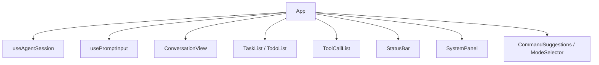
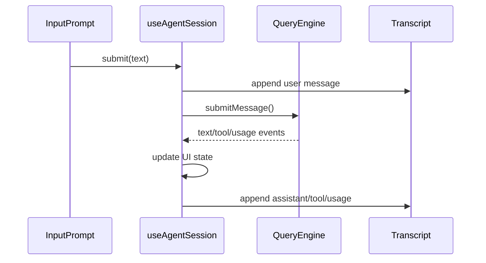

<details>
<summary>相关源文件</summary>

生成本页时使用的主要源文件：

- [src/entrypoint/cli.ts](https://github.com/ConardLi/easy-agent/blob/c24463e07dd136d41f6ab28edb33a3eaf0b209c1/src/entrypoint/cli.ts)
- [src/ui/App.tsx](https://github.com/ConardLi/easy-agent/blob/c24463e07dd136d41f6ab28edb33a3eaf0b209c1/src/ui/App.tsx)
- [src/ui/hooks/useAgentSession.ts](https://github.com/ConardLi/easy-agent/blob/c24463e07dd136d41f6ab28edb33a3eaf0b209c1/src/ui/hooks/useAgentSession.ts)
- [src/ui/hooks/usePromptInput.ts](https://github.com/ConardLi/easy-agent/blob/c24463e07dd136d41f6ab28edb33a3eaf0b209c1/src/ui/hooks/usePromptInput.ts)
- [src/ui/components/ConversationView.tsx](https://github.com/ConardLi/easy-agent/blob/c24463e07dd136d41f6ab28edb33a3eaf0b209c1/src/ui/components/ConversationView.tsx)
- [src/ui/components/StatusBar.tsx](https://github.com/ConardLi/easy-agent/blob/c24463e07dd136d41f6ab28edb33a3eaf0b209c1/src/ui/components/StatusBar.tsx)
- [src/ui/components/TaskList.tsx](https://github.com/ConardLi/easy-agent/blob/c24463e07dd136d41f6ab28edb33a3eaf0b209c1/src/ui/components/TaskList.tsx)
- [src/ui/components/TodoList.tsx](https://github.com/ConardLi/easy-agent/blob/c24463e07dd136d41f6ab28edb33a3eaf0b209c1/src/ui/components/TodoList.tsx)

</details>

# CLI 与终端 UI

Easy Agent 的用户界面是一个 Ink 应用。CLI 入口只做参数解析、运行时装配和 `render(<App />)`，具体交互状态全部落在 `App` 和 `useAgentSession` 中。  
Sources: [src/entrypoint/cli.ts:22-67](../../../project-repos/easy-agent/src/entrypoint/cli.ts#L22-L67), [src/entrypoint/cli.ts:105-133](../../../project-repos/easy-agent/src/entrypoint/cli.ts#L105-L133), [src/ui/App.tsx:25-109](../../../project-repos/easy-agent/src/ui/App.tsx#L25-L109)

<details class="source-snippets">
<summary>引用源码</summary>

<!-- source-snippets:start -->

#### `src/entrypoint/cli.ts:22-67`

```typescript
async function main(): Promise<void> {
  if (process.argv.includes("--version") || process.argv.includes("-v")) {
    console.log("easy-agent v" + VERSION);
    process.exit(0);
  }

  if (process.argv.includes("--help") || process.argv.includes("-h")) {
    console.log(`
easy-agent v${VERSION} — Terminal-native agentic coding system

Usage:
  agent [options]

Options:
  -v, --version               Print version and exit
  -h, --help                  Show this help message
  --model <model>             Override the LLM model
  --resume [session-id]       Resume the latest or a specific session
  --plan                      Start in plan mode (read-only tools only)
  --auto                      Start in auto mode (allow all tools)
  --permission-mode <mode>    Permission mode: default | plan | auto
  --dump-system-prompt        Print the assembled system prompt and exit

Commands (in REPL):
  /help                       Show available commands
  /clear                      Clear conversation history
  /mode [default|plan|auto]   Inspect or switch permission mode
  /tasks [task|todo|reset]    Switch task system or reset the task graph
  /mcp [tools|reconnect <n>]  Inspect or reconnect MCP servers
  /skills                     List loaded skills (user + project scope)
  /<skill-name> [args]        Invoke a skill by name
  /history                    Show session history
  /compact                    Compact conversation context
  /exit, /quit, /bye          Exit the REPL
`);
    process.exit(0);
  }

  const modelIndex = process.argv.indexOf("--model");
  const model = modelIndex !== -1 ? process.argv[modelIndex + 1] : undefined;
  const dumpSystemPrompt = process.argv.includes("--dump-system-prompt");
  const permissionMode = parsePermissionMode(process.argv);
  const resumeIndex = process.argv.indexOf("--resume");
  const resumeValue = resumeIndex !== -1 ? process.argv[resumeIndex + 1] : undefined;
  const resumeSessionId = resumeIndex !== -1 && resumeValue && !resumeValue.startsWith("--") ? resumeValue : null;
  const shouldResume = resumeIndex !== -1;
```

#### `src/entrypoint/cli.ts:105-133`

```typescript
  const React = await import("react");
  const { render } = await import("ink");
  const { App } = await import("../ui/App.js");
  const { DEFAULT_MODEL } = await import("../services/api/client.js");
  const { bootstrapMcp } = await import("../services/mcp/bootstrap.js");

  const resolvedModel = model ?? DEFAULT_MODEL;

  // Kick off MCP server connections IN THE BACKGROUND. The bootstrap
  // function seeds `pending` registry entries synchronously, then connects
  // each server in parallel — a slow `npx -y @mcp/server-foo` cold-start
  // (which can take 10–30s on first run while npm downloads the package)
  // would otherwise leave the terminal black, because we wouldn't render
  // the UI until it returned.
  //
  // Trade-off: if the user submits a query before MCP tools land, the
  // model just doesn't see them yet. They'll appear on the next turn.
  // This matches Claude Code's behavior — its `prefetchAllMcpResources`
  // runs inside `useManageMCPConnections` (a React useEffect), so the
  // REPL is interactive from frame 1 too.
  void bootstrapMcp(process.cwd()).catch((error) => {
    console.error(`[easy-agent] MCP bootstrap failed: ${(error as Error).message}`);
  });

  const { waitUntilExit } = render(
    React.createElement(App, { model: resolvedModel, permissionMode, resumeSessionId, shouldResume }),
    { exitOnCtrlC: false },
  );
  await waitUntilExit();
```

#### `src/ui/App.tsx:25-109`

```tsx
export function App({ model, permissionMode, shouldResume, resumeSessionId }: AppProps): React.ReactNode {
  const { exit } = useApp();
  const { state, actions } = useAgentSession({ model, onExit: exit, permissionMode, shouldResume, resumeSessionId });
  const isPlanExitActive = Boolean(state.permissionPrompt?.isPlanExit);

  // Surface the current in-progress item's activeForm via the global
  // StatusBar spinner. This mirrors source code behavior (Spinner.tsx:
  // `leaderVerb = currentTodo?.activeForm ?? randomVerb`) and keeps the
  // entire app at exactly ONE animation source — adding per-row spinners
  // caused severe flicker because every additional setInterval forces
  // another full terminal repaint cycle on top of streaming text.
  //
  // In task mode we read from the Task graph; in todo mode we keep the
  // V1 source. Either way, the spinner label comes from exactly one
  // place at a time.
  const inProgressTodo = state.todos.find((t) => t.status === "in_progress");
  const inProgressTask = state.tasks.find((t) => t.status === "in_progress");
  const effectiveSpinnerLabel = state.taskMode === "task"
    ? (inProgressTask?.activeForm ?? inProgressTask?.subject ?? state.spinnerLabel)
    : (inProgressTodo?.activeForm ?? state.spinnerLabel);
  // Pull skill `/<name>` commands from the live registry on every render
  // so newly activated conditional skills (e.g. test-reviewer after the
  // model reads a *.test.ts file) appear in the suggestion list without
  // the user having to restart. Computing inline is fine — the registry
  // is an in-memory Map and we only render on existing state changes.
  const skillCommands: CommandSuggestion[] = React.useMemo(
    () =>
      getAllUserInvocableSkills().map((skill) => ({
        name: `/${skill.name}`,
        description:
          skill.description.length > 80
            ? `${skill.description.slice(0, 77)}…`
            : skill.description,
      })),
    // Re-derive whenever the message log grows — that's our cheap proxy
    // for "something happened that may have activated a skill". The list
    // is tiny so the cost is negligible.
    [state.messages.length, state.toolCalls.length],
  );

  const { inputValue, commandSuggestions, modeSuggestions, taskModeSuggestions } = usePromptInput({
    isLoading: state.isLoading,
    hasPermissionPrompt: Boolean(state.permissionPrompt) && !isPlanExitActive,
    isPlanExitPrompt: false,
    permissionMode: state.permissionMode,
    taskMode: state.taskMode,
    extraCommands: skillCommands,
    onSubmit: actions.submit,
    onExit: exit,
    onInterrupt: actions.interrupt,
    onPermissionDecision: actions.resolvePermission,
  });

  return (
    <Box flexDirection="column" paddingX={1}>
      <Box marginBottom={1}>
        <Text bold color="cyan">Easy Agent</Text>
        <Text dimColor> ({state.currentModel})</Text>
      </Box>
      <Text dimColor>Type a message to start. Ctrl+C to interrupt, Ctrl+D to exit.</Text>

      <ConversationView messages={state.messages} />
      {state.taskMode === "task"
        ? <TaskList tasks={state.tasks} />
        : <TodoList todos={state.todos} />}
      <ToolCallList toolCalls={state.toolCalls} />
      <SystemPanel notice={state.systemNotice} />
      <StatusBar
        isLoading={state.isLoading}
        spinnerLabel={effectiveSpinnerLabel}
        streamingText={state.streamingText}
        lastUsage={state.lastUsage}
        permissionPrompt={state.permissionPrompt}
        permissionMode={state.permissionMode}
        onPlanDecision={actions.resolvePermission}
      />
      <InputPrompt isLoading={state.isLoading || Boolean(state.permissionPrompt)} inputValue={inputValue} />
      <CommandSuggestions items={commandSuggestions} />
      <ModeSelector items={modeSuggestions} />
      <ModeSelector
        items={taskModeSuggestions}
        title={`select task system (↑↓ navigate, Enter confirm, 1-${taskModeSuggestions.length || 2} shortcut)`}
      />
    </Box>
  );
```

<!-- source-snippets:end -->
</details>
## CLI 参数与 REPL 命令

`cli.ts` 支持版本、帮助、模型覆盖、会话恢复、plan/auto permission mode、显式 permission mode、system prompt dump。帮助文本还列出 REPL 命令：`/mode`、`/tasks`、`/mcp`、`/skills`、`/<skill-name>`、`/history`、`/compact` 等。  
Sources: [src/entrypoint/cli.ts:28-56](../../../project-repos/easy-agent/src/entrypoint/cli.ts#L28-L56), [src/entrypoint/cli.ts:60-67](../../../project-repos/easy-agent/src/entrypoint/cli.ts#L60-L67)

<details class="source-snippets">
<summary>引用源码</summary>

<!-- source-snippets:start -->

#### `src/entrypoint/cli.ts:28-56`

```typescript
  if (process.argv.includes("--help") || process.argv.includes("-h")) {
    console.log(`
easy-agent v${VERSION} — Terminal-native agentic coding system

Usage:
  agent [options]

Options:
  -v, --version               Print version and exit
  -h, --help                  Show this help message
  --model <model>             Override the LLM model
  --resume [session-id]       Resume the latest or a specific session
  --plan                      Start in plan mode (read-only tools only)
  --auto                      Start in auto mode (allow all tools)
  --permission-mode <mode>    Permission mode: default | plan | auto
  --dump-system-prompt        Print the assembled system prompt and exit

Commands (in REPL):
  /help                       Show available commands
  /clear                      Clear conversation history
  /mode [default|plan|auto]   Inspect or switch permission mode
  /tasks [task|todo|reset]    Switch task system or reset the task graph
  /mcp [tools|reconnect <n>]  Inspect or reconnect MCP servers
  /skills                     List loaded skills (user + project scope)
  /<skill-name> [args]        Invoke a skill by name
  /history                    Show session history
  /compact                    Compact conversation context
  /exit, /quit, /bye          Exit the REPL
`);
```

#### `src/entrypoint/cli.ts:60-67`

```typescript
  const modelIndex = process.argv.indexOf("--model");
  const model = modelIndex !== -1 ? process.argv[modelIndex + 1] : undefined;
  const dumpSystemPrompt = process.argv.includes("--dump-system-prompt");
  const permissionMode = parsePermissionMode(process.argv);
  const resumeIndex = process.argv.indexOf("--resume");
  const resumeValue = resumeIndex !== -1 ? process.argv[resumeIndex + 1] : undefined;
  const resumeSessionId = resumeIndex !== -1 && resumeValue && !resumeValue.startsWith("--") ? resumeValue : null;
  const shouldResume = resumeIndex !== -1;
```

<!-- source-snippets:end -->
</details>
| 输入 | 行为 |
|------|------|
| `--model <model>` | 覆盖默认模型 |
| `--resume [session-id]` | 恢复最近或指定 session |
| `--plan` / `--auto` | 初始 permission mode |
| `--dump-system-prompt` | 构建并打印 system prompt 后退出 |
| `/mcp` | 查看 MCP server 状态和工具 |
| `/skills` | 查看 user/project skills |
| `/compact` | 手动压缩上下文 |

Sources: [src/entrypoint/cli.ts:35-55](../../../project-repos/easy-agent/src/entrypoint/cli.ts#L35-L55), [src/core/queryEngine.ts:440-629](../../../project-repos/easy-agent/src/core/queryEngine.ts#L440-L629)

<details class="source-snippets">
<summary>引用源码</summary>

<!-- source-snippets:start -->

#### `src/entrypoint/cli.ts:35-55`

```typescript
Options:
  -v, --version               Print version and exit
  -h, --help                  Show this help message
  --model <model>             Override the LLM model
  --resume [session-id]       Resume the latest or a specific session
  --plan                      Start in plan mode (read-only tools only)
  --auto                      Start in auto mode (allow all tools)
  --permission-mode <mode>    Permission mode: default | plan | auto
  --dump-system-prompt        Print the assembled system prompt and exit

Commands (in REPL):
  /help                       Show available commands
  /clear                      Clear conversation history
  /mode [default|plan|auto]   Inspect or switch permission mode
  /tasks [task|todo|reset]    Switch task system or reset the task graph
  /mcp [tools|reconnect <n>]  Inspect or reconnect MCP servers
  /skills                     List loaded skills (user + project scope)
  /<skill-name> [args]        Invoke a skill by name
  /history                    Show session history
  /compact                    Compact conversation context
  /exit, /quit, /bye          Exit the REPL
```

#### `src/core/queryEngine.ts:440-629`

```typescript
  private async *handleCommand(command: string): AsyncGenerator<QueryEngineEvent, { handled: boolean }> {
    const [name, ...args] = command.slice(1).split(/\s+/).filter(Boolean);

    switch (name) {
      case "help":
        yield {
          type: "command",
          kind: "info",
          message: "Commands: /help /clear /cost /model [name|default] /mode [default|plan|auto] /tasks [task|todo|reset] /mcp [tools <name>|reconnect <name>] /skills /history /compact /<skill-name> [args] /exit /quit /bye",
        };
        return { handled: true };
      case "mcp":
        return yield* this.handleMcpCommand(args);
      case "skills":
        return yield* this.handleSkillsCommand();
      case "mode": {
        const nextMode = args[0]?.trim();
        if (!nextMode) {
          yield {
            type: "command",
            kind: "info",
            message: `Current mode: ${this.currentPermissionMode}` +
              (this.prePlanMode ? ` (will restore to ${this.prePlanMode} on plan exit)` : ""),
          };
          return { handled: true };
        }
        if (nextMode !== "default" && nextMode !== "plan" && nextMode !== "auto") {
          yield { type: "command", kind: "error", message: `Invalid mode: ${nextMode}. Must be default, plan, or auto.` };
          return { handled: true };
        }
        const previous = this.currentPermissionMode;
        this.setPermissionMode(nextMode as PermissionMode);
        yield { type: "mode_changed", mode: this.currentPermissionMode, previousMode: previous };
        yield {
          type: "command",
          kind: "info",
          message: `Mode changed: ${previous} → ${this.currentPermissionMode}`,
        };
        return { handled: true };
      }
      case "tasks": {
        const arg = args[0]?.trim();
        const current = getTaskMode();
        if (!arg) {
          yield {
            type: "command",
            kind: "info",
            message: [
              "Task system status",
              `- Active: ${current} (${current === "task" ? "persistent graph (Task V2)" : "session memory (TodoWrite V1)"})`,
              "- Usage: /tasks task      Use persistent Task V2 tools (default)",
              "- Usage: /tasks todo      Use in-memory TodoWrite V1",
              "- Usage: /tasks reset     Delete every task in the current task list",
            ].join("\n"),
          };
          return { handled: true };
        }
        if (arg === "reset") {
          const taskListId = getTaskListId(this.toolContext.sessionId ?? "default");
          try {
            await resetTaskList(taskListId);
            yield { type: "command", kind: "info", message: `Task list '${taskListId}' has been reset.` };
          } catch (error) {
            const msg = error instanceof Error ? error.message : String(error);
            yield { type: "command", kind: "error", message: `Failed to reset task list: ${msg}` };
          }
          return { handled: true };
        }
        if (arg !== "task" && arg !== "todo") {
          yield {
            type: "command",
            kind: "error",
            message: `Invalid task mode: ${arg}. Must be task, todo, or reset.`,
          };
          return { handled: true };
        }
        if (arg === current) {
          yield {
            type: "command",
            kind: "info",
            message: `Task system is already '${current}'.`,
          };
          return { handled: true };
        }
        setTaskMode(arg);
        yield { type: "task_mode_changed", mode: arg, previousMode: current };
        yield {
          type: "command",
          kind: "info",
          message: `Task system changed: ${current} → ${arg}.`,
        };
        return { handled: true };
      }
      case "clear":
        this.messages = [];
        yield { type: "session_cleared" };
        yield { type: "messages_updated", messages: [] };
        yield { type: "command", kind: "info", message: "Conversation cleared." };
        return { handled: true };
      case "cost":
        yield {
          type: "command",
          kind: "info",
          message: `Session usage\n- Input tokens: ${this.totalUsage.input_tokens}\n- Output tokens: ${this.totalUsage.output_tokens}\n- Total tokens: ${this.totalUsage.input_tokens + this.totalUsage.output_tokens}`,
        };
        return { handled: true };
      case "model": {
        const nextModel = args.join(" ").trim();

        if (!nextModel) {
          yield {
            type: "command",
            kind: "info",
            message: [
              "Model status",
              `- Active model: ${this.getActiveModel()}`,
              `- Source: ${this.getModelSource()}`,
              `- Default model: ${this.defaultModel}`,
              this.sessionModelOverride ? `- Session override: ${this.sessionModelOverride}` : "- Session override: none",
              "- Usage: /model <name> to override for this session",
... snippet truncated ...
```

<!-- source-snippets:end -->
</details>
## App 组件树

`App` 从 `useAgentSession` 取 state/actions，并组合多个显示组件。任务展示在 Task V2 和 TodoWrite V1 间切换，工具调用既有实时 `ToolCallList`，也会在消息提交后由 `ConversationView` 内联渲染。  
Sources: [src/ui/App.tsx:25-44](../../../project-repos/easy-agent/src/ui/App.tsx#L25-L44), [src/ui/App.tsx:65-109](../../../project-repos/easy-agent/src/ui/App.tsx#L65-L109)

<details class="source-snippets">
<summary>引用源码</summary>

<!-- source-snippets:start -->

#### `src/ui/App.tsx:25-44`

```tsx
export function App({ model, permissionMode, shouldResume, resumeSessionId }: AppProps): React.ReactNode {
  const { exit } = useApp();
  const { state, actions } = useAgentSession({ model, onExit: exit, permissionMode, shouldResume, resumeSessionId });
  const isPlanExitActive = Boolean(state.permissionPrompt?.isPlanExit);

  // Surface the current in-progress item's activeForm via the global
  // StatusBar spinner. This mirrors source code behavior (Spinner.tsx:
  // `leaderVerb = currentTodo?.activeForm ?? randomVerb`) and keeps the
  // entire app at exactly ONE animation source — adding per-row spinners
  // caused severe flicker because every additional setInterval forces
  // another full terminal repaint cycle on top of streaming text.
  //
  // In task mode we read from the Task graph; in todo mode we keep the
  // V1 source. Either way, the spinner label comes from exactly one
  // place at a time.
  const inProgressTodo = state.todos.find((t) => t.status === "in_progress");
  const inProgressTask = state.tasks.find((t) => t.status === "in_progress");
  const effectiveSpinnerLabel = state.taskMode === "task"
    ? (inProgressTask?.activeForm ?? inProgressTask?.subject ?? state.spinnerLabel)
    : (inProgressTodo?.activeForm ?? state.spinnerLabel);
```

#### `src/ui/App.tsx:65-109`

```tsx
  const { inputValue, commandSuggestions, modeSuggestions, taskModeSuggestions } = usePromptInput({
    isLoading: state.isLoading,
    hasPermissionPrompt: Boolean(state.permissionPrompt) && !isPlanExitActive,
    isPlanExitPrompt: false,
    permissionMode: state.permissionMode,
    taskMode: state.taskMode,
    extraCommands: skillCommands,
    onSubmit: actions.submit,
    onExit: exit,
    onInterrupt: actions.interrupt,
    onPermissionDecision: actions.resolvePermission,
  });

  return (
    <Box flexDirection="column" paddingX={1}>
      <Box marginBottom={1}>
        <Text bold color="cyan">Easy Agent</Text>
        <Text dimColor> ({state.currentModel})</Text>
      </Box>
      <Text dimColor>Type a message to start. Ctrl+C to interrupt, Ctrl+D to exit.</Text>

      <ConversationView messages={state.messages} />
      {state.taskMode === "task"
        ? <TaskList tasks={state.tasks} />
        : <TodoList todos={state.todos} />}
      <ToolCallList toolCalls={state.toolCalls} />
      <SystemPanel notice={state.systemNotice} />
      <StatusBar
        isLoading={state.isLoading}
        spinnerLabel={effectiveSpinnerLabel}
        streamingText={state.streamingText}
        lastUsage={state.lastUsage}
        permissionPrompt={state.permissionPrompt}
        permissionMode={state.permissionMode}
        onPlanDecision={actions.resolvePermission}
      />
      <InputPrompt isLoading={state.isLoading || Boolean(state.permissionPrompt)} inputValue={inputValue} />
      <CommandSuggestions items={commandSuggestions} />
      <ModeSelector items={modeSuggestions} />
      <ModeSelector
        items={taskModeSuggestions}
        title={`select task system (↑↓ navigate, Enter confirm, 1-${taskModeSuggestions.length || 2} shortcut)`}
      />
    </Box>
  );
```

<!-- source-snippets:end -->
</details>


Sources: [src/ui/App.tsx:1-16](../../../project-repos/easy-agent/src/ui/App.tsx#L1-L16), [src/ui/App.tsx:78-108](../../../project-repos/easy-agent/src/ui/App.tsx#L78-L108)

<details class="source-snippets">
<summary>引用源码</summary>

<!-- source-snippets:start -->

#### `src/ui/App.tsx:1-16`

```tsx
import React from "react";
import { Box, Text, useApp } from "ink";
import type { PermissionMode } from "../permissions/permissions.js";
import { CommandSuggestions } from "./components/CommandSuggestions.js";
import { ConversationView } from "./components/ConversationView.js";
import { InputPrompt } from "./components/InputPrompt.js";
import { ModeSelector } from "./components/ModeSelector.js";
import { StatusBar } from "./components/StatusBar.js";
import { SystemPanel } from "./components/SystemPanel.js";
import { TaskList } from "./components/TaskList.js";
import { TodoList } from "./components/TodoList.js";
import { ToolCallList } from "./components/ToolCallList.js";
import { usePromptInput } from "./hooks/usePromptInput.js";
import { useAgentSession } from "./hooks/useAgentSession.js";
import { getAllUserInvocableSkills } from "../services/skills/registry.js";
import type { CommandSuggestion } from "./types.js";
```

#### `src/ui/App.tsx:78-108`

```tsx
  return (
    <Box flexDirection="column" paddingX={1}>
      <Box marginBottom={1}>
        <Text bold color="cyan">Easy Agent</Text>
        <Text dimColor> ({state.currentModel})</Text>
      </Box>
      <Text dimColor>Type a message to start. Ctrl+C to interrupt, Ctrl+D to exit.</Text>

      <ConversationView messages={state.messages} />
      {state.taskMode === "task"
        ? <TaskList tasks={state.tasks} />
        : <TodoList todos={state.todos} />}
      <ToolCallList toolCalls={state.toolCalls} />
      <SystemPanel notice={state.systemNotice} />
      <StatusBar
        isLoading={state.isLoading}
        spinnerLabel={effectiveSpinnerLabel}
        streamingText={state.streamingText}
        lastUsage={state.lastUsage}
        permissionPrompt={state.permissionPrompt}
        permissionMode={state.permissionMode}
        onPlanDecision={actions.resolvePermission}
      />
      <InputPrompt isLoading={state.isLoading || Boolean(state.permissionPrompt)} inputValue={inputValue} />
      <CommandSuggestions items={commandSuggestions} />
      <ModeSelector items={modeSuggestions} />
      <ModeSelector
        items={taskModeSuggestions}
        title={`select task system (↑↓ navigate, Enter confirm, 1-${taskModeSuggestions.length || 2} shortcut)`}
      />
    </Box>
```

<!-- source-snippets:end -->
</details>
## 会话 Hook

`useAgentSession` 初始化 permission settings 和 `QueryEngine`，创建或恢复 session，订阅 Todo/Task store，处理流式事件、工具卡片、permission prompt、usage、compaction、model/mode/task mode 变化，并把结果写入 transcript。  
Sources: [src/ui/hooks/useAgentSession.ts:168-238](../../../project-repos/easy-agent/src/ui/hooks/useAgentSession.ts#L168-L238), [src/ui/hooks/useAgentSession.ts:290-397](../../../project-repos/easy-agent/src/ui/hooks/useAgentSession.ts#L290-L397), [src/ui/hooks/useAgentSession.ts:474-679](../../../project-repos/easy-agent/src/ui/hooks/useAgentSession.ts#L474-L679)

<details class="source-snippets">
<summary>引用源码</summary>

<!-- source-snippets:start -->

#### `src/ui/hooks/useAgentSession.ts:168-238`

```typescript
export function useAgentSession({
  model,
  onExit,
  permissionMode,
  shouldResume,
  resumeSessionId,
}: UseAgentSessionOptions) {
  const [messages, setMessages] = useState<MessageParam[]>([]);
  const [isLoading, setIsLoading] = useState(false);
  const [spinnerLabel, setSpinnerLabel] = useState("Thinking");
  const [streamingText, setStreamingText] = useState("");
  const [toolCalls, setToolCalls] = useState<ToolCallInfo[]>([]);
  const [lastUsage, setLastUsage] = useState<UsageSummary | null>(null);
  const [totalUsage, setTotalUsage] = useState<UsageSummary | null>(null);
  const [systemNotice, setSystemNotice] = useState<SystemNotice | null>(null);
  const [permissionPrompt, setPermissionPrompt] = useState<PermissionPromptState | null>(null);
  const [permissionSettings, setPermissionSettings] = useState<PermissionSettings | null>(null);
  const [currentModel, setCurrentModel] = useState(model);
  const [activePermissionMode, setActivePermissionMode] = useState<string>(permissionMode ?? "default");
  const [todos, setTodosState] = useState<TodoItem[]>([]);
  const [tasks, setTasksState] = useState<Task[]>([]);
  const [taskMode, setTaskModeState] = useState<TaskMode>(getTaskMode());

  const permissionResolverRef = useRef<((decision: PermissionDecision) => void) | null>(null);
  const pendingClearContextRef = useRef(false);
  const pendingFeedbackRef = useRef<string | null>(null);
  const sessionRulesRef = useRef<PermissionRuleSet>({ allow: [], deny: [] });
  const engineRef = useRef<QueryEngine | null>(null);
  const sessionIdRef = useRef<string>(createSessionId());

  // Streaming-text throttling. SSE chunks can arrive at >100 Hz from fast
  // models, and every setStreamingText forces Ink to repaint the whole
  // frame — combined with the TodoList / ToolCallList that sit above it,
  // the unbatched updates caused visible flicker and "untouchable" terminal
  // scrolling. We coalesce chunks into a 30ms window (≈33 fps) — fast
  // enough to look live, slow enough to keep the UI usable.
  const pendingTextRef = useRef<string>("");
  const flushTimerRef = useRef<ReturnType<typeof setTimeout> | null>(null);
  const flushPendingText = useCallback(() => {
    flushTimerRef.current = null;
    if (pendingTextRef.current) {
      const chunk = pendingTextRef.current;
      pendingTextRef.current = "";
      setStreamingText((prev) => prev + chunk);
    }
  }, []);
  const cancelPendingText = useCallback(() => {
    if (flushTimerRef.current) {
      clearTimeout(flushTimerRef.current);
      flushTimerRef.current = null;
    }
    pendingTextRef.current = "";
  }, []);

  // Always release the timer on unmount so we don't leak across hot reloads.
  useEffect(() => () => cancelPendingText(), [cancelPendingText]);
  // `sessionId` is exposed as a live getter so tools always see the
  // current sessionIdRef value. This matters during /resume — the ref is
  // mutated *after* this hook has memoized the toolContext, and a baked-in
  // value would silently route TodoWrite writes to the old (orphan) key
  // while the UI subscriber filters on the new sessionId, leaving the
  // todo panel permanently empty.
  const toolContext = useMemo<ToolContext>(
    () => ({
      cwd: process.cwd(),
      get sessionId() {
        return sessionIdRef.current;
      },
    }),
    [],
  );
```

#### `src/ui/hooks/useAgentSession.ts:290-397`

```typescript
  useEffect(() => {
    void loadPermissionSettings(process.cwd())
      .then(setPermissionSettings)
      .catch((error: unknown) => {
        setSystemNotice({
          tone: "error",
          title: "Permission settings error",
          body: error instanceof Error ? error.message : String(error),
        });
      });
  }, []);

  useEffect(() => {
    if (!permissionSettings) return;

    let cancelled = false;

    const initialize = async () => {
      try {
        let initialMessages: MessageParam[] = [];
        let initialUsage = { input_tokens: 0, output_tokens: 0 };

        if (shouldResume) {
          const restored = await restoreSession(toolContext.cwd, resumeSessionId ?? undefined);
          if (cancelled) return;
          sessionIdRef.current = restored.summary.sessionId;
          initialMessages = restored.messages;
          initialUsage = restored.summary.totalUsage;
          setMessages(restored.messages);
          setTotalUsage({
            input: restored.summary.totalUsage.input_tokens,
            output: restored.summary.totalUsage.output_tokens,
          });
          setSystemNotice({
            tone: "info",
            title: "Session restored",
            body: `Resumed session ${restored.summary.sessionId} with ${restored.summary.messageCount} messages.`,
          });
        } else {
          const startedAt = new Date().toISOString();
          await initSessionStorage({
            sessionId: sessionIdRef.current,
            cwd: toolContext.cwd,
            startedAt,
            updatedAt: startedAt,
            model,
          });
        }

        const engine = new QueryEngine({
          model,
          toolContext,
          initialMessages,
          initialUsage,
          permissionMode: permissionMode ?? permissionSettings.mode,
          permissionSettings,
          sessionPermissionRules: sessionRulesRef.current,
          onPermissionRequest: async (request: PermissionRequest) => {
            const isPlanExit = request.toolName === "ExitPlanMode";
            setSpinnerLabel(isPlanExit ? "Waiting for plan approval" : "Waiting for permission");

            let planContent: string | undefined;
            let planFilePath: string | undefined;
            if (isPlanExit) {
              planContent = (await readPlan()) ?? undefined;
              planFilePath = getPlanFilePath();
            }

            setPermissionPrompt({
              toolName: request.toolName,
              summary: request.summary,
              risk: request.risk,
              ruleHint: request.ruleHint,
              isPlanExit,
              planContent,
              planFilePath,
            });
            return new Promise<PermissionDecision>((resolve) => {
              permissionResolverRef.current = resolve;
            });
          },
        });
        engine.onModeChange((newMode, previousMode) => {
          setActivePermissionMode(newMode);
          const label = newMode === "plan" ? "Entered plan mode" : "Exited plan mode";
          const body = newMode === "plan"
            ? "Only read-only tools are available. Explore the codebase and write your plan."
            : `Returned to ${newMode} mode. Full tool access restored.`;
          setSystemNotice({ tone: "info", title: label, body });
        });
        engineRef.current = engine;
        setCurrentModel(model);
      } catch (error: unknown) {
        if (cancelled) return;
        setSystemNotice({
          tone: "error",
          title: "Session restore error",
          body: error instanceof Error ? error.message : String(error),
        });
      }
    };

    void initialize();

    return () => {
      cancelled = true;
    };
  }, [model, permissionMode, permissionSettings, resumeSessionId, shouldResume, toolContext]);
```

#### `src/ui/hooks/useAgentSession.ts:474-679`

```typescript
  const submit = useCallback(async (text: string): Promise<SubmitResult> => {
    if (!text.trim()) {
      return { handled: false };
    }

    const trimmed = text.trim();
    if (trimmed === "/exit" || trimmed === "/quit" || trimmed === "/bye") {
      onExit();
      return { handled: true };
    }

    if (!engineRef.current) {
      setSystemNotice({
        tone: "error",
        title: "QueryEngine is not ready",
        body: "Please wait for initialization to finish.",
      });
      return { handled: true };
    }

    const isSlashCommand = trimmed.startsWith("/");
    // Slash commands fall into two categories that need different UX:
    //   1. *System* commands (/help, /cost, /model, /skills, /mcp, …) —
    //      synchronous, never call the LLM, just print a notice.
    //   2. *Skill* commands (/<skill-name> [args]) — expand into a real
    //      user prompt and engage the full agentic loop, exactly like a
    //      typed chat message.
    // Without this distinction every `/` input was treated as case (1):
    // no spinner, no streaming, no transcript entry — which made skill
    // invocations feel broken even though events were flowing through
    // the engine. Detect skill commands by peeking at the registry here
    // and treat them as LLM-triggering input below.
    const skillCommandName = isSlashCommand
      ? trimmed.slice(1).split(/\s+/, 1)[0]?.toLowerCase() ?? ""
      : "";
    const isSkillCommand =
      isSlashCommand && !!skillCommandName && !!findSkill(skillCommandName);
    const isLlmTriggering = !isSlashCommand || isSkillCommand;

    cancelPendingText();
    setStreamingText("");
    setToolCalls([]);
    setSystemNotice(null);
    if (isLlmTriggering) {
      setLastUsage(null);
      // Persist what the user actually typed (`/hello-world Easy Agent`)
      // rather than the expanded SKILL.md body. The expanded prompt is
      // an internal/wire-only artifact — keeping the transcript clean
      // means /resume replays the same UX the user originally saw.
      await appendTranscriptEntry(toolContext.cwd, sessionIdRef.current, {
        type: "message",
        timestamp: new Date().toISOString(),
        role: "user",
        message: { role: "user", content: trimmed },
      });
    }
    setPermissionPrompt(null);
    const needsLoading = isLlmTriggering || trimmed.startsWith("/compact");
    setIsLoading(needsLoading);
    setSpinnerLabel(trimmed.startsWith("/compact") ? "Compacting" : "Thinking");

    try {
      const run = engineRef.current.submitMessage(trimmed);

      while (true) {
        const { value, done } = await run.next();
        if (done) {
          if (value.reason === "aborted" && !pendingClearContextRef.current) {
            setSystemNotice({
              tone: "info",
              title: "Interrupted",
              body: "Use /exit, /quit, /bye, or Ctrl+D to exit.",
            });
          }
          break;
        }

        switch (value.type) {
          case "text":
            // Coalesce rapid SSE chunks into a 30ms window. Without this
            // every chunk forces a full Ink frame repaint, and combined
            // with the TodoList / ToolCallList above it the terminal
            // flickers and refuses to scroll.
            pendingTextRef.current += value.text;
            if (!flushTimerRef.current) {
              flushTimerRef.current = setTimeout(flushPendingText, 30);
            }
            break;
          case "tool_use_start":
            setToolCalls((prev) => [...prev, { id: value.id, name: value.name }]);
            await appendTranscriptEntry(toolContext.cwd, sessionIdRef.current, {
              type: "tool_event",
              timestamp: new Date().toISOString(),
              name: value.name,
              phase: "start",
            });
            break;
          case "permission_request":
            setSpinnerLabel("Waiting for permission");
            setPermissionPrompt({
              toolName: value.request.toolName,
              summary: value.request.summary,
              risk: value.request.risk,
              ruleHint: value.request.ruleHint,
            });
            break;
          case "tool_use_done": {
            const isPlanFileWrite =
              (value.name === "Write" || value.name === "Edit") &&
              value.result.content.includes(getPlansDirectory());
            const inputPreview = formatToolInputPreview(value.input);
            // Strip the model-only <sandbox_violations> tag from the
            // user-visible error message. The tag stays in the tool
            // result that goes back to the model (so it can interpret
            // sandbox denials), but humans see clean stderr only.
            const rawErrorMessage = value.result.isError ? value.result.content : undefined;
            const errorMessage = rawErrorMessage
              ? removeSandboxViolationTags(rawErrorMessage)
              : undefined;
            setToolCalls((prev) =>
... snippet truncated ...
```

<!-- source-snippets:end -->
</details>
它对 streaming text 做 30ms 合并，避免高频 SSE chunks 触发 Ink 全树重绘。这个优化和 Task/Todo 列表的静态渲染策略配合，降低终端闪烁和滚动问题。  
Sources: [src/ui/hooks/useAgentSession.ts:198-223](../../../project-repos/easy-agent/src/ui/hooks/useAgentSession.ts#L198-L223), [src/ui/hooks/useAgentSession.ts:551-560](../../../project-repos/easy-agent/src/ui/hooks/useAgentSession.ts#L551-L560), [src/ui/components/TaskList.tsx:9-17](../../../project-repos/easy-agent/src/ui/components/TaskList.tsx#L9-L17), [src/ui/components/TodoList.tsx:9-17](../../../project-repos/easy-agent/src/ui/components/TodoList.tsx#L9-L17)

<details class="source-snippets">
<summary>引用源码</summary>

<!-- source-snippets:start -->

#### `src/ui/hooks/useAgentSession.ts:198-223`

```typescript
  // Streaming-text throttling. SSE chunks can arrive at >100 Hz from fast
  // models, and every setStreamingText forces Ink to repaint the whole
  // frame — combined with the TodoList / ToolCallList that sit above it,
  // the unbatched updates caused visible flicker and "untouchable" terminal
  // scrolling. We coalesce chunks into a 30ms window (≈33 fps) — fast
  // enough to look live, slow enough to keep the UI usable.
  const pendingTextRef = useRef<string>("");
  const flushTimerRef = useRef<ReturnType<typeof setTimeout> | null>(null);
  const flushPendingText = useCallback(() => {
    flushTimerRef.current = null;
    if (pendingTextRef.current) {
      const chunk = pendingTextRef.current;
      pendingTextRef.current = "";
      setStreamingText((prev) => prev + chunk);
    }
  }, []);
  const cancelPendingText = useCallback(() => {
    if (flushTimerRef.current) {
      clearTimeout(flushTimerRef.current);
      flushTimerRef.current = null;
    }
    pendingTextRef.current = "";
  }, []);

  // Always release the timer on unmount so we don't leak across hot reloads.
  useEffect(() => () => cancelPendingText(), [cancelPendingText]);
```

#### `src/ui/hooks/useAgentSession.ts:551-560`

```typescript
        switch (value.type) {
          case "text":
            // Coalesce rapid SSE chunks into a 30ms window. Without this
            // every chunk forces a full Ink frame repaint, and combined
            // with the TodoList / ToolCallList above it the terminal
            // flickers and refuses to scroll.
            pendingTextRef.current += value.text;
            if (!flushTimerRef.current) {
              flushTimerRef.current = setTimeout(flushPendingText, 30);
            }
```

#### `src/ui/components/TaskList.tsx:9-17`

```tsx
 * Rendering rules, same as TodoList:
 *   - every row is STATIC (no per-row spinner) — the live "active task"
 *     verb is rendered once by the global StatusBar spinner via
 *     `effectiveSpinnerLabel` in App.tsx. Adding a setInterval per row
 *     multiplies terminal repaints and reintroduces the flicker we
 *     fought in stage 14.
 *   - React.memo with a structural comparator prevents siblings of
 *     streamingText from forcing re-renders through us.
 */
```

#### `src/ui/components/TodoList.tsx:9-17`

```tsx
 * **不要在每行放独立的 Spinner**：在终端里每多一个 setInterval 就多一份
 * 80ms 的全树重绘压力，叠加 streamingText 高频更新会出现严重闪屏并导致
 * 终端无法滚动。源码做法是：
 *   - TodoList 行全部静态
 *   - 当前 in_progress 的 `activeForm` 由 **全局 StatusBar 的 spinner**
 *     接管（"leaderVerb = currentTodo?.activeForm ?? randomVerb"）
 *
 * `React.memo` + 自定义比较器进一步避免无关 setState 触发的重渲染。
 */
```

<!-- source-snippets:end -->
</details>


Sources: [src/ui/hooks/useAgentSession.ts:474-536](../../../project-repos/easy-agent/src/ui/hooks/useAgentSession.ts#L474-L536), [src/ui/hooks/useAgentSession.ts:551-679](../../../project-repos/easy-agent/src/ui/hooks/useAgentSession.ts#L551-L679)

<details class="source-snippets">
<summary>引用源码</summary>

<!-- source-snippets:start -->

#### `src/ui/hooks/useAgentSession.ts:474-536`

```typescript
  const submit = useCallback(async (text: string): Promise<SubmitResult> => {
    if (!text.trim()) {
      return { handled: false };
    }

    const trimmed = text.trim();
    if (trimmed === "/exit" || trimmed === "/quit" || trimmed === "/bye") {
      onExit();
      return { handled: true };
    }

    if (!engineRef.current) {
      setSystemNotice({
        tone: "error",
        title: "QueryEngine is not ready",
        body: "Please wait for initialization to finish.",
      });
      return { handled: true };
    }

    const isSlashCommand = trimmed.startsWith("/");
    // Slash commands fall into two categories that need different UX:
    //   1. *System* commands (/help, /cost, /model, /skills, /mcp, …) —
    //      synchronous, never call the LLM, just print a notice.
    //   2. *Skill* commands (/<skill-name> [args]) — expand into a real
    //      user prompt and engage the full agentic loop, exactly like a
    //      typed chat message.
    // Without this distinction every `/` input was treated as case (1):
    // no spinner, no streaming, no transcript entry — which made skill
    // invocations feel broken even though events were flowing through
    // the engine. Detect skill commands by peeking at the registry here
    // and treat them as LLM-triggering input below.
    const skillCommandName = isSlashCommand
      ? trimmed.slice(1).split(/\s+/, 1)[0]?.toLowerCase() ?? ""
      : "";
    const isSkillCommand =
      isSlashCommand && !!skillCommandName && !!findSkill(skillCommandName);
    const isLlmTriggering = !isSlashCommand || isSkillCommand;

    cancelPendingText();
    setStreamingText("");
    setToolCalls([]);
    setSystemNotice(null);
    if (isLlmTriggering) {
      setLastUsage(null);
      // Persist what the user actually typed (`/hello-world Easy Agent`)
      // rather than the expanded SKILL.md body. The expanded prompt is
      // an internal/wire-only artifact — keeping the transcript clean
      // means /resume replays the same UX the user originally saw.
      await appendTranscriptEntry(toolContext.cwd, sessionIdRef.current, {
        type: "message",
        timestamp: new Date().toISOString(),
        role: "user",
        message: { role: "user", content: trimmed },
      });
    }
    setPermissionPrompt(null);
    const needsLoading = isLlmTriggering || trimmed.startsWith("/compact");
    setIsLoading(needsLoading);
    setSpinnerLabel(trimmed.startsWith("/compact") ? "Compacting" : "Thinking");

    try {
      const run = engineRef.current.submitMessage(trimmed);
```

#### `src/ui/hooks/useAgentSession.ts:551-679`

```typescript
        switch (value.type) {
          case "text":
            // Coalesce rapid SSE chunks into a 30ms window. Without this
            // every chunk forces a full Ink frame repaint, and combined
            // with the TodoList / ToolCallList above it the terminal
            // flickers and refuses to scroll.
            pendingTextRef.current += value.text;
            if (!flushTimerRef.current) {
              flushTimerRef.current = setTimeout(flushPendingText, 30);
            }
            break;
          case "tool_use_start":
            setToolCalls((prev) => [...prev, { id: value.id, name: value.name }]);
            await appendTranscriptEntry(toolContext.cwd, sessionIdRef.current, {
              type: "tool_event",
              timestamp: new Date().toISOString(),
              name: value.name,
              phase: "start",
            });
            break;
          case "permission_request":
            setSpinnerLabel("Waiting for permission");
            setPermissionPrompt({
              toolName: value.request.toolName,
              summary: value.request.summary,
              risk: value.request.risk,
              ruleHint: value.request.ruleHint,
            });
            break;
          case "tool_use_done": {
            const isPlanFileWrite =
              (value.name === "Write" || value.name === "Edit") &&
              value.result.content.includes(getPlansDirectory());
            const inputPreview = formatToolInputPreview(value.input);
            // Strip the model-only <sandbox_violations> tag from the
            // user-visible error message. The tag stays in the tool
            // result that goes back to the model (so it can interpret
            // sandbox denials), but humans see clean stderr only.
            const rawErrorMessage = value.result.isError ? value.result.content : undefined;
            const errorMessage = rawErrorMessage
              ? removeSandboxViolationTags(rawErrorMessage)
              : undefined;
            setToolCalls((prev) =>
              markToolCallComplete(prev, value.id, {
                resultLength: value.result.content.length,
                isError: value.result.isError,
                displayName: isPlanFileWrite ? "Updated plan" : undefined,
                displayHint: isPlanFileWrite ? "/plan to preview" : undefined,
                inputPreview,
                errorMessage,
              }),
            );
            await appendTranscriptEntry(toolContext.cwd, sessionIdRef.current, {
              type: "tool_event",
              timestamp: new Date().toISOString(),
              name: value.name,
              phase: "done",
              resultLength: value.result.content.length,
              isError: value.result.isError,
            });
            break;
          }
          case "assistant_message":
            // The full assistant text is committed to `messages` and will
            // render via ConversationView. Drop any unflushed pending
            // chunk so it can't overwrite the cleared streaming line.
            cancelPendingText();
            setStreamingText("");
            await appendTranscriptEntry(toolContext.cwd, sessionIdRef.current, {
              type: "message",
              timestamp: new Date().toISOString(),
              role: "assistant",
              message: value.message,
            });
            break;
          case "tool_result_message":
            setSpinnerLabel("Thinking");
            setPermissionPrompt(null);
            // Tool results are now committed to `messages` — the cards
            // will render inline in ConversationView from here on, so we
            // drop the live in-flight cards to avoid duplication and, more
            // importantly, to keep the final assistant text rendered
            // BELOW its tool calls (not above them).
            setToolCalls([]);
            await appendTranscriptEntry(toolContext.cwd, sessionIdRef.current, {
              type: "message",
              timestamp: new Date().toISOString(),
              role: "user",
              message: value.message,
            });
            break;
          case "messages_updated":
            setMessages(value.messages);
            break;
          case "usage_updated":
            {
              const engineMessages = engineRef.current?.getState().messages ?? [];
              const usageAnchorIndex = engineMessages.length > 0 ? engineMessages.length - 1 : -1;
              const snapshot = buildTokenBudgetSnapshot(engineMessages, {
                usage: value.lastCallUsage,
                usageAnchorIndex,
              });
              const contextPercent = Math.round((snapshot.estimatedConversationTokens / snapshot.contextWindow) * 100);
              const turnInput = value.turnUsage.input_tokens
                + (value.turnUsage.cache_creation_input_tokens ?? 0)
                + (value.turnUsage.cache_read_input_tokens ?? 0);
              const totalInput = value.totalUsage.input_tokens
                + (value.totalUsage.cache_creation_input_tokens ?? 0)
                + (value.totalUsage.cache_read_input_tokens ?? 0);
              setLastUsage({
                input: turnInput,
                output: value.turnUsage.output_tokens,
                contextTokens: snapshot.estimatedConversationTokens,
                contextPercent,
              });
              setTotalUsage({
                input: totalInput,
                output: value.totalUsage.output_tokens,
                contextTokens: snapshot.estimatedConversationTokens,
                contextPercent,
... snippet truncated ...
```

<!-- source-snippets:end -->
</details>
## 输入建议与权限交互

`usePromptInput` 处理 Ctrl+C、Ctrl+D、permission prompt 快捷键、命令建议、mode selector、task mode selector 和普通文本输入。命令建议由内置命令加动态 skills 命令合并，并按输入前缀过滤到最多 8 个。  
Sources: [src/ui/hooks/usePromptInput.ts:43-66](../../../project-repos/easy-agent/src/ui/hooks/usePromptInput.ts#L43-L66), [src/ui/hooks/usePromptInput.ts:91-120](../../../project-repos/easy-agent/src/ui/hooks/usePromptInput.ts#L91-L120), [src/ui/hooks/usePromptInput.ts:240-258](../../../project-repos/easy-agent/src/ui/hooks/usePromptInput.ts#L240-L258)

<details class="source-snippets">
<summary>引用源码</summary>

<!-- source-snippets:start -->

#### `src/ui/hooks/usePromptInput.ts:43-66`

```typescript
const BUILTIN_COMMANDS: CommandSuggestion[] = [
  { name: "/help", description: "Show available commands" },
  { name: "/clear", description: "Clear conversation history" },
  { name: "/cost", description: "Show session token usage" },
  { name: "/model", description: "Inspect current model or override it for this session" },
  { name: "/mode", description: "Inspect or switch permission mode (default/plan/auto)" },
  { name: "/tasks", description: "Switch task tracking system (task=persistent V2, todo=session V1)" },
  { name: "/mcp", description: "Inspect / reconnect MCP servers" },
  { name: "/skills", description: "List loaded skills (user + project scope)" },
  { name: "/history", description: "Show saved sessions for this project" },
  { name: "/compact", description: "Compact the conversation context" },
  { name: "/exit", description: "Exit the session" },
];

const MODE_OPTIONS: { mode: PermissionMode; description: string }[] = [
  { mode: "default", description: "Confirm destructive operations" },
  { mode: "plan", description: "Read-only exploration, then plan" },
  { mode: "auto", description: "Auto-approve all operations" },
];

const TASK_MODE_OPTIONS: { mode: TaskMode; description: string }[] = [
  { mode: "task", description: "Persistent task graph (Task V2) — default" },
  { mode: "todo", description: "Session-memory todo list (TodoWrite V1)" },
];
```

#### `src/ui/hooks/usePromptInput.ts:91-120`

```typescript
  useInput((input, key) => {
    if (key.ctrl && input === "c") {
      onInterrupt();
      return;
    }
    if (key.ctrl && input === "d") {
      onExit();
      return;
    }

    if (hasPermissionPrompt) {
      const normalized = input.toLowerCase();
      if (isPlanExitPrompt) {
        if (normalized === "y") {
          onPermissionDecision("allow_clear_context");
        } else if (normalized === "k") {
          onPermissionDecision("allow_once");
        } else if (normalized === "n") {
          onPermissionDecision("deny");
        }
      } else {
        if (normalized === "y") {
          onPermissionDecision("allow_once");
        } else if (normalized === "n") {
          onPermissionDecision("deny");
        } else if (normalized === "a") {
          onPermissionDecision("allow_always");
        }
      }
      return;
```

#### `src/ui/hooks/usePromptInput.ts:240-258`

```typescript
  const filteredCommands = useMemo(() => {
    if (!inputValue.startsWith("/")) {
      return [];
    }
    const keyword = inputValue.trim().toLowerCase();
    // Built-ins first, then dynamic skill commands. We de-dupe by name so
    // a project-level skill that shadows a built-in (unlikely but possible
    // once users start naming their own skills) doesn't appear twice.
    const seen = new Set<string>();
    const merged: CommandSuggestion[] = [];
    for (const cmd of [...BUILTIN_COMMANDS, ...(extraCommands ?? [])]) {
      if (seen.has(cmd.name)) continue;
      seen.add(cmd.name);
      merged.push(cmd);
    }
    return merged.filter((item) => item.name.startsWith(keyword)).slice(0, 8);
  }, [inputValue, extraCommands]);

  const showCommandSuggestions = filteredCommands.length > 0 && !showModeSelector && !showTaskModeSelector;
```

<!-- source-snippets:end -->
</details>
Permission prompt 的普通确认键是 `y/n/a`；plan exit 分支使用 `y/k/n`，对应清上下文执行、保留上下文执行、拒绝。  
Sources: [src/ui/hooks/usePromptInput.ts:101-120](../../../project-repos/easy-agent/src/ui/hooks/usePromptInput.ts#L101-L120), [src/ui/hooks/useAgentSession.ts:432-472](../../../project-repos/easy-agent/src/ui/hooks/useAgentSession.ts#L432-L472)

<details class="source-snippets">
<summary>引用源码</summary>

<!-- source-snippets:start -->

#### `src/ui/hooks/usePromptInput.ts:101-120`

```typescript
    if (hasPermissionPrompt) {
      const normalized = input.toLowerCase();
      if (isPlanExitPrompt) {
        if (normalized === "y") {
          onPermissionDecision("allow_clear_context");
        } else if (normalized === "k") {
          onPermissionDecision("allow_once");
        } else if (normalized === "n") {
          onPermissionDecision("deny");
        }
      } else {
        if (normalized === "y") {
          onPermissionDecision("allow_once");
        } else if (normalized === "n") {
          onPermissionDecision("deny");
        } else if (normalized === "a") {
          onPermissionDecision("allow_always");
        }
      }
      return;
```

#### `src/ui/hooks/useAgentSession.ts:432-472`

```typescript
  const resolvePermission = useCallback((decision: PermissionDecision, feedback?: string) => {
    if (!permissionResolverRef.current) return false;

    const autoAcceptRules = ["Write", "Edit", "Bash(npm *)","Bash(npx *)"];

    if (decision === "allow_clear_context") {
      pendingClearContextRef.current = true;
      sessionRulesRef.current.allow.push(...autoAcceptRules);
      permissionResolverRef.current("allow_once");
      // Abort the loop immediately after ExitPlanMode runs,
      // so the model doesn't start implementing in the same loop.
      // The clear-context flow will submit a fresh "Implement" message.
      engineRef.current?.interrupt();
    } else if (decision === "allow_accept_edits") {
      sessionRulesRef.current.allow.push(...autoAcceptRules);
      permissionResolverRef.current("allow_once");
    } else if (decision === "deny" && feedback) {
      pendingFeedbackRef.current = feedback;
      permissionResolverRef.current("deny");
    } else {
      permissionResolverRef.current(decision);
    }

    permissionResolverRef.current = null;
    setPermissionPrompt(null);

    if (decision === "deny" && feedback) {
      setSystemNotice({ tone: "info", title: "Plan rejected with feedback", body: `Feedback: ${feedback}` });
    } else if (decision === "deny") {
      setSystemNotice({ tone: "error", title: "Permission denied", body: "Permission denied." });
    } else if (decision === "allow_clear_context") {
      setSystemNotice({ tone: "info", title: "Plan approved", body: "Plan approved. Edits auto-accepted. Context will be cleared for implementation." });
    } else if (decision === "allow_accept_edits") {
      setSystemNotice({ tone: "info", title: "Plan approved", body: "Plan approved. Edits auto-accepted. Continuing with current context." });
    } else if (decision === "allow_always") {
      setSystemNotice({ tone: "info", title: "Permission granted", body: "Permission granted and remembered for this session." });
    } else {
      setSystemNotice({ tone: "info", title: "Permission granted", body: "Permission granted." });
    }
    return true;
  }, []);
```

<!-- source-snippets:end -->
</details>
## 消息和工具卡片渲染

`ConversationView` 会隐藏内部消息：compact boundary、resume 续聊提示、plan attachment、plan exit attachment、skill invocation body。slash skill 的可见 marker 会被渲染成命令气泡，而真实 `SKILL.md` body 不直接展示。  
Sources: [src/ui/components/ConversationView.tsx:15-29](../../../project-repos/easy-agent/src/ui/components/ConversationView.tsx#L15-L29), [src/ui/components/ConversationView.tsx:31-51](../../../project-repos/easy-agent/src/ui/components/ConversationView.tsx#L31-L51), [src/ui/components/ConversationView.tsx:141-167](../../../project-repos/easy-agent/src/ui/components/ConversationView.tsx#L141-L167)

<details class="source-snippets">
<summary>引用源码</summary>

<!-- source-snippets:start -->

#### `src/ui/components/ConversationView.tsx:15-29`

```tsx
function isInternalMessage(message: MessageParam): boolean {
  const content = typeof message.content === "string" ? message.content : "";
  if (content.startsWith("[CompactBoundary]")) return true;
  if (content.startsWith("This session is being continued from a previous conversation")) return true;
  if (content.startsWith("[plan_mode_attachment]")) return true;
  if (content.startsWith("[plan_mode_exit]")) return true;
  // `/<skill-name>` invocations expand into TWO user messages (mirroring
  // source's processSlashCommand pattern): a visible "command bubble"
  // marker (handled by extractCommandMarker below) and a hidden body
  // tagged with this prefix. The model receives the body as the real
  // prompt, but the user already sees the bubble + the assistant's
  // streaming reply, so the raw SKILL.md dump would just be noise here.
  if (content.startsWith("[skill_invocation:")) return true;
  return false;
}
```

#### `src/ui/components/ConversationView.tsx:31-51`

```tsx
/**
 * Detect a slash-command marker user message and pull the
 * `<command-name>` + `<command-args>` tags out for rendering. Returns null
 * for plain user text. The format mirrors source's `formatCommandInputTags`
 * in claude-code-source-code/src/utils/messages.ts so we stay
 * source-compatible (matters once we add /resume).
 */
function extractCommandMarker(
  message: MessageParam,
): { name: string; args: string } | null {
  if (typeof message.content !== "string") return null;
  const text = message.content;
  if (!text.includes("<command-name>")) return null;
  const nameMatch = text.match(/<command-name>([^<]*)<\/command-name>/);
  if (!nameMatch) return null;
  const argsMatch = text.match(/<command-args>([^<]*)<\/command-args>/);
  return {
    name: nameMatch[1] ?? "",
    args: (argsMatch?.[1] ?? "").trim(),
  };
}
```

#### `src/ui/components/ConversationView.tsx:141-167`

```tsx
        if (message.role === "user") {
          if (typeof message.content === "string") {
            // Slash-command marker (`<command-name>/skill</command-name>` …):
            // render as a styled "❯ /name args" command bubble. Mirrors
            // source's UserCommandMessage component so users see the same
            // breadcrumb whether the command was a built-in or a skill.
            const marker = extractCommandMarker(message);
            if (marker) {
              const display = `/${marker.name.replace(/^\//, "")}` +
                (marker.args ? ` ${marker.args}` : "");
              return (
                <Box key={`u${index}`} marginTop={1}>
                  <Text color="cyan" dimColor>{"❯ "}</Text>
                  <Text color="cyan">{display}</Text>
                </Box>
              );
            }
            return (
              <Box key={`u${index}`} marginTop={1}>
                <Text color="green" bold>{"❯ "}</Text>
                <Text>{message.content}</Text>
              </Box>
            );
          }
          // Array content = tool_result blocks — already rendered inline
          // alongside their parent tool_use above.
          return null;
```

<!-- source-snippets:end -->
</details>
工具结果按 `tool_use_id` 建索引，再回填到 assistant 的 `tool_use` block 下，避免 live tool card 和历史内联 card 顺序不一致。  
Sources: [src/ui/components/ConversationView.tsx:53-82](../../../project-repos/easy-agent/src/ui/components/ConversationView.tsx#L53-L82), [src/ui/components/ConversationView.tsx:181-221](../../../project-repos/easy-agent/src/ui/components/ConversationView.tsx#L181-L221)

<details class="source-snippets">
<summary>引用源码</summary>

<!-- source-snippets:start -->

#### `src/ui/components/ConversationView.tsx:53-82`

```tsx
/**
 * Scan the message history once and index every tool_result by the id of
 * its parent tool_use. The assistant's tool_use blocks are then rendered
 * inline (see below) with their matching result pulled from this map.
 */
function buildToolResultMap(messages: MessageParam[]): Map<string, ToolResultInfo> {
  const map = new Map<string, ToolResultInfo>();
  for (const msg of messages) {
    if (msg.role !== "user" || !Array.isArray(msg.content)) continue;
    for (const block of msg.content as Array<{
      type?: string;
      tool_use_id?: string;
      content?: unknown;
      is_error?: boolean;
    }>) {
      if (block?.type !== "tool_result" || typeof block.tool_use_id !== "string") continue;
      let text = "";
      if (typeof block.content === "string") {
        text = block.content;
      } else if (Array.isArray(block.content)) {
        text = (block.content as Array<{ type?: string; text?: string }>)
          .filter((b) => b?.type === "text" && typeof b.text === "string")
          .map((b) => b.text as string)
          .join("");
      }
      map.set(block.tool_use_id, { content: text, isError: block.is_error === true });
    }
  }
  return map;
}
```

#### `src/ui/components/ConversationView.tsx:181-221`

```tsx
          if (Array.isArray(message.content)) {
            const blocks = message.content as Array<{
              type?: string;
              text?: string;
              id?: string;
              name?: string;
              input?: Record<string, unknown>;
            }>;
            const items: React.ReactNode[] = [];
            blocks.forEach((block, j) => {
              if (block?.type === "text" && block.text) {
                items.push(
                  <Box key={`t${j}`}>
                    <Text color="magenta">{"\u258E "}</Text>
                    <Text>{block.text}</Text>
                  </Box>,
                );
                return;
              }
              if (block?.type === "tool_use" && typeof block.id === "string" && typeof block.name === "string") {
                const result = toolResults.get(block.id);
                // Pending tool calls (no result yet) are handled by the
                // live ToolCallList; we only render inline once the result
                // has been committed to the message history.
                if (!result) return;
                items.push(
                  <InlineToolCard
                    key={`tu${j}`}
                    name={block.name}
                    input={block.input}
                    result={result}
                  />,
                );
              }
            });
            if (items.length === 0) return null;
            return (
              <Box key={`a${index}`} flexDirection="column">
                {items}
              </Box>
            );
```

<!-- source-snippets:end -->
</details>
## 状态栏

`StatusBar` 展示当前 permission mode、plan approval dialog、普通权限确认、spinner、streaming text、最近一轮 tokens 和估算 context 百分比。plan exit 的富交互由 `PlanApprovalDialog` 承载。  
Sources: [src/ui/components/StatusBar.tsx:18-89](../../../project-repos/easy-agent/src/ui/components/StatusBar.tsx#L18-L89)

<details class="source-snippets">
<summary>引用源码</summary>

<!-- source-snippets:start -->

#### `src/ui/components/StatusBar.tsx:18-89`

```tsx
export function StatusBar({
  isLoading,
  spinnerLabel,
  streamingText,
  lastUsage,
  permissionPrompt,
  permissionMode,
  onPlanDecision,
}: StatusBarProps): React.ReactNode {
  return (
    <>
      <Box>
        <Text dimColor>{"  mode: "}{permissionMode}</Text>
      </Box>

      {permissionPrompt && permissionPrompt.isPlanExit && onPlanDecision && (
        <PlanApprovalDialog
          planContent={permissionPrompt.planContent}
          planFilePath={permissionPrompt.planFilePath}
          summary={permissionPrompt.summary}
          onDecision={onPlanDecision}
        />
      )}

      {permissionPrompt && !permissionPrompt.isPlanExit && (
        <Box marginTop={1} flexDirection="column" borderStyle="round" borderColor="yellow" paddingX={1}>
          <Text color="yellow">{"⚠ Permission required: "}{permissionPrompt.toolName}</Text>
          <Text dimColor>{"  args: "}{permissionPrompt.summary}</Text>
          <Text dimColor>{"  risk: "}{permissionPrompt.risk}</Text>
          <Text dimColor>{"  always allow rule: "}{permissionPrompt.ruleHint}</Text>
          <Text color="cyan">{"  [y] allow once   [n] deny   [a] always allow (session)"}</Text>
        </Box>
      )}

      {isLoading && !streamingText && !permissionPrompt && (
        <Box marginTop={1}>
          <Spinner label={spinnerLabel} />
        </Box>
      )}

      {isLoading && streamingText && !permissionPrompt && (
        <Box marginTop={0}>
          <Text color="magenta">{"\u258E "}</Text>
          <Text>{streamingText}</Text>
        </Box>
      )}

      {lastUsage && !isLoading && (
        <Box flexDirection="column">
          <Text dimColor>
            {"  tokens: "}
            {lastUsage.input + lastUsage.output}
            {" total ("}
            {lastUsage.input}
            {" in / "}
            {lastUsage.output}
            {" out)"}
          </Text>
          {typeof lastUsage.contextTokens === "number" && typeof lastUsage.contextPercent === "number" && (
            <Text dimColor>
              {"  context: ~"}
              {lastUsage.contextTokens}
              {" tokens ("}
              {lastUsage.contextPercent}
              {"% of max window)"}
            </Text>
          )}
        </Box>
      )}
    </>
  );
}
```

<!-- source-snippets:end -->
</details>
## 相关页面

- [系统架构](system-architecture.md)
- [会话持久化与任务系统](sessions-tasks.md)
- [Skills 系统](skills-system.md)
