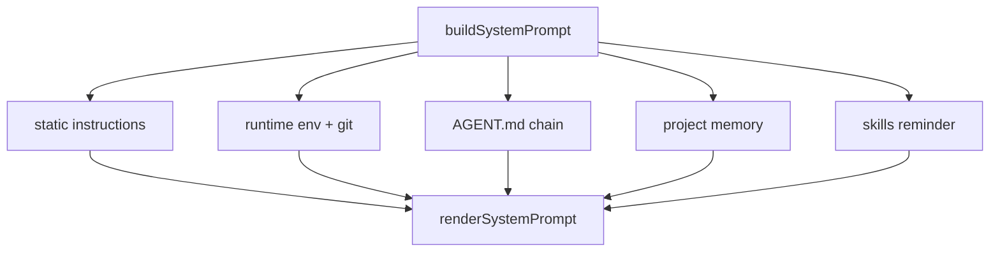
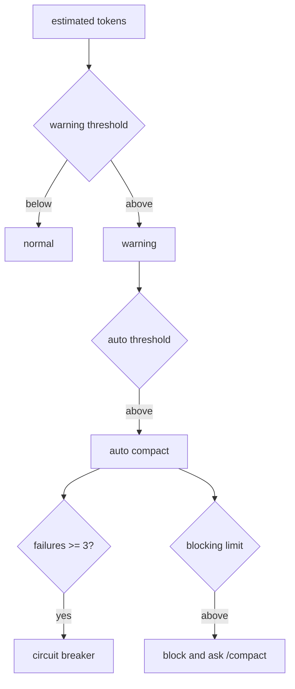

<details>
<summary>相关源文件</summary>

生成本页时使用的主要源文件：

- [src/context/systemPrompt.ts](https://github.com/ConardLi/easy-agent/blob/c24463e07dd136d41f6ab28edb33a3eaf0b209c1/src/context/systemPrompt.ts)
- [src/context/claudeMd.ts](https://github.com/ConardLi/easy-agent/blob/c24463e07dd136d41f6ab28edb33a3eaf0b209c1/src/context/claudeMd.ts)
- [src/context/memory/memdir.ts](https://github.com/ConardLi/easy-agent/blob/c24463e07dd136d41f6ab28edb33a3eaf0b209c1/src/context/memory/memdir.ts)
- [src/context/memory/memoryTypes.ts](https://github.com/ConardLi/easy-agent/blob/c24463e07dd136d41f6ab28edb33a3eaf0b209c1/src/context/memory/memoryTypes.ts)
- [src/context/autoCompact.ts](https://github.com/ConardLi/easy-agent/blob/c24463e07dd136d41f6ab28edb33a3eaf0b209c1/src/context/autoCompact.ts)
- [src/context/compaction.ts](https://github.com/ConardLi/easy-agent/blob/c24463e07dd136d41f6ab28edb33a3eaf0b209c1/src/context/compaction.ts)
- [src/context/planAttachments.ts](https://github.com/ConardLi/easy-agent/blob/c24463e07dd136d41f6ab28edb33a3eaf0b209c1/src/context/planAttachments.ts)
- [src/utils/tokens.ts](https://github.com/ConardLi/easy-agent/blob/c24463e07dd136d41f6ab28edb33a3eaf0b209c1/src/utils/tokens.ts)

</details>

# 上下文、记忆与压缩

上下文层每个 turn 都会组装 system prompt，并在用户消息进入 agentic loop 前检查 token budget。它还提供 AGENT.md 加载、项目 memory、manual/auto/micro compaction 和 plan mode attachment。  
Sources: [src/context/systemPrompt.ts:95-140](../../../project-repos/easy-agent/src/context/systemPrompt.ts#L95-L140), [src/core/queryEngine.ts:288-357](../../../project-repos/easy-agent/src/core/queryEngine.ts#L288-L357), [src/context/compaction.ts:235-318](../../../project-repos/easy-agent/src/context/compaction.ts#L235-L318)

<details class="source-snippets">
<summary>引用源码</summary>

<!-- source-snippets:start -->

#### `src/context/systemPrompt.ts:95-140`

```typescript
export async function buildSystemPrompt(options: BuildSystemPromptOptions): Promise<string[]> {
  const ignoreMemory = options.userQuery ? shouldIgnoreMemory(options.userQuery) : false;
  const memoryDir = await ensureMemoryDirExists(options.cwd);
  const [environmentContext, agentMdContext, memoryEntrypoint] = await Promise.all([
    getRuntimeEnvironmentContext(options.cwd),
    loadAgentMdContext(options.cwd),
    ignoreMemory ? Promise.resolve(null) : readMemoryEntrypoint(options.cwd),
  ]);

  const staticSections = [
    SYSTEM_PROMPT_STATIC_START,
    ...getStaticPromptSections(),
    SYSTEM_PROMPT_STATIC_END,
  ];

  const memorySections = [
    ...formatMemorySystemLocation(memoryDir),
    ...buildMemoryPromptInstructions(),
    ...buildMemoryTypeGuidance(),
    ...buildMemoryExclusionGuidance(),
    ...buildMemoryAccessGuidance(),
    ...buildMemoryValidationGuidance(),
    ...buildMemoryPersistenceBoundaryGuidance(),
    ignoreMemory ? "Memory is disabled for this turn because the user asked not to use it." : "",
    memoryEntrypoint ? `Memory index:\n${memoryEntrypoint}` : "",
  ].filter(Boolean);

  // Skill discovery listing — see skills/budget.ts for the budget logic.
  // Wrapped as a <system-reminder> block (not a top-level instruction) so the
  // model treats it as ambient context that may or may not apply this turn.
  // Conditional skills (frontmatter `paths`) only appear here AFTER they've
  // been promoted in by activateConditionalSkillsForPaths(); see
  // skills/conditional.ts.
  const skillsReminder = formatSkillsSystemReminder(getModelVisibleSkills());

  const dynamicSections = [
    SYSTEM_PROMPT_DYNAMIC_START,
    formatEnvironmentContext(environmentContext),
    agentMdContext ? "Project memory (AGENT.md):\n" + agentMdContext : "",
    memorySections.length > 0 ? memorySections.join("\n\n") : "",
    options.additionalInstructions ? "Session instructions:\n" + options.additionalInstructions : "",
    skillsReminder,
    SYSTEM_PROMPT_DYNAMIC_END,
  ].filter(Boolean);

  return [...staticSections, ...dynamicSections];
```

#### `src/core/queryEngine.ts:288-357`

```typescript
    const previewSystemParts = await buildSystemPrompt({
      cwd: this.toolContext.cwd,
      userQuery: trimmed,
    });
    const previewSystemPrompt = renderSystemPrompt(previewSystemParts);

    // Only run compaction when there's meaningful conversation history
    if (this.messages.length > 0) {
      // Micro-compact old tool results first
      const microResult = await compactMessages(this.messages, undefined, {
        usage: this.lastCallUsage,
        usageAnchorIndex: this.usageAnchorIndex,
        systemPrompt: previewSystemPrompt,
      });
      if (microResult.didMicroCompact || microResult.didCompact) {
        this.messages = [...microResult.messages];
        this.invalidateUsageAnchor();
        yield { type: "messages_updated", messages: [...this.messages] };
        yield {
          type: "compacted",
          summary: microResult.summary,
          trigger: microResult.didCompact ? "auto" : "micro",
        };
      }

      // Auto-compact with circuit breaker if still over threshold
      const { result: autoResult, didAutoCompact } = await autoCompactIfNeeded(
        this.messages,
        this.getActiveModel(),
        {
          usage: this.lastCallUsage,
          usageAnchorIndex: this.usageAnchorIndex,
          systemPrompt: previewSystemPrompt,
        },
      );
      if (didAutoCompact) {
        this.messages = [...autoResult.messages];
        this.invalidateUsageAnchor();
        yield { type: "messages_updated", messages: [...this.messages] };
        yield { type: "compacted", summary: autoResult.summary, trigger: "auto" };
      }

      // Emit token warning if approaching limits
      const estimatedTokens = tokenCountWithEstimation(this.messages, {
        usage: this.lastCallUsage,
        usageAnchorIndex: this.usageAnchorIndex,
        systemPrompt: previewSystemPrompt,
      });
      const warningState = calculateTokenWarningState(estimatedTokens, this.getActiveModel());
      if (warningState.state !== "normal") {
        yield { type: "token_warning", warning: warningState };
      }
    }

    // Inject plan mode attachments as user messages (before user input)
    if (this.currentPermissionMode === "plan") {
      const planAttachment = getPlanModeAttachment(this.messages, getPlanFilePath());
      if (planAttachment) {
        this.messages = [...this.messages, planAttachment];
      }
    } else if (this.needsPlanModeExitAttachment) {
      this.needsPlanModeExitAttachment = false;
      const exists = await checkPlanExists();
      const exitAttachment = getPlanModeExitAttachment(getPlanFilePath(), exists);
      this.messages = [...this.messages, exitAttachment];
    }

    const userMessage: MessageParam = { role: "user", content: trimmed };
    this.messages = [...this.messages, userMessage];
    yield { type: "messages_updated", messages: [...this.messages] };
```

#### `src/context/compaction.ts:235-318`

```typescript
export async function compactMessages(
  messages: MessageParam[],
  focus?: string,
  options: CompactionCheckOptions = {},
): Promise<CompactionResult> {
  const microcompactResult = microCompactMessages(messages);
  const microCompacted = microcompactResult.messages;
  const microChanged = JSON.stringify(microCompacted) !== JSON.stringify(messages);

  const budget = buildTokenBudgetSnapshot(microCompacted, {
    usage: options.usage,
    usageAnchorIndex: options.usageAnchorIndex,
    systemPrompt: options.systemPrompt,
  });

  debugLog("compact", "budget_check", {
    originalMessageCount: messages.length,
    microMessageCount: microCompacted.length,
    didMicroCompact: microChanged,
    compactedToolIds: microcompactResult.compactedToolIds,
    usageAnchorIndex: options.usageAnchorIndex ?? null,
    estimatedConversationTokens: budget.estimatedConversationTokens,
    autoCompactThreshold: budget.autoCompactThreshold,
    manualCompactThreshold: budget.manualCompactThreshold,
  });

  if (!options.force && budget.estimatedConversationTokens < budget.autoCompactThreshold) {
    debugLog("compact", "skip_full_compact", {
      reason: "below_auto_threshold",
      estimatedConversationTokens: budget.estimatedConversationTokens,
      autoCompactThreshold: budget.autoCompactThreshold,
    });

    return {
      messages: microChanged
        ? [
            ...microCompacted,
            makeCompactBoundary({
              compactType: "micro",
              originalMessageCount: messages.length,
              compactedToolIds: microcompactResult.compactedToolIds,
            }),
          ]
        : microCompacted,
      didCompact: false,
      didMicroCompact: microChanged,
    };
  }

  const summary = await summarizeMessages(microCompacted, focus);
  const desiredTailCount = 8;
  const tailStart = microCompacted.length <= desiredTailCount
    ? microCompacted.length               // short conversation: summary covers everything, no tail
    : findPreservedTailStart(microCompacted, desiredTailCount);
  const tail = microCompacted.slice(tailStart);
  const compacted: MessageParam[] = [
    {
      role: "user",
      content: `This session is being continued from a previous conversation that ran out of context. The summary below covers the earlier portion of the conversation.\n\n${summary}${tail.length > 0 ? "\n\nRecent messages are preserved verbatim." : ""}`,
    },
    makeCompactBoundary({
      compactType: focus ? "manual" : "auto",
      reason: focus,
      originalMessageCount: microCompacted.length,
      compactedToolIds: microcompactResult.compactedToolIds,
    }),
    ...tail,
  ];

  debugLog("compact", "full_compact_applied", {
    focus: focus ?? null,
    tailStart,
    preservedTailCount: tail.length,
    originalMessageCount: messages.length,
    compactedMessageCount: compacted.length,
  });

  return {
    messages: compacted,
    summary,
    didCompact: true,
    didMicroCompact: microChanged,
  };
}
```

<!-- source-snippets:end -->
</details>
## System Prompt 组成

静态部分是 Easy Agent 的操作原则；动态部分包括 runtime 环境、Git branch/status/recent commit、AGENT.md 内容、memory 位置和索引、session instructions、skills reminder。静态和动态部分分别用 `<SYSTEM_STATIC_CONTEXT>` 与 `<SYSTEM_DYNAMIC_CONTEXT>` 包裹。  
Sources: [src/context/systemPrompt.ts:12-16](../../../project-repos/easy-agent/src/context/systemPrompt.ts#L12-L16), [src/context/systemPrompt.ts:32-43](../../../project-repos/easy-agent/src/context/systemPrompt.ts#L32-L43), [src/context/systemPrompt.ts:45-72](../../../project-repos/easy-agent/src/context/systemPrompt.ts#L45-L72), [src/context/systemPrompt.ts:95-145](../../../project-repos/easy-agent/src/context/systemPrompt.ts#L95-L145)

<details class="source-snippets">
<summary>引用源码</summary>

<!-- source-snippets:start -->

#### `src/context/systemPrompt.ts:12-16`

```typescript
export const SYSTEM_PROMPT_STATIC_START = "<SYSTEM_STATIC_CONTEXT>";
export const SYSTEM_PROMPT_STATIC_END = "</SYSTEM_STATIC_CONTEXT>";
export const SYSTEM_PROMPT_DYNAMIC_START = "<SYSTEM_DYNAMIC_CONTEXT>";
export const SYSTEM_PROMPT_DYNAMIC_END = "</SYSTEM_DYNAMIC_CONTEXT>";

```

#### `src/context/systemPrompt.ts:32-43`

```typescript
function getStaticPromptSections(): string[] {
  return [
    "You are Easy Agent, a terminal-native local coding assistant running inside the user's workspace.",
    "Operate directly, be concise, and prefer taking concrete actions with tools when useful.",
    "When solving coding tasks, first understand the relevant files, then make focused changes, then verify with the least expensive effective command.",
    "Prefer specialized tools over shell when possible: use Read for reading files, Edit for precise changes, Write for full file creation or overwrite, Grep for content search, Glob for file discovery, and Bash only when shell execution is actually needed.",
    "Treat the current working directory as the primary workspace boundary. The Easy Agent system directory at ~/.easy-agent is also available for memory and session storage; do not assume other outside paths are available.",
    "When editing code, preserve existing behavior unless the user explicitly asks for a behavior change.",
    "If a command or edit fails, explain the failure briefly and choose the next best action based on the observed result.",
    "Keep answers structured and practical. Summarize what you changed or found, and avoid unnecessary narration.",
  ];
}
```

#### `src/context/systemPrompt.ts:45-72`

```typescript
async function getGitContext(cwd: string): Promise<Pick<RuntimeEnvironmentContext, "gitBranch" | "gitStatus" | "gitRecentCommit">> {
  try {
    const [branchResult, statusResult, logResult] = await Promise.all([
      execFileAsync("git", ["rev-parse", "--abbrev-ref", "HEAD"], { cwd, maxBuffer: 32 * 1024 }),
      execFileAsync("git", ["status", "--short"], { cwd, maxBuffer: 64 * 1024 }),
      execFileAsync("git", ["log", "-1", "--pretty=format:%h %s"], { cwd, maxBuffer: 32 * 1024 }),
    ]);

    const status = statusResult.stdout.trim();
    return {
      gitBranch: branchResult.stdout.trim(),
      gitStatus: status || "clean",
      gitRecentCommit: logResult.stdout.trim() || undefined,
    };
  } catch {
    return {};
  }
}

export async function getRuntimeEnvironmentContext(cwd: string): Promise<RuntimeEnvironmentContext> {
  const git = await getGitContext(cwd);
  return {
    cwd,
    date: new Date().toISOString(),
    os:       os.platform() + " " + os.release() + " (" + os.arch() + ")",
    ...git,
  };
}
```

#### `src/context/systemPrompt.ts:95-145`

```typescript
export async function buildSystemPrompt(options: BuildSystemPromptOptions): Promise<string[]> {
  const ignoreMemory = options.userQuery ? shouldIgnoreMemory(options.userQuery) : false;
  const memoryDir = await ensureMemoryDirExists(options.cwd);
  const [environmentContext, agentMdContext, memoryEntrypoint] = await Promise.all([
    getRuntimeEnvironmentContext(options.cwd),
    loadAgentMdContext(options.cwd),
    ignoreMemory ? Promise.resolve(null) : readMemoryEntrypoint(options.cwd),
  ]);

  const staticSections = [
    SYSTEM_PROMPT_STATIC_START,
    ...getStaticPromptSections(),
    SYSTEM_PROMPT_STATIC_END,
  ];

  const memorySections = [
    ...formatMemorySystemLocation(memoryDir),
    ...buildMemoryPromptInstructions(),
    ...buildMemoryTypeGuidance(),
    ...buildMemoryExclusionGuidance(),
    ...buildMemoryAccessGuidance(),
    ...buildMemoryValidationGuidance(),
    ...buildMemoryPersistenceBoundaryGuidance(),
    ignoreMemory ? "Memory is disabled for this turn because the user asked not to use it." : "",
    memoryEntrypoint ? `Memory index:\n${memoryEntrypoint}` : "",
  ].filter(Boolean);

  // Skill discovery listing — see skills/budget.ts for the budget logic.
  // Wrapped as a <system-reminder> block (not a top-level instruction) so the
  // model treats it as ambient context that may or may not apply this turn.
  // Conditional skills (frontmatter `paths`) only appear here AFTER they've
  // been promoted in by activateConditionalSkillsForPaths(); see
  // skills/conditional.ts.
  const skillsReminder = formatSkillsSystemReminder(getModelVisibleSkills());

  const dynamicSections = [
    SYSTEM_PROMPT_DYNAMIC_START,
    formatEnvironmentContext(environmentContext),
    agentMdContext ? "Project memory (AGENT.md):\n" + agentMdContext : "",
    memorySections.length > 0 ? memorySections.join("\n\n") : "",
    options.additionalInstructions ? "Session instructions:\n" + options.additionalInstructions : "",
    skillsReminder,
    SYSTEM_PROMPT_DYNAMIC_END,
  ].filter(Boolean);

  return [...staticSections, ...dynamicSections];
}

export function renderSystemPrompt(parts: string[]): string {
  return parts.join("\n\n");
}
```

<!-- source-snippets:end -->
</details>


Sources: [src/context/systemPrompt.ts:95-145](../../../project-repos/easy-agent/src/context/systemPrompt.ts#L95-L145)

<details class="source-snippets">
<summary>引用源码</summary>

<!-- source-snippets:start -->

#### `src/context/systemPrompt.ts:95-145`

```typescript
export async function buildSystemPrompt(options: BuildSystemPromptOptions): Promise<string[]> {
  const ignoreMemory = options.userQuery ? shouldIgnoreMemory(options.userQuery) : false;
  const memoryDir = await ensureMemoryDirExists(options.cwd);
  const [environmentContext, agentMdContext, memoryEntrypoint] = await Promise.all([
    getRuntimeEnvironmentContext(options.cwd),
    loadAgentMdContext(options.cwd),
    ignoreMemory ? Promise.resolve(null) : readMemoryEntrypoint(options.cwd),
  ]);

  const staticSections = [
    SYSTEM_PROMPT_STATIC_START,
    ...getStaticPromptSections(),
    SYSTEM_PROMPT_STATIC_END,
  ];

  const memorySections = [
    ...formatMemorySystemLocation(memoryDir),
    ...buildMemoryPromptInstructions(),
    ...buildMemoryTypeGuidance(),
    ...buildMemoryExclusionGuidance(),
    ...buildMemoryAccessGuidance(),
    ...buildMemoryValidationGuidance(),
    ...buildMemoryPersistenceBoundaryGuidance(),
    ignoreMemory ? "Memory is disabled for this turn because the user asked not to use it." : "",
    memoryEntrypoint ? `Memory index:\n${memoryEntrypoint}` : "",
  ].filter(Boolean);

  // Skill discovery listing — see skills/budget.ts for the budget logic.
  // Wrapped as a <system-reminder> block (not a top-level instruction) so the
  // model treats it as ambient context that may or may not apply this turn.
  // Conditional skills (frontmatter `paths`) only appear here AFTER they've
  // been promoted in by activateConditionalSkillsForPaths(); see
  // skills/conditional.ts.
  const skillsReminder = formatSkillsSystemReminder(getModelVisibleSkills());

  const dynamicSections = [
    SYSTEM_PROMPT_DYNAMIC_START,
    formatEnvironmentContext(environmentContext),
    agentMdContext ? "Project memory (AGENT.md):\n" + agentMdContext : "",
    memorySections.length > 0 ? memorySections.join("\n\n") : "",
    options.additionalInstructions ? "Session instructions:\n" + options.additionalInstructions : "",
    skillsReminder,
    SYSTEM_PROMPT_DYNAMIC_END,
  ].filter(Boolean);

  return [...staticSections, ...dynamicSections];
}

export function renderSystemPrompt(parts: string[]): string {
  return parts.join("\n\n");
}
```

<!-- source-snippets:end -->
</details>
## AGENT.md 链式加载

`claudeMd.ts` 会读取全局 `~/.easy-agent/AGENT.md` 和 cwd 到根目录链路上的每个 `AGENT.md`，去掉 HTML 注释后按 source path 拼成上下文。  
Sources: [src/context/claudeMd.ts:5-20](../../../project-repos/easy-agent/src/context/claudeMd.ts#L5-L20), [src/context/claudeMd.ts:23-60](../../../project-repos/easy-agent/src/context/claudeMd.ts#L23-L60)

<details class="source-snippets">
<summary>引用源码</summary>

<!-- source-snippets:start -->

#### `src/context/claudeMd.ts:5-20`

```typescript
const AGENT_MD_NAME = "AGENT.md";

function stripHtmlComments(content: string): string {
  return content.replace(/<!--[\s\S]*?-->/g, "").trim();
}

async function readIfExists(filePath: string): Promise<string | null> {
  try {
    const stat = await fs.stat(filePath);
    if (!stat.isFile()) return null;
    const raw = await fs.readFile(filePath, "utf-8");
    const stripped = stripHtmlComments(raw).trim();
    return stripped || null;
  } catch {
    return null;
  }
```

#### `src/context/claudeMd.ts:23-60`

```typescript
function getDirectoryChain(cwd: string): string[] {
  const resolved = path.resolve(cwd);
  const chain: string[] = [];
  let current = resolved;

  while (true) {
    chain.push(current);
    const parent = path.dirname(current);
    if (parent === current) break;
    current = parent;
  }

  return chain.reverse();
}

export async function getAgentMdFiles(cwd: string): Promise<string[]> {
  const files: string[] = [getGlobalAgentMdPath()];
  for (const dir of getDirectoryChain(cwd)) {
    files.push(path.join(dir, AGENT_MD_NAME));
  }
  return files;
}

export async function loadAgentMdContext(cwd: string): Promise<string> {
  const files = await getAgentMdFiles(cwd);
  const loaded = await Promise.all(
    files.map(async (filePath) => {
      const content = await readIfExists(filePath);
      return content ? { filePath, content } : null;
    }),
  );

  const sections = loaded
    .filter((entry): entry is { filePath: string; content: string } => entry !== null)
    .map((entry) => "# Source: " + entry.filePath + "\n" + entry.content);

  return sections.join("\n\n");
}
```

<!-- source-snippets:end -->
</details>
## 项目记忆目录

memory 目录基于 canonical git root 计算项目 key：仓库目录 slug + git root 的 sha256 前 16 位。记忆存放在 `~/.easy-agent/projects/<projectKey>/memory/`，入口文件是 `MEMORY.md`，会被创建并限制行数/字节数。  
Sources: [src/context/memory/memdir.ts:24-36](../../../project-repos/easy-agent/src/context/memory/memdir.ts#L24-L36), [src/context/memory/memdir.ts:46-92](../../../project-repos/easy-agent/src/context/memory/memdir.ts#L46-L92), [src/context/memory/memdir.ts:123-166](../../../project-repos/easy-agent/src/context/memory/memdir.ts#L123-L166)

<details class="source-snippets">
<summary>引用源码</summary>

<!-- source-snippets:start -->

#### `src/context/memory/memdir.ts:24-36`

```typescript
export interface ProjectPathInfo {
  gitRoot: string;
  projectKey: string;
  projectDir: string;
}

function sanitizeSlug(input: string): string {
  return input
    .toLowerCase()
    .replace(/[^a-z0-9._-]+/g, "-")
    .replace(/^-+|-+$/g, "")
    .slice(0, 80) || "project";
}
```

#### `src/context/memory/memdir.ts:46-92`

```typescript
async function findCanonicalGitRoot(cwd: string): Promise<string> {
  let current = path.resolve(cwd);

  while (true) {
    try {
      await fs.stat(path.join(current, ".git"));
      return current;
    } catch {
      // keep walking upward
    }

    const parent = path.dirname(current);
    if (parent === current) {
      return path.resolve(cwd);
    }
    current = parent;
  }
}

export async function getProjectPathInfo(cwd: string): Promise<ProjectPathInfo> {
  const gitRoot = await findCanonicalGitRoot(cwd);
  const slugBase = sanitizeSlug(path.basename(gitRoot));
  const suffix = crypto.createHash("sha256").update(gitRoot).digest("hex").slice(0, 16);
  const projectKey = `${slugBase}-${suffix}`;
  return {
    gitRoot,
    projectKey,
    projectDir: path.join(getProjectsRoot(), projectKey),
  };
}

export async function getProjectMemoryDir(cwd: string): Promise<string> {
  const { projectDir } = await getProjectPathInfo(cwd);
  return path.join(projectDir, "memory");
}

export async function ensureMemoryDirExists(cwd: string): Promise<string> {
  const memoryDir = await getProjectMemoryDir(cwd);
  await fs.mkdir(memoryDir, { recursive: true });
  const entrypoint = path.join(memoryDir, MEMORY_ENTRYPOINT);
  try {
    await fs.access(entrypoint);
  } catch {
    await fs.writeFile(entrypoint, "# Project Memory\n\n", "utf-8");
  }
  return memoryDir;
}
```

#### `src/context/memory/memdir.ts:123-166`

```typescript
function truncateEntrypoint(raw: string): { content: string; warning?: string } {
  let content = raw;
  let lineTruncated = false;
  let byteTruncated = false;

  const lines = content.split(/\r?\n/);
  if (lines.length > MAX_ENTRYPOINT_LINES) {
    content = lines.slice(0, MAX_ENTRYPOINT_LINES).join("\n");
    lineTruncated = true;
  }

  while (Buffer.byteLength(content, "utf-8") > MAX_ENTRYPOINT_BYTES && content.length > 0) {
    content = content.slice(0, -1);
    byteTruncated = true;
  }

  const warning = lineTruncated || byteTruncated
    ? `> WARNING: MEMORY.md was truncated${lineTruncated ? " by line limit" : ""}${lineTruncated && byteTruncated ? " and" : ""}${byteTruncated ? " by byte limit" : ""}.`
    : undefined;

  return { content: content.trim(), ...(warning ? { warning } : {}) };
}

function buildPointerLine(entry: MemoryEntry): string {
  return `- [${normalizeLine(entry.title)}](${entry.fileName}) — ${normalizeLine(entry.hook)}`;
}

export function formatMemorySystemLocation(memoryDir: string): string[] {
  const entrypointPath = path.join(memoryDir, MEMORY_ENTRYPOINT);
  return [
    `You have a persistent, file-based project memory system at \`${memoryDir}\`.`,
    `The memory index file is \`${entrypointPath}\`.`,
    `The index points to topic memory files stored under \`${memoryDir}\` (including subdirectories).`,
    "Before creating a new memory, inspect existing topic files and update the best match when possible.",
  ];
}

export async function readMemoryEntrypoint(cwd: string): Promise<string | null> {
  const memoryDir = await ensureMemoryDirExists(cwd);
  const entrypoint = path.join(memoryDir, MEMORY_ENTRYPOINT);
  const raw = await fs.readFile(entrypoint, "utf-8");
  const truncated = truncateEntrypoint(raw);
  return [truncated.content, truncated.warning].filter(Boolean).join("\n\n") || null;
}
```

<!-- source-snippets:end -->
</details>
记忆类型有 `user`、`feedback`、`project`、`reference`。代码中的 guidance 明确要求：只有对未来对话有用且不能从当前 repo 派生的信息才保存；保存前要查现有 memory，避免把 memory 当活动日志。  
Sources: [src/context/memory/memoryTypes.ts:1-20](../../../project-repos/easy-agent/src/context/memory/memoryTypes.ts#L1-L20), [src/context/memory/memoryTypes.ts:22-86](../../../project-repos/easy-agent/src/context/memory/memoryTypes.ts#L22-L86), [src/context/memory/memdir.ts:320-330](../../../project-repos/easy-agent/src/context/memory/memdir.ts#L320-L330)

<details class="source-snippets">
<summary>引用源码</summary>

<!-- source-snippets:start -->

#### `src/context/memory/memoryTypes.ts:1-20`

```typescript
export const MEMORY_TYPES = ["user", "feedback", "project", "reference"] as const;

export type MemoryType = (typeof MEMORY_TYPES)[number];

export interface MemoryFrontmatter {
  name: string;
  description: string;
  type: MemoryType;
}

export interface MemoryEntry {
  fileName: string;
  filePath: string;
  title: string;
  hook: string;
}

export function isMemoryType(value: unknown): value is MemoryType {
  return typeof value === "string" && MEMORY_TYPES.includes(value as MemoryType);
}
```

#### `src/context/memory/memoryTypes.ts:22-86`

```typescript
export function buildMemoryTypeGuidance(): string[] {
  return [
    "## Types of memory",
    "",
    "You can store four kinds of durable project memory:",
    "",
    "- user: stable details about the user's role, preferences, strengths, or goals that should change how you collaborate.",
    "  - Save when: you learn something durable about how to explain, prioritize, or tailor work for this user.",
    "  - Use when: the same technical answer should be framed differently for this specific user.",
    "",
    "- feedback: guidance from the user about what to do, avoid, keep doing, or how to judge success.",
    "  - Save when: the user corrects your approach or confirms a non-obvious approach was right.",
    "  - Use when: choosing how to execute similar work in future conversations.",
    "  - Structure: lead with the rule, then include Why and How to apply when possible.",
    "",
    "- project: non-derivable context about goals, constraints, incidents, deadlines, ownership, or ongoing initiatives.",
    "  - Save when: you learn who is doing what, why it matters, or by when.",
    "  - Use when: this context should change your recommendations or prioritization.",
    "  - Structure: lead with the fact or decision, then include Why and How to apply when possible.",
    "",
    "- reference: pointers to external systems, dashboards, trackers, or documents that matter for future work.",
    "  - Save when: you learn where up-to-date information lives outside the repository.",
    "  - Use when: the user references that external system or the work clearly depends on it.",
  ];
}

export function buildMemoryAccessGuidance(): string[] {
  return [
    "## When to access memory",
    "- Access memory when it seems relevant or the user references prior work or prior conversations.",
    "- Use the MEMORY.md index as a map. If an indexed memory file looks relevant, proactively read that file before relying on it instead of waiting for the system to inline it for you.",
    "- You MUST access memory when the user explicitly asks you to check, recall, or remember.",
    "- If the user says to ignore memory, proceed as if project memory were empty. Do not apply, cite, compare against, or mention remembered content.",
  ];
}

export function buildMemoryValidationGuidance(): string[] {
  return [
    "## Before relying on memory",
    "Project memory stores only facts that cannot be derived reliably from the current repo state.",
    "Memory is context about what was true when it was written, not proof that it is still true now.",
    "Before relying on a memory that names a file path, check that the file still exists.",
    "Before relying on a memory that names a function, flag, or symbol, grep or read the current code to confirm it still exists.",
    "If the user is about to act on a remembered fact, verify it first. If memory conflicts with the current repo state, trust the current state and update or remove the stale memory later.",
  ];
}

export function buildMemoryExclusionGuidance(): string[] {
  return [
    "## What not to save in memory",
    "- Do not save code structure, file contents, architecture, or conventions that can be re-read from the workspace.",
    "- Do not save git history, recent diffs, or who-changed-what when git is the authoritative source.",
    "- Do not save debugging recipes or fix steps that are already reflected in the code or commits.",
    "- Do not save ephemeral task status, temporary plans, or current-conversation working notes.",
    "- Do not turn memory into an activity log. If the user asks you to remember a summary, keep only the surprising, non-obvious, future-useful part.",
  ];
}

export function buildMemoryPersistenceBoundaryGuidance(): string[] {
  return [
    "## Memory versus other persistence",
    "Use memory for information that should help in future conversations, not just this one.",
    "If information is only about the current task plan or in-progress execution state, keep it in the conversation or task tracking instead of memory.",
  ];
}
```

#### `src/context/memory/memdir.ts:320-330`

```typescript
export function buildMemoryPromptInstructions(): string[] {
  return [
    "Use memory only for information that will be useful in future conversations and cannot be derived directly from the current repo state.",
    "Supported memory types: user, feedback, project, reference.",
    "When saving a memory, write one markdown file with frontmatter: name, description, type.",
    `After writing or updating a memory file, update ${MEMORY_ENTRYPOINT} with a one-line pointer in the form: - [Title](file.md) — one-line hook.`,
    `${MEMORY_ENTRYPOINT} is an index, not a place to store full memory content.`,
    `Keep ${MEMORY_ENTRYPOINT} under ${MAX_ENTRYPOINT_LINES} lines and ${MAX_ENTRYPOINT_BYTES} bytes.`,
    "Before creating a new memory, inspect existing topic memory files and update the best match when possible.",
  ];
}
```

<!-- source-snippets:end -->
</details>
## MemoryWrite 工具

`MemoryWrite` 会校验 name、description、type、content，调用 `writeProjectMemory()` 写入 topic markdown，并重写 `MEMORY.md` 指针索引。若发现相同或相似 memory，会更新现有文件而不是新建。  
Sources: [src/tools/memoryWriteTool.ts:5-60](../../../project-repos/easy-agent/src/tools/memoryWriteTool.ts#L5-L60), [src/context/memory/memdir.ts:246-313](../../../project-repos/easy-agent/src/context/memory/memdir.ts#L246-L313)

<details class="source-snippets">
<summary>引用源码</summary>

<!-- source-snippets:start -->

#### `src/tools/memoryWriteTool.ts:5-60`

```typescript
export const memoryWriteTool: Tool = {
  name: "MemoryWrite",
  description:
    "Save durable project memory for future conversations. Only store information that cannot be derived directly from the current repository state.",
  inputSchema: {
    type: "object",
    properties: {
      name: { type: "string", description: "Short memory title." },
      description: { type: "string", description: "One-line hook used in MEMORY.md." },
      type: {
        type: "string",
        enum: ["user", "feedback", "project", "reference"],
        description: "Memory type.",
      },
      content: { type: "string", description: "Full markdown memory content." },
      file_name: { type: "string", description: "Optional target file name." },
    },
    required: ["name", "description", "type", "content"],
    additionalProperties: false,
  },
  async call(input, context): Promise<ToolResult> {
    const name = typeof input.name === "string" ? input.name.trim() : "";
    const description = typeof input.description === "string" ? input.description.trim() : "";
    const type = input.type;
    const content = typeof input.content === "string" ? input.content.trim() : "";
    const fileName = typeof input.file_name === "string" ? input.file_name.trim() : undefined;

    if (!name || !description || !content || !isMemoryType(type)) {
      return {
        content: "Error: name, description, content, and a valid memory type are required.",
        isError: true,
      };
    }

    const result = await writeProjectMemory({
      cwd: context.cwd,
      name,
      description,
      type,
      content,
      ...(fileName ? { fileName } : {}),
    });

    return {
      content: result.updatedExisting
        ? `Updated ${type} memory in ${result.fileName}.`
        : `Saved ${type} memory to ${result.fileName}.`,
    };
  },
  isReadOnly() {
    return false;
  },
  isEnabled() {
    return true;
  },
};
```

#### `src/context/memory/memdir.ts:246-313`

```typescript
function slugifyMemoryFileName(name: string): string {
  return sanitizeSlug(name).replace(/\.+/g, "-") + ".md";
}

async function rewriteEntrypoint(memoryDir: string, entries: MemoryEntry[]): Promise<void> {
  const entrypointPath = path.join(memoryDir, MEMORY_ENTRYPOINT);
  const unique = new Map<string, string>();
  for (const entry of entries) {
    unique.set(entry.fileName, buildPointerLine(entry));
  }

  const bodyLines = ["# Project Memory", "", ...[...unique.values()]];
  const truncated = truncateEntrypoint(bodyLines.join("\n"));
  const finalText = [truncated.content, truncated.warning].filter(Boolean).join("\n\n") + "\n";
  await fs.writeFile(entrypointPath, finalText, "utf-8");
}

async function findExistingMemoryFile(cwd: string, name: string, description: string): Promise<string | null> {
  const docs = await listMemoryFiles(cwd);
  const normalizedName = normalizeLine(name).toLowerCase();
  const normalizedDescription = normalizeLine(description).toLowerCase();

  const exact = docs.find((doc) => doc.frontmatter.name.toLowerCase() === normalizedName);
  if (exact) return exact.fileName;

  const similar = docs.find((doc) => {
    const existing = `${doc.frontmatter.name} ${doc.frontmatter.description}`.toLowerCase();
    return existing.includes(normalizedName) || existing.includes(normalizedDescription);
  });

  return similar?.fileName ?? null;
}

export async function writeProjectMemory(input: {
  cwd: string;
  name: string;
  description: string;
  type: MemoryType;
  content: string;
  fileName?: string;
}): Promise<{ filePath: string; fileName: string; updatedExisting: boolean }> {
  const memoryDir = await ensureMemoryDirExists(input.cwd);
  const existingFileName = input.fileName ?? (await findExistingMemoryFile(input.cwd, input.name, input.description));
  const fileName = existingFileName ?? slugifyMemoryFileName(input.name);
  const filePath = path.join(memoryDir, fileName);

  const body = [
    "---",
    `name: ${normalizeLine(input.name)}`,
    `description: ${normalizeLine(input.description)}`,
    `type: ${input.type}`,
    "---",
    "",
    input.content.trim(),
    "",
  ].join("\n");

  await fs.writeFile(filePath, body, "utf-8");
  const docs = await listMemoryFiles(input.cwd);
  await rewriteEntrypoint(memoryDir, docs.map((doc) => ({
    fileName: doc.fileName,
    filePath: doc.filePath,
    title: doc.frontmatter.name,
    hook: doc.frontmatter.description,
  })));

  return { filePath, fileName, updatedExisting: Boolean(existingFileName) };
}
```

<!-- source-snippets:end -->
</details>
## Token 预算估算

`tokens.ts` 用启发式估算 message 和 content block token：文本按 4 chars/token，JSON 按 2 chars/token，tool block 有固定 overhead，binary block 固定 2000。模型 context window 默认 200K，并为 summary output 预留最多 20K。  
Sources: [src/utils/tokens.ts:4-23](../../../project-repos/easy-agent/src/utils/tokens.ts#L4-L23), [src/utils/tokens.ts:43-55](../../../project-repos/easy-agent/src/utils/tokens.ts#L43-L55), [src/utils/tokens.ts:57-124](../../../project-repos/easy-agent/src/utils/tokens.ts#L57-L124)

<details class="source-snippets">
<summary>引用源码</summary>

<!-- source-snippets:start -->

#### `src/utils/tokens.ts:4-23`

```typescript
export const MODEL_CONTEXT_WINDOW_DEFAULT = 200_000;
export const MAX_OUTPUT_TOKENS_FOR_SUMMARY = 20_000;
export const AUTOCOMPACT_BUFFER_TOKENS = 13_000;
export const WARNING_THRESHOLD_BUFFER_TOKENS = 20_000;
export const MANUAL_COMPACT_BUFFER_TOKENS = 3_000;

const TEXT_CHARS_PER_TOKEN = 4;
const JSON_CHARS_PER_TOKEN = 2;
const MESSAGE_OVERHEAD_TOKENS = 12;
const TOOL_BLOCK_OVERHEAD_TOKENS = 24;
const FIXED_BINARY_BLOCK_TOKENS = 2_000;

const MODEL_CONTEXT_WINDOWS: Record<string, number> = {
  "claude-opus-4-20250514": 200_000,
  "claude-sonnet-4-20250514": 200_000,
  "claude-haiku-3-20250307": 200_000,
  "claude-3-5-sonnet-20241022": 200_000,
  "claude-3-5-haiku-20241022": 200_000,
  "claude-3-opus-20240229": 200_000,
};
```

#### `src/utils/tokens.ts:43-55`

```typescript
export function getEffectiveContextWindowSize(model: string): number {
  const contextWindow = getContextWindowForModel(model);
  const reserved = Math.min(MAX_OUTPUT_TOKENS_FOR_SUMMARY, Math.floor(contextWindow * 0.2));
  return contextWindow - reserved;
}

function roughTokenCountEstimation(content: string, charsPerToken = TEXT_CHARS_PER_TOKEN): number {
  return Math.max(1, Math.round(content.length / charsPerToken));
}

function estimateUnknownObjectTokens(value: unknown): number {
  return roughTokenCountEstimation(JSON.stringify(value ?? ""), JSON_CHARS_PER_TOKEN);
}
```

#### `src/utils/tokens.ts:57-124`

```typescript
function estimateContentBlockTokens(content: MessageParam["content"]): number {
  if (typeof content === "string") {
    return roughTokenCountEstimation(content);
  }

  if (!Array.isArray(content)) {
    return 0;
  }

  return content.reduce((total, block) => {
    switch (block.type) {
      case "text":
        return total + roughTokenCountEstimation(block.text);
      case "tool_use":
        return (
          total +
          TOOL_BLOCK_OVERHEAD_TOKENS +
          roughTokenCountEstimation(block.name) +
          estimateUnknownObjectTokens(block.input)
        );
      case "tool_result": {
        const serialized = typeof block.content === "string" ? block.content : JSON.stringify(block.content);
        return total + TOOL_BLOCK_OVERHEAD_TOKENS + roughTokenCountEstimation(serialized, JSON_CHARS_PER_TOKEN);
      }
      case "image":
      case "document":
        return total + FIXED_BINARY_BLOCK_TOKENS;
      default:
        return total + estimateUnknownObjectTokens(block);
    }
  }, 0);
}

export function estimateMessageTokens(message: MessageParam): number {
  return MESSAGE_OVERHEAD_TOKENS + estimateContentBlockTokens(message.content);
}

export function roughTokenCountEstimationForMessages(messages: readonly MessageParam[]): number {
  const rawEstimate = messages.reduce((sum, message) => sum + estimateMessageTokens(message), 0);
  return Math.ceil((rawEstimate * 4) / 3);
}

export function estimateSystemPromptTokens(systemPrompt: string): number {
  return roughTokenCountEstimation(systemPrompt) + MESSAGE_OVERHEAD_TOKENS;
}

export function getTokenCountFromUsage(usage: Usage): number {
  return (
    usage.input_tokens +
    (usage.cache_creation_input_tokens ?? 0) +
    (usage.cache_read_input_tokens ?? 0) +
    usage.output_tokens
  );
}

export function tokenCountWithEstimation(
  messages: readonly MessageParam[],
  options?: { usage?: Usage; usageAnchorIndex?: number; systemPrompt?: string },
): number {
  const systemPromptTokens = options?.systemPrompt ? estimateSystemPromptTokens(options.systemPrompt) : 0;

  if (options?.usage && options.usageAnchorIndex !== undefined && options.usageAnchorIndex >= 0) {
    const suffix = messages.slice(options.usageAnchorIndex + 1);
    return getTokenCountFromUsage(options.usage) + roughTokenCountEstimationForMessages(suffix) + systemPromptTokens;
  }

  return roughTokenCountEstimationForMessages(messages) + systemPromptTokens;
}
```

<!-- source-snippets:end -->
</details>
## Auto Compact

`autoCompact.ts` 定义 warning/error/blocking 三类阈值：warning buffer、auto compact buffer、manual compact buffer 会按有效 context window 缩放。连续 auto compact 失败达到 3 次后触发 circuit breaker，避免无限重试。  
Sources: [src/context/autoCompact.ts:14-24](../../../project-repos/easy-agent/src/context/autoCompact.ts#L14-L24), [src/context/autoCompact.ts:32-80](../../../project-repos/easy-agent/src/context/autoCompact.ts#L32-L80), [src/context/autoCompact.ts:82-144](../../../project-repos/easy-agent/src/context/autoCompact.ts#L82-L144)

<details class="source-snippets">
<summary>引用源码</summary>

<!-- source-snippets:start -->

#### `src/context/autoCompact.ts:14-24`

```typescript
export const MAX_CONSECUTIVE_AUTOCOMPACT_FAILURES = 3;

export type TokenWarningState = "normal" | "warning" | "error" | "blocking";

export interface TokenWarningResult {
  state: TokenWarningState;
  estimatedTokens: number;
  threshold: number;
  blockingLimit: number;
  contextWindow: number;
}
```

#### `src/context/autoCompact.ts:32-80`

```typescript
function scaleBuffer(buffer: number, effectiveWindow: number): number {
  // For large windows (>=200K), use the original fixed buffer.
  // For smaller windows, scale proportionally so ratios stay sensible.
  const referenceWindow = 180_000; // effectiveContextWindow at 200K
  if (effectiveWindow >= referenceWindow) return buffer;
  return Math.round(buffer * (effectiveWindow / referenceWindow));
}

export function getAutoCompactThreshold(model: string): number {
  const effective = getEffectiveContextWindowSize(model);
  return Math.max(0, effective - scaleBuffer(AUTOCOMPACT_BUFFER_TOKENS, effective));
}

export function getBlockingLimit(model: string): number {
  const effective = getEffectiveContextWindowSize(model);
  return Math.max(0, effective - scaleBuffer(MANUAL_COMPACT_BUFFER_TOKENS, effective));
}

export function calculateTokenWarningState(
  estimatedTokens: number,
  model: string,
): TokenWarningResult {
  const contextWindow = getContextWindowForModel(model);
  const effective = getEffectiveContextWindowSize(model);
  const blockingLimit = getBlockingLimit(model);
  const autoCompactThreshold = getAutoCompactThreshold(model);
  const warningThreshold = Math.max(0, effective - scaleBuffer(WARNING_THRESHOLD_BUFFER_TOKENS, effective));

  let state: TokenWarningState = "normal";
  if (estimatedTokens >= blockingLimit) {
    state = "blocking";
  } else if (estimatedTokens >= autoCompactThreshold) {
    state = "error";
  } else if (estimatedTokens >= warningThreshold) {
    state = "warning";
  }

  return {
    state,
    estimatedTokens,
    threshold: autoCompactThreshold,
    blockingLimit,
    contextWindow,
  };
}

export function isAtBlockingLimit(estimatedTokens: number, model: string): boolean {
  return estimatedTokens >= getBlockingLimit(model);
}
```

#### `src/context/autoCompact.ts:82-144`

```typescript
export function shouldAutoCompact(
  estimatedTokens: number,
  model: string,
  querySource?: string,
): boolean {
  if (querySource === "compact" || querySource === "session_memory") {
    return false;
  }
  if (consecutiveAutoCompactFailures >= MAX_CONSECUTIVE_AUTOCOMPACT_FAILURES) {
    debugLog("autoCompact", "circuit_breaker", {
      consecutiveFailures: consecutiveAutoCompactFailures,
    });
    return false;
  }
  return estimatedTokens >= getAutoCompactThreshold(model);
}

export async function autoCompactIfNeeded(
  messages: MessageParam[],
  model: string,
  options: {
    usage?: Usage;
    usageAnchorIndex?: number;
    systemPrompt?: string;
    querySource?: string;
  },
): Promise<{ result: CompactionResult; didAutoCompact: boolean }> {
  const estimatedTokens = tokenCountWithEstimation(messages, options);

  if (!shouldAutoCompact(estimatedTokens, model, options.querySource)) {
    return {
      result: { messages, didCompact: false, didMicroCompact: false },
      didAutoCompact: false,
    };
  }

  debugLog("autoCompact", "triggering", {
    estimatedTokens,
    threshold: getAutoCompactThreshold(model),
    consecutiveFailures: consecutiveAutoCompactFailures,
  });

  try {
    const result = await compactMessages(messages, undefined, {
      usage: options.usage,
      usageAnchorIndex: options.usageAnchorIndex,
      systemPrompt: options.systemPrompt,
      force: true,
    });
    consecutiveAutoCompactFailures = 0;
    return { result, didAutoCompact: result.didCompact };
  } catch (error) {
    consecutiveAutoCompactFailures++;
    debugLog("autoCompact", "failure", {
      error: error instanceof Error ? error.message : String(error),
      consecutiveFailures: consecutiveAutoCompactFailures,
    });
    return {
      result: { messages, didCompact: false, didMicroCompact: false },
      didAutoCompact: false,
    };
  }
}
```

<!-- source-snippets:end -->
</details>


Sources: [src/context/autoCompact.ts:50-97](../../../project-repos/easy-agent/src/context/autoCompact.ts#L50-L97), [src/context/autoCompact.ts:99-144](../../../project-repos/easy-agent/src/context/autoCompact.ts#L99-L144)

<details class="source-snippets">
<summary>引用源码</summary>

<!-- source-snippets:start -->

#### `src/context/autoCompact.ts:50-97`

```typescript
export function calculateTokenWarningState(
  estimatedTokens: number,
  model: string,
): TokenWarningResult {
  const contextWindow = getContextWindowForModel(model);
  const effective = getEffectiveContextWindowSize(model);
  const blockingLimit = getBlockingLimit(model);
  const autoCompactThreshold = getAutoCompactThreshold(model);
  const warningThreshold = Math.max(0, effective - scaleBuffer(WARNING_THRESHOLD_BUFFER_TOKENS, effective));

  let state: TokenWarningState = "normal";
  if (estimatedTokens >= blockingLimit) {
    state = "blocking";
  } else if (estimatedTokens >= autoCompactThreshold) {
    state = "error";
  } else if (estimatedTokens >= warningThreshold) {
    state = "warning";
  }

  return {
    state,
    estimatedTokens,
    threshold: autoCompactThreshold,
    blockingLimit,
    contextWindow,
  };
}

export function isAtBlockingLimit(estimatedTokens: number, model: string): boolean {
  return estimatedTokens >= getBlockingLimit(model);
}

export function shouldAutoCompact(
  estimatedTokens: number,
  model: string,
  querySource?: string,
): boolean {
  if (querySource === "compact" || querySource === "session_memory") {
    return false;
  }
  if (consecutiveAutoCompactFailures >= MAX_CONSECUTIVE_AUTOCOMPACT_FAILURES) {
    debugLog("autoCompact", "circuit_breaker", {
      consecutiveFailures: consecutiveAutoCompactFailures,
    });
    return false;
  }
  return estimatedTokens >= getAutoCompactThreshold(model);
}
```

#### `src/context/autoCompact.ts:99-144`

```typescript
export async function autoCompactIfNeeded(
  messages: MessageParam[],
  model: string,
  options: {
    usage?: Usage;
    usageAnchorIndex?: number;
    systemPrompt?: string;
    querySource?: string;
  },
): Promise<{ result: CompactionResult; didAutoCompact: boolean }> {
  const estimatedTokens = tokenCountWithEstimation(messages, options);

  if (!shouldAutoCompact(estimatedTokens, model, options.querySource)) {
    return {
      result: { messages, didCompact: false, didMicroCompact: false },
      didAutoCompact: false,
    };
  }

  debugLog("autoCompact", "triggering", {
    estimatedTokens,
    threshold: getAutoCompactThreshold(model),
    consecutiveFailures: consecutiveAutoCompactFailures,
  });

  try {
    const result = await compactMessages(messages, undefined, {
      usage: options.usage,
      usageAnchorIndex: options.usageAnchorIndex,
      systemPrompt: options.systemPrompt,
      force: true,
    });
    consecutiveAutoCompactFailures = 0;
    return { result, didAutoCompact: result.didCompact };
  } catch (error) {
    consecutiveAutoCompactFailures++;
    debugLog("autoCompact", "failure", {
      error: error instanceof Error ? error.message : String(error),
      consecutiveFailures: consecutiveAutoCompactFailures,
    });
    return {
      result: { messages, didCompact: false, didMicroCompact: false },
      didAutoCompact: false,
    };
  }
}
```

<!-- source-snippets:end -->
</details>
## Micro 与 Full Compaction

`compactMessages()` 先 micro-compact：对旧的 Read/Grep/Glob/Bash/Edit/Write tool_result 清内容或用 placeholder 替换 binary 内容，只保留最近 8 条消息。若估算 token 仍低于 auto 阈值，就只返回 micro 结果；否则调用 `createMessage()` 生成 summary，保留最近尾部消息并插入 `[CompactBoundary]`。  
Sources: [src/context/compaction.ts:7-18](../../../project-repos/easy-agent/src/context/compaction.ts#L7-L18), [src/context/compaction.ts:98-160](../../../project-repos/easy-agent/src/context/compaction.ts#L98-L160), [src/context/compaction.ts:235-318](../../../project-repos/easy-agent/src/context/compaction.ts#L235-L318)

<details class="source-snippets">
<summary>引用源码</summary>

<!-- source-snippets:start -->

#### `src/context/compaction.ts:7-18`

```typescript
export const OLD_TOOL_RESULT_PLACEHOLDER = "[Old tool result content cleared]";
const MICROCOMPACT_MIN_MESSAGES = 10;
const MICROCOMPACT_KEEP_RECENT_MESSAGES = 8;
const COMPACTABLE_TOOLS = new Set(["Read", "Grep", "Glob", "Bash", "Edit", "Write"]);

const NO_TOOLS_PREAMBLE = `CRITICAL: Respond with TEXT ONLY. Do NOT call any tools.

- Do NOT use Read, Bash, Grep, Glob, Edit, Write, or ANY other tool.
- You already have all the context you need in the conversation above.
- Tool calls will be REJECTED and will waste your only turn — you will fail the task.
- Your entire response must be plain text: an <analysis> block followed by a <summary> block.
`;
```

#### `src/context/compaction.ts:98-160`

```typescript
function microCompactToolResultContent(content: unknown): string | null {
  if (Array.isArray(content)) {
    const hasOnlyBinary = content.every(
      (b: any) => b.type === "image" || b.type === "document",
    );
    if (hasOnlyBinary) return "[image]";
  }
  return null;
}

function microCompactMessage(message: MessageParam): { message: MessageParam; compactedToolIds: string[] } {
  if (!isContentBlocks(message.content)) {
    return { message, compactedToolIds: [] };
  }

  const compactedToolIds: string[] = [];
  const nextContent = message.content.map((block) => {
    if (block.type !== "tool_result") {
      return block;
    }

    const binaryReplacement = microCompactToolResultContent(block.content);
    if (binaryReplacement) {
      compactedToolIds.push(block.tool_use_id);
      return { ...block, content: binaryReplacement };
    }

    if (typeof block.content !== "string") {
      return block;
    }

    const toolName = block.content.match(/^([A-Za-z0-9_-]+):/)?.[1] ?? null;
    if (!toolName || !COMPACTABLE_TOOLS.has(toolName)) {
      return block;
    }

    compactedToolIds.push(block.tool_use_id);
    return { ...block, content: OLD_TOOL_RESULT_PLACEHOLDER };
  });

  return {
    message: { ...message, content: nextContent },
    compactedToolIds,
  };
}

export function microCompactMessages(messages: MessageParam[]): { messages: MessageParam[]; compactedToolIds: string[] } {
  if (messages.length < MICROCOMPACT_MIN_MESSAGES) {
    return { messages, compactedToolIds: [] };
  }

  const compactedToolIds: string[] = [];
  const nextMessages = messages.map((message, index) => {
    if (index >= messages.length - MICROCOMPACT_KEEP_RECENT_MESSAGES) {
      return message;
    }

    const result = microCompactMessage(message);
    compactedToolIds.push(...result.compactedToolIds);
    return result.message;
  });

  return { messages: nextMessages, compactedToolIds };
```

#### `src/context/compaction.ts:235-318`

```typescript
export async function compactMessages(
  messages: MessageParam[],
  focus?: string,
  options: CompactionCheckOptions = {},
): Promise<CompactionResult> {
  const microcompactResult = microCompactMessages(messages);
  const microCompacted = microcompactResult.messages;
  const microChanged = JSON.stringify(microCompacted) !== JSON.stringify(messages);

  const budget = buildTokenBudgetSnapshot(microCompacted, {
    usage: options.usage,
    usageAnchorIndex: options.usageAnchorIndex,
    systemPrompt: options.systemPrompt,
  });

  debugLog("compact", "budget_check", {
    originalMessageCount: messages.length,
    microMessageCount: microCompacted.length,
    didMicroCompact: microChanged,
    compactedToolIds: microcompactResult.compactedToolIds,
    usageAnchorIndex: options.usageAnchorIndex ?? null,
    estimatedConversationTokens: budget.estimatedConversationTokens,
    autoCompactThreshold: budget.autoCompactThreshold,
    manualCompactThreshold: budget.manualCompactThreshold,
  });

  if (!options.force && budget.estimatedConversationTokens < budget.autoCompactThreshold) {
    debugLog("compact", "skip_full_compact", {
      reason: "below_auto_threshold",
      estimatedConversationTokens: budget.estimatedConversationTokens,
      autoCompactThreshold: budget.autoCompactThreshold,
    });

    return {
      messages: microChanged
        ? [
            ...microCompacted,
            makeCompactBoundary({
              compactType: "micro",
              originalMessageCount: messages.length,
              compactedToolIds: microcompactResult.compactedToolIds,
            }),
          ]
        : microCompacted,
      didCompact: false,
      didMicroCompact: microChanged,
    };
  }

  const summary = await summarizeMessages(microCompacted, focus);
  const desiredTailCount = 8;
  const tailStart = microCompacted.length <= desiredTailCount
    ? microCompacted.length               // short conversation: summary covers everything, no tail
    : findPreservedTailStart(microCompacted, desiredTailCount);
  const tail = microCompacted.slice(tailStart);
  const compacted: MessageParam[] = [
    {
      role: "user",
      content: `This session is being continued from a previous conversation that ran out of context. The summary below covers the earlier portion of the conversation.\n\n${summary}${tail.length > 0 ? "\n\nRecent messages are preserved verbatim." : ""}`,
    },
    makeCompactBoundary({
      compactType: focus ? "manual" : "auto",
      reason: focus,
      originalMessageCount: microCompacted.length,
      compactedToolIds: microcompactResult.compactedToolIds,
    }),
    ...tail,
  ];

  debugLog("compact", "full_compact_applied", {
    focus: focus ?? null,
    tailStart,
    preservedTailCount: tail.length,
    originalMessageCount: messages.length,
    compactedMessageCount: compacted.length,
  });

  return {
    messages: compacted,
    summary,
    didCompact: true,
    didMicroCompact: microChanged,
  };
}
```

<!-- source-snippets:end -->
</details>
## Plan Attachment

Plan mode 的说明不是一段永久 system prompt，而是按节流规则注入 user message。第一次进入 plan mode 注入完整流程，后续按 turn 计数插入 sparse/full reminder；退出 plan mode 时注入一次 `[plan_mode_exit]`。  
Sources: [src/context/planAttachments.ts:1-19](../../../project-repos/easy-agent/src/context/planAttachments.ts#L1-L19), [src/context/planAttachments.ts:23-88](../../../project-repos/easy-agent/src/context/planAttachments.ts#L23-L88), [src/context/planAttachments.ts:129-168](../../../project-repos/easy-agent/src/context/planAttachments.ts#L129-L168)

<details class="source-snippets">
<summary>引用源码</summary>

<!-- source-snippets:start -->

#### `src/context/planAttachments.ts:1-19`

```typescript
/**
 * Plan mode attachments — user-message injection for plan mode state.
 *
 * Claude Code injects plan mode instructions as user messages (attachments)
 * rather than system prompt text. This module replicates that pattern with:
 *
 * - Throttled reminders: injected every N human turns, alternating full/sparse
 * - Exit attachment: one-shot message after leaving plan mode
 *
 * Attachments are tagged with a marker so we can detect them when counting.
 */

import type { MessageParam } from "@anthropic-ai/sdk/resources/messages.js";

export const PLAN_ATTACHMENT_MARKER = "[plan_mode_attachment]";
const PLAN_EXIT_MARKER = "[plan_mode_exit]";

const TURNS_BETWEEN_ATTACHMENTS = 5;
const FULL_REMINDER_EVERY_N = 5;
```

#### `src/context/planAttachments.ts:23-88`

```typescript
function buildFullPlanModeText(planFilePath: string): string {
  return [
    PLAN_ATTACHMENT_MARKER,
    "",
    "PLAN MODE ACTIVE — You are currently in plan mode.",
    "",
    "Workflow:",
    "1. EXPLORE: Use Read, Grep, Glob, and read-only Bash commands (ls, cat, git status, etc.) to understand the codebase.",
    "2. PLAN: Write a detailed implementation plan to the plan file using the structure below.",
    "3. EXIT: Call ExitPlanMode with a summary and any allowedPrompts for auto-approved commands.",
    "",
    "Plan file structure (write to the plan file using this format):",
    "",
    "## Context",
    "Begin with a Context section: what is the problem, what does the user need, what is the expected outcome.",
    "",
    "## Recommended approach",
    "Describe your recommended approach concisely but with enough detail to be executable.",
    "",
    "## Critical files",
    "List the paths of critical files that will be created or modified.",
    "",
    "## Reuse",
    "Identify existing functions, utilities, or patterns in the codebase that should be reused, with paths.",
    "",
    "## Verification",
    "Describe how to test and verify the implementation end-to-end.",
    "",
    "Rules:",
    "- Do NOT use Edit or destructive Bash commands.",
    "- Do NOT use Write on any file except the plan file below.",
    "- Do NOT ask the user for approval via text — use ExitPlanMode when ready.",
    "- You MUST end your turn by either continuing exploration or calling ExitPlanMode.",
    "",
    `Plan file: ${planFilePath}`,
  ].join("\n");
}

// ─── Sparse reminder ───────────────────────────────────────────────

function buildSparsePlanModeText(planFilePath: string): string {
  return [
    PLAN_ATTACHMENT_MARKER,
    "",
    "Reminder: You are still in PLAN MODE. Only read-only tools are allowed.",
    `Write your plan to: ${planFilePath}`,
    "Call ExitPlanMode when your plan is ready.",
  ].join("\n");
}

// ─── Exit attachment ───────────────────────────────────────────────

function buildPlanModeExitText(planFilePath: string, planExists: boolean): string {
  const lines = [
    PLAN_EXIT_MARKER,
    "",
    "You have exited plan mode. Full tool access is now restored.",
  ];
  if (planExists) {
    lines.push(
      `Your approved plan is at: ${planFilePath}`,
      "Proceed with implementing the plan. You may now use Edit, Write, Bash, and all other tools.",
    );
  }
  return lines.join("\n");
}
```

#### `src/context/planAttachments.ts:129-168`

```typescript
/**
 * Returns a plan mode reminder message if it's time for one,
 * or null if the throttle says to skip this turn.
 */
export function getPlanModeAttachment(
  messages: readonly MessageParam[],
  planFilePath: string,
): MessageParam | null {
  const turnsSince = countHumanTurnsSinceLastAttachment(messages);

  // First message in plan mode always gets a full attachment
  const hasAnyAttachment = messages.some(
    (m) => m.role === "user" && typeof m.content === "string" && m.content.includes(PLAN_ATTACHMENT_MARKER),
  );
  if (!hasAnyAttachment) {
    return { role: "user", content: buildFullPlanModeText(planFilePath) };
  }

  if (turnsSince < TURNS_BETWEEN_ATTACHMENTS) {
    return null;
  }

  const attachmentCount = countPlanAttachmentsSinceLastExit(messages) + 1;
  const isFull = attachmentCount % FULL_REMINDER_EVERY_N === 1;

  const text = isFull
    ? buildFullPlanModeText(planFilePath)
    : buildSparsePlanModeText(planFilePath);

  return { role: "user", content: text };
}

/**
 * Returns a one-shot exit attachment, or null if not needed.
 */
export function getPlanModeExitAttachment(
  planFilePath: string,
  planExists: boolean,
): MessageParam {
  return { role: "user", content: buildPlanModeExitText(planFilePath, planExists) };
```

<!-- source-snippets:end -->
</details>
## 相关页面

- [QueryEngine 与 Agentic Loop](query-engine-agentic-loop.md)
- [会话持久化与任务系统](sessions-tasks.md)
- [Skills 系统](skills-system.md)
