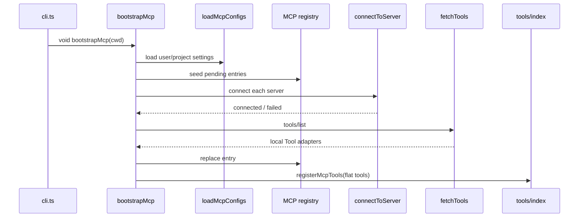
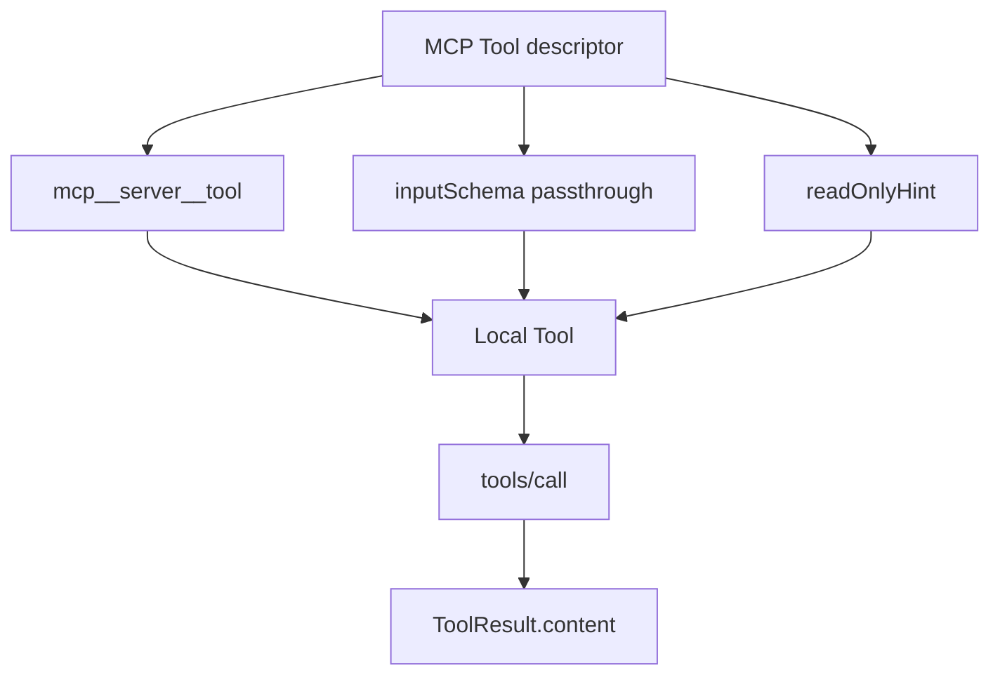

<details>
<summary>相关源文件</summary>

生成本页时使用的主要源文件：

- [src/services/mcp/config.ts](../../../project-repos/easy-agent/src/services/mcp/config.ts)
- [src/services/mcp/bootstrap.ts](../../../project-repos/easy-agent/src/services/mcp/bootstrap.ts)
- [src/services/mcp/client.ts](../../../project-repos/easy-agent/src/services/mcp/client.ts)
- [src/services/mcp/fetchTools.ts](../../../project-repos/easy-agent/src/services/mcp/fetchTools.ts)
- [src/services/mcp/registry.ts](../../../project-repos/easy-agent/src/services/mcp/registry.ts)
- [src/services/mcp/mcpStringUtils.ts](../../../project-repos/easy-agent/src/services/mcp/mcpStringUtils.ts)
- [src/services/mcp/normalization.ts](../../../project-repos/easy-agent/src/services/mcp/normalization.ts)
- [src/types/mcp.ts](../../../project-repos/easy-agent/src/types/mcp.ts)
- [src/scripts/test-mcp.ts](../../../project-repos/easy-agent/src/scripts/test-mcp.ts)

</details>

# MCP 集成

MCP 子系统把 user/project `settings.json` 中的 `mcpServers` 读入、校验并连接，然后把每个 MCP tool 适配成本地 `Tool`。这些工具最终和内置工具一起进入 `tools/index.ts` 的全局工具注册表。  
Sources: [src/services/mcp/config.ts:1-14](../../../project-repos/easy-agent/src/services/mcp/config.ts#L1-L14), [src/services/mcp/bootstrap.ts:1-15](../../../project-repos/easy-agent/src/services/mcp/bootstrap.ts#L1-L15), [src/services/mcp/fetchTools.ts:1-18](../../../project-repos/easy-agent/src/services/mcp/fetchTools.ts#L1-L18), [src/tools/index.ts:48-65](../../../project-repos/easy-agent/src/tools/index.ts#L48-L65)

<details class="source-snippets">
<summary>引用源码</summary>

<!-- source-snippets:start -->

#### `src/services/mcp/config.ts:1-14`

```typescript
/**
 * MCP configuration loading.
 *
 * Reference: claude-code-source-code/src/services/mcp/config.ts (1500+ lines).
 *
 * The source supports user/project/local/enterprise/managed/dynamic/claudeai
 * scopes plus per-server policy filtering. Easy Agent only needs two scopes:
 *   1. user:    ~/.easy-agent/settings.json
 *   2. project: <cwd>/.easy-agent/settings.json
 * with project overriding user (same as existing permission settings).
 *
 * The `mcpServers` field lives inside the existing settings.json so users
 * don't have to learn a second config file.
 */
```

#### `src/services/mcp/bootstrap.ts:1-15`

```typescript
/**
 * MCP startup orchestration.
 *
 * Called once from the CLI entrypoint before the React UI mounts. This is
 * the equivalent of the source's `prefetchAllMcpResources` /
 * `getMcpToolsCommandsAndResources` (client.ts:2228+) — minus the React
 * Hook lifecycle, since Easy Agent doesn't yet need live reconnection.
 *
 * Flow:
 *   1. Load + validate `mcpServers` from settings.json
 *   2. Spawn every server in parallel (Promise.allSettled)
 *   3. For each connected server, fetch its tools/list
 *   4. Register the flat tool array into the global registry
 *   5. Install a SIGINT/SIGTERM cleanup hook so child procs don't leak
 */
```

#### `src/services/mcp/fetchTools.ts:1-18`

```typescript
/**
 * MCP tool discovery + adapter to the local Tool interface.
 *
 * Reference: claude-code-source-code/src/services/mcp/client.ts:1745-2000
 * (`fetchToolsForClient`).
 *
 * What this does, in three steps:
 *   1. Ask the server `tools/list` (skipped if it didn't declare the
 *      `tools` capability)
 *   2. For each MCP tool, build a local `Tool` whose `call()` forwards to
 *      `client.request({ method: 'tools/call' })`
 *   3. Stamp the local Tool with a `mcp__<server>__<tool>` name so the
 *      Anthropic API + permission system can route it back here unambiguously
 *
 * The source's adapter is ~250 lines because it juggles progress events,
 * URL elicitation retries, image persistence, structured content, and
 * session-expired retries. We keep just the data path.
 */
```

#### `src/tools/index.ts:48-65`

```typescript
let mcpTools: Tool[] = [];

/**
 * Replace the registry of MCP-provided tools. Called once at startup after
 * connecting to all MCP servers, and again after `/mcp reconnect`.
 */
export function registerMcpTools(tools: Tool[]): void {
  mcpTools = [...tools];
}

/** Drop the MCP-provided tools — used before re-registering after reconnect. */
export function clearMcpTools(): void {
  mcpTools = [];
}

export function getAllTools(): Tool[] {
  return [...BUILTIN_TOOLS, ...mcpTools].filter((tool) => tool.isEnabled());
}
```

<!-- source-snippets:end -->
</details>
## 配置模型

Easy Agent 支持三种 MCP transport：`stdio`、`http`、`sse`。stdio 的 `type` 可省略；HTTP/SSE 使用 `url` 和可选 static headers；OAuth、WebSocket、IDE transport 等在当前阶段明确不实现。  
Sources: [src/types/mcp.ts:1-12](../../../project-repos/easy-agent/src/types/mcp.ts#L1-L12), [src/types/mcp.ts:18-60](../../../project-repos/easy-agent/src/types/mcp.ts#L18-L60)

<details class="source-snippets">
<summary>引用源码</summary>

<!-- source-snippets:start -->

#### `src/types/mcp.ts:1-12`

```typescript
/**
 * MCP (Model Context Protocol) types — Stage 16.
 *
 * Reference: claude-code-source-code/src/services/mcp/types.ts
 *
 * The source supports 8 transport types (stdio/sse/http/ws/sse-ide/ws-ide/sdk/
 * claudeai-proxy). Easy Agent supports the three that cover the public MCP
 * ecosystem: `stdio` (local subprocess), `http` (Streamable HTTP), and `sse`
 * (legacy SSE-only servers). WebSocket / IDE / SDK / Claude.ai proxy stay
 * out of scope (§16.9). OAuth is also deferred — remote servers can still
 * pass static `headers` (e.g. a bearer token) for simple authenticated use.
 */
```

#### `src/types/mcp.ts:18-60`

```typescript
/**
 * stdio MCP server configuration. The `type` field is optional for backwards
 * compatibility with the de-facto standard `mcpServers` shape used by the
 * MCP ecosystem (Claude Desktop, Cursor, etc.) — when missing, we treat the
 * config as stdio.
 */
export interface McpStdioServerConfig {
  type?: "stdio";
  command: string;
  args?: string[];
  env?: Record<string, string>;
}

/**
 * Streamable HTTP MCP server (the recommended remote transport).
 *
 * Equivalent to source's `McpHTTPServerConfigSchema`. We intentionally don't
 * accept the source's `oauth` / `headersHelper` fields — for Easy Agent §16,
 * `headers` (a static string→string map) is enough to support bearer-token
 * APIs like `Authorization: Bearer <token>`.
 */
export interface McpHTTPServerConfig {
  type: "http";
  url: string;
  headers?: Record<string, string>;
}

/**
 * Legacy SSE MCP server. Many older MCP servers (and most of the public
 * `@modelcontextprotocol/server-*` packages from before Streamable HTTP
 * landed) speak this. The transport opens one long-lived GET that streams
 * server→client messages and POSTs each client→server JSON-RPC envelope.
 */
export interface McpSSEServerConfig {
  type: "sse";
  url: string;
  headers?: Record<string, string>;
}

export type McpServerConfig =
  | McpStdioServerConfig
  | McpHTTPServerConfig
  | McpSSEServerConfig;
```

<!-- source-snippets:end -->
</details>
配置从 `~/.easy-agent/settings.json` 和 `<cwd>/.easy-agent/settings.json` 读取，project 同名 server 覆盖 user。每个 server 独立校验，失败项被丢弃并记录 warning，但不会让整个 CLI 启动失败。  
Sources: [src/services/mcp/config.ts:136-188](../../../project-repos/easy-agent/src/services/mcp/config.ts#L136-L188)

<details class="source-snippets">
<summary>引用源码</summary>

<!-- source-snippets:start -->

#### `src/services/mcp/config.ts:136-188`

```typescript
function extractScopedServers(
  raw: RawSettings | null,
  scope: "user" | "project",
  filePath: string,
  errors: string[],
): Record<string, ScopedMcpServerConfig> {
  if (!raw || raw.mcpServers === undefined) return {};
  if (typeof raw.mcpServers !== "object" || raw.mcpServers === null || Array.isArray(raw.mcpServers)) {
    errors.push(`${filePath}: 'mcpServers' must be an object`);
    return {};
  }
  const out: Record<string, ScopedMcpServerConfig> = {};
  for (const [name, rawConfig] of Object.entries(raw.mcpServers as Record<string, unknown>)) {
    const result = validateServerConfig(name, rawConfig, scope);
    if (!result.ok) {
      errors.push(result.error);
      continue;
    }
    out[name] = { ...result.value, scope };
  }
  return out;
}

/**
 * Load MCP server configurations from user + project settings.
 *
 * Project overrides user on name conflicts. Servers that fail schema
 * validation are dropped with a warning — never throws (mirrors the source's
 * "best-effort" loading approach so a single malformed entry can't take the
 * whole CLI down).
 */
export async function loadMcpConfigs(cwd: string): Promise<McpConfigLoadResult> {
  const { user: userPath, project: projectPath } = getSettingsPaths(cwd);

  const errors: string[] = [];
  const [userFile, projectFile] = await Promise.all([
    readJsonSettingsFile<RawSettings>(userPath),
    readJsonSettingsFile<RawSettings>(projectPath),
  ]);
  if (userFile.parseError) errors.push(userFile.parseError);
  if (projectFile.parseError) errors.push(projectFile.parseError);

  const userServers = extractScopedServers(userFile.raw, "user", userPath, errors);
  const projectServers = extractScopedServers(projectFile.raw, "project", projectPath, errors);

  // Project overrides user — Object.assign right-wins
  const servers: Record<string, ScopedMcpServerConfig> = { ...userServers, ...projectServers };

  for (const error of errors) {
    logWarn(`[mcp] config: ${error}`);
  }
  return { servers, errors };
}
```

<!-- source-snippets:end -->
</details>
## 启动流程

`bootstrapMcp()` 先加载配置并注册 cleanup hook，然后清空 registry。关键点是它会在任何 IO 之前把每个 server 注册成 `pending`，让 `/mcp` 在慢启动期间也能显示真实意图状态；随后并行连接各 server，成功后拉取工具并刷新全局工具注册表。  
Sources: [src/services/mcp/bootstrap.ts:41-80](../../../project-repos/easy-agent/src/services/mcp/bootstrap.ts#L41-L80), [src/services/mcp/bootstrap.ts:99-121](../../../project-repos/easy-agent/src/services/mcp/bootstrap.ts#L99-L121)

<details class="source-snippets">
<summary>引用源码</summary>

<!-- source-snippets:start -->

#### `src/services/mcp/bootstrap.ts:41-80`

```typescript
/**
 * Asynchronously bring up every configured MCP server WITHOUT blocking
 * the caller longer than necessary.
 *
 * Behavior contract:
 *   - On entry: every configured server is immediately registered as
 *     `{ type: 'pending' }` so `/mcp` shows accurate state from t=0.
 *   - Each server connects in parallel via `Promise.allSettled`, and the
 *     registry entry is REPLACED atomically when the connection resolves
 *     (or fails / times out via the per-server timeout in client.ts).
 *   - Whenever the registry changes, the global Tool registry is refreshed
 *     so `getAllTools()` includes any newly available MCP tools on the
 *     next call.
 *   - The returned promise only resolves after EVERY server has reached
 *     a terminal state; it's safe to ignore (`void bootstrapMcp(...)`)
 *     when you want non-blocking startup — just like Claude Code's
 *     `prefetchAllMcpResources` running inside a useEffect.
 */
export async function bootstrapMcp(cwd: string): Promise<McpBootstrapResult> {
  const { servers, errors: configErrors } = await loadMcpConfigs(cwd);
  registerMcpProcessCleanup();
  clearMcpRegistry();

  // Seed `pending` placeholders BEFORE any IO. This is the key change that
  // lets the UI render immediately and `/mcp` show "connecting" servers
  // instead of "0 configured" during a cold `npx -y` install.
  const startedAt = Date.now();
  for (const [name, config] of Object.entries(servers)) {
    const placeholder: PendingMcpServer = { name, type: "pending", config, startedAt };
    setMcpRegistryEntry(name, placeholder, []);
  }
  refreshGlobalToolRegistry();

  // Now connect each server in parallel. Each one independently updates
  // the registry as it resolves, so MCP tools become available
  // incrementally — slow servers don't block fast ones.
  const tasks = Object.entries(servers).map(([name, config]) =>
    connectAndRegister(name, config),
  );
  const settled = await Promise.allSettled(tasks);
```

#### `src/services/mcp/bootstrap.ts:99-121`

```typescript
async function connectAndRegister(
  name: string,
  config: PendingMcpServer["config"],
): Promise<{ connection: McpServerConnection; toolCount: number }> {
  const connection = await connectToServer(name, config);
  let tools: Awaited<ReturnType<typeof fetchToolsForConnection>> = [];
  if (connection.type === "connected") {
    try {
      tools = await fetchToolsForConnection(connection);
    } catch (error) {
      debugLog("mcp", `[${name}] tools/list failed after connect: ${(error as Error).message}`);
    }
  }
  setMcpRegistryEntry(name, connection, tools);
  refreshGlobalToolRegistry();
  return { connection, toolCount: tools.length };
}

/** Flatten every registered MCP server's tools and push them to the global Tool registry. */
function refreshGlobalToolRegistry(): void {
  const allTools = getMcpRegistry().flatMap((entry) => entry.tools);
  registerMcpTools(allTools);
}
```

<!-- source-snippets:end -->
</details>


Sources: [src/entrypoint/cli.ts:113-127](../../../project-repos/easy-agent/src/entrypoint/cli.ts#L113-L127), [src/services/mcp/bootstrap.ts:59-121](../../../project-repos/easy-agent/src/services/mcp/bootstrap.ts#L59-L121)

<details class="source-snippets">
<summary>引用源码</summary>

<!-- source-snippets:start -->

#### `src/entrypoint/cli.ts:113-127`

```typescript
  // Kick off MCP server connections IN THE BACKGROUND. The bootstrap
  // function seeds `pending` registry entries synchronously, then connects
  // each server in parallel — a slow `npx -y @mcp/server-foo` cold-start
  // (which can take 10–30s on first run while npm downloads the package)
  // would otherwise leave the terminal black, because we wouldn't render
  // the UI until it returned.
  //
  // Trade-off: if the user submits a query before MCP tools land, the
  // model just doesn't see them yet. They'll appear on the next turn.
  // This matches Claude Code's behavior — its `prefetchAllMcpResources`
  // runs inside `useManageMCPConnections` (a React useEffect), so the
  // REPL is interactive from frame 1 too.
  void bootstrapMcp(process.cwd()).catch((error) => {
    console.error(`[easy-agent] MCP bootstrap failed: ${(error as Error).message}`);
  });
```

#### `src/services/mcp/bootstrap.ts:59-121`

```typescript
export async function bootstrapMcp(cwd: string): Promise<McpBootstrapResult> {
  const { servers, errors: configErrors } = await loadMcpConfigs(cwd);
  registerMcpProcessCleanup();
  clearMcpRegistry();

  // Seed `pending` placeholders BEFORE any IO. This is the key change that
  // lets the UI render immediately and `/mcp` show "connecting" servers
  // instead of "0 configured" during a cold `npx -y` install.
  const startedAt = Date.now();
  for (const [name, config] of Object.entries(servers)) {
    const placeholder: PendingMcpServer = { name, type: "pending", config, startedAt };
    setMcpRegistryEntry(name, placeholder, []);
  }
  refreshGlobalToolRegistry();

  // Now connect each server in parallel. Each one independently updates
  // the registry as it resolves, so MCP tools become available
  // incrementally — slow servers don't block fast ones.
  const tasks = Object.entries(servers).map(([name, config]) =>
    connectAndRegister(name, config),
  );
  const settled = await Promise.allSettled(tasks);

  const connections: McpServerConnection[] = [];
  let toolCount = 0;
  for (let i = 0; i < settled.length; i++) {
    const res = settled[i];
    const name = Object.keys(servers)[i];
    if (res.status === "fulfilled") {
      connections.push(res.value.connection);
      toolCount += res.value.toolCount;
    } else {
      const failed = getMcpRegistryEntry(name)?.connection;
      if (failed) connections.push(failed);
    }
  }

  return { connections, toolCount, configErrors };
}

async function connectAndRegister(
  name: string,
  config: PendingMcpServer["config"],
): Promise<{ connection: McpServerConnection; toolCount: number }> {
  const connection = await connectToServer(name, config);
  let tools: Awaited<ReturnType<typeof fetchToolsForConnection>> = [];
  if (connection.type === "connected") {
    try {
      tools = await fetchToolsForConnection(connection);
    } catch (error) {
      debugLog("mcp", `[${name}] tools/list failed after connect: ${(error as Error).message}`);
    }
  }
  setMcpRegistryEntry(name, connection, tools);
  refreshGlobalToolRegistry();
  return { connection, toolCount: tools.length };
}

/** Flatten every registered MCP server's tools and push them to the global Tool registry. */
function refreshGlobalToolRegistry(): void {
  const allTools = getMcpRegistry().flatMap((entry) => entry.tools);
  registerMcpTools(allTools);
}
```

<!-- source-snippets:end -->
</details>
## 连接层

`connectToServer()` 用 server name + transport-specific config 作为 cache key，同一配置的并发连接共享 promise。stdio transport 会继承父进程 env 并叠加 server env，stderr 被 pipe 缓冲；HTTP transport 设置 User-Agent 和 headers；SSE transport 分别给 POST 和长连接 GET 设置 headers。连接有默认 30 秒超时。  
Sources: [src/services/mcp/client.ts:36-72](../../../project-repos/easy-agent/src/services/mcp/client.ts#L36-L72), [src/services/mcp/client.ts:131-157](../../../project-repos/easy-agent/src/services/mcp/client.ts#L131-L157), [src/services/mcp/client.ts:182-271](../../../project-repos/easy-agent/src/services/mcp/client.ts#L182-L271), [src/services/mcp/client.ts:310-335](../../../project-repos/easy-agent/src/services/mcp/client.ts#L310-L335)

<details class="source-snippets">
<summary>引用源码</summary>

<!-- source-snippets:start -->

#### `src/services/mcp/client.ts:36-72`

```typescript
const CONNECT_TIMEOUT_MS = 30_000;

function getConnectTimeoutMs(): number {
  const env = parseInt(process.env.MCP_CONNECT_TIMEOUT || "", 10);
  return Number.isFinite(env) && env > 0 ? env : CONNECT_TIMEOUT_MS;
}

// ─── Connection cache ────────────────────────────────────────────────

/**
 * Cache key includes the full config so a `/mcp reconnect` after editing
 * settings.json picks up the new command/args. Same as the source's
 * `getServerCacheKey(name, JSON.stringify(config))` pattern.
 */
function getCacheKey(name: string, config: ScopedMcpServerConfig): string {
  // Stringify the entire transport-specific config so that *any* edit
  // (command, args, env, url, headers, type-switch) yields a fresh cache
  // entry on next `connectToServer`. Order matters for stable hashing —
  // we list the fields explicitly per transport rather than JSON-stringify
  // the whole object to avoid spuriously busting the cache when scope
  // metadata (which doesn't affect the connection) changes.
  if (config.type === "http" || config.type === "sse") {
    return `${name}:${JSON.stringify({
      type: config.type,
      url: config.url,
      headers: config.headers,
    })}`;
  }
  return `${name}:${JSON.stringify({
    type: "stdio",
    command: config.command,
    args: config.args,
    env: config.env,
  })}`;
}

const connectionCache = new Map<string, Promise<McpServerConnection>>();
```

#### `src/services/mcp/client.ts:131-157`

```typescript
/**
 * Connect to a single MCP server. Cached per (name + config) — concurrent
 * callers share the same in-flight Promise. Failures are also cached briefly
 * but are dropped from `activeConnections`, so a follow-up `/mcp reconnect`
 * still triggers a real retry by clearing the cache key first.
 */
export function connectToServer(
  name: string,
  config: ScopedMcpServerConfig,
): Promise<McpServerConnection> {
  const key = getCacheKey(name, config);
  const cached = connectionCache.get(key);
  if (cached) return cached;

  const promise = doConnect(name, config);
  connectionCache.set(key, promise);

  // If the connection ultimately resolves to a `connected` server, register
  // it for shutdown cleanup. Failed/disabled placeholders don't need cleanup.
  void promise.then((conn) => {
    if (conn.type === "connected") {
      activeConnections.set(name, conn);
    }
  });

  return promise;
}
```

#### `src/services/mcp/client.ts:182-271`

```typescript
function createStdioTransport(
  name: string,
  config: import("../../types/mcp.js").McpStdioServerConfig & { scope: string },
): TransportBundle {
  const transport = new StdioClientTransport({
    command: config.command,
    args: config.args ?? [],
    env: {
      // Inherit parent env first, then layer per-server overrides.
      ...(process.env as Record<string, string>),
      ...(config.env ?? {}),
    },
    stderr: "pipe", // keep server stderr off our terminal UI
  });

  let stderrBuf = "";
  if (transport.stderr) {
    transport.stderr.on("data", (chunk: Buffer) => {
      if (stderrBuf.length < 64 * 1024) {
        stderrBuf += chunk.toString();
      }
    });
  }

  return {
    transport,
    describe: `stdio: ${config.command} ${(config.args ?? []).join(" ")}`.trim(),
    collectStderrTail: () => stderrBuf,
    preCleanup: async () => {
      const pid: number | undefined = (transport as { pid?: number }).pid;
      await escalatedKill(name, pid);
    },
  };
}

function createHttpTransport(config: McpHTTPServerConfig & { scope: string }): TransportBundle {
  // Match the source's StreamableHTTPClientTransport options: requestInit
  // (headers + UA) flows into every POST. We DO NOT pass an authProvider;
  // OAuth is §16.9 deferred. If the server returns 401 we surface it as a
  // connection failure with the response body so users can fix their token.
  const transport = new StreamableHTTPClientTransport(new URL(config.url), {
    requestInit: {
      headers: {
        "User-Agent": "easy-agent/0.1.0",
        ...(config.headers ?? {}),
      },
    },
  });
  return {
    transport,
    describe: `http: ${config.url}`,
    collectStderrTail: () => "",
    preCleanup: async () => { /* http: client.close() handles it */ },
  };
}

function createSseTransport(config: McpSSEServerConfig & { scope: string }): TransportBundle {
  // SSE has TWO request paths and headers must be supplied to BOTH:
  //   1. requestInit  → POSTs (every JSON-RPC envelope sent client→server)
  //   2. eventSourceInit → the long-lived GET that streams server→client
  //
  // The source code (client.ts:644-672) is explicit that the eventSourceInit
  // fetch must NOT inherit any timeout wrapper, otherwise the SSE stream
  // dies after 60s. We don't have a timeout wrapper to begin with, so we
  // just ensure both header sets are present.
  const headers = {
    "User-Agent": "easy-agent/0.1.0",
    ...(config.headers ?? {}),
  };
  const transport = new SSEClientTransport(new URL(config.url), {
    requestInit: { headers },
    eventSourceInit: {
      fetch: (url, init) =>
        fetch(url, {
          ...init,
          headers: {
            ...(init?.headers as Record<string, string> | undefined),
            ...headers,
            Accept: "text/event-stream",
          },
        }),
    },
  });
  return {
    transport,
    describe: `sse: ${config.url}`,
    collectStderrTail: () => "",
    preCleanup: async () => { /* sse: client.close() handles it */ },
  };
}
```

#### `src/services/mcp/client.ts:310-335`

```typescript
  const connectPromise = client.connect(bundle.transport);
  const timeoutMs = getConnectTimeoutMs();

  let timeoutHandle: ReturnType<typeof setTimeout> | undefined;
  const timeoutPromise = new Promise<never>((_resolve, reject) => {
    timeoutHandle = setTimeout(() => {
      reject(new Error(`MCP server '${name}' connection timed out after ${timeoutMs}ms`));
    }, timeoutMs);
  });

  try {
    await Promise.race([connectPromise, timeoutPromise]);
  } catch (error) {
    if (timeoutHandle) clearTimeout(timeoutHandle);
    const errMsg = (error as Error).message;
    const stderrTail = bundle.collectStderrTail();
    const detail = stderrTail ? `${errMsg} (stderr: ${stderrTail.slice(0, 200).trim()})` : errMsg;
    logWarn(`MCP server '${name}' failed to connect: ${detail}`);
    try {
      await bundle.transport.close();
    } catch {
      /* best-effort */
    }
    return { name, type: "failed", config, error: detail };
  }
  if (timeoutHandle) clearTimeout(timeoutHandle);
```

<!-- source-snippets:end -->
</details>
连接成功后会读取 server capabilities 和 server version，并返回带 cleanup 的 `ConnectedMcpServer`。cleanup 对 stdio 会先做 SIGINT/SIGTERM/SIGKILL 分级清理，然后关闭 SDK client。  
Sources: [src/services/mcp/client.ts:337-367](../../../project-repos/easy-agent/src/services/mcp/client.ts#L337-L367), [src/services/mcp/client.ts:83-127](../../../project-repos/easy-agent/src/services/mcp/client.ts#L83-L127)

<details class="source-snippets">
<summary>引用源码</summary>

<!-- source-snippets:start -->

#### `src/services/mcp/client.ts:337-367`

```typescript
  const capabilities = client.getServerCapabilities();
  const serverVersion = client.getServerVersion();
  debugLog(
    "mcp",
    `[${name}] connected via ${bundle.describe} (server=${serverVersion?.name ?? "?"} v${serverVersion?.version ?? "?"} caps=${JSON.stringify({
      tools: !!capabilities?.tools,
      resources: !!capabilities?.resources,
      prompts: !!capabilities?.prompts,
    })})`,
  );

  const cleanup = async (): Promise<void> => {
    activeConnections.delete(name);
    await bundle.preCleanup();
    try {
      await client.close();
    } catch (error) {
      debugLog("mcp", `[${name}] client.close error: ${(error as Error).message}`);
    }
  };

  return {
    name,
    type: "connected",
    client,
    capabilities,
    serverInfo: serverVersion ? { name: serverVersion.name ?? name, version: serverVersion.version ?? "?" } : undefined,
    config,
    cleanup,
  };
}
```

#### `src/services/mcp/client.ts:83-127`

```typescript
/**
 * Stdio cleanup escalation: SIGINT (100ms) → SIGTERM (400ms) → SIGKILL.
 * Total cap ~500ms so CLI exit isn't held up by a misbehaving server.
 *
 * Direct port of source code's escalation strategy
 * (client.ts:1431-1559) but flattened — no need for the resolved/timer
 * juggling because we await inline.
 */
async function escalatedKill(name: string, pid: number | undefined): Promise<void> {
  if (!pid) return;
  const aliveCheck = (): boolean => {
    try {
      // signal 0 = "is the process still alive?"
      process.kill(pid, 0);
      return true;
    } catch {
      return false;
    }
  };

  try {
    process.kill(pid, "SIGINT");
  } catch (error) {
    debugLog("mcp", `[${name}] SIGINT failed: ${(error as Error).message}`);
    return;
  }
  await sleep(100);
  if (!aliveCheck()) return;

  debugLog("mcp", `[${name}] SIGINT didn't exit; sending SIGTERM`);
  try {
    process.kill(pid, "SIGTERM");
  } catch {
    return;
  }
  await sleep(400);
  if (!aliveCheck()) return;

  debugLog("mcp", `[${name}] SIGTERM didn't exit; sending SIGKILL`);
  try {
    process.kill(pid, "SIGKILL");
  } catch {
    /* already dead */
  }
}
```

<!-- source-snippets:end -->
</details>
## 工具适配

`fetchToolsForConnection()` 只在 server 声明 `tools` capability 时调用 `tools/list`。每个 MCP tool 会变成本地 `Tool`：name 形如 `mcp__<server>__<tool>`，description 最多 2048 字符，input schema 透传，`annotations.readOnlyHint` 映射到 `isReadOnly()`。  
Sources: [src/services/mcp/fetchTools.ts:34-40](../../../project-repos/easy-agent/src/services/mcp/fetchTools.ts#L34-L40), [src/services/mcp/fetchTools.ts:73-127](../../../project-repos/easy-agent/src/services/mcp/fetchTools.ts#L73-L127), [src/services/mcp/fetchTools.ts:129-165](../../../project-repos/easy-agent/src/services/mcp/fetchTools.ts#L129-L165)

<details class="source-snippets">
<summary>引用源码</summary>

<!-- source-snippets:start -->

#### `src/services/mcp/fetchTools.ts:34-40`

```typescript
/**
 * MCP tool descriptions can blow up to 60 KB on OpenAPI-derived servers.
 * Cap at 2048 chars to keep the system prompt sane (same value as source).
 */
const MAX_MCP_DESCRIPTION_LENGTH = 2048;

/** Map MCP `CallToolResult.content[]` blocks to a single string for our Tool result. */
```

#### `src/services/mcp/fetchTools.ts:73-127`

```typescript
/**
 * Build a local `Tool` from a single MCP tool descriptor.
 *
 * Key field mappings (mirroring the source code):
 *   tool.annotations.readOnlyHint  → isReadOnly()       (gates Plan-mode visibility)
 *   tool.annotations.destructiveHint → (used by source for risk labels — not yet here)
 *   tool.inputSchema               → inputSchema        (passed through to API)
 *   tool.description (≤2048 chars) → description
 */
function buildToolAdapter(connection: ConnectedMcpServer, mcpTool: McpTool): Tool {
  const fullName = buildMcpToolName(connection.name, mcpTool.name);
  const description = truncateDescription(mcpTool.description);
  const isReadOnly = mcpTool.annotations?.readOnlyHint ?? false;

  // The MCP SDK ships JSON Schema, which is the same shape Anthropic's API
  // expects. We `as` it to satisfy the local typedef but it's effectively
  // identical at runtime.
  const inputSchema = (mcpTool.inputSchema ?? {
    type: "object",
    properties: {},
  }) as Tool["inputSchema"];

  return {
    name: fullName,
    description,
    inputSchema,
    isReadOnly: () => isReadOnly,
    isEnabled: () => true,
    async call(rawInput: Record<string, unknown>, _context: ToolContext): Promise<ToolResult> {
      try {
        const result = await connection.client.request(
          {
            method: "tools/call",
            params: {
              name: mcpTool.name, // server expects its OWN name, not the prefixed alias
              arguments: rawInput,
            },
          },
          CallToolResultSchema,
        );
        const content = stringifyMcpContent(result.content as CallToolResult["content"]);
        return {
          content,
          isError: result.isError === true,
        };
      } catch (error) {
        const message = error instanceof Error ? error.message : String(error);
        return {
          content: `MCP tool '${fullName}' failed: ${message}`,
          isError: true,
        };
      }
    },
  };
}
```

#### `src/services/mcp/fetchTools.ts:129-165`

```typescript
/**
 * Pull the tool list from a connected MCP server and adapt each entry into
 * our local Tool interface. Returns `[]` if the server doesn't declare the
 * `tools` capability or if the request fails (logged).
 */
export async function fetchToolsForConnection(
  connection: ConnectedMcpServer,
): Promise<Tool[]> {
  if (!connection.capabilities?.tools) {
    debugLog("mcp", `[${connection.name}] no 'tools' capability declared, skipping tools/list`);
    return [];
  }

  let result: ListToolsResult;
  try {
    result = (await connection.client.request(
      { method: "tools/list" },
      ListToolsResultSchema,
    )) as ListToolsResult;
  } catch (error) {
    logWarn(`MCP server '${connection.name}' tools/list failed: ${(error as Error).message}`);
    return [];
  }

  const tools: Tool[] = [];
  for (const mcpTool of result.tools) {
    try {
      tools.push(buildToolAdapter(connection, mcpTool));
    } catch (error) {
      logWarn(
        `MCP tool '${connection.name}.${mcpTool.name}' failed schema adaptation: ${(error as Error).message}`,
      );
    }
  }
  debugLog("mcp", `[${connection.name}] discovered ${tools.length} tool(s)`);
  return tools;
}
```

<!-- source-snippets:end -->
</details>
MCP tool 调用时，本地工具会把 prefixed name 还原成 server 自己的 tool name 发给 `tools/call`；返回内容统一 stringify 成文本。图片当前只转成占位描述，resource 优先使用 text。  
Sources: [src/services/mcp/fetchTools.ts:40-65](../../../project-repos/easy-agent/src/services/mcp/fetchTools.ts#L40-L65), [src/services/mcp/fetchTools.ts:101-124](../../../project-repos/easy-agent/src/services/mcp/fetchTools.ts#L101-L124)

<details class="source-snippets">
<summary>引用源码</summary>

<!-- source-snippets:start -->

#### `src/services/mcp/fetchTools.ts:40-65`

```typescript
/** Map MCP `CallToolResult.content[]` blocks to a single string for our Tool result. */
function stringifyMcpContent(content: CallToolResult["content"]): string {
  if (!Array.isArray(content)) return "";
  const parts: string[] = [];
  for (const block of content) {
    switch (block.type) {
      case "text":
        parts.push(block.text);
        break;
      case "image":
        // Source code resizes + persists the image to disk and returns a
        // path. For Stage 16 we just acknowledge it — image-aware tools
        // can be added later when we wire MCP into the model's vision input.
        parts.push(`[image: ${block.mimeType ?? "?"}, ${(block.data ?? "").length} base64 chars]`);
        break;
      case "resource": {
        const r = block.resource as { uri?: string; text?: string };
        parts.push(r?.text ?? `[resource: ${r?.uri ?? "<no uri>"}]`);
        break;
      }
      default:
        parts.push(`[${(block as { type?: string }).type ?? "unknown"} block]`);
    }
  }
  return parts.join("\n");
}
```

#### `src/services/mcp/fetchTools.ts:101-124`

```typescript
    async call(rawInput: Record<string, unknown>, _context: ToolContext): Promise<ToolResult> {
      try {
        const result = await connection.client.request(
          {
            method: "tools/call",
            params: {
              name: mcpTool.name, // server expects its OWN name, not the prefixed alias
              arguments: rawInput,
            },
          },
          CallToolResultSchema,
        );
        const content = stringifyMcpContent(result.content as CallToolResult["content"]);
        return {
          content,
          isError: result.isError === true,
        };
      } catch (error) {
        const message = error instanceof Error ? error.message : String(error);
        return {
          content: `MCP tool '${fullName}' failed: ${message}`,
          isError: true,
        };
      }
```

<!-- source-snippets:end -->
</details>


Sources: [src/services/mcp/mcpStringUtils.ts:13-36](../../../project-repos/easy-agent/src/services/mcp/mcpStringUtils.ts#L13-L36), [src/services/mcp/normalization.ts:12-14](../../../project-repos/easy-agent/src/services/mcp/normalization.ts#L12-L14), [src/services/mcp/fetchTools.ts:73-127](../../../project-repos/easy-agent/src/services/mcp/fetchTools.ts#L73-L127)

<details class="source-snippets">
<summary>引用源码</summary>

<!-- source-snippets:start -->

#### `src/services/mcp/mcpStringUtils.ts:13-36`

```typescript
/** Build the fully qualified MCP tool name. */
export function buildMcpToolName(serverName: string, toolName: string): string {
  return `mcp__${normalizeNameForMCP(serverName)}__${normalizeNameForMCP(toolName)}`;
}

/** Cheap predicate: does this look like an MCP-prefixed tool name? */
export function isMcpToolName(name: string): boolean {
  return name.startsWith("mcp__");
}

/**
 * Parse an MCP tool name back into server / tool components.
 * Returns null if the string isn't `mcp__server__tool`-shaped.
 */
export function parseMcpToolName(
  fullName: string,
): { serverName: string; toolName: string } | null {
  const parts = fullName.split("__");
  if (parts.length < 3 || parts[0] !== "mcp" || !parts[1]) return null;
  return {
    serverName: parts[1],
    toolName: parts.slice(2).join("__"),
  };
}
```

#### `src/services/mcp/normalization.ts:12-14`

```typescript
export function normalizeNameForMCP(name: string): string {
  return name.replace(/[^a-zA-Z0-9_-]/g, "_");
}
```

#### `src/services/mcp/fetchTools.ts:73-127`

```typescript
/**
 * Build a local `Tool` from a single MCP tool descriptor.
 *
 * Key field mappings (mirroring the source code):
 *   tool.annotations.readOnlyHint  → isReadOnly()       (gates Plan-mode visibility)
 *   tool.annotations.destructiveHint → (used by source for risk labels — not yet here)
 *   tool.inputSchema               → inputSchema        (passed through to API)
 *   tool.description (≤2048 chars) → description
 */
function buildToolAdapter(connection: ConnectedMcpServer, mcpTool: McpTool): Tool {
  const fullName = buildMcpToolName(connection.name, mcpTool.name);
  const description = truncateDescription(mcpTool.description);
  const isReadOnly = mcpTool.annotations?.readOnlyHint ?? false;

  // The MCP SDK ships JSON Schema, which is the same shape Anthropic's API
  // expects. We `as` it to satisfy the local typedef but it's effectively
  // identical at runtime.
  const inputSchema = (mcpTool.inputSchema ?? {
    type: "object",
    properties: {},
  }) as Tool["inputSchema"];

  return {
    name: fullName,
    description,
    inputSchema,
    isReadOnly: () => isReadOnly,
    isEnabled: () => true,
    async call(rawInput: Record<string, unknown>, _context: ToolContext): Promise<ToolResult> {
      try {
        const result = await connection.client.request(
          {
            method: "tools/call",
            params: {
              name: mcpTool.name, // server expects its OWN name, not the prefixed alias
              arguments: rawInput,
            },
          },
          CallToolResultSchema,
        );
        const content = stringifyMcpContent(result.content as CallToolResult["content"]);
        return {
          content,
          isError: result.isError === true,
        };
      } catch (error) {
        const message = error instanceof Error ? error.message : String(error);
        return {
          content: `MCP tool '${fullName}' failed: ${message}`,
          isError: true,
        };
      }
    },
  };
}
```

<!-- source-snippets:end -->
</details>
## `/mcp` 命令表面

`QueryEngine` 的 `/mcp` 命令可以列出所有 server 的 connected/failed/pending/disabled 状态，展示某个 server 的工具，或者 reconnect 单个 server。Reconnect 会清 cache、删 registry entry、重新连接、重新拉取工具并刷新全局 tool registry。  
Sources: [src/core/queryEngine.ts:668-760](../../../project-repos/easy-agent/src/core/queryEngine.ts#L668-L760), [src/core/queryEngine.ts:760-811](../../../project-repos/easy-agent/src/core/queryEngine.ts#L760-L811), [src/services/mcp/bootstrap.ts:123-141](../../../project-repos/easy-agent/src/services/mcp/bootstrap.ts#L123-L141)

<details class="source-snippets">
<summary>引用源码</summary>

<!-- source-snippets:start -->

#### `src/core/queryEngine.ts:668-760`

```typescript
  /**
   * Handle the `/mcp` slash command family.
   *
   *   /mcp                       — list every configured server + status + tool count
   *   /mcp tools <name>          — show all tools exposed by one server
   *   /mcp reconnect <name>      — drop cache + retry connection
   *
   * The output is rendered as a system notice (info/error tone), never sent
   * to the model. Mirrors the source's `mcp.tsx` panel content but stripped
   * to a text-only listing — Easy Agent doesn't need a full TUI panel for it.
   */
  private async *handleMcpCommand(args: string[]): AsyncGenerator<QueryEngineEvent, { handled: boolean }> {
    const describeTransport = (config: import("../types/mcp.js").ScopedMcpServerConfig): string => {
      if (config.type === "http") return `http: ${config.url}`;
      if (config.type === "sse") return `sse: ${config.url}`;
      return `stdio: ${config.command} ${(config.args ?? []).join(" ")}`.trim();
    };

    const [sub, ...rest] = args;

    if (!sub) {
      const entries = getMcpRegistry();
      if (entries.length === 0) {
        yield {
          type: "command",
          kind: "info",
          message:
            "MCP Servers (0 configured)\n\n" +
            "No MCP servers configured. Add them under \"mcpServers\" in:\n" +
            "  ~/.easy-agent/settings.json   (user-wide)\n" +
            "  .easy-agent/settings.json      (project-only)",
        };
        return { handled: true };
      }
      const lines = [`MCP Servers (${entries.length} configured)`, ""];
      for (const { connection, tools } of entries) {
        const transport = describeTransport(connection.config);
        if (connection.type === "connected") {
          lines.push(`  ✓ ${connection.name}    connected   ${tools.length} tool(s)   (${transport})`);
        } else if (connection.type === "failed") {
          lines.push(`  ✗ ${connection.name}    failed      ${connection.error}`);
        } else if (connection.type === "pending") {
          const elapsedSec = Math.floor((Date.now() - connection.startedAt) / 1000);
          lines.push(`  … ${connection.name}    connecting  (${elapsedSec}s elapsed; ${transport})`);
        } else {
          lines.push(`  - ${connection.name}    disabled`);
        }
      }
      lines.push("", "Subcommands: /mcp tools <name> | /mcp reconnect <name>");
      yield { type: "command", kind: "info", message: lines.join("\n") };
      return { handled: true };
    }

    if (sub === "tools") {
      const target = rest[0];
      if (!target) {
        yield { type: "command", kind: "error", message: "Usage: /mcp tools <serverName>" };
        return { handled: true };
      }
      const entry = getMcpRegistryEntry(target);
      if (!entry) {
        yield { type: "command", kind: "error", message: `MCP server '${target}' is not configured.` };
        return { handled: true };
      }
      if (entry.connection.type !== "connected") {
        yield {
          type: "command",
          kind: "error",
          message: `MCP server '${target}' is ${entry.connection.type}; cannot list tools.`,
        };
        return { handled: true };
      }
      if (entry.tools.length === 0) {
        yield {
          type: "command",
          kind: "info",
          message: `MCP server '${target}' exposes no tools (server may not declare the 'tools' capability).`,
        };
        return { handled: true };
      }
      const lines = [`MCP tools from '${target}' (${entry.tools.length})`, ""];
      for (const tool of entry.tools) {
        const ro = tool.isReadOnly() ? "[ro]" : "    ";
        const desc = tool.description.replace(/\s+/g, " ").trim();
        const truncated = desc.length > 100 ? `${desc.slice(0, 100)}…` : desc;
        lines.push(`  ${ro} ${tool.name}`);
        if (truncated) lines.push(`        ${truncated}`);
      }
      yield { type: "command", kind: "info", message: lines.join("\n") };
      return { handled: true };
    }

    if (sub === "reconnect") {
```

#### `src/core/queryEngine.ts:760-811`

```typescript
    if (sub === "reconnect") {
      const target = rest[0];
      if (!target) {
        yield { type: "command", kind: "error", message: "Usage: /mcp reconnect <serverName>" };
        return { handled: true };
      }
      const entry = getMcpRegistryEntry(target);
      if (!entry) {
        yield { type: "command", kind: "error", message: `MCP server '${target}' is not configured.` };
        return { handled: true };
      }
      try {
        const next = await reconnectMcpServer(target);
        if (!next) {
          yield { type: "command", kind: "error", message: `MCP server '${target}' was removed before reconnect completed.` };
          return { handled: true };
        }
        if (next.type === "connected") {
          const newEntry = getMcpRegistryEntry(target);
          yield {
            type: "command",
            kind: "info",
            message: `MCP server '${target}' reconnected (${newEntry?.tools.length ?? 0} tool(s)).`,
          };
        } else if (next.type === "failed") {
          yield {
            type: "command",
            kind: "error",
            message: `MCP server '${target}' reconnect failed: ${next.error}`,
          };
        } else {
          yield {
            type: "command",
            kind: "info",
            message: `MCP server '${target}' is currently disabled.`,
          };
        }
      } catch (error) {
        yield {
          type: "command",
          kind: "error",
          message: `MCP server '${target}' reconnect threw: ${(error as Error).message}`,
        };
      }
      return { handled: true };
    }

    yield {
      type: "command",
      kind: "error",
      message: `Unknown /mcp subcommand: ${sub}. Try /mcp, /mcp tools <name>, or /mcp reconnect <name>.`,
    };
```

#### `src/services/mcp/bootstrap.ts:123-141`

```typescript
/**
 * Reconnect a single MCP server. Returns the new connection state. Used by
 * `/mcp reconnect <name>`.
 */
export async function reconnectMcpServer(name: string): Promise<McpServerConnection | null> {
  const entry = getMcpRegistryEntry(name);
  if (!entry) return null;

  await clearServerCache(name, entry.connection.config);
  deleteMcpRegistryEntry(name);
  refreshGlobalToolRegistry();

  const connection = await connectToServer(name, entry.connection.config);
  const tools = connection.type === "connected" ? await fetchToolsForConnection(connection) : [];
  setMcpRegistryEntry(name, connection, tools);
  refreshGlobalToolRegistry();

  return connection;
}
```

<!-- source-snippets:end -->
</details>
## 验证脚本覆盖

`test-mcp.ts` 覆盖 name normalization、配置校验、inline stdio server 端到端连接、tools/list、tools/call、registry、reconnect、cleanup，以及 pending 到 connected 的非阻塞启动窗口。  
Sources: [src/scripts/test-mcp.ts:1-22](../../../project-repos/easy-agent/src/scripts/test-mcp.ts#L1-L22), [src/scripts/test-mcp.ts:72-142](../../../project-repos/easy-agent/src/scripts/test-mcp.ts#L72-L142), [src/scripts/test-mcp.ts:144-287](../../../project-repos/easy-agent/src/scripts/test-mcp.ts#L144-L287), [src/scripts/test-mcp.ts:289-338](../../../project-repos/easy-agent/src/scripts/test-mcp.ts#L289-L338)

<details class="source-snippets">
<summary>引用源码</summary>

<!-- source-snippets:start -->

#### `src/scripts/test-mcp.ts:1-22`

```typescript
#!/usr/bin/env tsx
/**
 * Stage 16 verification — Smoke test the MCP integration end-to-end.
 *
 * What it covers:
 *   1. normalize / build / parse MCP tool names
 *   2. Schema validation rejects bad configs
 *   3. Connect to a real stdio MCP server (a tiny inline server we ship here)
 *   4. tools/list discovery
 *   5. tools/call execution
 *   6. /mcp registry surface
 *   7. Reconnect drops + re-establishes the connection
 *   8. Cleanup terminates the child process
 *
 * Run: npm run test:mcp
 *
 * Usage of an inline server:
 *   We can't depend on `npx -y @modelcontextprotocol/server-filesystem` in
 *   this script (offline / npm sandbox quirks). Instead we spawn a tiny
 *   self-contained MCP server using the SDK's Server + StdioServerTransport
 *   so the smoke test is hermetic.
 */
```

#### `src/scripts/test-mcp.ts:72-142`

```typescript
// ─── 1. Pure name utilities ──────────────────────────────────────────
function testNormalization() {
  console.log("── 1. Name normalization ──");
  if (normalizeNameForMCP("my.db") === "my_db") pass("normalize 'my.db' → 'my_db'");
  else fail("normalize 'my.db' should be 'my_db'");

  if (normalizeNameForMCP("foo-bar_baz") === "foo-bar_baz") pass("normalize keeps [a-z0-9_-]");
  else fail("normalize stripped legal chars");

  const tn = buildMcpToolName("my.server", "do.thing");
  if (tn === "mcp__my_server__do_thing") pass(`buildMcpToolName → ${tn}`);
  else fail(`buildMcpToolName produced wrong shape: ${tn}`);

  if (isMcpToolName(tn)) pass("isMcpToolName recognizes mcp__ prefix");
  else fail("isMcpToolName false negative");

  const parsed = parseMcpToolName(tn);
  if (parsed && parsed.serverName === "my_server" && parsed.toolName === "do_thing") {
    pass(`parseMcpToolName → ${JSON.stringify(parsed)}`);
  } else {
    fail(`parseMcpToolName returned ${JSON.stringify(parsed)}`);
  }
}

// ─── 2. Config validation ────────────────────────────────────────────
async function testConfigValidation() {
  console.log("\n── 2. Config validation ──");
  const fakeHome = await resetMcpStateForTest();
  const tmp = await fs.mkdtemp(path.join(os.tmpdir(), "easy-agent-mcp-cfg-"));
  await fs.mkdir(path.join(tmp, ".easy-agent"), { recursive: true });
  await fs.writeFile(
    path.join(tmp, ".easy-agent", "settings.json"),
    JSON.stringify({
      mcpServers: {
        "good-stdio": { command: "echo", args: ["hello"] },
        "good-http": { type: "http", url: "https://example.com/mcp" },
        "good-sse": { type: "sse", url: "http://localhost:3000/sse" },
        "bad-no-command": { args: ["x"] },
        "bad-bad-url": { type: "http", url: "not a url" },
        "bad-bad-type": { type: "ws", url: "wss://x" },
      },
    }),
  );
  const result = await loadMcpConfigs(tmp);
  const good = result.servers["good-stdio"];
  if (good && good.type !== "http" && good.type !== "sse" && good.command === "echo") pass("good-stdio validated");
  else fail("good-stdio missing");

  const http = result.servers["good-http"];
  if (http?.type === "http" && http.url === "https://example.com/mcp") pass("good-http validated");
  else fail("good-http missing");

  const sse = result.servers["good-sse"];
  if (sse?.type === "sse" && sse.url === "http://localhost:3000/sse") pass("good-sse validated");
  else fail("good-sse missing");

  if (!result.servers["bad-no-command"]) pass("bad-no-command rejected");
  else fail("bad-no-command should have been rejected");

  if (!result.servers["bad-bad-url"]) pass("bad-bad-url rejected (invalid URL)");
  else fail("bad-bad-url should have been rejected");

  if (!result.servers["bad-bad-type"]) pass("bad-bad-type rejected (ws not supported)");
  else fail("bad-bad-type should have been rejected");

  if (result.errors.length === 3) pass(`emitted ${result.errors.length} errors`);
  else fail(`expected 3 errors, got ${result.errors.length}: ${JSON.stringify(result.errors)}`);

  await fs.rm(tmp, { recursive: true, force: true });
  await fs.rm(fakeHome, { recursive: true, force: true });
}
```

#### `src/scripts/test-mcp.ts:144-287`

```typescript
// ─── 3. End-to-end with an inline MCP server ─────────────────────────
/**
 * Write a tiny standalone MCP server JS file. We spawn it with `node` so the
 * test doesn't depend on any external npm package being installed.
 *
 * The inline server exposes one tool: `echo` that returns its `message` arg.
 */
async function writeInlineServer(opts: { startupDelayMs?: number } = {}): Promise<string> {
  const tmpDir = await fs.mkdtemp(path.join(os.tmpdir(), "easy-agent-mcp-srv-"));
  const serverPath = path.join(tmpDir, "server.mjs");
  // Resolve the SDK's package path from the test process so the spawned
  // child can `import` it via an absolute path. Avoids any cwd assumption.
  const sdkPkg = path.dirname(
    new URL(import.meta.resolve("@modelcontextprotocol/sdk/server/index.js")).pathname,
  );
  const startupDelayMs = opts.startupDelayMs ?? 0;
  const serverJs = `
${startupDelayMs > 0 ? `await new Promise((r) => setTimeout(r, ${startupDelayMs}));` : ""}
import { Server } from "${sdkPkg}/index.js";
import { StdioServerTransport } from "${sdkPkg}/stdio.js";
import {
  CallToolRequestSchema,
  ListToolsRequestSchema,
} from "${sdkPkg.replace("/server", "")}/types.js";

const server = new Server(
  { name: "inline-test", version: "0.0.1" },
  { capabilities: { tools: {} } },
);

server.setRequestHandler(ListToolsRequestSchema, async () => ({
  tools: [
    {
      name: "echo",
      description: "Echo back the message argument.",
      inputSchema: {
        type: "object",
        properties: { message: { type: "string" } },
        required: ["message"],
      },
      annotations: { readOnlyHint: true, title: "Echo Tool" },
    },
  ],
}));

server.setRequestHandler(CallToolRequestSchema, async (req) => {
  if (req.params.name === "echo") {
    return {
      content: [{ type: "text", text: String(req.params.arguments?.message ?? "") }],
    };
  }
  return { content: [{ type: "text", text: "unknown tool" }], isError: true };
});

const transport = new StdioServerTransport();
await server.connect(transport);
`;
  await fs.writeFile(serverPath, serverJs);
  return serverPath;
}

async function testEndToEnd(): Promise<void> {
  console.log("\n── 3. End-to-end (inline stdio server) ──");
  const fakeHome = await resetMcpStateForTest();

  const serverPath = await writeInlineServer();
  const tmpCwd = await fs.mkdtemp(path.join(os.tmpdir(), "easy-agent-mcp-e2e-"));
  await fs.mkdir(path.join(tmpCwd, ".easy-agent"), { recursive: true });
  await fs.writeFile(
    path.join(tmpCwd, ".easy-agent", "settings.json"),
    JSON.stringify({
      mcpServers: {
        inline: { command: "node", args: [serverPath] },
        "missing-cmd": { command: "this-binary-definitely-does-not-exist-xyz" },
      },
    }),
  );

  const result = await bootstrapMcp(tmpCwd);
  if (result.connections.length === 2) pass(`bootstrap returned ${result.connections.length} connections`);
  else fail(`expected 2 connections, got ${result.connections.length}`);

  const inline = result.connections.find((c) => c.name === "inline");
  if (inline?.type === "connected") pass("inline server connected");
  else fail(`inline should be connected, got ${inline?.type}`);

  const missing = result.connections.find((c) => c.name === "missing-cmd");
  if (missing?.type === "failed") pass(`missing-cmd correctly marked failed (${missing.error.slice(0, 60)}...)`);
  else fail(`missing-cmd should be failed, got ${missing?.type}`);

  if (result.toolCount === 1) pass(`discovered ${result.toolCount} tool`);
  else fail(`expected 1 tool, got ${result.toolCount}`);

  // Tool is registered globally
  const toolName = buildMcpToolName("inline", "echo");
  const tool = findToolByName(toolName);
  if (tool) pass(`global registry has '${toolName}'`);
  else fail(`global registry missing '${toolName}'`);

  if (tool?.isReadOnly()) pass("annotations.readOnlyHint → tool.isReadOnly() === true");
  else fail("readOnlyHint mapping failed");

  // Call the tool through the local Tool interface
  if (tool) {
    const callResult = await tool.call({ message: "hello mcp" }, ctx);
    if (!callResult.isError && callResult.content === "hello mcp") {
      pass("tool.call() roundtripped 'hello mcp'");
    } else {
      fail(`tool.call() returned ${JSON.stringify(callResult)}`);
    }
  }

  // /mcp registry view
  const reg = getMcpRegistry();
  if (reg.length === 2) pass(`registry has ${reg.length} entries`);
  else fail(`expected 2 registry entries, got ${reg.length}`);

  // Reconnect
  const reconnected = await reconnectMcpServer("inline");
  if (reconnected?.type === "connected") pass("reconnect succeeded");
... snippet truncated ...
```

#### `src/scripts/test-mcp.ts:289-338`

```typescript
// ─── 4. Non-blocking bootstrap (pending → connected race) ───────────
async function testNonBlockingBootstrap(): Promise<void> {
  console.log("\n── 4. Non-blocking bootstrap ──");
  const fakeHome = await resetMcpStateForTest();
  // 500ms server startup delay — gives us a wide-open window to observe the
  // pending → connected transition. Without it the inline node spawn races
  // ahead of any reasonable polling interval.
  const serverPath = await writeInlineServer({ startupDelayMs: 500 });
  const tmpCwd = await fs.mkdtemp(path.join(os.tmpdir(), "easy-agent-mcp-nb-"));
  await fs.mkdir(path.join(tmpCwd, ".easy-agent"), { recursive: true });
  await fs.writeFile(
    path.join(tmpCwd, ".easy-agent", "settings.json"),
    JSON.stringify({
      mcpServers: { inline: { command: "node", args: [serverPath] } },
    }),
  );

  // Don't await — kick off bootstrap in background, exactly like cli.ts does.
  const bootstrapPromise = bootstrapMcp(tmpCwd);

  // Poll the registry until the seed-pending step lands (or until we time
  // out). The seed runs after `loadMcpConfigs` resolves an fs.readFile, so
  // we can't observe it on the very next microtask — but we DEFINITELY
  // should see it well before the 500ms server-startup delay completes.
  let pendingSeen = false;
  const pollDeadline = Date.now() + 400; // must beat 500ms server delay
  while (Date.now() < pollDeadline) {
    await new Promise((r) => setImmediate(r));
    const entry = getMcpRegistryEntry("inline");
    if (entry?.connection.type === "pending") { pendingSeen = true; break; }
    if (entry?.connection.type === "connected") break; // missed the window
  }
  if (pendingSeen) pass("registry seeded with 'pending' before connect resolves");
  else fail("never observed 'pending' state — bootstrap might be blocking");

  // Now wait for connection to actually finish
  await bootstrapPromise;

  const lateEntry = getMcpRegistryEntry("inline");
  if (lateEntry?.connection.type === "connected") pass("placeholder replaced with 'connected'");
  else fail(`expected connected, got ${lateEntry?.connection.type}`);

  // Cleanup
  for (const { connection } of getMcpRegistry()) {
    if (connection.type === "connected") await connection.cleanup();
  }
  await fs.rm(tmpCwd, { recursive: true, force: true });
  await fs.rm(path.dirname(serverPath), { recursive: true, force: true });
  await fs.rm(fakeHome, { recursive: true, force: true });
}
```

<!-- source-snippets:end -->
</details>
## 相关页面

- [工具系统与权限模型](tools-permissions.md)
- [Skills 系统](skills-system.md)
- [测试、构建与路线图](testing-and-roadmap.md)
