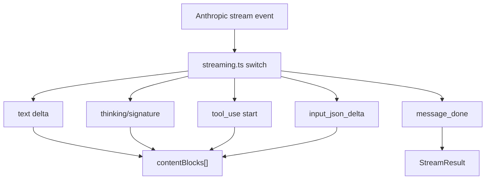

<details>
<summary>相关源文件</summary>

生成本页时使用的主要源文件：

- [src/services/api/client.ts](../../../project-repos/easy-agent/src/services/api/client.ts)
- [src/services/api/streaming.ts](../../../project-repos/easy-agent/src/services/api/streaming.ts)
- [src/types/message.ts](../../../project-repos/easy-agent/src/types/message.ts)
- [src/utils/loadEnv.ts](../../../project-repos/easy-agent/src/utils/loadEnv.ts)
- [src/utils/streamDebug.ts](../../../project-repos/easy-agent/src/utils/streamDebug.ts)
- [src/scripts/test-streaming.ts](../../../project-repos/easy-agent/src/scripts/test-streaming.ts)

</details>

# 模型通信与 Streaming

模型通信层封装 Anthropic-compatible Messages API。`client.ts` 负责默认模型、max tokens 和 SDK client 单例；`streaming.ts` 负责把 SDK streaming 事件转换为内部 `StreamEvent`，并组装最终 assistant message、usage 和 stop reason。  
Sources: [src/services/api/client.ts:1-22](../../../project-repos/easy-agent/src/services/api/client.ts#L1-L22), [src/services/api/client.ts:26-52](../../../project-repos/easy-agent/src/services/api/client.ts#L26-L52), [src/services/api/streaming.ts:1-9](../../../project-repos/easy-agent/src/services/api/streaming.ts#L1-L9), [src/services/api/streaming.ts:63-90](../../../project-repos/easy-agent/src/services/api/streaming.ts#L63-L90)

<details class="source-snippets">
<summary>引用源码</summary>

<!-- source-snippets:start -->

#### `src/services/api/client.ts:1-22`

```typescript
/**
 * API Client — Creates and manages the Anthropic API client instance.
 *
 * Mirrors the pattern in claude-code-source-code/src/services/api/client.ts:
 * - Reads API key from environment
 * - Configurable model and max tokens
 * - Single shared client instance (lazy init)
 *
 * We keep this intentionally simple — no Bedrock/Vertex/OAuth,
 * just direct Anthropic API via SDK.
 */

import Anthropic from "@anthropic-ai/sdk";

// ─── Default Configuration ─────────────────────────────────────────

export const DEFAULT_MODEL = process.env.ANTHROPIC_MODEL || "claude-sonnet-4-20250514";
export const CAPPED_DEFAULT_MAX_TOKENS = 8_000;
export const ESCALATED_MAX_TOKENS = 64_000;
export const COMPACT_MAX_OUTPUT_TOKENS = 20_000;
export const MAX_OUTPUT_TOKENS_RECOVERY_LIMIT = 3;
export const DEFAULT_MAX_TOKENS = CAPPED_DEFAULT_MAX_TOKENS;
```

#### `src/services/api/client.ts:26-52`

```typescript
let clientInstance: Anthropic | null = null;

/**
 * Get or create the Anthropic client instance.
 *
 * The SDK automatically reads `ANTHROPIC_AUTH_TOKEN` from the environment.
 * Optionally pass `apiKey` to override.
 */
export function getAnthropicClient(options?: {
  apiKey?: string;
  baseURL?: string;
}): Anthropic {
  if (clientInstance && !options) {
    return clientInstance;
  }

  const client = new Anthropic({
    apiKey: options?.apiKey ?? process.env.ANTHROPIC_AUTH_TOKEN,
    baseURL: options?.baseURL ?? process.env.ANTHROPIC_BASE_URL,
  });

  if (!options) {
    clientInstance = client;
  }

  return client;
}
```

#### `src/services/api/streaming.ts:1-9`

```typescript
/**
 * Streaming — AsyncGenerator wrapper over the Anthropic streaming API.
 *
 * Reference: claude-code-source-code/src/services/api/claude.ts
 * The original iterates `for await (const part of stream)` and switches
 * on `part.type` (message_start, content_block_start, content_block_delta,
 * content_block_stop, message_delta, message_stop). We replicate that
 * pattern but yield our own simplified StreamEvent union.
 */
```

#### `src/services/api/streaming.ts:63-90`

```typescript
export async function* streamMessage(
  params: StreamRequestParams,
): AsyncGenerator<StreamEvent, StreamResult> {
  const client = getAnthropicClient();
  const model = params.model ?? DEFAULT_MODEL;
  const maxTokens = params.maxTokens ?? DEFAULT_MAX_TOKENS;

  // Build the API request
  const requestParams: Anthropic.MessageCreateParamsStreaming = {
    model,
    max_tokens: maxTokens,
    messages: params.messages,
    stream: true,
    ...(params.system && { system: params.system }),
    ...(params.tools && params.tools.length > 0 && { tools: params.tools }),
  };

  // Initiate the stream
  const stream = client.messages.stream(requestParams, {
    signal: params.signal,
  });

  // State accumulators — mirrors the pattern in claude.ts.
  //
  // IMPORTANT: tool_use input JSON must be tracked *per content-block index*.
  // A single shared string breaks as soon as two tool_use blocks overlap —
  // e.g. provider emits `content_block_start` for block 1 before the
  // `content_block_stop` of block 0. In that case the shared buffer gets
```

<!-- source-snippets:end -->
</details>
## 环境加载

CLI 启动时先调用 `loadEnv()`。它按低到高优先级合并 `~/.claude.json`、`~/.claude/settings.json` 和当前工作目录 `.env`，其中 `.env` 使用 `dotenv.config({ override: true })` 覆盖前者。  
Sources: [src/entrypoint/cli.ts:1-3](../../../project-repos/easy-agent/src/entrypoint/cli.ts#L1-L3), [src/utils/loadEnv.ts:1-14](../../../project-repos/easy-agent/src/utils/loadEnv.ts#L1-L14), [src/utils/loadEnv.ts:37-50](../../../project-repos/easy-agent/src/utils/loadEnv.ts#L37-L50)

<details class="source-snippets">
<summary>引用源码</summary>

<!-- source-snippets:start -->

#### `src/entrypoint/cli.ts:1-3`

```typescript
#!/usr/bin/env node
import { loadEnv } from "../utils/loadEnv.js";
loadEnv();
```

#### `src/utils/loadEnv.ts:1-14`

```typescript
/**
 * loadEnv — Multi-source environment variable loader.
 *
 * Loads env vars from multiple sources with increasing priority
 * (later sources override earlier ones):
 *
 *   1. ~/.claude.json        → global config `env` field
 *   2. ~/.claude/settings.json → user settings `env` field
 *   3. .env (cwd)            → project-local dotenv file
 *
 * This mirrors how claude-code-source-code handles env loading
 * via Object.assign (higher priority overwrites lower), while
 * keeping the simplicity of dotenv for project-local overrides.
 */
```

#### `src/utils/loadEnv.ts:37-50`

```typescript
export function loadEnv(): void {
  const home = process.env.HOME || "~";

  // 1. ~/.claude.json (lowest priority)
  const globalConfigEnv = readJsonEnv(path.join(home, ".claude.json"));
  Object.assign(process.env, globalConfigEnv);

  // 2. ~/.claude/settings.json
  const settingsEnv = readJsonEnv(path.join(home, ".claude", "settings.json"));
  Object.assign(process.env, settingsEnv);

  // 3. .env file (highest priority — project-local overrides everything)
  dotenv.config({ override: true });
}
```

<!-- source-snippets:end -->
</details>
客户端默认读取这些环境变量：

| 变量 | 用途 |
|------|------|
| `ANTHROPIC_MODEL` | 覆盖默认模型 |
| `ANTHROPIC_AUTH_TOKEN` | API token |
| `ANTHROPIC_BASE_URL` | Anthropic-compatible endpoint |
| `EASY_AGENT_DEBUG_STREAM` | 打开 streaming raw event 日志 |

Sources: [src/services/api/client.ts:17-22](../../../project-repos/easy-agent/src/services/api/client.ts#L17-L22), [src/services/api/client.ts:34-45](../../../project-repos/easy-agent/src/services/api/client.ts#L34-L45), [src/utils/streamDebug.ts:1-20](../../../project-repos/easy-agent/src/utils/streamDebug.ts#L1-L20)

<details class="source-snippets">
<summary>引用源码</summary>

<!-- source-snippets:start -->

#### `src/services/api/client.ts:17-22`

```typescript
export const DEFAULT_MODEL = process.env.ANTHROPIC_MODEL || "claude-sonnet-4-20250514";
export const CAPPED_DEFAULT_MAX_TOKENS = 8_000;
export const ESCALATED_MAX_TOKENS = 64_000;
export const COMPACT_MAX_OUTPUT_TOKENS = 20_000;
export const MAX_OUTPUT_TOKENS_RECOVERY_LIMIT = 3;
export const DEFAULT_MAX_TOKENS = CAPPED_DEFAULT_MAX_TOKENS;
```

#### `src/services/api/client.ts:34-45`

```typescript
export function getAnthropicClient(options?: {
  apiKey?: string;
  baseURL?: string;
}): Anthropic {
  if (clientInstance && !options) {
    return clientInstance;
  }

  const client = new Anthropic({
    apiKey: options?.apiKey ?? process.env.ANTHROPIC_AUTH_TOKEN,
    baseURL: options?.baseURL ?? process.env.ANTHROPIC_BASE_URL,
  });
```

#### `src/utils/streamDebug.ts:1-20`

```typescript
/**
 * Stream debug logger.
 *
 * Opt-in via the `EASY_AGENT_DEBUG_STREAM=1` environment variable.
 * When enabled, every raw SSE event — plus request / assembled / error
 * markers — is appended as a single-line JSON record to
 * `~/.easy-agent/stream-debug.log`.
 *
 * This is invaluable when debugging Anthropic-compatible endpoints
 * (MiniMax, LiteLLM, OpenAI → Anthropic shims, etc.) whose streaming
 * translation often mis-handles tool_use or thinking blocks.
 *
 * Keep this file dependency-free and side-effect-safe: logging must
 * never throw or affect the stream itself.
 */

import { appendFileSync, mkdirSync } from "node:fs";
import { getEasyAgentHome, getStreamDebugLogPath } from "./paths.js";

const DEBUG_STREAM = process.env.EASY_AGENT_DEBUG_STREAM === "1";
```

<!-- source-snippets:end -->
</details>
## Streaming 事件模型

内部消息类型接近 Anthropic content block：text、tool_use、tool_result、thinking。Stream event 包括 text delta、tool_use_start、tool_use_input、message_start、message_done 和 error。  
Sources: [src/types/message.ts:10-45](../../../project-repos/easy-agent/src/types/message.ts#L10-L45), [src/types/message.ts:70-111](../../../project-repos/easy-agent/src/types/message.ts#L70-L111)

<details class="source-snippets">
<summary>引用源码</summary>

<!-- source-snippets:start -->

#### `src/types/message.ts:10-45`

```typescript
export interface TextBlock {
  type: "text";
  text: string;
}

export interface ToolUseBlock {
  type: "tool_use";
  id: string;
  name: string;
  input: Record<string, unknown>;
}

export interface ToolResultBlock {
  type: "tool_result";
  tool_use_id: string;
  content: string | ContentBlock[];
  is_error?: boolean;
}

/**
 * Extended-thinking content block, as streamed by Anthropic (and
 * Anthropic-compatible endpoints like MiniMax) when a model returns
 * internal reasoning.  The `signature` field is required by the API
 * when we echo the message back on the next turn.
 */
export interface ThinkingBlock {
  type: "thinking";
  thinking: string;
  signature?: string;
}

export type ContentBlock =
  | TextBlock
  | ToolUseBlock
  | ToolResultBlock
  | ThinkingBlock;
```

#### `src/types/message.ts:70-111`

```typescript
// ─── Stream Event Types ────────────────────────────────────────────

export interface StreamTextEvent {
  type: "text";
  text: string;
}

export interface StreamToolUseStartEvent {
  type: "tool_use_start";
  id: string;
  name: string;
}

export interface StreamToolUseInputEvent {
  type: "tool_use_input";
  id: string;
  partial_json: string;
}

export interface StreamMessageStartEvent {
  type: "message_start";
  messageId: string;
}

export interface StreamMessageDoneEvent {
  type: "message_done";
  stopReason: string;
  usage: Usage;
}

export interface StreamErrorEvent {
  type: "error";
  error: Error;
}

export type StreamEvent =
  | StreamTextEvent
  | StreamToolUseStartEvent
  | StreamToolUseInputEvent
  | StreamMessageStartEvent
  | StreamMessageDoneEvent
  | StreamErrorEvent;
```

<!-- source-snippets:end -->
</details>


Sources: [src/services/api/streaming.ts:109-156](../../../project-repos/easy-agent/src/services/api/streaming.ts#L109-L156), [src/services/api/streaming.ts:158-253](../../../project-repos/easy-agent/src/services/api/streaming.ts#L158-L253), [src/services/api/streaming.ts:282-290](../../../project-repos/easy-agent/src/services/api/streaming.ts#L282-L290)

<details class="source-snippets">
<summary>引用源码</summary>

<!-- source-snippets:start -->

#### `src/services/api/streaming.ts:109-156`

```typescript
    for await (const event of stream) {
      writeStreamDebug("event", event);
      switch (event.type) {
        // ── Message lifecycle ──────────────────────────────
        case "message_start": {
          messageId = event.message.id;
          // Capture initial usage (input token count + cache tokens)
          if (event.message.usage) {
            usage.input_tokens = event.message.usage.input_tokens;
            usage.output_tokens = event.message.usage.output_tokens;
            const u = event.message.usage as unknown as Record<string, unknown>;
            if (typeof u.cache_creation_input_tokens === "number") {
              usage.cache_creation_input_tokens = u.cache_creation_input_tokens;
            }
            if (typeof u.cache_read_input_tokens === "number") {
              usage.cache_read_input_tokens = u.cache_read_input_tokens;
            }
          }
          yield { type: "message_start", messageId };
          break;
        }

        case "message_delta": {
          // Final usage update + stop reason
          if (event.usage) {
            usage.output_tokens = event.usage.output_tokens;
            // Some providers (e.g. MiniMax) report input_tokens in message_delta
            // rather than message_start — pick it up as a fallback.
            const du = event.usage as unknown as Record<string, unknown>;
            if (typeof du.input_tokens === "number" && du.input_tokens > 0) {
              usage.input_tokens = du.input_tokens;
            }
            if (typeof du.cache_creation_input_tokens === "number") {
              usage.cache_creation_input_tokens = du.cache_creation_input_tokens;
            }
            if (typeof du.cache_read_input_tokens === "number") {
              usage.cache_read_input_tokens = du.cache_read_input_tokens;
            }
          }
          stopReason = event.delta.stop_reason ?? "";
          break;
        }

        case "message_stop": {
          // Stream complete — yield the final done event
          yield { type: "message_done", stopReason, usage };
          break;
        }
```

#### `src/services/api/streaming.ts:158-253`

```typescript
        // ── Content block lifecycle ────────────────────────
        case "content_block_start": {
          const index = event.index;

          if (event.content_block.type === "text") {
            contentBlocks[index] = {
              type: "text",
              text: "",
            };
          } else if (event.content_block.type === "thinking") {
            // Preserve thinking blocks so we can echo them (with their
            // signature) back to the model on the next turn. Some providers
            // (e.g. MiniMax) and Anthropic's extended-thinking mode will
            // behave erratically — duplicating tool calls or emitting empty
            // inputs — if the prior turn's thinking is missing from history.
            const tb = event.content_block as { thinking?: string };
            contentBlocks[index] = {
              type: "thinking",
              thinking: tb.thinking ?? "",
            };
          } else if (event.content_block.type === "tool_use") {
            const block = event.content_block;
            // Some providers pre-populate the full input object on start
            // instead of streaming it via input_json_delta. Preserve whatever
            // is already there so we don't overwrite a valid non-empty input
            // with `{}` at content_block_stop.
            const seedInput =
              block.input && typeof block.input === "object"
                ? (block.input as Record<string, unknown>)
                : {};
            contentBlocks[index] = {
              type: "tool_use",
              id: block.id,
              name: block.name,
              input: seedInput,
            };
            toolInputJsonByIndex.set(index, "");
            yield { type: "tool_use_start", id: block.id, name: block.name };
          }
          break;
        }

        case "content_block_delta": {
          const delta = event.delta;
          const index = event.index;

          if (delta.type === "text_delta") {
            // Accumulate text
            const block = contentBlocks[index] as TextBlock;
            block.text += delta.text;
            yield { type: "text", text: delta.text };
          } else if ((delta as { type: string }).type === "thinking_delta") {
            const block = contentBlocks[index] as ThinkingBlock | undefined;
            if (block && block.type === "thinking") {
              block.thinking += (delta as unknown as { thinking: string }).thinking ?? "";
            }
          } else if ((delta as { type: string }).type === "signature_delta") {
            const block = contentBlocks[index] as ThinkingBlock | undefined;
            if (block && block.type === "thinking") {
              const sig = (delta as unknown as { signature: string }).signature;
              block.signature = (block.signature ?? "") + (sig ?? "");
            }
          } else if (delta.type === "input_json_delta") {
            // Accumulate tool input JSON **per block index** — blocks may
            // overlap on some providers, so we must never share one buffer.
            const prev = toolInputJsonByIndex.get(index) ?? "";
            toolInputJsonByIndex.set(index, prev + delta.partial_json);
            const idBlock = contentBlocks[index];
            if (idBlock && idBlock.type === "tool_use") {
              yield {
                   type: "tool_use_input",
                id: (idBlock as ToolUseBlock).id,
                partial_json: delta.partial_json,
              };
            }
          }
          break;
        }

        case "content_block_stop": {
          const index = event.index;
          const block = contentBlocks[index];
          const accumulated = toolInputJsonByIndex.get(index);
          if (block && block.type === "tool_use" && accumulated) {
            try {
              block.input = JSON.parse(accumulated);
            } catch {
              // Keep the raw string so callers can surface it for debugging
              // rather than silently pretending the call had no input.
              block.input = { _raw: accumulated };
            }
          }
          toolInputJsonByIndex.delete(index);
          break;
        }
      }
```

#### `src/services/api/streaming.ts:282-290`

```typescript
  // Return the fully assembled assistant message
  return {
    assistantMessage: {
      role: "assistant",
      content: contentBlocks.filter((block): block is ContentBlock => Boolean(block)),
    },
    usage,
    stopReason,
  };
```

<!-- source-snippets:end -->
</details>
## Tool Input 组装

`streamMessage()` 用 `toolInputJsonByIndex` 为每个 content block index 保存独立 JSON buffer，避免多个 `tool_use` block 交错 streaming 时共用字符串导致输入错配或丢失。`content_block_stop` 时尝试 JSON.parse，失败则保留 `_raw` 便于调试。  
Sources: [src/services/api/streaming.ts:85-94](../../../project-repos/easy-agent/src/services/api/streaming.ts#L85-L94), [src/services/api/streaming.ts:178-195](../../../project-repos/easy-agent/src/services/api/streaming.ts#L178-L195), [src/services/api/streaming.ts:220-250](../../../project-repos/easy-agent/src/services/api/streaming.ts#L220-L250)

<details class="source-snippets">
<summary>引用源码</summary>

<!-- source-snippets:start -->

#### `src/services/api/streaming.ts:85-94`

```typescript
  // State accumulators — mirrors the pattern in claude.ts.
  //
  // IMPORTANT: tool_use input JSON must be tracked *per content-block index*.
  // A single shared string breaks as soon as two tool_use blocks overlap —
  // e.g. provider emits `content_block_start` for block 1 before the
  // `content_block_stop` of block 0. In that case the shared buffer gets
  // reset / cross-populated and tools end up with empty or swapped inputs.
  const contentBlocks: ContentBlock[] = [];
  const toolInputJsonByIndex = new Map<number, string>();
  let messageId = "";
```

#### `src/services/api/streaming.ts:178-195`

```typescript
          } else if (event.content_block.type === "tool_use") {
            const block = event.content_block;
            // Some providers pre-populate the full input object on start
            // instead of streaming it via input_json_delta. Preserve whatever
            // is already there so we don't overwrite a valid non-empty input
            // with `{}` at content_block_stop.
            const seedInput =
              block.input && typeof block.input === "object"
                ? (block.input as Record<string, unknown>)
                : {};
            contentBlocks[index] = {
              type: "tool_use",
              id: block.id,
              name: block.name,
              input: seedInput,
            };
            toolInputJsonByIndex.set(index, "");
            yield { type: "tool_use_start", id: block.id, name: block.name };
```

#### `src/services/api/streaming.ts:220-250`

```typescript
          } else if (delta.type === "input_json_delta") {
            // Accumulate tool input JSON **per block index** — blocks may
            // overlap on some providers, so we must never share one buffer.
            const prev = toolInputJsonByIndex.get(index) ?? "";
            toolInputJsonByIndex.set(index, prev + delta.partial_json);
            const idBlock = contentBlocks[index];
            if (idBlock && idBlock.type === "tool_use") {
              yield {
                   type: "tool_use_input",
                id: (idBlock as ToolUseBlock).id,
                partial_json: delta.partial_json,
              };
            }
          }
          break;
        }

        case "content_block_stop": {
          const index = event.index;
          const block = contentBlocks[index];
          const accumulated = toolInputJsonByIndex.get(index);
          if (block && block.type === "tool_use" && accumulated) {
            try {
              block.input = JSON.parse(accumulated);
            } catch {
              // Keep the raw string so callers can surface it for debugging
              // rather than silently pretending the call had no input.
              block.input = { _raw: accumulated };
            }
          }
          toolInputJsonByIndex.delete(index);
```

<!-- source-snippets:end -->
</details>
## Thinking Block 保留

当 provider 返回 `thinking` 或 `signature_delta`，实现会把 thinking block 和 signature 保留进 content history。注释说明这是为了兼容 extended-thinking 和 Anthropic-compatible endpoint，否则后续 turn 可能重复 tool call 或产生空输入。  
Sources: [src/services/api/streaming.ts:167-177](../../../project-repos/easy-agent/src/services/api/streaming.ts#L167-L177), [src/services/api/streaming.ts:209-219](../../../project-repos/easy-agent/src/services/api/streaming.ts#L209-L219)

<details class="source-snippets">
<summary>引用源码</summary>

<!-- source-snippets:start -->

#### `src/services/api/streaming.ts:167-177`

```typescript
          } else if (event.content_block.type === "thinking") {
            // Preserve thinking blocks so we can echo them (with their
            // signature) back to the model on the next turn. Some providers
            // (e.g. MiniMax) and Anthropic's extended-thinking mode will
            // behave erratically — duplicating tool calls or emitting empty
            // inputs — if the prior turn's thinking is missing from history.
            const tb = event.content_block as { thinking?: string };
            contentBlocks[index] = {
              type: "thinking",
              thinking: tb.thinking ?? "",
            };
```

#### `src/services/api/streaming.ts:209-219`

```typescript
          } else if ((delta as { type: string }).type === "thinking_delta") {
            const block = contentBlocks[index] as ThinkingBlock | undefined;
            if (block && block.type === "thinking") {
              block.thinking += (delta as unknown as { thinking: string }).thinking ?? "";
            }
          } else if ((delta as { type: string }).type === "signature_delta") {
            const block = contentBlocks[index] as ThinkingBlock | undefined;
            if (block && block.type === "thinking") {
              const sig = (delta as unknown as { signature: string }).signature;
              block.signature = (block.signature ?? "") + (sig ?? "");
            }
```

<!-- source-snippets:end -->
</details>
## 非 streaming 调用

`createMessage()` 提供一次性调用，主要供内部任务使用，例如上下文压缩生成 summary。它接受和 streaming 类似的参数，但不带 AbortSignal，并把 response content 映射回内部 content block。  
Sources: [src/services/api/streaming.ts:293-346](../../../project-repos/easy-agent/src/services/api/streaming.ts#L293-L346), [src/context/compaction.ts:203-232](../../../project-repos/easy-agent/src/context/compaction.ts#L203-L232)

<details class="source-snippets">
<summary>引用源码</summary>

<!-- source-snippets:start -->

#### `src/services/api/streaming.ts:293-346`

```typescript
// ─── Convenience: Non-streaming single-shot ────────────────────────

/**
 * Simple non-streaming call for quick one-off requests.
 * Useful for internal tasks (compaction, classification) where
 * we don't need incremental output.
 */
export async function createMessage(
  params: Omit<StreamRequestParams, "signal">,
): Promise<{ content: ContentBlock[]; usage: Usage; stopReason: string }> {
  const client = getAnthropicClient();
  const model = params.model ?? DEFAULT_MODEL;
  const maxTokens = params.maxTokens ?? DEFAULT_MAX_TOKENS;

  const response = await client.messages.create({
    model,
    max_tokens: maxTokens,
    messages: params.messages,
    ...(params.system && { system: params.system }),
    ...(params.tools && params.tools.length > 0 && { tools: params.tools }),
  });

  const contentBlocks: ContentBlock[] = response.content.map((block) => {
    if (block.type === "text") {
      return { type: "text" as const, text: block.text };
    } else if (block.type === "tool_use") {
      return {
        type: "tool_use" as const,
        id: block.id,
        name: block.name,
        input: block.input as Record<string, unknown>,
      };
    }
    return { type: "text" as const, text: "" };
  });

  const usageResult: Usage = {
    input_tokens: response.usage.input_tokens,
    output_tokens: response.usage.output_tokens,
  };
  const ru = response.usage as unknown as Record<string, unknown>;
  if (typeof ru.cache_creation_input_tokens === "number") {
    usageResult.cache_creation_input_tokens = ru.cache_creation_input_tokens;
  }
  if (typeof ru.cache_read_input_tokens === "number") {
    usageResult.cache_read_input_tokens = ru.cache_read_input_tokens;
  }

  return {
    content: contentBlocks,
    usage: usageResult,
    stopReason: response.stop_reason ?? "end_turn",
  };
}
```

#### `src/context/compaction.ts:203-232`

```typescript
async function summarizeMessages(messages: MessageParam[], focus?: string): Promise<string> {
  const extraInstruction = focus ? `\n\n## Compact Instructions\n${focus}` : "";
  debugLog("compact", "summary_request", { messageCount: messages.length, focus: focus ?? null });

  const response = await createMessage({
    model: process.env.ANTHROPIC_MODEL,
    maxTokens: 8000,
    system: NO_TOOLS_PREAMBLE + BASE_COMPACT_PROMPT + extraInstruction,
    messages: [
      {
        role: "user",
        content: `Conversation to summarize:\n${JSON.stringify(messages, null, 2)}`,
      },
    ],
  });

  const text = response.content
    .filter((block) => block.type === "text")
    .map((block) => block.text)
    .join("\n")
    .trim();

  debugLog("compact", "summary_response", {
    stopReason: response.stopReason,
    inputTokens: response.usage.input_tokens,
    outputTokens: response.usage.output_tokens,
    summaryLength: text.length,
  });

  return text;
```

<!-- source-snippets:end -->
</details>
## Debug 日志

`writeStreamDebug()` 在 `EASY_AGENT_DEBUG_STREAM=1` 时向 `~/.easy-agent/stream-debug.log` 追加 JSONL，记录 request、raw event、assembled 和 error。日志函数吞掉自身错误，避免调试日志影响模型通信。  
Sources: [src/utils/streamDebug.ts:1-15](../../../project-repos/easy-agent/src/utils/streamDebug.ts#L1-L15), [src/utils/streamDebug.ts:20-47](../../../project-repos/easy-agent/src/utils/streamDebug.ts#L20-L47), [src/services/api/streaming.ts:102-110](../../../project-repos/easy-agent/src/services/api/streaming.ts#L102-L110), [src/services/api/streaming.ts:264-280](../../../project-repos/easy-agent/src/services/api/streaming.ts#L264-L280)

<details class="source-snippets">
<summary>引用源码</summary>

<!-- source-snippets:start -->

#### `src/utils/streamDebug.ts:1-15`

```typescript
/**
 * Stream debug logger.
 *
 * Opt-in via the `EASY_AGENT_DEBUG_STREAM=1` environment variable.
 * When enabled, every raw SSE event — plus request / assembled / error
 * markers — is appended as a single-line JSON record to
 * `~/.easy-agent/stream-debug.log`.
 *
 * This is invaluable when debugging Anthropic-compatible endpoints
 * (MiniMax, LiteLLM, OpenAI → Anthropic shims, etc.) whose streaming
 * translation often mis-handles tool_use or thinking blocks.
 *
 * Keep this file dependency-free and side-effect-safe: logging must
 * never throw or affect the stream itself.
 */
```

#### `src/utils/streamDebug.ts:20-47`

```typescript
const DEBUG_STREAM = process.env.EASY_AGENT_DEBUG_STREAM === "1";

let cachedLogPath: string | null = null;

function resolveLogPath(): string {
  if (cachedLogPath) return cachedLogPath;
  try {
    mkdirSync(getEasyAgentHome(), { recursive: true });
  } catch {
    /* ignore — appendFileSync will surface any real failure */
  }
  cachedLogPath = getStreamDebugLogPath();
  return cachedLogPath;
}

/**
 * Append a single JSON record to the debug log. Safe to call when
 * debug mode is off — it becomes a no-op.
 */
export function writeStreamDebug(kind: string, payload: unknown): void {
  if (!DEBUG_STREAM) return;
  try {
    const line = JSON.stringify({ ts: new Date().toISOString(), kind, payload }) + "\n";
    appendFileSync(resolveLogPath(), line);
  } catch {
    /* swallow — logging must never break the stream */
  }
}
```

#### `src/services/api/streaming.ts:102-110`

```typescript
  writeStreamDebug("request", {
    model,
    messageCount: params.messages.length,
    toolNames: params.tools?.map((t) => t.name),
  });

  try {
    for await (const event of stream) {
      writeStreamDebug("event", event);
```

#### `src/services/api/streaming.ts:264-280`

```typescript
  writeStreamDebug("assembled", {
    stopReason,
    blockCount: contentBlocks.filter(Boolean).length,
    blocks: contentBlocks.filter(Boolean).map((b) => {
      if (b.type === "tool_use") {
        return { type: "tool_use", id: b.id, name: b.name, input: b.input };
      }
      if (b.type === "thinking") {
        return {
          type: "thinking",
          length: (b as ThinkingBlock).thinking.length,
          hasSignature: Boolean((b as ThinkingBlock).signature),
        };
      }
      return { type: "text", length: (b as TextBlock).text.length };
    }),
  });
```

<!-- source-snippets:end -->
</details>
## 验证脚本

`src/scripts/test-streaming.ts` 是手动 smoke 脚本：检查 `ANTHROPIC_AUTH_TOKEN`，发起中文 prompt，逐字输出 text delta，并打印 stop reason、usage 和 content block 类型。  
Sources: [src/scripts/test-streaming.ts:5-14](../../../project-repos/easy-agent/src/scripts/test-streaming.ts#L5-L14), [src/scripts/test-streaming.ts:20-41](../../../project-repos/easy-agent/src/scripts/test-streaming.ts#L20-L41), [src/scripts/test-streaming.ts:43-100](../../../project-repos/easy-agent/src/scripts/test-streaming.ts#L43-L100)

<details class="source-snippets">
<summary>引用源码</summary>

<!-- source-snippets:start -->

#### `src/scripts/test-streaming.ts:5-14`

```typescript
 * Phase 1 verification script — Test LLM API streaming communication.
 *
 * Usage:
 *   ANTHROPIC_AUTH_TOKEN=sk-ant-... npx tsx src/scripts/test-streaming.ts
 *
 * Verifies:
 *   1. API connection works
 *   2. Streaming output displays character-by-character
 *   3. Token usage is correctly reported
 */
```

#### `src/scripts/test-streaming.ts:20-41`

```typescript
async function main(): Promise<void> {
  // ── Pre-flight check ──────────────────────────────────────────
  if (!process.env.ANTHROPIC_AUTH_TOKEN) {
    console.error(
      "\x1b[31m✗ ANTHROPIC_AUTH_TOKEN is not set.\x1b[0m\n" +
      "  Export it first:\n" +
      "  export ANTHROPIC_AUTH_TOKEN=sk-ant-...\n"
    );
    process.exit(1);
  }

  const userMessage = "用一句话介绍你自己，然后用三句话解释什么是 Agentic Loop。";

  console.log(`\x1b[90m── Model: ${DEFAULT_MODEL}\x1b[0m`);
  console.log(`\x1b[90m── User:  ${userMessage}\x1b[0m\n`);
  console.log("\x1b[36m▎ Assistant:\x1b[0m");

  // ── Stream the response ───────────────────────────────────────
  const generator = streamMessage({
    messages: [{ role: "user", content: userMessage }],
    system: "You are a helpful assistant. Reply concisely in Chinese.",
  });
```

#### `src/scripts/test-streaming.ts:43-100`

```typescript
  let result;
  while (true) {
    const { value, done } = await generator.next();
    if (done) {
      result = value; // StreamResult from the generator return
      break;
    }

    const event = value as StreamEvent;

    switch (event.type) {
      case "text":
        // Write text deltas directly to stdout — the "typewriter effect"
        process.stdout.write(event.text);
        break;

      case "message_start":
        // Could show a spinner here later
        break;

      case "message_done":
        // Newline after streaming text
        console.log("\n");
        console.log("\x1b[90m── Stream complete ──\x1b[0m");
        console.log(`   Stop reason:   ${event.stopReason}`);
        console.log(`   Input tokens:  ${event.usage.input_tokens}`);
        console.log(`   Output tokens: ${event.usage.output_tokens}`);
        break;

      case "error":
        console.error(`\n\x1b[31m✗ Stream error: ${event.error.message}\x1b[0m`);
        process.exit(1);
    }
  }

  // ── Also show the return value ────────────────────────────────
  if (result) {
    console.log(`\n\x1b[90m── Assembled result ──\x1b[0m`);
    console.log(`   Stop reason:   ${result.stopReason}`);
    console.log(`   Total input:   ${result.usage.input_tokens} tokens`);
    console.log(`   Total output:  ${result.usage.output_tokens} tokens`);
    console.log(
      `   Content blocks: ${result.assistantMessage.content.length}`,
    );

    // Show block types
    if (Array.isArray(result.assistantMessage.content)) {
      for (const block of result.assistantMessage.content) {
        if (block.type === "text") {
          console.log(`   [text] ${block.text.slice(0, 80)}...`);
        } else if (block.type === "tool_use") {
          console.log(`   [tool_use] ${block.name}(${JSON.stringify(block.input)})`);
        }
      }
    }
  }

  console.log("\n\x1b[32m✓ Phase 1 verification passed!\x1b[0m");
```

<!-- source-snippets:end -->
</details>
## 相关页面

- [QueryEngine 与 Agentic Loop](query-engine-agentic-loop.md)
- [测试、构建与路线图](testing-and-roadmap.md)
- [上下文、记忆与压缩](context-memory-compaction.md)
