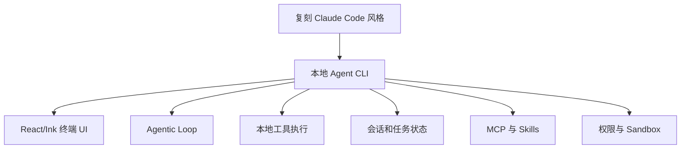
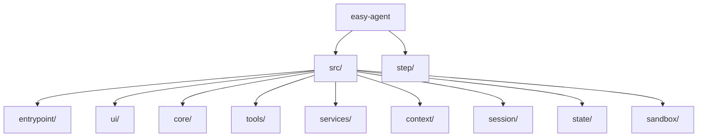

<details>
<summary>相关源文件</summary>

生成本页时使用的主要源文件：

- [README.md](../../../project-repos/easy-agent/README.md)
- [README.zh-CN.md](../../../project-repos/easy-agent/README.zh-CN.md)
- [package.json](../../../project-repos/easy-agent/package.json)
- [tsconfig.json](../../../project-repos/easy-agent/tsconfig.json)

</details>

# 项目概览

Easy Agent 是一个终端原生的本地 coding agent 复刻项目，目标是用 TypeScript 与 Node.js 重建 Claude Code 风格的工作流，而不是只提供单文件 demo 或 prompt wrapper。README 明确说它处于基础实现活跃开发阶段，并已经覆盖 CLI、streaming、工具执行、终端 UI、会话编排等基础层。  
Sources: [README.md:3-7](../../../project-repos/easy-agent/README.md#L3-L7), [README.md:23-29](../../../project-repos/easy-agent/README.md#L23-L29)

<details class="source-snippets">
<summary>引用源码</summary>

<!-- source-snippets:start -->

#### `README.md:3-7`

```markdown
An open-source, terminal-native project to fully recreate the Claude Code experience from the ground up.

Easy Agent is a long-horizon engineering project focused on rebuilding a complete local agentic coding system in TypeScript and Node.js. The goal is not to publish isolated demos, but to incrementally construct a production-style coding agent with a clean architecture, strong safety boundaries, multi-turn orchestration, local tool execution, and the extensibility required for a full Claude Code-class developer experience.

This repository is the open-source implementation track of that effort. Full documentation will be added over time. For now, this README focuses on the project itself: what it aims to become, how it is structured, and where implementation currently stands.
```

#### `README.md:23-29`

```markdown
## Project Status

**Current stage:** foundational implementation in active development

The project already has meaningful groundwork across the CLI, streaming communication, tool execution, terminal UI, and session orchestration layers. At the same time, many advanced systems in the full recreation plan are still under active development.

Easy Agent should currently be understood as a serious open-source rebuild in progress rather than a finished end-user product.
```

<!-- source-snippets:end -->
</details>

## 定位与边界

项目定位可以概括为：**面向真实工程系统的本地 Agentic Coding CLI**。它强调五层架构、持久化、上下文压缩、MCP、Skills、Sandbox、任务系统等长期能力，但 README 也明确指出当前不是面向终端用户完全交付的成品。  
Sources: [README.md:11-22](../../../project-repos/easy-agent/README.md#L11-L22), [README.zh-CN.md:23-29](../../../project-repos/easy-agent/README.zh-CN.md#L23-L29)

<details class="source-snippets">
<summary>引用源码</summary>

<!-- source-snippets:start -->

#### `README.md:11-22`

```markdown
## Vision

Easy Agent aims to become a serious open-source recreation of a modern local coding agent system.

Core goals:

- Fully recreate the Claude Code-style workflow in an open-source codebase
- Keep the architecture layered, explicit, and extensible
- Prioritize real engineering systems over toy examples
- Evolve incrementally toward a complete local Agent CLI
- Preserve a stable path toward persistence, compaction, MCP, skills, sandboxing, sub-agents, multi-agent collaboration, and multi-provider support

```

#### `README.zh-CN.md:23-29`

```markdown
## 当前状态

**当前阶段：** 基础实现已经建立，项目正在持续推进

当前项目已经在 CLI、流式通信、工具执行、终端 UI、会话编排等方向完成了较有价值的基础建设。但完整复刻目标中的许多高级系统仍在持续开发中。

因此，当前的 Easy Agent 更适合被理解为一个正在稳步推进的开源复刻工程，而不是已经面向终端用户完全交付的成品。
```

<!-- source-snippets:end -->
</details>



Sources: [README.md:31-60](../../../project-repos/easy-agent/README.md#L31-L60), [README.md:83-121](../../../project-repos/easy-agent/README.md#L83-L121)

<details class="source-snippets">
<summary>引用源码</summary>

<!-- source-snippets:start -->

#### `README.md:31-60`

````markdown
## Architecture

Easy Agent is being built around a five-layer architecture:

```text
+---------------------------------------------------+
| 1. Interaction Layer                              |
|    Terminal UI, input handling, rendering         |
+---------------------------------------------------+
| 2. Orchestration Layer                            |
|    Multi-turn session flow, usage, commands       |
+---------------------------------------------------+
| 3. Core Agentic Loop                              |
|    Reason -> tool call -> observe -> continue     |
+---------------------------------------------------+
| 4. Tooling Layer                                  |
|    File, shell, search, and local actions         |
+---------------------------------------------------+
| 5. Model Communication Layer                      |
|    Streaming API communication with LLMs          |
+---------------------------------------------------+
```

This separation makes the system easier to evolve:

- the **communication layer** handles model I/O
- the **tool layer** exposes actionable capabilities
- the **agentic loop** drives single-turn autonomous execution
- the **orchestration layer** manages multi-turn state and control flow
- the **interaction layer** turns the runtime into a usable terminal product
````

#### `README.md:83-121`

```markdown
## Roadmap and Progress

The project follows a 30-phase roadmap designed to recreate the full Claude Code-style system progressively.

| Phase | Area | Core Code | Status |
|---|---|---|---:|
| 0 | Project scaffold | `planned in step series` | ✅ Done |
| 1 | LLM communication layer | [`step/step1.js`](./step/step1.js) | ✅ Done |
| 2 | React/Ink terminal UI | [`step/step2.js`](./step/step2.js) | ✅ Done |
| 3 | Tool interface and first tool | [`step/step3.js`](./step/step3.js) | ✅ Done |
| 4 | Core agentic loop | [`step/step4.js`](./step/step4.js) | ✅ Done |
| 5 | Complete core toolset | [`step/step5.js`](./step/step5.js) | ✅ Done |
| 6 | System prompt and context engineering | [`step/step6.js`](./step/step6.js) | ✅ Done |
| 7 | Permission control system | [`step/step7.js`](./step/step7.js) | ✅ Done |
| 8 | QueryEngine multi-turn orchestration | [`step/step8.js`](./step/step8.js) | ✅ Done |
| 9 | Session persistence and restore | [`step/step9.js`](./step/step9.js) | ✅ Done |
| 10 | Project memory system | [`step/step10.js`](./step/step10.js) | ✅ Done |
| 11 | Context compaction | [`step/step11.js`](./step/step11.js) | ✅ Done |
| 12 | Fine-grained token budget management | [`step/step12.js`](./step/step12.js) | ✅ Done |
| 13 | Plan mode | [`step/step13.js`](./step/step13.js) | ✅ Done |
| 14 | TodoWrite session task tracking | [`step/step14.js`](./step/step14.js) | ✅ Done |
| 15 | Task management system (V2) | [`step/step15.js`](./step/step15.js) | ✅ Done |
| 16 | MCP protocol support | [`step/step16.js`](./step/step16.js) | ✅ Done |
| 17 | Skills system | [`step/step17.js`](./step/step17.js) | ✅ Done |
| 18 | Sandbox | [`step/step18.js`](./step/step18.js) | ✅ Done |
| 19 | Sub-agents | `planned` | ⏳ Not started |
| 20 | Custom agent system | `planned` | ⏳ Not started |
| 21 | Multi-agent collaboration | `planned` | ⏳ Not started |
| 22 | Hooks lifecycle system | `planned` | ⏳ Not started |
| 23 | Terminal UI upgrades | `planned in step series` | 🚧 Partial |
| 24 | Configuration system improvements | `planned in step series` | 🚧 Partial |
| 25 | File history and rollback | `planned` | ⏳ Not started |
| 26 | Error handling and resilience | `planned in step series` | 🚧 Partial |
| 27 | Pipe mode / non-interactive execution | `planned` | ⏳ Not started |
| 28 | Auto mode | `planned in step series` | 🚧 Partial |
| 29 | Multi-provider support | `planned in step series` | ⏳ Not started |
| 30 | Packaging, publishing, and documentation | `planned in step series` | 🚧 Partial |

The [`easy-agent/step/`](./step/) directory contains tutorial-friendly milestone code, so each completed chapter is directly learnable and reproducible from a focused single file.
```

<!-- source-snippets:end -->
</details>

## 技术栈与运行方式

仓库是 ESM TypeScript 项目，`bin.agent` 指向编译后的 `dist/entrypoint/cli.js`，开发入口是 `tsx src/entrypoint/cli.ts`，构建命令是 `tsc`。依赖显示它基于 Anthropic SDK、MCP SDK、React/Ink、dotenv、proper-lockfile、yaml 和 ignore。  
Sources: [package.json:2-20](../../../project-repos/easy-agent/package.json#L2-L20), [package.json:29-46](../../../project-repos/easy-agent/package.json#L29-L46)

<details class="source-snippets">
<summary>引用源码</summary>

<!-- source-snippets:start -->

#### `package.json:2-20`

```json
  "name": "easy-agent",
  "version": "0.1.0",
  "description": "A terminal-native agentic coding system",
  "type": "module",
  "main": "dist/entrypoint/cli.js",
  "bin": {
    "agent": "dist/entrypoint/cli.js"
  },
  "scripts": {
    "dev": "tsx src/entrypoint/cli.ts",
    "build": "tsc",
    "start": "node dist/entrypoint/cli.js",
    "test:streaming": "tsx src/scripts/test-streaming.ts",
    "test:tasks": "tsx src/scripts/test-tasks.ts",
    "test:mcp": "tsx src/scripts/test-mcp.ts",
    "test:skills": "tsx src/scripts/test-skills.ts",
    "test:sandbox": "tsx src/scripts/test-sandbox.ts",
    "smoke:sandbox": "tsx src/scripts/smoke-sandbox.ts",
    "smoke:bash-sandbox": "tsx src/scripts/smoke-bash-sandbox.ts"
```

#### `package.json:29-46`

```json
  "devDependencies": {
    "@types/node": "^25.5.2",
    "@types/proper-lockfile": "^4.1.4",
    "@types/react": "^19.2.14",
    "tsx": "^4.21.0",
    "typescript": "^6.0.2"
  },
  "dependencies": {
    "@anthropic-ai/sdk": "^0.85.0",
    "@modelcontextprotocol/sdk": "^1.29.0",
    "chalk": "^5.6.2",
    "dotenv": "^17.4.1",
    "ignore": "^7.0.5",
    "ink": "^7.0.0",
    "proper-lockfile": "^4.1.2",
    "react": "^19.2.4",
    "yaml": "^2.8.3"
  }
```

<!-- source-snippets:end -->
</details>

TypeScript 配置使用 `NodeNext` 模块系统、`ES2022` target、`strict: true`、React JSX、声明文件和 sourcemap 输出。  
Sources: [tsconfig.json:2-20](../../../project-repos/easy-agent/tsconfig.json#L2-L20)

<details class="source-snippets">
<summary>引用源码</summary>

<!-- source-snippets:start -->

#### `tsconfig.json:2-20`

```json
  "compilerOptions": {
    "target": "ES2022",
    "module": "NodeNext",
    "moduleResolution": "NodeNext",
    "outDir": "dist",
    "rootDir": "src",
    "strict": true,
    "jsx": "react-jsx",
    "esModuleInterop": true,
    "allowSyntheticDefaultImports": true,
    "resolveJsonModule": true,
    "skipLibCheck": true,
    "types": ["node"],
    "declaration": true,
    "declarationMap": true,
    "sourceMap": true
  },
  "include": ["src/**/*.ts", "src/**/*.tsx"],
  "exclude": ["node_modules", "dist"]
```

<!-- source-snippets:end -->
</details>

| 维度 | 证据 | 说明 |
|------|------|------|
| 语言 | `package.json` + `tsconfig.json` | TypeScript、ESM、NodeNext |
| UI | `ink`, `react` | 终端 React 渲染 |
| 模型通信 | `@anthropic-ai/sdk` | Anthropic-compatible Messages API |
| 扩展 | `@modelcontextprotocol/sdk`, `yaml`, `ignore` | MCP 与 Skills |
| 本地状态 | `proper-lockfile` | Task V2 并发写保护 |

Sources: [package.json:36-46](../../../project-repos/easy-agent/package.json#L36-L46), [tsconfig.json:2-20](../../../project-repos/easy-agent/tsconfig.json#L2-L20)

<details class="source-snippets">
<summary>引用源码</summary>

<!-- source-snippets:start -->

#### `package.json:36-46`

```json
  "dependencies": {
    "@anthropic-ai/sdk": "^0.85.0",
    "@modelcontextprotocol/sdk": "^1.29.0",
    "chalk": "^5.6.2",
    "dotenv": "^17.4.1",
    "ignore": "^7.0.5",
    "ink": "^7.0.0",
    "proper-lockfile": "^4.1.2",
    "react": "^19.2.4",
    "yaml": "^2.8.3"
  }
```

#### `tsconfig.json:2-20`

```json
  "compilerOptions": {
    "target": "ES2022",
    "module": "NodeNext",
    "moduleResolution": "NodeNext",
    "outDir": "dist",
    "rootDir": "src",
    "strict": true,
    "jsx": "react-jsx",
    "esModuleInterop": true,
    "allowSyntheticDefaultImports": true,
    "resolveJsonModule": true,
    "skipLibCheck": true,
    "types": ["node"],
    "declaration": true,
    "declarationMap": true,
    "sourceMap": true
  },
  "include": ["src/**/*.ts", "src/**/*.tsx"],
  "exclude": ["node_modules", "dist"]
```

<!-- source-snippets:end -->
</details>

## 仓库组织

README 给出的主结构与当前源文件一致：`entrypoint` 负责 CLI bootstrap，`ui` 负责 Ink 终端界面，`core` 放 agentic loop 与 query orchestration，`tools` 放本地工具和注册系统，`services/api` 放模型客户端与 streaming wrapper，`context/session/state/sandbox` 分别承载上下文、持久化、状态和安全边界。  
Sources: [README.md:62-80](../../../project-repos/easy-agent/README.md#L62-L80), [README.zh-CN.md:62-80](../../../project-repos/easy-agent/README.zh-CN.md#L62-L80)

<details class="source-snippets">
<summary>引用源码</summary>

<!-- source-snippets:start -->

#### `README.md:62-80`

````markdown
## Repository Layout

```text
easy-agent/
├── src/
│   ├── entrypoint/      # CLI bootstrap
│   ├── ui/              # React/Ink terminal interface
│   ├── core/            # agentic loop and query orchestration
│   ├── tools/           # local tools and tool registry
│   ├── services/api/    # model client and streaming wrapper
│   ├── permissions/     # permission and safety controls
│   ├── context/         # system prompt and context management
│   ├── session/         # session persistence and history
│   ├── types/           # shared domain types
│   └── utils/           # env, config, logging, helpers
├── package.json
├── tsconfig.json
├── README.md
└── README.zh-CN.md
````

#### `README.zh-CN.md:62-80`

````markdown
## 仓库结构

```text
easy-agent/
├── src/
│   ├── entrypoint/      # CLI 启动入口
│   ├── ui/              # React/Ink 终端界面
│   ├── core/            # agentic loop 与 query orchestration
│   ├── tools/           # 本地工具与工具注册系统
│   ├── services/api/    # 模型客户端与 streaming 包装
│   ├── permissions/     # 权限与安全控制
│   ├── context/         # system prompt 与上下文管理
│   ├── session/         # 会话持久化与历史
│   ├── types/           # 共享领域类型
│   └── utils/           # env、config、log、辅助函数
├── package.json
├── tsconfig.json
├── README.md
└── README.zh-CN.md
````

<!-- source-snippets:end -->
</details>



Sources: [README.md:62-80](../../../project-repos/easy-agent/README.md#L62-L80), [README.md:121-121](../../../project-repos/easy-agent/README.md#L121-L121)

<details class="source-snippets">
<summary>引用源码</summary>

<!-- source-snippets:start -->

#### `README.md:62-80`

````markdown
## Repository Layout

```text
easy-agent/
├── src/
│   ├── entrypoint/      # CLI bootstrap
│   ├── ui/              # React/Ink terminal interface
│   ├── core/            # agentic loop and query orchestration
│   ├── tools/           # local tools and tool registry
│   ├── services/api/    # model client and streaming wrapper
│   ├── permissions/     # permission and safety controls
│   ├── context/         # system prompt and context management
│   ├── session/         # session persistence and history
│   ├── types/           # shared domain types
│   └── utils/           # env, config, logging, helpers
├── package.json
├── tsconfig.json
├── README.md
└── README.zh-CN.md
````

#### `README.md:121-121`

```markdown
The [`easy-agent/step/`](./step/) directory contains tutorial-friendly milestone code, so each completed chapter is directly learnable and reproducible from a focused single file.
```

<!-- source-snippets:end -->
</details>

## 路线图状态

README 的路线图列出 30 个阶段，其中 1-18 已完成，19-22 等高级能力仍未开始，UI 升级、配置、错误处理、auto mode、发布文档等属于部分完成或待推进项。`step/` 目录保存教程化里程碑代码，便于把正式 `src/` 实现和单文件教学版本对照阅读。  
Sources: [README.md:83-121](../../../project-repos/easy-agent/README.md#L83-L121), [README.zh-CN.md:83-121](../../../project-repos/easy-agent/README.zh-CN.md#L83-L121)

<details class="source-snippets">
<summary>引用源码</summary>

<!-- source-snippets:start -->

#### `README.md:83-121`

```markdown
## Roadmap and Progress

The project follows a 30-phase roadmap designed to recreate the full Claude Code-style system progressively.

| Phase | Area | Core Code | Status |
|---|---|---|---:|
| 0 | Project scaffold | `planned in step series` | ✅ Done |
| 1 | LLM communication layer | [`step/step1.js`](./step/step1.js) | ✅ Done |
| 2 | React/Ink terminal UI | [`step/step2.js`](./step/step2.js) | ✅ Done |
| 3 | Tool interface and first tool | [`step/step3.js`](./step/step3.js) | ✅ Done |
| 4 | Core agentic loop | [`step/step4.js`](./step/step4.js) | ✅ Done |
| 5 | Complete core toolset | [`step/step5.js`](./step/step5.js) | ✅ Done |
| 6 | System prompt and context engineering | [`step/step6.js`](./step/step6.js) | ✅ Done |
| 7 | Permission control system | [`step/step7.js`](./step/step7.js) | ✅ Done |
| 8 | QueryEngine multi-turn orchestration | [`step/step8.js`](./step/step8.js) | ✅ Done |
| 9 | Session persistence and restore | [`step/step9.js`](./step/step9.js) | ✅ Done |
| 10 | Project memory system | [`step/step10.js`](./step/step10.js) | ✅ Done |
| 11 | Context compaction | [`step/step11.js`](./step/step11.js) | ✅ Done |
| 12 | Fine-grained token budget management | [`step/step12.js`](./step/step12.js) | ✅ Done |
| 13 | Plan mode | [`step/step13.js`](./step/step13.js) | ✅ Done |
| 14 | TodoWrite session task tracking | [`step/step14.js`](./step/step14.js) | ✅ Done |
| 15 | Task management system (V2) | [`step/step15.js`](./step/step15.js) | ✅ Done |
| 16 | MCP protocol support | [`step/step16.js`](./step/step16.js) | ✅ Done |
| 17 | Skills system | [`step/step17.js`](./step/step17.js) | ✅ Done |
| 18 | Sandbox | [`step/step18.js`](./step/step18.js) | ✅ Done |
| 19 | Sub-agents | `planned` | ⏳ Not started |
| 20 | Custom agent system | `planned` | ⏳ Not started |
| 21 | Multi-agent collaboration | `planned` | ⏳ Not started |
| 22 | Hooks lifecycle system | `planned` | ⏳ Not started |
| 23 | Terminal UI upgrades | `planned in step series` | 🚧 Partial |
| 24 | Configuration system improvements | `planned in step series` | 🚧 Partial |
| 25 | File history and rollback | `planned` | ⏳ Not started |
| 26 | Error handling and resilience | `planned in step series` | 🚧 Partial |
| 27 | Pipe mode / non-interactive execution | `planned` | ⏳ Not started |
| 28 | Auto mode | `planned in step series` | 🚧 Partial |
| 29 | Multi-provider support | `planned in step series` | ⏳ Not started |
| 30 | Packaging, publishing, and documentation | `planned in step series` | 🚧 Partial |

The [`easy-agent/step/`](./step/) directory contains tutorial-friendly milestone code, so each completed chapter is directly learnable and reproducible from a focused single file.
```

#### `README.zh-CN.md:83-121`

```markdown
## 路线图与当前进度

项目遵循一个 30 阶段路线图，以渐进方式完整复刻 Claude Code 风格系统。

| 阶段 | 模块 | 核心代码 | 状态 |
|---|---|---|---:|
| 0 | 项目脚手架 | `planned in step series` | ✅ 已完成 |
| 1 | LLM 通信层 | [`step/step1.js`](./step/step1.js) | ✅ 已完成 |
| 2 | React/Ink 终端 UI | [`step/step2.js`](./step/step2.js) | ✅ 已完成 |
| 3 | Tool 接口与第一个工具 | [`step/step3.js`](./step/step3.js) | ✅ 已完成 |
| 4 | 核心 Agentic Loop | [`step/step4.js`](./step/step4.js) | ✅ 已完成 |
| 5 | 完整核心工具集 | [`step/step5.js`](./step/step5.js) | ✅ 已完成 |
| 6 | System Prompt 与上下文工程 | [`step/step6.js`](./step/step6.js) | ✅ 已完成 |
| 7 | 权限控制系统 | [`step/step7.js`](./step/step7.js) | ✅ 已完成 |
| 8 | QueryEngine 多轮编排 | [`step/step8.js`](./step/step8.js) | ✅ 已完成 |
| 9 | 会话持久化与恢复 | [`step/step9.js`](./step/step9.js) | ✅ 已完成 |
| 10 | 项目记忆系统 | [`step/step10.js`](./step/step10.js) | ✅ 已完成 |
| 11 | 上下文压缩 | [`step/step11.js`](./step/step11.js) | ✅ 已完成 |
| 12 | Token 预算精细管理 | [`step/step12.js`](./step/step12.js) | ✅ 已完成 |
| 13 | Plan Mode | [`step/step13.js`](./step/step13.js) | ✅ 已完成 |
| 14 | TodoWrite 会话任务跟踪 | [`step/step14.js`](./step/step14.js) | ✅ 已完成 |
| 15 | 任务管理系统（V2） | [`step/step15.js`](./step/step15.js) | ✅ 已完成 |
| 16 | MCP 协议支持 | [`step/step16.js`](./step/step16.js) | ✅ 已完成 |
| 17 | Skills 系统 | [`step/step17.js`](./step/step17.js) | ✅ 已完成 |
| 18 | Sandbox | [`step/step18.js`](./step/step18.js) | ✅ 已完成 |
| 19 | Sub-Agent | `planned` | ⏳ 未开始 |
| 20 | 自定义 Agent 系统 | `planned` | ⏳ 未开始 |
| 21 | 多 Agent 协作 | `planned` | ⏳ 未开始 |
| 22 | Hooks 生命周期系统 | `planned` | ⏳ 未开始 |
| 23 | 终端 UI 升级 | `planned in step series` | 🚧 部分完成 |
| 24 | 配置系统完善 | `planned in step series` | 🚧 部分完成 |
| 25 | 文件历史与回滚 | `planned` | ⏳ 未开始 |
| 26 | 错误处理与韧性 | `planned in step series` | 🚧 部分完成 |
| 27 | 管道模式 / 非交互执行 | `planned` | ⏳ 未开始 |
| 28 | Auto Mode | `planned in step series` | 🚧 部分完成 |
| 29 | 多 Provider 支持 | `planned in step series` | ⏳ 未开始 |
| 30 | 打包发布与文档 | `planned in step series` | 🚧 部分完成 |

[`easy-agent/step/`](./step/) 目录中已经补充了教程化的里程碑核心代码，意味着每个已完成章节都可以直接对照学习、逐步复刻。
```

<!-- source-snippets:end -->
</details>

## 阅读路线

| 目标 | 建议路径 |
|------|----------|
| 快速看全局 | [系统架构](system-architecture.md) |
| 追核心 turn | [QueryEngine 与 Agentic Loop](query-engine-agentic-loop.md) |
| 看模型通信 | [模型通信与 Streaming](model-streaming.md) |
| 看工具和权限 | [工具系统与权限模型](tools-permissions.md) |
| 看扩展能力 | [MCP 集成](mcp-integration.md)、[Skills 系统](skills-system.md) |
| 看持久状态 | [上下文、记忆与压缩](context-memory-compaction.md)、[会话持久化与任务系统](sessions-tasks.md) |
| 看安全质量 | [Sandbox 与安全边界](sandbox-security.md)、[测试、构建与路线图](testing-and-roadmap.md) |

## 相关页面

- [系统架构](system-architecture.md)
- [QueryEngine 与 Agentic Loop](query-engine-agentic-loop.md)
- [测试、构建与路线图](testing-and-roadmap.md)
