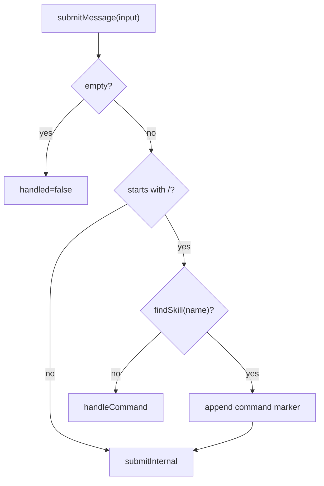
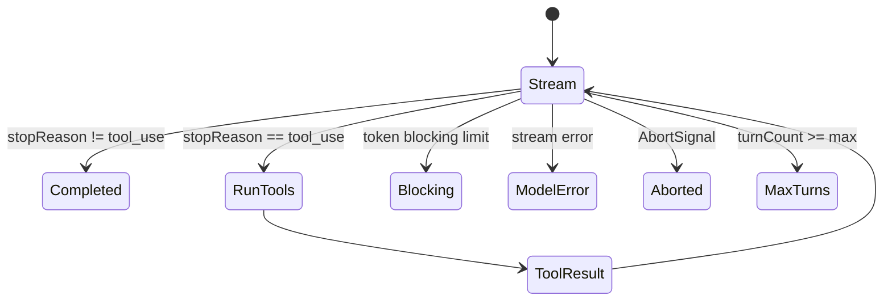

<details>
<summary>相关源文件</summary>

生成本页时使用的主要源文件：

- [src/core/queryEngine.ts](../../../project-repos/easy-agent/src/core/queryEngine.ts)
- [src/core/agenticLoop.ts](../../../project-repos/easy-agent/src/core/agenticLoop.ts)
- [src/tools/index.ts](../../../project-repos/easy-agent/src/tools/index.ts)
- [src/permissions/permissions.ts](../../../project-repos/easy-agent/src/permissions/permissions.ts)
- [src/context/planAttachments.ts](../../../project-repos/easy-agent/src/context/planAttachments.ts)
- [src/tools/enterPlanModeTool.ts](../../../project-repos/easy-agent/src/tools/enterPlanModeTool.ts)
- [src/tools/exitPlanModeTool.ts](../../../project-repos/easy-agent/src/tools/exitPlanModeTool.ts)

</details>

# QueryEngine 与 Agentic Loop

`QueryEngine` 是多轮会话控制器，`agenticLoop.query()` 是单次 agent turn 的执行引擎。前者负责用户输入、命令、上下文压缩、权限模式、usage 累加和 abort；后者负责 streaming、stop reason 判断、工具执行和 tool_result 回灌。  
Sources: [src/core/queryEngine.ts:75-102](../../../project-repos/easy-agent/src/core/queryEngine.ts#L75-L102), [src/core/queryEngine.ts:170-219](../../../project-repos/easy-agent/src/core/queryEngine.ts#L170-L219), [src/core/agenticLoop.ts:239-409](../../../project-repos/easy-agent/src/core/agenticLoop.ts#L239-L409)

<details class="source-snippets">
<summary>引用源码</summary>

<!-- source-snippets:start -->

#### `src/core/queryEngine.ts:75-102`

```typescript
export class QueryEngine {
  private messages: MessageParam[];
  private totalUsage: Usage;
  private readonly defaultModel: string;
  private sessionModelOverride: string | null = null;
  private readonly toolContext: ToolContext;
  private currentPermissionMode: PermissionMode;
  private prePlanMode: PermissionMode | null = null;
  private readonly permissionSettings?: PermissionSettings;
  private readonly sessionPermissionRules: PermissionRuleSet;
  private readonly onPermissionRequest?: (request: PermissionRequest) => Promise<PermissionDecision>;
  private abortController: AbortController | null = null;
  private usageAnchorIndex: number = -1;
  private lastCallUsage: Usage = { input_tokens: 0, output_tokens: 0 };
  private modeChangeCallback?: (mode: PermissionMode, previousMode: PermissionMode) => void;
  private needsPlanModeExitAttachment = false;

  constructor(options: QueryEngineOptions) {
    this.messages = [...(options.initialMessages ?? [])];
    this.totalUsage = { ...(options.initialUsage ?? createEmptyUsage()) };
    this.usageAnchorIndex = this.messages.length > 0 ? this.messages.length - 1 : -1;
    this.defaultModel = options.model;
    this.toolContext = options.toolContext;
    this.currentPermissionMode = options.permissionMode ?? "default";
    this.permissionSettings = options.permissionSettings;
    this.sessionPermissionRules = options.sessionPermissionRules ?? { allow: [], deny: [] };
    this.onPermissionRequest = options.onPermissionRequest;
  }
```

#### `src/core/queryEngine.ts:170-219`

```typescript
  async *submitMessage(
    input: string,
  ): AsyncGenerator<QueryEngineEvent, { handled: boolean; reason?: LoopTerminationReason }> {
    const trimmed = input.trim();
    if (!trimmed) {
      return { handled: false };
    }

    if (trimmed.startsWith("/")) {
      // User-invoked skill: `/skill-name [args]`. Resolve the skill against
      // the registry; if it matches, expand into the source's two-message
      // pattern and submit normally. Falls through to handleCommand() for
      // /help, /mcp, /clear, etc. when no skill matches.
      //
      // Source reference (claude-code-source-code/src/utils/processUserInput
      // /processSlashCommand.tsx ~ line 1237 `getMessagesForPromptSlashCommand`):
      //
      //   const messages = [
      //     createUserMessage({ content: metadata }),                  // visible bubble
      //     createUserMessage({ content: skillBody, isMeta: true }),   // hidden, model-only
      //     ...
      //   ]
      //
      // The metadata message wraps `<command-name>/foo</command-name>` +
      // `<command-message>foo</command-message>` + `<command-args>...</...>`
      // tags. The UI's `UserCommandMessage` extracts those tags and renders
      // a styled "❯ /foo args" command bubble that stays in the transcript
      // forever (unlike a transient SystemNotice). The body message is
      // marked `isMeta: true` so the UI hides it from the human view while
      // the model still receives it as a regular user prompt.
      //
      // We don't have an `isMeta` field on `MessageParam`, so we use a
      // string-prefix sentinel ("[skill_invocation:<name>]\n") for the body
      // and the source's exact XML format for the marker — both matched in
      // ConversationView.
      const skillExpansion = this.tryExpandSkillCommand(trimmed);
      if (skillExpansion) {
        const markerMessage: MessageParam = {
          role: "user",
          content: skillExpansion.markerContent,
        };
        this.messages = [...this.messages, markerMessage];
        yield { type: "messages_updated", messages: [...this.messages] };
        return yield* this.submitInternal(skillExpansion.bodyText);
      }
      return yield* this.handleCommand(trimmed);
    }

    return yield* this.submitInternal(trimmed);
  }
```

#### `src/core/agenticLoop.ts:239-409`

```typescript
export async function* query(
  params: QueryParams,
): AsyncGenerator<AgenticLoopEvent, AgenticLoopResult> {
  const maxTurns = params.maxTurns ?? MAX_TOOL_TURNS;
  let state: LoopState = {
    messages: [...params.messages],
    turnCount: 0,
    aborted: false,
  };
  const totalUsage: Usage = {
    input_tokens: 0,
    output_tokens: 0,
  };
  let lastCallUsage: Usage = {
    input_tokens: 0,
    output_tokens: 0,
  };

  while (state.turnCount < maxTurns) {
    if (params.abortSignal?.aborted) {
      const abortedState = { ...state, aborted: true };
      yield { type: "turn_complete", reason: "aborted", turnCount: state.turnCount };
      return { state: abortedState, usage: totalUsage, lastCallUsage, reason: "aborted" };
    }

    const nextTurnCount = state.turnCount + 1;

    // Token budget check before API call (skip first turn — let the API decide)
    if (state.turnCount > 0) {
      const estimatedTokens = tokenCountWithEstimation(state.messages, {
        usage: lastCallUsage.input_tokens > 0 ? lastCallUsage : undefined,
        usageAnchorIndex: lastCallUsage.input_tokens > 0 ? state.messages.length - 1 : undefined,
        systemPrompt: params.systemPrompt,
      });
      const warningState = calculateTokenWarningState(estimatedTokens, params.model);

      if (warningState.state !== "normal") {
        yield { type: "token_warning", warning: warningState };
      }

      if (warningState.state === "blocking") {
        yield {
          type: "error",
          error: new Error(
            `Context window limit reached (${estimatedTokens} tokens estimated, blocking limit ${warningState.blockingLimit}, window ${warningState.contextWindow}). ` +
            `Use /compact to free space.`,
          ),
        };
        yield { type: "turn_complete", reason: "blocking_limit", turnCount: nextTurnCount };
        return { state: { ...state, turnCount: nextTurnCount }, usage: totalUsage, lastCallUsage, reason: "blocking_limit" };
      }
    }

    const currentTools = params.getTools ? params.getTools() : params.tools;
    const stream = streamMessage({
      messages: [...state.messages],
      model: params.model,
      system: params.systemPrompt,
      tools: currentTools && currentTools.length > 0 ? currentTools : undefined,
      signal: params.abortSignal,
    });

    let assistantContent: ContentBlock[] = [];
    let stopReason = "";

    while (true) {
      const { value, done } = await stream.next();
      if (done) {
        const streamResult = value;
        if (!streamResult) {
          yield { type: "turn_complete", reason: "model_error", turnCount: nextTurnCount };
          return {
            state: { ...state, turnCount: nextTurnCount },
            usage: totalUsage,
            lastCallUsage,
            reason: "model_error",
          };
        }

        lastCallUsage = { ...streamResult.usage };
        totalUsage.input_tokens += streamResult.usage.input_tokens;
        totalUsage.output_tokens += streamResult.usage.output_tokens;
        totalUsage.cache_creation_input_tokens =
          (totalUsage.cache_creation_input_tokens ?? 0) + (streamResult.usage.cache_creation_input_tokens ?? 0);
        totalUsage.cache_read_input_tokens =
          (totalUsage.cache_read_input_tokens ?? 0) + (streamResult.usage.cache_read_input_tokens ?? 0);
        assistantContent = streamResult.assistantMessage.content as ContentBlock[];
        stopReason = streamResult.stopReason;
        break;
      }

      switch (value.type) {
        case "text":
          yield value;
          break;
        case "tool_use_start":
          yield value;
          break;
        case "error":
          yield { type: "error", error: value.error };
          yield { type: "turn_complete", reason: "model_error", turnCount: nextTurnCount };
          return {
            state: { ...state, turnCount: nextTurnCount },
            usage: totalUsage,
            lastCallUsage,
            reason: "model_error",
          };
      }
    }

    const assistantMessage: MessageParam = {
      role: "assistant",
      content: assistantContent as any,
    };
    const messagesWithAssistant = [...state.messages, assistantMessage];
    state = {
      messages: messagesWithAssistant,
      turnCount: nextTurnCount,
      aborted: false,
    };
... snippet truncated ...
```

<!-- source-snippets:end -->
</details>
## QueryEngine 状态

`QueryEngine` 内部持有 message history、累计 usage、默认模型、会话内模型 override、当前 permission mode、进入 plan mode 前的 mode、permission settings、session rules、AbortController 和 usage anchor。  
Sources: [src/core/queryEngine.ts:75-91](../../../project-repos/easy-agent/src/core/queryEngine.ts#L75-L91), [src/core/queryEngine.ts:92-102](../../../project-repos/easy-agent/src/core/queryEngine.ts#L92-L102)

<details class="source-snippets">
<summary>引用源码</summary>

<!-- source-snippets:start -->

#### `src/core/queryEngine.ts:75-91`

```typescript
export class QueryEngine {
  private messages: MessageParam[];
  private totalUsage: Usage;
  private readonly defaultModel: string;
  private sessionModelOverride: string | null = null;
  private readonly toolContext: ToolContext;
  private currentPermissionMode: PermissionMode;
  private prePlanMode: PermissionMode | null = null;
  private readonly permissionSettings?: PermissionSettings;
  private readonly sessionPermissionRules: PermissionRuleSet;
  private readonly onPermissionRequest?: (request: PermissionRequest) => Promise<PermissionDecision>;
  private abortController: AbortController | null = null;
  private usageAnchorIndex: number = -1;
  private lastCallUsage: Usage = { input_tokens: 0, output_tokens: 0 };
  private modeChangeCallback?: (mode: PermissionMode, previousMode: PermissionMode) => void;
  private needsPlanModeExitAttachment = false;

```

#### `src/core/queryEngine.ts:92-102`

```typescript
  constructor(options: QueryEngineOptions) {
    this.messages = [...(options.initialMessages ?? [])];
    this.totalUsage = { ...(options.initialUsage ?? createEmptyUsage()) };
    this.usageAnchorIndex = this.messages.length > 0 ? this.messages.length - 1 : -1;
    this.defaultModel = options.model;
    this.toolContext = options.toolContext;
    this.currentPermissionMode = options.permissionMode ?? "default";
    this.permissionSettings = options.permissionSettings;
    this.sessionPermissionRules = options.sessionPermissionRules ?? { allow: [], deny: [] };
    this.onPermissionRequest = options.onPermissionRequest;
  }
```

<!-- source-snippets:end -->
</details>
| 状态 | 用途 |
|------|------|
| `messages` | 传给模型的 conversation history |
| `totalUsage` / `lastCallUsage` | 计费显示、token budget 估算 |
| `currentPermissionMode` | default / plan / auto 执行策略 |
| `sessionPermissionRules` | 本 session 用户授权的 allow/deny 规则 |
| `abortController` | Ctrl+C 中断正在进行的 turn |
| `needsPlanModeExitAttachment` | 离开 plan mode 后注入一次性说明 |

Sources: [src/core/queryEngine.ts:75-102](../../../project-repos/easy-agent/src/core/queryEngine.ts#L75-L102), [src/core/queryEngine.ts:113-129](../../../project-repos/easy-agent/src/core/queryEngine.ts#L113-L129), [src/core/queryEngine.ts:161-168](../../../project-repos/easy-agent/src/core/queryEngine.ts#L161-L168)

<details class="source-snippets">
<summary>引用源码</summary>

<!-- source-snippets:start -->

#### `src/core/queryEngine.ts:75-102`

```typescript
export class QueryEngine {
  private messages: MessageParam[];
  private totalUsage: Usage;
  private readonly defaultModel: string;
  private sessionModelOverride: string | null = null;
  private readonly toolContext: ToolContext;
  private currentPermissionMode: PermissionMode;
  private prePlanMode: PermissionMode | null = null;
  private readonly permissionSettings?: PermissionSettings;
  private readonly sessionPermissionRules: PermissionRuleSet;
  private readonly onPermissionRequest?: (request: PermissionRequest) => Promise<PermissionDecision>;
  private abortController: AbortController | null = null;
  private usageAnchorIndex: number = -1;
  private lastCallUsage: Usage = { input_tokens: 0, output_tokens: 0 };
  private modeChangeCallback?: (mode: PermissionMode, previousMode: PermissionMode) => void;
  private needsPlanModeExitAttachment = false;

  constructor(options: QueryEngineOptions) {
    this.messages = [...(options.initialMessages ?? [])];
    this.totalUsage = { ...(options.initialUsage ?? createEmptyUsage()) };
    this.usageAnchorIndex = this.messages.length > 0 ? this.messages.length - 1 : -1;
    this.defaultModel = options.model;
    this.toolContext = options.toolContext;
    this.currentPermissionMode = options.permissionMode ?? "default";
    this.permissionSettings = options.permissionSettings;
    this.sessionPermissionRules = options.sessionPermissionRules ?? { allow: [], deny: [] };
    this.onPermissionRequest = options.onPermissionRequest;
  }
```

#### `src/core/queryEngine.ts:113-129`

```typescript
  private setPermissionMode(mode: PermissionMode): void {
    const previous = this.currentPermissionMode;
    if (mode === "plan" && previous !== "plan") {
      this.prePlanMode = previous;
      this.needsPlanModeExitAttachment = false;
    }
    if (mode !== "plan" && previous === "plan" && this.prePlanMode !== null) {
      this.currentPermissionMode = this.prePlanMode;
      this.prePlanMode = null;
      this.needsPlanModeExitAttachment = true;
    } else {
      this.currentPermissionMode = mode;
    }
    if (this.currentPermissionMode !== previous) {
      this.modeChangeCallback?.(this.currentPermissionMode, previous);
    }
  }
```

#### `src/core/queryEngine.ts:161-168`

```typescript
  interrupt(): boolean {
    if (!this.abortController) {
      return false;
    }
    this.abortController.abort();
    this.abortController = null;
    return true;
  }
```

<!-- source-snippets:end -->
</details>
## 输入分流

`submitMessage()` 对空输入直接忽略；以 `/` 开头的输入先尝试 skill slash command 展开，匹配成功后写入可见 marker message，再把隐藏的 skill body 当作真实 prompt 重新进入普通提交；否则进入内置命令处理。普通文本则进入 `submitInternal()`。  
Sources: [src/core/queryEngine.ts:170-219](../../../project-repos/easy-agent/src/core/queryEngine.ts#L170-L219), [src/core/queryEngine.ts:221-277](../../../project-repos/easy-agent/src/core/queryEngine.ts#L221-L277)

<details class="source-snippets">
<summary>引用源码</summary>

<!-- source-snippets:start -->

#### `src/core/queryEngine.ts:170-219`

```typescript
  async *submitMessage(
    input: string,
  ): AsyncGenerator<QueryEngineEvent, { handled: boolean; reason?: LoopTerminationReason }> {
    const trimmed = input.trim();
    if (!trimmed) {
      return { handled: false };
    }

    if (trimmed.startsWith("/")) {
      // User-invoked skill: `/skill-name [args]`. Resolve the skill against
      // the registry; if it matches, expand into the source's two-message
      // pattern and submit normally. Falls through to handleCommand() for
      // /help, /mcp, /clear, etc. when no skill matches.
      //
      // Source reference (claude-code-source-code/src/utils/processUserInput
      // /processSlashCommand.tsx ~ line 1237 `getMessagesForPromptSlashCommand`):
      //
      //   const messages = [
      //     createUserMessage({ content: metadata }),                  // visible bubble
      //     createUserMessage({ content: skillBody, isMeta: true }),   // hidden, model-only
      //     ...
      //   ]
      //
      // The metadata message wraps `<command-name>/foo</command-name>` +
      // `<command-message>foo</command-message>` + `<command-args>...</...>`
      // tags. The UI's `UserCommandMessage` extracts those tags and renders
      // a styled "❯ /foo args" command bubble that stays in the transcript
      // forever (unlike a transient SystemNotice). The body message is
      // marked `isMeta: true` so the UI hides it from the human view while
      // the model still receives it as a regular user prompt.
      //
      // We don't have an `isMeta` field on `MessageParam`, so we use a
      // string-prefix sentinel ("[skill_invocation:<name>]\n") for the body
      // and the source's exact XML format for the marker — both matched in
      // ConversationView.
      const skillExpansion = this.tryExpandSkillCommand(trimmed);
      if (skillExpansion) {
        const markerMessage: MessageParam = {
          role: "user",
          content: skillExpansion.markerContent,
        };
        this.messages = [...this.messages, markerMessage];
        yield { type: "messages_updated", messages: [...this.messages] };
        return yield* this.submitInternal(skillExpansion.bodyText);
      }
      return yield* this.handleCommand(trimmed);
    }

    return yield* this.submitInternal(trimmed);
  }
```

#### `src/core/queryEngine.ts:221-277`

```typescript
  /**
   * Expand `/skill-name [args]` into the two-message pattern source uses:
   *   - `markerContent` — short XML block consumed by the UI to render a
   *     styled "❯ /skill-name args" command bubble in the transcript.
   *   - `bodyText` — the substituted SKILL.md body that becomes the actual
   *     prompt for the model. Prefixed with `[skill_invocation:<name>]\n`
   *     so the conversation view filters it out (the marker bubble already
   *     tells the user what they ran; rendering the SKILL.md body as a
   *     giant user dump is exactly the UX bug we're fixing).
   *
   * Returns null when the input doesn't match any loaded skill — the caller
   * falls back to the generic /command dispatcher in that case.
   */
  private tryExpandSkillCommand(
    input: string,
  ): { skill: Skill; markerContent: string; bodyText: string } | null {
    const match = input.match(/^\/([a-zA-Z0-9_-]+)(?:\s+(.*))?$/);
    if (!match) return null;
    const [, name, rawArgs] = match;
    const skill = findSkill(name);
    if (!skill) return null;

    const args = rawArgs?.trim() ?? "";
    const dir = skill.baseDir.split(/[\\/]/).join("/");
    const sessionId = this.toolContext.sessionId ?? "unknown-session";

    // Inject allowed-tools into session-allow rules now (the user just
    // explicitly asked for this skill to run — no need to re-prompt for
    // each tool call inside it). Same effect as the SkillTool's
    // contextModifier when the model invokes a skill.
    if (skill.frontmatter.allowedTools.length > 0) {
      this.addSessionAllowRules(skill.frontmatter.allowedTools);
    }

    const body = skill.body
      .replaceAll("${CLAUDE_SKILL_DIR}", dir)
      .replaceAll("${CLAUDE_SESSION_ID}", sessionId)
      .replaceAll("$ARGUMENTS", args);

    // Match `formatCommandInputTags` from source/utils/messages.ts:577.
    // ConversationView's command-bubble renderer parses these exact tags;
    // changing the format here also requires updating extractCommandTag().
    const markerLines = [
      `<command-message>${skill.name}</command-message>`,
      `<command-name>/${skill.name}</command-name>`,
    ];
    if (args) {
      markerLines.push(`<command-args>${args}</command-args>`);
    }
    const markerContent = markerLines.join("\n");

    const header =
      `[skill_invocation:${skill.name}]\n` +
      `Run skill "${skill.name}" with the following instructions. ` +
      `Base directory for this skill: ${dir}.\n\n`;
    return { skill, markerContent, bodyText: header + body };
  }
```

<!-- source-snippets:end -->
</details>


Sources: [src/core/queryEngine.ts:170-219](../../../project-repos/easy-agent/src/core/queryEngine.ts#L170-L219), [src/core/queryEngine.ts:234-277](../../../project-repos/easy-agent/src/core/queryEngine.ts#L234-L277), [src/core/queryEngine.ts:440-629](../../../project-repos/easy-agent/src/core/queryEngine.ts#L440-L629)

<details class="source-snippets">
<summary>引用源码</summary>

<!-- source-snippets:start -->

#### `src/core/queryEngine.ts:170-219`

```typescript
  async *submitMessage(
    input: string,
  ): AsyncGenerator<QueryEngineEvent, { handled: boolean; reason?: LoopTerminationReason }> {
    const trimmed = input.trim();
    if (!trimmed) {
      return { handled: false };
    }

    if (trimmed.startsWith("/")) {
      // User-invoked skill: `/skill-name [args]`. Resolve the skill against
      // the registry; if it matches, expand into the source's two-message
      // pattern and submit normally. Falls through to handleCommand() for
      // /help, /mcp, /clear, etc. when no skill matches.
      //
      // Source reference (claude-code-source-code/src/utils/processUserInput
      // /processSlashCommand.tsx ~ line 1237 `getMessagesForPromptSlashCommand`):
      //
      //   const messages = [
      //     createUserMessage({ content: metadata }),                  // visible bubble
      //     createUserMessage({ content: skillBody, isMeta: true }),   // hidden, model-only
      //     ...
      //   ]
      //
      // The metadata message wraps `<command-name>/foo</command-name>` +
      // `<command-message>foo</command-message>` + `<command-args>...</...>`
      // tags. The UI's `UserCommandMessage` extracts those tags and renders
      // a styled "❯ /foo args" command bubble that stays in the transcript
      // forever (unlike a transient SystemNotice). The body message is
      // marked `isMeta: true` so the UI hides it from the human view while
      // the model still receives it as a regular user prompt.
      //
      // We don't have an `isMeta` field on `MessageParam`, so we use a
      // string-prefix sentinel ("[skill_invocation:<name>]\n") for the body
      // and the source's exact XML format for the marker — both matched in
      // ConversationView.
      const skillExpansion = this.tryExpandSkillCommand(trimmed);
      if (skillExpansion) {
        const markerMessage: MessageParam = {
          role: "user",
          content: skillExpansion.markerContent,
        };
        this.messages = [...this.messages, markerMessage];
        yield { type: "messages_updated", messages: [...this.messages] };
        return yield* this.submitInternal(skillExpansion.bodyText);
      }
      return yield* this.handleCommand(trimmed);
    }

    return yield* this.submitInternal(trimmed);
  }
```

#### `src/core/queryEngine.ts:234-277`

```typescript
  private tryExpandSkillCommand(
    input: string,
  ): { skill: Skill; markerContent: string; bodyText: string } | null {
    const match = input.match(/^\/([a-zA-Z0-9_-]+)(?:\s+(.*))?$/);
    if (!match) return null;
    const [, name, rawArgs] = match;
    const skill = findSkill(name);
    if (!skill) return null;

    const args = rawArgs?.trim() ?? "";
    const dir = skill.baseDir.split(/[\\/]/).join("/");
    const sessionId = this.toolContext.sessionId ?? "unknown-session";

    // Inject allowed-tools into session-allow rules now (the user just
    // explicitly asked for this skill to run — no need to re-prompt for
    // each tool call inside it). Same effect as the SkillTool's
    // contextModifier when the model invokes a skill.
    if (skill.frontmatter.allowedTools.length > 0) {
      this.addSessionAllowRules(skill.frontmatter.allowedTools);
    }

    const body = skill.body
      .replaceAll("${CLAUDE_SKILL_DIR}", dir)
      .replaceAll("${CLAUDE_SESSION_ID}", sessionId)
      .replaceAll("$ARGUMENTS", args);

    // Match `formatCommandInputTags` from source/utils/messages.ts:577.
    // ConversationView's command-bubble renderer parses these exact tags;
    // changing the format here also requires updating extractCommandTag().
    const markerLines = [
      `<command-message>${skill.name}</command-message>`,
      `<command-name>/${skill.name}</command-name>`,
    ];
    if (args) {
      markerLines.push(`<command-args>${args}</command-args>`);
    }
    const markerContent = markerLines.join("\n");

    const header =
      `[skill_invocation:${skill.name}]\n` +
      `Run skill "${skill.name}" with the following instructions. ` +
      `Base directory for this skill: ${dir}.\n\n`;
    return { skill, markerContent, bodyText: header + body };
  }
```

#### `src/core/queryEngine.ts:440-629`

```typescript
  private async *handleCommand(command: string): AsyncGenerator<QueryEngineEvent, { handled: boolean }> {
    const [name, ...args] = command.slice(1).split(/\s+/).filter(Boolean);

    switch (name) {
      case "help":
        yield {
          type: "command",
          kind: "info",
          message: "Commands: /help /clear /cost /model [name|default] /mode [default|plan|auto] /tasks [task|todo|reset] /mcp [tools <name>|reconnect <name>] /skills /history /compact /<skill-name> [args] /exit /quit /bye",
        };
        return { handled: true };
      case "mcp":
        return yield* this.handleMcpCommand(args);
      case "skills":
        return yield* this.handleSkillsCommand();
      case "mode": {
        const nextMode = args[0]?.trim();
        if (!nextMode) {
          yield {
            type: "command",
            kind: "info",
            message: `Current mode: ${this.currentPermissionMode}` +
              (this.prePlanMode ? ` (will restore to ${this.prePlanMode} on plan exit)` : ""),
          };
          return { handled: true };
        }
        if (nextMode !== "default" && nextMode !== "plan" && nextMode !== "auto") {
          yield { type: "command", kind: "error", message: `Invalid mode: ${nextMode}. Must be default, plan, or auto.` };
          return { handled: true };
        }
        const previous = this.currentPermissionMode;
        this.setPermissionMode(nextMode as PermissionMode);
        yield { type: "mode_changed", mode: this.currentPermissionMode, previousMode: previous };
        yield {
          type: "command",
          kind: "info",
          message: `Mode changed: ${previous} → ${this.currentPermissionMode}`,
        };
        return { handled: true };
      }
      case "tasks": {
        const arg = args[0]?.trim();
        const current = getTaskMode();
        if (!arg) {
          yield {
            type: "command",
            kind: "info",
            message: [
              "Task system status",
              `- Active: ${current} (${current === "task" ? "persistent graph (Task V2)" : "session memory (TodoWrite V1)"})`,
              "- Usage: /tasks task      Use persistent Task V2 tools (default)",
              "- Usage: /tasks todo      Use in-memory TodoWrite V1",
              "- Usage: /tasks reset     Delete every task in the current task list",
            ].join("\n"),
          };
          return { handled: true };
        }
        if (arg === "reset") {
          const taskListId = getTaskListId(this.toolContext.sessionId ?? "default");
          try {
            await resetTaskList(taskListId);
            yield { type: "command", kind: "info", message: `Task list '${taskListId}' has been reset.` };
          } catch (error) {
            const msg = error instanceof Error ? error.message : String(error);
            yield { type: "command", kind: "error", message: `Failed to reset task list: ${msg}` };
          }
          return { handled: true };
        }
        if (arg !== "task" && arg !== "todo") {
          yield {
            type: "command",
            kind: "error",
            message: `Invalid task mode: ${arg}. Must be task, todo, or reset.`,
          };
          return { handled: true };
        }
        if (arg === current) {
          yield {
            type: "command",
            kind: "info",
            message: `Task system is already '${current}'.`,
          };
          return { handled: true };
        }
        setTaskMode(arg);
        yield { type: "task_mode_changed", mode: arg, previousMode: current };
        yield {
          type: "command",
          kind: "info",
          message: `Task system changed: ${current} → ${arg}.`,
        };
        return { handled: true };
      }
      case "clear":
        this.messages = [];
        yield { type: "session_cleared" };
        yield { type: "messages_updated", messages: [] };
        yield { type: "command", kind: "info", message: "Conversation cleared." };
        return { handled: true };
      case "cost":
        yield {
          type: "command",
          kind: "info",
          message: `Session usage\n- Input tokens: ${this.totalUsage.input_tokens}\n- Output tokens: ${this.totalUsage.output_tokens}\n- Total tokens: ${this.totalUsage.input_tokens + this.totalUsage.output_tokens}`,
        };
        return { handled: true };
      case "model": {
        const nextModel = args.join(" ").trim();

        if (!nextModel) {
          yield {
            type: "command",
            kind: "info",
            message: [
              "Model status",
              `- Active model: ${this.getActiveModel()}`,
              `- Source: ${this.getModelSource()}`,
              `- Default model: ${this.defaultModel}`,
              this.sessionModelOverride ? `- Session override: ${this.sessionModelOverride}` : "- Session override: none",
              "- Usage: /model <name> to override for this session",
... snippet truncated ...
```

<!-- source-snippets:end -->
</details>
## Turn 前处理

进入模型调用前，`submitInternal()` 先构建预览 system prompt；如果已有历史，先执行 micro compaction，再按 token budget 触发 auto compaction 和 warning。之后根据当前 mode 注入 plan mode attachment 或 plan exit attachment，再追加用户消息。  
Sources: [src/core/queryEngine.ts:288-340](../../../project-repos/easy-agent/src/core/queryEngine.ts#L288-L340), [src/core/queryEngine.ts:342-357](../../../project-repos/easy-agent/src/core/queryEngine.ts#L342-L357)

<details class="source-snippets">
<summary>引用源码</summary>

<!-- source-snippets:start -->

#### `src/core/queryEngine.ts:288-340`

```typescript
    const previewSystemParts = await buildSystemPrompt({
      cwd: this.toolContext.cwd,
      userQuery: trimmed,
    });
    const previewSystemPrompt = renderSystemPrompt(previewSystemParts);

    // Only run compaction when there's meaningful conversation history
    if (this.messages.length > 0) {
      // Micro-compact old tool results first
      const microResult = await compactMessages(this.messages, undefined, {
        usage: this.lastCallUsage,
        usageAnchorIndex: this.usageAnchorIndex,
        systemPrompt: previewSystemPrompt,
      });
      if (microResult.didMicroCompact || microResult.didCompact) {
        this.messages = [...microResult.messages];
        this.invalidateUsageAnchor();
        yield { type: "messages_updated", messages: [...this.messages] };
        yield {
          type: "compacted",
          summary: microResult.summary,
          trigger: microResult.didCompact ? "auto" : "micro",
        };
      }

      // Auto-compact with circuit breaker if still over threshold
      const { result: autoResult, didAutoCompact } = await autoCompactIfNeeded(
        this.messages,
        this.getActiveModel(),
        {
          usage: this.lastCallUsage,
          usageAnchorIndex: this.usageAnchorIndex,
          systemPrompt: previewSystemPrompt,
        },
      );
      if (didAutoCompact) {
        this.messages = [...autoResult.messages];
        this.invalidateUsageAnchor();
        yield { type: "messages_updated", messages: [...this.messages] };
        yield { type: "compacted", summary: autoResult.summary, trigger: "auto" };
      }

      // Emit token warning if approaching limits
      const estimatedTokens = tokenCountWithEstimation(this.messages, {
        usage: this.lastCallUsage,
        usageAnchorIndex: this.usageAnchorIndex,
        systemPrompt: previewSystemPrompt,
      });
      const warningState = calculateTokenWarningState(estimatedTokens, this.getActiveModel());
      if (warningState.state !== "normal") {
        yield { type: "token_warning", warning: warningState };
      }
    }
```

#### `src/core/queryEngine.ts:342-357`

```typescript
    // Inject plan mode attachments as user messages (before user input)
    if (this.currentPermissionMode === "plan") {
      const planAttachment = getPlanModeAttachment(this.messages, getPlanFilePath());
      if (planAttachment) {
        this.messages = [...this.messages, planAttachment];
      }
    } else if (this.needsPlanModeExitAttachment) {
      this.needsPlanModeExitAttachment = false;
      const exists = await checkPlanExists();
      const exitAttachment = getPlanModeExitAttachment(getPlanFilePath(), exists);
      this.messages = [...this.messages, exitAttachment];
    }

    const userMessage: MessageParam = { role: "user", content: trimmed };
    this.messages = [...this.messages, userMessage];
    yield { type: "messages_updated", messages: [...this.messages] };
```

<!-- source-snippets:end -->
</details>
Plan mode attachment 是 user message，不是 system prompt 文本；第一次进入 plan mode 注入完整说明，后续每 5 个 human turn 以完整/简短提醒交替注入。  
Sources: [src/context/planAttachments.ts:1-19](../../../project-repos/easy-agent/src/context/planAttachments.ts#L1-L19), [src/context/planAttachments.ts:23-70](../../../project-repos/easy-agent/src/context/planAttachments.ts#L23-L70), [src/context/planAttachments.ts:129-168](../../../project-repos/easy-agent/src/context/planAttachments.ts#L129-L168)

<details class="source-snippets">
<summary>引用源码</summary>

<!-- source-snippets:start -->

#### `src/context/planAttachments.ts:1-19`

```typescript
/**
 * Plan mode attachments — user-message injection for plan mode state.
 *
 * Claude Code injects plan mode instructions as user messages (attachments)
 * rather than system prompt text. This module replicates that pattern with:
 *
 * - Throttled reminders: injected every N human turns, alternating full/sparse
 * - Exit attachment: one-shot message after leaving plan mode
 *
 * Attachments are tagged with a marker so we can detect them when counting.
 */

import type { MessageParam } from "@anthropic-ai/sdk/resources/messages.js";

export const PLAN_ATTACHMENT_MARKER = "[plan_mode_attachment]";
const PLAN_EXIT_MARKER = "[plan_mode_exit]";

const TURNS_BETWEEN_ATTACHMENTS = 5;
const FULL_REMINDER_EVERY_N = 5;
```

#### `src/context/planAttachments.ts:23-70`

```typescript
function buildFullPlanModeText(planFilePath: string): string {
  return [
    PLAN_ATTACHMENT_MARKER,
    "",
    "PLAN MODE ACTIVE — You are currently in plan mode.",
    "",
    "Workflow:",
    "1. EXPLORE: Use Read, Grep, Glob, and read-only Bash commands (ls, cat, git status, etc.) to understand the codebase.",
    "2. PLAN: Write a detailed implementation plan to the plan file using the structure below.",
    "3. EXIT: Call ExitPlanMode with a summary and any allowedPrompts for auto-approved commands.",
    "",
    "Plan file structure (write to the plan file using this format):",
    "",
    "## Context",
    "Begin with a Context section: what is the problem, what does the user need, what is the expected outcome.",
    "",
    "## Recommended approach",
    "Describe your recommended approach concisely but with enough detail to be executable.",
    "",
    "## Critical files",
    "List the paths of critical files that will be created or modified.",
    "",
    "## Reuse",
    "Identify existing functions, utilities, or patterns in the codebase that should be reused, with paths.",
    "",
    "## Verification",
    "Describe how to test and verify the implementation end-to-end.",
    "",
    "Rules:",
    "- Do NOT use Edit or destructive Bash commands.",
    "- Do NOT use Write on any file except the plan file below.",
    "- Do NOT ask the user for approval via text — use ExitPlanMode when ready.",
    "- You MUST end your turn by either continuing exploration or calling ExitPlanMode.",
    "",
    `Plan file: ${planFilePath}`,
  ].join("\n");
}

// ─── Sparse reminder ───────────────────────────────────────────────

function buildSparsePlanModeText(planFilePath: string): string {
  return [
    PLAN_ATTACHMENT_MARKER,
    "",
    "Reminder: You are still in PLAN MODE. Only read-only tools are allowed.",
    `Write your plan to: ${planFilePath}`,
    "Call ExitPlanMode when your plan is ready.",
  ].join("\n");
```

#### `src/context/planAttachments.ts:129-168`

```typescript
/**
 * Returns a plan mode reminder message if it's time for one,
 * or null if the throttle says to skip this turn.
 */
export function getPlanModeAttachment(
  messages: readonly MessageParam[],
  planFilePath: string,
): MessageParam | null {
  const turnsSince = countHumanTurnsSinceLastAttachment(messages);

  // First message in plan mode always gets a full attachment
  const hasAnyAttachment = messages.some(
    (m) => m.role === "user" && typeof m.content === "string" && m.content.includes(PLAN_ATTACHMENT_MARKER),
  );
  if (!hasAnyAttachment) {
    return { role: "user", content: buildFullPlanModeText(planFilePath) };
  }

  if (turnsSince < TURNS_BETWEEN_ATTACHMENTS) {
    return null;
  }

  const attachmentCount = countPlanAttachmentsSinceLastExit(messages) + 1;
  const isFull = attachmentCount % FULL_REMINDER_EVERY_N === 1;

  const text = isFull
    ? buildFullPlanModeText(planFilePath)
    : buildSparsePlanModeText(planFilePath);

  return { role: "user", content: text };
}

/**
 * Returns a one-shot exit attachment, or null if not needed.
 */
export function getPlanModeExitAttachment(
  planFilePath: string,
  planExists: boolean,
): MessageParam {
  return { role: "user", content: buildPlanModeExitText(planFilePath, planExists) };
```

<!-- source-snippets:end -->
</details>
## 核心 Agentic Loop

`agenticLoop.query()` 的外层 while 最多执行 `MAX_TOOL_TURNS = 50` 次。每轮先检查 abort 和 token blocking limit，然后调用 `streamMessage()`。如果模型 stop reason 不是 `tool_use`，turn 完成；如果是 `tool_use`，就执行工具并把 tool_result message 追加到 history，继续下一轮。  
Sources: [src/core/agenticLoop.ts:26-33](../../../project-repos/easy-agent/src/core/agenticLoop.ts#L26-L33), [src/core/agenticLoop.ts:257-299](../../../project-repos/easy-agent/src/core/agenticLoop.ts#L257-L299), [src/core/agenticLoop.ts:349-409](../../../project-repos/easy-agent/src/core/agenticLoop.ts#L349-L409)

<details class="source-snippets">
<summary>引用源码</summary>

<!-- source-snippets:start -->

#### `src/core/agenticLoop.ts:26-33`

```typescript
export const MAX_TOOL_TURNS = 50;

export type LoopTerminationReason =
  | "completed"
  | "aborted"
  | "model_error"
  | "max_turns"
  | "blocking_limit";
```

#### `src/core/agenticLoop.ts:257-299`

```typescript
  while (state.turnCount < maxTurns) {
    if (params.abortSignal?.aborted) {
      const abortedState = { ...state, aborted: true };
      yield { type: "turn_complete", reason: "aborted", turnCount: state.turnCount };
      return { state: abortedState, usage: totalUsage, lastCallUsage, reason: "aborted" };
    }

    const nextTurnCount = state.turnCount + 1;

    // Token budget check before API call (skip first turn — let the API decide)
    if (state.turnCount > 0) {
      const estimatedTokens = tokenCountWithEstimation(state.messages, {
        usage: lastCallUsage.input_tokens > 0 ? lastCallUsage : undefined,
        usageAnchorIndex: lastCallUsage.input_tokens > 0 ? state.messages.length - 1 : undefined,
        systemPrompt: params.systemPrompt,
      });
      const warningState = calculateTokenWarningState(estimatedTokens, params.model);

      if (warningState.state !== "normal") {
        yield { type: "token_warning", warning: warningState };
      }

      if (warningState.state === "blocking") {
        yield {
          type: "error",
          error: new Error(
            `Context window limit reached (${estimatedTokens} tokens estimated, blocking limit ${warningState.blockingLimit}, window ${warningState.contextWindow}). ` +
            `Use /compact to free space.`,
          ),
        };
        yield { type: "turn_complete", reason: "blocking_limit", turnCount: nextTurnCount };
        return { state: { ...state, turnCount: nextTurnCount }, usage: totalUsage, lastCallUsage, reason: "blocking_limit" };
      }
    }

    const currentTools = params.getTools ? params.getTools() : params.tools;
    const stream = streamMessage({
      messages: [...state.messages],
      model: params.model,
      system: params.systemPrompt,
      tools: currentTools && currentTools.length > 0 ? currentTools : undefined,
      signal: params.abortSignal,
    });
```

#### `src/core/agenticLoop.ts:349-409`

```typescript
    const assistantMessage: MessageParam = {
      role: "assistant",
      content: assistantContent as any,
    };
    const messagesWithAssistant = [...state.messages, assistantMessage];
    state = {
      messages: messagesWithAssistant,
      turnCount: nextTurnCount,
      aborted: false,
    };
    yield { type: "assistant_message", message: assistantMessage };

    if (stopReason !== "tool_use") {
      yield { type: "turn_complete", reason: "completed", turnCount: state.turnCount };
      return { state, usage: totalUsage, lastCallUsage, reason: "completed" };
    }

    const { toolResultsMessage, executions, permissionRequests } = await runTools(
      assistantContent,
      {
        ...params.toolContext,
        abortSignal: params.abortSignal,
      },
      {
        permissionMode: params.permissionMode,
        permissionSettings: params.permissionSettings,
        sessionPermissionRules: params.sessionPermissionRules,
        onPermissionRequest: params.onPermissionRequest,
      },
    );

    for (const request of permissionRequests) {
      yield { type: "permission_request", request };
    }

    for (const execution of executions) {
      yield {
        type: "tool_use_done",
        id: execution.toolUseId,
        name: execution.toolName,
        input: execution.toolInput,
        result: execution.result,
      };
    }

    state = {
      messages: [...state.messages, toolResultsMessage],
      turnCount: state.turnCount,
      aborted: false,
    };
    yield { type: "tool_result_message", message: toolResultsMessage };
  }

  yield { type: "turn_complete", reason: "max_turns", turnCount: state.turnCount };
  return {
    state,
    usage: totalUsage,
    lastCallUsage,
    reason: "max_turns",
  };
}
```

<!-- source-snippets:end -->
</details>


Sources: [src/core/agenticLoop.ts:257-299](../../../project-repos/easy-agent/src/core/agenticLoop.ts#L257-L299), [src/core/agenticLoop.ts:330-409](../../../project-repos/easy-agent/src/core/agenticLoop.ts#L330-L409)

<details class="source-snippets">
<summary>引用源码</summary>

<!-- source-snippets:start -->

#### `src/core/agenticLoop.ts:257-299`

```typescript
  while (state.turnCount < maxTurns) {
    if (params.abortSignal?.aborted) {
      const abortedState = { ...state, aborted: true };
      yield { type: "turn_complete", reason: "aborted", turnCount: state.turnCount };
      return { state: abortedState, usage: totalUsage, lastCallUsage, reason: "aborted" };
    }

    const nextTurnCount = state.turnCount + 1;

    // Token budget check before API call (skip first turn — let the API decide)
    if (state.turnCount > 0) {
      const estimatedTokens = tokenCountWithEstimation(state.messages, {
        usage: lastCallUsage.input_tokens > 0 ? lastCallUsage : undefined,
        usageAnchorIndex: lastCallUsage.input_tokens > 0 ? state.messages.length - 1 : undefined,
        systemPrompt: params.systemPrompt,
      });
      const warningState = calculateTokenWarningState(estimatedTokens, params.model);

      if (warningState.state !== "normal") {
        yield { type: "token_warning", warning: warningState };
      }

      if (warningState.state === "blocking") {
        yield {
          type: "error",
          error: new Error(
            `Context window limit reached (${estimatedTokens} tokens estimated, blocking limit ${warningState.blockingLimit}, window ${warningState.contextWindow}). ` +
            `Use /compact to free space.`,
          ),
        };
        yield { type: "turn_complete", reason: "blocking_limit", turnCount: nextTurnCount };
        return { state: { ...state, turnCount: nextTurnCount }, usage: totalUsage, lastCallUsage, reason: "blocking_limit" };
      }
    }

    const currentTools = params.getTools ? params.getTools() : params.tools;
    const stream = streamMessage({
      messages: [...state.messages],
      model: params.model,
      system: params.systemPrompt,
      tools: currentTools && currentTools.length > 0 ? currentTools : undefined,
      signal: params.abortSignal,
    });
```

#### `src/core/agenticLoop.ts:330-409`

```typescript
      switch (value.type) {
        case "text":
          yield value;
          break;
        case "tool_use_start":
          yield value;
          break;
        case "error":
          yield { type: "error", error: value.error };
          yield { type: "turn_complete", reason: "model_error", turnCount: nextTurnCount };
          return {
            state: { ...state, turnCount: nextTurnCount },
            usage: totalUsage,
            lastCallUsage,
            reason: "model_error",
          };
      }
    }

    const assistantMessage: MessageParam = {
      role: "assistant",
      content: assistantContent as any,
    };
    const messagesWithAssistant = [...state.messages, assistantMessage];
    state = {
      messages: messagesWithAssistant,
      turnCount: nextTurnCount,
      aborted: false,
    };
    yield { type: "assistant_message", message: assistantMessage };

    if (stopReason !== "tool_use") {
      yield { type: "turn_complete", reason: "completed", turnCount: state.turnCount };
      return { state, usage: totalUsage, lastCallUsage, reason: "completed" };
    }

    const { toolResultsMessage, executions, permissionRequests } = await runTools(
      assistantContent,
      {
        ...params.toolContext,
        abortSignal: params.abortSignal,
      },
      {
        permissionMode: params.permissionMode,
        permissionSettings: params.permissionSettings,
        sessionPermissionRules: params.sessionPermissionRules,
        onPermissionRequest: params.onPermissionRequest,
      },
    );

    for (const request of permissionRequests) {
      yield { type: "permission_request", request };
    }

    for (const execution of executions) {
      yield {
        type: "tool_use_done",
        id: execution.toolUseId,
        name: execution.toolName,
        input: execution.toolInput,
        result: execution.result,
      };
    }

    state = {
      messages: [...state.messages, toolResultsMessage],
      turnCount: state.turnCount,
      aborted: false,
    };
    yield { type: "tool_result_message", message: toolResultsMessage };
  }

  yield { type: "turn_complete", reason: "max_turns", turnCount: state.turnCount };
  return {
    state,
    usage: totalUsage,
    lastCallUsage,
    reason: "max_turns",
  };
}
```

<!-- source-snippets:end -->
</details>
## 工具执行与权限

`runTools()` 从 assistant content blocks 中筛出 `tool_use`，通过 tool registry 查找工具，执行前调用 `checkPermission()`。deny 会直接生成 error tool_result；ask 会触发 `onPermissionRequest()`，用户拒绝同样生成 error tool_result，`allow_always` 会把 ruleHint 加入 session allow rules。  
Sources: [src/core/agenticLoop.ts:95-145](../../../project-repos/easy-agent/src/core/agenticLoop.ts#L95-L145), [src/core/agenticLoop.ts:147-189](../../../project-repos/easy-agent/src/core/agenticLoop.ts#L147-L189)

<details class="source-snippets">
<summary>引用源码</summary>

<!-- source-snippets:start -->

#### `src/core/agenticLoop.ts:95-145`

```typescript
export async function runTools(
  contentBlocks: ContentBlock[],
  context: ToolContext,
  options: RunToolsOptions = {},
): Promise<{
  toolResultsMessage: MessageParam;
  executions: ToolExecutionResult[];
  permissionRequests: PermissionRequest[];
}> {
  const toolUseBlocks = contentBlocks.filter(
    (block): block is ToolUseBlock => block.type === "tool_use",
  );

  const toolResults: Array<{
    type: "tool_result";
    tool_use_id: string;
    content: string;
    is_error?: boolean;
  }> = [];
  const executions: ToolExecutionResult[] = [];
  const permissionRequests: PermissionRequest[] = [];

  for (const block of toolUseBlocks) {
    const toolInput = (block.input as Record<string, unknown>) ?? {};
    const tool = findToolByName(block.name);
    if (!tool) {
      const result: ToolResult = {
        content: `Error: Unknown tool "${block.name}"`,
        isError: true,
      };
      toolResults.push({
        type: "tool_result",
        tool_use_id: block.id,
        content: result.content,
        is_error: true,
      });
      executions.push({ toolUseId: block.id, toolName: block.name, toolInput, result });
      continue;
    }

    try {
      // Read live permission mode from tool context (updated by Enter/ExitPlanMode)
      const liveMode = context.getPermissionMode?.() as PermissionMode | undefined;
      const permission = await checkPermission({
        tool,
        input: toolInput,
        cwd: context.cwd,
        mode: liveMode ?? options.permissionMode,
        settings: options.permissionSettings,
        sessionRules: options.sessionPermissionRules,
      });
```

#### `src/core/agenticLoop.ts:147-189`

```typescript
      if (permission.behavior === "deny") {
        const result: ToolResult = {
          content: `Permission denied for ${block.name}: ${permission.reason}`,
          isError: true,
        };
        toolResults.push({
          type: "tool_result",
          tool_use_id: block.id,
          content: result.content,
          is_error: true,
        });
        executions.push({ toolUseId: block.id, toolName: block.name, toolInput, result });
        continue;
      }

      if (permission.behavior === "ask") {
        permissionRequests.push(permission.request);
        const decision = options.onPermissionRequest
          ? await options.onPermissionRequest(permission.request)
          : "deny";

        if (decision === "deny") {
          const result: ToolResult = {
            content: `Permission denied for ${block.name}: user rejected the request`,
            isError: true,
          };
          toolResults.push({
            type: "tool_result",
            tool_use_id: block.id,
            content: result.content,
            is_error: true,
          });
          executions.push({ toolUseId: block.id, toolName: block.name, toolInput, result });
          continue;
        }

        if (decision === "allow_always") {
          const allowRules = options.sessionPermissionRules?.allow;
          if (allowRules && !allowRules.includes(permission.request.ruleHint)) {
            allowRules.push(permission.request.ruleHint);
          }
        }
      }
```

<!-- source-snippets:end -->
</details>
工具调用成功后，结果会按工具自己的 `maxResultSizeChars` 截断；非错误工具调用还会把 Read/Write/Edit/Glob 涉及的路径交给 conditional skill activation。  
Sources: [src/core/agenticLoop.ts:191-213](../../../project-repos/easy-agent/src/core/agenticLoop.ts#L191-L213), [src/tools/Tool.ts:91-107](../../../project-repos/easy-agent/src/tools/Tool.ts#L91-L107)

<details class="source-snippets">
<summary>引用源码</summary>

<!-- source-snippets:start -->

#### `src/core/agenticLoop.ts:191-213`

```typescript
      const rawResult = await tool.call(toolInput, context);
      const result: ToolResult = {
        ...rawResult,
        content: truncateToolResult(rawResult.content, tool.maxResultSizeChars),
      };
      toolResults.push({
        type: "tool_result",
        tool_use_id: block.id,
        content: result.content,
        ...(result.isError && { is_error: true }),
      });
      executions.push({ toolUseId: block.id, toolName: block.name, toolInput, result });

      // Promote any conditional skills whose `paths` patterns match the
      // file the model just touched. The activation is sticky for the
      // remainder of the session — the new skill will appear in the next
      // system prompt rebuild (next user submit).
      if (!result.isError) {
        const filePaths = extractToolFilePaths(block.name, toolInput);
        if (filePaths.length > 0) {
          activateConditionalSkillsForPaths(filePaths, context.cwd);
        }
      }
```

#### `src/tools/Tool.ts:91-107`

```typescript
/** Truncate tool result content to the specified max size. */
export function truncateToolResult(content: string, maxChars?: number): string {
  const limit = maxChars ?? DEFAULT_MAX_RESULT_SIZE_CHARS;
  if (content.length <= limit) return content;
  const truncated = content.slice(0, limit);
  return `${truncated}\n\n[Output truncated: ${content.length} chars total, showing first ${limit}]`;
}

// ─── Helpers ───────────────────────────────────────────────────────

/** Convert a Tool to the Anthropic API `tools` parameter format. */
export function toolToApiParam(tool: Tool): Anthropic.Tool {
  return {
    name: tool.name,
    description: tool.description,
    input_schema: tool.inputSchema,
  };
```

<!-- source-snippets:end -->
</details>
## Plan Mode 进出

`EnterPlanMode` 会创建 plans 目录、设置 session permission mode 为 `plan`，并返回探索、写计划、退出的操作说明。`ExitPlanMode` 只允许在 plan mode 中调用，会读取或写入 plan 文件，把 `allowedPrompts` 转换为 session allow rules，然后恢复 default mode 并返回批准后的 plan 内容。  
Sources: [src/tools/enterPlanModeTool.ts:34-80](../../../project-repos/easy-agent/src/tools/enterPlanModeTool.ts#L34-L80), [src/tools/exitPlanModeTool.ts:69-128](../../../project-repos/easy-agent/src/tools/exitPlanModeTool.ts#L69-L128)

<details class="source-snippets">
<summary>引用源码</summary>

<!-- source-snippets:start -->

#### `src/tools/enterPlanModeTool.ts:34-80`

```typescript
  async call(input: Record<string, unknown>, context: ToolContext): Promise<ToolResult> {
    const currentMode = context.getPermissionMode?.();
    if (currentMode === "plan") {
      return { content: "Already in plan mode.", isError: true };
    }

    await ensurePlansDirectory();
    const planPath = getPlanFilePath();

    context.setPermissionMode?.("plan");

    return {
      content: [
        "PLAN MODE ACTIVE — You are now in plan mode.",
        "",
        "Workflow:",
        "1. EXPLORE: Use Read, Grep, Glob, and read-only Bash commands (ls, cat, git status, etc.) to understand the codebase.",
        "2. PLAN: Write a detailed implementation plan to the plan file using the structure below.",
        "3. EXIT: Call ExitPlanMode with a summary and any allowedPrompts for auto-approved commands.",
        "",
        "Plan file structure (write to the plan file using this format):",
        "",
        "## Context",
        "Begin with a Context section: what is the problem, what does the user need, what is the expected outcome.",
        "",
        "## Recommended approach",
        "Describe your recommended approach concisely but with enough detail to be executable.",
        "",
        "## Critical files",
        "List the paths of critical files that will be created or modified.",
        "",
        "## Reuse",
        "Identify existing functions, utilities, or patterns in the codebase that should be reused, with paths.",
        "",
        "## Verification",
        "Describe how to test and verify the implementation end-to-end.",
        "",
        "Rules:",
        "- Do NOT use Edit or destructive Bash commands.",
        "- Do NOT use Write on any file except the plan file below.",
        "- Do NOT ask the user for approval via text — use ExitPlanMode when ready.",
        "- You MUST end your turn by either continuing exploration or calling ExitPlanMode.",
        "",
        `Plan file: ${planPath}`,
      ].join("\n"),
    };
  },
```

#### `src/tools/exitPlanModeTool.ts:69-128`

```typescript
  async call(input: Record<string, unknown>, context: ToolContext): Promise<ToolResult> {
    const currentMode = context.getPermissionMode?.();
    if (currentMode !== "plan") {
      return { content: "Not currently in plan mode. ExitPlanMode can only be called while in plan mode.", isError: true };
    }

    const planPath = getPlanFilePath();
    const summary = (input.summary as string) || "No summary provided.";
    const allowedPrompts = (input.allowedPrompts as AllowedPrompt[]) ?? [];
    const inputPlan = typeof input.plan === "string" ? input.plan : undefined;

    // If user edited the plan, write it to disk
    let planWasEdited = false;
    if (inputPlan !== undefined) {
      await ensurePlansDirectory();
      await fs.writeFile(planPath, inputPlan, "utf-8");
      planWasEdited = true;
    }

    const planContent = await readPlan();

    // Convert allowedPrompts to session-level allow rules
    if (allowedPrompts.length > 0) {
      const rules = buildAllowRulesFromPrompts(allowedPrompts);
      context.addSessionAllowRules?.(rules);
    }

    // Restore to pre-plan mode
    context.setPermissionMode?.("default");

    // Build structured tool result
    const lines = [
      "Plan approved by user. Full tool access restored.",
      "",
      "IMPORTANT: Immediately begin implementing the plan below.",
      "Do NOT summarize the plan or ask for confirmation — start writing code NOW.",
      "",
      `Plan file: ${planPath}`,
      "",
    ];

    if (planContent) {
      const header = planWasEdited
        ? "## Approved Plan (edited by user)"
        : "## Approved Plan";
      lines.push(header, "", planContent);
    } else {
      lines.push("(No plan content found on disk)");
    }

    if (allowedPrompts.length > 0) {
      lines.push(
        "",
        "Auto-approved commands for this session:",
        ...allowedPrompts.map((p) => `- ${p.tool}: ${p.prompt}`),
      );
    }

    return { content: lines.join("\n") };
  },
```

<!-- source-snippets:end -->
</details>
`QueryEngine` 记录进入 plan 前的 mode；离开 plan 时恢复之前的 mode，并设置 `needsPlanModeExitAttachment`，让下一次普通提交知道已经恢复全工具权限。  
Sources: [src/core/queryEngine.ts:113-129](../../../project-repos/easy-agent/src/core/queryEngine.ts#L113-L129), [src/core/queryEngine.ts:342-353](../../../project-repos/easy-agent/src/core/queryEngine.ts#L342-L353)

<details class="source-snippets">
<summary>引用源码</summary>

<!-- source-snippets:start -->

#### `src/core/queryEngine.ts:113-129`

```typescript
  private setPermissionMode(mode: PermissionMode): void {
    const previous = this.currentPermissionMode;
    if (mode === "plan" && previous !== "plan") {
      this.prePlanMode = previous;
      this.needsPlanModeExitAttachment = false;
    }
    if (mode !== "plan" && previous === "plan" && this.prePlanMode !== null) {
      this.currentPermissionMode = this.prePlanMode;
      this.prePlanMode = null;
      this.needsPlanModeExitAttachment = true;
    } else {
      this.currentPermissionMode = mode;
    }
    if (this.currentPermissionMode !== previous) {
      this.modeChangeCallback?.(this.currentPermissionMode, previous);
    }
  }
```

#### `src/core/queryEngine.ts:342-353`

```typescript
    // Inject plan mode attachments as user messages (before user input)
    if (this.currentPermissionMode === "plan") {
      const planAttachment = getPlanModeAttachment(this.messages, getPlanFilePath());
      if (planAttachment) {
        this.messages = [...this.messages, planAttachment];
      }
    } else if (this.needsPlanModeExitAttachment) {
      this.needsPlanModeExitAttachment = false;
      const exists = await checkPlanExists();
      const exitAttachment = getPlanModeExitAttachment(getPlanFilePath(), exists);
      this.messages = [...this.messages, exitAttachment];
    }
```

<!-- source-snippets:end -->
</details>
## Slash Command 表面

内置命令覆盖帮助、MCP、Skills、mode、tasks、clear、cost、model、history、compact。它们通过 `QueryEngineEvent` 传给 UI，不直接进模型，除非是 skill slash command 被展开成真实 user prompt。  
Sources: [src/core/queryEngine.ts:440-629](../../../project-repos/easy-agent/src/core/queryEngine.ts#L440-L629), [src/core/queryEngine.ts:631-760](../../../project-repos/easy-agent/src/core/queryEngine.ts#L631-L760)

<details class="source-snippets">
<summary>引用源码</summary>

<!-- source-snippets:start -->

#### `src/core/queryEngine.ts:440-629`

```typescript
  private async *handleCommand(command: string): AsyncGenerator<QueryEngineEvent, { handled: boolean }> {
    const [name, ...args] = command.slice(1).split(/\s+/).filter(Boolean);

    switch (name) {
      case "help":
        yield {
          type: "command",
          kind: "info",
          message: "Commands: /help /clear /cost /model [name|default] /mode [default|plan|auto] /tasks [task|todo|reset] /mcp [tools <name>|reconnect <name>] /skills /history /compact /<skill-name> [args] /exit /quit /bye",
        };
        return { handled: true };
      case "mcp":
        return yield* this.handleMcpCommand(args);
      case "skills":
        return yield* this.handleSkillsCommand();
      case "mode": {
        const nextMode = args[0]?.trim();
        if (!nextMode) {
          yield {
            type: "command",
            kind: "info",
            message: `Current mode: ${this.currentPermissionMode}` +
              (this.prePlanMode ? ` (will restore to ${this.prePlanMode} on plan exit)` : ""),
          };
          return { handled: true };
        }
        if (nextMode !== "default" && nextMode !== "plan" && nextMode !== "auto") {
          yield { type: "command", kind: "error", message: `Invalid mode: ${nextMode}. Must be default, plan, or auto.` };
          return { handled: true };
        }
        const previous = this.currentPermissionMode;
        this.setPermissionMode(nextMode as PermissionMode);
        yield { type: "mode_changed", mode: this.currentPermissionMode, previousMode: previous };
        yield {
          type: "command",
          kind: "info",
          message: `Mode changed: ${previous} → ${this.currentPermissionMode}`,
        };
        return { handled: true };
      }
      case "tasks": {
        const arg = args[0]?.trim();
        const current = getTaskMode();
        if (!arg) {
          yield {
            type: "command",
            kind: "info",
            message: [
              "Task system status",
              `- Active: ${current} (${current === "task" ? "persistent graph (Task V2)" : "session memory (TodoWrite V1)"})`,
              "- Usage: /tasks task      Use persistent Task V2 tools (default)",
              "- Usage: /tasks todo      Use in-memory TodoWrite V1",
              "- Usage: /tasks reset     Delete every task in the current task list",
            ].join("\n"),
          };
          return { handled: true };
        }
        if (arg === "reset") {
          const taskListId = getTaskListId(this.toolContext.sessionId ?? "default");
          try {
            await resetTaskList(taskListId);
            yield { type: "command", kind: "info", message: `Task list '${taskListId}' has been reset.` };
          } catch (error) {
            const msg = error instanceof Error ? error.message : String(error);
            yield { type: "command", kind: "error", message: `Failed to reset task list: ${msg}` };
          }
          return { handled: true };
        }
        if (arg !== "task" && arg !== "todo") {
          yield {
            type: "command",
            kind: "error",
            message: `Invalid task mode: ${arg}. Must be task, todo, or reset.`,
          };
          return { handled: true };
        }
        if (arg === current) {
          yield {
            type: "command",
            kind: "info",
            message: `Task system is already '${current}'.`,
          };
          return { handled: true };
        }
        setTaskMode(arg);
        yield { type: "task_mode_changed", mode: arg, previousMode: current };
        yield {
          type: "command",
          kind: "info",
          message: `Task system changed: ${current} → ${arg}.`,
        };
        return { handled: true };
      }
      case "clear":
        this.messages = [];
        yield { type: "session_cleared" };
        yield { type: "messages_updated", messages: [] };
        yield { type: "command", kind: "info", message: "Conversation cleared." };
        return { handled: true };
      case "cost":
        yield {
          type: "command",
          kind: "info",
          message: `Session usage\n- Input tokens: ${this.totalUsage.input_tokens}\n- Output tokens: ${this.totalUsage.output_tokens}\n- Total tokens: ${this.totalUsage.input_tokens + this.totalUsage.output_tokens}`,
        };
        return { handled: true };
      case "model": {
        const nextModel = args.join(" ").trim();

        if (!nextModel) {
          yield {
            type: "command",
            kind: "info",
            message: [
              "Model status",
              `- Active model: ${this.getActiveModel()}`,
              `- Source: ${this.getModelSource()}`,
              `- Default model: ${this.defaultModel}`,
              this.sessionModelOverride ? `- Session override: ${this.sessionModelOverride}` : "- Session override: none",
              "- Usage: /model <name> to override for this session",
... snippet truncated ...
```

#### `src/core/queryEngine.ts:631-760`

```typescript
  /**
   * Handle `/skills` — read-only listing of every skill the loader picked
   * up at startup, split by visibility (model-visible vs hidden vs
   * conditionally-latent). No subcommands yet — `/skills reload` is
   * deferred to a later stage; users can restart the CLI to pick up
   * SKILL.md edits.
   */
  private async *handleSkillsCommand(): AsyncGenerator<QueryEngineEvent, { handled: boolean }> {
    const all = getAllUserInvocableSkills();
    if (all.length === 0) {
      yield {
        type: "command",
        kind: "info",
        message:
          "Skills (0 loaded)\n\n" +
          "No skills found. Add a directory containing SKILL.md to:\n" +
          "  ~/.easy-agent/skills/<name>/SKILL.md   (user-wide)\n" +
          "  .easy-agent/skills/<name>/SKILL.md     (project-only)",
      };
      return { handled: true };
    }
    const lines = [`Skills (${all.length} loaded)`, ""];
    for (const skill of all) {
      const flags: string[] = [skill.source];
      if (skill.frontmatter.disableModelInvocation) flags.push("hidden-from-model");
      if (skill.frontmatter.paths) flags.push(`conditional: ${skill.frontmatter.paths.join(",")}`);
      if (skill.frontmatter.allowedTools.length > 0) {
        flags.push(`allowed-tools: ${skill.frontmatter.allowedTools.join(",")}`);
      }
      lines.push(`  /${skill.name}    ${skill.description}`);
      lines.push(`        [${flags.join("] [")}]`);
    }
    lines.push("", "Invoke a skill with /<name> [args], or let the model call it via the Skill tool.");
    yield { type: "command", kind: "info", message: lines.join("\n") };
    return { handled: true };
  }

  /**
   * Handle the `/mcp` slash command family.
   *
   *   /mcp                       — list every configured server + status + tool count
   *   /mcp tools <name>          — show all tools exposed by one server
   *   /mcp reconnect <name>      — drop cache + retry connection
   *
   * The output is rendered as a system notice (info/error tone), never sent
   * to the model. Mirrors the source's `mcp.tsx` panel content but stripped
   * to a text-only listing — Easy Agent doesn't need a full TUI panel for it.
   */
  private async *handleMcpCommand(args: string[]): AsyncGenerator<QueryEngineEvent, { handled: boolean }> {
    const describeTransport = (config: import("../types/mcp.js").ScopedMcpServerConfig): string => {
      if (config.type === "http") return `http: ${config.url}`;
      if (config.type === "sse") return `sse: ${config.url}`;
      return `stdio: ${config.command} ${(config.args ?? []).join(" ")}`.trim();
    };

    const [sub, ...rest] = args;

    if (!sub) {
      const entries = getMcpRegistry();
      if (entries.length === 0) {
        yield {
          type: "command",
          kind: "info",
          message:
            "MCP Servers (0 configured)\n\n" +
            "No MCP servers configured. Add them under \"mcpServers\" in:\n" +
            "  ~/.easy-agent/settings.json   (user-wide)\n" +
            "  .easy-agent/settings.json      (project-only)",
        };
        return { handled: true };
      }
      const lines = [`MCP Servers (${entries.length} configured)`, ""];
      for (const { connection, tools } of entries) {
        const transport = describeTransport(connection.config);
        if (connection.type === "connected") {
          lines.push(`  ✓ ${connection.name}    connected   ${tools.length} tool(s)   (${transport})`);
        } else if (connection.type === "failed") {
          lines.push(`  ✗ ${connection.name}    failed      ${connection.error}`);
        } else if (connection.type === "pending") {
          const elapsedSec = Math.floor((Date.now() - connection.startedAt) / 1000);
          lines.push(`  … ${connection.name}    connecting  (${elapsedSec}s elapsed; ${transport})`);
        } else {
          lines.push(`  - ${connection.name}    disabled`);
        }
      }
      lines.push("", "Subcommands: /mcp tools <name> | /mcp reconnect <name>");
      yield { type: "command", kind: "info", message: lines.join("\n") };
      return { handled: true };
    }

    if (sub === "tools") {
      const target = rest[0];
      if (!target) {
        yield { type: "command", kind: "error", message: "Usage: /mcp tools <serverName>" };
        return { handled: true };
      }
      const entry = getMcpRegistryEntry(target);
      if (!entry) {
        yield { type: "command", kind: "error", message: `MCP server '${target}' is not configured.` };
        return { handled: true };
      }
      if (entry.connection.type !== "connected") {
        yield {
          type: "command",
          kind: "error",
          message: `MCP server '${target}' is ${entry.connection.type}; cannot list tools.`,
        };
        return { handled: true };
      }
      if (entry.tools.length === 0) {
        yield {
          type: "command",
          kind: "info",
          message: `MCP server '${target}' exposes no tools (server may not declare the 'tools' capability).`,
        };
        return { handled: true };
      }
      const lines = [`MCP tools from '${target}' (${entry.tools.length})`, ""];
      for (const tool of entry.tools) {
        const ro = tool.isReadOnly() ? "[ro]" : "    ";
... snippet truncated ...
```

<!-- source-snippets:end -->
</details>
## 相关页面

- [模型通信与 Streaming](model-streaming.md)
- [工具系统与权限模型](tools-permissions.md)
- [上下文、记忆与压缩](context-memory-compaction.md)
