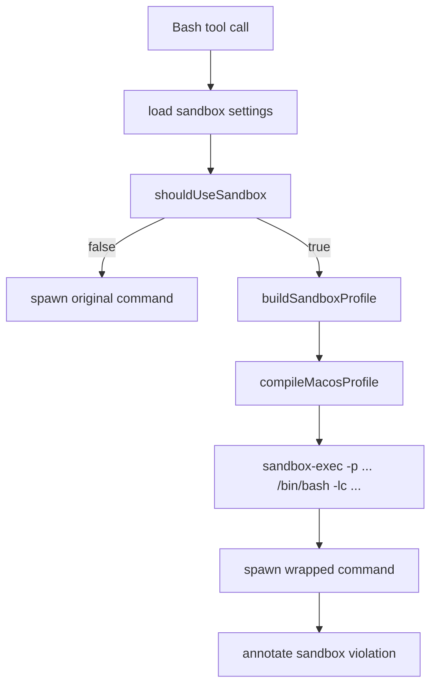
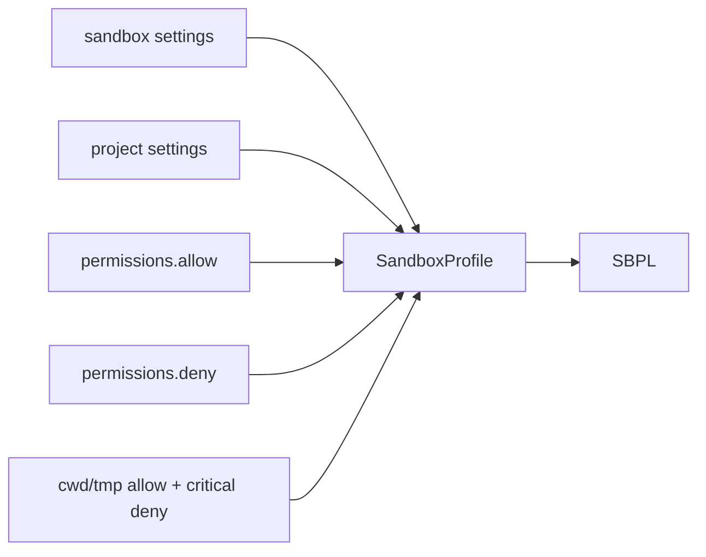

<details>
<summary>相关源文件</summary>

生成本页时使用的主要源文件：

- [src/sandbox/types.ts](https://github.com/ConardLi/easy-agent/blob/c24463e07dd136d41f6ab28edb33a3eaf0b209c1/src/sandbox/types.ts)
- [src/sandbox/settings.ts](https://github.com/ConardLi/easy-agent/blob/c24463e07dd136d41f6ab28edb33a3eaf0b209c1/src/sandbox/settings.ts)
- [src/sandbox/availability.ts](https://github.com/ConardLi/easy-agent/blob/c24463e07dd136d41f6ab28edb33a3eaf0b209c1/src/sandbox/availability.ts)
- [src/sandbox/shouldUseSandbox.ts](https://github.com/ConardLi/easy-agent/blob/c24463e07dd136d41f6ab28edb33a3eaf0b209c1/src/sandbox/shouldUseSandbox.ts)
- [src/sandbox/buildProfile.ts](https://github.com/ConardLi/easy-agent/blob/c24463e07dd136d41f6ab28edb33a3eaf0b209c1/src/sandbox/buildProfile.ts)
- [src/sandbox/macosProfile.ts](https://github.com/ConardLi/easy-agent/blob/c24463e07dd136d41f6ab28edb33a3eaf0b209c1/src/sandbox/macosProfile.ts)
- [src/sandbox/wrapWithSandbox.ts](https://github.com/ConardLi/easy-agent/blob/c24463e07dd136d41f6ab28edb33a3eaf0b209c1/src/sandbox/wrapWithSandbox.ts)
- [src/sandbox/violations.ts](https://github.com/ConardLi/easy-agent/blob/c24463e07dd136d41f6ab28edb33a3eaf0b209c1/src/sandbox/violations.ts)
- [src/tools/bashTool.ts](https://github.com/ConardLi/easy-agent/blob/c24463e07dd136d41f6ab28edb33a3eaf0b209c1/src/tools/bashTool.ts)
- [src/scripts/test-sandbox.ts](https://github.com/ConardLi/easy-agent/blob/c24463e07dd136d41f6ab28edb33a3eaf0b209c1/src/scripts/test-sandbox.ts)
- [src/scripts/smoke-sandbox.ts](https://github.com/ConardLi/easy-agent/blob/c24463e07dd136d41f6ab28edb33a3eaf0b209c1/src/scripts/smoke-sandbox.ts)
- [src/scripts/smoke-bash-sandbox.ts](https://github.com/ConardLi/easy-agent/blob/c24463e07dd136d41f6ab28edb33a3eaf0b209c1/src/scripts/smoke-bash-sandbox.ts)

</details>

# Sandbox 与安全边界

Sandbox 子系统只为 Bash 命令提供 macOS `sandbox-exec` 包装。它不是默认开启的全局隔离层，而是由 settings、host availability、每次 Bash 输入和权限规则共同决定是否包裹命令。  
Sources: [src/sandbox/types.ts:34-58](../../../project-repos/easy-agent/src/sandbox/types.ts#L34-L58), [src/sandbox/settings.ts:96-168](../../../project-repos/easy-agent/src/sandbox/settings.ts#L96-L168), [src/sandbox/shouldUseSandbox.ts:78-95](../../../project-repos/easy-agent/src/sandbox/shouldUseSandbox.ts#L78-L95)

<details class="source-snippets">
<summary>引用源码</summary>

<!-- source-snippets:start -->

#### `src/sandbox/types.ts:34-58`

```typescript
export interface SandboxSettings {
  /** Master switch. Default false — we DON'T sandbox by default; users opt in. */
  enabled?: boolean;
  /**
   * If true and sandboxing is on, Bash commands skip the user-confirmation
   * dialog when no explicit deny/ask rule matches. The sandbox is the
   * safety net. Default true (matches source code).
   */
  autoAllowBashIfSandboxed?: boolean;
  /**
   * If true, the model can pass `dangerouslyDisableSandbox: true` to escape
   * the sandbox for one command. If false, that flag is ignored — the
   * sandbox always wraps Bash. Default true (matches source code).
   */
  allowUnsandboxedCommands?: boolean;
  /**
   * Wildcard prefixes for commands that should NEVER be sandboxed. Used
   * for things like `docker:*` and `make:*` that need raw filesystem
   * access. NOT a security boundary — it's a UX escape hatch.
   * See source code's `shouldUseSandbox.ts:18` NOTE comment.
   */
  excludedCommands?: string[];
  filesystem?: SandboxFilesystemSettings;
  network?: SandboxNetworkSettings;
}
```

#### `src/sandbox/settings.ts:96-168`

```typescript
export interface ResolvedSandboxSettings {
  enabled: boolean;
  autoAllowBashIfSandboxed: boolean;
  allowUnsandboxedCommands: boolean;
  excludedCommands: string[];
  filesystem: Required<SandboxFilesystemSettings>;
  network: Required<SandboxNetworkSettings>;
}

export const DEFAULT_RESOLVED_SANDBOX_SETTINGS: ResolvedSandboxSettings = {
  enabled: false,
  autoAllowBashIfSandboxed: true,
  allowUnsandboxedCommands: true,
  excludedCommands: [],
  filesystem: { allowWrite: [], denyWrite: [], allowRead: [], denyRead: [] },
  network: { allowedDomains: [], deniedDomains: [] },
};

export function resolveSandboxSettings(
  user: SandboxSettings,
  project: SandboxSettings,
): ResolvedSandboxSettings {
  return {
    enabled: project.enabled ?? user.enabled ?? false,
    autoAllowBashIfSandboxed:
      project.autoAllowBashIfSandboxed ?? user.autoAllowBashIfSandboxed ?? true,
    allowUnsandboxedCommands:
      project.allowUnsandboxedCommands ?? user.allowUnsandboxedCommands ?? true,
    excludedCommands: mergeStringArrays(
      user.excludedCommands,
      project.excludedCommands,
    ),
    filesystem: {
      allowWrite: mergeStringArrays(
        user.filesystem?.allowWrite,
        project.filesystem?.allowWrite,
      ),
      denyWrite: mergeStringArrays(
        user.filesystem?.denyWrite,
        project.filesystem?.denyWrite,
      ),
      allowRead: mergeStringArrays(
        user.filesystem?.allowRead,
        project.filesystem?.allowRead,
      ),
      denyRead: mergeStringArrays(
        user.filesystem?.denyRead,
        project.filesystem?.denyRead,
      ),
    },
    network: {
      allowedDomains: mergeStringArrays(
        user.network?.allowedDomains,
        project.network?.allowedDomains,
      ),
      deniedDomains: mergeStringArrays(
        user.network?.deniedDomains,
        project.network?.deniedDomains,
      ),
    },
  };
}

export async function loadSandboxSettings(
  cwd: string,
): Promise<ResolvedSandboxSettings> {
  const { user, project } = getSettingsPaths(cwd);
  const [userSandbox, projectSandbox] = await Promise.all([
    readSandboxFromFile(user),
    readSandboxFromFile(project),
  ]);
  return resolveSandboxSettings(userSandbox, projectSandbox);
}
```

#### `src/sandbox/shouldUseSandbox.ts:78-95`

```typescript
export function shouldUseSandbox(
  input: ShouldUseSandboxInput,
  settings: ResolvedSandboxSettings,
): boolean {
  if (!settings.enabled) return false;
  if (!isSandboxRuntimeReady()) return false;
  if (
    input.dangerouslyDisableSandbox === true &&
    settings.allowUnsandboxedCommands
  ) {
    return false;
  }
  if (!input.command) return false;
  if (containsExcludedCommand(input.command, settings.excludedCommands)) {
    return false;
  }
  return true;
}
```

<!-- source-snippets:end -->
</details>


Sources: [src/tools/bashTool.ts:118-207](../../../project-repos/easy-agent/src/tools/bashTool.ts#L118-L207), [src/sandbox/buildProfile.ts:125-206](../../../project-repos/easy-agent/src/sandbox/buildProfile.ts#L125-L206), [src/sandbox/macosProfile.ts:47-76](../../../project-repos/easy-agent/src/sandbox/macosProfile.ts#L47-L76), [src/sandbox/wrapWithSandbox.ts:31-45](../../../project-repos/easy-agent/src/sandbox/wrapWithSandbox.ts#L31-L45)

<details class="source-snippets">
<summary>引用源码</summary>

<!-- source-snippets:start -->

#### `src/tools/bashTool.ts:118-207`

```typescript
    // Decide sandbox wrapping. We swallow load errors and proceed with
    // sandboxing OFF — settings.json being unparseable shouldn't block
    // command execution; the permission system already surfaces those
    // errors loudly elsewhere.
    let sandboxSettings: ResolvedSandboxSettings | null = null;
    try {
      sandboxSettings = await loadSandboxSettings(context.cwd);
    } catch {
      sandboxSettings = null;
    }

    const willSandbox = sandboxSettings
      ? shouldUseSandbox(
          {
            command: input.command,
            dangerouslyDisableSandbox: input.dangerouslyDisableSandbox,
          },
          sandboxSettings,
        )
      : false;

    let executedCommand = input.command;
    if (willSandbox && sandboxSettings) {
      const profile = await buildProfileForCwd(context.cwd, sandboxSettings);
      const wrap = wrapWithSandbox(input.command, profile);
      executedCommand = wrap.wrappedCommand;
    }

    return await new Promise<ToolResult>((resolve) => {
      const child = spawn(process.env.SHELL || "bash", ["-lc", executedCommand], {
        cwd: context.cwd,
        env: process.env,
      });

      let stdout = "";
      let stderr = "";
      let settled = false;

      const finish = (result: ToolResult) => {
        if (settled) return;
        settled = true;
        resolve(result);
      };

      const timeoutId = setTimeout(() => {
        child.kill("SIGTERM");
        finish({ content: `Command timed out after ${timeoutMs}ms`, isError: true });
      }, timeoutMs);

      const onAbort = () => {
        child.kill("SIGTERM");
        clearTimeout(timeoutId);
        finish({ content: "Command aborted", isError: true });
      };

      context.abortSignal?.addEventListener("abort", onAbort, { once: true });

      child.stdout.on("data", (chunk: Buffer | string) => {
        stdout += chunk.toString();
      });
      child.stderr.on("data", (chunk: Buffer | string) => {
        stderr += chunk.toString();
      });
      child.on("error", (error) => {
        clearTimeout(timeoutId);
        finish({ content: `Failed to start command: ${error.message}`, isError: true });
      });
      child.on("close", (code) => {
        clearTimeout(timeoutId);
        context.abortSignal?.removeEventListener("abort", onAbort);

        // Tag stderr with <sandbox_violations>...</sandbox_violations>
        // when the failure smells like a sandbox denial. The model uses
        // this signal to decide whether to retry, ask for permission,
        // or back off. The UI strips the tag before rendering.
        const annotatedStderr = willSandbox
          ? annotateStderrWithSandboxFailures(stderr, code)
          : stderr;

        const output = [
          `Command: ${input.command}`,
          `Read-only: ${isReadOnlyCommand(input.command)}`,
          `Sandbox: ${willSandbox ? "enabled" : "disabled"}`,
          `Exit code: ${code ?? -1}`,
          stdout ? `\nSTDOUT:\n${truncateOutput(stdout)}` : "",
          annotatedStderr ? `\nSTDERR:\n${truncateOutput(annotatedStderr)}` : "",
        ].filter(Boolean).join("\n");

        finish({ content: output, isError: (code ?? 1) !== 0 });
      });
```

#### `src/sandbox/buildProfile.ts:125-206`

```typescript
export function buildSandboxProfile(params: {
  cwd: string;
  settings: ResolvedSandboxSettings;
  permissions: PermissionRules;
}): SandboxProfile {
  const { cwd, settings, permissions } = params;

  // 1. Filesystem writable seed: always cwd + tmpdir.
  const allowWrite = new Set<string>([
    canonicalize(path.resolve(cwd)),
    canonicalize(os.tmpdir()),
    canonicalize(path.join(os.tmpdir(), "easy-agent")),
  ]);

  const denyWrite = new Set<string>(SYSTEM_DENY_PATHS_RAW.map(canonicalize));
  for (const p of getCriticalDenyPaths(cwd)) denyWrite.add(canonicalize(p));

  const allowRead = new Set<string>();
  const denyRead = new Set<string>();

  // 2. Filesystem from sandbox.filesystem.* settings (verbatim).
  for (const p of settings.filesystem.allowWrite) {
    allowWrite.add(canonicalize(resolveRulePath(p, cwd)));
  }
  for (const p of settings.filesystem.denyWrite) {
    denyWrite.add(canonicalize(resolveRulePath(p, cwd)));
  }
  for (const p of settings.filesystem.allowRead) {
    allowRead.add(canonicalize(resolveRulePath(p, cwd)));
  }
  for (const p of settings.filesystem.denyRead) {
    denyRead.add(canonicalize(resolveRulePath(p, cwd)));
  }

  // 3. Network from sandbox.network.*
  const allowedDomains = new Set<string>(settings.network.allowedDomains);
  const deniedDomains = new Set<string>(settings.network.deniedDomains);

  // 4. The unified abstraction: derive sandbox config from permission
  //    rules. Each rule contributes to BOTH the permission system
  //    (already loaded elsewhere) AND the sandbox profile (here).
  for (const rule of permissions.allow) {
    const parsed = parseRule(rule);
    if (!parsed) continue;
    if (parsed.toolName === "WebFetch" && parsed.ruleContent.startsWith("domain:")) {
      allowedDomains.add(parsed.ruleContent.slice("domain:".length));
    } else if (parsed.toolName === "Edit" || parsed.toolName === "Write") {
      const p = canonicalize(stripGlobSuffix(resolveRulePath(parsed.ruleContent, cwd)));
      allowWrite.add(p);
    } else if (parsed.toolName === "Read") {
      const p = canonicalize(stripGlobSuffix(resolveRulePath(parsed.ruleContent, cwd)));
      allowRead.add(p);
    }
  }

  for (const rule of permissions.deny) {
    const parsed = parseRule(rule);
    if (!parsed) continue;
    if (parsed.toolName === "WebFetch" && parsed.ruleContent.startsWith("domain:")) {
      deniedDomains.add(parsed.ruleContent.slice("domain:".length));
    } else if (parsed.toolName === "Edit" || parsed.toolName === "Write") {
      const p = canonicalize(stripGlobSuffix(resolveRulePath(parsed.ruleContent, cwd)));
      denyWrite.add(p);
    } else if (parsed.toolName === "Read") {
      const p = canonicalize(stripGlobSuffix(resolveRulePath(parsed.ruleContent, cwd)));
      denyRead.add(p);
    }
  }

  return {
    filesystem: {
      allowWrite: Array.from(allowWrite),
      denyWrite: Array.from(denyWrite),
      allowRead: Array.from(allowRead),
      denyRead: Array.from(denyRead),
    },
    network: {
      allowedDomains: Array.from(allowedDomains),
      deniedDomains: Array.from(deniedDomains),
    },
  };
}
```

#### `src/sandbox/macosProfile.ts:47-76`

```typescript
export function compileMacosProfile(profile: SandboxProfile): string {
  const writableSubpaths = profile.filesystem.allowWrite.map(subpath).join(" ");
  const denyWriteSubpaths = profile.filesystem.denyWrite.map(subpath).join(" ");

  const networkAllowAll = profile.network.allowedDomains.length > 0;

  // SBPL evaluates rules in source order; later rules override earlier
  // ones. So we emit `(allow file-write*)` for our writable list FIRST,
  // then `(deny file-write*)` for the critical paths, so the deny wins
  // even if a writable path overlaps a critical path (e.g. user adds
  // cwd to allowWrite but settings.json lives inside cwd — we must
  // still deny writes to settings.json).
  const lines = [
    "(version 1)",
    "(deny default)",
    "(allow process*)",
    "(allow signal)",
    "(allow mach-lookup)",
    "(allow ipc-posix-shm)",
    "(allow sysctl-read)",
    "(allow file-read*)",
    writableSubpaths ? `(allow file-write* ${writableSubpaths})` : "",
    denyWriteSubpaths ? `(deny file-write* ${denyWriteSubpaths})` : "",
    networkAllowAll
      ? "(allow network*)"
      : "(deny network-outbound) (allow network-bind (local ip)) (allow network* (local ip))",
  ].filter(Boolean);

  return lines.join("\n");
}
```

#### `src/sandbox/wrapWithSandbox.ts:31-45`

```typescript
export function wrapWithSandbox(
  command: string,
  profile: SandboxProfile,
): WrapWithSandboxResult {
  const sbpl = compileMacosProfile(profile);
  const wrappedCommand = [
    "/usr/bin/sandbox-exec",
    "-p",
    shellQuoteSingle(sbpl),
    "/bin/bash",
    "-lc",
    shellQuoteSingle(command),
  ].join(" ");
  return { wrappedCommand, profile: sbpl };
}
```

<!-- source-snippets:end -->
</details>
## 两层类型

代码区分 `SandboxSettings` 和 `SandboxProfile`。前者是用户写在 settings.json 里的原始配置，后者是运行时喂给 sandbox-exec 的具体 profile，会混合 settings、权限规则和硬编码安全默认值。  
Sources: [src/sandbox/types.ts:1-20](../../../project-repos/easy-agent/src/sandbox/types.ts#L1-L20), [src/sandbox/types.ts:22-75](../../../project-repos/easy-agent/src/sandbox/types.ts#L22-L75)

<details class="source-snippets">
<summary>引用源码</summary>

<!-- source-snippets:start -->

#### `src/sandbox/types.ts:1-20`

```typescript
/**
 * Type definitions for the sandbox subsystem.
 *
 * Two concept layers, intentionally separated:
 *
 *   1. SandboxSettings  — what the user writes in settings.json. Strings
 *                         and bools, no derivation logic. Loader returns
 *                         this verbatim.
 *
 *   2. SandboxProfile   — what the runtime feeds into sandbox-exec. Built
 *                         by `buildProfile.ts` by mixing SandboxSettings
 *                         with the permission rules (Edit/WebFetch) and
 *                         a hardcoded set of always-deny paths. The
 *                         macOS sbpl compiler reads this, NOT the raw
 *                         settings.
 *
 * Reference: `claude-code-source-code/src/utils/sandbox/sandbox-adapter.ts`
 *   - SandboxSettings  ≈ SettingsJson["sandbox"]
 *   - SandboxProfile   ≈ SandboxRuntimeConfig (the @anthropic-ai/sandbox-runtime input)
 */
```

#### `src/sandbox/types.ts:22-75`

```typescript
export interface SandboxFilesystemSettings {
  allowWrite?: string[];
  denyWrite?: string[];
  allowRead?: string[];
  denyRead?: string[];
}

export interface SandboxNetworkSettings {
  allowedDomains?: string[];
  deniedDomains?: string[];
}

export interface SandboxSettings {
  /** Master switch. Default false — we DON'T sandbox by default; users opt in. */
  enabled?: boolean;
  /**
   * If true and sandboxing is on, Bash commands skip the user-confirmation
   * dialog when no explicit deny/ask rule matches. The sandbox is the
   * safety net. Default true (matches source code).
   */
  autoAllowBashIfSandboxed?: boolean;
  /**
   * If true, the model can pass `dangerouslyDisableSandbox: true` to escape
   * the sandbox for one command. If false, that flag is ignored — the
   * sandbox always wraps Bash. Default true (matches source code).
   */
  allowUnsandboxedCommands?: boolean;
  /**
   * Wildcard prefixes for commands that should NEVER be sandboxed. Used
   * for things like `docker:*` and `make:*` that need raw filesystem
   * access. NOT a security boundary — it's a UX escape hatch.
   * See source code's `shouldUseSandbox.ts:18` NOTE comment.
   */
  excludedCommands?: string[];
  filesystem?: SandboxFilesystemSettings;
  network?: SandboxNetworkSettings;
}

/**
 * Concrete profile to feed into sandbox-exec. All paths are absolute.
 * The macOS profile compiler converts this into sbpl.
 */
export interface SandboxProfile {
  filesystem: {
    allowWrite: string[];
    denyWrite: string[];
    allowRead: string[];
    denyRead: string[];
  };
  network: {
    allowedDomains: string[];
    deniedDomains: string[];
  };
}
```

<!-- source-snippets:end -->
</details>
settings 默认值偏保守地要求用户显式 opt-in：`enabled=false`。但开启后，默认允许 sandboxed Bash 自动通过权限检查，并允许模型用 `dangerouslyDisableSandbox` 单次逃逸，除非用户把 `allowUnsandboxedCommands` 关掉。  
Sources: [src/sandbox/settings.ts:1-15](../../../project-repos/easy-agent/src/sandbox/settings.ts#L1-L15), [src/sandbox/settings.ts:105-168](../../../project-repos/easy-agent/src/sandbox/settings.ts#L105-L168), [src/sandbox/types.ts:34-55](../../../project-repos/easy-agent/src/sandbox/types.ts#L34-L55)

<details class="source-snippets">
<summary>引用源码</summary>

<!-- source-snippets:start -->

#### `src/sandbox/settings.ts:1-15`

```typescript
/**
 * Load + merge sandbox settings from user (~/.easy-agent/settings.json)
 * and project (<cwd>/.easy-agent/settings.json) scopes.
 *
 * Project overrides user (matches the existing permissions/MCP loaders
 * — see `src/permissions/permissions.ts:loadPermissionSettings`).
 *
 * Defaults:
 *   - enabled: false                      → opt-in feature
 *   - autoAllowBashIfSandboxed: true      → matches source code
 *   - allowUnsandboxedCommands: true      → matches source code
 *
 * Returns a fully-populated SandboxSettings — every field has a value,
 * so callers don't need to repeat default-checking.
 */
```

#### `src/sandbox/settings.ts:105-168`

```typescript
export const DEFAULT_RESOLVED_SANDBOX_SETTINGS: ResolvedSandboxSettings = {
  enabled: false,
  autoAllowBashIfSandboxed: true,
  allowUnsandboxedCommands: true,
  excludedCommands: [],
  filesystem: { allowWrite: [], denyWrite: [], allowRead: [], denyRead: [] },
  network: { allowedDomains: [], deniedDomains: [] },
};

export function resolveSandboxSettings(
  user: SandboxSettings,
  project: SandboxSettings,
): ResolvedSandboxSettings {
  return {
    enabled: project.enabled ?? user.enabled ?? false,
    autoAllowBashIfSandboxed:
      project.autoAllowBashIfSandboxed ?? user.autoAllowBashIfSandboxed ?? true,
    allowUnsandboxedCommands:
      project.allowUnsandboxedCommands ?? user.allowUnsandboxedCommands ?? true,
    excludedCommands: mergeStringArrays(
      user.excludedCommands,
      project.excludedCommands,
    ),
    filesystem: {
      allowWrite: mergeStringArrays(
        user.filesystem?.allowWrite,
        project.filesystem?.allowWrite,
      ),
      denyWrite: mergeStringArrays(
        user.filesystem?.denyWrite,
        project.filesystem?.denyWrite,
      ),
      allowRead: mergeStringArrays(
        user.filesystem?.allowRead,
        project.filesystem?.allowRead,
      ),
      denyRead: mergeStringArrays(
        user.filesystem?.denyRead,
        project.filesystem?.denyRead,
      ),
    },
    network: {
      allowedDomains: mergeStringArrays(
        user.network?.allowedDomains,
        project.network?.allowedDomains,
      ),
      deniedDomains: mergeStringArrays(
        user.network?.deniedDomains,
        project.network?.deniedDomains,
      ),
    },
  };
}

export async function loadSandboxSettings(
  cwd: string,
): Promise<ResolvedSandboxSettings> {
  const { user, project } = getSettingsPaths(cwd);
  const [userSandbox, projectSandbox] = await Promise.all([
    readSandboxFromFile(user),
    readSandboxFromFile(project),
  ]);
  return resolveSandboxSettings(userSandbox, projectSandbox);
}
```

#### `src/sandbox/types.ts:34-55`

```typescript
export interface SandboxSettings {
  /** Master switch. Default false — we DON'T sandbox by default; users opt in. */
  enabled?: boolean;
  /**
   * If true and sandboxing is on, Bash commands skip the user-confirmation
   * dialog when no explicit deny/ask rule matches. The sandbox is the
   * safety net. Default true (matches source code).
   */
  autoAllowBashIfSandboxed?: boolean;
  /**
   * If true, the model can pass `dangerouslyDisableSandbox: true` to escape
   * the sandbox for one command. If false, that flag is ignored — the
   * sandbox always wraps Bash. Default true (matches source code).
   */
  allowUnsandboxedCommands?: boolean;
  /**
   * Wildcard prefixes for commands that should NEVER be sandboxed. Used
   * for things like `docker:*` and `make:*` that need raw filesystem
   * access. NOT a security boundary — it's a UX escape hatch.
   * See source code's `shouldUseSandbox.ts:18` NOTE comment.
   */
  excludedCommands?: string[];
```

<!-- source-snippets:end -->
</details>
## 可用性检查

Easy Agent 只实现 macOS backend。`availability.ts` 会检查 `process.platform === "darwin"` 和 `sandbox-exec` 是否存在；如果 settings 开启但 runtime 不可用，CLI startup 会暴露原因，而不是静默降级。  
Sources: [src/sandbox/availability.ts:1-16](../../../project-repos/easy-agent/src/sandbox/availability.ts#L1-L16), [src/sandbox/availability.ts:23-82](../../../project-repos/easy-agent/src/sandbox/availability.ts#L23-L82), [src/entrypoint/cli.ts:79-95](../../../project-repos/easy-agent/src/entrypoint/cli.ts#L79-L95)

<details class="source-snippets">
<summary>引用源码</summary>

<!-- source-snippets:start -->

#### `src/sandbox/availability.ts:1-16`

```typescript
/**
 * Detect whether the sandbox can actually run on the current host.
 *
 * Why this exists (security footgun, mirroring source code's
 * `getSandboxUnavailableReason`):
 *
 *   The user opts in by writing `sandbox.enabled: true` in settings.json.
 *   If the host can't run sandbox-exec — e.g. they're on Windows or
 *   Linux, or sandbox-exec was removed by some MDM tool — and we
 *   silently fall back to "no sandbox", the user thinks they're
 *   protected and they aren't. So we surface the reason loudly at
 *   startup and let the user decide.
 *
 * Easy-agent only ships the macOS backend (see DEVELOPMENT-PLAN
 * stage 18.6). Linux/WSL is explicitly out of scope for the tutorial.
 */
```

#### `src/sandbox/availability.ts:23-82`

```typescript
export function isPlatformSupported(): boolean {
  return process.platform === "darwin";
}

function isSandboxExecAvailable(): boolean {
  // `which sandbox-exec` is fast (~5ms) and avoids spawning the binary
  // itself. We synchronously check once at startup; if the user ever
  // installs/removes sandbox-exec mid-session they need to restart.
  try {
    execFileSync("/usr/bin/which", ["sandbox-exec"], {
      stdio: ["ignore", "ignore", "ignore"],
    });
    return true;
  } catch {
    return false;
  }
}

/**
 * Returns a reason string if the user enabled the sandbox but it
 * cannot run; returns undefined otherwise. Caller should print this
 * once at CLI startup, NOT on every Bash command (it would spam).
 *
 * Result is cached after the first call — sandbox availability does
 * not change during a process lifetime.
 */
export function getSandboxUnavailableReason(
  enabledInSettings: boolean,
): string | undefined {
  if (!enabledInSettings) return undefined;

  if (cachedReason !== undefined) return cachedReason || undefined;
  if (cachedSupported === true) return undefined;

  if (!isPlatformSupported()) {
    cachedSupported = false;
    cachedReason = `sandbox.enabled is true but ${process.platform} is not supported (easy-agent only sandboxes on macOS).`;
    return cachedReason;
  }

  if (!isSandboxExecAvailable()) {
    cachedSupported = false;
    cachedReason = "sandbox.enabled is true but /usr/bin/sandbox-exec is not available on this Mac.";
    return cachedReason;
  }

  cachedSupported = true;
  cachedReason = "";
  return undefined;
}

/**
 * "Can the sandbox actually run right now?" — fast, cached, no I/O after
 * the first call. Used by `shouldUseSandbox()` on every Bash invocation.
 */
export function isSandboxRuntimeReady(): boolean {
  if (cachedSupported !== undefined) return cachedSupported;
  cachedSupported = isPlatformSupported() && isSandboxExecAvailable();
  return cachedSupported;
}
```

#### `src/entrypoint/cli.ts:79-95`

```typescript
  // Sandbox availability: if the user opted in via settings.json but
  // the host can't run sandbox-exec, surface the reason loudly. Silent
  // fall-back is a security footgun — users assume protection that
  // isn't there. Mirrors source code's `getSandboxUnavailableReason`.
  try {
    const { loadSandboxSettings, getSandboxUnavailableReason } = await import(
      "../sandbox/index.js"
    );
    const sandboxSettings = await loadSandboxSettings(process.cwd());
    const reason = getSandboxUnavailableReason(sandboxSettings.enabled);
    if (reason) {
      console.warn(`[easy-agent] ⚠ ${reason} Bash commands will run unsandboxed.`);
    }
  } catch {
    // Settings parse errors are surfaced by the permission loader; we
    // don't double-report here.
  }
```

<!-- source-snippets:end -->
</details>
## shouldUseSandbox 决策

`shouldUseSandbox()` 的决策顺序是：settings 必须 enabled，runtime 必须 ready，单次 `dangerouslyDisableSandbox` 只有在用户 policy 允许时才生效，命令为空不启用，命中 `excludedCommands` 也不启用。  
Sources: [src/sandbox/shouldUseSandbox.ts:1-19](../../../project-repos/easy-agent/src/sandbox/shouldUseSandbox.ts#L1-L19), [src/sandbox/shouldUseSandbox.ts:78-95](../../../project-repos/easy-agent/src/sandbox/shouldUseSandbox.ts#L78-L95)

<details class="source-snippets">
<summary>引用源码</summary>

<!-- source-snippets:start -->

#### `src/sandbox/shouldUseSandbox.ts:1-19`

```typescript
/**
 * Gate that decides whether a given Bash invocation should be wrapped
 * in sandbox-exec. Mirrors source code's `shouldUseSandbox.ts`.
 *
 * Inputs that flip the decision:
 *
 *   1. Master switch: `sandbox.enabled` in settings + platform supports
 *      sandbox-exec (only macOS in easy-agent).
 *
 *   2. Per-call escape: the model passed `dangerouslyDisableSandbox: true`
 *      AND the user allows that via `sandbox.allowUnsandboxedCommands`
 *      (default true). If the user policy denies model escapes, the flag
 *      is silently ignored and the command is sandboxed anyway.
 *
 *   3. UX escape hatch: `sandbox.excludedCommands` patterns. If the
 *      command (or any subcommand) starts with one of these prefixes,
 *      we skip the sandbox. NOT a security boundary — it's for commands
 *      like `docker:*` and `make:*` that need raw FS access.
 */
```

#### `src/sandbox/shouldUseSandbox.ts:78-95`

```typescript
export function shouldUseSandbox(
  input: ShouldUseSandboxInput,
  settings: ResolvedSandboxSettings,
): boolean {
  if (!settings.enabled) return false;
  if (!isSandboxRuntimeReady()) return false;
  if (
    input.dangerouslyDisableSandbox === true &&
    settings.allowUnsandboxedCommands
  ) {
    return false;
  }
  if (!input.command) return false;
  if (containsExcludedCommand(input.command, settings.excludedCommands)) {
    return false;
  }
  return true;
}
```

<!-- source-snippets:end -->
</details>
`excludedCommands` 支持精确前缀、`docker:*` 这类前缀通配和一般 `*` 通配。它会拆分 compound command 的子命令，任一子命令命中就跳过 sandbox；源码注释也明确这只是 UX escape hatch，不是安全边界。  
Sources: [src/sandbox/shouldUseSandbox.ts:30-76](../../../project-repos/easy-agent/src/sandbox/shouldUseSandbox.ts#L30-L76)

<details class="source-snippets">
<summary>引用源码</summary>

<!-- source-snippets:start -->

#### `src/sandbox/shouldUseSandbox.ts:30-76`

```typescript
export function matchesExcludedPattern(
  command: string,
  pattern: string,
): boolean {
  const trimmedPattern = pattern.trim();
  if (!trimmedPattern) return false;

  if (trimmedPattern.endsWith(":*")) {
    const prefix = trimmedPattern.slice(0, -2);
    return command === prefix || command.startsWith(`${prefix} `);
  }

  if (trimmedPattern.includes("*")) {
    const re = new RegExp(
      `^${trimmedPattern.split("*").map((part) => part.replace(/[.+?^${}()|[\]\\]/g, "\\$&")).join(".*")}$`,
    );
    return re.test(command);
  }

  return command === trimmedPattern || command.startsWith(`${trimmedPattern} `);
}

export function containsExcludedCommand(
  command: string,
  excluded: string[],
): boolean {
  if (excluded.length === 0) return false;
  // Compound commands escape exclusion only if EVERY subcommand
  // is itself excluded — otherwise a malicious head like
  // `docker ps && curl evil.com` would skip sandbox even though
  // curl should be sandboxed. (Source code's logic is per-subcommand
  // OR — they treat excludedCommands as "any subcommand matches"
  // because excludedCommands is UX, not security; we follow that.)
  let subcommands: string[];
  try {
    subcommands = splitCommand(command);
  } catch {
    subcommands = [command.trim()];
  }
  if (subcommands.length === 0) subcommands = [command.trim()];
  for (const sub of subcommands) {
    for (const pattern of excluded) {
      if (matchesExcludedPattern(sub, pattern)) return true;
    }
  }
  return false;
}
```

<!-- source-snippets:end -->
</details>
## Profile 构建

profile 的写权限默认允许 cwd、系统 tmpdir 和 `tmp/easy-agent`。同时会强制 deny 系统路径、用户/项目 settings、skills 目录和 AGENT.md，防止 sandboxed 命令改写自身运行配置或技能内容。  
Sources: [src/sandbox/buildProfile.ts:94-123](../../../project-repos/easy-agent/src/sandbox/buildProfile.ts#L94-L123), [src/sandbox/buildProfile.ts:125-145](../../../project-repos/easy-agent/src/sandbox/buildProfile.ts#L125-L145)

<details class="source-snippets">
<summary>引用源码</summary>

<!-- source-snippets:start -->

#### `src/sandbox/buildProfile.ts:94-123`

```typescript
/**
 * Hard-coded paths that ALWAYS deny-write, regardless of user settings.
 * These are the "self-modification" attack surfaces — if a sandboxed
 * command can rewrite settings.json or the skill files, the model can
 * exfiltrate by editing its own runtime config and waiting for the
 * next session.
 *
 * Mirrors source code's settingsPaths + .claude/skills/.claude/commands
 * forced-deny block in `convertToSandboxRuntimeConfig` (lines 230–256).
 */
function getCriticalDenyPaths(cwd: string): string[] {
  const denies = [
    getUserSettingsPath(),
    getProjectSettingsPath(cwd),
    path.join(getProjectEasyAgentDir(cwd), "skills"),
    getEasyAgentPath("skills"),
    path.join(cwd, "AGENT.md"),
    getEasyAgentPath("AGENT.md"),
  ];
  return Array.from(new Set(denies));
}

// System paths we always deny writes to. We deliberately do NOT
// include `/var` or `/private/var` here even though they're "system":
// macOS's tmpdir lives inside /private/var/folders/.../T, and a broad
// `/private/var` deny rule would override our tmpdir allow (SBPL is
// last-match-wins). The remaining paths (`/etc`, `/usr`, plus their
// `/private/...` realpath siblings) are SIP-protected anyway, so the
// explicit deny here is mostly defense-in-depth + documentation.
const SYSTEM_DENY_PATHS_RAW = ["/etc", "/usr", "/private/etc"];
```

#### `src/sandbox/buildProfile.ts:125-145`

```typescript
export function buildSandboxProfile(params: {
  cwd: string;
  settings: ResolvedSandboxSettings;
  permissions: PermissionRules;
}): SandboxProfile {
  const { cwd, settings, permissions } = params;

  // 1. Filesystem writable seed: always cwd + tmpdir.
  const allowWrite = new Set<string>([
    canonicalize(path.resolve(cwd)),
    canonicalize(os.tmpdir()),
    canonicalize(path.join(os.tmpdir(), "easy-agent")),
  ]);

  const denyWrite = new Set<string>(SYSTEM_DENY_PATHS_RAW.map(canonicalize));
  for (const p of getCriticalDenyPaths(cwd)) denyWrite.add(canonicalize(p));

  const allowRead = new Set<string>();
  const denyRead = new Set<string>();

  // 2. Filesystem from sandbox.filesystem.* settings (verbatim).
```

<!-- source-snippets:end -->
</details>
权限规则也会参与 profile 派生：`WebFetch(domain:github.com)` 会加入 sandbox network allowlist；`Edit(path)` 与 `Write(path)` 会加入 writable allowlist；deny 规则则加入 denylist。这样权限系统和 sandbox runtime 使用同一份用户意图。  
Sources: [src/sandbox/buildProfile.ts:1-22](../../../project-repos/easy-agent/src/sandbox/buildProfile.ts#L1-L22), [src/sandbox/buildProfile.ts:147-206](../../../project-repos/easy-agent/src/sandbox/buildProfile.ts#L147-L206)

<details class="source-snippets">
<summary>引用源码</summary>

<!-- source-snippets:start -->

#### `src/sandbox/buildProfile.ts:1-22`

```typescript
/**
 * Compose a SandboxProfile from three input sources:
 *
 *   1. Resolved sandbox settings  (sandbox.filesystem.*, sandbox.network.*)
 *   2. Permission rules           (Edit(/path), WebFetch(domain:host), ...)
 *   3. Hardcoded defaults         (cwd + tmpdir writable; system + .easy-agent
 *                                  internals denied)
 *
 * Why mixing (1) and (2) matters — this is the "unified abstraction"
 * design point from source code:
 *
 *   When the user writes `WebFetch(domain:github.com)` in their
 *   permissions.allow list, we want both effects in one place:
 *     - WebFetch tool gets github.com as a permitted host
 *     - The sandbox network whitelist also gets github.com, so a
 *       sandboxed `curl github.com` works
 *   No double-config. The same goes for `Edit(/path)` rules adding
 *   to the writable filesystem allowlist.
 *
 * Reference: `claude-code-source-code/src/utils/sandbox/sandbox-adapter.ts`
 *   in `convertToSandboxRuntimeConfig()`.
 */
```

#### `src/sandbox/buildProfile.ts:147-206`

```typescript
    allowWrite.add(canonicalize(resolveRulePath(p, cwd)));
  }
  for (const p of settings.filesystem.denyWrite) {
    denyWrite.add(canonicalize(resolveRulePath(p, cwd)));
  }
  for (const p of settings.filesystem.allowRead) {
    allowRead.add(canonicalize(resolveRulePath(p, cwd)));
  }
  for (const p of settings.filesystem.denyRead) {
    denyRead.add(canonicalize(resolveRulePath(p, cwd)));
  }

  // 3. Network from sandbox.network.*
  const allowedDomains = new Set<string>(settings.network.allowedDomains);
  const deniedDomains = new Set<string>(settings.network.deniedDomains);

  // 4. The unified abstraction: derive sandbox config from permission
  //    rules. Each rule contributes to BOTH the permission system
  //    (already loaded elsewhere) AND the sandbox profile (here).
  for (const rule of permissions.allow) {
    const parsed = parseRule(rule);
    if (!parsed) continue;
    if (parsed.toolName === "WebFetch" && parsed.ruleContent.startsWith("domain:")) {
      allowedDomains.add(parsed.ruleContent.slice("domain:".length));
    } else if (parsed.toolName === "Edit" || parsed.toolName === "Write") {
      const p = canonicalize(stripGlobSuffix(resolveRulePath(parsed.ruleContent, cwd)));
      allowWrite.add(p);
    } else if (parsed.toolName === "Read") {
      const p = canonicalize(stripGlobSuffix(resolveRulePath(parsed.ruleContent, cwd)));
      allowRead.add(p);
    }
  }

  for (const rule of permissions.deny) {
    const parsed = parseRule(rule);
    if (!parsed) continue;
    if (parsed.toolName === "WebFetch" && parsed.ruleContent.startsWith("domain:")) {
      deniedDomains.add(parsed.ruleContent.slice("domain:".length));
    } else if (parsed.toolName === "Edit" || parsed.toolName === "Write") {
      const p = canonicalize(stripGlobSuffix(resolveRulePath(parsed.ruleContent, cwd)));
      denyWrite.add(p);
    } else if (parsed.toolName === "Read") {
      const p = canonicalize(stripGlobSuffix(resolveRulePath(parsed.ruleContent, cwd)));
      denyRead.add(p);
    }
  }

  return {
    filesystem: {
      allowWrite: Array.from(allowWrite),
      denyWrite: Array.from(denyWrite),
      allowRead: Array.from(allowRead),
      denyRead: Array.from(denyRead),
    },
    network: {
      allowedDomains: Array.from(allowedDomains),
      deniedDomains: Array.from(deniedDomains),
    },
  };
}
```

<!-- source-snippets:end -->
</details>


Sources: [src/sandbox/settings.ts:114-168](../../../project-repos/easy-agent/src/sandbox/settings.ts#L114-L168), [src/sandbox/buildProfile.ts:125-206](../../../project-repos/easy-agent/src/sandbox/buildProfile.ts#L125-L206)

<details class="source-snippets">
<summary>引用源码</summary>

<!-- source-snippets:start -->

#### `src/sandbox/settings.ts:114-168`

```typescript
export function resolveSandboxSettings(
  user: SandboxSettings,
  project: SandboxSettings,
): ResolvedSandboxSettings {
  return {
    enabled: project.enabled ?? user.enabled ?? false,
    autoAllowBashIfSandboxed:
      project.autoAllowBashIfSandboxed ?? user.autoAllowBashIfSandboxed ?? true,
    allowUnsandboxedCommands:
      project.allowUnsandboxedCommands ?? user.allowUnsandboxedCommands ?? true,
    excludedCommands: mergeStringArrays(
      user.excludedCommands,
      project.excludedCommands,
    ),
    filesystem: {
      allowWrite: mergeStringArrays(
        user.filesystem?.allowWrite,
        project.filesystem?.allowWrite,
      ),
      denyWrite: mergeStringArrays(
        user.filesystem?.denyWrite,
        project.filesystem?.denyWrite,
      ),
      allowRead: mergeStringArrays(
        user.filesystem?.allowRead,
        project.filesystem?.allowRead,
      ),
      denyRead: mergeStringArrays(
        user.filesystem?.denyRead,
        project.filesystem?.denyRead,
      ),
    },
    network: {
      allowedDomains: mergeStringArrays(
        user.network?.allowedDomains,
        project.network?.allowedDomains,
      ),
      deniedDomains: mergeStringArrays(
        user.network?.deniedDomains,
        project.network?.deniedDomains,
      ),
    },
  };
}

export async function loadSandboxSettings(
  cwd: string,
): Promise<ResolvedSandboxSettings> {
  const { user, project } = getSettingsPaths(cwd);
  const [userSandbox, projectSandbox] = await Promise.all([
    readSandboxFromFile(user),
    readSandboxFromFile(project),
  ]);
  return resolveSandboxSettings(userSandbox, projectSandbox);
}
```

#### `src/sandbox/buildProfile.ts:125-206`

```typescript
export function buildSandboxProfile(params: {
  cwd: string;
  settings: ResolvedSandboxSettings;
  permissions: PermissionRules;
}): SandboxProfile {
  const { cwd, settings, permissions } = params;

  // 1. Filesystem writable seed: always cwd + tmpdir.
  const allowWrite = new Set<string>([
    canonicalize(path.resolve(cwd)),
    canonicalize(os.tmpdir()),
    canonicalize(path.join(os.tmpdir(), "easy-agent")),
  ]);

  const denyWrite = new Set<string>(SYSTEM_DENY_PATHS_RAW.map(canonicalize));
  for (const p of getCriticalDenyPaths(cwd)) denyWrite.add(canonicalize(p));

  const allowRead = new Set<string>();
  const denyRead = new Set<string>();

  // 2. Filesystem from sandbox.filesystem.* settings (verbatim).
  for (const p of settings.filesystem.allowWrite) {
    allowWrite.add(canonicalize(resolveRulePath(p, cwd)));
  }
  for (const p of settings.filesystem.denyWrite) {
    denyWrite.add(canonicalize(resolveRulePath(p, cwd)));
  }
  for (const p of settings.filesystem.allowRead) {
    allowRead.add(canonicalize(resolveRulePath(p, cwd)));
  }
  for (const p of settings.filesystem.denyRead) {
    denyRead.add(canonicalize(resolveRulePath(p, cwd)));
  }

  // 3. Network from sandbox.network.*
  const allowedDomains = new Set<string>(settings.network.allowedDomains);
  const deniedDomains = new Set<string>(settings.network.deniedDomains);

  // 4. The unified abstraction: derive sandbox config from permission
  //    rules. Each rule contributes to BOTH the permission system
  //    (already loaded elsewhere) AND the sandbox profile (here).
  for (const rule of permissions.allow) {
    const parsed = parseRule(rule);
    if (!parsed) continue;
    if (parsed.toolName === "WebFetch" && parsed.ruleContent.startsWith("domain:")) {
      allowedDomains.add(parsed.ruleContent.slice("domain:".length));
    } else if (parsed.toolName === "Edit" || parsed.toolName === "Write") {
      const p = canonicalize(stripGlobSuffix(resolveRulePath(parsed.ruleContent, cwd)));
      allowWrite.add(p);
    } else if (parsed.toolName === "Read") {
      const p = canonicalize(stripGlobSuffix(resolveRulePath(parsed.ruleContent, cwd)));
      allowRead.add(p);
    }
  }

  for (const rule of permissions.deny) {
    const parsed = parseRule(rule);
    if (!parsed) continue;
    if (parsed.toolName === "WebFetch" && parsed.ruleContent.startsWith("domain:")) {
      deniedDomains.add(parsed.ruleContent.slice("domain:".length));
    } else if (parsed.toolName === "Edit" || parsed.toolName === "Write") {
      const p = canonicalize(stripGlobSuffix(resolveRulePath(parsed.ruleContent, cwd)));
      denyWrite.add(p);
    } else if (parsed.toolName === "Read") {
      const p = canonicalize(stripGlobSuffix(resolveRulePath(parsed.ruleContent, cwd)));
      denyRead.add(p);
    }
  }

  return {
    filesystem: {
      allowWrite: Array.from(allowWrite),
      denyWrite: Array.from(denyWrite),
      allowRead: Array.from(allowRead),
      denyRead: Array.from(denyRead),
    },
    network: {
      allowedDomains: Array.from(allowedDomains),
      deniedDomains: Array.from(deniedDomains),
    },
  };
}
```

<!-- source-snippets:end -->
</details>
## macOS SBPL 编译限制

`compileMacosProfile()` 生成默认 deny 的 SBPL，但本教程版有两个重要限制：文件读默认全放行，网络规则只做到 allowedDomains 非空时放开 network。注释说明生产级实现需要更复杂的读限制和代理型网络控制。  
Sources: [src/sandbox/macosProfile.ts:1-34](../../../project-repos/easy-agent/src/sandbox/macosProfile.ts#L1-L34), [src/sandbox/macosProfile.ts:47-76](../../../project-repos/easy-agent/src/sandbox/macosProfile.ts#L47-L76)

<details class="source-snippets">
<summary>引用源码</summary>

<!-- source-snippets:start -->

#### `src/sandbox/macosProfile.ts:1-34`

```typescript
/**
 * Compile a SandboxProfile into macOS Seatbelt Policy Language (SBPL).
 *
 * SBPL is a tiny Scheme-like DSL consumed by `sandbox-exec -p '...'`.
 * The profile we emit follows this layout:
 *
 *   (version 1)
 *   (deny default)                       ; deny everything by default
 *   (allow process-fork process-exec)    ; the bash subprocess needs to spawn
 *   (allow file-read*)                   ; we don't restrict reads in this version
 *   (allow file-write*  (subpath ...))   ; cwd, tmp, +allowWrite
 *   (deny  file-write*  (subpath ...))   ; system paths, settings, skills
 *   (allow network-outbound (remote ip)) ; allowed networking
 *   (allow signal mach-lookup ...)       ; misc UNIX/macOS ops
 *
 * Notable differences from production sandbox-runtime:
 *
 *   - We allow ALL file reads. The tutorial focuses on "prevent write
 *     escape" + "prevent network egress", which already demonstrates
 *     the architecture. Adding read restrictions doubles the SBPL
 *     complexity for marginal teaching value. Source code DOES restrict
 *     reads (denyRead) but it's optional in their model too.
 *
 *   - We allow `network-outbound` only by IP. SBPL's hostname filter
 *     is unreliable (relies on getaddrinfo at policy-eval time which
 *     is not what the sandboxed process actually resolves). For the
 *     teaching version we allow any outbound connection when the
 *     allowed-domains list is non-empty, and document this as a
 *     known limitation. Production uses an HTTPS proxy + connect-only
 *     policy, which is far beyond tutorial scope.
 *
 *   - We use `subpath` for both files and directories. Paths are
 *     escaped with double-quote string literals.
 */
```

#### `src/sandbox/macosProfile.ts:47-76`

```typescript
export function compileMacosProfile(profile: SandboxProfile): string {
  const writableSubpaths = profile.filesystem.allowWrite.map(subpath).join(" ");
  const denyWriteSubpaths = profile.filesystem.denyWrite.map(subpath).join(" ");

  const networkAllowAll = profile.network.allowedDomains.length > 0;

  // SBPL evaluates rules in source order; later rules override earlier
  // ones. So we emit `(allow file-write*)` for our writable list FIRST,
  // then `(deny file-write*)` for the critical paths, so the deny wins
  // even if a writable path overlaps a critical path (e.g. user adds
  // cwd to allowWrite but settings.json lives inside cwd — we must
  // still deny writes to settings.json).
  const lines = [
    "(version 1)",
    "(deny default)",
    "(allow process*)",
    "(allow signal)",
    "(allow mach-lookup)",
    "(allow ipc-posix-shm)",
    "(allow sysctl-read)",
    "(allow file-read*)",
    writableSubpaths ? `(allow file-write* ${writableSubpaths})` : "",
    denyWriteSubpaths ? `(deny file-write* ${denyWriteSubpaths})` : "",
    networkAllowAll
      ? "(allow network*)"
      : "(deny network-outbound) (allow network-bind (local ip)) (allow network* (local ip))",
  ].filter(Boolean);

  return lines.join("\n");
}
```

<!-- source-snippets:end -->
</details>
SBPL 规则按顺序生效，代码先 emit write allow，再 emit write deny，让关键 deny path 在重叠时覆盖 allow path。  
Sources: [src/sandbox/macosProfile.ts:53-73](../../../project-repos/easy-agent/src/sandbox/macosProfile.ts#L53-L73)

<details class="source-snippets">
<summary>引用源码</summary>

<!-- source-snippets:start -->

#### `src/sandbox/macosProfile.ts:53-73`

```typescript
  // SBPL evaluates rules in source order; later rules override earlier
  // ones. So we emit `(allow file-write*)` for our writable list FIRST,
  // then `(deny file-write*)` for the critical paths, so the deny wins
  // even if a writable path overlaps a critical path (e.g. user adds
  // cwd to allowWrite but settings.json lives inside cwd — we must
  // still deny writes to settings.json).
  const lines = [
    "(version 1)",
    "(deny default)",
    "(allow process*)",
    "(allow signal)",
    "(allow mach-lookup)",
    "(allow ipc-posix-shm)",
    "(allow sysctl-read)",
    "(allow file-read*)",
    writableSubpaths ? `(allow file-write* ${writableSubpaths})` : "",
    denyWriteSubpaths ? `(deny file-write* ${denyWriteSubpaths})` : "",
    networkAllowAll
      ? "(allow network*)"
      : "(deny network-outbound) (allow network-bind (local ip)) (allow network* (local ip))",
  ].filter(Boolean);
```

<!-- source-snippets:end -->
</details>
## Bash 工具接入点

Bash 工具每次调用都会重新加载 sandbox settings，并动态 import permission settings 来构造 profile。这样用户在会话中批准新的权限规则后，下一条 Bash 命令就能使用更新后的 sandbox profile。  
Sources: [src/tools/bashTool.ts:24-46](../../../project-repos/easy-agent/src/tools/bashTool.ts#L24-L46), [src/tools/bashTool.ts:118-145](../../../project-repos/easy-agent/src/tools/bashTool.ts#L118-L145)

<details class="source-snippets">
<summary>引用源码</summary>

<!-- source-snippets:start -->

#### `src/tools/bashTool.ts:24-46`

```typescript
/**
 * Build the SandboxProfile to feed to wrapWithSandbox(). We re-load
 * sandbox settings + permission rules on every call so that the user
 * approving a permission rule mid-session takes effect on the next
 * Bash command — no restart required (matches source code's
 * settingsChangeDetector + refreshConfig pattern).
 */
async function buildProfileForCwd(
  cwd: string,
  settings: ResolvedSandboxSettings,
) {
  // Dynamic import: bashTool ⇄ permissions form a static-import cycle
  // (permissions wants `isReadOnlyCommand` from us). We break it here
  // — this path only runs when sandboxing is on, so the extra import
  // cost is negligible.
  const { loadPermissionSettings } = await import("../permissions/permissions.js");
  const permissionSettings = await loadPermissionSettings(cwd);
  return buildSandboxProfile({
    cwd,
    settings,
    permissions: { allow: permissionSettings.allow, deny: permissionSettings.deny },
  });
}
```

#### `src/tools/bashTool.ts:118-145`

```typescript
    // Decide sandbox wrapping. We swallow load errors and proceed with
    // sandboxing OFF — settings.json being unparseable shouldn't block
    // command execution; the permission system already surfaces those
    // errors loudly elsewhere.
    let sandboxSettings: ResolvedSandboxSettings | null = null;
    try {
      sandboxSettings = await loadSandboxSettings(context.cwd);
    } catch {
      sandboxSettings = null;
    }

    const willSandbox = sandboxSettings
      ? shouldUseSandbox(
          {
            command: input.command,
            dangerouslyDisableSandbox: input.dangerouslyDisableSandbox,
          },
          sandboxSettings,
        )
      : false;

    let executedCommand = input.command;
    if (willSandbox && sandboxSettings) {
      const profile = await buildProfileForCwd(context.cwd, sandboxSettings);
      const wrap = wrapWithSandbox(input.command, profile);
      executedCommand = wrap.wrappedCommand;
    }

```

<!-- source-snippets:end -->
</details>
最终执行字符串形态是 `/usr/bin/sandbox-exec -p '<sbpl>' /bin/bash -lc '<original command>'`，用户命令用 POSIX 单引号规则内联转义，不通过临时文件传递。  
Sources: [src/sandbox/wrapWithSandbox.ts:1-15](../../../project-repos/easy-agent/src/sandbox/wrapWithSandbox.ts#L1-L15), [src/sandbox/wrapWithSandbox.ts:20-45](../../../project-repos/easy-agent/src/sandbox/wrapWithSandbox.ts#L20-L45)

<details class="source-snippets">
<summary>引用源码</summary>

<!-- source-snippets:start -->

#### `src/sandbox/wrapWithSandbox.ts:1-15`

```typescript
/**
 * Build the final command string that BashTool hands to spawn().
 *
 * Shape:
 *
 *   /usr/bin/sandbox-exec -p '<sbpl>' /bin/bash -lc '<original command>'
 *
 * The shell-quote step is deliberately strict: every single quote
 * inside the user command becomes `'\''` so the outer single-quoted
 * string remains intact. This is the canonical POSIX-shell escape.
 *
 * We do NOT pass the user command via /tmp file — it would leave a
 * residue if the process is killed mid-execution. Inline-quoted is
 * cheaper and self-cleaning.
 */
```

#### `src/sandbox/wrapWithSandbox.ts:20-45`

```typescript
function shellQuoteSingle(value: string): string {
  return `'${value.replace(/'/g, "'\\''")}'`;
}

export interface WrapWithSandboxResult {
  /** The final command-line that should run via spawn(shell, ['-lc', ...]). */
  wrappedCommand: string;
  /** The compiled sbpl profile, kept around so callers can log it. */
  profile: string;
}

export function wrapWithSandbox(
  command: string,
  profile: SandboxProfile,
): WrapWithSandboxResult {
  const sbpl = compileMacosProfile(profile);
  const wrappedCommand = [
    "/usr/bin/sandbox-exec",
    "-p",
    shellQuoteSingle(sbpl),
    "/bin/bash",
    "-lc",
    shellQuoteSingle(command),
  ].join(" ");
  return { wrappedCommand, profile: sbpl };
}
```

<!-- source-snippets:end -->
</details>
## 违规反馈

macOS sandbox denial 通常写到系统日志，不直接出现在子进程 stderr。Easy Agent 用启发式扫描 stderr 中的 `Operation not permitted`、`sandbox-exec:`、`EPERM`、`EACCES` 等信号，并给模型侧追加 `<sandbox_violations>` 标签。UI 渲染前会去掉该标签。  
Sources: [src/sandbox/violations.ts:1-29](../../../project-repos/easy-agent/src/sandbox/violations.ts#L1-L29), [src/sandbox/violations.ts:31-76](../../../project-repos/easy-agent/src/sandbox/violations.ts#L31-L76), [src/tools/bashTool.ts:185-207](../../../project-repos/easy-agent/src/tools/bashTool.ts#L185-L207), [src/ui/hooks/useAgentSession.ts:580-602](../../../project-repos/easy-agent/src/ui/hooks/useAgentSession.ts#L580-L602)

<details class="source-snippets">
<summary>引用源码</summary>

<!-- source-snippets:start -->

#### `src/sandbox/violations.ts:1-29`

```typescript
/**
 * Sandbox-violation feedback link.
 *
 * macOS sandbox-exec writes denial events to syslog (visible via
 * `log show --predicate 'sender == "Sandbox"'`), NOT to the spawned
 * process's stderr. So we cannot extract violations from stderr the
 * way source code's `@anthropic-ai/sandbox-runtime` does (it taps the
 * `log stream` API directly).
 *
 * Easy-agent's tutorial-grade implementation does the simplest thing
 * that still gives the model a recoverable signal:
 *
 *   1. After the sandboxed process exits, we scan stderr for the
 *      classic deny indicators (EPERM, EACCES, "Operation not
 *      permitted", "sandbox-exec:"), and if we see any of them, we
 *      ATTRIBUTE the failure to the sandbox.
 *
 *   2. We append a `<sandbox_violations>...</sandbox_violations>`
 *      block to stderr. The model sees it and knows "this wasn't a
 *      command bug, this was the sandbox enforcing policy" — it can
 *      decide to ask for permission, change approach, or give up.
 *
 *   3. The UI strips the tag before showing stderr to the human, so
 *      they see clean output.
 *
 * If the user wants the rich production behavior (full violation
 * list with paths/domains), they'd need to subscribe to `log stream`
 * — explicitly out of scope for stage 18 (see DEVELOPMENT-PLAN 18.6).
 */
```

#### `src/sandbox/violations.ts:31-76`

```typescript
const SANDBOX_VIOLATION_INDICATORS = [
  "Operation not permitted",
  "operation not permitted",
  "sandbox-exec:",
  "deny file-write",
  "deny network-outbound",
  "EPERM",
  "EACCES",
];

const VIOLATION_TAG_RE = /<sandbox_violations>[\s\S]*?<\/sandbox_violations>/g;

export function looksLikeSandboxViolation(stderr: string): boolean {
  if (!stderr) return false;
  return SANDBOX_VIOLATION_INDICATORS.some((indicator) => stderr.includes(indicator));
}

/**
 * Wraps stderr in a sandbox_violations tag IF we believe a sandbox
 * denial caused the failure. Returns the stderr unchanged otherwise.
 */
export function annotateStderrWithSandboxFailures(
  stderr: string,
  exitCode: number | null,
): string {
  if (!stderr) return stderr;
  if (exitCode === 0 || exitCode === null) return stderr;
  if (!looksLikeSandboxViolation(stderr)) return stderr;
  if (VIOLATION_TAG_RE.test(stderr)) {
    VIOLATION_TAG_RE.lastIndex = 0;
    return stderr;
  }
  return `${stderr}\n<sandbox_violations>\nThe command appears to have been blocked by the sandbox. The error indicators above (e.g. "Operation not permitted") are typical of file-write or network policy violations.\n</sandbox_violations>`;
}

/** UI-side: strip the tag before showing stderr to the human. */
export function removeSandboxViolationTags(text: string): string {
  return text.replace(VIOLATION_TAG_RE, "").trim();
}

/** Returns true if the stderr carries a sandbox-violations tag. */
export function hasSandboxViolationTag(text: string): boolean {
  if (!text) return false;
  const re = /<sandbox_violations>/;
  return re.test(text);
}
```

#### `src/tools/bashTool.ts:185-207`

```typescript
      child.on("close", (code) => {
        clearTimeout(timeoutId);
        context.abortSignal?.removeEventListener("abort", onAbort);

        // Tag stderr with <sandbox_violations>...</sandbox_violations>
        // when the failure smells like a sandbox denial. The model uses
        // this signal to decide whether to retry, ask for permission,
        // or back off. The UI strips the tag before rendering.
        const annotatedStderr = willSandbox
          ? annotateStderrWithSandboxFailures(stderr, code)
          : stderr;

        const output = [
          `Command: ${input.command}`,
          `Read-only: ${isReadOnlyCommand(input.command)}`,
          `Sandbox: ${willSandbox ? "enabled" : "disabled"}`,
          `Exit code: ${code ?? -1}`,
          stdout ? `\nSTDOUT:\n${truncateOutput(stdout)}` : "",
          annotatedStderr ? `\nSTDERR:\n${truncateOutput(annotatedStderr)}` : "",
        ].filter(Boolean).join("\n");

        finish({ content: output, isError: (code ?? 1) !== 0 });
      });
```

#### `src/ui/hooks/useAgentSession.ts:580-602`

```typescript
          case "tool_use_done": {
            const isPlanFileWrite =
              (value.name === "Write" || value.name === "Edit") &&
              value.result.content.includes(getPlansDirectory());
            const inputPreview = formatToolInputPreview(value.input);
            // Strip the model-only <sandbox_violations> tag from the
            // user-visible error message. The tag stays in the tool
            // result that goes back to the model (so it can interpret
            // sandbox denials), but humans see clean stderr only.
            const rawErrorMessage = value.result.isError ? value.result.content : undefined;
            const errorMessage = rawErrorMessage
              ? removeSandboxViolationTags(rawErrorMessage)
              : undefined;
            setToolCalls((prev) =>
              markToolCallComplete(prev, value.id, {
                resultLength: value.result.content.length,
                isError: value.result.isError,
                displayName: isPlanFileWrite ? "Updated plan" : undefined,
                displayHint: isPlanFileWrite ? "/plan to preview" : undefined,
                inputPreview,
                errorMessage,
              }),
            );
```

<!-- source-snippets:end -->
</details>
## 验证覆盖

`test:sandbox` 不依赖真实 LLM，也尽量避免直接运行 sandbox-exec；它覆盖命令拆分、settings merge、excluded matcher、shouldUseSandbox、profile 派生、SBPL 输出、wrapper 形态和 violation tag。两个 smoke 脚本则用于实际 sandbox 行为和 Bash 工具集成验证。  
Sources: [src/scripts/test-sandbox.ts:1-14](../../../project-repos/easy-agent/src/scripts/test-sandbox.ts#L1-L14), [src/scripts/test-sandbox.ts:69-119](../../../project-repos/easy-agent/src/scripts/test-sandbox.ts#L69-L119), [src/scripts/test-sandbox.ts:177-347](../../../project-repos/easy-agent/src/scripts/test-sandbox.ts#L177-L347), [src/scripts/smoke-sandbox.ts:1-14](../../../project-repos/easy-agent/src/scripts/smoke-sandbox.ts#L1-L14), [src/scripts/smoke-bash-sandbox.ts:1-12](../../../project-repos/easy-agent/src/scripts/smoke-bash-sandbox.ts#L1-L12)

<details class="source-snippets">
<summary>引用源码</summary>

<!-- source-snippets:start -->

#### `src/scripts/test-sandbox.ts:1-14`

```typescript
#!/usr/bin/env tsx
/**
 * Stage 18 verification script — exercise the sandbox subsystem WITHOUT
 * touching the LLM or actually running sandbox-exec. Each section
 * isolates a unit (split, settings merge, profile build, sbpl compile,
 * shouldUseSandbox decision, violation tag handling, auto-allow flow)
 * so a failure points directly at the offending piece.
 *
 * Usage:
 *   cd easy-agent
 *   npm run test:sandbox
 *
 * Exits non-zero if any assertion fails.
 */
```

#### `src/scripts/test-sandbox.ts:69-119`

```typescript
async function main(): Promise<void> {
  section("[1] splitCommand — compound bash splitter");
  assertEqual(splitCommand("ls"), ["ls"], "single command");
  assertEqual(splitCommand("echo a && rm -rf /"), ["echo a", "rm -rf /"], "&& splits");
  assertEqual(splitCommand("a || b"), ["a", "b"], "|| splits");
  assertEqual(splitCommand("a; b; c"), ["a", "b", "c"], "; splits");
  assertEqual(splitCommand("ls | grep foo"), ["ls", "grep foo"], "pipe splits");
  assertEqual(splitCommand("sleep 5 & echo done"), ["sleep 5", "echo done"], "background & splits");
  assertEqual(
    splitCommand('echo "a && b" && echo c'),
    ['echo "a && b"', "echo c"],
    "respects double-quoted operators",
  );
  assertEqual(
    splitCommand("echo 'a && b' && echo c"),
    ["echo 'a && b'", "echo c"],
    "respects single-quoted operators",
  );

  section("[2] resolveSandboxSettings — user/project merge");
  const merged = resolveSandboxSettings(
    {
      enabled: true,
      autoAllowBashIfSandboxed: false,
      excludedCommands: ["docker:*"],
      filesystem: { allowWrite: ["/user/path"] },
    },
    {
      enabled: undefined,
      excludedCommands: ["make:*"],
      filesystem: { allowWrite: ["/project/path"] },
    },
  );
  assertEqual(merged.enabled, true, "user enabled wins when project unset");
  assertEqual(merged.autoAllowBashIfSandboxed, false, "user override survives merge");
  assertEqual(
    merged.excludedCommands,
    ["docker:*", "make:*"],
    "excludedCommands concatenate (user first, then project)",
  );
  assertEqual(
    merged.filesystem.allowWrite.sort(),
    ["/project/path", "/user/path"].sort(),
    "filesystem.allowWrite concatenates",
  );

  const projectOverrides = resolveSandboxSettings(
    { enabled: true },
    { enabled: false },
  );
  assertEqual(projectOverrides.enabled, false, "project enabled overrides user enabled");
```

#### `src/scripts/test-sandbox.ts:177-347`

```typescript
  section("[5] buildSandboxProfile — unified abstraction");
  const cwd = process.cwd();
  const profile = buildSandboxProfile({
    cwd,
    settings: makeSettings({
      filesystem: {
        allowWrite: ["/explicit/allow"],
        denyWrite: ["/explicit/deny"],
        allowRead: [],
        denyRead: [],
      },
      network: { allowedDomains: ["explicit.example"], deniedDomains: [] },
    }),
    permissions: {
      allow: [
        "WebFetch(domain:github.com)",
        "Edit(/repo/src/**)",
      ],
      deny: ["WebFetch(domain:evil.com)", "Edit(/system/critical)"],
    },
  });

  assert(
    profile.network.allowedDomains.includes("github.com"),
    "WebFetch(domain:github.com) → allowedDomains contains github.com",
  );
  assert(
    profile.network.allowedDomains.includes("explicit.example"),
    "settings.network.allowedDomains preserved",
  );
  assert(
    profile.network.deniedDomains.includes("evil.com"),
    "WebFetch(domain:evil.com) deny → deniedDomains contains evil.com",
  );
  assert(
    profile.filesystem.allowWrite.some((p) => p === "/repo/src"),
    "Edit(/repo/src/**) → allowWrite contains /repo/src (glob suffix stripped)",
  );
  assert(
    profile.filesystem.allowWrite.includes("/explicit/allow"),
    "settings.filesystem.allowWrite preserved",
  );
  assert(
    profile.filesystem.denyWrite.includes("/system/critical"),
    "Edit(/system/critical) deny → denyWrite contains /system/critical",
  );
  // After canonicalization /etc may appear as /private/etc on macOS.
  assert(
    profile.filesystem.denyWrite.some((p) => p === "/etc" || p === "/private/etc"),
    "system path /etc always denied (canonicalized form ok)",
  );
  const canonicalCwd = (() => {
    try { return fs.realpathSync(path.resolve(cwd)); } catch { return path.resolve(cwd); }
  })();
  assert(
    profile.filesystem.allowWrite.includes(canonicalCwd),
    "cwd is always writable",
  );
  const canonicalTmp = (() => {
    try { return fs.realpathSync(os.tmpdir()); } catch { return os.tmpdir(); }
  })();
  assert(
    profile.filesystem.allowWrite.includes(canonicalTmp),
    "tmpdir is always writable (canonicalized)",
  );
  assert(
    profile.filesystem.denyWrite.some((p) => p.endsWith(`.easy-agent/skills`)) ||
      profile.filesystem.denyWrite.some((p) => p.endsWith("skills")),
    "critical path .easy-agent/skills always denied",
  );

  section("[6] compileMacosProfile — sbpl emission");
  const sbpl = compileMacosProfile(profile);
  assert(sbpl.includes("(version 1)"), "starts with (version 1)");
  assert(sbpl.includes("(deny default)"), "default-deny stance");
  assert(sbpl.includes("(allow process*)"), "process spawn allowed");
  assert(sbpl.includes("(allow file-read*)"), "reads allowed (tutorial-grade)");
  assert(
    sbpl.includes("(allow file-write*"),
    "file-write allow rule emitted",
  );
  assert(
    sbpl.includes("(deny file-write*"),
    "file-write deny rule emitted",
  );
  assert(
    sbpl.includes(escapeForCheck("/etc")) || sbpl.includes(escapeForCheck("/private/etc")),
    "deny includes /etc (canonicalized form ok)",
  );
  assert(sbpl.includes(escapeForCheck(canonicalCwd)), "allow includes cwd");
  assert(
    !sbpl.includes('"\\') ||
      sbpl.indexOf('\\"') === sbpl.indexOf('"\\'),
    "string escapes look sane (no double-escape bugs)",
  );

  section("[7] wrapWithSandbox — final command shape");
  const wrap = wrapWithSandbox("echo hello", profile);
  assert(
    wrap.wrappedCommand.startsWith("/usr/bin/sandbox-exec -p '"),
    "starts with sandbox-exec -p '...'",
  );
  assert(
    wrap.wrappedCommand.includes("/bin/bash -lc '"),
    "ends with /bin/bash -lc '<cmd>'",
  );
  assert(
    wrap.wrappedCommand.includes("'echo hello'"),
    "preserves the original command verbatim",
  );

  // Single-quote escape: the user command contains a single quote.
  const tricky = wrapWithSandbox("echo 'hi'", profile);
  assert(
    tricky.wrappedCommand.includes("'echo '\\''hi'\\'''"),
    "POSIX-escapes single quotes in user command",
  );

  section("[8] sandbox-violation tag handling");
  const cleanStderr = "rm: foo: no such file or directory";
... snippet truncated ...
```

#### `src/scripts/smoke-sandbox.ts:1-14`

```typescript
#!/usr/bin/env tsx
/**
 * Stage 18 smoke test — actually invokes /usr/bin/sandbox-exec to
 * confirm the profile we generate works as intended on the host.
 * This complements test-sandbox.ts which is unit-level (string/regex
 * checks). Unlike unit tests, smoke tests need a real macOS host with
 * sandbox-exec available.
 *
 * Usage:
 *   cd easy-agent
 *   npm run smoke:sandbox
 *
 * Skips with exit 0 on non-macOS hosts.
 */
```

#### `src/scripts/smoke-bash-sandbox.ts:1-12`

```typescript
#!/usr/bin/env tsx
/**
 * End-to-end integration check: exercise BashTool with the sandbox
 * actually engaged. We write a temporary settings.json that flips
 * sandbox.enabled, then invoke bashTool.call() — the same code path
 * the live agent uses. Confirms:
 *   - sandbox wrapping kicks in
 *   - violation tag is appended on policy hit
 *   - regular commands still succeed
 *
 * Skips on non-macOS hosts.
 */
```

<!-- source-snippets:end -->
</details>
## 相关页面

- [工具系统与权限模型](tools-permissions.md)
- [测试、构建与路线图](testing-and-roadmap.md)
- [QueryEngine 与 Agentic Loop](query-engine-agentic-loop.md)
