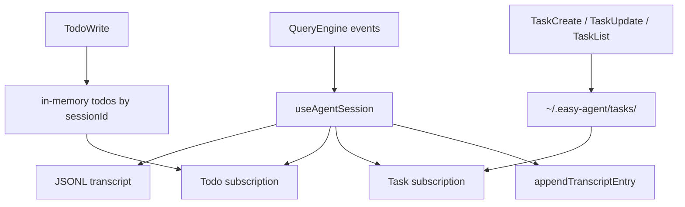
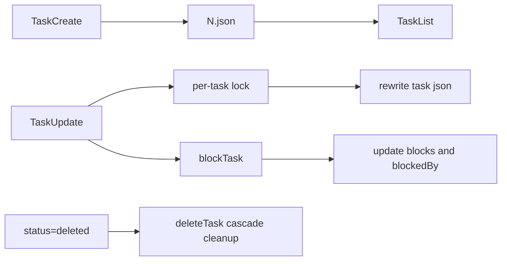

<details>
<summary>相关源文件</summary>

生成本页时使用的主要源文件：

- [src/session/storage.ts](https://github.com/ConardLi/easy-agent/blob/c24463e07dd136d41f6ab28edb33a3eaf0b209c1/src/session/storage.ts)
- [src/session/history.ts](https://github.com/ConardLi/easy-agent/blob/c24463e07dd136d41f6ab28edb33a3eaf0b209c1/src/session/history.ts)
- [src/state/todoStore.ts](https://github.com/ConardLi/easy-agent/blob/c24463e07dd136d41f6ab28edb33a3eaf0b209c1/src/state/todoStore.ts)
- [src/state/taskStore.ts](https://github.com/ConardLi/easy-agent/blob/c24463e07dd136d41f6ab28edb33a3eaf0b209c1/src/state/taskStore.ts)
- [src/state/taskModeStore.ts](https://github.com/ConardLi/easy-agent/blob/c24463e07dd136d41f6ab28edb33a3eaf0b209c1/src/state/taskModeStore.ts)
- [src/types/todo.ts](https://github.com/ConardLi/easy-agent/blob/c24463e07dd136d41f6ab28edb33a3eaf0b209c1/src/types/todo.ts)
- [src/types/task.ts](https://github.com/ConardLi/easy-agent/blob/c24463e07dd136d41f6ab28edb33a3eaf0b209c1/src/types/task.ts)
- [src/tools/todoWriteTool.ts](https://github.com/ConardLi/easy-agent/blob/c24463e07dd136d41f6ab28edb33a3eaf0b209c1/src/tools/todoWriteTool.ts)
- [src/tools/taskCreateTool.ts](https://github.com/ConardLi/easy-agent/blob/c24463e07dd136d41f6ab28edb33a3eaf0b209c1/src/tools/taskCreateTool.ts)
- [src/tools/taskUpdateTool.ts](https://github.com/ConardLi/easy-agent/blob/c24463e07dd136d41f6ab28edb33a3eaf0b209c1/src/tools/taskUpdateTool.ts)
- [src/tools/taskListTool.ts](https://github.com/ConardLi/easy-agent/blob/c24463e07dd136d41f6ab28edb33a3eaf0b209c1/src/tools/taskListTool.ts)
- [src/ui/hooks/useAgentSession.ts](https://github.com/ConardLi/easy-agent/blob/c24463e07dd136d41f6ab28edb33a3eaf0b209c1/src/ui/hooks/useAgentSession.ts)

</details>

# 会话持久化与任务系统

Easy Agent 把对话 transcript、会话恢复、临时 todo 和持久 task graph 分成三层：JSONL 会话日志负责 `/resume`，TodoWrite V1 负责进程内轻量进度展示，Task V2 负责跨重启保存的任务图。  
Sources: [src/session/storage.ts:37-43](../../../project-repos/easy-agent/src/session/storage.ts#L37-L43), [src/state/todoStore.ts:1-10](../../../project-repos/easy-agent/src/state/todoStore.ts#L1-L10), [src/state/taskStore.ts:1-24](../../../project-repos/easy-agent/src/state/taskStore.ts#L1-L24)

<details class="source-snippets">
<summary>引用源码</summary>

<!-- source-snippets:start -->

#### `src/session/storage.ts:37-43`

```typescript
export type TranscriptEntry =
  | { type: "session_meta"; sessionId: string; cwd: string; startedAt: string; model: string }
  | { type: "message"; timestamp: string; role: "user" | "assistant"; message: MessageParam }
  | { type: "tool_event"; timestamp: string; name: string; phase: "start" | "done"; resultLength?: number; isError?: boolean }
  | { type: "usage"; timestamp: string; turn: Usage; total: Usage }
  | { type: "system"; timestamp: string; level: "info" | "error"; message: string }
  | { type: "compaction"; timestamp: string; trigger: "auto" | "manual" };
```

#### `src/state/todoStore.ts:1-10`

```typescript
/**
 * TodoStore — V1 会话级任务清单的内存存储。
 *
 * 对应 Claude Code 源码中 `appState.todos[todoKey]` 的简化版本：
 *   - 按 sessionId 隔离（与源码用 `agentId ?? sessionId` 作 key 等价）
 *   - 全量替换语义（每次 TodoWrite 都覆盖该 session 的列表）
 *   - 通过 listener 通知订阅者（UI 可在此驱动 React 重渲染）
 *
 * 这是个 V1 的**会话内**存储——进程退出即丢失，跨会话不持续。
 * V2 (阶段 15) 会换成磁盘任务图。
```

#### `src/state/taskStore.ts:1-24`

```typescript
/**
 * Task V2 store — persistent task graph on disk.
 *
 * Replicates `claude-code-source-code/src/utils/tasks.ts`, dropping the
 * multi-agent pieces (teammate mailbox, claim-with-busy-check, team name
 * resolution) since Easy Agent is single-agent in stage 15.
 *
 * Layout (per task list):
 *
 *   ~/.easy-agent/tasks/<taskListId>/
 *     1.json
 *     2.json
 *     .highwatermark   <-- max id ever assigned, survives deletes/reset
 *     .lock            <-- proper-lockfile target for list-level ops
 *
 * One file per task gives us:
 *   - atomic per-task writes without reading the whole list
 *   - human-editable state (user can delete/move a single .json)
 *   - per-task locks so independent updates don't serialize
 *
 * `proper-lockfile` is used for list-level critical sections
 * (createTask, resetTaskList) to ensure id allocation and reset are
 * serialized across the process. Per-task updates use per-file locks.
 */
```

<!-- source-snippets:end -->
</details>


Sources: [src/ui/hooks/useAgentSession.ts:240-288](../../../project-repos/easy-agent/src/ui/hooks/useAgentSession.ts#L240-L288), [src/session/storage.ts:221-226](../../../project-repos/easy-agent/src/session/storage.ts#L221-L226), [src/tools/todoWriteTool.ts:112-149](../../../project-repos/easy-agent/src/tools/todoWriteTool.ts#L112-L149), [src/state/taskStore.ts:47-99](../../../project-repos/easy-agent/src/state/taskStore.ts#L47-L99)

<details class="source-snippets">
<summary>引用源码</summary>

<!-- source-snippets:start -->

#### `src/ui/hooks/useAgentSession.ts:240-288`

```typescript
  // Subscribe to TodoWrite updates. The store is global (mirrors source's
  // `appState.todos` map), so we filter by our own sessionId. When the
  // session is restored or cleared we also re-pull the snapshot.
  useEffect(() => {
    setTodosState(getTodos(sessionIdRef.current));
    const unsubscribe = subscribeTodos((sid, next) => {
      if (sid === sessionIdRef.current) {
        setTodosState(next);
      }
    });
    return unsubscribe;
  }, []);

  // Subscribe to Task V2 updates. Tasks live on disk, so on mount we do
  // one full listTasks to populate the initial view, then refresh every
  // time the store fires a change event for our task list id. Each
  // mutation already runs through the lock budget on the writer side,
  // so the reader doesn't need its own synchronization.
  useEffect(() => {
    let cancelled = false;
    const refresh = async () => {
      const taskListId = getTaskListId(sessionIdRef.current);
      try {
        const list = await listTasks(taskListId);
        if (!cancelled) setTasksState(list);
      } catch {
        // Ignore transient read errors — a future mutation will trigger
        // another refresh that can succeed.
      }
    };
    void refresh();
    const unsubscribe = subscribeTasks((taskListId) => {
      if (taskListId === getTaskListId(sessionIdRef.current)) {
        void refresh();
      }
    });
    return () => {
      cancelled = true;
      unsubscribe();
    };
  }, []);

  // Mirror the global task-mode store into local state so React re-renders
  // when the user flips `/tasks task|todo`. The global store is still the
  // source of truth — tools and permissions.ts read from it directly.
  useEffect(() => {
    setTaskModeState(getTaskMode());
    return subscribeTaskMode((mode) => setTaskModeState(mode));
  }, []);
```

#### `src/session/storage.ts:221-226`

```typescript
export async function appendTranscriptEntry(cwd: string, sessionId: string, entry: TranscriptEntry): Promise<void> {
  const paths = await getSessionPaths(cwd, sessionId);
  await ensureSessionDir(paths);
  await fs.appendFile(paths.transcriptPath, `${JSON.stringify(entry)}\n`, "utf-8");
  await fs.writeFile(paths.latestPath, `${sessionId}\n`, "utf-8");
}
```

#### `src/tools/todoWriteTool.ts:112-149`

```typescript
  async call(input: Record<string, unknown>, context: ToolContext): Promise<ToolResult> {
    const parsed = parseTodos(input);
    if (!Array.isArray(parsed)) {
      return { content: `Error: ${parsed.error}`, isError: true };
    }

    const sessionId = context.sessionId ?? "default";

    // Mirror source code: when every todo is `completed`, store an empty
    // list. The "all done" auto-clear keeps the UI from accumulating stale
    // checkmarks across long sessions.
    const allDone = parsed.length > 0 && parsed.every((t) => t.status === "completed");
    const newStored = allDone ? [] : parsed;
    setTodos(sessionId, newStored);

    // Result text matches source verbatim so the model gets the same
    // post-call nudge it expects from real Claude Code behavior.
    return {
      content:
        "Todos have been modified successfully. " +
        "Ensure that you continue to use the todo list to track your progress. " +
        "Please proceed with the current tasks if applicable",
    };
  },

  isReadOnly() {
    // Writes to in-memory session state — not the filesystem, but it does
    // mutate session-visible state, so we report it as non-read-only.
    // The permission layer special-cases this tool to always allow.
    return false;
  },

  isEnabled() {
    // Mirrors source's `!isTodoV2Enabled()` guard: TodoWrite V1 and the
    // Task V2 tools are mutually exclusive. The runtime toggle lives in
    // taskModeStore and is flipped by `/tasks task|todo`.
    return isTodoModeEnabled();
  },
```

#### `src/state/taskStore.ts:47-99`

```typescript
// ─── Path helpers ──────────────────────────────────────────────────

/**
 * File-path sanitization. We restrict taskListId / taskId components to
 * the character class `[A-Za-z0-9_-]` — anything else becomes `-`. This
 * blocks `../` traversal and arbitrary symlink targets the model might
 * dream up when it sees the raw session id.
 */
export function sanitizePathComponent(input: string): string {
  return input.replace(/[^A-Za-z0-9_-]/g, "-");
}

/**
 * Resolve a sessionId to the corresponding task-list id.
 *
 * Single-agent keeps this 1-to-1. The function exists mostly as a seam
 * for future multi-agent work (leader team name, teammate context) —
 * callers shouldn't assume sessionId itself is safe to use as a path.
 */
export function getTaskListId(sessionId: string): string {
  return sessionId || "default";
}

export function getTasksDir(taskListId: string): string {
  return path.join(getTasksRoot(), sanitizePathComponent(taskListId));
}

export function getTaskPath(taskListId: string, taskId: string): string {
  return path.join(getTasksDir(taskListId), `${sanitizePathComponent(taskId)}.json`);
}

async function ensureTasksDir(taskListId: string): Promise<void> {
  await mkdir(getTasksDir(taskListId), { recursive: true });
}

/**
 * Ensure the list-level lock file exists.
 *
 * `proper-lockfile` refuses to lock a path that doesn't exist, so we
 * touch an empty sentinel file first. The `wx` flag makes the creation
 * idempotent across concurrent callers — the second writer's EEXIST is
 * benign and swallowed.
 */
async function ensureTaskListLockFile(taskListId: string): Promise<string> {
  await ensureTasksDir(taskListId);
  const lockPath = path.join(getTasksDir(taskListId), LOCK_FILE);
  try {
    await writeFile(lockPath, "", { flag: "wx" });
  } catch {
    // Already exists — fine.
  }
  return lockPath;
}
```

<!-- source-snippets:end -->
</details>
## Transcript 模型

`TranscriptEntry` 是 append-only JSONL 事件流，覆盖 session metadata、user/assistant message、tool start/done、usage、system notice 和 compaction marker。会话路径由项目 key 决定，具体文件是 `<sessionId>.jsonl`，同目录还有 `latest` 指针。  
Sources: [src/session/storage.ts:12-43](../../../project-repos/easy-agent/src/session/storage.ts#L12-L43), [src/session/storage.ts:181-218](../../../project-repos/easy-agent/src/session/storage.ts#L181-L218)

<details class="source-snippets">
<summary>引用源码</summary>

<!-- source-snippets:start -->

#### `src/session/storage.ts:12-43`

```typescript
export interface SessionPaths {
  rootDir: string;
  projectDir: string;
  transcriptPath: string;
  latestPath: string;
}

export interface SessionMetadata {
  sessionId: string;
  cwd: string;
  startedAt: string;
  updatedAt: string;
  model: string;
}

export interface SessionSummary {
  sessionId: string;
  cwd: string;
  startedAt: string;
  updatedAt: string;
  model: string;
  messageCount: number;
  totalUsage: Usage;
}

export type TranscriptEntry =
  | { type: "session_meta"; sessionId: string; cwd: string; startedAt: string; model: string }
  | { type: "message"; timestamp: string; role: "user" | "assistant"; message: MessageParam }
  | { type: "tool_event"; timestamp: string; name: string; phase: "start" | "done"; resultLength?: number; isError?: boolean }
  | { type: "usage"; timestamp: string; turn: Usage; total: Usage }
  | { type: "system"; timestamp: string; level: "info" | "error"; message: string }
  | { type: "compaction"; timestamp: string; trigger: "auto" | "manual" };
```

#### `src/session/storage.ts:181-218`

```typescript
export function createSessionId(): string {
  return crypto.randomUUID();
}

export async function getProjectHash(cwd: string): Promise<string> {
  const info = await getProjectPathInfo(cwd);
  return info.projectKey;
}

export async function getSessionPaths(cwd: string, sessionId: string): Promise<SessionPaths> {
  const info = await getProjectPathInfo(cwd);
  return {
    rootDir: getEasyAgentHome(),
    projectDir: info.projectDir,
    transcriptPath: path.join(info.projectDir, `${sessionId}.jsonl`),
    latestPath: path.join(info.projectDir, "latest"),
  };
}

async function ensureSessionDir(paths: SessionPaths): Promise<void> {
  await fs.mkdir(paths.projectDir, { recursive: true });
}

export async function initSessionStorage(metadata: SessionMetadata): Promise<SessionPaths> {
  const paths = await getSessionPaths(metadata.cwd, metadata.sessionId);
  await ensureSessionDir(paths);

  const metaEntry: TranscriptEntry = {
    type: "session_meta",
    sessionId: metadata.sessionId,
    cwd: metadata.cwd,
    startedAt: metadata.startedAt,
    model: metadata.model,
  };

  await fs.writeFile(paths.transcriptPath, `${JSON.stringify(metaEntry)}\n`, { flag: "a" });
  await fs.writeFile(paths.latestPath, `${metadata.sessionId}\n`, "utf-8");
  return paths;
```

<!-- source-snippets:end -->
</details>
初始化会话时写入 `session_meta` 并更新 `latest`；每次追加事件也会重写 `latest`，所以 `/resume` 默认恢复最近一次活跃会话。  
Sources: [src/session/storage.ts:204-226](../../../project-repos/easy-agent/src/session/storage.ts#L204-L226), [src/session/storage.ts:238-247](../../../project-repos/easy-agent/src/session/storage.ts#L238-L247)

<details class="source-snippets">
<summary>引用源码</summary>

<!-- source-snippets:start -->

#### `src/session/storage.ts:204-226`

```typescript
export async function initSessionStorage(metadata: SessionMetadata): Promise<SessionPaths> {
  const paths = await getSessionPaths(metadata.cwd, metadata.sessionId);
  await ensureSessionDir(paths);

  const metaEntry: TranscriptEntry = {
    type: "session_meta",
    sessionId: metadata.sessionId,
    cwd: metadata.cwd,
    startedAt: metadata.startedAt,
    model: metadata.model,
  };

  await fs.writeFile(paths.transcriptPath, `${JSON.stringify(metaEntry)}\n`, { flag: "a" });
  await fs.writeFile(paths.latestPath, `${metadata.sessionId}\n`, "utf-8");
  return paths;
}

export async function appendTranscriptEntry(cwd: string, sessionId: string, entry: TranscriptEntry): Promise<void> {
  const paths = await getSessionPaths(cwd, sessionId);
  await ensureSessionDir(paths);
  await fs.appendFile(paths.transcriptPath, `${JSON.stringify(entry)}\n`, "utf-8");
  await fs.writeFile(paths.latestPath, `${sessionId}\n`, "utf-8");
}
```

#### `src/session/storage.ts:238-247`

```typescript
export async function getLatestSessionId(cwd: string): Promise<string | null> {
  const { latestPath } = await getSessionPaths(cwd, "placeholder");
  try {
    const value = (await fs.readFile(latestPath, "utf-8")).trim();
    return value || null;
  } catch (error: unknown) {
    const err = error as NodeJS.ErrnoException;
    if (err?.code === "ENOENT") return null;
    throw error;
  }
```

<!-- source-snippets:end -->
</details>
## 恢复语义

`restoreSession()` 先解析 JSONL，再定位最后一个 `compaction` marker，只把 marker 之后的 message 还原进模型上下文。它仍然从完整 transcript 中取最新 usage，用于 UI 的累计用量展示。  
Sources: [src/session/storage.ts:250-296](../../../project-repos/easy-agent/src/session/storage.ts#L250-L296)

<details class="source-snippets">
<summary>引用源码</summary>

<!-- source-snippets:start -->

#### `src/session/storage.ts:250-296`

```typescript
export async function restoreSession(cwd: string, sessionId?: string): Promise<RestoredSession> {
  const resolvedSessionId = sessionId ?? (await getLatestSessionId(cwd));
  if (!resolvedSessionId) {
    throw new Error("No saved session found for this project.");
  }

  const { transcriptPath } = await getSessionPaths(cwd, resolvedSessionId);
  const entries = await readTranscriptEntries(transcriptPath);
  if (entries.length === 0) {
    throw new Error(`Session ${resolvedSessionId} is empty or unreadable.`);
  }

  const meta = entries.find((entry): entry is Extract<TranscriptEntry, { type: "session_meta" }> => entry.type === "session_meta");
  if (!meta) {
    throw new Error(`Session ${resolvedSessionId} is missing session metadata.`);
  }

  // Find the last compaction marker; only use messages after it
  let startIndex = 0;
  for (let i = entries.length - 1; i >= 0; i--) {
    if (entries[i]!.type === "compaction") {
      startIndex = i + 1;
      break;
    }
  }
  const messages = entries
    .slice(startIndex)
    .filter((entry): entry is Extract<TranscriptEntry, { type: "message" }> => entry.type === "message")
    .map((entry) => entry.message);

  const latestUsage = [...entries]
    .reverse()
    .find((entry): entry is Extract<TranscriptEntry, { type: "usage" }> => entry.type === "usage");

  return {
    summary: {
      sessionId: meta.sessionId,
      cwd: meta.cwd,
      startedAt: meta.startedAt,
      updatedAt: getLastUpdatedAt(entries, meta.startedAt),
      model: meta.model,
      messageCount: messages.length,
      totalUsage: latestUsage?.total ?? createEmptyUsage(),
    },
    messages,
  };
}
```

<!-- source-snippets:end -->
</details>
`/history` 不是直接打印文件名，而是通过 `listProjectSessions()` 汇总最近 20 个 session，展示更新时间、消息数、token usage 和模型名。  
Sources: [src/session/storage.ts:319-362](../../../project-repos/easy-agent/src/session/storage.ts#L319-L362), [src/session/history.ts:1-29](../../../project-repos/easy-agent/src/session/history.ts#L1-L29), [src/core/queryEngine.ts:597-603](../../../project-repos/easy-agent/src/core/queryEngine.ts#L597-L603)

<details class="source-snippets">
<summary>引用源码</summary>

<!-- source-snippets:start -->

#### `src/session/storage.ts:319-362`

```typescript
export async function listProjectSessions(cwd: string, limit = MAX_SESSIONS): Promise<SessionSummary[]> {
  const projectDir = (await getSessionPaths(cwd, "placeholder")).projectDir;
  let entries: Dirent[];

  try {
    entries = await fs.readdir(projectDir, { withFileTypes: true });
  } catch (error: unknown) {
    const err = error as NodeJS.ErrnoException;
    if (err?.code === "ENOENT") return [];
    throw error;
  }

  const sessionFiles = entries
    .filter((entry) => entry.isFile() && entry.name.endsWith(".jsonl"))
    .map((entry) => path.join(projectDir, entry.name));

  const sessions = await Promise.all(
    sessionFiles.map(async (filePath) => {
      const transcriptEntries = await readTranscriptEntries(filePath);
      const meta = transcriptEntries.find((entry): entry is Extract<TranscriptEntry, { type: "session_meta" }> => entry.type === "session_meta");
      if (!meta) return null;

      const messages = transcriptEntries.filter((entry) => entry.type === "message");
      const latestUsage = [...transcriptEntries]
        .reverse()
        .find((entry): entry is Extract<TranscriptEntry, { type: "usage" }> => entry.type === "usage");

      return {
        sessionId: meta.sessionId,
        cwd: meta.cwd,
        startedAt: meta.startedAt,
        updatedAt: getLastUpdatedAt(transcriptEntries, meta.startedAt),
        model: meta.model,
        messageCount: messages.length,
        totalUsage: latestUsage?.total ?? createEmptyUsage(),
      } satisfies SessionSummary;
    }),
  );

  return sessions
    .filter((session): session is SessionSummary => session !== null)
    .sort((a, b) => b.updatedAt.localeCompare(a.updatedAt))
    .slice(0, limit);
}
```

#### `src/session/history.ts:1-29`

```typescript
import { listProjectSessions, type SessionSummary } from "./storage.js";

function formatSessionUsage(summary: SessionSummary): string {
  const total = summary.totalUsage.input_tokens + summary.totalUsage.output_tokens;
  return `${summary.totalUsage.input_tokens} in / ${summary.totalUsage.output_tokens} out / ${total} total`;
}

export async function formatProjectSessionHistory(cwd: string): Promise<string> {
  const sessions = await listProjectSessions(cwd);
  if (sessions.length === 0) {
    return "No saved sessions found for this project.";
  }

  const lines = ["Recent sessions:"];
  for (const session of sessions) {
    lines.push(
      [
        `- ${session.sessionId}`,
        `  Updated: ${session.updatedAt}`,
        `  Started: ${session.startedAt}`,
        `  Messages: ${session.messageCount}`,
        `  Usage: ${formatSessionUsage(session)}`,
        `  Model: ${session.model}`,
      ].join("\n"),
    );
  }

  return lines.join("\n");
}
```

#### `src/core/queryEngine.ts:597-603`

```typescript
      case "history":
        yield {
          type: "command",
          kind: "info",
          message: await formatProjectSessionHistory(this.toolContext.cwd),
        };
        return { handled: true };
```

<!-- source-snippets:end -->
</details>
## UI 写入点

UI hook 对 LLM 触发型输入写入用户原始文本，包括 skill slash invocation 的原始命令；工具开始和结束写入 `tool_event`；assistant message、tool_result message、usage、system notice 和 error 都分别追加 transcript entry。  
Sources: [src/ui/hooks/useAgentSession.ts:506-528](../../../project-repos/easy-agent/src/ui/hooks/useAgentSession.ts#L506-L528), [src/ui/hooks/useAgentSession.ts:551-640](../../../project-repos/easy-agent/src/ui/hooks/useAgentSession.ts#L551-L640), [src/ui/hooks/useAgentSession.ts:645-687](../../../project-repos/easy-agent/src/ui/hooks/useAgentSession.ts#L645-L687), [src/ui/hooks/useAgentSession.ts:773-785](../../../project-repos/easy-agent/src/ui/hooks/useAgentSession.ts#L773-L785)

<details class="source-snippets">
<summary>引用源码</summary>

<!-- source-snippets:start -->

#### `src/ui/hooks/useAgentSession.ts:506-528`

```typescript
    const skillCommandName = isSlashCommand
      ? trimmed.slice(1).split(/\s+/, 1)[0]?.toLowerCase() ?? ""
      : "";
    const isSkillCommand =
      isSlashCommand && !!skillCommandName && !!findSkill(skillCommandName);
    const isLlmTriggering = !isSlashCommand || isSkillCommand;

    cancelPendingText();
    setStreamingText("");
    setToolCalls([]);
    setSystemNotice(null);
    if (isLlmTriggering) {
      setLastUsage(null);
      // Persist what the user actually typed (`/hello-world Easy Agent`)
      // rather than the expanded SKILL.md body. The expanded prompt is
      // an internal/wire-only artifact — keeping the transcript clean
      // means /resume replays the same UX the user originally saw.
      await appendTranscriptEntry(toolContext.cwd, sessionIdRef.current, {
        type: "message",
        timestamp: new Date().toISOString(),
        role: "user",
        message: { role: "user", content: trimmed },
      });
```

#### `src/ui/hooks/useAgentSession.ts:551-640`

```typescript
        switch (value.type) {
          case "text":
            // Coalesce rapid SSE chunks into a 30ms window. Without this
            // every chunk forces a full Ink frame repaint, and combined
            // with the TodoList / ToolCallList above it the terminal
            // flickers and refuses to scroll.
            pendingTextRef.current += value.text;
            if (!flushTimerRef.current) {
              flushTimerRef.current = setTimeout(flushPendingText, 30);
            }
            break;
          case "tool_use_start":
            setToolCalls((prev) => [...prev, { id: value.id, name: value.name }]);
            await appendTranscriptEntry(toolContext.cwd, sessionIdRef.current, {
              type: "tool_event",
              timestamp: new Date().toISOString(),
              name: value.name,
              phase: "start",
            });
            break;
          case "permission_request":
            setSpinnerLabel("Waiting for permission");
            setPermissionPrompt({
              toolName: value.request.toolName,
              summary: value.request.summary,
              risk: value.request.risk,
              ruleHint: value.request.ruleHint,
            });
            break;
          case "tool_use_done": {
            const isPlanFileWrite =
              (value.name === "Write" || value.name === "Edit") &&
              value.result.content.includes(getPlansDirectory());
            const inputPreview = formatToolInputPreview(value.input);
            // Strip the model-only <sandbox_violations> tag from the
            // user-visible error message. The tag stays in the tool
            // result that goes back to the model (so it can interpret
            // sandbox denials), but humans see clean stderr only.
            const rawErrorMessage = value.result.isError ? value.result.content : undefined;
            const errorMessage = rawErrorMessage
              ? removeSandboxViolationTags(rawErrorMessage)
              : undefined;
            setToolCalls((prev) =>
              markToolCallComplete(prev, value.id, {
                resultLength: value.result.content.length,
                isError: value.result.isError,
                displayName: isPlanFileWrite ? "Updated plan" : undefined,
                displayHint: isPlanFileWrite ? "/plan to preview" : undefined,
                inputPreview,
                errorMessage,
              }),
            );
            await appendTranscriptEntry(toolContext.cwd, sessionIdRef.current, {
              type: "tool_event",
              timestamp: new Date().toISOString(),
              name: value.name,
              phase: "done",
              resultLength: value.result.content.length,
              isError: value.result.isError,
            });
            break;
          }
          case "assistant_message":
            // The full assistant text is committed to `messages` and will
            // render via ConversationView. Drop any unflushed pending
            // chunk so it can't overwrite the cleared streaming line.
            cancelPendingText();
            setStreamingText("");
            await appendTranscriptEntry(toolContext.cwd, sessionIdRef.current, {
              type: "message",
              timestamp: new Date().toISOString(),
              role: "assistant",
              message: value.message,
            });
            break;
          case "tool_result_message":
            setSpinnerLabel("Thinking");
            setPermissionPrompt(null);
            // Tool results are now committed to `messages` — the cards
            // will render inline in ConversationView from here on, so we
            // drop the live in-flight cards to avoid duplication and, more
            // importantly, to keep the final assistant text rendered
            // BELOW its tool calls (not above them).
            setToolCalls([]);
            await appendTranscriptEntry(toolContext.cwd, sessionIdRef.current, {
              type: "message",
              timestamp: new Date().toISOString(),
              role: "user",
              message: value.message,
            });
```

#### `src/ui/hooks/useAgentSession.ts:645-687`

```typescript
          case "usage_updated":
            {
              const engineMessages = engineRef.current?.getState().messages ?? [];
              const usageAnchorIndex = engineMessages.length > 0 ? engineMessages.length - 1 : -1;
              const snapshot = buildTokenBudgetSnapshot(engineMessages, {
                usage: value.lastCallUsage,
                usageAnchorIndex,
              });
              const contextPercent = Math.round((snapshot.estimatedConversationTokens / snapshot.contextWindow) * 100);
              const turnInput = value.turnUsage.input_tokens
                + (value.turnUsage.cache_creation_input_tokens ?? 0)
                + (value.turnUsage.cache_read_input_tokens ?? 0);
              const totalInput = value.totalUsage.input_tokens
                + (value.totalUsage.cache_creation_input_tokens ?? 0)
                + (value.totalUsage.cache_read_input_tokens ?? 0);
              setLastUsage({
                input: turnInput,
                output: value.turnUsage.output_tokens,
                contextTokens: snapshot.estimatedConversationTokens,
                contextPercent,
              });
              setTotalUsage({
                input: totalInput,
                output: value.totalUsage.output_tokens,
                contextTokens: snapshot.estimatedConversationTokens,
                contextPercent,
              });
            }
            await appendTranscriptEntry(toolContext.cwd, sessionIdRef.current, {
              type: "usage",
              timestamp: new Date().toISOString(),
              turn: value.turnUsage,
              total: value.totalUsage,
            });
            break;
          case "command":
            setSystemNotice(buildCommandNotice(value.message, value.kind));
            await appendTranscriptEntry(toolContext.cwd, sessionIdRef.current, {
              type: "system",
              timestamp: new Date().toISOString(),
              level: value.kind,
              message: value.message,
            });
```

#### `src/ui/hooks/useAgentSession.ts:773-785`

```typescript
          case "error":
            setSystemNotice({
              tone: "error",
              title: "Agent error",
              body: value.error.message,
            });
            await appendTranscriptEntry(toolContext.cwd, sessionIdRef.current, {
              type: "system",
              timestamp: new Date().toISOString(),
              level: "error",
              message: value.error.message,
            });
            break;
```

<!-- source-snippets:end -->
</details>
非 micro compaction 会走 `appendCompactionSnapshot()`：先写一个 compaction marker，再把压缩后的 message snapshot 追加到 transcript。恢复时只读取 marker 之后的 message，避免旧上下文和 summary 同时进入模型。  
Sources: [src/session/storage.ts:267-278](../../../project-repos/easy-agent/src/session/storage.ts#L267-L278), [src/session/storage.ts:298-317](../../../project-repos/easy-agent/src/session/storage.ts#L298-L317), [src/ui/hooks/useAgentSession.ts:689-715](../../../project-repos/easy-agent/src/ui/hooks/useAgentSession.ts#L689-L715)

<details class="source-snippets">
<summary>引用源码</summary>

<!-- source-snippets:start -->

#### `src/session/storage.ts:267-278`

```typescript
  // Find the last compaction marker; only use messages after it
  let startIndex = 0;
  for (let i = entries.length - 1; i >= 0; i--) {
    if (entries[i]!.type === "compaction") {
      startIndex = i + 1;
      break;
    }
  }
  const messages = entries
    .slice(startIndex)
    .filter((entry): entry is Extract<TranscriptEntry, { type: "message" }> => entry.type === "message")
    .map((entry) => entry.message);
```

#### `src/session/storage.ts:298-317`

```typescript
export async function appendCompactionSnapshot(
  cwd: string,
  sessionId: string,
  trigger: "auto" | "manual",
  messages: MessageParam[],
): Promise<void> {
  const paths = await getSessionPaths(cwd, sessionId);
  await ensureSessionDir(paths);
  const lines: string[] = [];
  lines.push(JSON.stringify({ type: "compaction", timestamp: new Date().toISOString(), trigger }));
  for (const msg of messages) {
    lines.push(JSON.stringify({
      type: "message",
      timestamp: new Date().toISOString(),
      role: msg.role,
      message: msg,
    }));
  }
  await fs.appendFile(paths.transcriptPath, lines.join("\n") + "\n", "utf-8");
}
```

#### `src/ui/hooks/useAgentSession.ts:689-715`

```typescript
          case "compacted": {
            const compactTitle = value.trigger === "micro"
              ? "Context micro-compacted"
              : value.trigger === "auto"
                ? "Context auto-compacted"
                : "Conversation compacted";
            const compactBody = value.trigger === "micro"
              ? "Old tool results cleared to save context space."
              : "Conversation history has been summarized to free up context window.";
            setSystemNotice({ tone: "info", title: compactTitle, body: compactBody });
            if (value.trigger !== "micro") {
              const compactedMessages = engineRef.current?.getState().messages ?? [];
              await appendCompactionSnapshot(
                toolContext.cwd,
                sessionIdRef.current,
                value.trigger as "auto" | "manual",
                compactedMessages,
              );
            } else {
              await appendTranscriptEntry(toolContext.cwd, sessionIdRef.current, {
                type: "system",
                timestamp: new Date().toISOString(),
                level: "info",
                message: `compaction:${value.trigger}`,
              });
            }
            break;
```

<!-- source-snippets:end -->
</details>
## TodoWrite V1

Todo V1 是按 sessionId 隔离的内存 Map。它只有 `content`、`status`、`activeForm` 三个字段，没有 id、依赖、owner，也不跨进程持久化。  
Sources: [src/types/todo.ts:1-20](../../../project-repos/easy-agent/src/types/todo.ts#L1-L20), [src/state/todoStore.ts:13-49](../../../project-repos/easy-agent/src/state/todoStore.ts#L13-L49)

<details class="source-snippets">
<summary>引用源码</summary>

<!-- source-snippets:start -->

#### `src/types/todo.ts:1-20`

```typescript
/**
 * TodoItem — V1 会话级任务清单的数据结构。
 *
 * 严格对齐 Claude Code 源码 `src/utils/todo/types.ts`：
 *   - 三种状态：pending / in_progress / completed
 *   - 没有 `id` 字段（content 自身即标识）
 *   - 同时要求 `content`（祈使句）和 `activeForm`（现在进行时）
 *     —— 后者是 spinner 文案的关键字段
 */

export type TodoStatus = "pending" | "in_progress" | "completed";

export interface TodoItem {
  /** 祈使句任务描述，如 "Run the tests"。 */
  content: string;
  /** 任务状态。 */
  status: TodoStatus;
  /** 现在进行时形式，in_progress 时给 spinner 显示，如 "Running the tests"。 */
  activeForm: string;
}
```

#### `src/state/todoStore.ts:13-49`

```typescript
import type { TodoItem } from "../types/todo.js";

type Listener = (sessionId: string, todos: TodoItem[]) => void;

const todosBySession = new Map<string, TodoItem[]>();
const listeners = new Set<Listener>();

/** 读取某 session 当前的 todos（不存在则返回空数组）。 */
export function getTodos(sessionId: string): TodoItem[] {
  return todosBySession.get(sessionId) ?? [];
}

/** 全量替换某 session 的 todos，并通知所有订阅者。 */
export function setTodos(sessionId: string, todos: TodoItem[]): void {
  todosBySession.set(sessionId, todos);
  for (const listener of listeners) {
    listener(sessionId, todos);
  }
}

/**
 * 订阅 todos 变化。返回的函数用于取消订阅。
 *
 * 注意：所有 session 的更新都会推送到 listener，订阅方要自己按
 * sessionId 过滤——这与源码 AppState 的"全局 store + 本地过滤"一致。
 */
export function subscribeTodos(listener: Listener): () => void {
  listeners.add(listener);
  return () => {
    listeners.delete(listener);
  };
}

/** 测试/重置用：清空某 session 的 todos。 */
export function clearTodos(sessionId: string): void {
  setTodos(sessionId, []);
}
```

<!-- source-snippets:end -->
</details>
`TodoWrite` 输入是完整 todo 列表，每次调用都会全量替换当前 session 的状态；如果所有 todo 都是 `completed`，它存空数组，避免 UI 长期堆积已完成项。该工具只在 `todo` 模式启用。  
Sources: [src/tools/todoWriteTool.ts:1-18](../../../project-repos/easy-agent/src/tools/todoWriteTool.ts#L1-L18), [src/tools/todoWriteTool.ts:68-149](../../../project-repos/easy-agent/src/tools/todoWriteTool.ts#L68-L149)

<details class="source-snippets">
<summary>引用源码</summary>

<!-- source-snippets:start -->

#### `src/tools/todoWriteTool.ts:1-18`

```typescript
/**
 * TodoWriteTool — V1 会话级任务清单工具。
 *
 * 严格参照 Claude Code 源码 `tools/TodoWriteTool/TodoWriteTool.ts` 的语义：
 *
 *   1. 输入只有一个 `todos: TodoItem[]`，每次**全量替换**之前的列表
 *   2. allDone（全部 completed）→ 存为空数组，"用完即归零"
 *   3. 状态写入按 sessionId 隔离的内存 store（对应源码的
 *      `appState.todos[agentId ?? sessionId]`）
 *   4. tool result 文本与源码一致："Todos have been modified successfully..."
 *   5. 权限层面：源码用 `shouldDefer: true` + `checkPermissions: allow`
 *      ——本仓库在 `permissions.ts` 里把 TodoWrite 写成全模式 allow
 *
 * V1 的三个内生限制（待 V2 解决）：
 *   - 仅会话内（进程退出即失）
 *   - 平铺列表，无依赖关系
 *   - 单 agent，无 owner / claim
 */
```

#### `src/tools/todoWriteTool.ts:68-149`

```typescript
export const todoWriteTool: Tool = {
  name: TODO_WRITE_TOOL_NAME,

  description:
    "Update the todo list for the current session. To be used proactively and often to track progress and pending tasks. " +
    "Make sure that at least one task is in_progress at all times. " +
    "Always provide both content (imperative) and activeForm (present continuous) for each task.",

  inputSchema: {
    type: "object" as const,
    properties: {
      todos: {
        type: "array",
        description: "The full updated todo list. Each call REPLACES the entire list.",
        items: {
          type: "object",
          properties: {
            content: {
              type: "string",
              minLength: 1,
              description: "Imperative task description, e.g. 'Run the tests'.",
            },
            status: {
              type: "string",
              enum: ["pending", "in_progress", "completed"],
              description:
                "Task status. Exactly ONE task should be in_progress at any time.",
            },
            activeForm: {
              type: "string",
              minLength: 1,
              description:
                "Present continuous form shown in the spinner while the task runs, e.g. 'Running the tests'.",
            },
          },
          required: ["content", "status", "activeForm"],
          additionalProperties: false,
        },
      },
    },
    required: ["todos"],
    additionalProperties: false,
  },

  async call(input: Record<string, unknown>, context: ToolContext): Promise<ToolResult> {
    const parsed = parseTodos(input);
    if (!Array.isArray(parsed)) {
      return { content: `Error: ${parsed.error}`, isError: true };
    }

    const sessionId = context.sessionId ?? "default";

    // Mirror source code: when every todo is `completed`, store an empty
    // list. The "all done" auto-clear keeps the UI from accumulating stale
    // checkmarks across long sessions.
    const allDone = parsed.length > 0 && parsed.every((t) => t.status === "completed");
    const newStored = allDone ? [] : parsed;
    setTodos(sessionId, newStored);

    // Result text matches source verbatim so the model gets the same
    // post-call nudge it expects from real Claude Code behavior.
    return {
      content:
        "Todos have been modified successfully. " +
        "Ensure that you continue to use the todo list to track your progress. " +
        "Please proceed with the current tasks if applicable",
    };
  },

  isReadOnly() {
    // Writes to in-memory session state — not the filesystem, but it does
    // mutate session-visible state, so we report it as non-read-only.
    // The permission layer special-cases this tool to always allow.
    return false;
  },

  isEnabled() {
    // Mirrors source's `!isTodoV2Enabled()` guard: TodoWrite V1 and the
    // Task V2 tools are mutually exclusive. The runtime toggle lives in
    // taskModeStore and is flipped by `/tasks task|todo`.
    return isTodoModeEnabled();
  },
```

<!-- source-snippets:end -->
</details>
## Task V2 持久任务图

Task V2 默认启用，任务被写到 `~/.easy-agent/tasks/<taskListId>/` 下，每个任务一个 JSON 文件，并用 `.highwatermark` 保存历史最大 id，用 `.lock` 做列表级互斥。这个布局让任务跨重启保存，并避免 reset/delete 后复用旧 id。  
Sources: [src/state/taskModeStore.ts:1-17](../../../project-repos/easy-agent/src/state/taskModeStore.ts#L1-L17), [src/state/taskStore.ts:1-24](../../../project-repos/easy-agent/src/state/taskStore.ts#L1-L24), [src/state/taskStore.ts:47-99](../../../project-repos/easy-agent/src/state/taskStore.ts#L47-L99), [src/state/taskStore.ts:101-145](../../../project-repos/easy-agent/src/state/taskStore.ts#L101-L145)

<details class="source-snippets">
<summary>引用源码</summary>

<!-- source-snippets:start -->

#### `src/state/taskModeStore.ts:1-17`

```typescript
/**
 * Task-tracking mode — runtime toggle between Task V2 and TodoWrite V1.
 *
 * Claude Code uses an env var (`CLAUDE_CODE_ENABLE_TASKS`) read at boot
 * time. We deliberately lift that into a REPL command (`/tasks task|todo`)
 * so the user can flip modes inside a live session without restarting.
 *
 * `"task"` is the default (persistent task graph). `"todo"` falls back
 * to the V1 session-memory list. The selection is process-global: all
 * tool `isEnabled()` checks read from here.
 */

export type TaskMode = "task" | "todo";

const DEFAULT_TASK_MODE: TaskMode = "task";

let currentMode: TaskMode = DEFAULT_TASK_MODE;
```

#### `src/state/taskStore.ts:1-24`

```typescript
/**
 * Task V2 store — persistent task graph on disk.
 *
 * Replicates `claude-code-source-code/src/utils/tasks.ts`, dropping the
 * multi-agent pieces (teammate mailbox, claim-with-busy-check, team name
 * resolution) since Easy Agent is single-agent in stage 15.
 *
 * Layout (per task list):
 *
 *   ~/.easy-agent/tasks/<taskListId>/
 *     1.json
 *     2.json
 *     .highwatermark   <-- max id ever assigned, survives deletes/reset
 *     .lock            <-- proper-lockfile target for list-level ops
 *
 * One file per task gives us:
 *   - atomic per-task writes without reading the whole list
 *   - human-editable state (user can delete/move a single .json)
 *   - per-task locks so independent updates don't serialize
 *
 * `proper-lockfile` is used for list-level critical sections
 * (createTask, resetTaskList) to ensure id allocation and reset are
 * serialized across the process. Per-task updates use per-file locks.
 */
```

#### `src/state/taskStore.ts:47-99`

```typescript
// ─── Path helpers ──────────────────────────────────────────────────

/**
 * File-path sanitization. We restrict taskListId / taskId components to
 * the character class `[A-Za-z0-9_-]` — anything else becomes `-`. This
 * blocks `../` traversal and arbitrary symlink targets the model might
 * dream up when it sees the raw session id.
 */
export function sanitizePathComponent(input: string): string {
  return input.replace(/[^A-Za-z0-9_-]/g, "-");
}

/**
 * Resolve a sessionId to the corresponding task-list id.
 *
 * Single-agent keeps this 1-to-1. The function exists mostly as a seam
 * for future multi-agent work (leader team name, teammate context) —
 * callers shouldn't assume sessionId itself is safe to use as a path.
 */
export function getTaskListId(sessionId: string): string {
  return sessionId || "default";
}

export function getTasksDir(taskListId: string): string {
  return path.join(getTasksRoot(), sanitizePathComponent(taskListId));
}

export function getTaskPath(taskListId: string, taskId: string): string {
  return path.join(getTasksDir(taskListId), `${sanitizePathComponent(taskId)}.json`);
}

async function ensureTasksDir(taskListId: string): Promise<void> {
  await mkdir(getTasksDir(taskListId), { recursive: true });
}

/**
 * Ensure the list-level lock file exists.
 *
 * `proper-lockfile` refuses to lock a path that doesn't exist, so we
 * touch an empty sentinel file first. The `wx` flag makes the creation
 * idempotent across concurrent callers — the second writer's EEXIST is
 * benign and swallowed.
 */
async function ensureTaskListLockFile(taskListId: string): Promise<string> {
  await ensureTasksDir(taskListId);
  const lockPath = path.join(getTasksDir(taskListId), LOCK_FILE);
  try {
    await writeFile(lockPath, "", { flag: "wx" });
  } catch {
    // Already exists — fine.
  }
  return lockPath;
}
```

#### `src/state/taskStore.ts:101-145`

```typescript
// ─── High water mark ───────────────────────────────────────────────

function getHighWaterMarkPath(taskListId: string): string {
  return path.join(getTasksDir(taskListId), HIGH_WATER_MARK_FILE);
}

async function readHighWaterMark(taskListId: string): Promise<number> {
  try {
    const content = (await readFile(getHighWaterMarkPath(taskListId), "utf-8")).trim();
    const value = parseInt(content, 10);
    return Number.isNaN(value) ? 0 : value;
  } catch {
    return 0;
  }
}

async function writeHighWaterMark(taskListId: string, value: number): Promise<void> {
  await writeFile(getHighWaterMarkPath(taskListId), String(value));
}

async function findHighestTaskIdFromFiles(taskListId: string): Promise<number> {
  let files: string[];
  try {
    files = await readdir(getTasksDir(taskListId));
  } catch {
    return 0;
  }
  let highest = 0;
  for (const file of files) {
    if (!file.endsWith(".json")) continue;
    const parsed = parseInt(file.replace(".json", ""), 10);
    if (!Number.isNaN(parsed) && parsed > highest) {
      highest = parsed;
    }
  }
  return highest;
}

async function findHighestTaskId(taskListId: string): Promise<number> {
  const [fromFiles, fromMark] = await Promise.all([
    findHighestTaskIdFromFiles(taskListId),
    readHighWaterMark(taskListId),
  ]);
  return Math.max(fromFiles, fromMark);
}
```

<!-- source-snippets:end -->
</details>
Task schema 用递增字符串 id，包含 `subject`、`description`、可选 `activeForm`、`owner`、`status`、`blocks`、`blockedBy` 和 `metadata`。`owner` 与 metadata 为后续多 agent/扩展保留，当前单 agent 流程不会依赖它们。  
Sources: [src/types/task.ts:1-36](../../../project-repos/easy-agent/src/types/task.ts#L1-L36)

<details class="source-snippets">
<summary>引用源码</summary>

<!-- source-snippets:start -->

#### `src/types/task.ts:1-36`

```typescript
/**
 * Task V2 data model.
 *
 * Mirrors `claude-code-source-code/src/utils/tasks.ts::TaskSchema`:
 *   - id is an incrementing numeric string ("1", "2", ...), stable across
 *     restarts thanks to the high water mark file.
 *   - `blocks` / `blockedBy` store task ids, maintained bidirectionally by
 *     the store so the model only has to set one side.
 *   - `owner` is kept in the schema for forward-compat with multi-agent
 *     (stage 24+). Single-agent never writes it.
 *   - `metadata` is a free-form bag for tool-specific state (e.g. hooks,
 *     verification flags). Nothing in V2 depends on it.
 */

export const TASK_STATUSES = ["pending", "in_progress", "completed"] as const;
export type TaskStatus = (typeof TASK_STATUSES)[number];

export interface Task {
  /** Incrementing numeric id as string. */
  id: string;
  /** Imperative one-liner, e.g. "Run the tests". */
  subject: string;
  /** Detailed description of the work. */
  description: string;
  /** Present-continuous form shown in the spinner when in_progress. */
  activeForm?: string;
  /** Agent id that owns the task. Multi-agent hook; single-agent leaves empty. */
  owner?: string;
  status: TaskStatus;
  /** Task ids this task blocks (downstream). */
  blocks: string[];
  /** Task ids that block this task (upstream). */
  blockedBy: string[];
  /** Arbitrary tool-specific metadata. */
  metadata?: Record<string, unknown>;
}
```

<!-- source-snippets:end -->
</details>


Sources: [src/tools/taskCreateTool.ts:25-93](../../../project-repos/easy-agent/src/tools/taskCreateTool.ts#L25-L93), [src/tools/taskUpdateTool.ts:63-200](../../../project-repos/easy-agent/src/tools/taskUpdateTool.ts#L63-L200), [src/state/taskStore.ts:210-411](../../../project-repos/easy-agent/src/state/taskStore.ts#L210-L411)

<details class="source-snippets">
<summary>引用源码</summary>

<!-- source-snippets:start -->

#### `src/tools/taskCreateTool.ts:25-93`

```typescript
export const taskCreateTool: Tool = {
  name: TOOL_NAME,

  description:
    "Create a structured task for the current session's persistent task graph. " +
    "Tasks survive restarts and /clear, and support dependencies via blocks/blockedBy. " +
    "Use proactively for 3+ step work, multi-step plans, and any task list the user would want to see across sessions.",

  inputSchema: {
    type: "object" as const,
    properties: {
      subject: {
        type: "string",
        minLength: 1,
        description: "Imperative one-line title, e.g. 'Fix login bug'.",
      },
      description: {
        type: "string",
        minLength: 1,
        description: "What needs to be done. One or two paragraphs is fine.",
      },
      activeForm: {
        type: "string",
        description:
          "Present-continuous form shown in the spinner when the task is in_progress, e.g. 'Fixing login bug'. If omitted, the subject is used.",
      },
      metadata: {
        type: "object",
        additionalProperties: true,
        description: "Free-form metadata attached to the task.",
      },
    },
    required: ["subject", "description"],
    additionalProperties: false,
  },

  async call(input: Record<string, unknown>, context: ToolContext): Promise<ToolResult> {
    const subject = pickString(input, "subject")?.trim();
    const description = pickString(input, "description")?.trim();
    const activeForm = pickString(input, "activeForm")?.trim();
    const metadata = input.metadata && typeof input.metadata === "object" && !Array.isArray(input.metadata)
      ? (input.metadata as Record<string, unknown>)
      : undefined;

    if (!subject) return { content: "Error: `subject` must be a non-empty string.", isError: true };
    if (!description) return { content: "Error: `description` must be a non-empty string.", isError: true };

    const taskListId = getTaskListId(context.sessionId ?? "default");
    const id = await createTask(taskListId, {
      subject,
      description,
      activeForm: activeForm || undefined,
      status: "pending",
      blocks: [],
      blockedBy: [],
      metadata,
    });

    return { content: `Task #${id} created: ${subject}` };
  },

  isReadOnly() {
    return false;
  },

  isEnabled() {
    return isTaskModeEnabled();
  },
};
```

#### `src/tools/taskUpdateTool.ts:63-200`

```typescript
export const taskUpdateTool: Tool = {
  name: TOOL_NAME,

  description:
    "Update a task in the persistent task graph. Use this to mark progress " +
    "(pending → in_progress → completed), edit fields, add dependencies, or delete " +
    "tasks by setting status to 'deleted'. Always read the task's latest state with TaskGet before editing.",

  inputSchema: {
    type: "object" as const,
    properties: {
      taskId: { type: "string", minLength: 1, description: "The id of the task to update." },
      subject: { type: "string", description: "New subject (imperative form)." },
      description: { type: "string", description: "New description." },
      activeForm: {
        type: "string",
        description: "Present-continuous form shown in the spinner while the task is in_progress.",
      },
      status: {
        type: "string",
        enum: ["pending", "in_progress", "completed", "deleted"],
        description: "New status. 'deleted' removes the task and cleans up references.",
      },
      addBlocks: {
        type: "array",
        items: { type: "string" },
        description: "Task ids that this task blocks (downstream dependencies).",
      },
      addBlockedBy: {
        type: "array",
        items: { type: "string" },
        description: "Task ids that block this task (upstream dependencies).",
      },
      metadata: {
        type: "object",
        additionalProperties: true,
        description: "Metadata keys to merge. Set a key to null to delete it.",
      },
    },
    required: ["taskId"],
    additionalProperties: false,
  },

  async call(input: Record<string, unknown>, context: ToolContext): Promise<ToolResult> {
    const taskId = pickString(input, "taskId")?.trim();
    if (!taskId) return { content: "Error: `taskId` is required.", isError: true };

    const taskListId = getTaskListId(context.sessionId ?? "default");
    const existing = await getTask(taskListId, taskId);
    if (!existing) return { content: `Task #${taskId} not found`, isError: true };

    // Short-circuit status="deleted": run the cascading delete and
    // return immediately. Any other updates in the same call are
    // ignored — deleting a task means the edits are moot anyway.
    const rawStatus = pickString(input, "status");
    if (rawStatus !== undefined && !UPDATE_STATUSES.has(rawStatus)) {
      return { content: `Error: invalid status '${rawStatus}'.`, isError: true };
    }
    const statusValue = rawStatus as UpdateStatus | undefined;

    if (statusValue === "deleted") {
      const ok = await deleteTask(taskListId, taskId);
      return ok
        ? { content: `Task #${taskId} deleted.` }
        : { content: `Failed to delete task #${taskId}.`, isError: true };
    }

    const updates: Partial<Omit<Task, "id">> = {};
    const updatedFields: string[] = [];

    const subject = pickString(input, "subject");
    if (subject !== undefined && subject !== existing.subject) {
      updates.subject = subject;
      updatedFields.push("subject");
    }
    const description = pickString(input, "description");
    if (description !== undefined && description !== existing.description) {
      updates.description = description;
      updatedFields.push("description");
    }
    const activeForm = pickString(input, "activeForm");
    if (activeForm !== undefined && activeForm !== existing.activeForm) {
      updates.activeForm = activeForm;
      updatedFields.push("activeForm");
    }
    if (statusValue !== undefined && statusValue !== existing.status) {
      updates.status = statusValue;
      updatedFields.push("status");
    }
    if (input.metadata && typeof input.metadata === "object" && !Array.isArray(input.metadata)) {
      updates.metadata = mergeMetadata(existing.metadata, input.metadata as Record<string, unknown>);
      updatedFields.push("metadata");
    }

    if (Object.keys(updates).length > 0) {
      await updateTask(taskListId, taskId, updates);
    }

    // Dependency wires run AFTER the main update so both sides of each
    // block/blockedBy pair see the freshest state. blockTask maintains
    // both directions so the graph stays consistent even if the model
    // only names one side.
    const addBlocks = pickStringArray(input, "addBlocks");
    if (addBlocks && addBlocks.length > 0) {
      let changed = false;
      for (const downstreamId of addBlocks) {
        if (existing.blocks.includes(downstreamId)) continue;
        const ok = await blockTask(taskListId, taskId, downstreamId);
        if (ok) changed = true;
      }
      if (changed) updatedFields.push("blocks");
    }

    const addBlockedBy = pickStringArray(input, "addBlockedBy");
    if (addBlockedBy && addBlockedBy.length > 0) {
      let changed = false;
      for (const upstreamId of addBlockedBy) {
        if (existing.blockedBy.includes(upstreamId)) continue;
        const ok = await blockTask(taskListId, upstreamId, taskId);
        if (ok) changed = true;
... snippet truncated ...
```

#### `src/state/taskStore.ts:210-411`

```typescript
export async function createTask(
  taskListId: string,
  data: Omit<Task, "id">,
): Promise<string> {
  const lockPath = await ensureTaskListLockFile(taskListId);
  const release = await lockfile.lock(lockPath, LOCK_OPTIONS);
  try {
    const highest = await findHighestTaskId(taskListId);
    const id = String(highest + 1);
    const task: Task = { id, ...data };
    await writeFile(getTaskPath(taskListId, id), JSON.stringify(task, null, 2));
    notifyTasksUpdated(taskListId);
    return id;
  } finally {
    await release();
  }
}

export async function getTask(taskListId: string, taskId: string): Promise<Task | null> {
  try {
    const content = await readFile(getTaskPath(taskListId, taskId), "utf-8");
    return parseTask(JSON.parse(content));
  } catch (error: unknown) {
    const err = error as NodeJS.ErrnoException;
    if (err?.code === "ENOENT") return null;
    return null;
  }
}

export async function listTasks(taskListId: string): Promise<Task[]> {
  let files: string[];
  try {
    files = await readdir(getTasksDir(taskListId));
  } catch {
    return [];
  }
  const ids = files.filter((f) => f.endsWith(".json") && !f.startsWith(".")).map((f) => f.replace(".json", ""));
  const tasks = await Promise.all(ids.map((id) => getTask(taskListId, id)));
  return tasks.filter((t): t is Task => t !== null);
}

/**
 * Internal update primitive — caller must already hold the per-task lock.
 * Used by deleteTask's cascade to avoid acquiring a lock we already own.
 */
async function updateTaskUnsafe(
  taskListId: string,
  taskId: string,
  updates: Partial<Omit<Task, "id">>,
): Promise<Task | null> {
  const existing = await getTask(taskListId, taskId);
  if (!existing) return null;
  const updated: Task = { ...existing, ...updates, id: taskId };
  await writeFile(getTaskPath(taskListId, taskId), JSON.stringify(updated, null, 2));
  notifyTasksUpdated(taskListId);
  return updated;
}

/**
 * Update a task. Per-task lock isolates concurrent updates to different
 * tasks — only concurrent updates to the SAME task serialize.
 */
export async function updateTask(
  taskListId: string,
  taskId: string,
  updates: Partial<Omit<Task, "id">>,
): Promise<Task | null> {
  // Check existence BEFORE locking: proper-lockfile throws if the target
  // path doesn't exist, and we want a clean null return for the benign
  // "task was already deleted" case.
  const pre = await getTask(taskListId, taskId);
  if (!pre) return null;

  const release = await lockfile.lock(getTaskPath(taskListId, taskId), LOCK_OPTIONS);
  try {
    return await updateTaskUnsafe(taskListId, taskId, updates);
  } finally {
    await release();
  }
}

/**
 * Delete a task. Records the id in the high water mark first so we
 * never reassign it to a new task after reset, then cascades the blocks
 * / blockedBy references in siblings.
 */
export async function deleteTask(taskListId: string, taskId: string): Promise<boolean> {
  const numericId = parseInt(taskId, 10);
  if (!Number.isNaN(numericId)) {
    const mark = await readHighWaterMark(taskListId);
    if (numericId > mark) {
      await writeHighWaterMark(taskListId, numericId);
    }
  }

  try {
    await unlink(getTaskPath(taskListId, taskId));
  } catch (error: unknown) {
    const err = error as NodeJS.ErrnoException;
    if (err?.code === "ENOENT") return false;
    throw error;
  }

  // Cascade: remove references to the deleted task in every sibling.
  const siblings = await listTasks(taskListId);
  for (const sibling of siblings) {
    const newBlocks = sibling.blocks.filter((id) => id !== taskId);
    const newBlockedBy = sibling.blockedBy.filter((id) => id !== taskId);
    if (
      newBlocks.length !== sibling.blocks.length ||
      newBlockedBy.length !== sibling.blockedBy.length
    ) {
      await updateTask(taskListId, sibling.id, {
        blocks: newBlocks,
        blockedBy: newBlockedBy,
      });
    }
  }

  notifyTasksUpdated(taskListId);
... snippet truncated ...
```

<!-- source-snippets:end -->
</details>
## 任务工具行为

`TaskCreate` 创建 `pending` 任务并返回分配 id；`TaskUpdate` 支持字段编辑、状态迁移、metadata merge、`addBlocks`、`addBlockedBy`，并把 `status: "deleted"` 折叠为级联删除；`TaskList` 会过滤已经 completed 的上游 blocker，只报告仍未解除的阻塞。  
Sources: [src/tools/taskCreateTool.ts:61-84](../../../project-repos/easy-agent/src/tools/taskCreateTool.ts#L61-L84), [src/tools/taskUpdateTool.ts:106-200](../../../project-repos/easy-agent/src/tools/taskUpdateTool.ts#L106-L200), [src/tools/taskListTool.ts:31-63](../../../project-repos/easy-agent/src/tools/taskListTool.ts#L31-L63)

<details class="source-snippets">
<summary>引用源码</summary>

<!-- source-snippets:start -->

#### `src/tools/taskCreateTool.ts:61-84`

```typescript
  async call(input: Record<string, unknown>, context: ToolContext): Promise<ToolResult> {
    const subject = pickString(input, "subject")?.trim();
    const description = pickString(input, "description")?.trim();
    const activeForm = pickString(input, "activeForm")?.trim();
    const metadata = input.metadata && typeof input.metadata === "object" && !Array.isArray(input.metadata)
      ? (input.metadata as Record<string, unknown>)
      : undefined;

    if (!subject) return { content: "Error: `subject` must be a non-empty string.", isError: true };
    if (!description) return { content: "Error: `description` must be a non-empty string.", isError: true };

    const taskListId = getTaskListId(context.sessionId ?? "default");
    const id = await createTask(taskListId, {
      subject,
      description,
      activeForm: activeForm || undefined,
      status: "pending",
      blocks: [],
      blockedBy: [],
      metadata,
    });

    return { content: `Task #${id} created: ${subject}` };
  },
```

#### `src/tools/taskUpdateTool.ts:106-200`

```typescript
  async call(input: Record<string, unknown>, context: ToolContext): Promise<ToolResult> {
    const taskId = pickString(input, "taskId")?.trim();
    if (!taskId) return { content: "Error: `taskId` is required.", isError: true };

    const taskListId = getTaskListId(context.sessionId ?? "default");
    const existing = await getTask(taskListId, taskId);
    if (!existing) return { content: `Task #${taskId} not found`, isError: true };

    // Short-circuit status="deleted": run the cascading delete and
    // return immediately. Any other updates in the same call are
    // ignored — deleting a task means the edits are moot anyway.
    const rawStatus = pickString(input, "status");
    if (rawStatus !== undefined && !UPDATE_STATUSES.has(rawStatus)) {
      return { content: `Error: invalid status '${rawStatus}'.`, isError: true };
    }
    const statusValue = rawStatus as UpdateStatus | undefined;

    if (statusValue === "deleted") {
      const ok = await deleteTask(taskListId, taskId);
      return ok
        ? { content: `Task #${taskId} deleted.` }
        : { content: `Failed to delete task #${taskId}.`, isError: true };
    }

    const updates: Partial<Omit<Task, "id">> = {};
    const updatedFields: string[] = [];

    const subject = pickString(input, "subject");
    if (subject !== undefined && subject !== existing.subject) {
      updates.subject = subject;
      updatedFields.push("subject");
    }
    const description = pickString(input, "description");
    if (description !== undefined && description !== existing.description) {
      updates.description = description;
      updatedFields.push("description");
    }
    const activeForm = pickString(input, "activeForm");
    if (activeForm !== undefined && activeForm !== existing.activeForm) {
      updates.activeForm = activeForm;
      updatedFields.push("activeForm");
    }
    if (statusValue !== undefined && statusValue !== existing.status) {
      updates.status = statusValue;
      updatedFields.push("status");
    }
    if (input.metadata && typeof input.metadata === "object" && !Array.isArray(input.metadata)) {
      updates.metadata = mergeMetadata(existing.metadata, input.metadata as Record<string, unknown>);
      updatedFields.push("metadata");
    }

    if (Object.keys(updates).length > 0) {
      await updateTask(taskListId, taskId, updates);
    }

    // Dependency wires run AFTER the main update so both sides of each
    // block/blockedBy pair see the freshest state. blockTask maintains
    // both directions so the graph stays consistent even if the model
    // only names one side.
    const addBlocks = pickStringArray(input, "addBlocks");
    if (addBlocks && addBlocks.length > 0) {
      let changed = false;
      for (const downstreamId of addBlocks) {
        if (existing.blocks.includes(downstreamId)) continue;
        const ok = await blockTask(taskListId, taskId, downstreamId);
        if (ok) changed = true;
      }
      if (changed) updatedFields.push("blocks");
    }

    const addBlockedBy = pickStringArray(input, "addBlockedBy");
    if (addBlockedBy && addBlockedBy.length > 0) {
      let changed = false;
      for (const upstreamId of addBlockedBy) {
        if (existing.blockedBy.includes(upstreamId)) continue;
        const ok = await blockTask(taskListId, upstreamId, taskId);
        if (ok) changed = true;
      }
      if (changed) updatedFields.push("blockedBy");
    }

    if (updatedFields.length === 0) {
      return { content: `Task #${taskId} unchanged.` };
    }
    return { content: `Updated task #${taskId}: ${updatedFields.join(", ")}` };
  },

  isReadOnly() {
    return false;
  },

  isEnabled() {
    return isTaskModeEnabled();
  },
};
```

#### `src/tools/taskListTool.ts:31-63`

```typescript
  async call(_input: Record<string, unknown>, context: ToolContext): Promise<ToolResult> {
    const taskListId = getTaskListId(context.sessionId ?? "default");
    const allTasks = await listTasks(taskListId);
    if (allTasks.length === 0) {
      return { content: "No tasks found" };
    }

    // Completed upstream tasks no longer block anyone, so trim them out
    // of the reported blockedBy list. Matches source TaskListTool.
    const resolvedIds = new Set(allTasks.filter((t) => t.status === "completed").map((t) => t.id));

    const lines = allTasks
      .slice()
      .sort((a, b) => Number(a.id) - Number(b.id))
      .map((task) => {
        const openBlockers = task.blockedBy.filter((id) => !resolvedIds.has(id));
        const blocked = openBlockers.length > 0
          ? ` [blocked by ${openBlockers.map((id) => `#${id}`).join(", ")}]`
          : "";
        return `#${task.id} [${task.status}] ${task.subject}${blocked}`;
      });

    return { content: lines.join("\n") };
  },

  isReadOnly() {
    return true;
  },

  isEnabled() {
    return isTaskModeEnabled();
  },
};
```

<!-- source-snippets:end -->
</details>
store 层保证依赖是双向维护的：`blockTask(from, to)` 会同时更新 `from.blocks` 和 `to.blockedBy`；删除任务后会遍历 sibling 清理所有引用；`isReady()` 只把 pending 且所有 blocker 已 completed 的任务视为可执行。  
Sources: [src/state/taskStore.ts:291-357](../../../project-repos/easy-agent/src/state/taskStore.ts#L291-L357), [src/state/taskStore.ts:400-411](../../../project-repos/easy-agent/src/state/taskStore.ts#L400-L411)

<details class="source-snippets">
<summary>引用源码</summary>

<!-- source-snippets:start -->

#### `src/state/taskStore.ts:291-357`

```typescript
/**
 * Delete a task. Records the id in the high water mark first so we
 * never reassign it to a new task after reset, then cascades the blocks
 * / blockedBy references in siblings.
 */
export async function deleteTask(taskListId: string, taskId: string): Promise<boolean> {
  const numericId = parseInt(taskId, 10);
  if (!Number.isNaN(numericId)) {
    const mark = await readHighWaterMark(taskListId);
    if (numericId > mark) {
      await writeHighWaterMark(taskListId, numericId);
    }
  }

  try {
    await unlink(getTaskPath(taskListId, taskId));
  } catch (error: unknown) {
    const err = error as NodeJS.ErrnoException;
    if (err?.code === "ENOENT") return false;
    throw error;
  }

  // Cascade: remove references to the deleted task in every sibling.
  const siblings = await listTasks(taskListId);
  for (const sibling of siblings) {
    const newBlocks = sibling.blocks.filter((id) => id !== taskId);
    const newBlockedBy = sibling.blockedBy.filter((id) => id !== taskId);
    if (
      newBlocks.length !== sibling.blocks.length ||
      newBlockedBy.length !== sibling.blockedBy.length
    ) {
      await updateTask(taskListId, sibling.id, {
        blocks: newBlocks,
        blockedBy: newBlockedBy,
      });
    }
  }

  notifyTasksUpdated(taskListId);
  return true;
}

/**
 * Bidirectional dependency link: `from` blocks `to`.
 *
 * Writing only one side would leave the graph inconsistent if the model
 * read the other side later, so we always update both. Duplicate entries
 * are a no-op.
 */
export async function blockTask(
  taskListId: string,
  fromTaskId: string,
  toTaskId: string,
): Promise<boolean> {
  const [from, to] = await Promise.all([
    getTask(taskListId, fromTaskId),
    getTask(taskListId, toTaskId),
  ]);
  if (!from || !to) return false;

  if (!from.blocks.includes(toTaskId)) {
    await updateTask(taskListId, fromTaskId, { blocks: [...from.blocks, toTaskId] });
  }
  if (!to.blockedBy.includes(fromTaskId)) {
    await updateTask(taskListId, toTaskId, { blockedBy: [...to.blockedBy, fromTaskId] });
  }
  return true;
```

#### `src/state/taskStore.ts:400-411`

```typescript
// ─── Derived helpers ───────────────────────────────────────────────

/**
 * A task is "ready" when it's pending, unowned (single-agent), and all
 * upstream blockers are completed. This is the predicate the model uses
 * to pick its next TaskList entry.
 */
export function isReady(task: Task, tasks: readonly Task[]): boolean {
  if (task.status !== "pending") return false;
  const unresolved = new Set(tasks.filter((t) => t.status !== "completed").map((t) => t.id));
  return task.blockedBy.every((id) => !unresolved.has(id));
}
```

<!-- source-snippets:end -->
</details>
## 模式切换

`taskModeStore` 是进程级 source of truth，`/tasks task|todo|reset` 通过 `QueryEngine` 切换模式或清空当前 task list。工具的 `isEnabled()` 读取该全局状态，因此 TodoWrite V1 和 Task V2 工具不会同时暴露。  
Sources: [src/state/taskModeStore.ts:22-51](../../../project-repos/easy-agent/src/state/taskModeStore.ts#L22-L51), [src/core/queryEngine.ts:480-531](../../../project-repos/easy-agent/src/core/queryEngine.ts#L480-L531), [src/tools/todoWriteTool.ts:144-149](../../../project-repos/easy-agent/src/tools/todoWriteTool.ts#L144-L149), [src/tools/taskCreateTool.ts:86-92](../../../project-repos/easy-agent/src/tools/taskCreateTool.ts#L86-L92)

<details class="source-snippets">
<summary>引用源码</summary>

<!-- source-snippets:start -->

#### `src/state/taskModeStore.ts:22-51`

```typescript
export function getTaskMode(): TaskMode {
  return currentMode;
}

export function setTaskMode(mode: TaskMode): void {
  if (mode === currentMode) return;
  currentMode = mode;
  for (const listener of listeners) {
    try {
      listener(mode);
    } catch {
      // Never let a subscriber break the switch.
    }
  }
}

export function subscribeTaskMode(listener: Listener): () => void {
  listeners.add(listener);
  return () => {
    listeners.delete(listener);
  };
}

export function isTaskModeEnabled(): boolean {
  return currentMode === "task";
}

export function isTodoModeEnabled(): boolean {
  return currentMode === "todo";
}
```

#### `src/core/queryEngine.ts:480-531`

```typescript
      case "tasks": {
        const arg = args[0]?.trim();
        const current = getTaskMode();
        if (!arg) {
          yield {
            type: "command",
            kind: "info",
            message: [
              "Task system status",
              `- Active: ${current} (${current === "task" ? "persistent graph (Task V2)" : "session memory (TodoWrite V1)"})`,
              "- Usage: /tasks task      Use persistent Task V2 tools (default)",
              "- Usage: /tasks todo      Use in-memory TodoWrite V1",
              "- Usage: /tasks reset     Delete every task in the current task list",
            ].join("\n"),
          };
          return { handled: true };
        }
        if (arg === "reset") {
          const taskListId = getTaskListId(this.toolContext.sessionId ?? "default");
          try {
            await resetTaskList(taskListId);
            yield { type: "command", kind: "info", message: `Task list '${taskListId}' has been reset.` };
          } catch (error) {
            const msg = error instanceof Error ? error.message : String(error);
            yield { type: "command", kind: "error", message: `Failed to reset task list: ${msg}` };
          }
          return { handled: true };
        }
        if (arg !== "task" && arg !== "todo") {
          yield {
            type: "command",
            kind: "error",
            message: `Invalid task mode: ${arg}. Must be task, todo, or reset.`,
          };
          return { handled: true };
        }
        if (arg === current) {
          yield {
            type: "command",
            kind: "info",
            message: `Task system is already '${current}'.`,
          };
          return { handled: true };
        }
        setTaskMode(arg);
        yield { type: "task_mode_changed", mode: arg, previousMode: current };
        yield {
          type: "command",
          kind: "info",
          message: `Task system changed: ${current} → ${arg}.`,
        };
        return { handled: true };
```

#### `src/tools/todoWriteTool.ts:144-149`

```typescript
  isEnabled() {
    // Mirrors source's `!isTodoV2Enabled()` guard: TodoWrite V1 and the
    // Task V2 tools are mutually exclusive. The runtime toggle lives in
    // taskModeStore and is flipped by `/tasks task|todo`.
    return isTodoModeEnabled();
  },
```

#### `src/tools/taskCreateTool.ts:86-92`

```typescript
  isReadOnly() {
    return false;
  },

  isEnabled() {
    return isTaskModeEnabled();
  },
```

<!-- source-snippets:end -->
</details>
## UI 同步

`useAgentSession` 订阅 todo store、task store 和 task mode store。Todo 是同步内存快照；Task V2 是磁盘状态，UI mount 时先 `listTasks()`，之后每次 mutation 触发 refresh。toolContext 暴露 live `sessionId` getter，避免 `/resume` 后工具仍写到旧 session。  
Sources: [src/ui/hooks/useAgentSession.ts:224-288](../../../project-repos/easy-agent/src/ui/hooks/useAgentSession.ts#L224-L288)

<details class="source-snippets">
<summary>引用源码</summary>

<!-- source-snippets:start -->

#### `src/ui/hooks/useAgentSession.ts:224-288`

```typescript
  // `sessionId` is exposed as a live getter so tools always see the
  // current sessionIdRef value. This matters during /resume — the ref is
  // mutated *after* this hook has memoized the toolContext, and a baked-in
  // value would silently route TodoWrite writes to the old (orphan) key
  // while the UI subscriber filters on the new sessionId, leaving the
  // todo panel permanently empty.
  const toolContext = useMemo<ToolContext>(
    () => ({
      cwd: process.cwd(),
      get sessionId() {
        return sessionIdRef.current;
      },
    }),
    [],
  );

  // Subscribe to TodoWrite updates. The store is global (mirrors source's
  // `appState.todos` map), so we filter by our own sessionId. When the
  // session is restored or cleared we also re-pull the snapshot.
  useEffect(() => {
    setTodosState(getTodos(sessionIdRef.current));
    const unsubscribe = subscribeTodos((sid, next) => {
      if (sid === sessionIdRef.current) {
        setTodosState(next);
      }
    });
    return unsubscribe;
  }, []);

  // Subscribe to Task V2 updates. Tasks live on disk, so on mount we do
  // one full listTasks to populate the initial view, then refresh every
  // time the store fires a change event for our task list id. Each
  // mutation already runs through the lock budget on the writer side,
  // so the reader doesn't need its own synchronization.
  useEffect(() => {
    let cancelled = false;
    const refresh = async () => {
      const taskListId = getTaskListId(sessionIdRef.current);
      try {
        const list = await listTasks(taskListId);
        if (!cancelled) setTasksState(list);
      } catch {
        // Ignore transient read errors — a future mutation will trigger
        // another refresh that can succeed.
      }
    };
    void refresh();
    const unsubscribe = subscribeTasks((taskListId) => {
      if (taskListId === getTaskListId(sessionIdRef.current)) {
        void refresh();
      }
    });
    return () => {
      cancelled = true;
      unsubscribe();
    };
  }, []);

  // Mirror the global task-mode store into local state so React re-renders
  // when the user flips `/tasks task|todo`. The global store is still the
  // source of truth — tools and permissions.ts read from it directly.
  useEffect(() => {
    setTaskModeState(getTaskMode());
    return subscribeTaskMode((mode) => setTaskModeState(mode));
  }, []);
```

<!-- source-snippets:end -->
</details>
## 相关页面

- [CLI 与终端 UI](cli-and-ui.md)
- [上下文、记忆与压缩](context-memory-compaction.md)
- [测试、构建与路线图](testing-and-roadmap.md)
